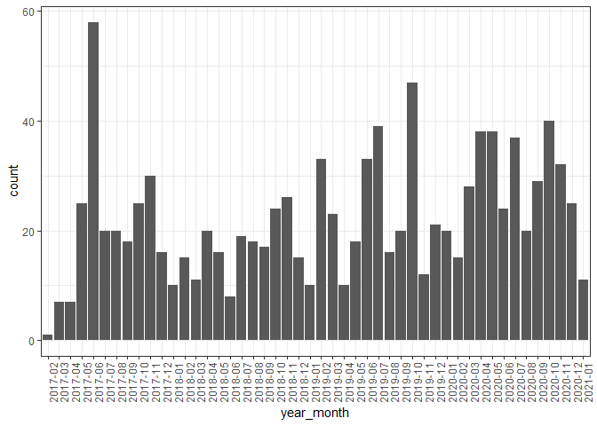
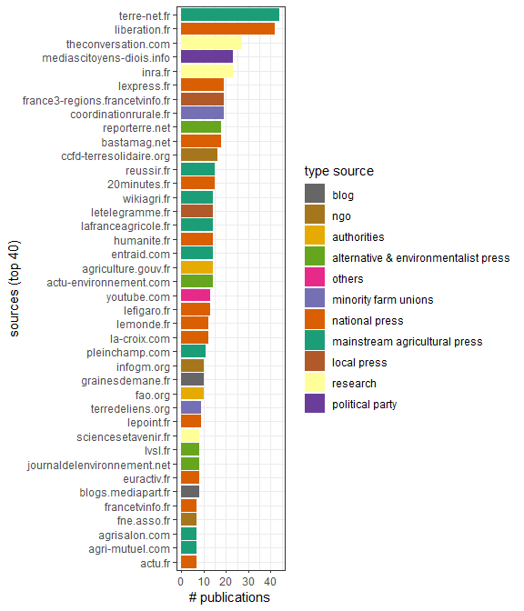
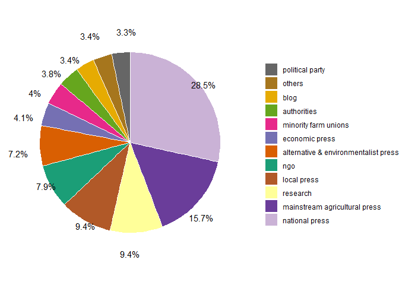
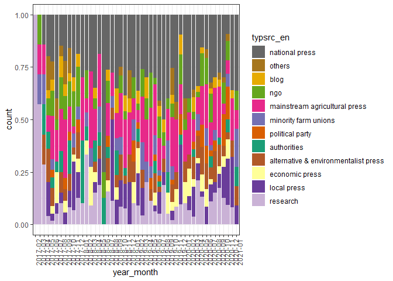
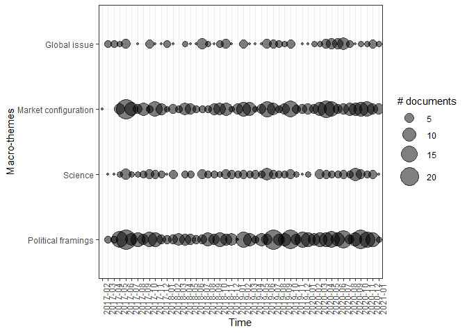
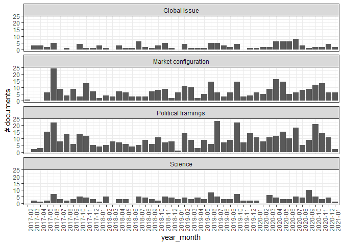
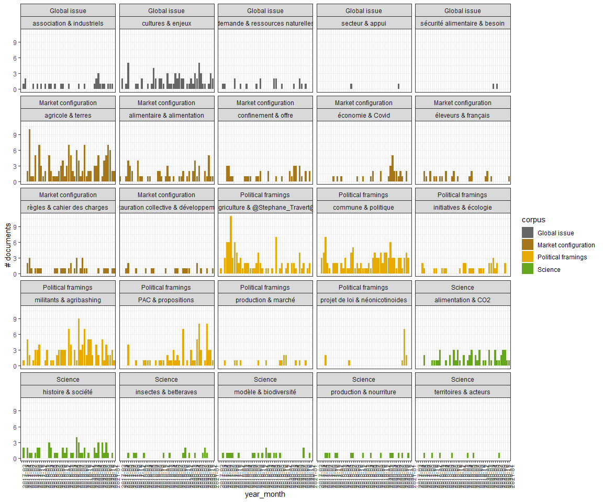

# Chargement des données
 On récupère les bases de données générées par CorText pour le corpus complet et les sous corpus par macro-thèmes. Puis, ces fichiers sont combinés et donnent des informations sur les thèmes macro et micro.
 


```
## Warning: package 'tidytext' was built under R version 4.0.5
```

```
## Connecting to db, and treating tables
```

```
## Finished!!
```

```
## NULL
```


```
## Connecting to db, and treating tables
```

```
## Finished!!
```

```
## Connecting to db, and treating tables
```

```
## Finished!!
```

```
## Connecting to db, and treating tables
```

```
## Finished!!
```

```
## Connecting to db, and treating tables
```

```
## Finished!!
```


# Results

## Description of Corpus

### Corpus dynamics
<!-- -->


### Sources
<!-- -->

<!-- -->


  

<!-- -->


## Macro themes
### synthesis

```{=html}
<div id="htmlwidget-4296516db49ea01c435a" style="width:100%;height:auto;" class="datatables html-widget"></div>
<script type="application/json" data-for="htmlwidget-4296516db49ea01c435a">{"x":{"filter":"top","filterHTML":"<tr>\n  <td><\/td>\n  <td data-type=\"character\" style=\"vertical-align: top;\">\n    <div class=\"form-group has-feedback\" style=\"margin-bottom: auto;\">\n      <input type=\"search\" placeholder=\"All\" class=\"form-control\" style=\"width: 100%;\"/>\n      <span class=\"glyphicon glyphicon-remove-circle form-control-feedback\"><\/span>\n    <\/div>\n  <\/td>\n  <td data-type=\"integer\" style=\"vertical-align: top;\">\n    <div class=\"form-group has-feedback\" style=\"margin-bottom: auto;\">\n      <input type=\"search\" placeholder=\"All\" class=\"form-control\" style=\"width: 100%;\"/>\n      <span class=\"glyphicon glyphicon-remove-circle form-control-feedback\"><\/span>\n    <\/div>\n    <div style=\"display: none; position: absolute; width: 200px;\">\n      <div data-min=\"90\" data-max=\"168\"><\/div>\n      <span style=\"float: left;\"><\/span>\n      <span style=\"float: right;\"><\/span>\n    <\/div>\n  <\/td>\n  <td data-type=\"integer\" style=\"vertical-align: top;\">\n    <div class=\"form-group has-feedback\" style=\"margin-bottom: auto;\">\n      <input type=\"search\" placeholder=\"All\" class=\"form-control\" style=\"width: 100%;\"/>\n      <span class=\"glyphicon glyphicon-remove-circle form-control-feedback\"><\/span>\n    <\/div>\n    <div style=\"display: none; position: absolute; width: 200px;\">\n      <div data-min=\"116\" data-max=\"454\"><\/div>\n      <span style=\"float: left;\"><\/span>\n      <span style=\"float: right;\"><\/span>\n    <\/div>\n  <\/td>\n  <td data-type=\"character\" style=\"vertical-align: top;\">\n    <div class=\"form-group has-feedback\" style=\"margin-bottom: auto;\">\n      <input type=\"search\" placeholder=\"All\" class=\"form-control\" style=\"width: 100%;\"/>\n      <span class=\"glyphicon glyphicon-remove-circle form-control-feedback\"><\/span>\n    <\/div>\n  <\/td>\n  <td data-type=\"character\" style=\"vertical-align: top;\">\n    <div class=\"form-group has-feedback\" style=\"margin-bottom: auto;\">\n      <input type=\"search\" placeholder=\"All\" class=\"form-control\" style=\"width: 100%;\"/>\n      <span class=\"glyphicon glyphicon-remove-circle form-control-feedback\"><\/span>\n    <\/div>\n  <\/td>\n  <td data-type=\"character\" style=\"vertical-align: top;\">\n    <div class=\"form-group has-feedback\" style=\"margin-bottom: auto;\">\n      <input type=\"search\" placeholder=\"All\" class=\"form-control\" style=\"width: 100%;\"/>\n      <span class=\"glyphicon glyphicon-remove-circle form-control-feedback\"><\/span>\n    <\/div>\n  <\/td>\n  <td data-type=\"character\" style=\"vertical-align: top;\">\n    <div class=\"form-group has-feedback\" style=\"margin-bottom: auto;\">\n      <input type=\"search\" placeholder=\"All\" class=\"form-control\" style=\"width: 100%;\"/>\n      <span class=\"glyphicon glyphicon-remove-circle form-control-feedback\"><\/span>\n    <\/div>\n  <\/td>\n<\/tr>","data":[["1","2","3","4"],["Global issue","Science","Political framings","Market configuration"],[93,90,168,141],[116,151,454,344],["défis; croissance; productivité; pays; opportunité; ressources; Sud; changement climatique; investissements; sécurité alimentaire","sols; rendements; cultures; espèces; scientifiques; plantes; biodiversité; chercheur-e-s; parcelles; engrais de synthèse","FNSEA; ministre de l'Agriculture; communiqué; président; bien-être animal; dossier; parole; députés; discussions; élu","producteurs; marques; réseau; consommateurs; agriculture bio; chiffre d'affaires; distributeurs; clients; affaires; achat"],["pays; agriculture; alimentation; production; produits; agricole; monde; économie; population; alimentaire","agriculture; sols; agriculture bio; biodiversité; cultures; agriculteurs; production; terres; eau; pesticides","agriculteurs; agriculture; France; PAC; alimentation; Coordination rurale; français; agricole; production; politique","agriculture bio; produits; agriculteurs; agriculture; production; alimentation; consommateurs; France; producteurs; alimentaire"],["@Jose_Graziano_Da_Silva@; ZLECAf; Directeur général de la FAO; Lestari Asri Jaya; FMI; maladies d'origine alimentaire; agriculteurs familiaux; Michelin; SIAM; Banque mondiale; disponibilité","AgriteRRIs; faune du sol; oiseaux; agriculture extensive; @Christian_Huyghe@; Analyse de Cycle de Vie; semis direct; CNRS; chauves-souris; ITAB","FNSEA; @Emmanuel_Macron@; députés; LREM; @Laurent_Pinatel@; vote; chef de l'État; préfète; jeunes agriculteurs; Fnab","cuma; @Yuna_Chiffoleau@; néo-paysans; SPG; Fnab; @Stephane_Linou@; prix du lait; HVE; agriculture du milieu; élevage biologique"],["@Jose_Graziano_Da_Silva@; ZLECAf; malnutrition; Afrique subsaharienne; insécurité alimentaire; FAO; pauvreté; continent africain; obésité; Sénégal","ITAB; Landes; espaces naturels; oiseaux; arbres; espèces; abeilles; agriculture de conservation; prairies; pollinisateurs","LREM; Pour une autre PAC; @Stephane_Travert@; @Nicolas_Hulot@; députés; chef de l'État; agribashing; FNE; porte-parole; @Emmanuel_Macron@","néo-paysans; cuma; magasins; marques; HVE; Danone; clients; poules; cahier des charges; produits biologiques"]],"container":"<table class=\"cell-border stripe\">\n  <thead>\n    <tr>\n      <th> <\/th>\n      <th>cluster<\/th>\n      <th>n_term<\/th>\n      <th>n_doc<\/th>\n      <th>top_terms_weight<\/th>\n      <th>top_term_freq<\/th>\n      <th>top_term_tfidf<\/th>\n      <th>top_term_specif_freq<\/th>\n    <\/tr>\n  <\/thead>\n<\/table>","options":{"autoWidth":true,"pageLength":5,"searchHighlight":true,"columnDefs":[{"className":"dt-right","targets":[2,3]},{"orderable":false,"targets":0}],"order":[],"orderClasses":false,"orderCellsTop":true,"lengthMenu":[5,10,25,50,100]}},"evals":[],"jsHooks":[]}</script>
```

### macro-clusters through time
<!-- -->

<div class="figure">

<p class="caption">(\#fig:macro_dyn_histo)Temporal distribution of documents per macro-themes</p>
</div>


## Micro themes (all)


### Synthesis

```{=html}
<div id="htmlwidget-36f111c6f06e301b0f74" style="width:100%;height:auto;" class="datatables html-widget"></div>
<script type="application/json" data-for="htmlwidget-36f111c6f06e301b0f74">{"x":{"filter":"top","filterHTML":"<tr>\n  <td><\/td>\n  <td data-type=\"character\" style=\"vertical-align: top;\">\n    <div class=\"form-group has-feedback\" style=\"margin-bottom: auto;\">\n      <input type=\"search\" placeholder=\"All\" class=\"form-control\" style=\"width: 100%;\"/>\n      <span class=\"glyphicon glyphicon-remove-circle form-control-feedback\"><\/span>\n    <\/div>\n  <\/td>\n  <td data-type=\"character\" style=\"vertical-align: top;\">\n    <div class=\"form-group has-feedback\" style=\"margin-bottom: auto;\">\n      <input type=\"search\" placeholder=\"All\" class=\"form-control\" style=\"width: 100%;\"/>\n      <span class=\"glyphicon glyphicon-remove-circle form-control-feedback\"><\/span>\n    <\/div>\n  <\/td>\n  <td data-type=\"character\" style=\"vertical-align: top;\">\n    <div class=\"form-group has-feedback\" style=\"margin-bottom: auto;\">\n      <input type=\"search\" placeholder=\"All\" class=\"form-control\" style=\"width: 100%;\"/>\n      <span class=\"glyphicon glyphicon-remove-circle form-control-feedback\"><\/span>\n    <\/div>\n  <\/td>\n  <td data-type=\"number\" style=\"vertical-align: top;\">\n    <div class=\"form-group has-feedback\" style=\"margin-bottom: auto;\">\n      <input type=\"search\" placeholder=\"All\" class=\"form-control\" style=\"width: 100%;\"/>\n      <span class=\"glyphicon glyphicon-remove-circle form-control-feedback\"><\/span>\n    <\/div>\n    <div style=\"display: none; position: absolute; width: 200px;\">\n      <div data-min=\"0.533470590114986\" data-max=\"0.988114665058232\" data-scale=\"15\"><\/div>\n      <span style=\"float: left;\"><\/span>\n      <span style=\"float: right;\"><\/span>\n    <\/div>\n  <\/td>\n  <td data-type=\"integer\" style=\"vertical-align: top;\">\n    <div class=\"form-group has-feedback\" style=\"margin-bottom: auto;\">\n      <input type=\"search\" placeholder=\"All\" class=\"form-control\" style=\"width: 100%;\"/>\n      <span class=\"glyphicon glyphicon-remove-circle form-control-feedback\"><\/span>\n    <\/div>\n    <div style=\"display: none; position: absolute; width: 200px;\">\n      <div data-min=\"14\" data-max=\"89\"><\/div>\n      <span style=\"float: left;\"><\/span>\n      <span style=\"float: right;\"><\/span>\n    <\/div>\n  <\/td>\n  <td data-type=\"integer\" style=\"vertical-align: top;\">\n    <div class=\"form-group has-feedback\" style=\"margin-bottom: auto;\">\n      <input type=\"search\" placeholder=\"All\" class=\"form-control\" style=\"width: 100%;\"/>\n      <span class=\"glyphicon glyphicon-remove-circle form-control-feedback\"><\/span>\n    <\/div>\n    <div style=\"display: none; position: absolute; width: 200px;\">\n      <div data-min=\"2\" data-max=\"133\"><\/div>\n      <span style=\"float: left;\"><\/span>\n      <span style=\"float: right;\"><\/span>\n    <\/div>\n  <\/td>\n  <td data-type=\"character\" style=\"vertical-align: top;\">\n    <div class=\"form-group has-feedback\" style=\"margin-bottom: auto;\">\n      <input type=\"search\" placeholder=\"All\" class=\"form-control\" style=\"width: 100%;\"/>\n      <span class=\"glyphicon glyphicon-remove-circle form-control-feedback\"><\/span>\n    <\/div>\n  <\/td>\n  <td data-type=\"character\" style=\"vertical-align: top;\">\n    <div class=\"form-group has-feedback\" style=\"margin-bottom: auto;\">\n      <input type=\"search\" placeholder=\"All\" class=\"form-control\" style=\"width: 100%;\"/>\n      <span class=\"glyphicon glyphicon-remove-circle form-control-feedback\"><\/span>\n    <\/div>\n  <\/td>\n  <td data-type=\"character\" style=\"vertical-align: top;\">\n    <div class=\"form-group has-feedback\" style=\"margin-bottom: auto;\">\n      <input type=\"search\" placeholder=\"All\" class=\"form-control\" style=\"width: 100%;\"/>\n      <span class=\"glyphicon glyphicon-remove-circle form-control-feedback\"><\/span>\n    <\/div>\n  <\/td>\n  <td data-type=\"character\" style=\"vertical-align: top;\">\n    <div class=\"form-group has-feedback\" style=\"margin-bottom: auto;\">\n      <input type=\"search\" placeholder=\"All\" class=\"form-control\" style=\"width: 100%;\"/>\n      <span class=\"glyphicon glyphicon-remove-circle form-control-feedback\"><\/span>\n    <\/div>\n  <\/td>\n  <td data-type=\"character\" style=\"vertical-align: top;\">\n    <div class=\"form-group has-feedback\" style=\"margin-bottom: auto;\">\n      <input type=\"search\" placeholder=\"All\" class=\"form-control\" style=\"width: 100%;\"/>\n      <span class=\"glyphicon glyphicon-remove-circle form-control-feedback\"><\/span>\n    <\/div>\n  <\/td>\n  <td data-type=\"character\" style=\"vertical-align: top;\">\n    <div class=\"form-group has-feedback\" style=\"margin-bottom: auto;\">\n      <input type=\"search\" placeholder=\"All\" class=\"form-control\" style=\"width: 100%;\"/>\n      <span class=\"glyphicon glyphicon-remove-circle form-control-feedback\"><\/span>\n    <\/div>\n  <\/td>\n  <td data-type=\"character\" style=\"vertical-align: top;\">\n    <div class=\"form-group has-feedback\" style=\"margin-bottom: auto;\">\n      <input type=\"search\" placeholder=\"All\" class=\"form-control\" style=\"width: 100%;\"/>\n      <span class=\"glyphicon glyphicon-remove-circle form-control-feedback\"><\/span>\n    <\/div>\n  <\/td>\n<\/tr>","data":[["1","2","3","4","5","6","7","8","9","10","11","12","13","14","15","16","17","18","19","20","21","22","23","24","25"],["commune &amp; politique","agriculture &amp; @Stephane_Travert@","initiatives &amp; écologie","militants &amp; agribashing","projet de loi &amp; néonicotinoides","PAC &amp; propositions","production &amp; marché","alimentation &amp; CO2","histoire &amp; société","insectes &amp; betteraves","modèle &amp; biodiversité","production &amp; nourriture","territoires &amp; acteurs","agricole &amp; terres","restauration collective &amp; développement","alimentaire &amp; alimentation","confinement &amp; offre","règles &amp; cahier des charges","économie &amp; Covid","éleveurs &amp; français","cultures &amp; enjeux","demande &amp; ressources naturelles","secteur &amp; appui","association &amp; industriels","sécurité alimentaire &amp; besoin"],["commune - politique","initiatives - néonicotinoides - agriculture - projet de loi - @Stephane_Travert@","initiatives - néonicotinoides - agriculture - projet de loi - @Stephane_Travert@","initiatives - néonicotinoides - agriculture - projet de loi - @Stephane_Travert@","initiatives - néonicotinoides - agriculture - projet de loi - @Stephane_Travert@","PAC - propositions","production - marché","alimentation - CO2","histoire - société","insectes - betteraves","production - biodiversité - nourriture - modèle","production - biodiversité - nourriture - modèle","territoires - acteurs","agricole - restauration collective - terres - développement","agricole - restauration collective - terres - développement","alimentaire - alimentation","confinement - cahier des charges - règles - offre","confinement - cahier des charges - règles - offre","économie - Covid","français - éleveurs","cultures - enjeux","demande - ressources naturelles","secteur - appui","sécurité alimentaire - besoin - association - industriels","sécurité alimentaire - besoin - association - industriels"],["politique; commune; problème; journaliste; exploitants; question; société; français; France; cultures","@Stephane_Travert@; agriculture; EGAlim; filière; ateliers; mise en place; producteurs; chef de l'État; ministre de l'Agriculture; acteurs","écologie; initiatives; villes; EELV; monde; création; action; environnement; énergie; Paris","agribashing; militants; consommateurs; association; écologiste; FNSEA; agriculteurs; élevage; pesticides de synthèse; animaux","projet de loi; néonicotinoides; biodiversité; interdiction; dérogations; vote; députés; majorité; nouveaux; texte","PAC; propositions; réforme; aides; États membres; Parlement européen; Commission; négociations; budget; dispositifs","production; marché; défis; France insoumise; transition; transition de l'agriculture; Europe; exportations; concurrence; prix","alimentation; CO2; carbone; élevage; végétaux; plan; animaux; viande; gaz à effet de serre; forêts","société; histoire; science; rente; question; industriels; savoirs; glyphosate; développement; pratiques","insectes; betteraves; président; néonicotinoides; producteurs; champs; plantes; abeilles; pesticides de synthèse; pesticides","modèle; biodiversité; inra; surface agricole; réduction; français; production agricole; agriculture intensive; paysages; Landes","nourriture; production; alimentaire; prix; croissance; fermes; engrais de synthèse; pays; population; région","territoires; acteurs; gestion; économie; eau; scénarios; Coordination rurale; changement; zones; groupe","terres; agricole; formation; Coordination rurale; cultures; paysans; paysannes; sols; savoirs; installation","développement; restauration collective; acteurs; action; objectif; outils; proximité; investissements; produits biologiques; recherche","alimentation; alimentaire; population; enjeux; systèmes alimentaires; société; santé; choix; politique; alternatives","confinement; offre; achat; affaires; président; consommateurs; crise; grande distribution; magasins; produits","règles; cahier des charges; label; techniques; agriculture bio; organisations; européen; normes; pratiques; réseau","Covid; économie; production; marché; pays; filière; croissance; entreprises; secteur; écologie","éleveurs; français; lait; revenu; vaches; France; viande; prix; importations; élevage","cultures; enjeux; techniques; modèle; projet; organisations; règles; paysans; agroécologie; usage","ressources naturelles; demande; changement; conflit; évolution; concurrence; pauvreté; productivité; revenu; défis","appui; secteur; stratégie; valorisation; ruralité; jeunes; petits producteurs; valeur; agriculture familiale; exploitations","industriels; association; France; échelle; territoires; capacité; acteurs; espaces; scientifiques; système","besoin; sécurité alimentaire; européen; priorité; crise; relations; monde; approvisionnement; prix; importations"],[0.946900188727169,0.837132274843265,0.637273929835899,0.830423616076611,0.869129734745285,0.952264457670994,0.737106881840453,0.905592433513574,0.907015840506596,0.914549227473878,0.975020132514172,0.795276119298965,0.893414058998976,0.931602727454332,0.730815641412766,0.92721306827529,0.850539331432733,0.968079946827866,0.784407251601403,0.932945180300125,0.757770406904701,0.988114665058231,0.557053011544945,0.723139846442576,0.533470590114986],[46,43,30,51,16,33,18,31,32,18,26,17,19,32,18,26,20,17,20,14,89,48,23,64,22],[112,95,31,115,13,69,15,55,52,15,20,15,7,133,19,57,37,34,29,23,69,19,2,27,2],["2017-04","2017-03","2017-05","2017-03","2017-06","2017-06","2017-05","2017-06","2017-03","2017-06","2017-04","2017-06","2017-06","2017-05","2017-05","2017-02","2017-06","2017-05","2017-10","2017-06","2017-03","2017-04","2018-07","2017-03","2020-05"],["2020-12","2020-12","2020-11","2021-01","2020-11","2021-01","2020-10","2021-01","2020-12","2020-10","2020-12","2020-12","2020-08","2021-01","2021-01","2021-01","2020-12","2021-01","2020-11","2021-01","2021-01","2020-10","2020-07","2020-12","2020-07"],["2019-04","2018-08","2019-06","2019-04","2020-02","2019-11","2019-04","2019-06","2019-03","2019-06","2018-12","2019-02","2018-10","2019-04","2019-04","2019-03","2019-04","2019-01","2019-11","2018-10","2019-05","2019-02","2019-07","2019-04","2020-06"],["France; agriculteurs; agriculture; français; terres; agricole; politique; pays; question; projet; État","agriculture; agriculteurs; alimentation; EGAlim; gouvernement; France; Coordination rurale; président; filière; français","écologie; monde; Coordination rurale; France; environnement; agriculteurs; politique; action; programme; agriculture","agriculteurs; agriculture; France; FNSEA; pesticides; élevage; agribashing; association; Coordination rurale; consommateurs; environnement","néonicotinoides; dérogations; betteraves; projet de loi; filière; biodiversité; interdiction; députés; pesticides; vote","PAC; agriculture; agriculteurs; propositions; aides; européen; Union européenne; réforme; Commission; environnement","production; marché; agriculture; agriculteurs; France; Europe; agricole; européen; changement; politique","sols; agriculture; plan; cultures; alimentation; terres; animaux; biodiversité; production; élevage","agriculteurs; agriculture; glyphosate; agroécologie; produits; agriculture bio; cultures; monde; sols; OGM; terres","pesticides; abeilles; néonicotinoides; betteraves; plantes; agriculteurs; pollinisateurs; chercheur-e-s; solutions; insectes; agriculture; cultures; France","biodiversité; agriculture bio; Landes; modèle; agriculture; rendements; production; inra; France; agroécologie","production; agriculteurs; agriculture bio; agriculture; cultures; agricole; énergie; rendements; fermes; sols","eau; scénarios; sols; agriculteurs; acteurs; retenues; cultures; cours d'eau; économie; agriculture; projet; territoires","agriculteurs; agriculture; paysans; agriculture bio; fermes; projet; production; agricole; terres; Coordination rurale; produits","agriculture bio; développement; restauration collective; producteurs; circuits courts; territoires; consommateurs; produits biologiques; alimentation; produits","alimentation; alimentaire; produits; consommateurs; agriculture bio; production; système; agriculture; environnement; politique","consommateurs; produits; agriculture bio; grande distribution; magasins; crise; producteurs; agriculteurs; marché; prix","agriculture bio; agriculteurs; consommateurs; producteurs; produits; cahier des charges; production; France; exploitations; marché","production; marché; économie; produits; pays; agriculture; France; Covid; prix; entreprises","lait; éleveurs; prix; produits; producteurs; élevage; viande; France; production; agriculture bio","agriculture; pays; production; produits; continent africain; agricole; développement; terres; monde; économie","alimentation; pays; agriculture; FAO; personnes; revenu; production; faim; alimentaire; produits","agriculture; agricole; jeunes; ruralité; secteur; pays; valeur; développement; eau; opportunité; système","alimentaire; alimentation; systèmes alimentaires; économie; système; population; production; villes; produits; France; agriculture","pays; monde; Covid; sécurité alimentaire; alimentaire; approvisionnement; politique; besoin; personnes; produits"],["Safer; Côte d'Ivoire; ferme urbaine; méthanisation; Chine; @Emmanuel_Hyest@; personnes; groupe Doux; société agricole; projet","EGAlim; @Stephane_Travert@; ateliers; ministre; États généraux; @Serge_Papin@; premier chantier; filières alimentaires; développement agricole; @Didier_Guillaume@","MST; Nantes Food Forum; Shift Project; film; EELV; @Cyril_Dion@; réforme agraire; @Julien_Bayou@; Fédération des Parcs; porcherie industrielle","végans; FNSEA; animaliste; agribashing; L214; @Paul_Francois@; personnes; éleveurs; mouvement animaliste; viande in vitro","néonicotinoides; dérogations; betteraves; pollinisateurs; @Sophie_Primas@; @Yannick_Kerlogot@; amendement; projet de loi; affaires économiques; @Joel_Labbe@","Pacte vert; propositions; Parlement européen; paiement; Pour une autre PAC; MAE; plan stratégique national; France Stratégie; États membres; Farm to Fork","sucres spéciaux; CGPER; CETA; fin des quotas; Thaïlande; Snetap-FSU; Canada; BASF; coopératives; paysans","méthanisation; carbone; CO2; régimes alimentaires; végans; GIEC; nutritionnellement; assiette; produits animaux; soja","dattes; justice; Monsanto; réforme agraire; soja; semences paysannes; OGM; pensée; combat; capitalisme","néonicotinoides; pollinisateurs; AFBV; @Vincent_Bretagnolle@; apiculteurs; @Erik_Fyrwald@; betteraves; Ruche; miel; Syngenta","Landes; agriculture extensive; Analyse de Cycle de Vie; ITAB; AgriteRRIs; espaces naturels; Agribalyse; SDHI; Farm to Fork; plan Ecophyto","Cuba; Terre de Liens; paysans; production d'énergie; OMC; énergie; aquaponie; fermiers; salades; épidémie; fermes verticales","projets de territoire; retenues; acceptabilité sociale; cours d'eau; ZAD; soutien; simulations; assolements; haute valeur; localisation; Saône-et-Loire","agriculture urbaine; aucy; milieu agricole; néo-paysans; toits; repreneurs; HCF; cuma; paysannes; Gaspard d'Allens","conseil régional; @Yuna_Chiffoleau@; Grand Plan d'Investissement; filière nutrition animale; @Prince_De_Bretagne@; PAT; captage; Ambition Bio; contenu de nos assiettes; @Jean_Yves_Mano@; @Max_Havelaar@; CLCV; Conseil constitutionnel","Sécurité sociale alimentaire; démocratie alimentaire; mangeurs bio; régimes alimentaires; comportements alimentaires; @Nicolas_Bricas@; Agribalyse; systèmes alimentaires; PAT; précarité","franchise; Euralis; PCF; confinement; @Arnaud_Gauffier@; @Yuna_Chiffoleau@; transition alimentaire; guerre des prix; Migros; parts de marché","Nature et Progrès; @Benoit_Leroux@; SPG; IFOAM; Conseil des ministres; HVE; cuma; agriculture conventionnelle; Agriculture raisonnée; vin naturel","agent pathogène; métaldéhyde; ALECA; pandémie; Pacte vert; CDC; épidémie; déforestation; In Vivo; Think Tank","agriculture cellulaire; production laitière; L214; @Brigitte_Gothiere@; filière porcine; fromagerie; protéines végétales; montagne; nouveaux débouchés; cheptel; laiteries; troupeau","Syngenta; droits de douane; pesticides; ZLECAf; continent africain; monde; agriculture africaine; fermiers; agrocarburant; transition","@Jose_Graziano_Da_Silva@; FAO; conflit; intermédiaires; Directeur général de la FAO; faim; monde; habitants; étude; régimes alimentaires","installation des jeunes agriculteurs; montée en gamme; soutiens publics; chômage; acteur majeur; agriculture de qualité; aides agricoles; céréaliers; filière agroalimentaire; huiles végétales; marché européen; quotas; vrac","espaces; systèmes alimentaires; @Stephane_Linou@; mangeurs; agronome; résilience alimentaire; jardins; agriculture urbaine; écologiste; cohabitation","monde; approvisionnement; Agriculture résiliente; amis; arrêt; chaîne d'approvisionnement; livraison; recherche agronomique; insécurité alimentaire; Facebook; mécanismes de régulation; Panel international d'experts sur les systèmes alimentaires durables; portefeuille; Roumanie"],["Safer; terres agricoles; Chine; terres; France; pays; hectares; Côte d'Ivoire; population; cultures","EGAlim; @Stephane_Travert@; ateliers; chef de l'État; ministre; ministre de l'Agriculture; filière; alimentation; agriculture; distributeurs","écologie; EELV; programme; monde; initiatives; OGM; villes; énergie; emplois; film","végans; L214; agribashing; militants; viande; FNSEA; animaux; élevage; agriculteurs; Confédération paysanne","néonicotinoides; betteraves; pollinisateurs; dérogations; abeilles; projet de loi; Sénat; amendement; interdiction; filière","Pacte vert; Pour une autre PAC; eurodéputés; Parlement européen; paiement; pilier; États membres; PAC; réforme; Commission européenne","production; marché; productivité; défis; CETA; fin des quotas; Europe; BASF; coopératives; France insoumise","carbone; viande; élevage; animaux; planète; plan; alimentation; CO2; méthanisation; régimes alimentaires","Monsanto; glyphosate; OGM; variétés; justice; dattes; pratiques; herbicide; agroécologie; histoire","néonicotinoides; betteraves; abeilles; pollinisateurs; pesticides; apiculteurs; Ruche; pesticides de synthèse; insectes; usage","agriculture extensive; Landes; ITAB; espaces naturels; biodiversité; modèle; agriculture bio; Analyse de Cycle de Vie; surface agricole; inra","production; énergie; fermes; nourriture; Terre de Liens; production d'énergie; aquaponie; Chine; prix; salades","retenues; cours d'eau; scénarios; eau; acteurs; soutien; simulations; consommation d'eau; gestion; collectifs","agriculture urbaine; installation; agroécologie; terres; paysans; fermes; projet; agriculteurs; agriculture; néo-paysans","restauration collective; restauration; produits biologiques; développement; circuits courts; territoires; cuisine; production biologique; @Prince_De_Bretagne@; proximité","Sécurité sociale alimentaire; systèmes alimentaires; santé; alimentation; alimentaire; consommation; mangeurs; politique; manger; démocratie alimentaire","magasins; confinement; grande distribution; consommateurs; clients; crise; Carrefour; franchise; offre; parts de marché","SPG; Nature et Progrès; cahier des charges; HVE; OGM; label; agriculture bio; agriculture conventionnelle; @Benoit_Leroux@; IFOAM","agent pathogène; épidémie; pandémie; Covid; pays; marché; exportations; économie; métaldéhyde; In Vivo","agriculture cellulaire; lait; viande; éleveurs; porcs; élevage; Chine; vaches; Allemagne; prix","continent africain; solutions; pesticides; projet; terres; ONG; continent; paysans; Syngenta; agroécologie","FAO; revenu; alimentation; faim; @Jose_Graziano_Da_Silva@; personnes; croissance; intermédiaires; Argentine; conflit","jeunes; ruralité; opportunité; agricole; Sénégal; Banque mondiale; agriculture; femmes; emplois; valorisation","villes; systèmes alimentaires; échelle; jardins; territoires; agriculture urbaine; @Stephane_Linou@; mangeurs; autonomie; collectivités","Covid; approvisionnement; sécurité alimentaire; monde; chaîne d'approvisionnement; pays; variétés; besoin; insécurité alimentaire; alimentaire"],["Political framings","Political framings","Political framings","Political framings","Political framings","Political framings","Political framings","Science","Science","Science","Science","Science","Science","Market configuration","Market configuration","Market configuration","Market configuration","Market configuration","Market configuration","Market configuration","Global issue","Global issue","Global issue","Global issue","Global issue"]],"container":"<table class=\"cell-border stripe\">\n  <thead>\n    <tr>\n      <th> <\/th>\n      <th>cluster<\/th>\n      <th>suprathematique_label<\/th>\n      <th>top_terms_weight<\/th>\n      <th>density<\/th>\n      <th>n_term<\/th>\n      <th>n_doc<\/th>\n      <th>begin<\/th>\n      <th>end<\/th>\n      <th>mean_time<\/th>\n      <th>top_term_freq<\/th>\n      <th>top_term_tfidf<\/th>\n      <th>top_term_specif_freq<\/th>\n      <th>macro_cluster_label_new<\/th>\n    <\/tr>\n  <\/thead>\n<\/table>","options":{"autoWidth":true,"digits":1,"columnDefs":[{"targets":4,"render":"function(data, type, row, meta) {\n    return type !== 'display' ? data : DTWidget.formatRound(data, 2, 3, \",\", \".\");\n  }"},{"className":"dt-right","targets":[4,5,6]},{"orderable":false,"targets":0}],"order":[],"orderClasses":false,"orderCellsTop":true}},"evals":["options.columnDefs.0.render"],"jsHooks":[]}</script>
```

### clusters through time
<div class="figure">

<p class="caption">(\#fig:micro_themes_dyn)Temporal distribution of documents by micro-themes</p>
</div>


### Most representative documents

```{=html}
<div id="htmlwidget-a2c05c73134ad8f20a1f" style="width:100%;height:auto;" class="datatables html-widget"></div>
<script type="application/json" data-for="htmlwidget-a2c05c73134ad8f20a1f">{"x":{"filter":"top","filterHTML":"<tr>\n  <td><\/td>\n  <td data-type=\"character\" style=\"vertical-align: top;\">\n    <div class=\"form-group has-feedback\" style=\"margin-bottom: auto;\">\n      <input type=\"search\" placeholder=\"All\" class=\"form-control\" style=\"width: 100%;\"/>\n      <span class=\"glyphicon glyphicon-remove-circle form-control-feedback\"><\/span>\n    <\/div>\n  <\/td>\n  <td data-type=\"number\" style=\"vertical-align: top;\">\n    <div class=\"form-group has-feedback\" style=\"margin-bottom: auto;\">\n      <input type=\"search\" placeholder=\"All\" class=\"form-control\" style=\"width: 100%;\"/>\n      <span class=\"glyphicon glyphicon-remove-circle form-control-feedback\"><\/span>\n    <\/div>\n    <div style=\"display: none; position: absolute; width: 200px;\">\n      <div data-min=\"156.084308221361\" data-max=\"10537.3639037243\" data-scale=\"13\"><\/div>\n      <span style=\"float: left;\"><\/span>\n      <span style=\"float: right;\"><\/span>\n    <\/div>\n  <\/td>\n  <td data-type=\"date\" style=\"vertical-align: top;\">\n    <div class=\"form-group has-feedback\" style=\"margin-bottom: auto;\">\n      <input type=\"search\" placeholder=\"All\" class=\"form-control\" style=\"width: 100%;\"/>\n      <span class=\"glyphicon glyphicon-remove-circle form-control-feedback\"><\/span>\n    <\/div>\n    <div style=\"display: none; position: absolute; width: 200px;\">\n      <div data-min=\"1492473600000\" data-max=\"1609372800000\"><\/div>\n      <span style=\"float: left;\"><\/span>\n      <span style=\"float: right;\"><\/span>\n    <\/div>\n  <\/td>\n  <td data-type=\"character\" style=\"vertical-align: top;\">\n    <div class=\"form-group has-feedback\" style=\"margin-bottom: auto;\">\n      <input type=\"search\" placeholder=\"All\" class=\"form-control\" style=\"width: 100%;\"/>\n      <span class=\"glyphicon glyphicon-remove-circle form-control-feedback\"><\/span>\n    <\/div>\n  <\/td>\n  <td data-type=\"character\" style=\"vertical-align: top;\">\n    <div class=\"form-group has-feedback\" style=\"margin-bottom: auto;\">\n      <input type=\"search\" placeholder=\"All\" class=\"form-control\" style=\"width: 100%;\"/>\n      <span class=\"glyphicon glyphicon-remove-circle form-control-feedback\"><\/span>\n    <\/div>\n  <\/td>\n  <td data-type=\"character\" style=\"vertical-align: top;\">\n    <div class=\"form-group has-feedback\" style=\"margin-bottom: auto;\">\n      <input type=\"search\" placeholder=\"All\" class=\"form-control\" style=\"width: 100%;\"/>\n      <span class=\"glyphicon glyphicon-remove-circle form-control-feedback\"><\/span>\n    <\/div>\n  <\/td>\n  <td data-type=\"character\" style=\"vertical-align: top;\">\n    <div class=\"form-group has-feedback\" style=\"margin-bottom: auto;\">\n      <input type=\"search\" placeholder=\"All\" class=\"form-control\" style=\"width: 100%;\"/>\n      <span class=\"glyphicon glyphicon-remove-circle form-control-feedback\"><\/span>\n    <\/div>\n  <\/td>\n  <td data-type=\"character\" style=\"vertical-align: top;\">\n    <div class=\"form-group has-feedback\" style=\"margin-bottom: auto;\">\n      <input type=\"search\" placeholder=\"All\" class=\"form-control\" style=\"width: 100%;\"/>\n      <span class=\"glyphicon glyphicon-remove-circle form-control-feedback\"><\/span>\n    <\/div>\n  <\/td>\n  <td data-type=\"character\" style=\"vertical-align: top;\">\n    <div class=\"form-group has-feedback\" style=\"margin-bottom: auto;\">\n      <input type=\"search\" placeholder=\"All\" class=\"form-control\" style=\"width: 100%;\"/>\n      <span class=\"glyphicon glyphicon-remove-circle form-control-feedback\"><\/span>\n    <\/div>\n  <\/td>\n  <td data-type=\"character\" style=\"vertical-align: top;\">\n    <div class=\"form-group has-feedback\" style=\"margin-bottom: auto;\">\n      <input type=\"search\" placeholder=\"All\" class=\"form-control\" style=\"width: 100%;\"/>\n      <span class=\"glyphicon glyphicon-remove-circle form-control-feedback\"><\/span>\n    <\/div>\n  <\/td>\n<\/tr>","data":[["1","2","3","4","5","6","7","8","9","10","11","12","13","14","15","16","17","18","19","20","21","22","23","24","25","26","27","28","29","30","31","32","33","34","35","36","37","38","39","40","41","42","43","44","45","46","47","48","49","50","51","52","53","54","55","56","57","58","59","60","61","62","63","64","65","66","67","68","69","70","71","72","73","74","75","76","77","78","79","80","81","82","83","84","85","86","87","88","89","90","91","92","93","94","95","96","97","98","99","100","101","102","103","104","105","106","107","108","109","110","111","112","113","114","115","116","117","118","119","120","121","122","123","124","125","126","127","128","129","130","131","132","133","134","135","136","137","138","139","140","141","142","143","144","145","146","147","148","149","150","151","152","153","154","155","156","157","158","159","160","161","162","163","164","165","166","167","168","169","170","171","172","173","174","175","176","177","178","179","180","181","182","183","184","185","186","187","188","189","190","191","192","193","194","195","196","197","198","199","200","201","202","203","204","205","206","207","208","209","210","211","212","213","214","215","216","217","218","219","220","221","222","223","224","225","226","227","228","229","230","231","232","233","234","235","236","237","238","239","240","241","242","243","244","245","246","247","248","249","250","251","252","253","254","255","256","257","258","259","260","261","262","263","264","265","266","267","268","269","270","271","272","273","274","275","276","277","278","279","280","281","282","283","284","285","286","287","288","289","290","291","292","293","294","295","296","297","298","299","300","301","302","303","304","305","306","307","308","309","310","311","312","313","314","315","316","317","318","319","320","321","322","323","324","325","326","327","328","329","330","331","332","333","334","335","336","337","338","339","340","341","342","343","344","345","346","347","348","349","350","351","352","353","354","355","356","357","358","359","360","361","362","363","364","365","366","367","368","369","370","371","372","373","374","375","376","377","378","379","380","381","382","383","384","385","386","387","388","389","390","391","392","393","394","395","396","397","398","399","400","401","402","403","404","405","406","407","408","409","410","411","412","413","414","415","416","417","418","419","420","421","422","423","424","425","426","427","428","429","430","431","432","433","434","435","436","437","438","439","440","441","442","443","444","445","446","447","448","449","450","451","452","453","454","455","456","457","458","459","460","461","462","463","464","465","466","467","468","469","470","471","472","473","474","475","476","477","478","479","480","481","482","483","484","485","486","487","488","489","490","491","492","493","494","495","496","497","498","499","500","501","502","503","504","505","506","507","508","509","510","511","512","513","514","515","516","517","518","519","520","521","522","523","524","525","526","527","528","529","530","531","532","533","534","535","536","537","538","539","540","541","542","543","544","545","546","547","548","549","550","551","552","553","554","555","556","557","558","559","560","561","562","563","564","565","566","567","568","569","570","571","572","573","574","575","576","577","578","579","580","581","582","583","584","585","586","587","588","589","590","591","592","593","594","595","596","597","598","599","600","601","602","603","604","605","606","607","608","609","610","611","612","613","614","615","616","617","618","619","620","621","622","623","624","625","626","627","628","629","630","631","632","633","634","635","636","637","638","639","640","641","642","643","644","645","646","647","648","649","650","651","652","653","654","655","656","657","658","659","660","661","662","663","664","665","666","667","668","669","670","671","672","673","674","675","676","677","678","679","680","681","682","683","684","685","686","687","688","689","690","691","692","693","694","695","696","697","698","699","700","701","702","703","704","705","706","707","708","709","710","711","712","713","714","715","716","717","718","719","720","721","722","723","724","725","726","727","728","729","730","731","732","733","734","735","736","737","738","739","740","741","742","743","744","745","746","747","748","749","750","751","752","753","754","755","756","757","758","759","760","761","762","763","764","765","766","767","768","769","770","771","772","773","774","775","776","777","778","779","780","781","782","783","784","785","786","787","788","789","790","791","792","793","794","795","796","797","798","799","800","801","802","803","804","805","806","807","808","809","810","811","812","813","814","815","816","817","818","819","820","821","822","823","824","825","826","827","828","829","830","831","832","833","834","835","836","837","838","839","840","841","842","843","844","845","846","847","848","849","850","851","852","853","854","855","856","857","858","859","860","861","862","863","864","865","866","867","868","869","870","871","872","873","874","875","876","877","878","879","880","881","882","883","884","885","886","887","888","889","890","891","892","893","894","895","896","897","898","899","900","901","902","903","904","905","906","907","908","909","910","911","912","913","914","915","916","917","918","919","920","921","922","923","924","925","926","927","928","929","930","931","932","933","934","935","936","937","938","939","940","941","942","943","944","945","946","947","948","949","950","951","952","953","954","955","956","957","958","959","960","961","962","963","964","965","966","967","968","969","970","971","972","973","974","975","976","977","978","979","980","981","982","983","984","985","986","987","988","989","990","991","992","993","994","995","996","997","998","999","1000","1001","1002","1003","1004","1005","1006","1007","1008","1009","1010","1011","1012","1013","1014","1015","1016","1017","1018","1019","1020","1021","1022","1023","1024","1025","1026","1027","1028","1029","1030","1031","1032","1033","1034","1035","1036","1037","1038","1039","1040","1041","1042","1043","1044","1045","1046","1047","1048","1049","1050","1051","1052","1053","1054","1055","1056","1057","1058","1059","1060","1061","1062","1063","1064","1065"],["agriculture &amp; @Stephane_Travert@","agriculture &amp; @Stephane_Travert@","agriculture &amp; @Stephane_Travert@","agriculture &amp; @Stephane_Travert@","agriculture &amp; @Stephane_Travert@","commune &amp; politique","commune &amp; politique","commune &amp; politique","commune &amp; politique","commune &amp; politique","initiatives &amp; écologie","initiatives &amp; écologie","initiatives &amp; écologie","initiatives &amp; écologie","initiatives &amp; écologie","militants &amp; agribashing","militants &amp; agribashing","militants &amp; agribashing","militants &amp; agribashing","militants &amp; agribashing","PAC &amp; propositions","PAC &amp; propositions","PAC &amp; propositions","PAC &amp; propositions","PAC &amp; propositions","production &amp; marché","production &amp; marché","production &amp; marché","production &amp; marché","production &amp; marché","projet de loi &amp; néonicotinoides","projet de loi &amp; néonicotinoides","projet de loi &amp; néonicotinoides","projet de loi &amp; néonicotinoides","projet de loi &amp; néonicotinoides","alimentation &amp; CO2","alimentation &amp; CO2","alimentation &amp; CO2","alimentation &amp; CO2","alimentation &amp; CO2","histoire &amp; société","histoire &amp; société","histoire &amp; société","histoire &amp; société","histoire &amp; société","insectes &amp; betteraves","insectes &amp; betteraves","insectes &amp; betteraves","insectes &amp; betteraves","insectes &amp; betteraves","modèle &amp; biodiversité","modèle &amp; biodiversité","modèle &amp; biodiversité","modèle &amp; biodiversité","modèle &amp; biodiversité","production &amp; nourriture","production &amp; nourriture","production &amp; nourriture","production &amp; nourriture","production &amp; nourriture","territoires &amp; acteurs","territoires &amp; acteurs","territoires &amp; acteurs","territoires &amp; acteurs","territoires &amp; acteurs","agricole &amp; terres","agricole &amp; terres","agricole &amp; terres","agricole &amp; terres","agricole &amp; terres","alimentaire &amp; alimentation","alimentaire &amp; alimentation","alimentaire &amp; alimentation","alimentaire &amp; alimentation","alimentaire &amp; alimentation","confinement &amp; offre","confinement &amp; offre","confinement &amp; offre","confinement &amp; offre","confinement &amp; offre","économie &amp; Covid","économie &amp; Covid","économie &amp; Covid","économie &amp; Covid","économie &amp; Covid","éleveurs &amp; français","éleveurs &amp; français","éleveurs &amp; français","éleveurs &amp; français","éleveurs &amp; français","règles &amp; cahier des charges","règles &amp; cahier des charges","règles &amp; cahier des charges","règles &amp; cahier des charges","règles &amp; cahier des charges","restauration collective &amp; développement","restauration collective &amp; développement","restauration collective &amp; développement","restauration collective &amp; développement","restauration collective &amp; développement","association &amp; industriels","association &amp; industriels","association &amp; industriels","association &amp; industriels","association &amp; industriels","cultures &amp; enjeux","cultures &amp; enjeux","cultures &amp; enjeux","cultures &amp; enjeux","cultures &amp; enjeux","demande &amp; ressources naturelles","demande &amp; ressources naturelles","demande &amp; ressources naturelles","demande &amp; ressources naturelles","demande &amp; ressources naturelles","secteur &amp; appui","secteur &amp; appui","sécurité alimentaire &amp; besoin","sécurité alimentaire &amp; besoin",null,null,null,null,null,null,null,null,null,null,null,null,null,null,null,null,null,null,null,null,null,null,null,null,null,null,null,null,null,null,null,null,null,null,null,null,null,null,null,null,null,null,null,null,null,null,null,null,null,null,null,null,null,null,null,null,null,null,null,null,null,null,null,null,null,null,null,null,null,null,null,null,null,null,null,null,null,null,null,null,null,null,null,null,null,null,null,null,null,null,null,null,null,null,null,null,null,null,null,null,null,null,null,null,null,null,null,null,null,null,null,null,null,null,null,null,null,null,null,null,null,null,null,null,null,null,null,null,null,null,null,null,null,null,null,null,null,null,null,null,null,null,null,null,null,null,null,null,null,null,null,null,null,null,null,null,null,null,null,null,null,null,null,null,null,null,null,null,null,null,null,null,null,null,null,null,null,null,null,null,null,null,null,null,null,null,null,null,null,null,null,null,null,null,null,null,null,null,null,null,null,null,null,null,null,null,null,null,null,null,null,null,null,null,null,null,null,null,null,null,null,null,null,null,null,null,null,null,null,null,null,null,null,null,null,null,null,null,null,null,null,null,null,null,null,null,null,null,null,null,null,null,null,null,null,null,null,null,null,null,null,null,null,null,null,null,null,null,null,null,null,null,null,null,null,null,null,null,null,null,null,null,null,null,null,null,null,null,null,null,null,null,null,null,null,null,null,null,null,null,null,null,null,null,null,null,null,null,null,null,null,null,null,null,null,null,null,null,null,null,null,null,null,null,null,null,null,null,null,null,null,null,null,null,null,null,null,null,null,null,null,null,null,null,null,null,null,null,null,null,null,null,null,null,null,null,null,null,null,null,null,null,null,null,null,null,null,null,null,null,null,null,null,null,null,null,null,null,null,null,null,null,null,null,null,null,null,null,null,null,null,null,null,null,null,null,null,null,null,null,null,null,null,null,null,null,null,null,null,null,null,null,null,null,null,null,null,null,null,null,null,null,null,null,null,null,null,null,null,null,null,null,null,null,null,null,null,null,null,null,null,null,null,null,null,null,null,null,null,null,null,null,null,null,null,null,null,null,null,null,null,null,null,null,null,null,null,null,null,null,null,null,null,null,null,null,null,null,null,null,null,null,null,null,null,null,null,null,null,null,null,null,null,null,null,null,null,null,null,null,null,null,null,null,null,null,null,null,null,null,null,null,null,null,null,null,null,null,null,null,null,null,null,null,null,null,null,null,null,null,null,null,null,null,null,null,null,null,null,null,null,null,null,null,null,null,null,null,null,null,null,null,null,null,null,null,null,null,null,null,null,null,null,null,null,null,null,null,null,null,null,null,null,null,null,null,null,null,null,null,null,null,null,null,null,null,null,null,null,null,null,null,null,null,null,null,null,null,null,null,null,null,null,null,null,null,null,null,null,null,null,null,null,null,null,null,null,null,null,null,null,null,null,null,null,null,null,null,null,null,null,null,null,null,null,null,null,null,null,null,null,null,null,null,null,null,null,null,null,null,null,null,null,null,null,null,null,null,null,null,null,null,null,null,null,null,null,null,null,null,null,null,null,null,null,null,null,null,null,null,null,null,null,null,null,null,null,null,null,null,null,null,null,null,null,null,null,null,null,null,null,null,null,null,null,null,null,null,null,null,null,null,null,null,null,null,null,null,null,null,null,null,null,null,null,null,null,null,null,null,null,null,null,null,null,null,null,null,null,null,null,null,null,null,null,null,null,null,null,null,null,null,null,null,null,null,null,null,null,null,null,null,null,null,null,null,null,null,null,null,null,null,null,null,null,null,null,null,null,null,null,null,null,null,null,null,null,null,null,null,null,null,null,null,null,null,null,null,null,null,null,null,null,null,null,null,null,null,null,null,null,null,null,null,null,null,null,null,null,null,null,null,null,null,null,null,null,null,null,null,null,null,null,null,null,null,null,null,null,null,null,null,null,null,null,null,null,null,null,null,null,null,null,null,null,null,null,null,null,null,null,null,null,null,null,null,null,null,null,null,null,null,null,null,null,null,null,null,null,null,null,null,null,null,null,null,null,null,null,null,null,null,null,null,null,null,null,null,null,null,null,null,null,null,null,null,null,null,null,null,null,null,null,null,null,null,null,null,null,null,null,null,null,null,null,null,null,null,null,null,null,null,null,null,null,null,null,null,null,null,null,null,null,null,null,null],[2373.85136730959,1500.21522077519,1139.00622734486,1105.55941010196,1099.04639521932,5852.05784667479,1498.87911755448,1373.77823434559,1270.0093207152,1148.44798729871,1173.75497841423,958.918049131599,647.74223836027,584.386338788004,529.940475529908,2967.79921908716,2492.16852923009,1839.70234119188,1092.61600217273,894.220185222254,3479.99631426245,1344.84665685438,1236.71972109224,1034.59665755555,924.535576430094,1676.08748680145,463.034798789637,334.055135955665,328.533172679911,295.884490949879,865.929431598909,828.283600354726,742.904216947133,436.793769478393,416.068456134825,1511.61374375317,1055.19779302534,1034.15559401971,839.992188197352,729.730262465621,1980.87572303765,1533.63046393361,1059.24216522508,817.980765663631,751.115894206527,1326.66711387489,759.151964700087,731.991069706871,588.028142839884,357.159221634177,2692.37019227026,2407.32293537927,1775.82967641171,455.862046436004,375.30213251252,1331.68037463291,677.935494303108,573.785778875582,313.624600492275,306.572571114173,2605.42410722498,572.262553541078,341.573885296229,173.002189067371,163.270345235343,1974.37702071114,1908.24465622872,1511.19580328684,1054.3608339882,904.272171418543,3335.73048963275,1110.0057531948,850.194687064384,654.286800538354,649.535760456413,1731.1264665793,764.29219826772,598.640474011025,471.749357946532,461.730278788869,2007.30381210393,1608.74970453052,919.363086977646,823.29563354548,666.529665630566,744.050236357212,737.069369788209,553.542564765665,476.117590222251,407.042846830148,3012.91445519039,1233.77896604098,661.906296017556,650.636184208473,492.048417957752,1290.17093054924,532.920438165038,483.599594175526,476.226335962193,471.293162842552,4064.08204191399,1316.18520583012,1173.12644401876,1098.39268312017,1035.95371134737,3700.66976204557,2360.70884780513,2061.35260545905,1208.13725144002,1167.87056259614,10537.3639037243,612.873760408925,590.529948407548,564.960713680486,526.337569494132,1449.0143794738,841.904316225044,2163.20074710806,156.084308221361,null,null,null,null,null,null,null,null,null,null,null,null,null,null,null,null,null,null,null,null,null,null,null,null,null,null,null,null,null,null,null,null,null,null,null,null,null,null,null,null,null,null,null,null,null,null,null,null,null,null,null,null,null,null,null,null,null,null,null,null,null,null,null,null,null,null,null,null,null,null,null,null,null,null,null,null,null,null,null,null,null,null,null,null,null,null,null,null,null,null,null,null,null,null,null,null,null,null,null,null,null,null,null,null,null,null,null,null,null,null,null,null,null,null,null,null,null,null,null,null,null,null,null,null,null,null,null,null,null,null,null,null,null,null,null,null,null,null,null,null,null,null,null,null,null,null,null,null,null,null,null,null,null,null,null,null,null,null,null,null,null,null,null,null,null,null,null,null,null,null,null,null,null,null,null,null,null,null,null,null,null,null,null,null,null,null,null,null,null,null,null,null,null,null,null,null,null,null,null,null,null,null,null,null,null,null,null,null,null,null,null,null,null,null,null,null,null,null,null,null,null,null,null,null,null,null,null,null,null,null,null,null,null,null,null,null,null,null,null,null,null,null,null,null,null,null,null,null,null,null,null,null,null,null,null,null,null,null,null,null,null,null,null,null,null,null,null,null,null,null,null,null,null,null,null,null,null,null,null,null,null,null,null,null,null,null,null,null,null,null,null,null,null,null,null,null,null,null,null,null,null,null,null,null,null,null,null,null,null,null,null,null,null,null,null,null,null,null,null,null,null,null,null,null,null,null,null,null,null,null,null,null,null,null,null,null,null,null,null,null,null,null,null,null,null,null,null,null,null,null,null,null,null,null,null,null,null,null,null,null,null,null,null,null,null,null,null,null,null,null,null,null,null,null,null,null,null,null,null,null,null,null,null,null,null,null,null,null,null,null,null,null,null,null,null,null,null,null,null,null,null,null,null,null,null,null,null,null,null,null,null,null,null,null,null,null,null,null,null,null,null,null,null,null,null,null,null,null,null,null,null,null,null,null,null,null,null,null,null,null,null,null,null,null,null,null,null,null,null,null,null,null,null,null,null,null,null,null,null,null,null,null,null,null,null,null,null,null,null,null,null,null,null,null,null,null,null,null,null,null,null,null,null,null,null,null,null,null,null,null,null,null,null,null,null,null,null,null,null,null,null,null,null,null,null,null,null,null,null,null,null,null,null,null,null,null,null,null,null,null,null,null,null,null,null,null,null,null,null,null,null,null,null,null,null,null,null,null,null,null,null,null,null,null,null,null,null,null,null,null,null,null,null,null,null,null,null,null,null,null,null,null,null,null,null,null,null,null,null,null,null,null,null,null,null,null,null,null,null,null,null,null,null,null,null,null,null,null,null,null,null,null,null,null,null,null,null,null,null,null,null,null,null,null,null,null,null,null,null,null,null,null,null,null,null,null,null,null,null,null,null,null,null,null,null,null,null,null,null,null,null,null,null,null,null,null,null,null,null,null,null,null,null,null,null,null,null,null,null,null,null,null,null,null,null,null,null,null,null,null,null,null,null,null,null,null,null,null,null,null,null,null,null,null,null,null,null,null,null,null,null,null,null,null,null,null,null,null,null,null,null,null,null,null,null,null,null,null,null,null,null,null,null,null,null,null,null,null,null,null,null,null,null,null,null,null,null,null,null,null,null,null,null,null,null,null,null,null,null,null,null,null,null,null,null,null,null,null,null,null,null,null,null,null,null,null,null,null,null,null,null,null,null,null,null,null,null,null,null,null,null,null,null,null,null,null,null,null,null,null,null,null,null,null,null,null,null,null,null,null,null,null,null,null,null,null,null,null,null,null,null,null,null,null,null,null,null,null,null,null,null,null,null,null,null,null,null,null,null,null,null,null,null,null,null,null,null,null,null,null,null,null,null,null,null,null,null,null,null,null,null,null,null,null,null,null,null,null,null,null,null,null,null,null,null,null,null,null,null,null,null,null,null,null,null,null,null,null,null,null,null,null,null,null,null,null,null,null,null,null,null,null,null,null,null,null,null,null,null,null,null,null,null,null,null,null,null,null,null,null,null,null,null,null,null,null,null,null,null,null,null,null,null,null,null,null,null,null,null,null,null,null,null,null,null,null,null,null,null,null,null,null,null,null,null,null,null,null,null,null,null,null,null,null,null,null,null,null,null,null,null,null,null,null,null,null],["2020-05-06","2018-01-15","2017-12-27","2017-09-06","2017-09-06","2017-05-22","2017-04-21","2020-04-09","2020-08-29","2017-10-28","2020-05-13","2019-05-10","2020-03-14","2020-05-13","2018-12-12","2018-03-07","2019-12-25","2019-05-17","2019-07-22","2019-11-29","2020-06-17","2020-10-07","2020-10-27","2018-03-30","2020-05-28","2018-10-12","2017-10-02","2017-11-20","2017-05-02","2020-07-22","2020-10-28","2020-10-28","2020-10-29","2020-09-08","2020-10-25","2018-07-10","2019-06-07","2019-08-21","2019-10-02","2019-02-03","2020-09-25","2019-06-15","2019-10-09","2019-09-17","2019-06-07","2020-10-29","2020-08-07","2017-06-15","2020-09-29","2020-09-23","2020-09-17","2020-09-21","2020-12-31","2018-10-09","2017-09-12","2019-05-30","2020-04-09","2020-03-22","2017-11-02","2020-09-29","2019-04-29","2019-07-12","2017-10-05","2018-08-28","2018-02-06","2017-06-13","2020-12-17","2019-08-11","2019-07-24","2017-11-10","2019-02-07","2019-12-12","2019-02-26","2020-05-27","2017-07-13","2020-05-07","2018-05-30","2018-11-21","2020-12-25","2020-04-29","2020-11-02","2019-10-02","2020-03-30","2020-08-05","2019-10-25","2018-05-30","2017-07-26","2018-02-13","2018-05-11","2020-04-11","2017-12-27","2019-11-21","2017-07-26","2017-06-11","2019-06-21","2018-06-28","2020-10-29","2017-06-15","2018-07-23","2019-12-09","2020-12-12","2020-05-29","2019-07-25","2017-04-27","2020-08-05","2018-07-17","2018-10-16","2018-07-06","2020-04-21","2017-06-17","2017-04-18","2017-10-09","2020-04-03","2018-11-09","2020-07-27","2018-07-31","2020-07-14","2020-07-07","2020-05-13",null,null,null,null,null,null,null,null,null,null,null,null,null,null,null,null,null,null,null,null,null,null,null,null,null,null,null,null,null,null,null,null,null,null,null,null,null,null,null,null,null,null,null,null,null,null,null,null,null,null,null,null,null,null,null,null,null,null,null,null,null,null,null,null,null,null,null,null,null,null,null,null,null,null,null,null,null,null,null,null,null,null,null,null,null,null,null,null,null,null,null,null,null,null,null,null,null,null,null,null,null,null,null,null,null,null,null,null,null,null,null,null,null,null,null,null,null,null,null,null,null,null,null,null,null,null,null,null,null,null,null,null,null,null,null,null,null,null,null,null,null,null,null,null,null,null,null,null,null,null,null,null,null,null,null,null,null,null,null,null,null,null,null,null,null,null,null,null,null,null,null,null,null,null,null,null,null,null,null,null,null,null,null,null,null,null,null,null,null,null,null,null,null,null,null,null,null,null,null,null,null,null,null,null,null,null,null,null,null,null,null,null,null,null,null,null,null,null,null,null,null,null,null,null,null,null,null,null,null,null,null,null,null,null,null,null,null,null,null,null,null,null,null,null,null,null,null,null,null,null,null,null,null,null,null,null,null,null,null,null,null,null,null,null,null,null,null,null,null,null,null,null,null,null,null,null,null,null,null,null,null,null,null,null,null,null,null,null,null,null,null,null,null,null,null,null,null,null,null,null,null,null,null,null,null,null,null,null,null,null,null,null,null,null,null,null,null,null,null,null,null,null,null,null,null,null,null,null,null,null,null,null,null,null,null,null,null,null,null,null,null,null,null,null,null,null,null,null,null,null,null,null,null,null,null,null,null,null,null,null,null,null,null,null,null,null,null,null,null,null,null,null,null,null,null,null,null,null,null,null,null,null,null,null,null,null,null,null,null,null,null,null,null,null,null,null,null,null,null,null,null,null,null,null,null,null,null,null,null,null,null,null,null,null,null,null,null,null,null,null,null,null,null,null,null,null,null,null,null,null,null,null,null,null,null,null,null,null,null,null,null,null,null,null,null,null,null,null,null,null,null,null,null,null,null,null,null,null,null,null,null,null,null,null,null,null,null,null,null,null,null,null,null,null,null,null,null,null,null,null,null,null,null,null,null,null,null,null,null,null,null,null,null,null,null,null,null,null,null,null,null,null,null,null,null,null,null,null,null,null,null,null,null,null,null,null,null,null,null,null,null,null,null,null,null,null,null,null,null,null,null,null,null,null,null,null,null,null,null,null,null,null,null,null,null,null,null,null,null,null,null,null,null,null,null,null,null,null,null,null,null,null,null,null,null,null,null,null,null,null,null,null,null,null,null,null,null,null,null,null,null,null,null,null,null,null,null,null,null,null,null,null,null,null,null,null,null,null,null,null,null,null,null,null,null,null,null,null,null,null,null,null,null,null,null,null,null,null,null,null,null,null,null,null,null,null,null,null,null,null,null,null,null,null,null,null,null,null,null,null,null,null,null,null,null,null,null,null,null,null,null,null,null,null,null,null,null,null,null,null,null,null,null,null,null,null,null,null,null,null,null,null,null,null,null,null,null,null,null,null,null,null,null,null,null,null,null,null,null,null,null,null,null,null,null,null,null,null,null,null,null,null,null,null,null,null,null,null,null,null,null,null,null,null,null,null,null,null,null,null,null,null,null,null,null,null,null,null,null,null,null,null,null,null,null,null,null,null,null,null,null,null,null,null,null,null,null,null,null,null,null,null,null,null,null,null,null,null,null,null,null,null,null,null,null,null,null,null,null,null,null,null,null,null,null,null,null,null,null,null,null,null,null,null,null,null,null,null,null,null,null,null,null,null,null,null,null,null,null,null,null,null,null,null,null,null,null,null,null,null,null,null,null,null,null,null,null,null,null,null,null,null,null,null,null,null,null,null,null,null,null,null,null,null,null,null,null,null,null,null,null,null,null,null,null,null,null,null,null,null,null,null,null,null,null,null,null,null,null,null,null,null,null,null,null,null,null,null,null,null,null,null,null,null,null,null,null,null,null,null,null,null,null,null,null,null,null,null,null,null,null,null,null,null,null,null,null,null,null,null,null,null,null,null,null,null,null,null,null,null,null,null,null,null,null,null,null,null,null,null,null,null,null,null,null,null,null,null,null,null,null,null,null,null,null,null,null,null,null,null,null,null,null,null,null,null],["France","France","France","France","France","France","France","France","France","France","France","France","France","France","France","France","France","France","France","France","France","France","France","France","France","France","France","France","France","France","France","France","France","France","France","France","France","France","France","France","France","France","France","France","France","France","France","France","France","France","France","France","France","France","France","France","France","France","France","France","France","France","Canada","France","France","France","France","France","France","France","France","France","France","France","France","France","France","France","France","France","France","France","France","France","France","France","France","France","France","France","France","France","France","France","France","France","France","France","France","France","France","France","France","France","France","France","France","Suisse","France","Algérie","International","International","Sénégal","France","France","France","Tunisie","Tunisie","France",null,null,null,null,null,null,null,null,null,null,null,null,null,null,null,null,null,null,null,null,null,null,null,null,null,null,null,null,null,null,null,null,null,null,null,null,null,null,null,null,null,null,null,null,null,null,null,null,null,null,null,null,null,null,null,null,null,null,null,null,null,null,null,null,null,null,null,null,null,null,null,null,null,null,null,null,null,null,null,null,null,null,null,null,null,null,null,null,null,null,null,null,null,null,null,null,null,null,null,null,null,null,null,null,null,null,null,null,null,null,null,null,null,null,null,null,null,null,null,null,null,null,null,null,null,null,null,null,null,null,null,null,null,null,null,null,null,null,null,null,null,null,null,null,null,null,null,null,null,null,null,null,null,null,null,null,null,null,null,null,null,null,null,null,null,null,null,null,null,null,null,null,null,null,null,null,null,null,null,null,null,null,null,null,null,null,null,null,null,null,null,null,null,null,null,null,null,null,null,null,null,null,null,null,null,null,null,null,null,null,null,null,null,null,null,null,null,null,null,null,null,null,null,null,null,null,null,null,null,null,null,null,null,null,null,null,null,null,null,null,null,null,null,null,null,null,null,null,null,null,null,null,null,null,null,null,null,null,null,null,null,null,null,null,null,null,null,null,null,null,null,null,null,null,null,null,null,null,null,null,null,null,null,null,null,null,null,null,null,null,null,null,null,null,null,null,null,null,null,null,null,null,null,null,null,null,null,null,null,null,null,null,null,null,null,null,null,null,null,null,null,null,null,null,null,null,null,null,null,null,null,null,null,null,null,null,null,null,null,null,null,null,null,null,null,null,null,null,null,null,null,null,null,null,null,null,null,null,null,null,null,null,null,null,null,null,null,null,null,null,null,null,null,null,null,null,null,null,null,null,null,null,null,null,null,null,null,null,null,null,null,null,null,null,null,null,null,null,null,null,null,null,null,null,null,null,null,null,null,null,null,null,null,null,null,null,null,null,null,null,null,null,null,null,null,null,null,null,null,null,null,null,null,null,null,null,null,null,null,null,null,null,null,null,null,null,null,null,null,null,null,null,null,null,null,null,null,null,null,null,null,null,null,null,null,null,null,null,null,null,null,null,null,null,null,null,null,null,null,null,null,null,null,null,null,null,null,null,null,null,null,null,null,null,null,null,null,null,null,null,null,null,null,null,null,null,null,null,null,null,null,null,null,null,null,null,null,null,null,null,null,null,null,null,null,null,null,null,null,null,null,null,null,null,null,null,null,null,null,null,null,null,null,null,null,null,null,null,null,null,null,null,null,null,null,null,null,null,null,null,null,null,null,null,null,null,null,null,null,null,null,null,null,null,null,null,null,null,null,null,null,null,null,null,null,null,null,null,null,null,null,null,null,null,null,null,null,null,null,null,null,null,null,null,null,null,null,null,null,null,null,null,null,null,null,null,null,null,null,null,null,null,null,null,null,null,null,null,null,null,null,null,null,null,null,null,null,null,null,null,null,null,null,null,null,null,null,null,null,null,null,null,null,null,null,null,null,null,null,null,null,null,null,null,null,null,null,null,null,null,null,null,null,null,null,null,null,null,null,null,null,null,null,null,null,null,null,null,null,null,null,null,null,null,null,null,null,null,null,null,null,null,null,null,null,null,null,null,null,null,null,null,null,null,null,null,null,null,null,null,null,null,null,null,null,null,null,null,null,null,null,null,null,null,null,null,null,null,null,null,null,null,null,null,null,null,null,null,null,null,null,null,null,null,null,null,null,null,null,null,null,null,null,null,null,null,null,null,null,null,null,null,null,null,null,null,null,null,null,null,null,null,null,null,null,null,null,null,null,null,null,null,null,null,null,null,null,null,null,null,null,null,null,null,null,null,null,null,null,null,null,null,null,null,null,null,null,null,null,null,null,null,null,null,null,null,null,null,null,null,null,null,null,null,null,null,null,null,null,null,null,null,null,null,null,null,null,null,null,null,null,null,null,null,null,null,null,null,null,null,null,null,null,null,null,null,null,null,null,null,null,null,null,null,null,null,null,null,null,null,null,null,null,null,null,null,null,null,null,null,null,null,null,null,null,null,null,null,null,null,null,null,null,null,null,null,null,null,null,null,null,null,null,null,null,null,null,null,null,null,null,null,null,null,null,null,null,null,null,null,null,null,null,null,null,null,null,null,null,null,null,null,null,null,null,null],["lafranceagricole.fr","wikiagri.fr","lvsl.fr","agriculteur-normand.com","mediascitoyens-diois.info","uncitoyenindigne.wordpress.com","franceculture.fr","lvsl.fr","agrigenre.hypotheses.org","docteurzinzin.com","reporterre.net","infogm.org","aqui.fr","politis.fr","wedemain.fr","wikiagri.fr","blogs.mediapart.fr","wikiagri.fr","wikiagri.fr","wikiagri.fr","agriculture-strategies.eu","mediascitoyens-diois.info","mediascitoyens-diois.info","lepoint.fr","fne.asso.fr","lvsl.fr","clicanoo.re","confederationpaysanne.fr","coopdefrance.coop","agri-mutuel.com","publicsenat.fr","newspress.fr","cdurable.info","lafranceagricole.fr","letelegramme.fr","e-rse.net","inra.fr","liberation.fr","grainesdemane.fr","grainesdemane.fr","contrepoints.org","lepoint.fr","a-brest.net","liberation.fr","lvsl.fr","bfmtv.com","liberation.fr","blogs.mediapart.fr","theconversation.com","sciencesetavenir.fr","europeanscientist.com","europeanscientist.com","europeanscientist.com","aqui.fr","lesechos.fr","mediascitoyens-diois.info","mediascitoyens-diois.info","grainesdemane.fr","jrcf.over-blog.org","contrepoints.org","set-revue.fr","20minutes.fr","quebecscience.qc.ca","france3-regions.francetvinfo.fr","inra.fr","wikiagri.fr","blogs.mediapart.fr","cafe-geo.net","bastamag.net","lareleveetlapeste.fr","isf-france.org","agrobiosciences.org","bastamag.net","blogs.alternatives-economiques.fr","slate.fr","lsa-conso.fr","bastamag.net","euractiv.fr","lefigaro.fr","usbeketrica.com","mediascitoyens-diois.info","e-rse.net","marianne.net","agri-mutuel.com","izlandbipbip.com","coordinationrurale.fr","alternatives-economiques.fr","theconversation.com","coordinationrurale.fr","reporterre.net","blogs.alternatives-economiques.fr","agrobiosciences.org","monde-diplomatique.fr","blogs.mediapart.fr","pseudo-sciences.org","agriculture.gouv.fr","infos-dijon.com","actu-environnement.com","terra.bzh","inra.fr","lvsl.fr","latribune.fr","journals.openedition.org","wedemain.fr","theconversation.com","fondapol.org","la-croix.com","swissinfo.ch","confluences.fr","algeriepart.com","fao.org","fao.org","seneplus.com","actulatino.com","cirad.fr","iedafrique.org","businessnews.com.tn","realites.com.tn","lemonde.fr",null,null,null,null,null,null,null,null,null,null,null,null,null,null,null,null,null,null,null,null,null,null,null,null,null,null,null,null,null,null,null,null,null,null,null,null,null,null,null,null,null,null,null,null,null,null,null,null,null,null,null,null,null,null,null,null,null,null,null,null,null,null,null,null,null,null,null,null,null,null,null,null,null,null,null,null,null,null,null,null,null,null,null,null,null,null,null,null,null,null,null,null,null,null,null,null,null,null,null,null,null,null,null,null,null,null,null,null,null,null,null,null,null,null,null,null,null,null,null,null,null,null,null,null,null,null,null,null,null,null,null,null,null,null,null,null,null,null,null,null,null,null,null,null,null,null,null,null,null,null,null,null,null,null,null,null,null,null,null,null,null,null,null,null,null,null,null,null,null,null,null,null,null,null,null,null,null,null,null,null,null,null,null,null,null,null,null,null,null,null,null,null,null,null,null,null,null,null,null,null,null,null,null,null,null,null,null,null,null,null,null,null,null,null,null,null,null,null,null,null,null,null,null,null,null,null,null,null,null,null,null,null,null,null,null,null,null,null,null,null,null,null,null,null,null,null,null,null,null,null,null,null,null,null,null,null,null,null,null,null,null,null,null,null,null,null,null,null,null,null,null,null,null,null,null,null,null,null,null,null,null,null,null,null,null,null,null,null,null,null,null,null,null,null,null,null,null,null,null,null,null,null,null,null,null,null,null,null,null,null,null,null,null,null,null,null,null,null,null,null,null,null,null,null,null,null,null,null,null,null,null,null,null,null,null,null,null,null,null,null,null,null,null,null,null,null,null,null,null,null,null,null,null,null,null,null,null,null,null,null,null,null,null,null,null,null,null,null,null,null,null,null,null,null,null,null,null,null,null,null,null,null,null,null,null,null,null,null,null,null,null,null,null,null,null,null,null,null,null,null,null,null,null,null,null,null,null,null,null,null,null,null,null,null,null,null,null,null,null,null,null,null,null,null,null,null,null,null,null,null,null,null,null,null,null,null,null,null,null,null,null,null,null,null,null,null,null,null,null,null,null,null,null,null,null,null,null,null,null,null,null,null,null,null,null,null,null,null,null,null,null,null,null,null,null,null,null,null,null,null,null,null,null,null,null,null,null,null,null,null,null,null,null,null,null,null,null,null,null,null,null,null,null,null,null,null,null,null,null,null,null,null,null,null,null,null,null,null,null,null,null,null,null,null,null,null,null,null,null,null,null,null,null,null,null,null,null,null,null,null,null,null,null,null,null,null,null,null,null,null,null,null,null,null,null,null,null,null,null,null,null,null,null,null,null,null,null,null,null,null,null,null,null,null,null,null,null,null,null,null,null,null,null,null,null,null,null,null,null,null,null,null,null,null,null,null,null,null,null,null,null,null,null,null,null,null,null,null,null,null,null,null,null,null,null,null,null,null,null,null,null,null,null,null,null,null,null,null,null,null,null,null,null,null,null,null,null,null,null,null,null,null,null,null,null,null,null,null,null,null,null,null,null,null,null,null,null,null,null,null,null,null,null,null,null,null,null,null,null,null,null,null,null,null,null,null,null,null,null,null,null,null,null,null,null,null,null,null,null,null,null,null,null,null,null,null,null,null,null,null,null,null,null,null,null,null,null,null,null,null,null,null,null,null,null,null,null,null,null,null,null,null,null,null,null,null,null,null,null,null,null,null,null,null,null,null,null,null,null,null,null,null,null,null,null,null,null,null,null,null,null,null,null,null,null,null,null,null,null,null,null,null,null,null,null,null,null,null,null,null,null,null,null,null,null,null,null,null,null,null,null,null,null,null,null,null,null,null,null,null,null,null,null,null,null,null,null,null,null,null,null,null,null,null,null,null,null,null,null,null,null,null,null,null,null,null,null,null,null,null,null,null,null,null,null,null,null,null,null,null,null,null,null,null,null,null,null,null,null,null,null,null,null,null,null,null,null,null,null,null,null,null,null,null,null,null,null,null,null,null,null,null,null,null,null,null,null,null,null,null,null,null,null,null,null,null,null,null,null,null,null,null,null,null,null,null,null,null,null,null,null,null,null,null,null,null,null,null,null,null,null,null,null,null,null,null,null,null,null,null,null,null,null,null,null,null,null,null,null,null,null,null,null,null,null,null,null,null,null,null,null,null,null,null,null,null,null,null,null,null,null,null,null,null,null,null],["« Demain, nous aurons besoin de tous les modèles d'agriculture ». La France Agricole : Le président de la République parle de reconquérir notre indépendance alimentaire ? Comment y parvenir et avec quel modèle d'agriculture : bio, conventionnel, circuits courts… ? Faut-il abandonner l'exportation ? @Didier_Guillaume@ : Tout d'abord, je veux dire que les agriculteurs sont un maillon essentiel de la chaîne productive du pays. C'est important de le souligner car on ne peut pas évoquer le monde d'après, sans parler de la production agricole et de l'efficacité de l'agriculture. Avec cette crise, les consommateurs français se sont rendu compte du rôle joué par le secteur agricole. Deuxième élément : au début de cette terrible crise, nous avons eu des doutes sur le maintien de la chaîne alimentaire. Mais au final les maillons ont tenu, de l'amont et de l'aval, c'est-à-dire la production agricole, l'agroalimentaire et la distribution. En revanche, la logistique et le transport nous ont donné des sueurs froides. Si nos concitoyens ont parfois tendance à montrer du doigt les industries agroalimentaires, les grandes surfaces et les agriculteurs, ils ont compris cette fois-ci que c'est grâce à eux qu'ils ont pu s'alimenter. Et lorsque dans une grande surface, ils remplissent leur caddy de nourriture, c'est parce qu'auparavant des agriculteurs ont travaillé pour la produire. Si l'on veut que tous les citoyens soient bien alimentés, il faudra que tous les modèles d'agriculture existent. Ensuite, pour répondre à votre question sur le modèle d'agriculture, j'ai une position très claire : il n'y a pas un seul modèle. Il ne faut pas opposer le bio et le conventionnel, les circuits longs et les circuits courts, car ça n'a aucun sens. La réflexion est de savoir quels sont les modèles qui, demain, fonctionneront ensemble. Car on a besoin de la grande distribution pour alimenter le plus grand nombre, mais aussi de commerces de proximité, des circuits courts, des marchés paysans, des drives fermiers… Si l'on veut que tous les citoyens soient bien alimentés, il faudra que tous les modèles existent, avec des évolutions évidemment. Mais pour avoir une agriculture diversifiée, il faut aussi que les agriculteurs puissent mieux vivre de leur travail. Or aujourd'hui, ils n'en vivent pas assez bien. Comment arriver à l'indépendance alimentaire ? Et dans quelle mesure peut-on et veut-on relocaliser l'agriculture ? En fait, il n'y a pas une indépendance à rebâtir. Quand le président de la République parle de notre souveraineté alimentaire en France et en Europe, il pose la question essentielle de la relocalisation stratégique. L'indépendance agricole ne sera jamais complète. Nous devrons continuer à exporter parce que c'est important (par exemple du vin ou des céréales) et nous importerons encore demain. Car s'il faut pouvoir nourrir tous les Français, cela ne se fera pas exclusivement avec des produits de l'Hexagone. Mais la vraie question à se poser est : « Est-ce que dans certains secteurs nous devons être en autonomie totale ? » Cette crise nous a en effet montré que nous ne pouvions pas continuer à être autant dépendants des importations pour certains produits. Quels secteurs sont concernés ? Celui des protéines végétales par exemple, pour lequel il faudra être en autonomie totale. Cela va avoir des conséquences énormes sur notre système de production. Dans les 10 ans qui viennent, nous devrons en effet avancer vers l'autonomie protéique en France et donc changer de modèle. Sur les intrants, nous devons également être plus autonomes et gagner en indépendance par exemple pour les produits phytosanitaires, et cela commence à l'échelle de l'exploitation. Il faudra aussi être plus indépendant en volailles : aujourd'hui, 50 % de la volaille consommée en France est importée, particulièrement dans les plats transformés. Autant consommer de la volaille française de bonne qualité que des produits importés du Brésil ou d'ailleurs. C'est un défi pour nos industriels et toute la filière ! La tenue d'États-généraux de l'alimentation permanents est une très bonne solution à retenir dans une stratégie future. Pour les fruits et légumes également, notre indépendance est absolument indispensable. Prenons le cas des fraises pour lesquelles nous avons perdu en autonomie. Aujourd'hui, au pic de production, nous assurons 50 % de la consommation des Français. Mais si demain nous décidons d'importer moins de fruits et légumes, et c'est ma position, nous devrons établir de grandes orientations pour ce secteur. Cela veut dire qu'il faudra organiser une grande conférence avec la profession et l'interprofession et fixer des orientations pour donner de la visibilité sur le long terme aux producteurs qui sont capables de changer leurs productions. Puisque l'on parle d'autonomie protéique, quelle est la position française quant à la réautorisation des farines de porcs et de volailles en élevage car cela peut y contribuer ? Je ne sais pas. Je suis un pragmatique et je n'ai pas d'a priori sur ces questions, contrairement à beaucoup qui ont sur ces sujets des discours militants. Ce qui m'importe, c'est de trouver des solutions concrètes et je ne veux en écarter aucune. Si cette piste peut aller dans le sens de l'autonomie protéique, on en discutera. Mais je souhaite que cela se fasse en concertation et que l'on avance ensemble, pas en opposant à nouveau les uns aux autres car dans ces combats-là, l'agriculture sort rarement gagnante d'un combat mal posé médiatiquement. Pour avoir une agriculture diversifiée, vous avez dit qu'il faut que les agriculteurs puissent mieux vivre de leur travail : comment y parvenir ? C'est tout le travail que nous avons mené avec les États-généraux de l'alimentation. Depuis le début du confinement, nous faisons quasiment des états-généraux permanents. Tous les jours, nous discutons avec la profession agricole, la coopération, l'industrie agroalimentaire et la grande distribution. Ainsi, les choses évoluent comme, par exemple, alors que l'agneau néo-zélandais était déjà arrivé. Lorsqu'il s'est agi de renforcer la place des fraises françaises, nous avons mené des campagnes de promotion parfois cofinancées avec France Agri Mer. On peut aussi citer la campagne Fromagissons sur les fromages avec le Cniel. Quand on travaille ensemble, ça fonctionne. Les réunions de ce type, qui mettent de l'huile dans les rouages, doivent-elle se tenir plus régulièrement ? Exactement. J'en ai fait la proposition. Nous devrons tenir régulièrement des réunions avec des filières entières. Il faut mettre le puzzle en place, de l'amont à l'aval, avec le ministère de l'Agriculture et de l'Alimentation. Les agriculteurs sont un maillon essentiel de la chaîne productive. On ne peut pas dire « Vous les agriculteurs, vous produisez » et « Laissez faire les pros vendre ». Ça ne peut plus marcher comme cela. Ces états-généraux permanents, comme on peut les qualifier, sont une très bonne solution à retenir dans une stratégie future. @Didier_Guillaume@ a été interrogé par visioconférence par trois journalistes de La France Agricole le 29 avril 2020. © C. Faimali/GFA Sur tous ces éléments (indépendance par secteur, autonomie protéique…), y aura-t-il des annonces à la rentrée par exemple ? Je ne sais pas car cette crise du Covid frappe la France de plein fouet. D'ailleurs, s'il n'y avait pas eu cette crise, j'aurais déjà présenté le plan protéines. J'espère que je pourrai le faire à la rentrée. Comment demain, on va bâtir les choses ? On va attendre les annonces du président de la République et du Premier ministre. Mais quand le président parle de souveraineté agricole et alimentaire à la fois française et européenne, cela veut dire qu'on ne s'arrêtera pas aux mots. Je souhaite qu'il y ait des actions, que l'on construise un nouveau plan alimentaire avec la profession et l'ensemble de la chaîne. Dans les négociations internationales, faut-il une exception agricole ? Oui, tout à fait. Le gouvernement souhaite inscrire l'exception agricole dans les négociations internationales. Le président de la République l'a indiqué. On ne peut pas échanger l'agriculture avec des voitures, des avions ou des fusées. Ça n'a plus de sens. Demain, il y aura toujours des échanges internationaux car le commerce doit se poursuivre au niveau mondial. Mais l'agriculture, la sécurité et la qualité alimentaire doivent être sanctuarisées. Ce n'est pas un secteur comme les autres. Au niveau mondial, la crise sanitaire ne va-t-elle se doubler d'une crise alimentaire ? La Russie vient d'ailleurs de suspendre ses exportations de céréales jusqu'au 1er juillet. En France et en Europe, les choses iront bien. Mais dans certaines régions du monde, il y a un risque de pénurie. Même avant la crise actuelle, je me faisais beaucoup de souci pour certains pays d'Afrique. Quand le président de la République propose d'annuler la dette des pays africains avec l'ensemble de ses homologues, c'est aussi pour leur permettre d'avoir la capacité de produire de l'alimentation et de contribuer à la sécurité alimentaire mondiale. La transition agroécologique ne pourra faire vivre les agriculteurs que s'il y a de la compétitivité. Dans l'avenir, l'agriculture française devra-t-elle être plus verte ? L'objectif de l'agriculture française est de réaliser pleinement sa transition agroécologique. D'ailleurs, les agriculteurs français y sont déjà. Mais cela ne peut se faire que si l'on s'appuie sur la recherche, l'innovation et la formation. Et la transition agroécologique ne pourra faire vivre les agriculteurs que s'il y a de la compétitivité. Économie et compétitivité en agriculture ne sont pas des gros mots. Bien au contraire. Et de la même manière je ne veux pas opposer les modèles agricoles, je ne souhaite pas opposer transition agroécologique, productivité, compétitivité et économie. Car les entreprises agricoles sont des entreprises économiques. C'est donc avec une meilleure formation, plus de recherche, plus d'innovation et de la compétitivité que nous pourrons y arriver parce qu'il faut que chacun puisse vivre et que l'on arrive à nourrir le plus grand nombre. Comment être plus compétitif ? La compétitivité est indispensable. Elle est soit en niveau ascendant, soit en niveau descendant. Le volet ascendant correspond aux techniques utilisées, au matériel, aux façons de travailler, à la productivité… Par exemple, travailler avec du matériel qui utilise moins de phytos, c'est mieux. Le niveau descendant correspond à l'épargne de précaution, à la réduction de taxes ou au CICE. Certes, la RPD (redevance pour pollutions diffuses) ou les ZNT peuvent peser sur la compétitivité, en termes de charges, mais cela correspond à des attentes sociétales et environnementales incontournables, et nous avons pris des mesures d'accompagnement. Il y a aussi des réductions de charges par ailleurs. Quand on ne met pas de taxe sur le GNR, cela va aussi dans le sens de la compétitivité. Ça coûte alors moins cher de produire. Car il faudra se poser la question du coût de production : pourquoi les salades allemandes ou les fraises espagnoles arrivent sur le marché français à des prix moins élevés que nos propres productions ? Je ne suis pas sûr que ce soit uniquement un problème de prix de la main-d'œuvre. On y réfléchit. Entre l'ascendant et le descendant, il y a également le volet transversal ou horizontal avec l'harmonisation sociale européenne. J'en parle souvent avec mon collègue espagnol : est-ce que les salariés de son pays n'ont pas eux aussi envie d'être traités différemment, ne peut-on pas harmoniser les choses ? Avec ces différents volets, on peut arriver à une bonne compétitivité de l'agriculture française. Trop souvent, on oublie que la filière agricole est une filière économique comme les autres. Il n'y a aucune raison que l'on soit champion en termes de compétitivité avec Airbus ou le TGV et que ce ne soit pas le cas pour notre agriculture. Ça ne peut pas être uniquement l'Europe des contraintes, ça doit être aussi l'Europe de la dynamique et de la solidarité. Quel sera l'impact de la crise sanitaire sur la réforme de la Pac, son calendrier et son prochain budget ? Personne n'a de visibilité car tout est suspendu. Oui, il faut faire évoluer la Pac. Nous nous sommes battus sur le budget, car il ne doit pas diminuer. Sinon on abaissera le niveau de qualité de l'agriculture en France et en Europe. Mais pour le moment, ce sujet est mis en attente. Est-ce que le déconfinement nous permettra d'avancer dans les discussions et d'avoir un budget d'ici à la fin de l'année ? C'est souhaitable, mais je ne peux pas l'affirmer. Nous étions favorables à une année de transition, mais qu'en sera-t-il ? Quand on voit toutes les difficultés que nous avons rencontrées avec la Commission pour obtenir des aides exceptionnelles, je m'interroge. Concernant l'évolution de la Pac et la question d'une Pac plus verte, ce qui m'importe c'est que l'agriculture soit en mouvement et qu'elle avance dans la transition agroécologique. L'instauration des écoschèmes obligatoires est une grande avancée, même si pour certains cela va trop vite. Si on veut assurer une indépendance alimentaire, il faut une agriculture viable et protégée des aléas des marchés mondiaux : faut-il pour cela inventer de nouveaux outils de gestion de marchés ou revenir aux quotas, prix garantis et protections aux frontières qui existaient par le passé ? Il ne faut pas revenir en arrière mais s'appuyer sur la Pac elle-même et les outils qui existent. Mais quand je regarde ce qui vient de se passer, je m'interroge. La crise que nous vivons est sans précédent. Nous avons demandé des mesures rapides de soutien de marché à l'Union européenne. Grâce à notre mobilisation, nous les avons obtenues, mais à ce stade, la réponse de la Commission reste insuffisante pour certains secteurs. Pourtant, malgré les oppositions traditionnelles entre pays, nous avons réussi à adresser un courrier des 27 États membres à la Commission. Cela veut donc dire que l'heure est grave. Nous avons obtenu des mesures pour des secteurs comme le lait par exemple, mais ça ne va pas pour la viticulture. Pour l'horticulture, nous avons obtenu le principe d'un plan, mais il faut que l'Union européenne prenne sa part car c'est à l'Europe d'intervenir sur les marchés. Ça ne peut pas être uniquement l'Europe des contraintes, ça doit être aussi l'Europe de la dynamique et de la solidarité. Mon objectif n'est pas de mentir et de dire que tout le monde va être sauvé, mais de faire en sorte que l'ensemble redémarre. Faut-il d'autres mesures par exemple pour les producteurs de volailles qui veulent bénéficier du stockage privé et des limitations à l'importation ? On a fait s. Mais nous attendons encore beaucoup. Pour la volaille, une expertise est en cours et si c'est nécessaire, nous ferons en sorte d'obtenir du stockage privé. Mais je ne considère pas que ce qui a été obtenu est un solde de tout compte. La crise continue et continuera à faire des dégâts. Toutes les entreprises agricoles et agroalimentaires ne seront pas sauvées. Dans la filière horticole, il pourrait y avoir beaucoup de casse. Mon objectif n'est pas de mentir et de dire que tout le monde va être sauvé, mais de faire en sorte que l'ensemble redémarre. « Je ne considère pas que ce qui a été obtenu à Bruxelles est un solde de tout compte. La crise continue et continuera à faire des dégâts. » © C. Faimali/GFA Pour le stockage privé, quels sont les volumes demandés par la France en viande bovine, produits laitiers et ovins ? Quels sont les niveaux d'aide ? Sur le lait, oui nous avons obtenu les volumes, la durée et le niveau d'aide de ce stockage privé mais pas encore sur les bovins. Pour la poudre de lait écrémée, le beurre et les fromages, la durée de stockage pourra aller jusqu'à 6 mois. À titre d'exemple, pour les fromages, la part attribuée à la France est de 18 394 tonnes tant pour les fromages sous IGP que ceux de type emmental. En ce qui concerne le montant de l'aide pour la poudre de lait, 5, 11€/T de coût fixe et 0, 13 €/t de coût journalier de stockage. Sur les marchés de la poudre maigre et du beurre, l'intervention publique sera-t-elle également utilisée ? Oui. Concernant la régulation de la collecte, la mesure décidée par Bruxelles permet aux opérateurs de déroger aux règles de la concurrence et de s'organiser pendant 6 mois au maximum. Mais certains syndicats réclament la mise en place du programme de responsabilité face au marché, afin de réduire la production laitière de façon solidaire - et obligatoire - dans toute l'Europe ? Êtes-vous favorable à cette demande ? Sur le premier volet, on a travaillé avec le Cniel pour réduire les volumes produits afin de faire face au pic de production. Cela sera financé par la CVO et les choses fonctionnent. Concernant la deuxième mesure que vous évoquez, je ne peux pas y répondre car le sujet n'a pas été abordé au niveau des ministres de l'Agriculture européens. Mais je suis favorable à un plan obligatoire au niveau de l'Europe. Il va falloir que ça paye pour les éleveurs bovins et nous allons faire en sorte que ce soit le cas. La Cnaol demande un soutien rapide pour le secteur des fromages sous AOP qui connaissent une forte chute de consommation. Allez-vous apporter une réponse aux producteurs ? Pour ce secteur, nous avons obtenu tout ce qui était possible : Nous avons travaillé avec l'Inao pour adapter le cahier des charges. Ce secteur bénéficie aussi de la campagne de communication Fromagissons. Je crois qu'avec ce plan global, les producteurs vont réussir à s'en sortir. La FNB demande l'instauration d'un prix minimum à hauteur des coûts de production car les prix au producteur sont trop bas alors que les ventes de viande bovine se portent bien. Pourquoi êtes-vous opposé à ce prix minimum ? Je suis opposé à un prix garanti car si l'on accorde un prix minimum pour la viande bovine, ensuite, d'autres productions le demanderont. Et dans ce cas, nous changerons de système économique. Je ne pense donc pas que le prix garanti soit la bonne réponse. Mais il va falloir que ça paye pour les éleveurs bovins et nous allons faire en sorte que ce soit le cas. Nous sommes en train de travailler sur des plans spécifiques pour la viticulture et l'horticulture. C'est en effet inacceptable d'être dans la situation actuelle et sur ce point, je suis d'accord avec la FNB. Car avec +35 % de ventes de steak haché frais et +55 % de steak haché surgelé, il ne s'est jamais vendu autant de viande et pourtant, les éleveurs perçoivent des prix encore plus bas qu'il y a quelques semaines. Cela n'est plus possible. J'ai donc demandé à Interbev de me donner une vision économique globale de la situation. La semaine prochaine (ndlr : celle du 4 mai 2020), je tiendrai une réunion avec l'ensemble de la filière et je dirai ce que j'ai à dire à qui de droit. Certains se mettent de l'argent dans la poche mais ce ne sont pas les éleveurs. Si le prix de la viande augmente dans la grande distribution, il faut que cette augmentation revienne au producteur et ne disparaisse pas ailleurs dans la chaîne. À un moment, nos concitoyens doivent aussi comprendre que la qualité française a un prix. Le plan de filière d'Interbev a été l'un de ceux qui a été le plus long à mettre en place. L'indicateur de coût de production a été l'un des derniers à être établi. Maintenant, tout est sur la table pour que ça fonctionne, or ce n'est pas le cas. Donc je veux savoir pourquoi et qui est responsable de ce problème. Mais en viande bovine, il faut distinguer l'aspect conjoncturel du volet structurel. On ne peut pas parler du premier sans tenir compte du deuxième. Depuis que je suis à ce poste et que je m'occupe d'agriculture, j'ai constaté qu'il y avait toujours des problèmes dans cette filière bovine. Pour la première fois, j'ai donc réuni l'ensemble des maillons, des producteurs jusqu'aux distributeurs. Nous demandons qu'il y ait plus d'OP, la mise en place d'AOP et de la segmentation afin que la filière puisse avoir une vision plus globale sur la massification, sur les prix et l'intervention qui pourrait être faite. C'est indispensable d'avoir une meilleure organisation de cette filière sur la durée. Tant qu'on n'aura pas plus de force à l'amont, ça ne fonctionnera pas. « L'agriculture est concernée par toutes les mesures transversales mises en place par la France. » © C. Faimali/GFA Les mesures de soutien aux entreprises mises en place par le gouvernement face à la crise du Covid-19 sont-elles suffisantes pour le secteur agricole ? Je ne peux pas vous dire qu'il n'y aura pas de dégâts dans la filière agricole et agroalimentaire, mais nous ferons en sorte qu'il y en ait le moins possible. L'agriculture est concernée par toutes les mesures transversales mises en place par la France, sans exception. Jusqu'à maintenant nous avons paré au plus pressé. Certains secteurs ont besoin de plus de soutien. Aussi nous sommes en train de travailler sur des plans spécifiques pour la viticulture et l'horticulture. La filière viticole est celle qui me soucie le plus parce que subir le Covid en plus des taxes imposées par les États-Unis, cela fait beaucoup. Elle représente plus de 700 000 emplois. Nous avons tenu une réunion la semaine dernière avec le ministre de l'Action et des Comptes publics, @Gerald_Darmanin@, et l'ensemble de la filière viticole et brassicole, pour envisager des annulations de charges ou un étalement sur une durée suffisamment longue. Et nous allons travailler de la même manière pour la filière horticole. Mais les plans spécifiques devront s'appuyer sur la réalité économique de chaque entreprise agricole. C'est pour cela que c'est un peu plus long à se mettre en place. Pourquoi pas de plan pour d'autres filières ? Si certaines filières rencontrent des difficultés, nous étudierons chaque cas avec les professionnels. Certes, il ne faut pas qu'il y ait d'effet d'aubaine. Mais je ne laisserais pas tomber des pans de l'activité agricole et nous ferons tout ce que nous pourrons. Le président de la République a dit « quoi qu'il en coûte ». À un moment, il faudra tout de même faire les comptes. L'objectif de baisser de 50 % l'utilisation des phytos est-il compatible avec la sécurisation de nos approvisionnements, une préoccupation revenue au premier plan avec la crise du Covid-19 ? C'est une question essentielle à laquelle on doit répondre à la fois de façon rationnelle, scientifique et par rapport à des attentes de la société que l'on ne peut pas balayer d'un revers de main. Il faut faire très attention à ne pas opposer l'urbain et le rural, l'agriculture et le reste de la société. Ça n'a jamais été autant d'actualité. On a beau être dans le Covid, il y a quand même eu des associations, des citoyens qui sont allés au tribunal demander des distances plus élevées pour les ZNT. Le débat ne s'est donc pas arrêté. L'objectif de quitter la dépendance aux phytos est indispensable et irréversible. C'est la trajectoire de tous les pays de l'Europe, y compris les moins vertueux. Là-dessus, la France ne peut pas être en retard, elle ne l'est d'ailleurs pas et notre pays montre souvent la voie. Après, le président de la République a dit : « On ne peut pas laisser les agriculteurs, les filières sans solution, il faut donc y travailler. » Oui, l'objectif est toujours de sortir de la dépendance aux phytos. Il ne faut pas rester les deux pieds dans le même sabot. Il faut travailler à développer les alternatives viables. Aujourd'hui, nous sommes allés loin. Nous avons déjà interdit les molécules les plus dangereuses. Il est faux de dire comme certains de nos concitoyens « vous ne faites rien », ou que le ministère de l'Agriculture et le ministre sont les défenseurs des lobbies des entreprises phytopharmaceutiques. Non. On va essayer d'être le plus juste possible. On prend des décisions. Je sais que ces produits-là servent aussi à traiter les maladies et soigner les plantes. Mais quand je regarde ce qui a été fait pour les filières animales, on voit qu'on utilise 45 % de moins d'antibiotiques. C'est parfait. Et je n'ai jamais vu autant d'agriculteurs qui se convertissent en bio et autant de filières agricoles qui passent en HVE. On doit continuer. Il faut un changement sans dogmatisme mais avec détermination. Il faut expliquer l'intérêt de telle ou telle substance mais la voix est claire. Pour l'épandage des phytos, on a pris une décision pragmatique en permettant aux agriculteurs d'appliquer par anticipation leur projet de charte, jusqu'au 30 juin. On observe cette année une forte pression pucerons et les agriculteurs se plaignent d'être démunis du fait des retraits de molécules et de devoir revenir à des traitements en végétation ? Des dérogations sont-elles possibles ? Juste avant cet entretien, j'avais un texto de @Franck_Sander@, président de la CGB, qui approuvait l' homologation de l'insecticide qui permet de lutter contre les pucerons vecteurs du virus de la jaunisse nanissante. Donc vous voyez que l'on essaie d'être pragmatique. Partout où il y a des alternatives, il faut que nous puissions supprimer. Là où il n'y en pas, nous devons regarder si on peut justifier des dérogations, comme le prévoit la réglementation. On regarde secteur par secteur, filière par filière. C'est à partir de données de l'Anses, des scientifiques, que l'on peut accorder ces dérogations. La note d'étape du préfet Bisch est critique sur le plan Ecophyto, faut-il changer de méthode ? Il ne faut jamais dire « quand on a de la fièvre, on casse le thermomètre ». Aujourd'hui, nous avons à la fois une difficulté de méthode et d'organisation pour ce plan Ecophyto. Jamais, autant n'a été fait. Pourtant, la fin de 2018, il a été acheté plus de produits phyto que l'année d'avant (+25 %). Mais il faut aller dans le détail. Quels types de produits sont concernés ? Quand on sait que la redevance va augmenter au 1er janvier 2019, on fait des stocks (les coops, les agriculteurs). On sait aussi que lorsqu'on interdit certaines substances ou lorsqu'on est dans la transition écologique, là où on passait parfois une fois avec un produit un peu plus fort, on est obligé de passer deux, trois ou quatre fois avec des produits moins impactants mais avec plus de volumes. Or, depuis 2018, nous avons fait évoluer l'organisation et les priorités en associant les professionnels, les associations, les ONG et les administrations de quatre ministères. Aujourd'hui, nous avons baissé de 15 % les produits les plus dangereux, les CMR1, et ce n'est pas rien. Certains voudraient aller plus vite, d'autres moins vite. C'est une fois la crise passée que nous nous reposerons ces questions. La trajectoire, l'orientation politique, elle est là claire, nette et définitive, on n'y reviendra pas. C'est la route pour y arriver sur laquelle il faut peut-être travailler. Des associations appellent à suspendre les traitements. Quelle est votre position par rapport à ces ONG « zéro phyto » qui montent sans arrêt au créneau ? On est en période d'unité nationale. Il ne faut pas profiter de cette crise pour passer en force, ni dans un sens ni dans un autre. Le Conseil d'État a tranché, la loi nous impose de prévoir des mesures réglementaires de protection des riverains, parmi lesquelles les distances de sécurité, faisant suite à l'avis de l'Anses… Nous avons choisi de favoriser la mise en place des chartes de bonnes pratiques prévues par la loi Egalim, qui permettront de réduire les distances, à condition d'avoir un matériel suffisamment performant et après avis scientifique. Sauf que durant cette période, aucune concertation publique ne peut avoir lieu ni celle sur la Pac totalement arrêtée, ni celle sur les chartes. On a pris une décision pragmatique en permettant aux agriculteurs d'appliquer par anticipation leur projet de charte, jusqu'au 30 juin. Nous reprendrons les concertations sur les chartes riverains, l'objectif est de rétablir le dialogue, de favoriser les bonnes pratiques. Ma priorité, c'est la santé de nos concitoyens. Au 1er juillet, on discutera donc des chartes ? On reprendra le travail quand on le pourra. Le problème, c'est celles qui n'étaient pas finalisées et que l'on ne peut achever en ce moment. Au niveau des contrôles, il y aura une tolérance jusqu'au 1er juillet. Une circulaire a été envoyée dans ce sens aux préfets. « Le président s'est exprimé : on sort du glyphosate en 2021 pour toutes les filières qui ont une alternative. » © C. Faimali/GFA Vous avez dit qu'il y aurait une exception pour le glyphosate utilisé en agriculture de conservation. Concrètement, comment cela peut s'appliquer, avec un retrait pour certains et pas pour d'autres ? Les choses sont claires, le glyphosate, c'est devenu un totem. Malheureusement, mais c'est ainsi. Le président s'est exprimé : on sort du glyphosate en 2021 pour toutes les filières qui ont une alternative. On ne veut pas laisser les agriculteurs dans des impasses technique ou économique. Un travail est en cours avec l'Inrae et l'Anses pour objectiver les coûts liés aux alternatives au glyphosate et évaluer le ratio avantages/inconvénients. Dans certains cas comme l'interrang en viticulture, c'est possible. Dans d'autres, non, et tant qu'il n'y a pas d'alternatives, on continuera à l'utiliser en France au-delà de 2021. Après, il faudra tenir compte du vote européen en 2023. Et à mon avis, il sera interdit en Europe dans trois ans. Quand ce rapport de l'Inrae sur le glyphosate sera-t-il disponible ? LInrae a déjà publié un premier rapport en décembre 2017 et a finalisé ses travaux sur la viticulture, les fruits et légumes et les grandes cultures. Il faut maintenant achever la concertation avec les instituts techniques et les filières. Quelles échéances pour la stratégie de déploiement du biocontrôle ? Il faut bien se rendre compte que l'activité de ce pays est à l'arrêt ! Il est trop tôt pour le dire, mais si nous en avons la possibilité, l'objectif est de le publier à l'été, au plus tard à l'automne. J'ai plutôt le sentiment de défendre tous les agriculteurs parce que je défends toutes les agricultures, dans le cadre de cette transition agroécologique. La cellule Demeter fait l'objet d'attaques juridiques ? Cela peut-il aboutir à sa suppression ? Continue-t-elle de fonctionner ? Au moment des attaques des boucheries et des agriculteurs dans leurs élevages, il y a un an, le gouvernement a réagi avec une circulaire de la garde des Sceaux demandant la plus grande sévérité au procureur de la République. J'ai proposé dans certains départements des observatoires de lutte contre l'agribashing, contre le dénigrement des agriculteurs. Car ils sont montrés du doigt sans cesse, tous les jours par certains. Et à tort. Le ministre de l'Intérieur a mis en place cette cellule Demeter pour regarder au plus près tout cela avec la gendarmerie et la police. Il n'y a aucune raison de revenir en arrière. C'est une décision du gouvernement. On verra ce que dira le tribunal. Aujourd'hui, la cellule existe et elle continue son travail. Même si depuis le confinement, elle est moins sur la brèche parce que la vie s'est arrêtée. Je crains qu'après, on retrouve une société avec les mêmes travers. L'intrusion dans un domicile pour un citoyen, c'est inacceptable. Et c'est la même chose dans un bâtiment d'élevage ou dans une exploitation agricole. Ce n'est pas possible de pénétrer ainsi avec des caméras de télévision. Je ne connais pas un agriculteur qui se fait plaisir à exercer de la maltraitance animale. Le bien-être animal est important, le gouvernement prend des mesures fortes en ce sens. J'aime bien aussi parler du bien-être des éleveurs. Il faut arrêter de stigmatiser. La société de demain doit être aussi celle du bien vivre ensemble, pas bloc contre bloc. Qu'il y ait des citoyens qui disent « je ne mange pas de viande », c'est un choix de vie mais ce n'est pas le choix de la France. La transformation de l'agriculture, on doit en discuter mais ce débat ne doit pas être mené sous la pression et sous les intimidations. « Plutôt que de nous flatter, le ministre ferait mieux de nous défendre. » C'est ce que des lecteurs nous écrivent. Avez-vous l'impression d'avoir suffisamment défendu les agriculteurs ? Ma lettre du 18 mars n'était pas une lettre de flatterie mais d'encouragement ! L'agriculture est un maillon essentiel de notre chaîne productive et économique. Je suis là pour promouvoir l'agriculture. Les agriculteurs, je les défends tous les jours. Les arbitrages que nous avons obtenus vont dans le sens de ce que veulent le plus grand nombre de producteurs. Je sais aussi qu'il y a toujours des gens qui ne sont pas d'accord, pour des raisons politiques, pour des raisons de conception globale de l'agriculture, pas d'accord avec ce gouvernement. C'est respectable. J'accepte toutes les critiques à condition qu'elles soient objectives et fondées et que l'on puisse en parler. Donc j'entends les critiques que vous recevez, je vous lis toutes les semaines. Je sais que globalement, je prends mon fardeau dans La France Agricole toutes les semaines, et je « ramasse beaucoup » entre les éditos, les critiques, les courriers des lecteurs, les commentaires ! Mais j'aime bien mettre la tête en mêlée, c'est là où l'on sent à qui on a affaire. J'ai plutôt le sentiment de défendre tous les agriculteurs parce que je défends toutes les agricultures, dans le cadre de cette transition agroécologique. Je n'oppose aucun modèle, aucun paysan. Quand je me déplace, je veux voir tous les agriculteurs, de tous les syndicats agricoles, de toutes les productions, dans la plaine, des petites cultures. Je comprends le mal-être, que les agriculteurs en aient marre, et je trouve que parfois on a trop chargé la mule. Mais on est dans une société où si l'on veut que l'agriculture française soit résiliente, elle ne peut le faire que dans un rôle positif. Je me suis engagé à réussir sur trois dossiers en particulier : le travail saisonnier avec la TO-DE et sa pérennisation, les retenues d'eau et le système assurantiel. Vous avez lancé le débat « Im PACtons » que beaucoup d'agriculteurs ne voient pas d'un bon œil. Est-ce bien au citoyen lambda de donner un avis sur un sujet aussi complexe qu'une politique agricole ? Ce débat était obligatoire, on n'avait pas le choix, c'est une obligation légale ! Ce n'est par ailleurs pas anormal qu'au moment où l'on parle de politique agricole commune, on mette ça sur la table de façon positive. Attention au danger du repli sur soi. Ce n'est pas « les agriculteurs parlent aux agriculteurs », mais « les agriculteurs parlent aux Français ». Plus on parlera d'agriculture en France, plus on parlera d'alimentation, plus on objectivera le principe de précaution et ce que fait l'agriculture en France, mieux ce sera. Et in fine, c'est moi qui signerai le texte pour la Pac. C'est ça le rôle du politique. J'ai fait en tant qu'élu des tas d'enquêtes publiques. À l'arrivée, on en tient compte mais on tranche aussi. Sur les ZNT, il y a eu un débat public, cela a fait râler pas mal d'agriculteurs. Et alors, il ne fallait pas le faire ? Là c'est pareil. Parler d'agriculture, expliquer aux gens que l'on soigne ses plantes, que l'on prend soin de ses animaux, que l'on nourrit les Français avec une agriculture qui est plutôt durable et meilleure que celle de nos voisins, c'est utile. Expliquer aux Français que les industries agroalimentaires, les PME et TPE qui maillent tout notre territoire, que les coopératives, même très grosses, ne sont pas négatives ni pour l'environnement, ni pour notre santé, ni pour notre alimentation, mais au contraire positives, cela a un intérêt. Ce débat, je le prône dans ce sens-là. Il est fait par la Commission nationale du débat public, une autorité totalement indépendante. Nous, on a juste le droit de payer, rien que le droit de dire, c'est la loi. 1, 5 million d'euros, ce n'est pas rien. Elle rendra ce travail et ensuite, j'ai trois mois pour répondre. Mais quand il s'agira d'aller à Bruxelles pour signer la Pac, c'est bien moi qui serai autour de la table avec mes 26 collègues. La discussion, la transparence, ce n'est jamais un handicap. « Pour les retraités actuels, je suis favorable à ce qu'on puisse revaloriser leurs retraites. » © C. Faimali/GFA Une mission parlementaire sur les retraites agricoles a été lancée, que peuvent en espérer les retraités actuels ? Pour l'instant, le débat sur les retraites est suspendu et je ne sais pas s'il reprendra ou quand il reprendra. J'ai souhaité qu'un rapport soit rendu sur le sujet des retraites agricoles. La réforme telle qu'elle était envisagée était globalement favorable aux futurs retraités agricoles. Il faut dire qu'on part de tellement bas que c'était logique. Les principaux représentants syndicaux ont plutôt donné un aval à ces propositions. Pour les retraités actuels, je suis favorable à ce qu'on puisse revaloriser leurs retraites. Je me suis engagé sur ce point, je l'ai défendu en interministériel et il est indispensable que nous trouvions un moyen d'y arriver. Mais je ne peux pas vous dire, pour le moment, quand ce sera possible. Nous y travaillons. Quelles sont vos priorités pour la fin de votre mandat ? Quand je suis arrivé au ministère de l'Agriculture, je me suis engagé à réussir sur plusieurs dossiers. Et sur trois en particulier : le travail saisonnier avec la TO-DE et sa pérennisation, les retenues d'eau et le système assurantiel. Pour moi, ces sujets sont essentiels. Sur les retenues d'eau, je continue à penser que l'agriculture sera résiliente si elle est irriguée. Cela ne doit pas se faire n'importe comment, il y a des règles et nous avons obtenu qu'elles soient respectées. Sur la pérennisation du dispositif d'exonération de charges qui remplace la TO-DE pour les travailleurs saisonniers, si nous n'avons pas ces exonérations de charges, une grande partie de nos exploitations mettront la clé sous la porte. Comme le dispositif fait partie du budget annuel, il doit être revoté tous les ans. La volonté du gouvernement et des parlementaires est de pérenniser le système. Il sera revoté pour le prochain budget. Je pense néanmoins qu'il faut aller plus loin et travailler sur ce que sera demain le travail saisonnier. Vous avez évoqué le travail sur un système assurantiel mutualisé comme une priorité pour votre mandant, vous deviez rendre des conclusions dans le courant de l'année 2020, où en est ce dossier ? Le travail sur ce sujet est ralenti à cause du Covid-19, mais ma détermination reste totale. En deux mois, nous venons de connaître du gel, de la grêle et maintenant, une sécheresse. C'est donc un des premiers dossiers que l'on traitera dès que possible. La mise en place d'un outil assurantiel permettant de mutualiser les risques de manière plus efficace est absolument indispensable. Si on ne sort pas ce projet, notre agriculture ne pourra pas être résiliente face au changement climatique. Le système actuel est d'un autre temps, nous devons le moderniser. Aujourd'hui, le Fonds national de gestion des risques agricoles (FNGRA) ne peut plus assumer des besoins qui deviennent de plus en plus importants, et tous les agriculteurs n'arrivent pas à s'assurer. Il faut trouver une solution qui mêle à la fois des aides publiques et du privé. Il faut que ce système assurantiel soit généralisé, mutualisé, le plus large possible et incitatif d'un point de vue financier. Mais il ne sera pas obligatoire. Je suis très à l'aise sur ce point car j'ai toujours été favorable à ce que l'assurance soit obligatoire. Mais cette option ne fait pas consensus et n'est pas portée par les grands syndicats agricoles. Je travaille donc sur un compromis pour que le dossier avance. Nous travaillons aussi beaucoup sur la prévention. Je souhaite qu'un exploitant agricole soit davantage aidé s'il fait de la prévention et moins s'il n'en fait pas. Par exemple pour les arboriculteurs, un secteur qui me préoccupe particulièrement, il faut encourager l'équipement en filet paragrêle. Et l'agriculteur qui investit dans la prévention, lorsqu'il sera indemnisé après un sinistre, doit pouvoir percevoir davantage d'aide que celui qui n'en fait pas. Nous ferons évoluer la politique d'installation en bonne articulation avec les Régions et autant que nécessaire avec un objectif : toujours plus de jeunes qui s'installent ! Vous avez évoqué sur le sujet du foncier la possibilité d'utiliser une autre voie que la loi pour aller plus vite. Est-ce toujours d'actualité ? Nous avons réalisé un immense travail de concertation avec les Safer et tous les acteurs institutionnels et associatifs, et nous devions faire un retour à tous les acteurs au printemps. Évidemment, tout cela s'est arrêté avec la crise. Lorsque je m'étais rendu à « La journée des Safer », je m'étais engagé à être très efficace. Nous irons donc le plus vite possible pour faire un compte-rendu de l'énorme travail qui a été mené. Tous les points qui font consensus et qui pourront être pris par décret à la fin de l'année 2020 ou au début de 2021 le seront. Pour la loi, je ne sais pas ce qu'il en sera. Quelle politique faut-il mettre en place pour relever le défi du renouvellement des générations ? Comment attirer les jeunes ? C'est un sujet sur lequel je travaille beaucoup avec les professionnels, en particulier Jeunes Agriculteurs (JA), très engagés. Lorsque j'ai pris mes fonctions, je leur ai dit : « C'est avec vous que je veux construire une vraie politique d'installation et de formation. » Nous ferons évoluer la politique d'installation en bonne articulation avec les Régions et autant que nécessaire avec un objectif : toujours plus de jeunes qui s'installent ! Et pour cela nous avons besoin de donner des outils pour faciliter l'accès au foncier. Il faut que les jeunes soient rassurés. Je suis optimiste. Les dernières données disponibles font état de 14 000 installations. C'est un très bon résultat, dans un contexte difficile de dénigrement de l'agriculture, de revenu et de contraintes. Les installations aidées sont aussi élevées, plus de 5 000 en 2019. D'ailleurs, nous parlons là des exploitants, mais je veux aussi avoir une pensée et saluer tous les salariés agricoles. Nous avons entamé un travail pour remettre les lycées au cœur du dispositif et que davantage d'élèves se tournent vers les filières agricoles. La formation agricole n'est pas un second choix, c'est un premier choix. Les trois familles de l'enseignement agricole que sont les lycées publics et privés, et les MFR jouent un rôle essentiel. Nous travaillons aussi sur les services de remplacement avec JA. Je souhaite que, demain, les agriculteurs puissent prendre des vacances et des week-ends. Propos recueillis par @Yvon_Herry@, @Philippe_Pavard@ et @Marie_Salset@","Etats généraux de l'alimentation, la réaction mitigée des agriculteurs. Une enquête Ipsos tend à montrer que les états généraux de l'alimentation suscitent plutôt de l'attentisme, voire du pessimisme chez les agriculteurs français, Les états généraux de l'alimentation (EGA) ont été à coup sûr l'un des événements majeurs de l'année 2017 pour la filière agricole. Que peut-on en attendre pour l'agriculture française ? A ce stade, les sentiments dominants chez les agriculteurs semblent être plutôt l'attentisme et le pessimisme. C'est en tout cas ce que tend à montrer une enquête menée en novembre dernier par Ipsos, Un bilan chiffré des EGA, Quel bilan peut-on établir des états généraux de l'alimentation ? Les EGA ont fait couler beaucoup d'encre et ont suscité de très nombreuses réactions dans la profession. Un bilan rapide de ces états généraux peut être tout de même établi en s'appuyant sur différents chiffres, Les états généraux de l'alimentation ont été annoncés par @Emmanuel_Macron@ en février 2017, alors qu'il était candidat à la présidence de la République sur la base de la proposition de la Fondation @Nicolas_Hulot@ d'organiser un « Grenelle de l'alimentation », puis en juin alors qu'il venait d'entrer en fonction. Ils ont été confirmés par le Premier ministre @Edouard_Philippe@ lors de son discours de politique générale à l'Assemblée nationale au mois de juillet. Ils ont officiellement débuté le 20 juillet pour s'achever cinq mois plus tard, le 21 décembre, Pilotés par le ministère de l'Agriculture et de l'Alimentation, ils ont été structurés en 14 ateliers thématiques nationaux, tandis que 74 événements territoriaux ont été liés aux EGA, Les différentes parties prenantes – représentants du monde agricole, de transformateurs, de distributeurs, d'associations de consommateurs et d'ONG, élus, ministères – ont été impliquées dans les ateliers qui ont réuni au total 700 participants. On a notamment compté parmi elles pas moins de onze ministères : outre le ministère de l'Agriculture et de l'Alimentation, des ministères comme le ministère de l'Europe et des Affaires étrangères, le ministère du Travail, le ministère de l'Enseignement supérieur, de la Recherche et de l'Innovation, le ministère des Outre-Mer ou encore le ministère des Sports, Le grand public a également pu s'exprimer via le site internet officiel des EGA ( https://www.egalimentation.gouv.fr/ ). Entre le 20 juillet et le 10 novembre, 156 037 visiteurs se sont rendus sur le site avec 16 918 contributions et 163 453 votes. Enfin, les EGA ont aussi intéressé la presse puisque 9 800 articles de presse y ont été consacrés, Les états généraux avaient deux grands objectifs explicites, pour répondre à une double crise, et un objectif plus implicite. Pour reprendre les termes du Président de la République lors de son discours au marché de Rungis le 11 octobre 2017, les EGA devaient permettre (1) aux agriculteurs de vivre du juste prix payé afin de répondre à la crise de la filière agroalimentaire et notamment à la « guerre des prix » dans la grande distribution, et (2) à chacune et à chacun d'avoir accès à une alimentation saine, durable et sûre pour juguler la crise de confiance des consommateurs, le fameux foodbashing. Ces deux objectifs ont correspondu aux deux phases des EGA appelées « chantiers » : (1) création et répartition de la valeur au sein de la filière autour de 7 ateliers organisés du 28 août à fin septembre, et (2) alimentation saine, sûre, durable et accessible à tous autour de 6 ateliers organisés de début octobre à fin novembre, C'est évidemment la première étape qui a le plus intéressé les agriculteurs autour des problématiques du partage de la valeur et de la guerre des prix. Deux chiffres, parmi d'autres, ont alors été avancés pour illustrer les principaux enjeux de ce premier chantier et alimenter les débats, D'après l'Observatoire de la formation des prix et des marges des produits alimentaires (OFPM) présidé par @Philippe_Chalmin@, seuls 6, 20 euros reviennent aux agriculteurs sur les 100 euros de produits alimentaires vendus au consommateur final (selon des données de 2013). La consommation alimentaire intègre ici la restauration et se décompose en trois grandes parties : (1) les valeurs ajoutées induites par les branches de l'économie, (2) les importations de produits alimentaires et intermédiaires, et (3) les taxes sur les produits. 100 euros de consommation alimentaire comprennent 9, 5 euros de taxes, induisent 25, 8 euros d'importations et génèrent 64, 7 euros de valeurs ajoutées. Or, ce phénomène semble s'aggraver ces dernières décennies puisqu'entre 1999 et 2013, la part de la valeur ajoutée de l'agriculture dans la consommation alimentaire a baissé de 30 %, 100 euros de consommation alimentaire décomposés en valeurs ajoutées, en importations et en taxes, en euros et en 2013, Source : OFPM, Dans la répartition des valeurs ajoutées, les industries (transformateurs) représentent par conséquent 23 % de la totalité, les services (distribution) 67, 4 %, et l'agriculture, 9, 6 %. Dans tous les cas de figure, l'agriculteur semble être le grand perdant dans le partage de la valeur. La présidente de la FNSEA @Christiane_Lambert@ estime ainsi que les agriculteurs sont le « maillon faible de la chaîne alimentaire depuis trop longtemps ». En définitive, ce n'est pas le producteur qui crée nécessairement de la valeur. Il n'apparaît donc que comme un fournisseur de matières premières brutes, la valeur étant alors créée, et perçue, par les transformateurs de cette matière première (les industriels) et les distributeurs des produits transformés par les industriels, Part des différents secteurs dans la valeur ajoutée totale, en pourcentages, et en 2013 Source : OFPM, L'autre sujet central des ateliers des EGA a été la guerre des prix dans la grande distribution. Le Diagnostic de la filière alimentaire établi par l'Association nationale des industries alimentaires (Ania), Coop de France, la Fédération du commerce et de la distribution (FCD), la Fédération des entreprises et entrepreneurs de France (FEEF), la FNSEA, et l'Institut de liaisons et d'études des industries de consommation (Ilec) mentionne ainsi une baisse de 2, 5 % des prix des produits de grande consommation dans la grande distribution entre 2014 et 2016. D'après l'Ania, la guerre des prix aurait ainsi coûté à la filière agro-alimentaire trois milliards d'euros depuis 2013, Quoi qu'il en soit, le rapport est intrinsèquement inégal dans les négociations commerciales entre plusieurs centaines de milliers d'agriculteurs, quelque 17 000 entreprises de l'agro-alimentaire et seulement 4 centrales d'achat, qui représentent à elles seules 92 % de leur marché (Incaa pour Intermarché et Casino, Carrefour-Cora, Auchan-Système U et @Edouard_Leclerc@). Il apparaît évident que le rapport de force est éminemment favorable pour ceux que l'on peut qualifier de « bande des quatre », Au-delà de ces deux objectifs explicites, les EGA avaient aussi sans doute un objectif implicite qui était celui de définir un projet global pour l'agriculture et l'alimentation en restructurant quelque peu le secteur de façon structurelle plutôt que, comme d'habitude, de panser ses plaies à l'aide de différentes « rustines » avant le déclenchement de la prochaine crise. Cela a été notamment salué par @Jose_Bove@ dans un tweet rédigé le 11 octobre en réaction au discours d'@Emmanuel_Macron@ : « Enfin un projet global pour l'agriculture et l'alimentation ! ». Le président de la République admettait d'ailleurs dans ce même discours qu'il fallait éviter à tout prix de se retrouver dans la situation suivante : « on n'a pas fait les réformes qu'on devait faire, on n'a pas changé l'organisation collective et on va se réveiller dans deux mois, dans trois mois avec les mêmes problèmes et ça finira chez le ministre de l'Agriculture, comme ça s'est toujours fini, avec des demandes d'aide, des restructurations, des aides d'urgence », Au final, il y a eu sans aucun doute trois moments-clefs durant ces EGA. Le premier est le discours du président de la République le 11 octobre 2017 lors duquel il a fait plusieurs annonces importantes (notamment sur l'augmentation du seuil de revente à perte de produits alimentaires et sur l'encadrement des promotions, annonces qui étaient réclamées par les agriculteurs) et il a demandé aux producteurs agricoles de s'unir en vue de faire davantage entendre leur voix face aux transformateurs et aux distributeurs, Le second est la signature le 14 novembre par les représentants des agriculteurs, des transformateurs et des distributeurs d'une Charte d'engagement pour une relance de la création de valeur et pour son équitable répartition au sein des filières agroalimentaires françaises, dont l'objectif est d'établir les bases de nouvelles relations commerciales entre les différentes acteurs économiques de la filière agro-alimentaire. De nombreux acteurs ont souligné le caractère historique de la signature d'une telle charte. C'est le cas, par exemple, de @Jacques_Creyssel@, le délégué général de la FCD : « C'est un moment historique. Pour la première fois dans l'histoire, tous les acteurs de la chaîne, agriculteurs, transformateurs, distributeurs, ont parlé d'une même voix, en faisant un diagnostic commun et des propositions communes. C'est une vraie prise de conscience que nos sorts sont liés », Enfin, le troisième moment-clef est la remise des plans des différentes filières, une trentaine au total, au ministre de l'Agriculture le 10 décembre suite à la demande faite par @Emmanuel_Macron@ dans son discours de Rungis. Ces plans ont permis aux filières de dessiner la vision de leur développement à l'horizon des cinq prochaines années et d'identifier les changements à apporter, Les réactions des agriculteurs aux EGA : entre attentisme et pessimisme, Une enquête a été réalisée auprès de 308 agriculteurs par l'institut Ipsos pour Agriavis entre le 17 et le 30 novembre 2017 (« Agri-Express : Etats généraux »), soit avant la conclusion des travaux des EGA le 21 décembre dernier, en vue d'évaluer la façon dont le monde agricole percevait les Etats généraux. Elle contient trois informations importantes, La première est une confirmation. Sans grande surprise, cette enquête révèle que le moral des agriculteurs n'est pas au beau fixe. 19 % des agriculteurs interrogés affirment ainsi que leur moral est haut et 78 % qu'il est bas (et même 19 % qu'il est au plus bas). Le moral des céréaliers (grandes cultures) semble être encore plus bas que celui des éleveurs : 83 % des premiers disent avoir un moral bas, contre 74 % pour les seconds. Il en est de même pour les agriculteurs qui ont une grande exploitation (+ 100 ha) dont le moral est plus bas que ceux qui ont une exploitation d'une taille inférieure à 100 ha : 81 % pour les premiers, contre 73 % pour les seconds. Ceci est sans doute à relier au type d'exploitation, les céréaliers ayant en moyenne des exploitations de plus grande taille que les éleveurs. On peut également observer une divergence des opinions en fonction de l'âge : si 26 % des moins de 40 ans ont plutôt un moral élevé, ils sont seulement 15 % dans ce cas chez les plus de 40 ans. Par ailleurs, si 10 % des moins de 40 ans ont le moral au plus bas, ils sont 23 % chez les plus de 40 ans. Au total, 82 % de ces derniers ont un moral bas, La seconde information est que les EGA n'ont pas nécessairement mis du baume au cœur des agriculteurs. Ceux-ci ont accueilli ses résultats soit avec scepticisme pour certains, soit avec prudence pour d'autres, tandis que les enthousiastes étaient ultra-minoritaires, Seulement 2 % des agriculteurs interrogés se disent optimistes quant aux orientations annoncées dans le cadre des EGA, alors que 46 % se disent pessimistes et 49 % disent attendre de voir ce qu'il va se passer concrètement. Le twitt de @Dominique_Fayel@, éleveur en bovin viande et président de la FDSEA de l'Aveyron, semble être particulièrement symptomatique de cet état d'esprit attentiste : « Reste plus qu'à retrouver l'esprit des #Egalim dans l'intimité des box de négo, sans caméras, sans micros, sans témoins… ». Les péripéties durant cette période autour de la vraie-fausse pénurie de beurre dans la grande distribution semble avoir été de ce point de vue un signal plutôt négatif aux yeux des agriculteurs. Là aussi, les céréaliers semblent être plus pessimistes que les éleveurs : 54 % des premiers expriment leur scepticisme quant aux orientations annoncées dans le cadre des EGA, contre 40 % pour les seconds. Le sentiment majoritaire des céréaliers est donc le pessimisme, tandis que celui des éleveurs apparaît majoritairement attentiste : 56 % d'entre eux disent attendre de voir ce qu'il va se passer concrètement, Comment expliquer cette divergence des points de vue entre céréaliers et éleveurs ? Les éleveurs, et notamment les éleveurs laitiers, avaient sans doute plus à gagner qu'à perdre de ces états généraux de l'alimentation à partir du moment où les deux grands objectifs de cette manifestation étaient de répondre à leurs principales préoccupations, à savoir garantir leur niveau de revenu et rassurer les consommateurs par une amélioration de la qualité des produits. Ils n'en restent pas moins prudents en attendant la concrétisation des décisions annoncées par le gouvernement. Or, il semble que les céréaliers, eux, avaient sans doute plus à perdre qu'à gagner dans ces EGA, a fortiori en plein débat sur le glyphosate. D'ailleurs, le 21 décembre, le gouvernement a annoncé un « calendrier d'élimination progressive des pesticides ». Cela peut sans doute expliquer le pessimisme majoritaire des céréaliers, On peut d'ailleurs observer que les agriculteurs dont les exploitations ont moins de 100 hectares sont majoritairement attentistes par rapport aux EGA, tandis que ceux dont les exploitations ont plus de 100 ha sont majoritairement pessimistes. Enfin, les moins de 40 ans sont plus attentistes que pessimistes (52 %, contre 42 %), ce qui n'est pas le cas des plus de 40 ans (49 % sont pessimistes, contre 46 % qui sont attentistes), La troisième information a trait au modèle agricole privilégié par les agriculteurs français interrogés. Trois mesures sont largement plébiscitées par eux : le fait de privilégier les filières courtes/locales (63 %), de redonner plus d'importance au système de polyculture-élevage (60 %) et de taxer les importations de produits agricoles qui ne respectent pas les mêmes normes qualité et environnementales françaises (80 %). Cela signifie tout simplement que les agriculteurs français souhaitent défendre un modèle d'agriculture familiale à la française de polyculture-élevage privilégiant les filières courtes/locales qu'ils entendent protéger de toute forme de concurrence déloyale en provenance de l'étranger. Ils semblent ainsi ne pas vraiment adhérer à un modèle de plus en plus dominant d'ouverture des marchés agricoles, de spécialisation de plus en plus poussée des productions et de complexification de la chaîne alimentaire via une multiplication des intermédiaires dans laquelle l'agriculteur est intégré dans un processus de production et de distribution sous l'égide des transformateurs et des distributeurs, Au-delà de ce consensus sur le « modèle français », les agriculteurs semblent être plutôt partagés sur les mutations à opérer. 48 % d'entre eux penchent davantage vers une logique technologique (améliorer la compétitivité de l'agriculture grâce aux nouvelles technologies et l'agriculture de précision), et 46 % vers une logique écologique (démarquer la production agricole française grâce à la mise en place de pratiques agro-écologiques), notamment en fonction de leurs intérêts propres, Les éleveurs optent davantage en faveur de l'agro-écologie (45 %, contre 38 %), tandis que les céréaliers, eux, privilégient plutôt l'option technologique (59 %, contre 50 %). La préoccupation majeure des premiers semble être, en effet, de rassurer le consommateur en lui fournissant des produits de qualité pour améliorer ses revenus, tandis que les seconds tendent plutôt à privilégier une amélioration de leurs rendements grâce aux innovations technologiques. On peut d'ailleurs voir dans cette même enquête que les céréaliers prônent plutôt un mode de production plus productif (62 % soutiennent l'idée de proposer des solutions pour améliorer la productivité, alors qu'ils ne sont que 38 % à souhaiter miser sur une production de qualité), tandis que les seconds, de facto plus proches du consommateur final, souhaitent miser sur une production de qualité (ils sont 57 % dans ce cas, alors qu'ils ne sont que 32 % à vouloir améliorer la productivité). En clair, les céréaliers veulent produire plus, tandis que les éleveurs souhaitent rassurer les consommateurs en proposant des produits de meilleure qualité. Dans ce contexte, l'agriculture de précision apparaît donc plus adaptée aux besoins des premiers et l'agro-écologie, à ceux des seconds, Enfin, on peut remarquer que les deux « modèles » extrêmes souvent opposés l'un à l'autre, la logique industrielle (proposer des produits moins chers) et la production bio, sont loin d'être plébiscités par les agriculteurs. Seuls 8 % d'entre eux prônent la première et 12 %, la seconde, En savoir plus : https://www.egalimentation.gouv.fr (site officiel des EGA), http://agriculture.gouv.fr/les-etats-generaux-de-lalimentation (page du ministère de l'Agriculture et de l'Alimentation consacrée aux EGA), http://www.elysee.fr/declarations/article/discours-du-president-de-la-republique-aux-etats-generaux-de-l-alimentation ou http://www.wikiagri.fr/articles/le-discours-complet-demmanuel-macron-a-rungis-sur-les-etats-generaux-de-lalimentation/15947 (discours du président de la République au marché de Rungis le 11 octobre 2017), https://observatoire-prixmarges.franceagrimer.fr/Lists/Liste%20Rapports%20au%20Parlement%20et%20Lettres/Attachments/24/2017_07_LETTRE_n13_v10.pdf (numéro 13 de La lettre de l'Observatoire de la formation des prix et des marges des produits alimentaires consacré aux « principaux indicateurs sur la formation de la valeur dans les filières alimentaires », septembre 2017), https://www.ania.net/wp-content/uploads/2017/07/Diagnostic.pdf ? x70096 (Ania, Coop de France, FCD, FEEF, FNSEA, Ilec, Diagnostic de la filière alimentaire), https://twitter.com/josebove/status/918182402253565952 (twitt de @Jose_Bove@ sur les EGA), http://agriculture.gouv.fr/egalim-charte-dengagement-les-professionnels-sengagent (charte d'engagement pour une relance de la création de valeur et pour son équitable répartition au sein des filières agroalimentaires françaises), http://agriculture.gouv.fr/egalim-les-plans-de-filieres (plans des différentes filières), https://www.ipsos.com/sites/default/files/ct/news/documents/2018-01/agri-express_etats_generaux_05012018_final.pdf (enquête Ipsos de novembre 2017 pour Agriavis), https://twitter.com/@Dominique_Fayel@/status/930476823812722688 (twitt de @Dominique_Fayel@ sur les différences entre les visages montrés lors des EGA et les négociations commerciales parallèles). La citation de @Christiane_Lambert@ provient d'un entretien qu'elle a accordé à la Lettre des Etats généraux de l'alimentation de l'Agence Shan (numéro 6, 27 septembre 2017). La citation de @Jacques_Creyssel@ est tirée de la même Lettre des Etats généraux de l'alimentation (numéro 11, 6 décembre 2017), L'illustration ci-dessous est issue de Fotolia, lien direct : https://fr.fotolia.com/id/38808379","Les Etats Généraux de l'Alimentation : vite fait, mal fait ? Les Etats généraux de l'alimentation se terminent, déjà. L'occasion de dresser un premier bilan sur le fond mais surtout sur la forme prise par une consultation voulue par @Emmanuel_Macron@ et par le ministre de l'agriculture @Stephane_Travert@. Alors qu'on aurait dû assister à un véritable moment de démocratie alimentaire, les délais serrés et l'opacité de la consultation citoyenne n'ont pas permis d'inclure véritablement les citoyens dans le débat. En revanche, les défenseurs d'une agriculture industrielle et les représentants de la grande distribution se sont taillés la part du lion, Le 20 juillet dernier, le Ministre de l'Agriculture et de l'Alimentation, @Stephane_Travert@, lançait les Etats Généraux de l'Alimentation (EGA). Promesse de campagne du @Emmanuel_Macron@, les EGA ont rassemblé les différents acteurs de l'agriculture et de l'alimentation afin de « trouver les voies d'avenir de l'agriculture française, de son secteur agroalimentaire, de celui de la pêche ». Le Ministre ajoutait « Nous avons l'agriculture la plus belle et la plus performante du monde », une manière d'encourager les troupes et surtout de satisfaire notre côté narcissique. Après cinq mois de travail, il est déjà l'heure pour le Premier Ministre @Edouard_Philippe@ de conclure ces EGA, le 21 décembre, et d'en dresser un premier bilan bien qu'il précise que « ces Etats généraux ne sont évidemment pas un aboutissement, mais un commencement », Attendus par de nombreux acteurs du secteur et par un grand nombre de citoyens, ces EGA apparaissaient comme le lieu rêvé pour discuter avec sérénité d'une question de société éminemment importante : Que voulons-nous manger ? Les EGA devaient enfin permettre de dessiner un modèle agricole, et à travers lui un modèle de société, partagé et ambitieux, prenant véritablement en compte les impacts sociaux et environnementaux. Les Français devaient être étroitement associés à son élaboration, notamment par l'intermédiaire d'une consultation citoyenne via une plateforme numérique permettant de collecter leurs propositions et de débattre. Alors que les EGA s'achèvent, que dire de ce grand moment de démocratie fondée sur l'échange et la co-construction ? Devant l'engouement de certains qui pensaient que les politiques agricoles allaient enfin sortir du pré carré des acteurs du monde agricole, les participants aux EGA de 2000 ne manquaient pas de rappeler leur expérience. Si les EGA de 2000 avaient débouché sur certaines mesures concrètes, ils avaient surtout été un lieu d'« expertocratie » où les citoyens associés ne pouvaient influencer quoi que ce soit et étaient avant tout là pour écouter et se faire convaincre. Il s'agissait d'être vigilant pour que les mêmes erreurs ne se reproduisent pas. Mais alors, comment cela s'est-il passé concrètement en 2017 ? Une consultation pour le moins opaque, La consultation citoyenne, qui s'est déroulée du 20 juillet au 20 octobre, constituait le principal vecteur de la parole citoyenne. Pour le Ministre de l'Agriculture, « il s'agit d'un exercice de démocratie participative inédit au service d'un projet collectif autour de l'alimentation ». Chaque participant pouvait formuler plusieurs propositions ainsi que voter et commenter les propositions des autres. La plateforme a recueilli 150 000 visites, 18 000 participants et 163 000 votes, ce qui peut paraître beaucoup mais ne représente en réalité qu'un nombre infime de Français. La plateforme était divisée en 14 rubriques représentants les 14 ateliers et chaque rubrique a reçu plusieurs centaines de propositions, plus ou moins abouties et fondées. Evidemment aucune information sur la manière dont les propositions allaient être traitées et considérées n'a été donnée. Chaque participant pouvait voter pour dire avec quelles propositions il était en accord ou en désaccord mais pour accéder aux propositions les plus lointaines il fallait faire défiler plusieurs dizaines de pages de propositions, aucune chance pour ces propositions éloignées de recevoir des votes…, Ceci est d'autant plus frustrant que les propositions formulées par la puissance publique sous l'étiquette « Etats généraux de l'alimentation » étaient épinglées en haut de page et ont par conséquent reçu un nombre de vote plus élevé. Nous ajouterons que lors des Journées du patrimoine, les visiteurs du Ministère de l'Agriculture étaient invités dès leur entrée à rejoindre une salle informatique pour créer un compte sur la plateforme et donner leur avis. Légèrement forcé, un certain nombre de visiteurs a accepté de participer et s'est retrouvé à voter rapidement pour deux ou trois propositions sur lesquelles il n'avait pas pris le temps de réfléchir avant de reprendre le cours de leur visite. Nous dirons que si cette consultation semblait une bonne idée, elle a surtout servi de caution pour des EGA une nouvelle fois trop peu démocratiques et participatifs, Des ateliers dont l'animation ne permet aucun changement profond, Les ateliers se sont déroulés en deux phases, d'abord ceux traitant de la création et la répartition de la valeur ajoutée, puis ceux traitant d'une alimentation saine, sûre, durable et accessible à tous. Chaque atelier était composé d'une diversité d'acteurs, pas trop nombreux, censés représenter l'ensemble des organismes concernés par la thématique. Obtenir une accréditation relevait du parcours du combattant et les réunions des ateliers étaient fermées au grand public et aux chercheurs. Les délais n'ont pas permis aux participants des ateliers de se réunir plus de trois fois alors qu'il fallait arriver à des compromis entre acteurs aux enjeux divers sur des sujets importants. De plus, certaines présidences d'atelier ont fait beaucoup parler, comme celle de l'atelier 5, sur des prix rémunérateurs pour les producteurs, confiée à @Serge_Papin@ (PDG de Système U) et @Francois_Eyraud@ (DG de « Produits frais Danone »), L'atelier le plus caricatural pour illustrer nos propos est sans doute l'atelier 12. Celui-ci portait sur la place de la France dans la lutte contre l'insécurité alimentaire au niveau international. Un sujet d'autant plus important qu'aujourd'hui encore 815 millions de personnes se trouvent en situation d'insécurité alimentaire et nutritionnelle. L'atelier 12 était le seul à traiter de cette problématique mais surtout une seule journée d'échange a été prévue (le 20 octobre). Autour de la table aucun représentant de la société civile des pays en développement mais plutôt des représentants de fondations (Fondation Avril, Fondation Crédit agricole). Les organisations de solidarité internationale (Oxfam France, Action Contre la Faim, Secours Catholique Caritas France et Agronomes et Vétérinaires Sans Frontières) étaient elles aussi présentes mais ont rapidement quitté la table. Devant le manque d'ambition de l'ordre du jour et le refus de la France de se poser les vraies questions concernant l'action de certaines de ces entreprises sur la sécurité alimentaire mondiale et sur la cohérence de ses politiques avec le respect du droit à l'alimentation pour tous, les ONG ont préféré ne pas apporter leur caution aux échanges, Certaines avancées sont intéressantes, notamment sur l'atelier 5 (prix rémunérateurs pour les producteurs). @Emmanuel_Macron@, dans son discours du 11 octobre à Rungis, affirme la « mise en place d'une contractualisation rénovée avec un contrat qui serait proposé par les agriculteurs et non plus par les acheteurs », il souhaite que ce contrat soit « pluriannuel sur 3 à 5 ans » et encourage les agriculteurs à se regrouper « beaucoup plus rapidement et beaucoup plus massivement » pour augmenter leur pouvoir de négociation. Le Président s'engage également à réserver 5 milliards d'euros du Grand plan d'investissement pour un plan d'investissement agricole. Pour le reste les mesures sont beaucoup moins concrètes. Lors du discours de clôture, @Edouard_Philippe@ parle de « 50% de produits bio, locaux ou écologiques en restauration collective » et de 15% de la surface agricole utile en bio d'ici la fin du quinquennat. Toutefois, il ajoute que la faisabilité de ces mesures reste à étudier donc elles restent hypothétiques à ce jour. Si sur certains points les réflexions débouchent sur des propositions concrètes et intéressantes qui vont être portées par le gouvernement, globalement c'est loin d'être suffisant, Des EGA conclus dans la précipitation, La loi qui fera suite aux EGA sera présentée très prochainement et le Président ajoute même que « cette loi pourra prendre la forme d'ordonnances pour aller plus vite et avoir une promulgation complète au plus tard à la fin du 1er trimestre 2018 ». Pas le temps pour des réflexions plus poussées, il y a urgence, Dès lors, comment inciter, encourager et renforcer la participation des citoyens à la construction des politiques publiques alors que chaque démarche participative semble leur dire « Dites nous ce que vous souhaitez et nous ferons ce qui nous arrange » ? Comment remplacer une approche technocratique et lobbyiste par une approche de bon sens basée sur les volontés citoyennes et des arguments objectifs ? La réponse à ces questions n'est pas évidente mais on peut dire sans trop se tromper que ce n'est pas dans la précipitation que nous y arriverons. Il faut prendre davantage de temps pour associer véritablement les citoyens à ces réflexions censées participer à l'élaboration d'un nouveau modèle de société, Ce sont les mêmes questions qui se posent pour l'élaboration de la Politique Agricole Communes (PAC) à l'échelle européenne, révisée tous les 7 ans environ. Les négociations de la future PAC sont en cours et une consultation citoyenne a été organisée au cours du 1er semestre 2017. En plus de ne pas savoir comment les propositions des citoyens européens vont être considérées, les questions étaient techniques et peu appropriables par des personnes non spécialistes des problématiques et politiques agricoles. La Fédération Nationale des Syndicats d'Exploitants Agricoles (FNSEA, syndicat agricole majoritaire en France) a même jugé bon d'appeler son réseau à répondre massivement à la consultation pour contrer la participation des ONG (dans le strict intérêt des agriculteurs, évidemment). Le syndicat proposait même un guide de réponse et encourageait les fédérations départementales à répondre à la place de leurs membres. Pour la suite, lorsqu'on connaît les positions de nos voisins européens sur les questions agricoles et alimentaires et que l'on sait que la PAC nécessite le consensus, il y a fort à parier que ce n'est pas de là que viendra une « révolution » du modèle de production et de distribution des denrées agricoles en faveur d'une véritable souveraineté alimentaire, Les citoyens doivent reprendre confiance en eux, se réapproprier ce champ d'expertise (agriculture et alimentation) et libérer leur inspiration afin de penser le modèle agricole et alimentaire de demain. Dans le même temps, la puissance publique doit réapprendre à mettre en œuvre une véritable démocratie en donnant aux citoyens les moyens et le temps de saisir les enjeux du débat et de se positionner avant de prendre en compte leurs propositions dans la mise en œuvre des politiques, Sources : Discours de @Stephane_Travert@, 20 juillet 2017 : http://agriculture.gouv.fr/egalim-discours-de-lancement-des-etats-generaux-de-lalimentation, Liste des présidences d'atelier, 3 août 2017 : http://agriculture.gouv.fr/egalim-presidence-des-ateliers-des-etats-generaux-de-lalimentation, Discours d'@Emmanuel_Macron@, 11 octobre 2017 : http://www.elysee.fr/declarations/article/discours-du-president-de-la-republique-aux-etats-generaux-de-l-alimentation/, Communiqué de presse d'Agter, 20 octobre 2017 : http://agriculture.gouv.fr/egalim-discours-de-conclusion-du-premier-ministre-edouard-philippe, Discours d'@Edouard_Philippe@, 21 décembre 2017 : http://www.agter.asso.fr/spip.php ? page=article&amp;id_article=1425, Article Euractiv, 14 avril 2017 : https://www.euractiv.fr/section/agriculture-alimentation/news/french-farmers-union-puts-post-2020-cap-consultation-at-risk/, ©ulleo. Licence : CC0 Creative Commons.","@Stephane_Travert@ : « notre modèle agricole doit redevenir leader en Europe ». Du Salon aux Champs le 31 août à Lisieux (14) à la Fête de l'Agriculture et de la Ruralité à St-Sauveur-Lendelin (50) le 3 septembre, @Stephane_Travert@ laboure le terrain de la proximité. Demain, il sera à la Foire de Lessay (50) et dimanche à Compiègne (60) pour Terres de Jim. Il est également annoncé au Space à Rennes et au Festival de l'Elevage à Clermont-Ferrand (63). Rencontre avec le ministre de l'Agriculture qui affirme que «notre modèle agricole doit redevenir leader en Europe», - © JP, &gt; Le 2 mai dernier, alors candidat aux élections législatives, vous passiez avec vos comparses d'En Marche «un grand oral agricole» devant les élus professionnels de la Manche. Qu'avez-vous pensé de cet exercice ? J'ai trouvé que c'était un bel exercice démocratique. Lorsqu'il y a une élection législative, qu'on va élire celles et ceux qui seront les représentants de la nation et qui vont voter les lois, c'est une excellente idée que d'inviter les différents candidats par famille politique pour qu'ils expriment leur vision de, l'agriculture pour le prochain mandat. Ce rendez-vous a été sympathique. Les échanges ont été cordiaux mais ils ont été aussi techniques parce qu'il peut y avoir des désaccords sur la volonté qui nous anime ou sur un point particulier et précis. J'en retiens essentiellement qu'il s'agit là d'un bon exercice démocratique à refaire de temps en temps pour évaluer aussi les politiques. Je crois à l'échange et je crois à la discussion et à l'entente, &gt; Quelques jours plus tard, vous étiez réélu député. Vous vous saviez «ministrable» ? Je savais que je faisais partie de ceux qui pouvaient devenir secrétaire d'Etat ou ministre sans savoir à quelle fonction d'autant que je n'avais jamais évoqué cette question avec @Emmanuel_Macron@. Mais, ce que je sais, c'est que quand j'ai été réélu député, mon premier sentiment a été de me dire que nous avions réussi quelque chose d'important. Cette aventure collective qu'a constituée la campagne présidentielle a été une aventure humaine là aussi extraordinaire. Ma réélection à la députation a été le prolongement de l'action que j'ai menée avec toutes celles et de tous ceux qui ont accompagné @Emmanuel_Macron@ sur ce chemin de conviction en direction des Français. Nous étions très peu au tout début. Et c'est aussi pourquoi j'ai ressenti une grande fierté au moment de ma réélection : un Président de la République élu, un gouvernement nommé, une majorité avec un groupe parlementaire au service du Président de la République. Et moi, je m'apprêtais à m'inscrire dans cette logique, &gt; Avec, in fine, l'Agriculture ? Le Président de la République m'a fait un immense honneur en me proposant de me nommer ministre de l'Agricuture, de l'Alimentation, mais aussi de la Forêt, de la Pêche, de l'Ostréiculture. Des secteurs qui sont essentiels à notre économie. Je viens d'un territoire où l'agriculture compte énormément. Où la ruralité en action est un engagement de tous les jours pour nombre de nos concitoyens. Muni de mon expérience et des engagements du Président de la République, j'ai accepté cette mission que j'ai prise à bras-le-corps. Accepté de m'y consacrer pleinement, durablement pour faire en sorte de porter une belle ambition pour notre agriculture du XXIe siècle, &gt; Existe-t-il une méthode de travail «Travert» ? Je ne sais pas si c'est une méthode «Travert» mais ma manière de travailler repose sur le respect de mes interlocuteurs. Respect de celles et ceux qui ne pensent pas forcément comme moi avec une volonté de dialogue et de co-construction des politiques publiques. Ça, je crois que c'est quelque chose de nouveau. Il ne faut pas s'enfermer dans des dogmes et des postures. Je ne veux pas opposer les modèles agricoles les uns aux au-tres. Chacun, dans son territoire et fort de ses convictions, doit porter le modèle agricole qu'il a choisi. Ensuite, il faut veiller à ce que ces modèles agricoles affichent de la cohérence, qu'ils puissent coexister les uns à côté des autres en trouvant les marchés disponibles et tout en créant de la richesse, de l'emploi, de la valeur ajoutée. Cette méthode, c'est celle de la concertation, la logique du compromis ferme et pas d'un consensus que l'on pourrait considérer comme «mou». Un véritable compromis bâti sur la confiance et des relations fortes entre les différents acteurs, &gt; C'est du «macronisme» ? C'est la touche «macronienne» si l'on veut. C'est-à-dire qu'il ne faut pas méconnaître le fait qu'il y a des gens qui ne pensent pas comme nous. Il faut mobiliser les progressistes des deux rives de manière à pouvoir échanger avec eux et construire, toujours avec eux, quelque chose de durable. Il ne faut pas laisser ceux qui ne veulent rien réformer imposer leurs vues. Il ne faut pas donner crédit à ceux qui pensent que la réforme est toujours valable mais seulement pour les autres. Ce que je veux, c'est pouvoir réformer, transformer notre agriculture pour qu'elle soit plus performante, plus compétitive mais en le faisant dans la concertation sans que personne ne soit laissé au bord du chemin, &gt; Les EGA (Etats Généraux de l'Alimentation) ont démarré. Qu'en attendez-vous ? J'en attends beaucoup et j'en espère tout autant. Les EGA sont là pour créer ce dialogue constructif qui a manqué tant de fois entre les différents interlocuteurs, entre les différentes filières, entre la production, la distribution et la transformation. Les questions auxquelles nous devons répondre collectivement sont désormais acceptées par tous. Comment mieux répartir la valeur ? Comment la créer ? Cette valeur que « la ferme France » a perdue notamment à cause d'une course aux prix toujours plus bas. Et l'on ne peut s'empêcher de s'interroger sur le lien de cause à effet avec certaines crises sanitaires, des crises qui affectent la confiance du consommateur vis-à-vis des produits ou des filières. Aujourd'hui, nous avons besoin de ramener de la confiance. Nous avons besoin de retrouver du sens. Nous avons besoin de trouver ensemble les solutions concrètes qui permettront aux agriculteurs de pouvoir vivre dignement de leurs productions, &gt; Quel modèle d'agriculture défendez-vous ? Une agriculture française portée par l'innovation avec des jeunes qui investissent et s'installent. Le modèle agricole français est connu et reconnu dans le monde entier. Nous voulons encore disposer, demain, d'une agriculture qui puisse continuer à entretenir notre territoire, mettre en valeur nos paysages. Une agriculture au service encore une fois de l'innovation, au service de l'économie, au service de l'emploi, au service de la formation, Et puis, point principal, nous constatons depuis longtemps que les agriculteurs ne vivent plus correctement de leur travail. Ils se lèvent tôt, travaillent dur pour gagner peu. Comment inverser cette tendance ? Comment faire en sorte que demain, un jeune qui souhaite exercer cette profession, puisse décemment gagner sa vie avec suffisamment de revenu pour nourrir sa famille, accéder à une vie culturelle et de loisirs afin de s'épanouir totalement dans son parcours et son cheminement, Les EGA ne doivent pas, ne peuvent pas, être une grande messe supplémentaire. Car le diagnostic est posé, les constats, nous les connaissons. Ce dont nous avons besoin aujourd'hui, c'est de nous mettre d'accord, trouver de vraies solutions pour que cette création de valeur ajoutée se fasse aussi au profit des producteurs. Chacun devra prendre ses responsabilités. LEtat prendra les siennes et assumera pleinement ses missions, notamment de régulateur, &gt; La PAC est en refonte. Quelles orientations souhaitez-vous lui insuffler ? Il est trop tôt pour donner des éléments qui permettraient de dire quelles orientations nous souhaitons suivre. Nous avons d'abord besoin de crédibilité pour la défendre. Qu'est-ce que cela signifie ? Tout d'abord le respect des 3 % de déficit budgétaire en France pour montrer à la Commission européenne comment nous allons travailler. Nous voulons une PAC forte et ambitieuse mais une PAC qui protège, une PAC avec des filets de sécurité. Pour cela, nous avons besoin de trouver aussi des alliés. C'est le travail que je mène avec tous mes partenaires. Je me rends ce soir (ndrl : le 4 septembre) en Estonie pour participer à un conseil agricole informel. C'est tout cela que nous avons à faire. Apprendre à connaître nos partenaires, c'est travailler avec eux pour construire des accords durables. Il nous faut construire une relation forte avec les pays membres de l'Union et faire en sorte que cette entente entre les états membres nous permette d'aboutir à une nouvelle PAC forte, protectrice, performante. La France est une grande nation agricole, elle doit redevenir leader en Europe, &gt; L'été a été marqué par l'affaire des œufs au Fipronil. Des produits transformés, sans risque pour la santé humaine, ont été retirés des linéaires. Ne vit-on pas dans une société de gaspillage, d'abondance, de trop de précaution ? Nous avons un travail à faire sur le gaspillage alimentaire, c'est une question de citoyenneté à l'heure où nombre de nos concitoyens, d'hommes et de femmes dans le monde, ne mangent pas à leur faim. Nous vivons dans une société où l'opulence, parfois alimentaire, est présente. Il faut toujours garder cela en tête et se donner les moyens de rendre accessible à tous une alimentation de qualité, toujours plus sûre plus durable à des prix accessibles. Cependant, cette crise des œufs contaminés au Fipronil, c'est avant tout une fraude, une fraude manifeste orchestrée par des entrepreneurs néerlandais aujourd'hui sous les verrous. Lorsque le 5 août, nous recevons l'alerte du réseau européenne RSAFF, nous nous mobilisons immédiatement. Mais c'est vrai, la Belgique avait été informée dès le 20 juillet. Ce délai montre qu' au niveau des Etats membres et en pareil cas, nous devons être mieux informés. L'information doit mieux circuler pour que nous puissions réagir plus vite et sortir par le haut de telles situations. Notre priorité a été de pouvoir informer le consommateur le plus rapidement sur le risque. C'est pourquoi nous avons saisi l'Anses d'une évaluation du risque sanitaire qu'elle a considéré comme faible. Ce qui m'a permis de rassurer le consommateur, rassurer celles et ceux qui tous les jours sont des «consom'acteurs», Dans le même temps, les services de l'Etat, ceux du ministère de l'Agriculture et de l'Alimentation, en concertation efficace avec ceux de la concurrence et de la répression des fraudes dépendant du ministère des Finances, et en toute transparence, ont engagé des contrôles. Les opérateurs de la filière, en responsabilité, ont mené leurs propres auto-contrôles. A cet égard, je veux souligner la confiance que l'on peut avoir dans la filière œuf française et rappeler que c'est bien une fraude avec certainement en arrière plan cette course au prix bas qui est à l'origine de cette crise. Le travail a été considérable car il s'agissait de tracer d'où venaient ces ovoproduits. Dans quels établissements ils avaient été transformés pour ensuite pouvoir retirer les produits finis de la vente. Enfin, il fallait aussi éviter de stigmatiser les entreprises de la filière française qui respectent les règles. Une filière qui, je le rappelle, est la première filière en Europe productrice d'œufs et d'ovoproduits, Les enseignements de cette crise seront aussi au cœur de nos discussions à Tallinn (ndrl : capitale de l'Estonie). Nous allons mettre ce dossier du Fipronil sur la table et regarder quelles décisions nous pouvons, nous devons, prendre collectivement. Les discussions se poursuivront lors d'une prochaine réunion à Bruxelles le 26 septembre, &gt; A combien de générations faut-il remonter pour trouver un paysan dans la famille Travert ? Je n'ai pas, directement et actuellement dans ma famille, de personnes exerçant le métier d'agriculteur mais il y en a beaucoup du côté de ma femme. Cependant, mes grands-parents étaient des journaliers agricoles travaillant dans des laiteries et des fermes à côté, Mais ce n'est pas une affaire de génération. Ai-je vraiment besoin d'être entrepreneur agricole pour porter aujourd'hui les dossiers de l'agriculture ? Non, je ne le crois pas. Nous avons besoin de pragmatisme, de bon sens mais aussi de travailler sur les dossiers. Et, parce que l'on travaille, parce que l'on échange, parce que l'on fréquente assidument les territoires agricoles, et bien, on en apprend tous les jours et tous les jours on s'enrichit, &gt; Vous étiez jeudi dernier à Lisieux (14) pour le Salon aux Champs. Aujourd'hui (ndrl : dimanche 3 septembre) à St-Sauveur-Lendelin (50) pour la fête de la ruralité organisée par JA 50. Vendredi 8 septembre, vous serez à la foire de Lessay (50). C'est important pour vous de labourer ce terrain de proximité ? Oui, c'est important. Etre ministre de l'Agriculture, c'est être à Paris au ministère pour diriger une belle administration qui fait du bon travail mais c'est aussi être sur le terrain. Aujourd'hui, je suis ici parce que c'est le territoire qui m'a élu, c'est le territoire où je vis. C'est important de rester très connecté à son territoire d'attache, Il ne faut jamais oublier d'où l'on vient. C'est important d'aller dans les grands rendez-vous agricoles et il y en a beaucoup en Normandie mais je serai aussi présent à Compiègne (60) ce week-end pour Terres de Jim. J'irai au Festival de l'Elevage à Cournon (63) et au SPACE à Rennes (35). Le ministre de l'Agriculture doit être sur le terrain parce que c'est là où l'on peut évaluer les politiques publiques, &gt; Quel est votre cidre préféré ? Je dirai par pur chauvinisme les cidres du Cotentin. Au-delà, je suis un promoteur des produits cidricoles. C'est une économie importante pour notre territoire même si nous avons encore des marges de progression importantes pour faire en sorte que nous puissions vendre et exporter de façon encore plus importante les produits cidricoles. Je suis de près cette filière chère à La Normandie et à la Bretagne mais aussi au Pays Basque, au Massif Central. Il y a là matière à travailler et je puis vous assurer, qu'au ministère de l'Agriculture, les produits cidricoles ont toute leur place sur la table,","Notre députée drômoise @Celia_De_Lavergne@ aux Etats généraux de l'alimentation…, Notre députée drômoise @Celia_De_Lavergne@ aux Etats généraux de l'alimentation…, La députée LREM de la 3ème circonscription de la Drôme, @Celia_De_Lavergne@, vient d'être nommée par le ministre de l'agriculture, coordinatrice des Etats généraux de l'alimentation. Tout comme @Olivier_Allain@ le vice-président du conseil régional de Bretagne, Les deux coordinateurs auront à veiller à la progression globale des travaux des ateliers et au respect du calendrier, à faciliter la circulation des informations entre les ateliers, à collecter les résultats de la consultation publique en ligne, les réflexions issues des travaux régionaux et les contributions libres pour en transmettre les éléments aux présidents des ateliers concernés et à coordonner l'élaboration des compte rendus des ateliers et enfin à préparer les journées de restitution prévues à la fin de l'année 2017, Nora : @Celia_De_Lavergne@ est diplômée de l'École polytechnique (promotion X1999) et de l'École nationale des ponts et chaussées, elle devient ingénieur, spécialisée dans les questions d'urbanisme et d'aménagement du territoire. Elle travaille ainsi auprès d'entreprises privées ou de collectivités territoriales, notamment comme conseiller entre 2014 et 2016 auprès de @Jean_Louis_Missika@, adjoint chargé de l'urbanisme à la mairie de Paris. @Celia_De_Lavergne@ a 37 ans. Mariée, trois enfants, elle vit à La-Chapelle-en-Vercors depuis un an, après avoir quitté Paris. C'est en lune de miel, il y a quelques années, qu'elle a découvert le Vercors et qu'elle et son mari en sont tombés amoureux. Depuis, ils y sont revenus plusieurs fois par an, avant de franchir le cap de s'installer pour de bon à La Chapelle en Vercors. @Celia_De_Lavergne@ a travaillé en France mais aussi en Afrique (Bénin, Niger…) où elle a passé 4 ans au total, et en missions en Amérique du Sud et en Asie. MCD, Etats généraux de l'alimentation démarrent, Le calendrier et les présidents des ateliers des Etats généraux de l'alimentation ont été dévoilés par le ministre de l'Agriculture. Les réunions démarrent cette semaine sur la question des prix d'achat des produits et les attentes des consommateurs, Le ministre de l'Agriculture @Stephane_Travert@ a officiellement ouvert, ce mardi 29 août, les premiers ateliers des Etats généraux de l'alimentation, lancés le 20 juillet dernier par le Premier ministre. Quatorze ateliers thématiques articulés autour de deux chantiers de travaux, se tiendront jusqu'à fin novembre. Ils réuniront 60 à 70 participants par atelier associant les parties prenantes aux discussions : producteurs du monde agricole et de la pêche, industrie agro-alimentaire, distributeurs, consommateurs, élus, partenaires sociaux, ONG, associations caritatives ou encore banques et assurances. Des contributeurs dont la liste précise n'a toutefois pas été communiquée hier par le ministre devant la presse. En revanche, @Stephane_Travert@ a dévoilé la liste des présidents de ces ateliers issus du monde politique, agricole, associatif et industriel, ainsi que leur coordinateur, @Olivier_Allain@, agriculteur et vice-président du conseil régional de Bretagne, chargé de centraliser les résultats de leurs travaux, Les Etats généraux démarrent avec les sept ateliers du premier chantier consacré à la création de valeur et à sa répartition. Les premières réunions, prévues ce mardi, abordent l'atelier numéro 5 visant à rendre les prix d'achat des produits agricoles « plus rémunérateurs » pour les agriculteurs. « Nous nous engageons dans une réforme sans précédent de l'agriculture française, qui vise à permettre aux agriculteurs, quel que soit leur modèle de production, de vivre dignement de leur travail par le paiement de prix justes » et « assurer la pleine prise en compte par l'agriculture des enjeux sociaux, sanitaires et environnementaux«, Prix « justes » pour les agriculteurs et les consommateurs, Cet atelier « sur les prix d'achat aux agriculteurs requiert l'analyse d'aspects très techniques de modalités de formation des prix des produits agricoles ou encore sur le lien entre prix payé au producteur et prix pour le consommateur », a précisé le ministre. @Francois_Eyraud@, directeur général de Produits frais Danone, et @Serge_Papin@, PDG de système U, co-président ce groupe. Cette présidence confiée aux distributeurs et aux industriels est toutefois critiquée par les organisations agricoles, comme la Coordination rurale et la Fédération nationale des producteurs de lait (FNPL). Cet atelier se tient aussi au moment où l'association de consommateurs UFC Que choisir dénonce ce mardi les marges réalisées par les distributeurs qui seraient notamment responsables du surcoût des produits bio en grande surface, Un autre atelier n°2 aborde aussi, ce 29 août, les initiatives locales, comme les circuits courts ou de proximité, « les freins à leur développement, les projets alimentaires territoriaux, la contribution de la restauration collective au soutien aux productions locales », a listé @Stephane_Travert@. La maire PS de Nantes, @Johanna_Rolland@, préside avec le député LREM @Francois_Michel_Lambert@ cet atelier. Les attentes des consommateurs en termes de qualités nutritionnelles ou environnementales seront aussi évoquées dans l'atelier n°1 mercredi 30 août. Il est co-piloté par @Jean_Yves_Mano@, président de l'association de consommateurs CLCV et le directeur des laiteries Triballat, @Dominique_Verneau@, L'atelier n°3 se penchera aussi sur la bio-économie et l'économie circulaire, avec à sa tête @Remi_Haquin@, président de la société Adivalor, chargée d'organiser la collecte et le recyclage des déchets agricoles, et @Karen_Serre@, présidente du réseau Trame. « Il sera nécessairement question de la consommation des matières premières non renouvelables, du développement du recyclage, ainsi que de la valorisation des déchets de l'agriculture et de l'agroalimentaire. Ce sont des questions que nos concitoyens se posent de plus en plus fréquemment », a indiqué le ministre, Des modèles agricoles « complémentaires » et « durables », A l'issue de ce premier chantier qui s'achèvera fin septembre, le Président de la République @Emmanuel_Macron@ devrait présenter les mesures retenues sur ces questions, à la mi-octobre. « Le calendrier des ateliers du chantier n°1 est serré si l'on veut que ses résultats puissent être intégrés dans les négociations d'automne entre distributeurs et industriels de l'agroalimentaire », a insisté @Stephane_Travert@. La réussite du chantier n°1 « conditionne celle du chantier n°2«, a-t-il ajouté. Les six ateliers de ce chantier, consacré à une alimentation saine, sûre, durable et accessible à tous, démarreront le 3 octobre. Le député PS @Dominique_Potier@ qui plaide pour « une politique foncière juste » et la sénatrice LR @Sophie_Primas@ sont à la tête de l'atelier sur la transition écologique et solidaire de l'agriculture. Le député PS @Guillaume_Garot@ présidera quant à lui l'atelier sur le gaspillage alimentaire, En pleine affaire des œufs contaminés au pesticides fipronil et amitraze, la prévention des contaminations chimiques sera aussi discutée lors de l'atelier 8, y compris les impacts du changement climatique sur la sécurité alimentaire. La première réunion de cet atelier, présidé par @Marion_Guillou@, présidente d'Agreenium (institut agronomique, vétérinaire et forestier de France), se tiendra le 4 octobre. Le gouvernement n'a cependant pas fini d'arbitrer les questions concrètes qui seront discutées lors de ces ateliers destinés à pousser le monde agricole à développer des pratiques plus vertueuses, « Nous devons trouver la meilleure complémentarité [des modèles agricoles], les faire évoluer pour qu'ils concourent tous au développement de l'alimentation toujours plus saine, sûre et durable », a déclaré lundi @Stephane_Travert@, lors de sa conférence de presse. « La transition écologique de l'agriculture, dont la nécessité est indiscutable, ne se fera dans de bonnes conditions que par la définition d'une trajectoire acceptable et acceptée par tous, avec notamment une mobilisation de la recherche pour surmonter les impasses techniques actuelles et, surtout, avec du pragmatisme », a-t-il réitéré, Un quatorzième atelier transversal, de mi-septembre à fin novembre, doit discuter de la répartition des cinq milliards d'euros du plan de modernisation de l'agriculture, promis par @Emmanuel_Macron@ sur cinq ans. La présentation des conclusions des 14 ateliers devrait se tenir mi-décembre, « Réseau Diois Transition Biovallée de la Drôme »","Terres à prix d'or : quand les firmes accaparent les fermes, Le modèle agricole français est en train de vivre une transition importante, au péril des fermes sans que l'Etat puisse intervenir : la financiarisation de la terre, Terres à prix d'or : quand les firmes accaparent les fermes © Getty / @Alberto_Incrocci@, Aujourd'hui, les fermes sont de plus en plus remplacées par des sociétés rachetées, parfois par des spéculateurs. C'est ce qu'on appelle la « financiarisation de la terre «, un phénomène qui est en train d'éteindre les fermes et de devenir le modèle agricole français, Une des illustrations spectaculaires de cette financiarisation est la vente du domaine Bonneau du Martray, à Pernand Vergelesse, en Côte d'Or, qui était depuis 200 ans la propriété de la famille Le Bault de la Morinière. En janvier 2016, l'actuel président du Club de football Arsenal, @Stanley_Kroenkee@, a racheté ce domaine à un prix très élevé, provoquant la stupeur de vignerons voisins, comme @Aubert_Lefas@, vigneron à Pommard au domaine Lejeune et président de la Confédération des appellations et des vignerons de Bourgogne : @Aubert_Lefas@, vigneron © Radio France / @Philippe_Reltien@, Les chiffres sont énormes, c'est totalement décalé si on valorise ça à 12 ou 15 millions € l'hectare. Mais c'est impossible, c'est purement spéculatif, Autre exemple : de riches chinois ont acheté une ouvrée, c'est-à-dire un 24ème d'hectare, de Chambolle Musigny pour le prix d'un hectare de champagne. @Bernard_Martenot@, qui dirige un Office de défense et de gestion des terres, s'inquiète : « Une ouvrée de vignes atteint la somme fabuleuse de 1, 3 millions €. Il faudrait donc arriver à vendre 1000€ la bouteille, pour une rentabilité sur 15 ans », Ce sont des bouteilles que les français moyens ne verront plus, ne pourrons même plus déguster, Dans une moindre mesure, ce type de ventes surévaluées existe aussi dans le Calvados. @Jean_Claude_Feugeres@, 70 ans, a vendu ses terres à deux jeunes agriculteurs céréaliers du département de l'Eure, qui lui ont proposé le double de ce qu'elles valaient : 1, 2 millions € pour 85 hectares. « Ils sont contents puisque c'est le double d'hectares par rapport à ce qu'ils peuvent trouver ailleurs, explique @Jean_Claude_Feugeres@. Dans les zones céréalières où il y a du haut potentiel, c'est une bataille effrénée : dès lors qu'il y a une parcelle, il y a 30 candidats, des sociétaires ou des grosses structures. C'est un autre modèle d'exploitation, une autre agriculture maintenant », @Jean_Claude_Feugeres@, agriculteur © Radio France / @Philippe_Reltien@, Problème : ces prix à la hausse ont des répercussions sur tous les agriculteurs qui se trouvent à proximité. A Bercy, on manie la règle à calcul fiscale sans distinction, comme l'explique @Francois_Mauss@, expert en viticulture du blog Ma bulle : Du jour au lendemain, la valeur de leur terre peut exploser, « Le fisc français va immédiatement considérer que les terres de ce niveau valent cette somme, donc toutes les autres propriétés qui cultivent sur le même terroir, vont voir du jour au lendemain la valeur de leur terre exploser. C'est affolant pour les familles où il y a plusieurs enfants, plusieurs héritiers, qu'il va falloir traiter. », @Francois_Mauss@, expert en viticulture © Radio France / @Philippe_Reltien@, En Allemagne, l'héritier est taxé seulement pour 10% de la valeur de l'acquisition, avec un dégrèvement dès qu'il exploite sa terre plus de 5 ans. Mais en France, l'impôt de succession grimpe en fonction des prix de vente les plus hauts. @Aubert_Lefas@ fait remarquer que les premières victimes sont donc les héritiers : « Un jeune sur la colline de Corton (Bourgogne) est endetté pour 20 ans pour pouvoir payer les droits de succession d'un oncle dont il a hérité en ligne indirecte. Il fait un très grand vin mais il faut qu'il soit capable de valoriser sa production pendant 20 ans pour rembourser des droits considérables. S'il fait 3 mauvaises récoltes, il ne sera plus capable de rembourser », Autre conséquence : les écarts se creusent entre les vins d'une même région. En 4 ans, les grands crus ont pris artificiellement plus de 25%. De 4 millions d'euros l'hectare en 2013, on est passé à 5 millions et demi d'euros en 2016. C'est pour cette raison que des petits vignerons estiment que la hiérarchie des vins de Bourgogne n'a plus aucun sens. Parmi eux, @Manuel_Olivier@ en Nuits-Saint-Georges, se désole de ce nouveau modèle : « Si on veut continuer d'avoir de grands vins en France, il faut absolument revenir à une notion de rentabilité et de transmission, et ne pas partir dans des systèmes de bulles spéculatives ou financières qui nous emmènera hors de nos valeurs paysannes », Du paysan propriétaire aux salariés de sociétés agricoles, Pour bien comprendre comment la terre est devenue un objet de spéculation, il faut faire un peu d'histoire. Avant, les enfants héritaient de la terre gratuitement et reprenaient l'exploitation des parents. Mais il a fallu trouver des astuces pour qu'aucun d'eux ne soient lésé. C'est ainsi qu'on a mis en place les premières sociétés foncières agricoles, explique @Aubert_Lefas@ : « Si vous avez trois enfants, vous mettez tout ça en société, vous avez 1/3 des parts de société pour chacun des enfants. L'un en est le gérant exploitant, et les deux autres vont toucher une part des revenus liée à l'exploitation. Mais quand eux-mêmes feront leur succession, ils vont se sentir loin des réalités de l'exploitation, donc on va progressivement séparer les terres dans une structure dont on dit qu'elle est foncière. L'exploitant se trouve dessaisi de la propriété dans un système de partage pour limiter les risques des autres associés », Ces sociétés se sont multipliées et elles ont ensuite échappé aux paysans qui ont progressivement été remplacés par des entrepreneurs, des banques ou même des sociétés d'assurances qui ont racheté des parts de ces sociétés. Cette tendance s'amplifie, constate @Emmanuel_Hyest@, le président de la Safer, l'organe de régulation du foncier agricole : @Emmanuel_Hyest@, président de la Safer © Radio France / @Philippe_Reltien@, « En 2015, 13% du marché était détenu par des personnes morales, donc ce n'est plus quelque chose de marginale. 13% en surface, 26% en volume financier. Les gens qui acquièrent sous forme de financiarisation sont prêts à mettre le double de ce que ça vaudrait. Aujourd'hui, les gens qui sont en place depuis des générations se rendent compte que la financiarisation est en train de bouleverser leur métier et qu'ils ne pourront plus l'être demain », Mais cette mutation est plus globale encore et entraîne la fermeture des fermes. Il faut maintenant des exploitations plus grosses et plus de rentabilité : de 700 000 exploitations, nous sommes passés à seulement 400 000 aujourd'hui. Dans les 5 ans qui viennent, 100 000 fermes pourraient encore disparaître, La France grenier de pays étrangers ? Le rôle de prédateur joué par certains investisseurs étrangers en France est également préoccupant. Ainsi, un milliardaire chinois, monsieur Hu, épaulé par un français dans l'import-export de vins, @Marc_Fressange@, est entré en catimini dans le grenier à blé de la région du Berry. Il rachète d'abord 1700 hectares de céréales. Sa holding est désormais présente dans le Gers, en Charente et en Normandie. Un site d'investigateurs du net suit pas à pas sa progression. L'un d'eux, qui se fait appeler « Drapher », explique comment ce système s'est mis en place : « Pour le démarrage, le rachat est à 98 ou 99% des parts sociales d'une société agricole. C'est un petit consortium. Il y a 9 sociétés agricoles, et une holding parisienne dont le directeur général est le PDG Monsieur Hu et le directeur le PDG de Beijing Reward International, @Marc_Fressange@. On peut croire qu'ils veulent faire entrer du grain dans des coopératives à des prix très bas, mais on peut aussi penser qu'il y a une filière industrielle reliée à l'agro-industrie implantée en France qui avance beaucoup », Monsieur Hu est un milliardaire rouge. Un haut gradé devenu entrepreneur qui a fait fortune dans les détergents, et qui s'est vu confier la mission d'élever 400 000 vaches laitières en Chine. @Christophe_Dequidt@, de la Société de conseil agricole Triangle, qui l'a rencontré pour son livre « Le Tour du monde des Moissons » se souvient d'une autre mission qui a été proposée au chef d'entreprise : « En 2008, il y a eu un phénomène grave en Chine : « la crise de la mélamine ». On a retrouvé dans du lait infantile un composant dont la vertu est d'augmenter la protéine du lait mais qui fait des trous dans l'estomac. Et ils ont demandé à des gens comme Hu, s'ils étaient prêts à se lancer dans le défi de créer une filière laitière en Chine. Monsieur Hu a été chargé, comme d'autres chefs d'entreprise, d'aller investir à l'étranger, pour produire à l'extérieur des céréales qu'il ferait éventuellement revenir en Chine », Faute de terres arables (terres qui peuvent être cultivées), la Chine doit bien trouver à produire ailleurs. C'est pour cela qu'elle vient d'acheter en Australie la plus grande ferme du monde : 11 millions d'hectares, presque la moitié de notre surface agricole, Cette possible vampirisation de récoltes françaises ne va peut-être pas s'arrêter là, car selon certains experts, les terres du Charolais pourraient bientôt être, elles-aussi, convoitées. L'embargo sur le bœuf français vient d'être levé en Chine, longtemps après la fin de la crise de la vache folle. Or, il y a là-bas un marché potentiellement gigantesque pour notre bœuf. La question d'un possible accaparement d'une production au détriment de l'intérêt d'un pays se pose donc réellement, ce qui inquiète @Emmanuel_Hyest@, président de la Safer : « Il y a un problème d'autonomie alimentaire. On sait tous que quelqu'un qui investit cherche à tirer un profit, ce n'est pas anormal. Mais son profit peut aussi répondre à sa demande d'autonomie alimentaire propre. Que sur la planète on aille faire son marché de matières premières quand chacun a répondu à ses propres besoins, ce n'est pas un souci, mais quand on va directement à la source, au risque que le pays qui le produit soit lui-même dans une difficulté d'alimentation, on n'est plus dans la même règle du jeu. », L'impuissance de l'Etat, Face à cette situation, l'Etat est impuissant. Ces ventes n'ont rien d'illégales. Dans cette économie mondialisée, les sociétés de Monsieur Hu sont de droit français. Mais quand bien même il voudrait agir, l'Etat est aujourd'hui désarmé, parce qu'il y a des failles dans la règlementation. Le préfet peut refuser de délivrer une autorisation d'exploitation mais uniquement si l'acheteur a un statut d'associé exploitant. Or, il prend ici la qualité d'associé non exploitant, La Safer est tout aussi démunie. Elle ne peut bloquer une vente que si la totalité des parts d'une société change de main. Or, les acheteurs, généralement très bien informés, se contentent d'une majorité des parts pour contrôler une société, Le droit de préemption de la Safer, considéré jadis comme l'arme atomique du pauvre paysan, est devenu un pistolet à eau. La préemption ne représente aujourd'hui que 5% de son chiffre d'affaire. A tel point que certains notaires, comme @Benjamin_Travely@, s'interrogent sur les pratiques de la Safer : « Nous avons des retours de confrères et de collaborateurs de notaires, qui nous expliquent des pratiques contestables. Par exemple le fait que la Safer soit très présente sur le marché des maisons à la campagne, où il n'y a plus d'enjeux de fonciers agricoles. On a l'impression qu'elle intervient pour prendre sa part du marché et se refinancer, au détriment parfois des collectivités publiques. Par le jeu de mécanismes fiscaux particuliers, la Safer exonère l'acheteur de droits d'enregistrement, et il y a une vraie perte fiscale pour le conseil départemental et la commune concernés. », La mondialisation : problème ou solution ? Autre question : dans une économie mondialisée, de quel droit peut-on bloquer des capitaux étrangers, lorsqu'on investit soi-même à l'étranger ? Par ailleurs, ces filières d'exportation permettent de corriger le déficit de notre commerce extérieur. En 2012, 8 milliards d'euros de vins ont été exportés, soit l'équivalent de 150 rafales, Selon le juriste @Hubert_Bosse_Platiere@, il suffirait de créer un permis d'exploiter préalable, qui serait délivré, ou non, selon l'usage que le propriétaire veut faire de sa terre, De son côté, la FNSEA (Fédération nationale des syndicats d'exploitants agricoles) propose d'actionner le levier des subventions européennes. Le syndicat agricole souhaiterait réserver ces subventions aux réels exploitants agricoles, et non plus aux simples exécutants d'une firme. @Josiane_Beliard@, présidente des propriétaires ruraux de la FNSEA, explique sa proposition : @Josiane_Beliard@ © Radio France / @Philippe_Reltien@, « Nous réfléchissons avec les autres pays européens, à un statut d'agriculteurs qui méritent les aides européennes par rapport à des exécutants qui ne méritent pas ces aides. Il faut les réserver à des chefs d'entreprises qui sont de vrais agriculteurs. Par contre, quand on voit que la reine d'Angleterre perçoit des aides européennes, c'est détestable ! On devrait arriver à faire partager cette idée aux autres pays européens. », La situation est paradoxale : d'un côté, des agriculteurs ne peuvent plus vivre de leur production parce que les prix sont trop bas, et de l'autre, des exploitations sont rachetées à prix d'or par des investisseurs. Ces deux facteurs concourent cependant au même résultat : l'agriculture familiale est en voie de disparition, Source : @Philippe_Reltien@ /Radio France, MACRON OU LIMPOSTURE BIEN PROTÉGÉE, Créé par les puissants et poussé par les médias, @Emmanuel_Macron@ est une créature terrifiante qui prêche tout et son contraire pour arriver à ses fins. Parachuté à l'Elysée par le système, il sait que le costume de président sera trop grand pour lui, comme il le fut pour le gros Hollande. Macron ne cesse de travailler son image de chef d'Etat et il est à craindre que toutes ses opérations de comm' seront encensées au lieu d'être dénoncées par des journalistes aux ordres. Dans ces conditions, il ne sera pas aisé pour les vrais opposants de se faire entendre, Le 18 mai, une quinzaine de sociétés de journalistes dont celle du Monde, de TF1 et d'Europe 1 ont publié une lettre ouverte dénonçant les agissements du @Emmanuel_Macron@. Mais qu'a bien pu faire leur petit génie pour s'attirer les foudres de ceux qui ont porté sa candidature à bout de bras pendant de longs mois ? Le nouveau président a tout simplement souhaité maîtriser sa communication comme il l'a toujours fait. Maîtriser sa comm' est une manière consensuelle de dire qu'il entend une soumission absolue des journalistes. Un journaliste est un individu payé à tresser les lauriers au Sieur Macron. C'est tout, Ainsi, il s'est arrogé le droit de dire quels médias auraient le droit de le suivre dans ses déplacements et surtout quels journalistes auraient le bonheur et la charge de dire du bien de lui où qu'il aille et quoi qu'il fasse. L'exigence était peut être un peu trop forte et une quinzaine de sociétés de journalistes ont souhaité exprimer « leurs inquiétudes ». Un semblant de révolte sympathique qui sera rapidement annihilé. Un coup de fil de Macron aux propriétaires de journaux et les plus récalcitrants perdront leur tête, Les journalistes – enfin les personnes qui ont une carte de presse – sont déjà rentrés dans le rang, car aucun d'entre eux n'a souligné le mépris du porte-parole du gouvernement lorsque ce dernier a tenté de défendre un contrôle de l'information totale. Pour le déjà très énervant @Christophe_Castaner@, les journalistes avaient été choisis individuellement en raison des « délais très courts » pour organiser le déplacement présidentiel au Mali le lendemain. Les délais sont très courts donc on prend le temps de sélectionner un par un les journalistes. Une logique macronienne à laquelle il va falloir s'habituer…, Contrôle total(itaire), Macron sait qu'il a été porté par une presse aux ordres. Il sait aussi que sa vacuité est facilement identifiable et que des sujets et questions un tant soit peu ironiques peuvent suffire à le déboulonner. Il y a un impératif à rester dans la posture et l'imposture. Macron joue donc au chef de l'Etat en soignant son image internationale. Il se rend à Berlin pour confirmer à Merkel qu'il continuera de protéger les intérêts allemands au détriment des Français et la presse s'émerveille de la vigueur et l'audace du nouveau président. Il part à Gao pour dire que le terrorisme c'est mal et il devient un chef de guerre redoutable sous la plume de ses amis journalistes, Mais qu'attendre de plus d'une caste payée à soutenir un système économique et idéologique qui reste fragile quoi qu'en disent les commentaires post-élection ? Doit-on rappeler que le simple fait de marcher sur le tapis rouge dans la cour de l'Elysée a valu à Macron d'être qualifié de « maître des horloges » par un journaliste du Monde ? Un journagogo qui mérite de suivre son maître horloger pendant cinq ans grâce à cette seule sortie digne d'un bouffon, Les journalistes n'ont plus aucun sens critique et se changent même en illusionnistes pour faire passer la marchandise Macron de force. Le bilan auprès de Hollande est passé sous silence. Son physique est désormais la référence ultime dans le monde de la mode et du chic. Le président est un orateur hors pair qui ne zozote pas. Macron n'est pas celui qui affiche son mépris dès qu'un gonze ose ne pas l'ensevelir sous les louanges, Avec un tel compagnonnage, il va être très difficile pour les Français de se mobiliser sauf si les législatives débouchent sur une opposition forte. En effet, sans tensions visibles et pérennes au Parlement, les journalistes pourront continuer à peindre une France qui n'existe pas. Sorte de village Potemkine où l'immigration est une chance et où les Français – chômeurs ou salariés précaires – sont heureux dans une Europe libérale et gouvernée par Berlin et la finance. Les angles d'attaque seront limités et toute critique sera perçue comme étrangement proche des idées du IIIe Reich. La combine a été lancée depuis le soir du premier tour. Elle sera perpétuée tout au long de ce quinquennat qui promet d'être cauchemardesque, Source : 24 heures actu, VOUS ÊTES PRIÉS DALLER MOURIR AILLEURS…QUE CHEZ VOUS, « Le maire qui prend un arrêté interdisant aux gens de mourir chez eux ! ! », Bravo à Monsieur le Maire (je ne parle de Bruno, notre nouveau mamamouchi en charge de l'économie). Bravo à ce petit maire pour avoir pris l'arrêté certainement le plus stupide, le plus ubuesque de l'année, mais aussi sans doute l'un des plus pertinents, « Considérant la pénurie de médecins, et considérant l'impossibilité de pouvoir faire constater un décès de façon décente, j'ai pris ce matin un arrêté interdisant aux Laignevillois de décéder à leur domicile ! », Je lui laisse la parole car ce qu'il soulève concerne chacune et chacun de nous, Voilà ce que ce « petit » maire dit sur sa page Facebook, « Vous allez me dire que cela est totalement absurde ! Effectivement ça l'est, Ça l'est tout autant que l'absurdité de la situation face à laquelle nous avons été confrontés ce matin. Une situation totalement «ubuesque» mais aussi dangereuse et indigne ! Je m'explique : ce matin, le corps sans vie d'un homme âgé a été découvert à son domicile aux alentours de 7h30 par son auxiliaire de vie, Dans cette situation, un médecin doit normalement intervenir pour délivrer le certificat de décès qui atteste de la mort naturelle de la personne et sans lequel aucune action ne peut être engagée. Ni toilette, ni déplacement du corps à la morgue…, C'est là que les choses se sont gâtées. Pendant toute la matinée, nous nous sommes heurté au refus du SAMU d'envoyer une équipe médicale pour constater le décès, ainsi qu'à l'Agence Régionale de Santé qui a été incapable de répondre à notre problème, Nous avons même dû contacter des médecins dans le 93 afin d'obtenir les trois refus que la «procédure» de l'ARS impose pour qu'elle se décide à trouver une solution. Toute la matinée, l'ARS et le SAMU se sont renvoyés «la balle» et ce n'est qu'à 12h30 qu'une équipe du SMUR Clermont a été diligentée afin de remplir le document de constat de décès ! 5 h pour obtenir une signature de la part d'un médecin attestant de la mort naturelle du patient, Cette situation indigne et stupide devient désormais récurrente et préfigure la crise sanitaire qui se prépare. Nous avons de plus en plus de mal à trouver des médecins pour constater les décès sur nos communes, et cela prend des heures, sans parler du mur administratif qui se dresse à nous dès lors que l'on ne trouve pas de praticien, L'arrêté que je viens de prendre est stupide, j'en conviens, mais il est là pour dénoncer la situation dramatique face à laquelle nous allons nous confronter très bientôt, Le désert médical qui se prépare dans notre département va engendrer une crise sanitaire que nous n'avions plus connue depuis la fin de la Seconde Guerre mondiale. En effet, dans deux ou trois ans, certains secteurs de notre département n'auront plus aucun médecin, Cette situation est le fruit (pourri) du manque de courage politique des différents gouvernements qui se sont succédé depuis plusieurs décennies, mais aussi de l'obstruction systématique des «médecins-députés» qui siégeaient à l'Assemblée et qui ont refusé toute réforme du système médical, Les médecins ont beau jeu de se déclarer «libéraux», mais il ne faut pas oublier qu'ils ont été formés durant 7 ans par les hôpitaux publics et que c'est grâce à l'argent public qu'ils ont obtenu leurs diplômes, Aussi, il n'est pas normal que cette formation aux frais du contribuable n'ait pas de contrepartie pour garantir la couverture médicale nécessaire à la bonne santé de nos populations, Il n'y a pas dix solutions pour répondre aux besoins de nos populations. Il n'y en a qu'une, et ce n'est certainement pas le développement de la télémédecine prônée par notre nouveau président qui va répondre à nos besoins (j'attends que l'on m'explique comment je vais pouvoir faire constater un décès par télémédecine ! ), La réforme du système passe par : – 1 : Régionalisation des diplômes (Un médecin formé dans une région s'engage à y passer ses 10 ou 15 premières années d'exercice), – 2 : Mise en place d'un numérus clausus régional en fonction des besoins réels, – 3 : Mise en place de quotas de médecins par nombre d'habitants pour éviter les déséquilibres entre les villes et permettre un maillage de médecins cohérent par rapport à la présence de population, Sans cette réforme, c'est une véritable crise sanitaire qui va s'imposer à nous d'ici deux ou trois ans maximum. Il est urgent de prendre des mesures fortes et concrètes. Nos services d'urgence sont à bout de souffle et notre système de santé se meurt, Aussi face à l'absurdité du système actuel, je n'ai pas d'autre choix que de prendre cet arrêté absurde pour dénoncer la situation dans laquelle se trouvent nos communes afin d'alerter les pouvoirs publics. », Vers une énorme crise sanitaire comme en Grèce, Il faut aussi tout simplement former plus de médecins, on peut également imposer une installation avec un service obligatoire de quelques années dans des maisons médicales qui ont vu le jour presque partout maintenant, Bref, tout est possible, tout est envisageable, Ce qui est certain c'est que la désertification médicale, qui est un vrai problème, n'est pas le seul, loin de là, Il va se poser le problème d'un financement général de la médecine dans un monde où il faut payer les dettes, Quand il faut payer les dettes, et je peux vous assurer que leur plan c'est de vous faire payer les dettes jusqu'au dernier centime, le seul chemin possible est celui de la baisse des dépenses, Il va falloir y passer et on ne vous demandera pas votre avis, Il faut donc envisager dès à présent que les soins vont devenir de plus en plus coûteux. C'est d'ailleurs l'idée derrière les complémentaires obligatoires, et c'est toujours la même histoire, les choses évoluent par itération, progressivement, par petits pas, Ce que la Sécu ne rembourse plus, la mutuelle le prendra en charge ou pas… en fonction de la « formule » que vous achèterez, Dans les mois qui viennent, les choses vont considérablement évoluer. Vous devez vous organiser pour faire face à ces bouleversements, Je ne sais pas si je vous l'ai déjà dit, mais il est déjà trop tard, mais tout n'est pas perdu. Préparez-vous, Source : @Charles_Sannat@, « À vouloir étouffer les révolutions pacifiques, on rend inévitables les révolutions violentes » (JFK), « Ceci est un article 'presslib', c'est-à-dire libre de reproduction en tout ou en partie à condition que le présent alinéa soit reproduit à sa suite, 60 ANS QUE LAGRICULTURE A TOUT FAUX, Des chercheurs français démontrent que les rendements des cultures sont plus élevés quand différentes plantes sont mélangées et qu'elles possèdent un patrimoine génétique diversifié. L'exact contraire de ce que fait l'agriculture depuis 60 ans, D'après cette étude, les polycultures ont en moyenne un rendement meilleur que les monocultures, surtout en condition de sécheresse. © INRA, PARADIGME. « C'est un nouveau paradigme » s'enthousiasme @Cyrille_Violle@, chercheur au Centre d'écologie fonctionnelle et évolutive (CEFE-CNRS/université de Montpellier ). Dans le cadre du projet PRAISE sur l'amélioration génétique des prairies semées (financé par l'Agence nationale de la recherche), le CEFE et l' Inra de Lusignan dans la Vienne ont mené une expérimentation originale par sa démarche et totalement nouvelle pour la science. «Pendant un an, nous avons cultivé sur 120 mini-parcelles de 1, 2 m sur 1, 3 cinq espèces fourragères (luzerne, trèfle blanc, ray-grass, dactyle, fétuque), explique @Cyrille_Violle@. Des parcelles ont accueilli une seule plante en monoculture, d'autres les 5 en polyculture, et nous avons également fait varier la diversité génétique, certaines parcelles n'abritant qu'un seul type, d'autres cinq ou dix génotypes ». Certaines parcelles ont été irriguées d'autres pas, pour vérifier le comportement des plantes en situation de sécheresse, Un an et demi plus tard, les chercheurs ont récolté, pesé et comparé la production en matière sèche de chacune des parcelles. Les résultats qui viennent d'être publiés dans la revue Nature plants montrent sans ambiguïté que les polycultures ont eu en moyenne un rendement meilleur que les monocultures, surtout en condition de sécheresse. En irrigation, les parcelles en plantes mélangées ont présenté un rendement supérieur de 200 grammes par m2, soit 2 tonnes par hectare. En situation de sécheresse, la différence est de 8 tonnes par hectare ! La biodiversité génétique apporte un second enseignement. Les parcelles contenant dix génotypes différents pour une seule espèce, au lieu d'un seul, ont présenté une meilleure stabilité de rendement d'une année sur l'autre, Les plantes se partagent les ressources en eau et nutriment, Ce résultat s'explique par le comportement des plantes entre elles. «Dans les parcelles en polycultures, les plantes n'extraient pas l'eau et les nutriments à la même profondeur dans le sol, leurs racines étant extrêmement différentes. Il y a donc une meilleure exploitation de la ressource disponible » explique @Cyrille_Violle@. Le rendement plus stable avec un nombre de génotypes plus important s'explique par les capacités individuelles de résistance de chaque individu, ce qui augmente les chances qu'au moins une partie de la population soit moins affectée par le manque d'eau. Avec un seul génotype, la totalité des plantes souffrent en même temps, CLONES. Des plantes en mélange avec une forte biodiversité génétique, c'est ce que l' agriculture combat depuis les débuts de la « révolution verte » à la fin de la seconde guerre mondiale. La recherche (l'Inra en tête) a cherché au contraire à sélectionner par hybridation des individus extrêmement productifs qui ont ensuite été massivement utilisés par les agriculteurs. Aujourd'hui, la grande majorité des surfaces semées en grandes cultures (maïs, blé, oléagineux) sont occupées par des plantes qui ont exactement le même patrimoine génétique. Or, cette logique est en train de buter sur des contraintes physiques d'épuisement des sols, biologiques de multiplication des ravageurs s'attaquant à des clones présentant tous la même faiblesse et surtout climatiques avec l'augmentation des températures. Le réchauffement en cours est l'une des principales causes de la stagnation des rendements du blé depuis le milieu des années 1990. Le maïs du Sud-ouest perdra au milieu du siècle une tonne à l'hectare, soit 10% de rendement. « Nos résultats montrent qu'il est désormais plus intéressant de parier sur la biodiversité pour augmenter les rendements » assure @Cyrille_Violle@. Le mouvement est encore marginal, mais de plus en plus d'agriculteurs et quelques semenciers commencent à envisager de changer radicalement de pratiques agronomiques. LInra explore cette voie notamment pour le blé au centre du Moulon près de Versailles. Le changement de paradigme va donc autant toucher la science que les agriculteurs, Dans le même numéro de Nature Plants, @Forest_Isbel@, chercheur à l'université du Minnesota commente ainsi l'expérience française : « Il devrait être possible pour les agronomes de définir et améliorer des mélanges d'espèces qui puisse augmenter les rendements en optimisant les conditions dans lesquelles les végétaux se complètent entre eux. Les mêmes outils et technologies qui ont été développées et employées pour améliorer la monoculture pourraient d'ores et déjà être employés pour la production en polyculture », Source : Planète Info, FESTIVAL DE CANNES …ENFIN, ON VA RIRE, @Rachid_Nekkaz@, millionnaire algérien, lance une opération « Toutes en burkini sur les plages du Festival de Cannes », @Rachid_Nekkaz@ organise vendredi prochain l'opération « Toutes en burkini » sur les plages cannoises, en plein festival, alors que la ville a été la première à interdire le port du burkini, « Toutes en burkini sur les plages du Festival de Cannes » : l'opération, qui aura lieu vendredi 26 mai de 14h à 16h, est initiée par le millionnaire algérien @Rachid_Nekkaz@, « C'est une façon de célébrer la décision du Conseil d'État du 26 août 2016, qui permet à n'importe quelle femme de s'habiller en burkini », explique l'homme à Nice Matin, rappelant que la cité cannoise avait été la première à interdire le burkini sur ses plages en 2016 – avant que le Conseil d'État ne suspende l'arrêté, Un burkini bleu-blanc-rouge. « Cannes, c'est la vitrine mondiale de la France et le temple de l'extravagance. C'est la liberté totale et ça se passe très bien du matin jusqu'à la nuit. Certaines sont en bikini, d'autres en burkini. C'est la France qu'on aime », poursuit l'homme d'affaires. Sur l'affiche de la manifestation, @Marine_Le_Pen@ et @Nadine_Morano@ apparaissent vêtues d' un burkini bleu-blanc-rouge, celui qui sera justement porté par une douzaine de femmes vendredi prochain, précise @Rachid_Nekkaz@. L'homme, en guise de provocation, dit en avoir fait parvenir un exemplaire aux deux têtes d'affiches, Il paye les amendes des femmes verbalisées. @Rachid_Nekkz@ s'était déjà fait connaître l'été dernier, en plein débat sur le burkini en France, alors que des villes ont multiplié les « arrêtés anti-burkini » : @Rachid_Nekkaz@ avait alors proposé de payer les amendes des femmes verbalisées pour avoir porté un burkini. Il assure avoir depuis payé 1.192 amendes pour port du voile intégral en France, sans compter celles à l'étranger. En réaction, l'exécutif avait introduit un amendement pour interdire d'annoncer publiquement la prise en charge financière des amendes d'une tierce personne. Mais rien n'empêche de le faire malgré tout, Un « musulman laïc ». « Je suis défenseur des droits de l'homme et de la femme, de la laïcité. J'ai défendu les Ouïghours, les Tibétains, j'ai acheté un terrain pour les Roms en Auvergne. J'ai défendu une femme au Soudan en septembre 2013 qui devait être flagellée par la justice car elle refusait de porter le niqab », a encore expliqué @Rachid_Nekkz@ à Nice Matin. Celui qui se définit comme un « musulman laïc » assure être pour « l'interdiction du niqab dans les lieux publics fermés » mais défend la neutralité de l'État, Je suggère que l'on distribue en même temps quelques extraites du Coran, à ces femmes militantes, Par exemple la Sourate IV verset 34 : L(Homme est supérieur à la femme ( souvent traduit de façon plus édulcorée, avec des périphrases du style « les hommes ont autorité sur les femmes…à cause des dépenses qu'ils font pour assurer leur entretien.), Les femmes vertueuses sont obéissantes et soumises…Réprimandez celles qui ne vous obéissent pas et battez les …( oui, frapper sa femme parce qu'elle n' obéit pas au mâle, c'est clairement dans toutes les traductions du Coran ),et mettez la dans une chambre à part…Mais si elle redevient soumise, soyez généreux, car Allah est généreux, Bon, je sais que j'ai beaucoup d'amis musulmans inconnus sur cette page…et de connus aussi…et quand je discute avec eux de certains versets du Coran, sans parler des hadiths (la parole de Mahomet, rapportée par deux témoins crédibles. Il y a plus de six mille hadiths jugés crédibles…mais au Xème siècle, il y en avait plus…d'un million)…ils m'affirment, que l'islam a évolué, et que cela n'est plus pratiqué…, En tous les cas, c'est bien une guerre entre la libération de la femme et sa soumission, à laquelle nous assistons, Et une insulte à Dieu : si le Créateur avait voulu qu'une paire de seins ou de fesses laisse le mâle indifférent, il lui aurait suffit de le penser un instant, pour que cela soit, Aller à l'encontre de ce qu'il a programmé en chaque être humain, est donc aller à l'encontre de sa volonté, en lui démontrant que sa création est totalement imparfaite, et que l'Homme, croyant bien faire, essaye de réparer ses erreurs…, Sources : Europe 1 et @Jc_Bour@ret sur Facebook, LIDENTITÉ ET LE SOUVERAINISME, J'ai donnée une interview au site Figaro Vox, réalisée par @Alexandre_Devecchio@, sur l'article d'@Eric_Zemmour@ dans Le Figaro-Magazine, le souverainisme, et au-delà les problèmes d'identité et de religion, L'accès au site pouvant être difficile, je republie l'interview ici, La controverse qui vous oppose à @Eric_Zemmour@ met en lumière le clivage entre souverainisme social et souverainisme identitaire. Ce clivage vous semble-t-il pertinent ? Je le dis d'emblée : non. La question de l'identité est parfaitement légitime. Elle fonde l'une des sensibilités du mouvement souverainiste. @Fernand_Braudel@ avait d'ailleurs écrit un fort beau livre sur ce sujet : L'identité de la France. Mais, en véritable historien, il montrait comment s'était construite, progressivement, dans les joies et dans les drames, cette identité. Bien avant lui, au XIXè siècle, @Francois_Guizot@, un autre historien mais aussi plus connu comme ministre de Louis-Philippe, montrait comment les luttes sociales, construisant des « espaces de souveraineté » avaient produit des institutions, et comment ces institutions avaient permis d'autres combats pour la souveraineté, combats qui ont façonné l'identité française, Ce qui me sépare d'@Eric_Zemmour@, c'est la réduction de l'identité, qui est un concept politique, émotionnel aussi, et qui est enraciné dans une histoire, à l'ethnie. Ce type de position est en réalité complètement contradictoire avec le principe de souveraineté, qui repose sur une notion politique du « peuple ». Vouloir diviser ce « peuple » pour des raisons ethniques ou raciales revient à nier la souveraineté. Le fantasme de la pureté a toujours engendré des monstres, qu'il s'agisse de la pureté ethnique, de la pureté religieuse, ou de la pureté politique. C'est pourquoi la position de Zemmour n'est pas, comme il le croit ou il affecte de la croire, un souverainisme « identitaire », qui est une sensibilité légitime au sein des sensibilités souverainistes, mais un anti-souverainisme. Cette réduction de l'identité à l'ethnie ouvre la voie aux délires malsains du « pan-européisme », délires qui – il faut le dire – sont parfaitement compatibles avec l'idéologie de l'Union européenne actuelle, C'est d'ailleurs nier les capacités intégratrices du peuple français, quand il est souverain. Que cette intégration soit aujourd'hui très difficile, qu'il faille probablement arrêter temporairement l'immigration, et en tous les cas certainement la réglementer plus strictement est un fait, mais un fait conjoncturel. Il faut en permanence se poser la question des conditions économiques, sociales et politiques de l'intégration, et ajuster les flux en conséquence. Que l'immigration de masse ait été aussi voulue par les grandes entreprises qui, dans les années 1960 et 1970 voulaient reconstituer la fameuse « armée de réserve du Capital » dont Marx parlait pour pouvoir limiter la hausse des salaires réels est aussi un fait, Mais, la réduction de l'identité à l'ethnie aboutit à la négation de la souveraineté. Et c'est bien cela que je reproche à @Eric_Zemmour@. En défendant une vision ethnique, et il faut bien l'avouer en définitive raciale, de la souveraineté, @Eric_Zemmour@ trahit et défigure le souverainisme. Il trahit même l'idée de la souveraineté, D'un point de vue purement stratégique, la focalisation sur l'Euro et les questions sociales n'est-elle pas une erreur. Votre analyse ne souffre-t-elle pas d'un biais économiciste ? Mon analyse n'est nullement focalisée sur l'Euro, et mes récents livres, qu'il s'agisse de Souveraineté, Démocratie, Laïcité ou de celui coécrit avec @Bernard_Bourdin@, Souveraineté, Nation, Religion, montrent bien que je cherche à englober les différents aspects de la souveraineté, et donc du souverainisme. Mais, il ne vous aura pas échappé que je suis aussi, et même surtout, un économiste. J'ai donc butté sur cette question de l'Euro, qui est fondamentale, Elle l'est non pas tant seulement en raison des conséquences économiques qu'implique l'Euro, et qui sont importantes. Imaginons que nous ayons une croissance de 2, 5% et non de 1, 1%, ce qui serait le cas si nous étions sortis de l'Euro, les marges de manœuvres pour réussir l'intégration des populations d'origine étrangère seraient bien plus importantes. Mais, l'Euro est aussi un mode de gouvernance global. On l'a constaté avec le drame de la Grèce depuis 2011. Ce mode de gouvernance tend à produire une société profondément anti-démocratique et exerce ses conséquences bien au-delà de l'économie, dans le domaine social mais aussi dans le domaine culturel. LEuro est en réalité le point crucial de l'application à la France de la globalisation financière. Et c'est en cela qu'il est un problème global, et pas seulement un problème économique. Le sentiment de perte d'identité, qui est à la base du souverainisme identitaire, s'enracine dans les conséquences institutionnelles de la mise en place de l'Euro. Que peut signifier l'intégration si l'on ne sait pas à quoi on doit s'intégrer ? Au-delà de ces réalités la présentation de la question de l'Euro et de sa résolution peuvent naturellement varier au sein des forces du camp souverainiste. La France Insoumise de @Jean_Luc_Melenchon@ a choisi l'articulation entre un plan A et un plan B. On voit bien que les probabilités que nos partenaires acceptent le plan A sont des plus restreintes. Cela laisse le plan B, et la sortie de l'Euro, comme la seule option réaliste. Je n'ai pas le sentiment que cette articulation ait le moins du monde freiné l'ascension de @Jean_Luc_Melenchon@ lors de la campagne du 1er tour. On pouvait aussi choisir de ne pas faire de cette question le centre de la campagne. Mais, quand on a un programme qui reflète largement la sensibilité du souverainisme social, il est difficile de ne pas parler de la question de l'Euro, ni de celle de la mondialisation. Je constate que cela n'a pas empêché Marine le Pen de faire plus de 21% au 1er tour. Et, il faut rappeler qu'elle était donnée par les différends instituts de sondage au-dessus de 40% dans la première semaine de la campagne du 2ème tour, Ce qu'il ne fallait pas faire, c'était donner l'impression que l'on voulait cacher cette question comme s'il s'agissait d'une question honteuse. Ce qu'il ne fallait pas faire, c'était de plus tenter de cacher cette question derrière un discours extrêmement complexe, l'articulation entre une monnaie nationale et une monnaie commune, en affectant de croire qu'il pouvait y avoir une solution de continuité entre l'Euro « monnaie unique » et la monnaie commune. C'était la position de @Nicolas_Dupont_Aignan@, et ce fut la position, dans la deuxième semaine du second tour de Marine le Pen. Cette position allait à une catastrophe évidente. D'abord parce qu'elle est économiquement fausse. Il est impossible de passer logiquement d'une monnaie unique à une monnaie commune. Ensuite, parce que l'articulation entre deux monnaies est toujours quelque chose de très complexe, sauf à admettre que la monnaie « commune » ne soit qu'une unité de compte. @Nicolas_Dupont_Aignan@ et Marine le Pen n'avaient pas les connaissances en économie pour l'expliquer. Non que je veuille que le candidat soit nécessairement un économiste, mais il faut savoir que si l'on entre dans la technique de la chose, alors les compétences économiques sont requises. Le résultat fut la catastrophe à laquelle on a assisté, Un candidat à la Présidence doit se situer à un autre niveau, il doit faire de la politique, tracer des perspectives pour la France, et il doit éviter de tenir un discours naturellement anxiogène. Si Marine le Pen s'était contentée de dire que l'Euro provoquait des désordres multiples dans l'économie de la France, mais aussi de l'Italie, de l'Espagne et du Portugal, ce qui est facilement démontrable, qu'il était un mode de gouvernement contradictoire avec les règles élémentaires de la démocratie, ce qui est aussi facilement démontrable, elle aurait pu se retrancher derrière le nécessaire silence sur les moyens qu'il convient à un futur chef de l'Etat d'adopter afin de ne pas compromettre la logique de la négociation ultérieure et de pouvoir prendre toutes les mesures nécessaires en cas de sortie de l'Euro, L'insécurité physique et culturelle des classes populaires de la France périphérique ne doit-elle pas, elle aussi, être prise en compte ? L'insécurité physique concerne tous les français, mais aussi les résidents étrangers sur notre sol. C'est une évidence. Et c'est pourquoi le premier des droits est celui de toute personne à aller où elle veut sans risque d'agression. Mais, cette insécurité physique ne saurait fonder une démarche identitaire, justement parce qu'elle concerne tous les habitants de certains quartiers. La question de l'insécurité culturelle est elle un des points qui peuvent fonder une démarche identitaire, et cela d'autant plus que dans certains cas, elle se double d'une insécurité physique spécifique. C'est là que se trouve en réalité la dérive communautariste, quand on refuse la culture commune et que l'on cherche à imposer, par la violence, les règles de sa communauté spécifique, Il faut analyser ce qui produit cette insécurité culturelle. En fait, au cœur de l'identité française on trouve une culture commune, certes déclinée de manière différente suivant les classes de revenus ou les classes sociales et les régions, mais dont l'unité ne saurait être mise en doute. Cette culture commune a évolué avec le temps, elle porte la marque de luttes et de conflits sociaux importants. Elle n'est donc nullement figée. Mais, elle existe, et elle permet à l'ensemble des habitants de ce pays, la France, de vivre ensemble. L'importance de cette culture commune est essentielle. Elle constitue le langage commun qui unit des individus au-delà de leurs différences et de leurs divergences. Elle est constituée de règles de vie (d'où la réaction à ce que l'on appelle les « incivilités »), d'habitudes partagées. Elle traduit l'histoire sociale de la France, avec ses luttes, des luttes sociales aux luttes pour le droit des femmes, mais aussi la distinction entre la sphère privée et la sphère publique. Elle rappelle que la loi n'est pas fondée sur une parole divine, quelle qu'elle soit, mais sur une décision consciente et délibérée des femmes et des hommes de ce pays. Elle est donc constitutive du fait « d'être français » quand bien même la personne se reconnaissant dans cette culture commune ne serait pas légalement française, Cette culture est aujourd'hui attaquée tant par l'arrivée de populations étrangères qui n'ont jamais été exposées à cette culture, et dont une partie ne sera que très indirectement exposée à celle-ci dans le temps, mais aussi d'une partie, certes minoritaire, de la population française qui rejette les principes élémentaires de cette culture. Or, sans une culture commune, il ne peut y avoir de démocratie, il ne peut y avoir de peuple souverain. L'existence de cultures communautaires, ce que l'on appelle le « communautarisme » est en réalité un régime de ségrégation, un régime d'apartheid. C'est bien pourquoi le « droit à la différence » ne doit pas remettre en cause cette culture commune et doit s'appliquer essentiellement à la sphère privée. Il peut même être interdit dans cette sphère de par la loi, comme c'est le cas pour l'excision (hélas, ici, la loi est défaillante pour le cas de parents qui ramènent leurs fillettes dans le pays d'origine pour qu'elles y soient excisées) ou pour le mariage des mineurs, Cela est d'autant plus difficile à supporter à ceux qui, en France, se situent au sein de cette culture commune (qu'ils soient français ou étrangers), que le principe d'égalité est constitutif, depuis 1789, de la culture commune. Ils vivent dès lors ces cultures communautaires comme des agressions permanentes. D'où, par exemple, les réactions épidermiques sur le port des signes religieux ostentatoires, mais aussi les réactions sur la place des femmes dans la société. Le problème est bien la présence en France de cultures étrangères qui n'ont pas les mêmes principes, et en particulier qui n'ont pas la distinction entre la sphère privée et la sphère publique. Il est donc nécessaire d'avoir une position politique sur ce point, C'est ce qui fait la légitimité du souverainisme identitaire comme courant, ou comme sensibilité. Il traduit la prise de conscience de ce problème de la remise en cause de cette culture commune, et du risque de fragmentation de la société qui en découle. Cette question est donc d'une très grande importance. Elle pose le problème de la stratégie d'intégration que nous devons mettre en œuvre, avec ce qui sera permis et ce qui sera interdit. Mais, comment veut-on qu'un pays qui n'est plus souverain, qui se soumet à cette forme de gouvernement étrangère qu'est l'Euro, puisse élaborer une stratégie d'intégration ? Ici encore, je renvoie les lecteurs à deux livres, que ce soit Souveraineté, Démocratie, Laïcité, publié en 2016 ou encore à Souveraineté, Nation, Religion, publié en 2017 et que j'ai co-écrit avec @Bernard_Bourdin@. Ils y trouveront des passages entiers consacrés au lien entre la souveraineté et l'identité, Selon vous, le souverainisme est non pas en deux, mais en trois courants : souverainisme social, identitaire et politique. Qu'est-ce qui distingue ces trois courants ? Le souverainisme est en effet divisé en courants, ou plus exactement en sensibilités, qui traduisent des modes d'approches complémentaires de la souveraineté. La souveraineté est une, et ne se divise pas, comme le disent nos textes constitutionnels. Le souverainisme, lui, est naturellement traversé de plusieurs courants ou sensibilités qui traduisent une approche de la revendication souverainiste qui est naturellement différente suivant les diverses personnes, mais aussi les contextes sociaux et familiaux, Il y a tout d'abord ce que l'on peut appeler un souverainisme social. Il s'enracine dans le constat que tout progrès social implique que le peuple, soit souverain. Il comprend qu'il ne peut y avoir de progrès social sans une économie qui soit tournée vers le plus grand nombre et non vers l'accroissement de la richesse des plus riches, ce qui est le cas actuellement. Il analyse cet état de fait comme le produit des règles de la mondialisation et de la globalisation financière, dont la monnaie unique, l'Euro, est le point d'articulation au sein de l'Union européenne. C'est pourquoi, analytiquement et logiquement, il s'attaque à cet état de fait et réclame « au nom du peuple », et plus exactement au nom des travailleurs qu'ils aient un emploi ou qu'ils en soient privés, le retour à une souveraineté monétaire s'inscrivant dans le retour global d'une souveraineté politique. Il fait le lien entre la perte progressive de la souveraineté et la destruction, réelle ou programmée, des principaux acquis sociaux, Le deuxième courant est le souverainisme traditionnel, que l'on peut nommer le souverainisme politique. Ses racines vont au plus profond de l'histoire de la France, se nourrissent des textes de @Jean_Bodin@. Sa préoccupation essentielle est celle de l'Etat souverain, comme rejet des drames de la querelle religieuse (pour Bodin) ou comme représentant du peuple (depuis 1789). En un sens, et c'est @Bertrand_Renouvin@ qui me le fit remarquer, les souverainistes d'aujourd'hui sont les lointains descendants de ceux que l'on appelait les « politiques » du temps des guerres de religion. Ce courant récuse la réduction de la démocratie à la seule délibération. Il comprend que la démocratie implique l'existence d'un cadre spatial dans lequel se vérifie la possibilité de décider mais aussi la responsabilité de ces mêmes décisions [1]. Ce courant analyse le processus de l'Union européenne non pas comme un processus de délégation de la souveraineté mais comme un processus en réalité de cession de la souveraineté. Or, cette dernière ne peut exister. Il en déduit la nature profondément anti-démocratique du processus européen. Il note que cette nature s'est révélée de manière explicite dans le traitement réservé par les institutions de l'Union européenne et de la zone Euro à des pays comme Chypre ou comme la Grèce, ou encore l'Espagne et l'Italie. Ce souverainisme politique, qui fut incarné par @Philippe_Seguin@ ou @Marie_France_Garaud@, s'est exprimé avec force en Grande-Bretagne avec le référendum sur le « Brexit ». Ce souverainisme politique est naturellement et logiquement l'allié du souverainisme social, Le troisième courant incarne ce que l'on peut appeler un souverainisme identitaire. Partant d'une réaction spontanée face à la remise en cause de la culture, tant dans sa dimension « culturelle » au sens vulgaire, que dans ses dimensions politique et cultuelle, il est à la fois très vivace et très fort (caractéristique de tous les mouvements spontanés) mais aussi bien moins construits que les deux premiers courants. Le grand historien @Fernand_Braudel@ a écrit sur ce sujet un fort beau livre, LIdentité de la France [2], livre auquel je me suis référé lors de l'une de mes précédentes réponses. Il n'y a donc rien de scandaleux de se réclamer d'une identité de la France, et de ce point de vue la sensibilité souverainiste identitaire est parfaitement admissible. Mais, si l'on peut comprendre la réaction que le fonde, il convient aussi de constater qu'il peut dériver vers des thèses xénophobes, voire racistes, d'où la possible porosité avec les thèses de groupes définis comme « identitaires ». Cette sensibilité souverainiste identitaire pose néanmoins des questions qui sont les mêmes que celles du souverainisme politique en réalité, en particulier sur la question des nécessaires frontières. Il impose aussi à l'ensemble du mouvement souverainiste, en répercussion de ses potentielles dérives, une réflexion spécifique sur la nature du « peuple » et montre l'impasse d'une définition ethnico-centrée ou religieuse, Le souverainisme politique est-il en mesure de réconcilier les deux premiers ? Le souverainisme politique est une sensibilité comme les deux autres. Mais il est vrai qu'elle est le point de convergence tant du souverainisme social que du souverainisme identitaire, une fois ce dernier dégagé de toute scorie ethnique ou raciste. Il serait donc logique que de la sensibilité « politique » émerge la figure apte à réconcilier tous les courants. Mais, ne nous y trompons pas, cela peut aussi provenir du souverainisme social ou du souverainisme identitaire, dans la mesure où cette figure comprendrait la nécessaire unité des différentes sensibilités souverainistes. La véritable question n'est donc pas d'où pourrait venir un possible unificateur, mais quelle serait la forme politique permettant à cette unité, ou du moins à cette coopération et coordination entre les différents courants incarnant aujourd'hui le souverainisme, de se réaliser, Vous-même avez-vous évolué sur certaines questions comme celle de l'immigration et de l'insécurité culturelle ? Sur la question de l'immigration, je suis très sensible à des trajectoires individuelles et à la contradiction qui se présente dès qu'on les confronte à des trajectoires collectives. Ayant donné des séminaires en République d'Afrique du Sud dans le cadre d'un programme international (APORDE), séminaires qui étaient destinés aux futurs cadres de la RAS mais aussi des pays africains (et même au-delà), j'ai été sensible aux effets destructeurs des grands mouvements de population. Que ce soit en Afrique du Sud (avec l'immigration en provenance du Zimbabwe) ou que ce soit en discutant avec des étudiants qui me parlaient des effets dramatiques sur des régions entières du Sénégal, de la Côte d'Ivoire, du Mali, des grands flux migratoires, j'ai pris conscience des effets de ces mouvements de population. Ils condamnent ces pays à la stagnation, voire ils engendrent des déséquilibres qui, ajoutés à d'autres déséquilibres, peuvent conduire ces Etats fragiles vers la destruction et la guerre civile. Ces mouvements ont toujours pour origine des drames, qu'ils soient individuels ou collectifs. Mais ces mouvements engendrent d'autres drames, qui ne sont pas moins graves, Sur l'insécurité culturelle, j'ai pris conscience de ce problème à la fois à travers des témoignages, mais aussi à travers une réflexion théorique sur la notion de culture commune comme langage et comme fondement de la démocratie. J'ai été moi-même exposé, et depuis mon enfance, à des cultures diverses. Mais j'ai toujours su, et mes parents y ont veillé, distinguer une culture commune, la culture française, qui est une culture d'espace public, et des cultures particulières (russe dans mon cas) qui ne s'expriment que dans l'espace privé. C'est un fait que j'ai pu observer lors de mes voyages, que ce soit en Russie ou aux Etats-Unis. Le mélange des cultures peut donner des choses admirables, mais doit rester à l'échelle privée. La culture commune relève, elle, du politique. C'est pourquoi, dès les années 1970, j'étais opposé au slogan de l'époque « vivre et travailler au pays » que je trouvais, et que je trouve toujours, profondément réactionnaire, Pour revenir à la culture commune, elle est aujourd'hui directement attaquée, et c'est bien un des problèmes de l'heure. L'insécurité culturelle est aujourd'hui un phénomène bien réel, mais qu'il convient d'analyser du point de vue de ce qui fait tenir ensemble une collectivité humaine. C'est pourquoi je pense que le souverainisme se construit autour du double rejet du racisme et du communautarisme, Souveraineté, nation, religion est un livre d'entretiens menés par @Bertrand_Renouvin@ dans lequel vous dialoguez avec @Bernard_Bourdin@ spécialiste de la théologie politique. Qu'est-ce qui vous a donné l'idée de faire ce livre ? Ce livre est né du débat amical que j'ai eu avec @Bernard_Bourdin@ à l'occasion de la sortie d'un autre livre, Souveraineté, Démocratie, Laïcité [3]. Ce débat a eu lieu lors de l'un des « Mercredi de la NAR ». Il a montré des points de convergence, comme sur l'analyse de l'apport de ce grand juriste très controversé que fut @Carl_Schmitt@, mais aussi sur Bodin, des points de divergences, sur la lecture que l'on pouvait faire de la transcendance, et un souci commun : comment préciser la place de la Religion dans le Politique. Ce n'était pas pour rien que j'avais fait figurer le terme de Laïcité dans le titre de mon ouvrage. Le débat fut animé, et il m'a poussé à revenir à certains textes, que ce soit Hobbes ou les auteurs romains, car @Bernard_Bourdin@ est un homme d'une remarquable érudition, et d'une pensée très subtile. Il était logique que @Bertrand_Renouvin@ nous propose de le poursuivre, et c'est ce qui a donné naissance à Souveraineté, Nation, Religion [4], Quand vous évoquez les fondements du pouvoir à Athènes, dans la Rome impériale et au Moyen-âge, @Bernard_Bourdin@ évoque l'Ancien testament et l'influence du christianisme. Votre position a-t-elle évolué sur les questions d'identité et de laïcité ? Je crois que l'un des points essentiels de ce livre c'est quand @Bernard_Bourdin@ dit « Il n'y a pas de parti politique du royaume de Dieu et plus encore, il n'y a pas d'histoire du royaume de Dieu : c'est un non-sens théologique. », C'est en réalité une idée qui prend une tournure essentielle aujourd'hui. Elle signifie que l'on ne peut prétendre fonder un projet politique sur une religion, et que la démarche du croyant, quel qu'il soit, est une démarche individuelle, et de ce point de vue elle doit être impérativement respectée. Mais cette idée a aussi une autre signification. La démarche du croyant ne peut s'inscrire dans le monde de l'action politique qui est celui de l'action collective. Nous sommes ici au cœur de la notion de laïcité. @Bernard_Bourdin@ explique la généalogie de cette dernière, comment le problème s'est posé à partir du Christianisme, et comment, du sein même de l'église, ont surgi, à travers la naissance du nominalisme, les bases de la laïcité, Mais, cela pose alors un autre problème, auquel je suis très sensible. Comment devons-nous réagir face à des gens qui, eux, ne pensent pas cela, soit qu'ils considèrent que le « royaume de Dieu » peut avoir un parti politique (et on l'observe des intégristes chrétiens aux États-Unis aux Frères Musulmans) soit qu'ils considèrent que les deux cités, pour reprendre Saint Augustin, sont sur le point de fusionner, comme c'est le cas de courants messianiques et millénaristes comme les salafistes ? On voit bien ici le problème. Ces courants, pour des raisons différentes, contestent – par des méthodes elles aussi différentes – l'idée même de laïcité, Or, la question de la laïcité n'est pas seulement philosophique ou morale. Elle est aussi politique. Cette idée est essentielle à la formation d'un espace politique, certes traversé d'intérêts et de conflits, mais néanmoins gouverné par des formes de raison – espace politique indispensable à la construction de la souveraineté et de la nation. On en revient donc à des thèmes traités dans cette interview. Et, sur ce point, il y a eu un large constat d'accord entre « celui qui croyait au Ciel et celui qui n'y croyait pas » pour reprendre les vers d'Aragon [5]. Faut-il donc laisser faire, au nom des libertés individuelles qui sont une application de la raison, ceux qui au contraire se réclament d'un « Parti de Dieu », en sachant qu'ils sont porteurs de principes absolument antagoniques ? Ces principes, s'ils triomphaient, rendraient impossible l'existence de ce type d'espace politique – et donc les libertés individuelles – au nom desquelles, en particulier ceux qui considèrent que le « royaume de Dieu » peut avoir un parti politique, prétendent avancer. La question est assurément moins compliquée avec les courants qui prétendent à la fusion entre les « deux cités ». Ceux-là, en un sens, se mettent directement hors-jeu. D'où, de mon point de vue, la nécessité de fonder l'organisation politique sur ce que j'ai appelé « l'ordre démocratique » [6], Mais, ce débat m'a permis de préciser aussi mes relations avec ce que Bernard appelle les « utopies séculières ». Il dit dans le livre : « à mon sens, le marxisme révolutionnaire est une forme de millénarisme ». Cela n'aurait pas dû être en bonne logique, mais cela fut et le reste encore dans une frange groupusculaire. Il nous faut donc tirer les leçons de cette bifurcation qui a entraîné une pensée construite en Raison sur des chemins dont la raison était absente. Oui, dans cette interprétation groupusculaire, le marxisme est bien un millénarisme, et c'est ce qui explique pourquoi cette frange, et au-delà une partie de la gauche radicale dans laquelle je peux me reconnaître, a de tels problèmes avec la notion de souveraineté. Tant que l'on est dans l'interprétation millénariste du messianisme, on n'a pas besoin de la souveraineté puisqu'on n'a pas besoin d'histoire et donc de médiation. Le débat avec @Bernard_Bourdin@ a aussi porté sur la question de la médiation. Il en montre une origine chrétienne. Mais, je soutiens que l'on peut aussi penser cette nécessité de la médiation hors de toute référence au Christianisme, J'assume totalement l'héritage du Christianisme dans l'identité française, mais sans qu'il soit besoin de me dire Chrétien ou de croire en Dieu. La théologie, et donc la théologie chrétienne, a été la forme sous laquelle se sont poursuivis les grands débats juridiques et politiques hérités de l'antiquité. Ces débats ont été mobilisés à chaque fois qu'il y a eu des conflits décisifs, dont la France est issue. On ne peut faire abstraction de l'univers mental dans lequel ont vécu ceux dont nous sommes les héritiers, qu'il soit antique ou Chrétien, mais l'on n'est pas obligé d'adopter à la lettre ce même univers mental, [1] @S_Ben@habib, « Deliberative Rationality and Models of Democratic Legitimacy », in Constellations, vol. I, n°1/avril 1994, [2] @Fernand_Braudel@, LIdentité de la France, 3 volumes, Flammarion, Paris, 2009, [3] Sapir J, Souveraineté, Démocratie, Laïcité, Editions Michalon, Paris, 2016, [4] @Bernard_Bourdin@, et Sapir J, Souveraineté, Nation, Religion, Le Cerf, Paris, 2017, [5] Aragon, L, « La Rose et le Réséda », (À @Gabriel_Peri@ et d'Estienne d'Orves comme à @Guy_Moquet@ et @Gilbert_Dru@), mars 1943 (repris dans La Diane française, 1944), [6] Voir Sapir J, Souveraineté, Démocratie, Laïcité, Paris, Michalon, 2016 et, idem, Les économistes contre la démocratie – Les économistes et la politique économique entre pouvoir, mondialisation et démocratie, @Albin_Michel@, Paris, 2002, Source : @Jacques_Sapir@","Agriculture : la disparition du modèle familial s'accélère. La financiarisation de la terre est le nouveau modèle agricole qui prend le dessus, et met en péril l'agriculture familiale. Enquête de @Philippe_Reltien@. Pieds de vigne à Pommard (Bourgogne) • Crédits : @Philippe_Reltien@ - Radio France Aujourd'hui, les fermes sont de plus en plus remplacées par des sociétés rachetées, parfois par des spéculateurs. C'est ce qu'on appelle la financiarisation de la terre , un phénomène qui est en train d'éteindre les fermes et de devenir le modèle agricole français. Une des illustrations spectaculaires de cette financiarisation est la vente du domaine Bonneau du Martray, à Pernand Vergelesse, en Côte-d'Or, qui était depuis 200 ans la propriété de la famille Le Bault de la Morinière. En janvier 2016, l'actuel président du Club de football Arsenal, @Stanley_Kroenkee@, a racheté ce domaine à un prix très élevé, provoquant la stupeur de vignerons voisins, comme @Aubert_Lefas@, vigneron à Pommard au domaine Lejeune et président de la Confédération des appellations et des vignerons de Bourgogne : @Aubert_Lefas@, vigneron • Crédits : @Philippe_Reltien@ - Radio France Les chiffres sont énormes, c'est totalement décalé si on valorise ça à 10, 12, 15 millions d'euros l'hectare. Mais c'est impossible, c'est purement spéculatif. Autre exemple : de riches Chinois ont acheté une ouvrée, c'est-à-dire un 24ème d'hectare, de Chambolle Musigny pour le prix d'un hectare de champagne. @Bernard_Martenot@, qui dirige un Office de défense et de gestion des terres, s'inquiète : Une ouvrée de vignes a atteint la somme fabuleuse de 1, 3 millions d'euros. Il faudrait donc arriver à vendre la bouteille 1 000 euros, pour une rentabilité sur 15 ans. Ce sont des bouteilles que les Français moyens ne verront plus, nous ne pourrons même plus les déguster. Dans une moindre mesure, ce type de ventes surévaluées existe aussi dans le Calvados. @Jean_Claude_Feugeres@, 70 ans, a vendu ses terres à deux jeunes agriculteurs céréaliers du département de l'Eure, qui lui ont proposé le double de ce qu'elles valaient : 1, 2 millions d'euros pour 85 hectares. @Jean_Claude_Feugeres@ explique : Ils sont contents puisque c'est le double d'hectares par rapport à ce qu'ils peuvent trouver ailleurs. Dans les zones céréalières où il y a du haut potentiel, c'est une bataille effrénée : dès lors qu'il y a une parcelle, il y a 30 candidats, des sociétaires ou des grosses structures. C'est un autre modèle d'exploitation, une autre agriculture maintenant. @Jean_Claude_Feugeres@, agriculteur • Crédits : @Philippe_Reltien@ - Radio France Problème : ces prix à la hausse ont des répercussions sur tous les agriculteurs qui se trouvent à proximité. A Bercy, on manie la règle à calcul fiscale sans distinction, comme l'explique @Francois_Mauss@, expert en viticulture du blog Ma bulle : Le fisc français va immédiatement considérer que les terres de ce niveau valent cette somme, donc toutes les autres propriétés qui cultivent sur le même terroir vont voir du jour au lendemain la valeur de leur terre exploser. C'est affolant pour les familles où il y a plusieurs enfants, plusieurs héritiers, qu'il va falloir traiter. @Francois_Mauss@, expert en viticulture • Crédits : @Philippe_Reltien@ - Radio France En Allemagne, l'héritier est taxé seulement pour 10% de la valeur de l'acquisition, avec un dégrèvement dès qu'il exploite sa terre plus de 5 ans. Mais en France, l'impôt de succession grimpe en fonction des prix de vente les plus hauts. @Aubert_Lefas@ fait remarquer que les premières victimes sont donc les héritiers : Un jeune sur la colline de Corton (Bourgogne) est endetté pour 20 ans pour pouvoir payer les droits de succession d'un oncle dont il a hérité en ligne indirecte. Il fait un très grand vin, mais il faut qu'il soit capable de valoriser sa production pendant 20 ans pour rembourser des droits considérables. S'il fait 3 mauvaises récoltes, il ne sera plus capable de rembourser. Autre conséquence : les écarts se creusent entre les vins d'une même région. En 4 ans, les grands crus ont pris artificiellement plus de 25%. De 4 millions d'euros l'hectare en 2013, on est passé à 5 millions et demi d'euros en 2016. C'est pour cette raison que des petits vignerons estiment que la hiérarchie des vins de Bourgogne n'a plus aucun sens. Parmi eux, @Manuel_Olivier@, exploitant à Nuits-Saint-Georges, qui se désole de ce nouveau modèle : Si on veut continuer d'avoir de grands vins en France, il faut absolument revenir à une notion de rentabilité et de transmission, et ne pas partir dans des systèmes de bulles spéculatives ou financières qui nous emmènera hors de nos valeurs paysannes. Du paysan propriétaire aux salariés de sociétés agricoles Pour bien comprendre comment la terre est devenue un objet de spéculation, il faut faire un peu d'histoire. Avant, les enfants héritaient de la terre gratuitement et reprenaient l'exploitation des parents. Mais il a fallu trouver des astuces pour qu'aucun d'eux ne soient lésé. C'est ainsi qu'on a mis en place les premières sociétés foncières agricoles, explique @Aubert_Lefas@ : Si vous avez trois enfants, vous mettez tout ça en société, vous avez 1/3 des parts de société pour chacun des enfants. L'un en est le gérant exploitant, et les deux autres vont toucher une part des revenus liée à l'exploitation. Mais quand eux-mêmes feront leur succession, ils vont se sentir loin des réalités de l'exploitation, donc on va progressivement séparer les terres dans une structure dont on dit qu'elle est foncière. L'exploitant se trouve dessaisi de la propriété dans un système de partage pour limiter les risques des autres associés. Ces sociétés se sont multipliées et elles ont ensuite échappé aux paysans qui ont progressivement été remplacés par des entrepreneurs, des banques ou même des sociétés d'assurances qui ont racheté des parts de ces sociétés. Cette tendance s'amplifie, constate @Emmanuel_Hyest@, le président de la Safer, l'organe de régulation du foncier agricole : @Emmanuel_Hyest@, président de la Safer • Crédits : @Philippe_Reltien@ - Radio France En 2015, 13% du marché était détenu par des personnes morales, donc ce n'est plus quelque chose de marginal. 13% en surface, 26% en volume financier. Les gens qui acquièrent sous forme de financiarisation sont prêts à mettre le double de ce que ça vaudrait. Aujourd'hui, les gens qui sont en place depuis des générations se rendent compte que la financiarisation est en train de bouleverser leur métier et qu'ils ne pourront plus l'être demain. Mais cette mutation est plus globale encore et entraîne la fermeture des fermes. Il faut maintenant des exploitations plus grosses et plus de rentabilité : de 700 000 exploitations, nous sommes passés à seulement 400 000 aujourd'hui. Dans les 5 ans qui viennent, 100 000 fermes pourraient encore disparaître. La France, grenier de pays étrangers ? Le rôle de prédateur joué par certains investisseurs étrangers en France est également préoccupant. Ainsi, un milliardaire chinois, monsieur Hu, épaulé par un Français dans l'import-export de vins, @Marc_Fressange@, est entré en catimini dans le grenier à blé de la région du Berry. Il rachète d'abord 1 700 hectares de céréales. Sa holding est désormais présente dans le Gers, en Charente et en Normandie. Un site d'investigateurs du net suit pas à pas sa progression. L'un d'eux, qui se fait appeler Drapher , explique comment ce système s'est mis en place : Pour le démarrage, le rachat est à 98 ou 99% des parts sociales d'une société agricole. C'est un petit consortium. Il y a 9 sociétés agricoles, et une holding parisienne dont le directeur général est le PDG Monsieur Hu et le directeur le PDG de Beijing Reward International, @Marc_Fressange@. On peut croire qu'ils veulent faire entrer du grain dans des coopératives à des prix très bas, mais on peut aussi penser qu'il y a une filière industrielle reliée à l'agro-industrie implantée en France qui avance beaucoup. Monsieur Hu est un milliardaire rouge. Un haut gradé devenu entrepreneur qui a fait fortune dans les détergents, et qui s'est vu confier la mission d'élever 400 000 vaches laitières en Chine. @Christophe_Dequidt@, de la Société de conseil agricole Triangle, qui l'a rencontré pour son livre Le Tour du monde des Moissons se souvient d'une autre mission qui a été proposée au chef d'entreprise : En 2008, il y a eu un phénomène grave en Chine : la crise de la mélamine . On a retrouvé dans du lait infantile un composant dont la vertu est d'augmenter la protéine du lait mais qui fait des trous dans l'estomac. Et ils ont demandé à des gens comme Hu, s'ils étaient prêts à se lancer dans le défi de créer une filière laitière en Chine. Monsieur Hu a été chargé, comme d'autres chefs d'entreprise, d'aller investir à l'étranger, pour produire à l'extérieur des céréales qu'il ferait éventuellement revenir en Chine. Faute de terres arables (terres qui peuvent être cultivées), la Chine doit bien trouver à produire ailleurs. C'est pour cela qu'elle vient d'acheter en Australie la plus grande ferme du monde : 11 millions d'hectares, presque la moitié de notre surface agricole. A ECOUTER Quand la Chine grignote les terres françaises (Magazine de la rédaction de septembre 2016) Cette possible vampirisation de récoltes françaises ne va peut-être pas s'arrêter là, car selon certains experts, les terres du Charolais pourraient bientôt être, elles-aussi, convoitées. L'embargo sur le bœuf français vient d'être levé en Chine, longtemps après la fin de la crise de la vache folle. Or, il y a là-bas un marché potentiellement gigantesque pour notre bœuf. La question d'un possible accaparement d'une production au détriment de l'intérêt d'un pays se pose donc réellement, ce qui inquiète @Emmanuel_Hyest@, président de la Safer : Il y a un problème d'autonomie alimentaire. On sait tous que quelqu'un qui investit cherche à tirer un profit, ce n'est pas anormal. Mais son profit peut aussi répondre à sa demande d'autonomie alimentaire propre. Que sur la planète on aille faire son marché de matières premières quand chacun a répondu à ses propres besoins, ce n'est pas un souci, mais quand on va directement à la source, au risque que le pays qui le produit soit lui-même dans une difficulté d'alimentation, on n'est plus dans la même règle du jeu. L'impuissance de l'Etat Face à cette situation, l'Etat est impuissant. Ces ventes n'ont rien d'illégales. Dans cette économie mondialisée, les sociétés de Monsieur Hu sont de droit français. Mais quand bien même il voudrait agir, l'Etat est aujourd'hui désarmé, parce qu'il y a des failles dans la réglementation. Le préfet peut refuser de délivrer une autorisation d'exploitation mais uniquement si l'acheteur a un statut d'associé exploitant. Or, il prend ici la qualité d'associé non exploitant. La Safer est tout aussi démunie. Elle ne peut bloquer une vente que si la totalité des parts d'une société change de main. Or, les acheteurs, généralement très bien informés, se contentent d'une majorité des parts pour contrôler une société. Le droit de préemption de la Safer, considéré jadis comme l'arme atomique du pauvre paysan, est devenu un pistolet à eau. La préemption ne représente aujourd'hui que 5% de son chiffre d'affaire. A tel point que certains notaires, comme @Benjamin_Travely@, s'interrogent sur les pratiques de la Safer : Nous avons des retours de confrères et de collaborateurs de notaires, qui nous expliquent des pratiques contestables. Par exemple, le fait que la Safer soit très présente sur le marché des maisons à la campagne, où il n'y a plus d'enjeux de fonciers agricoles. On a l'impression qu'elle intervient pour prendre sa part du marché et se refinancer, au détriment parfois des collectivités publiques. Par le jeu de mécanismes fiscaux particuliers, la Safer exonère l'acheteur de droits d'enregistrement, et il y a une vraie perte fiscale pour le conseil départemental et la commune concernés. La mondialisation : problème ou solution ? Autre question : dans une économie mondialisée, de quel droit peut-on bloquer des capitaux étrangers, lorsqu'on investit soi-même à l'étranger ? Par ailleurs, ces filières d'exportation permettent de corriger le déficit de notre commerce extérieur. En 2012, 8 milliards d'euros de vins ont été exportés, soit l'équivalent de 150 rafales. Selon le juriste @Hubert_Bosse_Platiere@, il suffirait de créer un permis d'exploiter préalable, qui serait délivré, ou non, selon l'usage que le propriétaire veut faire de sa terre. De son côté, la FNSEA (Fédération nationale des syndicats d'exploitants agricoles) propose d'actionner le levier des subventions européennes. Le syndicat agricole souhaiterait réserver ces subventions aux réels exploitants agricoles, et non plus aux simples exécutants d'une firme. @Josiane_Beliard@, présidente des propriétaires ruraux de la FNSEA, explique sa proposition : Nous réfléchissons avec les autres pays européens, à un statut d'agriculteurs qui méritent les aides européennes par rapport à des exécutants qui ne méritent pas ces aides. Il faut les réserver à des chefs d'entreprises qui sont de vrais agriculteurs. Par contre, quand on voit que la reine d'Angleterre perçoit des aides européennes, c'est détestable ! On devrait arriver à faire partager cette idée aux autres pays européens. @Josiane_Beliard@ • Crédits : @Philippe_Reltien@ - Radio France La situation est paradoxale : d'un côté, des agriculteurs ne peuvent plus vivre de leur production parce que les prix sont trop bas, et de l'autre, des exploitations sont rachetées à prix d'or par des investisseurs. Ces deux facteurs concourent cependant au même résultat : l'agriculture familiale est en voie de disparition. ► Enquête Secrets d'Info de @Philippe_Reltien@ à lire et écouter ici. @Philippe_Reltien@","Penser l'après-crise : pour une Sécurité sociale de l'alimentation, La crise du COVID-19 et les réponses apportées par de nombreux gouvernements de la planète à cette dernière ouvrent des perspectives politiques importantes, notamment pour imaginer l'après-crise. « Penser l'après-COVID » suppose de proposer des projets de société mobilisateurs. La mise en place d'une Sécurité sociale de l'alimentation en est un. L'idée est simple : il s'agit de verser, chaque mois, à chaque personne, une somme – 100€ dans notre scénario – exclusivement dédiée à l'alimentation. Ce projet permettrait de lutter efficacement contre la précarité alimentaire tout en dynamisant la transition écologique de notre agriculture, renforcerait notre souveraineté alimentaire tout en confortant la place de la France comme une grande nation de la gastronomie. Par @Clara_Souvy@ et @Clement_Coulet@, « Ce que révèle d'ores et déjà cette pandémie, c'est que la santé gratuite sans condition de revenu, de parcours ou de profession, notre État-providence, ne sont pas des coûts ou des charges mais des biens précieux, des atouts indispensables quand le destin frappe. » [1] Dans son adresse à la nation prononcée le jeudi 12 mars, @Emmanuel_Macron@, à rebours de la politique qu'il défend depuis le début de son mandat, semble soudainement se rappeler que notre modèle social est précieux, et ce, particulièrement en période de crise, Imaginée lors d'une autre crise majeure – en pleine Seconde Guerre mondiale – la Sécurité sociale se révèle être aujourd'hui l'un des meilleurs remparts dans cette « guerre sanitaire ». En effet, nos concitoyens victimes du virus bénéficient, grâce au système mis en place en sortie de guerre notamment par @Ambroise_Croizat@, d'un accès gratuit aux soins. La situation est très différente dans d'autres pays où les logiques néolibérales se sont emparées d'un bien commun : la santé. C'est le cas des États-Unis où une femme, non-assurée – comme plus de 27 millions d'Américains – a reçu une facture des urgences d'un montant de 35 000 dollars après avoir été testée positive au Covid-19 [2]. Plus globalement, c'est l'ensemble de notre modèle universel de protection sociale qui a été salué, début mars, par le New York Times comme le meilleur vaccin contre le Covid-19 [3], Un modèle imaginé lors d'une crise précédente se révèle donc être aujourd'hui un atout précieux que même @Emmanuel_Macron@ se met à défendre. Il poursuit ainsi son adresse : « Ce que révèle cette pandémie, c'est qu'il est des biens et des services qui doivent être placés en dehors des lois du marché. Déléguer notre alimentation, notre protection, notre capacité à soigner notre cadre de vie au fond à d'autres est une folie. Nous devons en reprendre le contrôle ». Ainsi, plus étonnant, le président de la République ne limite pas simplement son plaidoyer à la santé mais l'élargit également à « l'alimentation », dont nous devrions « reprendre le contrôle » et la « placer en dehors des lois du marché ». La Sécurité sociale a été pensée par le Conseil national de la Résistance (CNR) alors que la guerre n'était pas encore terminée. Aujourd'hui, la « guerre contre le coronavirus » est loin d'être achevée, mais cela ne doit pas nous empêcher de penser les grands projets qui feront la société de demain. Ce projet solidaire sera une arme pour mener la plus importante des batailles : celle contre le réchauffement climatique et la pauvreté, « En 1946, on a décrété la santé comme bien commun, en 2020, faisons de même pour l'alimentation. », La proposition faite dans cet article est donc de reproduire le système de la Sécurité sociale de santé existant en créant « une Sécurité sociale alimentaire ». Cette proposition nous semble d'autant plus d'actualité que la crise sanitaire actuelle risque de déboucher sur une crise économique très violente, paupérisant encore davantage les populations et les rendant incapables de se nourrir convenablement. En 1946, on a décrété la santé comme bien commun, en 2020, faisons de même pour l'alimentation, La Sécurité sociale de l'alimentation : 100€ par mois et par personne pour se nourrir décemment, Plusieurs collectifs défendent l'idée d'une Sécurité sociale de l'alimentation (SSA). Le groupe Agricultures et Souveraineté Alimentaire (Agri STA) de l'association Ingénieurs sans frontières propose ainsi un scénario de SSA à 150€ par mois et financé par cotisations [4]. Le réseau Salariat animé notamment par l'économiste @Bernard_Friot@ défend aussi cette idée [5]. Cet article ne vise pas à critiquer les travaux de SSA proposés par ces collectifs – travaux dont nous nous inspirons fortement – mais bien d'enrichir le débat autour de cette idée ambitieuse en proposant un scénario alternatif, notamment en ce qui concerne son financement, Par ailleurs, de la même manière que la Sécurité sociale n'a pas empêché une certaine forme de privatisation de la santé et n'a pas permis de faire totalement disparaître les inégalités d'accès aux soins, une Sécurité sociale de l'alimentation ne résoudra pas toutes les difficultés et les enjeux qui se posent aujourd'hui au monde agricole. Il ne s'agit pas d'idéaliser la SSA comme une solution magique – d'autant plus que notre proposition demeure largement perfectible – et encore moins de mettre au placard toutes les autres propositions qui pourraient accélérer la transition écologique et sociale de notre modèle agricole et garantir un droit à l'alimentation à tous et toutes : revalorisation des métiers de l'agriculture, encadrement réglementaire de la filière pour une meilleure redistribution de la valeur ajoutée en faveur des producteurs, reconstruction de système alimentaires locaux, protectionnisme, soutien aux productions et à l'achat de produits bio, cantines gratuites…, Sur la même base que la Sécurité sociale de la santé, la Sécurité sociale alimentaire consisterait en la création de caisses récoltant les cotisations des citoyens selon leur niveau de rémunération. La somme récoltée serait redistribuée à tous et toutes via le versement chaque mois – sur « une carte de sécurité alimentaire » – de 100€ qui ne puissent être dépensés qu'auprès de professionnels de l'alimentation conventionnés ou pour l'achat de certains produits. « Cette sécurité sociale alimentaire, elle serait pour tout le monde. On ne veut pas d'une sécurité sociale pour les pauvres, on est à peu près sûr que ce type de politique ne fonctionne pas. » nous explique @Mathieu_Dalmais@, agronome de formation et auteur de conférences gesticulées sur ce thème. Le but est d'assurer un accès égal à des produits de qualité et en quantité suffisante à la population, Exemple d'une « carte alimentaire » dans le cadre d'une Sécurité sociale alimentaire. © @Anna_Beaime@, Si la somme proposée dans ce scénario est de 100€ par mois, il peut être tout à fait envisageable – dans une logique d'équité – de la moduler en fonction du lieu de vie, tant les prix varient. Ainsi, le prix moyen du panier sur les produits de consommation courante est 66 % plus élevé en outre-mer que dans l'Hexagone [6], Cette SSA s'organiserait en deux niveaux. À l'échelle nationale, serait décidées les grandes orientations de conventionnement, la production de règles éthiques et de critères environnementaux dans le but de disposer d'un cadre national minimum. À l'échelle locale, au sein des communautés de communes par exemple, avec l'implantation de caisses de sécurité sociale qui permettrait la redistribution des allocations et la création d'instances démocratiques où la population choisirait les produits conventionnés. Les prix des produits conventionnés seraient décidés avec les caisses, au regard du coût de revient des produits. Un bras de fer sera peut-être nécessaire avec l'Union européenne qui peut voir, à travers une telle mesure, une forme de distorsion de la concurrence. Si tel est le cas, il s'agira de désobéir à l'Union, la santé et l'environnement passant avant le respect de traités et de règlements au service d'une concurrence toujours plus accrue entre les peuples et les territoires, Une SSA à 100€ par mois et par personne coûterait annuellement 80, 4 milliards d'euros [7] – somme à laquelle il faut ajouter les frais de fonctionnement – contre 198, 3 milliards pour la branche maladie de la Sécurité sociale [8]. A l'image de la Sécurité sociale aujourd'hui, son financement serait multiple. Une part d'abord proviendrait d'une « cotisation sociale alimentaire » prélevée et redistribuée de façon similaire à celle de l'assurance maladie. Une cotisation de 5 % sur les revenus mixtes et salaires constants pourrait financer plus de la moitié du dispositif. Il peut aussi être envisagé, à partir de 2024, de rediriger les recettes de la CRDS vers le financement de la SSA. En effet, à cette date, la CADES aura terminé de rembourser sa dette et ce seront ainsi 9 milliards d'euros par an qui seront disponibles, soit environ 11 % du budget prévu de la SSA [9], « Une SSA à 100€ par mois et par personne coûterait annuellement 80, 4 milliards – somme à laquelle il faut ajouter les frais de fonctionnement – contre 198, 3 milliards pour la branche maladie de la Sécurité sociale. », Le reste serait financé par l'État qui augmenterait la fiscalité de ceux qui peuvent payer, c'est-à-dire les plus riches en taxant davantage les revenus du capital. Rappelons, sur la base des travaux de @Thomas_Piketty@, que le taux marginal supérieur de l'impôt sur le revenu était, aux États-Unis et au Royaume-Uni, en sortie de Seconde Guerre mondiale et jusqu'aux années 1960, à plus de 90 % [11]. Le taux marginal de l'impôt sur les successions atteignait, lui, près de 80 % dans ces deux pays [12]. En sortie de guerre, les plus riches de ces pays payaient ainsi beaucoup plus d'impôts. Aujourd'hui, face à la crise sanitaire que traverse notre pays, @Emmanuel_Macron@ a appelé à l'union et à la solidarité nationale. Ainsi, en sortie de crise sanitaire, un acte fort serait de faire contribuer les « premiers de cordée » en revenant – a minima – sur les mesures accordées depuis le début du quinquennat aux 1 % les plus riches. Plus largement, il s'agit de taxer davantage le capital à l'heure où la France est le pays européen qui verse le plus de dividendes : 51 milliards d'euros en 2018 soit une augmentation de 2 % par rapport à l'année précédente. [13], Enfin, une lutte accrue devra être menée contre l'évasion et l'optimisation fiscale, notamment celles organisées par des multinationales de la restauration rapide comme Mc Donald's. Ces firmes se soustraient en effet à l'impôt en bénéficiant d'un droit européen très accommodant. Ainsi, le géant américain du big mac est accusé d'avoir échappé à plus de 700 millions d'euros d'impôts en France entre 2009 et 2013 [14], La Sécurité sociale alimentaire : une idée simple au service du droit à l'alimentation, Le Déjeuner des canotiers – @Pierre_Auguste_Renoir@ – 1880-1881, L'instauration d'une sécurité sociale de l'alimentation viserait à garantir un « droit à l'alimentation ». Le droit à l'alimentation est issu du droit international et notamment de la Déclaration universelle des droits de l'Homme de 1948 pour qui tout individu a le droit à « un niveau de vie suffisant […] notamment pour l'alimentation ». Mais c'est le Pacte international relatif aux droits économiques, sociaux et culturels de 1976 qui le consacre à travers son article 11 [15]. Néanmoins, comme le souligne @Dominique_Paturel@ de l'INRA Montpellier, malgré le fait que la France soit signataire de ce pacte, elle ne garantit pas le droit à l'alimentation. En effet, selon elle, la France « confond aide alimentaire et droit à l'alimentation : l'assistance à être nourri d'une part et l'accès autonome à l'alimentation d'autre part » [16]. Ainsi, le projet de SSA vise bel et bien à instaurer un droit à l'alimentation puisqu'il s'inscrit dans cette démarche d'accès autonome et non pas simplement d'assistance. La FAO a d'ailleurs classé la France dans la catégorie des pays « moyens » en ce qui concerne le degré de protection constitutionnelle du droit à l'alimentation [17]. Actuellement, le droit à l'alimentation n'est pas cité dans la constitution française. Ainsi, une reconnaissance constitutionnelle de ce droit serait un acte symbolique fort accompagnant la mise en place d'une Sécurité sociale de l'alimentation, « La France « confond aide alimentaire et droit à l'alimentation : l'assistance à être nourri d'une part et l'accès autonome à l'alimentation d'autre part » @Dominique_Paturel@. », Par ailleurs, il est nécessaire de rappeler que la politique publique d'aide alimentaire en France repose essentiellement sur des associations et des bénévoles. LÉtat fuit sa responsabilité dans ce domaine dont dépend une part croissante de la population. La déclaration du secrétaire d'État @Gabriel_Attal@ en octobre 2019 lors d'une commission parlementaire où il se félicite que l'action des Restos du Cœur soit « des coûts évités pour l'État » [18] illustre parfaitement cela, La Sécurité sociale de l'alimentation : une mesure d'écologie populaire « pour les champs et pour les gens, Chute dramatique de la biodiversité, appauvrissement des sols, pollution des eaux, importantes émissions de gaz à effets de serre… Notre système agricole doit, de toute urgence, mener sa transition écologique. Le projet de sécurité sociale de l'alimentation serait un puissant outil y contribuant. En effet, la somme distribuée ne pourrait être dépensée qu'auprès de professionnels de l'agriculture, de l'alimentation et de la restauration conventionnées. Ces derniers pourront donc être choisis en fonction de critères écologiques : faible utilisation de pesticides, gestion économe de l'eau, bien-être animal… Ainsi, c'est l'ensemble de notre agriculture qui serait très fortement incitée à rompre avec un modèle intensif et productiviste, Par ailleurs, une telle mesure permettrait de soulager un monde agricole en grande difficulté : 1 agriculteur sur 4 vivait en 2017 sous le seuil de pauvreté [19] et le risque de se suicider y était de 12 % plus élevé que dans le reste de la population [20], Vélo de course Peugeot devant une botte de foin. ©JPC24M, Ce système de SSA favoriserait de plus une relocalisation de notre agriculture. Depuis 2000, dopées notamment par la signature d'accords de libre-échange, les importations de produits agricoles et alimentaires ont augmenté en France de 87 % [21]. Aujourd'hui, un fruit et légume sur deux consommé dans notre pays est d'origine étrangère contre 44 % en 2000. Par ailleurs, entre 10 % et 25 % des produits importés en France ne respecteraient pas les normes minimales imposées, exerçant donc une concurrence déloyale vis-à-vis des agriculteurs français et mettant en danger la sécurité sanitaire de nos concitoyens [22]. Or, la proximité entre lieux de production et bassins de consommation pourrait être un critère de conventionnement. Il est à noter que, dans le cadre de la crise sanitaire actuelle, les enseignes de grande distribution se sont engagées, à se fournir, pour les fruits et légumes, seulement auprès de producteurs français [23]. Outre l'importance écologique, la relocalisation de notre agriculture s'avère aussi être vitale afin de renforcer la souveraineté alimentaire de notre pays et accroître la résilience de nos territoires face aux crises, Si la SSA dynamiserait la transition écologique de notre agriculture, elle n'en demeure pas moins avant tout une mesure de justice sociale et de santé publique, les deux étant fortement liées. La SSA constituerait un moyen de lutte contre la malbouffe et les produits ultra-transformés issus de l'agro-industrie et vecteurs de nombreuses pathologies. Comme le rappelle @Mathieu_Dalmais@, « actuellement la majorité de la population sait ce que bien manger veut dire. Manger sainement, de manière équilibrée. » Ce qui fait défaut, c'est le choix laissé aux populations pour manger. Il met en avant le fait que « ce projet n'a pas de visée hygiéniste. Aujourd'hui environ 40 % de la population française n'a pas le choix de son alimentation, 20 % des ménages est en situation d'alimentation de contrainte, ils sont dépendants d'un point de vue budgétaire de produits de basse qualité ». Il existe en France ce que Agri STA appelle « un apartheid alimentaire » avec d'un côté, ceux qui peuvent se permettre d'acheter des produits de qualité, et ceux qui ne le peuvent pas, « Plus largement, c'est 8 millions de personnes qui seraient en situation de précarité alimentaire pour raisons financières dans notre pays. », L'alimentation représente en effet une variable d'ajustement dans le budget des ménages les plus pauvres. Pour faire face aux dépenses contraintes comme l'énergie ou le logement, les Français se voient dans l'obligation de rogner de plus en plus sur le budget consacré à l'alimentation tant quantitativement (portions réduites, saut de repas…) que qualitativement (moins de produits frais, moins de diversité…). Ainsi, en 2018, 21 % des Français déclarent avoir eu des difficultés à se procurer une alimentation saine pour assurer trois repas par jour [24]. Entre 2009 et 2017, le nombre de bénéficiaires de l'aide alimentaire a ainsi plus que doublé passant de 2, 6 millions de bénéficiaires à 5, 5 millions. Plus largement, c'est 8 millions de personnes qui seraient en situation de précarité alimentaire pour raisons financières dans notre pays. [25], Cette précarité alimentaire se traduit par l'incapacité pour des millions de Français de se nourrir avec des produits de qualité tant gustativement que sanitairement. L'obésité est ainsi très marquée socialement. En France, les obèses sont quatre fois plus nombreux chez les enfants d'ouvriers que de cadres [26]. Avec un faible pouvoir d'achat, les ménages les plus modestes ont tendance à se tourner vers des aliments à haute teneur calorique. L'alimentation est perçue comme un des rares moyens de se faire plaisir et de faire plaisir à ses enfants, le choix de la junk food est alors favorisé car moins cher et apportant une satisfaction directe. « Une personne accaparée par les difficultés du quotidien aurait peu de place pour gérer ses choix alimentaires et un accès plus difficile à une alimentation saine et variée », explique @Anne_Juliette_Serry@, responsable de l'unité nutrition à Santé Publique France [27]. Les régions les plus touchées par l'obésité sont celles qui sont aussi les plus meurtries économiquement : avec 25, 4 % de la population en surpoids dans le département du Nord contre 10, 7 % à Paris. Par ailleurs la Direction Générale du Trésor, chiffrait, en 2012, le coût de la surcharge pondérale à 20 milliards d'euros. [28], La Sécurité sociale alimentaire : pour faire de la France une grande Nation de gastronomie, Carte gastronomique de la France – @Alain_Bourguignon@ – 1929 – BNF, Enfin, l'instauration d'une Sécurité sociale de l'alimentation serait aussi une mesure culturelle forte de promotion de notre patrimoine alimentaire. Du cassoulet à la bouillabaisse, des bouchons lyonnais à la fondue savoyarde, des galettes bretonnes à la choucroute, notre pays bénéficie d'une cuisine extrêmement diversifiée et qui s'enrichit par l'influence de cuisines étrangères. Nous comptons en France plus de 100 AOP, preuve du savoir-faire et de l'excellence de notre terroir. Néanmoins, acheter de tels produits est de plus en plus inaccessible pour une majorité de Français. Manger à des tables étoilées l'est davantage. Une SSA permettrait donc de démocratiser notre patrimoine alimentaire et le rendre accessible à tous. Pour que la France soit à la hauteur de sa réputation, il ne faut pas que sa gastronomie soit réservée à une élite, aux plus riches, mais bel et bien à la population tout entière, « Ce n'est pas l'excellence de nos chefs étoilés et de leurs recettes qui a ici été récompensée, mais bel et bien notre manière de manger à tous et toutes, « l'héritage commun des plaisirs de la table que partagent les Français ». », En 2010 l'Unesco a d'ailleurs inscrit le repas gastronomique français sur la liste du patrimoine culturel immatériel. Néanmoins, ce n'est pas l'excellence de nos chefs étoilés et de leurs recettes qui a ici été récompensée, mais bel et bien notre manière de manger à tous et toutes, « l'héritage commun des plaisirs de la table que partagent les Français » [29]. Avec 2 heures et 11 minutes par jour, nous sommes le pays qui passe le plus de temps à table selon l'OCDE [30]. Nous possédons une culture du repas qui est chez nous un véritable rituel social institutionnalisé et partagé en famille, entre amis et entre collègues. Ainsi, une enquête de 2019 montre que pour 65 % des Français le repas partagé à table est « essentiel » et 97 % des Français pensent que notre cuisine est un facteur de rayonnement de notre pays [31]. Une autre enquête affirme que pour 98, 7 % des Français le repas est un élément de notre patrimoine culturel et de notre identité qu'il faut sauvegarder et transmettre aux générations futures. [32], Ces dernières années, la question de la sécurité était surtout considérée sous le prisme de la délinquance et du terrorisme. L'actualité est venue nous rappeler brutalement que la sécurité est aussi et surtout une question de santé. Ainsi, l'état d'urgence est devenu sanitaire. Néanmoins, cela ne doit pas nous faire oublier un autre élément essentiel de la sécurité, si ce n'est le plus important. Un élément situé à la base de la pyramide de Maslow : la sécurité alimentaire. Puisqu'elle est essentielle, rendons là alors sociale, faisons une sécurité sociale alimentaire, [1] @Emmanuel_Macron@, Adresse aux Français, 12 mars 2020, https://www.elysee.fr/emmanuel-macron/2020/03/12/adresse-aux-francais, [2] The Time, Total Cost of Her COVID-19 Treatment : $34 927.43 , @Abigail_Abrams@, 19 mars 2020, https://time.com/5806312/coronavirus-treatment-cost/, [3] The New York Times, Paid to Stay Home : Europe's Safety Net Could Ease Toll of Coronavirus , @Liz_Alderman@, 6 mars 2020, https://www.nytimes.com/2020/03/06/business/europe-coronavirus-labor-help.html, [4] Ingénieur Sans Frontière – Agrista, « Pour une sécurité sociale alimentaire », 24/06/2019, https://www.isf-france.org/sites/default/files/2019.06.25_pour_une_securite_sociale_alimentaire_0.pdf, [5] Là-bas si j'y suis, « @Bernard_Friot@ : Pour une Sécurité Sociale de l'alimentation », 15 avril 2019, https://la-bas.org/la-bas-magazine/entretiens/bernard-friot-pour-une-securite-sociale-de-l-alimentation, [6] France info – Outre-mer, « Faire ses courses en Outre-mer coûte en moyenne 66 % plus cher », 22 février 2019, https://la1ere.francetvinfo.fr/faire-ses-courses-outre-mer-coute-moyenne-66-plus-cher-682927.html, [7] La France comptant environ 67 millions d'habitants (67M x 12 x 100), [8] Direction de la Sécurité sociale, « Les chiffres clef de la sécurité sociale 2018 », édition 2019, page 12, https://www.securite-sociale.fr/files/live/sites/SSFR/files/medias/DSS/2019/CHIFFRES%20CLES%202019.pdf, [9] La contribution sociale pour le remboursement de la dette sociale (CRDS) est un impôt créé en 1996 dans le but de résorber l'endettement de la Sécurité sociale qui a été transféré au sein de la Caisse d'amortissement de la dette sociale (CADES). En 2018, @Jean_Louis_Rey@, alors président de la CADES, estimait que la dette qui a été transférée dans cette caisse aura été totalement remboursée en 2024, [10] La France comptant environ 67 millions d'habitants (67M x 12 x 100), [11] Le Monde, « De l'inégalité en Amérique », Le blog de @Thomas_Piketty@, 18 février 2016, https://www.lemonde.fr/blog/piketty/2016/02/18/de-linegalite-en-amerique/, [12] Ibid, [13] Le Figaro, « En 2018, les dividendes versées par les sociétés du CAC40 ont atteint un record », 20 juin 2019, https://www.lefigaro.fr/conjoncture/en-2018-les-dividendes-verses-par-les-societes-du-cac-40-ont-atteint-un-record-20190620, [14] Le Figaro, « Mc Donald's accusé de grande évasion fiscale en Europe », @Mathilde_Golla@, 26 février 2015, https://www.lefigaro.fr/societes/2015/02/26/20005-20150226ARTFIG00041-mcdonald-s-accuse-d-avoir-prive-l-europe-d-un-milliard-d-euros-de-recettes-fiscales.php, [15] HCDH, « Pacte international relatif aux droits économiques, sociaux et culturels », 3 janvier 1976, article 11, https://www.ohchr.org/FR/Professional Interest/Pages/CESCR.aspx, [16] @Dominique_Paturel@, « Le droit à l'alimentation, un droit en friche », Chaire UNESCO, Alimentations du monde, juin 2019, https://www.chaireunesco-adm.com/Le-droit-a-l-alimentation-un-droit-en-friche, [17] @Flore_Del_Corso@, @Dominique_Paturel@, « Droit à l'alimentation », 2013, http://www1.montpellier.inra.fr/aide-alimentaire/images/Droit_a_lalimentation/Le_droit_a_l_alimentation_notions_generales.pdf, [18] Huffington Post.fr « @Gabriel_Attal@ voit dans les Restos du cœur des « coûts évités » à l'État », @Pierre_Tremblay@, 31 octobre 2019, https://www.huffingtonpost.fr/entry/pour-gabriel-attal-les-restos-du-coeur-sont-des-couts-evites-par-letat_fr_5dbae014e4b0bb1ea375e918, [19] INSEE, « Les niveaux de vie en 2015 », n°1665, septembre 2017, http://www.lafranceagricole.fr/r/Publie/FA/p1/Infographies/Web/2017-09-14/insee%202015.pdf, [20] Le Figaro, « Agriculture, élevage : les chiffres d'une « surmortalité par suicide », 18 septembre 2019, https://www.lefigaro.fr/flash-eco/agriculture-elevage-les-chiffres-d-une-surmortalite-par-suicide-20190918, [21] Sénat, « La France, un champion agricole mondial : pour combien de temps ? », rapport d'information n°528 de M. @Laurent_Duplomb@, 28 mai 2019, http://www.senat.fr/rap/r18-528/r18-528_mono.html#toc43, [22] Ibid, [23] Les Echos, « Les supermarchés basculent vers 100 % de fruits et légumes français », @Philippe_Bertrand@, 24 mars 2020, https://www.lesechos.fr/industrie-services/conso-distribution/les-supermarches-basculent-vers-100-de-fruits-et-legumes-francais-1188359, [24] « Baromètre Ipsos – SPF 2018, une intensification de la pauvreté », @Fabienne_Chiche@, 11 septembre 2018, https://www.secourspopulaire.fr/barometre-ipsos-spf-2018, [25] Sénat, « Aide alimentaire : un dispositif vital, un financement menacé ? un modèle associatif fondé sur le bénévolat à préserver », rapport d'information n°34 de MM @Arnaud_Bazin@ et @Eric_Bocquet@, déposé le 10 octobre 2018, http://www.senat.fr/rap/r18-034/r18-034_mono.html#toc59, [26] Le Monde, « L'obésité, maladie de pauvres », @Pascale_Santi@, 13 juin 2017, https://www.lemonde.fr/sante/article/2017/06/13/la-pauvrete-un-facteur-aggravant-de-l-obesite_5143425_1651302.html, [27] Ibid, [28] Direction Générale du Trésor, « Trésor-Eco n°179 – Obésité : quelles conséquences pour l'économie et comment les limiter », 6 septembre 2016, https://www.tresor.economie.gouv.fr/Articles/2016/09/06/tresor-eco-n-179-obesite-quelles-consequences-pour-l-economie-et-comment-les-limiter, [29] Site officiel dédié au repas gastronomique français à l'UNESCO https://repasgastronomiqueunesco.wpcomstaging.com/quest-ce-que-le-rgf/le-repas-gastronomique-des-francais-au-pci/le-rgf-a-lunesco/, [30] OCDE, « Time spent eating &amp; drinking », 2015, http://www.oecd.org/gender/balancing-paid-work-unpaid-work-and-leisure.htm, [31] CSA Research pour La Table Française, « Intérêt porté par les Français à la gastronomie française », @Emilie_Chignier@, @Marion_Dubois@, https://www.gni-hcr.fr/IMG/pdf/sondage_-_table_franc_aise_janvier_2019_compressed_compressed.pdf, [32] UNESCO, « Convention pour la sauvegarde du patrimoine culturel et immatériel », Dossier de candidature n°00437 pour l'inscription sur la liste représentative du patrimoine culturel immatériel, https://repasgastronomiqueunesco.wpcomstaging.com/wp-content/uploads/2017/12/RGDFNairobi.pdf, AIDEZ-NOUS À GRANDIR, Le Vent Se Lève n'existe que grâce au soutien de sa communauté de lecteurs, Si vous aimez notre travail, faites un don à l'association, votre soutien est précieux, Faire un don,","Comment être une agricultrice en 2020 ? Entre mai et août 2020 j'ai lancé sur le compte Twitter d' Agri Genre une série de sondages afin de comparer (i) les résultats que pouvaient m'offrir ces type de sondages - tout en ayant conscience des limites de cet outi l - (ii) aux tendances de certaines problématiques de genre que je rencontrais sur le terrain dans les mondes agricoles, La population qui a voté aux sondages d'Agri Genre sur Twitter peut être classée en : Population agricole : sur Twitter les agriculteurs sont surreprésentés par rapport aux agricultrices. On a tendance à les retrouver plus fréquemment comme producteurs de tweets, de commentaires, de votes, Population non agricole : composée de citoyen.ne.s, de militant.e.s, d'universitaires, de chercheur.euse.s, etc. Les réponses à certaines questions ont plutôt un caractère général et distancié. Il n'y a pas forcément de connaissance directe ni d'expérience concrète avec les mondes agricoles, Les sondages de Twitter ne permettant pas de distinguer les différentes populations (agricole, non agricole) ni le genre des votants, j'ai souhaité comparer les précédents résultats, (i) votes des sondages Twitter et (ii) tendances de terrain, aux (iii) votes d'une troisième population composée uniquement d'agriculteurs et d'agricultrices, avec un large spectre géographique, A l'aide de contacts dans le monde agricole, une population de cent cinquanteagricultrices et agriculteurs a accepté de répondre à l'ensemble des questions posées préalablement sur le compte Twitter d'Agri Genre. Afin de ne pas influencer les votes, aucun lien n'a été indiqué entre ce nouveau sondage et les précédents, Composition de l'échantillon : Effectif : 150, Population : chef.fe.s d'exploitation agricole et coexploitant.e.s, Proportion : 53, 3 % de femmes et 46, 7 % d'hommes, Âge : entre 30 ans et 65 ans, Zone géographique : France métropolitaine, Types de production : maraîchage, arboriculture, grande culture, viticulture, élevage, apiculture, Syndiqué.e.s : Fédération nationale des syndicats d'exploitants agricoles, Jeunes Agriculteurs, Coordination Rurale, Confédération Paysanne, Non syndiqué.e.s, J'ai pu croiser (i) les résultats des sondages hybrides de Twitter avec (ii) les résultats que je recueillais directement sur le terrain et (iii) les résultats du sondage spécifique des agricultrices et agriculteurs de France métropolitaine, I. L'agriculteur n'est pas l'agricultrice, A la question : « Quand vous entendez ou lisez le mot agriculteur, vous pensez à : - Un homme, - Un homme ou une femme, - Un homme et une femme, - Une femme », Le sondage issu de Twitter (Agri Genre, août 2020, 580 votes) indique que l'on pense d'abord à un homme à 70 %, à un homme ou une femme à 18, 6 %, à un homme et une femme à 5, 3 %, à une femme à 0, 3 %, Le mot agriculteur désignerait : dans une version exclusiviste, un homme à 70 %, une femme à 0, 3 %, dans une version relativiste, quelquefois un homme ou une femme à 18, 6 %, dans une version universaliste, indistinctement un homme et une femme à 5, 3 %, Le sondage issu du milieu agricoleindique que l'on pense d'abord à un homme à 56, 7 %, à un homme ou une femme à 37, 2 %, à un homme et une femme à 10, 7 % et à une femme à 0 %, Le mot agriculteur désignerait : dans une version exclusiviste, un homme à 56, 7 %, une femme à 0 %, dans une version relativiste, quelquefois un homme ou une femme à 37, 2 %, dans une version universaliste, indistinctement un homme et une femme à 10, 7 %, Les deux sondages font ressortir un accord d'ensemble, Ces deux sondages font également ressortir que : Le mot « agriculteur » représente strictement un homme entre 56, 7 % et 70 % et il représente strictement une femme entre 0 % et 0, 3 %, Le mot « agriculteur » intègre le fait d'être parfois une femme entre 18, 6 % et 37, 2 %, Le mot « agriculteur » intègre le fait d'être une femme entre 5, 3 % à 10, 7 %, Le mot « agriculteur » ne représente : Ni « un homme et/ou une femme » (entre 5, 3 % et 37, 2 %), Ni une « femme » (entre 0 % et 0, 3 %), Mais il représente bien un « homme » (entre 56, 7 % et 70 %), La femme agricultrice reste majoritairement invisible quand il est question du mot « agriculteur » à l'oral ou à l'écrit, Parmi les femmes agricultrices : 63, 75 % pensent à un homme quand elles lisent ou entendent le mot « agriculteur », 25 % pensent à un homme ou une femme, 11, 25 % pensent à un homme et une femme, 0% pensent à une femme, Parmi les hommes agriculteurs : 48, 57 % pensent à un homme quand ils lisent ou entendent le mot « agriculteur », 41, 43 % pensent à un homme ou une femme, 10 % pensent à un homme et une femme, 0 % pensent à une femme, Le mot « agriculteur » représente majoritairement un homme à la fois pour les femmes agricultrices et les hommes agriculteurs (entre 48, 57 % et 63, 75 %) qui s'entendent sur le fait que ce mot ne représente pas une femme (0 %), quelquefois un homme ou une femme (entre 25% et 41, 43 %), et très peu un homme et une femme (entre 10 % et 11, 25 %), Il reste pour la femme agricultrice l'usage du mot « agricultrice », rentrée dans le dictionnaire Larousse en 1961, Pour une agricultrice, la distinction entre agriculteur et agricultrice est bien marquée : « Agriculteur : nom masculin, personne qui cultive la terre. Agricultrice : nom féminin, personne qui s'occupe des enfants, de la maison, des courses, des repas, de la traite, des veaux, de la comptabilité et l'administratif de l exploitation. N'en jetez plus ! » (Josianne), Une autre agricultrice s'empara également de son expérience pour résumer la chose de la manière suivante : « Dans l'esprit des gens, le mot agriculteur définit bien un homme. Dans le mien, j'ai la même côte, les mêmes bottes et les mêmes charges à payer, il ne me définit pas et le mot agricultrice n'est pas utilisé suffisamment et à sa juste valeur » (Laurence), Ce qui est vaut pour les mots « agriculteur » et « agricultrice » vaut aussi pour les mots « paysan » et « paysanne », Dans un autre sondage issu de Twitter (Agri Genre, juin 2020 (A), 1 417 votes) portant sur la question « Faites-vous une différence entre agriculteur/agricultrice et paysan/paysanne ? », 63, 5 % ne font pas de différence contre 36, 5 %, Le retour du sondage issu des agricultrices et agriculteur va dans le même sens, 58, 7 % ne font pas de différence contre 41, 3 %, Les deux sondages font ressortir un accord d'ensemble (entre 58, 7 % et 63, 5 %), Parmi les femmes agricultrices : 52, 5 % ne font pas de différence contre 47, 5 %, Parmi les hommes agriculteurs : 65, 7 % ne font pas de différence contre 34, 3 %, Parmi les multiples témoignages, un type d'argument tend à revenir fréquemment : « Paysan ou agriculteur, qu'importe, Mais surtout pas « exploitant agricole ». Je considère que je n'exploite rien ni personne » (Gilles), Plus critique, une femme agricultrice explique que « Certains veulent avoir à faire à des paysans ( du genre authentiques) alors que ce mot a été et l'est encore péjoratif. Paysan c'est une condition dont celle de femmes pour qui c'est pas jojo, alors que agriculteur, agricultrice c'est un métier avec des connaissances technique » (Clémentine), Pour une autre femme agricultrice, « Le nom agricultrice a été donnée plus récemment avec la technicité et la modernisation de l'agriculture. Pour moi, paysanne contient le mot pays. Selon le contexte, les deux sont à employer et ont la même valeur à mes yeux » (Laurence), Si ne pas nommer c'est ne pas faire exister, alors le mot « agriculteur » ne représente pas la femme, mais seul le mot « agricultrice », écrit ou parlé, représente bien une femme agricultrice, comme le mot « paysanne », écrit ou parlé, représente la femme paysanne, II. Le difficile remplacement de l'agricultrice par l'agriculteur, En 1982, l'agricultrice @Anne_Marie_Crolais@ publiait un ouvrage témoignage où l'on pouvait lire qu' « en agriculture, il est souvent plus facile de remplacer l'homme car pour remplacer l'agricultrice il faut à la fois travailler sur l'exploitation et remplir le rôle de femme d'intérieur et de mère de famille ». Le sondage demandait si le constat de 1982 était encore d'actualité en 2020 ? Les résultats du sondage Twitter (Agri Genre, juillet 2020 (B), 164 votes) indiquent que les votants sont d'accord à 82, 3 % (Tout à fait d'accord : 56, 7%, Plutôt d'accord : 25, 6%) et pas d'accord à 17, 7% (Pas vraiment d'accord : 12, 8%, Pas du tout d'accord : 4, 9 %), Les résultats du sondage issu du monde agricole indiquent être à d'accord à 54 % (Tout à fait d'accord : 19, 3 %, Plutôt d'accord : 34, 7%) contre à 46 % (Pas vraiment d'accord : 30 %, Pas du tout d'accord : 16 %), Les deux sondages font ressortir un accord d'ensemble (entre 54 % et 82 %), Parmi les femmes agricultrices : 28, 75 % sont tout à fait d'accord, 38, 75 % sont plutôt d'accord, 26, 25 % ne sont pas vraiment d'accord et 6, 25 % ne sont pas du tout d'accord, Parmi les hommes agriculteurs : 8, 57 % sont tout à fait d'accord, 30% sont plutôt d'accord, 34, 29 % ne sont pas vraiment d'accord et 27, 14 % ne sont pas du tout d'accord, L'opposition entre les femmes agricultrices et les hommes agriculteurs est marquée : 67, 5 % d'accord pour les agricultricesvs61, 43 % pas d'accord pour les agriculteurs, J'ai pu constater sur le terrain que ce sujet restait sensible. Il pouvait être balayé d'un revers de manche, principalement par des agriculteurs, comme susciter un certain malaise chez des agricultrices. Sur ce point une agricultrice m'exprima le fait qu'elle se voyait dans l'exploitation familiale un peu comme « un couteau Suisse » (Marie), Les questions liées à la place des femmes dans les exploitations agricoles, à leur pleine reconnaissance et considération, comme les questions portant sur la répartition sexuée des tâches restent toujours d'actualité, trente-huit après le témoignage d'@Anne_Marie_Crolais@, III. Des syndicats agricoles en peine avec les agricultrices, A la question : « Pensez-vous que les questions liées au partage des tâches domestiques, à la pénibilité au travail, aux inégalités de salaire… qui touchent les agricultrices sont suffisamment prises en compte par l'ensemble des syndicats agricoles ? », les résultats sortis de Twitter (Agri Genre, juillet 2020 (A), 63 votes) étaient sans appel : négatif pour 85, 8 % des votants (Pas vraiment d'accord : 42, 9%, Pas du tout d'accord : 42, 9%) contre 14, 3% (Tout à fait d'accord : 9, 5%, Plutôt d'accord : 4, 8%), Le sondage issu du monde agricole donne un résultat proche : négatif pour 75, 7 % des votants (Pas vraiment d'accord : 45, 3 %, Pas du tout d'accord : 30, 4%) contre 24, 3 % (Tout à fait d'accord : 3, 4 %, Plutôt d'accord : 20, 9 %), Les deux sondages font ressortir un accord d'ensemble (entre 75, 7 % et 85, 8 %), Parmi les femmes agricultrices : 1, 25 % sont tout à fait d'accord, 12, 5 % sont plutôt d'accord, 48, 75 % ne sont pas vraiment d'accord et 37, 5 % ne sont pas du tout d'accord, Parmi les hommes agriculteurs : 5, 71 % sont tout à fait d'accord, 30 % sont plutôt d'accord, 42, 86 % ne sont pas vraiment d'accord et 21, 43 % ne sont pas du tout d'accord, Les femmes agricultrices considèrent à 86, 25 % que les questions liées au partage des tâches domestiques, à la pénibilité au travail, aux inégalités de salaire… qui touchent les agricultrices ne sont pas suffisamment prisent en compte par les syndicats agricoles. Les hommes agriculteurs les rejoignent à 64, 29 %, Ces résultats marquent un échec de l'action des syndicats agricoles, toutes tendances confondues, face aux conditions des agricultrices. Ces résultats concentrent toute une série de problèmes, comme ceux évoqués ci-dessus : l'invisibilisation des agricultrices facilite la moindre attention des problèmes que subissent spécifiquement des agricultrices au sein des exploitations agricoles, Cette situation n'a pas laissé indifférent des agricultrices : « Malheureusement ce n'est pas un sujet qui est majeur à leurs yeux. Pourtant ce sont des questions primordiales pour la vie des agricultrices » (Laurence), « Effectivement c'est un sujet qu'aucun syndicat ne traite à part entière, c'est vraiment navrant » (Clémence), J'ai souligné dans un précédent article le côté masculin marqué des mondes agricoles, tant au niveau syndical que ministériel : Au niveau syndical, entre 1946 et 2020, sur cinquante deux représentants nationaux, cinquante ont été des hommes et seulement deux des femmes (50 vs 2), Au niveau ministériel, entre 1836 et 2020, sur un effectif de cent quarante cinq ministres ou secrétaires d'État à l'agriculture, cent quarante trois ont été des hommes et seulement deux des femmes (143 vs 2), Une agricultrice me rapportait qu'elle regrettait qu'en 2020 les agricultrices soient encore considérées comme « une sorte de caution morale que l'on sort de temps en temps du placard pour se donner une bonne conscience dans une profession majoritairement masculine où les hommes monopolisent toujours les postes de représentation et de responsabilité » (Nathalie), Si ne pas nommer c'est ne pas faire exister, ne pas être représenté.e c'est aussi ne pas faire exister, IV. Des espaces non-mixtesen question, La question posée sur Twitter était la suivante : « Depuis de nombreuses années des agricultrices se réunissent en groupes et espaces non-mixtes. Comprenez-vous que ce choix persiste de nos jours ? », Les votants de Twitter (Agri Genre, juin 2020 (B), 796 votes) ont répondu à 83, 5% oui et 16, 5% non, Ors sur le terrain les positions que je rencontrai - sans distinction de genre, d'âge ou de position politique/syndicale - n'étaient pas aussi tranchées (pratiquement autant d'avis positifs que négatifs). Je n'ai pas observé un raz-de-marée aussi flagrant d'avis positifs (sauf à penser que mes échantillons et mes terrains étaient systématiquement biaisés), Les votants du sondage issu du monde agricole ont répondu à 61, 5 % oui et 38, 5 % non, ce qui me semble plus près de la réalité de terrain, Les deux sondages font ressortir un accord d'ensemble (entre 61, 5 % et 83, 5 %), Parmi les femmes agricultrices : 62, 5 % comprennent ce choix contre 37, 5 %, Parmi les hommes agriculteurs : 58, 57 % comprennent ce choix contre 41, 43 %, Cette question des espaces non-mixtes fait toujours l'objet de débat au sein des mondes agricoles, Pour certaines agricultrices la non-mixité de réunion « est une porte ouverte à la ségrégation » (Marie), Dans le camps des opposé.e.s à ce type de réunion, je rencontre plus couramment des agricultrices qui mettent en avant leur fort caractère et leur volonté de ne pas se laisser faire : « Je comprends pas du tout ce genre de comportement moi. Qu'il y ait des hommes ou des femmes ma parole est libre et franche et sans entraves. De toute façon, et tant pis pour les réflexions et les regards, je m'exprime de toute façon et je tacle si besoin ! » (Clémence), D'autres enfin sont plutôt favorables à la mixité mais elles comprennent ce besoin temporaire en non-mixité : « Pour avoir animé des formations en groupe mixte ou non, je trouve que la mixité est très enrichissante pour les participants. Mais certaines personnes préfèrent les groupes non mixtes où leur parole sera plus libérée » (Charlotte), Chez les agriculteur et agricultrices totalement acquis à la non-mixité, celle-ci est légitimée par l'expérience au sein du monde agricole : « Pour avoir fait une partie de mes études en lycée agricole, j'ai pu malheureusement constater que le sexisme est très (très) présent, et les femmes très minoritaires, donc je comprends qu'elle ai besoins de se retrouver ensemble pour lutter contre cette discrimination » (Nicolas), « La non mixité permet de libérer la parole donc par moments elle est indispensable » (Philomène), « La « mecterruption » et la « mecxplication » sont manifestes, comme la misogynie en général. On peut comprendre le besoin de certaines femmes de vouloir se retrouver entre-elles. On ne se pose d'ailleurs pas la question quand un groupe est uniquement composé d'hommes. Du reste, les réunions féminines non-mixtes n'empêchent pas leurs participantes d'assister à des réunions mixtes en parallèle » (Stéphanie), V. Un matériel agricoleencore trop peu adapté aux femmes agricultrices, A la question « Pensez-vous que le matériel agricole (outil, machine) utilisé par les agriculteurs/agricultrices doit tenir compte du genre ou être indifférent au genre ? », Les résultats issus de Twitter (Agri Genre, mai 2020, 125 votes) indiquent un vote majoritaire à 78, 8%pour l'indifférence au genre contre 27, 2% qui demandent à tenir compte du genre, Les résultats issus du monde agricoles indiquent que 45, 3 % souhaitent une indifférence au genre et 54, 7 % souhaitent tenir compte du genre, Les deux sondages font ressortir un désaccord d'ensemble, Parmi les femmes agricultrices : 75 % pensent que le matériel agricole doit tenir compte du genre contre 25 %, Parmi les hommes agriculteurs : 68, 57 % pensent le matériel agricole ne doit pas tenir compte du genre contre 31, 43 %, Des femmes agricultrices voient des problèmes de force, de poids, de taille… là où des hommes agriculteurs semblent les ignorer, Mes retours de terrain indiquent que la population agricole féminine interrogée fait pencher la balance du côté de la prise en compte du genre dans l'usage des outils et machines agricoles, Extraits du documentaire de @Gerard_Guerin@, « Paysannes » (1979), Encore de nos jours, pour certains agriculteurs ou personnes du monde agricole, la profession reste un domaine réservé, masculin et viril, où la femme n'est pas toujours bien acceptée comme agricultrice, ou alors à côté de l'homme, comme une aide complémentaire, une sorte de side-farmer, Une agricultrice m'expliquait récemment toutes les difficultés qu'elle avait dû rencontrer « lors de formations sur certains aspects techniques et tout particulièrement lors des formations avec l'utilisation des machines » (Isabelle). Elle s'était heurtée à « l'impossibilité d'accéder aux outils » et « si la formatrice faisait en sorte que les femmes aient le même temps que les garçons » une crise s'en suivait. A quoi se rajoutait le fait qu'elle n'arrivait pas à avoir un « accès égal et de loin » aux machines comme les tracteurs, les tronçonneuses, les pelleteuses…, Que retenir ? Le mot « agriculteur » ne représente pas les femme agricultrices, Pour des femmes agricultrices interrogées, il est plus facile de remplacer un homme agriculteur qu'une femme agricultrice sur une exploitation agricole. Ce que contestent des hommes agriculteurs interrogés, Pour des hommes agriculteurs et des femmes agricultrices interrogé.e.s, les syndicats agricoles ne prennent pas en compte les questions liées au partage des tâches domestiques, à la pénibilité au travail, aux inégalités de salaire… qui touchent des femmes agricultrices, Pour des hommes agriculteurs et des femmes agricultrices interrogé.e, les espaces en non-mixité sont légitimes, Pour des femmes agricultrices interrogées, il est justifié de tenir compte du genre quand il est question du matériel agricole. Ce que contestent des hommes agriculteurs interrogés, Si des hommes agriculteurs interrogés ne sont pas insensibles à certains problèmes que rencontrent des femmes agricultrices (points 3 et 4) une partie de leurs positions rentre en contradiction avec ce qu'expriment des femmes agricultrices (points 2 et 5). Pourrait-on émettre l'hypothèse qu'une égalité idéalisée tendrait à se substituer à une inégalité réelle dans les mondes agricoles entre les hommes et les femmes ? Alors, comment être une agricultrice en 2020 dans ces conditions ? Pour citer cet article : @Valery_Rasplus@, Comment être une agricultrice en 2020 ? , Agri Genre, août 2020. Source en ligne : https://agrigenre.hypotheses.org/846","Accaparement des terres des terres agricoles en france : enjeux et législation. L'accaparement des terres agricoles est un enjeu important à l'échelle mondiale. Malgré son côté médiatique, et l'indignation engendrée, cette pratique continue à se développer. Contrairement à ce que l'on pourrait penser au premier abord, le sujet ne concerne pas que les pays du Sud : la course aux hectares agricoles a aussi gagné la France [1], A) Des soupçons de blanchiment d'argent, L'accaparement des terres agricoles est surtout effectué par des opérateurs nationaux. Néanmoins, des sociétés ou des fonds d'origine étrangère sont aussi concernés, Par exemple, des vignobles français ont été rachetés par des fonds d'investissement en provenance des pays de l'Est, Russie et Ukraine notamment, et de l'Asie, en particulier la Chine [1]. Tracfin (« Traitement du renseignement et action contre les circuits financiers clandestins »), organisme du ministère de l'Économie et des Finances, chargé de la lutte contre le blanchiment d'argent et contre le financement du terrorisme [2], estime que ces rachats engendrent un risque accru de mouvement de capitaux illicites [3]. Ainsi, cet organisme a reçu ces dernières années un nombre accru de déclarations de soupçons d'argent sale concernant des vignobles, Ces soupçons sont particulièrement importants pour les pays de l'Est, pour lesquels la sortie des capitaux est moins contrôlée que pour la Chine. De plus, les montages financiers en jeu sont en général complexes, car faisant intervenir des sociétés en cascade installées dans des pays à fiscalité privilégiée, ce qui empêche de retracer la source des capitaux pour en comprendre la provenance, Même en ce qui concerne les investissements chinois, il y a parfois un sentiment d'opacité. Cela a notamment été le cas lorsque la société Hongyang a racheté, en février 2016, 1700 hectares de terre agricole dans le département de l'Indre [4], du fait de : Un flou sur les activités et les intentions de la société concernée : selon son site Internet, la société était initialement spécialisée dans les équipements pour stations-services. Ce qui a suscité des interrogations sur ses raisons de l'achat de terres agricoles françaises. Envisageait-t-elle de rapatrier en Chine la matière première récoltée en France ? Cherchait-t-elle à acquérir certains savoir-faire français pour les importer ? Des transactions exemptées de tout contrôle : les investisseurs chinois ont demandé aux exploitants qui tiennent une structure individuelle de se mettre en société agricole, avant de racheter 98% des parts sociales. Sur ce marché, si la cession des parts de société agricole n'atteint pas les 100%, la transaction peut échapper au contrôle des autorités compétentes, voir la partie sur la législation, B) Une menace pour le modèle agricole français, Le renouvellement des générations d'agriculteurs rendu encore plus difficile, L'accaparement des terres agricoles est effectué par les plus puissants financièrement (sociétés agroalimentaires et fonds spéculatifs), ce qui engendre une concentration du foncier entre leurs mains [5], au détriment du renouvellement des générations d'agriculteurs, La valeur des terres agricoles croît tous les ans, ce qui en fait une valeur sûre pour des investisseurs [7]. Les terres sont ainsi rachetées à des tarifs qui dépassent de loin les prix habituels. Par exemple, la société Hongyang a acquis les 1 700 hectares pour un montant qui dépassait de trois fois les prix habituels [4] [8]. Ces pratiques déstabilisent le marché alors que nombre de jeunes agriculteurs ne parviennent pas à s'installer à cause des prix du foncier, Une perte de valeur, Le modèle agricole français est basé sur des fermes, et non des firmes [5]. Traditionnellement, en France, la terre appartient aux paysans et à leurs familles : ce sont des paysans entrepreneurs. Dans bien des pays, c'est en général un système patron-salariés qui existe, dans lequel la terre est détenue par des sociétés ou des fonds et exploitée par des employés, Pourtant, il y a plus de valeur ajoutée, d'emplois et de biodiversité sur 10 fermes de 100 hectares que sur une seule ferme de 1 000 hectares, car l'exploitation d'une très grande surface agricole, dont le dessein principal est l'enrichissement de son propriétaire, est conduite d'une façon simplifiée, avec seulement deux ou trois cultures. Défendre le modèle français est donc important, De plus, certaines sociétés achètent des terres agricoles en ayant pour but de : Exporter les productions, d'où des enjeux de souveraineté alimentaire, Artificialiser des terres agricoles : ce processus d'urbanisation, le plus souvent irréversible, entraîne une perte de capacité agricole et de biodiversité [6]. Il correspond à une vision restreinte de la terre, créditée trop souvent d'une simple valeur foncière. La France a perdu 7 millions d'hectares de terres agricoles en 50 ans, C) Législation, Les Safer, Les Safer (sociétés d'aménagement foncier et d'établissement rural) sont des organismes créés par la loi d'orientation agricole de 1960 [7]. Ce sont des organismes privés, en charge de missions d'intérêt général [8] : Améliorer les structures foncières, Concourir à la diversité des paysages, à la protection des ressources naturelles et au maintien de la diversité biologique, Assurer la transparence du marché foncier rural, La nouvelle organisation régionale résultant de la loi n°2015-29 du 16 janvier 2015 relative à la délimitation des régions, aux élections régionales et départementales et modifiant le calendrier électoral implique une mise en conformité des Safer, l'objectif étant, d'ici le 1er juillet 2018, d'avoir une Safer par région [9], Les Safer disposent d'un droit de préemption, portant sur les aliénations à titre onéreux de biens immobiliers à utilisation ou vocation agricole. Les notaires doivent notifier toute aliénation entrant dans le champ d'application du texte à la Safer compétente, qui dispose de deux mois à compter de la réception pour se prononcer, La Safer peut exercer ce droit de deux façons possibles : En préemptant aux prix et conditions notifiés : le vendeur ne peut alors pas se rétracter et doit vendre à la Safer, Avec contre-offre de prix : la préemption avec contre-offre de prix se justifie lorsque la Safer estime que le prix envisagé pour la vente est supérieur à la valeur réelle du terrain. Dans ce cas, le vendeur peut refuser l'offre de la Safer et retirer son bien de la vente au prix et conditions notifiés, Toute préemption doit être justifiée expressément par la Safer, au regard des objectifs définis par le Code rural et de la pêche maritime [10]. L'un des objectifs est notamment l'installation, la réinstallation ou le maintien des agriculteurs. Cette justification est ensuite examinée par les deux commissaires du Gouvernement qui ont pour charge de se prononcer sur la légalité de cette préemption. Chaque commissaire dispose d'un droit de veto, La Safer, lorsqu'elle devient propriétaire de terrains, les rétrocède, en théorie prioritairement aux jeunes agriculteurs. Cependant, un rapport publié en 2013 par la Cour des comptes a pointé des dysfonctionnements, soulignant que les Safer avaient « perdu de vue les missions d'intérêt général dont elles étaient investies » [11]. En 2012, sur 88 000 hectares rétrocédés, seuls moins de 3 000 concernaient la première installation de jeunes agriculteurs, Loi d'avenir : extension du droit de préemption des Safer, Le dispositif de départ a une faille de taille : un agriculteur qui souhaite vendre ses terrains à une société financière pour en tirer un prix très avantageux peut créer une société agricole et vendre les parts correspondantes [15]. Les Safer ne pouvaient alors pas intervenir, La loi d'avenir pour l'agriculture, l'alimentation et la forêt, publiée le 14 octobre 2014, a renforcé le pouvoir des Safer et le contrôle des structures [12]. Les Safer peuvent dorénavant utiliser leur droit de préemption lors d'une vente de société agricole… mais uniquement si la totalité des actions est mise en vente, La faille existe donc toujours, les sociétés financières acquéreuses pouvant ainsi racheter la quasi-totalité des parts d'une société agricole sans risquer de voir la vente préemptée. Comme expliqué dans la partie « Une menace pour le modèle agricole français », ce type de pratique engendre une déstabilisation des prix du marché, et nuit aux agriculteurs souhaitant s'installer, Loi Potier : une loi censurée par le Conseil constitutionnel, La loi relative à la lutte contre l'accaparement des terres agricoles et au développement du biocontrôle a été promulguée le 20 mars dernier [13]. Elle était censée combler, cette fois réellement, la faille mentionnée, C'est le député PS @Dominique_Potier@ qui a déposé en décembre 2016 la proposition de loi correspondante [14]. Son objectif principal était de permettre aux Safer d'intervenir sur tous les types de transaction et, si elles le jugent nécessaire, d'acheter le foncier en lieu et place des fonds spéculatifs. Il ne s'agissait pas d'interdire l'acquisition d'une terre par une société, mais d'éviter les abus et de donner la priorité d'achat aux paysans, Un exemple concret : si l'on considère de nouveau la transaction effectuée par la société Hongyang, avec ce type de loi en application, la Safer compétente aurait été obligatoirement informée, et aurait sans doute exercé son droit de préemption avec contre-offre de prix, les prix habituels étant largement dépassés, Cependant, la proposition de loi, adoptée en février dernier, a été amputée par le Conseil constitutionnel de son principal outil [15] [16]. Les Safer ne peuvent toujours pas préempter les ventes partielles de sociétés agricoles. Le Conseil constitutionnel, saisi par plus de 60 députés, a considéré que les dispositions correspondantes de la loi portaient « une atteinte disproportionnée au droit de propriété et à la liberté d'entreprendre », protégé par l'article 2 de la Déclaration des droits de l'Homme, Conclusion, Actuellement, la moitié de la surface agricole utile est exploitée par 10 % des plus grandes exploitations [1]. Cette concentration sans précédent des terres cultivables participe à la disparition des paysans. Le phénomène est aggravé par l'arrivée de sociétés étrangères, dont les motivations sont souvent bien distinctes de celles des producteurs français. La loi Potier, dont le but était d'assurer une transparence des montages en jeu, et une défense des intérêts agricoles du pays, a été censurée par le Conseil constitutionnel. Ses idées sous-jacentes ne doivent pas être abandonnées pour autant, et il faut espérer qu'elles finiront par être traduites un jour dans le droit français, Sources, [1] https://www.bastamag.net/L-accaparement-de-terres-et-la L'accaparement de terres et la concentration foncière menacent-ils l'agriculture et les campagnes françaises ? [2] https://fr.wikipedia.org/wiki/TRACFIN Présentation de Tracfin, [3] http://www.economiematin.fr/news-argent-sale-vignobles-francais-investissements-etrangers Vignobles : vin rouge, vin blanc et blanchiment d'argent ? [4] http://www.lefigaro.fr/societes/2016/04/13/20005-20160413ARTFIG00138-des-terres-agricoles-rachetees-par-un-mysterieux-groupe-chinois-dans-le-berry.php Des terres agricoles rachetées par un mystérieux groupe chinois dans le Berry, [5] http://www.20minutes.fr/economie/1992579-20170111-france-doit-proteger-terres-agricoles-contre-investisseurs-francais-etrangers « La France doit protéger ses terres agricoles contre les investisseurs français et étrangers », [6] http://www.natura-sciences.com/environnement/lartificialisation-des-sols-en-france-un-ravage-meconnu204.html L'artificialisation des sols en France, un ravage méconnu, [7] https://fr.wikipedia.org/wiki/Soci%C3%A9t%C3%A9_d%27am%C3%A9nagement_foncier_et_d%27%C3%A9tablissement_rural Société d'aménagement foncier et d'établissement rural, [8] https://www.legifrance.gouv.fr/affich Code Article.do ? cid Texte=LEGITEXT000006071367&amp;id Article=LEGIARTI000006582014 Article L.141-1 du Code rural et de la pêche maritime, [9] http://www.cdmf-avocats.fr/ladaptation-des-safer-a-la-reforme-regionale/ L'adaptation des Safer à la réforme régionale, [10] https://www.legifrance.gouv.fr/affich Code Article.do ? id Article=LEGIARTI000006582057&amp;cid Texte=LEGITEXT000006071367 Article L143-2 du Code rural et de la pêche maritime, [11] http://archive.wikiwix.com/cache/ ? url=http%3A%2F%2Fwww.ccomptes.fr%2Fcontent%2Fdownload%2F64917%2F1553296%2Ffile%2F2_1_2_SAFER_Tome_I.pdf Les Safer : les dérives d'un outil de politique d'aménagement agricole et rural, [12] http://www.chambre-agriculture-normandie.fr/lagriculture-normande/prospective-etudes/loi-davenir-pour-lagriculture-lalimentation-et-la-foret/ Loi d'avenir pour l'agriculture, l'alimentation et la forêt, [13] https://www.legifrance.gouv.fr/eli/loi/2017/3/20/2017-348/jo/texte Loi n° 2017-348 du 20 mars 2017 relative à la lutte contre l'accaparement des terres agricoles et au développement du biocontrôle, [14] http://www.assemblee-nationale.fr/14/dossiers/lutte_accaparement_terres_agricoles.asp Travaux préparatoires sur la loi n° 2017-348 du 20 mars 2017, [15] https://www.la-croix.com/Economie/France/La-contre-laccaparement-terres-agricoles-censuree-Conseil-constitutionnel-2017-03-17-1200832766 La loi contre l'accaparement des terres agricoles censurée par le Conseil constitutionnel","Vélo, sécurité alimentaire, taxation des riches. La sphère écolo pousse pour un « après » plus vert. Vélo, sécurité alimentaire, taxation des riches. La sphère écolo pousse pour un « après » plus vert Durée de lecture : 21 minutes / @Hortense_Chauvin@ et @Lorene_Lavocat@ (Reporterre) Le 16 mars dernier, @Emmanuel_Macron@ affirmait solennellement que « le jour d'après ne [serait] pas un retour au jour d'avant ». Le président s'en mordrait-il les doigts ? Car si le gouvernement semble bien décidé à privilégier le sauvetage des entreprises, associations, syndicats et partis l'ont pris au mot. Depuis quelques temps déjà se multiplient les appels et les propositions pour le « monde d'après ». Rien que la semaine du 4 mai, pas moins de six initiatives ont vu le jour, portées par des ONG, des laboratoires d'idée (think tanks) ou des organisations politiques. Sans oublier l'offensive médiatique de @Nicolas_Hulot@, le 6 mai, qui a déployé ses « 100 principes pour créer un élan collectif ». Dernier en date, un recueil illustré intitulé Et si… ? porté par Alternatiba, esquisse « ce à quoi pourrait ressembler le monde de demain si était mise en œuvre la métamorphose écologique et sociale de nos territoires ». Un foisonnement d'initiatives tous azimuts… au risque de noyer le message ? « Cette ébullition montre que nous sommes à un moment charnière, à un carrefour historique, assure @Veronique_Andrieux@, directrice du WWF. La société française est prête, elle veut peser et faire entendre sa voix. » Même son de cloche à France Nature Environnement : « Loin d'être dilué, notre message est de plus en plus présent, et repris, c'est le signe d'un changement qui s'opère », estime @Arnaud_Schwartz@, président de la fédération. Côté politique, @Alain_Coulombel@, porte-parole d'EELV, constate également une « accélération des convergences de propositions » : « Cette crise sanitaire met les organisations politiques et les ONG face à leur responsabilité, dit-il. Il nous revient de dessiner un arc de propositions pour l'après. » La pandémie a mis un pied dans la porte du néolibéralisme, il s'agit désormais de l'ouvrir en grand. « Cette crise rend recevables des propositions qui semblaient totalement inatteignables jusqu'à présent », analysait @Nicolas_Hulot@ dans l'entretien donné au Monde. D'où l'offensive apparemment désordonnée de la société civile, qui espère enfin faire passer ses mesures écologiques et sociales. Et ce d'autant plus que les forces conservatrices se sont aussi mises en ordre de bataille et que nombre d'acteurs associatifs redoutent le « spectre de 2008 » : « Il ne s'agit pas de retomber dans le soutien aux activités les plus émettrices en gaz à effet de serre, qui ne fera qu'exacerber le risque climatique en figeant le système économique sur le long terme », précisait le Réseau Action Climat dans une note parue mi-avril. Ainsi, pour le chercheur @Francois_Gemenne@, « il est très important que les associations environnementales fassent entendre leurs voix actuellement, pour faire du contre-lobbying. On observe une offensive des lobbies en ce moment, pour sauver l'économie d'avant. Le moment que nous vivons est au contraire l'occasion d'investir afin de faire advenir une économie décarbonée ». Mais quel « monde d'après » nous dessine-t-on au juste ? Reporterre présente quelques-unes des mesures annoncées dans le « bouillonnement » de la semaine dernière. Mobilité Le secteur des transports est un des plus polluants : il est responsable de 29 % des émissions de gaz à effet de serre de la France. Afin de réduire ses effets sur le climat, 70 associations proposent, dans un Appel commun pour la reconstruction publié le 7 mai, de conditionner le sauvetage des industries du secteur, notamment automobile et aéronautique, à leur respect de normes environnementales. « Les aides publiques accordées à ces entreprises doivent être soumises à leur mise en cohérence avec la stratégie nationale bas-carbone », dit @Marie_Cheron@, responsable « mobilité » au sein de la Fondation Nicolas-Hulot pour la Nature et l'Homme (FNH). Les voitures particulières représentent aujourd'hui près de 16 % des émissions françaises de gaz à effet de serre. Alors que le secteur automobile traverse actuellement une profonde crise, @Marie_Cheron@ suggère de mettre en place un « contrat de transition » avec l'industrie, qui permettrait de sauver des emplois tout en accélérant le virage du secteur vers l'électrique. Elle propose notamment de mettre en place des prêts à taux zéro pour l'achat de véhicules électriques et de renforcer le bonus écologique. Même son de cloche du côté du Shift Project. Le groupe de réflexion a publié, mercredi 6 mai, un plan de transformation de l'économie française, qui propose toute une série de mesures afin de décarboner l'économie dans un contexte post-Covid. Sur la question automobile, les auteurs insistent sur la nécessité de favoriser l'écoconception des véhicules et de développer le recyclage au sein de la filière. Autre piste pour diminuer l'effet environnemental des transports : construire une « ville des courtes distances », où la place de la voiture serait réduite et le recours à des moyens de transport sobres (comme le vélo) encouragé. Afin d'atteindre cet objectif, le Réseau Action Climat a demandé au gouvernement de débloquer un fonds d'urgence pour le vélo de 500 millions d'euros, qui permettrait de « rendre la solution vélo accessible au plus grand nombre » et d'éviter un report modal des transports en commun vers la voiture individuelle lors du déconfinement. La généralisation du télétravail est également présenté par le Shift Project comme une solution prometteuse pour diminuer les émissions de gaz à effet de serre liées au transport, [à condition de maîtriser les effets rebonds associés à cette pratique. Le journaliste @Olivier_Razemon@, dans le recueil de textes Et si. ? abonde : « Plus encore que le télétravail, la démobilité doit primer : limiter les déplacements au nécessaire. Cela n'est possible qu'à condition de relocaliser les services, les commerces, les ressources numériques, dans les villes, les quartiers, les bourgs. » Sur la question de la mobilité longue distance, le Shift Project recommande de développer massivement l'usage du train, notamment à travers la mise en place de tarifications avantageuses. Afin de réduire l'attractivité de l'avion et de la voiture, les auteurs du rapport proposent également de multiplier le nombre de lignes de train longue distance et d'augmenter leur fréquence. Une refonte de notre mobilité qui pourrait aller de pair, selon les auteurs, avec une valorisation des déplacements touristiques sobres, c'est-à-dire moins lointains ou plus lents. Agriculture et alimentation « La crise du coronavirus a mis en lumière l'importance de la profession agricole et les questions d'indépendance alimentaire, observe @Arnaud_Gauffier@, du WWF. Des voix s'élèvent notamment en faveur d'une relocalisation de la production alimentaire. » Rarement en effet les enjeux de résilience et d'autonomie n'auront été autant abordés. Le 7 mai dernier, à l'initiative du WWF, plusieurs acteurs et observateurs du monde agricole ont ainsi planché sur la question de la « souveraineté protéique ». Car, si notre pays compte nombre d'animaux, nous ne produisons qu'une petite partie des protéines végétales nécessaires à leur alimentation. « On importe environ 4, 8 millions de tonnes de soja directement ou indirectement chaque année en France », dit @Arnaud_Gauffier@. Avec des conséquences non négligeables en matière de déforestation. Pour y remédier, @Pierre_Marie_Aubert@, expert agriculture à l'Iddri (Institut du développement durable et des relations internationales), pousse pour une « transition protéique » : « Aujourd'hui, nous consommons 100 grammes de protéines par jour, dont les deux tiers venant de protéines animales, dit-il. Or, nous n'avons besoin, d'un point de vue nutritionnel, que de 50 g par jour, qui pourraient provenir aux deux tiers de protéines végétales. » Autrement dit, l'avenir de l'agriculture passera par une diminution importante de notre consommation de viande. Et donc par une hausse de la production de légumineuses (lentilles, pois chiche…) @Nicolas_Girod@, porte-parole de la Confédération paysanne, prône le développement des élevages paysans et insiste sur l'importance de produire le plus localement possible les ressources nécessaires à l'alimentation du bétail : « Il faut revenir à un modèle de polyculture-élevage, avec une diversification des cultures sur la ferme ou sur un territoire, dit-il. Cet élevage pourra notamment valoriser des prairies, des surfaces en herbe où l'on ne peut pas faire pousser autre chose. » Le tout via des changements de pratiques agronomiques, vers plus d'agroécologie. Ces changements structurels demandent donc de « revoir le modèle agricole », dit le responsable paysan. Afin d'y parvenir, tous ces acteurs mettent en avant une sortie des accords de libre-échange mais aussi des incitations fiscales et des investissements de la part de l'État en vue de développer la filière protéines végétales en France. Dans le recueil Et si… ? l'ex-eurodéputé @Jose_Bove@ invite à se battre contre la réforme en cours de la Politique agricole commune (PAC) européenne, qui « prépare le renforcement de la concurrence entre les paysans des État-membres, ouvre également la porte aux Gafam [Google, Apple, Facebook, Amazon et Microsoft] qui préparent une agriculture 2.0, où les tracteurs téléguidés par GPS, les robots, les datas et les drones envahiront nos campagnes ». Et de conclure : « Nous devons donc peser de tout notre poids pour définir des règles collectives globales fondées non pas sur la compétition mais sur la coopération (…) non pas sur le profit, mais sur l'entraide. » Dans la même optique, le Shift Project conseille de donner aux collectivités les moyens « pour coordonner la construction de systèmes alimentaires territoriaux résilients » et « relocaliser les filières ». Et parce qu'il faudra bien des gens pour porter la transition agricole, le groupe de réflexion pousse pour des politiques ambitieuses afin de « multiplier par trois le nombre d'actifs agricoles en une génération » : une vingtaine de fermes disparaît chaque jour en France et la population agricole devrait encore diminuer d'un quart d'ici 2030, si rien n'est fait. Urgence sociale « On est à la porte de très grandes difficultés sociales », constate @Alain_Coulombel@, porte-parole d'Europe Écologie-Les Verts (EELV). Ce parti a publié, mercredi 6 mai, ses propositions pour « répondre à l'urgence sociale », selon les mots du secrétaire national, @Julien_Bayou@ : « La crise sanitaire a mis à jour et aggravé les inégalités, dit-il, ce qui était présent et invisible est à présent à vif. » Il faut avant tout répondre à la crise sociale par des mesures de revenu, préconisent les écologistes : une allocation d'urgence de 500 euros par mois pour les bénéficiaires des minimas sociaux jusqu'à la fin de l'état d'urgence sanitaire, ainsi que 300 euros par foyer pour les 1, 6 à 1, 9 million de personnes à revenus modestes ayant perdu plus de 30 % de leurs revenus. Sans oublier l'ouverture du revenu de solidarité active (RSA) aux 18-25 ans, une mesure qu'EELV souhaiterait voir pérenniser. Pour faire face à la catastrophe du mal-logement, les Verts demandent un moratoire sur les expulsions, avec une prise en charge des loyers impayés par l'État. Ils proposent aussi une augmentation de 50 % du chèque énergie. Selon EELV, les cantines ont également un rôle à jouer pour atténuer les difficultés croissantes d'accès à l'alimentation pour les plus précaires. « En cas de maintien de la fermeture des restaurants scolaires et universitaires, il faudrait proposer des paniers-repas aux jeunes et aux étudiants jusqu'à la fin de l'année scolaire », dit @Alain_Coulombel@. Le parti écologiste recommande la mise en place d'un fonds d'urgence pour toutes les associations qui ont œuvré pendant le confinement « pour pallier les manquements de l'État », selon la sénatrice @Esther_Benbassa@, qui revendique également la régularisation des sans-papiers et la fermeture des centres de rétention administrative, « dont plusieurs sont devenus des lieux de propagation du virus ». Un programme ambitieux, que les Verts ont estimé à 10, 3 milliards d'euros. « Le quoiqu'il en coûte prôné par le gouvernement ne doit pas s'appliquer qu'au sauvetage des entreprises, mais également pour faire face à la crise sociale », dit @Eva_Sas@, porte-parole. À moyen terme, différents auteurs du recueil Et si. ? ont pensé un futur marqué par plus de justice sociale. Membre de l'association Médiation nomade, @Yazid_Kherf@ imagine ainsi « que nous soyons capables de revoir notre capacité à vivre ensemble ». Pour ce faire, il espère qu'une police et une justice plus égalitaires voient le jour : « Imaginons qu'au lieu d'être la norme, l'enfermement soit l'exception. Qu'au lieu de mettre les gens derrière les barreaux, on leur rappelle qu'ils peuvent se rendre utiles, et on cherchera alors à faire grandir leurs qualités, au lieu d'attiser leurs défauts. » Quant à l'avenir du travail, la sociologue @Dominique_Meda@ insiste pour une « relocalisation de nos productions et un investissement massif dans la transition écologique [qui] devraient permettre d'organiser une certaine autosuffisance des régions et des territoires tout en étant très créateurs d'emplois utiles » : une telle transformation nécessitera, selon la chercheuse, « d'organiser [le travail] autrement, autour d'unités de plus petite taille, au fonctionnement beaucoup plus démocratique », « de nouvelles normes internationales permettant d'éradiquer le dumping [moins-disant] social et environnemental », ainsi qu'une « revalorisation des emplois socialement utiles et un resserrement de l'échelle des revenus. » Éducation L'éducation aux enjeux environnementaux doit faire partie intégrante de la stratégie de décarbonation de la société, selon le Shift Project. À l'heure actuelle, l'écologie reste toujours à la marge au sein des programmes scolaires. Même constat au niveau universitaire : peu de formations accordent une importance suffisante à l'environnement. D'où la nécessité, selon le groupe de réflexion, de placer l'environnement au cœur des programmes : « Il apparaît indispensable que les étudiants reçoivent un enseignement sur l'état de la planète et sur les enjeux de résilience et de sobriété auxquels notre société est désormais confrontée. » Une ambition partagée par @Francois_Gemenne@ : « Nous avons besoin que les politiques et les citoyens soient sensibilisés aux enjeux environnementaux, souligne le chercheur. À ce titre, il est important de doter chaque citoyen d'une formation aux méthodes scientifiques, afin que tout le monde puisse comprendre comment la science fonctionne. » « L'éducation à la nature permet l'établissement d'un lien affectif fort entre les personnes et leur environnement. Elle transforme ainsi notre rapport au monde et construit une société plus respectueuse des écosystèmes et des cycles naturels », enchérit l'écologue @Dimitri_De_Boissieu@ dans une tribune publiée par Reporterre, dans laquelle il propose de taxer la publicité afin de financer des programmes d'éducation à l'environnement. Outre la création d'un socle de formation à l'environnement commun à l'ensemble des étudiants, le Shift Project propose de réorienter la recherche finalisée (c'est-à-dire tournée vers des objectifs déterminés à l'avance) vers des projets compatibles avec la transition écologique. Il insiste également sur la nécessité de renforcer la recherche fondamentale, qui peut selon lui « aider à atteindre les objectifs de la transition, notamment en sciences humaines et sociales. » Dans l'immédiat, la priorité est d'éviter le décrochage scolaire et l'accroissement des inégalités entre les élèves du primaire et du secondaire, selon EELV : le parti propose de mettre en place, à partir du moins d'août, un plan d'accompagnement scolaire à destination des élèves en difficulté n'ayant pas pu être suivis pendant le confinement. À plus long terme, le chercheur en pédagogie et professeur @Philippe_Meirieu@ suggère de réinventer nos méthodes d'apprentissage : dans le recueil Et si. ? il propose de rendre les classes plus hétérogènes et de changer les méthodes d'évaluation afin de faire de l'école « le lieu de la recherche et de la découverte, de l'accès de toutes et tous au plaisir d'apprendre et à la joie de comprendre ». Santé La pandémie a mis en lumière le manque de moyens des hôpitaux publics et des personnels soignants. À ce titre, les 70 associations signataires de l'Appel commun pour la reconstruction appellent à « revaloriser les métiers du soin, plus que jamais nécessaires », et investir massivement dans le système de santé. « Le monde d'après nous le voulons juste, centré sur l'intérêt du plus grand nombre et non sur la recherche du profit au bénéfice de quelques-uns », ajoutent 330 soignants et soignantes dans une tribune publiée fin avril. Au-delà, le coronavirus a montré les liens entre la dégradation de l'environnement et la santé humaine. « La déforestation galopante, l'expansion incontrôlée de l'agriculture, l'agriculture intensive, l'exploitation minière et le développement des infrastructures, ainsi que l'exploitation des espèces sauvages ont créé une tempête parfaite pour la propagation des maladies de la faune sauvage à l'homme », le « Giec de la biodiversité ». D'où la nécessité de renforcer la prise de conscience des interconnexions entre la santé du vivant, le dérèglement climatique et la santé humaine. « Les liens entre écologie et santé ne sont pas suffisamment faits, assure @Felix_Ledoux@, président de la Fédération nationale des étudiant.e.s en soins infirmiers. Il faut sensibiliser les étudiants en santé aux enjeux climatiques. » Un constat partagé par le Shift Project, qui souhaite que les personnels soignants puissent suivre une formation sur le sujet. Il est également essentiel, selon lui, de développer une médecine préventive attentive aux risques sanitaires que présentent la pollution et le dérèglement du climat. Un autre grand chantier à initier une fois passée la pandémie devra être la décarbonation du système de santé. Son empreinte carbone est en effet importante, notamment en raison des très nombreux déplacements qu'il génère et de son utilisation massive de produits à usage unique. Afin de diminuer le poids environnemental du secteur, le Shift Project propose, entre autres, d'améliorer l'accessibilité des services de santé par des moyens de transport sobres, de rénover les bâtiments hospitaliers et de réduire leur consommation d'énergie. Autre impératif pour construire un système de santé plus vert : réfléchir à des substituts au matériel jetable, notamment via la stérilisation des outils médicaux. Relocaliser la production du matériel médical devrait également permettre de renforcer la résilience du secteur, et donc sa capacité à faire face à d'autres crises sanitaires. Financement Comment financer ces plans de reconstruction ? Tout d'abord en évitant de soutenir des activités néfastes pour l'environnement ou la justice sociale, répondent en chœur les organisations. Cette « conditionnalité » des aides au respect de critères écologiques et sociaux revient en effet dans toutes les propositions. Greenpeace souhaite même aller plus loin. Rapport à l'appui, l'ONG a appelé, jeudi 7 mai, à interdire par la loi la rémunération des actionnaires dès lors que celle-ci repose sur des activités néfastes pour le climat. Pour @Clement_Senechal@, de Greenpeace, « tant qu'il sera permis d'être à la fois criminel du climat et as des dividendes , il ne sera pas possible de faire émerger une économie décarbonée ». Et de poursuivre : « La relance de l'économie doit être l'occasion de transformer le contrat social qui lie les multinationales à la collectivité, d'instaurer un partage de l'effort efficace. » « Partager les efforts », voilà aussi l'idée d'Attac. Mardi 5 mai, le mouvement a rendu publique une série de mesures fiscales qui permettraient de dégager, selon leurs calculs, 128 milliards d'euros par an « pour sortir de la crise tout en mettant fin à l'injustice fiscale ». Parmi les mesures proposées qui pourraient être adoptées courant mai, quand le Parlement sera amené à voter une troisième loi de finances rectificative : prélever une contribution exceptionnelle sur le patrimoine des 1 % les plus riches, rétablir et rénover l'impôt de solidarité sur la fortune [ 1 ], rétablir la progressivité de l'imposition des revenus financiers, supprimer les niches fiscales inutiles et les exonérations antiécologiques, instaurer la taxation unitaire des multinationales pour lutter contre l'évasion fiscale, taxer l'ensemble des transactions financières. Du côté de la Fondation Nicolas-Hulot, on prône une « mise en commun des moyens budgétaires européens, [qui] se fera par la mutualisation des dettes », afin de créer « un fonds européen de relance et de transformation écologique de plusieurs milliers de milliards d'euros ». « La hausse de l'endettement public ne doit pas justifier le retour de politiques d'austérité, prévient encore la fondation. Ce fonds doit donc s'accompagner d'une révision du pacte de stabilité pour sécuriser les investissements massifs dont nous avons besoin — partout en Europe — pour construire une économie sobre et résiliente. » De l'Europe au local, la FNH préconise également de doter les collectivités de moyens importants, afin de leur « permettre de rénover tous les bâtiments publics, de développer une mobilité durable accessible à tous et des systèmes alimentaires durables en circuits courts ». Au-delà du financement, nombre d'organisations et de groupes de réflexion mettent en avant la question de la gouvernance : « En 2008, les citoyens n'ont pas été associés aux décisions, cela ne doit pas se reproduire, estime ainsi @Remi_Rousselet@ de l'association Démocratie ouverte, proche des Gilets citoyens à l'origine de la convention citoyenne pour le climat. Pour construire le monde d'après, il ne faut pas une grande messe ni une petite plateforme… il faut un processus plus cadré, plus ambitieux, avec une mobilisation et une participation massive des citoyens. » « On est là et ça ne se fera pas sans nous » Jour après jour, la société civile organisée esquisse donc un ambitieux programme de transformation écologique et sociale. La liste des propositions s'allonge, sans pourtant que les classes dirigeantes ne montrent d'empressement à se les approprier. Pour @Remi_Rousselet@, de Démocratie ouverte, le « monde d'après » n'adviendra pas par la seule volonté — minime — des dirigeants : « Il faut que les citoyens se mobilisent massivement. » Mais comment agir dans une société régie par un nouveau paradigme de mise à distance physique ? Rassemblements, manifestations, désobéissance civile… le répertoire d'actions des mouvements sociaux est actuellement réduit à peau de chagrin. « On peut construire une mobilisation forte en ligne, un peu sur le modèle de l'Affaire du siècle [Lancée fin 2018, la pétition contre « l'inaction climatique de l'État » avait recueilli plus de deux millions de signatures], pense @Remi_Rousselet@. Cette communauté de signataires peut ensuite solliciter, interpeller les élus et décideurs. Il faut montrer qu'on est là et que ça ne se fera pas sans nous. » « Le gouvernement ne bouge que sous la pression, affirme aussi @Eva_Sas@, porte-parole d'EELV. Multiplier les propositions, montrer que l'on peut faire autrement, c'est notre manière de mettre la pression, de pousser à une prise de conscience. » @Julien_Bayou@ se montre moins optimiste, arguant qu'« il existe peu de raison d'imaginer que le gouvernement prenne la mesure des changements », tout en défendant la démarche : « Ce n'est pas parce qu'on n'est pas entendus qu'il faut s'arrêter de hurler, dit-il. Il y a une attente phénoménale, un besoin énorme de justice sociale et d'écologie. » La sénatrice @Esther_Benbassa@ observe aussi un « bouillonnement souterrain qui peut éclater à nouveau à tout moment » : « On sort de plusieurs mois de mobilisation sociale inédite, avec les Gilets jaunes, le mouvement contre la réforme des retraites … Tout ne s'est pas arrêté avec le confinement, dit-elle. Quoique fasse le gouvernement, ça ne passera pas comme une lettre à la poste. » Puisque vous êtes ici… … nous avons une faveur à vous demander. La crise écologique ne bénéficie pas d'une couverture médiatique à la hauteur de son ampleur, de sa gravité, et de son urgence. Reporterre s'est donné pour mission d'informer et d'alerter sur cet enjeu qui conditionne, selon nous, tous les autres enjeux au XXIe siècle. Pour cela, le journal produit chaque jour, grâce à une équipe de journalistes professionnels, des articles, des reportages et des enquêtes en lien avec la crise environnementale et sociale. Contrairement à de nombreux médias, Reporterre est totalement indépendant : géré par une association à but non lucratif, le journal n'a ni propriétaire ni actionnaire. Personne ne nous dicte ce que nous devons publier, et nous sommes insensibles aux pressions. Reporterre ne diffuse aucune publicité, ainsi, nous n'avons pas à plaire à des annonceurs et nous n'incitons pas nos lecteurs à la surconsommation. Cela nous permet d'être totalement libres de nos choix éditoriaux. Tous les articles du journal sont en libre accès, car nous considérons que l'information doit être accessible à tous, sans condition de ressources. Tout cela, nous le faisons car nous pensons qu'une information fiable et transparente sur la crise environnementale et sociale est une partie de la solution. Vous comprenez donc sans doute pourquoi nous sollicitons votre soutien. Il n'y a jamais eu autant de monde à lire Reporterre, et de plus en plus de lecteurs soutiennent le journal, mais nos revenus ne sont toutefois pas assurés. Si toutes les personnes qui lisent et apprécient nos articles contribuent financièrement, la vie du journal sera pérennisée. Même pour 1 €, vous pouvez soutenir Reporterre— et cela ne prend qu'une minute. Merci.","OGM : qu'en pensent les candidat·es aux Européennes ? La république en marche (LREM) : @Nathalie_Loiseau@, « Orienter les aides agricoles vers les modèles propres et respectueux du bien-être animal partout en Europe. Les objectifs sont clairs : augmentation massive du verdissement, doublement des surfaces en bio, zéro bête nourrie aux OGM, zéro pesticide au-dessus des zones d'eau potable, fin du broyage des poussins » [ 1 ], Envie d'Europe (PS, Place Publique, Nouvelle Donne et PRG : @Raphael_Glucksmann@, « Nous nous opposerons à la brevetabilité du vivant et proposerons d'étendre la législation européenne sur les OGM aux « OGM cachés » condamnés par la Cour de justice de l'Union européenne. Nous exigerons l'étiquetage obligatoire des denrées alimentaires contenant des organismes génétiquement modifiés ou produits à partir de tels organismes » [ 2 ], Europe écologie les verts (EELV : @Yannick_Jadot@), « Nous proposons une nouvelle politique dès 2019 en transformant la PAC (Politique agricole commune) en Politique alimentaire et agricole commune (PAAC) : Cette nouvelle politique devra être élaborée avec la participation des régions. Elle accompagnera la transition vers une agriculture 100% bio et locale, avec une première échéance à 30% en 2025, et l'interdiction des pesticides et nouveaux OGM, Nous proposons : Un logo indiquant la présence d'OGM, de viande nourrie aux OGMs, et ou de perturbateurs endocriniens, Nous proposons : D'investir plus et mieux dans la recherche et l'innovation au service de l'intérêt général et sur l'exposition aux polluants, et de rediriger les fonds investis vers des produits sobres en ressources naturelles et respectueux de l'humain, plutôt que vers la transfiguration du vivant (notamment à travers le transhumanisme, les nouveaux OGMs ou les nanotechnologies), avec pour priorité de faire émerger des brevets publics et open source » [ 3 ], La France insoumise : @Manon_Aubry@, « Sortir des pesticides, des néonicotinoïdes et des OGM : interdiction européenne du glyphosate et plan de sortie des pesticides, interdiction de la culture et de l'importation d'OGM, y compris OGM cachés. Si l'UE ne prend pas ces mesures, chaque État doit pouvoir les appliquer unilatéralement y compris vis-à-vis des importations en provenance d'autres pays de l'UE, Rompre avec le droit de la concurrence actuel pour pouvoir imposer 100% d'alimentation bio, locale et en proposant des repas végétariens, dans la restauration scolaire partout en Europe, Interdire l'importation des produits issus de la déforestation, et notamment de l'huile de palme destinée à la fabrication de carburants, le soja et autres céréales et légumineuses à destination du bétail européen, Interdire les agrocarburants qui entrent en compétition avec les usages alimentaires, Interdire l'utilisation directe ou indirecte des aides de la PAC pour exporter à des prix de dumping, notamment dans le cadre des accords de libre-échange, auxquels nous nous opposons, (...), Fermer les fermes usines et passer de l'élevage intensif et industriel à une agriculture biologique et paysanne prenant en compte la condition animale et les protéines dans leur diversité, (...), Permettre que le bio et le local soit économiquement et écologiquement soutenable et accessible à tous notamment en soutenant la production de protéines végétales à destination de l'alimentation humaine » [ 4 ], Les républicains (LR) : @Francois_Xavier_Bellamy@, Le mot OGM n'apparaît pas dans ce programme, « PROPOSITION 34 : promouvoir la bioéconomie, véritable vecteur de croissance et de valeur ajoutée, particulièrement pour nos agriculteurs », « Promouvoir l'agriculture française en Europe et dans le monde, PROPOSITION 42 - S'opposer à la baisse prévue du budget de la PAC (jusqu'à 15%) et le maintenir intégralement (...), PROPOSITION 43 - Rétablir la préférence communautaire dans le domaine agricole, au service de la sécurité alimentaire de l'Europe » [ 5 ], Rassemblement national (RN) : @Jordan_Bardella@, Le mot OGM n'apparaît pas dans ce programme, Sur la PAC et l'agriculture : « Arrêter la PAC et instaurer une Politique agricole française, Il n'est plus supportable que des commissaires européens décident de la politique agricole de la France. Par la qualité et la diversité de ses productions, la France détient une richesse immense, fruit d'un savoir-faire plurimillénaire, de la transmission de traditions et du sacrifice de nos ancêtres. Nous devons protéger et valoriser cette exceptionnelle richesse en protégeant la polyculture, les petites et moyennes exploitations agricoles et en définissant nos propres objectifs nationaux afin d'assurer notre autosuffisance alimentaire. Cela nécessite qu'une grande Politique agricole française se substitue à la PAC, l'actuelle Politique agricole commune » [ 6 ], Debout la France : @Nicolas_Dupont_Aignan@, Le mot OGM n'apparaît pas dans ce programme, Environnement, 4 Garantir une alimentation saine et un environnement protégé grâce à une Politique Agricole et une gestion de la pêche qui offrent un revenu mérité aux exploitants tout en valorisant nos terroirs et la préservation des ressources en poisson [ 7 ], Génération.s : @Benoit_Hamon@, Le mot OGM n'apparaît pas dans ce programme, Créons un « bouclier bio » pour sauver notre alimentation et nos agriculteurs, Nous mettrons en place un bouclier bio qui financera intégralement les coûts du passage à l'agriculture biologique pour les agriculteurs. Cette nouvelle politique agricole commune sera financée par la PAC et la taxation des importations hors UE de produits alimentaires non biologiques. Nous soutiendrons la diversification des installations agricoles, la réduction de la part des monocultures (banane et canne à sucre), et nous soutiendrons l'installation des petits producteurs à travers un nouveau régime d'aide redistributif . [ 8 ], Parti communiste : @Ian_Brossat@, « Un nouveau modèle agricole et industriel, Harmoniser les normes environnementales vers le haut, avec le refus du recours aux OGM, un abandon programmé des substances qui nuisent à la santé et à l'environnement et une stricte égalité des conditions d'interdiction des produits phytosanitaires [ 9 ], UDI : @Jean_Christophe_Lagarde@, Le mot OGM n'apparaît pas dans ce programme, Un Livret E environnemental européen, « Nous proposons de créer un livret E comme Environnement et Europe, sur le modèle du Livret A qui finance le logement social. Ce « Livret E » utilisera l'épargne populaire pour financer des grands projets environnementaux et d'avenir en Europe : [. ], les nouvelles techniques de sélections végétales pour une agriculture sans pesticides » [ 10 ], Les Patriotes : @Florian_Philippot@, Le mot OGM n'apparaît pas dans ce programme, « Les Patriotes défendent un modèle agricole respectueux de l'environnement, des animaux, des agriculteurs et des consommateurs. Pour cela il faut rompre avec la PAC et son modèle hyper-productiviste inadapté à la France, à ses exploitations familiales ou de taille moyenne, Les Patriotes veulent une agriculture sans produits chimiques en cinq ans et entendent détaxer totalement le bio. Une telle ambition suppose de se protéger des productions étrangères ne supportant pas les mêmes normes et exigences environnementales. De même, il faut promouvoir les circuits courts et encourager la consommation de produits locaux, en rendant ce critère obligatoire dans la restauration collective. Interdiction totale de tous les néonicotinoides, Dans le domaine agricole comme en tout domaine, nous agirons résolument pour le bien-être des animaux » [ 11 ], UPR : @Francois_Asselineau@, Le mot OGM n'apparaît pas dans ce programme, Ils voteront toujours dans le sens des intérêts de la France et des Français : écologie, bien-être animal, agriculture familiale, démocratie, transparence financière, paix du monde [ 12 ], Lutte ouvrière : @Nathalie_Arthaud@, Aucune allusion aux OGM ou à l'agriculture [ 13 ], Urgence écologie (= Génération écologie + mouvement écologiste indépendant) : @Dominique_Bourg@, Politique Agroécologique Commune 100% bio à partir de 2021 programmant la fin des aides publiques à l'agriculture industrielle chimique et la conversion intégrale à l'agro-écologie en trois ans. Ainsi la totalité des aides agricoles prendront en compte la nécessité de permettre aux paysans de vivre dignement, mais aussi la qualité de l'alimentation, la préservation de la biodiversité et les paysages. Rétablissement partiel des mécanismes de stabilité des prix, Interdiction des importations d'agrocarburants en Europe ainsi que des OGM et de tous les produits qui participent à la déforestation massive du monde, Liberté de commercialisation des graines et semences aux jardiniers amateurs et interdiction des brevets sur le vivant, Contrôler les activités du Conseil européen en établissant une veille sur l'ensemble des tractations et décisions stratégiques, en particulier sur les secteurs de l'énergie, de l'agriculture, de la pêche, des accords commerciaux, des financements territoriaux et des questions budgétaires [ 14 ], Alliance jaune : @Francis_Lalanne@, Aucun programme écrit trouvé à ce jour [ 15 ], Évolution citoyenne : @Christophe_Chalencon@, « Concilier l'économie et l'écologie, Observer fermement le principe de précaution, notamment à l'endroit des OGM et de la viande hormonée. Faire respecter des modalités de travail saines et respectueuses du vivant dans le secteur de l'élevage. Des scandales comme celui des abattoirs ou encore celui de la ferme des mille vaches doivent cesser. La santé des Français et le respect du vivant passent avant les objectifs de rentabilité » [ 16 ], Mouvement pour l'initiative citoyenne : @Gilles_Helgen@, Le mot OGM n'apparaît pas dans ce programme, « Pour les élections européennes 2019, le Mouvement pour l'Initiative Citoyenne présente une liste tirée au sort, dont l'unique ambition est de proposer une réforme institutionnelle singulière : le référendum d'initiative citoyenne en toutes matières au niveau national et européen » [ 17 ], La Ligne claire : @Renaud_Camus@, La liste La ligne claire, alliée au parti d'extrême droite le SIEL, « 46. Abandon progressif, non seulement de l'élevage intensif, mais de l'agriculture intensive en général, pour un retour à des unités de petite et moyenne taille, plus conformes aux dimensions de nos pays à l'intérieur du monde globalisé, et à leurs traditions d'excellence. En tournant le dos à la logique productiviste actuelle sans pénaliser, bien au contraire, la situation matérielle des agriculteurs, on favorisera fortement les circuits courts, dans la géographie comme dans les systèmes de distribution. Le nombre de fermes cessera de diminuer, la proportion de la population agricole par rapport à la population globale aussi, 51. Décroissance démographique globale, sans laquelle toutes les politiques écologiques, même les plus entreprenantes et courageuses, sont vaines, 53. Dispenses de TVA ou d'autres prélèvements fiscaux pour les agriculteurs qui vendront eux-mêmes leurs produits sur place, aussi longtemps du moins que les transactions resteront inférieures à cinq cents euros » [ 18 ], Parti pirate : @Florie_Marie@, « Nous devons, aujourd'hui comme demain, produire de manière soutenable et saine de la nourriture pour tous. À condition que les erreurs passées des politiques agricoles de l'Union européenne soient prises en compte, nous défendons un renforcement du rôle de la commission de l'agriculture et du développement rural comme une instance dont le devoir est de protéger les ressources naturelles et de transformer notre exploitation de la nature en développement de la nature, Nous voulons une PAC qui soutienne la diversité naturelle et culturale. Nous sommes convaincus que la diversité des sources de production alimentaire, locale et aux mains de nombreux acteurs indépendants et autonomes, garantira la sécurité alimentaire et la qualité de vie de nos campagnes et de nos villes. La PAC doit être le cadre dans lequel s'affirme l'égalité des droits, des chances et des engagements, Le rôle des subventions dans la politique agricole européenne doit changer et se concentrer sur davantage de diversité et d'égalité. Elles doivent être accordées selon les principes d'une écologie durable, La préservation et le développement de l'agriculture à petite échelle et de l'agriculture de subsistance contribueront à renforcer notre résilience, La règle de base pas de brevetabilité du vivant doit être strictement appliquée, Les pirates luttent pour réviser l'Accord sur les ADPIC afin de restreindre les droits exclusifs sur les biens immatériels. Nous voudrions que des restrictions similaires s'appliquent à tous les accords commerciaux pouvant inclure des réglementations similaires, et même pire, en matière de brevets et de droits d'auteur, Science, Les résultats scientifiques financés par les contribuables doivent être publiés dans des revues spécialisées à libre accès. Le statu quo des éditeurs commerciaux qui s'approprient des œuvres créées par des institutions publiques doit prendre fin et les résultats doivent être accessibles à tous, Pour accroître la transparence et la fiabilité, nous voulons rendre l'approche scientifique obligatoire dans tout processus de prise de décision environnementale. Le public a le droit d'avoir un accès facile, rapide et fiable aux données environnementales et aux décisions qui en résultent. Les (...) avis et les spécifications scientifiques sur lesquels reposent les décisions administratives et judiciaires doivent provenir d'experts indépendants. La participation aux réunions importantes doit être abordable. En outre, un nombre diversifié de scientifiques indépendants doit être maintenu. Cela ne peut être réalisé qu'en finançant adéquatement la recherche universitaire sur les problèmes environnementaux aigus et nouveaux plutôt qu'en promouvant de plus en plus la recherche liée à l'industrie » [ 19 ], Parti animaliste : @Helene_Thouy@, « Agriculture et élevage, Interdire la création de nouvelles exploitations basées sur un système d'élevage intensif ou industriel, Programmer l'arrêt progressif des subventions aux élevages intensifs ou industriels, Renforcer les normes environnementales afin de réduire les impacts négatifs de l'agriculture sur les animaux sauvages et leur environnement, Favoriser la production de cultures maraîchères et de protéines végétales avec un mode de production respectueux des animaux et de leur environnement, Encadrer strictement l'usage des insecticides et veiller à limiter au maximum leurs effets collatéraux, Interdire les sélections génétiques causant des souffrances (poulets souche à croissance rapide, etc.), Maintenir l'interdiction du clonage d'animaux à des fins de production de denrées alimentaires, Vers une alimentation plus végétale, Développer la recherche et la production d'alternatives à la viande « animale », Développer la recherche et la production de « viande cultivée », Imposer un étiquetage obligatoire indiquant les conditions d'élevage (cage, plein air…) et d'abattage (avec ou sans étourdissement préalable) pour tous les produits d'origine animale [ 20 ], Le mot OGM est présent deux fois dans leur site mais pas dans leur programme : « On le voit déjà avec les tendances transhumanistes qui veulent modifier ce qu'est l'humain en évacuant totalement l'animalité de leur programme, la pollution généralisée qui ne se contente pas de salir les environnements mais qui pollue l'espèce humaine comme on peut s'en rendre compte avec l'explosion des maladies auto-immunes et la multiplication inquiétante des allergies et des intolérances alimentaires, la préservation des espèces, les débats autour des OGM – et la multiplication des robots qui sont des agents qui ne sont pas des espèces et auxquels certains songent déjà à attribuer des droits » [ 21 ], Europe démocratie Espéranto : @Pierre_Dieumegard@, « Répondre à l'urgence environnementale, [4.1] Le développement durable, qui vise à répondre aux besoins des générations du présent sans compromettre la capacité des générations futures à répondre aux leurs, doit être considéré comme une priorité » [ 22 ] [ 23 ], Interrogés par InfOGM, ils nous précisent : « Pour expliquer un peu notre positionnement : nous proposons à l'UE un outil pour fonctionner et dialoguer de manière plus démocratique pour libérer la parole, permettre l'émergence d'un espace de débat européen, qui pourrait être un espace de discussion sur les sujets de société comme les OGM. Actuellement les débats sont limités aux élites politiques, économiques », Alliance royale : @Robert_De_Prevoisin@, « - La vie doit être défendue de la conception à la mort naturelle. Un peuple ne peut pas être grand s'il n'est pas ouvert à la vie, et s'il renonce à protéger les plus petits d'entre les siens. Au lieu de mener des politiques mortifères, pour des raisons essentiellement économiques, permettant de se débarrasser des enfants gênants ou handicapés, et des personnes en fin de vie, l'État doit plutôt développer l'accompagnement des mères en difficulté, faciliter l'adoption des enfants non désirés, financer la recherche sur les maladies génétiques (et non l'avortement, les pilules abortives, et le dépistage prénatal à but abortif) et favoriser les soins palliatifs, L'être humain n'est pas une ressource : ni économique, ni biologique. Tout eugénisme embryonnaire, toute manipulation génétique, et toute production ou récupération de fœtus doit être strictement interdite, L'homme est appelé à dominer la nature, donc à l'exploiter tout en la préservant, en la respectant, en l'aimant et en la transmettant aux générations futures. Ainsi, les chasseurs, par exemple, contribuent à protéger et à maîtriser notre environnement naturel et sauvegardent également notre patrimoine culturel. (...) Nous rejetons en revanche cette « écologie naturaliste », intégriste et d'inspiration marxiste qui, sous prétexte que l'homme serait un « prédateur », veut casser toutes les traditions. La vraie écologie, c'est de s'inscrire dans une nature que l'on aime et qui nous fait vivre, et que l'on est appelé à dominer » [ 24 ], Parti révolutionnaire communistes : @Antonio_Sanchez@, Parti révolutionnaire communistes : @Antonio_Sanchez@, Parti fédéraliste européen : @Yves_Gernigon@, « Une agriculture à la pointe du progrès et respectueuse de l'environnement, 23 – Les Fédéralistes réorienteront la Politique Agricole Commune en faveur des petites et moyennes exploitations agricoles tout en luttant contre la concurrence intra-européenne par les coûts salariaux, 24 – Nous développerons une agriculture plus respectueuse de l'environnement et nous intensifierons les contrôles sanitaires » [ 25 ], Allons enfants : @Sophie_Caillaud@, « Réformer la PAC vers une politique agricole durable, → Faire de la mission première de la PAC non plus les simples aides directes, mais la subvention des transitions agricoles, → Faire en sorte que la PAC réussisse à transformer notre façon de produire, notamment grâce à la permaculture afin de répondre aux défis sociaux et environnementaux, Créer des campus d'innovation tournés vers les technologies d'avenir, → Créer des groupes de laboratoires, d'incubateurs et d'entreprises en Europe, → Inciter à l'implantation de ces clusters dans les pays les moins développés de l'UE » [ 26 ], Décroissance 2019 : @Therese_Delfel@, « Agriculture : arrêter les grands travaux inutiles consommateurs de foncier pour financer un plan Marshall en faveur d'une alimentation saine de proximité : nourrir à nouveau les villes par leurs campagnes, réformer l'enseignement agricole pour réintroduire une polyculture-élevage paysanne en circuit court. Régénérer les sols et créer de nombreux emplois avec la permaculture. Garantir un droit au jardinage au moyen d'une réappropriation foncière par les communes » [ 27 ], Démocratie représentative : @Hadama_Traore@, Page en cours de construction, pas de programme visible ni sur Facebook ni sur leur site Démocratie représentative : @Hadama_Traore@, Les oubliés de l'Europe : @Olivier_Bidou@, Le mot OGM n'apparaît pas dans ce programme, « Agriculture : Ancrer et développer l'écologie commerciale, industrielle et territoriale. Encourager et favoriser l'économie de proximité et les circuits courts pour supprimer les déplacements inutiles (économie d'énergie). Développer une économie locale plus proche des consommateurs » [ 28 ], Parti des citoyens européens : @Audric_Alexandre@, « Conditionner l'accès du marché européen au respect par les entreprises exportatrices des normes environnementales européennes, contribuant ainsi à l'amélioration des pratiques industrielles et agricole dans le monde », Agriculture et proximité : « Un label « Patrimoine culturel européen » sera créé pour valoriser l'artisanat d'art et les produits agricoles de grande qualité, Une aide financière à la formation et à l'installation lorsque le métier est rare ou en danger de disparition sera accordée. La plupart des mesures permettant de soutenir l'économie de proximité sont des mesures à mettre en place à l'échelle régionale ou nationale , Étiquetage : ne mentionne pas OGM : LAgence européenne d'information sur la consommation pilotera la mise en place de cet étiquetage. Sur l'emballage du produit, les informations clés apparaîtront, dans des caractères proportionnels à la taille de l'emballage afin d'en faciliter la lecture. En outre, un système de QR code permettra d'obtenir une série d'informations sur l'origine, les données environnementales et nutritionnelles, la main d'œuvre utilisée, l'origine des composants, la présence de matières animales, les alertes allergies, les conditions de production, l'empreinte carbone et la distance parcourue par le produit. Ces informations seront données a minima dans trois langues européennes, L'agence européenne de la consommation, les agences nationales de protection des consommateurs et les associations de défense des consommateurs agrées seront habilitées à poursuivre les producteurs et les distributeurs pour tout étiquetage frauduleux » [ 29 ], À voix égales : @Nathalie_Tomasini@, Sur leur site [ 30 ] ou page Facebook [ 31 ] aucune mention des questions agricoles ou des OGM, Union démocratique pour la liberté égalité fraternité (UDLEF) : @Christian_Person@, Le thème de l'agriculture est évoqué sommairement : « Encourager le développement d'une agriculture raisonnée et durable », Ce parti propose aussi de « développer la croissance verte en faveur de l'emploi » et « la création d'un tribunal international de l'environnement pour juger les délits écologiques » [ 32 ], Liste de la reconquête : @Vincent_Vauclin@, Cette liste qui se veut plus radicale que le Rassemblement National ou Debout la France, n'évoque pas dans son programme les questions agricoles ni les OGM [ 33 ], Neutre et actif : @Cathy_Corbet@, Ce parti n'a pas de site, pas de page Facebook, La tête de Liste, @Cathy_Corbet@ [ 34 ] est élue à l'association de défense de consommateurs CLVC, Union Des Musulmans de France : LUnion pour une Europe au service des peuples : @Naguib_Azergui@, Rien trouvé avec OGM et agriculture","Politique - Municipales : à La Rochelle, EELV a son candidat. 13/03/20 : Annonce de @Bernard_Laporte@ président de la FFR ce vendredi : toutes les compétitions sont suspendues jusqu'à ce que les conditions sanitaires permettent leur reprise 12/03/20 : Charente-Maritime : @Raphael_Gerard@, député de la 4e circonscription, vient d'être reconnus positif au coronavirus, parmi les 10 députés atteints, annonce ce soir Radio France. Il est hospitalisé depuis lundi en région Auvergne-Rhône-Alpes. 12/03/20 : Charente : suite aux annonces du président, le maire d'Angoulême @Xavier_Bonnefond@ a promis de réunir dès vendredi matin les services de la ville pour répondre à toutes les conséquences de ces nouvelles mesures, notamment pour les parents d'élèves . 12/03/20 : 88, c'est le nombre de cas confirmés du coronavirus en Nouvelle-Aquitaine, selon un communiqué de l'ARS paru ce jeudi 12 novembre, avec 16 nouveaux cas recensés dans la journée du 11 mars, dont six dans les Pyrénées-Atlantiques. 12/03/20 : Coronavirus. Un nombre de cas COVID-19 plus important étant identifié dans le Lot-et-Garonne, l'ARS mobilise le Centre hospitalier d'Agen pour organiser le dépistage de personnes contacts identifiés dans la zone Nord d'Agen. 12/03/20 : Le conservatoire de Limoges devait ouvrir ses portes au public à partir d'aujourd'hui et jusqu'à samedi. Malheureusement aux vues du contexte actuel, ces deux journées sont annulées. Ces journées seront malgré tout reportées à une date ultérieure. 12/03/20 : Charente-Maritime : les collectifs militants écologiques de la région rochelaise appellent à une marche en noir, silencieuse et sans étendards, pour protester contre le manque d'actions écologiques. RDV samedi à 14h30 place de Verdun, 18h au Roof. 11/03/20 : Les élus régionaux se sont réunis en Commission permanente ce lundi 9 mars à l'Hôtel de Région à Bordeaux et ont voté 227 dossiers soit un montant total de 123 294 307, 06 euros. 10/03/20 : La 21e édition de la Gamers Assembly qui devait avoir lieu à Poitiers, du 10 au 13 avril, est officiellement reportée en adéquation avec les règles nationales de sécurité concernant le coronavirus. Elle pourrait se dérouler au mois de septembre prochain 10/03/20 : @Jean_Rene_Etchegaray@, le maire de Bayonne, l'a annoncé ce matin sur France_Bleu Pays basque, la traditionnelle Foire aux jambons qui devait avoir lieu du 9 au 12 avril, pour Pâques, a été reportée en raison de l'épidémie de Coronavirus. 09/03/20 : Les avocats ont annoncé la prolongation de leur grève dure jusqu'au 17 mars. Pour échanger autour du projet de loi sur les retraites, le Bâtonnier a rencontré le 9 mars les parlementaires @Loic_Prud@'homme et @Eric_Pouilliat@ et le 16 mars @Catherine_Fabre@ 09/03/20 : Initialement prévu du 13 au 15 mars, le Salon des Vins des Vignerons Indépendants est reporté du 19 au 21 juin au Parc des Expositions de Bordeaux. - Nouvelle-Aquitaine : liaisons routières par cars maintenues Lire À partir de lundi 16 mars, les transports scolaires seront suspendus et ne circuleront pas en Nouvelle-Aquitaine annonce la région dans un communiqué. Quant aux cars des lignes routières régionales, ils rouleront normalement et cela jusqu'à nouvel ordre. Certaines lignes peuvent rouler en mode période de vacances scolaires . Aussi, il est recommandé aux usagers de consulter le site régulièrement actualisé www.transports.nouvelle-aquitaine.fr - La Région accompagne la structuration de la filière apicole Lire Le Conseil régional de Nouvelle-Aquitaine a voté une aide de 130 000€ en faveur de l'Association de développement de l'apiculture en Nouvelle-Aquitaine qui œuvre au développement de la filière par des actions techniques, d'animation et de structuration. Son projet est articulé autour de trois objectifs que sont l'animation et la mise en réseau des acteurs, le soutien aux démarches collectives de promotion des produits de la ruche, et la mise en oeuvre d'expérimentation notamment dans la lutte contre le varroa et le frelon asiatique. - Sainte-Féréole (19) s'équipe d'une maison commune et de services Lire En Corrèze, le projet de création d'une maison commune et de services au sein d'une résidence autonomie dans le centre bourg de Sainte-Féréole s'accompagne de la construction de 12 logements en petits pavillons par Corrèze Habitat. Cette maison commune proposera différents services : un espace accueil pour les nouveaux arrivants, 2 chambres pour l'accueil temporaire de personnes qui ne peuvent rentrer chez elles directement en sortant de l'hôpital, un lieu pour se restaurer et faire des activités… Une opération au coût global de 462 732€ que la Région soutient à hauteur de 92 546 €. - La Rochelle : 4 spectacles annulés à La Coursive Lire Dans le cadre de l'épidémie de coronavirus, la scène nationale La Coursive, à La Rochelle, annonce ce 12 mars avoir dû enregistrer l'annulation de la venue de quatre productions internationales : le trio de jazz Bona-Rodriguez-Olivera (14 mars), le Quatuor Emerson (15 mars), le Ballet du Grand Théâtre de Genève (19 et 20 mars), le quartet de jazz de @Joshua_Redman@ (25 mars). Ils seront reprogrammés la saison prochaine. L'activité du Grand Théâtre est suspendue jusqu'au 25 mars. - Dordogne : Montignac s'appelle désormais Montignac-Lascaux Lire Bonne nouvelle pour la commune de Montignac dans le Périgord noir ! Elle s'appelle désormais Montignac-Lascaux. La municipalité en avait fait la demande en 2016 avec l'arrivée de Lascaux IV. C'est désormais officiel ! Le décret est tombé le 28 février dernier. La mairie vient d'être avertie. Elle souhaite ainsi faire rayonner la commune au niveau national et attirer dans le bourg une partie des 400.000 habitants qui visitent la grotte chaque année. Politique - Municipales : à La Rochelle, EELV a son candidat Il fait partie de ces candidats qui ont déroulé leur programme jusqu'à la dernière minute de la campagne des municipales. C'est aussi celui qui pourrait déjouer, ou du moins dérouter les pronostics des sondages. Issue de l'équipe du maire sortant @Jean_Francois_Fountaine@, @Jean_Marc_Soubeste@, déjà candidat vert en 2014, entend faire la différence lors de ces élections. Il semble loin, ce temps où la liste de @Jean_Marc_Soubeste@ avait réalisé 6, 04% des voix au premier tour des précédentes élections municipales. Depuis, les européennes sont passées par là. A La Rochelle, la liste de @Yannick_Jadot@ s'était placée en seconde position derrière LREM avec 18, 79% des voix. Un score qui n'a pas échappé au parti Europe Ecologie Les Verts : durant cette campagne, le candidat rochelais a reçu successivement la visite et le soutien de @Julien_Bayou@, le porte-parole d'EELV et du député européen @Damien_Careme@, ex maire de Grande Synthe. Il a également reçu le soutien officiel du conseiller régional @Benoit_Biteau@ et de @Yannick_Jadot@, à travers une vidéo diffusée lors de son premier meeting de campagne. En termes de programme, le porte-parole d'EELV avait été clair lors de sa venue en novembre dernier : « Le programme national d'EELV est une charpente à un projet local. Il n'y a ni relation verticale, ni bréviaire à respecter »– tout juste trois grands thèmes à articuler en locale : l'écologie, la justice sociale et la démocratie. « C'est à l'échelle locale que se trouvent les solutions de transition écologique », estime @Jean_Marc_Soubeste@, « notre boussole sera l'urgence climatique. On fait tous des gestes au quotidien, il est temps de passer à une réponse globale, structurée, écologique ». Des solidarités dans le quotidien Pour mettre en place cette « pensée systémique », @Jean_Marc_Soubeste@ entend faire rimer écologie et solidarité. Il veut par exemple mettre en place le minimum social garanti à l'instar de @Damien_Careme@ dans le nord - une aide temporaire qui permettrait de se sortir de la précarité sociale, avec un suivi social. Même état d'esprit concernant l'eau pour laquelle il veut une tarification sociale, et une reprise totale de sa gestion par la collectivité, sans passer par une délégation de service public. Pour répondre à la crise du logement et à la hausse des loyers à La Rochelle, il propose de mettre en place un office foncier solidaire, qui permettrait aux habitants d'être propriétaires des murs sans être propriétaires du sol, pour mieux encadrer les prix à la revente ». @Jean_Marc_Soubeste@ s'est également fixé pour objectif de régler le problème de l'insalubrité de l'habitat à l'horizon 2026, avec notamment la création d'aides locales à la rénovation énergétique. Le développement de nouvelles énergies est aussi un des arguments clés de son programme. La transition agricole comme projet phare Mais pour @Jean_Marc_Soubeste@, la transition écologique s'incarne le plus dans la transformation de notre modèle agricole. « D'ici 2050, la ville devrait faire face à plusieurs défis environnementaux : le manque d'eau, la montée du niveau de la mer », explique la tête de liste, « l'agriculture est une solution pour le climat, pour son potentiel de captation de carbone, pour la préservation de l'eau, pour la création d'emplois pérennes et pour garantir notre autonomie alimentaire. Pour cela nous devons accompagner nos agriculteurs dans la transition agricole». Il propose notamment d'instaurer un service pour préempter 200 hectares de terre/ an pour installer de jeunes agriculteurs en bio, en priorité près des zones de captage de l'eau potable, avec l'aide de l'Agence de l'eau. Avec la création d'un abattoir mobile et le développement du bio en circuit court dans les cantines, @Jean_Marc_Soubeste@ compte intégrer ce volet agricole et alimentaire dans les actions du territoire zéro carbone, territoire d'innovation de grande ambition (TIGA) validé par l'Etat en 2019, dans laquelle l'agglomération de La Rochelle est impliquée. Objectif : devenir la première ville écologique de l'Atlantique.","Pour enclencher la transition, les idées ne manquent pas. Pour enclencher la transition, les idées ne manquent pas, Dans cette période de bouleversements sociaux et de relance économique inédits, quelles idées devraient être mises en œuvre maintenant pour accélérer la transition écologique et sociale ? Quelques pistes émanant de la société civile pour tendre vers une nouvelle économie, juste, durable et loin d'être utopique, Agriculture, Le modèle agricole et alimentaire dominant a rapidement montré ses failles, que ce soit pour la propagation de l'épidémie, ou le manque de résilience en temps de crise sanitaire. Les craintes d'une pénurie alimentaire se sont apaisées pour la France et l'Europe, mais restent une réalité inquiétante dans certains pays. Pour plus de résilience, la priorité devrait être mise sur le développement de modèles agricoles alternatifs issus de l'agroécologie paysanne. Une voie cumulant une dimension sociale en démocratisant une alimentation saine, adaptée aux besoins locaux, et une dimension économique en promouvant l'autonomie des agricultures, l'emploi local, les circuits courts. « La souveraineté alimentaire est liée au droit des citoyens à définir leur propre politique alimentaire et agricole, explique @Manon_Castagne@, chargée de plaidoyer souveraineté alimentaire et climat au CCFD-Terre solidaire. Quand on donne la parole aux citoyens sur ce sujet, leurs priorités intègrent le respect des territoires, de leur santé, des emplois… C'est une vision politique de la société. », Dans un entretien accordé à La France agricole, le ministre de l'Agriculture, @Didier_Guillaume@, rappelle que « l'objectif de l'agriculture française est de réaliser pleinement sa transition agroécologique ». Avant d'ajouter : « Je ne veux pas opposer les modèles agricoles, je ne souhaite pas opposer transition agroécologique, productivité, compétitivité et économie, car les entreprises agricoles sont des entreprises économiques. » Pour @Manon_Castagne@, le décalage entre les discours et les actes reste constant. « L'objectif de la stratégie bas carbone est ambitieux : réduire par deux les émissions de gaz à effet de serre [GES] du secteur agricole. Une liste à la Prévert précise même ce qu'il faut mettre en œuvre, notamment l'agroécologie, l'agroforesterie, l'agriculture biologique… Mais aucun moyen accordé ! » Une preuve concrète et immédiate de bonne volonté politique serait de faire en sorte que toute aide publique allouée aux multinationales de l'agro-industrie dans le plan de relance soit conditionnée à des mesures environnementales et sociales. Pour le moment, rien ne l'indique, Les discours présidentiels ont plusieurs fois mis en avant une envie d'indépendance et de relocalisation agricole. Le CCFD-Terre solidaire approuve, à condition que cette relocalisation soit solidaire et prenne en compte la situation des autres pays. « Il faut se demander ce que l'arrêt des importations ou des exportations implique pour le pays en face. Si cela les met en difficulté ou freine leur propre transition agricole et alimentaire, ce n'est pas la bonne solution, détaille @Manon_Castagne@. La France peut aussi agir sur son aide publique au développement en faisant des dons pour la transition de pays du Sud vers l'agriculture paysanne et l'agroécologie. », Économie circulaire, Et si cette relance économique s'accompagnait d'une réflexion plus profonde pour repenser les modes de production, de consommation ? Les acteurs de l'économie circulaire plaident pour la fin d'une « société du tout-jetable » et pour que « l'allongement de la durée de vie de nos produits soit au cœur de cette relance écologique ». L'association Halte à l'obsolescence programmée (HOP) insiste sur deux axes d'action d'urgence pour enclencher ce cercle vertueux : soutenir les structures de réemploi solidaire (ressourceries, bricothèques…) et financer le secteur de la réparation, qui concerne aujourd'hui 85 000 entreprises, emploie plus de 150 000 personnes pour un chiffre d'affaires total d'un peu moins de 45 milliards d'euros, selon l'Agence de l'environnement et de la maîtrise de l'énergie (Ademe). « Un secteur encore plus vertueux que le recyclage et qui représente aussi un savoir-faire de proximité sur le territoire », souligne @Adele_Chasson@, responsable des affaires publiques chez HOP. Pilier de cette transition en cours : la loi anti-gaspillage, promulguée en février dernier. Malgré les tentatives de pression du Medef qui a demandé « un moratoire sur la préparation de nouvelles dispositions énergétiques et environnementales, notamment celles élaborées en application de la loi du 10 février dernier relative à la lutte contre le gaspillage et à l'économie circulaire», le gouvernement ne semble pas flancher sur ce point. Auditionnée par la commission de l'Aménagement du territoire et du Développement durable du Sénat, la secrétaire d'État @Brune_Poirson@ a réaffirmé qu'elle n'acceptera rien « qui remette en cause l'ambition ou les dates d'application de la loi ». « La loi anti-gaspillage prévoit un fonds réparation mais celui-ci n'entrera pas en vigueur avant 2022. En attendant, nous proposons d'adopter des mesures d'urgence : une réduction de TVA sur les activités de réparation ou sur les pièces détachées, ainsi qu'un crédit d'impôt pour les citoyens qui réparent leurs produits, détaille @Adele_Chasson@. Pour que la consommation durable et responsable ne reste pas minoritaire, il faut donner plus d'informations aux consommateurs, et surtout les soutenir financièrement quand ils sautent le pas car, parfois, la réparation coûte encore plus cher que l'achat neuf. », Précarité énergétique, Les mesures de confinement liées à la crise sanitaire ont mis en lumière le quotidien de familles modestes, cumulant les signes de précarité, à commencer par leurs logements. Selon l'Observatoire national de la précarité énergétique, 5, 8 millions de ménages seraient concernés en France. « Pourtant, la rénovation de ces passoires thermiques, c'est tout bénef ! Sur le plan économique, cela stimule de l'activité, notamment dans des tissus de PME, d'artisans pouvant ainsi relancer l'économie locale, sur le plan social, car ces travaux améliorent le confort des gens, permettent de diminuer les factures sur le long terme, et sur le plan environnemental, en réduisant de façon importante les émissions de GES. D'ailleurs, tous les scénarios de neutralité carbone intègrent la rénovation massive et ambitieuse des bâtiments », détaille @Jean_Baptiste_Lebrun@, directeur du Cler-Réseau pour la transition énergétique. Dernier atout non négligeable dans ce contexte de crise sanitaire : les économies sur les dépenses de santé. Selon l'étude publiée en mars 2020 par l'initiative « Rénovons ! » (1), elles s'élèveraient à plus de 700 millions d'euros par an, car les logements ayant une classe énergétique F ou G sont souvent responsables d'un nombre accru de maladies chez leurs occupants, Pour bâtir une politique de rénovation énergétique efficace, quelques leviers précis pourraient être rapidement activés. Tout d'abord, une réglementation claire avec des horizons relativement proches, et une priorité : interdire la location des passoires énergétiques ! Ensuite, des aides financières, notamment pour les ménages les plus modestes : « La rénovation étant rentable et attractive sur le long terme, les banques pourraient développer des offres de financement par emprunt. Et pour les ménages n'ayant pas de capacité d'emprunt, d'autres aides accessibles, et pourquoi pas aller vers le reste à charge zéro pour les plus bas revenus », propose @Jean_Baptiste_Lebrun@. Enfin, l'accompagnement opérationnel sur le terrain par des experts de confiance est essentiel, tant le paysage des interlocuteurs et des dispositifs reste complexe. « Aujourd'hui, beaucoup d'argent est dépensé sur des opérations inefficaces, voire contre-productives, telles que les chaudières à 1 euro, car les dispositifs publics sont principalement déclenchés par des intérêts privés, et le système de rénovation est pensé geste par geste. Renverser la logique en injectant massivement de l'argent dans une démarche globale de rénovation des logements serait beaucoup plus pertinent. », Transition par les territoires ruraux, Depuis quelques semaines, les collectivités territoriales sont très sollicitées pour la gestion de la crise et la relance à venir. Les territoires sont également une ressource précieuse pour l'écologie. Pour l'association La Traverse, dont la spécialité est l'accompagnement de proximité dans une transition écologique et sociale, « il est crucial de réinvestir les campagnes, les rendre à nouveau viables et désirables ». Mais l'un des obstacles majeurs se niche dans les politiques d'attractivité des métropoles : « Elles concentrent tout, y compris les subventions, et leur organisation n'est pas résiliente, notamment en raison de leur dépendance à des circuits mondialisés, complexes et fondés sur les énergies fossiles. », La décentralisation pourrait être une solution, à condition que les territoires soient mieux dotés et puissent orienter librement les fonds vers des politiques écologiques pertinentes localement. « Dans sa forme actuelle, elle assèche financièrement les territoires et leur demande en échange de s'engager dans des contractualisations – type Territoires à énergie positive – demandant beaucoup de compétences, donc peu accessibles aux petits territoires avec peu d'ingénierie », analyse La Traverse. C'est plutôt une forme d'autonomie locale qui pourrait changer la donne, à l'image du modèle des bio-régions, qui définit des territoires selon des frontières naturelles et des flux plutôt que sur des limites administratives, Mais pas de véritable transition écologique et sociale sans transition démocratique. La coconstruction des politiques publiques locales, impliquant aussi les habitants, permettrait d'engager durablement ce cercle vertueux. « Donner plus d'autonomie aux territoires favorise la mise en place de politiques adaptées au contexte local et non imposées. C'est aussi un enjeu de justice sociale », précise l'association. Sur le long terme, une relocalisation de la production engendrerait la création d'emplois non délocalisables dans des zones aujourd'hui sinistrées, mais aussi la diminution du transport de marchandises et des déplacements, donc une diminution des gaz à effet de serre et des émissions de particules fines, Sur le terrain, des dispositifs émergent : l'opération 1 000 cafés dans les villages, les Fabriques de territoires, les Projets alimentaires territoriaux (PAT), les Contrats de transition ou encore la Fabrique des transitions. « Mais ce sont souvent des politiques descendantes, laissant peu de place à la participation citoyenne, souligne La Traverse. Il faut s'emparer de ces projets, en faire de réels leviers de transition démocratique pour qu'ils soient portés par les communautés locales et non par une organisation centrale qui les dévitalisent. », Budget et emplois verdis, Le deuxième projet de Loi de finances rectificative adopté en avril a fait couler beaucoup d'encre à cause d'une mesure : l'enveloppe de 20 milliards d'euros octroyée via l'Agence des participations de l'État aux entreprises considérées comme les fleurons industriels français à sauver. Certains parlementaires et ONG s'inquiètent car aucune condition de réduction de l'empreinte écologique de ces entreprises polluantes n'est mentionnée. Pour @Meike_Fink@, responsable de la transition climatique juste au sein du Réseau action climat, c'est un « symbole montrant qu'il est possible de mettre sur la table beaucoup d'argent sans se soucier de l'impact écologique », Pour une relance économique verte, elle préconise avant tout la suppression des aides de l'État néfastes pour le climat et l'environnement, estimées à 25 milliards d'euros en 2019. « Ces aides bénéficient à tous les secteurs et entretiennent un système global polluant, qui enlève toute efficacité aux mesures positives pour la transition écologique mises en place. Il faut briser cette spirale négative. », Pour que cette transition écologique soit efficace et pérenne, elle devra se faire avec tous les acteurs et ne pas mettre sous le tapis un sujet aussi crucial que sensible : l'éternelle opposition entre emplois et climat. « On sait que les transitions écologique et numérique vont transformer les emplois en France. S'il y a un plan de relance, on attend un vrai débat de fond sur la reconversion professionnelle structurelle en lien avec la transition, pour le transformer en quelque chose de positif, et pas seulement une menace de chômage », affirme @Meike_Fink@. Cela pourrait passer par la mise en place de cellules d'accompagnement individuel, maintien du salaire pendant le temps de la formation, les offres de formation à renforcer, aides au déménagement, aide à la création d'entreprise… « L'exemple le plus emblématique concerne le secteur aérien : des études affirment qu'il faudra dix ans pour qu'il retrouve un niveau de trafic équivalent à celui de 2019. Mais on peut se demander à quoi bon remettre le secteur sur pied en sachant que le scénario de transition énergétique prévoit une diminution du trafic aérien, donc moins d'emplois directs. Être proactifs sur ce sujet serait bénéfique pour tous. », Faire pression sur les entreprises polluantes, Dans son nouveau rapport intitulé Climat, l'argent du chaos, Greenpeace France propose de nouveaux axes d'action, dont une solution radicale : interdire aux entreprises de verser des dividendes tant qu'elles ne respectent pas l'accord de Paris sur le climat. « Le lien toxique entre marchés financiers et activités climaticides agit comme un verrou de la transition écologique. La relance de l'économie doit être l'occasion de transformer le contrat social qui lie les multinationales à la collectivité, d'instaurer un partage de l'effort efficace et de maintenir ainsi la hausse des températures à 1, 5 °C d'ici à la fin du siècle », affirme @Clement_Senechal@, chargé de campagne climat à Greenpeace France. Dans leur ligne de mire, les 10 entreprises les plus polluantes du CAC 40 : Arcelor Mittal, BNP Paribas, Crédit agricole, Engie, Michelin, PSA, Renault, Société générale, Total, Veolia environnement. D'après les calculs de l'ONG et les données disponibles, ces dix mastodontes de l'économie française ont émis 3, 1 milliards de tonnes de CO2 et versé près de 20 milliards d'euros de dividendes en 2018. Pour pallier le manque de régulation, de contraintes et donc de sanctions envers ces pollueurs XXL, Greenpeace France propose la création d'une grande loi climat : les entreprises seraient examinées par des commissaires aux comptes carbone, et sanctionnées si elles apparaissent comme climaticides. Leur sanction : l'interdiction de versement des dividendes à leurs actionnaires. « Les bénéfices indûment versés aux actionnaires sous forme de dividendes ou rachat d'actions seraient affectés, après redressement fiscal, à un compte spécial de la Caisse des dépôts et consignations pour être exclusivement fléchés vers la transition écologique et non affectés au budget général de l'État », précise le rapport, (1) Les membres à l'origine de l'initiative sont la Fondation Abbé-Pierre, le Secours catholique, Soliha-Solidaires pour l'Habitat, le Cler-Réseau pour la transition énergétique, le Réseau action climat, le groupe Effy.","@Cyril_Dion@ et @Laure_Noualhat@ : Avec Après Demain, nous racontons une histoire différente de l'avenir . Réalisé par @Cyril_Dion@ et @Laure_Noualhat@, le documentaire Après Demain est un road-movie qui alterne entre optimisme et pessimisme sur l'avenir de notre civilisation, tout en appelant à l'action. À voir ce mardi 11 décembre à 23h15 sur France 2, We Demain : @Cyril_Dion@, vous êtes le co-réalisateur de Demain, un documentaire qui a initié en 2015 un véritable phénomène de société, avec un César et plus d'un million d'entrées. @Laure_Noualhat@, vous avez été journaliste écologie chez Libération pendant 15 ans et vous êtes la créatrice de la série satirique @Bridget_Kyoto@. Trois ans après la sortie de Demain, vous vous êtes associés pour réaliser Après Demain, un film qui sera diffusé sur France 2 le 11 décembre. Pourquoi ce documentaire ? De quoi parle-t-il ? @Cyril_Dion@ : À l'origine, c'est une commande à l'occasion de la COP24. Le but était de revenir sur les initiatives présentées dans Demain et de voir celles qui avaient marché ou même essaimées. Ce que Demain a participé à faire c'est provoquer plein d'actions individuelles, des personnes ont changé de métier, des entreprises comme la Poste se sont mises à l'agriculture urbaine. Et même des villes telle Liège ont décidé de tendre vers l'autosuffisance avec l'établissement d'une ceinture maraîchère. J'ai proposé à Laure de me rejoindre sur cette nouvelle aventure afin d'avoir son recul critique et de ne pas sombrer dans le nombrilisme, @Laure_Noualhat@ : Après Demain, c'est un dialogue permanent entre nous deux. Nous revenons sur des lieux où des gens expérimentent des alternatives et en découvrons de nouvelles. J'apporte mon point de vue sceptique quand Cyril est toujours enthousiaste sur leur potentiel. Ma question est la suivante : un million de Français ont vu Demain. Mais qu'est ce que ça a changé ? Qu'est ce qui est resté ? Quand on est huit milliards sur Terre, quel est l'impact de deux plants de tomate sur la place d'un village ou d'une poignée d'éoliennes dans un champ d'Île-et-Vilaine ? J'ai envie d'y croire mais il faudrait beaucoup plus d'actions de ce type pour avoir un véritable impact. Toute la question est de savoir si ces pratiques se généraliseront, et en combien de temps, Pourquoi Après Demain est-il diffusé à la télé et non en salles, et de surcroît en deuxième partie de soirée ? @Laure_Noualhat@ : Les voies de France Télévisions sont impénétrables. C'est à mon avis une erreur stratégique majeure. Il devait y avoir une soirée complète, avec Demain suivi d'Après Demain. Désormais l'un est diffusé le dimanche soir et l'autre un mardi soir en deuxième partie de soirée. C'est absolument incompréhensible pour nous. Mais une centaine de projections citoyennes ont déjà été organisées. Une centaine d'avant premières pour un film qui passe à la télé c'est hallucinant, @Cyril_Dion@ : C'est un film fait avec beaucoup moins de moyens. Demain a nécessité 1, 3 millions d'euros et neuf mois de montage, alors qu'on ne disposait que de 220 000 euros et huit semaines pour Après Demain ! C'est un film qui n'a pas la même ambition. Mais je pense qu'on est déjà pas loin des 40 à 50 000 spectateurs. C'est rigolo car pas mal de fictions au cinéma ne font même pas ces chiffres là. Après Demain fera sa vie grâce à des associations. Mais on espère qu'à la télévision il y aura du monde pour le voir. Au moins un million de personnes, @Cyril_Dion@, vous avez dit récemment il faudrait être complètement demeuré pour être optimiste . Or, vos films sont une bouffée d'optimisme. Comment justifiez-vous cette contradiction ? Pensez-vous que nous pouvons éviter l'effondrement global ? @Cyril_Dion@ : Ce n'est pas une contradiction. Je ne fais pas mes films pour qu'ils soient optimistes mais constructifs. Pour que ça nous donne de l'énergie. Quand on voit la gravité de la situation, il faudrait être un peu con pour se dire Oh, ça va aller. Tout va bien se passer . En revanche, passer simplement son temps à diffuser des messages qui nous écrasent, nous angoissent, ce n'est pas efficace non plus, Tout va s'effondrer , c'est un vocable qui ne veut rien dire. On est déjà dans une forme d'effondrement dans des domaines comme la biodiversité. Quand on sait que 60 % des animaux vertébrés ont disparu de la planète en 40 ans, c'est un effondrement. Est ce que notre économie et ses réseaux logistiques vont s'effondrer ? Est ce que ça va donner un monde apocalyptique à la Mad Max ? Je pense que ça sera plus compliqué. Mais on va vers des chocs oui, je pense qu'on n'y échappera pas. La question c'est comment peut-on les amortir, et peut-être tenter de vivre mieux ? @Laure_Noualhat@ : Moi, j'en ai marre qu'on me demande des discours positifs. C'est comme demander à quelqu'un qui a un cancer en phase terminale de sourire à la vie ! Il y a quinze ans, on me disait que c'était trop anxiogène de parler d'écologie et que ça faisait baisser les ventes. Après, il fallait mettre en avant uniquement des initiatives positives, Mais l'écologie c'est le royaume des mauvaises nouvelles ! On voit bien que tout s'effondre. Je ne raconte pas ça car ça me fait plaisir. J'ai l'impression que quoi qu'on fasse il est très dur de changer. C'est comme si on était dans le déni collectif. Au rythme actuel, on est parti pour une augmentation de 4°C d'ici la fin du siècle, avec des boucles de rétroaction qui pourraient mener à un emballement du réchauffement climatique et notre disparition. C'est ça le réel et je pense qu'il est criminel de ne pas passer des informations qui engagent la survie de l'humanité, Dans Après Demain, vous insistez sur l'importance des récits collectifs, comment ils peuvent créer des effets d'entrainement. Le film lui-même est une mise en abîme qui nous encourage à passer à l'action. Pensez-vous qu'une belle histoire peut changer le monde ? @Laure_Noualhat@ : Il faut rendre désirable la sobriété. C'est génial ce que dit dans le film @Rob_Hopkins@, le créateur du mouvement des villes en transition. Quand vous rejoignez ce réseau, vous rencontrez des gens intéressants, vous payez moins cher votre énergie, vous mangez mieux et même la bière est meilleure ! Il dit venez, rejoignez nous ! Et sinon, tant pis, on fera sans vous ! Ce serait super que la France devienne l'un des pays les plus écolos au monde. Qu'il y ait comme une contagion, Mais j'ai du mal à croire à ce changement. Contrairement à Cyril, je ne pense pas qu'on puisse comparer le mouvement des droits civiques ou celui des droits des femmes à l'écologie. Que ce système de valeurs puisse basculer en seulement dix ans. Car l'écologie ce n'est pas un combat pour avoir plus mais pour avoir moins. L'écologie, c'est de la contrainte, du renoncement. Ce n'est pas consensuel. Il y a ceux qui vont nier l'information, la combattre. Ceux qui disent la technologie va nous sauver, ceux qui pensent après moi le déluge . Il faut essayer de changer l'Histoire mais ne pas se raconter d'histoires, @Cyril_Dion@ : Il y a toujours eu des récits, des mythes, qui ont été au fondement des sociétés. Et évidemment ça s'est accompagné de luttes ou de circonstances historiques, comme la famine et les taxes en 1789 qui rencontrent les Droits de l'homme et mènent à la révolution française. C'est ce qui m'intéresse en ce moment. Est-ce que la colère provoquée par les inégalités peut rencontrer la question de l'écologie, qui est pour moi la colonne vertébrale idéologique du XXIème siècle ? On a besoin de susciter de la créativité, de l'enthousiasme. De montrer des initiatives qui fonctionnent pour raconter une histoire différente de l'avenir. Dans Après Demain on voit des gens qui ont quitté des boulots très bien rémunérés pour faire des choses qui leur donnent envie de se lever le matin. Qui sont utiles aux autres, qui les rendent fiers, Pour moi, un des ressorts de ces nouvelles histoires c'est de dire que la société qu'on nous promettait, celle où on allait gagner plein d'argent et jouir de tout le confort moderne, est condamnée. Et que son modèle a laissé beaucoup de gens sur le carreau. Ceux là même qu'on retrouve sur les ronds points aujourd'hui avec le mouvement des Gilets jaunes. Au final, la cause des inégalités et la cause de la destruction de la planète, c'est ce système économique qui cherche du profit à court terme. Mais je montre qu'il y a de l'espoir. Et qu'une petite histoire peut vraiment changer l'Histoire !","Connaitre l'agribashing pour mieux savoir y répondre. L'agribashing est désormais un thème au cœur des débats dans le monde agricole comme on a pu le voir lors du dernier salon de l'agriculture. Mais qu'est-ce que c'est au juste ? La notion d'agribashing ou d'agriculture bashing semble être de plus en plus présente dans les débats liés à l'agriculture et aux agriculteurs. Elle est très souvent reprise pour le déplorer par des agriculteurs eux-mêmes et par des représentants d'organisations professionnelles, en particulier la Fnsea par la voix de @Christiane_Lambert@, sa présidente, ou les chambres d'agriculture. Elle était omniprésente au Sia avec au moins deux débats télévisés qui y étaient explicitement consacrés ou de façon implicite via des débats organisés sur les questions des pesticides, des vegans, du bio, des modèles agricoles, etc. Ce qui est néanmoins assez étonnant, c'est que les positions sur le sujet apparaissent finalement très diverses, y compris dans le monde agricole, et surtout que personne ne définit véritablement ce que c'est, Il semble exister, en effet, trois visions de l'agribashing dans le monde agricole. Les premiers nient ou du moins tendent à minimiser son existence même. Les seconds pensent qu'il existe un agribashing qui se présente avant tout comme une critique du mode de production conventionnel (grandes exploitations, utilisation de phytos, élevage intensif). Enfin, les troisièmes ont une vision extensive de l'agribashing. Celui-ci serait une critique tous azimuts des agriculteurs et de l'agriculture, qui va jusqu'à une critique de l'élevage en soi, d'une agriculture tournée vers l'exportation ou de la gestion de la question du loup, et qui est portée par un peu tout le monde : l'ensemble des médias, l'édition, les associations de consommateurs, les ONG, la grande distribution et, au final, les consommateurs, Il est bien évidemment difficile à ce stade de savoir quel est le poids respectif de ces trois points de vue. Néanmoins, ces positionnements apparaissent largement liés à la définition que l'on donne de l'agriculture bashing. Ceux qui nient son existence ou en ont une vision extensive tendent généralement à considérer l'agribashing comme un dénigrement systématique des agriculteurs et de l'agriculture dans l'espace public et tout particulièrement dans l'ensemble des médias. Or, cela ne semble pas correspondre véritablement à la réalité. Alors, qu'est-ce que l'agribashing au juste ? Le basculement dans l'agribashing, Il y a une critique indéniable de certaines pratiques agricoles, principalement du mode de production conventionnel, dans l'espace public qui vise l'élevage intensif, l'utilisation de produits phytosanitaires, les fermes géantes, etc. Elle est visible dans certains médias, dans certaines émissions, sous la plume de certains journalistes, dans les ouvrages de certains auteurs, dans les campagnes de certaines ONG ou dans les propos de certains hommes politiques. Mais, on ne peut pas dire pour autant que cette critique est systématique et concerne l'ensemble des acteurs. Prenons le cas des médias par exemple. On ne peut pas dire que la presse régionale, on peut penser par exemple à Ouest France dans une région très tournée vers l'agriculture, le réseau France bleu ou le très populaire JT de 13 heures de TF1 présenté par @Jean_Pierre_Pernaut@ soient dans une posture de dénigrement systématique de l'agriculture. Or, ce sont les canaux privilégiés d'information d'une grande partie des Français, Par ailleurs, cette critique du mode de production conventionnel est loin d'être nouvelle. Elle est portée par des ONG ou par des syndicats comme la Confédération paysanne depuis plusieurs décennies. On se souvient à ce propos de la « bataille des OGM » menée à l'instigation de la Confédération paysanne, de Greenpeace ou du collectif des Faucheurs volontaires à partir du milieu des années 1990. Alors comment expliquer que l'on parle brusquement d'agribashing ? La réalité est que cette critique de l'agriculture conventionnelle semble avoir basculé dans une autre dimension depuis le milieu des années 2010, ce qui amène à parler véritablement d'un agribashing. Cela s'explique plus précisément par trois évolutions majeures, La première est liée à l'intensité de la critique de ce mode de production qui peut quelquefois donner l'impression, souvent justifiée, d'un véritable acharnement. C'est le cas, par exemple, des articles du journaliste du Monde @Stephane_Foucart@ ou de certains dossiers de l'émission Cash Investigation, Ainsi, d'après nos calculs, dans les 92 articles publiés sur l'agriculture et l'alimentation dans Le Monde par @Stephane_Foucart@ en 2016-2017, celui-ci a employé près de 1 200 termes liés aux produits phytosanitaires et aux entreprises qui les fabriquent et 390 termes liés au cancer. Cela signifie que, chacun de ses articles contient en moyenne environ 13 termes liés aux phytos et 4, 2 termes liés au cancer. Cela donne l'impression que le journaliste s'acharne sur les phytos et véhicule, y compris de façon subliminale, le message suivant : pesticides = cancer, Il semble en être de même pour l'émission Cash Investigation diffusée régulièrement à une heure de grande écoute sur France 2. D'après nos calculs, dans l'émission de février 2016 d'une durée de 2h15 consacrée aux produits phytosanitaires, plus de 500 termes anxiogènes ont été employés, soit en moyenne un terme anxiogène toutes les 16 secondes. Les dix termes les plus utilisés étaient d'ailleurs les suivants : (1) pesticides, (2) enfants, (3) danger/dangereux, (4) autisme, (5) exposé/exposition, (6) cancer/cancérigène, (7) toxique, (8) produits/substances chimiques, (9) polluants/pollution à égalité avec risque/risqué. C'est sans doute en large partie cette obsession de journalistes pour certains thèmes et cette forme d'instrumentalisation des peurs et de l'indignation du grand public qui amènent les agriculteurs à penser, à juste titre, qu'il y a agribashing, La seconde évolution majeure est liée à la nature même de la critique. Il est normal, et on pourrait même dire sain, de dénoncer les excès du mode de production conventionnel ou de l'élevage intensif. Ces critiques peuvent d'ailleurs être partagées par une partie du monde agricole. On peut le voir, par exemple, avec le point de vue assez critique de certains éleveurs français sur les feed lots américains, ces parcs d'engraissement intensifs de bovins. Ces critiques peuvent aussi, au final, contribuer à améliorer les choses et, en l'occurrence, l'acceptabilité sociale de ces pratiques par les consommateurs. Néanmoins, certains opposants ne font pas que dénoncer les excès. Ils tendent aussi souvent à remettre en cause le principe même de ce mode de production conventionnel ou de l'élevage, C'est évidemment le positionnement des vegans sur la viande et l'élevage. Le phénomène est loin d'être nouveau car le terme « vegan » a été inventé par l'anglais @Donald_Watson@ dans les années 1940 lorsqu'il a créé la Vegan Society of the UK en 1944. Il est la contraction du mot anglais « VEGetari AN » qui a donné vegan. A la différence du végétarisme, le véganisme n'est pas seulement un régime alimentaire. C'est un véritable mode de vie qui consiste à s'abstenir de consommer et d'utiliser des produits d'origine animale dans l'alimentation (régime végétalien avec une absence de viande, de poissons, de fruits de mer, de produits laitiers, d'œufs ou de miel), mais aussi dans le textile (cuir, laine, soie), les produits cosmétiques, d'hygiène ou d'entretien qui ont été testés sur les animaux. Les vegans dénoncent également l'utilisation d'animaux pour le divertissement (opposition à la chasse, à la pêche et au cirque) et a fortiori à des fins d'expérimentation, Ce sont des partisans de l'abolitionnisme qui prônent l'abolition de l'élevage sur la base d'une vision antispéciste. Ils refusent, en effet, d'établir une distinction entre les espèces (position assimilée au spécisme qu'ils perçoivent comme l'équivalent du racisme ou du sexisme) au nom d'une lutte contre les discriminations et l'oppression des espèces non-humaines. Ils refusent plus précisément toute forme de distinction entre les êtres « sentients », qui ont des nerfs et un cerveau et donc qui peuvent ressentir la souffrance et craindre la violence. C'est le positionnement d'associations comme L214 ou 269 Life Liberation animale, L'association L214, qui a été créée en 2008, est désormais bien connue du grand public pour avoir diffusé des vidéos filmées de façon clandestine en vue de dénoncer certaines pratiques répréhensibles et choquantes dans les abattoirs, dans l'élevage intensif ou dans l'industrie de la fourrure. Il est d'ailleurs intéressant de noter que les requêtes sur le véganisme sur Google (Google Trends) ont explosé en octobre 2015. Or, le 14 octobre 2015, l'association L214 a mis en ligne une vidéo tournée à l'intérieur de l'abattoir d'Alès dans le Gard. La mairie d'Alès a annoncé la fermeture de l'abattoir le jour même. Une enquête a alors été ouverte pour « faits d'actes de cruauté et mauvais traitements sur animaux », Il est évident que les vegans, comme L214, instrumentalisent la sensibilité « welfariste » de l'opinion, sensible à la question du bien-être animal, pour tenter de faire passer des messages « trash », une vision intégriste et un agenda abolitionniste par rapport à l'élevage. L214 est, en effet, à l'origine d'un site internet qui s'intitule tout simplement « Abolir la viande » et qui défend l'idée selon laquelle « l'élevage, la pêche et la chasse doivent être abolis ». Or, ces individus sont ultra-minoritaires. Une enquête réalisée en mai-juin 2017 par l'Observatoire Société et consommation (Ob So Co), auprès d'un échantillon représentatif de 4 000 personnes, a montré que les vegans n'étaient que 0, 4 %, soit pour une population française de 67, 2 millions d'habitants en France, un nombre estimé à 269 000 personnes, Une critique élargie en direction du grand public, La troisième évolution majeure expliquant l'émergence de la notion d'agribashing est liée à la mutation des acteurs qui participent à la critique de l'agriculture. Cette critique est plus intense et plus profonde et surtout elle est désormais portée par de nouveaux acteurs, qui contribuent à élargir considérablement son audience, Jusqu'à une période récente, cette critique était, en effet, véhiculée par des acteurs militants : des associations de protection de l'environnement ou des animaux, des organes de presse ou des journalistes-militants (comme @Marie_Monique_Robin@), des partis politiques écologistes, la Confédération paysanne, certains scientifiques et experts-militants (comme Gilles-@Eric_Seralini@). Leurs campagnes, leurs films ou leurs ouvrages étaient avant tout vus ou lus par des « sympathisants », des personnes qui avaient par exemple une sensibilité écologiste, des militants historiques de « la bio », des pionniers des AMAP, etc. Cette critique était donc visible dans un cercle plutôt restreint. Les films de @Marie_Monique_Robin@, par exemple, étaient diffusés sur Arte, et non sur France 2. C'est cela qui a changé dans la période la plus récente avec une critique de l'agriculture qui est désormais portée par des « relais » souvent connus et appréciés du grand public, et bien-au-delà des cercles militants, La cause végétarienne et même vegane a été ainsi rendue très visible à des heures de grande écoute sur des chaînes de télévision du service public. Ainsi, France 3 a diffusé en novembre 2015 le film « L'animal est une personne » dont l'auteur est le journaliste bien connu Franz-@Olivier_Giesbert@ sur la base de son ouvrage éponyme (Fayard). En réaction à la diffusion de ce film, la chambre d'agriculture de la Haute-Vienne a adopté une motion visant à dénoncer ce qu'elle considère être une nouvelle campagne de dénigrement, tandis que le président de la FDSEA 87, @Emmanuel_Rabaud@ a expliqué à cette occasion que « l'agriculture bashing, ça suffit ! ». Le journaliste militant du veganisme @Aymeric_Caron@ a également bénéficié d'une large tribune en étant chroniqueur dans l'émission de @Laurent_Ruquier@ On n'est pas couché diffusée le samedi soir sur France 2 de 2012 à 2015. Il s'est appuyé sur cette notoriété pour publier des ouvrages militants comme No steak en 2013 (Fayard) ou Antispéciste en 2016 (@Don_Quichotte@), L'émission à succès Cash Investigation créée en 2012 et présentée par @Elise_Lucet@ a également contribué à vulgariser auprès du grand public un certain nombre de critiques du modèle agricole conventionnel via des émissions à charge consacrées notamment aux pesticides (février 2016 et un Cash Impact en février 2018), mais aussi à l'industrie agroalimentaire (septembre 2016) ou à l'industrie laitière (janvier 2018). Selon de nombreux témoignages, l'émission sur les pesticides de février 2016 aurait ainsi contribué à aviver les tensions entre les riverains et les agriculteurs autour des questions de pulvérisation des produits phytosanitaires, obligeant ainsi de nombreux agriculteurs à pulvériser la nuit par exemple, La grande distribution est aussi désormais de plus en plus souvent un autre relais indirect de la critique du mode de production agricole conventionnel. Certaines enseignes comme le groupe Carrefour ont ainsi lancé leur propre marque « veggie ». Carrefour a été le premier à le faire en octobre 2015, soit quelques jours à peine après la mise en ligne de la vidéo de L214 sur l'abattoir d'Alès. Cette coïncidence est bien évidemment tout à fait fortuite, mais elle a sans aucun doute amené nombre de consommateurs à s'informer sur le véganisme (voir les requêtes Google vues plus haut) et à s'interroger sur leur consommation de viande. On entend, en effet, souvent des phrases du style : « depuis que j'ai vu un reportage sur…, je mange moins de viande », Il en a été quelque peu de même de la campagne publicitaire de Système U (spots TV et campagne d'affichage), lancée en janvier 2017, qui entend éliminer 90 « substances controversées » des produits de sa marque de distributeur. Les arguments développés par Système U sont les suivants : « Pour le consommateur, certaines substances présentes dans les produits de consommations courantes suscitent des interrogations sur les potentiels risques pour la santé. Autour de tout produit chimique, existe une connotation péjorative. Ces préoccupations sont amplifiées par la télévision, la presse écrite, et certaines discussions scientifiques mais également par manque d'information. Les consommateurs, à tort ou non, ont conclu sur la toxicité de ces substances. Ces inquiétudes nous parviennent de manière directe par les remontées de nos clients au travers nos magasins et les demandes d'information sur nos produits. Conscients de ces craintes et de l'attente des consommateurs vers des produits de plus en plus simplifiés, nous avons pris le parti de ne pas nous réfugier uniquement derrière la réglementation et avons considéré qu'aller au-delà de celle-ci en supprimant peu à peu ces substances controversées, faisait partie de notre mission vis à vis de nos clients. » Figurent ainsi parmi les substances dites controversées 6 insecticides de stockage du blé, 26 pesticides, 5 produits phytosanitaires pour le jardinage (dont le glyphosate), mais aussi des colorants, des antioxydants, des exhausteurs de goût, des produits sucrants et des conservateurs, ainsi que les OGM pour l'alimentation animale. Système U revient même sur son site internet sur les controverses liées à ces substances. Ce type de démarche contribue à coup sûr à accréditer aux yeux du consommateur l'idée selon laquelle ces substances sont dangereuses et à légitimer une interprétation du principe de précaution dans le sens d'un « risque zéro », Au final, on peut donc définir l'agribashing comme l'intensification et l'approfondissement de la critique du mode de production agricole conventionnel et de l'implication dans l'agriculture et la production alimentaire d'acteurs non spécifiquement agricoles (industries agrochimique, agroalimentaire et des biotechnologies) dans une partie de l'espace public et la diffusion de cette critique auprès du grand public par certains médias, certains journalistes, certains auteurs d'ouvrages, certains hommes politiques, etc, Les agriculteurs, victimes collatérales, Au-delà du mode de production agricole conventionnel qui fait l'objet de critiques et si l'on excepte la question spécifique de la viande, on peut voir que les agriculteurs eux-mêmes sont assez peu visés par les critiques. Ceux-ci bénéficient d'ailleurs d'une bonne image dans l'opinion publique. Deux enquêtes publiées avant le Sia montrent ainsi que 88 % des personnes interrogées par Odoxa ont une bonne opinion des agriculteurs et que 68 % des personnes sondées par l'Ifop leur font confiance. Le commentaire d'Odoxa est symptomatique de ce point de vue : « Les internautes aiment les agriculteurs. […] C'est un métier qui fait rêver et de nombreux messages, entre autres sur Instagram, présentent ce métier et cet univers comme une alternative de vie pour un nombre grandissant de personnes. », En réalité, ce qui semble être critiqué à travers l'agribashing, c'est avant tout l'implication en amont de la production agricole de l'agrochimie et des biotechnologies et en aval de l'industrie agroalimentaire alors même que les consommateurs perçoivent aujourd'hui principalement l'agriculture à travers l'alimentation et ce qu'ils ont dans leur assiette. On peut d'ailleurs remarquer à ce propos que l'émission Cash Investigation ne critique pas directement les agriculteurs – dans le Cash Impact du mois de février 2018, l'émission fait ainsi référence de façon positive à deux viticulteurs dans la région bordelaise et bourguignonne et apparaît relativement indulgente vis-à-vis de l'agriculteur ukrainien –, mais s'en prend aux industries agrochimique, agroalimentaire ou laitière, On peut donc affirmer de ce point de vue que les agriculteurs sont en grande partie les victimes collatérales de la mauvaise image et du dénigrement dont d'autres secteurs peuvent faire l'objet. Ils sont donc en partie les victimes d'un phytobashing, d'un biotechbashing, d'un foodbashing ou encore d'un bigbusinessbashing, comme le montre l'exemple de la « ferme des 1 000 vaches » développée par un industriel du bâtiment, l'entreprise Ramery. L'enquête Ifop sur l'image des agriculteurs menée chaque année montre ainsi une baisse de la confiance qu'ils inspirent depuis 2013, c'est-à-dire depuis la crise du horsegate (lasagne à la viande de cheval). Or, cette crise n'avait absolument rien à voir avec l'agriculture ou même avec une crise sanitaire puisqu'il s'est agi tout simplement d'une escroquerie, Cela tend à démontrer à quel point les agriculteurs ne maîtrisent pas l'image qu'ils renvoient dans le reste de la société et à quel point ils doivent reprendre la main sur cette image et donc sur leur communication auprès du grand public comme le font par exemple avec succès les « agritwittos », Quelle réponse ? En définitive, l'agribashing ne doit pas être un prétexte pour « rentrer dans le lard des écolos » comme le souhaitait un internaute qui s'exprimait lors d'une émission Stop Intox au Sia. La réponse à l'agribashing ne doit pas être, en effet, un « bashing agri », c'est-à-dire un dénigrement systématique par les agriculteurs des opposants, du bio, des ONG, des écologistes, des néo-ruraux, des citadins, des technocrates ou de la grande distribution. La riposte factuelle, au sens de fact-checking, est nécessaire face aux « attaques », mais une contre-attaque agressive face aux « écolos » est à la fois peine perdue et sans aucun doute perdue d'avance tant ceux-ci sont aguerris dans l'instrumentalisation des peurs du public et de son indignation, La véritable ligne de front doit être plutôt du côté des citoyens-consommateurs. C'est à eux que les agriculteurs doivent s'adresser en priorité en proposant un nouveau pacte ou contrat de confiance fondé notamment sur l'ouverture, la transparence, la proximité et l'honnêteté. L'agribashing doit être transformé de ce point de vue par les agriculteurs en un levier pour retisser des liens avec les consommateurs et recréer une relation de confiance avec eux en tenant compte autant que possible des attentes sociétales. Dans l'enquête Odoxa vue plus haut, 79 % des personnes interrogées estiment, en effet, que les agriculteurs utilisent trop de pesticides et dans l'étude Ifop, 53 % affirment que les agriculteurs ne sont pas respectueux de l'environnement et 43 %, qu'ils ne sont pas respectueux de la santé des Français. On peut remarquer à ce propos que ce sont les cadres supérieurs et les professions intellectuelles et les diplômés de l'enseignement supérieur, à savoir les prescripteurs de normes dans la société française, qui sont les plus nombreux à estimer que les agriculteurs ne sont pas respectueux de l'environnement et de la santé, Il ne faut donc pas se tromper de « combat » en lien avec l'agribashing. « Rentrer dans le lard des écolos » est un combat d'arrière-garde. Le véritable combat auquel le monde agricole doit s'atteler est tout simplement celui qui vise à tout faire pour améliorer l'acceptabilité sociale de l'agriculture. Si ce combat n'est pas mené, le risque est grand que l'agribashing se poursuive et même qu'il s'intensifie et que le « veto populaire », qui a déjà eu la peau des OGM en France, conduise tôt ou tard à l'abandon des pesticides et pourquoi pas à terme à celui de l'élevage, En savoir plus : http://www.wikiagri.fr/articles/comment-contrer-lagriculture-bashing-/17205 (l'un des débats télévisé organisés sur l'agribashing au Sia, 28 février 2018), https://www.francetvinfo.fr/replay-magazine/france-2/cash-investigation/cash-investigation-du-mardi-2-fevrier-2016_1286821.html (Cash Investigation sur le thème « Produits chimiques : nos enfants en danger » diffusé le 2 février 2016), https://www.l214.com (site de l'association L214), http://abolir-la-viande.org (site « Abolir la viande » de l'association L214), http://www.lobsoco.com/wp-content/uploads/2017/10/LOb So Co-I-Observatoire-des-ethiq-ues-alimentaires-I-Infographie.pdf (enquête de l'Observatoire Société et consommation-Ob So Co montrant que les vegans ne sont que 0, 4 % de la population), www.lepopulaire.fr/limoges/ruralite/agriculture/2015/11/27/les-elus-de-la-chambre-dagriculture-reunis-en-session-mardi-matin-au-safran-a-panazol_11681213.html (source de la citation d'@Emmanuel_Rabaud@, président de la FDSEA 87), https://www.magasins-u.com/fichiers/2017_substances_controversees_liste_pdf (liste de Système U sur les 90 substances controversées), https://www.magasins-u.com/cooperative-u/vision-engagements/substances-controversees (page du site de Système U consacrée aux « substances controversées »), www.odoxa.fr/sondage/macron-juge-eloigne-de-france-rurale-wauquiez (sondage Odoxa-Dentsu Consulting pour France Info et Le Figaro, réalisé en février 2018), http://www.ifop.com/media/poll/3978-1-study_file.pdf (baromètre d'image des agriculteurs Vague 18, enquête Ifop pour Dimanche Ouest France réalisée en février 2018), https://www.francetvinfo.fr/replay-magazine/france-2/cash-investigation/cash-investigation-du-mardi-27-fevrier-2018_2620746.html (Cash Impact sur le thème « Pesticides : notre santé en danger » diffusé le 27 février 2018), https://twitter.com/fragritwittos (adresse twitter de France Agri Twittos), https://www.youtube.com/watch ? v=8U3f Y3Q08So (émission Stop intox du 24 février 2018 sur le thème « agriculture &amp; opinion, je t'aime moi non plus »), Notre illustration ci-dessous est issue de Fotolia, lien direct : https://fr.fotolia.com/id/149759527","La criminalisation du mouvement animaliste, Le ministre de l'intérieur @Christophe_Castaner@ vient d'annoncer la création d'une nouvelle cellule, Demeter, dédiée à la lutte contre l'agribashing et les violences en milieu agricole. Le résultat d'un lobbying exercé depuis des mois par le monde de l'agriculture intensive (FNSEA et JA en tête) et d'une volonté politique (entamée cette année par la création des observatoires de l'agribashing ) de museler le mouvement animaliste. Retour sur l'exceptionnelle montée en puissance du gouvernement sur ce dossier, Un renvoi d'ascenseur ? En pleine réforme des retraites, le 03 décembre dernier, à l'issue d'un entretien avec le premier ministre @Edouard_Philippe@, la patronne de la FNSEA, @Christiane_Lambert@ déclare : Nous ne nous associerons pas au mouvement du 05 (grande journée de manifestation, ndr), nous portons nos revendications agricoles, pour le secteur agricole, nous espérons que la réforme sera bénéfique . (1). Ainsi, alors que de la plupart des grands syndicats appellent à la grève, la FNSEA, elle, semble satisfaite du sort réservé à ses adhérents. Etrange contrepied pris par un syndicat pourtant habitué à contester la politique du gouvernement (zones d'épandages, pesticides, accords de libre-échange, taxation de l'huile de palme. ) et à solliciter la solidarité de ses concitoyens (logo Viandes de France , #Sauve Ton Paysan. ). Quoiqu'il en soit, un poids en moins pourle gouvernement, Cibler le mouvement animaliste, Dix jours plus tard, en visite dans le Nord-Finistère, le ministre de l'intérieur @Christophe_Castaner@ signe avec la FNSEA et Jeunes Agriculteurs (syndicat agricole proche du premier) une convention. Le but ? Mieux protéger les agriculteurs face aux nombreuses agressions dont ils sont victimes. Devant la presse, le ministre annonce ensuite la création d'une nouvelle cellule, Demeter, laquelle vise à mettre tous les moyens nécessaires pour faire en sorte qu'aucune de ces atteintes au monde agricole ne soit impunie . Et le ministre de citer pêle-mêle les vols , menaces , agressions , au même titre que les intrusions dans les élevages et même. l'agribashing . En ligne de mire, notamment, les agressions. commises par les militants antispécistes et animalistes . Ce que le ministre reconnaît d'ailleurs formellement : J'ai demandé que l'antispécisme soit un des axes prioritaires du renseignement (2) (3), Museler les militants, A la lecture du dossier de presse (4), sur le site du ministère de l'intérieur, on découvre en réalité un vaste fourre-tout. Ainsi constate-t-on par exemple que le cadre de compétence de la cellule Demeter ne concerne plus seulement le monde agricole mais englobe également les actions anti-fourrure liées à des élevages spécifiques ou encore les actions menées par certains groupes antispécistes vis-à-vis du monde de la chasse . Plus inquiétant encore, la mise sur le même plan d'actes crapuleux ( délinquance de proximité et d'opportunité. ou criminalité organisée voire internationale ) et d'actions de nature idéologique ( simples actions symboliques de dénigrement du milieu agricole. ). Criminaliser la dénonciation de pratiques agricoles ? difficile de faire plus anti-démocratique, Agribashing = violence ? Le problème pour le ministre, c'est que sa démarche ne fait que mettre en lumière son manque de discernement (c'est pas nouveau (5) ) et sa mauvaise foi envers le mouvement animaliste. Seul exemple concret cité dans son document, celui de militants animalistes responsables de la mort de plus de 1.400 dindes après leur avoir fait peur en s'introduisant dans un élevage (ce que les militants en question démentent, ndr (6) ) , sur les 14.498 faits enregistrés en 2019 (dont des cas d'agressions et de vols liés au crime organisé), ça montre un peu l'obsession. Quant à ses déclarations à la presse, elles frisent le ridicule : Il nous faut protéger le monde agricole de ces risques nouveaux, dont celui de l'agribashing. des actes d'intimidation, voire de violences inacceptables, comme cet incendie criminel, à Jumelles, dans l'Eure, qui a provoqué la mort de 1 432 dindes (une fake news, soit dit au passage, ndr (7) ) , Agribashing : l'outil de diversion du milieu agricole, Derrière cette confusion volontairement entretenue, une stratégie : associer l'agribashing à de la violence, voire de la délinquance. Un beau cadeau pour la FNSEA, tant les critiques envers son modèle agricole explosent depuis quelques années et tant elle ne sait plus comment les faire taire. Les effets des pesticides sur la santé (autisme, Parkinson. ) (8) ? Agribashing. L'explosion des taux de nitrates/phosphates (9) ? Le problème des algues vertes (10) ? Agribashing. Les conséquences de l'élevage sur la planète (gaz à effets de serre, minéralisation des sols, déforestation. ) (11) (12) ? Agribashing. L'établissement d'un lien entre la consommation de viande rouge (et de charcuteries) et certains problèmes de santé (maladies cardio-vasculaires, cancers, diabète, goutte. ) (13) (14) ? Agribashing. La surmédication des élevages ? Les problèmes d'antibiorésistance associés (15) (16) ? Agribashing. La dénonciation de la souffrance animale (17) ? Agribashing. L'instauration d'une journée sans viande ? Agribashing, FNSEA/Gouvernement : un rapport de force sans cesse entretenu, Une diversion qui prend l'allure d'un rapport de force dès qu'un gouvernement (ou que la commission européenne) tente de corriger un peu les choses. On se souvient des grandes manifestations au moment du projet de loi sur l'écotaxe, de la mise en application de la directive nitrates, ou plus récemment, autours de la question des pesticides (sortie du glyphosate, restriction des zones d'épandage) (18). Depuis quelque temps, il semble que ce soit une petite évolution au niveau des habitudes alimentaires des consommateurs (la consommation de viande aurait baissé de 12 % en dix ans) (19), qui ait provoqué l'ire des agriculteurs. Avec en ligne de mire, les principaux responsables (ou présupposés tels) de ce changement : les militants de la cause animale, Marre de l'agribashing , La France veut-elle encore de ses paysans , #Sauve Ton Paysan , Macron entends-nous ! , (20) (21) des revendications qui semblent avoir été entendues, FNSEA/LREM : un rapprochement sur le dos des animalistes, Je sais l'indignation, la souffrance que beaucoup ressentent face à ce qu'on appelle désormais l'agribashing . Ces mots sont ceux prononcés par @Emmanuel_Macron@, 5 mois avant que sa majorité l'emporte sur le vote du CETA à l'assemblée nationale, le 23 juillet dernier. Un projet que la FNSEA dénonçait à corps et à cris depuis plusieurs mois (comme une grande partie de la société d'ailleurs) mais que le gouvernement a malgré tout fini par faire passer. Alors, déçue la FNSEA ? Qu'à cela ne tienne, il faut juste lui donner matière à se consoler ! A l'initiative, la députée LREM de Vendée, @Martine_Leguille_Balloy@, qui demande mi-juillet l'ouverture d'une commission d'enquête concernant l'agribashing ( afin de mieux connaître le financement des associations de bien-être animal et leurs véritables motivations ) (22). La même député qui, moins de 2 semaines plus tard, vote en faveur du CETA, LREM : le grand écart idéologique, Durant l'année 2019, de nombreuses autres figures LREM se sont mobilisés contre l'agribashing ( 23) (24) (25). Des figures appartenant à un mouvement prétendument sensible aux préoccupations environnementales et climatiques. Le fameux en même temps Macronien. Comble du ridicule, la présence sur la même liste, aux élections européennes de mai, de l'ex-directeur général de WWF France, @Pascal_Canfin@ (numéro 2 de la liste) et de l'ex-président de Jeunes Agriculteurs, @Jeremy_Decercle@ (numéro 4 de la liste) (26). Comme grand écart idéologique, on a rarement fait mieux ! Plus récemment, le 13 novembre dernier, c'est un député LREM (@Didier_Le_Gac@), qui a coorganisé aux côtés d'un député LR (@Marc_Le_Fur@) (27) (28), un colloque (à l'assemblée nationale) de soutien aux agriculteurs. Un colloque s'appuyant sur une série d'exposés aux titres évocateurs ( Le mouvement activiste anti-élevage en France , Décryptage de la machine de guerre abolitionniste . ) et soutenu par des groupements d'intérêt de l'industrie agroalimentaire (Interbev. ) (29), La droite classique : un soutien historique, Si les éleveurs peuvent aujourd'hui compter sur le soutien des LREM dans leur lutte contre les animalistes (végans, antispécistes. ), ils peuvent aussi et surtout compter sur celui de la droite traditionnelle. Un soutien historique, fort (voire inconditionnel), que l'actualité récente ne dément pas. A l'image des prises de position de certains députés LR : @Marc_Le_Fur@ proposant (en juin de cette année) un amendement visant à inclure l'agribashing au projet de loi de lutte contre la haine sur internet (30), ou @Jean_Noel_Cardoux@ (en octobre 2018), avec sa proposition de loi visant à créer un délit d'entrave à l'exercice de toute activité autorisée par la loi (31), ou encore @Damien_Abad@ (octobre 2018) et sa proposition d'enquête parlementaire sur les activistes antispécistes violents et sur les atteintes à la liberté alimentaire (32), Sur le reste de l'échiquier politique : des avis contrastés, On pourrait aussi citer l'extrême droite (RN) (33), toujours en pointe dans la défense des éleveurs, quoique avec une position un peu plus éloignée de celle de la la FNSEA/JA (productiviste et exportatrice), plutôt à rapprocher de celle, plus nationaliste, de la Coordination Rurale (3/4ème syndicat agricole). De l'autre côté de l'échiquier politique, à gauche, on trouve plutôt un modèle tourné vers la petite paysannerie et l'agroécologie, à l'instar de la Confédération Paysanne (3/4ème syndicat) qui dénonce une course effrénée au productivisme et prône des volumes plus modestes mais de qualité . Sauf que ça manque de relais politiques : à part quelques figures LFI (34) (35) (36) et EELV (37) (38), rares sont ceux qui, à gauche, dénoncent ouvertement les ravages de l'agriculture intensive, Dans l'ensemble, un clivage droite/gauche, Malgré tout, le positionnement idéologique correspond globalement au clivage droite/gauche : à droite, des partis/figures soutenant le modèle agricole français (majoritairement intensif) et à gauche, ceux généralement plus enclins à défendre les petites exploitations et l'agriculture raisonnée (à quelques exceptions près, comme le député communiste @Andre_Chassaigne@, grand soutien des éleveurs, et qui se retrouve à défendre la FNSEA au milieu de députés LREM et LR. (39) (40) ). Une logique que l'on retrouve également au niveau des média. A lire, les titres évocateurs de certains journaux de droite (Valeurs Actuelles : Végans, bienvenue dans le préterrorisme . (41) (42) (43) ) à comparer à d'autres plutôt de gauche (Libération : Pourquoi nous avons besoin du véganisme . (44) (45) (46) ), avec une exception là encore : Marianne et son article sur les relations entre le véganisme/antispécisme et l'extrême droite . Lol, Les services de l'état en ébullition, Revenons à la Macronie. Depuis qu'elle a décidé de s'attaquer à la stigmatisation des services agricoles , les services de l'état sont en ébullition. A l'image des observatoires de lutte contre l'agribashing lancés en avril dernier à l'initiative du ministre de l'agriculture @Didier_Guillaume@, et pilotés sur le terrain par le préfet (ministère de l'intérieur) en lien avec le procureur (justice) (47). Mayenne, Bas-rhin, Haute-Saone, Landes, Gironde, Drôme. ce sont au total une petite dizaine de départements qui ont pour l'instant mis en place ce genre d'observatoire (48) (49) (50). Au programme : insultes, agressions, intrusions dans les élevages. avec toujours en ligne de mire. les mouvements animalistes radicaux . Mais au fait, quelle est la part de responsabilité de ces mouvements dits radicaux dans les atteintes (aux biens et/ou aux personnes) subies par les agriculteurs ? Les atteintes en milieu agricole, Si le problème des attaques en milieu agricole est bien réel (vols, agressions, dégradations), et même conséquent, il est loin d'être le fait des seuls militants animalistes. Loin s'en faut ! Vols de tracteurs, GPS, carburants, outils agricoles, fruits &amp; légumes ou même animaux. (51) (52) (53) (54) (55) (56), rodéos sauvages, agressions physiques, menaces de mort ou encore racket. (57) (58) (59) (60), les délits sont bien évidemment graves et méritent attention. Le problème est qu'ils n'ont rien à voir avec la mouvance animaliste : ils sont le plus souvent liés à des problèmes de voisinage, une délinquance rurale, ou encore des bandes mafieuses venues de l'étranger (de l'est le plus souvent) (61) (62) (63) (64). Le problème n'est d'ailleurs pas nouveau et est pris en considération (depuis un moment déjà) par les autorités : mise en place de conventions/cellules en lien avec la gendarmerie, démantèlement de gangs (roumains, ukrainiens. ), déplacement de ministres (Valls, Le Foll, Cazeneuve) (65) (66) (67), L'intrusion dans les élevages, Que reproche-t-on aux animalistes ? Des intrusions dans les élevages ? Des intrusions sans violences (ni dégradations à priori), et qui ont permis de révéler, documenter, prouver au public ce que le monde de l'élevage (intensif du moins) cherchait depuis toujours à cacher ? Porcelets castrés à vif, ou claqués contre un mur, poussins broyés vivants, poules ou lapins entassés en cage, veaux anémiés &amp; placés à l'isolement, vaches/truies/etc. inséminées à tout va, ou entravées dans leur comportement maternel, animaux déformés à cause de la sélection génétique (boeufs, poulets. ), épuisées par les conditions de production intensive (vaches, poules. ), contaminés par l'insalubrité ambiante (sols souillés, air pollué, maladies. ), ou agonisants au milieu de leurs congénères. (68) (69) (70) (71) (72) Que serait l'argumentation des animalistes sans la démonstration (sans cesse renouvelée) de ces conditions de vie atroces ? Ca ne se passe pas comme ça en France ? . Plus comme ça ? - Ah ben tiens, regarde, La violence des animalistes ? Le véganisme étant un mouvement pacifiste, compassionnel, prônant le respect des êtres vivants et la prise en considération de leurs souffrances, il sera bien difficile à ses détracteurs de documenter la violence de ses militants. La dégradation de biens, OK (on a tous en tête les quelques cas de vitrines de boucherie cassées l'an dernier), et encore, en précisant qu'il s'agi(ssai)t là d'actes isolés, minoritaires, et réprouvés par une grande majorité d'associations/militants. Quant aux cas de menaces et violences physiques évoquées (ou fortement insinuées) par le ministre/préfets : là, des cas de menaces/agressions entre éleveurs, on a (73) (74) (75) (76) (77) (78) (79), de la part d'éleveurs sur des animalistes, on a aussi (80) (81) (82) (83), mais de végans sur des éleveurs, à part quelques accusations non prouvées (voire démenties par les faits) (84) (85) (86) (87), La violence de la FNSEA, La violence du tandem FNSEA/JA, elle, est beaucoup plus tangible. Les exemples ne datent pas d'hier, et ils ont en commun de revenir régulièrement sur le devant de la scène : éleveurs déversant du fumier devant des préfectures, saccageant ou incendiant des bâtiments publics (centre des impôts. ), emmurant des permanences de députés, s'en prenant aux forces de l'ordre (forçage de barrage, arrosage au purin. ), s'improvisant police agricole (arrestation de camions, déversement de leur cargaison sur la voie publique), investissant ou bloquant des supermarchés (opérations caddies, lâchers d'animaux), intimidant des gens, malmenant des animaux sur la voie publique. (88) (89) (90) (91) (92) (93) (94) (95) (96) (97) (98) (99) avec des coûts pour la collectivité s'élevant à plusieurs dizaines/centaines de milliers d'euros à chaque fois (100) (101) (102) et une impunité quasi-totale pour leurs auteurs (à comparer à la rapidité avec laquelle on retrouve puis condamne les responsables des attaques de boucherie . (103) (104) ), L'agribashing : un écran de fumée, La montée en puissance récente du gouvernement autours de la question de l'agribashing est un écran de fumée. Un écran de fumée destiné à masquer les réels problèmes de l'agriculture moderne et l'incapacité des pouvoirs publics à y faire face. Le modèle agricole français, dominé par le tandem FNSEA/JA (plus de 50 % des sièges aux chambres d'agricultures) (105) et donc, globalement, orienté vers le productivisme et l'intensif (gigantisme, ultramécanisation, financiarisation de l'agriculture. ) est un modèle qui va droit dans le mur. Il est néfaste pour la planète (gaz à effets de serre, déforestation, destruction des écosystèmes. ), la santé des consommateurs (pesticides, intrants chimiques, antibiotiques. ), les éleveurs (poussés au surendettement et qui se suicident) et pour des millions d'animaux (condamnés à être traités comme de vulgaires machines au sein d'une vie de misère). pour protéger un modèle agricole à bout de souffle, Alors que les intrusions dans les élevages représentent moins de 0, 5 % de toutes infractions subies par les éleveurs (41 faits sur les 14498 enregistrés pour l'année 2019) (106) (107), le gouvernement a choisi d'en faire sa cible prioritaire. Pourquoi ? Pour remettre les éleveurs dans sa poche après quelques dossiers houleux (CETA, Mercosur, pesticides, taxation de l'huile de palme. ) ? Pour protéger son modèle agricole, en perte de vitesse après quelques succès obtenus par les courants écologiste et animaliste auprès de l'opinion publique (diminution de la consommation de viande, augmentation du bio. ) ? Ou parce qu'à travers la dénonciation de l'élevage intensif, il y voit les manquements de sa propre politique (sur le bien-être animal ou l'écologie) et cherche à tout prix à éviter la mauvaise publicité ? et intimider le mouvement animaliste, Avec ses plans agribashing (observatoires de l'agribashing, cellule Demeter), concertés puis coordonnés au sein de plusieurs ministères (agriculture, intérieur, justice), le gouvernement essaye de porter un grand coup au mouvement animaliste. Sauf qu'en essayant d'associer la dénonciation d'un système (le modèle agricole dominant actuel) à une activité délinquante voire criminelle ( association de malfaiteurs . (108) ), le gouvernement adopte une stratégie à la fois absurde et fascisante (intimidation des lanceurs d'alerte, atteinte à la liberté d'expression. ), laquelle risque à terme de se retourner contre lui. Comme l'expliquent les dirigeants de la Confédération Paysanne, du Modef ou même de la coordination Rurale : Ce n'est pas l'agribashing qui pousse les agriculteurs au suicide ! (109) (110). Et il faudra pouvoir justifier, auprès de l'opinion publique, les lourdes condamnations de militants qui auront eu le tort. de vouloir soulager la souffrance des animaux, Le Club est l'espace de libre expression des abonnés de Mediapart. Ses contenus n'engagent pas la rédaction.","@Didier_Guillaume@, le Docteur Jekyll et @Mister_Hyde@ de la lutte contre l'agribashing. Aux yeux de nombreux agriculteurs, le ministre de l'Agriculture @Didier_Guillaume@, qui a fait de la lutte contre l'agribashing son principal cheval de bataille, peut apparaître à la fois comme le Docteur Jekyll, se présentant comme le bouclier face à l'agribashing, et @Mister_Hyde@, prônant un retour à l'agriculture de nos grands-parents, Le 26 avril 2019, le ministre de l'Agriculture @Didier_Guillaume@ a annoncé chez lui dans la Drôme la création d'un « Observatoire de lutte contre l'agribashing » ou plus précisément il a exprimé sa volonté de généraliser à d'autres départements l'expérience d'« Observatoire » qui venait d'être créée dans la Drôme. De quoi parle-t-on au juste ? Du bouclier à l'Observatoire de lutte contre l'agribashing, Deux jours avant cette déclaration ministérielle était, en effet, créé un Comité de prévention des actes de malveillance contre le monde agricole, nom officiel de cet Observatoire de l'agribashing. Ce comité a été mis en place par le préfet de la Drôme. Il est composé des forces de l'ordre, de la chambre d'agriculture de la Drôme, de la fédération départementale des chasseurs, de la direction départementale des territoires et de la direction départementale de la protection des populations. D'après la préfecture de la Drôme, celui-ci a trois axes de travail : (1) rassurer les consommateurs, les filières et les exploitants, (2) aider les agriculteurs sur le plan juridique et judiciaire, (3) dissuader et prévenir les actes malveillants, Cela se traduit notamment par la diffusion d'une documentation par les services de la gendarmerie nationale pour aider les agriculteurs à renforcer la sécurité de leurs exploitations, mais aussi par une action de « communication positive » : « développement de la communication soulignant les évolutions des modes de production, de culture, d'élevage garantissant le respect de l'environnement, du bien-être animal et de qualité des produits », Cette initiative vise à l'évidence à répondre à une préoccupation croissante dans le monde agricole suite à la multiplication d'incidents dont les agriculteurs ont été victimes ces derniers mois : insultes, menaces, intrusion dans les exploitations, dégradations et destructions de biens et même agression physique. Juin 2018, un viticulteur des Bouches-du-Rhône est menacé par un voisin armé d'un fusil chargé pour avoir traité ses vignes de nuit. Fin octobre 2018, un couple d'agriculteurs de la Loire-Atlantique est menacé de mort par un voisin par téléphone s'il sortait leur pulvérisateur. Mars 2019, un agriculteur de l'Ain est agressé physiquement pour avoir pulvérisé un herbicide. Avril 2019, alors qu'il traitait ses oliviers, un producteur d'olives bio dans les Bouches-du-Rhône est arrêté par un individu se présentant comme « le justicier des abeilles ». L'ambition de ce comité est donc avant tout de prévenir de tels actes délictueux, Il s'agit par conséquent d'une initiative de l'État qui vise à rassurer le monde agricole sur les conséquences les plus spectaculaires, et les plus graves, de l'agribashing, d'autant que le ministre, depuis son entrée en fonction en octobre 2018, a fait de la lutte contre ce phénomène l'un de ses principaux chevaux de bataille, Le 8 novembre 2018, soit trois semaines après sa nomination, il déclarait ainsi dans un entretien accordé à Sud-Ouest : « Je veux également être le ministre de la ruralité et faire en sorte que ruraux et urbains ne soient plus opposés et qu'agriculture et société, agriculteurs et citoyens, se rapprochent et travaillent ensemble. Je me battrai contre l'agribashing ! » Le 29 novembre, lors d'une rencontre avec les élus des chambres d'agriculture, il est même allé jusqu'à se poser en «bouclier face à l' agribashing ». On pourrait donc dire que, d'un certain point de vue, l'Observatoire annoncé le 26 avril est la concrétisation de ce bouclier, Le 8 janvier 2019, @Didier_Guillaume@ indiquait par ailleurs dans un entretien pour Le Bien public que « le gouvernement tout entier est engagé dans une lutte contre l'agribashing : On ne peut pas continuer à avoir, tous les jours, des gens qui, pour des raisons diverses et variées, montrent du doigt l'agriculture en général, ou encore tel ou tel paysan ». Enfin, le 20 février, il a rappelé dans un entretien pour RMC que « [sa] priorité numéro une est de faire remonter le revenu des agriculteurs et de lutter contre l'agribashing. Le thème du stand du ministère de l'agriculture cette année (au Salon de l'agriculture) c'est Ensemble, arrêtons l'agribashing parce qu'il faut arrêter de montrer du doigt les agriculteurs qui seraient des pollueurs, des empoisonneurs, ce n'est pas ça ». On a pu ainsi voir inscrit à sa demande sur le stand du ministère de l'Agriculture lors du Sia : « Ensemble contre l'agri-bashing », La popularité nouvelle du terme « agribashing », Le terme agribashing est assurément à la mode et semble même être désormais sorti des seuls cénacles agricoles. Depuis quelques mois, la presse généraliste nationale y fait ainsi de plus en plus référence. Le 30 avril, le journaliste de France info @Jean_Mathieu_Pernin@ y consacrait ainsi sa chronique dans la rubrique « Vous en parlerez aujourd'hui » dans laquelle celui-ci est censé repérer « une info à partager, à la machine à café ou sur les réseaux sociaux », Si l'on se réfère à la base de données d'articles de presse Factiva, on peut voir que l'expression « agriculture bashing » a été utilisée pour la première fois dans un article de presse le 27 novembre 2015, dans la presse quotidienne régionale, Le Populaire du Centre. LOpinion est le premier quotidien de la presse nationale à y faire référence le 3 mai 2017. Il a fallu attendre le mois de mars 2018 pour qu'un média non agricole, le site Atlantico, parle d'agribashing, même s'il s'agissait en l'occurrence d'une reprise de deux articles mis en ligne préalablement sur le site Wikiagri.fr. Le Figaro est le premier quotidien généraliste national à utiliser le terme le 5 décembre 2018. C'est, en effet, à partir de novembre-décembre 2018 qu'« agriculture bashing » et « agribashing » ont été de plus en plus employés dans la presse (graphiques 1 et 2), le second supplantant d'ailleurs largement le premier à partir de ce moment-là (graphique 2), Graphique 1 : nombre d'articles de la presse française utilisant au moins une fois les termes agribashing ou agriculture bashing (Factiva), Graphique 2 : nombre d'articles de la presse française utilisant au moins une fois les termes agribashing ou agriculture bashing (Factiva), On observe la même tendance en ce qui concerne les requêtes du terme « agribashing » sur le moteur de recherche Google (graphique 3) puisque c'est en décembre 2018 que ces requêtes explosent, Graphique 3 : requêtes sur le moteur de recherche Google du terme agribashing (Google Trends), La crédibilité limitée de @Didier_Guillaume@ dans la lutte contre l'agribashing, Le ministre de l'Agriculture @Didier_Guillaume@ est-il pour autant le plus légitime pour lutter contre l'agribashing ? Beaucoup d'agriculteurs en doutent sérieusement, Jusqu'à une période récente, les termes et expressions « agriculture bashing » et « agribashing » étaient, en effet, d'abord véhiculés par la FNSEA. On le voit, par exemple, en avril 2017 avec plusieurs portraits de @Christiane_Lambert@ publiés dans la presse régionale lors de sa désignation à la tête du syndicat majoritaire qui mentionnent l'expression « agriculture bashing ». Cela a été le cas également en décembre 2018 en pleine campagne pour l'élection des chambres d'agriculture de janvier 2019, alors que la dénonciation de l'agribashing par la FNSEA fut l'un des principaux axes de sa campagne, ainsi que le principal mot d'ordre des mobilisations d'agriculteurs adhérents du syndicat majoritaires au début (graphique 4). Enfin, en 2019, l'agribashing est le principal thème de très nombreuses Assemblées générales de FDSEA et de Jeunes agriculteurs (JA). Cela n'empêche pas la Coordination rurale de dénoncer aussi fréquemment l'agribashing, Graphique 4 : nombre d'articles de la presse française utilisant au moins une fois le terme agribashing et, Or, manifestement, les agriculteurs proches de la FNSEA et @Didier_Guillaume@ ne définissent pas l'agribashing de la même manière, Pour de nombreux agriculteurs, l'agribashing est le sentiment selon lequel le mode de production conventionnel fait l'objet d'un dénigrement assez systématique dans l'espace public et en particulier dans les médias audiovisuels et la presse écrite. Ils tendent donc à assimiler celui-ci à une forte pression émanant de la société et de la société civile qui vise à réduire l'utilisation de produits phytosanitaires (et même à interdire certains d'entre eux comme le glyphosate) et à améliorer le bien-être animal (voire dans certains cas à abandonner le principe même de l'élevage) et, plus largement, à inciter les agriculteurs à s'orienter vers un modèle agroécologique. Le cas typique pour eux de l'agribashing dans la période récente a été l'émission Envoyé spécial du 17 janvier dernier présentée par @Elise_Lucet@ consacré au glyphosate (« Glyphosate : comment s'en sortir ? »), Cela ne semble pas être la définition du ministre de l'Agriculture à partir du moment où il dit vouloir porter à la fois la lutte contre l'agribashing et la transition agroécologique, celui-ci appliquant en l'occurrence quelque peu la doctrine macronienne du « en même temps »…, Ainsi, dans le même entretien accordé à Sud-Ouest où il affirme vouloir se battre contre l'agribashing, @Didier_Guillaume@ explique également : « Je suis au nom du gouvernement le ministre de la transition vers l'agroécologie. Une transition irréversible ! » Celle-ci se traduit en particulier par la réduction de l'utilisation des produits phytosanitaires, ce qu'il a rappelé dans un entretien du 26 avril relayé par le Dauphiné Libéré, qui a suscité beaucoup de réactions : « La France va être le premier pays au monde à sortir du glyphosate au 1er janvier 2021. […] Il n'est pas question de laisser des filières et des agriculteurs sans solution au 1er janvier 2021. […] Il faut avancer dans la bonne agriculture et la bonne pratique. […] Il n'y a pas que le glyphosate. Il y a tous les produits phytopharmaceutiques, les pesticides. Moi mon objectif c'est d'arrêter la dépendance à tous les pesticides, au glyphosate comme aux autres. […] Il faut arrêter le glyphosate, mais il faut arrêter tous les autres produits. C'est la raison pour laquelle la France a décidé qu'en 2025 nous aurons diminué par deux notre dépendance aux produits phytopharmaceutiques. », Et il rajoute que pour « avoir du rendement sans produits phytopharmaceutiques, il faut revenir simplement à l'agronomie, à la rotation des cultures, la couverture, l'assolement, les semis, ce que faisaient nos grands-parents et que nous on a un peu oublié de faire peut-être aujourd'hui. Nous allons arriver dans cette direction ». En outre, il dit soutenir pleinement l'initiative de l'Elysée, le site officiel « Sortir du glyphosate », www.glyphosate.gouv.fr - « Je n'en pense que du bien » (29 novembre). Il affirme que « c'est par le bio et l'exemplarité du bio que l'agriculture se transformera » et permettra de réconcilier citoyens et agriculteurs, même s'il ne souhaite pas opposer les modèles (Assises de la Bio le 27 novembre 2018). Et il déclare en réaction à la campagne menée par Greenpeace : « Moi, je suis pour une agriculture de petites exploitations, une agriculture familiale, je ne suis pas pour les fermes-usines », La montée en gamme d'une « bonne agriculture », c'est-à-dire à ses yeux d'une agriculture familiale de petites exploitations qui doit à terme arrêter tous les produits phytosanitaires et en revenir quelque peu à « ce que faisaient nos grands-parents », c'est assurément loin d'être le modèle agricole qui fait saliver une grande partie du monde agricole, Cela tend à démontrer a contrario que, pour @Didier_Guillaume@, l'agribashing correspond de facto avant tout aux « mises en cause systématiques » des éleveurs français (communiqué du ministère de l'Agriculture le 10 janvier 2019) et aux actes de malveillance, d'où la mise en place de comités en la matière, mais pas nécessairement à la critique du recours aux produits phytosanitaires et, plus largement, du mode de production conventionnel. Or, en l'occurrence, on s'aperçoit que les actes de malveillance les plus graves qui ont été perpétrés récemment sont d'abord liés à l'utilisation de pesticides, En définitive, pour une partie du monde agricole, le ministre de l'Agriculture @Didier_Guillaume@ peut avoir un côté Docteur Jekyll et @Mister_Hyde@. Un jour, il se présente, en effet, comme un bouclier contre l'agribashing en affirmant que les agriculteurs ne sont pas des empoisonneurs. Un autre jour, il confirme que le glyphosate sera bel et bien interdit à compter de janvier 2021 et qu'à terme, il faudra de toute façon se passer de tous les produits. Il annonce la création d'un « Observatoire de lutte contre l'agribashing » pour lutter contre les actes de malveillance d'individus qui semblent vouloir appliquer de facto une interdiction des phytos et « en même temps » il tend à mettre en exergue le supposé « modèle » de l'agriculture de nos grands-parents sans produits phytosanitaires… Ces messages dissonants aux yeux de nombre d'agriculteurs et aussi certainement de beaucoup de consommateurs ne sont sans doute pas le meilleur moyen de rapprocher agriculteurs et société, ainsi que le souhaite le ministre, En savoir plus : www.drome.gouv.fr/installation-du-comite-departemental-de-prevention-a6774.html (page du site de la préfecture de la Drôme présentant le Comité de prévention des actes de malveillance contre le monde agricole), www.drome.gouv.fr/IMG/pdf/cp_-_installation_du_comite_departemental_de_prevention_des_actes_de_malveillance_contre_le_monde_agricole.pdf (communiqué de presse de la préfecture de la Drôme annonçant la création du comité), https://www.agri-mutuel.com/actualites/didier-guillaume-se-pose-en-bouclier-contre-lagribashing (informations sur la rencontre du ministre de l'Agriculture avec les élus des chambres d'agriculture le 29 novembre 2018), https://www.francetvinfo.fr/replay-radio/vous-le-partagerez-aujourd-hui/vous-en-parlerez-aujourd-hui-un-observatoire-de-l-agri-bashing-pour-lutter-contre-les-violences-envers-le-monde-agricole_3400037.html (chronique de France info sur le terme « agribashing »), https://www.terre-net.fr/actualite-agricole/politique-syndicalisme/article/didier-guillaume-se-pose-en-bouclier-contre-l-agri-bashing-205-143402.html (source des déclarations de @Didier_Guillaume@ sur les « fermes-usines »), La photo ci-dessous est issue de Adobe","Controverses européennes de Bergerac, comment rapprocher la société de ses agriculteurs. Les 25e Controverses européennes de Bergerac organisées en juillet par la Mission agrobiosciences étaient consacrées aux « images des mondes agricoles dans la société » et notamment à l'identification des pistes pour tenter de rapprocher les Français de leurs agriculteurs, Les 25e Controverses européennes étaient organisées les 16 et 18 juillet à Bergerac (Dordogne) par la Mission agrobiosciences-INRA. Cette dernière se présente comme un « centre national de médiation et d'instruction des controverses » qui a été rattaché à l'INRA en 2016 en tant qu'unité de service. Son objectif est de « favoriser les échanges sociétaux sur des sujets de controverses concernant les avancées des sciences, le devenir du vivant, de l'agriculture et de l'alimentation ». Les Controverses européennes ont acquis au fil du temps une excellente réputation en attirant chaque année des intervenants de haut niveau devant un public à la fois nombreux et exigeant, composé d'agriculteurs, d'universitaires, de scientifiques, de hauts fonctionnaires, d'élus, d'associatifs et de citoyens, L'édition 2019 avait pour thème « Images des mondes agricoles dans la société. L'état de chocs ? ». Elle fait écho à l'édition des Controverses de 2003 qui était déjà consacrée aux « Images et imaginaires au cœur des échanges entre agriculture et société », Il est bien évidemment très difficile d'établir une synthèse de l'ensemble des interventions et des débats qui se sont déroulés à Bergerac. On peut néanmoins retenir quelques éléments d'analyse intéressants, Des mondes agricoles en crise, Plusieurs intervenants ont axé leur propos sur l'évolution du monde agricole entre les deux éditions des Controverses consacrées aux images de l'agriculture, soit entre 2003 et 2019, Pour le célèbre sociologue @Bertrand_Hervieu@ (ancien président de l'Inra et ancien président de l'Académie d'agriculture), on a assisté durant cette période à une amplification de tendances que l'on pouvait déjà observer en 2003. La première correspond à ce qu'il appelle la « tripolarité du monde agricole », sur la base du principe « moins il y en a et plus ils sont divers », autour de trois pôles : (1) l'« agriculture sans agriculteurs », à savoir une agriculture financiarisée, (2) des micro-exploitations qui misent sur la proximité et le bio et (3) des exploitations familiales en crise, notamment celles qui sont spécialisées dans la production laitière et de viande bovine, La seconde tendance est la dérégulation des marchés agricoles mondiaux avec la montée en puissance de « nouvelles puissances agricoles » (Russie, Chine, Brésil). La troisième est un nouveau rapport aux crises sanitaires. D'après @Bertrand_Hervieu@, on est passé de l'idée selon laquelle les crises sont passagères à celle où elles sont au cœur du système. La quatrième est la question climatique à propos de laquelle « l'agriculture est un problème », mais peut devenir aussi une solution, Tout ceci conduit à l'accentuation de la crise du métier d'agriculteur qui se traduit par les difficultés à recruter – pour @Bertrand_Hervieu@, si les « courbes se poursuivent », en 2030, les chefs d'exploitation pourraient représenter moins de 1 % de la population active française – et par le sursuicide des agriculteurs (tendance que l'on observe aussi dans d'autres pays selon lui), L'universitaire espagnol et administrateur au Parlement européen @Albert_Massot_Marti@ rajoute à ces différentes tendances trois évolutions structurelles : (1) une chaîne alimentaire très intégrée où l'agriculteur est un fournisseur de matières premières et où c'est le cahier des charges de la grande distribution qui décide de qu'est un produit sain, (2) l'impact de la révolution numérique et génétique sur le mode de production, de transformation et de consommation, et (3) le changement climatique, Le paradoxe des Français face à l'agriculture, L'une des principales caractéristiques du monde agricole aujourd'hui est qu'il fait l'objet de nombreuses critiques. Les organisateurs de ces Controverses ont d'ailleurs choisi de mettre en avant sur l'affiche de l'événement le dieu grec Pan pour symboliser l'image de l'agriculture, puisqu'il était le protecteur des troupeaux et des bergers avant d'être diabolisé par l'Eglise chrétienne, Plusieurs intervenants, plus précisément le sociologue @Bertrand_Hervieu@, le sondeur @Jean_Daniel_Levy@ (Harris Interactive) et le président-directeur général de l'INRA @Philippe_Mauguin@, ont commencé leur intervention en mettant en exergue le paradoxe bien connu des Français face aux agriculteurs et à l'agriculture. Les Français apprécient beaucoup leurs agriculteurs, mais beaucoup moins leur agriculture, @Jean_Daniel_Levy@ indique, à juste titre, que les agriculteurs n'ont pas conscience de la bonne image qu'ils peuvent avoir auprès de l'opinion publique. Mais ils ne semblent pas être les seuls. C'est également le cas des enseignants, par exemple, qui ont le sentiment d'être dévalorisés dans la société française alors que les Français ont une bonne image d'eux, En outre, cette vision critique des agriculteurs et de l'agriculture est doublement relativisée par plusieurs intervenants à partir du moment où les agriculteurs ne sont pas les seuls concernés – pour @Bertrand_Hervieu@, « tout le monde se sent bashé » aujourd'hui – et où la situation peut être pire ailleurs. @Albert_Massot_Marti@ considère que l'image des agriculteurs est pire en Espagne qu'en France car, d'après lui, le clivage entre urbains et ruraux apparaît plus prononcé de l'autre côté des Pyrénées, Les facteurs de dégradation de l'image de l'agriculture, Comment expliquer un tel paradoxe et cette dégradation de l'image de l'agriculture entre 2003 et 2019 ? Deux types de facteurs ont été avancés : des facteurs liés à l'évolution même de la société française et d'autres liés à celle de l'agriculture en tant que telle et du système alimentaire, @Jean_Daniel_Levy@ rappelle ainsi que la confiance n'est plus accordée par les Français à qui que ce soit. Cela concerne tant les politiques que les scientifiques, les médecins ou les experts. Lorsqu'un expert s'exprime dans l'espace public, on tend ainsi à se demander s'il est vraiment sincère ou s'il ne défend pas des intérêts cachés, Plusieurs intervenants ont également mis en cause l'influence des médias qui s'intéressent avant tout à ce qui ne marche pas ou qui peuvent même quelquefois préférer s'éloigner volontairement de la réalité. Le journaliste scientifique @Sylvestre_Huet@ donne l'exemple à ce propos de la couverture de LObs de septembre 2012 mentionnant le fait que les OGM sont des poisons suite à la parution de l'étude très controversée de Gilles-@Eric_Seralini@. Même si le contenu de ce numéro ne s'appuie pas sur une vérité scientifique, la rédaction a dû sentir le bon filon. D'ailleurs, c'est le numéro de l'hebdomadaire qui, cette année-là, a eu le plus gros tirage. Certains intervenants ont également mentionné le rôle des réseaux sociaux et la prime qui est ainsi donnée aux postures d'indignation morale, @Jean_Daniel_Levy@ et la spécialiste de la consommation @Pascale_Hebel@ ont souligné, en outre, la montée ces dernières années des préoccupations des consommateurs vis-à-vis de la santé et l'environnement, Il semble bien que les Français ont aussi une vision singulière de l'économie. @Jean_Daniel_Levy@ explique ainsi que ceux-ci sont généralement indifférents vis-à-vis de la réussite et de l'efficacité économiques. Au contraire, ils peuvent même se montrer suspicieux en la matière. Ils paraissent assez peu s'intéresser aux enjeux économiques en général. Le sondeur indique, par exemple, que les accords de libre-échange (Ceta, UE-Mercosur) suscitent très peu d'intérêt chez les Français. Ils ne voient pas non plus la France comme une puissance agricole exportatrice. Ce qui les intéresse, c'est plutôt la valorisation des territoires, La société française se caractérise tout autant par une forme de nostalgie d'un âge d'or où, ainsi que l'affirme @Jean_Daniel_Levy@, « on avait la maîtrise de son devenir » (ou du moins on avait l'impression d'avoir une telle maîtrise), ce qui n'est plus le cas aujourd'hui face à un avenir jugé à la fois incertain et inquiétant, @Philippe_Mauguin@ fait référence, quant à lui, à une tradition typiquement française de débats binaires et schématiques en soulignant que, lorsqu'une idée est plus belle que la réalité, on tend à soutenir l'idée en question, Le second type de facteurs sont des facteurs que l'on pourrait qualifier d'endogènes au système agricole et alimentaire, On l'a vu, avec @Albert_Massot_Marti@, une chaîne alimentaire beaucoup plus intégrée contribue à banaliser les produits agricoles et alimentaires. @Elsa_Delanoue@, sociologue pour les Instituts techniques agricoles des filières animales, le confirme. Ce qui tend à rebuter le consommateur, du moins de son point de vue en ce qui concerne l'élevage, c'est tout ce qui a trait à l'industrie. On peut penser la même chose de la nourriture transformée et ultratransformée par les industries agroalimentaires, Or, ainsi que l'affirme @Bertrand_Hervieu@, ce système alimentaire apparaît anxiogène aux yeux des consommateurs à partir du moment où les crises sanitaires sont intrinsèquement liées à celui-ci, a fortiori dans un contexte où les Français se montrent de plus en plus préoccupés par les questions de santé, Pour @Philippe_Mauguin@, la multiplication des enjeux liés à l'agriculture et à l'alimentation (pesticides, obésité et autres problèmes de santé publique, crise climatique, biodiversité, etc.) constitue une source d'inquiétude pour les Français, qui plus est, dans un pays où le débat public est binaire et réducteur. Selon @Pascale_Hebel@, une rupture décisive s'est produite avec la crise de la vache folle et c'est le cumul des crises qui a amené les consommateurs à se poser des questions à propos de leur alimentation. Les préoccupations relatives aux pesticides sont plus récentes, puisque pour la spécialiste, un tournant se produit en la matière seulement à partir de 2007-2010, L'agroécologie plébiscitée à Bergerac, Pour @Elsa_Delanoue@, les controverses suscitent deux types de réactions chez les agriculteurs. Les premiers ne comprennent pas pourquoi on les remet en cause alors qu'ils estiment être les plus légitimes à définir leurs pratiques et qu'ils ne voient pas les acteurs qui les critiquent comme légitimes à s'exprimer. Les seconds partagent les critiques qui leur sont adressées et y voient une opportunité de mettre en place un nouveau modèle, Il est évident que les agriculteurs présents à Bergerac appartenaient plutôt à la seconde catégorie. A un moment donné la directrice de la Mission agrobiosciences, @Valerie_Pean@, a même demandé s'il y avait des agriculteurs non bios dans la salle. C'est également le cas des jeunes générations dans les lycées agricoles, en particulier des jeunes non issus du monde agricole, qui semblent avoir bien intégré les questions liées à l'environnement et au bien-être animal (les deux jours de conférence à Bergerac ont débuté par la présentation de témoignages d'élèves d'établissements agricoles), Un grand nombre d'intervenants et la plupart des personnes présentes dans le public semblaient être, en effet, acquis à l'agroécologie. Le socialiste @Germinal_Peiro@, président du Conseil départemental de la Dordogne et ancien député du département pendant 20 ans, a rendu ainsi hommage à la loi agricole de 2014, dont il fut rapporteur, et à l'agroécologie. @Philippe_Mauguin@, l'actuel président-directeur général de l'INRA, pour qui la solution aux incompréhensions entre agriculteurs et société réside dans les transitions agroécologiques, a été lui-même directeur de cabinet de @Stephane_Le_Foll@ lorsque celui-ci était ministre de l'Agriculture, de 2012 à 2016 (année pendant laquelle il est devenu président directeur général de l'INRA). Il expliquait d'ailleurs que l'INRA, qui avait participé au projet d'accroître la productivité agricole dans l'après-guerre, a opéré un grand changement dans les années 2000 en privilégiant les transitions agroécologiques. Enfin, @Stephane_Le_Foll@ lui-même, dont la présence n'était initialement pas prévue, a aussi participé aux Controverses européennes, On était donc loin de l'ambiance d'une AG de FDSEA. Un agriculteur a présenté à un moment donné le concept d'agriculture paysanne, à la définition de laquelle il a participé. Un autre agriculteur, lui, a défendu l'émission Cash Investigation. Un agriculteur bio roumain a expliqué le rôle de son organisation de défense des petits paysans, qui est proche de la Confédération paysanne et de La Via Campesina. @Brigitte_Allain@, qui est intervenue depuis la salle, a indiqué qu'elle avait participé à des fauchages volontaires. Cette ancienne viticultrice a participé à la création de la Confédération paysanne en 1987, dont elle a été l'une des porte-paroles avec @Jose_Bove@ en 2003, avant d'être députée EELV de la Dordogne de 2012 à 2017, Il est intéressant de voir à ce propos que la notion et le concept d'agribashing ont été rapidement balayés d'un revers de la main par certains intervenants dès le début des Controverses, @Bertrand_Hervieu@ affirmant notamment être « sidéré » par ce discours. En revanche, le sociologue @Benoit_Leroux@ a parlé, au contraire, d'un agribiobashing en mentionnant un « bio marginalisé, décrédibilisé, stigmatisé par les organisations professionnelles agricoles et les agents de l'Etat » et en expliquant que la FNSEA était la principale opposition à l'émergence du bio en France. Cette vision était certainement partagée par une grande partie de la salle, Les solutions les plus fréquemment avancées lors des Controverses pour rapprocher la société française de l'agriculture ont donc été la transition agroécologique, le bio, les circuits courts ou encore le modèle coopératif, à partir du moment où pour @Germinal_Peiro@, « les agriculteurs isolés ne sont pas heureux ». On peut remarquer enfin que la plupart des intervenants et le public présent étaient bien plus sensibles à la critique de l'agrochimie qu'à celle de l'élevage intensif dans une région pourtant connue pour la production de foie gras, Sortir enfin de la « guerre idéologique », @Antoine_Messean@, le président de l'Association française d'agronomie, a parlé à juste titre de « guerre idéologique » à propos de l'agriculture, même si l'expression est très forte. Il est néanmoins évident que deux visions s'affrontent depuis quelques années. L'auteur de ces lignes qui a participé aux Controverses européennes, ainsi qu'à plusieurs AG récentes de FDSEA et de JA peut en témoigner, Pour reprendre les catégories d'@Elsa_Delanoue@, une partie des agriculteurs vivent mal les remises en cause quasi-quotidiennes du mode de production conventionnel dans les médias et l'espace public, plus précisément de l'utilisation des produits phytosanitaires et de l'élevage intensif. Ils parlent à ce propos d'agribashing, On peut identifier trois sous-catégories. La première est celle de la partie du monde agricole qui est tentée de ne rien lâcher et même de jouer la stratégie de la tension vis-à-vis de ses adversaires en répondant coup pour coup et en « rentrant dans le lard » des écolos et des végans. Cette tentation de ne rien changer, de faire le gros dos et de contre-attaquer peut être forte dans certains cercles ou communautés (sur Twitter notamment), La seconde sous-catégorie est celle de la partie du monde agricole qui tend à privilégier une meilleure acceptabilité sociale du mode de production conventionnel en reprenant en main sa communication et en opérant un rapprochement avec le consommateur. La prise en compte des attentes sociétales en modifiant en premier lieu la façon de communiquer sur l'amélioration des pratiques est semble-t-il la position actuellement dominante au sein de la FNSEA (Contrat de solution), de la filière viande (norme ISO et accent mis sur le fléxitarisme dans la communication d'Interbev) ou d'autres acteurs de plus en plus visibles (#Agridemain, France Agri Twittos, Agri You Tubeurs, etc.), La troisième est celle de la partie du monde agricole qui entend répondre aux attentes sociétales en en faisant un levier d'innovation et en faisant évoluer les pratiques agricoles en direction de l'agroécologie. On peut mentionner dans cette sous-catégorie le label Bleu Blanc Cœur, la notation sociétale de Ferme France, le Collectif de la Troisième voie des filières agricoles responsables ou Pour une agriculture du vivant. On peut sans doute y ranger également les adeptes de l'agriculture de conservation des sols, Une autre partie des acteurs agricoles estime qu'il faut s'adapter aux demandes sociétales d'autant que les contraintes environnementales et climatiques exigent une transition vers un autre modèle agricole, qui ne soit plus dans une logique de recherche maximale de rendements. Ils ne se reconnaissent pas du tout dans l'idée d'un agribashing. C'est plutôt cette vision qui était dominante au sein des Controverses européennes, Chez ces opposants au mode de production conventionnel, on peut là aussi distinguer schématiquement trois sous-catégories. La première est celle des agriculteurs qui se sont convertis au bio avant tout pour des raisons souvent pragmatiques de nature économique. Qu'ils le déplorent ou pas, ces agriculteurs restent dans une logique de quête de rendements, mais via un mode de production bio. Les critiques parlent même à ce propos d'une « conventionnalisation du bio », La seconde sous-catégorie est celle des agriculteurs convertis ou des néo-ruraux qui s'installent en bio d'abord en raison de leurs convictions, plus que pour des raisons économiques. Ils sont donc dans une logique de nature militante de rejet du mode de production conventionnel et principalement de l'agrochimie, Enfin, la troisième sous-catégorie est celle des partisans d'une agriculture perçue comme le moyen de concrétiser une utopie ou comme recours face à la crainte d'un effondrement (@Mathieu_Gervais@), à l'image des pratiques agricoles que l'on peut voir dans des ZAD ou d'autres lieux alternatifs. On est là dans une volonté de rupture avec un modèle économique et social, bien au-delà d'un mode de production agricole spécifique, Il est difficile d'évaluer le poids démographique et l'influence respectifs de ces six différentes catégories. Force est de constater que les positionnements extrêmes sont irréconciliables. En revanche, on peut estimer qu'il existe quelques dénominateurs communs entre les autres catégories autour de l'idée de réduire l'impact de l'agriculture sur l'environnement et le climat ou encore d'améliorer le bien-être animal, Cela paraît d'autant plus important de mettre l'accent sur ce qui rapproche les uns et les autres que cette guerre idéologique et que cette adaptation malheureuse de l'axiome de @Bertrand_Hervieu@ – moins ils sont nombreux et plus ils sont divisés – apparaît mortifère pour une profession où près d'un tiers des agriculteurs ont plus de 55 ans et où donc un agriculteur sur trois devrait partir en retraite d'ici 3 ans et un secteur agricole français dont la balance commerciale pourrait être déficitaire en 2023, Il semble par conséquent primordial, et urgent, de mettre un terme, ou au moins dans un premier temps en veilleuse, à cette guerre idéologique qui contribue à plomber la compétitivité de l'agriculture française sans répondre pour autant aux préoccupations d'une grande partie des consommateurs français et donc de sortir de cette logique qui est « perdant-perdant ». On peut se demander, en effet, si le meilleur moyen de rapprocher les Français de leurs agriculteurs et de leur agriculture ne serait pas, en définitive, que les mondes agricoles, et les acteurs qui les accompagnent, en finissent enfin avec cette guerre idéologique, En savoir plus : http://controverses-europeennes.eu (site des Controverses européennes), http://www.agrobiosciences.org (site de la Mission agrobiosciences-INRA), http://www.agrobiosciences.org/IMG/pdf/01104-MP9e Actes Marciac.pdf (actes des Controverses de 2003), https://www.nouvelobs.com/sante/ogm-le-scandale/20120918. OBS2686/exclusif-oui-les-ogm-sont-des-poisons.html (article de LObs sur l'étude de @Eric_Seralini@ publié en septembre 2012), Notre photo d'illustration ci-dessous est issue de Adobe","Halte à l'humanbashing. Par-delà leurs difficultés économiques et l'agribashing, les agriculteurs semblent être d'abord et avant tout les victimes d'un « human bashing », et plus précisément de trois formes de déshumanisation, L'agribashing, qui a été l'un des leitmotivs de deux mobilisations de la Fnsea et des Jeunes agriculteurs au mois d'octobre 2019 et d'une autre mobilisation le 27 novembre, est perçu dans une enquête d'opinion réalisée en octobre dernier par l'Ifop pour Ouest France comme la troisième source d'inquiétude pour les agriculteurs interrogés. Dans cette enquête menée auprès d'un échantillon de 418 agriculteurs, les critiques répétées et les attaques médiatiques contre le secteur agricole arrivent en troisième position du total des réponses, pour 31 % d'entre eux, et même en seconde position si l'on ne prend en compte que les réponses citées en premier (graphique 1). En outre, la montée en puissance des mouvements animalistes arrive en sixième position, pour 16 % d'entre eux, Cela renvoie évidemment aux incompréhensions et aux tensions qui peuvent exister entre une partie de la société et les agriculteurs, entre des néo-ruraux et les agriculteurs, entre des médias généralistes et les agriculteurs, entre une partie du monde associatif et les agriculteurs ou entre les antispécistes et les éleveurs, ou encore aux clivages entre agriculture biologique et conventionnelle. Cela amène, en effet, nombre d'exploitants à estimer que certaines de leurs pratiques et de leurs activités font l'objet d'un dénigrement assez systématique dans l'espace public (médias généralistes, réseaux sociaux, édition, etc.) et que cela a un impact concret, par exemple, dans les relations qu'ils peuvent avoir avec leur voisinage ou en incitant certains individus, qu'ils soient militants d'une organisation ou pas, à commettre des actes malveillants à leur égard. On passe donc ainsi d'une critique dans l'espace public à une critique dans un espace privé, qui peut même dans certains cas aboutir à une agression verbale, voire physique, Le monde agricole peut incriminer le manque de connaissance des citadins vis-à-vis de l'agriculture actuelle et du monde rural, ainsi que leur défiance à l'égard d'un système alimentaire qui n'a pourtant jamais été aussi sûr, le militantisme, la radicalité et l'exploitation des peurs de la part d'une partie du monde associatif, le goût des médias pour la dénonciation de scandales, l'exploitation des polémiques et des controverses et un biais en faveur des « petits », des victimes et des « dominés », le suivisme et/ou l'opportunisme des élus, des politiques et de certains acteurs économiques qui s'adaptent à l'« air du temps », comme ont pu en témoigner ces derniers temps la multiplication des arrêtés municipaux instaurant des zones de non-traitement entre les champs et les zones d'habitation. Il peut aussi faire son mea culpa en cherchant à améliorer ses pratiques ou, au moins, sa communication, Tout ceci est largement fondé. Cependant, une autre lecture peut être aussi envisagée. En effet, par-delà les turbulences économiques traversées par de nombreuses filières ou à titre individuel et cet agribashing, les agriculteurs sont avant tout les victimes d'une déshumanisation, d'un véritable « human bashing », et plus précisément de trois formes de déshumanisation, Un écosystème qui peut basculer dans la déshumanisation en cas de difficultés, La première est, reconnaissons-le, la déshumanisation de l'écosystème dans lequel les agriculteurs sont insérés à partir du moment où ceux-ci rencontrent des difficultés (de nature financière, maladies, accident, incendie, maladie du bétail, etc.). Évidemment, il ne convient pas d'en faire une quelconque généralité. Cependant, le film Au nom de la terre réalisé par @Edouard_Bergeon@ et l'ouvrage de @Camille_Beaurain@ et d'@Antoine_Jeandey@, Tu m'as laissée en vie (Cherche Midi, 2019), qui racontent les histoires dramatiques de deux agriculteurs ayant mis fin à leur jour et qui ont tous les deux rencontré un grand succès public, montrent bien que certains exploitants peuvent se retrouver coincés dans un engrenage totalement déshumanisé lorsqu'ils sont en difficultés. Cela peut concerner les rapports qu'ils peuvent avoir avec leurs parents, les coopératives, les banques, la MSA, des fournisseurs, des centres de gestion, des industriels de l'agroalimentaire ou encore la grande distribution, C'est ce que l'on peut voir dans le film d'@Edouard_Bergeon@ consacré à l'histoire de son père @Christian_Bergeon@, éleveur dans le Poitou, à travers les relations compliquées, c'est le moins que l'on puisse dire, avec son propre père, ou suite à une sécheresse et à un incendie, C'est également ce qu'exprime bien @Camille_Beaurain@ dans le livre co-écrit avec @Antoine_Jeandey@, notamment à propos des banques : « Les publicités pour ces organismes parlent ici du bon sens près de chez vous , là de l'esprit mutualiste , ou encore de l'esprit coopératif . De bien jolis mots, respectés par certains bien sûr à l'intérieur des structures, mais auxquels il faut aussi adjoindre des obligations de résultats, qui font évoluer les mentalités. Il y a souvent des directeurs arrivistes qui insistent et mettent au point des systèmes de primes aux résultats (ou, à l'inverse, de pénalités sans eux), qui déshumanisent tous ceux qui travaillent aux échelons inférieurs, les forçant à faire du chiffre, coûte que coûte, quelles que soient les conséquences. A l'arrivée, l'impression donnée est qu'effectivement certaines banques, mutuelles, coopératives… font partie de ceux qui profitent des pires situations individuelles, en les enfonçant toujours plus au passage. » En l'occurrence, le couple d'agriculteurs n'a jamais été en mesure, par exemple, de renégocier un taux de prêt bancaire pourtant élevé, à 6 %, ni auprès de leur banque, ni auprès d'autres établissements financiers, @Camille_Beaurain@ montre également du doigt les centres de gestion, qui surfacturent leurs prestations, les industriels de l'agroalimentaire, ou encore les coopératives. De son point de vue, à propos de ces dernières, « beaucoup parmi elles, se sont finalement détachées de leur mission originelle – de services rendus aux agriculteurs – pour rentrer dans une logique de profits […]. A l'arrivée, l'adhérent de base, le paysan, ne devient que celui qui fournit le fonds propre de cet ensemble quasi tentaculaire, et qui finit par n'en obtenir que peu de considération. Bien sûr, toutes les coopératives n'ont pas connu ces dérives ». En parlant de la coopérative à qui le couple d'agriculteurs devaient de l'argent : « de cette coopérative, nous avons reçu une facture de 24 000 euros, doublée d'une mise en demeure… alors que nous devions 18 000 euros ! Elle s'octroyait ainsi 6 000 euros d'intérêts sur notre dos, au pire moment. Tandis que nous étions au fond du trou, à tout juste espérer nous en sortir, cette coopérative avait décidé de tuer notre exploitation », Un article publié dans Le Monde le 22 novembre 2019 fait référence à ce propos à une étude du chercheur @Gilles_Laferte@ sur la relation bancaire dans les zones rurales de Bourgogne qui tend à corroborer ce témoignage à travers sa description du « passage de la banque de face-à-face à la banque automatisée ». Des années 1960 aux années 1980, « les démarcheurs du Crédit agricole faisaient des tournées dans les fermes et les caisses locales étaient dirigées par des administrateurs qui étaient, pour 90 % d'entre eux, des agriculteurs ». Ils étaient par conséquent connus personnellement des agriculteurs. C'est ce qui a changé dans les années 1990. Les employés des agences bancaires ne viennent plus forcément du monde rural et peuvent n'être que de passage dans la région. @Gilles_Laferte@ explique également que « Les codes de déontologie qui se mettent en place à la fin des années 1980 insistent […] sur la relative distance à garder avec la clientèle », tandis qu'« un système de notation évaluant de manière rationnelle la probabilité de défaut » se substitue à « l'appréciation personnelle du conseiller ». Or, pour le chercheur, ceci a provoqué une forme de défiance : « perte de pouvoir des caisses locales au profit des systèmes automatisés, composition de plus en plus allochtone des personnels, distanciation sociale de plus en plus accusée entre les personnels et la clientèle : si la direction de la banque cherche à limiter les effets d'interconnaissance, la clientèle, elle, semble à l'inverse attachée à une forte personnalisation de la relation bancaire », Cette dépersonnalisation d'un certain nombre d'institutions dans leurs rapports avec leurs clients ou leurs usagers (que l'on retrouve également dans des administrations publiques ou de protection sociale) peut devenir dramatique aux yeux d'un certain nombre d'agriculteurs lorsque ceux-ci rencontrent de graves difficultés. Ce ne sont pas ces institutions qui sont à mettre en cause, mais plutôt un « système » qui s'est mis en place, et qui est bien décrit par @Gilles_Laferte@, favorisant à la fois une mise à distance avec le public et une évaluation des personnes sur la base de normes souvent rigides et non négociables, Une déshumanisation qui alimente la société de la défiance, La seconde forme de déshumanisation dont les agriculteurs sont les victimes concerne les rapports qu'ils peuvent entretenir avec le reste de la société. Ceux-ci sont ainsi souvent perçus désormais comme les simples mailons d'un mode de production agricole dit « conventionnel », « intensif » ou « productiviste » ou, plus largement, d'un système alimentaire qui tend à susciter, à tort ou à raison, une certaine défiance au sein de la population, Cela s'explique en premier lieu par le fait que les agriculteurs ont un poids démographique de plus en plus faible, y compris dans le monde rural (sinon les maires de communes rurales ne prendraient pas le « risque » de signer des arrêtés sur les ZNT). Cela signifie qu'un citadin moyen a très peu l'occasion de croiser, de rencontrer ou a fortiori de discuter avec un agriculteur, Il en est de même sur le plan économique. Les agriculteurs sont souvent des fournisseurs de matières premières d'un système alimentaire où ce sont les industriels de l'agroalimentaire et les distributeurs qui sont en prise directe avec les consommateurs, Cela explique évidemment la large méconnaissance de la part des citadins (ou des journalistes) de ce qu'est l'agriculture actuelle, d'autant que les industriels et les distributeurs peuvent chercher à faire passer des productions industrielles pour des productions artisanales en mettant en avant l'image d'un agriculteur sur leurs emballages (à tel point que certains commencent à parler de « farmer washing », comme l'on parle communément de « green washing ») et d'une agriculture fantasmée, celle de nos « grands-parents », qui n'existe plus ou même qui n'a jamais existé, Il est également évident, on le voit dans de nombreuses enquêtes d'opinion, que les acteurs et les institutions qui suscitent le plus de confiance, ou plus précisément le moins de défiance, sont celles qui sont perçues comme les plus proches de la personne interrogée, On le voit bien à propos des élus : les Français font confiance aux maires, qu'ils peuvent croiser de temps à autres à la campagne ou dans les petites villes, un peu moins aux élus départementaux et régionaux, qu'ils ont moins l'occasion de rencontrer, et a fortiori beaucoup moins aux élus nationaux et européens. Il en est de même sur le plan économique : on fait confiance au petit commerçant du coin que l'on connaît ou à la PME locale et pas nécessairement à la grande marque multinationale, d'autant plus si celle-ci est étrangère. De même, toutes les enquêtes montrent que les consommateurs feront toujours plus confiance à un produit alimentaire Made in France qu'à un produit élaboré ou transformé à l'étranger, qui plus est en dehors de l'Union européenne, En résumé, qui dit confiance, dit proximité avec la possibilité éventuelle d'une relation interpersonnelle. D'où le succès des circuits courts, des marchés alimentaires, des magasins de producteurs ou des opérations de « fermes ouvertes ». On a pu le voir récemment avec justement le succès différencié du film Au nom de la terre selon que l'on se trouve à Paris ou en région. Le sociologue @Jean_Viard@ explique à ce propos que « Pour les Parisiens, ça n'a aucun intérêt ce paysan qui a un grand poulailler industriel et qui se suicide parce qu'il ne s'en sort pas. Alors que pour les gens de la campagne, ce paysan se bat pour vivre, développer son entreprise […] ils se vivent de son côté ». On peut donc supposer qu'il existe une forme d'indifférence de la part des Parisiens qui sont très éloignés des problématiques agricoles et rurales parce qu'ils ont peu l'occasion de rencontrer et d'échanger avec des agriculteurs (hors SIA) et, parallèlement, une forme d'empathie dans le monde provincial et rural pour des personnes que l'on côtoie au moins de temps en temps, On peut donc considérer qu'un système alimentaire industrialisé et globalisé qui produit une alimentation transformée, voire ultratransformée ne peut être qu'un facteur de défiance aux yeux des consommateurs, indépendamment des crises sanitaires, car la confiance qu'ils peuvent avoir envers des acteurs à la fois « gros » et lointains ne peut être que bien plus fragile que celle qu'ils ont envers des « petits » qui sont proches d'eux. Et c'est loin d'être nouveau. Le sociologue @Jocelyn_Raude@ explique ainsi que « le plus souvent dans l'histoire, les crises alimentaires émergeaient dans des contextes spécifiques, en particulier des contextes d'urbanisation ou de division sociale du travail. Les éléments de confiance interpersonnelle qui dominaient dans les systèmes traditionnels disparaissent au profit de relations à des organisations ou des institutions. Or, la confiance en ces dernières est beaucoup plus fragile que la confiance envers les personnes », Il est évident que le monde agricole pâtit de l'image de ce système alimentaire industrialisé et globalisé à partir du moment où les consommateurs perçoivent les enjeux autour de l'agriculture d'abord à travers leur alimentation et peuvent assimiler les agriculteurs à des parties prenantes de ce système, d'autant plus qu'ils ne savent pas très bien ce qu'est l'agriculture actuelle et qu'ils ne connaissent pas d'agriculteurs dans leur entourage. La perception d'un agriculteur partie prenante intégrante de ce système ne peut donc que contribuer à le déshumaniser, Une déshumanisation qui peut faciliter le passage à l'acte, La troisième forme de déshumanisation est liée au fait que les agriculteurs, principalement ceux qui produisent en conventionnel, sont avant tout perçus par une partie du monde associatif et des médias comme les simples représentants ou incarnation d'un système de production qu'ils rejettent et sont donc encore une fois en grande partie déshumanisé. C'est encore davantage le cas pour les agriculteurs syndiqués à la FNSEA, assimilée au principal « lobby » de ce mode de production. Ces critiques ne s'adressent pas à un individu spécifique, mais au défenseur déshumanisé d'un système honni, pire, à des « empoisonneurs », à des personnes qui maltraitent les animaux et même à de véritables « trolls de Monsanto », soit l'incarnation du « diable » aux yeux de certains, Cela ne peut que conduire à une critique violente, a fortiori sur les réseaux sociaux, qui peut quelquefois appeler à « cogner les empoisonneurs » et même, dans certains cas extrêmes, à des passages à l'acte, de l'insulte à l'agression. Il est évident que, si le voisin d'une exploitation connaît bien personnellement un agriculteur, il ne va pas l'agresser « à froid », même en cas de désaccord. En revanche, si ce même agriculteur n'est perçu que comme le représentant anonyme d'un système, le seuil du passage à l'acte ne peut être qu'abaissé, On a pu le voir récemment, par exemple, avec l'intrusion dans la ferme d'un éleveur qui travaillait pour Fleury Michon de la part du député LFI @Bastien_Lachaud@ soutenue par le groupe animaliste DXE. La dénonciation publique faite par le député via une vidéo ne s'adressait par à un être humain spécifique (on peut estimer que si le député connaissait personnellement l'agriculteur en question, il ne se serait pas introduit clandestinement dans son exploitation), mais à un éleveur totalement déshumanisé, perçu comme le simple maillon de la chaîne d'un processus de production sous l'égide d'un géant de l'agroalimentaire, en l'occurrence Fleury Michon, s'appuyant sur un élevage intensif, C'est ce qui est observé également, par exemple, à l'égard des policiers. Un policier que l'on peut croiser fréquemment dans son quartier ou même que l'on peut connaître personnellement ne suscitera pas de passage à l'acte particulier. En revanche, face à un policier lambda que l'on ne connaît pas personnellement, qui plus est « anonymisé » par une tenue à la Robocop, incarnation d'un Etat honni, un manifestant sera beaucoup plus enclin à passer à l'acte, Ce discours radical à l'égard de l'agriculture est également sans aucun doute favorisé par les réseaux sociaux qui se traduit là aussi par une mise à distance. Il est évident que l'on ne s'exprime pas de la même manière sur quelqu'un de précis sur Twitter derrière un pseudo que si on lui fait face dans la réalité. Là aussi, on va évaluer quelqu'un en fonction de normes et de principes largement déconnectés de la réalité, Tout ceci milite à l'évidence en faveur d'un grand retour de l'humain et notamment d'un rapprochement entre les agriculteurs et leur voisinage, et plus largement, les citadins. Les agriculteurs en ont d'ailleurs bien conscience car ils multiplient ces dernières années les prises de contact afin d'éviter les « prises de tête » ou les « prises de bec ». L'enquête Ifop d'octobre 2019 montre à ce propos que, pour améliorer les relations entre le monde paysan et les consommateurs, les agriculteurs plébiscitent la proximité et la transparence (graphique 2). C'est tout particulièrement le cas des agriculteurs conventionnels (graphique 3), Cela paraît d'autant plus essentiel qu'il ne faut jamais oublier l'humain derrière les statistiques, les objectifs économiques, les principes ou les angoisses car, on le sait maintenant, la déshumanisation peut tuer, En savoir plus : https://www.ifop.com/wp-content/uploads/2019/10/116695-Pr%C3%A9sentation.pdf (enquête Ifop pour Ouest France menée en octobre 2019 auprès d'un échantillon de 418 agriculteurs), https://www.lemonde.fr/idees/article/2019/11/22/la-confiance-une-denree-en-voie-de-disparition_6020082_3232.html (article du Monde du 22 novembre 2019 faisant référence à une étude du chercheur @Gilles_Laferte@), https://www.sudouest.fr/2019/11/24/au-nom-de-la-terre-un-film-coup-de-poing-qui-a-change-le-regard-sur-l-agriculture-6861307-4720.php (entretien accordé par @Jean_Viard@ à Sud Ouest le 24 novembre 2019), http://www.agrobiosciences.org/archives-114/alimentation-et-societe/en-collaboration/article/risques-et-peurs-alimentaires-les-lecons-des-crises-alimentaires-contemporaines-par-jocelyn-raude (@Jocelyn_Raude@, « Risques et peurs alimentaires : les leçons des crises alimentaires contemporaines », Séminaire des personnels de direction de l'enseignement technique agricole public français, 14 octobre 2008),","Réussir le Green Deal ou rester le bon élève de l'OMC : la PAC à l'heure des choix. Entre le Green Deal européen et le plan de relance suite à la crise sanitaire du Covid-19, la nouvelle Commission européenne a ouvert de nouvelles perspectives à la construction européenne. L'agriculture, compétence partagée des 27, est directement concernée par ce nouvel agenda politique. Pour autant, la proposition de réforme lancée en 2018 par la précédente Commission suit son cours et est actuellement travaillée par le Parlement européen. Ce cadre de négociation est-il adapté pour atteindre les objectifs du Green Deal et sa déclinaison agricole, la stratégie de la ferme à la fourche ? C'est à cette question, posée par le Parlement européen, que la Commission et plus particulièrement sa direction en charge de l'agriculture (DG Agri) ont cherché à répondre dans une récente communication parue le 20 mai 2020. A sa lecture, on reste dubitatif tant la DG Agri défend un projet de réforme dans la stricte continuité des précédentes avec comme ligne de conduite principale celle de rester le bon élève des règles inadaptées de l'OMC en matière agricole. La compensation carbone aux frontières, un des totems du Green Deal, n'est même pas évoquée, et l'opération de greenwashing que constitue l'éco-dispositif (eco-scheme dans la langue de Shakespeare) continue d'être défendue. Pour autant, si la Commission ne semble pas disposée à repartir d'une page blanche, elle aura indéniablement à faire des propositions législatives complémentaires dans les prochains semestres, et surtout les co-législateurs que sont le Parlement et le Conseil européens devront se donner d'importantes latitudes pour infléchir le projet initial au cours des négociations. Cette note développe les limites de la proposition initiale de la Commission et propose les principales pistes pour que l'agriculture participe à la réussite du Green Deal en remettant de la « plus-value communautaire » dans la PAC et en se gardant de faire du « zèle par anticipation » vis-à-vis d'un cycle de négociation de l'OMC en coma profond, Peut-on faire du neuf avec du vieux ? C'est en quelque sorte la question posée par le Parlement européen dans une résolution en janvier dernier à propos de la capacité de la réforme de la PAC proposée en 2018 de participer aux objectifs de l'UE en matière environnementale, climatique et de protection de la biodiversité tels que définis dans le Green Deal européen et ses annexes. La réponse faite par les services de la Commission, et en particulier par ceux en charge de l'agriculture, a pris la forme d'un document de travail intitulé « Analyse des liens entre la réforme de la PAC et le Green Deal » paru le 20 mai 2020. Certes, on ne devait pas s'attendre à une remise en cause fondamentale de la part des initiateurs d'une réforme sur laquelle travaille actuellement le Parlement. Pour autant, l'absence de certains sujets et le manque d'ouverture sur d'autres laissent dubitatifs. Plus précisément, ce document semble révéler la position de la DG Agri qui s'accroche à la légitimité de règles de l'OMC totalement inadaptées voire devenues absconses pour défendre, de manière totalement aveugle, la trajectoire de réformes de la PAC ouverte en 1992. Les conséquences principales en sont doubles : d'une part, la boite à outils nécessaire pour accompagner la transition environnementale de l'agriculture a été vidée de la plupart des instruments efficaces, de l'autre, en réduisant la PAC à la distribution d'enveloppes, la « plus-value communautaire » de la PAC est de plus en plus faible, conduisant inéluctablement vers la renationalisation de la principale politique européenne intégrée, Afin de conduire l'analyse de ce document révélateur des tensions dans la nécessaire recomposition de l'agenda de la PAC, nous organisons la réflexionen cinq parties : 1) L'« éco-dispositif » n'est-il en réalité qu'une opération de greenwashing ? Il est souvent assez sain de se méfier des mots-valises et des concepts creux. « Eco-dispositif », ou « eco-scheme » en anglais, n'échappe à la règle. Introduit dans la proposition de la Commission en 2018, il s'agissait de mettre en avant que les subventions du premier pilier de la PAC pouvaient servir à rémunérer les agriculteurs quand ils améliorent leurs pratiques vis-à-vis de l'environnement, et ce, en allant plus loin que les Mesures Agro-environnementales et climatiques (MAEC). Ainsi a été proposé le concept d'« éco-dispositif » pour parler d'une nouvelle forme de subventions qui s'inscriraient dans une obligation de résultats et non de moyens et qui seraient plus attractives pour les agriculteurs car la rémunération pourrait dépasser « la règle des surcoûts et manques à gagner » en vigueur pour les MAEC. Bref, on allait pouvoir faire plus vert que vert, en tirant les enseignements de l'échec du verdissement des aides du premier pilier de 2014, établi notamment par la Cour des comptes européennes, Mais, le diable se cachant dans les détails, la proposition de la Commission indiquait que les « éco-dispositifs » devaient rester des aides annuelles et à l'hectare afin d'être classées en boite verte à l'OMC. Aussi, comme l'a précisé par la suite la Commission (voir ce document et la note de bas de page 5), l' « éco-dispositif » devra, soit être une aide environnementale respectant la « règle des surcoûts et manque à gagner », soit être une aide découplée versée sans obligation de production, sans condition de volume et de type de production à l'exception de celle au moment d'une période de référence historique. Cette seconde possibilité pose une question majeure : comment accompagner la transition avec des aides découplées qui ne peuvent pas prendre en compte les modes de production ? C'est la quadrature du cercle ! Le soufflet de l' « éco-dispositif » retombe complètement quand on ajoute que l'obligation de résultat n'est pas mesurable à l'échelle d'une ferme pour la plupart des compartiments de l'environnement, à l'exception du stockage de carbone qui, lui, peut être valorisé sur le marché du carbone, Surtout, les premières propositions budgétaires parues en 2018, qui amputaient de plus de 26% le budget du second pilier en euro constant par rapport à la période précédente, révélait la tactique sous-jacente à l'« éco-dispositif » : il s'agissait de couper l'herbe sous le pied des MAEC en basculant une partie des objectifs environnementaux vers le premier pilier, au bénéfice des Etats Membres les plus « radins » qui auraient ainsi moins de cofinancements nationaux à verser. Au regard de la logique d'action des MAEC – contrat pluriannuel d'accompagnement vers la durabilité en prenant compte de la cohérence des systèmes de production –, l'éco-dispositif fait bien pâle figure en termes d'efficacité dès lors que l'on commence à en clarifier les contours, Mais, la récente annonce lors du plan de relance européen d'un complément de 20 milliards d'euros au budget du second pilier (15 milliards dans le plan de relance + 5 milliards pour le cadre financier pluriannuel) – l'élevant à 90 milliards, soit un montant quasiment équivalent à celui de la précédente période mais à 27 -, laisse à penser que la tactique n'aura pas été suivie jusqu'au bout, vraisemblablement par souci de cohérence avec les objectifs ambitieux du Green Deal et de la stratégie de la ferme à la fourche. En revanche, le premier pilier n'a pas connu d'augmentation similaire : la hausse de 4 milliards d'euros dans la nouvelle proposition de la Commission conduit le premier pilier de la PAC à un montant de 258 milliards d'euros (en euros 2018) soit une baisse de 20, 5% relativement aux 325 milliards d'euros mobilisés pour la période 2014-2020, En l'état, on peut souhaiter que le très conceptuel « éco-dispositif » atterrisse au mieux sous la forme d'une aide au maintien de l'agriculture biologique. Mais, on peut également espérer que les négociations avec les co-législateurs puissent aboutir à donner plus de latitudes en acceptant des formes d'aides couplées positives pour l'environnement comme des aides aux surfaces en herbe par exemple, car au vu de nos engagements effectifs à l'OMC, l'UE a beaucoup de marge de manœuvre pour recoupler les aides, à l'instar de ce que pratiquent déjà les Etats Unis, 2) Comment croire à l'efficacité de la « nouvelle architecture » ? La seconde nouveauté de la proposition de la Commission de 2018 a consisté à donner, sous couvert de simplification, davantage de latitudes à chaque Etat membre dans la définition de sa stratégie et dans l'usage des différents types d'aides mobilisables. De la sorte, les Etats Membres devront établir leur plan stratégique pour l'ensemble de la PAC et non plus seulement pour le second pilier où le principe de subsidiarité a été poussé, de longue date, pour le développement rural. Mobiliser et impliquer davantage les Etats Membres dans un processus de construction des choix d'application de la PAC est évidement louable, même s'il n'est pas entièrement nouveau du fait des grandes latitudes qui leur sont laissés depuis la réforme de 2003, Pour autant, la manière dont les plans stratégiques ont émergé pose question : cette idée présentait l'avantage d'accélérer les négociations puisque que l'on échappait à la séquence où il s'agissait de se mettre d'accord sur un socle commun de règles et son cortège d'aménagements. On renvoyait ainsi l'essentiel à des négociations bilatérales entre la Commission et chaque Etat Membre, postérieures à l'accord politique sur un cadre suffisamment flou pour être accepté au plus vite. Vu le calendrier contraint d'une réforme qui devait être bouclée avant les élections européennes de la mi-2019, cela permettait d'envisager boucler la réforme en un temps record. Mais le Parlement en a décidé autrement et n'a pas voté en plénière les amendements qui auraient permis de lancer les négociations en trilogue avant son renouvellement, Le nouveau Parlement se trouve ainsi dans une position particulière : il hérite d'un projet de réforme antérieur aux annonces du Green Deal et dont la logique est celle d'une renationalisation qui le laissera de côté, lui et les régions, puisque l'essentiel de la négociation sur l'utilisation des fonds de la PAC devrait avoir lieu en bilatéral entre la Commission et chaque Etat Membre. Rappelons que les questions agricoles ne sont en co-décision, c'est-à-dire impliquant le Parlement, que seulement depuis 2009 : on aurait cherché à le squeezer en revenant à la période antérieure où la dépense agricole était une dépense obligatoire du ressort du seul Conseil, c'est-à-dire des Etats membres, on ne s'y serait pas pris autrement, De plus, au-dessus de la « nouvelle architecture » plane l'avis de la Cour des Comptes qui a jugé infondée la logique de simplification prônée par la DG Agri : la Commission doit rester responsable de la bonne conformité dans l'utilisation des fonds communautaires, ce qui vient en contradiction avec la « nouvelle architecture » où le contrôle de la mise en œuvre reviendrait seulement à l'Etat membre, la Commission réduisant son action au contrôle de la performance globale du programme ( pour aller plus loin ), Mais force est de constater que si la PAC continue d'être réduite à la distribution d'enveloppes, sa renationalisation et donc la fin de son caractère « intégré » constituent toujours un horizon tout à fait envisageable avec des répercussions plus que fâcheuses pour la construction européenne. On comprend ainsi pourquoi une part importante de la négociation actuellement au stade du Parlement européen consiste à imposer des critères les plus contraignants possibles pour encadrer au maximum les degrés de liberté consentis aux plans stratégiques, Car, en l'état, l'efficacité de la « nouvelle architecture » dépendra de la capacité de la Commission à rester fort face au « jeu du moins disant » que ne manqueront pas de jouer des Etats membres placés dans une logique de concurrence où, faute d'un socle commun ambitieux, les contraintes supplémentaires sur la production, y compris environnementales, seront vues comme des distorsions défavorables à la compétitivité de l'Etat membre relativement à ses voisins. Cela a déjà été le cas lors de la tentative de verdissement de 2013, et en l'état tout laisse à croire que l'on s'apprête à rejouer le même match, Comment éviter ce scénario où la « nouvelle architecture » se traduise par un nivellement par le bas des ambitions environnementales ? Vraisemblablement en substituant la logique de concurrence actuelle par une logique de coopération à la fois entre Etats membres et avec l'échelon communautaire. Les ingrédients d'un tel dépassement se situent dans deux dimensions : le volet budgétaire et la politique commerciale communautaire. En effet, les négociations bilatérales entre la Commission et les Etats-membres auront le plus de chance d'aboutir à un niveau ambitieux notamment en matière environnementale si elles se déroulaient dans un contexte d'augmentation des moyens budgétaires alloués à la PAC et/ou si la politique commerciale communautaire était davantage mobilisée pour limiter les effets du dumping environnemental et social via le jeu d'importations ne respectant pas des standards européens que l'on cherche dans le même temps à élever. On peut également ajouter qu'à politique commerciale constante, la volonté affichée du niveau communautaire de mieux réguler le marché intérieur en gérant mieux des crises de surproduction serait de nature à faire accepter aux Etats membres, et à leurs intérêts agricoles, des niveaux d'ambition environnementale supérieurs dans la mesure où l'on sécuriserait économiquement ainsi des agriculteurs qui seraient mieux à même de prendre les risques du changement de pratiques plus respectueuses de l'environnement. Mais force est de constater que sur la gestion des crises et les compensations aux frontières en particulier sur le carbone, le document de travail de la DG Agri ne dit rien comme nous le développons dans les deux parties suivantes, 3) Gestion des crises : en pleine crise post COVID, un silence assourdissant, Le document ici discuté le dit de manière tout à fait explicite : « les plans stratégiques nationaux auront à définir l'application de TOUS les instruments de la PAC (paiements directs, développement rural et intervention sectorielle (c'est à dire : financement des organisations de producteurs)) » [1]. Les auteurs de ce document semblent oublier que la PAC recouvre également des mesures de régulation de marché présentes dans le règlement OCM (Organisation Commune de Marché) avec, notamment, ses prix minimums d'intervention qui déclenchent le stockage public. Et effectivement, le document ne mentionne à aucun moment cette partie historique de la PAC, à croire que les objectifs de stabilisation de marché et sécurisation des approvisionnements qui figurent depuis 1957 et le Traité de Rome dans la base constitutionnelle de l'UE n'existeraient plus, Cela est d'autant plus surprenant qu'il est largement admis que sans stabilisation des revenus, les agriculteurs ne seront pas en position de prendre les risques qu'impliquent le changement vers des pratiques plus durables. De plus, les récentes perturbations de certaines filières comme les pommes de terre, le vin et le lait consécutives des mesures de confinement de la crise du Covid-19 ont bien montré l'extrême instabilité de ces marchés. Et un constat s'impose, faute de mesures communautaires pour gérer ses crises, la multiplication des aides d'Etats de la part des pays les plus riches de l'UE mais pas forcément les plus favorables aux mesures de régulation, se traduira par une fragmentation croissante du marché commun et de la solidarité européenne. Le cas des Pays-Bas qui a versé 50 millions d'euros à ses producteurs de pommes de terre est emblématique [2], S'appuyant sur la réussite de l'aide à la réduction de la production laitière en 2016, le Parlement européen a pourtant fait des propositions pour améliorer la gestion de crise au sein de la PAC. Ces propositions seront bientôt votées afin de lancer les négociations en trilogue avec la Commission et le Conseil. Rappelons que la proposition initiale de la Commission en 2018 était quasiment vide en la matière. Pourtant, qui d'autre que la Commission est responsable de l'intégrité du marché européen ? Une situation de crise de marché ne peut être considérée comme une situation normale et la faible réactivité de l'offre agricole face à des prix bas nécessite des mesures – de différents ordres – pour faciliter l'ajustement de l'offre. Plus prosaïquement, comment les Etats membres vont-ils établir leurs objectifs en matière de revenus agricoles et de renouvellement des générations, si dans le même temps la Commission ne définit pas elle-même sa stratégie, filière par filière, de gestion des crises agricoles ? A l'heure où la crise du Covid démontre, à la fois, la nécessité mais aussi la difficulté à prendre des mesures communes aux 27 Etats membres, il serait bienvenu que la Commission assume à nouveau pleinement son rôle régulateur dans la mise en commun des politiques agricoles nationales que constitue la PAC, première politique communautaire intégrée. Il en va de la crédibilité de la construction européenne : comment prétendre aller plus loin dans l'intégration, si l'on laisse aller à vau l'eau la politique historique du continent européen ? A croire que la croyance dans les vertus de l'autorégulation des marchés agricoles, largement partagée dans les années 1990 et qui a volé avec la crise alimentaire de 2007/08 partout dans le monde est encore la référence idéologique de la Commission qui rêve encore de boucler le cycle de Doha alors qu'il est mort et enterré ! Le projet de faire du marché commun un proto-marché mondial dérégulé a échoué, ne pas l'admettre c'est courir le risque de l'implosion de la construction européenne : l'Europe doit d'urgence rétablir une politique agricole commune qui assure une souveraineté européenne suffisante pour garantir des souverainetés nationales coordonnées. Seule la politique agricole permettra d'y parvenir dans un premier temps, mais vingt ans de pratiques dérégulatrices ont anesthésié la fonction de proposition de la Commission en la matière. Les Etats membres et singulièrement à la France ont également une responsabilité importante dans le but de de relancer sur la base des objectifs du Traité de Rome cette politique en état de quasi abandon, 4) L'ardente obligation de la compensation carbone aux frontières : un objectif primordial carrément oublié, Mettre en place des compensations carbone aux frontières « dans certains secteurs » constitue l'un des moyens affichés par le Green Deal pour se protéger du dumping environnemental et limiter les pollutions importées. Apparemment la DG Agri ne semble pas se porter candidate à cette mesure phare pour l'agriculture, puisque ce document censé traiter de l'alignement de la PAC et du Green Deal n'en fait pas état ! Certes, la tâche ne sera pas simple, mais c'est indispensable. A défaut le renforcement des normes de production sur le sol européen se traduira par une baisse de la production européenne et un afflux d'importations … qui ne respecteront pas ces mêmes standards. Ceci est valable pour l'agriculture comme pour d'autres secteurs. Cette possibilité est pourtant offerte par l'OMC et son article XX dès lors qu'elle est justifiée et proportionnée, La transition environnementale de l'agriculture rend incontournable la sortie de la logique de dumping dans laquelle s'est inscrite la PAC depuis la réforme de 1992. Les prix internationaux ne sont pas des prix d'équilibre qui rémunèrent tous les producteurs nécessaires pour satisfaire la demande, mais bien des prix de dumping correspondant aux coûts de production des fronts pionniers les plus agressifs à l'export. LUE est le seul grand producteur à être directement connecté sur ces niveaux de prix inférieurs aux coûts de production européens. Cette logique fait la force de l'agroalimentaire qui achète à un prix inférieur aux coûts de production et, au final, capte une bonne partie des aides versées aux agriculteurs, Se protéger contre des prix de dumping ce n'est pas être protectionniste, c'est juste retrouver la capacité de choisir démocratiquement la manière dont évoluent nos systèmes de production en tenant compte de leurs impacts y compris environnementaux. En étant le plus grand marché au monde, l'Union européenne dispose d'un levier colossal pour faire évoluer les standards de production vers le haut. Etablir des prix d'entrée minimum et des préférences aux partenaires commerciaux qui souhaitent s'engager dans la durabilité sont des leviers indispensables pour réussir le Green Deal, S'agissant de l'agriculture, ce serait notamment le cas prioritairement pour les protéagineux et autres protéines végétales qui n'ont jamais bénéficié des protections nécessaires à leur développement, y compris aux premières heures de la PAC. Développer ces productions en Europe permettrait de diversifier les assolements et de réduire l'utilisation de pesticides et d'engrais de synthèse. La stratégie de la fourche à la fourchette qui affiche pourtant ces objectifs de réduction ne dit pourtant rien sur le sujet alors même que ce dossier est travaillé et connu de tous. La crédibilité des porteurs du Green Deal se jouera donc sur la capacité à entamer une négociation avec les Etats-Unis pour sortir du joug des accords de @Blair_House@ où l'UE, en 1992, s'est engagée à limiter le nombre d'hectare de protéagineux bénéficiant d'aides. Compte tenu des flux importants provenant du Brésil, un accord gagnant pour les Etats-Unis semble pourtant atteignable, 5) Remettre de la « plus-value communautaire » dans la PAC, Force est de constater que trois décennies de réformes de la PAC ont conduit cette dernière à être réduite à la distribution d'enveloppes entre Etats Membres et entre agriculteurs. Ce processus s'explique par la volonté de l'UE d'être moteur dans des négociations à l'OMC basées sur des règles totalement irréalistes où les marchés étaient par définition stabilisateurs et les stocks à prohiber. Seule à poursuivre cette logique à l'échelle internationale, l'UE conduit ainsi sa principale politique intégrée vers la renationalisation car ce choix supprime toute plus-value communautaire et donc concourt à réduire les ressources qui lui sont affectées au niveau communautaire, En l'état des négociations à l'OMC, l'UE dispose pourtant d'importantes marges de manœuvre pour développer des aides couplées à la production pour un véritable pouvoir d'orientation vers la durabilité. Rappelons que le plafond de soutien de l'UE (la Mesure Générale de Soutien) est à plus de 70 milliards d'euros par an, soit nettement plus que le budget de la PAC (54 milliards par an dans la période 2014/2020). LUE a proposé de baisser à 14 milliards sa MGS dans les négociations de Doha, c'est pour cela que la réforme de 2003 avec le découplage des aides a été réalisée. Mais le cycle de Doha n'aboutira jamais tant la crise alimentaire de 2007/08 a remis en cause les bases de la négociation. LUE peut donc tout à fait recoupler une large part de ses subventions de manière à les utiliser pour réussir le Green Deal sans pouvoir être attaquée devant l'OMC. Et cela est d'autant plus vrai même en cas de défaite à l'OMC sur l'affaire des olives espagnoles qui aurait pour conséquence de sortir l'essentiel des aides découplées de la PAC de la boite verte, Remettre de la « plus-value communautaire » doit se traduire par la capacité à mieux piloter le marché européen pour prévenir et gérer les crises agricoles, mais aussi constituer des tampons vis-à-vis de prix internationaux qui ne sont pas des signaux fiables pour orienter à long terme des systèmes de production. C'est aussi substituer la logique des accords bilatéraux actuels par de réels accords de partenariat économique et environnementaux où l'on gère l'intégration, forcément partielle, du marché européen dans les échanges internationaux avec l'objectif non plus de la course au moins chère mais celui du progrès humain et environnemental (pour l'ensemble de nos propositions voir « Le Green Deal européen : une opportunité pour réorienter la PAC »), Outre le développement des protéagineux et le recul des céréales en Europe, la transition environnementale de l'agriculture européenne nécessitera également de respecter les principes de l'agroécologieen agissant pour contrer le mouvement de concentration de l'élevage dans les régions portuaires de l'ouest européen. Réduire la consommation d'engrais de synthèse passe par l'optimisation des complémentarités entre l'élevage et les cultures. Cela peut en partie être réalisé au niveau de chaque EM, mais cela passe surtout par une action résolue au niveau européen. Les mesures drastiques que s'apprêtent à prendre les Pays-Bas et l'Allemagne offrent des possibilités importantes en la matière, En conclusion, La PAC est à l'heure des choix : la trajectoire initiée au début des années 1990 sur la base des règles actuelles de l'OMC a conduit à la suppression des principaux outils d'orientation de la production agricole, outils pourtant nécessaires pour atteindre les objectifs du Green Deal. La réalité du fonctionnement des marchés conduit en effet les prix agricoles à ne pas être de bons signaux de long terme pour orienter un secteur atomisé vers la durabilité. En l'état actuel des engagements de l'UE vis-à-vis de l'OMC, nous disposons de marges importantes pour réhabiliter des outils d'orientation efficaces. Souhaitant être motrice dans les négociations du cycle de Doha, l'UE a anticipé des réformes qui, au final, n'ont donné lieu à aucune contrepartie. Du côté européen, il est donc impératif de faire le deuil du cycle de Doha afin d'être à nouveau force de proposition dans les négociations multilatérales et de redonner à la PAC les moyens de l'accomplissement du Green Deal, @Jacques_Carles@, Président d'Agriculture Stratégies, @Frederic_Courleux@, Directeur des études d'Agriculture Stratégies, Le 16 juin 2020, [1] Voir la page 3, [2] Voir l'article d'Euractiv : https://www.euractiv.fr/section/agriculture-alimentation/news/eu-agri-chief-warns-against-risks-of-state-aid-overuse-in-farming-sector/","Sécurité alimentaire et agrostratégies : L'alimentation de demain : alerte face à la réforme de la PAC, La toute prochaine réforme de la PAC s'oriente à nouveau vers un soutien accru à l'industrialisation de l'agriculture. Sans prise de conscience de nos eurodéputés, les paysans, les citoyens et l'environnement pâtiront encore de notre modèle agricole jusqu'en 2027. C'est le constat et l'analyse de la plateforme Pour une autre PAC qui, à une quinzaine de jours du vote de la réforme de la Politique Agricole Commune (PAC) au Parlement européen, s'inquiète sérieusement devant le manque d'ambition des députés européens, alors même que leur engagement sera crucial pour assurer l'avenir de notre système agricole et alimentaire, Les 43 organisations membres du collectif Pour une autre PAC(1) appellent les eurodéputés, notamment français, à faire le choix d'une agriculture juste, durable et cohérente en changeant profondément la PAC. La plateforme alerte aussi les citoyens sur les enjeux et dangers de notre modèle agricole actuel, et les informe des mesures efficaces qu'il serait possible de faire adopter par le Parlement européen en se mobilisant, La réforme de la PAC est l'affaire de tous. C'est uniquement ensemble que nous pouvons peser pour une vraie réforme et non une reconduction de notre modèle agricole en l'état, La réforme de la PAC en bref, Depuis sa création, la Politique Agricole Commune est remaniée régulièrement pour s'adapter aux nouvelles règles commerciales et à la mondialisation de l'agriculture. Le processus pour aboutir à la réforme de la PAC dure longtemps et suppose l'implication de la Commission européenne, du Parlement européen et du Conseil de l'UE. Les modifications apportées à la PAC dépendent de nombreux facteurs dont la recherche de compromis entre les différentes couleurs politiques impliquées dans les négociations. Cela prévaut aussi bien pour les députés européens que pour les ministres de l'agriculture des États membres de l'UE, Sur la réforme en cours, l'ambition de la majorité des États membres concernant la souveraineté alimentaire, la redistribution des aides et l'environnement est très basse, voire inexistante. La position de la France est plus progressiste que celle de la majorité des autres États membres, notamment sur le volet environnemental. La position française reste cependant bien en deçà du niveau d'ambition défendu par Pour une autre PAC qui craint également que celle-ci soit encore revue à la baisse dans la recherche de compromis entre les États membres, La réforme de la PAC est l'affaire de toutes : politiques, paysans et citoyens, La crise sanitaire a mis en lumière notre profonde vulnérabilité : des campagnes vidées de leurs paysans et une alimentation dépendante de marchés mondiaux. Pourtant, ne pas produire notre alimentation est une folie. Comment comprendre qu'un pays comme le nôtre importe 50 % de sa consommation en fruits et légumes ? Que quelques secteurs agricoles puissent être paralysés faute de saisonniers roumains ou marocains sous-payés ? Que la France importe chaque année l'équivalent de la surface agricole de la Belgique en soja, majoritairement OGM, pour nourrir les animaux de certains élevages ? Cette crise a démontré l'urgence de reconquérir notre souveraineté alimentaire et de placer les territoires au cœur de cette stratégie, Parmi la population, la prise de conscience est réelle. Les consommateurs ont entamé un rapprochement vers les producteurs pendant le confinement et cet élan perdure encore aujourd'hui : les magasins de producteurs ne désemplissent pas, les produits bio s'arrachent, etc. Les actes citoyens confirment un désir de denrées respectueuses de la santé publique, de l'environnement et de revitalisation des zones rurales. Désormais, ce sont aux actes politiques de refonder nos systèmes agricoles et alimentaires, à l'instar des « décisions de rupture » pour l'après-crise promises par @Emmanuel_Macron@. Premier pays agricole européen, la France a la responsabilité d'être force de proposition pour engager une véritable refonte de la PAC en vue d'affronter efficacement les défis que nous vivons et qui nous attendent, Il est urgent de mieux redistribuer les milliards de subventions de la PAC, Après négociations entre les différents groupes politiques du Parlement européen, les eurodéputés vont se positionner sur la réforme de la PAC lors d'un vote en plénière qui se déroulera entre le 19 et le 22 octobre 2020. 9 milliards d'euros, c'est le budget annuel de la PAC en France. Au total, la PAC représente, en 2020, 34, 5 % du budget de l'Union (58, 12 milliards d'euros), « Il est urgent de mieux redistribuer ces milliards de subventions ! Aujourd'hui, nous redoutons la tournure que prennent les négociations au Parlement, alors même que cette institution est vue comme plus progressiste que le Conseil. Bien que tous les signaux confirment l'urgence de changer nos systèmes agricoles et alimentaires, nous sommes très inquiets du fait que les eurodéputés français ne revoient leurs ambitions à la baisse dans le seul objectif de trouver des compromis et ainsi asseoir une majorité pour le vote. » déclare @Mathieu_Courgeau@, Président de la plateforme Pour une autre PAC, Un statu quo sur la PAC condamnerait nos paysans à continuer à disparaître, et notre environnement à continuer à se dégrader encore jusqu'en 2027. Pour une autre PAC appelle les eurodéputés à changer la PAC en priorisant trois enjeux essentiels pour sortir notre agriculture de l'impasse. La PAC doit soutenir la souveraineté alimentaire de l'UE et à l'échelle des territoires, mais aussi la redistribution des aides entre paysans et productions, et l'accompagnement de la transition agroécologique, Nous sommes tous concernés par la PAC qui sera votée cette année. Pour une autre PAC invite les citoyens à rejoindre la mobilisation européenne en interpellant leurs eurodéputés : Rendez-vous à partir du 12 octobre sur le site www.pouruneautrepac.eu pour exiger de nos élus un vote en faveur d'une agriculture plus juste et durable, Trois enjeux phares et concrets doivent être priorisés avec l'appui de nos eurodéputés français, La PAC doit soutenir la souveraineté alimentaire de l'UE et à l'échelle des territoires : Aujourd'hui, la PAC soutient un modèle exportateur basé sur la compétitivité et la productivité, incompatible avec la souveraineté alimentaire et la capacité des paysans à tirer un revenu décent de la vente de leur production, ==&gt; La plateforme Pour une autre PAC demande à : o ajouter la souveraineté alimentaire dans les objectifs de la PAC, o autoriser l'utilisation de la mesure aides couplées pour les productions à développer, telles que les fruits et légumes frais et les légumineuses, La PAC doit soutenir l'emploi et les zones rurales : La majorité des aides de la PAC sont allouées à l'hectare : plus une ferme est grande, plus elle touche d'aides. Cela incite à l'agrandissement des fermes et à la spécialisation des territoires. De plus, les petites et moyennes fermes touchent proportionnellement beaucoup moins d'aides par emploi que les grandes fermes. Enfin, le montant d'aide qu'une ferme perçoit par hectare varie selon le territoire dans lequel elle se situe (ex : 280€/ha en Picardie vs 170€/ha dans les Cévennes), Pourtant, les défis auxquels la prochaine PAC devra répondre sont ceux de l'emploi en zone rurale et de la revitalisation des campagnes. Répondre à ces défis suppose de repenser la logique de distribution des subventions de la PAC, ==&gt; La plateforme Pour une autre PAC demande à ajouter la souveraineté alimentaire dans les objectifs de la PAC par : o le plafonnement des aides à l'actif obligatoire pour les États membres, o le paiement redistributif obligatoire pour les États membres, o une aide forfaitaire aux petites fermes d'un montant de 5000€, La PAC doit soutenir l'accompagnement de la transition agroécologique : Il existe certes quelques mesures de la PAC propices à la transition agroécologique des paysans, mais elles reçoivent une portion très faible du budget de la PAC. De plus, elles font l'impasse sur l'amélioration du bien-être des animaux d'élevage. La majorité du budget de la PAC va à des mesures qui incitent les paysans à l'inverse de la transition agroécologique, c'est-à-dire au statut quo (enfermer des paysans âgés sans successeur ni dynamique de territoire dans leur modèle actuel) ou à la fuite en avant (agrandissement, sur-mécanisation, usage intensif de pesticides, etc.), Pour que la prochaine PAC soit au service de la transition massive de l'agriculture européenne vers l'agroécologie paysanne et l'agriculture biologique, la PAC doit orienter et accompagner les paysans vers le changement de pratiques, ainsi que rémunérer les pratiques vertueuses qu'ils mettent en place pour le climat, l'environnement et le bien-être animal, ==&gt; La plateforme Pour une autre PAC demande : o de rendre les mesures agro-environnementales et climatiques, et la conversion à l'AB obligatoires pour les États membres et d'y allouer au moins 30% du budget du 2e pilier, o de rendre la mesure verte du 1er pilier, l'ecoscheme, obligatoire pour les États membres et d'y allouer 40% du budget du 1er pilier, o d'intégrer explicitement le bien-être animal dans l'ecoscheme, D'importants écarts de revenus pour les agriculteurs et éleveurs, En 2017, selon INSEE, la moitié des exploitations affichaient un RCAI par actif non salarié (le revenu moyen des agriculteurs avant paiement des cotisations sociales) inférieur à 20.700 euros (1725 euros brut par mois). En outre, un quart ont enregistré des résultats inférieurs à 7700 euros (642 euros par mois) tandis qu'un quart ont généré des résultats supérieurs à 37400 euros (3116 euros par mois). Enfin, 14% des exploitations ont fini dans le rouge, – 9 milliards d'euros, c'est le budget annuel de la PAC en France, – 80%, c'est la part du budget de la PAC que la France alloue aux aides directes au revenu des agriculteurs, – 0 euro, c'est l'argent investi par l'État français dans le financement de la mesure en faveur du bien-être animal, – Moins de 5%, c'est la part des agriculteurs européens qui ont changé leurs pratiques en matière environnementale pour pouvoir toucher le paiement vert de la PAC 2015–2020, Les surfaces agricoles consacrées à l'agriculture biologique, Une partie de l'enveloppe de la PAC est consacrée au soutien de la conversion en agriculture biologique. En 2017, l'Union européenne comptait 12, 5 millions d'hectares consacrés à l'agriculture biologique, soit environ 7 % des surfaces agricoles totales. Par pays, c'est l'Autriche qui est leader en la matière, avec 23 % de ses surfaces agricoles en bio. En France, cela représente un peu moins de 6 % des surfaces, mais ce chiffre est en constante progression depuis 2012, où seuls 3, 5 % des surfaces étaient en bio, (1) Les membres du collectif : Afac-Agroforesteries, Confédération paysanne, Fédérations des associations pour le développement de l'emploi agricole et rural, FNAB, MRJC, RENETA, Réseau CIVAM, Terre de Liens, Terre et Humanisme, UNAF, Agir pour l'environnement, CIWF, Fédération des Conservatoires d'espaces naturels, Fédération des parcs naturels régionaux, Fondation @Nicolas_Hulot@ pour la Nature et l'Homme, France Nature Environnement, Générations futures, Greenpeace, Humanité et Biodiversité, Les Amis de la Terre, LPO, Réseau Action Climat, Welfarm, WWF, Action Aid France, Agter, ATTAC, AVSF, CFSI, ISF-Agrista, Réseau Foi et Justice Afrique Europe, SOL, Alternatives Agroécologiques et Solidaires, Bio Consom'acteurs, Chrétiens dans le monde rural, Citoyens pour le climat, Commerce équitable France, Les Amis de la Confédération paysanne, Les Greniers d'Abondance, Miramap, RESOLIS, Secours Catholique, Slow Food, WWOOF France, Après avoir été suspendu en raison de la crise sanitaire, le débat reprend du 1er septembre au 31 octobre !","La nouvelle politique agricole commune oublie le changement climatique…, Green Deal ou greenwashing ? Si, en accédant au pouvoir l'an dernier, la présidente de la Commission européenne @Ursula_Von_Der_Leyen@ a placé son mandat, avec le Green Deal (« Pacte vert »), sous le signe de la lutte contre le changement climatique, les discours sont peu suivis d'effets pour l'instant. La politique agricole commune (PAC) votée cette semaine au Parlement européen pour fixer le cadre budgétaire des sept prochaines années est un cas d'école de l'incapacité des cercles de pouvoir européens à s'adapter aux enjeux climatiques et environnementaux du moment, Quant à la copie rendue mercredi par le Conseil des ministres de l'agriculture, encore moins ambitieuse que celle du Parlement, la nouvelle PAC régresse même sur certains points en matière de redistribution des aides, tandis que davantage de flexibilité est donnée aux États sur les critères environnementaux, Comme si l'objectif récemment réaffirmé par l'exécutif européen d'une réduction à l'échelle du continent d' « au moins 55 % » des émissions de gaz à effet de serre d'ici à 2030 (par rapport au niveau de 1990) ne concernait pas l'agriculture, alors que celle-ci est responsable, selon le dernier rapport du GIEC, de près d'un quart des émissions dans le monde…, Dans un élevage industriel de poules, dans la Sarthe, Le texte voté par le Parlement reste en effet dans les rails traditionnels de la PAC, à qui revient plus du tiers du budget de l'UE. Pour 2021-2027, cette gigantesque manne d'argent public devrait peser 387 milliards d'euros, et elle se composera comme avant d'un « 1er pilier » prédominant (aides directes aux exploitations) et d'un modeste « 2e pilier » (aides ciblées pour le développement rural). Au sein du 1er pilier, les subventions calculées sur la surface, qui poussent à l'agrandissement des exploitations sans les contraindre à des réformes environnementales, restent en outre ultra-majoritaires, Ce nouveau règlement a été élaboré par la grande coalition du Parlement européen qui rassemble les conservateurs du PPE (Parti populaire européen, auquel appartiennent Les Républicains français), les sociaux-démocrates S&amp;D (où siègent PS, Place publique et Génération·s), et les libéraux de Renew (dont fait partie LREM), Porté par l'Allemand @Peter_Jahr@, lui-même exploitant agricole et large bénéficiaire des aides PAC (voir notre enquête ), et qui en est le rapporteur, le texte est particulièrement soutenu par l'élu macroniste @Pascal_Canfin@, qui préside la commission ENVI (« environnement, santé publique et sécurité alimentaire ») de l'hémicycle. Ce dernier assurait, au cours du débat d'ouverture de la session parlementaire, que la plénière ouvrait la possibilité « d'améliorer le compromis ». Même enthousiasme du côté de son compatriote @Jeremy_Decerle@ : « La PAC de demain sera plus verte », veut croire cet agriculteur lui aussi bénéficiaire de subventions agricoles, Le son de cloche est toutefois très différent du côté du groupe des Verts européens, qui estime n'avoir pas été correctement associé à l'élaboration du compromis. « C'est un jour noir pour le climat et la protection de l'environnement », a avancé l'élu allemand @Thomas_Waitz@, parlant d'« une occasion ratée pour affronter sérieusement la crise climatique et la crise de la biodiversité », La GUE, la gauche unitaire européenne, est tout aussi opposée à cette nouvelle PAC. « Les négociateurs de ce Parlement ont déjà décidé de nous envoyer dans le mur, a lancé mardi dans l'hémicycle le député France Insoumise @Manuel_Bompard@. Leurs accords opaques de dernière minute et leurs passages en force s'apprêtent à signer l'arrêt de mort de centaines de milliers d'agriculteurs, de la biodiversité et du climat. », L'agriculteur @Benoit_Biteau@, député Verts à l'origine d'un amendement de rejet sur l'ensemble de cette nouvelle PAC, est amer. Il avait donné sa voix à la nouvelle Commission lors de son intronisation, l'année dernière, précisément parce qu'elle se fixait un cap en termes de lutte contre le changement climatique. Et comme ses colistiers, il avait conditionné son vote à une révision du projet de PAC 2021-2027 conçu par la Commission sortante, Or « la Commission von der Leyen n'a pas revu la copie et n'a intégré aucun élément du Green Deal », dit-il à Mediapart. « Ceux qui travaillent à base de pesticides et d'engrais de synthèse continueront à toucher autant d'aides directes, rien ne les incitera à diminuer leur usage d'entrants chimiques. », De fait, le texte voté par le Parlement vendredi soir découle de la proposition faite par la Commission Juncker, en 2018. Avant, donc, que la Commission von der Leyen ne fixe son objectif climatique. Avant, aussi, que cette même Commission élabore deux feuilles de route pour engager la transition agroécologique et restaurer de la biodiversité sur le continent : en mai dernier, l'exécutif européen lançait les stratégies « de la ferme à la fourchette » et « biodiversité »… Parmi les cibles de ces feuilles de routes annoncées à grand renfort de communication, on trouve notamment, pour 2030, une réduction de 50 % des pesticides et un total de 25 % des surfaces agricoles cultivées en bio. Rien de tout cela ne se retrouve dans le texte présenté aux parlementaires européens, Premier sur la liste des propositions à voter, mardi soir, l'amendement de rejet porté par @Benoit_Biteau@ et les Verts, avec seulement 166 voix (sur 705) en sa faveur – parmi lesquelles, à contre-courant de leur groupe, celles des socialistes français ainsi que celle de l'élu Renew @Pascal_Durand@ – n'est pas passé, Plus de 1 300 amendements ont ensuite été présentés, jusqu'à vendredi. Les Verts sont revenus à la charge avec plusieurs propositions pour tenter de mettre la PAC en conformité avec les objectifs du Green Deal et ceux de la stratégie biodiversité. Cesser de subventionner les élevages intensifs et la monoculture, par exemple, ou encore fixer un objectif de réduction des émissions de gaz à effet de serre d'origine agricole de 30 % à l'horizon 2027. La plupart ont été rejetés, La GUE, de son côté, a soumis au vote une proposition de couper les subventions publiques agricoles aux élus et fonctionnaires nationaux ayant « une responsabilité directe ou indirecte en ce qui concerne la planification, la gestion ou le contrôle de l'attribution des subventions de la PAC », ainsi qu'aux membres de leur famille, afin d'éviter tout conflit d'intérêts. Cet amendement n'a recueilli que 206 voix contre 463. Il ne visait pourtant pas les eurodéputés bénéficiaires de ces aides, que nous mettions en évidence dans notre enquête publiée il y a quelques jours dans Mediapart. Ces derniers ont d'ailleurs tous voté contre l'amendement, Deux autres amendements pour limiter les dérives de la politique agricole commune en Hongrie et en République Tchèque – où le premier ministre @Andrej_Babi@š a fait fortune dans le secteur agro-industriel (voir l'article de @Ludovic_Lamant@) –, venus du camp conservateur, ont eu plus de chance : l'un demande la suspension de toute aide directe au-delà de 500 000 euros, l'autre instaure une procédure pour lutter contre l'accaparement des terres et la pression de structures « oligarchiques », ils sont tous deux passés, avec respectivement 350 et 571 voix. Sans surprise, les élus du Fidesz, le parti du premier ministre hongrois @Viktor_Orban@, ont voté à l'unanimité contre – à une abstention près, Autre avancée symbolique dans cette série d'amendements : une tentative d'instaurer une conditionnalité sociale dans le versement des aides agricoles. Déposé par les socialistes, ce texte est passé à une courte majorité de 350 voix contre 325. Résultat du débat ouvert au printemps par le Covid et la prise de conscience au niveau européen de l'exploitation à grande échelle de la main-d'œuvre immigrée en agriculture, ce texte introduit la suspension des subventions agricoles en cas de non-respect du droit du travail sur la ferme. C'est inédit dans l'histoire de la politique agricole commune qui, comme nous le racontions en juillet dans cette enquête, n'a jamais introduit de critères sociaux dans le systèmes de subventions, Deux poids lourds de l'agriculture que nous pointions dans notre enquête sur les bénéficiaires de la PAC au Parlement, le Danois Asger Christensen et le Néerlandais @Jan_Huitema@, ont voté contre cet amendement qui a divisé Renew et le PPE mais a recueilli l'unanimité des groupes Verts, GUE, et sociaux-démocrates. Selon nos informations, le grand défenseur à Bruxelles des intérêts agro-industriels, le Copa-Cogeca – depuis peu présidé par @Christiane_Lambert@, par ailleurs à la tête du syndicat français FNSEA –, avait envoyé des consignes de vote précises aux députés, sur chacun des amendements. Sur ce dernier, il avait recommandé de voter « non », Tous ces votes n'ont cependant rien de définitif sur la politique agricole qui va régir les sept prochaines années. Dans le long processus d'élaboration des textes européens, le Conseil intervient également, et son poids politique est souvent plus important que le Parlement. Or le Conseil a lui aussi rendu sa copie cette semaine, à l'issue d'une réunion des ministres de l'agriculture des 27 États membres. À partir de ces deux textes et de la proposition initiale de la Commission vont s'engager de nouvelles discussions. C'est ce qu'on appelle le « trilogue », et il devrait durer encore quelques mois. D'ici là, les règles de répartition de l'ancienne PAC restent en vigueur, Des « écorégimes » au cahier des charges non défini, Quoi qu'il en soit, les orientations dégagées cette semaine donnent déjà le ton. Pour certains élus, la nouvelle PAC est « pire qu'en 2013 ». C'est le cas notamment sur la partie redistributive : dans la précédente mandature, 2013-2020, les États devaient mettre en place soit un plafonnement des subventions, soit une redistribution des aides au profit des plus petites exploitations (la France avait fait le choix de la deuxième option). Dans la future PAC, en revanche, ni l'une ni l'autre de ces deux mesures ne seront obligatoires. Et le plafonnement reste à un niveau élevé : il a été voté à 100 000 euros, malgré la proposition des Verts de l'abaisser à 60 000 euros, Autre point qui pourrait attester d'un recul : les « écorégimes ». Ce nouveau programme, censé valoriser des pratiques vertueuses pour l'environnement, vient remplacer les anciennes aides au « verdissement ». En volume, il n'y a pas d'amélioration : le Parlement veut y consacrer 30 % du 1er pilier, soit la même proportion que sous la précédente PAC. Le Conseil limite même la jauge à 20 %, Mais, surtout, le cahier des charges pour un exploitant agricole, s'il veut décrocher ces aides, n'est pas du tout défini et ne sera pas du tout harmonisé au niveau européen. De l'aveu même du ministère de l'agriculture, que nous avons interrogé sur cette question, les écorégimes seront définis dans « un cadre national ». « Un État membre pourra mettre en œuvre plusieurs écorégimes différents sur des régions différentes. On ne fera pas tous exactement la même chose », explique le cabinet du ministre, qui voit là « un marqueur environnemental extrêmement fort », Mais que vont contenir ces écorégimes ? Personne n'est capable de nous l'expliquer précisément. « Prétendre que c'est une avancée est incroyable, proteste l'eurodéputé @Benoit_Biteau@. C'est seulement le 8 octobre que le commissaire européen à l'agriculture a commencé à parler du contenu de ces écorégimes. Il n'y a rien d'arrêté pour l'instant. Ce n'est que de la com'. », Dans le cas de la France, les exigences de ce programme risquent d'être très faibles. Car la position gouvernementale, pour l'instant, est de faire entrer le label HVE (« Haute valeur environnementale ») dans les critères d'attribution des écorégimes – un label qui laisse passer nombre de pratiques incohérentes d'un point de vue écologique, D'après @Aurelie_Catallo@, coordinatrice de « Plateforme pour une autre PAC » qui regroupe diverses associations, ONG et syndicats, une telle décision empêcherait toute avancée environnementale : « Cela peut aboutir, par exemple, à rémunérer des prairies nourries d'engrais. L'idée, au fond, c'est que tous les paysans puissent être éligibles à ces nouvelles aides. Si cela se confirme, c'est du greenwashing. » Autres exemples : une ferme intégralement en serres chauffées avec de l'énergie non renouvelable peut obtenir le label HVE, tout comme une exploitation qui utilise des substances cancérigènes. L'« agriculture de précision » (techniques numériques, robotisation, surveillance par drones…) ou les compensations d'émissions de carbone par l'absorption dans les sols pourraient également être financées par ces futurs « écorégimes ». Alors qu'il ne s'agit pas de méthodes réduisant directement les émissions de CO2, Au lieu de cela, « Plateforme pour une autre PAC » propose quatre types de services environnementaux et deux mesures de bien-être animal pour avoir droit à ces écorégimes, le but étant de réduire drastiquement l'utilisation de produits phytosanitaires et non de multiplier le nombre de fermes labellisées, En dépit de ces flous et des possibles incohérences, le cabinet du ministère de l'agriculture se réjouissait au lendemain de la réunion des ministres des « vingt-sept ». « Ces écorégimes obligatoires à 20 %, c'est un très très beau succès pour la France », nous dit-on. Comprendre : obligatoire pour les États membres, facultatif pour les agriculteurs. Car dans cette PAC comme dans la précédente, rien n'obligera les exploitants à se tourner vers des méthodes de production plus écologiques. Succès par ailleurs tout relatif quand on réalise qu'au sein du Conseil européen, la position de départ de la France était un volume de 30 % du 1er pilier pour les écorégimes…, En outre, pendant les années de mise en place de ce nouveau programme (2023-2024), les budgets non utilisés au titre des écorégimes pourront basculer vers d'autres enveloppes, et certains États, comme l'Autriche et la Finlande, ont d'ores et déjà obtenu des dérogations avec des pourcentages moindres. A peine annoncée, la nouvelle PAC apparaît déjà fort détricotée par les intérêts corporatistes et nationaux, @Amelie_Poinssot@ avec","Europe : la métamorphose de la politique agricole commune, Un agriculteur répand des pesticides sur ses cultures (2017). La nouvelle PAC souhaite encourager de nouvelles pratiques agricoles, moins délétères pour l'environnement. Il y a urgence, © PHILIPPE HUGUEN / AFP, Si vous ne comprenez plus rien à la PAC (politique agricole commune), ne consultez pas un spécialiste, ce serait pire ! Née dans l'après-guerre pour sécuriser l'approvisionnement des Européens, la PAC va vivre une nouvelle transformation dans le prochain budget européen. Dès avril, le commissaire européen @Phil_Hogan@ en détaillera les nouveaux contours. Un mot d'ordre : la nouvelle PAC doit être plus simple, Mais d'abord, revenons aux fondamentaux : la PAC, c'est 38 % du budget européen. La France, première puissance agricole d' Europe, en profite, en paiements directs, à hauteur de 54 milliards d'euros sur le budget en cours (2014-2020), sans compter l'aide au développement des zones rurales, soit 11 milliards d'euros supplémentaires, En 1962, lors de sa mise en place à la suite du traité de Rome de 1957, la PAC poursuivait un objectif prioritaire : sécuriser l'approvisionnement alimentaire des Européens. Après des siècles où la famine avait régulièrement ravagé le continent, cet objectif a été atteint. C'est un succès de la PAC qu'il ne faut pas méjuger étant donné qu'aujourd'hui encore 795 millions de personnes souffrent de la faim dans le monde ( source PAM ). Mais la PAC a aussi clairement une mission de soutien économique au secteur agricole face à la mondialisation. Quand on dit que l'Europe ne sait pas se protéger de la concurrence mondiale, c'est faux. L'agriculture européenne ne serait pas compétitive si les seules forces du marché mondial régnaient. Là aussi, succès : l'Europe est le premier exportateur mondial avec 15 à 20 milliards d'euros d'échanges, Bruxelles pense local, Au sein de l'Europe, l'agriculture demeure un marché, certes, soutenu, mais libre. LUE a décidé de communautariser cette politique publique plutôt que de laisser les États membres se livrer à une concurrence des aides publiques. La nouvelle PAC ne souhaite en aucun cas renationaliser les aides publiques. Elle demeure également divisée en deux piliers, le premier correspond à 70 % du budget et se traduit par des aides directes à l'hectare ou par tête de bétail, le second (25 à 30 % du budget) sert à financer, notamment, la restructuration du secteur, sa modernisation, le soutien à l'investissement, la réduction des pesticides et l'aide plus générale aux zones rurales (le haut débit, les crèches. ), Néanmoins, la Commission a compris le message qui remonte du terrain. Les critères des exploitations – la taille des haies, des fossés, etc. – ne peuvent plus être définis à Bruxelles, car ils ne correspondent pas toujours aux besoins locaux. Les représentants des agriculteurs s'en sont assez plaints. Ils ont été entendus. @Phil_Hogan@ proposera donc une meilleure répartition des tâches entre l'échelon européen et l'échelon national ou régional. Bruxelles continuera de définir les grands objectifs, le budget des aides restera communautaire, mais les États membres seront davantage associés à la définition des critères, notamment s'agissant du « verdissement des aides » (le fait de favoriser ce qui pollue moins). Jusqu'ici, tous les critères du verdissement avaient été définis à Bruxelles et dans la moitié des cas, cela ne correspondait pas à la réalité locale. Exemple : les États membres reprendront la main sur la qualité des eaux pour définir les bonnes pratiques, Une urgence : lutter contre l'érosion des sols, Car la PAC, si elle a rempli les assiettes, a aussi vidé le ciel de ses oiseaux, les rivières de leurs poissons et décimé les insectes pollinisateurs. Cinquante-six ans d'agriculture intensive ont ravagé les ressources au point de créer une érosion des sols alarmante. « Il faut 100 ans pour créer un seul centimètre de nouveau sol dans les prairies naturelles des zones tempérées », peut-on lire en préambule d'un rapport européen des chercheurs de la Commission de Bruxelles. Or, chaque année, 2, 4 t de terres arables à l'hectare sont perdues au sein de l'Europe des 28 du fait de l'érosion hydrique des sols. Pour se représenter cette perte (970 tonnes de terres par an), il faut imaginer une ville de la taille de Berlin qui s'enfoncerait d'un mètre. Ou encore la Belgique tout entière qui perdrait un centimètre. De même source, à l'heure actuelle, 6, 7 % des terres agricoles européennes souffrent d'une sévère érosion . La nouvelle PAC doit absolument protéger les sols pour assurer l'approvisionnement des générations futures. Dans un premier temps, ce sauvetage a un coût, mais sur le long terme, les Européens y gagnent tous, Lire aussi « On a 20 ans pour sauver le monde » : une autre agriculture est possible, Par conséquent, la nouvelle PAC va encourager de manière plus intense toutes les techniques d'agriculture préservant l'environnement qu'il s'agisse de l'agriculture de précision, la biotechnologie, l'agriculture raisonnée, etc. C'est un défi technologique, mais aussi de transmission des savoir-faire, Aider les nouvelles générations d'agriculteurs, Troisième objectif de la nouvelle PAC : rendre les aides aux agriculteurs plus équitables. Elles seront donc plafonnées à 300 000 euros par an pour éviter d'aider ceux qui n'en ont pas besoin. Elles seront aussi réservées aux agriculteurs professionnels. Car aujourd'hui, les aides bénéficient à des petites surfaces appartenant à des propriétaires dont ce n'est pas le moyen de subsistance. Cela évitera de diluer le soutien européen sans impact économique, qui plus est, Enfin, la nouvelle PAC doit prendre soin de renouveler les générations d'agriculteurs. Le métier est difficile et les vocations se font plus rares. Moins de 6 % de la profession a moins de 35 ans. Il faut donc créer les bases d'une sécurité alimentaire à long terme en attirant les jeunes agriculteurs. Lors de la précédente réforme de la PAC, en 2013, un effort avait déjà été fait. Il se révèle insuffisant. La Commission va tenter de sensibiliser les États membres à la difficulté qu'ont les jeunes d'accéder aux terres. Or, ceci relève de la compétence nationale. Il s'agit de toiletter les lois sur l'héritage pour éviter des droits de succession trop lourds. Le prix de la terre arable lui-même est très inégal en Europe, en partant du plus bas, 1 958 euros l'hectare en Roumanie, jusqu'au plus haut, à 108 000 euros dans la Ligurie italienne. Les Pays-Bas restent le pays où la terre est la plus chère (63 000 euros l'hectare arable), De lourdes incertitudes budgétaires, La nouvelle PAC va devoir s'inscrire dans un cadre budgétaire contraint qui ne sera pas adopté avant le début de l'année 2020 pour couvrir la période 2021/2028. Le départ des Britanniques devrait se traduire, à terme, par un coût réel net de 6, 6 milliards d'euros par an, selon une étude interne à la Commission. Pour la PAC, l'impact serait compris entre 2, 7 et 3, 9 milliards d'euros par an. La Commission estime que 50 % du coût du Brexit devra être assumé par les grandes politiques européennes, dont la PAC. Or, dans l'agenda politique des 27, l'agriculture est désormais concurrencée par d'autres besoins en matière de défense, de prise en compte des migrations sans compter les dépenses d'avenir sur le numérique, l'intelligence artificielle, etc, La PAC risque donc de voir ses crédits amputés, ce qui aura des conséquences éventuelles sur les deux grands buts qu'elle poursuit : le soutien aux agriculteurs et la préservation environnementale, et au sens large des zones rurales. Va-t-on sacrifier les agriculteurs aux métiers d'avenir du numérique ? Va-t-on dépenser plus pour se protéger d'éventuels agresseurs (cybercriminalité, cyberguerre) et laisser les campagnes se débrouiller avec moins ? Ou bien, les 27 vont-ils finalement décider d'accroître sérieusement le budget européen pour assumer toutes les nouvelles missions en faisant de grandes économies sur les budgets nationaux, dès lors moins nécessaires ? C'est la seule vraie question politique qui devrait agiter les futures élections européennes. À cette heure, le risque est grand que les débats restent cantonner aux polémiques nationales habituelles.","Nouvelles contradictions de l'Europe sur sa politique alimentaire et agricole. Nouvelles contradictions de l'Europe sur sa politique alimentaire et agricole, C'est un bien triste grand écart. Le 20 mai dernier, la Commission européenne présentait de bonnes intentions avec les volets Farm to fork et Biodiversité de son Pacte vert. Seulement, avec les 42 organisations qui composent la plateforme Pour une autre PAC, France Nature Environnement constate de trop nombreuses incohérences entre l'intention de cette présentation et les données actuelles sur la réforme de la PAC. Exemples de contradictions dans notre communiqué de la plateforme Pour une autre PAC, Agriculture et alimentation : la Commission européenne à l'épreuve de la cohérence, La Commission européenne publie aujourd'hui les stratégies « Farm to Fork » et « biodiversité », deux des volets de son Pacte vert pour l'Europe. La plateforme Pour une autre PAC constate un grave manque de cohérence entre, d'une part, les intentions politiques affichées par l'Union européenne, au travers de ce Pacte vert, comme des appels à la souveraineté alimentaire de l'UE au lendemain de la pandémie du coronavirus et, d'autre part, la proposition de réforme de la PAC actuellement, Les stratégies « Farm to Fork » et « biodiversité » de l'UE mettent en lumière quelques-uns des enjeux majeurs auxquels l'agriculture européenne n'aura d'autre choix que de s'adapter dans la prochaine décennie : meilleure répartition de la valeur au profit des paysan·ne·s, régime alimentaire plus sain, baisse de l'usage des produits de synthèse, diminution des émissions de gaz à effet de serre et de la pression sur les ressources naturelles, etc, Ces stratégies ont donc le mérite d'esquisser une approche globale des politiques agricoles et alimentaires européennes, mais elles se heurtent à l'immobilisme dessiné pour la réforme de la PAC par la proposition législative en cours de négociation depuis juin 2018. En plus des incohérences de la Commission européenne, les États membres ne témoignent d'aucun volontarisme ni à l'égard de la réforme de la PAC, ni pour se saisir du chantier du Pacte vert, et ce malgré les leçons à tirer de l'épisode du Covid-19. Citons quelques exemples de l'inadéquation totale de la réforme proposée pour la PAC à la situation préoccupante dans laquelle se trouve l'agriculture européenne : La souveraineté alimentaire est désormais convoquée de toute part, mais la conclusion d'accords de libre-échange se poursuit tranquillement aussi bien avec des puissances agricoles productivistes, qu'avec les pays du Sud. Pourtant, ces accords empêchent toute possibilité de mise en place d'une véritable souveraineté alimentaire, ils ne sont compatibles ni avec la souveraineté des pays du Sud, ni avec celle de l'UE, La Commission affirme que le Pacte vert doit se faire « avec les paysan·ne·s », dont une grande majorité travaille sur des petites et moyennes fermes. Or, la prochaine PAC ne remet pas en cause l'allocation des aides directes en fonction du nombre d'hectares. Elle n'instaure pas non plus de plafonnement des aides efficace, Si la réduction des pesticides constitue une des pierres angulaires des stratégies « Farm to Fork » et « biodiversité », la PAC post 2020 ne rendrait pas obligatoire pour les États membres de soutenir l'agriculture biologique. En parallèle, la Commission suggère une baisse drastique du budget du 2e pilier de la PAC, qui constitue pourtant l'outil phare de l'accompagnement des agriculteur·rice·s dans la transition agroécologique, De même, les stratégies ciblent la baisse de la fertilisation azotée et des antibiotiques en élevage, ou encore l'amélioration du bien-être animal alors que la réforme de la PAC reste absolument muette sur ces priorités, Le Pacte vert a notamment pour vocation de lutter contre le dérèglement climatique. Pourtant, à l'heure actuelle, la proposition législative pour la réforme de la PAC n'est absolument pas à la hauteur de cette bataille climatique, notamment en poursuivant le soutien aux élevages industriels ou en favorisant trop peu les pratiques agricoles les moins émissives de gaz à effet de serre, La Commission ne peut cantonner ses bribes d'ambition politique à des communications non contraignantes. C'est la PAC qui distribue des milliards d'euros de subventions aux paysan·ne·s et c'est selon elle que les États membres dessinent leurs interventions en matière d'agriculture et d'alimentation. C'est donc la PAC qui doit inclure des objectifs chiffrés contraignants communs à toute l'UE, LUE est désormais au pied du mur. Elle peut faire de la prochaine PAC le levier de la transition agroécologique et l'outil au service de la souveraineté alimentaire de l'UE en révisant sérieusement la proposition législative actuellement sur la table. Ou elle peut céder aux appels de l'agro-industrie en poursuivant sur sa lancée et ainsi entériner la mort programmée de la paysannerie européenne comme de celle des pays du Sud, de la biodiversité et de l'Accord de Paris sur le climat, Pour une autre PAC a depuis longtemps choisi son camp : celui d'une refonte de la PAC dès la prochaine programmation 1. C'est pourquoi nous demandons aux décideur·se·s politiques français·es de peser de tout leur poids dans les négociations européennes pour obtenir une PAC à la hauteur des nécessaires reconstruction et réorientation du système agricole et alimentaire européen, Télécharger le communiqué en PDF, Articles liés, France Nature Environnement le dénonçait il y a quelques semaines : à la faveur de la crise environnementale, la liste des atteintes à l'environnement s'allonge et les lobbys ne sont pas confinés ! Cette fois, c'est au tour de la FNSEA, syndicat agricole majoritaire, de remettre en cause les réglementations environnementales, au moment même où il lance un appel pour « rebâtir notre souveraineté alimentaire ». France Nature Environnement dénonce ces manœuvres et appelle les pouvoirs publics à ne pas céder à ces pressions indécentes.","Ce qu'une agriculture sans pesticides veut dire, De la démission de @Nicolas_Hulot@ aux marches pour le climat organisées dans de nombreuses villes de France, les voix portant l'impérieuse nécessité d'une transition écologique de grande ampleur semblent ces jours-ci plus nombreuses et plus audibles. Dernières en date, celles des signataires de la pétition « Nous Voulons des Coquelicots ». Porté par des personnalités de tous horizons et présenté dans plusieurs médias par le journaliste @Fabrice_Nicolino@, l'Appel des Coquelicots se donne un objectif simple et ambitieux : débarrasser les sols et les assiettes françaises des pesticides de synthèse. Un combat qui a vocation à s'inscrire dans le temps, puisqu'un changement de modèle agricole ne saurait se faire en quelques jours, mais pour lequel on peut déjà identifier de sérieux défis à relever, Depuis dix ans l'échec des petits pas, Interdire tous les pesticides : pourquoi un tel impératif catégorique ? Sans doute l'urgence de la situation le commande. Mais plus encore, c'est au constat de notre impuissance collective et plus précisément à l'échec des politiques publiques environnementales que s'adresse l'appel. Comment en effet ne pas faire le constat d'un problème récurent de méthode, dans la manière qu'ont les gouvernements d'envisager la question environnementale ? Chiffes désormais répétés partout, les conclusions des dernières études sur la biodiversité sont radicales [1]. En quinze ans, un tiers des espèces d'oiseaux ont disparus en France. Sur les trente dernières années, ce sont près de trois quarts des espèces d'insectes volants qui se sont éteintes en Europe. Les sols français n'ont jamais été aussi dégradés et la surface de terre arable en France ne cesse de diminuer. Soit, en bref, le bilan écologique de notre modèle agricole, Et la transition vers une agriculture durable se fait toujours attendre. Malgré une vraie progression, l'agriculture biologique reste marginale [2] et ne parvient pas à répondre à la totalité de la demande des consommateurs, pourtant enclins à acheter local. Dix ans après le Grenelle Environnement du quinquennat Sarkozy, nous en sommes peu ou prou au même point. L'inefficacité et l'inadéquation de la méthode dite des « petits pas » est aujourd'hui criante. Proposer un bouquet de mesures et d'objectifs – bien souvent inatteignables aux vues des moyens qu'on leur consacre – ponctuels et sporadiques, sans vision d'ensemble et sans réflexion structurelle est une attitude politique qui a perdu toute crédibilité. Les capacités d'adaptation des filières, éventuellement aidées par un peu de réglementation et les mécanismes commerciaux usuels ne sont guère plus convaincants. Si les marchés étaient réellement capables d'intégrer la contrainte climatique dans leurs fonctionnements, pourquoi si peu a été fait ? L'agriculture productiviste et mondialisée, pourtant en première ligne sur la question puisqu'elle voit ses rendements menacés par l'augmentation des températures [3], ne semble pas particulièrement pressée d'engager une transition, « Dix ans après le Grenelle Environnement du quinquennat Sarkozy, nous en sommes peu ou prou au même point, l'inefficacité et l'inadéquation de la méthode dite des « petits pas » est aujourd'hui criante », L'inertie et le ridicule dont est frappée la dernière décennie d'action climatique dans les sociétés occidentales achève ainsi de nous convaincre d'une chose : si ce n'est le marché, ce sera donc l'État qui fera la transition. Seule une intervention conséquente, coordonnée et intelligente de la puissance publique est susceptible d'inverser la tendance, en matière climatique comme en matière de biodiversité. L'invention d'un modèle d'agriculture durable est avant toute chose une question de volonté politique. Plutôt qu'une énième compilation d'articles scientifiques, l'Appel des Coquelicots adopte un ton résolument lyrique, taillé pour l'action et le rêve d'un « soulèvement pacifique de la société française » contre l'extraordinaire puissance de blocage que représentent aujourd'hui les lobbys pro-pesticides – en témoignent les récentes péripéties parlementaires du glyphosate, pour ne citer que cet exemple. Le cadre explicitement national de la mobilisation annoncée contre les pesticides participe également à ce souci d'efficacité politique : ne pas disperser ses forces dans des batailles trop vastes et identifier clairement un responsable politique principal à travers le gouvernement français actuel, Que l'on parte à la conquête du pouvoir ou que l'on ambitionne de contraindre l'actuel à agir selon les exigences d'un puissant mouvement social, gageons que la lutte sera âpre, longue et que ses éventuelles victoires ne se feront pas sentir avant plusieurs années. Il est alors d'autant plus utile de prendre la mesure des changements que supposent une agriculture débarrassée des intrants dérivés du pétrole. L'ampleur de la tâche est immense et les points de résistance nombreux. La colossale quantité d'énergie politique qu'il faudrait y déployer incite de fait à identifier au préalable les principaux freins à la transformation qu'il s'agit de faire sauter. Et sans grande surprise, ceux-ci ne sont pas tant techniques que socio-économiques, Le défi commercial, Parler d'agriculture en France, c'est parler de commerce et d'échanges internationaux. D'abord pensé comme un remède à la dépendance européenne aux importations alimentaires, la lente conversion de l'agriculture française au productivisme d'après guerre débouche dans les années 1970 sur un excédent de production qui – associé aux débuts de mondialisation des échanges et appuyé par la Politique agricole commune (PAC) – amorce la réorientation de la production vers le commerce international. Ainsi, pour l'année 2017, la France exporte pour 58 milliards d'euros de produits agro-alimentaires, pour une production avoisinant les 78 milliards d'euros, soit près des trois quart de la production tournés vers l'exportation ! [4] Réciproquement le marché français importe pour près de 52 milliards de produits agro-alimentaires, soit plus des deux tiers de la valeur de la production nationale. Cas emblématique, la production céréalière – qui occupe en France 52% des terres arables – exporte la moitié de ses récoltes [5] notamment vers le Maghreb et l'Afrique. C'est donc une agriculture taillée pour la concurrence internationale qu'organise le modèle français. Or, si les promesses des marchés internationaux peuvent séduire à court terme (la consommation de viande baisse en Europe mais elle augmente en Chine), elles s'appuient sur une organisation de la production à l'opposée de ce que pourrait être une agriculture raisonnable. Favorisant les grandes exploitations en monoculture intensives en pétrolifères, l'hyper-industrialisation d'élevage et la multiplication des trajets d'acheminement et de distribution, l'agriculture d'exportation constitue bien plus un accélérateur qu'une solution à l'effondrement de la biodiversité. D'autre part, une telle organisation commerciale complique la perspective d'un contrôle stricte de la diffusion des pesticides puisqu'elle découple la question de la consommation de celle de la production. Le consommateur français achetant en effet un grand nombre de produits alimentaires étrangers, il faudrait pouvoir en contrôler les conditions de productions pour chaque pays producteur ! Tandis qu'une amélioration sensible des pratiques productives des agriculteurs français serait sans impact sur le consommateur si les récoltes partent à l'autre bout du monde, « Favorisant les grandes exploitations en monoculture intensive en pétrolifères, l'hyper-industrialisation d'élevage et la multiplication des trajets d'acheminement et de distribution, l'agriculture d'exportation constitue bien plus un accélérateur qu'une solution à l'effondrement de la biodiversité », Silos à grain, La réduction drastique des pesticides dans les sols et les assiettes appelle ainsi un régime commercial différent où la puissance publique – qu'elle soit ici française ou, rêvons un peu, européenne – puisse encadrer à la fois les pratiques de production et de consommation sur un même territoire. Il s'agirait alors de réorganiser en profondeur la production pour la réorienter vers le marché intérieur. Pour cela, il sera difficile d'échapper à une certaine dose de protectionnisme visant, soit par taxe prohibitive soit par interdiction pure et simple, les produits externes issus d'agricultures intensives en produits de synthèses, La nécessité d'une réorientation de la production vers un marché intérieur n'aurait pas lieu d'être dans un monde idéal où tous les acteurs se lanceraient au même moment et d'un commun accord dans une transition agricole. Toutefois l'organisation de notre monde actuel fait peser une partie importante du coût du changement sur le premier qui en a l'initiative. Le coût d'une transition aussi complexe ne pouvant être déterminé avec certitude, celle-ci représente, pour l'économie du pays qui s'y engage, un risque important d'y laisser quelques plumes. Aussi existe-il une chance non négligeable, pour le pays candidat à la transition, de se retrouver un moment seul dans la compétition mondiale à appliquer ses nouveaux standards de production, ne pouvant compter dans un premier temps que sur lui-même. C'est la raison pour laquelle il n'aurait que sa production intérieure pour y appliquer une interdiction des pesticides et assurer à ses citoyens une nourriture plus saine. Un minimum de protectionnisme serait ainsi indispensable pour réduire les importations de denrées traitées chimiquement mais surtout pour soutenir nos agriculteurs, sur qui pèseraient des contraintes inédites, contre la concurrence désormais déloyale – car obéissant à des critères de production moins strictes – de l'agriculture conventionnelle, Le défi géopolitique, Se pose également la question de l'échelle du territoire que l'on se proposerait de mettre en transition par la mobilisation politique. Si l'échelle de la planète, ou même du monde occidental, est à exclure pour l'instant, le niveau européen serait évidement le levier idéal pour amorcer un mouvement capable de produire un réel impact sur le monde. D'autant qu'à travers la PAC, l'ancienne CEE avait dans un premier temps joué la carte de l'autosuffisance alimentaire à travers la préférence communautaire. Toutefois, les récents déboires historiques de l'Union Européenne ne peuvent qu'inciter à la prudence, voire au scepticisme sur le sujet. D'abord en raison du profond attachement des institutions européennes au libre-échange qui laisse présager une résistance à tout type de taxations, même minimes, des produits des agricultures conventionnelles étrangères [6]. Ensuite, la par la lenteur et la complexité du processus de décision européen qui, à l'évidence, se marie très mal avec l'urgence écologique. Le combat le plus logique à mener dans le cadre européen serait alors la demande vive et insistante de redirection massive des subventions de la PAC vers les exploitations développants des techniques de culture écologique, Agriculture in Volgograd – CC-BY-SA 3.0 Unported and GNU Free Documentation License 1.3, « Il y a sans doute une diplomatie agricole à inventer, un jeu subtil d'inclusion et de contournement des institutions européennes, un équilibre à trouver entre relations bilatérales et vision continentale », Reste le cadre national choisi par les partisans du coquelicot. Plus naturel et politiquement plus réceptif, celui-ci ne saurait cependant se passer d'une réflexion géopolitique. En particulier sur la question européenne puisqu'une transformation de grande ampleur se heurterait aux dispositions des traités européens. L'importance des investissements publics à engager risque en effet de porter bien au-delà des fameux 3% les déficits budgétaires. De plus un protectionnisme écologique remettrait en cause le principe du marché unique et les accords de libre échange signés avec des pays tiers. En même temps, le poids de la France dans la production agricole européenne lui laisse peut-être une chance de susciter un effet d'entrainement sur les autres pays d'Europe, ce qui lui éviterait la solitude des pionniers. Il y a sans doute une diplomatie agricole à inventer, un jeu subtil d'inclusion et de contournement des institutions européennes, un équilibre à trouver entre relations bilatérales et vision continentale. Si le libre-échangisme pur jus n'a pas d'avenir, sans doute les relations commerciales intenses sont elles possibles avec des partenaires privilégiés – des voisins géographiques, par exemple, dont la proximité rend bien plus crédible une garantie mutuelle sur la qualité des produits échangés, Le retour à une agriculture « localiste » peut enfin avoir des conséquences vis à vis des pays les plus dépendants des exportations françaises – comme l'Algérie dont c'est le cas pour le blé bien qu'elle ne manque pas d'offre de substitution – dont les effets géopolitiques et humanitaires ne manqueraient pas de se faire sentir s'ils étaient mal anticipés, Le défi économique, Le productivisme d'après guerre puis la mondialisation des échanges agricoles ont ainsi fait émerger un modèle économique correspondant, dont le fonctionnement est aujourd'hui l'une des causes du désastre écologique. Pourtant régulièrement pointés du doigt dans les opinions européennes, beaucoup d'agriculteurs semblent encore attachés à leur modèle économique productiviste et n'y voient pas forcément d'alternative. C'est qu'il existe comme partout ailleurs une certaine inertie des structures et des hommes qui les rendent partiellement réfractaires aux ruptures historiques. Même protégé par un régime commercial adéquat, l'appareil de production agricole français n'en serait pas forcément adapté aux nouvelles contraintes écologiques. Privées de pesticides, les exploitations organisées pour la monoculture intensive pourraient perdre leur viabilité économique. Le modèle dominant étant imposé par la concurrence mondiale et reposant sur l'écrasement maximum des coûts de productions fait que tout changement de pratique risque de les augmenter. En d'autre termes : l'agriculture conventionnelle étant pensée pour produire pour le moins cher possible, une agriculture sans pesticides couterait sans doute plus cher à la production. Ainsi les mérites de l'agroécologie en matière de créations d'emplois [7] sont aussi synonymes de charge financière supplémentaire : remplacer les désherbants de synthèse par des ouvriers agricoles payés au smic – ou plus – à organisation de production constante coûte plus cher. A cet égard, le récent débat sur l'utilisation du glyphosate – désherbant plébiscité par les agriculteurs français [8] – est caractéristique. Substance très efficace pour la destruction des « mauvaises herbes » (et le reste de l'écosystème qui va avec), c'est surtout son prix bon marché, au regard du service rendu, qui a été mis en avant par ses utilisateurs. Les différentes alternatives existantes à ce jour supposent toutes, en effet, un renchérissement du service de désherbage et/ou une réorganisation importante de l'exploitation agricole, « Un grand nombre d'exploitations biologiques survivent en France dans un marché pourtant concurrentiel, [ce qui] se traduit cependant par des prix à la consommation sensiblement plus élevé que la moyenne qui empêchent pour l'instant sa généralisation », La transition vers une agriculture massivement biologique suppose donc l'invention d'un nouveau modèle économique de production et de distribution agricole où l'essentiel des paramètres de production actuels sont à revoir (taille et diversité d'exploitation, niveau de mécanisation, intensité en emplois, prix de vente de la production, prix à la consommation etc. ). L'on tiendrait compte aussi tant des coûts structurels de production que du coût de transformation des exploitations conventionnelles en cultures écologiques. Un tel modèle existe certes déjà partiellement : un grand nombre d'exploitations biologiques survivent en France dans un marché pourtant concurrentiel. Ce modèle se traduit cependant par des prix à la consommation sensiblement plus élevé que la moyenne qui empêchent pour l'instant sa généralisation. On voit mal comment un tel processus pourrait se faire rapidement et efficacement sans un solide système de subventions soutenant le coût d'une transition que ni les agriculteurs ni les consommateurs semblent vouloir assumer. Le redéploiement massif des aides existantes vers les secteurs bio ou agroécologique et l'invention d'une fiscalité taillée à leur mesure – comme le demandait récemment le professeur @Claude_Henry@ [9] dans une tribune dans « Le Monde » – représentent à cet égard un impératif, Le défi social, De même que la révolution agricole productiviste, fortement subventionnée en Europe lors de ses débuts, la nouvelle révolution agroécologique ne se fera pas sans intervention publique sur le niveau des prix. Car dans les conditions actuelles, la situation sociale des agriculteurs français laisse imaginer une marge de manœuvre quasi nulle, sans capacité aucune d'intégration de quelconques nouveaux coûts. De moins en moins nombreuses et de plus en plus endettées, les exploitations agricoles françaises font face ces dernières années à une multiplication des faillites. Les menaces que font peser le réchauffement climatique et la surexploitation des sols sur les rendements achèvent de fragiliser un contexte déjà très tendu. En dehors de quelques champions de l'export – peu portés à l'abandon du régime pétrolifère – les agriculteurs français vivent de moins en moins bien et s'enfoncent toujours plus dans une crise sociale durable, tant économique que métaphysique, en attestent le niveaux des suicides enregistrés pour la profession [10], « La nouvelle révolution agroécologique ne se fera pas sans intervention publique sur le niveau des prix », Côté consommateurs, les débats récurrents sur le pouvoir d'achat et la place fondamentale qu'ils prennent à chaque échéance électorale montrent suffisamment l'incapacité de la majorité des citoyens à encaisser une augmentation significative des prix alimentaires. Sans doute existe-t-il des solutions du côté de la distribution, notamment par un meilleur encadrement des marges des grandes enseignes. Mais on doute que cela suffise pour atteindre le niveau des premiers prix de supermarchés, déjà très tirés vers le bas et dont un nombre croissant de Français sont aujourd'hui dépendants, Une transition agricole ne serait donc socialement viable que par la mise en place d'un système social à double objectif. Soutien aux agriculteurs, en leur garantissant des prix planchers de ventes, des solutions de financement de transition (prêts à taux zéro, rachat de dettes etc.) et une priorité d'accès aux marchés publics pour la production biologique. Cette dernière idée est souvent évoquée pour les cantines scolaire, mais pour l'instant que très marginalement mise en œuvre. Cela passe aussi par un soutien aux consommateurs les plus pauvres, par la distribution d'allocations alimentaires ciblées via des chèques alimentaires réservés à l'achat de produits biologiques pour ne donner que cet exemple, Un programme social nécessitant sans doute d'importantes sommes d'argent public, qui ne manquerait pas de nous mettre en porte-à-faux à l'égard des règles européennes et qui plus largement ne peut que nous inciter à repenser nos outils de financement publics. Ce sujet étant tout aussi kafkaïen, Le défi technique, Confrontés depuis des décennies aux nécessités de l'expérimentation, les agriculteurs non conventionnels du monde entier ont inventé une grande diversité de solutions dont un certain nombre sont sans doute applicables dès aujourd'hui sur le sol français. Au centre des débats, la question de la productivité de ces nouvelles agricultures qui accuseraient, selon certaines études, des rendements moindres que ceux de l'agriculture intensive et qui, à production égale, demanderait ainsi plus de surface cultivable [11]. Or, si la question productive ne peut être complètement écartée, elle est cependant beaucoup moins centrale qu'elle a pu l'être au début des années 1950 compte tenu de la forte évolution de nos pratiques de consommation qui nous offre – pour peu qu'on en pense la transformation – de sérieuses marges de manœuvres. Les modes d'alimentation pratiqués dans les pays dits « développés » n'ont ainsi plus grand chose avec nos besoins caloriques réels. Le développement de maladies liées à la « malbouffe », obésité, diabète pour ne citer qu'elles étant en forte hausse, Au-delà du cas de l'industrie agro-alimentaire et de son impact sur la santé publique, deux leviers de réduction de la consommation alimentaire française sont à notre portée : la lutte contre le gaspillage alimentaire et la raréfaction de la consommation de viande. Création du quinquennat Hollande, la loi relative à la lutte contre le gaspillage alimentaire du 11 février 2016 semble apporter un début de résultat. Dans un pays où le gaspillage est évalué à près du quart des produits alimentaires vendus, les conditions de sa diminution restent toutefois encore largement à inventer. De même, une éventuelle limitation de la production de viande libérait mécaniquement une partie des surfaces cultivées pour la production de la nourriture des animaux d'élevage, « Le principal défi technique de la nouvelle agriculture ne consiste donc à pas rechercher la productivité à tout prix, mais plutôt à trouver les configurations d'exploitation qui permettront d'assurer des rendements relativement stables et avec eux une sécurité alimentaire », Par ailleurs, la Food and Agriculture Organisation qui est l'organisme en charge de la question agricole au sein des Nations Unis estime que l'agriculture mondiale pourrait nourrir à ce jour 12 milliards d'individus, soit presque le double de la population planétaire actuelle [12]. Les sociétés humaines contemporaines sont ainsi capables de supporter une certaines baisse des rendements agricoles – baisse que l'on finira par subir d'une manière ou d'une autre dans le siècle à cause du changement climatique et dont il faudra bien s'accommoder, Le principal défi technique de la nouvelle agriculture ne consiste donc pas à rechercher la productivité à tout prix, mais plutôt à trouver les configurations d'exploitation qui permettront d'assurer des rendements relativement stables et avec eux une sécurité alimentaire. Il s'agit en effet de faire face à la multiplication des événements météorologiques extrêmes et aux grandes variations de températures que nous promettent les scientifiques du GIEC tout en maintenant la longévité biologique de sols. L'équation de la production agricole est aujourd'hui différente. A l'opposé du colosse aux pieds d'argile qu'est l'agriculture productiviste, les nouveaux modèles agricoles devront se tourner davantage vers la solidité et la résilience. Les ressorts d'une telle invention résident sans doute pour partie dans les savoirs de plus en plus précis des agronomes et des biologistes sur les propriétés agricoles des écosystèmes : complémentarités des cultures, utilisation de la biodiversité comme moyen de luttes contre les prédateurs etc, mais sont peut-être également dans la combinaison des différents modèles de productions eux-mêmes, À ce titre, une réflexion systémique sur l'organisation du territoire agricole à grande échelle devient nécessaire. Compte tenu de la vitesse et de l'ampleur de la transition à mener, un minimum de coordination publique s'impose. Recenser et diffuser les nouveaux savoirs agricoles, penser leurs articulations avec les savoirs existants, identifier les territoires capables d'amorcer la transition, choisir ceux qui serviront au contraire de « pivots », évaluer régulièrement la trajectoire de transition, trouver les moyens de la corriger si besoin etc. Autant de tâches nécessitant la réunion et la coopération de tous les acteurs du secteur (agriculteurs, filières de distributions, ingénieurs-agronomes, biologistes, météorologues, consommateurs), ce qui à coup sûr posera d'inévitables questions politiques : sincérité de l'institution, mise à l'écart des lobbys, fidélité de la représentation des acteurs… soit une profonde transformation du Ministère de l'agriculture actuel, Le défi politique, L'impérieuse et incontestable nécessité de stopper l'utilisation des pesticides dans nos champs se révèle ainsi être une boite de Pandore d'où s'échappent tous les autres problèmes auxquels font face aujourd'hui les agriculteurs. La complexité de la situation agricole exige, lorsque l'on projette d'en modifier un paramètre, que l'on repense également tous les autres. Ceux-ci tiennent bien plus à l'organisation du commerce mondial qu'aux questions de productivité à proprement parler. A cet égard, tous les projets de transition qui se proposent de « raisonner » l'agriculture « et en même temps » d'améliorer la compétitivité de l'agriculture biologique font fausse route [13]. La compétition internationale n'est plus un moyen de stimulation du développement agricole. Elle est devenue au contraire un facteur d'immobilisme et le plus sérieux frein à une transition dont le besoin fait aujourd'hui consensus. Celle-ci passera donc par la réinvention d'un modèle commercial qui sache redonner aux agriculteurs souplesse et indépendance, tant sur le plan international (protectionnisme écologique) que national ou européen (garanties de financement, prix planchers etc.), Bannière du mouvement des Coquelicots, D'autre part, si elle doit se faire rapidement à l'échelle de l'histoire humaine, la nouvelle révolution agricole ne se fera pas en quelques mois. À titre d'exemple de transition crédible, @Fabrice_Nicolino@ évoquait ainsi « un plan de sortie en quinze ans », soit une temporalité dont ni le marché, ni la « société civile » ne sont objectivement capables [14]. Malgré des défauts régulièrement décriés (bureaucratie, potentiel autoritarisme, hermétisme structurel aux « réalités de terrain »), l'État parait être la seule force collective pouvant assurer le coût et la durée d'une transition via un type de planification publique. La nature et le volume des investissements à engager impose également une clarification collective de nos priorités politiques. Désobéir frontalement aux engagements européens de maîtrise budgétaire et amorcer un contrôle strict des importations des denrées « à pesticides », c'est prendre le risque d'un conflit avec l'Union Européenne déjà bien fragile. C'est aussi mettre une sacré quantité d'eau dans le gaz du couple franco-allemand, un risque non forcément compensé par l'éventuel effet d'entrainement sur les autres États membres que pourrait produire une telle rupture. De même, si une certaine « neutralité partisane » peut se justifier par la recherche d'une transversalité la plus grande possible, un mouvement citoyen d'une telle nature – a fortiori s'il imagine infléchir la politique d'un gouvernement de manière aussi frontale – ne peut faire l'économie d'une forme dialogue ou de coordination avec tous ceux qui partagent ses ambitions : partis politiques, syndicats, associations, ONG, médias etc. Autant dire que nous devrons bien nous résoudre à mettre la main dans ce panier à crabes des récupérations politiciennes et autres rivalités institutionnelles. Après tout, si l'on rêve d'un début d'union nationale sur le sujet, il faut d'abord que ses éventuels membres se parlent et, a fortiori, s'écoutent, « Le succès d'une transition se fera autant sur le contenu que sur la manière (rythme, relations entre les acteurs, valeurs sociales mobilisées…) », Évidemment la simple analyse des conditions actuelles d'une transition agricole ne saurait suffire à déterminer un futur (celles-ci pouvant évoluer de bien des manières), ni surtout remplacer un discours politique et l'énergie humaine qu'il se propose de rassembler. Le succès d'une transition se fera autant sur le contenu que sur la manière (rythme, relations entre les acteurs, valeurs sociales mobilisées…). On peut penser que l'interdiction effective des pesticides constituera un moteur de créativité agricole bien plus puissant que toutes les compilations et soporifiques recensements d'alternatives potentielles. Et l'on aura bien raison. Mis au pied du mur, les sociétés humaines se montrent sensiblement plus dynamiques qu'à l'écoute de dissertations pleines de conditionnel. De surcroit, les grandes ruptures historiques demandent parfois un « saut dans le vide » qu'aucune intellectualisation ne saurait définitivement éclairer, Mais l'enjeu essentiel d'un mouvement politique n'est-il pas justement d'articuler connaissance et transformation du monde, de manière à ce que chacune se nourrisse l'une de l'autre ? En fixant un objectif simple, concret et poétique (le retour des fleurs sauvages dans nos campagnes), en s'inscrivant dans le temps long – deux ans c'est très long en politique –, le mouvement des Coquelicots s'est donné les moyens d'une mobilisation du corps social que l'on espère la plus large possible. Reste à en faire le catalyseur d'une volonté de transition bien plus large dont nous pourrions, au fil des mois et des semaines, nous en faire une idée de plus en plus précise, [1] Sur la disparition des oiseaux, l'étude du Muséum d'Histoire Naturelle : https://www.mnhn.fr/fr/recherche-expertise/actualites/printemps-2018-s-annonce-silencieux-campagnes-francaises, Sur la disparition des insectes, une sur les zones protégées européennes : https://journals.plos.org/plosone/article ? id=10.1371/journal.pone.0185809, [2] Autour de 6, 5% de la surface agricole utile française : http://www.agencebio.org/le-marche-de-la-bio-en-france, [3] Désertifications, multiplications des événements extrêmes … Sur la baisse des rendements due au réchauffement : http://www.pnas.org/content/114/35/9326, [4] Sur le niveau des exportations agricoles françaises : http://agreste.agriculture.gouv.fr/IMG/pdf/Gaf2017p110-116.pdf, [5] Quelques chiffres sur la filière filière céréalière française : https://www.passioncereales.fr/la-filiere/la-filiere-en-chiffres, [6] l'UE a d'ailleurs fait tout l'inverse en signant le CETA : https://www.france24.com/fr/20170921-ceta-traite-conteste-ong-application-provisoire-canada-europe-ue, [7] Que l'on décrit souvent comme plus intensive en main d'œuvre : https://www.cairn.info/revue-projet-2013-4-page-76.htm, [8] Sur un certain attachement des agriculteurs au glyphosate https://www.francebleu.fr/infos/agriculture-peche/glyphosate-les-agriculteurs-du-puy-de-dome-ne-comprennent-pas-1527596758, et sur les éventuelles alternatives : https://reporterre.net/Se-passer-du-glyphosate-C-est-possible, [9] La tribune en question : https://www.lemonde.fr/idees/article/2018/09/05/claude-henry-trois-mesures-pour-sortir-du-desastre-ecologique_5350348_3232.html, [10] Sur la situation sociale des agriculteurs : https://www.lemonde.fr/economie/article/2016/10/14/baisse-des-revenus-suicides-la-crise-des-agriculteurs-fait-beaucoup-moins-de-bruit-que-l-affaire-alstom_5013945_3234.html, [11] Sur l'état du débat sur la productivité du bio : https://www.sciencesetavenir.fr/nature-environnement/le-bio-peut-il-nourrir-le-monde_17672, [12] Sur les capacités productives agricoles de la planète, l'émission d'Arte Le Dessous des Cartes : https://www.youtube.com/watch ? v=jt0j Wm Jop E0, [13] Notamment le rapport de l'INRA : http://www.strategie.gouv.fr/sites/strategie.gouv.fr/files/archives/rapport-INRA-pour-CGSP-VOLUME-1-web07102013.pdf, [14] Voir l'entretien de @Fabrice_Nicolino@ lors d'une matinale de France Culture : https://www.franceculture.fr/emissions/linvite-des-matins/environnement-lheure-de-la-mobilisation-generale","Fin des quotas : le sucre péi pas encore en morceaux. Agriculture. Depuis hier, l'Europe a officiellement sifflé la fin des quotas sucriers libéralisant le marché. Le sucre de canne brut de la Réunion se retrouve en compétition avec le sucre de betterave métropolitain. Le sucre raffiné, lui, va devoir lutter contre les importations venues du Brésil, d'Inde ou de Thaïlande. Une révolution préparée de longue date par la filière, Dossier réalisé par @Emilie_Marty@, Protégé jusqu'à hier, le sucre de canne réunionnais est désormais plongé dans le grand bain de la libéralisation du marché européen. Malgré une anticipation de la filière locale qui prépare ce changement majeur depuis 4 ans, nul ne peut dire jusqu'à quand le sucre péi arrivera à garder la tête hors de l'eau. Alors que le sucre brut non raffiné a dû trouver de nouveaux acheteurs (Espagne, Italie) car devenu moins compétitif que le sucre de betterave métropolitain, les sucres spéciaux (sucre roux) voient arriver la concurrence féroce des plus gros producteurs mondiaux que sont le Brésil, l'Inde ou le Mexique qui signe chacun à leur tour des accords bilatéraux, L'aide compensatoire de 38 millions d'euros accordée par l'Etat (28 millions pour la Réunion et 10 millions pour les Antilles) permet à Tereos océan Indien, l'unique industriel du territoire, de rester compétitif cette année et d'écouler l'intégralité de la production de sucre brut. Mais la partie est loin d'être gagnée pour les sucres spéciaux qui restent menacés. Le point avec @Philippe_Labro@, président de Tereos océan Indien, qui revient de Bruxelles, - Depuis hier, les quotas sucriers n'existent plus. Qu'est-ce que cela change pour la filière canne-sucre de la Réunion ? - C'est un changement réel. La fin des quotas signifie une perte de débouchés pour le sucre réunionnais qui n'a plus un accès automatique au marché européen, ni un prix garanti. Nous sommes désormais en concurrence totale sur nos coûts de revient. Le sucre de canne et le sucre de betterave ne sont plus différenciables. Mais compte tenu de notre modèle agricole, nous n'avons toujours pas le même niveau de coûts. Si nous n'avions pas anticipé cette libéralisation du marché, à un horizon très court, il aurait été difficile d'écouler une partie de notre sucre brut. Nous nous sommes mobilisés depuis 2014 pour alerter l'Etat sur nos problématiques. Le point d'orgue a été la visite de @Francois_Hollande@ il y a trois ans lorsqu'il a annoncé l'aide compensatoire de 38 millions d'euros pour les Dom. L'autorisation de Bruxelles est intervenue en décembre 2016. Le versement des 28 millions d'euros pour la Réunion a été acté dans le PLF 2017. Les 10 millions d'euros prévus pour les Antilles doivent être inscrits dans le PLF 2018 dans les prochaines semaines, - Où sera vendu le sucre de la campagne 2017 ? Nous ne pouvons plus vendre notre sucre à raffiner dans les zones de production excédentaire que sont la France, l'Allemagne et le Bénélux. Nous avons donc vendu notre production en Italie et en Espagne essentiellement : il nous faut trouver des acheteurs à la périphérie de l'Europe. Nous travaillons aussi avec un opérateur allemand qui revend en Roumanie, - Au-delà de la campagne 2017, sera-t-il encore possible d'écouler du sucre réunionnais en Europe ? - Oui, mais les problématiques de prix et de compétitivité s'imposent dès aujourd'hui car tous les acteurs ont eu le temps de se préparer. LUnion européenne avait annoncé la fin des quotas depuis longtemps. Dès cette année, les betteraviers de métropole ont augmenté leur production de 30% : il va y avoir 4 millions de tonnes de sucre supplémentaires fabriquées. La fin des quotas va avoir des effets immédiats sur le sucre brut. Nous nous sommes déjà positionnés sur de nouvelles zones géographiques : la Grèce peut devenir un nouveau marché potentiel. Pour les sucres spéciaux, la problématique est différente : l'évolution du marché n'est pas due à la fin des quotas, mais aux différents accords bilatéraux signés par l'UE avec des pays émergents. Dans le cadre du Brexit, nous ne savons d'ailleurs pas quels accords vont être conclus avec le Royaume-Uni. Cela ne nous impacte pas directement car nous n'y vendons pas de sucre, - Face à la concurrence des betteraviers et des pays émergents, le sucre de canne réunionnais n'est-il pas condamné à terme ? La fin des quotas a été bien anticipée. Grâce aux mesures d'aide compensatoire, nous sommes à peu près à armes égales avec les sucriers européens. Je n'ai pas d'inquiétude majeure. Les engagements pris par le gouver-nement montre que l'Etat a parfaitement cons-cience des enjeux, - Pourquoi est-il essentiel pour nous d'exclure les sucres spéciaux des accords bilatéraux ? - Si l'Europe autorise l'import de contingents de sucres spéciaux trop importants, nous risquons de perdre une autre partie de notre marché. Aujourd'hui, les sucres spéciaux sont taxés à hauteur de 419 euros la tonne ce qui limite fortement les importations. Mais l'Europe est en train de négocier avec le plus gros producteur mondial : le Brésil représente à lui seul 50% des exportations dans le monde. Je crains qu'il ne fasse du lobbying pour les pays du Mercosur. Le Paraguay est positionné sur les sucres spéciaux par exemple. La France vient de demander à l'UE d'arrêter de faire des cadeaux aux pays tiers : elle a envoyé un courrier signé des ministères du Budget, de l'Outre-mer et de l'Agriculture. J'étais d'ailleurs à Bruxelles la semaine dernière à ce sujet. Il existe plusieurs codes douaniers sur l'import des sucres spéciaux : Bruxelles doit en tenir compte pour limiter les importations. C'est un enjeu permanent. Les accords à venir concernent le Mexique et l'Australie notamment. C'est une vigilance de tous les instants, - Le marché du bio explose : cette voie est-elle envisageable pour le sucre réunionnais ? - La production de bio est une problématique agricole car elle interdit toute utilisation d'herbicide. Tous les champs de canne devraient alors être traités à la main ce qui suppose une main-d'oeuvre conséquente. Les plus gros producteurs de bio sont la Thaïlande et l'Amérique du Sud, mais eux brûlent la canne. A la Réunion, c'est interdit. La Guadeloupe et Maurice ont voulu se lancer dans le bio : elles ont fini par renoncer. Seule l'Afrique pourrait se le permettre car sa main-d'oeuvre est très peu chère. Le marché du sucre bio, c'est 100 000 tonnes en Europe. Nos outils industriels ne sont pas adaptés pour une petite production. Il faudrait que nous traitions toutes les cannes bio en début de campagne quand la richesse est moins bonne et je ne crois pas que les planteurs y gagneraient, - Peut-on valoriser la canne autrement qu'en sucre, rhum, énergie, bagasse, écume ? - À‡a fait déjà beaucoup de valorisation ! Il existe une autre valorisation indirecte : la nutrition animale. La canne participe aussi à l'équilibre environnemental en absorbant le CO2 et en fixant les terrains. L'an prochain, la mélasse servira à la production de bioéthanol pour alimenter la nouvelle turbine à combustion de Saint-Pierre. Mais le sucre reste de loin la valorisation la plus intéressante. Des recherches sur les molécules de la canne sont en cours : cela prendra des années et nécessitera un dépôt de brevet, - Trois mois après la signature de la convention canne 2017, quel regard portez-vous sur ces négociations compliquées ? - C'est la meilleure convention signée depuis 30 ans ! Même si elle a été difficile à aboutir. Dès cette année, le bonus lié au cours du sucre va rapporter plus que prévu au planteurs : fixé à 0, 88 euro par tonne dans la convention, il va en réalité s'élever à 1, 29 euro. C'est une bonne nouvelle pour les planteurs. Autre signe encourageant : la replantation est en augmentation (1133 hectares). La filière est plus solide aujourd'hui, - La campagne 2017 bat son plein. Quelles sont les premières tendances ? - L'enjeu est d'arriver à traiter toutes les cannes avant les grosses pluies de fin d'année. Dans l'Est, nous avons démarré avec 3 semaines de retard. Globale-ment nous devrions dépasser 1, 8 million de tonnes de cannes. Mais nous ne devons plus subir de jour d'arrêt. Côté richesse, nous sommes sur la moyenne basse des 10 dernières années à environ 13, 5. Maurice a aussi constaté une richesse plutôt faible.","Lettre ouverte au Président de la République. Lettre ouverte au Président de la République - Une Politique agricole et alimentaire post 2020 forte et ambitieuse, en accord avec votre discours à Rungis, 20.11.2017, Monsieur le Président, Des discussions cruciales sur l'avenir de la Politique agricole commune (PAC ) s'ouvrent. Cette politique, unique en son genre puisque symbole de la construction européenne, ne répond plus à la situation : les crises agricoles se succèdent en éliminant les paysan.ne.s les uns après les autres, une alimentation qui inspire la méfiance des consommateurs, des territoires ruraux qui souffrent, l'environnement se dégrade, etc. Cette PAC ne protège plus ni les paysans et les paysannes, ni les consommateurs et les consommatrices. Elle ne répond pas aux enjeux majeurs d'une alimentation sûre, saine et durable, elle n'est pas adaptée aux enjeux majeurs du dérèglement climatique ou de la fracture territoriale. Il est grand temps de fonder autrement la politique agricole et alimentaire, au regard des graves défis qui nous attendent, Dans votre discours à Rungis du 11 octobre, vous avez mis en avant à plusieurs reprises la souveraineté alimentaire. Plus qu'un principe, la souveraineté alimentaire doit être l'essence même d'une politique agricole. La souveraineté alimentaire, c'est la nécessité de produire en priorité pour nourrir sa population, avec une alimentation de qualité accessible à tous et toutes. Produire mieux pour nourrir mieux, peut-on imaginer meilleur objectif pour l'agriculture européenne ? La souveraineté alimentaire est universelle. Comme vous l'avez relevé, il n'est plus possible de produire du bas de gamme qui n'est pas rentable ici, et qui asphyxie les économies locales là-bas. Contraire à la souveraineté alimentaire, nous devons mettre un terme à la négociation d'accords commerciaux de libre échange (Mercosur, USA, Australie, Vietnam, etc.) et rejeter le CETA. Considérer le monde comme un marché unique est une idéologie qui ne profite qu'aux multinationales. Nous voulons un monde ouvert, dans lequel les échanges internationaux se feraient sur base du principe de souveraineté alimentaire, en permettant aux États de protéger leur agriculture face aux produits étrangers à bas coûts, Monsieur le Président, la prochaine PAC doit remettre au cœur de son ambition le revenu des paysan.ne.s par les prix agricoles et donc une régulation des marchés et une maîtrise des productions. Sans paysan.ne, il n'y a pas d'alimentation. Aux prix agricoles volatiles et souvent trop bas doivent succéder des prix justes et stables, qui permettent aux paysan.ne.s de vivre dignement de leur travail et de retrouver confiance dans l'avenir de leur métier. Ce ne sont pas les assurances privées, couvrant une minorité des agriculteurs, qui vont permettre de gérer la volatilité des marchés et les aléas climatiques. Ces assurances, injustement financées par la PAC, ne pourront jamais jouer le rôle qui revient aux politiques publiques. Vous l'avez dit à Rungis, les paysan.ne.s doivent prendre leur responsabilité dans l'organisation des filières. Encore faut-il nous en donner les moyens. Il est nécessaire d'aller plus loin dans la révision du droit de la concurrence européen pour que ce ne soit pas un vœu pieux. Nous persistons à dire que des producteurs et productrices, si regroupé.e.s et organisé.e.s soient-ils, ne remplaceront jamais une politique de régulation et de maîtrise des marchés, Au cours de votre discours, vous avez également affiché l'objectif de montée en gamme de notre agriculture et la transition agricole au service des consommateurs et des consommatrices. La PAC actuelle ne répond pas à cet objectif et favorise l'agrandissement et la spécialisation des fermes au détriment des paysan.ne.s, encourageant la production en masse de denrées alimentaires bas de gamme. La production d'aliments de qualité nécessite une transition agricole qui ne pourra se faire avec des aides découplées à la surface mais avec de vraies mesures d'accompagnement de la transition agricole rémunérant le changement de pratique et le maintien de pratiques vertueuses. Devant les crises climatiques et sanitaires, il nous faut également travailler à améliorer la résilience des fermes. Nous vous proposons une politique en rupture, une politique publique globale et cohérente de transition agricole, allant de la formation agricole jusqu'aux réalités quotidiennes des fermes, en passant par la recherche, Pour répondre aux défis sociaux, environnementaux de notre agriculture, il est temps de choisir le modèle agricole dont la France a besoin. Pour produire mieux, sur des territoires vivants, nous avons besoin d'une agriculture pourvoyeuse d'emplois, avec des fermes nombreuses, des paysan.ne.s nombreux sur des productions diversifiées, réparties sur tout le territoire. L'agriculture est un métier de femmes et d'hommes qui ont besoin aujourd'hui de techniques adaptées et d'innovation, comme hier elle a bénéficié de l'apport de la mécanisation. L'agriculture de précision ou la bioéconomie ne sont que des outils au service des paysan.ne.s. Ils ne peuvent se substituer à leur savoir-faire et à leur capacité de décision, Vous le voyez, Monsieur le Président, nous avons une ambition élevée pour l'agriculture française, nécessitant un budget conséquent. Vous trouverez joint à cette lettre notre projet de politique agricole et alimentaire commune (PAAC) post 2020, Le 29 novembre, le Commissaire européen à l'agriculture, @Phil_Hogan@, dévoilera la communication de la Commission européenne sur la future PAC. Au regard des difficultés ressenties par les paysan.ne.s et des ambitions que vous avez affichées dans votre discours à Rungis, nous attendons que vous défendiez une politique agricole et alimentaire forte et ambitieuse. Nous restons à votre disposition pour tout échange et vous prions de croire, Monsieur le Président, à l'expression de nos respectueuses salutations, @Laurent_Pinatel@, Porte-parole de la Confédération paysanne","@Michel_Prugue@, président de COOP DE FRANCE, et @Pascal_Vine@ son délégué général : Non, productivité ne rime pas avec productivisme ! . Pourquoi la productivité n'est, pas l'ennemie de l'agriculture, @Michel_Prugue@, président de COOP DE FRANCE, et @Pascal_Vine@ son délégué général s'insurgent contre les attaques politiques dont est victime le secteur. Non, productivité ne rime pas avec productivisme, Même si l'avenir de l'agriculture française n'est pas vraiment au cœur des débats de cette élection présidentielle, et on ne peut que le regretter, la question du modèle de production à favoriser se pose. C'est ainsi que notre modèle agricole se voit souvent accusé d'être productiviste, comme si son premier objectif était de produire des volumes toujours plus importants sans tenir compte des conséquences sur l'environnement ou la santé, Cette vision ne correspond plus à ce qu'est aujourd'hui l'agriculture française, Depuis 20 ans, la production agricole stagne après avoir augmenté de 1, 6% par an entre 1960 à 1996. Sur les cinq dernières années, la production française de vin a baissé de 6%, alors qu'au même moment, elle s'accroissait de 1% en Espagne et de 4% en Italie, la filière volaille a perdu 22% de ses volumes et le cheptel porcin français a baissé de 7%. Dans le même temps, l'agriculture française a profondément évolué avec l'amélioration permanente de la qualité de ses produits, le développement des mesures agroenvironnementales et le verdissement de la PAC, Pour Coop de France, qui représente 2.600 coopératives agricoles auxquelles adhérent trois agriculteurs français sur quatre, l'enjeu pour les produits agricoles et alimentaires est moins aujourd'hui celui des quantités produites que de leur valeur, Un indicateur important est à ce titre la régression de la productivité de notre agriculture au cours des 20 dernières années pour s'établir à environ 0, 6% par an contre 1, 7% pour la période 1960-1996. Or, la productivité traduit la capacité de nos entreprises à générer de la valeur ajoutée. L'accroissement de cette dernière est bien entendu lié aux volumes commercialisés, mais surtout à la capacité à baisser les charges, à monter en gamme et à payer le juste prix, Chacun sait aujourd'hui que l'on ne peut plus produire pour produire ! Ce sont désormais les attentes des citoyens-consommateurs, donc des marchés et de nos clients, qui commandent nos débouchés. Ces marchés sont multiples : déjà 550 coopératives agricoles sont engagées dans le bio, nous sommes à la fois dans les circuits courts et dans les circuits longs, tout en produisant local, nous pouvons vendre à l'international et ainsi générer 23% du chiffre d'affaires de nos entreprises, Innovation, optimisation logistique, numérique, performances environnementale et sociétale sont les clefs de la nouvelle productivité agricole. Alors, arrêtons de confondre productivisme et productivité, et de stigmatiser des agriculteurs qui depuis 60 ans répondent aux attentes de la société tout en subissant les effets négatifs sur leurs revenus de l'essoufflement des gains de productivité, Une agriculture française forte sera une agriculture créatrice de valeur. Pour ce faire, elle doit être diverse, durable, innovante et capable de conquérir différents marchés, du local à l'international, du circuit direct à la grande distribution, du conventionnel au biologique. L'agriculture et l'agroalimentaire favoriseront alors l'activité dans les territoires ruraux, comme le fait aujourd'hui la coopération agricole avec ses 165.000 salariés dont les trois quarts travaillent au sein de PME/TPE, Etre productif n'est pas un handicap et ne signifie pas que l'on soit productiviste. C'est au contraire un gage de pérennité, quelle que soit la taille de l'exploitation agricole ou de la coopérative , Par @Michel_Prugue@, président de COOP DE FRANCE, et @Pascal_Vine@ son délégué général, Retrouvez cette tribune en ligne, sur le site de Challenges, en cliquant ici, (11/04/2017), Une agriculture française forte, dans une Europe forte, Depuis 60 ans, l'agriculture française se pense et se construit à l'échelle d'un continent, l'Europe, Depuis 60 ans, la politique agricole française est une politique européenne, la PAC. Celle-ci a permis à la France d'accroître la productivité de son agriculture, de garantir la sécurité de ses approvisionnements et d'assurer un niveau de vie plus équitable à sa population agricole, Depuis 60 ans, notre agriculture relève donc le défi quotidien de nourrir nos concitoyens avec des produits de qualité et à des prix toujours plus bas. Au cours de cette période, les ménages européens ont ainsi divisé par deux la part de leur budget consacré à l'alimentation ! Dans le même temps, la part des dépenses agricoles dans le budget de l'Union européenne est passée de 70 % en 1970 à 37 % aujourd'hui, Malgré le chemin parcouru, la confiance dans l'Europe est aujourd'hui ébranlée. Les raisons en sont connues : crises à répétition, suradministration, absence de perspectives, … Mais faut-il pour autant « jeter le bébé avec l'eau du bain ? ». Vouloir aujourd'hui quitter le navire agricole européen, parce que nous sommes incapables d'en influencer la trajectoire, est un terrible aveu de faiblesse. Alors que dans le même temps, les défis que nous avons à relever sont plus que jamais de dimension continentale : défi alimentaire, compétition internationale, indépendance énergétique, dérèglement climatique, …, Promouvoir la PAC, Dans ce contexte, Coop de France qui représente 2600 coopératives agricoles auxquelles adhérent trois agriculteurs sur quatre, est convaincue que c'est bien au sein de l'Europe que nous pourrons tirer parti d'une mondialisation devenue incontournable. Notre agriculture qui est la première puissance productrice de produits agricoles en Europe n'a aucune vocation à se recroqueviller sur elle-même. La question n'est donc pas de savoir s'il faut ou non une PAC, au-delà de l'échéance de sa renégociation en 2020, mais bien de définir et de promouvoir la PAC que nous souhaitons, Pour cela, il faut d'abord réaffirmer le caractère stratégique de l'agriculture et de l'alimentation et donc la nécessité d'une politique publique ambitieuse. Toutes les grandes puissances économiques, les États-Unis, la Chine ou le Brésil, l'ont fait. Ce n'est pas un hasard. Faut-il rappeler ici qu'en soutenant ses 22 millions d'agriculteurs et de travailleurs agricoles, l'Europe en fait profiter ses 500 millions d'habitants ? Moderniser la PAC, Il faut construire une PAC mieux adaptée aux nouveaux défis économiques. Ne soyons pas nostalgiques de temps révolus. La prochaine PAC devra assurer la pérennité des productions avec des outils de gestion des risques économiques, climatiques et sanitaires, faire évoluer le droit de la concurrence pour renforcer le pouvoir de négociation des agriculteurs, réduire les normes, soutenir la conquête de nouveaux marchés, … tout en favorisant la création de valeur sur le marché intérieur et à l'exportation (investissement, innovation). Elle devra également compenser les handicaps naturels, répondre aux attentes sociétales non marchandes et enfin assumer une certaine prise de risque par l'innovation, Pour atteindre ces objectifs, la volonté de la France doit être forte. Nous avons besoin d'une agriculture française forte au sein d'une Europe agricole forte ! , Par @Michel_Prugue@, Président de COOP DE FRANCE, et @Pascal_Vine@, Délégué Général, Retrouvez cette tribune en ligne, sur le site La Croix.com, en cliquant ici, page 1 sur 1, Coop de France se positionne dans le débat public et lance la « 3ème semaine de la coopération »","Alternatives au glyphosate. L'agroéquipement aura besoin d'une période de transition pour adapter ses usines, Les résultats de l'étude menée par Axema indiquent qu'une période de transition sur le long terme est nécessaire pour accompagner la démarche. Les industriels manquent de moyens pour adapter leurs outils de production et augmenter les volumes produits. Fusionner les entreprises, créer un label spécifique, rendre le métier plus attractif, former les agriculteurs. des leviers existent pour recentrer le secteur autour de l'agro-écologie. Sans oublier la participation financière de l'État pour subventionner les investissements, Dans son communiqué de presse, Axema (syndicat des constructeurs de machines agricoles) fait part des résultats de son étude concernant les alternatives à l'usage du glyphosate. Celle-ci a été menée à la demande de l'Anses et du ministère de l'agriculture et de l'alimentation. Conclusion : une période de transition de long terme est nécessaire pour accompagner la filière agroéquipement et les agriculteurs. Le temps de développer et de produire les outils de désherbage non chimique permettant de se passer du glyphosate, Lire aussi : Des études complémentaires sur le potentiel cancérogène du glyphosate, Et : Retrait du glyphosate : « une balance bénéfices/risques pas clairement établie », Selon le syndicat, la capacité de production des usines des constructeurs sature. Les résultats indiquent que la fabrication actuelle, côté viticulture et arboriculture, est de 3 600 unités par an pour un équipement de 10 % en outils de désherbage sous le rang. À très court terme, d'ici trois à six mois, il est impossible d'envisager l'augmentation, Investir pour augmenter la capacité de fabrication, D'après @Frederic_Martin@, président d'Axema : « Même en multipliant la production par deux ou trois, il faudrait selon nos calculs au moins cinq ans à partir de la date de suppression éventuelle du glyphosate pour équiper l'ensemble des exploitations viticoles et arboricoles françaises, soit 50 000. » Les entreprises (TPE et PME) manquent de fonds propres pour financer rapidement le changement d'échelle de production. Autre difficulté : le recrutement de personnel pour faire tourner l'usine et vendre le matériel. La pénurie de main d'œuvre se situe surtout au niveau des ouvriers qualifiés et des techniciens, De leur côté, viticulteurs et arboriculteurs ont besoin de temps pour adapter leurs pratiques culturales et leur modèle économique. En effet, l'étude souligne que les utilisateurs finaux nécessitent d'être formés aux nouvelles techniques et à l'utilisation de leurs équipements de désherbage. Sans oublier le conseil dans le choix des outils, pour les rassurer sur la qualité du travail. À souligner également l'inquiétude des exploitants sur leur capacité financière à financer les investissements, dont le prix moyen varie entre 2 000 et 10 000 €, Des leviers à actionner pour accompagner la transition, Quatre leviers principaux ont été identifié par le syndicat : Accompagner le tissu industriel national face au défi de l'augmentation des capacités de production et de diffusion. Des partenariats industriels devront être noués pour élargir la production via des sous-traitances. D'autres pourront s'adosser à des groupes industriels plus importants et bénéficiant de plus d'outils de production ou de moyens financiers. La troisième possibilité consisterait à se regrouper par des fusions ou des acquisitions, Encourager l'attractivité de la filière industrielle pour faciliter le recrutement. La création d'un statut d'embauche aidée du type « emploi agro-éco responsable » dans les domaines de la recherche et développement, la production, la formation et la mise en marché, Créer un label d'efficacité « performance technique » pour le matériel alternatif, Accompagner et former les utilisateurs finaux. Le label d'efficacité doit s'accompagner d'un volet obligatoire de formation. L'outil seul ne suffit pas à son bon usage selon les industriels, Les agro-équipementiers investissent dans les nouvelles technologies et travaillent pour développer celles de demain. Axema estime donc nécessaire de donner les moyens aux entreprises de les produire et aux agriculteurs de s'en équiper. Le soutien économique par les pouvoirs publics est indispensable pour que le marché puisse s'étoffer. Il en va de l'efficience de la transition vers un modèle plus vertueux et recentré autour de l'agroécologie.","Néonicotinoïdes : le Sénat supprime par « inadvertance » les dérogations avant de les autoriser. Fausse joie pour les opposants aux néonicotinoïdes. Le Sénat a d'abord supprimé par erreur l'article 1 du projet de loi qui permet la réintroduction temporaire des néonicotinoïdes pour sauver la filière de la betterave. Après un nouveau vote à la fin de la séance, le Sénat a fini par adopter les dérogations à l'interdiction des néonicotinoïdes, Drôle de reprise de séance mercredi soir au Sénat. Lors de l'examen du projet de loi qui autorise la réintroduction temporaire des néonicotinoïdes pour sauver la filière de la betterave, un amendement de suppression de l'article 1 a été adopté avec 159 voix pour et 158 contre. C'est l'article qui autorise le principe de la dérogation à l'interdiction sur le sol français des néonicotinoïdes tueurs d'abeilles. Un coup de théâtre car le texte est soutenu par la majorité sénatoriale de la droite et du centre, « Confusion » autour du vote électronique, @Joel_Labbe@, sénateur écologiste avait promis de provoquer un « débat de fond sur le modèle agricole » mais il ne s'attendait sûrement pas à voir adopter son amendement de suppression de l'article 1 qui autorise les dérogations. La raison ? « Un groupe a voté par inadvertance » lors du scrutin public électronique selon l'explication de la rapporteure LR du texte, la présidente de la commission des affaires économiques, @Sophie_Primas@. C'est le groupe Union centriste qui est à l'origine de la bévue. 41 parlementaires du groupe ont voté pour l'amendement de suppression, « J'en appelle à une deuxième délibération pour m'assurer que l'ensemble des votes à une voix près était bien exprimé et que le remplacement des jarres par les boutons électroniques n'a pas porté à confusion » a demandé le ministre de l'Agriculture, @Julien_Denormandie@ après une courte suspension de séance, Une fausse joie donc pour les opposants au retour des néonicotinoïdes. À la fin de la séance, le gouvernement a fait voter un amendement qui reprend l'article 1 supprimé par mégarde. Après une dernière demande de scrutin public du groupe écologiste, le Sénat a voté l'ensemble du texte avec 184 voix pour et 128 contre, « Souveraineté agroalimentaire française » contre défense de la biodiversité, Durant une bonne partie de la journée, un débat a opposé deux camps irréconciliables. D'un côté le gouvernement et la majorité sénatoriale de la droite et du centre qui ont défendu « un choix de souveraineté agroalimentaire française ». Cette année le puceron vert s'est attaqué aux plantations de betterave, menaçant toute la filière sucrière française soit 46 000 emplois directs. De l'autre côté, la gauche du Sénat (PS, écologistes et communistes) voit dans ce projet de loi un reniement du gouvernement et un texte contraire à la charte de l'Environnement, à valeur constitutionnelle. Les néonicotinoïdes sont, en effet, interdits depuis 2018, suite à la loi sur la biodiversité votée en 2016. La loi sur la biodiversité autorisait des dérogations à l'interdiction des néonicotinoïdes jusqu'au 1er juillet 2020, un nouveau texte de loi s'avèrait donc nécessaire pour maintenir les dérogations. Les néonicotinoïdes sont responsables « de la perte de 85% des insectes de nos campagnes » (…) M. le ministre, vous savez et pourtant vous permettez l'autorisation d'un poison » a dénoncé le président du groupe écologiste, @Guillaume_Gontard@ lors d'un débat houleux avec @Julien_Denormandie@ (voir notre article), Lors du débat, le ministre de l'Agriculture a d'ailleurs rappelé que 11 pays sur 14 pays européens producteurs de betterave avaient déjà adopté des dérogations. Le projet de loi, adopté en première lecture par les députés, autorise les dérogations pour les traitements enrobés, et non pour les traitements foliaires (pulvérisation) plus nocifs pour les insectes pollinisateurs. Il a également estimé qu'il n'existait aucune « alternative d'échelle » aux néonicotinoïdes en ce qui concerne la filière de la betterave, « Une boîte de pandore », Le sénateur communiste de Seine-Saint-Denis, @Fabien_Gay@ et le sénateur socialiste de la Loire, @Jean_Claude_Tissot@ ont fait part de leur inquiétude en ce qui concerne « le risque d'inconstitutionnalité » de l'article 2 du projet de loi qui pourrait conduire « à une rupture d'égalité » en autorisant les dérogations uniquement « aux semences de betteraves sucrières ». « Une boîte de pandore » pour la gauche du Sénat. « Que répondrons-nous aux producteurs de noisettes, de lentilles, de maïs ? Quels arguments nous leur opposerons alors qu'on a dit oui à la betterave ? » a demandé @Fabien_Gay@, Le Sénat adopte le principe du : « pas d'interdiction sans alternative », Parmi les apports du Sénat, deux amendements de la sénatrice LR @Sophie_Primas@ ont été adoptés avec l'avis défavorable du gouvernement. Le Sénat suspend ainsi le retrait d'une autorisation de mise sur le marché de produits phytopharmaceutiques à l'existence de produits ou de méthodes alternatives disponibles : Le principe du : « pas d'interdiction sans alternative ». Enfin, le Sénat a voté à l'unanimité l'interdiction de l'importation de denrées alimentaires ne respectant pas les normes minimales requises sur le marché européen. Un amendement contraire au droit européen pour @Julien_Denormandie@,","Pourquoi la réautorisation des PESTICIDES néonicotinoïdes en France est un grave recul ? FEU VERT DE LASSEMBLÉE NATIONALE POUR LE RETOUR DES NÉONICOTINOÏDES, 27 octobre 2020. Les néonicotinoides sont une famille de pesticides très dangereux. Certains sont même 7000 fois plus puissants que le DDT. Malgré cela, le gouvernement n'a pas hésité un instant : face aux baisses de rendements des betteraves à sucre (entre 8 et 15%) sur certaines zones de production, due au développement du virus de la jaunisse, et à la demande de la filière d'accorder une dérogation pour les autoriser à nouveau, un projet de loi a vite été mis sur la table. L'ironie de l'histoire : la loi biodiversité passée en 2016 prévoyait leur interdiction totale. en 2020 ! Mardi 6 octobre, après des heures de débat, le couperet du vote solennel est tombé : les député.e.s ont voté en faveur du projet de loi (313 pour et 148 contre). Alors que l'on pourrait faire autrement, cette loi sacrifie les abeilles, sans pour autant sauver l'agriculture qui doit dès à présent anticiper en évoluant vers d'autres pratiques. Décryptage, Un recul majeur pour la biodiversité et pour la durabilité de l'agriculture, Le vote en faveur du projet de loi néonicotinoides est un recul inédit et d'autant plus inacceptable que d'autres solutions sont envisageables pour soutenir la filière betteravière sans pour autant revenir sur une des avancées environnementales les plus significatives de la dernière décennie. Les députées et députés ont voté à la majorité (313 pour et 158 contre) pour le projet de loi qui réautorise les néonicotinoïdes pour la production de betterave à sucre. Le débat au sein de l'hémicycle est clivant et profond. C'est le vote qui a le plus divisé depuis le début du quinquennat au sein de chaque groupe à l'exception de La France Insoumise, Ecologie Démocratie et Solidarité et les Socialistes. Du côté de la majorité une vraie fissure s'est opérée avec 32 votants contre et 36 abstentions, Ainsi, l'Assemblée nationale acte un recul majeur pour la biodiversité et pour l'avenir de l'agriculture. Cette décision est contraire à la loi biodiversité de 2016 en vigueur qui par ailleurs laissait suffisamment de temps (4 ans) pour trouver des alternatives techniques et agronomiques. Le gouvernement le reconnaît, les filières et la science « n'ont pas fait le boulot», « l'échec est collectif ». Qu'est-ce qui garantit que le travail sera fait dans les 3 prochaines années ? Rien et surtout pas le nouveau comité de suivi proposé par les députés. Cette décision va également à l'encontre du principe de non-régression du droit de l'environnement1, acté dans la loi biodiversité de 2016. Les députées et les députés décident d'ouvrir la boîte de pandore et réaffirment la grande dépendance de notre agriculture aux pesticides, Et ce, à l'heure où l'état de la biodiversité est au plus mal. 80 % de la biomasse des insectes volants a disparu en Europe en moins de trente ans, causé principalement par les pratiques agricoles actuelles intensives en pesticides. Plus d'un millier d'études attestent de la contamination et de la persistance des néonicotinoides dans les cours d'eau et les sols, bien au-delà des parcelles traitées. Ces molécules impactent l'ensemble de la chaîne alimentaire jusqu'aux vertébrés. Rappelons-le : rien n'est plus toxique que les néonicotinoïdes pour l'environnement et la santé humaine. L'un d'entre eux - imidaclopride - est plus de 7000 fois plus toxique que le DDT, Et la perte de la biodiversité a une incidence majeure sur notre souveraineté alimentaire. Les pollinisateurs sont indispensables à la reproduction de 75% des espèces cultivées. Leur perte est dramatique pour l'avenir de l'agriculture et de l'alimentation : au niveau mondial, la valeur du service écosystémique de pollinisation est chiffrée à 153 milliards d'euros par an. Pour la France, la perte des abeilles et pollinisateurs à un coût estimé de 2, 9 milliards d'euros (selon le ministère de la transition écologique), Recul qui sert une vision exportatrice de l'agriculture et favorise certaines filières en lieu d'autres, Ce sacrifice de la biodiversité est choisi pour sauver un modèle agricole exportateur et sans futur, une filière qui exporte près de 50% de sa production. Nous le réaffirmons : la réautorisation des néonicotinoides ne sauvera pas la filière sur le moyen et long terme. Explications, Les betteraviers et surtout l'industrie du sucre craignent une année difficile qui mettrait selon eux en péril les emplois de la filière : l'industrie du sucre (producteurs et salariés) compte 46 000 emplois. Selon eux, une mauvaise année conduirait à des pertes d'emploi importantes dans les usines de transformation. Selon les syndicats agricoles (FNSEA et syndicat du sucre), sans réintroduction des néonicotinoïdes, la filière s'effondre en un an, Pourtant, si cette filière betterave va mal ce n'est pas uniquement à cause de la réapparition de la jaunisse. Elle est en grande difficulté structurelle notamment depuis la fin des quotas sucriers. La production sucrière française a chuté de 16% en 2019. donc avant l'arrivée de la jaunisse donc. Les prix mondiaux du sucre sont en berne et la course à la concurrence mondiale s'accélère toujours plus. 4 sites ont fermé ces dernières années malgré des investissements pour produire toujours plus. Malgré la baisse des surfaces cultivées et les cours du sucre bas, la France est le premier pays exportateur de sucre en Europe. Les abeilles sont les bouc-émissaires, victimes de ce manque de vision et de mauvais choix économiques et politiques, La filière betterave est en grande difficulté structurelle notamment depuis la fin des quotas sucriers. En 2019, la production sucrière française a chuté de 16%, donc avant l'arrivée de la jaunisse, Faire le choix de réautoriser les néonicotinoides c'est préférer la filière betterave à la filière apiculture. 30% des ruches perissent chaque annee en France ce qui fait de la France un des pays europeens les plus fortement touchés. De même, la production nationale de miel est en chute libre, divisée par trois en 20 ans (32 000 tonnes en 1995 à 10 000 tonnes en 2014). Les néonicotinoides jouent un role clef dans la dégradation de l'état de santé des pollinisateurs, Absence de débat public sur les alternatives aux néonicotinoïdes : elles existent pourtant, La Fondation @Nicolas_Hulot@ regrette que les débats autour des vraies solutions qu'elle et certains députés proposait pour soutenir la filière sur le court et le long terme, aient été balayées des discussions très rapidement par le gouvernement et des membres de la majorité. Les solutions économiques existent, elles doivent être débattues et réfléchies car elles permettraient de soutenir durablement la filière en difficulté tout en protégeant la biodiversité par le fait de s'opposer au projet de loi. Les pouvoirs publics doivent soutenir les filières, indemniser les agriculteurs et investir massivement pour trouver rapidement des alternatives. Ecologie et economie réconciliées, comme le voudrait Monsieur le Ministre, Quelles sont ces alternatives aux pesticides néonicotinoïdes ? -Indemniser les pertes des agriculteurs en conditionnant ces aides à la mise en place de pratiques qui préparent l'avenir : allongement des rotations, planter des haies, retarder les semis. La FNH évalue le coût de l'indemnité à 77, 5 millions d'euros,-Mettre en place un fonds mutualisé écoconditionné pérenne alimenté par l'ensemble de la filière,-Soutenir ponctuellement la filière en lui demandant des contreparties relatives au maintien des emplois et objectifs écologiques. Alors que le Plan de Relance est en discussion, il est possible de soutenir ce type d'acteurs en difficulté, - De long terme : mettre en cohérence nos politiques publiques agricoles (réforme ambitieuse de la PAC, revue en profondeur les accords de commerce pour réduire la distorsion de concurrence, prévoir des mesures dans la réglementation européenne qui interdisent l'importation de denrées agricoles ne respectant pas les règles de production de l'Union Européenne-telles que les interdictions d'usage de néonicotinoïdes), Les sénatrices et sénateurs sont en proie à une grande responsabilité : s'opposer au projet de loi tout en proposant des solutions pour soutenir sur le très court et le long terme la filière en difficulté, La Fondation @Nicolas_Hulot@ se tourne désormais vers les sénatrices et sénateurs. Elle leur demande de prendre leur responsabilité et de bien vouloir préférer les solutions économiques aux solutions chimiques pour soutenir un secteur en difficulté structurelle sans pour autant condamner la biodiversité, alliée inconditionnelle de notre souveraineté alimentaire, PLUS DINFO SUR FNH, Créée en 1990, la FNH est reconnue d'utilité publique, apolitique et non confessionnelle Face au péril écologique et climatique, la FNH est convaincue qu'il faut engager une métamorphose de nos sociétés vers des modèles basés sur la préservation du patrimoine naturel, l'accès équitable aux ressources, la solidarité et le bien-être de tous les êtres humains. Elle s'est donné pour mission d'engager la transition nécessaire pour y parvenir, en faisant émerger des solutions pérennes et en incitant au changement des comportements individuels et collectifs. Justice sociale, nouveaux modèles économiques responsables et démocratie sont au coeur de toutes ses actions.","Après les député·e·s, les sénateurs et sénatrices manquent de vision et de courage en votant pour le retour des « insecticides tueurs d'abeilles ». Après les député·e·s, le Sénat vient de donner son feu vert à la réautorisation des néonicotinoïdes après un débat des plus clivants. Malgré l'opposition déterminée de nombreux sénateurs et sénatrices, une majorité (à 56 voix) a décidé d'entériner une décision qui met à mal la biodiversité dans un état déjà catastrophique et la durabilité de nos pratiques agricoles. Face à ce recul historique, nos organisations alertent les pouvoirs publics : elles n'en resteront pas là et se battront pour la biodiversité, la santé humaine et un avenir agricole durable. La soirée aura été marquée par un rebondissement notable : l'adoption à une voix près par scrutin public de 3 amendements de suppression de l'article 1er réautorisant les néonicotinoïdes, suite à l'erreur d'un groupe politique. In fine, en fin de soirée, après un nouveau vote demandé par @Julien_Denormandie@, le Sénat a adopté comme attendu à une majorité le retour des néonicotinoïdes. Les élus de droite et du centre ont majoritairement voté en faveur de cette loi qui enterre les lois votées en 2016 (loi biodiversité) et 2018 (loi agriculture et alimentation issue des EGA) instaurant pourtant l'interdiction des néonicotinoïdes (ainsi que toutes les substances ayant le même mode d'action). La loi sera promulguée probablement d'ici novembre, laissant le temps aux semenciers d'enrober leurs graines de ces poisons systémiques. Nos organisations ont démontré qu'il existait d'autres voies que celle de céder aux sirènes alarmistes de certains représentants de producteurs de betteraves. Nous n'avons eu de cesse d'argumenter sur le fait que le retour de ces insecticides se faisait sur le lit de trop nombreuses contre-vérités. Nous n'avons eu de cesse de rappeler que la jaunisse était le bouc émissaire d'une filière betterave en mauvaise santé économique depuis 2017, que cette réautorisation était le résultat d'un lobby intense auprès des pouvoirs publics depuis la promulgation de la loi biodiversité. Le retour de ces insecticides néfastes aura des conséquences qui seront désastreuses pour notre environnement et pour le monde agricole. Ce retour est une atteinte au principe directeur de non-régression du droit de l'environnement dont le Conseil constitutionnel a déjà fait application. Et rappelons que ces substances chimiques, utilisées pour enrober les semences de betteraves à sucre, sont également dangereuses pour la santé. Nous ne pouvons accepter un tel choix qui va à rebours de l'histoire et participe à accroître la défiance des citoyens vis-à-vis des politiques. C'est pourquoi nous ne comptons pas en rester là. Nos organisations continueront de se mobiliser par tous les moyens pour empêcher un tel échec. Organisations signataires : &gt; Agir pour l'environnement &gt; AMLP &gt; Attac France &gt; Combat Monsanto &gt; Confédération paysanne &gt; Fondation @Nicolas_Hulot@ &gt; Foodwatch France &gt; France Nature Environnement &gt; Générations Futures &gt; Ingénieurs sans Frontière, Groupe Agriculture et souveraineté alimentaire &gt; Justice Pesticides &gt; Les Amis de la Terre &gt; Pollinis &gt; Réseau Environnement Santé &gt; Syndicat national d'apiculture &gt; Terre &amp; Humanisme &gt; Terre d'Abeilles &gt; Union nationale de l'apiculture française &gt; WECF France &gt; Miramap &gt; Mouvement de l'Agriculture Bio Dynamique &gt; Syndicat des Apiculteurs d'Occitanie &gt; UFC - Que choisir DÉROGATION POUR LES NÉONICOTINOÏDES : LES SÉNATEURS SACRIFIENT LES POLLINISATEURS POUR MAINTENIR UN MODÈLE AGRICOLE À BOUT DE SOUFFLE POLLINIS regrette que les sénateurs aient voté hier soir le projet de loi permettant à la filière de la betterave de déroger à l'interdiction des néonicotinoïdes jusqu'en 2023, signant ainsi un grave recul pour l'environnement et la démocratie. Ce projet de loi a été bâti sur des chiffres et des arguments fallacieux diffusés par la filière betterave et repris pas le gouvernement, déplore @Nicolas_Laarman@, délégué général de POLLINIS. Nos élus ont cédé aux pressions des tenants de l'agriculture conventionnelle au détriment des pollinisateurs, qui sont les véritables garants de notre sécurité alimentaire. » La perte de rendement de la betterave à sucre qui devait atteindre officiellement 30 à 50 % s'avère finalement de 15 %, bien loin de la catastrophe annoncée. Ces données fausses, mentionnées dans l'étude d'impact du projet de loi, ont permis d'agiter la menace d'un effondrement du secteur et de convaincre les députés, puis les sénateurs, de revenir sur l'interdiction définitive des néonicotinoïdes en France. La filière betteravière connaît des difficultés structurelles liées à la dérégulation du marché, auxquelles la dérogation votée hier ne changera rien. POLLINIS, qui se bat depuis huit ans pour faire interdire ces pesticides en France et en Europe, est consternée de constater que ces contre-vérités, relayées par les betteraviers sans discontinuer depuis le vote de l'interdiction des néonicotinoïdes en France en 2016, aient pu être entendues par les sénateurs. Ce vote constitue un recul dramatique pour les pollinisateurs et la biodiversité, alors même que les effets délétères des néonicotinoïdes ont été documentés par plus de 1 100 études scientifiques au cours des 20 dernières années – ce qui avait justifié leur interdiction. La dissémination de ces pesticides dans l'environnement via l'eau, la terre ou les poussières est parfaitement incontrôlable, rappelle @Nicolas_Laarman@. Cette dérogation va permettre la contamination de plus de 400 000 hectares de terres par des produits qui sont pour certains jusqu'à 7 000 fois plus toxiques à dose égale pour les abeilles que le DDT de sinistre mémoire». Ce vote ignore également les attentes des citoyens en faveur d'un modèle agricole respectueux de la biodiversité. Depuis l'annonce en plein été́ du retour des néonicotinoïdes, près de 140 000 sympathisants de POLLINIS ont demandé directement à leurs députés et sénateurs de ne pas ré-autoriser ces insecticides. Maintenir à tout prix une agriculture dépendante aux pesticides toxiques est une aberration économique, agronomique et environnementale. Le système actuel est en train de décimer jusqu'aux pollinisateurs et autres insectes indispensables à la production agricole, estime @Nicolas_Laarman@. La seule réponse adéquate est un plan de transition agricole ambitieux, sur un modèle agroécologique respectueux de la nature, résilient face au changement climatique et bénéfique aux agriculteurs». Une coalition d'une trentaine d'organisations, dont POLLINIS, a interpellé les élus et informé les sénateurs sur les alternatives agricoles et économiques possibles et sur les conséquences d'une telle régression du droit français. Devant le recul historique que constitue le vote d'hier, ces organisations alertent les pouvoirs publics sur le fait qu'elles n'en resteront pas là, et continueront de se mobiliser par tous les moyens légaux possibles dans les mois qui viennent. @Julie_Pecheur@, Directrice du plaidoyer __________________________________________ // Après les député·e·s, les sénateurs et sénatrices manquent de vision et de courage en votant pour le retour des « insecticides tueurs d'abeilles » // 18 préconisations du CESE pour favoriser l'engagement civique au service du développement durable // 75ème anniversaire de l'ONU : défendre et renforcer le multilatéralisme pour un avenir plus humain et plus juste dans un monde sans guerre, respectueux de la planète // Intimité comment opter pour une sexualité durable et écologique ? // LAPI signature électronique : un atout pour les entreprises // PLF2021 1er round : Monde d'avant 1 - Transition écologique 0 selon le RAC-F // L'urgence d'aimer de @Sofia_Stril_Rever@. 25 Médit'actions pour Se réinventer et incarner la sagesse d'une nouvelle conscience // La mobilisation citoyenne : une solution pour engager durablement la transition écologique ? // Le budget vert : la France est le premier pays au monde à mesurer l'impact du budget de l'Etat sur l'environnement // Lancement de la plateforme collaborative RÉCOLTE pour préserver les terres agricoles // Relever les défis mondiaux grâce à la recherche sur les insectes par l'IRD // La Compagnie des économies d'énergie (La C2E) révèle les résultats d'une étude sur l'utilisation des certificats d'économie d'énergie (CEE) et les intentions d'investissements ! // Revue annuelle sur les énergies renouvelables et l'emploi 2020 // Seuls 6% des français ont confiance dans l'action des gouvernements pour répondre à l'urgence climatique selon une étude IFOP/ilek pour la semaine du DD // Au 2ème trimestre 2020, un tiers de la consommation électrique en France a été couvert par les énergies renouvelables // En 2020, Terre vivante fête ses 40 ans ! // La transition écologique plus lointaine et floue que jamais selon le Réseau Action Climat // Les rencontres du développement durable 2020 digitalisées ! // Le reboisement : la solution au réchauffement climatique ? // Le traitement des eaux usées en France : où en est-on en 2020 ? // Installation électrique et développement durable","Néo-nicotinoïdes : un nouvel appel aux parlementaires contre les dérogations. Trente et une organisations, dont la Confédération paysanne et la Fnab, ont adressé le 7 septembre 2020 un courrier aux parlementaires leur demandant d'avoir « le courage politique de s'opposer à un projet de loi dangereux pour la biodiversité et pour l'avenir de notre agriculture », La bataille sur le dossier des néonicotinoïdes se poursuit. Dernière action en date des opposants au projet de loi autorisant des dérogations « en cas de danger sanitaire », 31 organisations environnementales, syndicales (dont la Confédération paysanne et la Fédération nationale de l'agriculture biologique) et représentantes des consommateurs, ont adressé le 7 septembre 2020 un courrier aux parlementaires leur demandant d'avoir « le courage politique de s'opposer à un projet de loi dangereux pour la biodiversité et pour l'avenir de notre agriculture », « Recul en matière de transition écologique », Les signataires de cette lettre jugent qu'il s'agit là d'un « nouveau recul en matière de transition écologique et sociale », en « total contre-pied avec l'ambition annoncée d'un nouveau modèle agricole respectueux de l'environnement et de la santé. » Ils appellent à refuser cette dérogation à la loi sur la biodiversité pour trois motifs principaux : Les néonicotinoïdes ont des « effets délétères avérés inacceptables sur les insectes pollinisateurs et sur la biodiversité, sur la qualité des sols et de l'eau, et sur la santé humaine. Accepter la réautorisation des néonicotinoïdes encourage un modèle agricole à bout de souffle et conduit nos agriculteurs dans une impasse », affirment les signataires du courrier, Les organisations soutiennent que « les solutions alternatives au recours de ces produits dangereux existent et doivent être développées et soutenues », « L'opinion rejette massivement ce recul inacceptable proposé par le gouvernement », insistent-elles, mettant en avant les 130 000 signatures de la pétition contre la dérogation. « Un tel recul sur la loi de 2016 et la protection de notre environnement ne peut être adopté contre l'avis des citoyens », alertent les organisations, Cette dérogation de 120 jours pour les semences enrobées avec des produits de cette famille chimique est notamment demandée par les producteurs de betteraves confrontés à une prolifération de pucerons à l'automne dernier, vecteurs de la jaunisse. Le 6 août dernier, le ministre de l'Agriculture annonçait une modification législative en ce sens, Abeilles non protégées, Dans leur courrier, les signataires détaillent les « dix raisons pour ne pas voter » cette dérogation. Ils estiment par exemple que les conditions strictes pour demander une dérogation comme la récolte avant floraison, l'interdiction de planter des cultures à fleurs et le recours aux semences enrobées « ne protégeront pas les abeilles et la biodiversité ». Raison invoquée : l'exposition des abeilles « se fait aussi, et peut-être même surtout, par les fleurs sauvages » et les « néonicotinoïdes sont persistants », Les organisations pointent aussi l'apparition de résistances aux produits de cette famille chimique. Elles jugent que « la survie de la filière de la betterave ne dépend pas des néonicotinoïdes » et que « notre souveraineté alimentaire en termes de sucre n'est pas menacée », deux arguments avancés par la CGB (Confédération générale des producteurs de betteraves) et le ministère de l'Agriculture, Exception betteravière, Autre point martelé aux parlementaires : « La boîte de Pandore ne doit pas être ouverte. » Les signataires craignent qu'en accordant cette dérogation, la France ouvre la voie à des demandes émanant d'autres filières, maïsiculteurs en tête. » Sur ce point, le ministre de l'Agriculture a été clair la semaine dernière la veille de la présentation du projet de loi le 3 septembre 2020 en conseil des ministres : l'exception betteravière sera explicitement mentionnée dans l'arrêté de dérogation, (1) Générations Futures, la Fondation @Nicolas_Hulot@ pour la Nature et l'Homme, le Syndicat national d'apiculture, Agir pour l'Environnement, Attac France, Bio consom'acteurs, Combat Monsanto, la Confédération paysanne, la Fédération CGT Equipement-Environnement, la Fédération Nature &amp; Progrès, la Fédération nationale d'agriculture biologique, Foodwatch France, France Nature Environnement, Greenpeace France, Ingénieurs sans frontières, Justice Pesticides, les Amis de la Terre, la Ligue de protection des oiseaux, Nous voulons des coquelicots, Pollinis, le Réseau Environnement Santé, Terre et Humanisme, Terre d'Abeilles, l'Union nationale des apiculteurs français, l'Union syndicale Solidaires, WECF France, WWF France, Eau et Rivières de Bretagne, le Mouvement interrégional des Amap, Mouvement de l'agriculture biodynamique, UFC-Que Choisir.","Les néonicotinoïdes font leur retour au Sénat, Les défenseurs de l'environnement craignent de voir revenir sur le marché des produits chimiques, nocifs pour les insectes, interdits depuis 2018, (@Claude_Prigent@), Après avoir divisé les députés marcheurs, le projet de loi controversé permettant la réintroduction temporaire des néonicotinoïdes, tueurs d'abeilles, pour sauver la filière betteravière, arrive au Sénat. La majorité de droite entend privilégier une « urgence agricole et industrielle », Le texte sera examiné mardi, en première lecture, dans l'hémicycle du Palais du Luxembourg, où siège depuis la rentrée un tout nouveau groupe écologiste de 12 membres, dont font partie @Joel_Labbe@ et @Daniel_Salmon@, Malgré l'opposition de la gauche, les députés ont validé en commission le texte du gouvernement autorisant, à titre dérogatoire, les producteurs de betteraves à sucre à utiliser jusqu'en 2023 des semences traitées avec des pesticides de la famille des néonicotinoïdes, pourtant interdits depuis 2018. « On est dans un cadre d'extrême urgence. Il faut aller à l'efficacité », affirme @Sophie_Primas@, présidente LR de la commission des Affaires économiques et rapporteure du texte, Au nom de cette urgence, la commission a apporté des précisions rédactionnelles, mais n'a pas bousculé les grands équilibres du texte, dans l'objectif d'une adoption définitive rapide, L'idéal serait de financer la recherche et le développement, pour accompagner la transition vers un autre modèle agricole, Un calendrier serré, Les dérogations devraient, en effet, être effectives au plus tard en décembre, pour laisser le temps aux industriels de produire les semences nécessaires au semis de mars, En cause, un puceron vert qui transmet à la betterave la jaunisse, une maladie qui affaiblit la plante, conduisant à une perte importante de rendement, En 2019, la betterave sucrière avait été plutôt préservée de la jaunisse, mais l'année 2020 s'annonce catastrophique du fait d'une arrivée massive et prématurée des pucerons en raison d'un hiver doux. Un argument qui n'est pas suffisant pour autoriser à nouveau l'utilisation de ces produits chimiques, interdits en 2018, comme l'expliquait le député LREM des Côtes-d'Armor, @Yannick_Kerlogot@, qui avait voté contre : « Demain, nous aurons de nouveau des aléas climatiques. La solution à ce problème n'est pas chimique », Mais à l'urgence agricole, s'ajoute l'urgence industrielle, explique la rapporteure. Au total, la filière représente plus de 45 000 emplois, directs et indirects. « L'idéal serait de financer la recherche et le développement, pour accompagner la transition vers un autre modèle agricole », défendait @Yannick_Kerlogot@, Le projet de loi va se heurter à un tir de barrage de motions de rejet et d'amendements de suppression, « Un retour en arrière » pour la gauche, L'argument de la souveraineté française est aussi avancé, des pays de l'UE comme la Belgique, les Pays-Bas ou l'Allemagne, continuant d'utiliser les néonicotinoïdes, après avoir obtenu des dérogations, En 2016, le Parlement a voté l'interdiction des produits phytosanitaires à base de néonicotinoïdes, famille de pesticides qui agissent sur le système nerveux central des insectes et des mammifères, interdiction pleinement applicable depuis 2018, Même si des pistes de recherche se révèlent prometteuses, aucune alternative n'est, à ce jour, disponible pour les producteurs. « Le risque serait que d'autres lobbies puissent demander à leur tour des dérogations », redoutait @Yannick_Kerlogot@. « Il faut rester ferme », En ce qui concerne le présent texte, des sénateurs se font l'écho d'inquiétudes exprimées par la Coordination rurale quant à sa « robustesse juridique », En réservant les dérogations aux seules betteraves sucrières, le texte s'exposerait à un risque d'inconstitutionnalité au regard du principe d'égalité devant la loi. Et ce, alors que des petites filières sont aussi menacées. @Sophie_Primas@ cite l'exemple du balanin, ver qui s'attaque aux noisettes, ou encore de l'altise qui parasite la culture des graines de moutarde, Dénoncé à gauche comme « un retour en arrière », « une régression du droit de l'environnement », le projet de loi va se heurter à un tir de barrage de motions de rejet et d'amendements de suppression, Le nouveau groupe écologiste, qui va pouvoir faire ses armes sur le premier texte touchant à l'environnement depuis le début de la session, entend s'y opposer « avec force », indique @Joel_Labbe@. Convaincu de « l'extrême toxicité de ces pesticides » qui menacent « toute la chaîne de la biodiversité », l'élu écologiste défend « un changement de pratique agricole », « Si tous nos collègues pouvaient voter en leur âme et conscience, on trouverait une majorité pour s'opposer à ce texte », se plaît à rêver @Joel_Labbe@, À lire sur le sujet","Le régime végan n'est pas le plus écologique, selon les scientifiques, Et si le régime végan n'était pas si écologique qu'on le dit ? S'il existait des alternatives encore plus écologiques, basées sur des modèles agricoles plus résilients ? C'est en tout cas ce que suggèrent une série d'études récentes, On sait désormais que l'alimentation représente une partie significative de notre empreinte écologique. En France, l'alimentation est par exemple juste derrière les consommations énergétiques du bâtiment et le transport le troisième poste de nos émissions de CO2. L'agriculture qui sert à produire ce que nous mangeons est aussi responsable d'une partie significative des pesticides que nous consommons, ainsi que de la dégradation des sols et de nombreux autres problèmes écologiques, Pour toutes ces raisons, de plus en plus d'individus cherchent à trouver un modèle alimentaire plus écologique, plus respectueux de la planète. Et depuis plusieurs années, le régime vegan est souvent présenté comme la meilleure alternative. Pourtant, une série d'études récentes mettent en doute ces affirmations. Le régime vegan ne serait en fait pas le plus écologique, ni celui qui permettrait de développer une agriculture écologique et résiliente. Explications, Le régime vegan est-il plus écologique : aux origines d'une croyance pas si juste que ça, L'idée que le régime vegan serait le plus écologique vient d'un constat simple : les produits d'origine animale sont en moyenne plus polluants que les produits d'origine végétale. Ainsi, par exemple, pour produire 1 kg de seigle, on émettra entre 0.8 à 1 kg de CO2, alors que pour 1 kg de poulet, on émettra trois fois plus, autour de 3 kg de CO2. Les oeufs quant à eux auraient une empreinte carbone de 1.6 kg de CO2 par kilo d'oeuf (soit environ 180 g par oeuf). Pour certaines productions d'origine animale comme le boeuf, c'est encore pire : pour produire 1 kg de viande de boeuf industriel élevé dans les Flandres belges (sans os), on émettra environ 22 kg de CO2, Même chose pour la consommation d'eau : faire pousser 1 kg de blé contribuera à consommer environ 1800 litres d'eaux, alors qu'il faudra environ 10 fois plus (19 000 litres) pour produire 1 kg de viande d'agneau, On peut donc logiquement penser qu'en supprimant purement et simplement les produits d'origine animale, on réduirait significativement l'empreinte environnementale de notre alimentation. Une étude britannique a d'ailleurs cherché à établir ce constat en utilisant des données d'empreinte carbone de différents aliments pour comparer les émissions de CO2 de régimes vegans, végétariens ou riches en viande : ses conclusions montrent qu'en moyenne, une diète vegan serait plus écologique en théorie (2.9 kg de CO2 par jour pour le régime vegan contre 7.2 kg pour un régime riche en viande). Sauf que dans les faits, les choses ne sont pas si simples, Veganisme et écologie : une affaire de modes de production, En effet, lorsqu'on compare les empreintes écologiques de différents produits alimentaires, on a tendance à oublier certaines règles mathématiques et scientifiques de base. Par exemple, lorsque l'on donne le résultat d'une étude sur l'empreinte carbone du seigle ou des oeufs, comme cela a été fait plus haut, il faut garder à l'esprit qu'on ne présente en réalité que le résultat d'une seule étude, avec un protocole spécifique et des hypothèses particulières. Par exemple, le chiffre donné plus haut de 22 kg de CO2 par kilo de viande de boeuf sans os est celui qui correspond à une production en Belgique, industrielle avec ses méthodes d'élevage particulières. Mais on peut trouver des résultats totalement différents si l'on utilise d'autres modes d'élevage. Par exemple, du boeuf de Kobe japonais, extrêmement luxueux, nourri à la bière, émettra 36 kg de CO2 par kg de viande. Logique puisqu'il faut alors beaucoup plus de ressources pour l'élever. Mais si on prend l'exemple d'un boeuf élevé partiellement en pâturage ensemencé en Uruguay, on descend à environ 10 kg de CO2 par kg de viande sans os. Certaines études ont même montré qu'il est possible de produire du boeuf zéro émission grâce à des systèmes d'élevage en pâturage permanent spécifiques, l'action des ruminants contribuant à stocker du carbone dans le sol. Pourtant, l'étude britannique affirmant que le régime vegan est le plus écologique utilise un chiffre de 68 kg de CO2 par kg de viande de boeuf. Pourquoi une telle différence ? D'abord parce que cette étude utilise des données datées (2006) alors que les autres études sont plus récentes et plus fiables, mais surtout parce que la méthode et l'échelle de ces études ne sont pas les mêmes. Il est évident que si l'on prend le cas de l'élevage le plus intensif et le moins écologique, on obtient pas les mêmes chiffres que sur un élevage extensif, avec peu d'intrants et d'énergie consommée, Bref, on voit que selon le mode de production considéré, le résultat varie du simple au décuple. On ne peut donc pas dire simplement, sur la base d'une étude ou de plusieurs avec des protocoles différents, que tous les produits animaux sont plus polluants que les produits végétaux. Entre les 36 kg de CO2 du boeuf de Kobe et les 3 kg du poulet industriel ou les 10 kg du boeuf en pâturage ensemencé uruguayen, les chiffres varient énormément. De même qu'entre 1 kg de CO2 pour 1 kg de seigle et 9 kg de CO2 pour 1 kg d'asperges, 6 kg de CO2 pour 1 kg de riz ou 3 kg de CO2 pour 1 kg d'avocats non importé, les chiffres varient beaucoup entre les produits végétaux également, Des produits d'origine animale, mais écologiques ? De plus, au fur et à mesure que la recherche scientifique avance sur le sujet et que l'on comprend mieux les empreintes carbone des différents produits alimentaires, on s'aperçoit que certains aliments sont en fait plus écolo que l'on ne le croyait. Par exemple, une récente méta-analyse menée sur l'impact environnemental des productions alimentaires montre que les produits les plus écologiques sont en fait non pas les végétaux… mais les produits issus de la pêche de petits poissons pélagiques et des élevages de mollusques et crustacés comme les moules. C'est logique : les stocks de petits poissons pélagiques se reproduisent très vite sans intervention ou ressource humaine (à condition qu'on leur laisse le temps de se renouveler) et les élevages de mollusques ne nécessitent ni ressources, ni énergie, ni pesticides, ni sol agricole, contrairement aux productions végétales ou à l'élevage terrestre, Les chercheurs ont aussi mis en évidence que le saumon d'élevage, s'il est mené dans de bonnes conditions, a un impact écologique très faible. Et c'est d'autant plus vrai que ce type d'élevage peut être mené en conjonction avec d'autres productions complémentaires, ce qui réduit d'autant les impacts de la production, Pourquoi le régime vegan n'est pas le plus écologique, Toutes ces données incitent déjà à penser que choisir une alimentation 100% végétale n'est pas forcément le choix plus écologique, car il existe des productions d'origine animale qui sont parfois tout à fait écologiques, si ce n'est plus que certains aliments végétaux. Une étude a même montré que si l'on compare différents régimes en utilisant les valeurs moyenne d'impact écologique des aliments les plus courants, le régime lacto-végétarien et le régime lacto-ovo-végétarien sont généralement plus écologiques que le régime strictement vegan pour atteindre les apports nutritionnels recommandés (bien que cette étude ait les même biais que les autres études de ce type, à savoir comparer des empreintes carbones issues d'études différentes), Mais au-delà de ces calculs moyens et de cette simple question arithmétiques, le problème de l'impact écologique de notre alimentation regroupe surtout deux enjeux : un enjeu de choix, et un enjeu de modèle agricole, L'enjeu de choix est simplement de garder à l'esprit qu'au-delà de ce que vous choisissez de manger ou pas, c'est surtout le mode de production (et de conditionnement) de ce que vous mangez qui affecte l'impact de votre alimentation. Ainsi, une diète vegan constituée essentiellement de produits importés ou aux impacts écologiques élevés comme l'avocat, le riz, les noix de cajou, le quinoa ou le millet sera certainement plus polluante qu'une diète omnivore avec une consommation très modérée de viande, d'oeufs et de produits laitiers, issus d'élevages respectueux de l'environnement. L'idée sous jacente étant qu'une alimentation écologique est avant tout une alimentation qui se contente de consommer les aliments en fonction de notre capacité à les produire facilement, en quantités et sans trop d'impact sur la planète. Or, ces aliments écologiques peuvent-être végétaux, mais aussi animaux, et inversement, certains produits végétaux peuvent être très difficiles à produire en grandes quantités sans affecter nos ressources naturelles, Un modèle agricole global vegan : une idée difficile à tenir, L'enjeu de modèle agricole, lui, est plus complexe. Car si l'empreinte environnementale de notre alimentation peut être calculée et comparée facilement à celle de notre voisin, les choses ne sont pas si simples lorsque l'on parle du système de production agricole en général (qu'il soit régional, national ou même mondial), En effet, dans un système agricole, les types de production sont rarement isolés et il est difficile de comprendre cette structure si l'on ne prend pas en considération les interactions qui existent entre les différentes productions. Par exemple, certains déchets de production agricole végétale sont aujourd'hui utilisés dans l'élevage : c'est le cas des tourteaux d'oléagineux et de soja, ou, dans certaines fermes permacoles, des déchets végétaux non consommables, qui sont donnés au bétail afin de le nourrir. De même, certains déchets animaux sont utilisés pour contribuer à l'agriculture végétale : c'est le cas des fumiers par exemple. Ainsi, la célèbre Ferme du Bec Hellouin, connue pour avoir démocratisé le modèle de la permaculture écologique, fait reposer une part essentielle de sa production sur l'utilisation de fumier de cheval, qui lui permet de se passer d'engrais chimique et de nourrir les sols. Certains co-produits agricoles sont aussi utilisés dans l'élevage piscicole et inversement, comme dans l'aquaponie. Sans compter que chaque type de production a un intérêt écologique singulier : l'élevage extensif en prairies contribue à y préserver la biodiversité et à stocker du carbone dans le sol quand l'agriculture végétale diversifiée permet en théorie de préserver la diversité génétique du végétal, En résumé, les systèmes agricoles les plus fonctionnels, les plus écologiques, ceux qui dépendent le moins des pesticides, des produits pétroliers et de la méchanisation sont ceux qui savent faire interagir différents types d'éco-systèmes : les différents modes d'agriculture végétale et de maraîchage, des élevages extensifs capables de valoriser certaines ressources que l'Homme n'utilise pas (comme l'herbe, le foin ou les plantes fourragères), des élevages piscicoles ou des formes de pêches durables respectueuses des cycles de reproduction pélagiques, tout en optimisant différents types d'écosystèmes (terres arables, prairies permanentes, prairies temporaires, zones arides, zones humides, forêts…), Plusieurs champs de la recherche agronomique commencent à s'intéresser à ce sujet. Une étude de 2016 a ainsi voulu de mesurer l'impact de ces systèmes et les résultats sont clairs : les systèmes agricoles mixtes, mêlant culture végétale et productions animales sont plus écologiques et plus efficients que les systèmes spécialisés (uniquement végétaux ou uniquement animaux). Pour rendre plus écologique la production alimentaire, le régime vegan n'est donc pas forcément la solution puisqu'elle met de côté toutes ces interactions potentielles et leurs impacts possibles sur la réduction de notre impact écologique, Finalement, une part de plus en plus importante de la recherche scientifique récente contribue à montrer que le système alimentaire le plus écologique est avant tout celui qui permet de produire et de consommer de tout, avec modération, et dans le respect des spécificités éco-systémiques locales. Ce n'est donc évidemment pas le système agricole actuel, ultra intensif, ultra industriel, avec sa consommation excessive de produits animaux : il est clair qu'il faut réduire notre consommation de viande et surtout sortir des méthodes d'élevage destructrices actuelles. Mais ce n'est pas non plus le système agricole 100% végétal, trop éloigné des réalités agronomiques. Comme toujours en matière d'écologie, la réalité se situe à un entre-deux raisonnable. Reste à savoir comment atteindre cet idéal dans une société où l'agriculture et l'alimentation sont encore le lieu privilégié de tous les excès.","[Santé unique] Pour un nouveau regard sur l'agriculture, l'environnement et l'alimentation (1). [Santé unique] Pour un nouveau regard sur l'agriculture, l'environnement et l'alimentation (1), Par @Michel_Duru@, UMR 1248 AGIR (Agroécologie-Innovations-Te Rritoires), La crise environnementale et l'épidémie de maladies chroniques (obésité, diabète…) ont mis en avant le rôle majeur de l'activité humaine, notamment l'agriculture et l'alimentation. Relever ces défis suppose de mieux caractériser les interdépendances entre agriculture, environnement et alimentation. Pour ce faire, le concept de santé permet de fédérer un ensemble de domaines disciplinaires s'intéressant aux écosystèmes, ainsi qu'aux organismes et populations en y incluant les animaux d'élevage et les hommes, Un constat alarmant, Les évolutions des modes de vie et, de la démographie mondiale depuis le milieu du 20e siècle ont, conduit à dépasser la capacité de régulation de la nature et de la planète, ce, qui se traduit par trois changements majeurs : la perturbation des, cycles biogéochimiques comme ceux de l'azote et du phosphore, le réchauffement, climatique, l'effondrement de la biodiversité. Tous trois sont liés à, l'activité humaine et particulièrement aux impacts de nos systèmes agricoles et, alimentaires (Steffen et al, 2015). Parallèlement, si la sous-nutrition s'est, réduite, 800 millions de personnes souffrent encore de la faim. Le nombre d'individus, en surpoids et obèses atteint aujourd'hui deux milliards. D'autres maladies, chroniques (diabète, maladies cardiovasculaires, cancers…) connaissent aussi un, fort développement (Fardet et Boierie, 2013), Les systèmes alimentaires, (production, transformation et distribution, alimentation) sont de plus en plus, basés sur l'industrialisation de l'agriculture et de l'alimentation. L'objectif, a été de produire de grandes quantités d'aliments standardisés favorisant la, baisse du prix des produits alimentaires, leur facilité d'utilisation, (« le prêt à manger ») et la sécurité sanitaire (Heasman et Lang, 2015). En agriculture, la spécialisation poussée des exploitations agricoles et, des régions en faveur de quelques cultures majeures (Meynard et al, 2013) s'est, effectuée grâce à l'augmentation massive de l'usage des intrants de synthèse, (engrais minéraux, pesticides). Ces évolutions ont permis d'accroître les, rendements, mais ont généré des externalités négatives : réduction de la, biodiversité cultivée, importants impacts directs et indirects sur la biodiversité, naturelle, pollutions. Parallèlement, les régimes alimentaires se sont, uniformisés et leurs impacts sur la santé humaine sont remis en question, (Fardet et Boierie, 2013). Dans le même temps les relations, producteurs-consommateurs se sont distendues (Gordon et al, 2017), Un changement profond des systèmes alimentaires dominants vers des systèmes alternatifs, voire une transformation pour atteindre l'objectif d'une alimentation saine et durable, est nécessaire. Mais la situation est complexe du fait de chaînes de valeur 1 hautement mondialisées qui conditionnent les transferts de nutriments et de polluants, ainsi que de carbone, d'énergie et d'eau, ce dans un contexte où les relations entre les systèmes alimentaires ruraux, périurbains et urbains évoluent rapidement. Une telle transition nécessite donc des innovations couplées entre plusieurs composantes des systèmes alimentaires pour parvenir à une alimentation de bonne qualité (pour la santé) et durable – qui consomme avec parcimonie et minimise la pollution des ressources non renouvelables, Cependant, la tendance des, politiques publiques consiste le plus souvent à régler les problèmes par enjeu, (eau, pesticides, nitrates pour l'environnement, protéines, matières grasses, biofortifiants pour l'alimentation et la santé), par technologie, (méthanisation, agriculture de précision) ou par produit-service (les circuits, courts, le bio). Les limites de ces approches sectorielles pour traiter des, phénomènes interdépendants sont maintenant bien connues : une solution isolée, dans un domaine peut dégrader la situation dans un autre. Il est donc, nécessaire de définir une nouvelle approche plus intégrée, Le concept de santé (Vieweger et, Döring, 2014) peut s'appliquer à tous les organismes vivants (hommes, animaux, plantes), et permet de prendre en compte les composantes biotiques et, abiotiques (contaminants) des écosystèmes. Mais il peut aussi être, mobilisé pour qualifier l'état de fonctionnement de systèmes plus complexes, tels que les écosystèmes, du sol jusqu'à la planète (Whitmee et al, 2015), Même si la caractérisation et la mesure de l'état de santé restent en partie, subjectives ou partiales (par exemple, les limites des études, épidémiologiques), nous pensons que ce concept est fédérateur pour favoriser la, communication entre domaines disciplinaires et construire un consensus dans, l'analyse des interdépendances entre les écosystèmes et le bien-être des, hommes, La santé dans le domaine de l'environnement, La santé des écosystèmes dépend de leur intégrité, laquelle se mesure à leur capacité à fournir des services écosystémiques 2 comme les régulations biologiques, l'épuration de l'eau (Lu et al, 2015). Un écosystème est considéré en bonne santé si sa capacité d'auto-organisation lui permet de restaurer son fonctionnement après une perturbation, Le rôle clef de la biodiversité des sols et des paysages, Le sol est un milieu support d'une grande diversité d'habitats, et d'organismes. Il agit comme un accumulateur, un transformateur et un milieu, de transfert pour les cycles biogéochimiques concernant l'eau, le carbone, les, sels minéraux, les métaux. La santé d'un sol est définie comme « sa capacité à, fonctionner comme un système vivant clef pour soutenir la productivité, biologique, promouvoir la qualité de l'environnement et maintenir la santé des, plantes et des animaux » (Doran et Zeiss, 2000). Les processus physiques et, chimiques qui contribuent à la santé du sol sont fortement liés aux activités, des organismes qui l'habitent ainsi qu'à la structure et à la fonction des, racines, fournissant des services écosystémiques (fig 1), Les pratiques de gestion qui, favorisent la santé des sols sont par exemple la rotation des cultures (Dias et, al, 2014), les cultures de couverture et les engrais verts (Vukicevich et al, 2016), la réduction voire la suppression des perturbations mécaniques et, chimiques (par exemple, le non-travail du sol). Ces pratiques ont généralement, des effets positifs sur la régulation des maladies des plantes du fait de, l'augmentation de la diversité et de l'activité des communautés microbiennes du, sol (Nielsen et al, 2015). La biodiversité des sols a également une influence, sur les bilans globaux de gaz à effet de serre. Selon leur gestion, ils peuvent, contribuer à réduire (stockage du carbone) ou amplifier (émission de N2O), le changement climatique (Paustian et al, 2016). La biodiversité du sol permet, de réguler la qualité de l'eau, la rétention et la disponibilité des nutriments, et sa structure et stabilité structurale (Adhikari et Hartemink, 2016). La, santé des sols peut impacter la santé des animaux, via, par exemple, le, transfert de pathogènes ou la qualité des aliments (Keith et al, 2016), La santé des sols peut impacter, toute la chaîne alimentaire par ses effets sur la régulation des organismes, pathogènes, la qualité de l'eau, de l'air ainsi que la qualité des aliments, (Rillig et al, 2017). Le sol avec les végétations qu'il supporte affecte donc, tous les compartiments du vivant, Un paysage sain sera multifonctionnel en termes écologiques, voire, culturels. Si le plus souvent un niveau de fragmentation élevé réduit le nombre, de services fournis, une mosaïque paysagère ad hoc favorise les régulations, biologiques et permet de réduire l'utilisation des pesticides (Birch et al, 2011), La santé de la planète, résultante des systèmes alimentaires, La santé de la biosphère à l'échelle de la planète ou de grandes régions (biomes 3 ) est évaluée selon son état de dégradation : euthrophisation 4, état des ressources non renouvelables (ex. phosphore), mais aussi intensité du changement climatique (Gray, 2015), degré de réduction de la biodiversité (Tilman et al, 2017). C'est donc avant tout une échelle d'analyse de l'état de l'environnement. Le calcul de l'empreinte écologique permet d'estimer l'épuisement des ressources en lien avec nos modes de vie (Collins et al, 2018), Les, échanges internationaux, en particulier ceux liés à l'alimentation du bétail, sont à l'origine d'une grande partie des entrées massives d'azote et de, phosphore sur de petits territoires, ce qui génère des fuites importantes vers, l'atmosphère et l'hydrosphère (Wang et al, 2017), sauf à mettre au point des, systèmes de recyclages coûteux. Au contraire, la diversification des paysages, contribue à boucler les cycles biogéochimiques (Gordon et al, 2017), De même, la quantité de gaz à effet de serre émis par notre alimentation dépend, essentiellement de la proportion de protéines animales qu'elle contient (Tilman, et Clark, 2014), Vers de nouvelles approches de la santé des plantes, des animaux et des, hommes, La santé des plantes, des animaux et, des hommes est souvent décrite au travers de l'intensité de maladies (Döring et, al, 2014). On peut distinguer trois composantes de la santé : sanitaire, (virus, bactéries…), environnementale (contaminants) et nutritionnelle, (nutriments) qui dépendent pour partie de la santé des sols, des paysages et de, la planète, Du côté des, plantes : biodiversité cultivée, santé du sol et des paysages, La santé des plantes peut être, définie par leur capacité à fonctionner dans la limite des ressources, disponibles, mais également en considérant les agressions biotiques auxquelles, elles doivent faire face, avec ou sans intervention humaine suivant les, approches, Les plantes sont attaquées par des, agents pathogènes qui causent une myriade de symptômes pouvant conduire à une, baisse des rendements et de qualité des produits. Les recherches sur la, tolérance des plantes aux stress abiotiques (climat) et biotiques (maladies, ravageurs) visent à renforcer leur capacité à maintenir leur intégrité dans des, conditions environnementales défavorables. Un mécanisme repose sur la synthèse, de composés secondaires d'auto-défense au niveau des racines ou de l'appareil, aérien et de signaux inter-plantes (Doornbos et al, 2012). La capacité d'une, plante cultivée à résister ou à tolérer les insectes nuisibles et les maladies, est également liée aux propriétés biologiques, physiques et chimiques des sols, (Andreote et Pereira, 2017). Ainsi, comme l'accroissement de la disponibilité, en azote réduit les métabolites secondaires, la fertilisation peut augmenter la, vulnérabilité des plantes aux insectes nuisibles (Altieri et Nicholls, 2003), Les cultures dans des sols riches en matières organiques avec une forte vie, biologique présentent généralement une faible abondance de plusieurs insectes, herbivores, en raison d'une teneur en azote soluble inférieure à celle observée, en agriculture intensivement fertilisée, Plus généralement, les associations, de plantes, via des phénomènes de complémentarité, de barrières, de dilutions, etc, favorisent une meilleure santé des plantes cultivées (Ren et al, 2014), Les leviers qui permettent de réduire les pesticides sont pour partie communs, avec ceux permettant de réduire les engrais de synthèse, Santé animale : biocontrôle et conditions d'élevage, Bien que peu utilisé, le biocontrôle basé, sur le développement de conditions d'élevage favorables à la santé animale, constitue une alternative thérapeutique à l'utilisation de médicaments, y, compris les antibiotiques (Ducrot et al, 2017). Pour les élevages extensifs, basés sur l'utilisation de parcours et de prairies, il a été montré l'intérêt, de l'utilisation de différents types de végétation (Gregorini et al, 2017), Les plantes peuvent fournir aux herbivores un éventail de composés naturels, susceptibles d'améliorer leur santé et bien-être, En revanche, de mauvaises conditions, d'élevage (surfaces au sol insuffisantes, conduite sur caillebottis…), diminuent la résistance des animaux au stress oxydant. Ce stress d'origine, physiologique, environnementale ou nutritionnelle peut aussi avoir des, conséquences sur la santé des animaux et la qualité des produits. Par ailleurs, il existe de fortes corrélations entre différentes maladies métaboliques ou, différentes pathologies infectieuses ou inflammatoires et un déficit en, antioxydants (Durand et al, 2013). Le développement de la prévention pour, aider les animaux à résister à la maladie serait à long terme une stratégie, plus économique, écologique et socialement efficace que le traitement des affections, (Provenza et Villalba, 2010), Santé humaine : vers davantage de prévention, En, 1948, l'OMS a défini la santé humaine comme « un état de bien-être physique, mental et social, et pas simplement, comme l'absence de maladies ou d'infirmités ». La pollution des écosystèmes, à l'échelle planétaire est peut-être la plus grande menace en ce qui concerne, les maladies non transmissibles, chez les humains. Selon la Commission Lancet, sur la pollution, le nombre de décès supplémentaires dus à la pollution mondiale, de l'air, de l'eau et des terres en, 2015 a été estimé à neuf millions (Myers, 2017), Cependant, la, biodiversité, au-delà de son rôle pour offrir une alimentation diversifiée, participe aux avantages physiologiques, psychologiques, mais aussi à la réduction, des maladies inflammatoires et à la régulation de la transmission et de la, prévalence de plusieurs maladies infectieuses (Sandifer et al, 2015), Les deux principales voies de, développement des maladies chroniques sont les inflammations et le stress, oxydant. Les aliments riches en polyphénols peuvent contrecarrer le stress, oxydant. Les omega-3 ont un effet anti-inflammatoire et peuvent aussi, contrecarrer les effets des contaminants (Hoffman et Hennig, 2017). La teneur des, aliments en micronutriments dépend des façons de produire en agriculture, notamment en élevage (Duru et al, 2017), mais aussi de la part de produits, ultra-transformés riches en sucres et en graisses, pauvres en micronutriments, et contenant souvent des additifs qui impactent négativement notre santé (Agus et, al, 2016). Nombre de ces effets passent par un changement de la composition du, microbiote intestinal qu'il serait ainsi possible de « piloter » pour, réduire les risques de maladies chroniques (Sommer et al, 2017), Pour une analyse trans-domaines de la santé, L'analyse de l'agriculture, de, l'environnement et de l'alimentation par la santé des écosystèmes et des, organismes montre que la santé des écosystèmes dépend de leur résilience et/ou, de leur intégrité, qui reposent elles-mêmes sur trois piliers : i) la, biodiversité, qui fournit via les écosystèmes des services écosystémiques à, l'agriculture et à la société, ii) les échanges de matière, qui contribuent au, bouclage des cycles biogéochimiques, iii) l'alimentation des animaux et des, hommes, et leur environnement. Cette approche devrait permettre de promouvoir, des approches plutôt préventives que curatives comme c'est le cas actuellement, C'est ce que nous aborderons dans un prochain article, Remerciements, Cette recherche a été soutenue par le programme, Pour et Sur le développement régional (PSDR 4) dans le cadre du projet Accompagnement de la Transition, Agroécologique – Recherche Ingénierie (ATA-RI, 2016-2020) financé par l'Inra et la région Occitanie. Nous tenons à remercier, la région pour sa contribution à ces travaux, Références bibliographiques, Chaîne de valeur : elle est composée de toutes les parties prenantes qui contribuent aux activités cordonnées de production et d'ajout de valeur requises pour la production de denrées alimentaires (www.fao.org/3/a-i7605f.pdf ), Processus écologiques ou éléments de la structure des écosystèmes bénéfiques aux humains, ou, selon le MEA (2005), bénéfices tirés du fonctionnement des écosystèmes par les humains, Ensembles d'écosystèmes caractéristiques d'une aire biogéographique, Processus par lequel des nutriments s'accumulent dans un milieu ou un habitat, créant un déséquilibre généralement provoqué par l'augmentation de la concentration locale de nitrates ou de phosphates,","Planète : de l'urgence de changer d'alimentation. Alors que le rapport du Giec reconnaît l'impact nocif de l'agriculture et de l'alimentation carnée sur le climat, des mesures politiques drastiques comme la réduction de l'élevage intensif et extensif doivent être mises en place, Planète : de l'urgence de changer d'alimentation, Tribune. Alors que la chaleur estivale a battu des records en France et que les incendies en Arctique augurent d'un réchauffement climatique catastrophique, le Giec (Groupe d'experts intergouvernemental sur l'évolution du climat) vient de rater une occasion historique d'exposer clairement et avec force l'urgence à changer collectivement notre modèle alimentaire. Si le rapport énonce la place de l'agriculture et de l'alimentation dans l'impact de nos modes de vie sur le climat, ce qui est une évolution à saluer, il énonce bien trop timidement la nécessité de mesures politiques fortes pour la végétalisation de notre alimentation, Nous déplorons que les effets positifs et significatifs d'une réduction de l'élevage ne soient pas plus clairement mis en avant par le Giec, en particulier dans le résumé pour les décideurs, qui attire toute l'attention des médias. Pourtant, le rapport montre très clairement que plus un régime alimentaire dépend des produits animaux plus il est nocif pour le climat. Le chapitre 5 du rapport établit ainsi que le potentiel de réduction mondiale des gaz à effet de serre serait équivalent à 3 gigatonnes de CO2 pour l'adoption mondiale d'un régime type méditerranéen (limité en viande et riche en végétaux), et d'environ 8 gigatonnes de CO2 pour un régime équilibré végétalien (sans produits animaux), Dans une méta-analyse parue dans Science, regroupant les résultats de 570 études portant au total sur 38 700 fermes réparties dans 119 pays, @Joseph_Poore@ et @Thomas_Nemecek@ ont montré qu'un scénario d'abandon de la consommation de produits animaux permettrait de réduire la surface terrestre utilisée pour produire de la nourriture de 76% (dont une réduction de 19% pour les terres arables), les émissions de gaz à effet de serre par l'alimentation de 49%, l'acidification des terres de 50%, l'eutrophisation de 49% et la pénurie de prélèvement d'eau douce de 19%, En France, sans même compter le fourrage, 73% du grain destiné à l'alimentation, cultivé sur des champs fertilisés et labourés, sert à alimenter le bétail plutôt que les humains directement. Si on laissait les pâturages redevenir naturellement les forêts qu'ils étaient par le passé, et que les terres destinées à la culture de la nourriture du bétail étaient utilisées pour faire pousser des céréales, des légumineuses, des fruits et légumes pour les humains, les terres pourraient absorber une quantité colossale de carbone supplémentaire. Notre agriculture se suffirait aussi à elle-même, alors qu'actuellement 97% des tourteaux de soja consommés en France sont importés, majoritairement du Brésil, afin de nourrir les animaux que nous consommons, La politique du réensauvagement, Comme l'écrit très justement l'éditorialiste @George_Monbiot@ dans le Guardian, lorsqu'on évalue l'impact environnemental de la nourriture consommée, on commet souvent deux erreurs. La première est de résumer l'élevage français à l'élevage de ruminants, alors que l'immense majorité des autres animaux sont élevés en intensif, et d'imaginer que l'élevage extensif serait meilleur pour la planète. Comprenons bien que l'intensif cause des dégâts massifs à l'environnement (par les cultures destinées à son alimentation, comme pour les pollutions qu'il rejette…). Cependant, l'élevage extensif occupe, par définition, encore plus de terres à production équivalente. Cette terre pourrait sans cela être dévolue aux écosystèmes et à la vie sauvage, dans le cadre d'une politique de réensauvagement, envisagée comme vitale par les écologues. Selon le rapport sur l'élevage publié par la FAO en 2006, les émissions totales liées à l'élevage en extensif sont de 5 milliards de tonnes d'équivalent CO2, contre 2, 1 milliards de tonnes pour l'élevage intensif, soit respectivement 13% et 5% des émissions anthropiques globales, Quant à la capacité des prairies à stocker le carbone, une étude menée par le Food Climate Network s'appuyant sur 300 sources scientifiques démontre que cette capacité d'absorption de carbone des prairies équivaut tout au plus, et selon les calculs les plus optimistes, de 20% à 60% des émissions de méthane des ruminants broutant sur ces prairies. Les prairies ne sont pas sans abriter une certaine biodiversité, mais celle-ci est sans commune mesure avec celle des espaces naturels qu'elles ont remplacés à grands coups de piétinements et de broutage. Nous en sommes arrivés à un point où les humains et leur bétail pèsent autant que 96% de l'ensemble des mammifères terrestres. C'est-à-dire que nous n'avons laissé aux 5 500 espèces non-exploitées l'opportunité de ne représenter que 4% du total, Une seconde erreur commune est de se concentrer sur le transport des marchandises ou la saisonnalité. C'est vrai pour les quelques produits haut de gamme voyageant en avion, mais pour l'immense majorité des aliments les gaz à effet de serre produits par le transport ne représentent qu'une petite partie de l'impact global. D'après l'Ademe, un kilogramme de pomme venant d'Amérique du Sud provoque ainsi une émission de gaz à effet de serre équivalente à 2 kg de CO2, et un kilogramme de fraise ou tomate produites sous serres hors saison moins de 4 kg. En comparaison, un kilogramme de poulet consommé en France provoque en moyenne l'émission de 5 kg de CO2 et un kilogramme de beurre a une empreinte équivalente à 9 kg de CO2, Malgré ces conclusions nettement en faveur d'une alimentation végétale, force est de constater que l'empreinte catastrophique de l'élevage continue d'être sous-estimée dans le rapport du Giec. L'élevage occupe environ 70% des terres agricoles pour ne fournir que 20% des calories, et l'impact de cette occupation des territoires est minimisé par l'absence de prise en compte de deux facteurs. D'une part, le rapport ne s'intéresse qu'à ce qui peut être stocké dans le sol. Or, dans la majorité des territoires, la forêt pourrait remplacer les territoires agricoles rendus à la nature, stockant davantage de carbone non seulement dans le sol, mais aussi dans les branches et les troncs. LInstitut national de l'information géographique et forestière évalue ainsi que 43% du carbone stocké par une forêt est contenu dans la biomasse aérienne, soit bien plus que dans les champs et prairies, Manque de stockage de carbone, D'autre part, comme le souligne l'éditorialiste @Georges_Monbiot@ dans le Guardian, le Giec favorise encore l'élevage en ne prenant pas en compte le carbone qui aurait été stocké si ces terres n'avaient pas été exploitées. Un article paru en décembre 2018 dans la revue très réputée Nature, prenant en compte cet aspect, souligne l'urgence de mesures publiques drastiques pour un changement global d'alimentation. D'après les données officielles, l'empreinte carbone moyenne d'un français est de 11 tonnes de CO2 par an, mais ce que nous apprend l'article de Nature, c'est que le manque de stockage de carbone dû à l'utilisation des terres pour l'agriculture double ce chiffre, rendant l'alimentation aussi impactante que l'ensemble de ce qu'un habitant du nord de l'Europe consomme par ailleurs, En prenant en compte le stockage de carbone par les terres, un régime comprenant des produits animaux dégage environ quatre fois et demie plus de gaz à effet de serre qu'un régime équilibré totalement végétal ! L'article de Nature estime ainsi qu'en moyenne, à quantité équivalente de protéines, le poulet dégage 6 fois plus de gaz à effet de serre que le soja, le lait de vache 15 fois plus et la viande de bœuf 73 fois plus. Aussi incroyable que cela puisse paraître, pour obtenir un seul kilogramme de protéines de bœuf, on a perdu l'opportunité de stocker dans les sols l'équivalent de 1 250 kg de CO2, soit autant que deux allers-retours Paris-Moscou en voiture, ou trois trajets entre Paris et Montréal en avion. Ces coûts moyens prennent en compte le fait que du soja produit en Amazonie, dans des zones déforestées, serve à nourrir le bétail européen. Mais même les animaux pâturant en Europe de l'Ouest réduisent la possibilité de stocker du carbone dans le sol : une étude de 2012 a chiffré qu'un kilogramme de protéines issues de bœufs élevés sur pâturages représente un déficit de stockage de 643 kg de CO2, A l'heure de l'urgence écologique, l'argent public doit servir à subventionner la transition agricole dont nous avons besoin plutôt que de soutenir un modèle mortifère et dépassé. Et les structures de la restauration collective doivent développer une offre végétale savoureuse et équilibrée, cohérente avec l'intérêt collectif et celui de nos enfants. Sommes-nous prêts à agir maintenant, ou allons-nous continuer à saboter notre planète ?","Le véganisme est-il soluble dans l'agroécologie ? L'assiette des français se végétalise de plus en plus (Image : Pixabay), De multiples interrogations traversent aujourd'hui une partie de la société quant au bien-fondé de l'élevage. Les vidéos alarmantes de L214 ont mis en lumière des conditions insupportables d'élevage et d'abattage des animaux. Par ailleurs, les arguments s'accumulent contre une consommation excessive de viande, d'autant plus si elle est produite sans pâturage et à base de céréales ou soja, souvent importés. En cause : des émissions de gaz à effet de serre importantes, une surconsommation des surfaces agricoles et des impacts sur la santé de l'être humain. Ajoutons à cela, des considérations philosophiques et morales de tout temps : de quel droit l'être humain exploite-t-il des animaux pour se déplacer, travailler, se nourrir ou se vêtir ? A cette question les partisans du véganisme répondent qu'il s'agit de pratiques immorales et par conséquent qu'il faudrait in fine abolir l'exploitation animale que constitue l'élevage. Si évidemment la question est incroyablement complexe et les manières de l'aborder diverses, c'est par l'agronomie que nous allons tenter de l'éclairer. L'abolition de l'élevage que proposent les véganes n'est rien de moins qu'une révolution agricole inédite. Depuis maintenant 8 500 ans, l'être humain élève des animaux et cultive des plantes, l'un rendant des services pour l'autre. D'où ce questionnement pressant : à l'heure où s'impose la nécessité de rendre les pratiques agricoles plus vertueuses, une agriculture végane peut-elle être durable ? L'important, c'est l'organique, Un des premiers intérêts évidents de l'élevage pour la production végétale est la fertilisation. Les matières organiques d'origine animale – fumiers, compost, fientes…– constituent en effet un moyen hautement efficace de fournir aux plantes les nutriments dont elles ont besoin. Petit à petit, dans l'agriculture occidentale d'après-guerre, la fertilisation animale a été remplacée par les engrais minéraux, plus efficaces pour accroître les rendements. Seulement voilà, la production des engrais azotés est responsable de 50% des émissions de gaz à effet de serre d'origine agricole, du fait de leur fabrication polluante et de la libération de protoxyde d'azote lors de leur épandage. Autre reproche fait aux engrais minéraux : s'ils nourrissent bien les cultures, ils ne favorisent pas la vie du sol, indispensable à son bon fonctionnement : bactéries, champignons et vers de terre, entre autres. Ces derniers se nourrissent de matière organique pour se développer. La matière organique présente dans les sols est un stock qu'il faut renouveler, car consommé par la production agricole. Une partie de la matière organique apportée aux sols se minéralisera pour nourrir les plantes et une autre persistera dans le sol pour améliorer sa bonne tenue à long terme, sa structure, son pouvoir de rétention en eau et, au passage, stocker du carbone et atténuer le réchauffement climatique. Les agriculteurs bio, pour qui l'utilisation de fertilisants minéraux est interdite, l'ont bien compris : une grande partie de la fertilité de leurs systèmes provient du monde animal. Les légumes et les céréales bio sont fertilisées à base de fumiers, fientes ou poudres de sang, L'élevage, un outil central pour la fertilité des terres, Néanmoins, les déjections animales ne sont pas les seules formes de matière organique disponibles. Les composts à base de déchets végétaux ou les engrais verts – ces plantes non récoltées dont la biomasse est intégralement restituée au sol pour le nourrir – en sont d'excellents exemples. Leur utilisation se développe et est même encouragée dans tous les bons manuels d'agroécologie. Cependant, si l'on veut maintenir des rendements convenables et un minimum sécurisés, ces engrais verts ne peuvent généralement pas se substituer intégralement aux matières organiques animales, plus facilement minéralisables et donc disponibles pour satisfaire les besoins en nutriments des cultures. Par ailleurs, des expériences de longue durée nous alertent sur la baisse accrue de fertilité des sols dans des systèmes de grandes cultures biologiques sans élevage par rapport à ceux associant productions végétales et animales. En cause : la diminution des taux de phosphore, corrélée à la diminution des rendements des cultures. Non renouvelable, car extrait des mines qui s'épuisent progressivement, le phosphore peut en revanche être recyclé par les déjections animales qui le déplacent d'endroits où les besoins sont modérés (les pâturages extensifs) à des cultures où sa présence est centrale. Néanmoins, outre l'organisation logistique à construire en totalité, les déjections peuvent aussi provenir des humains, comme en témoignent les expériences récentes sur la fertilisation du blé en Ile de France par des urines de citadins. Mais l'utilisation des défécations humaines pose encore de nombreux problèmes sanitaires, notamment au niveau du traitement des métaux lourds. L'élevage, utilisé avec intelligence et combiné à d'autres techniques telles que l'agroforesterie ou l'agriculture de conservation, reste donc une sécurité pour réaliser le compromis entre bonne santé des sols et rendement des cultures, Paysage de pâturage dans les Alpes de Haute-Provence sur des terres rocailleuses et impropres à la culture. (Image : @Mathieu_Marguerie@), Le régime le plus écologique contient un peu de viande, Question surfaces, la compétition fait rage entre les hectares dédiés à l'alimentation humaine et ceux destinés à nourrir les animaux d'élevage. Les animaux granivores (cochons et volailles), consomment généralement des céréales, donc produites sur des surfaces en compétition avec l'alimentation humaine. Les ruminants, bien qu'herbivores, c'est-à-dire consommateurs d'herbes, sont également fréquemment nourris à base de céréales. Quarante pour cent de la surface cultivée dans le monde sert à nourrir les animaux plutôt que les humains. Néanmoins, l'élevage de ruminants permet de valoriser des terres incultivables par l'humain parce que trop en pente pour y faire passer des engins, trop en altitude ou trop sèches ou improductives pour faire pousser des cultures, ou le tout à la fois. Ce sont aussi bien des prairies de haute montagne, que des steppes arides ou quasi-désertiques. Les animaux peuvent, eux, les pâturer. Ces surfaces représentent 3 milliards d'hectares à l'échelle mondiale sur les 5 milliards d'hectares de surfaces agricoles. En France, elles en représentent près de la moitié. Or, à l'heure où il faudra bientôt nourrir 10 milliards d'êtres humains sans consommer de nouvelles surfaces agricoles pour éviter la déforestation ou l'assèchement de zones humides, se passer de ces terres parait compliqué. C'est en particulier vrai pour garantir un minimum d'autonomie alimentaire aux zones arides ou semi-désertiques. Pour s'en rendre compte, l'impact d'un régime 100% végane sur l'utilisation des surfaces agricoles a été quantifié par une étude menée par des chercheurs aux Pays-Bas et reprise par l'INRA. Elle démontre que le régime alimentaire le moins consommateur de surfaces agricoles contient 20 à 25 % de protéines animales, soit entre 9 et 20 grammes par jour. Au-dessus de ce seuil, les surfaces nécessaires pour l'élevage entrent en concurrence avec l'alimentation humaine. En dessous, il y a une perte de surface agricole du fait de la non-exploitation de terres incultivables mais pâturables. Par ailleurs, certaines cultures offrent des récoltes concomitantes pour l'alimentation humaine et animale, comme le tournesol dont on extrait l'huile et le tourteau, ce dernier ne pouvant être valorisé que par l'élevage (ou brulé en combustible). Combiné à la lutte contre le gaspillage alimentaire et à l'intensification des rendements dans des zones où ils sont faibles, l'élevage, basé sur le pâturage de terres non cultivables, est donc un moyen central pour produire la nourriture dont l'humanité a besoin. On peut aussi ajouter à cela quelques poules et cochons qui valoriseront très bien les déchets alimentaires, Le retournement des prairies, un boulversement écologique majeur (Image : @Mathieu_Marguerie@), La biodiversité est dans la prairie, Une partie de la durabilité de l'agriculture repose donc sur les prairies et les pâturages, dont une gestion intelligente, appelée pâturage régénératif, permet une augmentation des rendements sans fertilisants ni intrants chimiques. Par ailleurs, les prairies, insérées dans des rotations de cultures céréalières, sont un des piliers de leur gestion agroécologique, comme l'ont bien compris les céréaliers bio. Elles permettent de limiter les mauvaises herbes pour les cultures suivantes et, en apportant une grande quantité d'azote naturel au système via les légumineuses qu'elles contiennent, de limiter les besoins en fertilisants. En outre, elles représentent d'importants puits de carbone. Les prairies permanentes (c'est-à-dire celles qui ne sont jamais retournées pour y mettre des cultures) sont, avec les forêts, les éléments qui stockent le plus de carbone. Enfin, les prairies sont de hauts lieux de biodiversité souterraine et aérienne. Jamais ou rarement labourées, elles constituent des écosystèmes peu perturbés. A contrario, ressemer tous les ans une culture dans une même parcelle revient à complètement bouleverser la faune qu'elle abrite. Chaque année on rase la végétation, on remet la terre à nue et on bouleverse les habitants potentiels des oiseaux qui y nichent ou des campagnols qui y vivent. Une alimentation uniquement végétale basée sur des cultures renouvelées tous les ans a donc un impact au final négatif sur la biodiversité et la faune sauvage environnante. La protection des animaux sauvages passe donc aussi par la prairie, qu'une alimentation végane ne peut valoriser, Maintenir un élevage paysan et extensif, Diminution de l'usage des produits phytosanitaires et des fertilisants chimiques, maximisation de l'utilisation des surfaces alimentaires disponibles et amélioration du stockage du carbone : en définitive, il semblerait donc bien qu'un élevage extensif et paysan soit un atout pour développer une agriculture climatiquement responsable, à contrario de l'élevage intensif qui repose sur les céréales et le soja. Manger de la viande : oui, mais peu, de qualité et en priorité herbivore. La prise en compte de ces éléments est en tension avec la vision végane d'un monde libéré de l'élevage, dont la faisabilité agronomique peut être remise en cause. Si réfléchir à la condition des animaux d'élevage et sauvages est un impératif, l'abolition de leur exploitation et de leur consommation semble difficile à envisager dans un monde où il faudra bientôt nourrir 10 milliards d'individus.","Elevage et environnement : un impact écologique à nuancer. L'impact environnementaux des élevages extensifs est à distinguer des élevages intensifs (Photo : Pixabay), Faut-il blâmer l'élevage pour son impact environnemental ? La question mérite d'être précisée. Car mettre dans le même sac l'élevage extensif (avec des animaux nourris à l'herbe) et l'élevage intensif (avec des animaux élevés hors-sol et nourris exclusivement de maïs ou de soja) n'a pas de sens. Dans le premier cas, les animaux passent l'essentiel de leur temps à pâturer dans des prairies, qui sont d ' importants puits de carbone. Ce type d'élevage contribue ainsi à atténuer la concentration atmosphérique du dioxyde de carbone, un gaz responsable du réchauffement climatique. En climat tempéré, on estime en effet que les trente premiers centimètres de sol d'une prairie stockent environ 65 tonnes de carbone à l'hectare, contre 40 tonnes pour un sol agricole sur lequel des cultures se succèdent. La raison ? Grâce à la photosynthèse, les plantes sont capables d'absorber du carbone atmosphérique pour constituer leurs tissus végétaux. Et plus les plantes restent longtemps en place, ce qui est le cas des prairies, plus leur fonction de « puits de carbone » est visible. Dans les élevages extensifs, les prairies permettent ainsi de compenser entre 30 et 80% des émissions de méthane des ruminants. Parce que ce sont bien les rots et les pets, chargés en méthane, qui sont responsables en grande partie de l'impact environnemental des élevages ! Dans les systèmes intensifs, l'absence de prairies ne permet donc pas de réduire l'impact carbone de l'élevage, Concurrence pour l'eau et les surfaces, Un autre reproche couramment fait à l'élevage est sa consommation importante en eau. Les estimations actuelles se situent généralement autour de 15 000 litres d'eau pour produire un kilo de viande de bœuf. Un chiffre vertigineux comparé aux 600 litres nécessaires pour produire un kilo de blé. Là encore, ces chiffres méritent d'être précisés. D'après l'INRA, il faut distinguer les différentes provenances et usages de l'eau. Dans le cadre d'élevages extensifs avec des prairies, on estime en moyenne que 95 % de l'eau utilisée pour produire un kilo de bœuf provient de la pluie, qui tombe que les animaux soient en train de pâturer ou non. Elle est d'abord captée dans les sols et ensuite relâchée par les plantes, rejoignant ainsi le cycle naturel de l'eau. Dans ce cas, la consommation d'eau pour produire un kilo de viande de bœuf est réévaluée à environ 550 à 700 litres, le reste repartant dans le cycle naturel de l'eau. Cela étant dit, il est indéniable que ces 700 litres n'ont pas le même impact que l'on soit en région aride ou humide. Ce n'est d'ailleurs pas un hasard si historiquement, dans les régions sèches, on trouve d'avantages de troupeaux de brebis ou de chèvres, moins consommateurs d'eau que les bœufs, Le développement d'élevages intensifs, où les animaux n'ont pas accès aux prairies dans des zones où la ressource en eau est limitée, est le cas le plus problématique. L'irrigation alors nécessaire pour produire le maïs ou le soja et la consommation importante d'eau du troupeau, qu'il faut amener sur place, pose alors de vrais problèmes environnementaux et sociaux, De la même manière, le chiffre régulièrement avancé de 15 à 20 kilos de céréales nécessaires pour produire un kilo de viande peut être largement nuancé. Dans le cas d'animaux pâturant, les prairies peuvent se situer dans des endroits où les cultures céréalières sont généralement compliquées à installer, comme les zones montagneuses par exemple. Rien à voir donc, avec des parcs d'engraissement qui consistent effectivement à nourrir les animaux exclusivement avec de la nourriture céréalière, entrant directement en concurrence avec les surfaces pour l'alimentation humaine. Reste que la présence d'élevages extensifs, qui nécessitent également des surfaces de pâturage importantes, dans des zones de plaines où les cultures pour l'alimentation humaine sont possibles, peut également poser question sur la pression sur la ressource foncière. Ce débat ne peut donc être dissocié de celui des niveaux de consommation de viande et de l'organisation territoriale permettant d'éviter une trop forte spécialisation de territoires vers un seul système agricole, Ferme intensive en Amérique du Sud (Image : @Daniel_Beltra@, Greenpeace), Reconsidérer les effets de l'élevage selon leur diversité, Les impacts environnementaux de l'élevage sont donc très dépendants de la manière dont sont conduits ces derniers. Dans une expertise collective, l'INRA a élaboré une grille d'analyse de l'impact environnemental de l'élevage selon leur diversité à l'échelle européenne. Les territoires « en tension » sont ceux dans lesquels il existe une forte densité d'animaux et peu de surfaces herbagées. Ils représentent 11 % de la surface agricole européenne et se situent par exemple en Bretagne, en Pays de la Loire, dans le Nord-Est de l'Allemagne ou en Catalogne. A l'inverse, on distingue des zones herbagées à faible ou moyenne densité animale, qui sont généralement des zones montagneuses dans lesquelles d'autres productions agricoles seraient périlleuses. On peut par exemple citer les Pyrénées, le Massif Central, le Pays de Galles, les Carpates… Ces territoires représentent environ 20 % de la surface agricole européenne, Enfin, dans de nombreuses régions, élevages et cultures cohabitent en bonne harmonie. La présence des élevages, si ces derniers restent de taille raisonnable, permet de maintenir une diversité de cultures, prairies en tête, grâce notamment aux besoins en alimentation animale. Par ailleurs, les déjections animales peuvent être utilisées pour fertiliser les cultures et ainsi diminuer le recours aux engrais chimiques et contribuer à maintenir la fertilité des sols agricoles. Cette collaboration entre élevages et cultures nécessite d'être équilibrée à l'échelle des territoires concernés pour éviter leur spécialisation. L'exemple de la Bretagne nous enseigne les effets environnementaux négatifs d'une surconcentration animale sur un territoire donné. A l'inverse, la disparition progressive de l'élevage dans d'immenses plaines céréalières a généralement abouti à une intensification de la production du fait de la mise en place de monocultures. D'une diversité de débouchés possibles du fait de la présence d'élevages, on est passé à une simplification des rotations, nécessitant un recours accru à des herbicides ou des engrais chimiques, De la quantité à la qualité, L'analyse fine des élevages dans leur diversité et leur complexité ne peut que contribuer à orienter les politiques publiques sur le développement d'élevages à l'intensivité maîtrisée afin d'en diminuer les impacts environnementaux. La diminution de la consommation de viande constatée en France et dans nombre de pays occidentaux peut être un formidable moyen pour encourager le développement d'élevages plus extensifs, intégrés à leurs territoires et orientés vers la qualité. Comme cela a été réalisé dans le vin, la consommation pourrait bien, tout en diminuant, s'orienter vers une exigence accrue de qualité. En clair, consommer moins, mais mieux. Une grande partie de la production française de viande est déjà orientée vers la qualité, au regard du nombre important de labels existants (Bio, Appellation d'Origine Protégée, Label Rouge…). Cette démarche est aussi un moyen de garantir une meilleure rémunération aux producteurs et de prévenir les effets sur la santé d'une surconsommation de viande. Le bonheur des éleveurs et des consommateurs se situe certainement en partie dans le pré !","Comment l'agro-écologie va affamer des millions de personnes, Par @David_Zaruk@, Un article de Risk-Monger, Le monde est fait de soleil et de papillons, de roses et d'arcs-en-ciel. Si nous pouvons empêcher le Père Profit de violer Mère Nature, nous aurons ce monde dont nous avons rêvé… merveilleux, sans produits toxiques, plein d'amour, de paix, d'espoir et de bonheur, C'est la maladie du rêveur qui sous-tend l'idéologie de l'agro-écologie. Tout ce que nous avons à faire est de nous débarrasser du mal, de l'humain, et la nature nous fournira en abondance toute la nourriture et la subsistance nécessaires. Cette rêverie se fonde uniquement sur la conviction que la nature est incontestablement bonne et que l'Homme… eh bien… l'Homme n'a rien fait d'autre que de détruire la nature de manière insensée, Mais dans sa promesse de justice sociale (déguisée en science écologique), l'agro-écologie cache une sinistre faiblesse politique que le monde n'a pas vue depuis Lyssenko, L'agro-écologie prétend être une science, ce n'est pas le cas, L'agro-écologie prétend qu'elle va nourrir le monde, elle ne le peut pas, L'agro-écologie prétend qu'elle a les solutions que l'agriculture conventionnelle n'a pas réussi à trouver, ce n'est pas le cas, Les atouts de l'agro-écologie sont l'activisme politique, des financements et un public qui veut croire à ses affirmations : trois éléments essentiels pour permettre aux zélotes imprégnés du dogme fondamentaliste de s'épanouir en dehors de la raison et des preuves, Qu'est-ce qui pourrait mal tourner ? Qu'est-ce que l'agro-écologie ? Il existe autant de définitions de l'agro-écologie que de militants qui revendiquent dans leurs biographies le titre d'« agro-écologue/iste » (Nd T : ce sera « agro-écologiste » dans la suite du texte), La version anglaise de Wikipedia la décrit comme « l'étude des processus écologiques appliqués aux systèmes de production agricole », ce qui est un peu tautologique, LIPES-Food, l'autorité autoproclamée sur la science de l'agro-écologie, la définit avec des termes plus nobles comme : « L'agro-écologie représente un paradigme alimentaire et agricole alternatif, qui s'oppose à l'agriculture industrielle. L'agro-écologie est ancrée dans la reconstruction des relations entre l'agriculture et l'environnement, et entre les systèmes alimentaires et la société. Si les pratiques peuvent être très variées, l'agro-écologie se caractérise par la diversification des exploitations et des paysages agricoles, le remplacement des intrants chimiques par des matières et des processus organiques, l'optimisation de la biodiversité et la stimulation des interactions entre les différentes espèces, dans le cadre de stratégies holistiques visant à établir la fertilité des sols à long terme, des agro-écosystèmes sains et des moyens de subsistance sûrs et justes. », L'agro-écologie est donc tout ce que l'agriculture conventionnelle n'est pas. C'est assez simple. Elle met en avant une sorte d'approche « bio plus » de l'agriculture, soucieuse de reconstruire une relation avec l'environnement que l'agriculture conventionnelle a supposément détruite. Ce « paradigme […] alternatif » se concentre sur la fertilité des sols (agriculture régénérative), la diversification des cultures et le développement d'exploitations agricoles biodiversifiées, Mais en quoi ce « paradigme » est-il différent de ce que font actuellement de nombreux agriculteurs conventionnels ? Les agriculteurs conventionnels peuvent-ils être agro-écologistes ? Selon la définition d'IPES-Food : non, Pour être généreux, là où l'agriculture conventionnelle serait préoccupée par les rendements, l'agro-écologie adopte une approche plus globale, travaillant au sein de la nature pour équilibrer les rendements avec les conséquences écologiques et sociales de l'agriculture. Mais tous les agriculteurs savent très bien que pour améliorer les rendements, ils doivent protéger leurs sols et conserver l'eau, tous les agriculteurs reconnaissent leur rôle dans la fourniture d'aliments sûrs et nutritifs, en abondance et à un prix abordable. En d'autres termes, tous les agriculteurs sont des agro-écologistes, de sorte que la tentative d'IPES-Food de dénormaliser des centaines de millions d'agriculteurs est à la fois ignorante et malveillante. Les agriculteurs sont constamment à la recherche de meilleures méthodes de culture et sont très conscients de la fragilité et de la menace de Mère Nature. Tous les agriculteurs travaillent dans le cadre de la nature (mais certains utilisent simplement de meilleurs outils pour gérer les menaces), En effet, bon nombre des principes revendiqués par les agro-écologistes sont utilisés par les agriculteurs conventionnels depuis des décennies et en ce sens ne sont pas remarquables. Ce que les agro-écologistes appellent l'agriculture régénérative est communément appelée par les agriculteurs conventionnels « agriculture de conservation » (AC). Parmi les pratiques agricoles typiques de l'AC revendiquées comme agro-écologiques, mais très clairement conventionnelles, figurent : les rotations de cultures bien planifiées, les pratiques de semis direct, les cultures intercalaires, les cultures de couverture, les bandes de biodiversité et les jachères, L'une des principales raisons pour lesquelles j'ai participé à la lutte pour maintenir le glyphosate sur le marché au cours des cinq dernières années (contre les attaques impitoyables et bien financées des agro-écologistes) est que l'herbicide permet à ces pratiques d'agriculture de conservation d'assurer efficacement une agriculture plus durable. Dans certains cas, les agriculteurs conventionnels sont tenus d'appliquer des techniques comme les cultures de couverture ou les rotations, mais c'est surtout une question de bon sens et cela permet d'obtenir de meilleurs rendements et, souvent, de réduire les coûts globaux, Le fait que des militants pour la justice sociale qualifient d'« agro-écologie » ces pratiques conventionnelles qui développent les sols et protègent la biodiversité – et les qualifient ainsi tout en ignorant que les agriculteurs pratiquent la rotation des cultures, sèment des cultures de couvertures, évitent le travail du sol… depuis des décennies –, est révélateur d'un groupe de militants qui n'ont jamais cultivé ou même été en contact avec des agriculteurs. Le fait que ces militants urbains fassent campagne pour interdire les outils de protection des plantes comme le glyphosate qui rendent ces pratiques « agro-écologiques » efficaces et viables montre à quel point ils sont devenus ridicules. Il est incroyable que les gouvernements et les fondations leur accordent encore la moindre attention, Cette hypocrisie ne devrait pas surprendre, c'est ainsi que les fanatiques opèrent. Ma célèbre belle-sœur, Rachel, qui n'a pas d'enfants, n'hésite jamais à me prêcher comment je devrais élever les miens. Les citadins naturophiles ont dicté sans honte la façon dont nos systèmes alimentaires doivent être gérés. Mais devrions-nous planifier des programmes agricoles dans les pays en développement en nous basant sur les conseils de guerriers de la justice sociale qui n'ont aucune idée de l'agriculture et ne s'en préoccupent pas du tout ? L'agro-écologie n'est-elle qu'un concept de justice sociale ? Selon une brochure de campagne non datée ( ! ) de l'Organisation des Nations Unies pour l'Alimentation et l'Agriculture (FAO), l'agro-écologie est unique en son genre : « Plutôt que d'ajuster les pratiques des systèmes agricoles non durables, l'agroécologie vise à transformer les systèmes alimentaires et agricoles, en s'attaquant de manière intégrée aux causes profondes des problèmes et en fournissant des solutions globalistes qui s'inscrivent dans la durée. Il s'agit notamment de mettre explicitement l'accent sur les aspects sociaux et économiques des systèmes alimentaires. L'agroécologie accorde une place centrale aux droits des femmes, des jeunes et des peuples autochtones. », Ainsi, selon la branche agricole des Nations Unies, l'agro-écologie est une question de justice sociale (et apparemment pas du tout une question d'agriculture)… Mais la FAO veut promouvoir l'agro-écologie en tant qu'outil de transition permettant d'apporter des changements aux systèmes agricoles, Dire que l'agro-écologie est « un mécanisme de transition », « transformatrice » ou un « système alternatif » est une erreur d'appellation. Repousser l'agriculture à une époque antérieure au développement des outils de protection des plantes et des technologies de sélection des semences n'est guère transformateur. Ce n'est qu'une application de plus de la maladie du rêveur, rejetant la technologie et retardant l'horloge à des jours plus simples (bien qu'ils essaient de conditionner ce vieux vin dans de nouvelles bouteilles). Les agro-écologistes affirment ensuite qu'il s'agit simplement d'une question de bonne éducation (c'est dit comme par un vrai colonisateur), Cet outil « de transition » améliorera-t-il l'agriculture dans les pays en développement ou nous ramènera-t-il à des pratiques anciennes et inefficaces ? Cette question est évaluée dans un excellent article du conseiller agricole ougandais, @Nassib_Mugwanya@ [en français ici ]. Il conclut de son expérience que l'agro-écologie ne fera qu'asservir les agriculteurs africains à plus de lutte pour une vie décente et plus de pauvreté, alors que ce dont ils ont besoin, c'est de plus de choix et d'opportunités pour une vie meilleure. Mugwanya déclare : « Cependant, plus je me suis immergé dans la vie et les difficultés des petits exploitants de semi-subsistance en tant qu'agent de vulgarisation, plus j'en suis venu à conclure que l'agro-écologie est une impasse pour l'Afrique, pour la raison plutôt évidente que la plupart des agriculteurs africains suivent déjà ses principes. Comme Daisy, les agriculteurs avec lesquels je travaille n'ont pas accès à des engrais de synthèse ni à des pesticides, ils ne sont pas en monoculture et n'ont pas les moyens d'acheter des tracteurs ou des pompes d'irrigation. Ainsi, les divers raffinements suggérés par les défenseurs de l'agro-écologie ne sont guère susceptibles de les aider à augmenter considérablement leurs rendements ou à réduire les pertes de récoltes, et encore moins de leur offrir une vie au-delà de l'agriculture s'ils choisissent de la pratiquer. », Toutefois, Mugwanya évalue l'agro-écologie en fonction des normes de performance agricole, et conclut qu'elle n'offre rien de plus que le statu quo : la pauvreté et la misère, Plutôt que de prétendre que les systèmes agricoles actuels sont injustes pour les pauvres, puis de bloquer les pratiques conventionnelles tout en laissant les agriculteurs plus vulnérables, ne faudrait-il pas améliorer le système progressivement ? Comment l'institutionnalisation des agriculteurs appauvris réduit-elle le risque d'accaparement des terres ? LAfrique, en particulier, a désespérément besoin de plus que d'une simple augmentation de la même chose, Ce qu'il est intéressant d'observer ici, c'est que, contrairement à d'autres campagnes anti-agro-techniques, l'astuce utilisée par les agro-écologistes dans les pays en développement n'est pas le principe de précaution. Ils ne jouent pas sur l'incertitude des OGM ou sur les risques inconnus des pesticides pour imposer des interdictions réglementaires – c'est le jeu des campagnes des riches en Occident. Ces militants rejettent les technologies agricoles sur la base de la justice sociale : nous devrions être en colère parce que les riches capitalistes blancs asservissent les paysans pauvres et de couleur. Bien que les agro-écologistes propagent des cas anecdotiques et massent les chiffres, les agriculteurs conventionnels ont des rendements plus élevés, et donc leur argument se déplace pour essayer de montrer que céder des droits et libertés à ces « sociétés néocoloniales » ne vaut pas la peine pour les agriculteurs, « Vous ne pouvez pas faire confiance à l'homme blanc capitaliste ! » (dit l'homme blanc socialiste), Les coûts sociaux de l'agro-écologie, Ainsi donc, si elle n'améliore pas les conditions et les rendements, l'agro-écologie contribue néanmoins à la justice sociale pour les petits exploitants agricoles… en particulier les agriculteurs de subsistance dans les pays en développement, n'est-ce pas ? Eh bien… non, La pauvreté est peut-être la plus grande injustice sociale, et ne pas donner aux agriculteurs les moyens d'améliorer leurs rendements, de réduire le travail et la souffrance tout en faisant progresser leur vie sur le plan économique et financier n'est guère digne d'éloges. Si vous ne permettez pas aux agriculteurs d'avoir accès à des insecticides ou à des semences résistantes à des parasites et des maladies, vous condamnez davantage de femmes à passer de longues heures courbées, au soleil, à arracher les feuilles atteintes. Si vous refusez aux petits exploitants l'accès aux herbicides de base, le travail pénible du désherbage manuel sera confié à leurs enfants alors qu'ils devraient être scolarisés, On dit souvent que les coûts de la protection des cultures en Ouganda sont mesurés en fonction du coût des jours de travail des femmes. Et si @Vandana_Shiva@ peut pépier sur le plaisir d'entendre « la joie » des voix des enfants qui travaillent dans les jardins, je pense que nous ne partageons tout simplement pas le même concept de justice sociale… ou de progrès et de développement, En favorisant un système à forte intensité de main-d'œuvre, où les paysans travaillent sur des parcelles d'un demi-hectare, les agro-écologistes ignorent l'histoire du développement économique : la croissance se produit lorsque les rendements augmentent suffisamment pour libérer la main-d'œuvre pour d'autres activités lucratives, non agricoles. L'agro-écologie condamne les agriculteurs et leurs familles à une vie enchaînée à la terre, dans des sociétés soumises chaque année aux aléas de la récolte. Je suppose que j'ai une compréhension différente de ce que signifie une « approche holistique », De nombreuses sociétés occidentales de protection des cultures ne sont plus actives dans certains pays africains parce que les pratiques locales et corrompues vont à l'encontre de leurs codes de conduite éthique internes. Les agriculteurs risquent donc de se retrouver avec des produits de moins bonne qualité ou contrefaits, des intermédiaires opportunistes et de mauvais conseils agronomiques. Comme le dit à juste titre Mugwanya, on ne peut pas transformer l'agriculture africaine sans d'abord transformer/moderniser l'Afrique, Les agro-écologistes ne parlent pas beaucoup de l'amélioration des infrastructures (routes, irrigation, marchés…) car c'est ce que font les colonisateurs. L'agro-écologie est une solution simpliste imposée aux pauvres par de riches activistes occidentaux avec des arrière-pensées. C'est le vrai colonialisme et il maintiendra les Africains dans la pauvreté, Pire encore, les agro-écologistes semblent se concentrer sur les mots « juste » et « équitable », laissant entendre qu'ils soutiendraient le « commerce équitable ». Mais c'est tout le contraire. Pour se conformer aux exigences de certification du commerce équitable, les agriculteurs ont besoin d'une certaine masse critique, d'éducation et d'organisation. En mettant l'accent sur l'idéal des petits paysans qui essaient de se nourrir eux-mêmes, l'agro-écologie prive les agriculteurs de l'accès à de meilleurs marchés, à de meilleurs revenus et à un meilleur développement, L'agro-écologie est tout sauf socialement juste, Danser avec les charlatans, Je n'ai jamais vraiment écrit sur l'agro-écologie jusqu'à présent parce que, franchement, je ne l'avais jamais prise au sérieux. Menée par d'ambitieux avocats, des militants écologistes, des naturophiles et des militants d'une seule cause, l'agro-écologie était devenue la panacée pour bien des militants politiques, Pour l'écologiste, l'agro-écologie résoudra le problème du changement climatique. Pour le naturophile, elle supprimera la dépendance aux produits chimiques et fournira des ressources pour une production alimentaire plus biologique. Pour le défenseur de la justice sociale, elle contribuera à mettre fin au capitalisme, à l'industrie et à notre dépendance à l'égard des modèles de croissance économique. Pour les avocats militants, elle fournit un modèle alternatif qu'ils peuvent utiliser pour propager leur concept potentiellement lucratif d'écocide. Pour les végans et les mouvements de défense des droits des animaux, elle fournit les bases d'un changement de cap par rapport à la « viande industrielle ». Pour les néo-malthusiens, elle constitue le meilleur outil pour une stratégie de décroissance démographique. Avec toutes ces merveilleuses opportunités qui se présentent, est-ce que l'effet réel de l'agro-écologie sur les agriculteurs (en plus de leur donner plus de difficultés, d'incertitude et de pauvreté) est vraiment important ? Les agro-écologistes affirment qu'ils mettront fin aux inégalités en se débarrassant des riches, à l'agriculture industrielle en éliminant les technologies innovantes, à la mondialisation et au développement international en encourageant les petits exploitants pratiquant une agriculture de subsistance. Aucune personne raisonnable ne voudrait de tout cela, sauf si elle a d'autres intérêts qu'elle veut exploiter, Mais récemment, la communauté agro-écologique a reçu de l'argent de quelques riches donateurs, elle a des alliés à la FAO et des soutiens d'acteurs peureux dans certains gouvernements occidentaux qui tentent d'apaiser cette faction du lobby vert. Ainsi, bien qu'ils jouent un jeu différent de celui des precautionistas qui tentent d'interdire toute agriculture conventionnelle, ils ont trouvé un grand nombre d' amis dans le monde de l'activisme qui seraient heureux de faire de l'agro-écologie la voix de leur conscience et de leur raison d'être, L'agro-écologie a également attiré certains des acteurs de la justice sociale les moins crédibles. Prenez mon amie, @Vandana_Shiva@, qui se définit comme une « agro-écologiste de la souveraineté alimentaire ». L' Université de la Terre de Shiva permet à des pèlerins activistes occidentaux de lui donner (beaucoup) d'argent en se rendant en Inde afin d'apprendre l'« agro-écologie » dans sa ferme pilote paradisiaque. J'aimerais bien fabuler ici, mais là-bas, elle enseigne à des citadins aisés les clés de l'agriculture biodynamique, qui consiste à ne faire qu'un avec la terre, à remplir des cornes de fumier et à se mettre dans la bonne direction mystique. (La biodynamie a été développée par @Rudolf_Steiner@ au début du XXe siècle, puis adoptée par les nazis dans les années 30 et il est donc parfaitement logique qu'elle soit aujourd'hui adoptée par un groupe d'agro-écologistes de l'extrême), Au sein du Haut-Commissariat aux Droits de l'Homme des Nations Unies a été créé un poste symbolique (rapporteur) pour parler du droit à l'alimentation. Depuis qu'@Olivier_De_Schutter@ a assumé cette fonction cérémoniale, le poste offre une rampe de lancement aux militants de l'agro-écologie pour des campagnes se prévalant de la crédibilité de l'ONU. À la fin de son mandat, De Schutter a mis en place le Groupe International d'Experts sur les Systèmes Alimentaires Durables (IPES-Food, à ne pas confondre avec l'IPBES de nature intergouvernementale) – une sorte de talk-show agro-écologique des riches. Ils disposent d'un « panel d'experts de haut niveau » et d'un petit secrétariat composé de lobbyistes blancs privilégiés qui organisent des symposiums et publient des articles sur l'agro-écologie et la souveraineté alimentaire… mais ils ne font pas (encore) partie des Nations Unies, L'agro-écologie est-elle une science ? Non, Le professeur de Berkeley, @Miguel_Altieri@ (qui aurait inventé le terme), trace la voie scientifique de l'agro-écologie : « Dans cette optique, une nouvelle approche technologique et de développement est nécessaire pour répondre aux besoins agricoles des générations actuelles et futures sans épuiser notre base de ressources naturelles. L'approche agro-écologique fait justement cela parce qu'elle est plus sensible aux complexités de l'agriculture locale et qu'elle a un large critère de performance qui inclut les propriétés de durabilité écologique, de sécurité alimentaire, de viabilité économique, de conservation des ressources et d'équité sociale, ainsi que l'augmentation de la production. », Ce site est un peu dépassé et ne propose jamais réellement ces nouvelles technologies (je suppose que cette nouvelle approche holistique adopte la méthodologie scientifique). Dire que les chercheurs en agro-écologie sont « plus sensibles » à l'agriculture locale dénigre les agronomes conventionnels qui ne sont qu'une bande d'hommes blancs imposant une oppression coloniale à des pauvres parfaitement capables de se nourrir eux-mêmes. Comme nous l'avons vu, ces acteurs de la justice sociale non seulement n'interagissent pas avec les agriculteurs, mais encore ne parlent pas non plus aux agronomes locaux. Je ne suis pas sûr que @Norman_Borlaug@ se soit senti comme un oppresseur colonial lorsqu'il a déménagé au Mexique, mais les révisionnistes travaillent à « interroger » cette histoire, Être une science implique d'adhérer à une méthode scientifique qui remet sans cesse en question ses théories, ses concepts et ses paradigmes. L'agro-écologie est basée sur le principe incontesté que l'agriculture doit suivre des solutions naturelles et non industrielles. C'est à peu près aussi scientifique que de dire que l'agriculture est libre d'utiliser n'importe quelle technologie tant qu'elle est écrite dans la Bible, J'ai déjà écrit à ce sujet ailleurs. La science ne se soucie pas de savoir si la solution est naturelle ou synthétique, si elle a été développée dans un centre d'innovation industrielle à Saint Louis ou par un agronome dans une ferme kenyane, si elle a été financée par des actionnaires, des petits exploitants ou des détenteurs de brevets. La science se préoccupe uniquement de savoir si quelque chose fonctionne, permet à l'agriculture d'être plus durable et offre une vie meilleure aux agriculteurs et aux consommateurs. Dès que vous commencez à ajouter des réserves telles que : « Cela doit être naturel » ou : « Cela ne peut pas être lié au financement par des entreprises », vous abandonnez le domaine scientifique et embrassez la religion, Cela ne veut pas dire que la religion est une mauvaise chose ou qu'elle n'apporte pas un certain réconfort, mais simplement que les gens ne peuvent pas prétendre que leur religion (par exemple, la naturophilie) est meilleure que les solutions scientifiques. Si elle est meilleure, alors la science, de par sa nature même, l'adoptera parmi ses pratiques. Si elle exige une humilité aveugle à genoux devant une Église de la Nature toute-puissante, alors la science se défera de ce dogme fondamentaliste, Pourquoi devons-nous tolérer cette dichotomie en noir et blanc en matière d'agriculture ? Pourquoi doit-il s'agir uniquement d'agro-écologie (sans outils agricoles conventionnels) ? Si l'agro-écologie pouvait être améliorée avec des substances comme le glyphosate pour permettre des cultures de couverture plus complexes et une meilleure conservation des sols sans labour, alors il faudrait abandonner le dogme et utiliser les meilleurs outils disponibles. S'il ne s'agit que du label biologique, alors laissez tomber les revendications de justice sociale et de durabilité – vous n'y êtes que pour les prix plus élevés que vous pouvez obtenir de consommateurs inutilement effrayés. Certains agriculteurs comme « Farming George » au Royaume-Uni parlent avec passion d'agro-écologie et, bien que nous ayons besoin de ces pionniers, il continue à pratiquer l'agriculture conventionnelle (tout en admettant qu'il utilise encore du glyphosate). Cela ne devrait pas poser de problème et il ne devrait pas avoir à s'excuser, Si l'agro-écologie pouvait être améliorée avec des substances comme le glyphosate pour permettre des cultures de couverture plus complexes et une meilleure conservation des sols sans labour, alors il faudrait abandonner ce dogme et utiliser les meilleurs outils disponibles. S'il ne s'agit que du label biologique, alors laissez tomber les revendications de justice sociale et de durabilité – vous n'y êtes que pour les prix plus élevés que vous pouvez obtenir de consommateurs inutilement effrayés, Des scientifiques crédibles étudient-ils l'agro-écologie ? Oui, et on me dit souvent d'être poli avec eux. Compris ! Et bien qu'il existe un programme à l'université du Wyoming (qui se fond également dans de nombreuses pratiques agricoles conventionnelles), étant donné le nombre de dingues comme Shiva et De Schutter qui se prétendent « experts» en agro-écologie, tout universitaire crédible devrait trouver un autre nom pour son domaine d'étude, L'agro-écologie utilise une équation plutôt perverse où les moyens justifient les fins. Rejeter les moyens conventionnels de produire des aliments (en faveur de pratiques basées sur la nature) entraînera des rendements plus faibles, des famines probables et des changements imposés dans les pratiques alimentaires. Et ces fins horribles sont acceptées pour propager une vision de justice sociale naturophile idéalisée dans l'Occident riche et bien nourri. Ne prétendez jamais que l'agro-écologie est scientifique, L'agro-écologie peut-elle nourrir le monde ? Non, Mais pour être juste, cela n'a jamais été l'objectif, Le but de l'agro-écologie n'a jamais été de nourrir les populations urbaines croissantes. Au mieux, son ambition est plus modeste : produire suffisamment de nourriture pour nourrir l'agriculteur qui a planté les graines. @Vandana_Shiva@ et son ONG, Navdanya, ont remporté le prix Midori en 2016 pour avoir enseigné l'agriculture agro-écologique, principalement à des femmes. Parmi ses réalisations, on peut citer le fait que 55 % d'entre elles ont pu produire un surplus. Malgré l'évidence – près de la moitié d'entre elles n'ont pas réussi à se nourrir –, il semble irresponsable d'encourager une mentalité paysanne-agricole au XXIe siècle alors que plus de la moitié de la population mondiale vit en milieu urbain, Million Belay, le chef de l'Alliance pour la Souveraineté Alimentaire en Afrique, un groupe de pression agro-écologique panafricain, définit la souveraineté alimentaire comme « la capacité des communautés à se nourrir elles-mêmes ». Cet abaissement de la barre pour les agriculteurs (juste assez pour se nourrir) à un moment où la population africaine augmente, s'urbanise et exige une meilleure qualité de vie est dangereusement myope, Si les agriculteurs ne sont pas mis en capacité de produire plus, mieux et de manière plus fiable, si le seul objectif est la subsistance individuelle, si la justice sociale a la priorité sur un rendement adéquat, alors c'est la recette de la famine. Ne parlez pas de développement et d'agro-écologie dans la même phrase. Une mauvaise sécheresse, un essaim de criquets, une défaillance systémique et des millions de personnes en souffriront. L'agro-écologie, malgré sa prétention occidentale à la justice sociale, favorise la vulnérabilité, la pauvreté et l'insécurité alimentaire, L'histoire se répète, Toute analyse de l'agro-écologie devrait s'appuyer sur les écrits et les conséquences tragiques de l'agronome soviétique Trofim Lyssenko, dont le mélange de recherches fondées sur des motifs politiques et une idéologie impitoyable a conduit à la mort et au déplacement de millions de personnes. La plupart de ses affirmations étaient davantage d'ordre social (soviétique) que scientifique, et reflétaient une ambition et une partialité politiques. Un article à venir comparera le lyssenkisme dogmatique (et le steinerisme) à certaines des affirmations que les agro-écologistes font aujourd'hui pour montrer comment l'histoire se répète (tragiquement), Pour l'instant, retenons deux points fondamentaux : vous ne pouvez pas forcer une idéologie politique à s'opposer aux découvertes scientifiques pendant une période prolongée – le système échouera. Lorsque ce système défaillant concernera la production alimentaire, les gens mourront de faim, Une chose est sûre : l'agro-écologie est plus proche du lyssenkisme que de la science. Les gouvernements devraient s'efforcer de donner aux agriculteurs des pays en développement de meilleures routes, de meilleurs marchés et une meilleure irrigation, et cesser de financer les agro-écologistes occidentaux qui ne font que promettre à ces agriculteurs davantage de pauvreté, de souffrance et d'incertitude, Et avec les criquets qui pullulent dans la Corne de l'Afrique, la baisse des rendements agricoles en 2020 dans de nombreux pays occidentaux et l'effondrement économique qui a suivi la pandémie de Covid-19, la vulnérabilité économique et l'insécurité alimentaire n'ont pas été aussi élevées depuis des décennies. Les agro-écologistes sont-ils prêts à accepter les famines pour prix de la pérennité de leur dogme de justice sociale ? L'histoire n'est pas de bon augure à cet égard, Comme la plupart des idéologies motivées par la maladie du rêveur, les conséquences sont généralement bien pires que leurs intentions (vertueuses). L'agro-écologie est la solution lorsque les paysans n'ont pas d'autres moyens, opportunités ou choix. Malheureusement pour elle, nous disposons de technologies qui peuvent facilement être appliquées pour résoudre les problèmes auxquels les petits exploitants sont confrontés (si seulement les lobbyistes agro-écologistes ne se mettaient pas en travers du chemin). L'agriculture deviendra plus difficile (plus rapidement), ce qui entraînera une demande accrue de solutions technologiques, Je pense que j'ai eu raison de ne pas prendre au sérieux cette maladie de rêveur de la justice sociale, Traduction par Wackes Seppi de The Dreamers disease, how agroecology will starve millions","OGM, glyphosate : « L'air du temps est à l'alarmisme ». Directeur de recherche au CNRS, enseignant à l'université de Grenoble et médaille d'or 2017 de l'Académie d'agriculture de France, @Marcel_Kuntz@ est l'un des rares scientifiques français à s'engager publiquement pour défendre les OGM et les biotechnologies. Sur son site ou dans son livre OGM, la question politique (PUG), le biologiste végétal déplore que la question des plantes transgéniques en France ne relève plus d'un débat scientifique, mais de l'idéologie et de peurs, selon lui, infondées. Alors que Le Point consacre sa couverture de cette semaine à l'écologie et à la science, nous l'avons longuement interrogé sur les OGM, mais aussi sur l'actuelle controverse autour du glyphosate. @Marcel_Kuntz@ fustige notamment le traitement alarmiste par les médias de l'agriculture et de l'alimentation. Entretien, Le Point : En 2012, Le Nouvel Observateur titrait « oui, les OGM sont des poisons » en se basant sur une étude de Gilles-@Eric_Seralini@ censée montrer la toxicité du maïs NK 603 sur les rats, mais qui a ensuite été dépubliée et discréditée. Est-ce un tournant dans notre perception des OGM ? @Marcel_Kuntz@ : Le premier tournant, c'est, au milieu des années 1990, la crise de la vache folle et une méfiance alimentaire omniprésente. Tout ce qui touche à l'alimentation est alors devenu suspicieux, notamment ce qui est considéré comme non naturel. En 1996, la première cargaison de soja génétiquement modifié arrive en Europe en provenance des États-Unis. Libé titre « Alerte au soja fou », alors que la crise de la vache folle n'a rien à voir avec les OGM ou la biotechnologie. Auparavant, les opposants de longue date aux OGM, principalement des anticapitalistes ayant une autre vision de l'agriculture, n'avaient pas tellement d'arguments pour s'adresser au grand public. Mais, à partir du moment où on s'est mis à dire « ça va se retrouver dans votre assiette », les OGM sont devenus un sujet de préoccupation médiatique. Les responsables politiques n'ont pas réussi à gérer le problème. Aucun d'entre eux n'a eu le courage de dire : « La question des OGM, nous la maîtrisons, il y a une réglementation depuis 1990 avec une directive européenne. » Les politiques ont reculé petit à petit. Et puis, en septembre 2012, arrive cette étude de Séralini habilement médiatisée. Le fond scientifique a été rapidement critiqué et l'étude de Séralini a été logiquement retirée par le journal Food and Chemical Toxicology en novembre 2013. Il avait notamment utilisé une race de rats sujette au développement spontané de tumeurs. Mais cela a été une opération de communication très réussie, avec des images spectaculaires, L'année dernière, trois grandes études européennes, GMO 90+, G-Tw YST et Grace, ont montré l'innocuité des maïs OGM NK 603 et MON 810, Grace avait débuté en juin 2012, avant l'annonce-choc de Séralini, et portait sur MON 810. Démarrée en 2014, G-Tw YST est, elle, une conséquence directe de l'étude de Séralini et portait sur le fameux maïs NK 603 (celui étudié par Séralini), avec un suivi en toxicologie et cancérogénicité sur deux ans : c'est le pendant des travaux de Séralini, sauf que la race de rats était plus adaptée pour ce type d'étude et qu'il y avait plus de rats. Portant sur NK 603 et MON 810, GMO 90+ a utilisé les techniques transcriptomiques et métabolomiques pour chercher des biomarqueurs précoces, autrement dit des signaux faibles d'alerte. Ils n'ont trouvé aucune différence entre ces deux maïs et les témoins. Ces trois études, qui ont coûté 12 millions d'euros, sont complémentaires et ont les mêmes conclusions : il n'y a pas d'effet détecté sur la santé et le métabolisme des rats après consommation des maïs NK603 et MON 810. Séralini s'auto-proclame indépendant. Indépendant de Monsanto, oui, mais pas indépendant d'une idéologie. Il a été financé par le Criigen, cofondé par @Corinne_Lepage@ et @Jean_Marie_Pelt@ et lui. Séralini a notamment reçu le soutien de groupes comme Carrefour, depuis toujours dans une posture anti-OGM. Ça aurait dû alerter les médias, En France, plus de 90 % des chercheurs spécialisés s'accordent à dire que les OGM ne sont pas dangereux pour la santé, mais seuls 16 % des Français pensent de même. Comment expliquez-vous ce grand écart ? Il faut faire un effort pour approfondir les choses, pour lire des articles un peu pointus. Tout le monde n'a ni l'envie ni le temps pour cela, ce qui est parfaitement légitime. Vous voyez un reportage alarmiste à la télévision et vous vous dites qu'il faut se méfier, car il y a eu le problème de la vache folle, du sang contaminé. Tous ces « scandales » ont abouti à une méfiance très forte vis-à-vis de la gestion des crises par les pouvoirs publics. C'est un réflexe naturel qui, d'un côté, est sain. Il n'est pas irrationnel de se dire que, si on m'a déjà trompé x fois, il faut se méfier, ne pas prendre de risques pour nos enfants. Mais il y a aussi l'habileté militante de l'écologie politique. Ils ont des moyens d'instrumentaliser la presse, de développer ce que j'appelle une science parallèle, à l'image du Criigen, ils sont capables de provoquer un déferlement de reportages à la télévision dans leur ligne idéologique. Personnellement, je suis choqué que le service public milite pour des thèses fallacieuses, ce qui pose un problème démocratique majeur, Vous visez France 2 ? Oui, avec Envoyé spécial ou Cash Investigation. Tout le monde peut se tromper. Mais, quand vous évoquez des chiffres bidon sur la contamination de l'alimentation par les pesticides et que vous ne vous excusez pas derrière, c'est problématique. Le numéro de Cash Investigation en 2016 sur les pesticides a ainsi expliqué que plus de « 97 % des aliments contiennent des résidus de pesticides », alors que, selon l'Efsa (Autorité européenne de sécurité des aliments NDLR), 55 % des aliments n'en contiennent pas, auxquels il faut ajouter ceux qui contiennent des résidus de pesticides « dans les limites légales », ce qui aboutit à 97 %, avec seulement 3 % des échantillons qui dépassent ces limites légales, ce qui signifie donc l'exact contraire : une situation plutôt rassurante. Il y a un problème de neutralité de la télévision publique sur ces sujets. Ce déferlement continu de reportages alarmistes qui font croire que l'alimentation pose problème, que toutes les entreprises privées sont les derniers des salauds, cela fait des dégâts. Alors que les pouvoirs publics en font généralement plutôt trop que pas assez sur ces sujets, avec tout un arsenal de règlements et de normes qui nous situe aujourd'hui très loin des années 1970. Il y a un luxe de précaution qui devrait rassurer l'opinion. Mais nous assistons à un vrai rouleau compresseur de construction de la méfiance, qui a une incidence sur notre perception de certaines innovations et aussi des pouvoirs publics et des responsables politiques, Quels sont les biais cognitifs expliquant notre méfiance instinctive des OGM ? Il existe une tendance à considérer que ce que la nature fait est bon, sans risque, alors que ce que produit l'homme est forcément mauvais. Tout ce qui va être rangé dans la catégorie « artificiel », « industriel », « chimique » est perçu comme néfaste. Le simple terme « modifié » induit déjà du négatif. On voit bien les termes employés par les publicitaires, qui nous font croire que les produits sont « à l'ancienne », « naturels », alors que c'est complètement industriel. Ils savent bien ce qui fonctionne d'un point de vue marketing. C'est très révélateur de cette appétence pour le naturel. Peut-être que ce phénomène va de pair avec la sécularisation de nos sociétés. Nous remplaçons une religion par une autre, la religion de la nature, une forme de néo-paganisme. Dans la directive européenne de 1990 sur les OGM, le terme de « non naturel » revient d'ailleurs deux fois. Alors qu'il y a des OGM « naturels », apparus de façon quasi identique à ce que produisent les biotechnologies. La patate douce est, par exemple, naturellement transgénique. Cette idée de baser une réglementation sur ce qui est naturel ou pas ne tient pas la route d'un point de vue scientifique, Les opposants aux OGM expliquent qu'ils sont protégés par des brevets, ce qui interdit aux paysans de ressemer les grains d'une année à l'autre, Cette question de la brevetabilité a été la première objection de principe aux OGM. Les premiers opposants expliquaient qu'il ne faut pas breveter le vivant, car ce serait une appropriation du vivant qui appartient au domaine public. Il y a, bien sûr, des abus très critiquables d'un point de vue commercial, mais il faut absolument distinguer le régime réglementaire aux États-Unis et au Canada du reste du monde. Aux États-Unis, les brevets sont une propriété intellectuelle ancienne pour les variétés végétales : si vous dépensez de l'argent et du temps pour obtenir une variété intéressante, vous avez le droit d'avoir une juste rémunération de votre invention. Logiquement, les biotechnologies sont entrées dans ce régime juridique. Mais avec une logique différente en Europe. Vous pouvez obtenir un brevet, mais il portera sur l'invention en amont, et non pas les variétés elles-mêmes qui ne sont pas protégées par des brevets, mais par des certificats d'obtention végétale (COV), une invention française, d'ailleurs. Ainsi, le droit de ressemer de l'agriculteur est régi par une réglementation qui prévoit bien que, si vous avez acheté une variété, vous avez le droit de conserver une partie de la récolte pour la ressemer à votre usage personnel. Toute l'argumentation montée contre les OGM autour des brevets ne tient pas la route en Europe. C'est un malentendu complet. De plus, il se trouve que, pour le maïs, on ne ressème pas, car ils sont hybrides, Les OGM sont aussi accusés d'être très envahissants en matière de pollinisation, Tout dépend de la variété, de la distance entre les cultures, des insectes, du vent. Mais ce n'est pas spécifiquement lié à l'OGM. Avant, cette question était gérée par les professionnels. On se débrouillait pour éloigner les champs si nécessaire. Si un colza produit une huile industrielle, vous ne le placiez pas à côté d'un champ produisant une huile alimentaire. Le grand public s'en fichait complètement, et les agriculteurs géraient cette question technique. Mais, comme on a diabolisé les OGM, la question n'est plus technique, mais de « valeur ». Le grand public s'est focalisé sur cette idée qu'ils seraient « envahissants ». Je signale d'ailleurs que de nombreuses espèces sauvages ou horticoles, déplacées de leur milieu, sont devenues envahissantes, comme l'ambroisie ou le kudzu, Quel est l'intérêt d'un OGM comme le riz doré ? Ce riz produit de la pro-vitamine A dans la graine et tout indique qu'il serait utile pour lutter contre la déficience en vitamine A, là où le riz est l'aliment de base. Il est librement utilisable par les populations locales. Il est parfaitement identifiable (la graine est de couleur orangée). Mais il est de type « OGM » et donc soumis à la vindicte des militants anti-OGM. La plupart des pays qui auraient intérêt à l'utiliser y ont renoncé, sauf le Bangladesh, semble-t-il. Devant cette situation, 108 Prix Nobel ont appelé à cesser les campagnes contre le riz doré en particulier et contre les cultures et les aliments améliorés grâce aux biotechnologies en général. L'accusation de crime contre l'humanité a été formulée. Sans doute n'est-elle pas juridiquement recevable, mais le symbole devrait faire réfléchir ceux qui prétendent avoir des « valeurs », LEurope a-t-elle un retard dans les biotechnologies ? Le nombre de brevets sur les nouvelles biotechnologies, notamment le fameux système Crispr (« ciseaux moléculaires »), est en Europe très inférieur à ceux des États-Unis et de la Chine. Certains se sont illusionnés en pensant qu'on pouvait faire table rase du passé et oublier les polémiques autour des OGM en passant à ces nouvelles biotechnologies. Mais ces problématiques négatives sont toujours omniprésentes. De plus, on a quand même fermé des laboratoires de biotechnologie en France. Beaucoup de laboratoires français utilisent cette technologie Crispr en recherche fondamentale, mais pas pour la recherche de nouvelles variétés. Ce n'est plus dans l'air du temps à l'Inra de défendre les biotechnologies. On préfère vanter l'agro-écologie. C'est plus facile, les décideurs sont contents, à commencer par le ministre de l'Agriculture. Nous sommes dans une vision quasi religieuse avec des tabous. Il n'y a aucune incitation à aller vers des applications pratiques. On se retrouve ainsi avec beaucoup moins de brevets, alors que la Chine en a fait une politique de stratégie de puissance industrielle. Comme dans beaucoup d'autres domaines, l'Europe n'a pas de vision stratégique de la technologie. Les autres ont les brevets et nous avons le principe de précaution, Le glyphosate déchaîne aujourd'hui les passions. Les agences de sécurité sanitaire assurent que cet herbicide ne présente pas de risque, sauf le Centre international de recherche sur le cancer (Circ), qui, en 2015, l'a classé en « cancérogène probable ». Ces divergences s'expliquent-elles par des sources scientifiques différentes ? LAnses (Agence nationale de sécurité sanitaire de l'alimentation) ou l'Efsa (Autorité européenne de sécurité des aliments) examinent toutes les études. Par la loi, elles sont obligées de regarder prioritairement les dossiers fournis par les industriels, qui sont des études normées et réglementaires avec des protocoles rigoureux. Mais il y a toujours aussi une quantité importante de recherche publique qui est prise en compte. Ce que l'on constate souvent, c'est que les études académiques sont parfois moins valides, car les normes dans les protocoles ne sont pas toujours respectées. C'est le défaut de la qualité de cette recherche publique, qui va privilégier les nouvelles idées qui ne sont pas toujours pertinentes, ou qui n'a pas toujours l'argent suffisant pour pousser les études jusqu'au bout, par exemple avec le nombre de rats suffisants. Mais je ne pense pas que cette divergence entre les autres agences et le Circ s'explique par le fait qu'il aurait plus utilisé des études académiques afin de classer le glyphosate en « cancérogène probable » (comme la viande rouge ou la combustion domestique du bois. ). Pour moi, le Circ est l'exemple type d'une agence noyautée par une idéologie. Dans les fameux Monsanto Papers, on découvre des mails étonnants entre fonctionnaires de cette agence et militants écologiques. Ce sont des accointances idéologiques qui ne sont pas forcément condamnables en soi. Quand vous êtes biotechnologiste, vous pouvez aussi avoir un biais en faveur des biotechnologies et peut-être minimiser les risques. De même, quand vous êtes dans une agence qui fait son commerce d'un classement en cancérigènes, vous avez sans doute un petit a priori dans ce domaine. Mais, pour le Circ, on constate des faits qui vont bien au-delà. @Kathryn_Guyton@, fonctionnaire du Circ qui a piloté ce classement du glyphosate en « cancérogène probable », dénigre le travail des autres agences. Ce n'est pas neutre. Elle était aussi prête à témoigner devant le « tribunal international de Monsanto », cette parodie de justice, avant que l'OMS, l'organisme mère, ne le lui interdise. Il y a aussi des liens entre experts du Circ avec des avocats prédateurs qui font des procès juteux contre Monsanto, et recrutent des malades par petites annonces, exploitant ce classement en cancérogène probable, Selon une méta-analyse parue cette année dans Mutation Research, une forte exposition au glyphosate augmenterait le risque de lymphome non hodgkinien de 41 %, Ces publications sont légitimes pour voir si on n'a rien raté au sujet du glyphosate, mais on a aussi le droit regarder de près la validité de ces études. Cette méta-analyse mélange et recalcule différentes études. Les méta-analyses sont utiles, mais, si vous prenez des données critiquables au départ, le résultat final ne sera pas plus fiable. Je ne suis pas persuadé que les études sorties récemment fassent changer d'avis les agences, car ce sont des recalculs statistiques très orientés. Que les chercheurs continuent à faire des études sur le glyphosate, c'est très bien, mais il ne faut pas confondre des conditions complètement artificielles avec les conditions de la vraie vie. On a ainsi injecté du glyphosate dans les rats. Si les cellules baignent directement dans le produit, ce n'est pas la vraie vie non plus. Cela peut apporter un renseignement sur la génotoxicité qui doit être pris en compte, mais cela ne correspond pas aux conditions normales du glyphosate. Ces études rendent plus compte du danger – c'est-à-dire les conditions extrêmes, ce que le produit peut faire – que du risque, c'est-à-dire ce que le glyphosate fait dans la vraie vie, où on ne le boit pas ou on ne se l'injecte pas. Il est normal qu'à une certaine dose le produit ait un effet. Je n'ai jamais utilisé cet herbicide autrement qu'avec des gants et un masque. Je fais pareil avec les produits ménagers. C'est la dose qui fait le poison : il y a des gens qui se suicident en avalant une bouteille de détergents, Selon vous, il ne faudrait donc pas l'interdire ? On a déjà interdit beaucoup de pesticides depuis vingt ans. Soit on interdit le glyphosate, soit on considère qu'il faut l'utiliser de manière plus raisonnable. Le glyphosate est victime de son succès : parmi les herbicides encore sur le marché, c'est celui qui désherbe le mieux. Ce que l'on constate d'un point de vue scientifique, c'est que, si le risque est bien géré, cela ne me semble pas justifier une interdiction totale. Pour moi, c'est une bonne idée qu'il ne soit plus en vente dans les grandes surfaces car il n'y a personne pour vous expliquer les précautions d'usage. Mais, si vous allez dans une jardinerie avec un conseiller qui vous explique comment l'utiliser, c'est pour moi un compromis satisfaisant pour tout le monde, et plus imaginatif que de basculer tout de suite dans l'interdiction. Dans les communes, vous avez maintenant des fonctionnaires payés pour arracher les mauvaises herbes à la main. Trois semaines après, elles sont revenues. J'ai constaté ça dans ma ville. Est-ce que c'est une solution à long terme ? Par ailleurs, j'aimerais ajouter que, si, dans les médias, l'air du temps est à l'alarmisme, il en va de même pour les scientifiques. Tout fonctionne par crédits de recherche. Il faut répondre à un appel d'offres quand vous dirigez un laboratoire. Des thématiques à la mode vont être privilégiées. Vous avez intérêt à rendre la publication la plus catastrophiste possible pour attirer de nouveaux crédits. Il y a tout un business scientifique qui encourage à l'alarmisme, Avez-vous des liens avec Monsanto ? Je n'ai jamais reçu un centime de Monsanto. Je n'ai jamais travaillé avec Monsanto. J'ai d'ailleurs relativement peu collaboré avec des industriels, sans recevoir de l'argent d'eux ni à titre personnel. Ce n'est pas la motivation de mon engagement. J'ai fait des conférences et des livres qui m'ont pris du temps, au détriment de mon travail de chercheur et de ma carrière. Je n'ai vraiment rien à gagner dans cette histoire, mais je n'ai pas envie qu'on déforme la science et des choses parfaitement établies. Je ne veux pas vivre dans une société où le mensonge a pignon sur rue, L'entreprise Monsanto, rachetée par le groupe Bayer, ne fait rien pour arranger son cas, Ils ont été complètement nuls en communication. Dans un premier temps, ils ont tenté de parlementer. Mais des associations comme Greenpeace n'ont aucun intérêt à un dialogue, et elles ne vont jamais ménager un industriel s'il est une cible potentielle. Après ça, Monsanto a décidé de ne plus rien dire, ce qui est de la bêtise complète. Ils n'ont ainsi pas réagi au documentaire Le monde selon Monsanto de @Marie_Monique_Robin@ en 2008, une suite de balivernes sur le caractère néfaste des OGM. Monsanto est ainsi devenu le parfait Grand Satan des écologistes, avec les OGM puis le glyphosate. Maintenant, leur image n'est plus récupérable. Les choses les plus banales deviennent un complot mondial orchestré par Monsanto qui contrôlerait la science mondiale. Les fameux papiers téléguidés par Monsanto, ce sont en fait quelques personnes qui ont signé des articles de « revue », des commentaires qui sont relativisés dans les évaluations de l'Anses. Ce que l'on reproche aux industriels, souvent on ne le reproche pas aux activistes. Pourtant, si vous lisez un papier scientifique produit par le Ramazzini Institute, vous savez parfaitement que ce sont des anti-pesticides et vous en tenez compte de manière critique. C'est pareil de l'autre côté avec quelques articles guidés par Monsanto. Les agences d'évaluation ne sont pas complètement naïves, Pour conclure : ne craignez-vous pas de vous tromper sur ces sujets ? Le doute fait partie de la démarche scientifique. Cela fait vingt ans que je suis les OGM. On a eu par le passé des variétés conventionnelles qui se sont relevées impropres à la consommation, cela peut donc arriver avec une variété OGM. Ce n'est pas le cas aujourd'hui. Cela, il faut le dire. Cependant, il faut toujours rester méfiant, car les accidents arrivent quand on est persuadé qu'il n'y a pas de problème. En ce qui concerne le glyphosate, peut-être que demain une publication crédible montrera qu'il présente un risque. Mais à l'heure actuelle, après quarante ans d'utilisation, les meilleures études indiquent qu'il n'y a pas de problème avec le glyphosate en condition normale d'utilisation. Dans le doute, protégeons-nous au maximum, sans forcément l'interdire. Ce qui m'inquiète plus, c'est que les études ne sont plus toujours faites dans un souci de neutralité, mais soit pour remplir les caisses du laboratoire, soit par dérive idéologique. On va interdire à tort et à travers des produits qu'il n'y a pas lieu d'interdire (car on a bien cerné les risques) et on les remplace quelquefois par des produits objectivement plus risqués : des herbicides plus toxiques que le glyphosate, des insecticides chimiques à la place du maïs MON 810 qui se protègent tout seul contre des insectes ravageurs, etc,","Traiter les questions socialement vives, ou comment faire entrer les apprenant.e.s dans la complexité du monde par la pédagogie de l'enquête. Traiter les questions socialement vives, ou comment faire entrer les apprenant.e.s dans la complexité du monde par la pédagogie de l'enquête Extrait de la présentation illustrée diffusée pour ces rencontres Développement durable, transition agroécologique, biodiversité, alimentation, transition énergétique : traiter les questions socialement vives, ou comment faire entrer les apprenant.e.s dans la complexité du monde par la pédagogie de l'enquête . Une conférence de @Jean_Simonneaux@ Professeur de l'Enseignement Supérieur Agricole en Didactique des Sciences sociales, Didactique des Questions Socialement Vives, et Education au Développement durable le diaporama de la conférence : Quelques extraits reprenant hors figures les textes et références des diapos La pédagogie de l'enquête sur des questions socialement vives : une visée critique et complexe pour favoriser l'engagement des apprenant-e-s en deux parties – Les Questions Socialement Vives (QSV) : quels enjeux éducatifs pour une éduc-action ? 2 – La démarche d'enquête sur une QSV : une perspective éducative critique et émancipatrice Les Questions Socialement Vives ? Objets de débats, de controverses ou d'incertitudes dans le monde de la recherche dans la société, dans les médias, dans la classe. Il n'y a pas une seule solution ou prise de décision valide et rationnelle Une multiplicité d'acteurs / institutions sont impliqués : scientifiques, politiques, industriels, agriculteurs, consommateurs, citoyens… éducateurs et enseignants Les QSV placent les controverses, les incertitudes et le risque au cœur des processus d'enseignement apprentissage et de médiatisation. Quelle place accorder aux controverses et aux incertitudes dans l'enseignement ? Certains savoirs scientifiques sont relativement stables, tandis que d'autres sont plus provisoires et susceptibles de changer en fonction de nouveaux résultats ou à cause de la ré interprétation de résultats antérieurs. Il existe une forte interdépendance entre la société et les sciences, la recherche scientifique, les normes culturelles, les contextes sociopolitiques, les applications s'influencent mutuellement. Le développement de la réflexion sur les valeurs et le questionnement scientifique est essentielle pour une pensée critique. Une prise de décision s'appuie sur des faits scientifiques mais aussi sur les systèmes de valeurs. Quels liens sciences et société ? La science est essentielle pour nos modes de vie, mais il existe des incertitudes dans leur développement et leurs impacts comportent des risques nouveaux (sociaux, techniques…) (Beck, 1988). Ces questions sont également sous-tendues par des valeurs sociales, politiques, culturelles et des controverses. Qu'est-ce qui fait preuve en sciences (Chateauraynaud) ? Les sciences sont-elles objectives ? (ex. quelle preuve des effets des pesticides sur les abeilles ? quels indicateurs de la qualité d'un sol ? ) Comment se construisent et fonctionnent les sciences (Callon, Latour, N. Jas) ? Quels acteurs engagés dans la production de savoirs ? Quels types de savoirs ? Les mode1 et mode2 du fonctionnement des sciences (Gibbons &amp; al, 1994) Qu'est ce qu'une « démarche scientifique » ? Vers un changement de régime éducatif / diapo 13 voir dire n°8 2016. Pensée critique, émancipation &lt; emprise/endoctrinement La pensée critique consiste à voir les deux côtés d'une question, à être ouvert à de nouvelles preuves que infirment vos idées, à raisonner de manière impartiale, à exiger que les réclamations soient appuyées par des preuves, à déduire et inférer des conclusions à partir des données disponibles, la résolution de problèmes, etc. (Willingham, 2007) Critical thinking [ 1 ] is not a set of skills that can be deployed at any time, in any context. It is a type of thought that even 3-year-olds can engage in—and even trained scientists can fail in. The processes of thinking are intertwined with the content of thought (that is, domain knowledge) Approches multidimentionnelle, holistique, de l'enculturation plutôt que l'approche centrée sur les habiletés, l'approche centrée sur la résolution de problèmes, l'approche centrée sur la logique, l'approche centrée sur le traitement de l'information. (Boisvert, 1999) Perspective citoyenne : devenir acteur face (résister, combattre, faire évoluer, réduire…) à l'hégémonie culturelle (Gramsci), à des rapports dominants / domines (Bourdieu, Foucault…) à l'emprise sociale (réseaux…) Emprise socio-psychologique (articulation régulation/pouvoir, Pagès) : processus de causalité, d'influence émanant d'un être humain ou d'un collectif (sociétés, organisations, groupes restreints institués ou informels) s'exerçant sur un ou plusieurs, voire une masse d'autres agents. Emprise psycho-sociale (expérience de Milgram, Beauvois…) Faire face au risque d'endoctrinement (La personne endoctrinée adhère inconditionnellement à une doctrine). @Normand_Baillargeon@ Le domaine de l'éducation conçu à la fois comme lieu d'exercice de la violence symbolique et comme source symbolique d'émancipation, est le terrain par excellence de confrontation des visions du monde. (Chateauraynaud, 2015) [ 2 ] Différentes emprises : Impératif de justification Contrôle de l'espace de calcul et des outils d'évaluation Faculté d'octroyer de la reconnaissance (amour, admiration…) Système de don et contre-don (voilant un système d'échange inégal et une forme d'endettement Des pistes pour éduquer aux QSV La pédagogie de l'enquête [ 3 ] : Favoriser les expériences vécues pour les apprenants, prendre position, s'engager Des situations authentiques (études de cas réel et non pas une reconstruction scolaire de la question…) (diagnostic in situ) Des dispositifs coopératifs : débats, rencontres d'acteurs… Penser le(s) futur(s) Approche systémique, multiscalaire (parcelle/exploitation/filière/territoire, local / global, de la fourche à fourchette, from the cradle to the grave, …) Une pédagogie du projet et de l'émancipation, Approche interdisciplinaire / transdisciplinaire Scénariser le(s) futur(s) [ 4 ] : Passer de la rétro-cognition (les œuvres du passé) à la pro-cognition (résoudre des questions d'aujourd'hui) (Ladage, Chevallard…) Penser le(s) futur(s) possibles, probables, souhaités (Vergnolle Mainar &amp; al, …), simuler Des dispositifs coopératifs : débat, rencontres d'acteurs… Des situations authentiques (études de cas réel et non pas une reconstruction scolaire de la question…) Prendre position, s'engager L'imaginaire comme valeur heuristique pour dépasser l'angoisse de l'incertitude (Nédelec &amp; Molinatti) : science-fiction, … Développer la pensée éthique ou l'enquête éthique et une pensée critique (Panissal, Lipp…) : Capacité à mettre en doute et à se déstabiliser, Se construire sa propre opinion éclairée à partir de : La pensée critique : doute réfléchi qui conduit à la mobilisation d'habiletés et d'attitudes intellectuelles complexes en lien avec l'évaluation des situations à réaliser. La pensée créative, innovante : recrute l'imagination, l'originalité, des capacités de transfert, de l'indépendance et la capacité à se détacher du contexte. La pensée attentive (caring thinking), permet de penser la relation entre les individus, (contexte, émotions, l'altérité, la sollicitude - terme anglais care - dans l'activité de raisonnement). Mener l'enquête : quels protagonistes sont acteurs de la situation ? quels intérêts particuliers, collectifs ou généraux ? Rédiger des recommandations, Développer la pensée éthique ou l'enquête éthique et une pensée critique(Panissal, Lipp…) [ 5 ] : Capacité à mettre en doute et à se déstabiliser, Se construire sa propre opinion éclairée à partir de : La pensée critique : doute réfléchi qui conduit à la mobilisation d'habiletés et d'attitudes intellectuelles complexes en lien avec l'évaluation des situations à réaliser. La pensée créative, innovante : recrute l'imagination, l'originalité, des capacités de transfert, de l'indépendance et la capacité à se détacher du contexte. La pensée attentive (caring thinking), permet de penser la relation entre les individus, (contexte, émotions, l'altérité, la sollicitude - terme anglais care - dans l'activité de raisonnement). Mener l'enquête : quels protagonistes sont acteurs de la situation ? quels intérêts particuliers, collectifs ou généraux Rédiger des recommandations, - Eduquer aux incertitudes (Nedelec, Simonneaux, &amp; Molinatti, 2017) : Identifier les différentes formes d'incertitudes : l'incertitude épistémique (portant sur le statut des savoirs en jeu), l'incertitude des effets (quant aux conséquences des technosciences), l'incertitude des réponses possibles (quant aux décisions à prendre face à ces effets) l'incertitude des acteurs prenant position dans l'arène social de la controverse (quant à leur place, leur responsabilité et leur légitimité dans cet espace). L'incertitude n'est pas réductible à l'ignorance ou à une boîte noire Questionner le couple risques / incertitudes L'imaginaire comme valeur heuristique pour dépasser l'angoisse de l'incertitude (Nédelec &amp; Molinatti) : science-fiction, … S'appuyer sur des objets intermédiaires porteurs d'enjeux agroécologiques (Cancian &amp; Simonneaux) [ 6 ] : Pour explorer les innovations (Meynard), Pour mettre en résonnance des discours d'acteurs (agriculteurs, consommateurs, écologistes, industriels…), Pour mettre en résonnance des espaces éducatifs (classe, exploitation EPL, lieux de stage. ), Pour mettre en résonnance des situations (grandes exploitations / peri-urbain, plaine / piémont, filière localisée / industrielle…) exemples d'objets intermédiaires : maïs population, cultures associées, bien-être animal, eau, haie, agroforesterie, … prairies, abeilles Favoriser des (nouveaux) modes de représentations graphiques (mapping) [ 7 ] : Cartes de controverses, Cartes cognitives, Cartes mentales … pour favoriser une vision dynamique, systémique, transdisciplinaire … et usage du numérique Obstacles et risques pour éduquer aux QSV Le déjà là de la modernité Les modèles scientifiques et éducatifs de la modernité perdurent dans le système enseignant et dans la société : Rationalité positiviste (contrôle de la nature, …) Difficulté à concevoir des systèmes ouverts, réductionnisme scientifique (disciplinaire) Normalisation des attendus (ex. le schéma systémique du rapport de stage), standardisation des évaluations Les modèles agricoles (paysanne, bio, intensif…) demeurent une clé de lecture (la transition est le passage d'un modèle à un autre ou bien constitue un modèle en lui-même ? ). Les systèmes de valeurs, l'éthique, l'affect ont une forte inertie et ne s'apprennent pas Le chemin vers la modernité Intégrer le changement de régime de production de savoirs (et le changement de postures pour le chercheur, le conseiller, l'agriculteur… et l'enseignant), Prendre en compte les risques, les incertitudes, les valeurs Concevoir qu'il n'existe pas UNE solution à un problème mais des solutions situées : Quasi-impossibilité de définir ce que serait une pratique et une situation professionnelle de référence Penser le(s) futur(s) Risque de relativisme absolu (toutes les réponses se valent) face à la pluralité des savoirs, des solutions et de leur médiatisation (fake news) Les systèmes de valeurs, l'éthique, l'affect ont une forte inertie et ne s'apprennent pas Le contexte socio éducatif - La relation au politique (défiance, désenchantement, instabilité, …) et au militantisme : DD et TAE perçus comme nouvelle « religion » avec ses « missionnaires » Une cristallisation des points de vues (ex. Veganisme, loup, …) Interdisciplinarité : la superposition de « lunettes » (disciplinaires) permet-elle de construire réellement une vision systémique et complémentaire ? (vision holistique : présence du tout, ex. de l'usage des ressources - en passant par la production-jusqu'à la santé) Médiatisation, et numérique Appuis pour éduquer aux QSV Le contexte socio éducatif L'urgence environnementale, La volonté politique ( ? ) La liberté pédagogique, La convergence de questionnements de différents réseaux d'acteurs, La diversité du monde agricole, Interdisciplinarité : la superposition de « lunettes » (disciplinaires) permet-elle de construire réellement une vision systémique et complémentaire ? (vision holistique : présence du tout, ex. de l'usage des ressources - en passant par la production-jusqu'à la santé) Médiatisation et numérique","L'agriculture biodynamique est-elle une pseudo-science ? La pratique, qui séduit surtout des viticulteurs, découle de l'anthroposophie. Vivement critiquée par certains pour ses fondements ésotériques, elle est considérée par quelques rare chercheurs de l'Inra comme un sujet d'étude, Question posée par Marc-Antoine le 28/08/2019, Bonjour, Votre question renvoie à l'agriculture biodynamique, louée par certains, objet de fréquents articles de presse la plupart du temps laudateurs, mais renvoyée à ses fondements magico-ésotériques par ses détracteurs. Installée depuis des décennies, cette pratique héritée de la philosophie anthroposophique, est surtout utilisée dans la viticulture. Si elle est marginale (elle représenterait dans le monde environ 1% des surfaces de vignes cultivées, contre 9% pour le bio et 90% pour le conventionnel), elle est prisée par certains consommateurs, et revendiquée par certains des domaines les plus prestigieux (Pommard, la Romanée-Conti). En mai, @Bernard_Arnault@ a annoncé le passage prochain en biodynamie du domaine de Château d'Yquem, le plus célèbre des sauternes, La médiatisation de la pratique biodynamique, parfois présentée comme le nec plus ultra du bio, est vivement dénoncée par une frange réduite mais très active d'internautes. Récemment, un reportage de France 5 dans l'émission Silence, ça pousse a ainsi fait réagir certains twittos, indignés que le service public donne une audience à des croyances «magiques», Plusieurs possibilités quand on voit ça (diffusé sur le service public @France5tv ) : - On rigole \\u D83D\\u DE01, - On pleure \\u D83D\\u DE2D, - On se tire une balle, - On se dit qu'on entre dans une période mystique, - On essaye d'expliquer…, On va essayer de rester optimiste mais dur dur ! #biodynamie https://t.co/6Wa I6Ew X5H, — @Philippe_Meresse@ #No Fake Science (@Philoulyon) August 31, 2019, Trois jours plus tôt, le portrait de dernière page de Libération consacré à l'eurodéputé écolo @Claude_Gruffat@ (qui vante dans l'article en question les mérites de la biodynamie) avait été dénoncé pour les mêmes raisons, Outre un ton bien complaisant pour un charlatan et un gourou semeur de la peur, vous laissez une place pour la secte #anthroposophie avec la #biodynamie et les conneries d'élixir. Pathétique. pic.twitter.com/Xwi9RXMLBw, — Podeus #No Fake Science (@podeus69) August 28, 2019, Depuis, on a encore pu constater de vives réactions suite à la publication dans AlimAgri, revue du ministère de l'agriculture, d'un article louangeur consacré à la biodynamie, intitulé «au-delà du bio». Ou encore suite à l'annonce par le conseil départemental de la Côte-d'Or d'un engagement du département dans la biodynamie, La #biodynamie dans Alim'agri ( @Min_Agriculture ), n°1569, septembre 2019 \\u D83D\\u DC49 https://t.co/pa3u Ddrl85 \\u D83E\\u DDD9♂ système de production agricole magique issu du courant ésotérique de l'anthroposophie \\u D83D\\u DC49 https://t.co/0FIUFVx Md A \\u D83E\\u DD26♂ pic.twitter.com/2PHISTb TWL, — @Valery_Rasplus@ (@@Valery_Rasplus@) September 6, 2019, La Biodynamie envahit la France https://t.co/q RNr HT0Bbj, — @Gregoire_Perra@ (@@Gregoire_Perra@) September 13, 2019, A chaque fois, il est reproché aux médias, aux institutions, ou aux responsables politiques d'être complices de la promotion d'une pratique «chamanique», «sectaire», «relevant de la magie». Les détracteurs les plus virulents dénonçant la poussée de l'anti-science, le recul de la raison et la promotion de la doctrine anthroposophique derrière la pratique biodynamique, Check News avait déjà brièvement abordé le sujet de la biodynamie en répondant à une question plus vaste sur l'anthroposophie, ce mouvement de pensée qui se veut proche de la nature et qui voit le monde comme mû par des forces spirituelles, et qui est régulièrement taxé de dérive sectaire. En 1924, Steiner donne une série de conférences à des agriculteurs, posant les bases (d'autres se chargeront ensuite de mettre en pratique) de la biodynamie. Cette pratique, qui a marqué les premiers pas de l'agriculture bio, prend la nature dans son ensemble, entend convoquer les énergies cosmo-telluriques (via l'application de préparations à base de plantes, de bouse de corne de vache ou de silice) et prend en compte l'influence de la lune et des planètes, Corne de bouse et vessie de cerf, Il existe un cahier des charges pour quiconque veut revendiquer le label biodynamie Demeter (ou Biodyvin). Au-delà d'une stricte limitation des intrants (plus sévère que le bio, ce qui fait dire à certains que la biodynamie est «au-delà du bio»), les prescriptions comportent le traitement des plantes avec des préparations, dont les plus emblématiques répondent aux noms de «500» et «501». La «500», qui s'applique aux sols, consiste à faire un compost en plaçant de la bouse de vache dans une corne, enterrée l'hiver. Ressorti au printemps, le compost est pulvérisé sur les vignes après avoir été «dynamisé» (selon un processus proche de l'homéopathie). La «501», réalisée à partir de silice, également insérée dans des cornes puis «dynamisée», est pulvérisée à très faible dose sur la vigne. L'anthropologue @Christelle_Pineau@, dans son livre consacré à la viticulture nature, la Corne de vache et le microscope (1), liste d'autres pratiques (qui ne figurent pas dans les obligations du cahier des charges) : l'insertion de fleurs dans une vessie de cerf, ou de pissenlit dans un mésentère de bovin. La pratique passe aussi par l'utilisation de tisanes de plantes visant à remplacer partiellement ou totalement l'utilisation de soufre et de cuivre, Pour ses détracteurs, le ressort ésotérique de la biodynamie est insuffisamment mis en lumière par ses promoteurs (pour des raisons stratégiques) et par les médias et politiques (par ignorance). La biodynamie avancerait ainsi masquée, profitant d'une confusion avec les labels «bio» ou «nature». «Actuellement avec la vague bio, je remarque que l'on tend à confondre agriculture biologique et agriculture biodynamique, ce qui n'est absolument pas la même chose, explique @Valery_Rasplus@, sociologue et épistémologue, auteur d'un ouvrage sur les pseudo-sciences (2), et qui tweete régulièrement sur le sujet. Il y a une confusion qui tend à brouiller les cartes sur laquelle surfent les adeptes de l'anthroposophie. D'où la nécessité, à mon sens, de bien définir de quoi on parle, d'historiciser et de contextualiser les pratiques et le corpus théorique ou idéologique qui les porte. Quand 60 millions de consommateurs titre dans son numéro de septembre que la biodynamie est un gage de qualité, sans contextualiser ni prendre un recul critique, on tend dans le discours ambiant à lisser et banaliser cette pratique. De même, quand lors des dernières élections européennes la liste Urgence Ecologie supportée par @Dominique_Bourg@, @Delphine_Batho@ et @Antoine_Waechter@ accepte et valide sur leur liste la candidature de l'ancien président de Demeter France (label issu de la Société anthroposophique), que @Yannick_Jadot@ prend comme exemple l'agriculture biodynamique pour sortir des pesticides, alors qu'il existe d'autres types de pratiques (raisonnées, biologique, nature), que @Claude_Gruffat@ (autre élu EELV) affirme y adhérer, on tend encore une fois à banaliser une pratique agricole issue directement du corpus anthroposophique avec tout son cortège magico-ésotérique.», Divers degrés d'adhésion à la doctrine steinerienne, Si, pour ses détracteurs, la biodynamie est indissociable de l'anthroposophie, le degré d'adhésion des exploitants en biodynamie aux préceptes steineriens apparaît toutefois largement variable. Il va de l'adhésion assumée à une implication nettement plus distanciée pour certains, qui revendiqueront une approche «concrète». «Quant aux vignerons qui se rapprochent de la biodynamie, ils se divisent très schématiquement en deux sous-groupes : ceux qui la mettent en pratique dans une version païenne , et ceux qui associent à cet objet une forme de spiritualité, voire de religiosité», écrit ainsi @Christelle_Pineau@ dans son livre, On trouve d'ailleurs ces différents discours chez les viticulteurs. Dans une interview au Figaro datant de 2018, @Nicolas_Joly@, propriétaire du domaine de la Coulée de Serrant, près d'Angers, et promoteur convaincu de la biodynamie, expliquait : «Chaque plante spécifique choisie par @Rudolf_Steiner@ correspond à une planète. Ces préparations sont ensuite ajoutées à des composts. Il faut les comprendre comme le levain pour le pain : on en met très peu, mais c'est lui qui le fait lever. Pour expliquer cela à des scientifiques, je les appelle les numéros de téléphone portable. On appelle quelqu'un à des milliers de kilomètres et on entend sa voix. Cela fonctionne de la même façon, par une onde, le gigahertz. Les préparations créent un canal énergétique qui, au lieu de porter la voix, porte la force de la planète. Pratiquer la biodynamie, c'est donc relier votre lieu au système solaire par des ondes qui portent la vie.», C'est précisément en répondant à une question sur cette conception la biodynamie défendue par @Nicolas_Joly@, qu'@Aubert_De_Villaine@, cogérant du célèbre domaine de la Romanée-Conti, prenait le contre-pied et donnait sa propre version. Lors d'un entretien accordé à la Cité du vin, en 2017, il déclarait ainsi : «J'aime beaucoup @Nicolas_Joly@, mais notre biodynamie n'est pas philosophique, elle est pragmatique.» Reconnaissant travailler avec ses préparations à la liaison «des énergies telluriques et cosmiques au développement des forces de la vie», il évoquait surtout une biodynamie «concrète», étape supplémentaire selon lui après le passage au bio, qui demeure pour lui le virage «le plus important».«On a mis le domaine en bio en 1985, c'était une nécessité pour nous. En 1996, on a expérimenté en biodynamie, sur cinq ou six hectares. Ce qui est important, c'est le passage en bio. Le passage en biodynamie a apporté aussi beaucoup, même si c'est beaucoup plus ténu. La biodynamie avec l'application des préparations, ce sont des choses assez subtiles. Ce dont je suis persuadé, c'est que les progrès que fait faire la biodynamie, c'est notamment dans l'attention à la vigne, dans l'observation. Ce qui a aussi un impact sur le rendement. On arrive avec la biodynamie à une finesse de maturité supplémentaire.», La biodynamie peut-elle intéresser la science ? La biodynamie peut-elle intéresser la science, en dépit de ses bases indéniablement ésotériques ? N'est-elle que du bio auquel on aurait appliqué un vernis magique, ou une pratique spécifique digne d'intérêt ? «Dire que c'est comme le bio est faux, il y a de vraies spécificités qui justifient d'en faire un objet d'étude, estime un chercheur. Pour faire court : l'agriculture conventionnelle lutte contre la maladie, le bio lutte contre la maladie avec des produits – non de synthèse – moins impactants sur la santé de l'homme et de l'environnement (si les doses sont raisonnables, ce qui n'est pas toujours le cas). La biodynamie s'intéresse, elle, à la plante dans son environnement et voit l'apparition de maladies comme des signes de faiblesse, ou de déséquilibre des interactions, plante-sol-air-eau. Donc tout est orienté vers des soins pour les sols, pour les plantes, avec quand même des produits contre les maladies (comme le cuivre ou le soufre) mais à des doses plus faibles.», @Jean_Marc_Meynard@, chercheur à l'Inra et président du conseil scientifique de l'Itab (Institut technique de l'agriculture biologique) va dans le même sens : «Il y a évidemment un discours qui pour grande partie, n'est pas recevable d'un point de vue scientifique, pas prouvable. Mais indépendamment de ses justifications qui sont pour certaines indéniablement pseudo scientifiques, la biodynamie, c'est une pratique qui marche. Elle marche, dans le sens où elle satisfait les exploitants qui la pratiquent, et les consommateurs. Et cela en fait un sujet d'étude recevable, sur lequel on peut faire de la science.», @Jean_Marc_Meynard@ avance ainsi une hypothèse quant au «succès» de la pratique : «Les agriculteurs qui font de la biodynamie, quels que soient leurs arguments pour la faire, ont souvent des qualités d'observation exceptionnelles, et notamment d'observation des sols. Et grace à ces qualités et à ce soin, ils améliorent leur pratique. Steiner disait aussi que ce qui se passe dans le sol est fondamental, il avait aussi des intuitions intéressantes, même s'il n'est pas question de croire aujourd'hui nombre de choses qu'il disait par ailleurs.», Le chercheur déplore la quasi absence des études scientifiques menées sur le sujet, conséquence d'une défiance de l'institution de la recherche. Lui-même avait tenté de porter, avec d'autres, un projet de recherche, «il y a deux ou trois ans». «Il s'agissait de mettre en place une grille d'évaluation des pratiques, par ceux qui la font. On interrogeait les exploitants, puis on venait les réinterroger sur les raisons pour lesquelles ils renouvelaient, ou pas, leur pratique», explique @Marc_Chovelon@ de l'Itab, qui était de la partie. Le projet a été retoqué à deux reprises par le Casdar (Compte d'affectation spécial au développement agricole et rural), qui sert à financer la recherche agricole, pour des raisons, selon les intéressés, qui n'avaient rien à voir avec la solidité du projet ou sa méthode, mais davantage à une réticence de principe, Pas d'avantage prouvé par rapport au bio, La frilosité de l'institution rencontre, en miroir, celles des biodynamiciens eux-mêmes, qui bien souvent n'éprouvent aucun besoin (et pour certains éprouvent une forte défiance) de se soumettre à la validation scientifique. Même si sur ce sujet aussi, ils peuvent avoir des positions divergentes. «J'ai été invité au premier colloque international sur les recherches en biodynamie, pour un topo. Avant de commencer un grand monsieur en habit long et blanc a dit tout le mal qu'il pensait des intrusions de la recherche sur la biodynamie, en allemand. Juste après, un Français reconnu au niveau mondial a expliqué clairement que la biodynamie avait besoin de recherches», raconte @Jean_Masson@, chercheur à l'Inra, @Jean_Masson@ fait partie des rares chercheurs français à travailler sur le sujet. Basé en Alsace, il n'a guère un pedigree «antiscience» : il avait fait parler de lui pour des expérimentations de vignes OGM, il y a une dizaine d'années. Les vignes avaient été victimes des faucheurs. En 2018, il a publié une étude sur la résistance des vignes aux agents pathogènes et au climat selon la pratique agricole (biodynamie et conventionnelle) (3). L'étude, qui n'est pas vraiment mise en avant par l'Inra (on en trouve seulement une courte mention sur le site) montre de meilleures réactions dans les vignobles cultivés en biodynamie que dans les vignobles conventionnels (mais ne compare pas la biodynamie au bio). «A ce jour, convient @Jean_Masson@, aucune étude scientifique n'a montré d'avantage de la biodynamie par rapport au bio classique.», Le chercheur mène actuellement une nouvelle étude en Alsace, avec un microbiologiste, @Lionel_Ranjard@ (directeur de recherche à l'Inra), qui s'intéresse notamment aux communautés bactériennes qu'on trouve dans le sol, selon les types de pratiques agricoles. «C'est de la recherche participative, qui mêle cette fois des viticulteurs conventionnels, biodynamiques mais aussi bio», explique-t-il, Une démarche scientifique que @Valery_Rasplus@ ne délégitime pas par principe, à condition, répète-t-il, de ne pas utiliser une caution scientifique pour valider un discours magique. «Oui, on peut imaginer légitime pour un scientifique de se pencher – quels que soient les ressorts philosophiques derrière la pratique – sur l'efficacité de l'usage de silice pour les sols, par exemple, ou de toute pratique agricole. Parce qu'il en fera une interprétation scientifique, mais pas magique. Mais ce ne sera pas une étude sur la biodynamie. Parce qu'on ne mesurera jamais l'influence d'une force cosmique sur une corne de vache.», Edit : Mise à jour le 17 septembre avec ajout de guillemets oubliés sur la deuxième mention du terme «dynamisé», (1) La Corne de vache et le Microscope. Le vin « nature », entre sciences, croyances et radicalités, de @Christelle_Pineau@. La Découverte, 234 p, 20 €, (2) @Valery_Rasplus@ (dir.), Sciences et pseudo-sciences. Regards des sciences humaines, Paris, Matériologiques, 2014 [liste des contributeurs : @Raymond_Boudon@, @Gerald_Bronner@, @Pascal_Engel@, @Nicolas_Gauvrit@, @Dominique_Lecourt@, @Regis_Meyran@, @Alexandre_Moatti@, @Valery_Rasplus@, @Romy_Sauvayre@], (3) Responses to climatic and pathogen threats differ in biodynamic and conventional vines. I. Soustre-Gacougnolle, @M_Lollier@, @C_Schmitt@, @M_Perrin@, E. Buvens, @J_F_Lallemand@, @M_Mermet@, C. Thibault-Carpentier, @D_Dem@belé, D. Steyer, C. Clayeux, A. Moneyron, J. @Jean_Masson@. Nature Scientific Reports. 2018 Nov 15,8(1) : 16857. doi : 10.1038/s41598-018-35305-7.","L'agronome : @Marc_Dufumier@, les Armes de la Transition, @Marc_Dufumier@ est agronome, professeur émérite à l'Agro Paris Tech. Il a écrit de nombreux ouvrages sur le thème de l'agroécologie et préside par ailleurs l'ONG Commerce Equitable France. Il nous éclaire sur le rôle de l'agriculture, et plus précisément de l'agronomie dans la transition écologique, Dans cette série de grands entretiens, nous avons choisi de poser les mêmes questions à des personnalités du monde de l'écologie ayant chacune une approche, un métier, différents. Un tel projet est inédit et son but est de donner à voir comment chacun se complète pour esquisser les grandes lignes de l'urgente transition écologique. Chacun détient une partie de la solution, une partie des armes de la transition. La transdisciplinarité doit devenir une norme de travail, pas une exception, La série Les Armes de la Transition existe aussi en format vidéo : LVSL : À quoi ça sert un agronome dans le cadre de la transition écologique et pourquoi est-ce que vous avez choisi cette voie-là plutôt qu'une autre pour apporter votre pierre à ce combat ? @Marc_Dufumier@ : J'avais fait des études d'agronomie avec comme idée de mettre fin à la faim. J'étais un peu ambitieux quand j'étais jeune. J'ai eu comme professeur @Rene_Dumont@, un agronome tiers-mondiste et écologique. J'avais cette idée de travailler dans les pays du Sud, à l'époque appelés les pays du tiers-monde, de pouvoir défendre l'agriculture pour permettre aux personnes de se nourrir correctement. On a rajouté ultérieurement : durablement. C'est-à-dire sans préjudice pour les générations futures : sans érosion des sols, sans un déséquilibre écologique majeur. Cependant l'agronomie a un petit défaut : c'est la norme. J'ai vite découvert que les scientifiques qui s'intitulent agronomes étaient devenus normatifs : à dicter des leçons comme la variété améliorée et la mauvaise herbe. Ils mettaient des jugements de valeur dans leur propos. Quand on pense aujourd'hui « transition écologique », il faut surtout oublier l'idée qu'avoir des connaissances scientifiques on deviendrait scientocrate : prendre le pouvoir en disant le bien et le mal en dictant aux agriculteurs ce qu'ils doivent faire, @Marc_Dufumier@, photo © @Clement_Tissot@ pour Le Vent se Lève, LVSL : En quoi consiste concrètement votre activité ? Est-ce que vous pourriez nous définir la journée type pour un agronome de votre calibre ? Et quelle est votre méthodologie de travail ? M. D. : Il n'y a pas vraiment de journée type. Le travail d'un agronome c'est d'abord reconnaitre que l'objet de travail des agriculteurs ce n'est pas le sol, la plante, le troupeau, mais c'est un agroécosystème d'une incroyable complexité. Le travail d'un agroécologue vient en appui aux paysanneries, en particulier à de la paysannerie pauvre. Essayer de comprendre, de faire un diagnostic sur pourquoi les personnes opèrent-elles ainsi ? Pour quelles raisons, d'un point de vue écologique, socio-économique ? C'est donc un diagnostic qui est comme celui du scientifique extérieur, seulement les paysans ont leur propre diagnostic. Le métier c'est d'arriver à un dialogue entre ces deux types de diagnostics. L'un qui vit au quotidien cette situation, souvent d'une extrême précarité. Et l'autre, celui qui vient de l'extérieur, un peu le martien, qui parce qu'il a quelques concepts scientifiques, dit comment lui comprend et croit avoir compris les choses. On essaie après cela, d'élaborer des solutions. Cette élaboration est un vrai dialogue. Ce n'est pas le scientifique qui dicte, J'ai longtemps avec la FAO, parfois l'Agence Française de Développement, de plus en plus avec des ONG. Tout récemment, j'étais au Pérou à la demande d'une ONG Belge : @Iles_De_Paix@. Je travaillais à Wanoko, 2 200 mètres d'altitude, une paysannerie très pauvre avec des personnes qui s'interrogent : comment survivre ? Comment mieux vivre ? Comment bien vivre ? Le bien-être et le pouvoir de mettre en place une agriculture qui soit à la fois productive de ce dont ils ont besoin, productif de bien-être et durable : sans préjudice pour les générations futures donc sans détériorer l'écosystème et l'agroécosystème, Une fois arrivé sur le terrain, il y a plusieurs étapes. D'abord un apprentissage à la lecture de paysage. C'est bien l'écosystème qui est aménagé par les agriculteurs et ce n'est pas un seul agriculteur, mais une communauté qui gèrent un bassin versant, un finage villageois, un terroir. Donc de la lecture de paysage, des entretiens sur l'Histoire, sur comment nous en sommes arrivés là ? Comment cette société en est-elle arrivée là ? Pourquoi certains sont appauvris et d'autres enrichit ? Pourquoi certains pratiquent-ils des agricultures diversifiées et d'autres très spécialisées ? C'est l'Histoire de toutes ces relations de cause à effet qui permettent d'expliquer en quoi la situation sociale de ces paysanneries et l'éventuelle détérioration des écosystèmes en sont là actuellement pour ensuite essayer de trouver des solutions. On appelle ça l'agriculture comparée : c'est une discipline à l'Agro Paris Tech. Elle nous est inspirée par d'autres agricultures dans le monde. L'arbre fourrager au Burundi par exemple, pourquoi ne serait-il pas utile en Haïti ? Au Burundi, plus c'est densément peuplé, plus c'est boisé. À Haïti, plus c'est densément peuplé plus c'est déboisé. Ce sont deux Histoires différentes. Mais peut-être que dans l'Histoire burundaise on peut trouver des éléments qui peuvent être utiles à des Haïtiens. Mais à la condition de comprendre pourquoi ça s'est imposé au Burundi et à quelles conditions, ça pourrait s'imposer et être utile en Haïti ? Et même savoir au Burundi au profit de qui et aux dépens de qui cette technique a fini par s'imposer ? Et également en Haïti, si possible pas au dépens des pauvres. L'agriculture comparée, c'est aussi s'inspirer de situation ayant existé dans l'Histoire ou existant aujourd'hui. Non pas pour dire : on transfert des technologies, c'est absurde, mais dire « On peut s'inspirer de là et vu vos conditions, voilà comment ça pourrait être utile pour les plus grands nombres », LVSL : Est-ce que vous pourriez nous livrer trois certitudes que vous vous êtes forgées tout au long de votre carrière ? M. D. : La première certitude, c'est qu'à l'échelle mondiale on ne parviendra pas à promouvoir des formes d'agricultures qui permettent au plus grand nombre de vivre correctement et durablement si les peuples du Sud ne peuvent pas se protéger via des droits de douane, se protéger de l'exportation de nos excédents. Il faut savoir que nos excédents de poulets bas de gamme, de nos céréales, de poudre de lait, etc. ruinent les agricultures dans les pays du Sud, notamment pour les personnes qui travaillent à la main. Il faut savoir que quand deux sacs de riz s'échangent au même prix sur le marché mondial : il y a deux cents fois plus de travail agricole dans le sac de riz qu'une femme a repiqué à la main que dans le riz concurrent qui vient d'Arkansas ou d'ailleurs. Quand elle doit acheter des produits de première nécessité, elle vend son riz au même prix que le sac d'à côté et accepte une rémunération deux cents fois inférieure. Si on veut éviter la pauvreté, la faim, la malnutrition, l'exode rural prématuré dans les bidonvilles, l'insécurité en ville, les mouvements migratoires, la première chose c'est effectivement que les peuples du Sud aient le droit de se protéger de l'excédent. Nous on produira peut-être moins, mais on produira mieux, Deuxième certitude : en France ce n'est pas tant des rendements à l'hectare qu'il faudrait accroitre, mais de la valeur ajoutée en terme monétaire et si possible sans les externalités négatives, sans ces coûts cachés. Quand on produit du lait en Bretagne, les animaux urinent, ça fait du lisier, ça fertilise les algues vertes sur le littoral breton. Peut-être que notre lait n'est pas cher, les personnes sous-rémunérés, mais ça nous coûte cher parce qu'on paye des impôts pour retirer les algues vertes. On veut un pain pas cher, mais on veut qu'il n'y ait pas d'atrazine, ni du désherbant dans l'eau du robinet… Oui, ma deuxième certitude c'est qu'en France on pourrait s'autoriser à produire moins, mais mieux. On ferait moins de dégâts dans d'autres pays du Sud, Une troisième certitude, en France on aurait le droit d'importer moins de soja transgénique et ce n'est pas faire du tort au Brésilien. Quand je dis aux Brésiliens qu'on devrait se protéger, ils me disent qu'ils ne sont pas fiers de nourrir nos cochons, nos volailles, nos rumina, @Marc_Dufumier@, photo © @Clement_Tissot@ pour Le Vent se Lève, nts avec du soja. Eux ils préféreraient que leurs légumineuses nourrissent des Brésiliens, La quatrième certitude, parce qu'on a oublié peut-être qu'au Brésil, les gens qui désherbaient à la main ont été remplacés par du glyphosate. Ces gens ont été au chômage et vivent dans des bidonvilles et ceux-là n'ont même pas le pouvoir d'achat pour acheter du maïs, du soja, de la viande qui est produite au Brésil, mais qui sont exportés vers l'Europe parce que nos cochons, nos usines des bétails eux sont solvables. Donc le libre-échange, il faut y mettre fin. C'est plutôt un échange dans des conditions d'extrême inégalité dans des rapports inégaux d'ailleurs, LVSL : Comment est-ce que vous pourriez traduire ces certitudes en politiques publiques concrètes ? M. D. : Si j'avais effectivement à définir un programme agricole pour la France et l'Europe : qu'est-ce que je proposerais en douze propositions ? C'est ce que j'ai essayé d'exposer dans un petit ouvrage qui s'appelle Alter gouvernement. Il y a quand même l'idée de mettre des quotas et de ne pas exporter nos produits bas de gamme, il y a l'idée de se protéger à l'égard des productions transgéniques en provenance de l'étranger. Il faut peut-être accroitre les rendements, mais en faisant un usage intensif de l'énergie solaire puisque l'énergie alimentaire nous vient du soleil. Il n'y a pas de pénurie annoncée avant 1, 5 milliard d'années, Je vous propose donc la couverture végétale la plus totale possible, tous les rayons du soleil tombent sur des feuilles qui vont nous transformer l'énergie solaire en énergie alimentaire. Les protéines c'est riche en azote, mais dans l'air il y a 79 % d'azote et il y a des légumineuses qui savent intercepter ça grâce à des microbes qui les aident y compris pour la betterave et pour le blé qui suivra après la légumineuse. Couverture permanente la plus totale possible et la plus permanente possible donc. Ces plantes de couverture vont de plus séquestrer le carbone dans l'humus des sols, ce qui est très utile à la fois pour l'agriculteur – le sol sera moins facilement érodable – et on contribue à atténuer le réchauffement climatique, Il y a des méthodes biologiques à travers les champignons mycorhiziens qui parviennent à aider les arbres qui vont chercher avec leurs racines profondes les éléments minéraux qui sont libérés par la roche mère. Ensuite, ça va dans la feuille, qui elles retombent à terre, ce qui fertilise à nouveau. Peut-être qu'en France on va remettre des pommiers dans la prairie. Je connais des endroits où on pratique des cultures de blés sous des cultures de noyers. Il y a une agriculture savante inspirée de l'agro-écologie scientifique qui peut nous être très utile. Et ça, ça fait partie des propositions, LVSL : Et par rapport à ce que vous disiez sur les pays du Sud, comment est-ce qu'on pourrait concrètement limiter l'impact de nos excédents productif sur leur agriculture à eux ? M. D. : La première chose : ne pas les produire. Et donc je pense que l'idée qu'il y avait des quotas laitiers sur le sucre était une excellente idée. Je pense qu'il nous faut réguler, même si on reste sur une économie de marcher : les agricultures planifiées, centralisées n'ont pas montré une efficacité redoutable. Mais il faut savoir qu'en économie de marcher on peut très bien réguler les productions. Avec d'abord des rapports de prix : on rémunère mieux les légumineuses, on rémunère moins nos produits bas de gamme. On peut aussi, si vous taxez, les engrais de synthèses, vous verrez que beaucoup d'agriculteurs vont remettre des légumineuses pour ne pas avoir à acheter ces engrais de synthèses coûteux en énergie fossile et très émettrice de protoxyde d'azote donc très contributeur au réchauffement climatique. Avec une politique des prix conforme à l'intérêt général, on pourrait très vite permettre à nos agriculteurs, tout en étant correctement rémunéré, de pratiquer une agriculture conforme à l'intérêt général, LVSL : Et quel devrait être le rôle de votre discipline, l'agronomie, dans la planification de la transition écologique ? À quel niveau est-ce que votre discipline devrait intervenir par rapport à la décision politique ? Et est-ce que vous avez déjà imaginé une structure qui pourrait faciliter cela ? M. D. : En tant que scientifique, l'agroécologie se doit d'expliquer la complexité et le fonctionnement de ces agroécosystèmes. Désormais on n'étudie pas la plante, le sol, le troupeau, mais l'ensemble de l'agroécosystème à différente échelle : la parcelle, la ferme, le terroir, le bassin versant, la région, le pays. Il faut rendre intelligible pour le plus grand nombre, cette complexité-là, éveiller le grand public. Il va falloir que l'on prenne des décisions. Elles peuvent être individuelles, chaque consommateur, chaque citoyen par son propre comportement peut avoir un impact macro-économique et macro-écologique. On voit bien la demande de produit bio, elle est à deux chiffres, Donc il y a bien une prise de conscience de certains consommateurs. Mais ce n'est pas suffisant. Démontrer par l'action que l'on peut promouvoir des formes d'agricultures correctes ça permet y compris dans le discours politique de ne pas être seulement dénonciateurs, mais de démontrer qu'il y a déjà des personnes qui mettent en pratique, donc une diffusion plus large des succès des agricultures qui s'inspirent de l'agroécologie scientifique, LVSL : Si un candidat à la présidentielle vous donnerait carte blanche pour contribuer à son programme en matière d'écologie, qu'est-ce que vous pourriez lui soumettre concrètement comme idée ? M. D. : réformer la politique agricole commune, parce qu'au fond c'est quand même à l'échelle européenne que ça se décide. Dans les propositions phare que je proposerais volontiers aujourd'hui, en dehors de mettre des quotas, serait que nos agriculteurs soient rémunérés pour des services environnementaux quand ils rendent un service d'intérêt général. C'est-à-dire que les agriculteurs ne seraient plus que des personnes que l'on subventionne parce qu'ils auraient besoin des aides. On négocierait avec eux : « Vous séquestrez du carbone à tel endroit par des pratiques de zéro labour, sans glyphosate et ceci… à quel prix êtes-vous prêt à mettre en place cette technique ? On vous rémunère. », « Vous mettez des légumineuses dans votre rotation, vous évitez des importations de gaz naturel russe pour fabriquer des engrais azotés de synthèse qui eux-mêmes sont très émetteur de protoxyde d'azote, et la présence des légumineuses sauves des abeilles : c'est un service d'intérêt général. À quel prix êtes-vous prêt à les mettre ? Je vous paie. », « Vous mettez des infrastructures écologiques, ça va héberger des abeilles pour la fécondation des pommiers, des tournesols et du colza, les coccinelles vont neutraliser les pucerons, les carabes de la bande enherbée vont neutraliser les limaces, les mésanges bleues vont s'attaquer aux larves du carpocapse, c'est infrastructure écologique nous évitent tous ces produits chimiques, c'est préserver pour la prochaine génération d'avoir une espérance de vie de 10 ans inférieurs aux gens de ma génération qui ont les cheveux blancs qui n'y étaient pas exposés quand nous étions jeunes. Bah écoutez c'est un service d'intérêt général : je rémunère. ». Que mes impôts servent effectivement à rémunérer des agriculteurs droits dans leurs bottes, fiers de faire un bon produit, accessibles aussi aux couches modestes parce que vendus pas trop cher et sans préjudice pour le revenu des agriculteurs, @Marc_Dufumier@, photo © @Clement_Tissot@ pour Le Vent se Lève, LVSL : Quel est votre but ? M. D. : je ne renonce pas à l'idée qu'il faut mettre fin à la faim au plus vite et durablement, ça, c'est un but. Et il peut être partagé par le plus grand nombre, LVSL : Êtes-vous en lien avec des spécialistes d'autres disciplines ? Si oui, concrètement comment vous travaillez ensemble ? M. D. : La réponse est très clairement oui. Y compris quand je disais qu'il faut faire des entretiens historiques avec les paysanneries sur comment leurs ancêtres procédaient, comment aujourd'hui on procède, etc. La démarche même de ces entretiens s'inspire beaucoup de l'anthropologie, de l'ethnologie, la sociologie. Je ne dis pas qu'on n'emploie jamais des outils statistiques, mais je dirais que ces outils viennent assez tardivement dans nos procédures. Avant, nous cherchons les relations de cause à effet, puis ensuite nous les vérifions statistiquement. Généralement, on est à l'opposé de ces rapports d'expertises : on envoie l'agronome, le sociologue, le zootechnicien, etc, chacun fait sa discipline et après on essaie de faire une synthèse. Et tout de suite le statisticien cherche à savoir combien il y a de pauvres, de riches, de surface, etc. Alors là, si on n'a pas avant ça une compréhension de comment évolue conjointement la société et son écosystème, son agroécosystème dans les régions rurales : on est dans l'erreur. On ne peut pas s'en sortir sans fréquenter les autres disciplines. L'idée c'est d'avoir une vision systémique et essayer de voir les liens qu'il y a entre les résultats des recherches scientifiques faites dans les différentes disciplines. Le côté systématique est indispensable, LVSL : Est-ce que vous êtes plutôt pessimiste ou optimiste quant à la faculté de l'Humanité à relever le défi climatique ? M. D. : je n'aime pas beaucoup que l'on réponde à cette question. Je ne parviens pas à y répondre. Ce que je peux vous dire seulement, c'est que je n'attends pas de le savoir pour rester mobilisé, Retranscription : @Claire_Soleille@, Retrouvez l'ensemble des épisodes de Les Armes de la Transition dans le dossier suivant (écrit) :","Peut-on oui ou non se passer des néonicotinoïdes ? Est-ce le retour des pesticides tueurs d'abeille ? Début octobre, un projet de loi controversé permettant la réintroduction temporaire des néonicotinoïdes, des insecticides accusés de tuer les abeilles, a été adopté à l'Assemblée nationale. Il sera présenté ce mardi au Sénat pour une adoption finale, Ces pesticides ont pourtant été interdits en 2018. Mais le projet de loi propose d'autoriser, jusqu'en 2023, des dérogations à leur utilisation. Car les producteurs de betteraves assurent que leurs cultures (423.000 hectares plantés en 2020) ont été ravagées au printemps dernier par la jaunisse, une maladie transmise par un puceron. En clair, les betteraves sont plus petites. Les betteraviers pourraient ainsi connaître une baisse de 16% de leur rendement au niveau national, jusqu'à 50% dans certaines régions, selon l'Institut technique de la betterave (ITB), Si les producteurs de betteraves mettent en avant l'argument économique - le secteur emploie 45.000 personnes dans de nombreuses filières, du sucre au bioéthanol, en passant par les aliments pour le bétail ou l'alcool utilisé dans les cosmétiques - scientifiques et défenseurs de l'environnement dénoncent les conséquences graves de ces néonicotinoïdes. La controverse est vive, chaque camp dénonçant les arguments de l'autre et affirmant diamétralement l'inverse. Qu'en est-il vraiment ? BFMTV.com a interrogé des spécialistes du sujet, • Le point de vue d'un agriculteur conventionnel, @Alexandre_Pele@, betteravier et vice-président de la Confédération générale des planteurs de betteraves (CGB), est en train de récolter. Habituellement, cet agriculteur qui possède 240 hectares de terres dans l'Essonne arrache 93 tonnes de betteraves par hectare. Cette année, ce devrait être autour de 39, soit entre la moitié et le tiers, Les coccinnelles (qui mangent les pucerons, NDLR) sont arrivées après les pucerons, c'était trop tard, les dégâts étaient déjà faits , raconte-t-il à BFMTV.com, S'il a eu recours à des insecticides par pulvération - une opération renouvelée trois fois à quinze jours d'intervalle - cela n'a pas eu grande efficacité. L'infestation était telle qu'on n'a pas pu la contrôler. Même en réduisant les populations à 15%, sachant qu'un seul puceron transmet le virus à plusieurs centaines de plants et qu'ils se reproduisent extrêmement vite, c'était inefficace , @Alexandre_Pele@ affirme même avoir perdu de l'argent à avoir fait le choix de cultiver de la betterave. C'est une année blanche, on a travaillé pour rien . Il estime ainsi ses pertes autour de 1000 à 1200 euros par hectare, soit au total près de 35.000 euros, • Néonicotinoïdes et abeilles peuvent-elles faire bon ménage ? Contrairement à la plupart des insecticides qui sont pulvérisés, les néonicotinoïdes, sont utilisés en enrobage de semences. Cela signifie que la graine semée contient déjà la molécule insecticide qui circule dans la plante et se diffuse tout au long de sa croissance, des racines aux feuilles - cela s'appelle une protection systémique , La communauté scientifique est unanime : les néonicotinoïdes sont dévastateurs pour les pollinisateurs. Mais employés dans le cadre de la culture de la betterave, ils ne feraient pas de mal aux abeilles : c'est la justification des agriculteurs. Puisque la betterave est récoltée avant de fleurir - c'est une plante bisannuelle qui ne fleurit qu'au bout de deux ans mais la racine est récoltée la première année - les abeilles ne s'exposeraient pas aux néonicotinoïdes, n'ayant pas l'occasion d'aller la butiner. C'est un peu superficiel de dire que les néonicotinoïdes sont tueurs d'abeilles, assurait @Christiane_Lambert@, la présidente de la FNSEA, à Franceinfo. Concernant la betterave, il n'y a pas les dangers observés par certains , Une démonstration que balaie @Jean_Marie_Sirvens@, apiculteur professionnel et vice-président de l'Union nationale de l'apiculture française (Unaf). Il faut prendre en compte le phénomène de guttation, précise-t-il à BFMTV.com. De petites gouttelettes d'eau que la plante excrète se forment sur les feuilles, les abeilles peuvent venir les boire et c'est alors extrêmement toxique pour elles , Des abeilles, image d'illustration. - @Georges_Gobet@ - AFP © -, • Quelle responsabilité dans la perte de biodiversité ? Aucun risque que ces semences enrobées de néonicotinoïdes ne se retrouvent dans la chaîne alimentaire, affirme à BFMTV.com @Vincent_Laudinat@, directeur général de l'ITB. Il explique ainsi que les graines sont semées à 2, 5 cm de profondeur, recouvertes de terre et que les animaux ne sont pas attirés . Quant à celles qui se retrouveraient en bout de champ - lorsque le tracteur manœuvre - il déclare que les agriculteurs les ramassent à la main, Un point de vue que ne partage pas @Jean_Marc_Bonmatin@, chimiste et toxicologue au CNRS. Selon ce spécialiste de l'impact des pesticides sur la biodiversité, les néonicotinoïdes affaiblissent l'ensemble des écosystèmes et touchent aussi bien les invertébrés terrestres, ceux vivant en milieu aquatique, les batraciens ou encore les oiseaux. Des effets en cascade : ces derniers ne trouvent plus d'insectes pour nourrir leurs petits, ce qui met en péril la surive des espèces. Comme le rappelle le CNRS, un tiers des oiseaux des champs a disparu, Les pollinisateurs comme les invertébrés sont à la base de la chaîne alimentaire, insiste @Jean_Marc_Bonmatin@ pour BFMTV.com. C'est le château de carte de la planète. On imagine qu'en supprimant la première marche, la pyramide va tenir. Eh bien non, elle s'effondre , Pour l'écologue @Vincent_Bretagnolle@, également chercheur au CNRS, l'usage systématique des néonicotinoïdes pose problème. Ils sont utilisés comme moyen préventif plutôt que curatif avant même que les ravageurs n'arrivent, regrette-t-il pour BFMTV.com. Rien ne garantit qu'il y aura l'année prochaine une invasion de pucerons , Du côté des producteurs de betteraves, on maintient que les invasions de pucerons et la propagation de la jaunisse sont devenus endémiques. Les derniers hivers ont été chauds, on sait que ce problème se présentera tous les ans , ajoute @Vincent_Laudinat@, de l'Institut technique de la betterave, • Des impacts à long terme pour l'environnement ? Autre problème de ces graines enrobées de néonicotinoïdes : une majeure partie de ces insecticides reste dans le sol et n'est pas absorbée par la plante. @Vincent_Laudinat@, le directeur général de l'ITB, se veut rassurant et soutient que cette part résiduelle entre dans un processus de décomposition organique , Il peut y avoir des molécules mais c'est une dose infinitésimale. La preuve, si ces néonicotinoïdes persistaient autant, nous n'aurions pas eu de pucerons cette année , La filière assure également s'être engagée à diminuer les doses et à ne pas planter de cultures attractives pour les pollinisateurs l'année suivant celles des betteraves, les effets collatéraux sur la biodiversité ainsi que l'environnement seraient ainsi minimes. Ce n'est pas le point de vue de l'écologue @Vincent_Bretagnolle@, du CNRS, pour qui il est tout à fait certain que ces insecticides se propagent dans l'environnement , Près de 80 à 98% de la substance ne pénètrent pas la plante et partent dans le sol et les eaux. Nous avons retrouvé des néonicotinoïdes, non pas à l'état de traces mais à des doses non négligeables, dans des plantes sauvages, des prairies permanentes , Un endroit où ils n'auraient jamais dû s'y trouver. Le chimiste et toxicologue @Jean_Marc_Bonmatin@, également vice-président du Groupe de travail sur les pesticides systémiques qui rassemble des chercheurs internationaux, dresse un constat encore plus alarmant. On en a retrouvé à 10 km de leur champ d'origine. C'est beaucoup 10 km . Sans compter que, selon ses analyses, certains néonicotinoïdes ont une durée de vie allant de cinq à trente ans. Contrairement à ce que certains veulent nous faire croire, ils ne disparaissent pas au bout de quinze jours , • Quelles solutions de remplacement ? Pourtant, il ne s'agit pas de défendre à tout prix les néonicotinoïdes, selon @Vincent_Laudinat@, de l'ITB, mais de préserver la production de betteraves. On veut juste du temps pour trouver une solution . Car c'est bien là le problème. Selon les betteraviers, il n'existe aujourd'hui aucune alternative aussi efficace que les néonicotinoïdes pour affronter les pucerons. On est dans une impasse technique , certifie @Vincent_Laudinat@ qui appelle également à relativiser - selon lui, la production de betteraves ne représente que 1, 4% des surfaces agricoles, On a des grands axes de recherche. On travaille en génétique à la sélection de variétés résistantes aux pucerons ou moins appétentes, à des produits phytosanitaires plus efficaces que ceux qui existent par voie aérienne qui ne marchent pas et qui ont le désavantage d'impacter l'ensemble des insectes. On s'est engagé à installer des haies et on a investi dans une serre de recherche pour accélérer les choses , L'impasse technique, un mensonge selon @Emmanuel_Aze@, arboriculteur et responsable de la commission pesticides à la Confédération paysanne, fermement opposée aux néonicotinoïdes. Il assure à BFMTV.com qu'il existe bel et bien des alternatives efficaces, La pulvérisation bactérienne, les techniques de bio-contrôle comme la confusion sexuelle par la diffusion d'hormones de synthèse, les préparations naturelles comme le purin ou l'argile, les semis plus tardifs et faux semis, les rotations longues, la préservation des refuges naturels des insectes prédateurs pour qu'ils s'y reproduisent comme les bois, les haies. Il existe des alternatives dans la quasi totalité des usages. Mais cela engendre des coûts de production supplémentaires parce qu'un peu moins efficaces (ce qui provoque une perte de rendement, NDLR) ou plus chers que les néonicotinoïdes , C'est également ce que pointe l'Anses. Pour une majorité des usages des produits phytopharmaceutiques à base de néonicotinoïdes, des alternatives suffisamment efficaces, et opérationnelles ont pu être identifiées , à l'exception de six usages. Et dans huit cas sur dix, au moins une solution alternative non chimique existe, Une feuille de betterave infectée par le virus de la jaunisse de la betterave dans une exploitation à Oye-Plage, dans le Pas-de-Calais, le 4 août 2020 © DENIS CHARLET © 2019 AFP, • Des dangers pour la santé humaine ? S'ils contaminent les sols, les eaux et se retrouvent dans la chaîne alimentaire, se pourrait-il que l'être humain y soit également exposé ? Le chercheur @Jean_Marc_Bonmatin@ considère ainsi que les néonicotinoïdes - qui sont les insecticides les plus utilisés dans le monde - représentent un véritable risque pour la santé, Les néonicotinoïdes sont partout. Dans les céréales, le thé, les jus de fruits. On les retrouve dans près de 140 cultures. Je vous mets au défi de faire un seul repas dans l'année qui n'en contienne pas. Sachant que ce n'est pas la dose qui fait le poison, mais la durée d'exposition , Une récolte de betteraves à Pont-du-Château, en Auvergne, le 7 novembre 2019 © @Thierry_Zoccolan_Afp@, Et le problème, selon lui, c'est que l'être humain y est exposé de façon chronique. Du point de vue de la santé publique, on fonce dans le mur , ajoute le chimiste et toxicologue, Des dizaines de milliers de tonnes de néonicotinoïdes sont déversées tous les ans sur la planète. Et nous, au lieu de freiner, on accélère un peu plus , • La faute aux marchés plus qu'aux pucerons ? @Emmanuel_Aze@, représentant de la Confédération paysanne, craint par ailleurs que les dérogations accordées aux betteraviers n'ouvrent la voie à d'autres secteurs. Les producteurs de maïs ont en effet déjà demandé à pouvoir bénéficier d'une telle mesure. Cela va créer un précédent. Toutes les filières qui s'estiment lésées vont essayer de profiter de la brèche . Alors que, selon lui, l'origine du problème serait ailleurs, Tout cela n'a rien à voir avec ce qui est présenté comme une explosion de la jaunisse apportée par le puceron. En réalité, c'est l'effondrement des cours mondiaux des denrées alimentaires, à la suite de la suppression des quotas, qui est en cause. Les marges des betteraviers se sont effondrées , Pour rappel, la France est le premier pays producteur européen de sucre et le deuxième producteur mondial de sucre de betterave. Avec la division par deux des prix du sucre au niveau mondial en deux ans, quatre sucreries ont récemment fermé en France. Le réflexe habituel des filières en situation de compétition de prix sur les marchés, c'est de minimiser les coûts de production en maximisant les rendements , pointe @Emmanuel_Aze@. Et selon lui, cette logique de compétition pousserait à l'utilisation de pesticides, La quête permanente de compression des coûts de production n'est pas compatible avec l'alimentation. Il faut changer de modèle agricole ,","Les néonicotinoïdes de retour dans les champs de betteraves. Sous la pression de l'industrie sucrière, affectée par le développement d'une jaunisse dans ses cultures, le gouvernement a autorisé le retour, jusqu'en 2023, de ces pesticides nocifs pour les abeilles, Les néonicotinoïdes de retour dans les champs de betteraves, La couleuvre que vient d'avaler la nouvelle ministre de la Transition écologique, @Barbara_Pompili@, a un petit goût de betterave. Jeudi, le ministère de l'Agriculture et de l'alimentation, désormais dirigé par @Julien_Denormandie@, a annoncé le retour des néonicotinoïdes pour le secteur sucrier. Une demande de la filière betteravière, alarmée par le développement massif de la jaunisse, une virose végétale principalement transmise par les pucerons verts. En réponse, le gouvernement prévoit d'introduire une dérogation au maximum jusqu'en 2023, pour autoriser à nouveau les planteurs de betteraves à utiliser des semences enrobées de néonicotinoïdes, Les néonicotinoïdes sont ces pesticides «tueurs d'abeilles» qui n'étaient plus autorisés en France depuis le 1er septembre 2018, suite à la loi biodiversité de 2016. Un texte défendu à l'époque par @Barbara_Pompili@, alors secrétaire d'Etat à la Biodiversité sous @Francois_Hollande@. Dans le Courrier Picard, elle reconnaît que «personne n'est satisfait de cette situation. Ni moi ni le ministre de l'Agriculture. Jamais nous n'aurions dû en arriver là. Il y a eu clairement un défaut de suivi.» Ce qui apparaît comme un grand retour en arrière écologique vient d'une absence d'alternatives aux néonicotinoïdes, d'après la ministre : «Si les choses avaient été faites comme elles auraient dû l'être, en quatre ans, il y avait la possibilité de faire émerger des solutions pérennes. Nous ferons en sorte que ce genre de situation ne puisse plus se reproduire.», Sur Twitter, @Corinne_Lepage@, ex-ministre de l'Environnement, a dénoncé «une faute sanitaire et une faute politique» pour «complaire au lobby betterave». La sénatrice Europe Ecologie-les Verts @Esther_Benbassa@ estime, de son côté, que @Barbara_Pompili@ a «moins de poids qu'une betterave», «Aucune alternative» pour le lobby de la betterave, Les producteurs, eux, se délectent de cette décision. «Le monde agricole est conscient du risque pour les pollinisateurs, mais qu'il n'y a vraiment aucune alternative», explique @Franck_Sander@, président de la Confédération générale des planteurs de betteraves (CGB). Il ajoute que «la betterave est une culture qui n'est pas mellifère». Comprendre qu'il n'y a pas de fleurs produites avant la période de récolte et que l'impact des néonicotinoïdes serait donc moindre sur les insectes pollinisateurs que sont les abeilles et autres bourdons. «On ne fera pas pousser de plantes mellifères dans l'année qui suit la plantation de betteraves», promet le président de la CGB. Une série d'arguments exprimée quasi telle quelle dans le communiqué du ministère de l'Agriculture, D'autres voix du monde agricole semblent moins convaincues. @Damien_Houdebine@, membre du comité national de la Confédération paysanne, estime qu' «il existe d'autres insecticides que les néonicotinoïdes. En autorisant à nouveau ces derniers, on incite les producteurs à agir de manière systématique sur toutes les cultures et non de manière localisée, là où il y a des problèmes.» Selon l'éleveur sarthois, «les néonicotinoïdes restent dans le sol. Et il n'y a pas que la question du butinage. Du blé qui serait planté derrière de la betterave, comme sur une rotation classique, pourrait entraîner une diffusion des insecticides par pollution dans l'air.», Sous couvert d'améliorer la souveraineté alimentaire du pays, la volte-face du gouvernement s'explique aussi par la puissance de l'industrie sucrière. La France est le deuxième producteur mondial, avec 38 millions de tonnes de betteraves produites, pour 45 000 emplois, 21 sucreries et un milliard d'euros d'excédent. De quoi faire dire à @Damien_Houdebine@ que, dans cette affaire, «une place importante a été laissée par le gouvernement aux acteurs économiques les plus puissants», L'impact du réchauffement climatique, S'agit-il seulement d'influence industrielle ? @Christian_Huyghe@, directeur scientifique du pôle agriculture au sein de l'Institut national de recherche pour l'agriculture, l'alimentation et l'environnement (INRAE) rappelle que «les pucerons se sont développés très tôt en campagne cette année, à cause d'une pression énorme et d'une anomalie thermique. On a eu l'hiver le plus doux de l'histoire contemporaine de la France et le printemps a été incroyablement chaud avec +3.6°C en février» par rapport aux normales de saison, Lutter contre les invasions de pucerons verts reviendrait donc à lutter contre le réchauffement climatique. Des producteurs de betteraves, explique @Damien_Houdebine@, sont «plus inquiets de l'impact du climat, des coups de chaud fin mai, de la sécheresse et de la canicule actuelle, que de la jaunisse», Croire que la solution viendrait de la nature elle-même est illusoire, selon @Christian_Huyghe@ : «On sort de vingt-sept ans de néonicotinoïdes, aussi extrêmement efficaces contre les insectes auxiliaires», souligne le chercheur. Parmi les insectes auxiliaires, on compte notamment les larves de coccinelles et les syrphes, toutes deux friandes de pucerons. Des pistes sont à l'étude pour lutter contre la transmission de la jaunisse, comme le morcellement des parcelles ou l'usage de «l'écologie chimique», en recourant par exemple à la plantation dans les champs de betteraves de fleurs comme l'œillet d'Inde, dont l'odeur est insupportable au puceron, Autant de solutions dont les filières agroalimentaires ne veulent pas forcément, leur préférant une logique court-termiste qui garantira une rentabilité maximum. Vendredi, ce sont les producteurs de maïs qui ont pris la parole pour demander à bénéficier, à leur tour, d'une dérogation leur permettant d'utiliser des néonicotinoïdes.","Les abeilles ont surtout faim, 3 recommandés, … L'abeille, sauvage et domestique, est menacée. La pollinisation des plantes qui nous fournissent fruits et légumes, ne paraît plus si pérenne. Guerlain et le groupe LVMH sont inquiets pour leur approvisionnement en matières premières, presque toutes d'origine naturelle. Le 11 mai, un point a été fait. Pas gai. Pas manichéen non plus, ce qui n'est déjà pas si mal, © @Arno_Joron@/ Guerlain, La crise des abeilles, que les chercheurs préfèrent nommer « syndrome d'effondrement des colonies » (Colony collapse disorder, dans leur langage) est une histoire maintenant ancienne qui remonte aux années 1990. À l'époque, des insecticides formulés à partir de molécules de la famille des néonicotinoïdes, dont le fameux Gaucho, furent accusés par les apiculteurs de dévaster leurs colonies. Non que les agriculteurs en pulvérisassent pour se débarrasser des abeilles, mais, de fil en aiguille, ces molécules, s'accumulant, se dispersant, finissaient par perturber la physiologie et la sociologie des abeilles. La danse des abeilles tournait en n'importe quoi, les spermatozoïdes manquaient, les abeilles nourrices peinaient à nourrir, les colonies s'étiolaient et, un jour, s'effondraient. En quelques années, le nombre de ruches chuta d'un tiers. Pourtant, l'hécatombe perdura en dépit de quatre années de suspension du Gaucho sur le seul tournesol, principale culture concernée. La mortalité hivernale restait très élevée. C'est que d'autres produits tel que le Regent continuaient d'être utilisés, mais aussi que le varroa, un acarien parasite de l'abeille, proliférait, La faim des abeilles, Il proliférait, et prolifère encore, sur des abeilles que les participants à l'université des abeilles ont tous considérées comme fragiles. « Les abeilles meurent de faim ! », résume d'une formule ciselée @Helene_Soubelet@, directrice de la Fondation pour la Recherche sur la Biodiversité (FRB). « À cause des champs complètement homogènes qui fleurissent une fois par an, pendant trois semaines », on a des déserts verts, en France. Faute de diversité floristique suffisante, parce que l'agriculture intensive uniformise les paysages, les abeilles peinent à s'emplir de nectar, et ainsi à se nourrir suffisamment. Il manque dans les campagnes des bandes enherbées, des vergers, des bocages, des haies constituées d'arbres et d'arbustes à fleurs. Il manque des prairies, et encore, des prairies riches en espèces végétales, c'est-à-dire ni trop pâturées, ni trop fauchées, ni trop enrichies en engrais. Ce n'est pas toujours le cas. Le modèle agricole actuel ne favorise pas les abeilles, et encore moins les sauvages qui constituent l'essentiel du monde des apidés (1 seule espèce domestique en France contre près de 1 000 sauvages ! ). Voyageant moins (dans un rayon de 300 m autour de leur trou creusé dans le sol ou un arbre, contre dix fois plus pour l'abeille domestique), osmies, mégachilles et xylocopes, abeilles solitaires, ont besoin de fleurs de proximité qui de moins en moins sont là. Mais les choses avancent avec le développement des pratiques dites agroécologiques, avec cette révolution silencieuse du monde agricole qui, lentement, tourne le dos au modèle actuel qui n'est plus viable économiquement. L'aménagement du territoire n'aide pas non plus : l'étalement urbain, parce qu'il fait disparaître les sols et coupe en morceaux les biotopes, ne favorise pas la nature, Les abeilles intensives, C'est au point où, aujourd'hui, « les apiculteurs consomment plus de sucres qu'ils ne produisent de miel ! », déplore @Lionel_Garnery@, chercheur au laboratoire évolution, génome, comportement, écologie du CNRS à Gif-sur-Yvette. Du sucre ? Du saccharose au printemps et du glucose à l'automne pour nourrir les abeilles… qui ont si faim « C'est comme si l'apiculture était devenue une industrie de transformation de sucre en miel », sans passer par les fleurs. Le parallèle fait avec la PrimHolstein, qui transforme mieux qu'aucune autre la cellulose des plantes en protéines du lait, va plus loin que cela : « pour pallier la chute des années 1990 et 2000, qui continue, car les néonicotinoïdes sont toujours là, comme le varroa, d'ailleurs, les apiculteurs ont importé des souches d'abeilles venues de loin ». La qualité génétique de l'abeille noire (Apis mellifera mellifera), sous-espèce qui butine entre Pologne et Pyrénées, s'en est ressentie, car toutes ces abeilles se sont hybridées entre elles au point qu'aujourd'hui, aucun éleveur n'est capable de dire avec certitude quelle race il utilise. Comme si une sorte de PrimHolstein, vache que l'on voit partout, sur tous les continents, avait pris possession des ruches par la force des choses, Pis, en dispersant les sous-espèces (ou races), on disperse également leurs parasites. Cerise sur le gâteau, les races qui viennent d'autres pays ne sont pas toujours bien adaptées aux cycles des fleurs qui poussent ici. Bref, s'il faut reconnaître que « sans cela, sans les apiculteurs, sans ces importations et ces hybridations, il n'y aurait plus d'abeille domestique, plus de colonies, plus de miel, en France, l'appauvrissement génétique et le nourrissage au sucre ne permettent plus à la sélection naturelle d'agir » pour que d'elles-mêmes, les abeilles trouvent leur résistance face au varroa et au réchauffement climatique. Ce serait quand même dommage, pour des espèces qui ont subi deux glaciations sans coup férir, preuve de leur solidité évolutive, Interdire, enfin, Les solutions découlent de l'exposé des causes. « Interdire les néonicotinoïdes est une évidence », rappelle @Sandrine_Belier@, directrice de l'ONG Humanité et Biodiversité, ex-députée écologiste au Parlement européen durant les années 2000. Ces molécules seront bannies en France au 1er septembre 2018, dans le cadre d'un mouvement général, européen, de limitation de l'usage des pesticides à la fois par les agriculteurs, les collectivités et les particuliers. Ça ne suffira pas, tout le monde l'a compris, car derrière les produits phytosanitaires, il y a les abeilles qui ont faim, les abeilles qui ont moins de ressources génétiques, les abeilles qui doivent supporter le varroa, lequel les contamine en plus avec une jolie collection de virus, Des fleurs et des friches, « C'est une belle avancée », soutient @Emilien_Dautrey@, responsable du Pôle espèces de Noé Conservation « mais ce n'est évidemment pas la seule solution : il faut promouvoir les prairies fleuries, les fleurs le long des infrastructures linéaires ». Laisser la nature se faire partout où elle peut, renchérit @Helene_Soubelet@. Les délaissés et autres zones de servitude le long, sur ou sous les lignes à haute tension, les conduites de gaz, les routes, les autoroutes, les canaux et les voies de chemins de fer, mais aussi les friches. Les friches… un impensé français. Toutes ces anciennes zones industrielles et commerciales, ces terres agricoles abandonnées, dont le sol, gorgé de graines, les laisse s'exprimer aussitôt qu'on le laisse tranquille. Laisser les choses se faire, sans oublier de contrôler, toutefois, pour ne pas qu'une espèce prenne le pas sur les autres, que le milieu, se refermant, devienne bosquet impénétrable. « La chose à ne pas faire, c'est de planter des prairies avec des graines venues elles aussi d'ailleurs », prévient @Lionel_Garnery@. Il faut des graines locales, ce que justement promeut Noé Conservation en même temps que des listes régionales de végétaux attractifs pour les pollinisateurs, Pas trop d'hôtels ni de ruches, « On développe également les hôtels à insectes, pour au moins donner le gîte aux abeilles sauvages », poursuit @Emilien_Dautrey@. @Lionel_Garnery@ émet un bémol, car selon lui, à trop multiplier ces jolies constructions dans les jardins et les cours, on risque de modifier le comportement de certaines abeilles sauvages… De même qu'en multipliant par trop les ruches, soulignent tous les participants à l'Université des abeilles. « On le voit partout, quand il y a trop de ruches, le comportement des abeilles change, elles se trouvent en concurrence pour les mêmes ressources alimentaires », observe notamment @Jacques_Karmagoret@, le Président de l'Association Conservatoire de l'Abeille noire Bretonne sis à Ouessant, financée en partie par Guerlain, Sur cette île soufflée par le vent, l'abeille avait disparu dans les années 1850. Pourquoi ? Nul ne le sait. il n'en reste pas moins que la démocratisation du sucre, avec la canne puis la betterave, a retiré de son intérêt au miel qui, de tout temps, avait été la seule source de glucides pour les habitants d'Ouessant. Réintroduite dans les années 1970 à partir d'abeilles noires vivant sur les difficiles monts d'Arrée, où le vent souffle à coucher les arbres et le froid n'hésite jamais à tomber en gel, l'abeille noire d'Ouessant est un maître étalon de l'abeille domestique. Garantie du varroa par son insularité, des néonicotinoïdes par le modèle agricole ouessantin, et de toute pollution génétique par les pratiques du conservatoire, elle est « pure », selon @Lionel_Garnery@ qui en a dressé le profil. « Nos reines vivent dans les 5 ans, mais leurs filles qu'on place sur le continent non seulement ne vivent que 2 ans, mais sont moins fécondes », constate @M_Kermagoret@, signe qu'il y a bien un stress environnemental, auquel la qualité génétique ne peut pas grand-chose, Sanctuariser les conservatoires, Certes. Mais on n'arrangera rien en ne préservant rien, affirment de concert les deux spécialistes. « Il faut que les conservatoires tels que les nôtres [il en existe quinze en France] soient préservés de toute contamination. Or, aucune loi n'empêche quiconque de contaminer nos souches d'abeilles, pures, par des hybrides. Il faut une loi, sinon, l'abeille noire « pure » disparaîtra avant dix ans ». @Lionel_Garnery@ est également à la tête du Conservatoire de l'abeille noire d'Île-de-France, situé près du péage de Saint-Arnoult dans les Yvelines, en grande banlieue parisienne. Dans un rayon de 3 km, il n'y a là que l'abeille noire, mais tout autour, les apiculteurs travaillent pour l'essentiel avec des races multiples et des hybrides. À Ouessant, c'est aussi la grande peur de @M_Kermagoret@, ne serait-ce que pour s'éviter des contaminations, comme celle, récente, de la loque. Sans aucun doute arrivées par des abeilles venues du continent, les spores de cette bactérie destructrice y seraient restées si une loi de protection génétique, de sanctuarisation des conservatoires, avait existé. Une loi sans laquelle il sera difficile aux scientifiques et aux apiculteurs-sélectionneurs (on retrouve le parallèle avec les races de vaches) de dresser les profils génétiques de leurs races, de leurs souches, et de… sélectionner, patiemment, les abeilles les mieux à même de résister aux stress qui les menacent, Rajeunir l'apiculture, « Le problème est plus vaste encore. C'est que le monde des apiculteurs est très individualiste. Il n'est pas organisé. En concurrence entre associations et représentants. Il faut une interprofession, mais beaucoup s'y opposent », avance @Eric_Lelong@, Président de la commission apiculture de la FNSEA, premier syndicat agricole. Chacun pour soi. Rien n'avance, en conséquence. Apiculteur près de Montpellier, @Eric_Lelong@ promène ses ruches d'un verger à une grande culture, d'un maraîchage à une prairie pour polliniser et faire son miel. « Je suis entre les deux mondes, et je vois les évolutions. Je pousse les cultivateurs à améliorer leurs itinéraires, à faire de la place aux fleurs, à planter des légumineuses en intercultures, pour l'automne et l'hiver. Ça change ». Mais ce qui ne change pas, c'est la formation des apiculteurs. « Alors qu'on a plein de chômeurs, la profession vieillit et peine à recruter ! », s'énerve @Thierry_Dufresne@, président de l'observatoire d'apidologie installé près du massif de la Sainte-Baume, à Mazaugues dans le Var. Ex-cadre de l'industrie du luxe, @Thierry_Dufresne@ consacre sa retraite à l'abeille avec ce centre de recherches et de formation, financé par des fonds privés, qui travaille notamment sur la génétique de souches d'abeilles réparties en 1 000 colonies et 50 millions d'individus. « On a un vrai souci de formation. Elle est mal faite, elle n'est pas assez longue, elle ne fait pas assez de place à l'apprentissage auprès de professionnels ». À l'heure actuelle, les néoapiculteurs vont deux mois sur le terrain, sur dix mois de formation. « Et pas toujours à la bonne saison ! Parfois, les étudiants n'ont plus qu'à repeindre les ruches, car les abeilles dorment. Non, pour former réellement un apiculteur, il faut 5 ans, avec un professionnel. » Des gros chantiers, donc. Un autre est plus simple, c'est celui de l'éducation du regard des quidams que nous sommes. Le boulot de Noé Conservation, entre autres organisme, par ces programmes de sciences participatives qui impliquent les possesseurs de jardins ou de pots de fleurs dans l'observation, l'identification et la transmission aux chercheurs de leurs « coches », En fait, peut-être manque-t-il un « récit », comme le fit remarquer à la fin de cette université Vaia Tuuhia, déléguée générale du think tank 4D. Quelque chose qui ferait enfin passer l'abeille du principe de plaisir (nous y sommes affectivement attachés, l'abeille est le symbole même de la nature) au principe de réalité (elle est menacée, nous savons quoi faire, agissons). Dans le monde de l'entreprise, c'est pourtant l'inverse qui a fonctionné. « On a soutenu le conservatoire d'Ouessant, et d'autres actions, pour préserver nos matières naturelles, et on s'est retrouvés avec une réelle adoption par nos salariés, un changement de mentalité, même », constate @Sylvie_Benard@, directement environnement du groupe LVMH. « Chez Guerlain, c'est pareil : l'abeille est devenue tellement évidente que quand il s'est agi de choisir le nom d'une nouvelle usine, les employés ont choisi de la nommer La Ruche. Pour le projet de camion électrique pour livrer nos magasins en ville, c'est… Le Bourdon ! », s'amuse @Sandrine_Sommer@, directrice développement durable de Guerlain. Ambassadeur de la biodiversité et du développement durable, l'abeille souffre en réalité de la vertu qu'on accorde d'ordinaire à cette charge : la permanence. On la croit éternelle car elle butine notre mémoire collective, notre imaginaire infantile. Erreur dangereuse. Les pollinisateurs comme l'abeille, sauvages et domestiques, sont les victimes de notre mode de vie. Voyons-les plutôt alors comme des sentinelles, Le Club est l'espace de libre expression des abonnés de Mediapart. Ses contenus n'engagent pas la rédaction.","Pesticides ou phytosanitaires ? Allons au-delà des mots. Pulvérisation de pesticides dans le Nord de la France (2013). PHILIPPE HUGUEN / AFP Les récents débats autour de la réautorisation des néonicotinoïdes – ces insecticides dits « tueurs d'abeilles » – pour la culture de la betterave le montrent une nouvelle fois : en agriculture, l'usage des produits phytosanitaires (« phytos ») fait polémique, et beaucoup de prises de position contraires se cristallisent. Une grande confusion s'est progressivement installée dans l'esprit de nombreux publics, car si des dangers pour la santé sont régulièrement mis en avant dans les médias par certaines associations et la littérature scientifique, le discours officiel reste de prôner sa confiance dans le système mis en place et souligne qu'il y a peu de véritables problèmes pour la santé. Dose journalière et limite maximale D'un point de vue réglementaire, deux indicateurs sont utilisés pour rendre compte de la sécurité des consommateurs. Il y a tout d'abord la dose journalière admissible (DJA), c'est-à-dire la consommation quotidienne possible d'une substance xénobiotique au cours d'une vie entière sans risque connu pour la santé. Elle est fixée avec une marge de sécurité très importante (facteur de 100 ou 1000) par rapport à la dose sans effet. Il y a ensuite la limite maximale de résidus (LMR), déterminée de façon à ce que la quantité de résidus d'un pesticide ingérée par une population donnée ne dépasse pas la DJA, elle est calculée dans un produit agricole de manière à ce qu'un apport journalier maximum théorique des résidus provenant d'un pesticide donné soit inférieur à sa DJA. Comme la LMR dépend des habitudes alimentaires d'un consommateur moyen, elle varie selon les pays et selon les produits. Il y a une LMR pour chaque pesticide et pour chaque production végétale. La LMR est critiquée pour les pesticides qui sont des perturbateurs endocriniens dcar pour ceux)ci, il n'y a plus de proportionnalité des effets induits avec la dose. Cette catégorie de pesticide est notamment soupçonnés d'être responsables d'une recrudescence des cas d'infertilité, et d'être un facteur de risque pour plusieurs maladies chroniques non transmissibles. À lire aussi : Les perturbateurs endocriniens, une menace pour notre intelligence En outre, il a été montré expérimentalement des effets cocktails entre certains pesticides, or ces effets ne sont jamais pris en compte pour leur évaluation. Enfin, l'impact possible d'une ingestion de très faibles quantités tout au long d'une vie sur la diversité et le fonctionnement de notre microbiote intestinal, n'est pas considéré alors que de tels effets ont été montrés expérimentalement. Accumulation, résistance Les mêmes différences de perception sont observées quant aux effets sur la biodiversité. Si les pesticides sont toxiques pour les organismes qu'ils ciblent, leur effet manque parfois de spécificité et peut donc impacter aussi d'autres composantes de la biodiversité comme les ennemis naturels des ravageurs des cultures, les bactéries, champignons, oiseaux, mammifères, amphibiens, et poissons. Les insecticides et les herbicides à large spectre affectent aussi directement et indirectement la faune via la disparition des habitats et la contamination des sources de nourriture. Les pesticides qui tendent à s'accumuler dans la chaîne alimentaire posent également un risque à long terme pour les prédateurs, affaiblissant le potentiel de régulations naturelles. Ceci fragilise la gestion des ravageurs et accroît la dépendance future aux pesticides. À lire aussi : Ce que notre rapport aux insectes dit de notre rapport à la nature En outre, à l'usage, des résistances aux phytos peuvent apparaître chez les organismes cibles (insectes, micro-organismes ou plantes indésirables), rendant leur usage inopérant. Trois voies pour évoluer Dans ces débats complexes, il semble important de tenir compte de la perte de confiance des citoyens envers les sphères politiques et agricoles : malgré des initiatives publiques dédiées à la réduction forte des phytos ( plans Ecophyto 1, 2 et 2+), les dernières statistiques montrent un accroissement de leur usage en dix ans. Les « autres produits » désignent nématicides, rodenticides, médiateurs chimiques, molluscicides, régulateurs, répulsifs, taupicides et autres. Les traitements de semences n'ont été intégrés à la BNV-D qu'à partir de 2012 et représentent 1, 6 % des substances actives vendues en 2013. Enfin, une bataille sémantique brouille le débat : quand certains parlent de « pesticides », d'autres parlent de produits « phytopharmaceutiques » ou produits « phytosanitaires ». Dans la première acception, il est implicite que les produits tuent le vivant, et qu'ils ne sont pas non plus sans danger pour la santé des animaux et des hommes. Dans la seconde, leur utilisation est légitimée au même titre que l'usage des médicaments l'est pour les humains. Malgré ces différences de perception et de terminologie, il y a un objectif largement partagé de réduire les usages comme les impacts, cependant trois voies de progrès coexistent. Les deux premières ne remettent pas ou peu en cause les pratiques existantes et considèrent que les plantes sont forcément vulnérables aux bioagresseurs, contrairement à la troisième qui va s'intéresser à leur environnement pour réduire leur vulnérabilité. Faire mieux… sans viser à changer le système Les leviers les plus promus par les politiques publiques ne remettent jamais frontalement en cause la structure des systèmes agricoles intensifs et simplifiés (rotations courtes, travail du sol fréquent, absence ou insuffisance d'infrastructures agroécologiques) qui dominent aujourd'hui en France. Les phytos sont encore utilisés suivant des pratiques d'assurance quasi systématique (traitement des semences indépendamment des besoins réels de protection, par exemple). Au-delà du choix de variétés résistantes, les mesures préventives visant à renforcer la santé des plantes ne sont que très peu mobilisées. Ce système s'appuie implicitement sur l'efficacité des seules solutions curatives que les phytos incarnent. Deux grandes stratégies de réduction des pesticides chimiques sont à l'œuvre dans ces systèmes simplifiés. La première réside dans l'augmentation de l'efficience des traitements via l'optimisation des apports dans le temps et l'espace grâce aux technologies de l'agriculture de précision. La deuxième est basée sur l'utilisation de substituts organiques ou biologiques aux produits de synthèse (phéromones sexuelles de synthèse pour piéger des insectes, microhyménoptères parasites de nombreux ravageurs, biopesticides). L'innocuité de ces biopesticides reste à démontrer et l'utilisation d'organismes vivants pose le problème de la pérennité de la solution et des possibles effets de diffusions incontrôlées. Ces deux stratégies permettent effectivement de réduire l'utilisation des pesticides de synthèse, mais elles correspondent à des formes d'agriculture où les pesticides gardent leur fonction de « parapluie » de protection. Dans cette approche, il faut protéger les plantes dont la vulnérabilité est élevée du fait des modes de culture intensifs que l'on ne cherche pas à remettre en question. Cette approche est prônée par ceux qui défendent la possibilité de maintenir une forte capacité d'exportation de denrées agricoles et soulignent le besoin de nourrir une population mondiale croissante par ce seul moyen. Pour des systèmes agricoles moins vulnérables Les recherches récentes convergent pour souligner qu'il ne sera possible de diminuer drastiquement les pesticides pour un usage en dernier recours, que si on combine un ensemble de leviers, chacun n'ayant qu'un effet partiel, mais visant, conjointement à renforcer la régulation naturelle des bioagresseurs. Détaillons les trois principaux axes. Premier axe, une diversité de plantes à l'échelle de la parcelle : succession de cultures et d'intercultures pour réprimer certains bioagresseurs, mélange d'espèces et de variétés résistantes ou tolérantes pour réduire l'amplitude des dégâts, espèces différentes en bordure de parcelle pour favoriser certains ennemis naturels et/ou mieux contrôler certains bioagresseurs. Toutefois, cet axe complexifie la récolte et peut induire le besoin de trier la collecte. À lire aussi : Pour en finir avec les pesticides, il faut aussi des agriculteurs dans les champs Second axe, un sol en bonne santé : les apports organiques et un travail du sol, limité ou nul, réduisent l'oxydation du sol et favorisent son activité biologique (microorganismes, faune), rendant les plantes moins vulnérables aux bioagresseurs souterrains et aériens. Cela favorise les mycorhizes, champignons filamenteux vivant en symbiose avec la plupart des plantes, qui améliorent l'acquisition de ressources rares (phosphore, eau…) et renforcent la résistance des plantes aux stress biotiques et abiotiques (sécheresse, froid…). Leur développement nécessite cependant une non-perturbation mécanique du sol et des apports modérés de fertilisants, incompatibles avec la « quête des derniers quintaux ». Troisième axe, une surface réduite pour chaque parcelle combinée à la présence d'infrastructures écologiques (haies, prairies, lisières…) alentour favorisent l'abondance et la diversité les ennemis naturels des bioagresseurs. Cet axe bute toutefois actuellement sur la standardisation et la productivité réalisées à l'aide d'équipements de grand gabarit. La combinaison de ces trois familles de leviers aboutit à des agro-écosystèmes sièges de nombreuses régulations biologiques dans et au-dessus du sol, porteurs de cultures moins sensibles, et donc plus résilientes. Dans ces conditions, une parcelle peut jouer le rôle d'habitat pour une partie du cycle des espèces auxiliaires (source de nourriture et lieu de ponte) et ainsi être peu voire pas traitée. Cette stratégie amène aussi à raisonner de manière plus systémique, par exemple en choisissant les couverts intermédiaires en fonction de leur facilité de destruction sans recours à la chimie et pas seulement pour leur facilité d'implantation. Ces régulations peuvent mettre du temps à s'instaurer et vont nécessiter des travaux pour savoir comment en fiabiliser et renforcer les effets. Ces leviers présentent l'immense mérite de fournir d'autres services à l'agriculture (pollinisation, meilleure efficience de l'eau, fertilité des sols…) ainsi qu'à la société et la planète : régulation du climat par séquestration du carbone, préservation de la biodiversité. Pour autant, ce ne sont pas les leviers les plus promus par les politiques publiques ni les plus rencontrés dans les exploitations agricoles, car, mal maitrisés, ils peuvent entrer en conflit avec la simplicité et la rentabilité de court terme des exploitations. De fait, ils n'apportent actuellement pas la reconnaissance financière qui justifierait de systématiser leur intégration dans l'évaluation des performances des exploitations. Une nouvelle approche autour du bien commun Pour n'utiliser les phytos qu'en dernier recours, comme des médicaments, la conception de la santé des plantes devra se baser sur la résilience des écosystèmes vis-à-vis des bioagressions, via le développement de la biodiversité fonctionnelle bénéfique. Cela devrait être un des tout premiers critères pour juger de la performance des systèmes mis en place. Cela ne pourra pas se faire sans mobiliser les acteurs en amont (diversification de l'offre en semences) et en aval (collecte, tri, stockage et transformation des produits), d'où de moindres économies d'échelle, mais autant de pistes pour des économies de gamme. Cela nécessite également des coordinations entre agriculteurs et acteurs locaux pour diversifier les cultures au sein d'un territoire et gérer les infrastructures agroécologiques. Choisir cette famille de leviers ne relève donc pas du seul libre arbitre de l'agriculteur, mais bien d'une gestion collective du bien commun que constitue cette biodiversité fonctionnelle et les habitats qui la favorisent à l'échelle d'un territoire. À lire aussi : La science des pesticides doit être indépendante, plaide un chercheur L'instauration de pratiques basées sur la biodiversité utile devra être contextualisée en fonction des caractéristiques de sol, de climat et d'histoire culturale de la parcelle. Il y a donc beaucoup moins de « recettes » que pour les voies de protection des cultures basées sur l'amélioration de l'efficience des intrants (chimiques) ou sur leur substitution. Il faut donc que les marchés évoluent pour proposer des solutions portant à la fois une forme d'universalité et d'adaptation aisée aux situations locales. Cela suppose aussi de fournir un conseil moins normatif aux agriculteurs et le développement de nouveaux dispositifs pour capitaliser et partager les connaissances. Enfin, si l'on vise le développement de systèmes agricoles moins vulnérables via la gestion d'un bien commun, il sera judicieux que les nouvelles pratiques soient reconnues par un label rémunérateur ou que les services environnementaux rendus à la société soient rémunérés. Cela n'entraînera pas nécessairement de surcoût, car la société paye déjà pour ces services via la dépollution de l'eau ou la prise en charge des dépenses de santé. La moindre productivité actuelle des exploitations qui s'essayent à l'agroécologie peut être soutenue par une demande locale (avantage apporté par une garantie de débouché), une reconnaissance via une labellisation des produits mais aussi des exploitations. Tant qu'une partie des pesticides restent autorisée, les progrès sur les approches alternatives à la chimie restent timorés. Par ailleurs, on voit mal comment les produits issus d'une agriculture agroécologique pourraient se distinguer de ces mêmes produits issus de l'agriculture conventionnelle si tous finissent dans un même silo ou une même cuve masquant la distinction. Le consentement à payer pour, par exemple, une agriculture « zéro pesticides » ne peut se déployer qu'avec une traçabilité marquée. En effet, pour les fruits par exemple, les systèmes réduisant les pesticides ont généralement un chiffre d'affaires par hectare moins bon qu'en système conventionnel et qu'en agriculture biologique (AB), comme le souligne la figure suivante. Les résultats du réseau Dephy montrent les systèmes économes en pesticides (ECO) sont actuellement moins rémunérateurs que les systèmes conventionnels (REF) ou sous cahier des charges AB (AB), car on ne tient pas compte des valeurs non marchandes comme les impacts sur la santé, les pollutions évitées et la protection de la biodiversité. Ecophytopic Cela pose la question de la possible coexistence de trois formes d'agricultures conventionnelle, agroécologique et biologique. Soit les pratiques agroécologiques deviennent les standards du conventionnel (renforcé par une règlementation très ferme sur les pesticides), soit le différentiel entre conduite agroécologique et AB n'est pas suffisant et mène à leur fusion.","Un plan de recherche pour sauver la betterave, Que faire contre le virus de la jaunisse de la betterave ? Le micro-organisme véhiculé par le puceron vert du pêcher Myzus persicae devrait faire diminuer de 40% les rendements de la betterave en France. De quoi menacer une filière industrielle du sucre dépendante de cette matière première. L'impasse provient de l'interdiction en 2016 des néo-nicotinoïdes (NNI), cet insecticide persistant enrobant les graines et se propageant au sein des plantes tout au long de leur croissance. Un hiver 2019-2020 très doux a favorisé la prolifération des pucerons et donc le développement de la maladie. Le ministère de la Transition écologique et celui de l'agriculture ont donc initié un projet de loi pour accorder une dérogation aux betteraviers couvrant les trois prochaines campagnes de semis. Examiné en commissions par les députés les 22 et 23 septembre, le texte est violemment attaqué du fait des effets délétères scientifiquement prouvés de ces insecticides sur les pollinisateurs. C'est dans ce contexte bouillant que l Institut national de recherche pour l'agriculture, l'alimentation et l'environnement (Inrae) et l'Institut technique de la betterave (ITB) ont présenté leur programme de recherche au ministre de l'Agriculture @Julien_Denormandie@. Il sera abondé de 7 millions d'euros sur trois ans, Les deux organismes se connaissent bien. L'institut public et l'outil technique de la filière betteravière viennent de boucler un programme de recherche qui montre bien à quelle vitesse ont évolué les préoccupations techniques et agronomiques. Aker (du nom du dieu des profondeurs de la Terre dans l'Égypte ancienne) a débuté en 2011 sur des sujets très différents. Il s'agissait à l'époque de trouver de nouvelles variétés de betteraves produisant plus de sucre, plus résistantes à la sécheresse et moins sensibles à la cercosporiose, une maladie foliaire de la betterave provoquée par un champignon , détaillait le directeur général de l'ITB @Vincent_Laudinat@, lors de la restitution des résultats de ce programme le 18 septembre dernier. Pas de virus de la jaunisse ? Non, parce que ce n'était pas un problème, nous avions les NNI , reconnaît @Vincent_Laudinat@, La biodiversité sauvage au service de la culture, Aker n'a cependant pas été inutile. Nous avons connu un succès exceptionnel dans l'hybridation des espèces sauvages de betteraves avec des variétés exploitées actuellement par les agriculteurs, ce qui a permis de déterminer 322 régions du génome de la betterave (qui comprend 9 chromosomes) agissant sur le rendement en sucre et 89 sur des résistances aux maladies , a expliqué @Christian_Huyghe@, directeur scientifique à l'Inrae. 3200 variétés ont ainsi été testées sur 63 000 parcelles pour des études de phénotypes permettant d'étudier la croissance des feuilles, leur aspect, et le développement racinaire. C'est donc une bonne base pour aller piocher des hybrides présentant des capacités de résistance au virus. Des variétés résistantes pourraient ainsi être mises à disposition des agriculteurs dès 2023, juste à temps pour la fin de la période de dérogation, Le plan présenté au ministre de l'Agriculture emprunte trois voies qui tournent le dos aux produits chimiques pour aller vers l'agro-écologie. Le virus, ses relations avec son vecteur, le puceron, le mode de vie de cet insecte, les conditions qui favorisent sa prolifération constituent les premières étapes du programme. Elle induit la deuxième marche qui consistera à approfondir les dynamiques de population des prédateurs des pucerons, les coccinelles et les syrphes (insectes ailés de la famille des mouches). Si le virus de la jaunisse s'est disséminé au printemps 2020, c'est parce que l'hiver doux a favorisé l'éclosion des pucerons cinq semaines avant celle de ses prédateurs. Des hyménoptères parasitoïdes nous intéressent particulièrement parce qu'ils pondent leurs œufs à l'automne dans les larves de pucerons pour qu'ils y passent l'hiver et se réveillent au printemps pour se nourrir de leurs hôtes et empêchent ainsi les proliférations , précise @Alexandre_Quillet@, président d'ITB, Le paysage des mornes plaines betteravières devrait beaucoup changer, La seconde voie consiste à améliorer la résistance des plantes. La recherche portera sur des éliciteurs, des molécules qui génèrent chez la plante des mécanismes de défense, à la manière d'anticorps. Des études vont également être menées sur l'implantation de plantes émettant des odeurs repoussant les pucerons comme l'œillet d'inde les dissuadant ainsi d'entrer dans les champs. La troisième voie, la plus ambitieuse certainement consiste à agir sur le paysage agricole . Aujourd'hui, la betterave sucrière est cultivée sur de grandes parcelles qui donne cet aspect morne aux plaines du nord de la France. L'adjonction de haies et de bandes enherbées et fleuries ont en théorie un double usage : favoriser l'émergence des auxiliaires des cultures et ennemis des pucerons et donner aux abeilles de quoi butiner et les détourner ainsi des plantes repoussant après les betteraves et qui sont encore gorgées de NNI tant ces produits sont persistants dans les sols, C'est le principe des mesures agro-environnementales et climatiques (Maec) qui demandent que 5% de la surface agricole utile soient destinés à favoriser la biodiversité. Ces Maec sont déjà aidées par la politique agricole commune (PAC) et devraient être renforcées dans la prochaine PAC 2021-2027 en cours de négociation. Les produits phytosanitaires étant devenus inefficaces du fait de la résistance qu'ont développé les pucerons, les méthodes de l'agro-écologie semblent la seule voie possible. Il faut cesser de penser qu'on résout un problème en le supprimant, table @Christian_Huyghe@. On peut être efficace en le contrôlant et en le régulant . @Alexandre_Quillet@ abonde. Dans trois ans, la façon de cultiver la betterave aura radicalement changé","L'agriculture extensive favorable à la biodiversité ? (Première partie). A l'occasion de la parution du Living Planet du WWF, @Philippe_Stoop@, membre de l'Académie d'agriculture, s'interroge sur certaines affirmations de ce rapport. Une analyse précise en deux parties qui remet en cause certaines idées reçues, La contrepartie oubliée, La nouvelle édition du rapport du WWF, « Living Planet » vient de sortir. Comme tous les deux ans, elle rappelle la chute rapide de la biodiversité mondiale, et le rôle majeur qu'y joue l'agriculture. Mais comme d'habitude, elle entretient aussi une certaine ambiguïté sur les mécanismes par lesquels la production agricole contribue à cette dégradation. Dans l'esprit de la majorité des citoyens, c'est bien sûr l'agriculture intensive qui en est la cause, mais est-ce si sûr ? L'approche scientifique dite du land sharing et du land sparing, récemment remise en avant par l'INRAE, étudie ce sujet… et ses réponses sont plus nuancées qu'on ne le croit généralement, S'il y a un sujet qui fait presque totalement consensus en France quand on parle d'agriculture et d'environnement, c'est que l'ennemi à abattre est l'agriculture intensive, responsable de tous les maux, à l'inverse, les formes d'agriculture extensive (agricultures bio, paysannes, agroécologie, …) sont parées de toutes les vertus, y compris pour la préservation de la biodiversité, Ce consensus mérite pourtant réflexion, en raison d'une objection évidente : par définition, une agriculture extensive produit moins d'aliments par hectare qu'une agriculture intensive. A l'échelle globale, elle nécessite donc plus de surface agricole pour nourrir l'humanité… au détriment d'espaces naturels à forte biodiversité. Or les études globales sur l'érosion de la biodiversité montrent bien que la cause majeure en est la dégradation des habitats naturels, due en particulier à la déforestation pour augmenter les surfaces agricoles (1). Il y a donc un bon compromis à trouver, en fonction du différentiel de biodiversité entre espaces naturels et agricoles. Cette question a été formalisée sur le plan scientifique par la comparaison entre « land sharing » et « land sparing ». Bien qu'initiés essentiellement par des chercheurs anglo-saxons, ces travaux sont maintenant fréquemment cités par la recherche française, pour expliquer les bénéfices de l'agroécologie sur la biodiversité. Toutefois, ces démonstrations s'abstiennent souvent de rappeler un élément essentiel, complètement oublié par les politiques françaises et européennes : à l'échelle globale, une politique d'extensification de l'agriculture n'a des bénéfices pour la biodiversité, que si les pays qui la pratiquent augmentent leurs surfaces agricoles, ou réduisent leur demande en produits alimentaires. De plus, même à l'échelle locale, le modèle théorique le plus souvent cité sur ce sujet indique qu'à production égale, l'agriculture raisonnée (qui maintenant le potentiel de rendement maximal des cultures) serait pour beaucoup d'espèces plus favorable à la biodiversité que les formes actuelles d'agriculture extensive, Agriculture et biodiversité : une relation complexe, Il est vrai que l'agriculture est, dans une certaine mesure, antagoniste avec la biodiversité. Par définition, une parcelle agricole est un lieu où la biodiversité végétale est fortement réduite, puisque l'agriculteur cherche à y implanter de façon quasi-exclusive l'espèce cultivée qu'il a semée (ou, dans le meilleur des cas, quelques espèces cultivées). Et comme la biodiversité animale d'un écosystème est elle-même très liée à la biodiversité végétale, la biodiversité d'une parcelle cultivée (même en bio) est nécessairement inférieure à celle de n'importe quel milieu naturel. Cette tendance a été encore aggravée, à l'échelle du paysage, par la politique d'intensification qui a suivi la seconde guerre mondiale : destructions de haies en zones de grandes cultures, simplification des rotations, effets des pesticides sur les organismes non-cibles, Ce constat vaut surtout pour les cultures annuelles (grandes cultures comme le blé ou le colza, ou cultures industrielles comme la betterave ou la pomme de terre). Il doit être nuancé pour les prairies permanentes ou pour l'arboriculture : ces cultures génèrent des espaces ouverts, qui peuvent au contraire attirer des espèces végétales ou animales qui n'existeraient pas, ou seraient plus rares, dans les écosystèmes spontanés locaux, le plus souvent forestiers dans nos climats tempérés. Toutefois, comme elles occupent des surfaces beaucoup plus réduites que les grandes cultures, il est raisonnable de considérer qu'en moyenne, les surfaces cultivées, même extensivement, hébergent une biodiversité nettement plus faible que les espaces naturels qui les encadrent, et que cette diversité est d'autant plus réduite que l'intensification est poussée. Cela soulève donc une question d'optimisation : qu'est-ce qui est le mieux pour la biodiversité ? Un modèle agricole extensif, qui maintient une biodiversité moyenne sur les parcelles agricoles, mais exige de grandes surfaces agricoles pour produire une quantité donnée d'aliments ? ou un système intensif, qui réduit davantage la biodiversité dans les parcelles agricoles, mais garantit des augmentations de rendement qui permettent de réduire les surfaces agricoles nécessaires pour alimenter l'humanité ? Ces deux stratégies opposées ont été formalisées scientifiquement sous les termes de « land sharing » (modèle extensif, où les parcelles agricoles accueillent une large biodiversité non productive) et « land sparing » (modèle intensif, où les parcelles sont conduites à leur potentiel de rendement optimal, de façon à réserver des surfaces maximales pour les espaces naturels), Le choix entre land sharing et land sparing a (ou devrait avoir) des conséquences capitales sur la politique agroenvironnementale des pays qui le pratiquent : Si on choisit le land sparing, l'important est de préserver le maximum d'espaces naturels, et donc de maintenir un haut niveau de rendement dans les parcelles agricoles. Les agricultures les plus favorable à la biodiversité sont alors l'agriculture raisonnée (où les intrants sont raisonnés au plus juste à la parcelle pour obtenir le rendement optimal), et son extension l'agriculture de précision (où les techniques de l'agriculture sont spatialisées en continu, pour tenir compte des hétérogénéités intraparcellaires). On peut alors envisager de réduire les surfaces cultivées pour rétablir des milieux naturels ou semi-naturels (haies, prairies) comme réserve de biodiversité, dans le cas du land sharing, les agricultures à favoriser sont des formes d'agriculture extensive (bio, de conservation, agroforesterie, agroécologie. ). Dans ce cas, la contrepartie, souvent oubliée, est qu'il faut augmenter la surface agricole pour conserver le même objectif de production qu'en land sparing, ou agir sur la demande alimentaire des citoyens pour l'adapter à la baisse de production agricole. En l'absence de cette contrepartie, les pays qui extensifient leur agriculture vont bien sûr améliorer la biodiversité de leurs propres paysages agricoles. Mais ils devront importer plus d'aliments… et donc reporter sur des pays tiers les destructions de biodiversité causées par leurs besoins alimentaires non maitrisés, Pour savoir laquelle de ces deux stratégies est la meilleure pour la biodiversité globale, on comprend facilement qu'il faut savoir comment la biodiversité des parcelles cultivées varie avec l'intensification de l'agriculture. Un modèle théorique, basé sur des considérations purement géométriques, a proposé un critère simple (au moins dans son principe), pour identifier laquelle de ces stratégies optimise la biodiversité dans un système agricole donné, Le modèle de Green et al, et ses implications sur les politiques agricoles, Dans ce modèle (Green et al, 2005 (2) ), on calcule la biodiversité totale d'un territoire, en distinguant deux compartiments : des espaces naturels avec une biodiversité élevée (supposée homogène, et supérieure à celle des terres agricoles, même extensives), des surfaces cultivées avec une biodiversité plus faible, et décroissante quand l'intensification augmente, Les auteurs comparent ensuite les biodiversités globales obtenues dans des stratégies de land sharing et de land sparing, pour une production agricole donnée. Ils montrent que la stratégie qui maximise la biodiversité dépend de la forme de la courbe de décroissance de la biodiversité en fonction du rendement : Fig 1 : Green et al montrent que le type d'agriculture qui maximise la biodiversité globale d'un territoire dépend de la forme de la courbe rouge, qui relie la biodiversité des parcelles agricoles à leur rendement. Le point le plus haut de cette courbe rouge représente la population ou la biodiversité moyenne des espaces naturels de la région considérée, le point le plus bas représente celle de l'agriculture la plus intensive possible, et le carré vert la situation de l'agriculture la plus extensive restant compatible avec la demande alimentaire. Si la courbe rouge a la forme A (dite concave par les auteurs), la biodiversité sera maximale avec une stratégie de land sharing, c'est-à-dire une agriculture extensive maintenant une biodiversité satisfaisante à l'intérieur des parcelles agricoles. Dans le cas contraire (Fig 4.b), c'est au contraire le land sparing qui sera la solution optimale pour la biodiversité, c'est-à-dire un modèle agricole où les parcelles sont conduites à leur rendement maximal, afin de réserver le maximum d'espaces aux milieux naturels (Source : Fig 4. de Green et al), Ce modèle fait deux hypothèses simplificatrices importantes, contre laquelle les auteurs mettent eux-mêmes en garde : il suppose que la biodiversité des milieux non cultivés n'est pas affectée par le niveau d'intensification des parcelles cultivées situées à proximité. Cette hypothèse parait raisonnable, compte-tenu des résultats qui montrent que la biodiversité mesurée à l'échelle de l'exploitation agricole (en intégrant les espaces non cultivés) est très proche entre exploitations bio et conventionnelles (avec un différentiel de 4, 5% seulement en faveur des exploitations bio (3) ), il suppose aussi que la biodiversité des espaces naturels ne serait pas influencée par une extension des espaces agricoles. Cela suppose qu'elle est indépendante de leur surface et de leur fragmentation. Cette hypothèse est par contre contradictoire avec la relation aire-espèces bien connue en écologie : la biodiversité d'un écosystème tend à diminuer quand il est fragmenté, et la résilience des populations diminue avec le fractionnement. Mais, comme il est difficile de quantifier cette relation aire-espèces, il serait trop complexe de l'intégrer dans ce modèle. Mieux vaut simplement garder en mémoire que le modèle de Green et al. tend à surestimer la biodiversité restant dans les espaces naturels, si leur fragmentation augmente à cause de l'extension des surfaces agricoles : il est donc intrinsèquement biaisé en faveur du land sharing, dans les régions très anthropisées où les écosystèmes naturels sont déjà minoritaires, comme c'est le cas dans la majeure partie des pays d'Europe. Ce biais s'exerce de façon encore plus radicale pour les espèces végétales ou animales propres aux espaces non cultivés (par exemple les espèces strictement forestières) : pour celles-ci, le modèle ne s'applique pas, seul le land sparing permet de préserver leur biotope, puisqu'elles disparaissent de tout espace cultivé, même extensivement, Par principe, le modèle de Green et al est donc assez fortement biaisé en faveur du land sharing, en particulier pour les régions aux paysages très anthropisées (que ce soit par l'agriculture ou l'urbanisation). Mais comme nous le verrons dans la suite, ce biais n'a pas grande importance en pratique : Green et al considéraient en effet que, malgré cette distorsion en faveur du land sharing, les données disponibles penchaient majoritairement en faveur du land sparing. Notons en passant un élément dont nous verrons l'importance dans la suite : étant ornithologues, les auteurs avaient essentiellement en tête le modèle de la macro-faune épigée, c'est-à-dire les animaux de grande taille vivant en surface (par opposition à la faune du sol), Si ce modèle est simple dans son concept, son application est plus difficile. En pratique, on ne connait pas en continu les courbes de relation population rendement, qui peuvent varier suivant la façon de la façon dont on intensifie ou extensifie l'agriculture, et cette relation dépend sans doute des espèces cultivées. On peut toutefois l'appliquer à une comparaison de systèmes, dont les impacts sur la biodiversité commencent à être bien documentés : la comparaison entre agricultures conventionnelle et bio en Europe. Si on se situe dans le cadre d'une transition dont le point de départ est l'agriculture intensive (ce qui est le cas pour la transition agroéocologique en cours en France), l'interprétation du modèle de Green se réduit à une question simple : identifier la position d'un type d'agriculture donné sur le graphe de la Fig. 1. Si une forme d'agriculture extensive a un ratio biodiversité/rendement qui la situe au-dessus de la diagonale bleue, développer cette agriculture permettra d'augmenter la biodiversité, malgré l'augmentation de la surface agricole qui en résulte. Si elle se situe en-dessous de la diagonale, son bénéfice pour la biodiversité est trop faible en regard de la perte de rendement. Dans ce cas, à production égale, l'agriculture intensive sera plus favorable à la biodiversité, Ce raisonnement est le seul qui tienne à l'échelle mondiale, tant que nous n'avons qu'une planète pour nous nourrir. A l'échelle d'un pays, on peut bien sûr décider qu'il n'est pas nécessaire de maintenir le niveau de production actuel. Mais, si on ne veut pas que cela conduise à une externalisation de pertes de biodiversité chez les pays agricoles tiers, il sera alors nécessaire de fixer des objectifs clairs pour équilibrer l'offre et la demande alimentaire nationale : soit en augmentant la surface agricole, soit en se fixant des objectifs de réduction de la demande alimentaire des citoyens du pays concerné, Des interprétations nouvelles du modèle de Green et al, Pendant longtemps, cette publication déjà ancienne a eu peu d'échos en France, où de façon générale le débat entre land sharing et land sparing n'a pas suscité beaucoup de recherches. Il est vrai que sa conclusion allait plutôt à l'encontre de l'enthousiasme général pour l'agriculture bio, ce qui n'a sans doute pas contribué à la populariser, De façon un peu inattendue, le modèle de Green et al. a connu un regain d'intérêt récent en France, la direction scientifique de l'INRAE l'utilisant fréquemment pour expliquer les bienfaits de la transition agroécologique. Par exemple, dans un article de la revue de l'AFIS (Association Française pour l'Information Scientifique (4) ), @Christian_Huyghe@, Directeur Scientifique de l'INRAE pour l'agronomie, explique que l'agroécologie, en renforçant les services écosystémiques rendus par la biodiversité, permet de faire « remonter » la courbe de la fonction biodiversité = f(Production) dans le modèle de Green. C'est ce qu'il traduit dans la figure ci-dessous par « explorer les convexités » (N. B. : attention au fait que @Christian_Huyghe@ appelle « convexe » la courbe que Green et al appelaient « concave »), Fig 2 Extrait de l'article de @Christian_Huyghe@, adaptée de la fig. 4 de Green et al, L'agroéocologie (dont l'action est représentée par la flèche orange) permettrait ainsi d'améliorer encore l'efficacité du land sharing pour augmenter la biodiversité sans faire baisser le rendement, voire en l'augmentant. Le raisonnement est exact sur dans la situation représentée par l'exemple de la figure 3. Mais il omet de rappeler deux réserves essentielles, pour les lecteurs qui ne connaitraient pas déjà le modèle de Green et al : améliorer la « convexité » (au sens de @Christian_Huyghe@) de la relation biodiversité rendement n'a d'intérêt pour la biodiversité que dans une situation favorable au land sharing (donc au-dessus de la diagonale du graphe de Green et al.). Si le point de départ est en dessous de cette diagonale, « augmenter la convexité » n'améliore la biodiversité par rapport à l'agriculture conventionnelle, que si on remonte assez pour franchir le seuil de la diagonale descendante du graphe, si nous sommes bien dans une situation favorable au land sharing, une extensification de l'agriculture sera favorable à la biodiversité au niveau local, comme toujours, mais elle ne le sera au niveau global que si la surface agricole est augmentée en proportion de la baisse de rendement, Qu'est-ce que cela donnerait en pratique ? Prenons l'exemple d'une comparaison de la biodiversité des sols menée par l'INRAE sur 3 systèmes de culture : conventionnelle, bio, agriculture de conservation, c'est-à-dire une forme d'agroécologie visant en priorité à la restauration de la structure et de la biodiversité des sols, avec une exclusion du labour profond au profit de techniques culturales simplifiées, et avec un recours modéré aux pesticides (y compris à l'occasion le fameux glyphosate…), Cette étude (Henneron et al, 2014 (5) ) a montré une différence très forte de biodiversité dans le sol entre l'agriculture conventionnelle d'une part, et les agricultures bio et de conservation d'autre part : pour la plupart des espèces étudiées, leur abondance dans les modes alternatifs est beaucoup plus élevée (de l'ordre de 5 à 10 fois). Pour la majorité des groupes étudiés, cette abondance est encore plus élevée en agriculture de conservation, qui obtient par ailleurs des rendements légèrement plus élevés que le bio, mais restant nettement inférieurs à ceux du conventionnel (pour le blé, 68, 62 et 92 q/ha respectivement). Dans cet exemple, nous sommes typiquement dans le cas décrit par @Christian_Huyghe@ : Fig. 3 : Positions de l'agriculture bio et de l'agriculture de conservation dans le graphe de Green et al, d'après les résultats de Henneron et al. Dans cette étude, qui porte sur la faune du sol, il est clair que ces deux formes d'agriculture extensives se situent dans le haut du graphe, c'est-à-dire le domaine favorable au land sharing. A production égale, la biodiversité globale des sols serait donc plus élevée si l'on passait de l'agriculture intensive à l'agriculture bio ou de conservation, malgré l'augmentation des surfaces agricoles que cela nécessiterait. Comme le montre @Christian_Huyghe@ dans son interprétation du modèle de Green et al, les leviers agroécologiques mobilisés par l'agriculture de conservation la rendent écologiquement plus performante que l'agriculture bio, bien qu'elle utilise occasionnellement des pesticides de synthèse, Les deux modes d'agriculture extensifs se situent dans la zone supérieure du graphique de Green et al, donc le modèle agricole le plus favorable à la biodiversité du sol est le land sharing, avec remplacement de l'agriculture conventionnelle par les systèmes alternatifs (parmi lesquels l'agriculture de conservation, AC, est encore plus performante que le bio AB). Toutefois, il ne faut pas oublier que, si l'on ne veut pas que cette extensification diminue notre capacité à produire localement, et nous pousse à augmenter nos « importations de déforestation », il faudra augmenter les surfaces agricoles de 35 % (pour l'agriculture de conservation) à 48% (pour le bio) : un effort difficilement imaginable, même pour un pays resté relativement rural comme la France, et qui se traduirait nécessairement par une réduction drastique de la surface des espaces naturels ou semi-naturels. A l'heure actuelle, les terres agricoles cultivées couvrent 36% de notre territoire, les surfaces toujours en herbe 15%, les espaces naturels et prairies permanentes 36%, et les zones artificialisées 13% (6). Un land sharing basé sur le bio nécessiterait de porter les surfaces occupées par les cultures à 53% (36 92/62) du territoire, c'est-à-dire d'y ajouter 17%. Si on souhaite épargner au maximum les espaces naturels, même convertir totalement les prairies en grandes cultures n'y suffirait pas : il faudrait mordre de 2% environ sur les espaces naturels. En fait, ce chiffre est d'ailleurs sous-estimé : en France, la majorité des prairies permanentes sont dans des régions à faible potentiel agronomique. Si on les convertissait en grandes cultures, les rendements y seraient nettement plus bas que dans les régions de production actuelles. L'augmentation nécessaire des surfaces agricoles serait donc en fait plus élevée. La situation serait une peu meilleure, mais à la marge, avec un land sharing basé sur l'agriculture de conservation à la place du bio : Fig.4 Le modèle de Green et al appliqué aux résultats de Henneron at al. : La France a actuellement un paysage assez équilibré, avec 36% d'espaces naturels ou semi-naturels, et des espaces agricoles partagés entre 36% de surfaces cultivées, et 15% de surfaces toujours en herbe, les 13% restant étant occupés par les milieux artificialisés. A production agricole égale, une transition totale vers le bio améliorerait la biodiversité totale des sols. Mais elle nécessiterait un remplacement total des prairies permanentes par des cultures, et il faudrait de plus rogner un peu sur les espaces naturels. Une transition vers l'agriculture de conservation n'améliorerait pas fondamentalement cette situation. Une politique de land sharing à production égale demanderait donc une reconversion massive aux grandes cultures des régions actuellement consacrées à l'élevage, et appauvrirait gravement leurs paysages… et leur biodiversité épigée (c'est-à-dire la flore et la faune vivant au-dessus du sol), En fait, il ne serait pas forcément souhaitable, même pour la biodiversité, que l'extension des sols cultivés induite par le land sharing se fasse exclusivement aux dépens des prairies : celles-ci constituent en elles-mêmes un milieu biologique de qualité, et d'une grande valeur paysagère. Les faire disparaître totalement dégraderait gravement la qualité des paysages français. Il serait sans doute préférable de faire porter une partie de l'extension des surfaces cultivées par les zones actuellement occupées par les forêts : celles-ci se sont sensiblement étendues tout au long du XXème siècle, il serait relativement indolore pour la biodiversité nationale d'en remettre certaines en cultures. Mais c'est une transition bien plus compliquée à gérer d'un point de vue technique, économique et juridique, que de retourner une prairie, Si on raisonne dans le cadre du modèle de Green et al, il donc exact qu'une extensification de l'agriculture française serait favorable à la biodiversité des sols, quand on se base sur l'étude INRAE. Mais, si on ne veut pas que cette extensification se traduise par une baisse de production, qui pénaliserait notre capacité à nous nourrir localement, cela se traduirait par une dégradation drastique des paysages agricoles français. Bien sûr, cette augmentation des grandes cultures pourrait être accompagnée par une politique de restauration des haies, bandes enherbées et autres éléments du paysage favorables à la biodiversité. Mais cela augmenterait encore la surface consacrée aux cultures et leur environnement immédiat, et nécessiterait encore une réduction supplémentaire de l'espace réservé aux milieux naturels, On voit bien qu'à production égale, une transition massive de l'agriculture française à des systèmes extensifs nécessiterait de tels bouleversements du paysage agricole qu'elle est très peu crédible. De plus, cette conversion nécessiterait une réduction significative des espaces naturels. Or nous avons vu que le modèle de Green et al, par définition, n'est pas pertinent pour les espèces strictement inféodées à ces espaces, incapables de s'adapter aux cultures. Pour les espèces forestières ou propres aux milieux humides, toute augmentation des surfaces agricoles a un effet négatif, d'autant plus important que ces espaces naturels sont fragmentés. Il est donc évident que, pour être réaliste, une politique d'extensification de l'agriculture nécessite d'accepter une baisse significative de la production agricole. Si l'on ne veut pas que cette baisse de production se traduise par un recours accru aux importations agricoles, et donc à un report de notre empreinte écologique alimentaire sur d'autres pays, il est donc nécessaire de réduire la demande alimentaire nationale. Dans les pays développés globalement bien nourris, c'est tout-à-fait possible, et même potentiellement souhaitable pour la santé. Les leviers possibles sont bien identifiés : réduction raisonnée de la consommation de viande, et du gaspillage alimentaire. Mais leur effet potentiel est actuellement mal quantifié. Et surtout, aucune politique agroécologique française ou européenne n'a intégré ce volet indispensable sérieusement, c'est-à-dire avec des objectifs chiffrés, Nous venons de voir que, si l'on suit le modèle de Green et al, une application écologiquement responsable du land sharing (c'est-à-dire à production agricole égale) améliorerait la biodiversité globale des sols, mais se traduirait par une forte dégradation des paysages des régions actuellement occupées par des prairies ou des espaces naturels. Après tout, s'il faut faire ce sacrifice pour sauvegarder les vers de terre et les collemboles, espérons que les citoyens seront prêts à nous suivre si on leur explique bien les enjeux. Mais il y a encore plus gênant : pour la flore, et pour la faune épigée (vivant au-dessus du sol), le modèle penche très fortement en faveur du land sparing… c'est-à-dire le maintien d'une agriculture intensive ! C'est ce que nous allons voir dans la seconde partie de cet article, A suivre, Image par Mylene2401 de Pixabay, (1) https://www.wwf.fr/sites/default/files/doc-2018-10/20181030_Living_Planet_Report-2018.pdf, (2) Green R. E et al, 2005, « Farming and the Fate of Wild Nature », Science307, 550-555, (3) Schneider, M. K. et al, 2014. « Gains to species diversity in organically farmed fields are not propagated at the farm level », Nature Communications, 2014(5), 4151","L'agriculture extensive bénéfique pour la biodiversité ? (2ème partie). A l'occasion de la parution du Living Planet du WWF, @Philippe_Stoop@, membre de l'Académie d'agriculture, s'interroge sur certaines affirmations de ce rapport. Une analyse précise en deux parties qui remet en cause certaines idées reçues. ( lire maintenant la première partie ), Faut-il choisir entre les vers de terre et les oiseaux ? Les agricultures extensives (agriculture de conservation, bio, agroécologie. ) sont considérées comme forcément plus favorables pour la biodiversité que l'agriculture intensive. Cet effet bénéfique de l'extensification n'est pourtant pas systématique, et a des implications négatives souvent oubliées. Dans la 1ère partie de cet article 1, nous avons examiné jusqu'au bout les conséquences du modèle scientifique (Green et al) employé par l'INRAE pour expliquer les bienfaits de l'agroécologie sur la biodiversité. Nous avons constaté que la généralisation du bio ou de l'agriculture de conservation permettrait bien d'augmenter la biodiversité de la faune des sols. Mais, pour conserver le même niveau de production agricole, et donc préserver notre capacité à consommer local, et ne pas encourager le défrichage de l'Amazonie, il nous faudrait retourner toutes les prairies françaises, ou écorner sérieusement nos espaces naturels. Nous allons maintenant voir ce que dit ce modèle pour la faune épigée (qui vit au-dessus du sol)… c'est-à-dire l'immense majorité des espèces auxquelles nous pensons quand nous parlons de biodiversité, Nous avons vu que, pour la faune des sols, le modèle de Green et al cité par l'INRAE plaide clairement en faveur d'une extensification de l'agriculture, malgré l'augmentation des surfaces agricoles nécessaire. Mais cela nécessiterait une forte réduction des surfaces consacrées aux prairies naturelles et aux espaces naturels. Qu'en est-il pour la flore et la faune épigée (les espèces qui vivent au-dessus de la surface du sol… c'est-à-dire l'immense majorité de celles que nous voyons quotidiennement) ? A la vue des données disponibles en 2005, Green et al indiquaient déjà que les résultats penchaient nettement en faveur du land sparing, donc de l'agriculture intensive. Les méta-analyses parues depuis confirment pour la plupart ce point de vue. Centrées généralement sur la faune épigée, contrairement à l'étude INRAE que avons vue dans la 1ère partie de cet article, elles aboutissent à des gains de biodiversité en bio très variables, mais en général très inférieurs à ceux de la faune du sol : en moyenne, les parcelles bio y ont une richesse spécifique (nombre d'espèces animales ou végétales présentes) supérieure de 30% par rapport aux parcelles conventionnelles, et une abondance (nombre d'individus de plantes ou d'animaux présents) supérieure de 50% environ 2, 3, En regard de cette augmentation de biodiversité permise par le bio, la perte de rendement par rapport à l'agriculture conventionnelle fait l'objet d'âpres débats. Les publications favorables au bio font généralement état de rendements réduits de 5 à 30% selon les cultures (les pertes de rendement les plus faibles concernant les cultures pérennes, et les plus élevées les céréales)4. Mais il s'agit souvent d'estimations basées sur des avis d'experts, ou de méta-analyses réalisées à l'échelle mondiale, où les agriculture conventionnelles prises en référence dans les pays extra-européens sont souvent des agricultures extensives. Les statistiques officielles sont nettement moins optimistes. Dans le contexte français, l'écart entre bio et conventionnel est beaucoup plus important, avec des pertes de rendement plutôt de l'ordre de 40 à 50% en bio (y compris pour les principales cultures pérennes), comme le montrait le rapport INRAE de 2013 sur l'analyse des performances de l'agriculture biologique 5 : Avec un tel ratio entre le gain de biodiversité et la perte de rendement, il est clair que, hors faune du sol, l'agriculture bio est en moyenne sous la diagonale du modèle de Green et al. : Fig 1 : Position moyenne de l'agriculture bio (grandes cultures) dans le graphe de Green et al. Le point vert représente sa position moyenne actuelle, d'après la méta-analyse de Bengtsson et al (2005) et l'analyse des rendements du rapport INRAE de 2013 sur les performances de l'agriculture biologique. La flèche orange représente la direction vers laquelle les services écosystémiques promus par l'agroécologie peuvent la faire évoluer, Une transition de l'agriculture conventionnelle vers le bio se situe donc dans le domaine où le land sharing n'est pas la stratégie optimale. Cela traduit simplement le fait que le gain de biodiversité permis par le bio ne suffit pas pour compenser l'augmentation de surface agricole, qui serait nécessaire pour conserver le niveau de production actuel. A production égale, la stratégie qui optimiserait la biodiversité en France serait donc une stratégie de land sparing, c'est-à-dire de maintien des rendements élevés pour épargner les espaces naturels, L'agroécologie, c'est-à-dire la mobilisation des services écosystémiques, permettrait-elle de changer la donne ? C'est théoriquement possible, puisque ces services écosystémiques peuvent permettre d'améliorer le rendement en se substituant aux intrants (flèche orange sur la Fig. 1). Mais, si l'on suit le modèle de Green et al, l'agroécologie ne devient bénéfique à la biodiversité (par rapport à l'agriculture intensive) que si elle peut se situer au-dessus de la diagonale bleue du graphe… et donc si elle peut produire des augmentations sensibles de biodiversité et de rendement par rapport à l'agriculture bio : des performances dont elle n'a pas encore fait la preuve, Les agricultures raisonnées et de précision : un statut à part dans le modèle de Green et al, Revenons un instant sur le graphique de la publication de @Christian_Huyghe@ qui avait servi de point de départ à la 1ère partie de notre article : @Christian_Huyghe@ y a représenté l'effet des technologies d'agriculture de précision par une flèche rouge, qui, comme la flèche orange des leviers agro écologiques, permet de tirer vers la « convexité » les systèmes extensifs actuels. Là encore, cette représentation est exacte dans le cas représenté, celui où le système de culture initial était proche de la diagonale du graphe de Green et al. Mais si on applique les techniques de l'agriculture raisonnée ou de précision à une agriculture initialement intensive (ce qui est le cas le plus fréquent), leur effet sur le modèle est très différent, Ces deux formes d'agriculture visent à n'appliquer que les intrants nécessaires à l'obtention du rendement potentiel, en évaluant précisément les besoins des cultures (à l'échelle de la parcelle en agriculture raisonnée, ou point par point dans le cas de l'agriculture de précision). Elles visent donc le même rendement que l'agriculture intensive. Le rapport Ecophyto R&amp;D avait estimé que la généralisation de l'agriculture raisonnée permettrait des baisses d'utilisations de pesticides de l'ordre de 20 à 25% 6. C'est moins que l'objectif de-50% visé par les politiques agricoles françaises (Ecophyto) et européennes (Farm to Fork). Mais cela devrait déjà permettre une légère augmentation de la biodiversité, cela sans faire baisser la productivité. Bien entendu, ce gain de biodiversité resterait sans doute très modeste, puisque nécessairement inférieur à celui du bio. Mais une transition de l'agriculture intensive vers ces systèmes ne constitue pas du land sharing, puisqu'elle ne nécessite pas d'augmenter la surface agricole : elle permet d'améliorer légèrement la biodiversité des parcelles, tout en faisant du land sparing (recherche du rendement maximal). Elle relève donc l'ensemble de la diagonale bleue du graphe, élargissant ainsi le domaine où le land sparing est préférable au land sharing : Fig. 2 : Action des agricultures raisonnées (AR) et de précision (AP) dans le modèle de Green et al, De plus, ces techniques ont un avantage pragmatique qu'il ne faut pas négliger : comme elles maintiennent le potentiel de rendement, et permettent de réduire les intrants utilisés, elles ont un effet positif sur le revenu de l'agriculteur si elles sont bien appliquées. C'est un avantage significatif par rapport aux agricultures extensives, dont l'équilibre économique est plus fragile si elles ne réussissent pas à compenser leurs faibles rendements par une revalorisation de leurs produits. Or celle-ci reste toujours incertaine et fragile, car au final elle repose sur le consentement du citoyen à payer le coût du changement de modèle agricole. Or celui-ci reste vacillant, comme on le constate déjà pour le bio, qui est pourtant de très loin le mode de production alternatif le mieux reconnu par les consommateurs, Les politiques française et européenne vues par le modèle de Green et al, Il est également intéressant de regarder l'effet que pourraient avoir les politiques françaises et européennes, vues par le prisme du modèle de Green et al. Pour cela, il faut zoomer en bas à droite du graphe : En France, le plan Ecophyto, confirmé par la loi Egalim, prévoit une réduction systématique de 50% de l'usage des pesticides. Le rapport Ecophyto R&amp;D de l'INRAE avait estimé que cela entrainerait une perte de rendement moyenne de 12% pour les grandes cultures 6. Son effet sur la biodiversité n'a pas été estimé, mais on peut supposer qu'il serait légèrement supérieur à celui de l'agriculture raisonnée (qui ne permet pas des réductions aussi élevées de pesticides), mais toujours inférieur à celui de l'agriculture bio. Sa position dans le graphe de Green et al est donc quelque part entre les points de l'agriculture intensive et du bio, donc toujours hors de la zone où le land sharing est bon pour la biodiversité, La politique européenne Farm to Fork a le même objectif de réduction des pesticides qu'Ecophyto, mais y ajoute un objectif de réduction de l'emploi des engrais. Celle-ci entrainera une perte de rendement supplémentaire significative (de l'ordre de 20% dans les zones déclarées vulnérables aux nitrates, où la fertilisation azotée est déjà plafonnée pour correspondre aux besoins des rendements historiques), sans bénéfice prévisible pour la biodiversité. Ce cumul de handicaps l'éloigne encore plus du domaine qui en ferait une politique de land sharing crédible. De plus, ce plan prévoit aussi une réduction de 10% des surfaces cultivables, qui aggravera encore le déficit de production agricole. Il s'agit donc d'une aberration totale vis-à-vis de l'alternative land sharing/land sparing, qui signe le triomphe de la ligne égoïstement localiste de l'écologisme européen : réduire indéfiniment l'empreinte écologique de l'agriculture européenne, et la transférer aux pays agricoles qui nous fourniront les aliments que nous avons renoncé à produire chez nous 7, En l'état actuel des connaissances, aucune de ces deux politiques ne conduit donc à une agriculture qui présenterait un bénéfice global pour la biodiversité, par rapport à l'agriculture intensive. L'agriculture « en mode Ecophyto » a l'avantage d'être plus proche de la « diagonale de Green » que l'agriculture bio. Les leviers agroécologiques évoqués par @Christian_Huyghe@ lui permettraient donc de basculer plus facilement que le bio dans la zone favorable au land sharing, contrairement à la politique Farm to Fork, qui multiplie les handicaps pour le rendement, sans avantage pour la biodiversité, Fig. 3 : Effet théorique des politiques Ecophyto (Ecoφ) et Farm to Fork (Fto F) sur la position de l'agriculture conventionnelle dans le graphe de Green et al (Bio = Agriculture bio, A int. = Agriculture intensive, AP = agriculture de précision), La vraie leçon du modèle de Green : arrêtons d'opposer les modèles agricoles, Au global, on voit donc que les bienfaits de l'agriculture extensive pour la biodiversité n'ont rien d'évident, contrairement aux idées reçues. Nous avons vu dans la 1ère partie de cette article qu'une extensification de l'agriculture serait bien favorable à la faune souterraine. Mais pour tout ce qui vit au-dessus du sol, les connaissances actuelles penchent plutôt en faveur du maintien d'un niveau élevé de rendement, avec un travail de protection ou de restauration des espaces naturels ou semi-naturels entre les parcelles. Ce qui correspondait d'ailleurs aux orientations de la Politique Agricole Commune d'avant « Farm to Fork ». Il y a un choix à faire, dont les citoyens, même écologistes, n'ont pas forcément conscience. Quand ils pensent biodiversité à protéger, il est probable qu'ils pensent plus souvent aux papillons ou aux oiseaux qu'aux vers de terre ou collemboles… or les recettes pour les sauver ne sont pas les mêmes, Cet aperçu rapide peut donner l'impression désespérante qu'aucun système de culture n'améliorera globalement la biodiversité de nos paysages agricoles, et qu'il va falloir choisir entre la préservation des vers de terre et celles des papillons. Heureusement, ce n'est pas le cas, car les différents types d'agriculture que nous avons cités ne sont pas des systèmes clos et incompatibles. Les agricultures raisonnées et de conservation ne sont pas un modèle agricole rigide, mais plutôt un faisceau de techniques, applicables potentiellement à tous types d'agriculture. De son côté, l'agriculture bio a un cahier des charges strict et exclusif sur les intrants qu'elle emploie, mais reste très ouverte sur les techniques mobilisées par l'agriculteur. Les agriculteurs bio peuvent parfaitement utiliser les techniques d'agriculture de conservation, beaucoup le font d'ailleurs, même si c'est plus difficile pour eux, du fait de l'interdiction de tout herbicide pour compléter l'action des façons culturales. De même, les techniques de l'agriculture raisonnée peuvent les aider à mieux gérer les pesticides qu'ils utilisent, qui ne sont pas tous inoffensifs pour la biodiversité. Quant aux services écosystémiques valorisés par l'agroécologie, ils peuvent faire « remonter » toute forme d'agriculture dans le graphe de Green et al, et donc la tirer dans un sens plus favorable à la biodiversité. Mais il faut garder à l'esprit que, dans l'état actuel des connaissances, ils n'ont pas prouvé qu'ils permettent un basculement tel, qu'ils puissent rendre une forme d'agriculture extensive plus favorable que l'agriculture raisonnée à l'ensemble de la faune épigée, à consommation alimentaire égale, L'idéal est donc de combiner au mieux tous les leviers, techniques et agroécologiques, pour optimiser la biodiversité, sans trop pénaliser les rendements. Cela implique en particulier de ne pas oublier le développement des agricultures raisonnée et de précision, qui ne permettent que des réductions relativement mineures d'intrants, mais n'affectent pas le rendement. Plutôt que d'envisager la « transition agroécologique » comme une nouvelle révolution agricole, dont les contours sont d'ailleurs bien flous, il serait préférable de la considérer comme une « boite à outils » permettant d'identifier des leviers d'amélioration agroécologiques, afin d'optimiser plus ou moins la biodiversité dans tout système agricole. Y compris les agricultures raisonnée et de précision, tant décriées par les ONG écologistes 8, qui restent à ce jour le modèle le plus favorable à la grande majorité de la biodiversité épigée, c'est-à-dire la faune que nous voyons tous, Un outil de réflexion politique précieux… à condition de l'utiliser jusqu'au bout, Il est très positif que la recherche agronomique française remette en lumière le thème du land sharing et du land sparing. En effet, c'est la seule approche qui permette de guider une politique agroécologique vraiment responsable, c'est-à-dire qui ne reporte pas sur des pays tiers les pertes de biodiversité épargnées à notre pays. Mais il est regrettable que cette thématique soit exposée de façon tellement elliptique, que cela donne l'impression aux profanes que les politiques françaises et européennes s'y conforment. Une impression totalement erronée, pour deux raisons majeures : Toutes les politiques agroécologiques des pays développés partent du postulat qu'il est nécessaire de réduire les intrants, et donc de faire baisser les rendements, pour restaurer la biodiversité. Or le modèle de Green et al démontre que ce n'est pas forcément le cas. Pour le cas de l'agriculture européenne, il indique même très clairement que, pour la majorité des espèces, une agriculture intensive raisonnée, laissant une large place aux espaces naturels, préserve mieux la biodiversité, Le modèle de Green et al. ne peut pas s'appliquer aux politiques agricoles française et européenne actuelles. En effet, il vise à définir le modèle agricole maximisant la biodiversité pour un objectif de production donné. Or ni la France ni l'Europe ne se sont fixé un objectif dans ce sens. Le plan français Ecophyto de réduction de pesticides, confirmé ensuite par la loi Egalim, impliquait une diminution de la production agricole estimée (après coup) par l'INRAE à 12%, mais il ne s'agit pas d'une politique de land sharing, puisque cette baisse de production n'est pas compensée par une augmentation des surfaces agricoles. Le nouveau plan européen Farm to Fork aggrave encore cette incohérence : il y ajoute une perte de rendement supplémentaire due aux restrictions sur les doses d'engrais, et, pour couronner le tout, aggrave le déficit en prévoyant une réduction des surfaces cultivées, Bien entendu, le modèle de Green et al. a ses limites, et les choix alimentaires des citoyens, ou les politiques publiques, peuvent en infléchir les résultats. Des chercheurs français en ont proposé une extension, qui intègre la cohabitation d'une offre d'agriculture extensive et d'agriculture intensive, ainsi que l'élasticité de la demande des consommateurs, c'est-à-dire la façon dont leur demande pour chaque type d'agriculture varie en fonction de l'offre (Desquilbet et al, 2013 9). Ils montrent ainsi que, suivant certaines conditions d'élasticité, la demande exercée par les consommateurs pourrait aider à maximiser la biodiversité. Cette piste est intéressante à explorer, mais elle implique toujours : une augmentation des surfaces agricoles, pour compenser le développement de l'agriculture extensive, une action sur la demande des consommateurs, pour l'accorder au niveau de production, … c'est-à-dire des dimensions absentes aussi bien de Farm to Fork que d'Ecophyto, Le modèle de Green est sans doute perfectible, mais s'y référer a le grand mérite d'obliger les parties prenantes à aller au bout de leurs raisonnements. Il montre clairement l'absurdité du comportement de certaines ONG environnementalistes qui dénoncent les « importations de déforestation », tout en réclamant l'extensification de l'agriculture européenne sans compensation chiffrée par une augmentation des surfaces agricoles ou une réduuction de la demande alimentaire. De même, on ne peut pas l'utiliser uniquement pour montrer les bienfaits de l'agroécologie, sans rappeler qu'il démontre aussi que, pour la majorité des espèces fréquentant les cultures, l'agriculture raisonnée permet un meilleur maintien de la biodiversité que les agricultures extensives actuellement pratiquées, Ce modèle répond par ailleurs un débat très actuel, lancé début 2020 par un article très commenté de la revue Nature Sustainaibility, pour une meilleure évaluation environnementale de l'agriculture bio10. Cette publication reconnaissait que l'Analyse de Cycle de Vie (ACV) montrait que l'agriculture bio émettait en moyenne plus de gaz à effets de serre, quand on la comparait à l'agriculture conventionnelle à production égale, et non à surface égale. Elle affirmait toutefois qu'il ne fallait pas évaluer le bio uniquement sur la base de l'ACV, mais aussi prendre en compte ses effets positifs sur la biodiversité. Or c'est précisément le modèle de Green qui permet de comparer l'impact des modèles agricoles sur la biodiversité, à production égale. Et nous avons vu que, sur ce sujet aussi, les résultats sont globalement plutôt défavorables à l'agriculture bio. Cela ne veut évidemment pas dire qu'il faut condamner le bio : c'est une forme de production légitime, qui correspond à une demande forte des citoyens, et peut permettre de mieux rémunérer ses producteurs. Le bio doit donc être soutenu, mais il faut garder en mémoire que, contrairement aux idées reçues, il a un coût pour la biodiversité, quand on raisonne au niveau global. Car c'est bien le conflit entre les échelles locales et globales qui se joue ici : là où les écologistes « localistes » raisonnent à l'hectare, les écologistes globalistes raisonnent au quintal produit 7, Ce coût du bio sur la biodiversité doit donc être compensé par un développement conjoint des techniques agroécologiques, mais aussi de l'agriculture de précision, qui permettent toutes d'améliorer le ratio biodiversité/rendement des surfaces agricoles auxquelles elles sont appliquées, Dans quelque sens qu'on les prenne, les politiques françaises et européennes négligent toutes les mesures responsables, qui permettraient de s'assurer que la demande des citoyens s'adaptera à la décroissance agricole qu'elles programment. De ce fait, la protection de nos espaces agricoles ne peut manquer de provoquer une augmentation de la pression écologique sur les pays agricoles qui suppléeront à la baisse de notre production. Les publications récentes sur le modèle de Green et al ont le mérite de relancer le débat, avec des arguments scientifiques qui démontent les idées reçues. Il ne manque plus que de l'expliciter plus clairement, et d'en tirer toutes les conséquences politiques. La plus importante étant que, malgré le dénigrement absurde dont les accablent certaines ONG11, il ne faut surtout pas négliger les agricultures raisonnées et de précision, les plus facilement transférables chez les agriculteurs, … et le plus efficaces pour la préservation d'une grande part de la biodiversité, Image par GIOVANNI_MARCELLO de Pixabay, 1 https://www.europeanscientist.com/fr/opinion/lagriculture-extensive-favorable-a-la-biodiversite-premiere-partie/, 2 Bengtsson, J, Ahnström J. and Weibull A. C, 2005, The effects of organic agriculture on biodiversity and abundance , Annals of Applied Ecology 42 : 261–269, 3 Elizabeth A. Law &amp; Kerrie A. Wilson, 2015. Providing Context for the Land-Sharing and Land-Sparing Debate , The University of Queensland, School of Biological Sciences, Brisbane, QLD 4072, Australia. doi : 10.1111/conl.12168, 4 https://www.natura-sciences.com/agriculture/biologique-conventionnel-comparaison922.html, 5 https://www.strategie.gouv.fr/sites/strategie.gouv.fr/files/atoms/files/rapport-inra-pour-cgsp-volume-1-web071020131_0.pdf, pages 24 à 26), 6 https://www.researchgate.net/publication/262183415_ECOPHYTO_RD_TOME_VI_ANALYSE_EX_ANTE_DE_SCENARIOS_DE_RUPTURE_DANS_L%27UTILISATION_DES_PESTICIDES_INRAMAP-MEEDDAT_ECOPHYTO_RD_VOLUME_VI_EX-ANTE_ANALYSIS_OF_BREACHING_SCENARIOS_IN_THE_USE_OF_PESTICIDES, 7 https://www.itk.fr/actualites/edito-green-deal-agricole-une-vision-myope-et-passeiste-de-lecologie/","Quand l'agriculture bio veut censurer l'ADEME et l'INRAE, Le land sharing et le land sparing, deux concepts fondamentaux en agroécologie, tels qu'illustrés par l'ITAB (Institut Technique de l'Agriculture Biologique) : une illustration de propagande grossière, qui fausse complètement le débat. En réalité, c'est le land sparing (incompatible avec l'agriculture bio) qui permet de conserver le plus d'espaces naturels ou semi-naturels (bois, haies, bandes enherbées), Pendant le mois de décembre 2020, de nombreux journaux [1] se sont fait l'écho d'une étrange querelle : l'ITAB (Institut Technique de l'Agriculture Biologique) se plaint de la mise en ligne publique de la base de données environnementales Agribalyse, mise au point par l'ADEME et l'INRAE [2], et demande son retrait ! De quoi s'agit-il ? Cette base de données publique recense les résultats des analyses d'impact environnemental de 3 000 produits agricoles, bruts ou prêts à la consommation. Elle sert de référence aux agriculteurs et aux restaurateurs qui souhaitent améliorer leur bilan environnemental, et doit servir de base au futur étiquetage environnemental de produits alimentaires. La raison du courroux de l'ITAB : les produits bio y seraient systématiquement défavorisés par rapport aux produits de l'agriculture intensive, en particulier à cause de la méthode de l'ACV (Analyse de Cycle de Vie) utilisée pour mesurer leur impact environnemental. Les défenseurs du bio remettent ainsi en cause l'outil essentiel de mesure des impacts environnementaux des activités humaines, reconnu au niveau mondial, qui sert de base à tous les plans internationaux pour la lutte contre le changement climatique, Dans la rubrique « Planète » du Monde, qui passe son temps à dénoncer des conflits d'intérêts réels ou fantasmés, il est assez surréaliste de voir ainsi relayée la plainte d'un organisme privé, dépendant à 100% de l'agriculture bio, qui demande le retrait de données publiques établies par les deux organismes de référence français pour les impacts environnementaux de l'agriculture. Mais il est clair depuis longtemps que la notion de conflit d'intérêts est très sélective dans la presse française. Cela ne doit pas nous empêcher d'étudier l'argumentation de l'ITAB, détaillé dans un dossier qui compte pas moins de 52 pages [3], Un faux procès fait à l'Analyse de Cycle de Vie, En fait, quand on lit en détail ce document, on n'y trouve aucune véritable remise en cause scientifique de la méthode de l'ACV (encore heureux, puisqu'il faut rappeler une fois encore que c'est celle qui fait référence dans toutes les évaluations internationales sur l'environnement). LITAB lui fait deux reproches : LACV ne suffit pas pour caractériser l'impact environnemental de l'agriculture. En particulier, elle ne prend pas en compte ses impacts sur la qualité des paysages et sur la biodiversité, Même pour les impacts qu'elle prend en compte, elle serait biaisée par construction en faveur de l'agriculture intensive, Examinons ces deux points : Le premier point est partiellement vrai, mais tendancieux, en ce qui concerne la biodiversité : effectivement, l'ACV n'intègre pas de mesure d'impact réel sur la biodiversité, mais elle comprend tout de même un indicateur d'écotoxicité. Comme cet indicateur repose sur le classement toxicologique des produits, il s'agit d'un indicateur de danger et non de risque, il tend donc à surestimer l'impact réel des produits utilisés pour la production agricole. De toute façon, comme nous le verrons dans la suite, les résultats des études sur le land sharing et le land sparing suggèrent qu'une prise en compte des impacts mesurés sur la biodiversité serait plutôt défavorable au bio, quand on les mesure en fonction de la quantité produite. Pour l'impact sur le paysage, le reproche n'a aucun sens, comme nous le verrons là aussi dans la suite : le maintien ou la restauration d'espaces naturels favorables à la biodiversité est une problématique différente de celle des pratiques agricoles, qui ne peut donc pas être prise en compte dans une analyse des produits agricoles finaux. De plus, là encore, l'agriculture bio, par ses faibles rendements, complique la bonne gestion des paysages, au lieu de la favoriser, Le second point relève du pur complotisme. D'après l'ITAB, « Les ACV reposent sur le paradigme du « land sparing » et «la méthodologie ACV, notamment en raison du paradigme de départ sur lequel elle s'appuie, favorise les systèmes intensifs». Nous reviendrons au paragraphe suivant sur ce qu'est le land sparing, et sur la vision totalement mensongère qu'en propage l'ITAB. Il suffit de dire pour l'instant que le land sparing se réfère simplement à un mode de gestion de la biodiversité agricole à l'échelle du paysage, et n'a donc aucun rapport avec les calculs d'impact faits par les ACV. En fait, si l'ACV gêne tant l'ITAB, c'est pour la raison qu'il avoue lui-même : «Une problématique majeure est celle liée au fait que les impacts ACV sont rapportés aux kilos produits » LInstitut ajoute immédiatement « et par conséquent, cela privilégie, par construction, les systèmes intensifs », ce qui est totalement faux : si l'agriculture bio est mal notée dans les ACV, c'est essentiellement parce qu'elle a un moins bon bilan énergétique que l'agriculture conventionnelle, ramené aux quantités produites. Or c'est bien le bilan par quantité d'aliment produite qu'il faut calculer pour avoir une vision de l'impact environnemental de notre consommation, et pas le bilan à l'hectare comme les partisans du bio ont longtemps essayé de l'imposer. Si on se ramène à la surface agricole, on compare les impacts environnementaux d'un hectare de culture conventionnelle à un hectare de culture bio qui nourrit 40 à 50% de personnes en moins, cela n'a aucun sens, Une vision totalement faussée du débat « land sharing vs land sparing », Pour étayer sa critique de l'ACV, l'ITAB fait référence au débat scientifique entre le « land sharing » et le « land sparing ». En soi, c'est une bonne chose, car ce débat, peu connu en France, est essentiel pour comprendre l'impact des systèmes agricoles sur la biodiversité. Malheureusement, l'ITAB en donne une vision totalement biaisée, au point d'inverser ses enjeux réels, Pour expliquer ce que sont le land sparing et le land sharing, reprenons une des rares publications en langue française sur ce sujet : « Une partie du débat scientifique et politique sur ce sujet s'est concentrée sur le dilemme suivant : faut-il concentrer l'agriculture sur des terres et des cultures intensives en facteurs industriels pour conserver ailleurs plus d'espaces naturels riches en biodiversité (land sparing) ? Ou bien privilégier une agriculture plus diversifiée mais à plus faible rendement, c'est-à-dire plus extensive et donc moins économe en espaces naturels (land sharing) ? [4] ». On comprend bien que l'agriculture bio, qui permet de conserver une meilleure biodiversité à l'intérieur des parcelles agricole, au prix de plus faibles rendements, relève du land sharing, et que le land sparing suppose de conserver les techniques de l'agriculture intensive (ce qui n'empêche pas de les raisonner au mieux), Sous la plume de l'ITAB, ce débat devient : « Ce paradigme [le land sparing] consiste à considérer qu'il est préférable d'intensifier au maximum la production, pour produire le plus de quantité sur le moins de surface possible, afin de réserver le maximum d'espaces aux milieux naturels. Il s'oppose au « land sharing », qui consiste à penser les parcelles et les territoires comme des espaces multi-fonctionnels, combinant les fonctions nourricières et écologiques – c'est-à-dire une agriculture extensive maintenant une biodiversité satisfaisante à l'intérieur des parcelles agricoles. » Cette définition biaisée laisse croire que seul le land sharing est attentif à la gestion du paysage et des espaces de biodiversité à l'échelle du territoire, ce qui est totalement faux. Au contraire, c'est le land sparing qui permet de réserver le plus d'espace pour les zones non productives, réserves de biodiversité et génératrices de services écosystémiques. L'illustration jointe à cette définition, que nous avons mise en tête de cet article, montre bien à quel point l'ITAB cherche à biaiser la vision de ses lecteurs : le land sharing y est présenté comme générant un paysage idyllique de bocage, alors que le land sparing est associé à un paysage uniforme d'openfield, où la plupart des éléments naturels du paysage ont disparu. Pour forcer encore le trait, l'illustrateur y a ajouté des camions et autres surfaces artificialisées, qui n'ont aucun rapport avec le sujet. Par ces moyens de propagande grossiers, l'ITAB essaie de faire croire que le land sparing est la continuation de l'intensification agricole, telle qu'elle a été propagée après la 2ème guerre mondiale en Europe : en combinant l'intensification dans les parcelles agricoles à une restructuration des paysages, qui a éliminé nombre d'espaces naturels à forte biodiversité. Or c'est totalement faux : le land sparing conserve bien les objectifs de haut rendement de l'agriculture intensive sur les parcelles, mais c'est afin de minimiser les surfaces agricoles nécessaires à la production, et de permettre des politiques agri-environnementales plus ambitieuses de conservation ou de restauration d'espaces favorables à la biodiversité, comme les bois ou les haies, LITAB complète son amalgame entre land sparing et intensification « à l'ancienne » en affirmant : « les promoteurs du land sparing font l'hypothèse du gain de terre via l'intensification, mais, très concrètement, la spécialisation et l'intensification de l'agriculture ont résulté notamment dans une érosion de la biodiversité, bien documentée aujourd'hui. Or nous aurions dû observer l'inverse dans cette hypothèse. ». Il entretient ainsi la confusion entre les deux dimensions de l'intensification agricole de la 2ème moitié du XXème siècle : Recherche du rendement maximum dans les parcelles agricoles (qui conduit à une réduction de la biodiversité dans ces parcelles), Appauvrissement des paysages agricoles et de la biodiversité qu'ils portent, par agrandissement des parcelles, suppression de haies, réduction des jachères, taillis et zone humides interstitiels entre les parcelles, spécialisation des exploitations et même des régions de grandes cultures au détriment de la polyculture-élevage, Il est évident que l'agriculture intensive, telle qu'elle a été pratiquée au siècle dernier, a une responsabilité dans la baisse de la biodiversité, puisqu'elle combinait ces deux dimensions défavorables à la biodiversité. Tout le débat du land sharing et du land sparing est de savoir quel est l'effet prédominant : celui de l'appauvrissement de la biodiversité à l'intérieur des parcelles ? Dans ce cas, la meilleure politique pour la biodiversité est le land sharing (par exemple l'agriculture bio), ou l'appauvrissement du paysage ? dans ce cas, c'est le land sparing qui permet de maximiser la biodiversité, Cette question scientifique est lourde d'implications politiques : si c'est le land sharing qui est le plus favorable à la biodiversité, c'est un argument fort en faveur de l'agriculture bio, qui maintient une meilleure biodiversité à l'intérieur des parcelles. Si c'est le land sparing, cela veut dire au contraire qu'il est préférable pour la biodiversité de continuer à utiliser les techniques de l'agriculture intensive dans les parcelles, mais de veiller à la restauration des espaces naturels et semi-naturels des paysages agricoles. Cela impliquerait en particulier que le bilan des pesticides sur la biodiversité est globalement positif : une hypothèse difficile à accepter pour les partisans du bio…, Il s'agit bien sûr d'un débat complexe, dont la réponse dépend des modes de production comparés, et du contexte biogéographique. LITAB affirme qu' «Il existe sur ce point une controverse scientifique au niveau international, qui entraîne régulièrement la publication d'études scientifiques aux résultats opposés selon les postulats pris » : une formulation qui laisse entendre qu'il n'y a aucun argument clair en faveur de l'un ou l'autre. C'est là que nous avons eu la grande surprise de découvrir que les références citées par l'ITAB pour étayer cette phrase très discutable sont : d'une part, une publication de l'IDDRI qui ne cite nulle part les termes de land sharing ou sparing, d'autre part, les deux articles que nous avons publié sur ce thème dans European Scientist [5] ! Or, pour ceux qui feront l'effort de lire ces articles, il est clair que leurs conclusions ne vont pas du tout dans le sens suggéré par l'ITAB. Malgré la variabilité des contextes, d'après les méta-analyses réalisées sur ce sujet, il y a une tendance lourde en faveur du land sparing, en particulier pour la faune épigée (qui vit au-dessus du sol). Certes, nous citons bien dans la 1ère partie l'exemple d'une expérimentation INRAE, où les agricultures extensives sont plus favorables à la biodiversité, mais elle ne porte que sur la faune du sol. Et, même dans cette expérimentation, ce n'est pas l'agriculture bio qui obtient le meilleur résultat, elle est nettement devancée par l'agriculture de conservation, Autre affirmation surprenante de l'ITAB : « Il est à noter que la Direction scientifique de l'INRAE prend clairement la position du land sharing dans son approche de la transition écologique de l'agriculture. ». Nous n'avons pas trouvé trace d'une déclaration officielle de l'INRAE dans ce sens. La seule référence citée par l'ITAB [6] : est une publication personnelle de l'un des Directeurs Scientifiques de l'INRAE (C. Huyghe), et non une publication collective de la Direction Scientifique, est un article paru dans une revue associative de vulgarisation (celle de l'AFIS, Association Française pour l'Information Scientifique), et non dans une publication scientifique, Jusqu'à nouvel avis (et il serait intéressant d'avoir celui de la Direction Scientifique de l'INRAE), cet article n'engage donc que l'opinion de son auteur. On note d'ailleurs qu'il ne s'y prononce nulle part explicitement en faveur du land sharing. Il démontre simplement que le recours aux services écosystémiques, mobilisés par l'agroécologie, permet d'augmenter les chances d'atteindre une situation où le land sharing devient favorable à la biodiversité… mais rien ne dit que cet objectif est effectivement atteint, ni même accessible dans un avenir proche ! Par ailleurs, il précise bien que l'échelle des exploitations et des territoires est déterminante pour la préservation de la biodiversité. Mais, comme nous l'avons vu, le land sparing permet aussi cette optimisation à ces échelles, il lui offre même plus de latitude que le land sharing, qui nécessite de conserver plus de surfaces agricoles productives, C'est justement pour limiter les risques de mauvaise interprétation de cet article de l'AFIS que nous avions rédigés les articles déjà cités dans European Scientist, pour mieux expliquer les tenants et aboutissants de ce débat souvent mal compris en France. Manifestement l'ITAB n'en a retenu que ce qui l'intéressait, Où l'on retrouve la « voiture bio » et le « bus conventionnel », Finalement, toutes les récriminations de l'ITAB envers l'ACV nous ramènent à un sujet que nous avons déjà traité dans un autre article récent « La voiture bio et le bus conventionnel » [7] : les défenseurs du bio n'aiment pas que l'on rappelle que le bilan environnemental de leur activité est en moyenne moins bon que celui de l'agriculture conventionnelle, quand on le rapporte à la quantité produite, et non à l'hectare cultivé comme ils aiment le faire. LITAB essaie de faire croire que le problème viendrait de biais méthodologiques de la méthode de l'ACV, qui fausseraient le bilan environnemental de l'agriculture bio. Elle induirait ainsi en erreur ces grands enfants que sont les consommateurs, si on les laisse consulter les données subversives mises en ligne par l'ADEME et l'INRAE. En fait, comme l'ITAB l'écrit lui-même, le vrai péché de l'ACV porte sur son unité d'œuvre : « Une problématique majeure est celle liée au fait que les impacts ACV sont rapportés aux kilos produits ». C'est pourtant la seule façon responsable de mesurer l'empreinte écologique de notre consommation alimentaire… et c'est bien cette approche qui pointe les piètres performances environnementales de l'agriculture bio, Son attaque contre le land sparing relève de la même logique. En effet, le débat sur le land sharing et le land sparing vise à vérifier quel est le meilleur modèle agricole pour la biodiversité, à quantité produite égale, et non à surface cultivée égale. Or sur ce point aussi, les données scientifiques sont plutôt favorables au land sparing, et donc défavorables au bio. Il est donc nécessaire pour l'ITAB de discréditer le land sparing, en le faisant passer pour une simple réincarnation de l'agriculture intensive, afin d'occulter l'autre révélation gênante qui commence à émerger des méta-analyses sur la biodiversité des systèmes agricoles : en plus d'être moins performante que l'agriculture raisonnée sur le plan des émissions de GES, l'agriculture bio a également un bilan médiocre sur le plan de la biodiversité, De vrais problèmes de méthode, mais présentés de façon partiale, Ce n'est pas la première fois que les partisans du bio essaient d'interdire des évaluations scientifiques qui leur sont défavorables. Lors de la publication en 2013 du rapport INRA « Analyse des performances de l'agriculture biologique » [8], un collectif de chercheurs avait réclamé son retrait, au prétexte qu'il aurait été trop négatif pour le bio [9]. Pourtant, les conclusions de ce rapport sur les performances environnementales du bio étaient moins négatives que les données accumulées entre temps dans Agribalyse, selon la méthode désormais bien standardisée de l'ACV. Heureusement, l'INRA n'avait pas cédé à ces pressions à l'époque, et nous espérons bien qu'il en sera de même maintenant. Cette obstination de l'ITAB à effacer les données qui lui déplaisent est d'autant plus choquante, qu'il a pourtant eu toute latitude pour exposer son point de vue. Dans un rapport surréaliste de 2016, réalisé sur demande du Sénateur EELV @Joel_Labbe@, l'ITAB avait pu donner libre cours à ses conceptions très spéciales de l'évaluation des impacts environnementaux de l'agriculture [10] : une évaluation rapportée à la surface agricole, et non à la quantité produite, ce qui revient à comparer l'impact d'un hectare de culture conventionnelle à un hectare de culture bio qui nourrit 40 à 50% de personnes en moins : dans le domaine des transports, cela équivaudrait à comparer la consommation au km d'une voiture et d'un bus, sans tenir compte du nombre de personnes qu'ils transportent, une surestimation délirante des externalités négatives de l'agriculture conventionnelle (impact sur la mortalité des oiseaux qui conduirait à l'extermination immédiate des espèces prises en référence, surcoût de l'alimentation bio considéré comme une externalité négative des pesticides, …) [11], une absence totale de prise en compte des externalités négatives du bio, à commencer par la plus importante de toutes : si on raisonne à surface égale, il faut considérer comme une externalité négative du bio les surfaces agricoles supplémentaires nécessitées par ses faibles rendements [12], C'est bien sûr ce rapport que l'ITAB invoque, quand il rappelle « Concernant l'agriculture biologique, les résultats des ACV d'Agribalyse sont en contradiction avec la revue bibliographique conduite en 2016 sur les externalités positives de l'AB ». Mais il oublie de rappeler, et il faut le faire une fois encore à sa place, que ces deux sources ne se contredisent pas : on retombe toujours sur la même différence simple, Agribalyse calcule l'impact environnemental ramené au kg d'aliment produit, et le rapport ITAB de 2016 à l'hectare de terre agricole, De même qu'il réclame continuellement des procédures d'exception allégées pour l'évaluation de ses intrants, par rapports aux contraintes imposées à ceux de l'agriculture conventionnelle, le bio refuse maintenant d'être soumis aux mêmes normes d'évaluation environnementale que les autres activités humaines. Son dénigrement de l'ACV équivaut à l'attitude de fabricants de SUV, qui voudraient interdire la publication des données environnementales sur leurs véhicules, en prétextant que l'ACV des moyens de transport, étant ramenée au km passager plutôt qu'au km, serait intrinsèquement biaisée en faveur des transports en commun. L'indulgence avec laquelle cette attitude est traitée dans la presse, même dans des journaux favorables à l'écologie politique, montre une fois de plus l'incohérence scientifique totale de l'écologisme appliqué à l'agriculture. Il est vrai que ce problème ne concerne pas uniquement le bio, mais toute la vision écologico-romantique de l'agriculture et l'alimentation. Les indicateurs d'Agribalyse révèlent crument que les données scientifiques sur les impacts de l'agriculture ne sont pas toujours aussi simples et manichéennes que dans un film de @Nicolas_Hulot@ ou de @Cyril_Dion@ : l'agriculture intensive n'est pas le diable que les médias présentent, et son impact sur les gaz à effets de serre et sur la biodiversité est bien souvent meilleur que les agricultures extensives parées de toutes les vertus. C'est bien ce qui dérange le monde du bio, et ce qu'il essaie d'occulter en réclamant d'être évalué à l'hectare : une approche qui ne prend en compte que les nuisances locales, et non les enjeux globaux de l'écologie, comme les « importations de déforestation » [13], Il est néanmoins vrai que les ACV méritent d'être complétées et améliorées (ce que l'ADEME ne conteste nullement), et qu'il y a un vrai problème politico-scientifique derrière l'exploitation des données d'Agribalyse. Mais ce n'est pas celui que l'ITAB pointe. Les acteurs du monde agricole qui, comme Interbev (l'interprofession de l'élevage et de la viande), tentent de s'infiltrer dans la brèche de son discours anti-ACV, font preuve d'une grande naïveté, car ce débat risque une fois de plus de se retourner contre eux. C'est ce que nous verrons dans la suite de cet article, [1] Voir par exemple https://www.lemonde.fr/planete/article/2020/12/14/une-base-de-donnees-destinee-aux-professionnels-de-l-alimentation-accusee-de-penaliser-les-systemes-agricoles-extensifs_6063300_3244.html et https://www.liberation.fr/terre/2020/12/26/impact-environnemental-des-aliments-le-casse-tete-du-score-carbone_1809483, [2] ADEME : Agence de la Transition Ecologique INRAE : Institut National de Recherche pour l'Agriculture, l'Alimentation et l'Environnement","Rapport du GIEC : pour @Nicolas_Thierry@, il va aussi falloir se poser des questions au niveau régional - Aqui.fr, Environnement - Rapport du GIEC : pour @Nicolas_Thierry@, il va aussi falloir se poser des questions au niveau régional , Les 12 et 13 octobre prochains, la Nouvelle-Aquitaine organise la première édition des 48 heures nature , une manifestation centrée sur la préservation de la biodiversité. Cet évènement intervient dans un contexte très particulier, après la parution des conclusions alarmistes du groupe d'expert sur l'évolution du climat dans un rapport très commenté sur l'impact de la hausse des températures. Face aux défis posés aux Etats, nous avons interrogé @Nicolas_Thierry@ (EELV), vice-président de la région Nouvelle-Aquitaine en charge de l'environnement et de la biodiversité, sur les actions réelles des politiques régionales et leur nécessité d'adaptation. Il livre un constat plutôt amer mais pas dénué d'espoirs, @qui.fr - La Région organise, les 12 et 13 octobre prochains, la première édition des 48h Nature, deux jours pour fêter la nature et apprendre à la protéger , dans le contexte de récentes études sur la disparition de la biodiversité particulièrement alarmantes. Quelle est l'état d'esprit global de cette manifestation ? @Nicolas_Thierry@, vice-président de la région Nouvelle-Aquitaine en charge de l'environnement et de la biodiversité - L'idée, c'est d'essayer de permettre aux citoyens d'être acteurs et de permettre aux gens de se reconnecter avec la nature physiquement. Ca passera d'abord par des chantiers nature : réaliser des aménagements d'abris pour les reptiles, aider les personnels des réserves naturelles ou des sites concernés à arracher des plantes envahissantes, restaurer des habitats. Ca permet de comprendre la nature qui nous entoure. Le deuxième volet de cette manifestation consistera à réaliser des inventaires participatifs. On veut que les citoyens puissent identifier des espèces pour savoir les reconnaître. Ca a aussi l'objectif de sensibiliser les gens pour qu'ils puissent à l'avenir signaler des espèces et participer à des recensements auprès de la LPO ou de d'autres associations. C'est important parce que dans un organisme comme le CNRS ou une majorité d'études scientifiques, les bases de données proviennent beaucoup d'associations et elles en collectent de plus en plus par le biais des sciences participatives. A un moment où l'on regarde de très près l'évolution de la biodiversité, ces contributions sont importantes. Les 48h seront aussi l'occasion de visiter des sites et de participer à des animations dans lesquelles on va aussi parler de géologie. Il y a un patrimoine géologique très important dans la région qu'il faut préserver parce que c'est lui qui nous permet de comprendre comment la vie a évolué et d'en tirer des conclusions sur son évolution présente, @qui.fr - En parallèle de cette manifestation se déroulera à Bordeaux le 13 octobre une nouvelle marche pour le climat , qui fait suite à une première marche le 8 septembre dernier, avec en toile de fond le festival Climax. Dans le déroulé de cette marche, il est prévu, en plus d'agoras citoyennes et d'un concert, la remise du récent rapport du GIEC sur le changement climatique et la hausse globale des températures. Ce dernier est particulièrement alarmant. En tant qu'élu régional chargé de ces sujets, quel regard y portez-vous ? N. T - D'abord, j'invite tout le monde à se rendre à cette marche. Plus la mobilisation sera importante, plus les citoyens enverront un message clair par leur nombre aux responsables politiques, plus ce sera efficace. Il faut aussi que l'on arrive à montrer que ces sujets déclenchent de vraies mobilisations citoyennes, Le rapport du GIEC est glaçant. Il jette un éclairage très cruel. Il y a une différence considérable entre 1, 5 et 2 degrés. A 1, 5 degrés, l'Arctique a un été sans banquise une fois par siècle. A deux degrés, c'est une fois par décennie. Plus près de nous, les conséquences sont aussi réelles : des vagues de chaleur importantes, des phénomènes extrêmes, les ressources en eaux qui se raréfient, la biodiversité qui souffre, les villes dans lesquelles il sera de plus en plus difficile de vivre. Chaque dixième d'augmentation de température évitable sera précieux, en sachant que même en respectant l'accord de Paris, on est plus sur une tendance à trois degrés. Il va donc falloir revoir à la hausse nos ambitions. Ma crainte, c'est que tout ça n'aille pas assez vite. On est tous surpris de la vitesse à laquelle la nature est en train de changer. On a de bons outils, des solutions, mais on est en train de perdre la course de vitesse. On a une grande connaissance du climat, on sait identifier les espèces et on n'a jamais eu autant de scientifiques qui travaillent sur ces sujets qu'aujourd'hui. Si on ne fait rien, on sera terriblement coupable. On n'est pas démuni mais c'est une question de volonté. La France produit trois fois plus de richesses que dans les années 70, on sait comment mobiliser des fonds publics et où mettre l'argent. Il faut réexaminer l'ensemble de nos politiques publiques pour savoir si elles sont compatibles avec ce que disent les études sur la biodiversité. Si ce n'est pas le cas, il faudra les adapter, On ne peut plus subventionner des modèles dont on sait qu'ils se fracasseront dans dix ans , @qui.fr - Justement, quels sont les principaux leviers d'évolution et d'actions politiques au niveau de la Nouvelle-Aquitaine, dont les espaces naturels constituent près de 50% du territoire ? N. T - Au niveau régional, il va falloir aussi se poser des questions. Sur les débats autour des ressources en eau (le 26 juin dernier, la région a voté sa nouvelle stratégie régionale de l'eau ), les modèles aujourd'hui à l'oeuvre viennent se fracasser sur des réalités climatiques. LAquitaine a déjà pris un degré de plus au vingtième siècle et on voit bien que même si on maintient à deux degrés, on aura de toute façon des périodes de sécheresse plus longues et deux fois moins d'eau l'été. Penser qu'on va pouvoir maintenir des modèles agricoles basés sur des monocultures et des cultures comme les grands champs de céréales très gourmands en eau, c'est se tromper parce que la science nous dit que ça ne sera pas possible. Nous sommes la première région agricole d'Europe. Or, l'agriculture est au carrefour des gaz à effet de serre, de la biodiversité et de la question sanitaire. Il faut amorcer un modèle agricole plus vertueux, avec des sols en bon état capable d'absorber une grande quantité de CO2 et pas usés par une agriculture industrielle. C'est aussi l'idée du plan bio qui a été développé au niveau régional, La politique de l'eau votée en juin me semble aussi cohérente par rapport aux enjeux, mais on ne peut plus subventionner des modèles dont on sait qu'ils se fracasseront dans dix ans. On ne peut pas financer le projet de retenue d'eau dans les Deux-Sèvres. On peut financer l'irrigation agricole, mais quand on met de l'argent public, il doit y avoir une contrepartie, à savoir l'engagement sur un plan précis de transition agricole. Sinon, on n'est plus que de simples guichets et on ne fait plus de politique. Cette condition de plans de transition doit être obligatoire et rapide. Maintenant, il faut que les acteurs sur le terrain s'en saisissent. On a des financements publics et des dispositifs, c'est maintenant aux Chambres d'Agricultures, aux industriels et aux acteurs économiques de s'en emparer et commencent à amorcer une vraie transition parce que plus on attend, plus elle sera difficile à faire, La biodiversité passe aussi par l'aménagement du territoire. On est en train de travailler, dans le cadre du SRADDET (Schéma régional d'aménagement, de développement durable et d'égalité des territoires), sur des trames vertes et bleues. Ce sont des corridors écologiques qui ne sont pas urbanisés et dans lesquelles les espèces peuvent se déplacer. On sait que 1, 5 à 2 degrés supplémentaires, ça va demander aux espèces de se déplacer pour survivre. Concrètement, avec un degré de réchauffement en France, une espèce va devoir se déplacer de 200 kilomètres vers le nord pour retrouver son écosystème. Il faut donc qu'elle ait la capacité de se déplacer aussi vite et qu'elle ne rencontre pas de barrière infranchissable. Ca s'imposera aux Plans Locaux d'Urbanisme et dans les SCo T (Schéma de Cohérence Territoriale). La cartographie est quasiment finalisée, on est actuellement en négociations avec les communes et les intercommunalités parce que le rôle du SRADETT sera de poser un plancher, pas de faire quelque chose de trop vertical. Ca devrait être présenté en mars 2019. Le sujet principal, c'est le changement d'échelle. On a des expériences, des initiatives qui ont été financées, souvent par l'argent public, et qui ont marché : l'agroécologie, la production de déchets, la production énergétique, l'économie circulaire. On sait ce qu'il faut faire. Le seul moyen de changer d'échelle, c'est de créer cette condition du plan de transition, @qui.fr - En décembre dernier, la région Nouvelle-Aquitaine a acté la création de l'Agence régionale de la biodiversité. Quel est son rôle au sein des politiques publiques régionales et quels sont les résultats de ses premiers travaux ? N. T - L'agence régionale de la biodivsité est en fait le seul endroit où, de manière officielle, peuvent discuter tous les acteurs concernés par la biodiversité. Chasseurs, pêcheurs, forestiers, associations environnementales, entreprises, agriculteurs : tout le monde participe à la gouvernance de cette structure. Ils ont tous ce même intérêt de préserver la biodiversité. C'est une structure récente mais elle a déjà fait un gros travail de centralisation des données naturalistes. Beaucoup de ces données étaient détenues séparément par des associations ou des organismes publics, ce regroupement a permis de faire de cette agence un point d'entrée. C'est aussi très précieux dans la définition des corridors auxquels nous sommes en train de réfléchir. LAgence devra à l'avenir être plus proactive dans l'accompagnement des intercommunalités. Elle est par exemple en train de travailler sur le PLUI (Plan Local d'Urbanisme Intercommunal) sur les enjeux de protection des espèces et une prise en compte de la biodiversité par ces collectivités. C'est un lieu d'échange, pas une autorité, mais c'est un point d'entrée sur le territoire, autant pour une métropole comme Bordeaux que pour des communes de 200 ou 300 habitants, La Nouvelle-Aquitaine : un laboratoire extraordinaire , @qui.fr - Pour revenir sur le sujet de l'agriculture, les récents débats autour de la nouvelle PAC au niveau européen ne semblent pas valoriser ce fameux changement de modèle agricole , N. T - Si la nouvelle PAC n'est pas à la hauteur de l'enjeu, ce sera une catastrophe. Le gouvernement doit négocier, j'espère qu'ils ont conscience des enjeux. C'est un des principaux leviers pour faire muter l'agriculture. 30% des agriculteurs captent 70% de la PAC. Dans ce pourcentage ne se trouvent pas forcément ceux qui ont le modèle le plus vertueux. Plus l'exploitation est grande, en monoculture et consommatrice d'eau et plus vous touchez d'aide. A l'inverse, les circuits courts, locaux et sains ne sont pas récompensés. Ca pose un problème aussi pour la région : le levier politique est un levier de changement mais le rapport du GIEC le met en face de ses responsabilités. Ce qu'il faut, c'est que plus un seul euro public ne soit voté sans qu'il n'y ait cette condition de transition quel que soit le secteur, @qui.fr - La Nouvelle-Aquitaine s'étend sur 84 100 kilomètres carrés, 900 kilomètres de littoral et des types de paysages très variés et riches en biodiversité (36 espaces naturels protégés, quatre parc naturels régionaux, ect.). Lorsque les voix s'accordent pour dire que les conséquences du rapport du GIEC doivent être une prise en compte politique, pensez-vous que cette région peut être une locomotive ? N. T - Ce qui est très intéressant dans cette région, c'est qu'on a des écosystèmes naturels très variés et assez uniques en Europe : le littoral, le Limousin qui est un peu le château d'eau des bassins Loire-Bretagne et Adour-Garonne ou la forêt des Landes n'en sont que quelques exemples. En même temps, c'est l'une des régions qui s'est le plus réchauffée au vingtième siècle, quasiment un degré. Cela dit, je pense que c'est un laboratoire extraordinaire. Si on réussit la transition ici, c'est qu'on peut la réussir quasiment partout ailleurs. Ca veut aussi dire que l'on doit être sur tous les fronts : on a une somme d'atouts et de difficultés assez représentatifs. Il faut faire face à des questions aussi variées que le littoral, la montagne, l'agriculture, la sortie des pesticides, l'eau, etc. Mais je pense que si on réussit ici, ça veut dire que c'est possible. Il faut le montrer, d'autant plus que nous n'avons d'autre choix,","Le bio pourrait-il nourrir l'humanité ? L'agriculture biologique ne cesse de progresser mais ne représente encore qu'une faible part de la production. Si elle devenait dominante, serait-elle à même de nourrir la France, voire la planète ? « Une alimentation saine, sûre, durable et accessible à tous. » Le deuxième chantier des états généraux de l'alimentation, qui s'ouvre le mois prochain, ne se réduira pas à l'agriculture biologique. Mais son ombre planera sur tous les débats. Encore très minoritaire, 6 % des surfaces cultivées en France et 1 % dans le monde, elle ne cesse de progresser alors que sa cousine conventionnelle souffre, Une voie à suivre ? « L'agriculture biologique tire toute l'économie agricole, avec une augmentation du nombre de producteurs, des surfaces et des produits vendus », analyse @Jerome_Orvain@, agriculteur bio dans la Creuse et conseiller régional en Nouvelle-Aquitaine, À lire aussi, Alimentation : @Stephane_Travert@ promet «une réforme sans précédent », Fruits et légumes : le bio se paye deux fois plus cher, S'interdisant les pesticides et les engrais de synthèse et limitant l'usage des médicaments chimiques, elle semble indiquer la voie. « Notre modèle agricole industriel ne peut se propager au reste de la planète. Ne serait-ce que parce que le phosphate, indispensable à la production de nos engrais, va venir à manquer. Il faut donc accélérer la transition », note @Nicolas_Bricas@, socioéconomiste de l'alimentation au Cirad, le Centre de coopération internationale en recherche agronomique pour le développement, « Techniquement, c'est possible », Ce modèle pourrait-il devenir dominant en France, voire dans le monde, et nourrir les 10 milliards d'habitants attendus à l'horizon 2050 ? Depuis une quinzaine d'années, les travaux scientifiques sur le sujet se sont multipliées. Une étude publiée en 2013 pour le Commissariat général à la stratégie et à la prospective concluait : « Il n'est pas possible de dégager, sur la base de la revue de la littérature, une conclusion claire et générale quant aux performances économiques comparées des exploitations agricoles françaises en agriculture bio versus agriculture conventionnelle. », Mais les choses avancent vite. Passant en revue des dizaines d'études publiées en quarante ans, deux scientifiques américains (@John_Reganold@ et @Jonathan_Wachter@) en déduisaient l'an dernier que, si ses rendements sont en moyenne plus faibles d'au moins 10 à 25 %, l'agriculture biologique « s'avère plus rentable et plus favorable à l'environnement en fournissant une nourriture plus nourrissante contenant moins ou pas de pesticides », @Marc_Dufumier@, professeur honoraire à Agro Paris Tech et expert auprès de la FAO et de la Banque mondiale, confirme : « Techniquement, il est possible de nourrir durablement et correctement l'humanité et ses 10 milliards d'habitants à l'horizon 2050 grâce à l'agriculture biologique. Cela suppose une utilisation intensive de ce qui est pléthorique, comme l'énergie solaire, le gaz carbonique et l'azote de l'air ainsi que les minéraux du sous-sol. En épargnant, contrairement à l'agriculture industrielle, ce qui est rare et de plus en plus cher, comme les énergies fossiles utilisées pour les carburants et la fabrication des engrais chimiques. », Ferme modèle, Avec des résultats parfois spectaculaires, notamment en maraîchage. Comme dans la Ferme du Bec Hellouin, en Normandie, où l'on pousse au maximum les principes de « l'agriculture naturelle » ou permaculture. Devenue un modèle en France, la ferme a été étudiée par @Francois_Leger@, d'Agro Paris Tech, pendant quatre ans : « Sur de très petites surfaces cultivées de façon intensive, il est possible d'avoir des revenus élevés. » Le scientifique a calculé que, sur une surface cultivée de 1.000 m 2, un agriculteur pouvait dégager un salaire net de 1.500 euros en rémunérant en plus un salarié à mi-temps au SMIC, Au Centre d'études biologiques de Chizé, au milieu des plaines céréalières des Deux-Sèvres, des scientifiques analysent sur une « zone atelier » de 450 km 2 le travail des agriculteurs bio et conventionnels. L'idée était de comparer non seulement les performances agricoles mais aussi économiques, Une migration compliquée, « Les rendements en blé bio peuvent être inférieurs de 50 % à ceux obtenus en agriculture conventionnelle. Cependant, les fermes en bio s'en sortent plutôt mieux sur le plan économique, avec des marges brutes supérieures, grâce à une production vendue plus cher et des coûts liés aux intrants inférieurs. Sans oublier un modèle plus résilient, car moins soumis aux fluctuations des prix », explique @Vincent_Bretagnolle@ (CNRS), directeur de la zone atelier, Pourtant, migrer vers un modèle différent va s'avérer compliqué. Notamment à cause des consommateurs. « Qu'adviendra-t-il sur une planète dont plus de 75 % de la population vivra dans des villes et privilégiera plutôt les circuits de distribution longs, alors que le bio, aujourd'hui, est plus adapté aux circuits courts ? » s'interroge @Christian_Huyghe@, directeur scientifique agriculture de l'Inra, Il faudra aussi sans doute faire évoluer nos habitudes alimentaires. En Europe, la consommation de viande est en baisse alors que l'agriculture bio suppose le retour d'une polyculture coexistant avec de l'élevage. « Cette baisse de la consommation de viande pourrait mettre l'agriculture bio en tension », admet @Christian_Huyghe@. Elle est pourtant souhaitable, à la fois pour des raisons de santé publique et agronomiques. Dès 2011, l'étude prospective Agrimonde (Inra-Cirad) avait ainsi mis en évidence qu'il fallait, selon les zones, « entre 2 et 5 calories végétales pour produire 1 calorie animale », Le mouvement est inverse dans les pays en voie de développement. D'ici à 2050, la planète devrait enregistrer une croissance de 46 % de la demande alimentaire, due notamment à une progression de 95 % des calories issues de produits animaux, selon une étude du Centre de recherche français dans le domaine de l'économie internationale (Cepii). « Si l'augmentation de la consommation de calories animales dans les pays du sud imite celle observée dans les pays du nord, qui a d'ailleurs été encouragée par les producteurs, nous aurons un gros problème », analyse @Nicolas_Bricas@, Il faudra en outre résoudre le problème du gaspillage : selon la FAO, 1, 3 milliard de tonnes sont perdues ou gaspillées par an, soit un tiers de la production alimentaire destinée à la consommation humaine dans le monde. Au-delà du problème agricole, nourrir la population s'apparentera d'abord à un problème politique. « A la différence des années 1970 ou 1980, le problème alimentaire n'est plus lié à la production, mais c'est celui de la pauvreté. Avec des millions de paysans ayant des parcelles trop petites, et pas assez de moyens pour acheter des semences, et une partie de la population ayant des revenus insuffisants pour se nourrir, y compris en Occident », estime @Nicolas_Bricas@, L'agriculture bio victime de son succès, La France parviendra-t-elle à son objectif d'atteindre les 10 % de sa surface agricole utile consacrée au bio en 2020 ? « Peut-être mais l'objectif nous paraît faible », note @Florent_Guhl@, directeur de l'Agence Bio. L'objectif de 8 % à la fin 2017, fixé il y a trois ans, ne sera pas atteint, le bio atteignant péniblement les 7 %. Et ce n'est pas faute de candidats, mais plutôt à cause de contraintes budgétaires ou de mauvais calculs, Comme ailleurs en Europe, les agriculteurs candidats au passage en bio sont subventionnés pour passer le cap de la conversion durant une période de six mois à trois ans, selon les types de production. Les aides à la conversion, calculées à l'hectare et par an (300 euros pour les céréales et 450 euros pour les légumes), ont augmenté sous l'effet des demandes, plaide-t-on au niveau du gouvernement, Conséquence : l'enveloppe prévue de 160 millions d'euros s'est révélée insuffisante, et il a fallu parfois diminuer les aides versées, décourageant certains candidats. « Les conversions correspondent à ce qui avait été prévu mais ces aides sont désormais versées par l'Etat et les conseils régionaux. Et certaines collectivités ont fait d'autres choix budgétaires », estime, pour sa part, @Florent_Guhl@, En chiffres, 38 % La part des terres occupées par l'agriculture au niveau mondial, 44 millions d'hectares. La surface agricole mondiale consacrée au bio en 2014, soit à peine 1 % des surfaces cultivées, 68 milliards d'euros. Le marché des produits bio dans le monde, dont les 9/10 e en Amérique du Nord et en Europe. Des ventes multipliées par six entre 1999 et 2014, 2, 3 millions. Le nombre d'exploitations certifiées bio recensées en 2014, 87 pays étant dotés d'une réglementation en 2015, 32.000 exploitations cultivent en bio en France, 6 %. La part des terres agricoles françaises cultivées en bio, soit 1, 5 million d'hectares, dont 1 million d'hectares certifiés. Ce qui place la France en 8 e position dans le monde en termes de surface, mais en 31 e pour le pourcentage cultivé en bio, 118.000. Le nombre d'emplois directs de la filière bio en France (croissance annuelle moyenne de 8, 4 % par an depuis quatre ans), dont 77.700 dans les fermes et le reste dans la transformation et la distribution, 7, 5 millions. Le nombre d'hectolitres de vin bio produits en 2014, soit 2, 8 % de la production totale mondiale, @Frank_Niedercorn@,","L'agriculture biologique peut-elle nous nourrir tous ? L'agriculture biologique peut-elle nous nourrir tous ? Les seules personnes qui pensent que l'agriculture biologique peut nourrir, le monde sont des hippies à l'imagination délirante, des mères, hystériques et des agriculteurs biologiques arrogants. Vrai ? En réalité, non. Un bon nombre de dirigeants de l'industrie agricole, de scientifiques spécialisés dans l'environnement et dans l'agriculture, et d'experts agricoles internationaux pensent qu'une transition à, grande échelle vers l'agriculture biologique permettrait non seulement, d'augmenter l'approvisionnement alimentaire mondial mais serait, peut-être même la seule manière d'éradiquer la famine, Cela peut paraître surprenant. Après tout, les agriculteurs biologiques, rejettent les pesticides, les engrais synthétiques et les autres outils, devenus synonymes d'agriculture à haut-rendement. Au lieu de cela, ils, dépendent de l'élevage pour avoir du fumier et doivent faire pousser des, haricots, du trèfle ou d'autres légumes fixateurs d'azote et fabriquer, du compost ou d'autres formes d'engrais qui ne peuvent être produits, dans des usines chimiques mais qui doivent être cultivés – et qui, consomment donc de la terre, de l'eau et d'autres ressources. (La, production d'engrais chimiques nécessite elle des quantités importantes, de pétrole.) Dans la mesure où les agriculteurs biologiques, s'interdisent l'utilisation de pesticides synthétiques, on peut penser, que leurs cultures sont dévorées par des hordes d'insectes, leurs fruits, frappés par la pourriture brune des cabosses et leurs plantes étouffées, par les mauvaises herbes. De plus, comme l'agriculture biologique, nécessite une rotation des cultures pour aider à contrôler les, parasites, on ne peut cultiver aussi souvent dans le même champ du blé, du maïs ou tout autre produit, En conséquence, nous dit-on, dans un monde dépendant de l'agriculture, biologique, on devra cultiver plus de terres qu'aujourd'hui – même si, cela signifie moins de pollution, moins d'animaux de ferme maltraités et, moins de résidus cancérigènes dans nos légumes. « Nous n'allons pas, nourrir 6 milliards d'êtres humains avec des engrais biologiques » a, déclaré @Norman_Borlaug@, phytogénéticien et prix Nobel, lors d'une, conférence en 2002. « Si nous essayons de le faire, nous abattrons la, majorité de nos forêts et beaucoup de ces terres ne seront productives, que sur une courte période. » Le chimiste de Cambridge @John_Emsley@ le, dit de manière plus abrupte : « La plus grande catastrophe à laquelle la, race humaine pourrait faire face durant ce siècle n'est pas le, réchauffement planétaire mais une conversion planétaire à 'l'agriculture, biologique' – environ 2 milliards de personnes en mourraient. », Ces dernières années, l'agriculture biologique a attiré une plus grande, attention, pas seulement de la part des critiques qui craignent que son, adoption à grande échelle ne conduise des milliards de personnes à la, famine, mais aussi de la part des agriculteurs et des agences de, développement qui pensent qu'une telle transition pourrait être, bénéfique pour les populations affamées. Malheureusement, à ce jour, personne n'avait cherché à établir par une analyse systématique si une, transition généralisée vers l'agriculture biologique se heurterait au, manque de nutriments et à une production insuffisante. Les résultats, sont saisissants, Haute technologie, faibles impacts, De nombreuses études menées de par le monde montrent en réalité que les, fermes biologiques peuvent produire autant, et dans certains cas, beaucoup plus que les fermes conventionnelles. Quand il y a des, différences de rendement, elles ont tendance à être plus importantes, dans les pays industrialisés, où les agriculteurs utilisent de grandes, quantités d'engrais synthétiques et de pesticides dans leurs incessantes, tentatives d'augmenter la production. Il est vrai que les agriculteurs, qui se dirigent vers une production biologique ont souvent un rendement, moins élevé les premières années, le temps que le sol et la biodiversité, alentour récupèrent après des années d'assauts chimiques. Plusieurs, saisons peuvent être également nécessaires pour qu'un agriculteur affine, cette nouvelle approche. Sur le même sujet : Le vieil argument selon lequel le rendement de l'agriculture biologique, représente un tiers ou la moitié du rendement de l'agriculture, traditionnelle est basé sur des hypothèses biaisées et un manque, d'information. Par exemple, la statistique souvent citée selon laquelle, une transition vers l'agriculture biologique aux Etats-Unis ne, permettrait de produire qu'un quart de la nourriture produite, actuellement est basée sur une étude du Département américain de, l'agriculture montrant que tout le fumier des Etats-unis ne pourrait, couvrir qu'un quart des besoins en engrais du pays – même si, l'agriculture biologique ne dépend pas que du fumier, Ces arguments sont contredits par des recherches poussées. Par exemple, une étude récente menée par des scientifiques de l'Institut de recherche, pour l'agriculture biologique en Suisse a montré que les fermes, biologiques avaient un rendement inférieur de seulement 20% aux fermes, conventionnelles sur une période de 21 ans. En passant en revue plus de, 200 études menées aux Etats-Unis et en Europe, @Per_Pinstrup_Andersen@, (professeur à Cornell et gagnant du World Food Prize) et ses collègues, sont arrivés à la conclusion que le rendement de l'agriculture, biologique arrive environ à 80% du rendement de l'agriculture, conventionnelle. Beaucoup d'études montrent une différence encore moins, marquée. Analysant les informations de 154 saisons de croissance sur, diverses cultures, arrosées par la pluie ou irriguées, @Bill_Liebhardt@, scientifique agricole de l'Université de Californie à Davis, a découvert, que la production de maïs biologique atteignait 94% de celle de la, production conventionnelle, celle de blé biologique 97% et celle de soja, biologique 94%. La production de tomate biologique quant à elle égalait, la production conventionnelle, Plus important encore, dans les pays les plus pauvres où se concentrent, les problèmes de famine, la différence de rendement disparaît, complètement. Les chercheurs de l'Université d'Essex @Jules_Pretty@ et, @Rachel_Hine@ ont étudié plus de 200 projets agricoles dans les pays en, voie de développement et ont découvert que pour l'ensemble de ces, projets – ce qui inclut 9 millions de fermes sur près de 30 millions, d'hectares – le rendement augmentait en moyenne de 93%. Une étude sur, sept ans portant sur 1000 fermiers cultivant 3 200 hectares dans le, district de Maikaal, dans le centre de l'Inde, établit que la production, moyenne de coton, de blé et de piment était jusqu'à 20% plus élevée, dans les fermes biologiques que dans les fermes conventionnelles de la, région. Les agriculteurs et les scientifiques agricoles attribuent les, rendements plus hauts dans cette région sèche aux cultures de, couverture, au compost, au fumier et à d'autres pratiques qui augmentent, la matière organique (qui aide à retenir l'eau) dans les sols. Une, étude menée au Kenya a démontré que si la production de maïs biologique, était moins élevée que la production conventionnelle dans les « zones à, fort potentiel » (avec des précipitations au-dessus de la moyenne et une, meilleure qualité de sol), dans les régions plus pauvres en ressources, en revanche, la production des agriculteurs biologiques dépassait, systématiquement celle des agriculteurs conventionnels. (Dans les deux, régions, les agriculteurs biologiques obtiennent des bénéfices nets, un, revenu du capital et une rémunération du travail plus élevés), Contrairement aux critiques qui affirment qu'il s'agit d'un retour à, l'agriculture de nos grands-parents ou que la majeure partie de, l'agriculture africaine est déjà biologique, que cela ne peut pas, fonctionner, l'agriculture biologique est une combinaison sophistiquée, de sagesse ancienne et d'innovations écologiques modernes qui permettent, d'aider à maîtriser les effets générateurs de rendement des cycles, nutritifs, les insectes bénéfiques et la synergie des cultures. Elle, dépend énormément de la technologie – et pas seulement de la technologie, issue des usines chimiques, Des fermes à haut contenu énergétique, Nous pourrions donc nous passer des usines chimiques ? Inspiré par, une mission de terrain dans la ferme biologique d'un agriculteur de la, région qui affirmait avoir récolté la quantité incroyable de 26 tonnes, de légumes sur six dixièmes d'hectares dans une période végétative, relativement courte, une équipe de scientifiques de l'université du, Michigan a essayé d'estimer la quantité de nourriture qui pourrait être, récoltée après une transition mondiale vers l'agriculture biologique, L'équipe a passé au peigne fin toutes les études comparant le rendement, des fermes biologiques et celui des fermes conventionnelles. En se, basant sur 293 exemples, elle a établi un ensemble de données globales, sur le taux de rendement des cultures mondiales les plus importantes, dans les pays développés et les pays en voie de développement. Comme, prévu, le rendement de l'agriculture biologique s'est révélé inférieur à, celui de l'agriculture conventionnelle pour la majorité des catégories, de cultures dans les pays riches, alors que les études menées dans les, pays en voie de développement ont montré que l'agriculture biologique, améliorait le rendement. Les scientifiques ont ensuite lancé deux, modèles. Le premier conservateur, dans le sens où il appliquait le taux, de rendement des pays développés à la planète entière, autrement dit, selon ce modèle, toutes les fermes, où qu'elles soient, obtiendrait, uniquement les rendements les plus faibles des pays développés. Le, second appliquait le taux de rendement des pays développés aux pays, riches et leur propre taux de rendement aux pays en voie de, développement, « Nous avons tous été surpris par les résultats, » a expliqué Catherine, Badgley, paléoécologiste du Michigan qui a co-dirigé les recherches. Le, premier modèle donnait un rendement de 2641 kilocalories (« calories »), par personne et par jour, juste en dessous de la production mondiale, annuelle de 2786 calories mais sensiblement au-dessus des besoins, caloriques moyens d'une personne en bonne santé, compris entre 2200 et, 2500. Le second modèle donnait un rendement de 4831 calories par, personne par jour, 75% de plus que la production actuelle – une quantité, qui pourrait théoriquement faire vivre une population humaine beaucoup, plus grande que celle soutenue actuellement par les terres cultivées, L'intérêt de l'équipe pour ce sujet a été en partie motivé par, l'inquiétude créée par une transition à grande échelle vers, l'agriculture biologique qui nécessiterait le défrichement de davantage, de zones sauvages afin de compenser les rendements moins élevés – un, problème certain pour des scientifiques comme Badgley qui étudie la, biodiversité présente et passée. Le seul problème de cet argument, affirme-t-elle, est que la majeure partie de la biodiversité mondiale se, trouve à proximité des terres cultivées et que cela ne changera pas de, sitôt. « Si nous essayons simplement de maintenir des îlots de, biodiversité dans le monde, nous en perdrons la plus grande partie », explique-t-elle. « Il est très important de créer des zones favorables à, la biodiversité entre ces îles. Si ces zones sont des champs gorgés de, pesticides, ce sera une catastrophe pour la biodiversité, particulièrement sous les tropiques. La biodiversité mondiale, bénéficierait d'un changement d'agriculture à grande échelle. », L'équipe de Badgley s'est efforcée d'émettre des hypothèses aussi, conservatrices que possible : la majorité des études utilisées ne, prenait en compte le rendement que d'une seule récolte, même si de, nombreuses fermes biologiques font pousser plus d'une culture à la fois, dans un même champ, produisant plus de nourriture au total même si le, rendement d'une culture, pris séparément, peut être moins élevé. Les, sceptiques peuvent douter des conclusions de l'équipe – en tant, qu'écologistes, ils sont probablement favorables à l'agriculture, biologique – mais une deuxième étude récente sur le potentiel d'une, transition mondiale vers l'agriculture biologique, menée par Niels, Halberg, de l'Institut danois de sciences agricoles, est arrivée à des, conclusions très semblables, bien que ses auteurs soient des, économistes, des agronomes et des experts en développement, international, Comme l'équipe du Michigan, le groupe de Halberg a émis une hypothèse à, propos des différences de rendement de l'agriculture biologique pour un, certain nombre de cultures puis appliqué à celles-ci un modèle développé, par l'Institut international de recherche sur les politiques, alimentaires de la Banque Mondiale (IFPRI). Ce modèle est considéré, comme l'algorithme le plus abouti pour prévoir la production, alimentaire, le revenu des fermes et le nombre de personnes qui, souffriront de la faim à travers le monde. Etant donné l'intérêt, croissant des consommateurs, des gouvernements et des scientifiques, agricoles pour l'agriculture biologique, les chercheurs ont voulu, évaluer si une conversion à grande échelle à l'agriculture biologique en, Europe et en Amérique du Nord (les deux régions exportatrices de, nourriture les plus importantes dans le monde) ferait diminuer la, production, augmenter les prix alimentaires mondiaux ou empirer les, problèmes de famine dans les pays les plus pauvres dépendant des, importations, particulièrement pour les gens vivant dans les mégapoles, en pleine expansion du tiers-monde. Même si le groupe est arrivé à la, conclusion que la production de nourriture déclinerait en Europe et en, Amérique du Nord, ce modèle ne semblait pas avoir d'impact important sur, les prix au niveau mondial. Comme il partait du principe, à l'instar de, l'étude menée par les chercheurs du Michigan, que l'agriculture, biologique augmenterait la production en Afrique, en Asie et en Amérique, Latine, dans le scénario le plus optimiste, même l'Afrique, Subsaharienne, actuellement affamée, pouvait exporter un surplus, alimentaire, « L'agriculture biologique moderne non certifiée est une approche, potentiellement durable du développement agricole dans les zones qui ont, un faible rendement à cause d'un accès restreint aux intrants ou d'un, mauvais potentiel, elle implique moins de risques économiques qu'une, agriculture basée sur l'achat d'intrants et peut augmenter le niveau de, résilience face aux fluctuations climatiques », a conclu l'équipe, d'Halberg. En d'autres termes, les études de terrain montrent que, l'augmentation de la production due au passage à l'agriculture, biologique est plus importante et consistante justement dans les régions, pauvres, isolées et frappées par la sécheresse, où les problèmes de, famine sont les plus graves. « L'agriculture biologique pourrait, grandement contribuer à améliorer la sécurité alimentaire en Afrique, Subsaharienne » affirme Halberg, Il y a cependant d'autres problèmes à surmonter. « Beaucoup de, recherches s'efforcent de mettre fin aux préjugés » explique Halberg –, comme l'idée selon laquelle l'agriculture biologique serait un luxe que, les pays les plus pauvres ne peuvent pas s'offrir. « Je voudrais, détruire cette idée une fois pour toute. Les deux parties sont, simplement trop éloignées l'un de l'autre et ils ignorent les réalités, du système alimentaire mondial. » Même si une transition vers, l'agriculture biologique peut augmenter la production dans les pays, africains et asiatiques les plus affamés, selon ce modèle, presque un, milliard d'individus souffrira encore de la faim dans la mesure où tous, les excédents seront simplement exportés vers les régions qui auront les, moyens de les payer, Mauvaise question ? Ces conclusions sur le rendement ne sont pas une surprise pour beaucoup, d'agriculteurs biologiques. Ils ont vu de leurs propres yeux et senti de, leurs propres mains à quel point ils pouvaient être productifs, Pourtant, certains partisans de l'agriculture biologique évitent même de, se demander s'ils peuvent nourrir le monde, simplement parce qu'ils ne, pensent pas que ce soit la question la plus utile. Il y a de bonnes, raisons de croire qu'une transition vers l'agriculture biologique ne, sera pas aussi simple que d'entrer des taux de rendement sur une feuille, de calcul, Pour commencer, l'agriculture biologique n'est pas aussi facile que, celle qui fait appel aux produits chimiques. Au lieu de choisir un, pesticide pour prévenir l'invasion d'un parasite, par exemple, un, agriculteur biologique peut envisager de changer la rotation de ses, cultures, de cultiver une plante qui éloignera les nuisibles ou attirera, ses prédateurs – des décisions qui demandent une certaine expérience et, une planification à long terme. De plus, l'étude de l'IFPRI laisse, entendre qu'une conversion à grande échelle à l'agriculture biologique, pourrait nécessiter que la majorité de la production laitière et bovine «, soit mieux intégrée à la rotation des céréales et aux autres cultures, commerciales » pour optimiser l'utilisation du fumier. Ré-introduire des, vaches sur une ou deux exploitations pour fertiliser le sol peut, sembler facile, mais le faire à grande échelle serait un vrai défi – et, il est plus rapide de déverser de l'ammoniaque sur les sols épuisés, Une fois encore il ne s'agit que d'hypothèses dans la mesure où une, transition mondiale vers l'agriculture biologique pourrait prendre des, décennies. Les agriculteurs sont des gens travailleurs et ingénieux et, ils font généralement face à tous les problèmes qui peuvent se, présenter. Si l'on élimine les engrais azotés, de nombreux agriculteurs, feront probablement paître des vaches dans leurs champs pour compenser, Si l'on supprime les fongicides, ils chercheront des variétés de plantes, résistantes aux moisissures. A mesure que de plus en plus, d'agriculteurs vont se mettre à cultiver de manière biologique, ils, amélioreront leurs techniques. Les centres de recherches agricoles, les, universités et les ministères de l'agriculture vont commencer à investir, dans ce secteur – alors que, en partie parce qu'ils partent du principe, que les agriculteurs biologiques ne joueront jamais un rôle important, dans l'approvisionnement alimentaire mondial, ils la négligent, actuellement, Les problèmes liés à l'adoption des techniques biologiques ne semblent, donc pas insurmontables. Mais ces problèmes ne méritent peut-être pas, toute notre attention, même si une conversion massive sur, disons, les, deux prochaines décennies, augmente de manière importante la production, alimentaire, il y a peu d'espoir que cela éradique la faim dans le, monde. Le système alimentaire mondial peut être une créature complexe et, imprévisible. Il est difficile d'anticiper comment l'expansion de la, Chine en tant qu'importateur majeur de soja destiné à l'élevage, pourrait, par exemple, affecter l'approvisionnement alimentaire, ailleurs. (Cela provoquerait vraisemblablement une augmentation des prix, alimentaires.) Ou comment la suppression des subventions agricoles dans, les pays riches pourrait affecter les pays pauvres. (Cela augmenterait, probablement leurs revenus agricoles et réduirait la faim dans le, monde.) Est-ce qu'une consommation de viande moins importante dans le, monde permettrait de produire plus de nourriture pour ceux qui ont faim ? (Certainement, mais est-ce qu'ils pourraient se payer cette nourriture, ? ) En d'autres termes, « l'agriculture biologique peut-elle nourrir la, planète ? » n'est probablement pas la bonne question dans la mesure où, nourrir la planète dépend plus de la politique et de l'économie que de, n'importe quelle innovation technique, « L'agriculture biologique peut-elle nourrir la planète est en effet une, fausse question » explique @Gene_Kahn@, agriculteur biologique de longue, date qui a fondé l'entreprise d'aliments biologiques Cascadian Farms et, qui est maintenant vice-président du développement durable pour General, Mills. « La vraie question est : pouvons-nous nourrir la planète ? Point. Pouvons-nous remédier aux disparités en matière de nutrition ? », Kahn fait remarquer que la faible différence aujourd'hui entre le, rendement de l'agriculture biologique et celui de l'agriculture, conventionnelle ne serait pas un problème si les excédents alimentaires, étaient redistribués, L'agriculture biologique a cependant d'autres avantages qui sont trop, nombreux pour être tous cités. Des études ont montré, par exemple, que, les coûts « externes » de l'agriculture biologique – l'érosion, la, pollution chimique de l'eau potable et la mort d'oiseaux et d'autres, formes de vie sauvage – représentaient seulement un tiers de ceux de, l'agriculture conventionnelle. Des enquêtes menées sur tous les, continents montrent que les fermes biologiques abritent beaucoup plus, d'espèces d'oiseaux, de plantes sauvages, d'insectes et d'autres espèces, sauvages que les exploitations conventionnelles. Des tests menés par, plusieurs gouvernements ont révélé que les aliments biologiques ne, contenaient qu'une minuscule fraction des résidus de pesticides que l'on, trouve dans les autres aliments et ne contenaient pas d'hormones de, croissances, d'antibiotiques et autres additifs présents dans de, nombreux aliments conventionnels. Il existe même des preuves que les, aliments biologiques ont des niveaux considérablement plus élevés, d'anti-oxydants bénéfiques pour la santé, Il y a également des avantages sociaux. Parce qu'elle ne dépend pas, d'intrants coûteux, l'agriculture biologique pourrait aider à faire, pencher la balance en faveur des petits fermiers dans les pays frappés, par la famine. Un rapport de 2002 de l'Organisation des Nations Unies, pour l'alimentation et l'agriculture notait que « les systèmes, biologiques peuvent permettre de doubler ou de tripler la productivité, des systèmes traditionnels » dans les pays en voie de développement, mais indiquait que la comparaison à propos du rendement donnait une «, image limitée, étroite et souvent trompeuse » dans la mesure où les, fermiers de ces pays adoptent souvent les techniques d'agriculture, biologique pour économiser de l'eau et de l'argent et réduire la, variabilité du rendement dans des conditions extrêmes. Une étude plus, récente du Fonds international de développement agricole a trouvé qu'à, cause de son besoin en main-d'œuvre plus élevé, « l'agriculture, biologique pouvait se révéler particulièrement efficace pour, redistribuer les ressources dans les régions où la main-d'œuvre est, sous-employée. Cela peut aider à contribuer à la stabilité rurale. », La terre du milieu, On obtiendrait ces avantages même sans une conversion complète à une, sorte d'utopie biologique. En fait, certains experts pensent qu'il, serait plus prometteur et raisonnable d'adopter une position, intermédiaire, où de plus en plus d'agriculteurs choisiraient les, principes de l'agriculture biologique même s'ils n'en suivraient, religieusement pas l'approche. Dans ce scénario, les fermiers pauvres et, l'environnement y gagneraient. « L'agriculture biologique ne fera pas, l'affaire » affirme @Roland_Bunch@, un agent de vulgarisation agricole qui, a travaillé pendant des dizaines d'années en Afrique et en Amérique et, travaille maintenant avec COSECHA (Association of Consultants for a, Sustainable, Ecological and People-Centered Agriculture, L'association, des consultants pour une agriculture soutenable, écologique et centrées, sur les populations) au Honduras. Bunch sait par expérience que, l'agriculture biologique peut permettre aux fermiers pauvres de produire, davantage que l'agriculture conventionnelle. Mais il sait également que, ces fermiers ne peuvent pas obtenir les prix forts payés ailleurs pour, les produits biologiques et qu'ils sont souvent incapables, et peu, désireux, d'assumer certains des coûts et des risques liés à un passage, complet à l'agriculture biologique, Bunch préconise plutôt une « voie du milieu » une éco-agriculture ou, agriculture à faible niveau d'intrants qui utilise de nombreux principes, de l'agriculture biologique et ne dépend des produits chimiques que, pour une petite fraction. « Ces systèmes peuvent permettre aux petits, cultivateurs de produire immédiatement deux ou trois fois ce qu'ils, produisent actuellement » explique Bunch. « De plus, c'est intéressant, pour les petits producteurs car le prix par unité produite est moins, élevé. » En plus des gains immédiats au niveau de la production, alimentaire, Bunch laisse entendre que les avantages environnementaux de, cette voie du milieu seraient beaucoup plus grands qu'un passage total à, l'agriculture biologique car « cinq à dix fois plus de petits, cultivateurs l'adopteraient par unité de sol et par investissement, consacré à la formation. Ils n'enlèvent pas la nourriture de la bouche, de leurs enfants. Si cinq cultivateurs réduisent de moitié leur, utilisation de produits chimiques, les effets bénéfiques sur, l'environnement seront deux fois et demi plus grands que si un, cultivateur passe complètement à l'agriculture biologique. », Les agriculteurs qui se concentrent sur l'amélioration des sols, l'augmentation de la biodiversité ou qui incluent du bétail dans la, rotation de leurs cultures n'excluent pas l'utilisation future de, culture biotechnologiques, d'azote de synthèse ou d'autres innovations, pouvant augmenter la production, en particulier dans les régions où les, sols sont épuisés. « Au final, si nous faisons bien les choses, nous, pourrons augmenter de manière importante la part du biologique dans les, systèmes conventionnels » explique @Don_Lotter@, consultant agricole, Comme Bunch, Lotter fait remarquer qu'en termes d'avantages économiques, environnementaux et de rendements, une telle approche « intégrée », dépasse souvent à la fois les approches strictement biologiques et, celles utilisant les produits chimiques de manière intensive. Pourtant, Lotter n'est pas certain de l'occurrence prochaine d'une telle évolution, dans la mesure où l'agriculture mondiale n'est pas vraiment orientée, vers le biologique – ce qui pourrait être le vrai problème pour les, populations pauvres et affamées. « Il y a des régions immenses en, Afrique Subsaharienne et en Amérique du Sud où la révolution verte n'a, eu aucun impact et n'en aura probablement pas sur la prochaine, génération de cultivateurs » explique @Niels_Halberg@, le scientifique, Danois qui a dirigé l'étude du IFPRI. « Il semble que les mesures, agro-écologiques dans certaines de ces régions ont un impact bénéfique, sur le rendement et la sécurité alimentaire. Alors pourquoi ne pas les, essayer sérieusement ? », @Brian_Halweil@ est chercheur à l'Institut Worlwatch et l'auteur de « Eat Here : Reclaiming Homegrown Pleasures in a Global Supermarket. »","Le rôle vital de l'agriculture : du Covid-19 à la transition écologique…, Photo gauche : agriculture industrielle – Photo droite : Ferme de Chantemerle d'@Eric_Gobard@. Agriculture biologique en Brie, Des files d'attente, des rayons vides au début du confinement, des craintes de pénurie : les secteurs agricoles et alimentaires sont cruciaux. Cette crise le prouve, encore une fois. Les magasins alimentaires sont parmi les seuls à rester ouverts. Beaucoup de Français se sont rués sur les achats de riz, de pâtes ou d'œufs : +6 % de consommation de produits agricoles et agroalimentaires par rapport à une période normale, Le ministre de l'Agriculture, @Didier_Guillaume@, a même appelé les Français à travailler dans les exploitations agricoles qui manquent en ce moment de main-d'œuvre, notamment étrangère, En Italie, des bons alimentaires sont distribués pour les plus démunis. Du jamais vu depuis la Seconde Guerre mondiale, Le Covid-19 et la faim dans le monde, Les craintes sont encore plus fortes pour les personnes sous-alimentées ou malnutries : près de 40 % de la population mondiale. Le directeur de la FAO (Organisation des Nations unies pour l'alimentation et l'agriculture), de l'OMS (Organisation mondiale de la Santé) et de l'OMC (Organisation mondiale du commerce) ont même réalisé un communiqué commun : « nous devons nous assurer que notre réponse face à la pandémie du Covid-19 ne crée pas de manière involontaire des pénuries injustifiées de produits essentiels et exacerbe la faim et la malnutrition.1 » Selon @Olivier_De_Schutter@, co-président du Panel international d'experts sur les systèmes alimentaires durables (IPES-Food), cette prise de position commune témoigne du souci de réduire le risque de rupture des chaînes mondiales d'approvisionnement et de ne pas affoler les marchés : « Nous avions connu des impacts dramatiques à de pareilles restrictions entre mars et juin 2008, lorsque près de 40 pays avaient imposé des barrières à l'exportation, causant une véritable panique et des achats massifs par des gouvernements craignant la pénurie. Ces mouvements avaient fait monter les prix des matières premières agricoles (soja, riz, blé, maïs), de manière dramatique. Cependant, les mesures proposées pour faciliter le fonctionnement des marchés et notamment les circuits internationaux de distribution concernent le court terme. Elles ne doivent pas être perçues comme un substitut à la mise en œuvre de mesures permettant de renforcer la souveraineté alimentaire à moyen et long terme. Il faut bâtir des solutions plus résilientes et réduire la dépendance aux marchés internationaux des pays pauvres à déficit alimentaire. Cette vision de long terme manque cruellement aujourd'hui. », « Je pense que l'alimentation doit voyager au minimum », Les paysans-premières victimes de la faim dans le monde-sont en effet de plus en plus dépendants du commerce mondial international. Au Burkina Faso par exemple, 10 % des terres arables sont utilisées pour cultiver du coton exporté, alors que le nombre de personnes sous-alimentées est encore élevé. Certes, des synergies peuvent exister entre les cultures de rente et les cultures vivrières, mais selon @Pierre_Rabhi@, agroécologiste, la part consacrée à l'exportation est bien trop importante. Il ne conseille pas de supprimer toutes les cultures d'exportation, mais estime que les pays doivent assurer, avant tout, leur autonomie alimentaire. « Nous voyons bien ce que les échanges internationaux donnent : ce sont les forts face aux plus faibles, déplore @Pierre_Rabhi@. Je pense que l'alimentation doit voyager au minimum, que les populations doivent l'assurer par elles-mêmes, avec leurs traditions et leurs habitudes alimentaires. Je l'ai constaté au Burkina Faso. Auparavant, les paysans assuraient leur survie avec leurs troupeaux, leur savoir-faire, leur culture. Par la suite, nous avons mobilisé cette paysannerie afin de produire pour l'exportation, à l'aide des pesticides et des engrais de synthèse. Tous ces éléments venus de l'extérieur ont complètement désorganisé la capacité des paysans à se nourrir par eux-mêmes. Ces agriculteurs ont été détournés de la production vivrière indispensable pour une production de rente où ils sont souvent perdants », « Si nous avions une véritable politique de sécurité alimentaire dans le monde, nous serions mieux armés dans la lutte contre le Covid-19. », @Jean_Ziegler@, ancien rapporteur spécial des Nations Unies pour le droit à l'alimentation, confirme les méfaits de ce commerce international : « Si nous avions une véritable politique de sécurité alimentaire dans le monde, nous serions mieux armés dans la lutte contre le Covid-19. (…) Dans chaque pays, nous devons réaliser la souveraineté alimentaire. Au Brésil, les exportations de soja ne cessent d'augmenter pour nourrir les élevages industriels du monde entier, alors que le nombre de personnes sous-alimentées et malnutries reste élevé. Je le répète : la sous-alimentation et la faim réduisent les défenses immunitaires des victimes de l'épidémie. », Entre 1997 et 2018, la production de soja de l'Argentine, du Brésil et du Paraguay a grimpé de 300 % ! Entre 2000 et 2010, en Amérique latine, près de 70 % de la déforestation est due à l'agriculture commerciale, Le rôle de l'agriculture dans la hausse du nombre d'épidémies, Même parmi les causes de cette épidémie, nous retrouvons notre agriculture devenue industrielle. Les animaux d'élevage, dont le nombre a explosé ces dernières années, sont un maillon essentiel entre le monde sauvage et l'humain pour transmettre les épidémies. En biomasse, les vaches pèsent plus que les êtres humains. Pour élever et nourrir les animaux d'élevage industriel, nous avons également besoin de terres qui empiètent sur le monde sauvage. 70 % des terres agricoles sont consacrées à l'élevage et aux cultures pour produire des protéines animales. Cette déforestation multiplie les contacts entre les animaux sauvages et les humains. Prenons par exemple le cas d'une épidémie liée au virus Nipah en Malaisie, à la fin des années 1990. L'exploitation des forêts afin de développer les palmiers à huile a provoqué le départ des chauves-souris des forêts profondes à la recherche de nourriture. Ces dernières sont allées se nourrir de fruits dans des vergers, fruits qui ont contaminé les cochons, puis les humains, Cette déforestation multiplie les contacts entre les animaux sauvages et les humains, Ces maladies infectieuses se répandent également plus facilement car la biodiversité diminue au sein du monde sauvage. Par exemple, les grands prédateurs tels que les lynx et les hyènes sont moins nombreux. Par conséquent, ils régulent moins le nombre de rongeurs, vecteurs de pathogènes, Dans les élevages industriels, la diversité génétique s'est également considérablement affaiblie ces dernières années. « À chaque crise, l'élevage industriel est renforcé, regrette @Serge_Morand@, chercheur au CNRS-Cirad. Certaines autorités internationales affirment que les épidémies sont causées par la faune sauvage. Par conséquent, elles veulent isoler la faune sauvage de l'élevage. Toutes les races ne peuvent pas vivre de façon industrielle, il y a donc une uniformisation. Mais c'est impossible d'isoler complètement le monde sauvage. Nous transformons ces élevages en bunker mais ce sont potentiellement des futures bombes bactériologiques. » Rappelons qu'en Asie du Sud-Est, afin de garantir une récolte, les paysans ont pour habitude de cultiver différentes variétés de riz, au cas où l'une d'entre elles serait plus sensible à un virus, ( Pour en savoir plus, lire cette enquête sur le lien entre la baisse de la biodiversité et la hausse du nombre d'épidémies ), L'eau : de la baisse de la biodiversité à la réussite de la transition écologique, Autre point souvent oublié des analyses : cette agriculture intensive et industrielle nécessite de l'irrigation. Ces pratiques modifient la trajectoire de l'eau. Environ 85 % de l'eau dans le monde est consommée par l'agriculture. « Nous pourrions parfois cultiver en pluvial, mais nous préférons cultiver en irrigation pour contrôler le calendrier de production et répondre à la demande, un peu comme on le ferait avec une usine, explique @Julie_Trottier@, directrice de recherche au CNRS. Aux États-Unis, cultiver dans le désert est par exemple privilégié par rapport à cultiver sur la côte Est, l'apport en eau est contrôlé et la culture bénéficie toujours du soleil. », Irrigation aux gouttes à gouttes, En changeant la trajectoire de l'eau, l'écosystème est impacté : la faune et la flore mais aussi les ressources pour les êtres humains. Des puits et des sources sont asséchés. « L'exemple phare est le fleuve Jourdain. Au début des années 60, les paysans qui vivaient dans la vallée du Jourdain n'osaient pas sortir de chez eux la nuit car des bêtes sauvages y vivaient, rappelle @Julie_Trottier@. C'était complètement verdoyant. Le problème est qu'Israël a construit sa voie d'eau avant l'occupation de 1967 : cela a consisté à prendre l'eau du lac de Tibériade et l'acheminer jusqu'au Néguev pour verdir le désert. Côté Est, la Jordanie a détourné l'eau du fleuve Yarmouk, un affluent du Jourdain au sud du lac de Tibériade, pour irriguer. Résultat : l'eau s'est tarie dans le fleuve Jourdain. L'intérêt médiatique se porte souvent sur la disparition de la Mer Morte. Mais la disparition de la biodiversité le long du fleuve Jourdain est inquiétante. Nous avions même des grands fauves qui ont complètement disparu ! », « La disparition de la biodiversité le long du fleuve Jourdain est inquiétante. », L'agriculture industrielle préconise des champs irrigués en monoculture, sans biodiversité. L'utilisation de pesticides et d'engrais chimiques a également des conséquences considérables sur la biodiversité. Plusieurs études ont montré par exemple les liens entre les pesticides et la disparition des oiseaux. En France, la population des oiseaux en milieu agricole a baissé d'un tiers depuis 1989. La quasi-totalité des cours d'eau et des nappes phréatiques sont pollués par des pesticides et des nitrates. Ces cocktails chimiques ont des effets considérables sur la faune et la flore, Changer de modèle agricole permettrait donc de préserver cette ressource en eau ainsi que la biodiversité. Et cette préservation de la biodiversité permettrait de réduire le risque d'épidémies, De l'urgence de changer de modèle agricole et l'ensemble de la chaîne alimentaire, L'agroécologie ou l'agriculture biologique permet de cultiver avec moins d'eau. Dans les zones semi-arides comme le Sahel, les pratiques agroécologiques permettent de multiplier de cinq à dix fois la capacité de rétention d'eau des sols. Sans pesticides chimiques et en cultivant en polyculture, ces pratiques favorisent également la biodiversité : « L'agriculture industrielle est l'un des facteurs les plus importants dans la perte de la biodiversité, explique @Jean_Philippe_Deguine@, agroécologue au Cirad. Nous avons montré à travers des études en culture de mangues à La Réunion que, lorsque nous supprimons les traitements chimiques et que nous mettons en œuvre des pratiques de protection agroécologique, nous pouvons restaurer une grande biodiversité dans les vergers. Nous avons ainsi dénombré près de 800 espèces d'arthropodes (abeilles, coccinelles…) dans les vergers, dont la plupart sont des auxiliaires (prédateurs, parasitoïdes, pollinisateurs, détritivores, etc.). Les pratiques agroécologiques préconisées sont simples à mettre en œuvre : il s'agit par exemple de mesures qui préviennent la maladie ou d'insertion de biodiversité végétale dans les vergers (des couvertures permanentes du sol, des bandes fleuries ou des plantes refuges, autant d'habitats favorables aux auxiliaires). De cette manière, nous augmentons l'efficacité des ennemis naturels des ravageurs, nous avons moins de travail tout en réduisant les pesticides. », Photo gauche : F. arisanus (L = 3 mm) en train de parasiter les œufs d'une mouche des fruits sur une cerise de café, Photo droite : Bande fleurie dans un verger de manguiers à La Réunion. Une bande fleurie diversifiée attire de nombreux pollinisateurs et offre une bonne ressource en nectar favorable à certains insectes auxiliaires. Les plants de maïs piègent les mouches des fruits. La couverture végétale au sol abritent de nombreux prédateurs (araignées, fourmis…). Photo @Jean_Philippe_Deguine@ (Cirad), La question qui revient sans cesse dans le débat public : pourrions-nous nourrir la planète si tous les agriculteurs cultivaient en agroécologie ? Oui, répondent de multiples experts, même avec l'augmentation de la population ! Plusieurs études le prouvent2. En Occident, les rendements pourraient diminuer. Cependant, mettre fin au gaspillage alimentaire compenserait largement cette baisse. Dans les pays du Sud, où il faut augmenter les rendements pour faire face à la hausse de la population, l'agroécologie peut faire croître la productivité sans abîmer la nature ni rendre les paysans dépendants des multinationales (achats de semences et d'engrais). @Jules_Pretty@, un chercheur anglais, a dirigé plusieurs études. La première regroupait des paysans qui ont eu moins recours aux pesticides et qui ont mis en place des techniques issues de l'agroécologie. Dans ces fermes, les rendements des cultures ont augmenté de 79 %. Dans une autre étude, il a pu observer que les rendements ont plus que doublé grâce à des pratiques agroécologiques, Il faudrait donc encourager les conversions vers l'agroécologie en Occident en versant des aides plus significatives en faveur des agriculteurs qui se convertissent au bio ou encore en réorientant les aides de la Pac (Politique agricole commune). Dans les pays du Sud, il faudrait également plus de moyens notamment afin d'aider à la formation à l'agroécologie, L'agroécologie ne se résume pas à des moyens de production. Pour que le système fonctionne, pour que l'agriculteur africain ou européen puisse vivre de sa production, il ne doit pas être totalement dépendant d'un seul circuit de distribution, comme peuvent l'être les éleveurs conventionnels, L'agroécologie ne se résume pas à des moyens de production, En France, on ne compte plus les manifestations d'agriculteurs. D'année en année, décennie après décennie, les mêmes problématiques se posent. Les agriculteurs réclament des prix plus élevés. Avec le système de grande distribution et de production à bas coûts, c'est très complexe, voire impossible ! Pour y parvenir, une seule solution : faire évoluer les circuits de commercialisation, Il importe de diversifier les lieux de vente de produits bio, notamment en favorisant les circuits courts ou les magasins biologiques organisés en coopératives, afin que les agriculteurs ne dépendent pas uniquement de la grande distribution. Dans le cas contraire, le risque existe en effet de nous retrouver dans quelques années face à la même problématique : des agriculteurs qui ne peuvent pas vivre de leur production, Certes, les prix peuvent être plus élevés en agriculture biologique. Mais selon @Christian_Remesy@, nutritionniste, l'augmentation est quasi nulle si l'on accepte de revoir sa liste de courses en achetant moins de viande, moins de produits transformés et plus de variétés de légumes et de céréales, Aujourd'hui, en France, la part consacrée à l'alimentation dans le budget d'un ménage n'a jamais été aussi basse. Selon ce chercheur, il suffirait de l'augmenter de quelques points pour revaloriser la chaîne de production et consommer une nourriture de meilleure qualité. La part du budget dépensée pour la santé baisserait d'autant, Ferme de Chantemerle d'@Eric_Gobard@. Agriculture biologique en Brie, L'agriculture industrielle, au cœur du mécanisme de la croissance du PIB, À la base de l'augmentation du PIB, l'agriculture est également centrale. Dès que la main-d'œuvre du secteur agricole diminue et que l'agriculture industrielle est instaurée, la croissance du PIB décolle ainsi que toutes les formes de pollution3. Comme nous l'évoquions au début de l'article, depuis des dizaines d'années, les institutions internationales ont imposé aux pays du Sud des modèles agricoles tournés vers l'exportation en les détournant de leur production vivrière. « Dans l'histoire de l'humanité, tous les peuples ont réussi à se nourrir essentiellement par eux-mêmes, rappelle @Jean_Marie_Harribey@, économiste. Aujourd'hui, la dépendance des peuples vis-à-vis de nourritures venues des quatre coins du monde accroît les difficultés que nous avons à résoudre. Une plus grande autonomie agricole et alimentaire doit être rendue possible pour tous les peuples de la planète. Cela implique de rompre avec des traités de libre-échange généralement imposés dans le cadre de l'Organisation mondiale du commerce, ou avec les traités de libre-échange bilatéraux. Échanges que nous avons mis en place pour trouver des relais en vue d'obtenir plus de profits, et donc plus de croissance. », « Une plus grande autonomie agricole et alimentaire doit être rendue possible. », LInsee, l'institut national de la statistique en France, a calculé l'impact du Covid-19 sur l'économie : si le confinement dure un mois, le PIB annuel chutera de 3 % en France. Cette baisse atteindra 6 % si nous restons confinés deux mois. Une situation inédite pour une société qui s'est organisée autour de la croissance, depuis la fin de la Seconde Guerre mondiale, Agroforesterie, Saisissons-nous de cette crise engendrée par le système mondial dominant pour organiser la décroissance au lieu de subir la récession ! Pour mettre en place des façons de vivre respectueuses de la nature dont nous faisons partie, changer notre modèle agricole et alimentaire est primordial. « Il faut regonfler le secteur primaire et dégonfler le secteur tertiaire, confirme @Dominique_Meda@, sociologue. Il faut que nous nourrissions nos populations. Si nous arrêtons de réaliser des gains de productivité dans certains secteurs, plus de travail et donc plus d'emplois seront nécessaires. Si nous ne voulons plus de pesticides, les emplois augmenteront dans le secteur agricole. » Dans les pays occidentaux et les pays en développement, la clé de la réussite d'un autre modèle réside donc dans l'instauration d'un autre modèle agricole : l'agroécologie. Ces pratiques écologiques respectant notre terre et la biodiversité permettront de réduire le risque d'un nouveau coronavirus tout en nous éloignant d'une civilisation hors-sol, prônant la surconsommation au profit de façons de vivre certainement plus sobres mais aussi plus conviviales, @Juliette_Duquesne@ – www.julietteduquesne.fr, Certaines interviews ont été réalisées pour cet article. D'autres proviennent de la collection Carnets d'alerte, ARTHROPODES : animaux invertébrés dont le corps est constitué d'anneaux et dont les membres ou appendices sont articulés. Dans les champs, les arthropodes sont surtout les insectes et les arachnides, CIRAD : Centre de coopération internationale en recherche agronomique pour le développement, CNRS : Centre national de recherche scientifique, AGRICULTURE BIOLOGIQUE : seule agriculture certifiée, elle répond à un cahier des charges. Le cahier des charges européen de l'agriculture biologique est, selon de nombreux acteurs de la filière, loin d'être suffisant pour réussir une conversion en agriculture biologique. Soustraire les engrais et les pesticides de synthèse n'est qu'une étape. Pour réussir à cultiver en agriculture biologique, de nombreux spécialistes conseillent de réaliser des rotations de cultures, d'associer des plantes sur une même parcelle, etc, AGROECOLOGIE : nous privilégions ce mot pour désigner les pratiques écologiques réalisées dans les pays du Sud où la certification « agriculture biologique » n'a pas forcément de sens. Mais, aujourd'hui, le terme « agroécologie » a une définition très large. Chacun en donne sa propre interprétation. Depuis peu, certains défenseurs du modèle industriel utilisent ce terme pour évoquer une agriculture raisonnée dite de développement durable. Cette terminologie leur permet d'échapper au cahier des charges de l'agriculture biologique et de faire du « greenwashing » – une sorte de marketing vert. Pour d'autres, comme @Pierre_Rabhi@, l'agroécologie va bien plus loin que le cahier des charges de la bio, c'est une éthique de vie depuis des dizaines d'années : « L'agroécologie n'est pas une fin en soi, me semble-t il, mais un prodigieux moyen qui peut nous permettre un autre regard sur le monde à partir de l'expérience objective du vivant. Pour devenir une véritable solution alternative, ce moyen doit s'accompagner d'une mutation de la conscience et d'un rapport différent à l'argent. » Dans le système agroécologique, le paysan est autonome. Il ne dépend pas des prix fixés sur les marchés mondiaux.","Pas de pétrole, pas de nourriture ? La raréfaction des énergies fossiles et des minerais obligera sans doute l'agriculture a évolué (Source image : Pixabay) La production agricole et la consommation des produits qui en découlent sont très énergivores, au moins dans les formes pratiquées actuellement dans le monde occidental. D'après des chercheurs, il faudrait dépenser plus de 7 calories pour produire une calorie alimentaire. Et l'énergie utilisée sur les fermes est principalement non renouvelable, puisque composée à 70% de pétrole et 8% de gaz. Prenons l'exemple d'une céréale. Semer, désherber, biner, récolter sont autant d'opérations au champ qui demandent du pétrole pour faire avancer les tracteurs et les machines. Les engrais minéraux épandus dans les champs sont également très énergivores par la combustion de gaz nécessaire à leur production, sans compter qu'il faut ensuite les acheminer de l'usine vers le champ. Une fois récoltée, la céréale est ensuite transportée – ici encore, besoin de pétrole – vers un lieu de stockage dans lequel elle va souvent être séchée, opération demandant là encore de l'énergie. Elle voyage ensuite vers un lieu de transformation – voire plusieurs dans le cas de produits nécessitant une succession de transformation diverses : farine puis pain par exemple. Enfin, une fois le produit fini obtenu, il faut encore l'acheminer vers le consommateur, opération devenue très consommatrice d'énergie tant les lieux de production se sont éloignés des lieux de consommation. En effet, dans un monde où plus de la moitié de la population vit désormais en ville, la logistique de l'approvisionnement se complexifie. Imaginez maintenant un produit transformé dont les ingrédients proviennent de différents pays, voir continents, et demandent chacun des procédés de transformation : sans énergie, essentiellement fossile, une bonne partie de l'humanité ne mange plus ! Une perte d'autonomie énergétique des exploitations L'agriculture a de tout temps été énergivore. Si l'on s'en tient à l'échelle de la parcelle agricole, donc en excluant la distribution des produits, la consommation d'énergie par l'agriculture n'a augmenté que de 20% entre la fin du XIXème siècle et aujourd'hui. Sauf que la nature de l'énergie utilisée a radicalement changé. Aux bœufs et chevaux (nécessitant du fourrage) et à la force du travail humain (nécessitant de la nourriture), se sont substitués les tracteurs et les engins agricoles nécessitant du pétrole, énergie par définition non renouvelable. Par ailleurs, à peu près au même moment, les engrais minéraux ont progressivement remplacé les engrais de ferme (fumier, lisier), alourdissant encore la facture énergétique de la production alimentaire. Au final, en quelques décennies, l'agriculture française et européenne a certes considérablement augmenté son niveau de production, permettant d'assurer la sécurité alimentaire, et diminué se pénibilité, mais est passée de l'autonomie énergétique à la dépendance extérieure. Aujourd'hui, 98% de l'énergie utilisée sur une ferme provient d'une source extérieur e à celle-ci, contre 2% à la fin du XIXème siècle, où l'on utilisait donc essentiellement les animaux et les humains. On peut ajouter à cela ce qu'il se passe au-delà des fermes : en effet. En revanche, les pratiques agricoles représentent deux tiers des émissions de gaz à effet de serre étant donné leur forte dépendance au pétrole, à l'inverse, les industries agroalimentaires utilisent d'avantage d'électricité, énergie peu carbonée en France grâce au nucléaire. Peu de marges de progrès possible à ce niveau-là : ce qui se passe dans la ferme reste difficilement électrifiable. Transitions énergétiques et efficacité de l'agriculture au cours du temps (Harchaoui et Chatzimpiros, 2018) L'énergie utilisée pour les animaux (bleu clair et foncé) et la nourriture des fermiers (vert) a été massivement remplacée par les fertilisants (violet) et le fuel (rouge). ( EROI : est un indicateur de retour sur investissement de l énergie partie basse du graphique) La nécessaire décroissance énergétique de l'agriculture ? Tout ceci ne serait à la limite pas un problème si l'énergie utilisée était essentiellement décarbonée et renouvelable. En utilisant autant de pétrole, l'agriculture moderne participe de manière non négligeable au réchauffement climatique. En outre, en dépendant aussi massivement d'une ressource non renouvelable, le modèle de production est fragile dans un contexte annoncé de tensions sur les ressources en pétrole à l'échelle mondiale. D'après l'Agence Internationale de l'Energie, les découvertes de gisements exploitables n'ont jamais été aussi faibles et la production de pétrole conventionnel, c'est-à-dire facile à extraire, a franchi son pic en 2008. A tel point que cette même Agence Internationale de l'Energie Par ailleurs, l'agriculture utilise aussi massivement d'autres ressources non renouvelables, comme le phosphore et le potassium provenant de mines. Là encore de nombreux économistes annoncent que la production mondiale a atteint son pic ou est en passe de l'atteindre. Avec une diminution des approvisionnements en pétrole et ressources minières non renouvelables, nos systèmes d'alimentation seront-ils capables de continuer à fonctionner de la sorte ? Comme de nombreux autres secteurs de notre économie, l'agriculture va donc devoir réfléchir à sa transition énergétique pour être moins gourmande en ressources extractibles non renouvelables. Il conviendrait même de parler d'amorcer une décroissance énergétique, tant les alternatives aux ressources non renouvelables risquent d'être insuffisantes en quantité et efficacité. Des solutions applicables au champ maintenant Des solutions existent pour rendre les systèmes agricoles moins gourmands en énergies non renouvelables. Le développement de fertilisations alternatives aux engrais minéraux pourra notamment se faire via le recyclage des déjections animales et humaines, des couverts végétaux ou l'agroforesterie. On pourra utiliser des tracteurs et du matériel plus petits et moins consommateurs d'énergie. Mais au niveau de la parcelle agricole, l'agriculture de conservation des sols représente à ce jour la solution la plus convaincante permettant une moindre consommation de fioul tout en maintenant des niveaux de rendement élevés pour nourrir une population grandissante. En travaillant a minima les sols, voire pas du tout, cette agriculture utilise en moyenne deux fois moins de litres de carburants à l'hectare et. Encore difficilement réalisable sans herbicide et donc en bio, elle permet néanmoins d'amortir rapidement et efficacement la décroissance énergétique dont l'agriculture a besoin sur de grandes surfaces céréalières. Sur des petites fermes en maraîchage, tout est plus simple : la main de l'homme peut permettre de remplacer souvent le fuel du tracteur, comme l'ont démontré les systèmes en permaculture. La traction animale sur des petites surfaces peut également être envisagée, même si sa généralisation poserait un indéniable problème de surface : avant la mécanisation de l'agriculture, 45% de la surface agricole européenne était dédiée au fourrage pour l'alimentation des animaux. Il y a au final fort à parier qu'une décarbonation de l'agriculture passera par un retour d'une partie de la population active vers les campagnes. La dépendance de l'agriculture au pétrole s'est en effet accompagnée d'une diminution drastique de ses besoins en main d'œuvre. En ce sens, le renouvellement des générations agricoles est un enjeu primordial. L'agriculture de conservation, un mode de production économe en fioul. Cela consiste à ne plus travailler les sols et à les couvrir par des végétaux le plus possible (Photo : @M_Marguerie@) Produire de l'énergie sur l'exploitation, une fausse bonne idée ? Autre piste, la production d'énergie sur l'exploitation. L'utilisation de résidus de cultures comme les pailles ou de fumiers pour produire de l'énergie, en les brûlant ou en les méthanisant est une solution insatisfaisante d'après @Petros_Chatzimpiros@, chercheur spécialiste des empreintes environnementales des systèmes alimentaires. Selon ses travaux, la valorisation, même totale, des résidus agricoles cités plus haut, suffirait à peine à compenser la consommation agricole actuelle d'énergies fossiles. Ceci est d'autant plus vrai que ces résidus sont aussi des produits qui, restitués au sol, permettent de l'enrichir. Si l'agriculture pourrait faire un pas considérable vers plus d'autonomie énergétique via la valorisation de ces résidus, il paraît inconcevable qu'elle produise massivement de l'énergie pour d'autres secteurs d'activité et qu'elle nourrisse une population toujours plus grandissante dans le même temps. Changer les systèmes alimentaires Le développement d'une agriculture décarbonée ne se fera pas sans changer radicalement nos systèmes alimentaires. Au-delà de la parcelle, une alimentation de proximité basée sur des aliments qui voyagent moins sera inévitable. Cela suppose une consommation moindre d'aliments transformés venant des quatre coins du globe. Par ailleurs, toujours selon Chatzimpiros, une diminution de l'élevage consommateur de céréales, c'est-à-dire les porcs, les volailles mais également des bovins nourris au grain, permettrait de libérer des surfaces pour sécuriser la production d'énergie par l'agriculture ou le développement de systèmes moins productifs, comme le bio, et donc potentiellement moins énergivores. Enfin, bien plus encore que l'agriculture, qui ne représente que 5% de la consommation énergétique en France, c'est l'ensemble de notre économie qui devra engager sa mutation. Et comme nous avons physiologiquement besoin de pain avant tout le reste, il serait loin d'être absurde que d'autres secteurs se serrent la ceinture un peu plus fort que le monde agricole en cas de besoin.","@Guillaume_Suing@ : Socialisme cubain et agroécologie : le renforcement mutuel. Il ne s'agit pas d'évaluer l'inclination naturelle ou spontanée du socialisme pour l'écologie, mais de mesurer, en matérialiste, en quoi tout pousse ce mode de production, quand même il ne le voudrait pas en première instance, sur cette voie. Ainsi c'est bien l'embargo imposé à Cuba en raison de son modèle social et économique qui l'a privé d'alternatives immédiates à l'importation d'engrais et pesticides lorsque le bloc socialiste s'est effondré en 1990-1991, dont la cause est bien l'hostilité de la chaîne impérialiste contre le socialisme. Celui-ci se fonde d'ailleurs depuis ses origines, avec la jeune Russie révolutionnaire, sur une souveraineté nationale solide… ce que d'aucuns appelaient alors le « socialisme dans un seul pays », Une telle nécessité ponctuelle de « survivre » a déclenché la réalisation du modèle agroécologique cubain tel que nous le connaissons aujourd'hui. L'argument selon lequel ce serait à « l'obligation de changer » hors du giron soviétique et non le modèle cubain lui-même que Cuba devrait son succès actuel dans ce domaine, ne tient pas de ce point de vue, La réussite de sa politique agricole doit tout à la révolution cubaine, mais la renforce également en retour, à tel point que l'île poursuit aujourd'hui cette voie en rejetant la possibilité d'un retour aux vieilles pratiques par l'importation d'engrais chinois par exemple, Pour autant il faut noter que même à l'heure de son alignement sur le modèle agricole khrouchtchévien (lui-même aligné sur le modèle américain à l'époque), Cuba avait préparé, inconsciemment peut être, le terrain de cette deuxième révolution sur l'île, Le premier Congrès du Parti Communiste Cubain en 1975 ouvre les débats, déjà, sur les questions environnementales et la lutte contre la pollution. En 1977 est créée la COMARNA, Commission nationale pour la protection de l'environnement et des richesses naturelles. Celle-ci se développe dans toutes les provinces pour impulser des politiques de développement durable, de recyclage des déchets notamment et de lutte contre la pollution. Sept millions de membres des Comités de Défense de la Révolution (CDR) sont envoyés en 1986 dans les campagnes pour aider le secteur agricole : De cette expérience inédite naîtront de nombreux projets locaux de restauration des sols et de cultures biologiques, sur la base desquels fleuriront les fameux « organoponicos » de la « période spéciale » quelques années plus tard, Ces « organoponicos » se multiplieront à marche rapide partout dans les villes et à leur périphérie dans les années quatre vingt dix, pendant que dans les campagnes, l'Etat suspendra la plupart des grandes fermes d'Etat (qu'on pourrait appeler Sovkhozes, à la soviétique) pour les redistribuer en kolkhozes de plus petites tailles, les UBPC (Unités de base de production coopérative) appliquant massivement l'agroforesterie, et plus à même de répondre techniquement aux exigences et à la brutalité du changement de modèle agricole, A la ville comme à la campagne, ces coopératives sont tout à fait assimilables aux anciens kolkhozes soviétiques (qui sont restés jusqu'en 1991 majoritaires en URSS par rapport aux sovkhozes d'ailleurs), puisque l'Etat propriétaire des terres donne la terre en « usufruit gratuit » à des groupes de travailleurs agricoles (ouvriers d'une usine, collectifs d'habitants d'immeuble ou de quartier, travailleurs d'un établissement hospitalier ou paysans authentiques, retraités), en échange d'un « impôt en nature » : Les producteurs donnent en échange de cet usufruit (pas de loyer à payer, location ou réparation de matériel etc.) une partie de leurs aliments bio que l'Etat vend à bas prix dans des points de vente locaux (au plus près des producteurs et sans dépense énergétique pour les transports donc), le surplus étant à la disposition des producteurs pour la consommation personnelle et la vente, Désormais, La production cubaine couvre la consommation des habitants en fruits et légumes à hauteur de 70%, ce qui est considérable ! Les 75% de cubains qui habitent les villes produisent eux-mêmes 30% de leurs besoins alimentaires, tandis que l'exode rural a été stoppé. On parle même de retour à la campagne pour bon nombre de cubains jugeant plus profitable de revenir au travail agricole. La fameuse « contradiction ville-campagne » de la littérature marxiste trouve donc ici une nouvelle forme de résolution concrète, La volonté de toutes les UBPC est toujours d'augmenter la production, ce qui pourrait choquer nos anti-productivistes, mais nourrir l'ensemble de la population pour assurer l'autosuffisance, c'est nécessairement produire plus ! On compte actuellement plus de 400 000 exploitations agricoles urbaines sur plus de 70 000 hectares et produisant un million et demi de tonnes de fruits et légumes par an, Ainsi par exemple, la ferme « Viver organoponico alamar » située à l'Est de La Havane, était au départ dans les années 90 un jardin de 0.7 hectare faisant travailler 5 personnes. C'est aujourd'hui une surface de 11.2 hectares faisant travailler 147 personnes, dont une cinquantaine, il faut le noter, jouit d'un niveau « ingénieur » : Il faut bien comprendre que l'agriculture biologique est un pas en avant technique et scientifique par rapport à l'agriculture intensive, où le paysan, passif, se contente de déverser des sacs d'intrants sur ses semis. Il faut bien souvent maîtriser des notions d'agronomie et connaître les meilleurs semences pour les sols et le climat dont on dispose, et c'est bien le système éducatif cubain, réputé sur tout le sous-continent, qui fait la différence à ce niveau. Rappelons que Cuba forme 11% des scientifiques de l'Amérique du Sud alors qu'il n'en constitue que 2% de la population globale, Un résultat immédiat : En milliers de tonnes, Cuba est passé d'une consommation de 1000 en 1990 à 90 pour les engrais, et de 35 à 1 pour les pesticides ! Mais ce n'est pas tout : L'agroforesterie, qui est en soi un forme de reboisement et de polyculture, permet au système agricole cubain une véritable résilience face aux calamités naturelles comme les cyclones, assez fréquents là bas. En effet, la diversification agricole permet de limiter les pertes de production, ce que ne pouvait pas faire la monoculture intensive, tout en protégeant les cultures de moyen et court terme (arbustes comme les goyaviers ou les bananiers, légumineuses annuelles ou autres herbacées au sol) sous les cultures arbustives de long terme (souvent des avocatiers). De plus les arbres et arbustes conservent plus efficacement l'humidité des sols pour les cultures sous-jacentes, ce qui constitue en soi une économie autant que la restauration progressive des sols desséchés par le climat ou les traitements chimiques passés. Cette résilience agricole face aux aléas climatiques est un facteur stratégique de souveraineté nationale, directement liée à l'agroécologie cubaine, C'est bien le système socialiste qui permet toute cette superstructure, et fait des produits bio locaux l'exact opposé de ce qu'on peut trouver avec ce « label » dans nos supermarchés : comme ces tomates cultivées « hors sol » dans de coûteuses serres semblables à des cliniques, vendues à des prix trop élevés en France après transport par camions depuis l'Espagne sur des milliers de kilomètres… Mais il y a mieux, La véritable prouesse à Cuba, tout aussi liée au socialisme que les lois promulguées par l'Etat depuis 1991, se situe dans l'infrastructure, c'est-à-dire dans les mouvements de masse. Car à ce niveau, démonstration faite que l'application d'une politique agricole durable et les innovations agronomiques en terme de solutions locales ne peut venir « d'en haut » et doit « être l'œuvre des travailleurs eux-mêmes », Les organisations cubaines, au premier rang desquels l'ANAP (syndicat des petits paysans cubains), ont impulsé en 1997 un vaste mouvement populaire dans les campagnes appelé « Campesino a campesino » (« de paysan à paysan »). Partant du principe que les travailleurs de la Terre apprennent sur le terrain, en voyant directement les résultats, surtout quand les techniques agricoles sont réputées complexes ou peu rentables (ce qui est faux), le mouvement CAC a pénétré les moindres recoins du territoire et institué des collectifs locaux auto organisés démocratiquement pour apprendre et partager les connaissances et les expériences, Le mouvement CAC est né presque spontanément dans le monde paysan d'Amérique centrale, dans les campagnes nicaraguayennes lors de la révolution sandiniste en particulier, dans les années soixante dix. Mais s'il a entraîné environ 30 000 familles paysannes dans tout le sous-continent en trente ans, plus de 100 000 familles cubaines (soit un tiers de la population paysanne) se sont lancées dans l'aventure depuis 1997 ! Les paysans y ont un rôle central, et le degré d'organisation, dans la formation et l'échange, est à Cuba particulièrement efficace, à tel point que le savoir faire du mouvement CAC cubain s'exporte aujourd'hui (comme le composte biologique lui-même d'ailleurs) au Venezuela et en Bolivie aujourd'hui, via le mouvement paysan internationaliste Via Campesina, auquel l'ANAP est adhérent, L'implication de la jeunesse est forte également, puisqu'il existe à Cuba un bon millier de brigades des jeunesses paysannes (BJP) soient environ 10 000 jeunes, qui s'implique dans les réalisations agricoles de l'île aujourd'hui. On note enfin, et ce n'est pas le moindre des succès du mouvement, que l'agroécologie cubaine, sous l'impulsion de la démocratie du mouvement CAC notamment, finit de briser les traces du patriarcat paysan en rendant aux femmes paysannes une place à part entière dans les tâches agricoles, souvent jugées physiquement difficiles, à cause de la multiplicité des tâches développées par les coopératives (cultures de lombric, compostage, production de semis, conservation des semences, soins apportés aux polycultures et aux sols, etc.). De ce fait le travail agricole cubain a acquis un très haut niveau de féminisation, donc d'inclusion des femmes dans la production nationale, base de son émancipation concrète et complète, Ces prouesses ont bien sur valu à Cuba bien des honneurs : En 2006, l'ONG bien connue WWF indique dans son rapport annuel que Cuba est le seul pays au monde à avoir atteint le niveau de « développement durable », bientôt suivie par l'association Global Footprint Network qui précise que l'empreinte écologique cubaine est parmi les plus basse. En 2008, le PNUE (programme des Nations Unies pour l'environnement) déclare que Cuba est un « exemple à suivre » en matière d'agriculture urbaine et périurbaine. En 2010, la FAO (Organisation pour l'agriculture et la nourriture) des Nations Unies atteste que Cuba est le seul pays à avoir presque doublé sa surface forestière depuis cinquante ans (de 14% dans les années soixante à 26% en 2010). On ne cesse également de louer ses réserves naturelles qui font la fierté des habitants (22% du territoire cubain est « protégé » (soient 23 parcs nationaux où la biodiversité est emblématique (6300 espèces végétales protégées dont 51% sont endémiques), Mais ces petites gloires ne font qu'illustrer un processus dont malheureusement personne ne veut ici prendre la mesure, tant il gêne en réalité le cours des guerres économiques inter-impérialistes dans le monde en temps de crise environnementale profonde : Cuba est devenu le phare de l'agroécologie parce qu'il l'a développé à un niveau jamais atteint, au niveau national, interdisant les pesticides dans la production alimentaire, pour avant tout garantir par la base (les mouvements de masse) et le sommet (l'Etat cubain qui légifère et entreprend à l'échelle nationale et sans parasitage lobbyiste de l'agrobuziness), de façon indissociable, la souveraineté et la sécurité alimentaire du peuple cubain, base matérielle s'il en est de son indépendance, Enregistrer","Grand débat national sur l'agriculture : le clivage réalistes/utopistes, Par @Armand_Paquereau@, Conscient de la situation particulièrement préoccupante de l'agriculture, le gouvernement a mis en pratique la démocratie participative. Cette initiative avait pour but d'obtenir des propositions lors de débats régionaux dont deux ont déjà eu lieu, les autres étant programmés d'ici fin octobre, à raison d'un par région, Qui décide de la politique agricole ? Dérèglements climatiques : comment l'agriculture peut-elle diminuer son impact et s'adapter ? Quels modèles agricoles pour la société française ? Qu'est-ce que je mange ? Quelle transition agroécologique pour l'agriculture ? Revenu et forêt, quelle relation ? Chaîne agroalimentaire : quel rôle pour la Pac ? Comment s'organisent les filières agricoles ? Eau, air, sols, biodiversité : quels apports par et pour les agriculteurs ? Nouvelles technologies et innovations : quels impacts, quelles opportunités pour le monde agricole ? Demain, quels agriculteurs et combien ? Revenu agricole : comment relever le défi ? Comment cohabiter dans les campagnes ? Le prix, la qualité ou les deux ? Et pour quel modèle alimentaire ? Aménagement du territoire, paysage, agriculture : quelle articulation pour demain ? Quelle évolution des productions d'élevage ? Accéder à la terre quand on veut être agriculteur, comment ça marche ? Quels rôles des marchés européens et internationaux ? La souveraineté alimentaire…, Un grand débat national, les 26 et 27 septembre 2020, doit réunir à Paris 134 Français tirés au sort pour élaborer des conclusions qui devront être rendues le 27 au soir. Seulement deux agriculteurs pourront représenter leur profession qui est au cœur du sujet des discussions, En 2016, selon l'INSEE, les agriculteurs représentaient 2, 8 % de la population active. Ainsi, pour satisfaire a minima à ce ratio, au moins quatre agriculteurs auraient dû être sélectionnés…, Il semble pourtant qu'ils sont ceux qui connaissent le mieux l'agriculture, et sont aptes à en développer les différents aspects, ayant fait preuve depuis plus de 50 ans de leur réactivité, de leur adaptabilité et de leurs performances techniques et économiques ayant permis de diviser par trois le coût de l'alimentation dans le budget des ménages, Une consultation Internet de grande ampleur, Sur saisine du ministre de l'Agriculture, la commission nationale du débat public a décidé dans sa session du 2 octobre 2019 la création d'une commission particulière de débat public répondant à l'ensemble des enjeux économiques, sociaux et environnementaux. Un site Internet a été ouvert le 12 janvier 2020, On retrouve la sous-représentation de l'agriculture dans le profil des acteurs rencontrés lors des entretiens préalables à la mise en place de la consultation : 10 syndicats (dont 4 agricoles) 26 associations, 21 services de l'État, 16 organismes de formation et recherche, et différents représentants de l'agroalimentaire, des collectivités, de la restauration collective, des entreprises et de l'Union européenne, Si tous ces thèmes précités ont pu être commentés par les internautes 1 et rapportés dans un compte-rendu, la plateforme participative a reçu 7861 visites, pour 324 contributions et 1128 commentaires pour les cinq thèmes les plus plébiscités, Les partisans de l'agriculture conventionnelle versus les partisans du changement de modèle, Il ressort des participations une dichotomie assez flagrante entre ceux qui estiment qu'il serait bien de s'en passer, mais que c'est « impossible », « irréaliste », « utopique », et ceux qui soutiennent qu'il est possible, voire nécessaire, de changer les modes de production actuels à cause de leur impact sur l'environnement et sur la santé, On peut résumer cette opposition par un pragmatisme et un réalisme qui s'opposent à une utopie plus ou moins douce et un dogmatisme plus ou moins rigide, Les opposants au conventionnel prétendent aussi que le système intensif ne suffit plus/pas à garantir des conditions de vie correctes pour une partie des agriculteurs, tandis que d'autres modèles peuvent garantir une autosuffisance alimentaire. Conclusion : il faut réorienter la politique agricole, Il faut noter sur ce point que ce n'est pas le système conventionnel intensif qui ne permet pas de garantir un revenu suffisant aux agriculteurs, mais les prix trop bas imposés par les importations concurrentes ne respectant pas les règles sanitaires imposées aux produits français, Quant à d'autres modèles qui permettraient de garantir une autosuffisance alimentaire, j'ai démontré dans un précédent billet la difficulté pour les rendements bio de nourrir une population planétaire en progression exponentielle, Il y a cependant une vérité fondamentale : le système conventionnel est inféodé aux ressources fossiles, en particulier le pétrole. Certes les machines agricoles peuvent fonctionner aux agrocarburants, mais ce serait autant de surfaces soustraites à la production alimentaire, et on n'a pas oublié les émeutes de la faim en 2008, consécutives à la destination des céréales pour produire du diester, Vouloir revenir à la traction animale pour ne dépendre que de l'énergie solaire par le biais de la photosynthèse qui nourrit les animaux, cela revient également à soustraire des surfaces conséquentes se substituant à la destination pour l'alimentation humaine pour nourrir la traction animale. La solution parfaite pour les adeptes du changement de paradigme serait donc la traction humaine, Les intrants chimiques, faire avec, les bannir, les limiter ? « Ils améliorent la qualité des aliments et permettent de « limiter les dangers pour la santé publique » même s'il faut « rester vigilant sur leurs impacts » sur la santé du consommateur », selon les uns…, « Il n'y aura pas de santé et de sécurité sans un assainissement des pratiques agricoles et un arrêt total des intrants chimiques », Ce qui est curieux, c'est que les pesticides ne semblent pour ces derniers dangereux qu'en agriculture. Ils veulent interdire aux paysans de protéger leurs récoltes et leurs animaux avec des produits homologués selon les mêmes principes que les médicaments dont ils ne veulent (ne peuvent) pas se passer, Comment prétendre que le fipronil est plus dangereux pour protéger les plantes des agriculteurs que celui que l'on met entre les omoplates des animaux de compagnie pour éradiquer puces et tiques, alors que le gamin caresse le chien ou le chat et suce son pouce, L'agriculture bio, Les réponses semblent moins clivantes. Les notions de revenu insuffisant du producteur, de surfaces supplémentaires nécessaires en raison des rendements inférieurs, de qualité alimentaire (intoxication avec de la farine de sarrasin bio) détonnent avec la promotion effrénée de l'agriculture bio soutenue par les médias et les pouvoirs publics, L'agro-écologie, Il est curieux que l'opinion oppose l'agro-écologie à l'agriculture conventionnelle, Cette dernière en applique pourtant les cinq principes fondamentaux : permettre le recyclage de la biomasse et des nutriments, maintenir des conditions de sol favorables à la croissance végétale, en maintenant un niveau de matière organique suffisant dans le sol, optimiser l'utilisation des ressources (eau, sol, lumière, nutriments) et minimiser leurs pertes, augmenter la diversité des espèces et des variétés cultivées, dans l'espace et dans le temps, favoriser les interactions positives entre les différents organismes présents dans l'agroécosystème, Prétendre que l'emploi d'engrais minéraux épuise les sols est une hérésie. Tout agriculteur a constaté que l'apport d'azote minéral augmente la masse végétale et les rendements. Cette augmentation se traduit par une augmentation de la production d'humus qui fertilise le sol, améliore la rétention d'eau et nourrit la faune de la zone arable, En fait, la position des internautes est très modérée sur le sujet, de même que pour la permaculture qui n'est considérée que comme des laboratoires spécialisés et difficilement reproductibles à grande échelle, L'agro-foresterie, Les arguments favorables (améliorer la gestion de l'eau, favoriser la biodiversité, apporter ombre et fraîcheur) se heurtent à la réalité constatée sur le terrain : concurrence en eau, éléments nutritifs et lumière avec les récoltes associées, entraînant des pertes de rendement conséquentes, sans compter la gêne pour les matériels de culture. Les promoteurs de cette pratique confondent les bienfaits de la méthode en culture de savane et subtropicale et la réalité constatée sous nos latitudes, Les OGM, Si les OGM peuvent aboutir à l'obtention de variétés résistantes à la sécheresse et aux ravageurs (insectes, maladies), ils ont l'inconvénient d'inféoder les agriculteurs aux firmes détentrices de brevets, de limiter la diversité et de priver les agriculteurs de leur droit ancestral à reproduire leurs semences, Il existe aussi un risque de pollution par la pollinisation croisée entraînant des résistances ou des modifications génétiques dans des variétés naturelles voisines et biologiquement proches, « La non-utilisation des OGM résulte d'un refus de l'opinion publique, pas d'un risque sur la santé humaine scientifiquement démontré. », Comment cohabiter dans les campagnes, Les 41 avis laissés font ressortir une méconnaissance de la réalité : certains demandent : « rien de ne sert d'avoir des règles si le gendarme n'a pas les moyens de l'appliquer ! », ignorant que des règles drastiques existent (ZNT, vitesse du vent pour traiter, etc. ) et que leur non-respect est sévèrement sanctionné (amendes, minorations des subventions PAC), Pour certaines contributions, « les médias ont une responsabilité importante dans les représentations caricaturales et démagogiques du secteur, notamment car ils ont la capacité de largement répandre des opinions. », Pour d'autres : « Qui a permis que les terres agricoles deviennent constructibles ? Qui a vendu au prix fort ces terres devenues constructibles ? » À quoi les agriculteurs peuvent répondre : qui a construit auprès des terres cultivables en toute connaissance des inconvénients ? Pourquoi l'article L 111-3 du Code rural n'est-il pas appliqué en réciprocité lors la construction d'une habitation près d'une parcelle cultivée ? Plus exigeants, certains réclament : « Une distance de 300 m et une interdiction de traiter par temps de vent sembleraient logiques et faciliteraient la cohabitation entre ruraux agriculteurs et ruraux non-agriculteurs (eh oui, cela existe ! ) », Pourquoi dans ce cas interdire à l'exploitant de mettre en valeur une surface de 3, 87 ha entourant une habitation de 500 m² sans aucune indemnité, malgré les prescriptions de l'article 545 du Code civil ? « La « nature et la campagne » sont vues comme un espace naturel par la population rurale, et perçues comme des parcelles de production par les agriculteurs. Elles semblent convoitées par la population urbaine désireuse de se mettre au vert. Désir de loisir conte besoin vital, qui l'emportera ? Quelques grandes tendances…, À la question posée : « Aujourd'hui, pour 100 euros de dépenses alimentaires, la part qui revient à l'agriculteur ou au pêcheur est de 6, 5 euros. Cette part était de 12 euros il y a vingt ans. » […] seulement 30, 1 % des réponses l'ont classée très prioritaire, contre 85, 9 % pour la protection de la biodiversité, des paysages et des écosystèmes, On constate que les thèmes soutenus par les associations environnementales et ultra relayés par les médias ont réussi à effacer dans l'opinion la cause principale du malaise agricole, Comment vouloir imposer aux agriculteurs des contraintes nouvelles, supplémentaires et hypothétiques quant à leur efficacité, si l'on ne prend pas en compte la principale cause de malaise agricole, la rémunération insuffisante de leur travail, de leurs efforts, de leur compétence et de leurs investissements, en témoigne la diminution drastique, permanent et croissante de leurs effectifs, Si la suggestions de certains de retourner à la traction animale (78) (les numéros sont les références du répertoire des réponses), semble totalement fantaisistes, d'autres semblent dessiner de nouvelles pistes de réflexion : (104) […] « les ouvriers agricoles pourraient devenir un service public, donc payé par l'État et non par les agriculteurs : moins de frais et une aide précieuse tout simplement. », (107) : « Le principe même de propriété privée tel qu'il est actuellement devrait être reconsidéré quand il s'agit du foncier agricole, dans le sens suivant : la terre serait la propriété inaliénable de la collectivité. Elle serait mise à disposition des agriculteurs. Ceux-ci ne seraient propriétaires que des investissements qu'ils ont réalisés. », (112) « Établir des prix planchers pour toutes les denrées primaires (non transformées) de première nécessité qui garantissent un revenu décent à nos agriculteurs (revenu minimum indexé sur le SMIC à 1/1). », (119) « […] il faudra soit quitter l'OMC sur le versant agricole, soit se diriger vers une agriculture destinée à l'autosuffisance alimentaire de la France, de l'Europe et taxer les importations agricoles des autres pays dont les réglementations diffèrent, […] », Le grand débat national de ce dernier week-end de septembre, À l'heure où sont écrites ces lignes, les conclusions du grand débat national, qui réunit à Paris 134 personnes sélectionnées pour apporter leurs contributions, ne sont pas connues. Quelles seront celles qui seront retenues pour apporter des solutions aux problèmes posés ? Il est certain que toutes celles qui privilégieront l'idéologie pour satisfaire à une opinion déconnectée des réalités au détriment de l'étude prospective approfondie des conséquences auront des résultats très graves, dont les agriculteurs seront les premières victimes, mais dont l'ensemble de la population subira à posteriori le contrecoup, Les citations du compte-rendu d'étape sont reprises en italique","Résoudre les déséquilibres en eau des territoires agricoles : l'efficacité et l'acceptabilité sociale de quatre scénarios à l'épreuve d'un cas d'étude. En France, plusieurs bassins sont classés en zone de répartition des eaux du fait d'un déséquilibre entre les ressources en eau disponibles et les usages qui en sont faits. Ce déséquilibre hydrique se définit par la récurrence d'épisodes de « crise », lorsque les débits des rivières chutent sous des normes comme le débit d'objectif d'étiage (DOE) et amènent les services de l'État à restreindre les prélèvements d'eau. La réforme des volumes prélevables, difficilement déployée à partir de 2009, fixe un volume maximum d'eau prélevable dans le milieu pour l'irrigation. En Adour-Garonne, dans les périmètres où la réforme apparait la plus difficile à tenir, la réalisation de projets de territoire représente « la démarche et la boîte à outils à privilégier » (p. 11 du Cadre de plan d'action, DREAL de bassin, février 2017). Ces projets de territoire, instaurés en 2015, renferment une exigence de contenu – pas de stockage sans économies d'eau – et une exigence de méthode – étudier toutes les alternatives et faire participer l'ensemble des parties concernées, tous usages de l'eau confondus. Ils sont obligatoires pour qu'une retenue de substitution (des réserves d'eau remplies par pompage hivernal et utilisées pour l'irrigation pendant l'étiage) soit financée par l'Agence de l'eau. Ainsi, pour l'État, l'atteinte de l'équilibre quantitatif dans les territoires en tension passe par le stockage de substitution combiné aux économies d'eau. Les objectifs poursuivis sont de réduire le nombre de crises et d'atteindre l'équilibre quantitatif, mais aussi d'éviter les situations de blocage ou de violence, objectif qui traverse les politiques de l'eau depuis la mort d'un militant sur les lieux du barrage de Sivens. Dans cet article, nous conduisons une analyse critique du postulat qu'une politique conjointe de stockage de substitution et d'économies d'eau pourrait rendre la gestion quantitative de l'eau à la fois plus efficace et plus acceptable par la société. À cet effet, nous nous appuyons sur les résultats de simulation de différents scénarios de gestion de l'eau évalués et commentés par des acteurs de l'eau sur l'aval du bassin de l'Aveyron. Le dispositif de recherche mis en place est indépendant de toute démarche de concertation instituée et les scénarios étudiés portent sur des leviers de gestion de l'eau archétypaux – moins irriguer, mieux irriguer, réduire les besoins, mieux stocker l'eau – et non sur leur combinaison. Cependant, l'analyse des effets hydrologiques des scénarios et de la façon dont ils sont évalués par différents groupes d'acteurs indique des complémentarités ou de potentiels effets d'annulation entre scénarios, cela nous permet de discuter l'intérêt de combiner stockage de substitution et économies d'eau sur un même territoire. Quatre scénarios illustrant différentes manières de gérer le déséquilibre hydrique Le débat entre jouer sur l'offre ou la demande en eau est rarement binaire. Par exemple, économiser l'eau peut signifier améliorer la valorisation économique de l'eau, diminuer les besoins agricoles ou encore réduire la pression de prélèvements sur certaines zones d'un bassin versant. Chaque discours renvoie à une représentation donnée du problème de gestion quantitative de l'eau. Les quatre scénarios définis collectivement pour le bassin versant Aveyron aval-Lère renvoient chacun à un discours spécifique, décliné sur la surface maximale possible du territoire. Ce territoire d'étude ( figure 1 ) ne représente que 15 % de l'ensemble du bassin de l'Aveyron en surface mais 70 % en termes de prélèvements d'irrigation. Les prélèvements sont essentiellement alloués à la production de maïs et en partie compensés par du soutien d'étiage en provenance de barrages à l'amont du bassin. En dehors de la plaine alluviale de l'Aveyron, dédiée principalement à la maïsiculture, les surfaces agricoles sont diversifiées (céréales, vergers, prairies). Malgré un DOE particulièrement difficile à tenir, aucun projet de territoire n'est prévu pour l'instant. Un premier scénario pour ce territoire, dit « retenues », est issu d'une critique de la multiplicité des retenues individuelles : près de quatre cents, pour le seul usage agricole. Cette critique est notamment exprimée par la Fédération départementale de pêche sur un volet écologique et hydrologique (perturbation supérieure à celle générée par des retenues plus grandes et moins nombreuses) et par le Pôle d'équilibre territorial rural du pays Midi-Quercy sur un volet économique (retenues mal utilisées et peu entretenues), qui milite plutôt pour la réhabilitation des retenues abandonnées que pour leur suppression. Le scénario choisi en réunion collective a été celui d'un stockage de substitution et d'une mutualisation des capacités de stockage. Concrètement, il s'agit d'effacer les retenues individuelles et de les remplacer par trois grandes retenues de substitution collectives, sans modifier la capacité de stockage totale ni les surfaces irriguées. Un second scénario, « outils d'aide à la décision » (OAD), reprend l'argument de l'optimisation de l'irrigation porté par plusieurs acteurs du développement agricole et territorial, sensibles à la fois aux gaspillages d'eau, à l'image du secteur agricole et aux charges que représentent les consommations d'eau pour les irrigants. Le scénario OAD implique de ne commencer un tour d'eau que lorsque l'humidité du sol ne permet plus de satisfaire les besoins des cultures. L'idée qui a préludé à l'élaboration de ce scénario est de voir si, cumulé sur l'ensemble des parcelles en grandes cultures irriguées du territoire, un changement jugé marginal pour les irrigants pourrait avoir un effet sur les débits d'étiage. Le troisième scénario, « assolement », provient d'acteurs investis dans la protection des milieux aquatiques ou plus généralement de l'environnement, avec une sensibilité spécifique à l'état des « têtes de bassin ». Il s'agit d'une part de réduire la pression anthropique sur les petits cours d'eau et d'autre part de restaurer des milieux naturels sur les zones de coteaux afin de favoriser l'infiltration et la rétention de l'eau dans les sols. Dans l'optique des acteurs concernés, quantité et qualité de l'eau vont de pair et sont étroitement liées à l'occupation du sol. Dans le scénario choisi, l'irrigation est donc abandonnée sur les têtes de bassin (zones non réalimentées par soutien d'étiage, donc autonomes au plan hydrologique) et des prairies naturelles réimplantées sur la moitié des surfaces ainsi conduites en sec. Enfin, le quatrième scénario, « rotations », cible les monocultures de maïs grain et semence, qui sont les cultures les plus consommatrices d'eau et les plus critiquées, y compris par des acteurs de la profession agricole. L'irrigation est maintenue sur les parcelles dédiées au maïs, mais l'instauration de rotations culturales déjà rencontrées dans la région (blé – tournesol – colza – maïs) permet de réduire les besoins en eau. Ce scénario représente une facette de l'innovation agroécologique en agriculture que nous pouvions facilement simuler. Tableau 1 - Description des quatre scénarios testés pour le territoire Aveyron aval-Lère. Quelle efficacité pour réduire la consommation d'eau et améliorer les débits d'étiage ? Les quatre scénarios présentés, ainsi qu'une représentation simplifiée de la situation réelle (la situation de référence) ont été simulés sur une période de treize ans (2001-2013) à l'aide du modèle MAELIA (voir référence en fin d'article). Le modèle intègre, au pas de temps journalier, les interactions entre les pratiques agricoles (notamment l'irrigation) réalisées sur chaque parcelle du territoire, les flux d'eau et les actions de gestion opérationnelle de l'eau (restrictions et lâchers de soutien d'étiage). Ce modèle multi-agent permet d'observer comment des changements réalisés à l'échelle individuelle se répercutent à l'échelle territoriale, notamment en termes de dynamiques hydrologiques pendant l'étiage à l'exutoire du bassin ou de cumul des prélèvements agricoles. Nous présentons ici les résultats de simulations qui rendent compte de l'efficacité hydrologique des scénarios et analysons les mécanismes sous-jacents révélés grâce au modèle. En implémentant le scénario « retenues », quatre mille hectares cultivés voient leur source d'irrigation passer d'une retenue individuelle à une retenue de substitution collective. Les simulations montrent une augmentation importante des prélèvements d'eau (en moyenne + 24 % sur treize ans) par rapport à la situation de référence ( figure 2 ). Cette tendance à la hausse résulte d'une compensation entre les agriculteurs qui avaient dans la situation de référence des réserves en eau pas ou peu utilisées et ceux dont l'eau stockée était insuffisante. Ainsi, collectivement, les agriculteurs satisfont davantage leur demande en eau, ce qui explique aussi la plus grande variabilité interannuelle des prélèvements. Comme dans ce scénario les réserves se remplissent l'hiver et non plus au fil de la saison, le respect du DOE ( figure 3 ) progresse légèrement. Le recours au soutien d'étiage reste proche de la situation de référence, en effet, les volumes lâchés dépendent en grande partie des surfaces irriguées qui restent inchangées. Ce scénario se caractérise donc par une déconnexion accrue et voulue entre la consommation d'eau pour l'irrigation et l'hydrologie estivale de l'Aveyron. Le scénario « assolement » touche quant à lui les deux-mille-huit-cents hectares de cultures prélevant de l'eau en zone non réalimentée. Un effet de déconnexion s'observe également : bien que la consommation d'eau baisse (– 12 % en moyenne, figure 2 ) les débits d'étiage de l'Aveyron restent inchangés ( figure 3 ). En effet, sur les zones ciblées par ce scénario, l'irrigation se fait majoritairement à partir de retenues collinaires ( figure 1 ). L'arrêt de l'irrigation implique que ces retenues sont moins utilisées et que l'eau disponible augmente très légèrement pour les irrigants directement situés en aval, mais pas au point nodal de Loubéjac (à l'exutoire de l'Aveyron). Le scénario « rotations », qui vise les trois-mille-huit-cents hectares du territoire en monoculture de maïs, génère une baisse importante des prélèvements (et de leur variabilité interannuelle, figure 1 ) accompagnée d'une amélioration des débits d'étiage de l'Aveyron ( figure 2 ). En effet, la culture de maïs irriguée est très présente sur les sols de boulbènes de la plaine alluviale de l'Aveyron. En limitant l'irrigation sur ces cultures, les prélèvements d'eau dans l'Aveyron et dans sa nappe d'accompagnement diminuent, d'où un effet direct sur les débits mesurés à Loubéjac ( figure 2 ). Jouer sur les cultures, en remplaçant le maïs par des cultures moins sensibles au stress hydrique ou aux cycles décalés, permet en outre d'adoucir les épisodes les plus critiques (VCN10 rehaussé les « mauvaises » années) et de réduire les volumes d'eau relâchés pour soutenir l'étiage de l'Aveyron ( figure 2 ). Le scénario « OAD », qui touche le plus de surfaces (onze mille des treize mille hectares irrigués du territoire), permet également une forte réduction de la pression de prélèvements moyenne et l'amélioration des variables hydrologiques. La variabilité entre bonnes et mauvaises années demeure cependant importante ( figure 2 et figure 3 ). Cependant, la baisse des prélèvements simulée (et a fortiori l'amélioration de l'hydrologie) apparaît discutable car elle repose sur l'hypothèse que les irrigants qui gagnent en efficience via les OAD ne décident pas d'irriguer de nouvelles surfaces ou de changer de cultures. En conclusion, les résultats de simulations montrent qu'une fois traduits en scénarios spatialisés, tous les discours sur la résorption du déséquilibre hydrique ne se valent pas en termes d'efficacité. D'abord car ils ne touchent pas les mêmes surfaces irriguées, mais aussi et surtout pour des questions de géographie. Sur des zones éloignées du point nodal (têtes de bassin situées en amont des points de réalimentation) avec des prélèvements en ressources déconnectées (retenues collinaires ou de substitution), un changement sur les prélèvements ne modifie pas le nombre de crises. On peut donc faire des économies d'eau en agriculture sans pour autant davantage respecter le DOE. Une réflexion sur la reconnexion de l'hydrologie devrait donc accompagner les économies d'eau, tout particulièrement dans des territoires où l'hydrologie est déjà très modifiée (soutien d'étiage, retenues). De même, si la substitution est mise en avant comme moyen de réduire le nombre de crises, cela n'est possible que si les réserves créées desservent des parcelles dont l'irrigation pesait initialement sur les débits au point nodal et pendant l'étiage, ce qui dépend de la localisation de ces parcelles, des ressources utilisées et de la conduite de l'irrigation (quantité et temporalité). En outre, quand une mise en commun des ressources accompagne la substitution, la hausse des prélèvements d'irrigation, pouvant largement dépasser la capacité de stockage gagnée, constitue un effet collatéral à considérer. Quelle acceptabilité sociale des différents scénarios ? Nous avons soumis les résultats des simulations aux acteurs du territoire et leur avons demandé d'évaluer collectivement (par groupes) les différents scenarios. Nous mobilisons ici ces évaluations, les argumentaires développés et les retours des participants exprimés pendant la réunion de restitution pour analyser l'acceptabilité sociale des scénarios. Nous entendons par acceptabilité sociale l'absence de divergences majeures entre groupes d'acteurs susceptibles de bloquer le processus de concertation. Le scénario « retenues » a suscité le plus de critiques, d'incertitudes et de divergences d'opinions, y compris au sein d'un même groupe de travail. Malgré l'absence de dégradation des débits d'étiage, les acteurs s'inquiètent de l'augmentation de la consommation d'eau. De plus, cette augmentation ne se traduisant pas par un gain économique proportionnel (baisse de l'efficience de l'eau), plusieurs acteurs, y compris liés au monde agricole, y voient du gaspillage. Le débat entre acteurs se polarise autour du modèle d'agriculture souhaité : la création de retenues est associée par certains à un soutien de long terme à l'agriculture intensive, alors que d'autres défendent qu'un accès sécurisé à l'eau est indispensable à l'installation de petites exploitations à haute valeur ajoutée, considérées comme vecteur de développement territorial et rempart contre l'artificialisation des sols. Sur le plan hydrologique, le débat est moins vif : le principe de la substitution cristallise les incertitudes plutôt que les attaques frontales, et la concentration géographique des capacités de stockage (une grosse retenue plutôt que plusieurs dispersées) est appréciée positivement, soit parce qu'elle permet d'optimiser l'utilisation des infrastructures et de mieux répartir la ressource entre agriculteurs, soit parce qu'elle permet de lever la pression de prélèvements sur certaines zones. Ce scénario laisse entrevoir une tension entre acteurs de la protection de l'environnement : certains, militant pour une agriculture moins intensive et plus agroécologique, le rejettent explicitement, quand d'autres, plutôt engagés sur la préservation des milieux aquatiques, mettent en avant la possibilité de restauration écologique des têtes de bassin offerte par l'effacement des petites retenues. Les scénarios jouant sur les cultures font également l'objet d'oppositions marquées entre acteurs. Le scénario « assolement », offrant peu de possibilités pour réduire l'occurrence de crises, est cependant valorisé par plusieurs groupes d'acteurs, pas uniquement environnementalistes, sur des aspects environnementaux : amélioration de la qualité des sols et de l'eau, préservation accrue de la biodiversité terrestre, cycle de l'eau plus naturel, moindre consommation d'eau. Les critiques portent essentiellement sur la sécurité alimentaire et l'économie agricole (baisse de la production en grandes cultures et manque de débouchés pour les prairies permanentes). Le scénario « rotations » produit le même type d'oppositions. Sa dimension agroécologique est soulignée par de nombreux acteurs et son caractère efficace sur les débits d'étiage lui vaut d'être jugé très favorablement en termes de sécurité pour les populations et d'adaptabilité face au changement climatique notamment. Mais c'est aussi le scénario le plus attaqué au plan économique. La multiplication de semences de maïs constitue le nœud du problème. Si certains jugent que réduire les semences, productions consommatrices d'intrants et commercialisées par de grandes firmes internationales, stimule la transition agroécologique, d'autres considèrent que cela prive le territoire d'une filière rémunératrice et génératrice d'emplois. À la différence des scénarios précédents, le scénario « OAD » est plutôt consensuel, obtenant l'approbation de plusieurs acteurs. L'absence de modification des assolements et le maintien d'un niveau élevé de production en grandes cultures rassure la profession agricole. De plus, la coïncidence entre baisse des prélèvements et bonne efficience de l'eau permet de satisfaire à la fois ceux qui souhaitent une « désintensification » de l'agriculture et ceux qui prônent une agriculture à plus haute valeur ajoutée. Le consensus reste cependant fragile, car la baisse des prélèvements supposée manque de généricité (les acteurs relèvent notamment que cette baisse est contingente de la conduite initiale de l'irrigation sur le territoire), et relativement mou, les associations de protection de l'environnement jugeant le scénario plus inutile que bénéfique, car sans gage d'une « agroécologisation » des pratiques agricoles. L'examen des jugements attribués aux différents scénarios montre que le rejet ou l'approbation d'une solution se joue essentiellement sur le modèle agricole qu'elle véhicule auprès des intéressés : un modèle plus ou moins diversifié, consommateur d'eau, polluant, efficient, compétitif, pourvoyeur d'emploi local, etc. Concilier, au moins partiellement, des aspirations a priori contradictoires en termes de modèle agricole apparaît ainsi comme une condition à l'établissement d'un dialogue. Cela s'observe par exemple avec le scénario « OAD », mais aussi dans les propositions faites en réunion plénière (ex. : conditionner l'accès aux réserves de substitution à la mise en œuvre de pratiques agroécologiques). Enseignements pour les projets de territoire Les projets de territoire proposent d'associer création de retenues de substitution et mesures d'économies d'eau dans le cadre d'une démarche de concertation multipartite. Le travail de recherche conduit sur le territoire Aveyron aval-Lère illustre comment des discours que portent des acteurs susceptibles d'être associés à des projets de territoire peuvent se traduire en scénarios. Cette traduction révèle des différences notables en termes d'étendue géographique des changements visés et d'efforts demandés. La simulation de ces scénarios et leur évaluation montre ensuite qu'aucun scénario n'est à la fois pleinement efficace face aux crises et générateur d'acceptabilité sociale. Des compromis s'observent entre ces deux objectifs. Par exemple, en réduisant les besoins en eau des cultures par des changements d'assolement importants (scénario rotations), il est possible d'adoucir les étiages les plus sévères, mais on s'expose à des critiques d'ordre économique. En cherchant seulement à optimiser l'irrigation (scénario « OAD »), l'amélioration des débits est moins prononcée mais les oppositions entre acteurs aussi. Des enseignements dépassant la simple comparaison des scénarios ressortent également de l'analyse. D'abord, sur la capacité de la combinaison stockage-économies d'eau à résoudre un déséquilibre hydrique. En juxtaposant des mesures associées à des discours distincts (comme sécuriser les rendements des cultures sensibles au stress hydrique et avoir une agriculture moins dépendante de l'irrigation), la pertinence propre de chaque mesure peut s'étioler. Ainsi, créer des réserves de substitution peut annihiler l'intérêt hydrologique des économies d'eau réalisées par les agriculteurs car la substitution déconnecte les prélèvements d'irrigation de la dynamique des cours d'eau. Symétriquement, la capacité des agriculteurs à influer sur les débits d'étiage ne peut être que relativement faible là où l'hydrologie est déjà fortement modifiée. L'atteinte de l'équilibre hydrique nécessite donc de raisonner les mesures d'économies d'eau en fonction de la localisation des infrastructures de stockage (existantes et projetées), et vice versa. Un écueil majeur pour les projets de territoire serait alors de produire un catalogue de mesures, sans tenir compte de leur localisation et de leurs interactions, et de supposer que leurs bienfaits s'additionneront. Des enseignements en termes d'acceptabilité sociale émergent également. Jouer simultanément sur les deux leviers de stockage et d'économies d'eau permet potentiellement de concilier des acteurs prônant une agriculture agroécologique et des acteurs défendant une agriculture à haute valeur ajoutée, dépendant d'un accès sécurisé à l'eau. Cependant, la diminution de la consommation d'eau à l'hectare est un argument quasi absent du discours des acteurs militant pour la protection de l'environnement, pour obtenir le concours de ces acteurs à un projet contenant des retenues de substitution, la diversification des cultures, la réintroduction d'éléments semi-naturels, la couverture des sols et la réduction de la consommation totale d'eau sont des thèmes nécessaires à intégrer. Aussi, les oppositions entre acteurs se cristallisant essentiellement sur la question agricole, les projets de territoire doivent composer avec l'idée que la seule promesse d'amélioration des débits d'étiage ne constitue pas une garantie d'acceptabilité sociale. Documentation en ligne de la plateforme de modélisation et simulation MAELIA : http://maelia-platform.inra.fr/ https://doi.org/10.1007/s13593-018-0529-z Documentation en ligne de la plateforme de modélisation et simulation MAELIA : http://maelia-platform.inra.fr/ http://maelia-platform.inra.fr/ https://www.ladocumentationfrancaise.fr/rapports-publics/184000654/index.shtml https://www.agronomie.asso.fr/carrefour-inter-professionnel/evenements-de-lafa/revue-en-ligne/revue-aes-vol2-n2-decembre-2012-assolement-et-gestion-quantitative-de-leau/revue-aes-vol2-n2-10/","Querelle des bassines : Dans la Sèvre Niortaise, la guerre de l'eau a déjà commencé, @Julien_Le_Guet@, à gauche, et Cédric, autre membres du collectif, en haut de «la tour de guet» installé par «Bassines non, merci». Dans les Deux-Sèvres, le collectif est opposé au projet de création de 16 bassines d'eau porté par les agriculteurs pour sécuriser leurs cultures. — F. Pouliquen/20Minutes, La tension monte peu à peu dans la Sèvres niortaise autour d'un projet de 16 bassines d'eau, de plusieurs hectares chacune, que veut construire une coopérative agricole pour faire face au manque d'eau qui survient désormais presque chaque été, Les agriculteurs assurent que ces retenues d'eau, financées à 70 % sur de l'argent public, permettront une gestion plus durable de la ressource, en stockant l'eau l'hiver pour moins en prélever l'été, De son côté, « Bassines, non merci » dénonce la fuite en avant d'un système agricole intensif. Pour le collectif d'opposants, la priorité est à réduire encore les besoins agricoles en eau, qui ont fortement augmenté après 1980, Du haut de la tour de guet improvisée, la vue est imprenable sur le champ de blé qui s'étend jusqu'à la haie au loin. @Julien_Le_Guet@ pointe justement cette ligne. « La bassine ira jusqu'à là-bas, lance-t-il. L'emprise au sol sera de cinq hectares. », « Bassine » disent les opposants au projet. Dans le camp d'en face, les agriculteurs préfèrent « retenues d'eau ». Les deux mots décrivent une même réalité : la création de réserves d'eau pour des usages agricoles dans le bassin de la Sèvre Niortaise, sur une partie du, Marais poitevin. Entourées de digues et de dix mètres de profondeur pour les plus grandes, elles stockeront l'eau puisée dans les nappes et les cours d'eau par des points de captages à proximité, Le projet, portée par la Coop de l'eau, une société coopérative fondée par des agriculteurs, prévoit de construire 16 bassines, majoritairement dans le sud des, Deux-Sèvres. Elles alimenteront en eau 230 exploitations de la région, Jusqu'à 15 hectares à Amuré, Celle que montre @Julien_Le_Guet@, du collectif d'opposants « Bassines non merci », est la n°17, prévue à, Mauzé-sur-le-Mignon. Ce n'est pas la plus grande. « La bassine d'Amuré, à quelques kilomètres de là, est prévue pour faire 15 hectares [emprise au sol] », précise-t-il. Mais c'est pour l'instant l'épicentre de la lutte. Parce que Mauzé-sur-le-Mignon est concernée, à elle seule, par trois réserves. Et parce que cette bassine 17 fait partie de la première tranche de retenues d'eau que la Coop de l'eau veut construire, La ZAD prend forme peu à peu à peu à Mauzé-sur-le-Mignon. - F. Pouliquen/20Minutes, Les premiers coups de pelleteuses sont attendus vers mars 2020. Mais « Bassine non merci » se tient déjà prêt. D'où cette tour de guet que complète une ZAD (zone à défendre), à quelques pas de là, occupée depuis le 30 juin, « C'est un début, assure le collectif. Des ZAD pourraient ouvrir à proximité des six bassines de la première tranche dans les prochaines semaines. « Ils n'ont pas intérêt à occuper des champs », rétorque @Thierry_Boudaud@, agriculteur à Amuré et président de la Coop de l'eau. Ambiance, « Sécuriser les cultures en limitant les prélèvements l'été », Des deux côtés, pourtant, le constat de départ est le même. Dans ce marais poitevin, deuxième zone humide de France, l'eau manque désormais presque chaque été, nécessitant de restreindre les usages pour les agriculteurs comme pour les particuliers, C'est encore le cas ces jours-ci. « Ici, vous ne trouverez pas de climatosceptiques, prévient @Thierry_Boudaud@. Le constat est implacable : on se rapproche des climats méditerranéens l'été, avec des pics de chaleurs de plus en plus fréquents. Nous n'avons pas changé la date de plantation des semis. En revanche, en une génération, les récoltes ont été avancées d'une semaine. C'est énorme. », C'est toute la promesse, alors, de ces bassines, selon la Coop de l'eau. Elles permettront de sécuriser les cultures tout en en limitant les prélèvements dans les nappes l'été. Comment ? En remplissant ces bassines l'hiver, lorsque les pluies sont abondantes. « Aujourd'hui, on la laisse filer jusqu'à l'océan sans aucune valorisation », déplore @Thierry_Boudaud@, Sur le papier, les calculs des porteurs du projet sont enthousiasmants. « Début des années 2000, sur le bassin de la Sèvre Niortaise, nous prélevions annuellement 24 millions m³ d'eau, tout en été, reprend le président de la Coop de l'eau. Nous avons déjà fortement réduit cette consommation et, pour ce projet de retenues d'eau, le volume de référence d'eau prélevable sur l'année est fixé à 12, 7 millions de m³, dont 7, 5 millions en hiver. », « Quand on se baignait l'été dans le Mignon », @Julien_Le_Guet@ dénonce une escroquerie sur les chiffres, qui permettrait aux agriculteurs de consommer plus d'eau qu'ils ne le font aujourd'hui. « La Coop de l'eau a estimé ses besoins en prenant comme base sa consommation sur les quinze dernières années, commence-t-il. Or, sur cette période, il y a eu de mauvaises saisons avec des prélèvements de l'ordre de 25 millions de m³ les pires années. Dans le projet initial, la Coop de l'eau demandait une autorisation de prélèvement de 18 millions m³. Certes, le volume a été ramené à 12, 7. C'est trop, sachant que leur consommation, ces dernières années, s'établissait autour de 10 millions de m³, ce qui est déjà supérieur à ce que le milieu peut supporter aujourd'hui. Et il faut ajouter encore les futurs impacts liés au changement climatique », A « Bassines non merci », on regrette alors l'ancien temps, « lorsqu'on cultivait des lentilles dans le marais, qu'on se baignait l'été dans le Mignon [l'un des affluents de la Sèvre Niortaise] et lorsque les prélèvements en eau à des fins agricoles étaient minimes dans le bassin », décrit @Jean_Jacques_Guillet@. L'ancien maire d'Amuré, autre porte-parole du collectif, situe le début de la dégringolade au début des années 1980. « On s'est mis à planter du maïs à tout va, majoritairement destinée à l'export, raconte-t-il. La culture est très rentable pour l'agriculteur, mais elle est aussi très gourmande en eau l'été. », Conditionner l'eau des bassines à de bonnes pratiques environnementales, Pour les opposants, ces seize bassines symbolisent la fuite en avant de l'agriculture intensive. « Ce système est celui d'une minorité seulement d'agriculteurs du bassin qui cherche toujours autant à se goinfrer d'eau, peste @Jean_Jacques_Guillet@. Et les politiques approuvent. Le projet – estimé à 60 millions d'euros – est assuré à 70 % par de l'argent public. », Face aux critiques, la Coop de l'eau a revu sa copie. De 19 bassines, le projet est passé à 16 et le volume d'eau prélevable demandé, donc, de 16, 8 millions m³ à 12, 7. Surtout, @Thierry_Boudaud@ parle du protocole d'accord signé le 18 décembre dernier avec les pouvoirs publics et des associations environnementales. Le document acte le principe de la construction des bassines, en contrepartie de quoi les agriculteurs irriguant s'engagent à modifier leurs pratiques. « Déjà dans la gestion de l'eau, commence @Thierry_Boudaud@. Nous avons réduit nos besoins ces dernières années, en investissant dans des technologies d'irrigation plus précises, ce qui limite les gaspillages, ou en nous orientant vers des cultures moins gourmandes en eau. La culture du maïs a par exemple baissé dans la région. Ces efforts se poursuivront. » Des engagements ont aussi été pris sur la diminution des produits phytosanitaires sur les parcelles ou sur la replante de haies et la protection des zones humides, Les associations environnementales partagées, Ce protocole d'accord a laissé des traces à « Bassines non merci ». Des associations autrefois soutiens du collectif l'ont signé. C'est le cas de Deux Sèvres Naure Environnement. « L'accord permettra de poursuivre la dynamique engagée ces dernières années dans le bassin, en amenant les agriculteurs les plus irriguant, ceux encore en retard sur les questions de la gestion de l'eau ou de la biodiversité, à revoir leurs pratiques, justifie @Yannick_Maufras@, son président, Le protocole est clair pour ce dernier : le versement des aides publiques est conditionné à l'engagement de ces bonnes pratiques « et nous pouvons, au moindre écart, sortir de l'accord ». « Bassines non merci » n'y croit pas. « Les contreparties listées ne vont pas assez loin et l'agriculteur n'a besoin de s'engager que sur l'une d'entre elles pour accéder à l'eau des bassines », fustige @Julien_Le_Guet@, Quoi qu'il en soit, pour les collectifs, ces 16 bassines sont la dernière solution à envisager pour gérer la ressource en eau. Il y a bien d'autres pistes à explorer en amont, estiment-ils. A commencer par soutenir et financer des mesures agroécologiques capables de conserver l'eau dans le sol, tout en mettant en valeur les productions locales. », Une lutte qui en appelle d'autres ? S'il a perdu des forces en décembre, le collectif assure ne pas avoir perdu la partie et cherche des soutiens bien au-delà de la Sèvre Niortaise. Le week-end dernier, ils étaient sur la ZAD de Notre-Dame des Landes pour y nouer des contacts. Le collectif regarde aussi du côté des autres régions où des agriculteurs portent des projets. En Picardie, en région Centre, dans le Morbihan… « La liste de ces conflits s'allongera encore à mesure que la ressource se fera de plus en plus rare », prédit @Julien_Le_Guet@.","La pampa disparaît sous l'eau. La pampa disparaît sous l'eau, Par @Anne_Caroline_Desplanques@ - 05/10/2017, Menacée par les inondations, la pampa argentine est en voie de disparition. Redessinant les cartes, l'eau fait naître de nouvelles rivières, engloutissant tout sur son passage : les vaches, les champs, les routes et les villages. Un phénomène hydrologique rare que pourraient freiner les gauchos, ces mythiques gardiens de troupeaux, Photos : Pablo E. Paviano, «On s'est réveillés un matin et il y avait de la boue partout, à perte de vue. Tout était brillant autour de la maison, comme un miroir. On aurait dit une plage à marée basse», raconte @Nora_Luna_Bosco@ en tirant nerveusement sur sa cigarette. Une image qui n'a rien d'idyllique : «Ça donnait envie de pleurer de rage», ajoute son époux @Daniel_Bosco@, les yeux fixés sur la rivière qui a émergé en plein milieu de leur propriété, la coupant littéralement en deux, Les Bosco exploitent 150 hectares de pampa, dans la province de San Luis, au cœur de l'Argentine. En une nuit, en septembre 2015, ils en ont perdu les deux tiers sous plus de 1m de boue. Seuls leur maison et un maigre champ de maïs ont étéépargnés. Pourtant, quand ils ont acheté cette propriété, il y a 20 ans, San Luis était une province semi-aride, Aujourd'hui, 373000 hectares de la province (près de 5%) sont sous l'eau. Et ce n'est que la pointe de l'iceberg : toute la pampa, cette vaste plaine fertile et plate couverte de steppe herbeuse, est dans l'œil du péril humide, «Les inondations sont le plus important désastre naturel qui menace l'Argentine. Elles représentent 60% des désastres actuels et 95% des pertes économiques», signale la Banque mondiale dans un récent rapport sur l'état de l'environnement argentin, Pourtant, «la dernière décennie n'a pas été particulièrement humide, elle a plutôt été dans la moyenne», indique @Esteban_Jobbagy@, chercheur au CONICET, le Conseil national de recherche scientifique et technique de l'Argentine. Alors d'où vient toute cette eau ? Avec le soutien de fonds canadiens du Centre de recherches pour le développement international (CRDI), @Esteban_Jobbagy@ et son équipe ont parcouru toute la pampa du nord au sud pour trouver la source de l'eau, La piscine déborde, Leur conclusion ? La province de San Luis est confrontée à la hausse vertigineuse de la nappe phréatique. Déboisé et consacré presque exclusivement à la monoculture de soya et de maïs transgéniques, le sol particulièrement plat de la région n'absorbe plus l'eau. La moindre pluie submerge tout, Plus que des inondations passagères, la hausse des nappes provoque la naissance rapide et imprévisible de lacs et de cours d'eau qui ne disparaissent plus. En se formant, ceux-ci charrient d'impressionnantes quantités de sédiments, «C'est comme une piscine qui se remplit et qui, à un moment donné, commence à déborder. L'eau emporte alors avec elle la terre, les sédiments et tout ce qu'elle trouve sur son passage», explique l'ingénieur agronome @Osvaldo_Barbosa@, de l' Institut national de technologie agricole (INTA), qui fait équipe avec @Esteban_Jobbagy@, Ce phénomène rare se nomme sapping. Certaines parties du Grand Canyon, aux États-Unis, sont nées ainsi, de même que certaines rivières asséchées de la planète Mars. Mais San Luis est le seul endroit au monde où il peut être observé en pleine action, L'eau remonte partout, même en milieu urbain, provoquant une crise sanitaire. Dans le quartier le plus pauvre de la province, qui porte le nom de l'idole nationale @Eva_Peron@, le phénomène est criant. L'eau envahit tout, répandant le contenu du système d'égout, «Devant chez moi, la nappe est à 12cm [sous la surface du sol]. Un camion s'est enfoncé juste là, la semaine dernière», raconte @Jimena_Robira@, en montrant l'étendue d'eau grisâtre où flottent les immondices devant sa maison, Une odeur pestilentielle enveloppe l'endroit. «On a des enfants très petits. Même si on ne les lâche pas d'une semelle, parfois ils nous échappent et ils vont jouer là-dedans», complète sa voisine @Carina_Soto@ avec dégoût, À bout de nerfs, les mères de famille du quartier ont été les premières à sortir dans la rue pour réclamer l'intervention du gouvernement, Devant l'ampleur du désastre, la province de San Luis a déclaré l'état d'urgence environnemental, en mai 2016. Elle s'est ainsi dotée d'une loi qui oblige les propriétaires à consacrer 5% de leurs terres au reboisement. C'est à ce jour la seule province d'Argentine à avoir adopté une telle loi, Partout, le long des routes, dans les parcs et sur les places publiques, les planteurs d'arbres sont à l'œuvre. Peupliers, frênes, ormes, saules, acacias, pins, la province compte planter 6 millions d'arbres en cinq ans. Au terme de la première année, lors du passage de Québec Science, plus de 700000 plants avaient été mis en terre, Mais «cette histoire d'arbres, c'est une opération de communication du gouverneur», critique @Esteban_Jobbagy@. Au volant de son pickup, il fronce les sourcils en s'arrêtant en bordure de route où un groupe de planteurs creuse des trous, brindilles au coin des lèvres, «Le gouverneur veut montrer qu'il fait quelque chose pour régler le problème, grogne le chercheur. Mais, dans l'état actuel, il faudrait planter des arbres sur la moitié de la superficie de la province pour que le reboisement ait un réel impact.», Et ce n'est pas tout. En plus d'abaisser le niveau de la nappe phréatique, il faut se préoccuper de la salinisation des sols. L'eau venue du sous-sol charrie une importante quantité de sels dont les dépôts rendent les terrains incultivables, Ce qu'il reste de l'exploitation de @Daniel_Bosco@ illustre bien la tragédie : une vaste étendue de terre lavée, salée, inexploitable, semée de squelettes de bovins. Pas moins de 80 de ses 150 vaches ont péri dans la boue. «C'était impossible de les dégager. Il a fallu qu'on en euthanasie plusieurs pour qu'elles ne souffrent pas», explique-t-il, Les champs de maïs et de sorgo, les ballots de luzerne tout juste roulés, 200 de leurs 250 caisses de colonies d'abeilles, des kilomètres et des kil omètres de clôture de pâturage et une maison secondaire, tout a disparu, La rivière qui divise la ferme Bosco n'a pas refait des siennes, mais tout indique qu'elle pourrait à nouveau se convertir en torrent de boue. «À tout moment, on pourrait perdre notre maison. Tu n'imagines pas combien nous sommes désespérés», confie @Daniel_Bosco@, Mini Grand Canyon, Les Bosco ne sont pas au bout de leurs peines. En remontant la rivière qui ronge leur propriété, on découvre un véritable canyon, Le gouffre de près de 40m de profondeur s'est creusé sous les yeux d'@Alberto_Panza@, dont les terres se situent à quelques kilomètres de la ferme Bosco. L'éleveur de bovins a ainsi perdu 150 de ses 480 hectares de pâturages. «L'eau a commencéà couler un dimanche. Je m'en souviens bien parce qu'on fêtait l'anniversaire de ma femme», raconte celui qui a une formation d'ingénieur agronome en montrant le paysage surréaliste qui l'entoure, «Il y a eu une grosse pluie, un déluge. L'eau a emporté l'entrée de la propriété et a creusé une crevasse. Ça a été très impressionnant», poursuit @Alberto_Panza@, La rivière qui coule maintenant au fond du canyon a été baptisée Rio Nuevo (Nouvelle-rivière), et elle n'en finit plus de faire parler d'elle dans les médias. En plus d'engloutir les champs et les bêtes sur son passage, le Rio Nuevo a coupé en deux la route nationale7, une voie de transport vitale pour le continent sud-américain puisqu'elle relie l'océan Atlantique au Pacifique en traversant l'Argentine et le Chili, S'il est impossible de faire disparaître le Rio Nuevo, San Luis espère stopper la formation d'autres rivières de cette envergure à l'aide du reboisement massif. Son objectif à court terme est de fixer le sol grâce aux racines, pour freiner l'érosion, et faire baisser la nappe phréatique en plantant des essences grandes consommatrices d'eau, explique l'agronome @Agustin_Pitavino@, l'homme à qui l'État a confié la tâche titanesque de planter 6 millions d'arbres, «Jusqu'à maintenant, c'est un succès, 90% des plants ont pris racine», se réjouit @Alejandro_Pedernera@, un superviseur de plantation rencontré en bordure de route, Resté en retrait, @Esteban_Jobbagy@ affiche une moue perplexe en avalant une feuille de luzerne cueillie sur un plant égaré en bord de route. À son avis, cette petite feuille verte pourrait être une solution au problème qui se dresse devant lui : un immense champ de soya qui s'étend à perte de vue derrière les minuscules arbres tout juste plantés. «Ça ne sert à rien de cacher les champs derrière les arbres si on ne change pas notre modèle agricole, notre façon d'utiliser le sol», dit-il, Le scientifique voit d'un meilleur œil l'autre volet de la loi d'urgence qui impose la rotation des cultures. C'est d'ailleurs son groupe de recherche qui a convaincu le gouverneur d'introduire cette mesure, Désormais, il est prohibé de planter du soya et du maïs année après année, car ces espèces n'absorbent pas assez d'eau. Les agriculteurs doivent les alterner avec d'autres, comme le tournesol, le seigle ou le blé. Il leur est de plus interdit de laisser les sols à nu en hiver. Ils doivent y planter des cultures de couverture, comme la luzerne, pour protéger le sol et assurer une absorption constante de l'eau, Le retour du gaucho, Pour régénérer les sols et les protéger à long terme, l'équipe du CONICET et de l'INTA préconise aussi un retour à l'élevage extensif de bovins en pâturage. Une pratique traditionnelle de la pampa, celle qui a contribué au mythe du gaucho, ce cow-boy gardien de troupeaux, «Dans les années 1980, partout en Argentine, c'était 50% d'élevage et 50% d'agriculture, en alternance. On ne fertilisait presque pas. Les sols se régénéraient naturellement grâce au bétail, explique @Esteban_Jobbagy@. Dans les années 1990, le prix du soya a explosé et la technologie agricole a fait un bond en avant avec le semis direct du soya Roundup Ready [NDLR : semence modifiée génétiquement pour être insensible à un herbicide appelé glyphosate]. Le prix de la viande a plongé. Résultat, on est passéà 100% d'agriculture.», L'élevage traditionnel a ainsi presque disparu parce qu'il est devenu beaucoup plus rentable de planter du soya pour nourrir les porcs et les poulets chinois. Aujourd'hui, les bovins sont confinés dans les parcs d'engraissement, où on produit de grands volumes de viande rapidement sur des surfaces réduites. Conséquemment, le soya occupe beaucoup plus d'espace que les vaches, dans les champs comme dans la balance commerciale du pays, Selon la Banque mondiale, la viande de bœuf ne compte plus que pour 5% des exportations argentines, alors que le soya en représente 28%. Pour le planter, 20% de la surface forestière de l'Argentine a été coupée à blanc entre 1990 et 2015, selon l'Organisation des Nations unies pour l'alimentation (FAO), Le phénomène inquiète jusqu'à la Banque mondiale qui craint pour la santé des milieux naturels argentins. «Le changement structurel d'une production traditionnelle en pâturage à la culture intensive de soya a exacerbé l'impact négatif sur les actifs naturels du pays. Ce virage structurel a engendré des conséquences environnementales à grande échelle», indique-t-elle dans un rapport datant de 2016, citant la déforestation, la contamination des sols et de l'eau par les pesticides, et les inondations, Mais le retour à l'élevage est un virage long et coûteux. Alors qu'un agriculteur peut, d'une année à l'autre, passer de la production de bœuf à celle de soya, il lui faut un minimum de cinq ans pour faire le processus inverse, car un veau prend beaucoup plus de temps à devenir rentable qu'une graine de soya. Le risque financier est donc bien plus grand, explique @Esteban_Jobbagy@. Selon lui, l'État devrait offrir des incitatifs financiers massifs à l'élevage, comme des crédits pour l'achat de bétail, «Le défi est politique. Il nécessite que les producteurs, la population et les gouvernements soient capables d'accepter la réalité qui exige une vision et des actions créatives», martèle le scientifique. Maintenant qu'il a documenté et compris le problème, @Esteban_Jobbagy@ consacre son travail à la quête de solutions dans le but de guider les décideurs, «Les politiques nous disent tout le temps que c'est la faute du climat, mais c'est faux. Ils disent cela pour éviter d'admettre qu'ils n'ont pas fait leur travail, qu'ils n'ont pas penséà long terme. Et la nature nous rend la monnaie de notre pièce», souffle @Nora_Luna_Bosco@, Le projet de recherche décrit dans cet article et la production de ce reportage ont été rendus possibles grâce au soutien du Centre de recherches pour le développement international.","Sécheresse : pourquoi faut-il changer d'urgence notre modèle agricole ? Face à une sécheresse qui s'aggrave, des mesures de restrictions d'eau ont été instaurées cet été. Pour Claude et @Lydia_Bourguignon@, biologistes des sols, ce phénomène n'est pas lié à la canicule mais à une agriculture qui appauvrit les sols. Peut-on encore changer la donne ? Par @Fatima_Larbi@, Cet été, suite à la canicule, les algues brunes ont proliféré et provoqué une hécatombe au lac du Rousset, en Saône-et-Loire. Six à huit tonnes de poissons, privés d'oxygène, sont morts en quelques heures, Sécheresse : des milliers de poissons morts au lac du Rousset, Les algues brunes ont proliféré et provoqué une hécatombe en quelques heures au lac du Rousset, en Saône-et-Loire, cette semaine. Six à huit tonnes de poissons, privés d'oxygène, sont morts en quelques heures jeudi dernier. - France 3 Bourgogne - @Anne_Berger@, @Dalila_Iberrakene@, @Carlos_Zappala@, Dans l'Yonne, la rivière le Serein est presque à sec, des pêches de sauvetage pourraient être organisées pour sauver les poissons, En Franche-Comté, sur 20 kilomètres, le lit du Doubs s'est asséché prenant des allures de chemin de randonnée. La cause : la sécheresse et des failles géologiques apparues après les grandes crues de l'hiver dernier, En Bourgogne, pour faire face à une sécheresse qui s'amplifie, des mesures de restrictions d'eau renforcées sont instaurées dans 3 départements de la région : Côte-d'Or, Saône-et-Loire et Yonne, Il est urgent de changer de méthode , Pour Claude et @Lydia_Bourguignon@, biologistes des sols, la sécheresse qui sévit actuellement est due à une mauvaise gestion de l'eau : notre modèle agricole appauvrit les sols, ils ne peuvent plus retenir l'eau, ce qui entraîne inondations et sécheresses. Pour eux, il est urgent de changer de méthode, car les aléas climatiques sont de plus en plus fréquents. Ils expliquent pourquoi dans le journal télévisé de France 3 Bourgogne du 27 août 2018, 1-A quoi sont dues ses sécheresses importantes ? On a connu une forte canicule, mais la sécheresse est surtout due à un problème de gestion de l'eau. L'homme est responsable de ce qui se passe. Depuis quelques années, la tendance est de supprimer les zones humides (les étangs, les mares…) et au bout du compte, il n'y a plus d'eau pour alimenter les rivières, 2-En quoi l'homme est responsable ? La matière organique du sol est composée d'organismes vivants, de résidus de végétaux et d'animaux et de produits en décomposition. En 50 ans, les sols en ont perdu la moitié alors que c'est elle qui permet de conserver l'humidité : elle stocke 300 % de son poids en eau. Avec sa disparition, l'eau s'écoule très vite vers les rivières, entraînant à la fois des inondations et des sécheresses. Deux phénomènes contradictoires qui ont une même origine, 3-Pourquoi cette contradiction : des inondations suivis de sécheresses ? Il y a quelques mois les agriculteurs se plaignaient d'un excès d'eau, aujourd'hui il n'y en a pas assez suite à la sécheresse. L'absence de porosité des sols est à l'origine de ces deux problèmes, La matière organique joue un rôle d'éponge, des trous dans le sol permettent à l'oxygène et à l'eau de rentrer et humidifier les sols. Actuellement, malgré les pluies, ils restent secs en profondeur et les nappes phréatiques ainsi que les cours d'eau ne se remplissent plus, 4-Que faut-il faire ? Il faut absolument changer la politique et les pratiques agricoles. Le modèle agricole est arrivé au bout. Dans le mur, Il faut une agriculture qui respecte les sols en revenant aux prairies qui captent l'eau. Il faut remettre les animaux dans les prés. Il faut aussi arrêter les labours qui détruisent la matière organique des sols et passer au semis direct qui consiste à introduire directement la graine, sans passer par le travail du sol, Les mentalités commencent à changer et des préconisations ont déjà été prises comme enherber des zones sensibles et moins labourer, 5-Comment faire ? Si on fait le nécessaire, on peut encore changer la donne. Même si les sols sont mal travaillés, les agriculteurs ne sont pas les seuls responsables, il faut une prise de conscience générale. Il y a des choses à faire au niveau des multinationales et des politiques. Les chambres d'agriculture devraient encourager les agriculteurs à préserver les sols (abandon du labour, semis direct, prairies…) pour sortir du cercle infernal inondation /sécheresse /irrigation, Partager, Twitter, Partager, Envoyer,","La diversité des agricultures - Rencontres de l'Inra au Salon. Les rencontres de l'Inra au Salon de l'agriculture, Mardi 27 février 2018 ~ de 14h à 18h30 - Hall 1 Espace 2000, Pendant des années, les efforts des acteurs du secteur agricole (agriculteurs, conseil, recherche et innovation et politiques publiques) ont visé à s'affranchir de la dépendance aux conditions locales, en standardisant les pratiques avec un recours important aux intrants. Tout en suivant ce chemin, qui a permis un développement sans précédent des rendements, l'agriculture française est cependant restée l'une des plus diverses d'Europe. La pluralité́ des agricultures est aussi à la base de la diversité des systèmes agro-alimentaires et des alimentations, garante d'une réponse adaptée aux différentes attentes des marchés (local, régional, national, européen et international), des consommateurs, des contribuables et des citoyens). La prise de conscience d'un nécessaire changement pour des agricultures plus durables amène l'ensemble des acteurs des systèmes agri-alimentaires, de la production à la distribution, en passant par la transformation à reconsidérer leurs pratiques à l'aune leurs liens aux territoires. Dans ce contexte, l'INRA développe des recherches sur et pour ces modèles pluriels, dont il s'agit de favoriser les transitions sur des sentiers vertueux d'évolution (environnementale, économique et sociale) et d'assurer la coexistence dans les territoires. Le colloque vise à faire le point sur cette diversité, les opportunités qu'elle porte, mais aussi les contraintes qu'elle génère, en particulier en termes de gouvernance. Il combinera les regards de la recherche et des acteurs du développement agricole. Trois exposés introduiront les enjeux environnementaux, agronomiques, économiques et sociaux de la diversité des agricultures en France. Des chercheurs Inra présenteront dans une deuxième séquence des exemples de travaux sur des systèmes emblématiques. La dernière séquence de ce colloque sera consacrée aux questions de gouvernance de la diversité à différentes échelles, avec la participation de différents acteurs : les agriculteurs, les chambres d'agriculture, les instituts techniques, les services de l'Etat, des collectivités territoriales ou encore l'industrie de transformation.","Les néo-paysans, aubaine ou fléau pour l'agriculture ? Les néo-paysans font beaucoup parler d'eux dans la presse et dans les médias ces dernières années. Qui sont-ils ? Est-ce un phénomène croissant ? Quel peut être leur impact sur l'agriculture française ? Une enquête d'opinion publiée au mois de juin par l'institut Odoxa indique que 82 % des personnes interrogées en France seraient prêtes à changer de métier : 50 % l'ont même déjà fait, alors que pour 32 %, l'occasion ne s'est pas encore présentée. Un tel changement est néanmoins jugé difficile aux yeux de 67 % des Français sondés. L'idée de changer de vie est, en effet, une thématique à la mode que l'on retrouve souvent en couverture de magazines grand public ou de livres dans les rayons des librairies. Parmi les changements de vie les plus fréquemment mis en avant, il y a les projets de s'installer à la campagne et même de travailler la terre. Cela fait référence à ce que l'on appelle de plus en plus communément les « néo-ruraux » et les « néo-paysans ». Ce sont ces derniers qui nous intéressent ici, A l'évidence, les « néo-paysans » sont un sujet qui intéresse beaucoup les médias. De très nombreux articles ont été écrits sur eux dans la presse spécialisée orientée vers l'exploration des alternatives, des nouveaux modes de vie et de consommation ou vers l'écologie (We Demain, Socialter, Kaizen, etc.), mais aussi dans la presse plus généraliste. Ainsi, en septembre 2016, l'hebdomadaire Paris Match consacrait, par exemple, un dossier aux « nouveaux paysans » en le présentant de la manière suivante : « Ils sont jeunes, ils ont quitté la ville pour vivre leur passion : une agriculture respectueuse de la nature. Et leurs produits sont exceptionnels ! ». La photographie ouvrant le dossier montrait d'ailleurs deux jeunes « néo-paysans » qui ont réintroduit la traction animale, tandis qu'une jeune femme en arrière-plan manie une faux, Il en est de même pour les reportages télévisés. Les médias adorent semble-t-il traiter les sujets du type « ils ont tout quitté pour… » car cela leur permet de raconter de belles histoires, celle d'une reconversion et celle d'une « conversion », à l'agriculture et souvent au bio. Ils raffolent tout autant de sujets sur les décroissants qui vivent dans des yourtes et utilisent des toilettes sèches…, Qui sont les néo-paysans ? Mais de quoi parle-t-on au juste lorsque l'on fait référence aux « néo-paysans » ? Le terme même de « néo-paysan » a été introduit par Gaspard d'Allens et @Lucile_Leclair@, les auteurs d'un ouvrage paru en 2016 intitulé justement Les Néo-paysans (Seuil). Si l'on suit la définition des Assises néopaysannes, les néo-paysans sont « des personnes qui, après une première vie dans un tout autre domaine, décident de changer de voie pour devenir agriculteurs ». Cette définition apparaît néanmoins un peu trop restrictive car elle ne prend pas en compte, par exemple, la situation de jeunes qui s'installent sans avoir de parents agriculteurs. Dans ce contexte, on peut donc considérer comme « néo-paysans » des personnes qui ne comptent pas d'agriculteurs dans leur famille et qui décident après une première vie professionnelle ou bien après leurs études de devenir agriculteurs ou, en l'occurrence, paysans, On peut remarquer, en effet, que ceux-ci se définissent d'abord comme « néo-paysans », et non comme « néo-agriculteurs ». D'après le journaliste Gaspard d'Allens, cela s'explique par le fait que « les néo-paysans s'installent à rebours de l'agriculture industrielle. L'agriculteur contemporain a perdu son autonomie. Il est devenu un fournisseur de matière première à l'export , il extrait du minerai , il est le simple maillon dans une chaîne qu'il ne maîtrise pas ». Or, pour lui, « à l'inverse, les néo-paysans se réapproprient et réinventent la figure du paysan. Ils n'exploitent pas la terre mais la valorisent », Si l'on s'en tient au jargon purement administratif, les néo-paysans entrent dans une catégorie que l'on appelle les « installations hors cadre familial ». Cela correspond aux personnes qui reprennent l'exploitation d'un agriculteur qui n'a aucun lien de parenté avec elles. Une étude sur « Le devenir des agriculteurs installés hors du cadre familial » publiée en 2004 par le Service des études et de la communication du Centre national pour l'aménagement des structures des exploitations agricoles (Cnasea, placé sous la tutelle du ministère de l'Agriculture) donnait à ce propos la définition suivante qui semble servir de référence en la matière : « Toute installation ne se réalisant pas dans le cadre familial (CF) au-delà du troisième degré de parenté avec le cédant », On doit malgré tout noter que celles et ceux qui relèvent des installations hors cadre familial sont loin d'être tous des néo-paysans. On peut imaginer, par exemple, la situation d'un fils d'agriculteur qui s'installe en achetant une ferme voisine de celle de ses parents dont le propriétaire n'a pas de lien de parenté avec lui. La même étude du Cnasea distinguait ainsi deux groupes dans la catégorie des « installations hors cadre familial » : (1) les « locaux », plutôt ruraux et originaires de la région, qui représentaient la grande majorité des « hors cadre familial », et (2) les « migrants », connaissant mal le milieu agricole et venant d'une autre région, voire de l'étranger. Un tiers des « migrants » étaient d'ailleurs d'origine urbaine et seulement la moitié d'entre eux avaient un agriculteur dans leur famille. C'est donc dans cette dernière catégorie que l'on retrouve les néo-paysans. Par contraste, les installations dans le cadre familial, largement les plus nombreuses, font référence à la transmission d'une exploitation des parents à un enfant ou bien l'association d'un agriculteur avec un membre de sa famille, Un phénomène semble-t-il croissant, Ce phénomène est loin d'être nouveau. On se souvient bien entendu des hippies et autres babas cools post-soixante huitards qui prônaient un retour à la terre, notamment en Ardèche. Il semble néanmoins qu'il y ait une nouvelle vague depuis quelques années et que celle-ci s'enracine ainsi que l'affirmait Gaspard d'Allens dans un entretien accordé à la revue écologiste Limite : « Dans les années 70, il s'agissait d'une contre-culture communautaire. Il y a eu une vague, un cri libertaire, qui est resté somme toute assez éphémère. Aujourd'hui, le phénomène s'enracine », Il est cependant difficile de quantifier précisément ce phénomène d'autant que l'on tend très souvent à confondre les installations hors cadre familial avec les néo-paysans au sens strict. Ainsi, si l'on se réfère aux installations aidées, les « hors cadre familial » en représenteraient une part significative ces dernières années, de l'ordre de 30 % (voir le graphique ci-dessous). @Francois_Lefebvre@ en charge des études à la Cnasea indique que « désormais, les installations hors du cadre familial (HCF) constituent une réalité forte de la donne agricole ». Il estimait qu'au début des années 2000, ces HCF représentaient environ 10 % de l'ensemble des chefs d'exploitation avec 50 000 exploitations. D'après lui, ce chiffre pourrait s'élever à 30 % à l'horizon 2020 avec 100 000 exploitations, Graphique : évolution de la part des « hors cadre familial », dans les installations aidées, en pourcentages Source : ministère de l'Agriculture (2016), Faut-il en conclure pour autant comme l'a fait allègrement le journaliste Gaspard d'Allens dans un entretien accordé à BFM Business, que les néo-paysans représenteraient « un mouvement de fond, un mouvement de masse, qui va révolutionner de façon silencieuse l'agriculture » ? Sans doute pas car il existe une assimilation trop hâtive entre les HCF et les néo-paysans, En 2012, deux mouvements syndicaux de jeunes agriculteurs, les Jeunes agriculteurs (JA) et le Mouvement rural de jeunesse chrétienne (MRJC), ont commandé une enquête pour mieux connaître ces hors cadre familail (HCF) : « Ce public étant méconnu, Jeunes Agriculteurs et le Mouvement Rural de la Jeunesse Chrétienne, ont choisi de réaliser ce projet afin de mieux connaitre les HCF, leurs besoins, leurs attentes ». Les résultats de cette étude intitulée « Création d'activité par les entrepreneurs hors cadre familial : besoins spécifiques, leviers d'action et complémentarité des dispositifs d'accompagnement » ont été divulgués l'année suivante. Ils tendent à montrer que ces reconvertis ne sont tout de même pas totalement étrangers au monde agricole pour nombre d'entre eux. 230 HCF avaient alors répondu à cette enquête. 70 % d'entre eux ont eu une expérience professionnelle d'au moins cinq ans dans un autre secteur avant de s'installer, mais 43 % étaient tout de même salariés agricoles. De même que 48 % d'entre eux avaient un membre de leur famille qui était agriculteur. Cela signifie que les « néo-paysans » purs, qui n'avaient au préalable aucun lien avec l'agriculture par leur formation, leur profil professionnel ou leur milieu familial, ou même avec le monde rural sont sans doute moins nombreux que ce que l'on pense. Le rapport en conclut d'ailleurs que « comparé aux installés issus du milieu agricole, les HCF n'ont pas un profil très différent. Ces derniers s'orientent vers des productions classiques telles que les grandes cultures ou encore l'élevage bovin. Les productions atypiques, contrairement aux idées reçues, attirent moins de 5 % des porteurs de projets ». Il existe néanmoins une différence importante entre ces deux catégories, c'est le rapport à l'agriculture biologique, plus de 30 % des HCF s'installant en bio, Une étude du Centre d'études et de prospective (CEP) du ministère de l'Agriculture indiquait, de son côté, en 2011 que les HCF provenaient principalement du monde rural : « Les installation hors du cadre familial (HCF) progressent régulièrement. Elles concernent des personnes extérieures au monde agricole ou des enfants d'agriculteurs s'installant en dehors de la ferme familiale. Elles représentent près d'un tiers des installations aidées en 2003 contre 15 % dix ans auparavant. Avec elles, le lien au monde agricole se relâche puisque moins de la moitié de ces personnes sont des enfants d'agriculteurs. Ils sont certes essentiellement d'origine rurale : 10 % seulement étaient des citadins avant de s'installer. », Il est néanmoins évident que, comme l'indique une étude récente du ministère de l'Agriculture, « dans le passé, les personnes exerçant une activité agricole étaient majoritairement des enfants d'agriculteurs. Ces dernières décennies, les profils se sont diversifiés», Un phénomène qui intéresse de nombreux acteurs, D'autres évolutions témoignent de l'ampleur semble-t-il croissante de ce phénomène. C'est en particulier le cas de l'édition. Plusieurs ouvrages ont été consacrés aux néo-paysans ou y ont fait longuement référence, à commencer par l'ouvrage de Gaspard d'Allens et de @Lucile_Leclair@ qui a donné le nom à cette catégorie. Il s'agit d'un ouvrage plutôt militant – Gaspard d'Allens est journaliste pour le site écologiste Reporterre – rédigé par deux jeunes (ils avaient 25 ans chacun au moment de la sortie de l'ouvrage), qui ont mené une enquête auprès des néo-paysans pendant un an, Il est aussi intéressant de noter que l'on commence à avoir des ouvrages destinés à cette population spécifique, y compris chez des éditeurs plutôt « classiques », comme les éditions France agricole qui ont créé une nouvelle collection « Terr Agora ». Celle-ci se présente comme « une porte qui donne à voir cette profession à un public nouveau ». Cette nouvelle collection a été officiellement lancée lors des premières assises néo-paysannes organisées en 2017 et les deux premiers ouvrages publiés dans cette collection ont été consacrés aux néo-paysans. Le premier a pour titre Néo-paysans. Le guide (très pratique). Il a été écrit par @Sidney_Flament_Ortun@ et @Bruno_Macias@. Il présente « toutes les étapes de l'installation en agroécologie ». @Sidney_Flament_Ortun@ et @Bruno_Macias@ sont d'ailleurs les cofondateurs de l'association Neo-Agri. Le second ouvrage est You can farm de @Joel_Salatin@. Celui-ci est présenté comme « le pionnier américain de l'agroécologie » et « le véritable @Mac_Gyver@ de l'agriculture durable ». Il s'agit a priori de la traduction d'un ouvrage publié initialement en anglais en 1998 avec le même titre, You can farm. The Entrepreneur's Guide to Start and Succeed in a Farming Enterprise (Le guide l'entrepreneur pour débuter et réussir dans une entreprise agricole). Ont été également publiés récemment un ouvrage collectif, Devenir paysan. Reconversions professionnelles vers l'agriculture (Les Champs des possibles, 2016) et Créer sa micro-ferme (Editions Rustica, 2017) de @Linda_Bedouet@, qui est elle-même néo-paysanne après avoir travaillé dans l'immobilier. Elle a créé une micro-ferme en agroécologie et permaculture en Normandie (la Ferme des Rufaux), Il existe également désormais des associations spécialisées pour venir en aide aux apprentis néo-paysans. Ainsi, l'association Néo-Agri, créée en 2015, vise notamment à « soutenir et accompagner les néo-paysans » et à « promouvoir l'installation de néo-paysans en agro-écologie » en facilitant « le partage de connaissances et le réseautage entre les nouveaux paysans entre eux et avec les paysans déjà installés ». D'autres associations peuvent jouer un rôle important, notamment en termes de formation comme l'association Prommatta, qui plaide en faveur d'une « agriculture à traction animale moderne » et qui développe des formations en traction animale, D'autres outils ou aides se sont aussi développés pour faciliter l'installation des néo-paysans comme les «cafés installation », le soutien d'agriculteurs « tuteurs », des « réseaux d'entraide et de solidarité », des « couveuses agricoles » comme Les Champs des possibles qui se présente comme une couveuse et une coopérative d'activités agricoles et rurales en Ile-de-France, des structures qui permettent d'avoir un accès facilité au foncier comme Terre de liens, ou encore des plateformes de financement participatif telles que Blue Bees ou Miimosa. L'association La Marmite, par exemple, se présente comme un « centre d'échange et de ressources » à destination des néo-paysans qui comprend notamment un « réseau de tuteurs », Enfin, les premières assises néo-paysannes, présentées comme la « première rencontre professionnelle et citoyenne néo-paysanne », ont été organisées à Paris le 25 février 2017, le jour de l'ouverture du Sia. Elles s'adressaient aux néo-paysans installés ou à ceux qui l'envisagent avec des conférences, des ateliers pratiques et des ateliers collaboratifs. L'événement a été notamment co-organisé par les Editions France agricole, Terre de liens Ile-de-France, une association qui achète des terres pour les louer ensuite à de jeunes agriculteurs qui souhaitent s'installer en agriculture biologique, le Groupement des agriculteurs biologiques d'Île-de-France (GAB Id F), Les Champs des possibles, Neo-Agri ou encore le Reseau Amap Ile-de-France, Par ailleurs, ce phénomène ne semble pas être seulement français. Il semble se développer notamment dans les pays du Sud de l'Europe. Le réseau Make Sense qui soutient les entrepreneurs sociaux et l'association Néo-Agri sont ainsi à l'origine de l'initiative Agri Sense Tour qui a été lancée en 2015. Il s'agit d'une enquête de terrain menée en France, en Espagne et en Italie sur les « entrepreneurs sociaux paysans qui innovent dans leur business model ou leurs pratiques agricoles » afin de diffuser et de partager leurs pratiques, L'attrait du retour à la terre, Comment peut-on expliquer ce phénomène « néo-paysans » ? Les facteurs explicatifs sont sans aucun doute à la fois subjectifs – ce sont des décisions prises par des individus suite à une longue réflexion en fonction de leur parcours spécifique de vie – mais aussi objectifs, De nombreuses études ont tenté de comprendre les raisons qui expliquaient les reconversions professionnelles. Elles tendent à indiquer que les individus qui s'engagent dans cette voie ont souvent choisi leur premier métier sous l'influence de leurs parents, dans la continuité de leurs études ou pour des raisons d'abord matérielles. Et souvent, ils se réorientent vers des fonctions plus concrètes et où les contacts avec les gens sont plus authentiques. Le choix d'un retour à la terre en est un exemple évident. Il est donc avant tout le fruit d'une quête personnelle, l'idée de se trouver ou de se retrouver sur la base d'une vie plus saine et plus sereine, mais pas pour autant plus facile, à la campagne, Il semble qu'il y ait également des facteurs spécifiques aux jeunes générations actuelles. Cette envie de faire des choses concrètes semble être, en effet, l'une des préoccupations des jeunes générations, y compris de diplômés de l'enseignement supérieur. Gaspard d'Allens et @Lucile_Leclair@ expliquent ainsi dans un entretien accordé à Reporterre que plusieurs de leurs camarades diplômés de Sciences Po Paris sont devenus charpentiers, menuisiers ou maraîchers. Le Monde avait d'ailleurs publié un article le 17 octobre 2016 pour mettre en exergue une telle tendance : « des milliers de jeunes diplômés de niveau bac + 5 déçus par le marché du travail choisissent chaque année de se réorienter vers des métiers manuels ». L'article mentionne une étude de 2015 de l'Association pour l'emploi des cadres (APEC) qui indiquait que 14 % des jeunes diplômés de niveau bac+5 ou plus déclaraient « avoir vécu un changement significatif d'orientation professionnelle dans les deux années suivant l'obtention de leur diplôme ». Ils doivent donc grossir les rangs des « néo-paysans », mais aussi des « néo-artisans », Mais il peut y avoir également dans cette démarche des motivations pourrait-on dire plus idéologiques ou militantes. Il s'agit alors pour les individus concernés de rompre de façon plus ou moins radicale avec la société de consommation et un mode de vie citadin. Ce choix néo-paysan s'inscrit alors dans une vision globale de nature décroissante et une conception agroécologique de l'agriculture, les zadistes de Notre-Dame-des-Landes en étant la version la plus radicale. Gaspard d'Allens et @Lucile_Leclair@ parlent ainsi dans le même entretien accordé à Reporterre d'« une révolution de femmes et d'hommes qui transforment leurs actes quotidiens – cultiver, récolter, transformer, vendre – en actes militants et portent l'agriculture vers un modèle plus résilient, plus écologique », De façon plus objective, on peut aussi analyser ce phénomène comme le contrecoup de la crise économique, et des difficultés notamment pour les jeunes de trouver un emploi, mais aussi de la crise environnementale. On le voit en particulier dans certains pays comme la Grèce. D'après les statistiques officielles grecques, l'emploi agricole a ainsi progressé entre 2008 et 2015 pour la première fois depuis 20 ans en passant de 11 % de la population en emploi à 12, 9 % et près de la moitié des nouveaux agriculteurs seraient des citadins (la contribution de l'agriculture au PIB a également cru de 3, 1 % en 2008 à 4, 2 %). Cela concerne tout particulièrement les jeunes alors que les taux de chômage des moins de 25 ans dépasse le taux de 40 %. L'association des jeunes agriculteurs grecs note ainsi un accroissement de 15 % du nombre d'agriculteurs entre 18 et 40 ans depuis le déclenchement de la crise, Un impact ambivalent sur l'agriculture et les agriculteurs traditionnels, Alors, les néo-paysans sont-ils des affreux bobos qui participent du dénigrement assez systématique de l'agriculture conventionnelle (agribashing) ou bien une aubaine pour un métier qui fait face à une profonde crise des vocations ? C'est sans doute un peu des deux, Alors que le sociologue @Francois_Purseigle@ rappelle dans un entretien accordé à La Croix le 26 février 2017 que l'« on compte désormais une seule installation pour deux départs », le « sang neuf » des néo-paysans paraît être, en effet, le bienvenu. Ainsi que l'affirme l'association Neo-Agri, « les néo-paysans sont une réponse essentielle au problème de la succession en agriculture ». Les assises néo-paysannes estimaient également que « l'arrivée de ces nouveaux entrants pourrait permettre de lutter contre la déprise agricole ». Cela représente donc une bonne nouvelle pour un secteur qui, compte tenu de l'accumulation des crises conjoncturelles et structurelles, ne semblait a priori pas à même de susciter des vocations au-delà du milieu agricole à proprement parler. Le CEP concluait ainsi en 2011 à propos des installations hors cadre familial que « les HCF contribuent au renouvellement des générations agricoles que les seuls enfants d'agriculteurs ne pourraient assurer », En même temps, la démarche de nombre de ces néo-paysans semble être plutôt militante avec la promotion d'approches agro-écologiques ou d'une « agriculture paysanne » et le développement de modes de production (bio) et de distribution alternatifs (ventes directes, circuits courts). @Francois_Leger@, enseignant chercheur à Agro Paris Tech, considère ainsi qu'« il y a un côté politique dans les installations néo-paysannes, une recherche de transformation du monde ». Le CEP expliquait, pour sa part, que « De par leur passé et leurs aspirations non exclusivement agricoles, ces personnes font plus que véhiculer des visions innovantes du monde de l'agriculture : elles le transforment de l'intérieur », Cela peut contribuer à alimenter l'idée selon laquelle les agriculteurs traditionnels sont trop « formatés » pour pouvoir envisager une véritable mutation écologique et que seuls des citadins seraient en mesure de pouvoir le faire. Ainsi, l'association Néo-Agri indique à propos des néo-paysans : « Ils sont issus de milieu urbain ou rural, de tout milieu social et catégorie socio-professionnelle et installent leur exploitation aussi bien à la campagne qu'en périphérie des villes ou bien en ville. N'étant pas formatés par leur entourage (soumis à une pression familiale), ou une formation agricole conventionnelle, ils se révèlent souvent très innovants ». Au final, cela peut donner le sentiment que seuls des néophytes peuvent développer une agriculture véritablement « authentique » non corrompue par l'industrie, la science ou la technique, que cette agriculture passe par la permaculture, le retour à la traction animale, etc. etc. Gaspard d'Allens, dans un entretien accordé à Radio Campus Paris, mentionne ainsi le fait qu'« ils ont un idéal fort, et c'est ce qui va les porter car quand on n'est pas issu du milieu agricole, on ne rêve pas d'une ferme à mille vaches, mais d'une ferme à taille humaine, d'un éco-système qui soit beau ». Ceci explique aussi la raison pour laquelle les néo-paysans ne sont pas toujours bien acceptés par le monde agricole traditionnel, Quoi qu'il en soit, ces néo-paysans ont un rôle disruptif sans doute utile en apportant « un autre regard sur le métier » (Assises néo-paysannes). Ils peuvent donc en définitive être un facteur d'innovation. Ainsi pour @Francois_Lefebvre@, qui ne parle pas uniquement des néo-paysans, mais aussi des HCF, « au fil des ans, les HCF s'éloignent des agriculteurs traditionnels de par leurs productions, leurs méthodes de travail ou l'écoulement de leurs productions. Il est même possible de parler de l'émergence d'une agriculture à deux visages : à l'agriculture de grande production, s'ajoute une agriculture de niches où les chefs d'exploitation utilisent toutes les facettes de la multifonctionnalité agricole », En savoir plus : www.odoxa.fr/sondage/changer-de-metier-bonne-chose-85-francais/ (enquête Odoxa de juin 2017), www.parismatch.com/Actu/Societe/Les-nouveaux-paysans-1065188 (dossier de Paris Match de septembre 2016 consacré aux « nouveaux paysans »), www.seuil.com/ouvrage/les-neo-paysans-gaspard-d-allens/9782021297287 (informations sur Les Néo paysans de Gaspard d'Allens et @Lucile_Leclair@), https://ec.europa.eu/eip/agriculture/sites/agri-eip/files/synth_le_devenir_des_agri_hcf.pdf (« Le devenir des agriculteurs installés hors du cadre familial », étude publiée en 2004 par le Service des études et de la communication du Centre national pour l'aménagement des structures des exploitations agricoles), http://revuelimite.fr/bonjour-veau-vache-cochon-couvee-rencontre-avec-gaspard-dallens-co-auteur-des-neo-paysans (entretien accordé par G. d'Allens à la revue Limite), www.clubdemeter.com/pdf/ledemeter/2009/demographie_agricole_la_france_doit_elle_craindre_l_avenir_previsions_a_l_horizon_2020.pdf (« Démographie agricole. La France doit-elle craindre l'avenir ? Prévisions à l'horizon 2020 », Le Déméter 2009, Club Déméter), http://bfmbusiness.bfmtv.com/mediaplayer/video/la-parole-aux-auteurs-hervac-pillaud-et-gaspard-d-allens-2602-764701.html (entretien accordé par G. d'Allens à BFM Business le 26 février 2016), www.reseaurural.fr/files/rapport_creation_dactivite_par_les_entrepreneurs_hors_cadre_familial.pdf (« Création d'activité par les entrepreneurs hors cadre familial : besoins spécifiques, leviers d'action et complémentarité des dispositifs d'accompagnement », étude commandée par les Jeunes agriculteurs et le Mouvement rural de jeunesse chrétienne, 2013), http://agreste.agriculture.gouv.fr/IMG/pdf_analyse321106.pdf (« Diversités du monde agricole », Analyse du CEP, n° 32, juin 2011), agriculture.gouv.fr/telecharger/83974 ? token=8603890fdf270cc16d06274d4e19a8c2 (@Barbara_Bour_Desprez@, @Dominique_Brinbaum@, @Jean_Pierre_Chomienne@, @Jean_Marie_Seillan@, « Transmission en agriculture : quatre scénarios prospectifs à 2025 », NESE n° 41, décembre 2016), http://collection-terragora.fr/editions-france-agricole (page de la collection « Terr Agora » des éditions France agricole), www.prommata.org (site de l'association Prommata), www.leschampsdespossibles.fr (site des Champs des possibles), www.association-la-marmite.fr (site de l'association La Marmite), https://www.terredeliens.org (site de Terre de liens), http://assises-neopaysannes.fr (site des Assises néo-paysannes), https://www.facebook.com/Agri Sense Tour (informations sur l'initiative Agri Sense), https://reporterre.net/Interview-conference-livre-d-039-or (entretien accordé par G. d'Allens et @Lucile_Leclair@ à Reporterre), www.lemonde.fr/campus/article/2016/10/17/pour-les-jeunes-diplomes-la-tentation-des-metiers-manuels_5014750_4401467.html (article du Monde du 17 octobre 2016), www.aljazeera.com/indepth/features/2017/04/young-greeks-turning-farming-170417123546814.html (source des informations sur la situation en Grèce), www.la-croix.com/Economie/France/Francois-Purseigle-Les-agriculteurs-desormais-conscience-dune-possible-disparition-2017-02-26-1200827657 (entretien accordé par @Francois_Purseigle@ à La Croix le 26 février 2017), http://assises-neopaysannes.fr/l-evenement (source des citations des Assises néo-paysannes), https://www.grainesdemane.fr/2017/03/20/qui-sont-les-neo-paysans (source de la citation de @Francois_Leger@), http://neo-agri.org/fr/a-propos (source des citations de l'association Néo-Agri), www.radiocampusparis.org/la-matinale-les-neo-paysans-et-la-vraie-vie-22-02-16 (entretien accordé par G. d'Allens à Radio Campus Paris le 22 février 2016), Notre illustration ci-dessous est issue du site Fotolia, lien direct : https://fr.fotolia.com/id/139213752","L'agroécologie paysanne pour une Terre vivante, 1 recommandé, par @Isabelle_Bourboulon@ -ATTAC, Télécharger l'article au format PDF, Sommaire, Les ravages de l'agriculture productiviste, Le business des fausses solutions, Une histoire paysanne entre révoltes et jacqueries [3], Le Brésil, pionnier de l'agroécologie, Les fondamentaux de l'agroécologie paysanne, L'agroécologie paysanne intègre les savoirs et savoir-faire traditionnels, L'agroécologie en pratique : « de paysan à paysan » [6], Pas d'agroécologie paysanne sans les femmes [9], Les ravages de l'agriculture productiviste, Pour s'intégrer au système économique mondialisé qui lui demande d'abonder des marchés internationaux financiarisés avant de nourrir les peuples, le modèle agricole d'aujourd'hui s'est construit sur une augmentation à outrance des quantités produites par agriculteur. Cette intensification s'est accompagnée d'une chute phénoménale du nombre de paysans remplacés par un recours exponentiel aux intrants chimiques dont la production est fortement consommatrice d'énergies fossiles. Elle a aussi entraîné l'utilisation massive d'énergie fossile pour le fonctionnement des machines agricoles et pour le transport des produits sur des distances parfois très longues. L'intensification et l'industrialisation de l'élevage ont provoqué une accentuation des émissions polluantes (méthane, surplus de fumiers et lisiers, etc.). L'intensification des monocultures a détruit la quasi-totalité de l'humus accumulé par des siècles d'agriculture paysanne, La production agricole industrielle concentre les terres agricoles et favorise la déforestation de nombreuses zones de la planète, détruisant ainsi d'importantes réserves de carbone. Ces pratiques sont les principales sources d'émissions de gaz à effet de serre de l'agriculture [ 1 ]. Alors que le rôle premier des plantes et de l'agriculture est de transformer l'énergie solaire en carbone puis en sucres, en fibres et en protéines qui nourrissent les humains et les animaux, l'industrialisation a fait d'une partie de l'agriculture une activité consommatrice d'énergie fossile, anéantissant ses effets bénéfiques, Raréfaction de l'eau, sécheresses accentuées, fréquence accrue des inondations et événements climatiques extrêmes provoquent des dégâts souvent irréversibles. La destruction des cultures et des outils de production n'est plus rare. Le changement climatique provoque aussi une modification des cycles biologiques et de la biodiversité rendant la pratique agricole de plus en plus difficile pour les paysans, obligés de s'adapter à un calendrier saisonnier perturbé, Les modifications de températures provoquent un changement des conditions sanitaires des cultures, rendant leur gestion de plus en plus difficile. L'irrigation pour les cultures ou l'abreuvement en élevage deviennent compliqués à assurer. Enfin, les activités maritimes sont aussi très touchées par le changement climatique, responsable de l'augmentation du niveau moyen de la mer et de tempêtes plus fréquentes. Les paysans et populations rurales du Sud sont encore plus fortement soumis aux événements climatiques extrêmes et à l'accaparement de terres. Ainsi, ce sont des millions de réfugiés climatiques qui se déplacent pour fuir des zones devenues inappropriées à l'agriculture. Les femmes sont d'autant plus touchées, car elles sont souvent le pilier de la famille pour l'alimentation, Le business des fausses solutions, Les multinationales de l'agro-industrie sont aujourd'hui sur tous les fronts pour s'assurer de faire partie de la solution au problème qu'elles ont contribué à créer. Autant demander à un pyromane d'éteindre l'incendie qu'il a provoqué. Dans leurs tentatives pour « écoblanchir » leur image (« greenwashing »), elles occupent progressivement une place dominante dans les négociations sur le climat. Et, alors qu'un changement de modèle s'impose, les dérèglements climatiques deviennent une opportunité de profits pour l'industrie et les multinationales. Elles se saisissent de la problématique pour faire passer leurs fausses solutions, toujours plus néfastes pour l'environnement et les populations, On retrouve dans toutes ces fausses solutions [ 2 ] les OGM, les herbicides, les biotechnologies, la géo-ingénierie qui propose de « manipuler » le climat, les nanotechnologies, etc. La production d'agrocarburants utilise des millions d'hectares pour alimenter les machines, alors qu'ils devraient être couverts de forêts ou de cultures vivrières. La généralisation de l'utilisation de la biomasse (plantes, algues, résidus organiques, fumier, etc.), afin de remplacer le pétrole, réduit la vie marine ou empêche les sols de récupérer la matière organique nécessaire à leur fertilité et à leur protection contre l'érosion, « L'agriculture intelligente » face au climat est le symptôme de cet opportunisme. Ce concept, né au cœur de la FAO en 2009, est très vague et désigne toutes les pratiques agricoles destinées à augmenter la production, tout en contribuant à la lutte contre le réchauffement climatique. Présentée comme un nouveau produit qui va ralentir la crise climatique, elle inclut l'usage des intrants chimiques, des OGM, et ne remet pas en cause l'élevage industriel ou les agrocarburants. Ce concept est une coquille vide dans laquelle s'engouffrent conjointement multinationales (par exemple, Mc Donald's, Walmart, Monsanto-Bayer, Haufa Chemicals…), gouvernements (États-Unis, Costa Rica…) et institutions internationales (FAO, Banque mondiale) pour faire passer et financer leurs innovations industrielles et biotechnologiques aux dépens de l'autonomie des paysans et de la souveraineté alimentaire, Une histoire paysanne entre révoltes et jacqueries [ 3 ], Loin de l'image conservatrice, voire réactionnaire, que l'on attribue parfois aux paysans dans nos sociétés développées, l'histoire française est jalonnée de résistances et de soulèvements paysans contre les « accapareurs » de la noblesse et du clergé. Derrière ces révoltes, se révèle une conception populaire du droit que les communautés villageoises se sont transmise de générations en générations – par exemple, des droits d'usage coutumiers sur les terres communales. À l'aube de la Révolution, ce sont ces droits que les paysans vont défendre : droit de pâturage ou de labour sur les communaux, droit de chasse, droit de couper du bois d'œuvre ou de chauffage ou droit d'« affouage », droit de « glanage » (ramassage de la paille et des grains tombés au sol), droit d'utiliser les biens laissés vacants par leur propriétaire, etc, Pendant la Révolution, deux conceptions du droit se sont opposées, celle d'un droit bourgeois de propriétaire et celle d'un droit populaire d'usage qui s'est traduit à la Convention par un programme du « maximum » : maximum des prix et des profits, limitation de la taille des fermes, redistribution aux paysans sans terre des terres spoliées par les seigneurs. La Convention vote ainsi le 1er Maximum le 4 mai 1993, puis le partage des communaux et l'expropriation des seigneurs du « domaine utile » redistribué aux paysans (soit 40 à 50 % des terres cultivées en France), des greniers publics sont créés et la liberté du commerce des biens de première nécessité est abolie. Las, la réaction « thermidorienne » sonnera le glas de ces réformes et Robespierre finira sur l'échafaud…, L'égalitarisme du mouvement paysan a été dans l'histoire française l'expression la plus radicale de l'antiféodalisme et de l'anticapitalisme naissant. La lutte entre les paysans pauvres et la bourgeoisie a été sans merci. L'opposition entre autonomie paysanne et capitalisme ascendant, entre droit coutumier des communautés et droit individuel a marqué durablement cette histoire. Au point qu'aujourd'hui encore subsistent des usages traditionnels dans les villages de montagne où les terres communales sont toujours gérées collectivement. Robespierre parla d'une « économie politique populaire », Buonarroti, compagnon de Babeuf, d'une « économie sociale ». Les droits de l'homme et du citoyen inscrits dans la Constitution française doivent beaucoup à la lutte des populations rurales majoritairement paysannes. La « communauté rurale » persistera bien après la Révolution et fera encore des révolutions au XXe siècle (Chine, Vietnam), Le Brésil, pionnier de l'agroécologie, Question : combien de familles de paysans sans terre brésiliens pourraient vivre sur la « fazenda » de 200 000 hectares de la famille Logemann, cotée à la bourse de São Paulo et financée par la Banque mondiale, qui cultive coton, maïs, soja et café transgéniques pour l'exportation ? On comprend pourquoi le Mouvement des sans-terre (MST) au Brésil a fait de l'agroécologie la réponse au modèle agro-industriel dominant importé des États-Unis. Le MST né à partir des occupations de terres de l'état du Rio Grande do Sul à la fin des années 1970 (1979-1983), lutte pour une redistribution équitable de la terre, afin de permettre aux paysans d'accéder à une ressource qui, dans ce pays, est concentrée dans les mains de « l'élite » (0, 8 % des propriétaires possèdent 31, 7 % des terres), Les promoteurs brésiliens de l'agroécologie attachent beaucoup d'importance à la biodiversité naturelle et cultivée : la diversité des plantes cultivées dans et autour des parcelles favorise en effet l'exploration des sols par les systèmes racinaires, la valorisation de l'énergie solaire par les différents étages foliaires, l'installation de microclimats entre les plantes, la diversification des populations de micro-organismes du sol, la diminution des dégâts des parasites, une meilleure gestion des risques et une meilleure répartition de la charge de travail et des revenus. Par ailleurs, les pratiques agroécologiques prennent toujours en compte les aspects sociaux [ 4 ], en particulier la recherche d'équité et le soutien aux agricultures familiales, la recherche d'une meilleure valorisation des produits par la transformation familiale des produits permet d'accroître leur valeur ajoutée locale ainsi que la création de circuits courts et solidaires en grande partie gérés par les agriculteurs eux-mêmes : marchés paysans, groupes de commercialisation, coopératives de produits agroécologiques, Ces trois dernières décennies et, en particulier, depuis l'arrivée au pouvoir du Parti des travailleurs de Lula, les zones rurales et les agricultures familiales ont bénéficié d'appuis de l'État fédéral et des États régionaux. Au nombre des mesures qui ont bénéficié à des dizaines de millions de familles en situation d'extrême pauvreté, figurent, entre autres, le programme national de renforcement de l'agriculture familiale (un plan de crédit créé en 1995), la garantie de récolte, la mise en place d'une sécurité sociale des agricultures familiales, un programme de bourses familiales assorti de conditions comme celle de scolariser les enfants de moins de 16 ans, ou encore le programme « Faim Zéro » offrant des débouchés garantis, à des prix stables et attractifs, pour les produits venant des agricultures familiales, Ce n'est pas une surprise : depuis l'élection de @Jair_Bolsonaro@, le MST est dans le viseur des autorités. Moins de sept jours après l'arrivée au pouvoir de celui-ci, des agents de sécurité d'une entreprise privée ont tué une personne et en ont blessé huit autres lors d'une occupation dans le Mato Grosso (centre-ouest du Brésil). Les quatre agents arrêtés ont été libérés au bout de quelques semaines… Le gouvernement a annoncé qu'il ferait tout pour fermer les écoles du MST (des « fabriques de dictateurs », selon le Secrétaire spécial aux affaires foncières) qui accueillent plus de 200 000 enfants et jeunes. Dans le Pernambuco, 450 familles ont été expulsées d'un campement qu'elles occupaient depuis 2012. Au mois de mars dernier, la coordinatrice du mouvement des personnes affectées par les barrages hydroélectriques (MAB) a été assassinée. Actes de répression, expulsions, meurtres…, les assauts du gouvernement d'extrême droite contre les mouvements sociaux et paysans se succèdent, Les fondamentaux de l'agroécologie paysanne, Le mouvement Vía Campesina s'est approprié le concept d'agroécologie lors de sa cinquième conférence tenue en octobre 2008 à Maputo (Mozambique). Depuis, le concept s'est largement diffusé et a été adopté jusque par les organisations internationales comme la FAO. C'est d'ailleurs pour s'en démarquer qu'en 2012 Vía Campesina a ajouté le mot « paysanne », tout en en précisant les principales caractéristiques. Parmi celles-ci, le travail avec la nature occupe une place centrale : il s'agit de préserver l'environnement, la biodiversité et le patrimoine naturel. Par ses systèmes économes et sa capacité à utiliser les cycles biologiques naturels, l'agroagriculture paysanne permet de limiter au maximum son impact sur la ressource en eau, L'autonomie est un autre de ses principes : l'agriculture paysanne recherche les modes de culture et d'élevage qui maintiennent, voire améliorent, la fertilité des sols et tendent vers l'autonomie. Elle veille aussi à la gestion de l'espace : maintien des haies, entretien et aménagement des structures paysagères et des espaces naturels non cultivés, etc. La qualité de l'alimentation grâce à des systèmes qui font appel à peu d'intrants de synthèse (engrais et pesticides) est une autre priorité, de même que la répartition des volumes et des moyens de production : la taille raisonnable des troupeaux permet le maintien de ces puits de carbone que sont les prairies et les espaces pastoraux arborés (sylvo-pastoralisme). Le travail léger des sols diminue fortement la consommation de carburant fossile à l'hectare. Enfin, l'insertion forte de l'agriculture paysanne dans des systèmes économiques locaux encourage une relocalisation de la production, Mais, pour se réaliser pleinement, l'agroagriculture paysanne exige que l'installation de paysans nombreux soit encouragée. L'accaparement des terres et la consommation démesurée des surfaces agricoles trop souvent utilisées pour des projets énergivores et « climaticides » (par exemple en France, l'aéroport de Notre-Dame-des-Landes ou l'usine des 1000 vaches) doivent être stoppés. En Europe, cela signifie aussi abandonner la politique agricole commune (PAC) actuelle au profit d'une nouvelle politique bien plus ambitieuse, qui soutienne les alternatives et permette un changement de système. Mais tout ceci ne sera rendu possible qu'avec l'arrêt du libre-échange : les accords négociés ou en cours de négociation (TAFTA, CETA, UE-Mercosur) qui livrent l'agriculture et l'alimentation au libéralisme le plus débridé en déstructurant les filières agricoles et en détruisant la souveraineté alimentaire des peuples, doivent être remis en cause. La relocalisation du système ne pourra s'opérer que grâce à la justice climatique : les pays du Nord doivent reconsidérer leurs modes de production et de consommation pour permettre aux populations des pays du Sud de vivre décemment, L'agroécologie paysanne intègre les savoirs et savoir-faire traditionnels, Plusieurs gouvernements africains [ 5 ], comme le Sénégal avec la bourse de sécurité familiale ou le Niger avec l'initiative 3N (les Nigériens nourrissent les Nigériens), ont adopté des programmes pour améliorer la sécurité alimentaire et la nutrition en utilisant l'approche « Faim Zéro » du Brésil. Il s'agit d'adapter une solution en s'appuyant sur les connaissances endogènes et locales spécifiques à chaque pays. Au Sahel, par exemple, la gestion efficace et durable des ressources en eau est plus que jamais une priorité, La connaissance des phénomènes naturels par les populations leur donne la capacité de prédire les événements saisonniers. Par exemple, les pasteurs sahéliens peuls, transhumants, utilisent leur propre calendrier et distinguent jusqu'à cinq saisons, ce qui leur permet une meilleure compréhension des risques. Autre exemple : le paysan burkinabé @Yacouba_Sawadogo@ qui a reçu en 2018 le Right Livelihood Award (plus connu sous le nom de prix Nobel alternatif), a eu recours dès 1980 à une technique ancestrale, le zaï, qui consiste à utiliser des cordons de pierres pour empêcher le ruissellement des eaux, mais aussi les rigoles que creusent les termites pour récupérer l'eau. En procédant ainsi, il a gagné des dizaines de milliers d'hectares sur le désert du Sahara, Sur le continent africain, l'agroécologie qui intègre les savoirs et les savoir-faire traditionnels aide à la préservation de la biodiversité et des ressources naturelles. Il ressort de nombreuses études que les petits paysans qui observent les pratiques agroécologiques non seulement résistent mieux, mais encore se préparent mieux au changement climatique en réduisant au maximum les pertes de récoltes entraînées par les sécheresses. Ils améliorent ainsi leurs revenus. Même si le terme d'écologie est relativement récent en Afrique, il ne s'agit en rien d'un phénomène nouveau et expérimental. L'agroécologie a déjà pleinement fait ses preuves : traditionnellement, l'humanité cultive la terre selon les principes écologiques que met en avant l'agroécologie et qui sont profondément ancrés dans de nombreuses pratiques agricoles indigènes, L'agroécologie en pratique : de paysan à paysan [ 6 ], Les exemples les plus significatifs du développement de l'agroécologie à une plus grande échelle sont liés à des processus organisationnels, en particulier ceux au sein desquels les paysans jouent le rôle de protagoniste. La méthode « de paysan à paysan » est un processus par lequel les acteurs assurent la coproduction de savoirs à travers l'échange d'idées, d'expériences et d'innovations agroécologiques : celles qui réussissent sont systématisées de façon collective et utilisées comme exemple pour motiver les autres. Ces processus ont généralement un lien avec d'autres domaines de formation comme les écoles paysannes, espaces d'organisation et d'articulation au niveau local, national et international, la coopération Sud-Sud et les processus entre organisations paysannes, Après avoir démarré en Amérique centrale au début des années 1970, le mouvement de paysan à paysan est désormais largement reconnu comme l'une des meilleures façons de développer et promouvoir l'agroécologie. Les paysans partagent non seulement des informations et des techniques, mais aussi des concepts agroécologiques abstraits, des savoirs et une sagesse, au moyen de modèles, de démonstrations, d'activités ludiques, de chansons, de poèmes et de récits, Le « Movimiento agroecológico de campesino a campesino », ou MACAC en espagnol, est un exemple emblématique adopté par l'association nationale de petits agriculteurs (ANAP) à Cuba, qui a joué un rôle décisif pour aider le pays à survivre à la crise générée par l'effondrement du bloc socialiste en Europe et au durcissement de l'embargo commercial nord-américain. Le MACAC repose sur l'émulation des paysans par leurs pairs, comme une pédagogie de l'expérience et de l'exemple, Autres exemples, l'Atelier paysan, en France, et Farm Hack, au Royaume-Uni, mettent en œuvre une approche menée par les acteurs locaux dans l'élaboration, la modification et le partage de la conception d'outils agricoles, de machines et autres innovations. Ces initiatives « de paysan à paysan » construisent des plateformes « open source » (Creative Commons) permettant aux paysans de se rassembler pour « hacker » et mettre à profit leur ingéniosité collective dans l'élaboration de technologies adaptées à leurs pratiques agroécologiques. Autrement dit, à développer leur propre souveraineté technique et technologique, à promouvoir leur l'autonomie et à se réapproprier des savoirs et des compétences, À l'Atelier paysan, la formation se fait de façon horizontale mais aussi à travers une personne référente, l'un des ingénieurs de la coopérative. À la fin de la formation, chaque participant rentre sur son exploitation avec un outil qu'il sait comment construire, réparer et éventuellement adapter à ses propres besoins. Ces formations à l'auto-construction durent entre deux et cinq jours [ 7 ]. Quant au Farm Hack au Royaume-Uni, il implique en général une plateforme en « open source » qui sert à partager les inventions et des événements qui regroupent des paysans, des fabricants, des ingénieurs et programmateurs informatiques. Les innovations sont mises à la disposition des autres membres de la communauté. L'objectif est de partager des outils, des compétences et des idées grâce à des démonstrations sur place, des ateliers pratiques, des séminaires, des activités ludiques et des échanges culturels [ 8 ]. Ces initiatives jouent un rôle important dans la création de réseaux entre les personnes, et donc dans le renforcement des mouvements sociaux, Pas d'agroécologie paysanne sans les femmes [ 9 ], Bien que les femmes ne jouissent pas d'une égalité d'accès aux ressources productives, elles représentent environ 43 % de la main-d'œuvre agricole dans les pays en développement. Elles jouent un rôle à tous les stades de la production alimentaire : la collecte des semences, la préparation des terres, le désherbage, l'élevage, la pêche et le tissage des filets, la récolte et le stockage, ainsi que la transformation, le conditionnement et le commerce des aliments. Pourtant, en dépit de leur rôle clé, les femmes rurales sont confrontées à la discrimination en raison de leur genre, elles sont exclues des processus de prise de décision et victimes d'exploitation sexuelle et de violence familiale, En soutenant la biodiversité et les savoirs traditionnels, l'agroécologie paysanne affirme le rôle crucial des femmes en tant que gardiennes des semences et des savoirs autochtones. En outre, dans sa dimension politique, elle tend vers un système plus juste et inclusif à l'opposé des inégalités auxquelles les femmes sont confrontées. Ainsi, à Cuba, une étude menée par la Vía Campesina et l'ANAP a démontré que la conversion de la monoculture à l'agroécologie a modifié les rôles traditionnels de genre et les rapports de force dans les familles paysannes. En Inde, des initiatives de récupération collective de terres en jachère se sont faites grâce à des groupes communautaires exclusivement féminins, celles-ci ont également réintroduit 80 variétés végétales traditionnelles, en collaboration avec un réseau de banques génétiques géré par des femmes dalit (de basse caste) dans 60 villages. Un collectif de femmes au @Tamil_Nadu@ a permis aux femmes marginalisées des zones rurales de créer de nouvelles exploitations et banques de semences collectives, Au Rwanda, la coopérative des petites agricultrices d'Abishyizehamwe a mis en place une série d'actions, allant de la création de banques de semences communautaires à un centre de développement de la petite enfance en passant par la collecte de l'eau de pluie. Au Mali, les paysannes qui travaillent en agroécologie et sont membres de la coopération COFERSA [ 10 ] ont mené à bien des actions de sensibilisation sur l'intérêt des aliments locaux (fonio, mil, sorgho) pour remplacer la consommation d'aliments importés à valeur nutritionnelle faible (pain blanc), améliorant ainsi leur accès au marché, Au Tadjikistan, Zan va Zamin (Femmes et Terre) est une organisation de base créée en 1999 par un petit groupe de femmes militantes. Son objectif est de garantir la sécurité foncière et l'accès à la terre, la préservation de la biodiversité et des savoirs traditionnels, et la création d'associations et de coopératives de paysans. Jusqu'à présent, l'organisation a aidé plus de 1200 femmes à obtenir des titres de propriété sur leurs terres. En plus de mettre à disposition des crèches locales, elle encourage les femmes et les personnes âgées à jouer leur rôle de gardiennes et de passeuses du patrimoine agricole. Elle a appuyé la création de plus de trente banques de semences et de douze écoles paysannes qui produisent au moins mille tonnes de légumes par an, tandis que les jardins et pépinières communautaires fournissent de petits arbres et entretiennent plus de 10 000 arbres fruitiers. Elle a également fourni aux populations locales des séchoirs solaires pour légumes, des serres fonctionnant à l'énergie solaire et des fours à basse consommation. Tous ces exemples montrent que l'agroécologie paysanne constitue un point d'appui essentiel dans la lutte pour la justice sociale, qui inclut l'égalité des genres et la reconnaissance et la participation des femmes comme sujets politiques et agents de changement. Le féminisme intersectionnel en tant que combat politique met en lumière la façon dont certaines personnes sont plus touchées que d'autres. Par exemple, un ménage dirigé par une femme dalit se heurtera à beaucoup plus de difficultés pour avoir accès à la terre, et, bien que les femmes âgées soient probablement dépositaires de davantage de savoirs autochtones sur les sols, les semences et les pratiques agricoles, elles subiront néanmoins de nombreuses discriminations dues à leur genre, leur âge ou leur appartenance ethnique. Dans les épreuves traversées dans les crises climatiques, c'est dans le paradigme de l'agroécologie et de la souveraineté alimentaire que le féminisme est le mieux représenté, car la solidarité y est mise en pratique via des actions collectives qui remettent en question les rôles de genre ainsi que les inégalités, l'oppression et l'exploitation des femmes. Finalement, au croisement de l'agroécologie et du féminisme, les femmes construisent une identité collective comme sujets de droits qui leur ont été refusés à travers l'histoire, La crise climatique exige que la société se pose les questions fondamentales touchant à la signification même de l'humain, à sa place dans la nature, au vivre ensemble, à la justice… C'est pourquoi il faut entendre les paysans et paysannes qui, au quotidien, vivent les conséquences du réchauffement climatique et les injustices du capitalisme, et expérimentent de nouvelles pistes d'action. Pourvoyeurs de l'alimentation, protecteurs des paysages et de l'environnement, innovateurs économiques, sociaux et culturels, les paysans et paysannes œuvrent à la transition qui permettra à l'humanité de dépasser le modèle capitaliste néolibéral, Notes, [ 1 ] L'agroécologie paysanne réalise la justice climatique, [ 2 ] Voir le document de la Confédération paysanne : « L'agriculture paysanne pour refroidir la planète », [ 3 ] @Fernand_Braudel@, Civilisation matérielle, économie et capitalisme XVe-XVIIIe (Tome I), @Armand_Colin@, Paris, 1979, [ 4 ] L'agroécologie paysanne est une construction sociale, ce qui la différencie radicalement des autres formes d'agriculture vantées aujourd'hui par les organismes officiels spécialisés : agriculture durable, agriculture raisonnée, agriculture de conservation, etc, [ 5 ] « En Afrique, les paysans qui pratiquent l'agroécologie résistent mieux au changement climatique », Le Monde, 1er décembre 2019, [ 6 ] Bulletin Nyéléni du mouvement pour la souveraineté alimentaire, avril 2019 ( www.nyeleni.org ), [ 7 ] Pour en savoir plus, [ 8 ] Pour en savoir plus : www.eurovia. org/wp-content/uploads/2018/04/Farm-Hack-EAKEN-pedagogical-Dec13_2017-FR-1.pdf, [ 9 ] Observatoire du droit à l'alimentation et à la nutrition : « Le pouvoir des femmes dans les luttes pour la souveraineté alimentaire », 2019/édition 11, [ 10 ] Coopérative des femmes rurales pour la souveraineté alimentaire, À propos de l'auteur/trice, @Isabelle_Bourboulon@ est journaliste indépendante, spécialisée en presse économique et d'entreprise et en communication évènementielle. Elle est auteure du « Livre noir du management », @Bayard_Editions@, 2011,","Terres agricoles des villes : des expériences innovantes d'agriculture. @Christophe_Toussaint_Soulard@, @Pascale_Scheromm@ et @Camille_Clement@, Chercheurs à l'INRA, UMR Innovation, Montpellier, Comment se met en place l'agriculture urbaine dans un contexte qui n'est pas traditionnellement celui de l'agriculture ? I. L'agriculture urbaine : de quoi parle-t-on ? L'agriculture urbaine, c'est l'ensemble des activités de production de denrées alimentaires (ou d'autres denrées notamment ornementales, fourragères, médicinales etc.) qui vont être pratiquées dans l'espace urbain ou en périphérie, Les agricultures urbaines peuvent concerner toutes les productions végétales et animales. Les pratiquants agricoles sont très divers : certains sont des professionnels, d'autres des amateurs. Par ailleurs des associations voire même des institutions s'investissent dans cette activité. L'agriculture urbaine peut se pratiquer sur sol ou sans sol : sur les toits ou sur les murs des maisons par exemple. Les agricultures urbaines sont souvent des agricultures sociales et militaires : elles renvoient à des projets liés, par exemple, à l'éducation alimentaire, à l'insertion sociale par l'emploi, à l'amélioration de la santé physique et mentale. Par ailleurs, les projets d'agriculture urbaine sont souvent des projets de mobilisation citoyenne pour permettre de conserver des espaces de production dans le tissu urbain. De nombreux projets en effet prônent l'idée que l'agriculture urbaine est un moyen pour permettre aux populations défavorisées de produire et de développer une alimentation de qualité, Agricultures des villes : un peu d'histoire, Agriculture et ville sont intimement liées. Les villes en effet sont nées en même temps que l'agriculture au Néolithique. Plus tard, dans l'Antiquité alors que les villes se développent, leurs périphéries vont être mises en culture et ce, de plus en plus loi pour nourrir une population grandissante et pour faire face à l'épuisement des sols. Au Moyen-Âge les villes sont des centres de commerce et notamment des centres de commerces alimentaires et des centres d'approvisionnement en biens pour les campagnes. On observe y observe cependant une agriculture intramuros toujours présente en cas de famine, en cas de catastrophe, d'incendie, etc, L'urbanisation du XIXème siècle va transformer ce lien entre ville et agriculture : un dualisme va s'instaurer avec le développement des villes. Si l'on continue à produire à proximité des villes, dans les couronnes maraîchères, des produits frais difficiles à conserver et transporter, l'approvisionnement se fait néanmoins et majoritairement de plus en plus à distance. Au XXe siècle, la déconnexion entre les villes de plus en plus tertiaires et l'agriculture se précise, cette dernière se développant dans des bassins marqués par des systèmes agro-industriels dominants. La proximité de l'agriculture avec la ville n'est plus nécessaire car l'agriculture s'est développée sur des logiques de marchés nationaux et internationaux indépendamment des marchés de proximité. Il y a donc une déconnexion entre une ville et son agriculture à proximité. Les villes vont s'étendre sur des territoires ruraux, autrefois agricoles, qui deviennent périurbains, 21e siècle : phase de nouvelle reconnexion entre la ville et l'agriculture ? Aujourd'hui alors qu'il est question de développement durable et donc de « ville durable », assiste-t-on à une reconnexion entre la ville et l'agriculture ? Les agricultures urbaines héritées, De nombreuses agricultures urbaines sont des agricultures héritées, Certaines se trouvent au cœur des villes : c'est le cas à Istanbul en Turquie. Dans cette grande ville en effet, des jardins irrigués et cultivés fournissent une production agricole commercialisée dans l'environnement local. Ils ont été aménagés il y a plus de mille ans tout le long des remparts du centre historique. Ces jardins très productifs sont des espaces investis socialement par les populations du quartier qui viennent s'y divertir et menées des activités autour des cultures produites. Les sont cependant aujourd'hui menacés par l'urbanisation et la pression foncière et immobilière, D'autres agricultures urbaines se situent en milieu périurbain. C'est le cas de la huerta de Murcia en Espagne. La huerta est en effet un modèle agricole historique des villes méditerranéennes importé par les Arabes lors de la conquête. Il s'agit d'une plaine maraîchère aménagées et irriguées grâces à des techniques hydrauliques diffusées par les Arabes permettant de produire des fruits et des légumes pour le marché urbain ou même au-delà. La proximité de cette agriculture avec la ville a permis aux populations de cultiver leurs parcelles à proximité de leur maison et de façonner un paysage typique, mi-résidentiel, mi-agricole, Enfin, d'autres agricultures encore se trouvent entremêlées dans le tissu urbain. C'est le cas dans les régions très densément peuplées d'Asie du sud-est. Ici les villes restent traditionnellement agricoles et les habitants y produisent une partie des denrées vivrières. Se côtoient alors sur leur territoire des espaces urbains très résidentiels et très denses et des espaces urbains consacrés à la production agricole. Ce modèle de ville asiatique a été nommé par un géographe canadien « Desakota » (ce qui signifie la « ville/village ») afin de souligner la continuité entre noyau urbain et zones périurbaines, Étalement urbain sur des terres agricoles : l'exemple de Montpellier, L'agriculture à proximité des villes est aujourd'hui largement menacée par l'urbanisation. C'est surtout vrai autour des villes qui connaissent une croissance importante comme à Montpellier, notamment depuis les années 1960. Cette extension se développe beaucoup autour des noyaux périurbains entrainant ce qu'on appelle « l'étalement urbain ». Cette extension urbaine, autour de Montpellier, se diffuse sur les espaces agricoles. C'est par exemple très évident à l'Est de Montpellier (sur les communes de Castelnau-le-Lez et de Le Crès) où nous pouvons observer des formes résidentielles assez récentes construites sur des espaces agricoles, puis, plus en retrait, une plaine agricole traditionnelle du Languedoc, très convoitée compte tenu de la pression démographique et des choix résidentiels qui privilégient des implantations en milieu périurbain, Péri-urbanité et agriculture : des relations assez complexes, L'agriculture périurbaine c'est tout d'abord une agriculture de voisinage puisqu'il s'agit de pratiquer cette activité à côté de lotissements par exemple. Elle nécessite ainsi de s'adapter à la coprésence des habitants, des randonneurs, des activités équestres, etc. Ce sont des relations d'alliance et de coopération qui peuvent parfois provoquer des conflits notamment liés aux nuisances engendrées par les activités agricoles pour les résidents proches. L'activité agricole peut aussi être victime de nuisances : les vols et les vandalismes sont ainsi très courants en milieu périurbain, Quand l'urbain devient ou redevient agricole, Qu'elles proviennent d'initiatives individuelle ou collective, l'agriculture reconquiert peu à peu les villes. Ainsi dans certaines villes nord-américaines, peu denses où les zones pavillonnaires dominent, des associations de quartier et/ou des agriculteurs développent des micros fermes urbaines au cœur de l'espace urbain. Par ailleurs, les jardins familiaux se multiplient dans les villes souvent à l'initiative des collectivités territoriales et sur le modèle des jardins ouvriers. Ainsi à Alès dans le Gard, la municipalité a proposé des parcelles en plein cœur du quartier populaire des Prés Saint-Jean afin que les habitants puissent y cultiver, De plus en plus également on observe dans les villes marquées par une décroissance suite à des crises économiques, des réversibilités d'usages au sein de la ville qui recréent des espaces agricoles. Ce phénomène concerne un tiers des villes dans le monde. Les friches urbaines et/ou industrielles offrent des espaces disponibles qui peuvent alors être réhabilités pour l'agriculture. L'activité agricole qui s'y développe peut permettre aux habitants touchés par la crise de produire une partie de leur nourriture. Les paysages urbains de ces villes en récession marquées par de nombreux espaces de friches ont donné l'expression de « villes perforées ». La ville de Detroit en est sans doute l'archétype, Enfin, l'agriculture se développe dans les villes par poldérisation ou hors-sol. Ainsi à Saint-@Louis_Du_Senegal@ par exemple de nombreux agriculteurs maraichers qui ont perdu leurs terres traditionnelles en raison notamment de leur salinisation, ont reconstitué des sols en remblayant des zones inondées et en utilisant, pour cela, les nombreux déchets plastiques disponibles. Ils ont ainsi recréé une agriculture maraîchère qui fait des émules car la commune connaît grâce à cette poldérisation une progression considérable de ses surfaces agricoles. Les agricultures hors-sol se développement également, sur les toits par exemple comme à Paris ou au Caire. Dans cette dernière grande métropole il n'est pas rare de voir des vaches laitières élevées sur les toits en terasse de la médina. D'autres types d'agricultures hors sol se développent dans des containers ou dans des pots (« Edible Landscape ») dans le cadre d'initiatives privées à vocation commerciale ou vivrière, Toute l'histoire de l'agriculture urbaine montre un lien tenu entre ville et agriculture marqué par des complémentarités mais aussi des concurrences. L'agriculture urbaine a souvent été une solution de résilience. On a ainsi connu depuis 2008 un développement des activités agricoles urbaines dans les villes des pays d'Europe du sud. Cette agriculture urbaine est aussi très liée à un mouvement de contestation du modèle agricole industriel. Elle peut relever aussi de politiques publiques qui visent l'aménagement durable, des projets de santé et d'emploi, etc, II. L'agriculture intra-urbaine à Montpellier, A Montpellier il existe une agriculture marchande professionnelle avec des vignobles, du maraichage, des oliveraies, etc. Au nord de la ville, coexistent des parcelles liées à l'activité de recherche, des jardins partagés mais aussi un agriparc à vocation récréative, Où se situent les espaces agricoles à Montpellier ? Montpellier est une ville qui s'est très rapidement urbanisée. Cette urbanisation a rejeté la production agricole à la périphérie sous forme d'ilots situés aux confins de la ville. La surface des espaces agricoles représente 7% de la superficie communale. Il s'agit surtout de jardins collectifs municipaux qui sont soit des jardins partagés, soit des jardins familiaux se situant plus particulièrement à la périphérie de la ville. La ville de Montpellier a mis en place une politique de développement agricole assez active. Ainsi, chaque année, un jardin partagé est créé à la demande des riverains de différents quartiers et la ville compte 30 jardins partagés au sein de la ville, Les acteurs de l'agriculture à Montpellier, À Montpellier, différents acteurs coexistent. D'abord les agriculteurs qui produisent et commercialisent leurs produits en circuit long le plus souvent. Leurs terres sont soumises à une forte pression immobilière et beaucoup de ces agriculteurs sont en attente de spéculation foncière. Ce type d'agriculture est en forte régression. Aux côtés de ces agriculteurs, de jeunes agriculteurs et des citadins jardiniers se multiplient motivés par une recherche de « nature » au sein des villes et de mieux-vivre (et mieux manger). Ils pratiquent des agricultures respectueuses de l'environnement comme l'Agribio par exemple. Les profils de ces nouveaux jardiniers sont très divers et alors qu'auparavant les jardins familiaux étaient surtout entretenus par des retraités, aujourd'hui ils sont aménagés et cultivés par des personnes de tout âge et de tous milieux professionnels. Ces jardins sont souvent mis en place par la municipalité. En effet Montpellier a aménagé un « Agriparc » situé sur un ancien domaine viticole. Acquis par la municipalité, cet agriparc a pour fonction de servir de parc urbain pour l'éco quartier de proximité. Des pratiques agricoles y sont proposées aux citadins. Aux côté de cet acteur public qu'est la ville de Montpellier, des acteurs privés développent eux aussi l'agriculture urbaine. C'est le cas de promoteurs immobiliers qui font de l'existence de jardins potagers au cœur de leurs résidences leur « marque de fabrique », Un double mouvement est alors à l'œuvre à Montpellier, Un recul des espaces agricoles et de l'agriculture marchande, L'émergence de nouvelles formes d'agriculture urbaine qui incitent à développer des projets agricoles, III. L'agriculture périurbaine autour de Perpignan : le cas de la commune de Claira, L'agriculture périurbaine de Perpignan est caractérisée par la multiplication de friches agricoles. Cette multiplication est notamment liée, entre autres, à la spéculation foncière qui fait que dans cette zone, de nombreux propriétaires fonciers sont en attente de l'urbanisation de leurs terres. Sur ce territoire il y a donc autant de vignes que de friches (7 000 hectares). La commune de Claira est particulièrement touchée par ce phénomène et a décidé à partir de 2008 d'agir pour résoudre ce problème, Une étude a été d'abord diligentée par la mairie et réalisée notamment par des étudiants sur une partie de la commune. Elle a montré que 40% des terres situées au nord de la commune était en friche. La mairie de Claira a alors décidé d'embaucher une animatrice foncière pour discuter avec les propriétaires fonciers afin d'essayer de les convaincre de remettre en agriculture leurs parcelles. L'animatrice va s'appuyer pour cela sur l'association de chasse locale qui avait déjà constaté ce problème puisque la multiplication des friches agricoles avait un impact sur le gibier, Parallèlement la mairie a acheté et réhabilité 4 hectares de terres pour proposer un modèle de réhabilitation des friches. Elle va notamment réhabiliter des moulins. Cette première étape du projet s'étend de 2008 à 2012. Au total, 4, 5 hectares de terre ont été achetés par la mairie, 15 hectares de 17 propriétaires différents ont été remis en culture pour des cultures cynégétiques principalement, une association communale pour la promotion du blé panifiable a été créée. Au final, 24 000€ ont été investis par la mairie et par la maison de la chasse pour remettre en état ces zones propices à l'agriculture, En 2012, l'équipe de Claira va présenter son projet à l'assemblée générale de la coopérative des éleveurs « Les piémonts du Canigou » : 7 éleveurs sont intéressés pour venir cultiver des terres en friches à Claira afin d'y cultiver des plantes fourragères et d'améliorer leur autonomie fourragère. Ce sont des petites exploitations qui ont peu de terres et ce sont souvent des éleveurs qui se sont installés hors contexte familiale agricole, Le projet est un succès et il est relativement médiatique. Il a bénéficié d'un financement de 2013 à 2016 de 73 000€, la mairie s'étant notamment s'engagée à payer la remise en état des 33 premiers hectares des premières cultures ce qui coûte entre 650 et 950€ l'hectare. Au final, de 2012 à 2017, 90 nouveaux hectares sont remis en culture grâce à ce projet et 52 propriétaires fonciers sont mobilisés. Ce projet a tellement pris d'ampleur qu'il a « débordé » sur une commune voisine. Celle-ci a proposé 20 nouveaux hectares de terres à cultiver. En tout, plus de 117 hectares ont été remis en culture en 10 ans et 250 000€ investis par la mairie notamment pour payer l'animatrice foncière pendant toute la période. A cette somme s'ajoutent 27 000€ investis par la maison de la chasse qui a contribué au projet et aux investissements réalisés tout au long de celui-ci, Ce succès n'a pas été sans quelques difficultés cependant, liées en particulier aux acteurs en jeu. Ces difficultés sont notamment dues au fait d'avoir recours à des commodats, c'est-à-dire à des contrats gratuits permettant la mise à disposition de la terre pour un certains nombres d'années. Or ce type de contrat place les éleveurs dans une précarité foncière incompatible avec les aides de la PAC (Politique Agricole Commune) à la bio qui demande une stabilité de la culture sur au moins 5 ans. Or, les propriétaires fonciers refusent très souvent de signer des commodats de 5 ans au profit de ceux d'1 ou 3 ans. Seulement 17% d'entre eux ont signé des contrats de 5 ans. Autre difficulté : les exploitations sont situées loin de la zone de culture fourragère, Dès lors ce projet de réhabilitation de terres agricoles en milieu périurbain doit faire face au défi de sa pérennité dans un contexte où les financements n'ont pas été renouvelés encore et dans un contexte de renouvellement à la mairie. Il a mis en lumière l'intérêt partagé de la réhabilitation de friches agricoles pour les éleveurs et pour les chasseurs en particulier dans un contexte périurbain où de nombreuses terres restent à l'abandon en attendant de devenir éventuellement constructibles, Compte rendu rédigé par @Pierre_Felix_Vautrin@, vice-président de l'association des étudiants en géographie Le Globe de l'Université @Paul_Valery_De_Montpellier@.","Un paysan bio se bat contre les exploitations « mangeuses de terres » qui ont racheté sa ferme - Basta. L'histoire de Bastien résonne comme un symbole : agriculteur depuis quinze ans dans le Finistère, il y a patiemment développé une agriculture bio, diversifiée, ancrée localement. Mais à cause d'un problème foncier, ses terres ont été rachetées par de grosses exploitations agricoles, dont l'une possède déjà plus de 1000 hectares ! Sur place, un mouvement de soutien s'organise. Un nouveau combat de David contre Goliath, En photo : @Bastien_Moysan@ et sa compagne Léna, dans une de leurs parcelles où ils sélectionnent des variétés anciennes de blé, « Cela met en péril tout ce que j'ai réalisé depuis quinze ans. » @Bastien_Moysan@ est « pêcheur-paysan » à Doualas, une commune de 1800 habitants dans le Finistère. Il a repris, il y a quinze ans, la ferme familiale du Guerniec, qui donne sur la baie de Daoulas, dans la rade de Brest. Il commence par ramasser huîtres et palourdes : « Je n'avais pas beaucoup de moyens et je me suis d'abord installé comme pêcheur à pieds. » Puis il défriche peu à peu ses terres et développe une ferme en polyculture-élevage. Préoccupé par le maintien de la biodiversité, Bastien élève des races locales de vaches, comme la canadienne et la bretonne Pie-noir, ainsi que des porcs blancs de l'ouest, une race rustique de cochon qui a bien failli disparaitre parce qu'inadaptée à l'élevage industriel [ 1 ]. Pour les céréales, il fait de même, avec des variétés anciennes de seigle, d'avoine et de blé ( voir la vidéo ). C'était sans compter des spéculateurs fonciers, en embuscade pour récupérer des terres, En conflit avec sa famille, Bastien est resté sans bail durant toutes ces années. Il y a quelques mois, le pêcheur paysan décide d'acheter les terres qu'il occupe pour clarifier sa situation. Une procédure judiciaire est lancée. @Bastien_Moysan@ a de multiples preuves de son activité de paysan : il est affilié à la Mutualité sociale agricole (MSA), a une inscription administrative à la PAC (Politique agricole commune), a la preuve de sa conversion en bio et une demande d'autorisation d'exploiter. Mais le notaire considère les terres comme « libres » et procède, en mai 2019, à la mise en vente de 30 hectares pour 40 000 euros aux enchères publiques. « Je me suis rendu à la vente aux enchères sans trop me faire de souci », raconte-t-il. « Mes voisins qui sont agriculteurs et que je connais, m'avaient dit qu'ils ne se positionneraient pas pour acheter mes terrains. » Cependant, les représentants d'autres exploitations agricoles des alentours se rendent à la vente et enchérissent trois fois le prix de base. Deux d'entre elles remportent la mise, récupérant chacune un lot de terres, « Bastien fait face à un groupement agricole mangeur de terres », L'affaire suscite localement un grand émoi. Car les deux exploitations agricoles en question possèdent déjà plusieurs centaines d'hectares chacune, l'une d'elle exploitant même plus de 1000 hectares ! « Cette histoire, c'est celle de David contre Goliath », souligne @Jules_Hermelin@, chercheur en sciences sociales et soutien local. « Bastien fait face à un groupement agricole mangeur de terres. Tout cela est rendu possible par un système qui offre des facilités aux grandes fermes pour s'agrandir [ 2 ]. » En France, l'accaparement de terres relève d'abord de grandes exploitations qui monopolisent le marché foncier en s'engouffrant dans des failles juridiques ( notre enquête ). Elles s'agrandissent progressivement en rachetant des parts dans des fermes en difficulté ou dont l'exploitant est proche de la retraite, ce qui leur évite le contrôle des structures, « Pour eux c'est un investissement minime, alors que pour nous c'est la vie d'un paysan et de sa famille qui est en jeu », dénonce le comité de soutien qui s'est constitué autour de Bastien et a lancé une pétition ayant déjà recueilli plus de 75 000 signatures. « Ces spéculateurs fonciers interdisent à des personnes comme Bastien, plus soucieuses de bien faire leur travail que de faire du profit, d'exercer leur métier », appuient plusieurs organisations dans une lettre commune [ 3 ]. Sur les 22 hectares de surface agricole utile cultivés par @Bastien_Moysan@, 15 hectares lui échapperaient, dont les terres les plus proches de sa ferme, « Ils tuent la terre et ont régulièrement besoin de terres neuves », Dans ce territoire soumis à une forte pression foncière, la ferme du pêcheur-paysan fait un peu figure d'exception. Les grosses exploitations cultivent des pommes de terre à grande échelle, à coups de traitements phytosanitaires. « Ils tuent la terre et ont régulièrement besoin de terres neuves. Ils proposent à d'autres voisins en conventionnel d'échanger leurs terres. Ces voisins acceptent une fois, mais ne le refont pas l'année suivante, car ils retrouvent leur terre complètement détruite, relate Bastien. Ces exploitations ont aussi besoin de surface d'intérêt écologique pour compenser [ 4 ]. » Entre terre et mer, Bastien a vu le milieu marin se dégrader à vue d'œil. « Il y avait six emplois directs dans la rivière du village, liés à un gisement de palourdes, illustre t-il. Aujourd'hui, je ne peux plus bosser dans la rivière car elle est polluée. Et maintenant, ils prennent mes terres. Il faut que ça s'arrête ! », Cette affaire « est un très mauvais signe donné au monde maritime », commente @Thierry_Larnicol@, vice-président de la commission mer et littoral du Pays de Brest [ 5 ]. Il pointe l'impact des « mauvaises pratiques agricoles » dans la dégradation de la qualité de l'eau de mer de la rade de Brest. À ses yeux, l'exploitation de @Bastien_Moysan@ « joue un rôle important dans la protection du fond de rade en créant un barrage de pâtures herbagées en aval des cultures polluantes, plus en amont ». C'est par ce type de pratiques agricoles que la qualité de l'eau pourrait être reconquise, « C'est fou qu'on nous empêche de développer une autre agriculture ! », Pour bloquer la vente, Bastien s'est tourné vers la Safer (société pour l'aménagement foncier et rural) qui, le 18 juin, a fini par préempter les 30 hectares de terres. « Sans le succès de la réunion publique et de la pétition, il n'est pas sûr que la Safer serait intervenue sur l'ensemble des terres concernées, ça prouve la place importante que peut avoir la société civile dans l'évolution de l'agriculture », souligne @Stephane_Brelivet_De_La_Confederation@ paysanne du Finistère. « On espère maintenant que la Safer va me réattribuer mes terres et me permettre ainsi de récupérer mon outil de travail, mais rien n'est joué », précise Bastien, La décision devrait intervenir mi-octobre. D'ici là, comme la Safer n'a pas le pouvoir de revoir le prix de ces terres à la baisse, les soutiens s'organisent autour de Bastien pour collecter les 130 000 euros nécessaires au rachat [ 6 ]. Une cagnotte a été constituée, et un « groupement foncier agricole » (GFA) est en cours de création, avec l'association Terre de liens pour la gestion des fonds. Concrètement, plutôt que de s'endetter à vie, Bastien sera locataire du GFA, avec la certitude que la terre restera en lien avec les paysans et le village de Doualas, Cet immense élan de générosité démontre à Bastien que « les gens en ont marre ». « Ils ont envie de bonne bouffe et de bon air. C'est fou qu'on nous empêche de développer une autre agriculture ! » Selon Stéphane Brélivet, « c'est l'une des toutes premières fois que le courant libéral productiviste basé sur l'export du Finistère subit un échec aussi important ». Chercheuse à l'Institut national de recherche agronomique, @Veronique_Chable@ insiste sur « le caractère novateur et inspirant de l'agriculture que pratique @Bastien_Moysan@ pour les nouvelles générations d'agriculteurs, pour ceux qui comprennent que l'agriculture de demain sera bio et basée sur le soin des sols et la diversité cultivée ». Alors que le congrès mondial de l'agriculture biologique doit se tenir à Rennes en 2020, elle espère « qu'il sera encore sur ses terres pour montrer son travail aux agriculteurs de toute la planète », @Sophie_Chapelle@,","Les petites fermes sont le futur de notre alimentation, protégeons-les avec le projet Biofermes, Face à la disparition de nos paysans et agriculteurs en France, l'association SOL a lancé le projet Biofermes en partenariat avec de nombreuses associations, pour favoriser la création et le maintien de petites fermes françaises, Les terres agricoles disparaissent en France, Aujourd'hui, les petites fermes produisent 70% de l'alimentation mondiale tout en occupant moins de 1/4 des terres à l'échelle globale. Alors que la France est un pays à forte tradition agricole, nous avons perdu la majeure partie de nos agriculteurs : plus que 2% d'agriculteurs par rapport à une moyenne de 40% dans les années 1950. Dans les faits, 1 exploitation agricole disparaît tous les quart-d'heures en France, soit : 384 emplois, directs et indirects en moins, chaque jour… A terme, nous allons perdre 45% de nos paysans d'ici 2020. Cette situation paraît invraisemblable alors que nous vivons une époque de profonde crise démographique et climatique, où nous avons le plus de besoin de nourriture et de prendre soin de l'environnement, Crédit : SOL, Le modèle agricole intensif nous conduit à l'échec : destruction des sols, perte de la biodiversité, dégradation de l'eau, nourriture contaminée par les pesticides, revenus précaires de nos agriculteurs. Ces derniers font ainsi face aux mêmes problématiques que les paysans des pays en voie de développement : accès au foncier difficile, exode rural, lobby des puissances agroalimentaires, dépendance économique, perte d'autonomie en général, diminution de la biodiversité cultivée en lien avec le contrôle des semences par des multinationales, Pourtant, notre pays tire sa force de son héritage paysan, et du fait que notre richesse vient de la terre. Même Paris, au XIXème siècle, réussissait à nourrir 2, 5 millions d'habitants sur une bande de 15km2 (information recueillie auprès de @Francois_Leger@, agronome à Agro Paris Tech). Il est donc maintenant urgent et vital de soutenir les petites exploitations agricoles de notre pays, Le projet Bio Fermes, L'importance du soutien à l'agriculture familiale n'est pas nouveau. En 2014, la FAO préconisait déjà de transformer le demi-milliard d'exploitations agricoles familiales mondiales en agents de changement. Pour @Olivier_De_Schutter@, rapporteur spécial des Nations Unies pour le droit à l'alimentation entre 2008 et 2014, « si on généralise l'agro-écologie sur la planète, en dix ans on double la production alimentaire des nations, en réduisant la pauvreté rurale et en apportant des solutions au changement climatique. », Face à ce constat, SOL, Intelligence Verte et le Mouvement Graine de Vie ont lancé en France le projet Biofermes avec la Ferme de Sainte Marthe en Mars 2016. SOL est une association de solidarité internationale existant depuis 1980. Elle a pour objectif de défendre l'agriculture paysanne dans le monde entier. Le projet Biofermes France est ainsi destiné à former de nouveaux paysans, pour la plupart non-issus du milieu agricole, aux techniques d'agro-écologie et de préservation des semences, L'agro-écologie est une agriculture respectueuse de la nature et des humains. Il s'agit de concilier production et minimisation de l'impact sur l'environnement tout en donnant aux paysans une plus grande autonomie à travers la préservation du patrimoine semencier et la régénération des écosystèmes, « L'agroécologie est intense en main-d'œuvre et en connaissances : elle suppose des transferts de savoirs, repose sur les échanges entre les paysan(ne)s, les érige en experts. Au lieu d'être issues des laboratoires, les bonnes pratiques agricoles sont issues des champs que l'on cultive. », Le projet Biofermes France permet donc de répondre au déclin des petites et moyennes fermes, protéger notre environnement et d'apporter un nouveau souffle à certains territoires. Il s'inscrit dans le programme Biofermes Internationales (Inde – France – Sénégal) travaillant sur l'innovation dans les pratiques agroécologiques et les échanges de savoir-faire à travers trois piliers : l'Agroécologie, les Semences, l'Autonomie. Les premières réalisations ont commencé dès 2016 en Inde et en France, et commenceront en 2018 au Sénégal, Vidéo de présentation du projet Biofermes, Jardin Mandala de la Ferme de Sainte Marthe – Crédit : Vibe's project, L'installation d'une personne sur une petite ferme est un parcours assez long, qui nécessite plusieurs formations en adéquation à chaque projet et statut. A l'image d'une création d'entreprise, il faut en moyenne trois à cinq ans pour s'assurer qu'un projet d'installation agricole soit pérenne. Sur les 300 personnes formées, SOL et ses partenaires accompagneront donc ceux décidés à s'installer grâce à deux mois de compagnonnage dans un réseau de fermes formatrices, et des formations complémentaires sur la semence pour s'assurer de la préservation de notre biodiversité et de notre patrimoine alimentaire. En lien avec les acteurs de l'installation en agriculture paysanne comme le réseau In PACT et la FADEAR, Biofermes facilitera aussi un accompagnement pratique des formés pour les installer sur des terres, faire le lien avec les différents acteurs, et éviter l'isolement dont souffrent de nombreux agriculteurs, Des difficultés pour trouver des financements en France, Le projet Biofermes France vient répondre à une vraie demande de formation en agriculture biologique. En effet, les installations portées par des personnes non-issues du milieu agricole le sont à travers une recherche de sens et un rejet des formations classiques pour privilégier les formations en agro-écologie. Les structures du milieu alternatif se retrouvent débordées de demandes, alors que les aides publiques et européennes ne sont pas adaptées. A cause d'un manque de visibilité et de reconnaissance, il est difficile de trouver des financements pour les projets français, Pour faire face au problème, un projet de financement participatif a été lancé pour pérenniser le projet Biofermes France : https://www.kisskissbankbank.com/biofermes, 1/3 des dons servira à la formation de futur(e)s paysan(ne)s à l'agroécologie et la conservation des semences paysannes dans le réseau de petites fermes formatrices. 1/3 servira à développer ce réseau de fermes, ainsi qu'à créer et distribuer 4000 kits pédagogiques d'action et de sensibilisation. Et le dernier 1/3 servira à consolider le conservatoire pédagogique de variétés anciennes, notamment grâce à la rémunération d'un jeune ingénieur, spécialiste des semences et de la pollinisation, support des formations et de la transmission de ces savoirs faire au grand public, Vous aussi, faites germer de petites fermes agroécologiques et autonomes, Pour commander notre Manifeste, cliquez sur l'image !","Pour une sécurité sociale alimentaire. Le capitalisme mondialisé à la source des déséquilibres agricoles et alimentaires, Une agriculture au service du profit plutôt que de l'alimentation, De tous temps, l'alimentation a été un moyen pour les classes sociales dominantes d'asseoir leur pouvoir sur les populations. Symboliquement, d'abord, les privations alimentaires et la mise en scène de repas opulents représentent une forme de domination sur le reste de la société 1. Matériellement, ensuite, la faim a été (et est toujours ! ) une arme politique puissante, en témoigne le combat des sociétés paysannes au cours des siècles pour pouvoir se nourrir, Les avancées techniques (mécanisation, motorisation) et les connaissances agronomiques développées au cours du XXème siècle ont été accaparées par l'agro-industrie, au profit d'une économie libérale capitaliste et mondialisée. Les systèmes agricoles auxquels elle a donné naissance sont à l'origine de famines, de déplacements des populations et d'une dégradation de l'environnement et de la santé sans précédent. Cette agriculture capitaliste se révèle non seulement incapable de nourrir le monde, mais détruit au fur et mesure les agricultures paysannes, celles-là même qui produisent 80 % de l'alimentation des pays non-industrialisés 2, En France, les paysan.nes voient leur situation économique se dégrader : un tiers des agriculteurs.trices touchait moins de 350 euros par mois en 2016. Cela s'explique notamment par la mainmise de l'agro-industrie sur l'ensemble de la chaîne agro-alimentaire : les paysan.nes ne touchent que 8% 3 du budget alimentaire payé à la distribution ! Les conditions du travail agricole ne sont plus attractives et le renouvellement des générations d'agriculteur.trices n'est plus assuré 4, Des alternatives réservées à une partie de la population et des paysan·nes, Les résistances au système agro-industriel sont nombreuses et se traduisent par des actions concrètes : luttes contre le libre-échange, développement de circuits alternatifs de distribution comme le commerce équitable, les AMAP, les boutiques ou marchés de producteurs, qui remettent l'alimentation au service des populations et des territoires. Des initiatives existent, l'enjeu consiste désormais à les développer, les globaliser sans qu'elles ne soient récupérées au service du capital 5, Avec les alternatives à l'agro-industrie se développe un système alimentaire à deux vitesses. D'un côté, une alimentation de qualité issue de modes de production, transformation et distribution alternatifs, accessible à celles et ceux qui en ont les moyens. De l'autre, des produits de mauvaise qualité dont les conséquences négatives sur l'environnement et la santé sont de plus en plus démontrées 6, accessibles et consommés principalement par les populations défavorisées, parfois de façon contrainte, lorsque apportés par charité. Mais si l'accès économique à une alimentation de qualité et choisie est primordial, il ne suffit pas : d'autres déterminants socio-culturels entrent en jeu et participent au développement des malnutritions, L'existence de modèles alimentaires alternatifs à l'agro-industrie représente un pas en avant, mais ne suffit pas. On ne peut se satisfaire des alternatives si elles s'accompagnent d'une situation « d'apartheid alimentaire » et ne transforment pas significativement le monde agricole, L'alimentation, variable d'ajustement dans le budget des français pour répondre à l'augmentation du coût de la vie, En France, les populations en situation de précarité alimentaire sont en forte augmentation : le recours à l'aide alimentaire est passé de 2, 8 millions de bénéficiaires en 2008 à 4, 8 millions en 2015 7. Plus qu'un enjeu de santé, pouvoir choisir son alimentation, sans simplement recevoir ce dont les autres ne veulent pas, est une question de dignité. En France, grâce à la charité, plus personne ou presque ne meurt de faim. Mais si le droit à l'alimentation existe 8, il ne se résume pas au droit de recevoir des aliments. En effet, la possibilité de choisir son alimentation et de sentir qu'elle est un des vecteurs de lien social est essentiel. Un lien social mis à mal lorsqu'on est contraint de consommer en juin les chocolats de pâques invendus, dont plus personne ne veut. Par ailleurs, le problème ne concerne pas uniquement la quantité d'aliments / calories disponibles, mais aussi leur qualité 9, S'ils ne recourent pas tous à l'aide alimentaire, de nombreux ménages aux budgets alimentaires limités ne peuvent réellement choisir leur alimentation : ils dépendent d'une nourriture de mauvaise qualité issue de l'agro-industrie. D'après l'étude INCA3 portant sur des données de 2014-2015, 22 % des ménages avec enfants sont en situation d'insuffisance alimentaire 10. Au cours des 50 dernières années, la diminution constante de la part de l'alimentation et la part croissante des dépenses contraintes dans le budget des ménages français 11 démontre bien leur impossibilité à libérer une part plus importante de leur budget pour l'alimentation. En effet, malgré l'établissement de monstres agro-alimentaires, l'agriculture ne présentant pas assez de possibilités de profits 12, le système capitaliste oriente la consommation vers des secteurs où les profits peuvent être plus importants (logement, énergie, loisirs, etc.). La nourriture devant être de moins en moins chère, cela engendre une diminution constante du prix payé au producteur ainsi qu'une diminution de la qualité des produits. Face aux dépenses contraintes (logement, transport…), les personnes en situation de précarité n'ont d'autres choix que de supprimer ou d'appauvrir leurs repas, parfois dès la moitié du mois, pour s'en sortir 13, Assurer les besoins vitaux, hors de toute marchandisation, est indispensable pour notre société, Des circuits de consommation alternatifs insuffisants pour transformer la production agricole, Après une quinzaine d'années de fort développement, les circuits courts 14 sont aujourd'hui globalement de moins en moins rémunérateurs et de plus en plus chronophages pour les paysan·nes 15. Dans certains endroits ces secteurs de marchés sont bouchés, même si dans d'autres ils restent encore à développer. Cela est lié à un rééquilibrage global de l'offre et de la demande (augmentation de l'offre avec la demande qui stagne). De plus, les filières bios ne sont plus aussi rémunératrices qu'avant pour les paysan.nes 16. D'autres solutions sont à envisager pour rémunérer décemment les paysan·nes qui s'engagent à produire autrement, Des politiques qui accompagnent et renforcent ces dynamiques, Des politiques agricoles qui soutiennent l'industrialisation de l'agriculture ainsi que la précarisation et l'élimination des paysan·nes, A la sortie de la seconde guerre mondiale, la politique agricole commune de l'Union Européenne (PAC) avait un objectif alimentaire fort. Objectif qui semble avoir été depuis longtemp s oublié puisqu'elle soutient aujourd'hui massivement les plus grosses fermes fournissant des produits de basse qualité, peu d'emploi et peu d'égard pour l'environnement. Les aides de la PAC sont distribuées sans justification sociale et environnementale. L'agriculture européenne est mise en compétition sur le marché mondial. Tous les mécanismes permettant aux paysan·nes de se protéger et d'avoir un revenu ont été abandonnés. Les prix sont bas et très instables. La PAC n'est donc plus une politique publique d'intérêt général, elle est devenue insoutenable, Des politiques alimentaires inadapté aux enjeux, Certains programmes d'éducations alimentaires et de promotion d'une manière de manger plus saine n'ont pas apporté les résultats espérés. En effet, l'adoption d'un propos paternaliste envers les populations défavorisées dans l'espoir qu'elles adoptent des habitudes alimentaires plus saines s'est souvent soldé par un échec. De plus, ces programmes ont renforcé une stigmatisation de ces personnes alors que la plupart connaissent déjà les principes nutritionnels d'une alimentation équilibrée, Par exemple, la mise en scène d'une épidémie de l'obésité qu'il serait urgent d'éradiquer via des programmes engageant ces personnes à changer leur comportement alimentaire par eux-même n'ont fait qu'empirer la situation 17. En effet, il est est vain de penser qu'une approche tournée uniquement vers la diététique suffit pour prendre en charge l'obésité dont les déterminants touchent à plusieurs domaines (psychologique, social, nutritionnel…), Par ailleurs, il n'existe pas de politique de l'accès à une alimentation de qualité à un niveau national. Des initiatives sont parfois mises en oeuvre à des échelles locales, induisant une inégalité entre les territoires, Le don alimentaire au renfort du système agro-industriel, En France, 95% de l'aide alimentaire provient de l'agro-industrie 18. Le mécanisme du don alimentaire renforce le fonctionnement du système industriel qui, pour maximiser son profit, est en surproduction constante. Les déductions fiscales liées aux dons alimentaires permettent de diminuer le coût de cette surproduction, c'est ainsi 443 19 millions d'euros par an qui sont défiscalisés (cf graphique). Ce chiffre reste faible au regard de la valeur ajoutée produite par la filière 20, mais non négligeable. Ce mécanisme qui fait passer le système agro-industriel pour philanthrope et indispensable pour les populations les plus défavorisées est une vraie mascarade. Le don alimentaire participe à la rentabilité (c'est une assurance contre la perte via la défiscalisation des dons) et à la légitimité du système agro-industriel. Le tout produit des dispositifs d'accès à l'alimentation dont les produits distribués sont de mauvaise qualité et dont la production engendre elle-même de la précarité, Le système de don alimentaire est souvent présenté comme une opportunité pour la lutte contre le gaspillage alimentaire 21. Les bénéficiaires de l'aide alimentaire sont ainsi des « poubelles éthiques » permettant de faire du social washing ! Sortir d'une logique de dons alimentaires et lutter contre le gaspillage alimentaire ne sont pas incompatibles, au contraire. Cette sortie du don alimentaire est une urgence pour la mise en place d'un droit à l'alimentation et d'une réelle souveraineté alimentaire, Une sécurité sociale alimentaire : une idée simple basée sur des principes de fonctionnement déjà expérimentés, Si ces questions se posent sur toute la surface du globe, nous souhaitons proposer une solution à l'échelle française pour l'instant. En effet, la préexistence d'un système similaire rend ce choix réaliste et pertinent. L'idée d'une sécurité sociale alimentaire est d'étendre ce principe à l'accès à une alimentation de qualité pour toutes et tous, Inspirons-nous de la sécurité sociale en France en apprenant de ses erreurs, La France bénéficie, depuis 1946, d'une sécurité sociale généralisée à tou.tes : un mécanisme qui permet d'assurer à chacun l'accès aux soins dont il a besoin, Le modèle de la sécurité sociale est inspirant : basé à l'origine sur l'établissement d'une caisse unique accessible à tous et toutes (ceux et celles qui ont créé des caisses à part l'ont fait de leur propre chef), il repose sur la solidarité par cotisation (selon ses moyens, sans intervention de l'état ou des banques) et la démocratie (à l'origine, les caisses étaient gérées par les bénéficiaires eux-mêmes). Cela a permis à l'ensemble de la population d'avoir accès à des soins dès la sortie de la guerre, mais également de mettre en place la production de soins dans les années 60 selon le principe de libre choix de professionnels conventionnés travaillant sur des équipements hospitaliers subventionnés par l'assurance-maladie, Mais ce système est perfectible et il semble important de souligner deux erreurs majeures dans sa mise en place et son développement à ne pas reproduire : - premièrement, la perte de la gestion démocratique de ces caisses qui ôte aux bénéficiaires le pouvoir de décision sur les produits/actes remboursables, - secondement, l'absence de conventionnement pour la production des médicaments. Si les professionnels de santé sont conventionnés et exempts de logiques capitalistes 22, l'absence de conventionnement sur les médicaments et les outils des professionnels a vu le libéralisme bannir l'herboristerie et faire place à des fortunes industrielles construites sur fonds publics 23. Les savoirs médicaux populaires ont pratiquement disparu en France 24, laissant le choix entre une industrie pharmaceutique plus intéressée par les bénéfices que la santé et tout un tas de recommandations dont les bénéfices sanitaires restent à prouver, Il nous semble ainsi important d'assurer le caractère démocratique de ces caisses, de se baser sur le principe de la cotisation pour aller directement du cotisant au bénéficiaire sans aucune spéculation, d'assurer un contrôle sur les moyens de production des produits qui seront conventionnés pour garder un contrôle sur l'organisation économique de la production, Ajoutons un budget alimentaire à la carte vitale, Imaginons que 150 € de budget alimentaire soient distribués chaque mois à l'ensemble des individus (ou à leurs parents pour les mineurs). Cet argent serait par exemple disponible sur la carte de sécurité sociale, chaque professionnel·le conventionné·e ayant reçu une machine pour encaisser les achats réalisés. Cela représenterait un budget annuel d'environ 120 Milliards d'euros 25, à augmenter des frais de fonctionnement (on peut partir sur 2, 5% comme pour la sécurité sociale). Les 150 € ne couvrent pas l'intégralité des dépenses alimentaires de l'ensemble des habitant·es, mais représentent un budget supérieur au budget moyen des personnes en situation de précarité, permettant d'envisager une bien meilleure alimentation pour celles-ci, tout en leur laissant la liberté de se procurer des aliments non conventionnés. Ce budget pourrait être augmenté par la suite 26. La question de pondérer ce montant selon le lieu de vie devrait être posée tant le prix de l'alimentation varie géographiquement, Financé par une cotisation spécifique, Ce budget serait alimenté par une cotisation sociale alimentaire, prélevée et redistribuée de façon analogue à celle de l'assurance maladie, d'environ 8% du salaire total 27. Cela équivaudrait à la moitié des cotisations de l'assurance maladie, finançant ainsi le dispositif. Pour que ce système soit approprié par tout le monde et légitime, il est important que le plus grand nombre de gens y cotise, même si l'établissement de cette cotisation doit être très progressif pour ne pas pénaliser les personnes les plus modestes. L'assiette de cette cotisation pourrait-être discutée pour être élargie à la valeur ajoutée de la structure employeuse par exemple, et ajustée en fonction, Permettant d'acheter des produits conventionnés, Cet argent pourrait être dépensé uniquement auprès de professionnels de l'agriculture et de l'alimentation conventionnés, y compris en restauration hors domicile, par des caisses de sécurité sociale alimentaire, présentes à l'échelle des communautés de communes au plus large pour être proche du contexte agricole et alimentaire local. Plusieurs critères nous semblent indispensables à imposer dans le cadre national : Les prix seront décidés avec les caisses, au regard du coût de revient des produits, Les entreprises capitalistes (présence de capital extérieur à l'entreprise rémunéré par l'activité au delà de l'inflation) seront exclues 28. Les professionnels devront pour être conventionnés se fournir auprès d'entreprises elles-mêmes conventionnées (achats de l'ensemble des intrants, semences) à des prix qui permettent aux fournisseurs de vivre correctement (contractualisation sur le long terme, prix rémunérateur), Les critères de production liés à des enjeux nationaux ou supra-nationaux (par exemple le climat ou la biodiversité) seront à négocier au niveau national entre une fédération des caisses et l'Etat. C'est aussi le cas pour les produits conventionnés qui seront importés (par exemple les agrumes), et dont les cahiers des charges d'importation pourraient généraliser les exigences du commerce équitable, Ainsi, l'ensemble de la production et de la transformation seraient exempts du profit capitaliste, ce qui nous paraît légitime pour de l'argent socialisé pour l'alimentation de tous et toutes. C'est une différence majeure avec le modèle actuel de la sécurité sociale qui souffre de son rapport à l'industrie pharmaceutique, laquelle s'enrichit démesurément sur la santé, et une proximité avec l'interdiction d'apport de capital extérieur qui régit le travail de l'ensemble du corps médical libéral, duquel pourra se rapprocher l'ensemble du monde paysan, Deux types de conventionnement sont envisageables : - lorsque les producteurs·trices sont maîtres des filières (vente directe, coopérative de transformation, magasins de producteurs), à condition de respecter les règles de production qui seront établies, ces producteurs·trices pourront être conventionnés pour l'ensemble de leur production, - dans le cas de produits revendus par des tiers, les produits conventionnés devront respecter les critères précédents ainsi qu'un engagement pluriannuel des commerçants sur les volumes (le prix étant déjà assuré par le conventionnement avec la caisse), sur le principe du commerce équitable. Si ce dernier n'est pas parfait, il démontre qu'il est possible de mettre en œuvre une traçabilité sociale et environnementale dans les filières agro-alimentaires. Un tel projet serait compatible avec le projet d'évolution de la Politique agricole commune en Politique alimentaire et agricole commune pour 2030 portée par la Plateforme Pour une Autre PAC. D'ailleurs les caisses de sécurité sociale alimentaire (SSA) pourraient être en relation, voire fusionnées, avec les instances participatives et décentralisées d'orientation agricole prônées par la Plateforme dans son rapport Osons une autre PAC 29, Le conventionnement des acteurs intermédiaires des filières serait en premier lieu un engagement de traçabilité absolue de l'origine des produits (comme dans l'agriculture biologique et/ou le commerce équitable labellisé par « tierce-partie »). Il devrait ensuite évoluer vers des critères plus exigeants, … régis par un fonctionnement démocratique, Avoir le choix de son alimentation, ce n'est pas seulement choisir dans le rayon, mais aussi pouvoir choisir les conditions de production à remplir pour que les produits se trouvent dans les rayons. Ces caisses veilleront à établir un fonctionnement démocratique inclusif 30 permettant aux habitants des territoires de décider des conditions à respecter pour être éligible (critères locaux et généraux nationaux). Les caisses devront veiller à ce que l'ensemble des produits conventionnés répondent aux besoins de minorités ou d'individus aux préférences alimentaires particulières (sans porc, végétarien, allergies, etc.), Avec ce mécanisme, on concilie ainsi marché (libre choix du producteur par l'usager) et maîtrise de la production par les travailleurs·euses et les mangeurs·euses via les caisses de sécurité sociale alimentaire. Ces produits seraient disponibles à travers les mêmes circuits de distribution que ceux non conventionnés et pourraient d'ailleurs être achetés sans la carte de sécurité sociale, en euros (au même prix hors SSA à qualité équivalente). La question du conventionnement des cantines scolaires sera primordiale pour l'éducation, le développement des goûts et la santé des jeunes générations, Une réponse possible aux enjeux agricoles et alimentaires actuels, Le choix : indissociable du droit à l'alimentation, Dans l'idée de sécurité sociale alimentaire, les personnes en situation de précarité alimentaire sont reconnues dans leurs besoins fondamentaux. Elles ont accès à une alimentation désirée qu'elles peuvent choisir, elles peuvent faire corps avec le reste de la société. En effet, à l'échelle individuelle, ces personnes ont le choix des différent·es professionnel·les auprès desquels elles peuvent se fournir pour choisir leur alimentation, et le choix des produits. Mais elles sont également pleinement reconnues comme citoyennes à même de décider quels seront ces lieux et quelles conditions ils doivent remplir. Elles pourront ainsi, comme tous les autres, décider du fonctionnement des systèmes alimentaires qui les nourrissent et qui dessinent les paysages qui les entourent. Et ce, de la même façon que pour l'ensemble de la société, Assurer qu'un budget minimal par Français soit dévolu à la consommation alimentaire est une façon de lutter contre la dynamique dans laquelle l'alimentation est la variable d'ajustement dans le budget et de supprimer tous les effets sociaux et environnementaux néfastes qui en découlent, La fin d'un libéralisme qui offre un choix restreint et illusoire aux mangeurs·euses, Le libéralisme nous offre l'impression d'un choix, mais ce choix ne s'opère qu'entre ce qui est proposé à la vente, donc déjà produit. Le fonctionnement de caisses de sécurité sociale alimentaire nous permettrait, par les critères qui peuvent inclure des démarches progressives de changement, d'orienter la production agricole et la transformation, voire même la distribution et la restauration. Cela permettrait d'exercer ainsi réellement une démocratie alimentaire, un fonctionnement démocratique sur le secteur économique de l'agriculture et de l'alimentation. Rapprocher agriculture et alimentation, dire que l'agriculture doit répondre à une demande sociale, c'est s'attaquer au cœur du libéralisme qui souhaite que l'on produise simplement pour maximiser le profit sans aucune contrainte. C'est refaire de l'économie agricole un facteur de lien social. C'est une réelle politique de la demande au service de la société, Une disparition progressive du système agro-industriel au profit d'une alimentation de qualité et d'une agriculture paysanne, En fournissant à l'ensemble de la société la possibilité de choisir une alimentation de qualité, les débouchés du système agro-industriel devraient être fortement diminués. En effet, le cadrage national du processus de conventionnement permettra d'éviter que ces produits industriels ne se retrouvent conventionnés. De plus, les délibérations démocratiques de la population sur le choix des professionnel·les conventionné·es sera forcément l'occasion d'échanges, il y a fort à penser qu'ils entraîneront une remise en cause plus forte de la consommation de produits du système agro-alimentaire, Enfin, le don alimentaire serait réduit aux situations d'urgences, pour lesquelles la collecte de produits de qualité serait tout à fait envisageable 31, ce serait un débouché non négligeable du système agro-industriel qui s'effriterait, Une rémunération plus juste des paysan·nes, Réaugmenter la population solvable pour des produits de qualité, c'est se donner les moyens de sortir des impasses dans lesquelles le monde économique enferme les initiatives d'alimentation de qualité. C'est également se donner la possibilité de sortir ces initiatives de niches économiques, de les globaliser et de mieux rémunérer plus de paysan·nes. Les produits conventionnés seront peut-être plus chers, mais tout le monde aura les moyens de se les payer, Imposer dans les règles de conventionnement l'établissement de contrats équitables entre les paysans et les industriels (prix rémunérateurs, engagement sur le long terme) assure aux paysan·nes même en circuits longs d'avoir une reconnaissance financière et sociale de leur travail, Pour aller plus loin, Comment déterminer le montant du budget par personne ? 150 € par mois est un montant qui permet, à partir de l'achat de produits bruts de qualité, de correctement se nourrir. Il a vocation à être augmenté à l'avenir, afin d'atteindre la dépense moyenne des français dédiée à l'alimentation. Cependant, un montant trop élevé dès le départ nous semble difficile à maîtriser pour penser la transition du système de production agricole et alimentaire. Afin de faciliter cette transition, il est également possible d'envisager que ces caisses demandent une cotisation supplémentaire pour, par exemple, financer des moyens de production ou de transformation nécessaires pour la relocalisation de productions sur le territoire. L'ensemble des moyens de production actuels du système agro-industriel doivent trouver une autre voie de production, tout comme ses travailleurs·euses. On peut imaginer que si les 150 € ne sont pas dépensés par tout le monde, cet argent pourra aussi être réinvesti pour le financement de ces transitions, avec une propriété commune des moyens de production. Cela peut être un levier pour des ouvriers qui souhaitent quitter leur entreprise et monter une Scop 32 à plus petite échelle pour fournir le territoire mais qui n'ont pas le capital nécessaire pour lancer la production, Comment prévoir une éducation populaire alimentaire individuelle et collective ? La sécurité sociale de l'alimentation est une mesure dont l'objet est d'atténuer fortement le frein économique à une bonne alimentation. En effet, le prix est très fréquemment cité dans les enquêtes comme la principale barrière à l'achat de certains aliments, comme les fruits et légumes, ou encore les produits bios et équitables, Néanmoins, la sécurité sociale de l'alimentation bien que nécessaire ne pourra répondre seule à l'ensemble des problèmes sanitaires, sociaux et écologiques liés à l'alimentation, tant les déterminants alimentaires sont multiples 33. Ainsi, pour transformer collectivement notre rapport à l'alimentation, il sera nécessaire de poursuivre et d'investir de l'argent public 34 dans des programmes d'éducation, de promotion et de facilitation à une bonne alimentation sans se limiter à la question nutritionnelle, mais en regardant les modes de production, les impacts des produits transformés et raffinés sur notre organisme. Ces programmes devront être adaptés aux spécificités des populations cibles pour une meilleure pertinence. Une plus grosse attention devra être portée aux populations identifiées comme à risques comme les enfants, femmes enceintes et personnes âgées ainsi que pour les personnes atteintes de maladies nutritionnelles et/ou d'obésité en permettant l'accès à des programmes de prise en charge spécifique. Les programmes adoptant une approche multidisciplinaire non stigmatisante et prenant en compte à la fois les aspects nutritionnels, d'activité physique, psychologiques, comportementaux et sociaux 35 nous apparaissent comme les mieux adaptés pour l'accompagnement vers des comportements alimentaires d'avantage sources de bien-être, La possibilité de réglementer voir d'interdire la publicité sur les produits alimentaires devra être posée. Il s'agit de ne pas se retrouver en concurrence avec la puissance d'un marketing allant contre l'intérêt général. L'idée d'emballages neutres pourrait également être envisagée comme cela a été fait pour une autre question de santé publique comme le tabac, De plus des actions collectives d'éducation populaire nécessaires à une meilleure maîtrise par la population des enjeux agricoles et alimentaires seront également nécessaires. Il pourrait s'agir par exemple de proposer des temps de formation sur les sujets qui font débat au sein des caisses de sécurité sociale alimentaire, pour s'informer sur les méthodes de production qui sont reconnues néfastes pour l'environnement ou la santé, On peut aussi imaginer une augmentation de ces cotisations afin de financer l'accès libre à un réseau de professionnels spécialisés dans l'accompagnement à l'alimentation (nutritionnistes, diététicien·nes, psychologues, préparateur·rices physiques, assitant·es sociales, etc.) pour permettre aux gens de mieux prendre en main leur alimentation sans toutefois stigmatiser certaines populations. Des moyens matériels seront nécessaires afin de proposer des espaces collectifs accessibles à tous et toutes et équipés pour cuisiner, Tous ces programmes et actions devront être régulièrement évalués afin d'en améliorer le contenu. Néanmoins, l'influence des systèmes alimentaires actuels sur les comportements alimentaires des individus est si important qu'il est probable que les modifications espérées prennent du temps. D'autant que certains freins, comme la discrimination envers les personnes en situation d'obésité, ne seront levés que par un changement plus profond de la société et des pratiques médicales, Enfin, malgré toute politique d'accès à une alimentation de qualité et toute éducation populaire pour se l'approprier, nous avons conscience qu'une égalité alimentaire ne pourra être effective que dans le cadre d'une société beaucoup plus égalitaire 36, Comment anticiper les réorganisations importantes dans un secteur économique majeur ? La mise en place d'une sécurité sociale de l'alimentation induira une réorganisation en profondeur des filières avec des résistances qui seront fortes et des conséquences multiples. Par exemple, cela provoquera un aménagement du territoire très différent avec une réallocation des surfaces aujourd'hui dévolues à la distribution, la logistique et la transformation. Des mesures progressives de transition sont peut-être à envisager. La mise en œuvre des critères de conventionnement pourraient être progressive et la structuration des filières soutenue publiquement. Cette transition sera attentive à proposer de nouveaux postes en cas de licenciement pour baisse d'activité dans certaines industries alimentaires, Il nous semble préférable de partir tout de suite sur un montant correct de 150€ en faisant des compromis temporaires sur les critères pour les produits à introduire, que de partir avec un montant plus faible qui couvrirait l'ensemble de la production conventionnée respectant l'ensemble des critères mais ne suffirait pas à se nourrir correctement. L'appropriation sociale du mécanisme, la réponse à l'urgence et la confiance dans le processus collectif pour penser une transition du système agro-industriel nous font privilégier cette option, Comment prendre en compte l'impact environnemental des produits alimentaires ? Couper un des piliers de la rentabilité du système agro-industriel apporte des garanties en termes de diminution de l'impact environnemental de notre système de production. Il est cependant tout à fait possible d'aller plus loin, en imposant des critères environnementaux forts dans les caisses de sécurité sociale alimentaire : absence d'OGM (cultures et consommations intermédiaires), interdiction du glyphosate et de CMR 37, d'engrais de synthèse. De la même façon que les caisses de solidarité sociale alimentaire ne pourront conventionner avec des entreprises capitalistes qui captent la valeur. Il est dans tous les cas primordial que les critères tendent vers cela, mais important aussi d'accompagner la transition du monde agricole en fonction des contextes et des enjeux environnementaux locaux, Cela semble un peu complexe, Pourquoi ne pas simplement tabler sur une augmentation des minimas sociaux ou du SMIC pour permettre l'accès de tous et toutes à une alimentation de qualité ? Même si ces augmentations nous semblent indispensables, ce type de proposition ne nous semble pas du tout prendre en compte la mesure des enjeux alimentaires : - premièrement, la société de consommation et le développement du système industriel ont cherché depuis des années à réduire la part de l'alimentation dans le budget des Français pour leur permettre de consommer d'autres produits. L'alimentation est toujours une dépense d'ajustement pour les personnes en situation de précarité. Avec plus de pouvoir d'achat, mais des inégalités persistantes et un comportement agressif de la consommation (hausse des loyers, obsolescence programmée et course à la technologie…), il y a fort à parier que les comportements alimentaires ne puissent évoluer, ce qui ne répondrait pas aux enjeux sanitaires et écologiques. Surtout si d'un autre côté les loyers augmentent ou si de nouveaux besoins de consommation sont imposés et que l'alimentation reste la variable d'ajustement pour gérer le budget, cette hausse du SMIC sonnerait comme un cadeau pour le capitalisme. Démonétariser, sanctuariser un budget alimentaire pour l'ensemble de la population est le seul moyen pour assurer que la population soit correctement nourrie, - secondement, ce type de solution reviendrait à se baser uniquement sur l'échelle individuelle pour réaliser la transition alimentaire nécessaire. Hors, l'alimentation a une fonction sociale certaine. Les discussions collectives que nous proposons dans le projet de SSA nous semblent indispensables pour que chacun.e s'approprie les enjeux de souveraineté alimentaire et que les besoins de la population soient définis collectivement. En effet, la libre concurrence ne donne que très peu de place à la production d'alimentation de qualité dont la production coûte plus cher et où les travailleurs·euses sont payés correctement. La SSA répond à ce besoin de développement de ce type de productions en lui ouvrant un marché par des mangeurs·euses qui auront les moyens de se procurer leurs produits. Augmenter simplement les revenus, c'est oublier les producteurs en espérant que les gens sont aujourd'hui capables de comprendre l'incidence de leurs choix pour leur permettre des conditions de vie décentes. Elle participe à faire de l'alimentation un Commun, Pourquoi ne pas simplement proposer que l'alimentation soit gratuite ? Le projet de sécurité sociale alimentaire vise l'absence de prix à payer par les consommateur·trices pour l'accès à une alimentation de qualité, sans frugalité ni excès. En cela, elle se rapproche idéologiquement de l'idée de gratuité, Mais si nous préférons parler d'alimentation socialisée , c'est parce que l'exemple de la sécurité sociale, dans le contrôle démocratique de la production du soin qu'il a produit dans les années 60, nous semble particulièrement pertinent pour penser le projet de souveraineté alimentaire et l'émancipation des travailleur·euses paysan·nes des impératifs d'un marché au service du profit plutôt que de l'alimentation. En revanche, un projet de simple gratuité, comme l'accès à l'école et bien que son coût soit socialisé par l'impôt, ne pose pas la question du contrôle démocratique de la production, ne pose pas la question de la rémunération du travail des paysan·nes. Une situation dans laquelle des agriculteurs·trices ne peuvent conventionner qu'avec un seul acheteur (l'Etat) est beaucoup plus précaire et moins résiliente que la possibilité de conventionner avec différentes caisses de sécurité sociale alimentaire. Enfin, l'alimentation n'est pas un bien d'abondance, contrairement au savoir, ce qui limite pour des raisons de gaspillage et de non accaparement / sur-consommation par certain·es, l'intérêt de la rendre gratuite, En conclusion : une utopie concrète, Cette belle idée de sécurité sociale alimentaire peut sembler idéaliste… Mais il nous semble que s'il y a bien un domaine sur lequel des conquêtes sociales importantes pour une production hors du capitalisme et des avancées sociales sont possibles, c'est l'alimentation. En effet, ce secteur a deux avantages notoires : l'existence actuelle de productions non capitalistes extrêmement importantes 38 qu'il nous faut développer, ainsi qu'une plus grosse difficulté de la population à fermer les yeux sur les conséquences désastreuses du libéralisme et du système industriel dans ce secteur à cause des conséquences directes de l'alimentation sur la santé. Les citoyen·nes sont souvent touchés et intéressés par ce sujet. Nous avons souhaité imaginer un projet qui soit envisageable à mettre en place dès aujourd'hui… Qu'en dites-vous ? Pour que la société se réapproprie à terme l'ensemble des moyens de production de son alimentation, de nombreuses pistes restent encore à explorer. Il faut définir la progressivité dans le temps du montant distribué, le financement des coûts de transition (process, infrastructures, filières, etc.) - à articuler avec les mesures de transition de Pour une autre PAC -, le critère d'exclusion capitaliste à mettre progressivement en œuvre (par exemple avec des règles de progrès fixant une possibilité dégressive de lucrativité vers un pourcentage en dessous de l'inflation de l'évolution du coût de la vie dans les secteurs où la transition est impossible rapidement) au fur et à mesure que la transition sera effectuée… Autant de chantiers à ouvrir pour que cette proposition réponde de suite à une urgence, et permette d'évoluer rapidement vers un mécanisme plus ambitieux, Mais après des États généraux de l'alimentation aux conclusions très décevantes, n'est-il pas temps d'envisager un projet politique ambitieux pour sortir la société d'une industrie agroalimentaire et d'un système de distribution qui ont vu les pires scandales éclater (vache folle, poulet à la dioxine, lasagne de cheval, etc.) et des fortunes françaises se bâtir ? Une première petite précision : perspective stratégique, Le but recherché via la mise en place d'une sécurité sociale de l'alimentation est de sortir l'alimentation, un champ d'activité humaine aujourd'hui libéralisé et marchandisé, le plus possible du capitalisme. Il est certain qu'un tel projet irait à l'encontre d'un certain nombre d'acteurs, en premier lieu la grande distribution et l'agro-industrie qui verraient leur taux de profit fondre dans le secteur alimentaire. Ne pas croire que ces acteurs se jetteraient avec férocité dans une bataille contre notre projet s'il venait à devenir crédible dans la société, serait faire preuve d'une grande naïveté, On pourrait alors objecter que, quitte à mener une telle bataille, autant envisager une révolution qui résoudrait tout autant la question alimentaire comme tant d'autres. L'idée n'est pas pour nous de penser que l'alimentation est une priorité absolue sur toute autre thématique socio-politique. Assurément le logement, l'énergie, la mobilité et tant d'autres thématiques sont tout aussi importantes à traiter. Cette proposition est un appui à repenser collectivement la gestion des communs, en commençant ici par la dimension agroalimentaire. Et nous invitons tout le monde à s'en emparer, Néanmoins, l'idée de proposer un système alimentaire alternatif nous paraît avoir plusieurs vertus. Là où une perspective révolutionnaire, souhaitable et souhaitée paraît assez théorique et toujours lointaine, il s'agit de se donner une vision concrète et positive, ancrée dans notre réalité quotidienne, pour lutter contre le « there is no alternative 39 » de @Margaret_Tatcher@ qui finit toujours par nous rattraper, Penser, proposer et se projeter dans un système plus juste, et non plus seulement analyser les errances de notre monde, nous paraît utile pour réenchanter nos luttes. C'est le choix aussi pris par nombre de mouvements sociaux qui ont choisi de promouvoir des « initiatives » positives. Cette option s'est révélée encourageante et utile pour mobiliser un certain nombre de gens éloignés des formes d'action classiques de la gauche radicale. Mais cette promotion des « initiatives » et des « transitions » a tendance à tout mettre sur le même plan et à ne pas proposer de projet de transformation sociale comme débouché aux micro-résistances, par ailleurs nécessaires, Notre proposition est de partir des ces initiatives (agriculture biologique, commerce équitable, économie sociale et solidaire, slow food, Amap, etc.) en les considérant comme autant de fondations concrètes anticapitalistes pour bâtir un monde plus juste et plus soutenable. Ce qu'elles deviennent en s'inscrivant dans un projet de transformation global de la société. Il s'agit d'offrir un débouché subversif à ces initiatives, plutôt que d'attendre sagement qu'elles soient récupérées au service du capitalisme. Cette idée nous paraît fédératrice dans une perspective de convergence et d'unité, Le débat que nous souhaitons soulever permettrait dans un premier temps de confronter et mettre en lumière l'hypocrisie des acteurs dominants de l'alimentation qui rivalisent de communication pour nous expliquer comment ils vont combattre la vie chère et sauver la planète. Ce qui n'est qu'enfumage, mais encore faut-il se donner la peine de dissiper la fumée. Il peut aussi être le support pour une réforme sociale et écologique radicale en cas d'opportunité politique qui adviendrait. Même s'il ne s'agissait pas d'une révolution intégrale ce serait l'occasion d'améliorer la vie de millions de gens. Si nous ne nous reconnaissons pas dans la politique des petits pas qui a servi de cache sexe à la gauche au pouvoir en France pour casser les acquis de la solidarité sociale, nous pensons que la sécurité sociale a été en son temps une grande conquête. Un petit matin assez lumineux pour qu'il ne s'oppose pas au grand soir, Nous souhaitons construire ce projet de façon à rendre sa mise en place la plus concrète possible, pour convaincre que des changements radicaux sont possibles. De suite, Une seconde petite précision : Pourquoi Agrista s'intéresse à une sécurité sociale alimentaire ? Le groupe thématique Agriculture et Souveraineté Alimentaire d'Ingénieur·es sans frontières (ISF) regroupe des citoyen·nes et des professionnel·les œuvrant pour la réalisation de la souveraineté alimentaire et des modèles agricoles respectueux des équilibres socio-territoriaux et écologiques. Il se place dans une perspective de transformation sociale 40, Nous sommes convaincus que seul un projet de souveraineté alimentaire répond aux enjeux de la faim dans le monde, qui sont avant tout des enjeux politiques d'accès des populations à l'alimentation produite – nous produisons suffisamment pour nourrir 12 milliards d'humains, et actuellement 1 milliard de personnes sont en situation de sous nutrition dans le monde, dont 700 millions de paysans, alors que nous ne sommes que 7 milliards. A cet enjeu d'accès à l'alimentation s'ajoutent également la question des conditions de production agricole, déterminantes pour l'accès à une nourriture diversifiée, de qualité, dans le respect des travailleurs·euses et de l'environnement. Celles-ci sont surtout déterminées par l'accès des producteurs·ices aux moyens de production alimentaire et à des marchés rémunérateurs, Enfin, l'alimentation est un puissant marqueur social et culturel. Il convient de viser le respect des identités multiples et de la dignité de chacune et chacun à travers le choix de son modèle alimentaire. La question qui nous préoccupe est donc : comment permettre à tous et toutes d'avoir accès à une alimentation choisie, de qualité, respectant l'environnement et ses travailleurs·euses ? Afin d'alimenter un débat déjà riche au sein du monde militant sur ces questions, nous souhaitons présenter le projet d'une sécurité sociale alimentaire, en établissant un parallèle avec ce qui existe déjà en France pour l'accès de tous et toutes à la santé, 39 « Il n'y a pas d'alternative » sous entendu au capitalisme.","Le tout local est-il un piège ? En l'espace de quelques années, la relocalisation de l'alimentation est devenue une question majeure. Multiplication des projets alimentaires territoriaux, essor de fermes urbaines, déploiement de jardins partagés, le sujet interpelle fortement les citoyens, mobilise les acteurs des territoires et les politiques, soulève de nombreuses questions de recherche, Dans les écrits ou les discours, le local est souvent associé à l'idée de systèmes alimentaires plus durables. Local &amp; durable, deux termes souvent juxtaposés, comme si leur association allait de soi, Curieuse de comprendre les raisons de cette imbrication, la Mission Agrobiosciences-Inra a sollicité le regard d'un chercheur rompu à ce sujet de la durabilité, le socioéconomiste @Nicolas_Bricas@ (Moisa-Cirad), Loin des discours habituels, il dit dans cet entretien sa fascination pour toutes les initiatives locales et leur capacité à expérimenter d'autres possibles. Mais il livre également cette inquiétude : local et durable relèvent d'enjeux différents. A trop focaliser l'attention sur le premier, on risque d'oublier la primordialité du second. Une réflexion sur les pièges de cette tendance au tout local, Mission Agrobiosciences-Inra. Local et durable vont-ils de pair ou s'agit-il selon vous de questions différentes ? @Nicolas_Bricas@ : Il me semble qu'il s'agit d'éléments distincts. L'engouement que connaît actuellement la relocalisation de l'alimentation s'explique par un besoin, réel, de reprendre en main le système alimentaire en réaction aux nombreuses distanciations de notre rapport à l'alimentation (Voir encadré ci-dessous). Je comprends cette réaction. Néanmoins, si l'on pose la question de la durabilité de l'alimentation par rapport à son enjeu environnemental, le local n'a guère d'influence sur le système, En effet, le coût de transport de nos aliments est assez peu destructeur de l'environnement. En France, il représente moins de 14 % des émissions de gaz à effet de serre (GES) alors que la production agricole pèse pour les deux tiers environ. Raccourcir la distance d'approvisionnement ne va guère modifier ce pourcentage. En outre, une production peut être locale mais fortement émettrice de GES, par exemple en culture sous serre chauffée, Il y aurait donc une sorte de présupposé : le local générerait forcément des pratiques agricoles plus vertueuses ? Il y a de cela quinze ans, @Tim_Lang@, directeur de la Chaire de politique alimentaire à l'Université de Londres, avait émis l'idée que réduire la distance kilométrique parcourue par les aliments diminuerait l'impact sur l'environnement. Il admet aujourd'hui que c'était une erreur. En réalité, ce sont les pratiques agricoles qui ont l'impact le plus fort. Pourtant, dans les discours, ce rapprochement entre local et durable demeure. Un exemple parmi d'autres issu du travail de @Jeanne_Pahun@. Cette doctorante au sein de l'UMR Moisa, qui a travaillé sur les politiques alimentaires territoriales, montre comment le local est devenu un moyen de répondre à une demande citoyenne de « durabilité » en réduisant les contraintes environnementales ou sociales. Ainsi, les municipalités qui peinent à trouver une offre suffisante en bio pour approvisionner leurs cantines, finissent par s'orienter vers une offre locale avec, on s'en doute, la bénédiction de la profession agricole. Ce glissement traduit un double implicite : le local est bon pour l'environnement car les aliments font moins de kilomètres, les agriculteurs sont mieux rémunérés car ils peuvent vendre sans intermédiaires, Montpellier, où la Chaire Unesco Alimentations du monde a pris place, est l'une des métropoles françaises qui joue la carte de la relocalisation de son alimentation. Elle vise même, selon un récent article du Monde, l'autonomie alimentaire(1). La multitude d'actions menées – fermes urbaines, jardins partagés, relocalisation autour de la métropole – est-elle suffisante pour atteindre cet objectif ou n'est-ce qu'une goutte d'eau dans les vastes besoins alimentaires d'une si grande ville ? L'autonomie alimentaire des villes est un argument politique qui plait aux citoyens inquiets des distanciations de leurs rapports à l'alimentation. Mais il est intéressant de faire le calcul de la surface agricole nécessaire pour nourrir une ville. C'est ce que nous avons fait pour le grand Montpellier, en divisant, produit par produit, les quantités consommées par la population par les rendements observés dans le département. Le résultat est que la surface agricole de l'Hérault pourrait permettre de fournir 80 % des besoins alimentaires de l'agglomération montpelliéraine à deux conditions. La première, c'est d'exclure du circuit d'approvisionnement tous les Héraultais résidant en dehors de l'agglomération, soit la moitié de la population du département. La seconde, c'est de reconvertir tout le vignoble du département en zones d'élevage, de cultures céréalières, oléagineuses, sucrières, etc. Conclusion : la surface agricole de l'Hérault ne suffirait pas, loin s'en faut et même en prenant des hypothèses de réduction du gaspillage et de la consommation de produits animaux, à nourrir toute la population de l'agglomération. Ce résultat est confirmé par PARCEL(2), un outil de calcul similaire à celui que nous avons utilisé à quelques différences méthodologiques près. Pour autant, le cas montpelliérain n'est pas nécessairement représentatif de toutes les situations. Par exemple, le même type de calcul réalisé dans le cadre du projet « Rennes ville vivrière » montre une plus grande capacité de l'environnement local pour nourrir la ville, celle-ci étant située sur un bassin agricole bien plus productif, L'autonomie alimentaire des villes est, de mon point de vue, souvent une illusion. Historiquement, nombre de villes se sont implantées non pas sur des zones de production intensive mais sur des ports - maritime ou fluvial - pour importer leur nourriture. Ainsi, comme l'a bien montré l'historien @Fernand_Braudel@, les villes de la Méditerranée ont été nourries au blé d'Egypte, celles du Nord de l'Europe au blé d'Ukraine. Seule exception à la règle, l'approvisionnement en légumes et produits ultra-frais. Sur ce point, il y a toujours eu des ceintures vertes, Encore aujourd'hui, la question de l'autonomie alimentaire des villes se résume souvent à celle de l'approvisionnement en légumes, raison pour laquelle je parle parfois de « légumisation » du débat sur l'alimentation ! Tout devient une question de légumes, comme si l'on ne consommait rien d'autre, même s'il faudrait en consommer davantage pour des raisons nutritionnelles…, Bien sûr il peut être absurde d'aller chercher à l'autre bout de l'Europe ce qu'on peut produire plus près de chez soi et il y a intérêt à mieux reconnecter offre et demande localement. Mais nous sommes condamnés à nous approvisionner sur de plus longues distances, auprès d'agriculteurs qui ne pourront pas forcément venir nous vendre directement leurs produits. Cela ne signifie pas qu'il faut aller à l'autre bout du Monde, juste quelques départements plus loin. Cela implique en outre de penser de nouvelles formes de contrats entre villes et campagnes, plus solidaires et respectueux de la rémunération des producteurs. Dans cette perspective, les villes peuvent contribuer à la transition agroécologique de l'agriculture. C'est ce qu'a fait la collectivité Eau du bassin rennais avec le projet Terres de sources (3) qui soutient les agriculteurs installés sur les bassins versants, dès lors qu'ils s'engagent à agir pour la protection des nappes phréatiques. Le cas de la ville de Lausanne, étudié par @Francoise_Jarrige@ de Sup Agro est, lui aussi, intéressant. La commune a acquis des terres agricoles en milieu rural, où des employés municipaux cultivent des légumes pour approvisionner les cantines de la ville, Revenons à la question de la durabilité des systèmes alimentaires. A quelle échelle celle-ci se pose-t-elle alors ? Faut-il l'appréhender plutôt au regard des grandes tendances mondiales d'évolution des consommations ? La durabilité se pose surtout pour les systèmes alimentaires industrialisés, lesquels épuisent nombre de ressources non renouvelables, érodent la biodiversité, saturent et polluent les milieux. Outre la dimension environnementale, elle intègre également une dimension santé, du fait de l'aggravation de pathologies dites de la modernité (obésité, maladies cardiovasculaires, certains cancers ) auxquelles s'ajoutent désormais les désordres liés aux polluants chimiques, typiquement les perturbateurs endocriniens. Elle intègre aussi la dimension sociale avec la plus juste répartition de la valeur, les conditions de travail et d'accès aux marchés, un nombre croissant de personnes ne disposant pas de moyens - en argent, en temps et en espace - d'accéder à une alimentation de qualité. Dernier élément, la gouvernance du système. Les évolutions de l'alimentation sont aujourd'hui largement guidées par une poignée d'acteurs privés, sans participation des citoyens, sans grande transparence ou redevabilité vis-à-vis de la société, Tels sont les enjeux de la durabilité. Bien sûr, le local peut y contribuer. Néanmoins, il ne peut répondre, à lui seul, à tous les enjeux, par exemple celui de la précarité alimentaire des villes ou celui de la puissance des grandes firmes. Certes, quelques agriculteurs s'en sortiront mieux. Mais nous sommes loin des enjeux ! Voilà pourquoi le tout local m'apparaît aujourd'hui comme un leurre, une sorte de muleta agité devant nos yeux ébahis. Pire, il peut même devenir un piège comme le suggèrent certains travaux de recherches. Etudiant le « localtrap », ces travaux montrent qu'il devient un moyen d'attirer l'attention, de faire croire que l'on fait du durable sans fondamentalement changer le système… Enfin, le local possède également une face plus sombre, marquée par une forte dimension identitaire, de repli sur soi et de rejet de l'altérité. Il s'agit dans ce cas de revaloriser la spécificité et l'authenticité françaises pour faire face à la menace extérieure. Une position, largement reprise par les partis d'extrême droite, et qui tranche avec la réalité historique, nos systèmes alimentaires ayant été façonnés par les échanges longue distance, Là où certains voient, dans la multiplication des initiatives et expérimentations visant à relocaliser la production, un signe du changement à l'œuvre, vous défendez une vision plus politique de ces questions. Pourriez-vous nous expliquer votre point de vue ? Je suis comme beaucoup de gens fasciné par toutes les initiatives citoyennes qui se multiplient et leur capacité à inventer et expérimenter d'autres possibles. Néanmoins, je suis critique vis-à-vis de l'idée, symptomatique, de la théorie des colibris portée par @Pierre_Rabhi@, selon laquelle la multiplication des initiatives citoyennes et individuelles va, à elle seule, finir par renverser le système dominant et s'imposer comme le nouveau modèle de production. Je n'y crois pas. Tout d'abord, cela présuppose l'absence de réaction du système agroindustriel. En la matière, je rejoins plutôt la thèse défendue par L. Boltanski et E. Chiapello dans leur ouvrage « L'esprit du capitalisme ». Ils montrent que le système capitaliste est très largement capable de marchandiser les réponses aux critiques qui lui sont adressées. Par exemple, la Ruche qui dit Oui est une réponse du système capitaliste à l'émergence de l'alternative des AMAP. Elle est une entreprise privée qui invente un système de contractualisation, par la mise au point d'un logiciel, mais ne porte plus guère les valeurs qui ont sous-tendu la création de ces associations. Par ailleurs, toutes ces initiatives citoyennes sont développées au sein d'un cercle restreint, celui d'une élite ayant le temps et l'argent pour les expérimenter. Quid de celles et ceux sans le sou qui s'approvisionnent au supermarché ? Depuis le temps qu'elles existent, je ne vois pas en quoi ces alternatives, aussi riches soient-elles, ont construit une force politique pour véritablement peser sur l'évolution du système global. Celui-ci est modelé par les investissements privés et par les politiques nationales et européennes. La PAC et les financements qu'elle génère, ou une politique alimentaire européenne que nombre d'acteurs appellent de leurs vœux (4), me semblent être des leviers fondamentaux de la transition agroécologique des systèmes alimentaires. Mais la PAC est aujourd'hui sous l'influence des lobbys des acteurs qui ont beaucoup à perdre dans cette transition et les contre-pouvoirs des inventeurs d'alternatives me semblent très faibles. N'en déplaise aux défenseurs de ces expérimentations : en dépit de leur multiplication, leur poids politique reste marginal, le système dominant poursuit sa progression, N'ont-elles pas quand même un poids symbolique ? Ce dernier ne peut-il pas influer sur le système en changeant les représentations ? Sans doute. Mais on ne réformera la PAC seulement avec des symboles. A un moment donné, il faut tout de même aborder les questions qui fâchent. Où va l'aide publique dans l'agriculture et l'alimentation aujourd'hui ? Certainement pas à l'accélération de la transition agroécologique ! Pour moi, le véritable enjeu est là. Il est d'autant plus crucial que notre environnement se dégrade de façon vertigineuse. Le changement climatique s'accélère. L'effondrement de la biodiversité est une question d'années, non pas de décennies. L'usage des pesticides continue d'augmenter alors qu'ils représentent une bombe à retardement sanitaire. D'où l'urgence d'accélérer la transition agroécologique, bien plus rapidement que la multiplication des initiatives citoyennes. Cela implique, un changement radical et rapide de politique. Elle fera mal à certains acteurs qui ont construit leur puissance sur l'ancien système à bout de souffle, c'est sûr. Mais avons-nous d'autres choix ? ENCADRE. Le local, une réponse à la distanciation des rapports à l'alimentation, La distanciation de notre alimentation est un phénomène aux multiples dimensions. Celles-ci sont tout à la fois d'ordre géographique, via l'éloignement entre les lieux de production et d'achat, économique du fait de l'accroissement du nombre d'intermédiaires, ou cognitive, au regard de la perte de savoirs sur l'origine et les modes de production des aliments. Cette distanciation est enfin sociale - manger ne va plus de soi – et politique, les mangeurs ayant le sentiment de ne plus avoir de prise sur le système alimentaire, perçu comme étant aux mains de grands groupes industriels ou de politiques « obscures ». Toutes ces distanciations génèrent de l'anxiété et nourrissent une défiance pour lesquelles la proximité va offrir des réponses. Et, ce, pour chaque type de distanciation. Ainsi, la relocalisation de l'alimentation offre une réponse à la distanciation géographique, la vente directe, les AMAP ou les circuits-courts raccourcissent le nombre d'intermédiaires (distanciation économique). Sur le volet cognitif, les projets d'agriculture urbaine ou de jardins partagés peuvent être perçus comme des lieux d'apprentissage de l'agriculture. Reste les aspects sociétaux ou politiques. Dans le premier cas, on assiste à l'émergence de nouveaux prescripteurs alimentaires - du mouvement vegan aux blogueurs et autres influenceurs, dans le second cas, citons la multiplication des dispositifs de démocratie alimentaire : supermarchés collectifs, conseil de politique alimentaire des villes, toutes ces instances où les consommateurs peuvent contribuer à l'orientation du système, (1) Terres agricoles, marchés, cantines… Montpellier veut se rapprocher de l'autonomie alimentaire. Le Monde 09/10/2019. Lire l'article, (2) Outil gratuit développé par Terres de liens, la FNAB et Basic qui permet de calculer « l'empreinte spatiale, sociale et environnementale de l'alimentation en fonction des modes de production et de consommation ». Pour y accéder, (3) Pour en savoir plus, (4) Voir à cet égard l'initiative IPESFood","Pour une Sécurité sociale alimentaire. Près de 5 millions de familles sont dépendantes de l'aide alimentaire en France. Face aux dépenses contraintes, de plus en plus de personnes ne sont plus en mesure d'exprimer leurs préférences alimentaires, et sont obligées de se tourner vers les produits low-cost de l'agro-industrie, néfastes pour la santé comme pour l'environnement. Pourtant, les alternatives existent ! Pour les soutenir, l'association Ingénieurs sans frontières propose la création d'une sécurité sociale de l'alimentation : réserver un budget de 150 euros par personne et par mois à des produits bio, frais et de proximité. Explications, C'est dans un contexte de revendications sociales et environnementales portées par le mouvement des gilets jaunes que le Salon international de l'agriculture établit ses quartiers au Parc des expositions de Paris jusqu'au 3 mars. Cette Grand-Messe annuelle du monde agricole, devenue un point de passage obligé pour de nombreuses personnalités politiques, se présente comme la vitrine bucolique du monde agricole et de ses produits de terroir. Une image pourtant bien éloignée de la réalité. D'un côté, de nombreux agriculteur·trices ne parviennent pas à vivre décemment de leur travail, de l'autre, l'accès à une alimentation choisie, de qualité et respectueuse de l'environnement reste encore trop limité, Le Salon de l'agriculture est l'occasion de rappeler les problèmes socio-environnementaux générés par le modèle dominant, mais aussi celle de proposer une voie alternative, qui permette aux agriculteur·trices de vivre dignement de leur métier, et à tou·tes de pouvoir se nourrir de produits de qualité. En s'inspirant de la politique de la sécurité sociale, l'association Ingénieurs sans frontières – AGRISTA (agriculture et souveraineté alimentaire) propose la mise en place d'une Sécurité sociale de l'alimentation (SSA), Une part croissante de la population ne peut plus exprimer ses préférences alimentaires, En France, le nombre de bénéficiaires de l'aide alimentaire est passé de 2, 8 millions en 2008 à 4, 8 millions en 2015 [ 1 ]. Face à d'autres dépenses contraintes (logement, transport. ), l'alimentation représente une variable d'ajustement des budgets les plus modestes. Une part croissante de la population n'a plus le choix : elle ne peut ni « voter avec son portefeuille » pour encourager une agriculture éthique et respectueuse de l'environnement, ni même exprimer ses préférences alimentaires. En plus de se voir retirer la dignité de choisir leur alimentation, ces populations plus précaires présentent aussi les taux de malnutrition les plus élevés, c'est la double peine, Le modèle agricole dominant n'assure pas ses missions les plus essentielles : nourrir convenablement les populations, maintenir des écosystèmes vivants, des paysages diversifiés et des métiers rémunérateurs et satisfaisants. Ainsi, ses impacts négatifs ne sont plus à démontrer : déclin accéléré de la biodiversité [ 2 ], détresse des paysan·nes [ 3 ], augmentation des maladies cardiovasculaires, diabètes et cancers liée à une alimentation de mauvaise qualité [ 4 ], Une agro-industrie « low-cost » sous perfusion de subventions publiques, De nombreuses alternatives émergent en réponse à ces systèmes : par exemple, l'agriculture biologique connaît un développement considérable depuis quelques années, poussée par une demande croissante de la part des consommateur·trices. Pourtant, la volonté politique pour soutenir ces alternatives reste limitée, comparée aux investissements et subventions dont bénéficient les systèmes alimentaires industriels. On se retrouve alors avec une coexistence absurde de modèles agricoles et alimentaires antagonistes. D'un côté, des alternatives répondant aux attentes citoyennes (éthiques, durables et de qualité), mais peu encouragées, et accessibles à condition de disposer d'un niveau de sensibilisation et d'un revenu suffisant, De l'autre, une agro-industrie « low-cost » destinée à nourrir le reste de la population, en particulier les plus précaires, sous perfusion de subventions publiques… Et dont les coûts cachés sont supportés par la société. Pour soutenir un système alimentaire alternatif, rémunérateur et accessible, nous proposons la création d'une sécurité sociale de l'alimentation. Après tout, l'alimentation n'est-elle pas notre première médecine ? Un budget de 150 euros par personne et par mois réservé à des produits bio, frais et de proximité, La sécurité sociale de l'alimentation, c'est un budget de 150 euros par personne et par mois, réservé à l'achat d'aliments conventionnés. Cette somme n'aurait pas comme vocation à couvrir la totalité des dépenses alimentaires, mais bien de faciliter l'accès à des produits bio, frais, de proximité à l'ensemble de la population. Libre à chacun·e de compléter son panier par d'autres produits ensuite. A l'échelle de la France, la sécurité sociale alimentaire représenterait 120 milliards d'euros, soit moitié moins que l'assurance maladie, et pourrait être alimentée par des cotisations sociales à taux progressif, selon les revenus, Les critères de conventionnement seraient élaborés par les citoyen·nes au niveau local au sein de caisses de sécurité sociale alimentaire. Un processus démocratique et inclusif permettrait aux habitant·es des territoires de décider des conditions d'éligibilité d'un aliment, en respectant les préférences alimentaires de tout·es, y compris des minorités, Des critères élaborés par les citoyens au niveau local, Le conventionnement serait par ailleurs encadré au niveau national, avec des lignes directrices concernant le prix (fixé selon le coût de revient) et les entreprises éligibles (ne devant pas posséder de capital extérieur rémunéré par l'activité au-delà de l'inflation). De même, le conventionnement des produits issus de l'importation comme les bananes, les agrumes, le thé ou le café, se déciderait à l'échelle nationale, avec des critères qui reprennent, par exemple, les exigences du commerce équitable, De la production à la distribution en passant par la transformation des produits alimentaires, tous les professionnel·les devront, pour être conventionné·es, se fournir (achats des intrants ou semences) auprès d'acteur·trices eux-mêmes conventionné·es. Enfin, des critères de production liés à des enjeux nationaux ou supra-nationaux, comme le climat ou la biodiversité, seraient établis au niveau national, par une fédération des caisses de sécurité sociale alimentaire et l'Etat. Nous parlons ici de critères ambitieux, à la hauteur des enjeux et des attentes de la société civile : absence d'OGM, de pesticides de synthèse et de toute pratique causant des dommages irréversibles aux écosystèmes sur lesquels reposent l'humanité, Un projet politique ambitieux de souveraineté alimentaire, L'idée d'une sécurité sociale alimentaire peut sembler idéaliste, mais s'il y a bien un domaine dans lequel des avancées sociales sont possibles et nécessaires, c'est bien l'alimentation. L'alimentation doit sortir d'une logique de marché, au même titre que la santé, ne serait-ce que par cohérence. La création d'une sécurité sociale de l'alimentation représenterait un pas de géant vers la souveraineté alimentaire pour tou·tes, et la sortie d'un système agro-indutriel qui donne l'illusion du choix mais nous restreint. Et puis, avoir davantage de personnes capables de s'approvisionner en produits de qualité, c'est se donner les moyens de sortir des impasses dans lesquelles le monde économique actuel enferme les initiatives d'alimentation de qualité, De nombreuses pistes restent à explorer, pour que la société se réapproprie, à terme, son alimentation. On pourrait imaginer, par exemple, que les coûts de transition vers un systèmes de sécurité sociale alimentaire soient en partie assurés par la future politique agricole commune (PAC), via les mesures de transition proposées par la Plateforme Pour une autre PAC. Si cette proposition est une première étape pour répondre à la nécessité de se réapproprier nos systèmes alimentaires, elle peut et doit évoluer vers des mécanismes encore plus ambitieux. Face à un système verrouillé et à l'origine de nombreux scandales sanitaires et de dommages sociaux et environnementaux parfois irréversibles, et suite à des États généraux de l'alimentation aux conclusions très décevantes, il est grand temps pour la société d'envisager un projet politique ambitieux de souveraineté alimentaire, Ingénieurs sans frontières - Agrista (agriculture et souveraineté alimentaire), Pour en savoir plus sur la sécurité sociale alimentaire,","Innover pour se nourrir au temps du coronavirus. La crise sanitaire du coronavirus a remis en avant les débats sur la place et l'évolution de l'agriculture et de l'alimentation dans nos sociétés. Face au choc, dans la plupart des pays, individus, familles ou collectivités sont amenés à (re)considérer les besoins vitaux : se soigner, se vêtir, se loger, communiquer… et se nourrir. Mais cette « prise de conscience nourricière » n'est pas qu'un ressenti psychologique ou médiatique de la crise. Elle résulte des effets de la pandémie sur l'ensemble des activités qui concourent à nourrir une population, depuis la production agricole jusqu'aux pratiques alimentaires des ménages, ce qui constitue différents « systèmes alimentaires » sur la planète. Ces effets, observés ou craints, révèlent la vulnérabilité et la résilience de ces systèmes, mettent en lumière des innovations souvent préexistantes et jettent les bases des transitions possibles, L'alimentation sous tension, Les systèmes alimentaires sont probablement impliqués dans l'émergence et la propagation du virus, à travers la consommation de viande d'animaux sauvages, l'élevage intensif et la déforestation qui favorisent la recombinaison de virus, la logistique et la restauration collective qui peuvent contribuer à leur propagation… Ils sont aussi impliqués dans la vulnérabilité des populations face au virus, lorsqu'ils provoquent l'obésité, le diabète ou les maladies cardio-vasculaires. Mais ce sont avant tout les mesures visant à contrer la pandémie qui ont directement impacté ces systèmes. Les restrictions des échanges internationaux ont touché certaines filières, par exemple les exportations de vin ou de produits animaux depuis l'Europe, de produits de rente depuis l'Afrique, de céréales pour des pays voulant renforcer leurs stocks stratégiques (Russie, Inde…). Les fermetures de frontières ont stoppé les flux de touristes, les déplacements d'éleveurs en Afrique, la mobilité des ouvriers agricoles dont dépendent de nombreuses économies et exploitations, en Europe, en Californie, en Inde. Ce sont surtout les mesures de confinement qui ont bouleversé partout dans le monde les systèmes alimentaires, entraînant la fermeture de la restauration hors domicile et de marchés, l'absentéisme dans les entreprises agroalimentaires du fait de la fermeture des écoles, la croissance rapide de la demande vers les commerces alimentaires de proximité ou les grandes surfaces, « l'obligation » de se faire livrer, de consommer ou cuisiner chez soi. Par ailleurs, le chômage, l'inflation dans plusieurs pays du Sud et la baisse des revenus induits par la crise (en particulier pour les secteurs informels) ont accru la précarité alimentaire et modifié la demande des ménages. Dans beaucoup de pays la valeur de leurs achats alimentaires a augmenté, notamment sur des produits de base, ce que l'on appelle l'effet Giffen en micro-économie, Ces effets ont rapidement suscité des ajustements dans les actions, règles et comportements, révélant différents niveaux de résilience des systèmes alimentaires. Les possibilités de redéployer et stocker certaines productions (vins, fromages, céréales, report d'abattage d'animaux…), de vendre sur des circuits de proximité ou de recourir à une main-d'œuvre locale ont permis à des agriculteurs de faire face à la crise. Dans les chaines logistiques et les commerces, l'intégration des « gestes barrières », l'adaptation du conditionnement, le renforcement de livraisons à domicile ou l'information et la promotion ont permis de répondre aux bouleversements de la demande. La mobilisation de réseaux d'entraide, d'associations, de structures d'action sociale communale (CCAS en France) ou même les pratiques clientélistes politiques ont soutenu l'aide alimentaire, en révélant aussi parfois leur fragilité, quand les bénévoles, souvent âgés, ne peuvent se mobiliser. A l'échelle des unités de confinement, la réorganisation des pratiques d'achat, des tâches domestiques et des comportements alimentaires s'est imposée rapidement. Ces ajustements montrent une forte résilience, à court terme, des systèmes alimentaires domestiques, des circuits de proximité (hors restauration traditionnelle ou collective) et de la grande distribution (y compris chaines de fast-food), ou même d'opérateurs internationaux. Ils témoignent a contrario des difficultés de systèmes alimentaires plus spécialisés, en particulier sur des produits de qualité et les produits frais, fournissant la restauration hors domicile ou l'exportation (hors céréales), Photo 1 : Réorganisation d'un marché local à Murviel-lès-Montpellier, France (auteur G. Chicaud), La mise en lumière d'innovations dans les systèmes alimentaires, Ces ajustements ont aussi ouvert la voie à des expérimentations et innovations dans tous les systèmes alimentaires : nouveaux dispositifs sanitaires aux différentes étapes des chaines de valeur, drives fermiers organisés sur des places de village ou de supermarché, création de plateformes de commandes alimentaires, de groupements d'achats sur Whats App ou sur Wechat en Chine, nouveaux systèmes de « livraisons à domicile sans contact » ou de « packs combinés » reprenant les pratiques des AMAP en France ou « Community-Supported Agriculture » aux Etats Unis, cartographies interactives de l'offre alimentaire à l'échelle d'une collectivité locale, nouvelles recettes « Home-Cooked Meals » sur Youtube… Ces innovations sont repérables dans la plupart des pays avec de nombreuses caractéristiques communes : - elles intègrent largement l'usage du numérique, accélérant la digitalisation des systèmes alimentaires, y compris dans des pays du Sud et en Asie où l'usage du smartphone est très répandu, - elles correspondent à des processus « bottom up », impulsés par les entreprises des chaines alimentaires, par les consommateurs eux-mêmes (« users innovations »), ou même par des travailleurs jusque-là peu visibles (livreurs, bénévoles, mères au foyer, éboueurs, caissières…) pour des innovations relevant généralement du bricolage (« innovations frugales »), - elles expriment souvent une dimension collective à l'échelle d'un approvisionnement alimentaire local, pouvant engager une diversité d'acteurs dans un processus de « reterritorialisation » des activités économiques liées à l'alimentation, - elles s'exercent aussi à partir d'opérateurs du numérique et de plateformes de distribution à domicile qui, au contraire, tendent à renforcer l'individualisation des échanges alimentaires, - elles révèlent des disparités sociales et territoriales (mégalopoles vs rural, quartiers défavorisés devenus parfois des « déserts alimentaires »), invitant à innover dans l'aménagement du territoire en fonction des enjeux alimentaires, - elles appellent dans de nombreux pays à un renouvellement de l'action publique pour accompagner à différentes échelles le renforcement de la sécurité et de l'autonomie alimentaire, depuis la gestion des échanges et stocks alimentaires mondiaux, jusqu'à l'appui aux innovations à l'échelle locale, y compris pour développer une agriculture urbaine, Vers un remodelage des systèmes alimentaires ? Ces innovations mises en lumière par la pandémie s'inscrivent pour partie dans différents modèles de système alimentaire, que nous avons qualifiés dans nos recherches comme « domestique », « de proximité », « agro-industriel » ou de « qualité différenciée » selon les principes qui y coordonnent les activités et fondent la qualité des aliments. Mais ces innovations témoignent surtout d'hybridations entre ces modèles, déjà présentes, mais accélérées par la crise du Covid19 : des supermarchés, acteurs centraux du monde agro-industriel, développent des drives, des livraisons à domicile, renforcent leurs chaines de magasins de proximités et leurs liens aux producteurs locaux, des acteurs traditionnels des circuits courts ou régionaux intègrent des plateformes numériques et de nouveaux espaces de vente, des filières de qualités cherchent à adapter leurs systèmes de certification, à ouvrir des circuits de commercialisation à une échelle régionale, ou à diversifier leurs produits et activités… En temps de crise, les innovations se retrouvent dans un contexte où elles peuvent transgresser des logiques et normes établies, recomposant les contours des systèmes alimentaires, Ces innovations interrogent aussi l'évolution des systèmes alimentaires « après la crise » au regard de leurs finalités. Des agriculteurs et associations déjà engagés dans les transitions agro-écologiques, mais surtout leurs soutiens politiques ou scientifiques, se sont ainsi largement exprimés dans les médias, cherchant à donner du sens à la « reprise de conscience » de l'importance de l'agriculture et de l'alimentation dans la société. La crise du coronavirus apparaît alors comme un moment possible de préparation, de mise en débat, voire même de légitimation de ces transitions. L'enjeu est de renforcer la résilience des systèmes alimentaires, en intégrant certes les innovations liées aux nouvelles technologies de l'information et à la territorialisation des activités, mais aussi les revendications en termes de justice alimentaire et de commerce équitable, de gestion des écosystèmes et du changement climatique. Le caractère conjoncturel ou au contraire transformateur de la crise reste alors en question, interrogeant la manière dont les innovations mises en lumière par la crise se renforceront et s'inscriront durablement ou non dans les systèmes alimentaires. La résilience d'un système alimentaire n'est plus forcément envisagée comme un « retour à l'état initial » après un choc, mais comme une capacité à s'engager sur de nouvelles trajectoires, ce qui suppose des innovations plus radicales et la révision de politiques d'innovation et de recherche, Photo 2 : Achats masqués de poules à Abidjan (auteur A. Carimentrand), Quelles inflexions pour la recherche agronomique ? La crise et les innovations qu'elle suscite amènent en effet la recherche agronomique à ajuster ses programmes et méthodes. La Food and Agriculture Organisation (FAO, ou Organisation des Nations unies pour l'alimentation et l'agriculture), des groupes d'experts (International Panel of Experts on Sustainable Food Systems, IPES-Food), les centres internationaux de recherche agronomique (Consultative Group on International Agricultural Research, CGIAR), l'Union Européenne ou l'Agence Française de Développement… ont lancé à l'échelle internationale des initiatives pour développer de nouvelles thématiques de recherche sur l'agriculture et l'alimentation. En France, les directions de l'Institut national de recherche pour l'agriculture, l'alimentation et l'environnement (INRAE) et du Centre de coopération internationale en recherche agronomique pour le développement (CIRAD) ont déjà produit des documents présentant leurs contributions à la lutte contre la pandémie (promotion notamment d'approches one health ou ecohealth), mais aussi au renforcement de la résilience des systèmes alimentaires. La crise apparaît comme une opportunité pour d'orienter de futurs appels à projet et sans doute redonner du sens aux chercheurs. Mais ceux-ci n'ont pas attendu l'orchestration de leurs directions pour prendre des initiatives ! Ainsi, dans une Unité Mixte de Recherche comme « Innovation » à Montpellier, des chercheurs expatriés documentent les effets de la crise sur les situations alimentaires en Afrique, Asie, Amérique Latine, confirmant la résilience à court terme des systèmes locaux, et leur fragilité à plus long terme. De leur côté, ceux qui étudiaient déjà en France les circuits courts ont lancé, avec le Réseau Mixte Technologique « Alimentation Locale », une enquête sur « l'alimentation au temps du coronavirus », dont les analyses sont diffusées par un bulletin de veille bimensuel ( https://www.rmt-alimentation-locale.org/ ). D'autres chercheurs revisitent leurs travaux sur la résilience d'exploitations agricoles ou questionnent dans les médias l'évolution des systèmes d'élevage dans la crise. Les chercheurs sont ainsi appelés à rendre compte de l'émergence et du renforcement d'innovations dans la crise, tout en contribuant aux débats et décisions sur la transformation des systèmes alimentaires au regard des enjeux sanitaires, mais aussi environnementaux, climatiques et sociaux, Bibliographie, Faure, G, Chiffoleau, Y, Goulet, F, Temple, L, Touzard, J.-M. (dir.) (2018), Innovation et Développement dans l'agriculture et l'agroalimentaire. Versailles, Editions Quae, https://www.quae.com/produit/1518/9782759228133/innovation-et-developpement-dans-les-systemes-agricoles-et-alimentaires, A propos de l'auteur, @Jean_Marc_Touzard@ est économiste, Directeur de Recherche INRAE, Directeur de l'Unité Mixte de Recherche « Innovation » à Montpellier (INRAE, CIRAD, INSTITUT AGRO-Montpellier) et membre du directoire du Réseau de Recherche sur l'Innovation. Il étudie les innovations qui contribuent à l'adaptation et aux transformations des systèmes agricoles et alimentaires face aux enjeux climatique et de sécurité alimentaire. Ce texte a bénéficié des échanges conduits avec de nombreux chercheurs de l'UMR Innovation.","La guerre culturelle des food activistes est déclarée, CHARLY TRIBALLEAU / AFP, Comme l'a résumé une amie qui a la (mal-)chance de vivre en province : «J'ai l'impression que le dernier truc pour avoir l'air bobo à Paris, c'est de ne pas manger de viande, ou à tout le moins d'en parler». Et, de fait, la discussion ce soir-là aura tourné principalement autour de la souffrance animale, des dangers des pesticides, des dégazages de vaches mais également des méfaits de la culture intensive de quinoa, de la pertinence de manger sans gluten quand on n'est pas intolérant ou de la probable prochaine criminalisation du sucre, Si les Français ont toujours aimé se chamailler à table, c'est désormais le contenu de leur assiette qui est devenu un sujet passionnel et, de plus en plus, politique. C'est à ce virage sociétal qu'est consacré un petit livre collectif passionnant publié aux PUF avec La vie des idées, Manger autrement, édité sous la direction de deux universitaires, @Stephane_Gacon@ et @Thomas_Grillot@. La présentation de l'ouvrage par @Thomas_Grillot@, chargé de recherches an CNRS, fait l'inventaire de ces obsessions contemporaines des sociétés aisées : «Trop gras, trop sucré, trop carné, trop lacté, trop debout, trop seul, trop vite, trop souvent, trop tard dans la nuit, sans mâcher, sans savourer, sans besoin, sans envie. Il est entendu que nous mangeons mal. La liste de ces péchés d'irresponsabilité envers notre corps, l'environnement, la société, s'allonge de jour en jour. Car nos fringales coûtent cher. Il faudrait donc manger autrement.», Bien manger, le dernier mouvement social ? La thèse de l'ouvrage, qui multiplie les éclairages et croise les disciplines (économie, histoire, géographie, agronomie) est la suivante : «manger autrement, c'est faire de la politique… autrement.» Ce militantisme de l'assiette est particulièrement alléchant. Qu'ils organisent des systèmes alternatifs agricoles en circuit court (les fameuses Amap en France) ou qu'ils soient impliqués dans le mouvement international Slow Food, les nouveaux militants de l'alimentation alternative, les «food activists», proposeraient une action micro-politique accessible à tous au quotidien, alliant la triple promesse du plaisir gustatif, de la justice sociale et de la bonne conscience environnementale, Emblématique de ces préoccupations politiques qui ont pris de l'ampleur au tournant du siècle, Slow Food naît en Italie dans les années 1980. « Slow signifie prendre le temps, profiter des plaisirs de la table et de la convivialité, en réaction à la frénésie croissante et à la standardisation de la nourriture et du goût, incarnées par les fast-foods», écrit @Valeria_Siniscalchi@, maître de conférences à l'EHESS, dans sa contribution à Manger autrement. «Mais la convivialité et le plaisir – du bien manger, d'être ensemble, etc. – signifient aussi l'éloignement des années de luttes politiques qui ont précédé» dans la mesure où le mouvement Slow Food, explique la spécialiste, a éclos sur les ruines des milieux de l'extrême gauche italienne : «Ces anciens militants partagent, comme tant d'autres de cette génération, un même sentiment de déception vis-à-vis de la politique des partis, et commencent à déplacer leur engagement vers d'autres domaines.», La bonne alimentation, saine et juste, servira en quelque sorte de cause de remplacement aux enjeux plus traditionnels. Car la motivation épicurienne de ces mangeurs se double sur un plan plus sociétal de préoccupations critiques, puisque «la notion de slow s'élargit jusqu'à inclure la lutte contre le libéralisme, l'accaparement de terres agricoles, les brevets sur les semences, la privatisation de l'eau ou de l'énergie nucléaire», La force de l'injonction, Déguster une bonne burrata dégoulinante pour bâtir un monde meilleur ? Voici peut-être à quoi ressemblera le programme politique des militants du XXIe siècle. Même si en réalité l'existence d'un mouvement social alimentaire est ancienne, rappellent les auteurs de l'ouvrage collectif. Ces résistances ont accompagné de fait chaque avancée de la société industrielle, constituant progressivement un corpus de pensée écologiste qui va culminer avec la critique de l'industrie agroalimentaire, accusée à la fois de nuire à notre santé et d'homogénéiser les cultures et les saveurs. C'est en particulier lors de la période marquée par la contre-culture des années 1970 que s'épanouit cette revendication de manger autrement comme résistance à un ordre social rejeté : «Les graines de soja remplacent la viande jugée mauvaise pour la santé et l'écosystème, le pain complet est préféré au pain blanc, moins authentique , et la cuisine ethnique supplante une cuisine WASP intégratrice, symbole d' une vie aseptisée dans un faubourg conditionné », À défaut de quelques éléments de contexte historique, on croirait lire un édito sur le bien manger écrit le mois dernier. Et on est d'emblée frappé par le caractère élitiste de certaines de ces injonctions à être un meilleur mangeur. Retourner en cuisine, consommer des pains complets, privilégier le «sans» (gluten, viande, additifs…), s'approvisionner localement : encore des trucs de bobos ? Place au gastronomiquement correct, Aux États-Unis, où manger des produits locaux ou bio ne va pas de soi, les consommateurs sensibles aux systèmes alternatifs alimentaires et aux productions locales «vivent dans des villes côtières plutôt à gauche sur l'échiquier politique comme New York, San Francisco, Portland ou Seattle. Encore aujourd'hui, ils sont blancs, très instruits et plutôt aisés». C'est le constat dressé par la géographe @Julie_Guthman@, spécialiste de la nutrition et des pratiques agricoles alternatives à l'université de Californie et observatrice critique du mouvement, dont les travaux sur l'agriculture bio sont précurseurs, Un portrait social et culturel du «food activist» se dessine ainsi au fil des contributions à l'ouvrage Manger autrement. De part et d'autre de l'Atlantique, le mieux manger séduit ainsi particulièrement les jeunes générations militantes et éduquées. En raison de ces caractéristiques, ce mouvement social alimentaire a souvent eu du mal à se faire aimer du mangeur moyen, a fortiori du consommateur populaire. C'est le cas aux États-Unis, où les jardiniers bio sont parfois vus comme des hygiénistes porteurs d'une parole gastronomiquement correcte, «Une grande partie de ces efforts sont le fait de Blancs aisés et s'apparentent à une pratique missionnaire, explique encore la géographe américaine. Souvent, ils ne trouvent pas d'écho dans les quartiers qu'ils tentent d'aider. Beaucoup des gens qui vivent dans ces espaces souhaitent simplement qu'un supermarché y soit construit et ne veulent pas que des hippies blancs leur disent ce qu'ils doivent manger.», Autre backlash suscité par le mouvement du mieux manger, celui qui vient de la droite conservatrice américaine : «le Tea Party s'est beaucoup moqué du fait qu'Obama aime la roquette et parfois même ses partisans ont défendu la malbouffe comme une sorte de patrimoine culturel américain.», Votre balcon végétalisé peut-il sauver la planète ? La controverse porte également sur les limites de l'alimentation locale et d'une «contre-cuisine» qui prolonge les idéaux de la contre-culture. Dans Manger autrement, deux textes sont l'occasion d'un affrontement autour de la portée réelle de ces alternatives. Pour l'historien spécialiste des techniques @Francois_Jarrige@, les systèmes de production et de consommation alternatives ont essaimé et sont sortis de leurs ghettos bobos : «Aujourd'hui, près d'un millier d'Amap existerait dans l'Hexagone. Loin de se limiter à quelques cercles de la bourgeoisie urbaine parisienne, les Amap sont d'abord nées dans la région Paca où elles sont toujours les plus nombreuses. La sociologie des adhérents montre aussi qu'il s'agit de milieux sociaux disposant d'un niveau de diplôme et de qualification supérieure à la moyenne nationale, et que ce sont souvent des citadins qui ont gardé un lien fort avec la campagne, voire avec le monde agricole.», Pour les détracteurs de ces alternatives, en revanche, regrette l'historien, «les multiples expériences de circuits courts apparaissent comme la dernière manifestation de l'illusion de citadins désœuvrés, enfermés dans la nostalgie d'une campagne idéalisée». Le mal entendu porterait sur l'objectif poursuivi par les alter-mangeur : ces dispositifs qui ont le vent en poupe visent-ils à compléter le circuit de distribution majoritaire, à le corriger ou sont-ils le plan B alimentaire capable de se substituer au modèle agricole dominant ? La dernière hypothèse relèverait de l'utopie : le coût énergétique d'une tomate de serre urbaine produite à Londres et consommée sur place serait supérieur au fait de faire pousser la tomate en Espagne et de la transporter jusqu'au consommateur londonien, expliquent l'ingénieur spécialiste des sciences de l'environnement @Roland_Vidal@ et l'ingénieur agronome @Andre_Fleury@ dans leur contribution : «n'en déplaise aux architectes qui rêvent de potagers verticaux, aucune ville au monde n'est en mesure d'assurer son autosuffisance alimentaire en l'état actuel des savoir-faire de notre civilisation». Selon ces auteurs, il est illusoire de penser que les alternatives «pourront se substituer aux modes de production et de distribution qui nous permettent aujourd'hui de nourrir une population de plus en plus nombreuse et de le faire avec des risques sanitaires qui, quoiqu'en disent certains, sont bien moins élevés qu'autrefois.», Une bataille culturelle, La géographe @Julie_Guthman@ invite, elle aussi, à se méfier de l'effet de loupe dont bénéficient ces pratiques contre-culturelles : «Les produits bio, les jardins communautaires, les marchés paysans, l'agriculture soutenue par la communauté (équivalent des Amap françaises) et la justice alimentaire sont des sujets intéressants, mais ils représentent un infime pourcentage des modes de production et de distribution des aliments.», «S'il est absurde d'idéaliser ces expériences ou d'en faire des panacées indépassables, il l'est tout autant de les caricaturer au nom d'une supposée utopie», remarque en écho @Francois_Jarrige@. Car c'est une fois que les marges s'intègrent progressivement au système agroalimentaire dominant que les enjeux les plus cruciaux se révèlent. Le succès du bio et son introduction dans les rayons de la grande distribution étant l'énième preuve que ce qui est perçu comme un comportement élitiste est souvent voué à se massifier à quelques années d'intervalle, Sans parler de l'aspect culturel : même très minoritaires, les vegans sont depuis quelques années en France au centre de l'attention médiatique et cristallisent tous les débats sur l'alimentation. Ce paradoxe est au coeur de l'analyse développée dans Manger autrement : alors même que les tenants d'un système alternatif gagnent l'une après l'autre toutes les batailles culturelles : le développement durable, le bio, le vegan, etc, le marché et la société s'emparent de chacune de ces réflexions et pratiques critiques, pour en faire une version domestiquée apte à séduire un public plus massif mais moins radical dans son engagement. C'est tout le paradoxe des causes alimentaires : de plus en plus imprégnée de discours alternatif, la société renoncerait dans le même temps à entrer en réelle dissidence alimentaire, selon l'historien @Stephane_Gacon@ : «Si l'écologie est sur toutes les lèvres, en particulier pour l'alimentation, la société ne devient pourtant pas véritablement durable . L'imprégnation reste superficielle et le plus grand nombre refuse de franchir le seuil de remise en cause de la société de consommation qui seul permettrait de garantir un avenir serein à la planète. Entre l'écologie militante et la société imprégnée, il y a plus qu'une différence de degré, il y a une différence de nature.» [. ], Deux visions du monde s'affrontent : l'environnementalisme (le «vert clair») et l'écologisme (ou «vert foncé») : «Dans le premier cas, on pense qu'on peut faire confiance à l'inventivité de l'homme pour régler la crise environnementale, dans l'autre, on ne s'en sortira que par une rupture radicale.», Manger local, bio, vegan, sans gluten : oui. Mais si possible varié, en quantité généreuse et avec au passage un petit Instagram pour immortaliser sa vertu alimentaire.","Covid19, l'urgence d'adapter son offre. TRIBUNE DEXPERTS, @Xavier_Terlet@, spécialiste de l'innovation produits et directeur Général de Protéines XTC détaille pour LSA les 10 points cléà prendre en compte pour adapter et consolider sa stratégie d'offre post covid19. Ses conseils, @Xavier_Terlet@, Directeur Général de Protéines XTC © DR, Ces cinq dernières décennies de grande consommation, les acteurs industriels et distributeurs ont profité de la gourmandise et la frénésie d'achat d'un consommateur avide d'une offre toujours plus abondante, plaisante, variée…La demande était là. L'offre suivait. Des produits toujours plus nombreux dans des surfaces de vente toujours plus grandes. le consommateur accueillait en confiance ce choix de produits qui lui promettaient plaisir, praticité et santé, Qu'on se le dise, c'est bien fini. Notre consommateur est aujourd'hui informé. De plus en plus et de mieux en mieux. Il prend ainsi conscience de son rôle, des conséquences de ses comportements, de ses actes d'achat, sur sa santé, celle des autres et celle de la planète. Et cette crise est arrivée. Brutalement, violemment. Une crise inédite qui n'a pas créé de nouveaux besoins ni de nouvelles tendances. Elle n'a fait qu'accélérer des mouvements déjà observés… et en ralentir certains, Ainsi, les développements de produits que les entreprises programmaient sur les deux prochaines années doivent maintenant être repensés et conduits dès aujourd'hui. Le moyen terme est devenu court terme, les tendances émergentes s'imposent et deviennent réalité. S'adapter à un consommateur plus soucieux de son budget, de sa sécurité, plus enclin à faire lui-même mais aussi plus informé donc plus vigilant, plus exigeant. C'est tout le travail que devront faire les opérateurs dans leur travail d'adaptation à cette crise. Un vrai travail d'innovation, Je détaille ci-après les 10 points clé à prendre en compte pour adapter et consolider sa stratégie d'offre post covid19, 1. Le prix bas, Les premiers effets visibles de cette crise ont été ces ruptures, ces rayons vidés en quelques heures. Par peur de manquer, les consommateurs ont stocké. L'essentiel, des produits sobres, utiles, basiques, du sucre, des pâtes, du riz… sans bénéfice superflu. C'est leur simplicité, leur prix bas qui constituaient justement leur valeur ajoutée aux yeux du consommateur, Une recherche de sobriété pour les consommateurs à faible pouvoir d'achat. Ils étaient nombreux avant la crise – 5 millions de français gagnaient mois de 855 €/mois selon l'observatoire des inégalités – auxquels il convient désormais d'ajouter les foyers aux revenus impactés par les mesures d'activité partielle, les plans sociaux, les faillites d'entreprises ou simplement l'angoisse d'un avenir de plus en plus incertain, Sobriété subie mais aussi sobriété choisie par les consommateurs même les plus aisés, qui optent pour l'utilité. Ainsi Biocoop, dont la clientèle n'est pas la plus nécessiteuse, a dû réduire son catalogue à 5 000 références afin de recentrer la priorité sur les produits de base. Ces nouveaux clients plus économes recherchent le meilleur rapport bénéfice-prix et non qualité-prix. Cette dernière notion n'a aujourd'hui plus aucun sens. La baisse des prix ne peut plus signifier une baisse de qualité. La qualité est un dû avec lequel on ne transige pas. En revanche il est des bénéfices additionnels (santé, commodité, éthique… ) dont le consommateur se passera plus volontiers aujourd'hui selon la circonstance : Plus regardant, plus exigeant, le consommateur recherche aujourd'hui des produits utiles avec un rapport bénéfice-prix optimal. Gare aux fausses innovations, c'est-à-dire aux produits dont le prix ne justifie pas la valeur ajoutée affichée aux yeux consommateur. Soyons-en sûrs, notre consommateur d'après crise regardera d'abord le prix, 2. Plus de simplicité, Le mot « transformation » associé à l' alimentation est souvent synonyme de dénaturation dans l'imaginaire … aujourd'hui plus qu'avant, la simplicité devient la règle. Plus que jamais le consommateur a besoin de comprendre les produits et se méfie des produits ultra-transformés. Pour autant, ce n'est pas parce qu'ils sont industriels qu'il s'en méfie. Au contraire, la rigueur industrielle, peut à la faveur de cette crise devenir pour le consommateur un gage de sécurité, On l'avait déjà observé lors de la grippe aviaire, qui le conduisit à préférer la volaille confinée à celle élevée en plein air, exposée au risque de rencontrer des oiseaux migrateurs porteurs du virus, Paradoxalement, le Covid-19 peut déclencher une forme de méfiance vis-à-vis de la nature et de ses risques, alors que l'industrie et le contrôle qu'elle exige peut rassurer. Un vrai changement de paradigme, La simplicité c'est aussi un travail rendu nécessaire aujourd'hui en termes de communication et discours on pack. On aime ce que l'on connaît et l'on connaît ce que l'on comprend. Les informations figurant pour des raisons légales sur les emballages – listes des ingrédients, informations nutritionnelles – sont techniques et souvent incompréhensibles pour les consommateurs. Un consommateur sur deux ignore que le glucide est lié au sucre et le lipide à la graisse. Qui sait ce que signifie l'acide gras polyinsaturé ? Un vrai besoin de simplification pour faire comprendre la composition des produits. Intermarché avec sa gamme LEssentiel ou Knorr rassurent le consommateur en affichant en avant de l'emballage la composition – simplissime - du produit sans pour autant cacher son caractère industriel, 3. Local, oui mais …, La proximité que ce soit d'espace ou de temps est l'une des grandes revendications du moment et le phénomène s'est amplifié pendant cette crise. Surtout en France où 88% des consommateurs expriment une préférence pour les produits d'origine locale et 81% des produits de saison (Kantar Food360 2018), Mais ne confondons pas proximité et patriotisme alimentaire brandi aujourd'hui comme une solution pour sauver l'agriculture française en pleine crise. Ce ne me semble pas être la meilleure solution quand cette proximité affichée ne s'appuie pas par la démonstration d'une réelle valeur ajoutée pour le consommateur, On peut en cette période de crise aider notre économie, c'est louable et c'est ce qu'a fait la grande distribution pendant cette période de confinement. Le résultat a été une hausse brutale du prix de l'offre française de fruits et légumes. Et nombreux sont les consommateurs qui se sont abstenus, incapables d'acheter, en pleine saison, des gariguettes quatre fois plus chères que les fraises espagnoles, ou des tomates françaises au prix trois fois plus élevé que les tomates marocaines, Le sujet n'est donc pas le patriotisme alimentaire mais plutôt de recréer une préférence française sans oublier l'argument économique. Le patriotisme alimentaire n'a de sens que si le bénéfice induit est réel pour le consommateur. Le produit français est-il plus écologique, plus pratique, plus éthique, meilleur au goût ? Il faudra désormais savoir le démontrer et que le prix proposé soit en phase avec la perception par le consommateur de cette valeur ajoutée. Car rappelons-le une fois de plus, à bénéfice égal, le consommateur choisira toujours le produit le moins cher, 4. La fin du fantasme « zéro emballage », l'émergence de l'emballage utile, La réduction de l'emballage a motivé et motive de nombreux projets de développement produit. La protection de l'environnement est un enjeu crucial, mondial. Les jeunes générations se sont emparé de ce combat. Les suremballages disparaissent, les emballages s'allègent, moins de plastique, moins de papier-carton jusqu'à disparaître avec l'avènement du vrac. Présent aujourd'hui dans tous les réseaux bio mais aussi et surtout dans trois hypers sur quatre pour un marché de plus d'1Mds d'euros en hausse de 41%. Un mode de distribution qui séduit donc de plus en plus notre consommateur pour des raisons écologiques certes mais surtout économiques. Moins cher, moins d'emballage acheté et jeté, la possibilité d'acheter la juste dose sans gaspiller, voilà de vrais bénéfices dans un régime de sobriété qu'elle soit subie ou choisie. Les premiers échos évoquent un ralentissement de l'achat en vrac du fait de la crise. Les consommateurs seraient donc tentés de renoncer à cette forme d'achat inquiets des risques de contamination multipliés. Là aussi, une adaptation est nécessaire et le distributeur doit modifier son équipement en conséquence. Beaucoup de travail en perspective pour réellement rassurer le consommateur, Le secteur de l'emballage, notamment plastique, est donc en plein boom face aux besoins générés par la pandémie de Covid-19 et le confinement de la population. L'appareil productif tourne à plein régime. Fin mars, la production était d'environ 30 % supérieure à celle de la même période en 2018. Nul doute que les raisons d'être de l'emballage, ses bénéfices quelque peu oubliés en termes de praticité, de préhension, de sécurité et de protection hygiénique retrouvent toute leur importance et utilité aux yeux du consommateurs et du distributeur. Le rêve du zéro emballage de quelques utopistes écologiques encouragé par les postures politiques des uns et des autres a fait long feu. Il laisse place à une logique de l'emballage utile, pratique et protecteur et toujours plus écologique, 5. La crise donne l'avantage aux MDD et … aux grandes marques, On a vu aux premiers jours du confinement une ruée sur les produits simples et économiques. « Aussi bons, moins cher » disait à la fin des années soixante-dix, Carrefour, l'inventeur des Produits Libres. En effet, les MDD ont eu la faveur des consommateurs soucieux de stocker sans doute et d'acheter utile sans grever leur budget. Entre le 16 mars et le 5 avril, en hypers, supers, drives, magasins de proximité et SDMP (ex-hard-discount), les marques des petits et des grands groupes rendaient quasi systématiquement plus de 10 points de croissance aux marques de distributeurs. La recherche du produit dans son expression la plus basique. Ce reflex MDD sans doute amplifié par la crise sanitaire, se généralisera dans ce contexte de crise économique à venir, Par ailleurs, depuis une vingtaine d'année une défiance pénalise les grandes marques, particulièrement en France, au profit des petits producteurs, du local. En Chine, c'est l'inverse, on se méfie des petites marques qui peuvent tricher, alors que les grandes sont étroitement contrôlées. Pour les mêmes raisons, la crise Covid-19 peut ainsi donner un avantage de confiance aux grandes marques industrielles, De plus, parallèlement à la montée en puissance d'un mouvement consumériste actif qui fait les marronniers et les audience prime time des média - a émergé un « superconsommateur » plus autonome : il a en main son portable et les applications qui lui indiquent la présence d'ingrédients indésirables et bien d'autres informations, sur le bien-être animal, l'empreinte carbone, etc. Les industriels s'adaptent, revoient leur gamme et la composition de leur produit, allègent leur emballage, assument mieux leur responsabilités sociales et environnementales et commencent à mieux répondre à ce nouveau consommateur, ainsi les grandes marques peuvent redevenir la caution qu'elles n'étaient plus. La construction de la confiance est, aujourd'hui, éminemment importante, Qui plus est, les grandes marques ont un pouvoir d'adaptation que n'ont pas toujours les petites. Danone, longtemps hostile au bio, n'a pas voulu être absent d'un marché de 10 Mds d'euros en progression de 16% / an et s'y est mis, tardivement mais avec succès. Les grandes marques s'adaptent vite aux mouvements tendanciels et changements des attentes, De leur côté, les ETI et PME ont souvent construit leur singularité sur des marchés nouveaux voire des niches qui sont aujourd'hui investit par des géants. Le bio était le fait de petits faiseurs, les grandes marques s'y arrogent une part croissante du marché. Difficile aux plus petits d'innover, de chercher une différence positive sans tomber dans le marginal. Pour résister elles devront se réinventer par l'innovation encore et toujours en utilisant l'agilité qui leur est propre, 6. La solidarité d'abord, la planète après, Après la santé cette dernière décennie, la Responsabilité Sociale des Entreprises est devenue le sujet qui mobilise aujourd'hui. Teinté d'écologie et d'éthique alimentaire pour aborder sereinement cette perspective d'une planète de 10 milliards d'habitants dans 30 ans, La crise que nous traversons a rapproché l'échéance et rendu inaudible @Greta_Thunberg@ même quand elle offre le 30 avril dernier 100 000 dollars pour lutter contre la pandémie, Agir aujourd'hui pour demain, devient agir aujourd'hui pour aujourd'hui. La Responsabilité sociale prend d'un seul coup un sens plus immédiat, Selon une toute récente étude de l'UDA (Union des Annonceurs), dès le début du confinement, près de la moitié des marques ont été contraintes de diminuer leurs prises de parole et près d'1/4 les ont totalement annulées. Confrontées à une chute brutale de leur activité, leurs décisions s'expliquent en tout premier lieu par la nécessité de geler les dépenses, voire de dégager dès à présent des économies, Silencieuses mais pas inactives pour autant. On remarquera la récente action de Bel, qui a fait don le16 avril d'une journée de production de La Vache qui rit, soit cent tonnes, aux hôpitaux, maisons de retraite ou associations comme les banques alimentaires. Si c'est aussi un coup de « com' », c'est assurément plus subtil et plus éthique que de s'offrir une pleine page dans la presse sur sa politique RSE, En responsabilité, nombreuses sont les entreprises qui ont ainsi publiquement ou non aidé, nourri, réconforté ceux qui, en première ligne en avaient besoin…les soignants, mais aussi les caissières, les agents d'entretiens, etc, Ainsi, yaourts nougat biscuits confiseries salades mais aussi gants, blouse, gel ont été offerts en quantité à ceux qui œuvraient en première ligne par des Triballat, Daco Bello, Danone, Innocent, Daunat, Saint-Michel, Sodebo, …, L'étude UDA nous dit également que 2/3 des marques estiment qu'après la crise, leur communication ne sera plus la même qu'avant. Les marques se déclarent très largement soucieuses de protéger tous ceux qui œuvrent pour elles et en tout premier lieu leurs collaborateurs et partenaires. Une attention plus centrée sur l'écosystème et l'environnement immédiat de l'entreprise. En matière de communication, la planète risque d'attendre un peu, 7. La santé naturellement…, La nutrition est une science, ce n'est pas une tendance ni une attente du consommateur comme certains l'ont cru dans les années 2000 avec des innovations alica-menteuses sanctionnées par le non-achat du consommateur. S'il veut se soigner, le consommateur va dans une pharmacie, confiant en son médecin, pas au supermarché. En alimentation, et particulièrement dans notre pays, l'attente première est le plaisir. Et tout plaisir peut être gâché s'il y a doute pour sa santé. La naturalité et le végétal en particulier constituent une réponse efficace à cette attente de réassurance. La simplicité du produit ou sa moindre transformation industrielle, l'utilisation d'ingrédients naturels, l'absence d'additifs controversés sont les meilleures garanties à apporter. On l'a vu, le dynamisme du bio s'est accentué pendant cette crise : une très forte croissance avec en plus un écart de croissance avec les produits conventionnels qui se creuse : d'environ 14 points début février, cet écart a parfois dépassé les 20 points depuis. À cette croissance en grandes surfaces, s'ajoute le développement des achats en magasins bio spécialisés (Biocoop, Naturalia, La Vie Claire, Bio C' Bon, Naturéo. ) qui connaissent également une forte progression des ventes. Il n'y aura pas de retour en arrière, Aujourd'hui s'ajoute la garantie d'innocuité face au virus. Le Covid-19 va-t-il modifier notre rapport aux animaux, comme certains l'annoncent et, par extension, notre consommation de viande. C'est l'une des questions qui émergent de la crise sanitaire actuelle. Comme près de 75% des épidémies, le nouveau coronavirus serait une zoonose, autrement dit une maladie qui se transmet de l'animal à l'homme. En première ligne, les antispécistes saisissent l'occasion pour marteler leur message : « Pour éviter les prochaines crises, il est urgent de changer de modèle alimentaire ». Les français ne semblent pas sensibles à ces discours. Confinés chez eux, ils font davantage la cuisine. Résultat : la consommation de viande bovine en grande distribution bat des records : + 20 % par rapport à 2019 (du 22 mars au 20 avril 2020). Pour le steak haché, les chiffres sont de + 35 % en frais et de + 55 % en surgelé, Cela étant, le végétal a sa carte à jouer ici. Par son caractère naturel et aussi fonctionnel. Riche en fibre, vitamines minéraux, protéines, le végétal, quand il n'est pas pénalisé par un prix inaccessible à tous, apparait comme l'aliment solution santé aux côtés des pâtes, riz et autres féculents rassasiants, On observera ici avec attention les ventes des produits dits « meat like », ces steaks ou saucisses qui ont l'aspect, le goût, la texture, l'odeur de la viande et qui n'en contiennent absolument pas. Les premiers référencements avant la crise de Beyond Meat dans les enseignes du Groupe Casino ( Monoprix, Franprix, Casino) étaient « très encourageants », une « très belle surprise » selon les responsables du Groupe. On peut sans doute affirmer que ce succès sera accentué par le contexte Covid-19. Sur les marchés qui ont accueilli ce type de produit avant nous, les ventes d'alternatives végétales au bœuf, au porc ou au poulet ont bondi, de 200 % aux USA la semaine du 11 au 18 avril, comparée à la même période l'an dernier, selon Nielsen. Même succès en Asie où la demande d'aliments protéiques d'origine végétale a augmenté selon Reuter, la suspicion de liens possibles entre la viande d'animaux sauvages et le nouveau coronavirus encourageant certains consommateurs, en particulier à Hong Kong et en Chine continentale, à repenser leur alimentation. Beyond Meat assure que les ventes en ligne de son entreprise ont plus que doublé au cours des deux derniers mois dans la région, 8. Face au développement du e-commerce, les surfaces de vente, les packagings doivent s'adapter, La crise a accéléré à marche forcée l'intégration du e-commerce dans les habitudes d'achat des consommateurs. Livraison, drive ou click &amp; collect, les consommateurs ont massivement recours à Internet pour faire leurs courses. Houra.fr, a enregistré une hausse des commandes pouvant aller jusqu'à +400% selon les régions, les progressions les plus fortes étant enregistrées dans les régions les plus proches des foyers de contamination. Le circuit on-line, dont le drive génère plus de 80% de la croissance, a vu ses ventes exploser depuis le début du confinement. Au point de frôler les 10% de part de marché sur les PGC et le frais LS entre le 16 mars et le 12 avril, Pour le seul Drive, 1, 2 million de foyers supplémentaires ont ainsi essayé cette forme pratique de distribution sur la seule première semaine de confinement, dont près de 500 000 retraités, selon Nielsen France. Monoprix de son côté a connu une croissance de 900% du nombre d'inscription online avec plus de 100 000 livraisons à assurer chaque jour. Presque malgré eux, de nombreux consommateurs ont découvert les vertus de la vente en ligne. Soyons certains que nombre d'entre eux rejoindront les bataillons des afficionados des courses sur clavier. L'enjeu sera de fidéliser cette population qui aura testé au moins une fois le drive ou la livraison. Il faudra leur offrir une expérience aussi riche que satisfaisante, Plus de clients chez eux ou au quai de livraison c'est moins de monde dans les magasins. Les enseignes qui réfléchissaient déjà à l'affectation des milliers de m2 des grands hypers doivent à l'évidence trouver rapidement les solutions. Côté fabricant c'est aussi vers une réinvention du pack qu'il faut aller. Il n'a pas le même rôle sur un linéaire que sur un site de vente en ligne. Depuis toujours pensé pour optimiser le déclenchement d'un acte d'achat dans un rayon saturé, le packaging doit devenir un e-packaging et répondre à de nouveaux enjeux, 9. Faire soi-même à la maison, C'est l'évidence. Le confinement avec ses deux repas familiaux à préparer jour après jour a créé de nouveaux réflex, nouveaux usages et surtout nouvelles habitudes. Sur Google Trend, les requêtes « recettes de gâteau » ont bondi de 400 %. L'audience du site de recettes de cuisine 750G est passée ainsi de +48% de visites à +200% dès la deuxième semaine, puis entre 130% et 140% les semaines suivantes avec un effet de plateau qui se stabilise depuis la fin mars, Les premières semaines, les français cherchaient des recettes simples et rapides, ainsi que des recettes avec ou pour les enfants. Les deux semaines suivantes, c'est une nette progression des recettes « fait maison » type pain, brioche, yaourt, etc. Puis se sont installés des comportements de type « batch cooking » où les familles préparent plusieurs repas d'avance en quelques heures hebdo. C'était une tendance, avant la crise, mais qui n'arrivait pas à se diffuser au grand public et qui semble en progression désormais, Cette initiation forcée, ces nouveaux usages vont s'installer. Les habitudes vont se prendre à la faveur des bénéfices de cette cuisine à la maison. Le prix d'abord, et c'est le plus important. Réunir les ingrédients et réaliser soi-même le plat familial est plus économique. La sécurité ensuite par le fait de contrôler ses ingrédients et l'absence d'additif et enfin le plaisir retrouvé de prendre le temps de faire soi-même, Cuisiner à la maison était déjà une tendance forte avant la crise. L'offre n'est pas vraiment à la hauteur et le sera encore moins dans les prochains mois. Il serait illusoire de penser qu'en quelques semaines notre consommateur est devenu un cordon bleu capable de toutes les prouesses culinaires. Non, la réponse n'est pas le produit brut et basique où tout est à faire. Il faudra lui faciliter la tâche avec des produits préparés, pré-cuisinés, prédécoupés, etc. Le confinement terminé, notre consommateur voudra conserver le bénéfice d'une cuisine à la maison avec infiniment moins de temps à y consacrer. C'est donc aux industriels de l'alimentaire d'innover pour aider le consommateur à bien faire, rapidement, tout seul, 10. Plaisir, réconfort et convivialité, Manger est avant tout un plaisir. Jamais cette vérité n'aura été si évidente que pendant cette crise. Moment attendu dans des journées confinées trop monotones, le repas a pris toute sa place et son importance et se trouve au centre de la vie des foyers français. L'ennui et l'anxiété favorisent en général la surconsommation. Et si cette crise fait parfois passer la sécurité au premier plan, le plaisir et la convivialité sont restés déterminants, Face à l'inquiétude ambiante, rythmée chaque jour par les informations anxiogènes de nos autorités, le moment du repas s'est ainsi révélé comme une parenthèse réjouissante. Pour tous, chacun à sa manière, quel que soit son âge et son niveau de vie. Chacun son plaisir donc et chacun son budget à y consacrer. Le trait commun restant son caractère réconfortant, Selon Nielsen, certaines catégories plaisir ont su résister. Que ce soit côté sucré, avec un dynamisme important des pâtes à tartiner, des chocolats pour enfants, tablettes de chocolat ou encore la confiserie de chocolat. mais aussi côté salé avec les saucissons, les chips, les produits apéritifs et les olives…, Des plaisirs simples à petits prix stockés en réserve (dès le début de la crise certaines catégories ont vu leur vente doubler comme les pâtes et les conserves de poisson). Ce sont aussi des moments de plaisirs partagés qu'il faut satisfaire. Sans doute aidé par une météo atypique en ce mois d'avril, ce sont les produits pour apéritif et pour barbecue, les anisés, les bières et surtout les glaces qui ont largement progressé, Nul doute que ce contexte incertain de crise sanitaire puis économique va durer et favorisera cette quête de petits plaisirs du quotidien empreints de réconfort et de convivialité, L'auteur, @Xavier_Terlet@, expert Innovation alimentaire, co-dirige l'agence Protéines XTC, premier groupe de conseil en Innovation &amp; Communication spécialisé dans l'Alimentaire. Il a créé XTC et sa fameuse Base de données des innovations mondiales en 1996, il conseille aujourd'hui les dirigeants des IAA et de la distribution dans leur stratégie de développement par l'innovation","Comment la grande distribution s'approprie l'image sympathique du petit producteur local. Sur le territoire de Frelinghen, à une dizaine de kilomètres de Lille, les yaourts artisanaux de @Marie_Odile_Smets@ ont acquis une certaine renommée. Confectionnés avec le lait de ses vaches, ils plaisent à ceux qui lui achètent directement… mais aussi aux acheteurs de la grande distribution. « Auchan m'a contactée en 2013, raconte l'agricultrice. Le magasin cherchait des producteurs locaux pour les approvisionner directement. J'ai donné mon accord. » @Marie_Odile_Smets@ accepte d'autant plus volontiers qu'elle doit fournir le magasin d'Englos, l'un des plus grands du pays. La productrice entame les formalités, et signe enfin un contrat au bout de quelques semaines, Le premier accroc survient à peine une poignée de minutes plus tard : Auchan veut la prendre en photo, pour l'afficher en grand au sein du magasin, en tant que productrice locale. @Marie_Odile_Smets@ refuse. Les commandes arrivent alors… mais au compte-gouttes : « C'était environ 300 yaourts toutes les trois semaines. Autant dire presque rien. » Quelques mois plus tard, les commandes s'arrêtent tout simplement, sans que la productrice en soit informée. Contactée, l'enseigne affirme avoir arrêté ses commandes parce que les yaourts ne trouvaient pas preneurs. @Marie_Odile_Smets@ a une autre explication : « Ce qui les intéressait, c'était mon image. Mais ce n'est qu'une vitrine : les consommateurs ne savent pas du tout quels volumes sont réellement commandés aux producteurs. », Le « producteur local », nouvelle effigie de la grande distribution, « Historiquement, la grande distribution a toujours proposé une offre locale, constate @Yuna_Chiffoleau@, directrice de recherches à l'Inra. Mais pendant longtemps, elle ne l'a pas mise en avant. » Au contraire, la grande distribution a même été épinglée pour la pression qu'elle a longtemps infligée aux plus petits fournisseurs. Maraîcher, @Michel_Denis@ [ 1 ] a travaillé de 2000 à 2007 avec la grande distribution : Intermarché, Aldi, Auchan, Lidl et Leclerc. À l'époque les relations, peu protégées par la loi, étaient rudes. Avec Leclerc notamment : « Je livrais quotidiennement 100 colis de salades. Quand le magasin ne les vendait pas, le lendemain il me remettait les colis et refusait la nouvelle livraison. » Résultat : l'agriculteur rentrait parfois chez lui avec ses 200 colis de salade, non payés évidemment. Interrogé, le groupe Leclerc n'a pas répondu à nos questions, Devant les abus de la grande distribution, l'État a progressivement mis son nez dans les négociations. De la loi Galland en 1975 à la loi Hamon en 2014, les textes ont tenté d'apporter un peu plus de protections aux producteurs. Les pratiques abusives, décriées et médiatisées, ont commencé à faire du tort aux différents groupes. « Sous la pression des consommateurs, la grande distribution a voulu montrer une image plus présentable, raconte @Yuna_Chiffoleau@. D'où une débauche de marketing, affirmant que les producteurs viennent de moins loin et sont mieux traités. C'est donc un peu vrai : la grande distribution achète l'image de ces producteurs. En échange de leurs photos, ou de prestations en magasins, ils sont en général un peu mieux payés que ceux qui passent par des centrales d'achat. », Il ne faut pourtant pas s'y tromper : derrière la poignée de producteurs locaux, une forêt d'exploitants sont moins bien lotis. « Contrairement à ce que les distributeurs laissent entendre, poursuit @Yuna_Chiffoleau@, les producteurs mis en avant ne sont pas si petits ! Ils travaillent plutôt sur des exploitations moyennes ou grande, car la distribution leur demande quand même de faire du volume. » Évidemment, les grandes marques ont tout intérêt à raconter l'histoire des petits producteurs, plus soucieux de l'environnement. « Il y a confusion dans l'esprit du public, note @Yuna_Chiffoleau@. Selon une étude de l'Inra, 50% des consommateurs interrogés sont persuadés que circuit court équivaut forcément à agriculture biologique . Or la grande majorité des producteurs qui fournissent la grande distribution travaille encore avec des pesticides et des produits chimiques ! » [ 2 ], Une agence de com' spécialisée, Un enjeu d'image que des magasins comme Leclerc ont bien compris : l'enseigne réputée pour sa sévérité à l'égard de ses fournisseurs consacre un site internet entier, et une myriade de vidéos scénarisées, à ses partenariats avec des producteurs locaux. L'enseigne revendique ainsi « plus de 10 500 partenariats de proximité entre producteurs et magasins Leclerc ! ». Y voyant un nouveau filon, une agence de communication s'est spécialisée dans le local, et en a tiré son nom : « Producteurs locaux ». Des ralentis sur les visages burinés des agriculteurs aux gros plans sur une miche de pain : vidéos et photos font la promotion des partenariats entre magasins et producteurs. L'agence accompagne depuis 2007 les magasins Leclerc, Carrefour, Monoprix, Système U et Intermarché dans leurs velléités de développement du « local », Tout est dit ou presque sur leur site internet : « Provoquez la rencontre entre producteurs et consommateurs, stimulez les émotions (...) et retrouvez cette ambiance de marché, de proximité et d'échanges uniques. Une manière originale de renforcer l'attractivité de vos rayons en y créant une ambiance de halles traditionnelles. » Au supermarché comme à la ferme ? Pour que les clients oublient où – et chez qui – ils se trouvent, les grandes enseignes ont mis les petits plats dans les grands. Et le phénomène dépasse les seuls rayons estampillés « producteurs locaux ». Aujourd'hui, le circuit court s'affiche sur les devantures de magasins entiers, Des grandes enseignes à l'assaut du « circuit court », O'tera, Frais d'ici, Prise direct' : les noms sont encore confidentiels, mais pas forcément pour très longtemps. Frais d'ici a ouvert un magasin en 2014 près de Toulouse, et en compte aujourd'hui cinq. Cinq magasins aussi pour OTera, mais deux nouvelles ouvertures prévues en région parisienne en septembre 2018. L'enseigne ne compte pas s'arrêter là. Leurs points communs : un attrait pour les produits locaux. mais aussi leur appartenance à de grands groupes de distribution. Frais d'ici est la propriété du mastodonte In Vivo, premier groupe coopératif du pays. Prise direct' est aussi la propriété d'un géant de l'agro-industrie, Advitam. Quant à O'tera, son fondateur @Matthieu_Leclercq@ appartient à la galaxie familiale des Mulliez, les propriétaires d'Auchan… Il est aussi à la tête de Décathlon. Pas vraiment un nouveau venu de la grande distribution. Pour ces commerces, la clé, c'est avant tout de faire oublier leurs origines, et de jouer avec les codes du terroir, Exemple avec O'tera, implanté dans le Nord-Pas-de-Calais depuis dix ans et connu pour son slogan à rallonge, affiché en étendard sur les devantures : « Démocratisons les bienfaits des circuits-courts ». Dans ces grandes surfaces d'un nouveau genre, on promet plus de 60% des produits « en circuits-courts ». « Nous sommes transparents vis-à-vis de nos clients, se félicite @Guillaume_Steffe@, le directeur général d'O'tera. Grâce à nos fiches explicatives, ils savent quels produits sont achetés en circuit court. Cela dit, nous ne sommes pas un magasin de producteurs, nous sommes d'abord des commerçants. Et c'est très clair pour nos clients. », L'identité du magasin est-elle si claire ? Ce dimanche matin justement, la fête annuelle des producteurs bat son plein au O'tera de Villeneuve d'Ascq (Nord). Entre les dizaines de petits lapins, le cochon, et la paille qui envahit les lieux, on se croirait presque dans une ferme. Surtout si l'on écoute les clients. Dans le caddie de Sylvie, des laitues, des yaourts… mais aussi des bananes, pas vraiment le produit le plus local qui soit : « Je viens ici d'abord pour la qualité des produits. Mais le cadre est aussi important. J'adore le côté fermier. Surtout, c'est un magasin détaché de la grande distribution, entièrement tourné vers les producteurs. C'est un acte engagé de venir ici. » D'autres clients assurent qu'ici, l'ensemble des produits est acheté directement aux producteurs, ou qu'ils sont exempts de pesticides. Autant d'impressions entretenues par le cadre champêtre, et le sourire des producteurs derrière leurs stands, « On nous prend toutes nos idées, tous nos codes », Au delà des clients, bien intentionnés mais bercés à grand coup de recettes marketing, l'offensive de la grande distribution fait d'autres victimes : certains « magasins de producteurs », qui sont eux réellement détenus et gérés par des producteurs agricoles. Parmi eux, Talents de fermes. Le magasin fondé par une demi-douzaine d'agriculteurs s'est ouvert il y a quatre ans à Wambrechies, à une dizaine de kilomètres de Lille. Une seule variété par type de légume, des produits disposés horizontalement, les photos des producteurs un peu partout : mise à part la présence permanente de producteurs pour assurer la vente, pour un client lambda, peu de choses différencient Talents de fermes de son concurrent OTera. C'est ce qui provoque la colère, aujourd'hui, d'@Isabelle_Ruhant@, maraîchère bio membre du magasin : « Il y a de plus en plus de clients qui disent : Tiens, c'est un magasin comme OTera ! Et c'est un peu difficile de leur faire comprendre que ça n'a rien à voir. On a l'impression qu'on nous prend toutes nos idées, tous nos codes. », Un constat partagé par le réseau Terre d'envies en Rhône-Alpes, qui « accompagne la création et le développement de magasins de producteurs ». « On voit se multiplier ce genre d'endroits depuis cinq ans, observe @Aurelie_Long@, salariée du réseau. Ils ont l'odeur et la saveur des magasins de producteurs… mais ils n'en sont pas. » Selon la chargée d'études, les conséquences se font déjà sentir : « Nombre de nos magasins ont encore une belle croissance. Mais pour ceux qui se retrouvent en concurrence directe avec ces enseignes, c'est beaucoup plus compliqué. » À tel point qu'@Aurelie_Long@ doit dispenser des formations pour apprendre aux magasins de producteur à résister à la concurrence : « On leur apprend à mettre en avant leurs spécificités. Ce sont des agriculteurs, et ils ont encore des progrès à faire en matière de communication. », « Boutiques paysannes », un nouveau label plus restrictif, Autre problème, toujours selon @Aurelie_Long@ : les magasins de producteurs ne seraient pas assez protégés par la loi. Depuis 2014, ces magasins ont une définition légale, mais celle-ci laisse la possibilité de réaliser 30% du chiffres d'affaires en dehors des producteurs locaux associés au sein du magasin, par exemple en revendant la production de coopératives. Alors Terre d'envies, avec l'association des Boutiques paysannes Occitanie, a créé un label plus restrictif, « Boutiques paysannes », qui impose la présence à la vente des producteurs et limite le rôle des grandes coopératives agricoles. Le réseau réalise même des audits. Leur but, désormais : faire connaître le label, et permettre aux consommateurs de mieux se repérer, « Nous ne sommes pas tous au même niveau d'information et de communication, renchérit @Jean_Marie_Lenfant@, agriculteur et élu « circuit court » à la chambre d'agriculture de Normandie. On essaie de développer des points de vente avec un producteur derrière, pour expliquer la production aux consommateurs. » La chambre d'agriculture aime à le répéter : elle a vocation à aider les agriculteurs, et à ce titre à développer ce qui fonctionne pour eux. Par exemple, en payant des formations pour apprendre à gérer un magasin de producteurs. Mais son discours est aussi ambivalent. La chambre d'agriculture regarde les magasins comme O'tera avec circonspection et envie. C'est elle qui oriente, notamment, certains agriculteurs vers ce type de magasin, Sur 100 euros dépensés dans un supermarché, seulement 5 euros profitent à l'économie locale, Les responsables des grandes surfaces ne cessent de le marteler : si les producteurs locaux veulent travailler avec eux, leur porte est grande ouverte. Et à les entendre, seul leur modèle économique serait viable : « Les petits producteurs ne vont pas nourrir la planète ! », assène ainsi @Jacques_Logie@, le directeur général d'Arterris, la coopérative qui gère l'enseigne Frais d'ici. « La philosophie des magasins de producteurs est belle, mais n'est pas tenable à grande échelle. » A l'entendre, ces derniers n'auraient pas de véritable impact. Pourtant, les premières études sur ce thème en France sont assez parlantes, comme l'explique @Yuna_Chiffoleau@ : « Sur 100 euros dépensés par un consommateur dans un magasin de producteurs, 60 à 90 euros reviennent au territoire, sous forme de salaire ou encore d'achat de matériel. Dans un magasin de commerçants-détaillants, on estime que 50 euros sont redistribués en local. Et pour les supermarchés, la somme tombe à 5 euros. », « Les magasins de producteurs sont aussi une aubaine pour les consommateurs », abonde @Pascale_Mejean@, du réseau Boutiques paysannes. « Avoir des producteurs toujours présents dans le magasin, pour parler de leur production, cela permet un échange. Les consommateurs savent d'où viennent les produits qu'ils achètent. » Intérêt pour le territoire, intérêt, aussi, pour les producteurs : « Pour moi, la vente fait partie du travail, explique @Isabelle_Delaporte@, maraîchère bio en Normandie. Il y a une certaine fierté à présenter ses produits. », Circuit court, synonyme de liberté et d'indépendance ? L'intérêt est aussi économique, à l'heure où de plus en plus d'agriculteurs surnagent à peine dans les circuits classiques. La productrice fixe ses prix, n'a pas de contraintes d'étiquetage et d'emballage, et peut aussi compter sur les marchés et les Amaps (Association pour le maintien d'une agriculture paysanne). « On sort de la ferme, on voit des gens, ça fait du bien ! Notre métier est plus équilibré. » Vendre en circuit court lui permet d'obtenir la liberté et l'indépendance dont elle rêvait, @Yuna_Chiffoleau@ en est persuadée : malgré la rude concurrence de la grande distribution, il y a des raisons d'espérer : « Je vois de plus en plus de collectivités prêtes à s'engager en direction du local. Parfois elles en font même, désormais, un argument électoral. » Signe que les mentalités changent. Reste à redoubler d'efforts, pour qu'un public en quête de produits locaux soit en mesure de distinguer l'original, d'une copie vouée à l'éternelle reproduction des pratiques de la grande distribution, @Anne_Lise_Havard@ et @Juliette_Jacquemin@,","Le business de la transition alimentaire, Face aux nouvelles attentes des clients, les géants de la grande distribution et de l'agroalimentaire rivalisent d'initiatives en faveur d'une alimentation plus saine, équilibrée, voire écologique. Un article de notre partenaire, La Tribune, « Mieux manger » : jusqu'à des temps récents apanage de quelques enseignes ou marques spécialisées, le sujet est désormais sur toutes les lèvres. Notamment depuis la rentrée de septembre 2018, lorsque de grandes campagnes de communication y ont été consacrées, quasi simultanément, par des géants de la grande distribution et de l'agroalimentaire. Carrefour, Système U, Leclerc, Danone : en l'espace de quelques jours, tous ont envahi les écrans de télévision ou de cinéma de publicités réaffirmant leur engagement pour une alimentation plus saine, équilibrée, voire meilleure pour l'environnement et l'avenir de la planète, « Le mouvement de transition vers une alimentation plus durable a accéléré dernièrement », confirme @Arnaud_Gauffier@, responsable des sujets liés à l'agriculture et à l'alimentation au WWF France. « Les enseignes ressentent de plus en plus souvent le besoin de prendre la parole sur leur raison d'être, leur rôle dans la société, afin de redonner du sens à leur action », analyse également @Sophie_Labbe@, qui pilote l'offre en matière d'alimentation et restauration durables du cabinet de conseil Utopies, Les nouveaux prescripteurs, Bien qu'à travers des engagements de nature et niveaux différents, les principales enseignes de la grande distribution suivent le mouvement, en prenant ainsi une nouvelle posture de « prescripteurs », souligne @Sophie_Labbe@. C'est notamment le cas de Carrefour, qui le 3 septembre a lancé son programme mondial Act for Food, Censé découler du plan stratégique à horizon 2022 défini par son nouveau PDG, @Alexandre_Bompard@, il implique en France la promesse de neuf actions concrètes, allant de la promotion du bio local et de la biodiversité à la réduction des pesticides chimiques et des antibiotiques, de la suppression d'OGM ou de certaines substances controversées à l'utilisation de la blockchain au service de la traçabilité, de l'enrichissement de l'offre végétarienne à celle de produits de la pêche responsable, C'est également le cas de Monoprix, qui déjà au printemps 2017 lançait « une opération en faveur du 'manger mieux' », incluant « une signalétique dédiée en magasins et des offres promotionnelles » afin d'orienter les clients vers « une large sélection de produits gourmands, de qualité et respectueux de l'environnement », En septembre 2017, Franprix a ouvert à Paris deux magasins entièrement consacrés à la consommation responsable. Système U a de son côté lancé une application mobile (« Y'a quoi dedans ») informant les consommateurs des ingrédients, additifs et différentes substances contenus dans un millier de références alimentaires, et Casino a annoncé le 5 octobre la suppression du dioxyde de titane de tous ses produits avant la fin de l'année. C'est enfin le cas de Leclerc, qui dans ses récentes publicités rappelle les engagements de ses « marques repères », d'Auchan, qui communique sur sa lutte contre le gaspillage, de Lidl, qui depuis un an insiste sur son attachement au made in France, Quant aux grands industriels de l'agroalimentaire, l'action la plus marquante a sans doute été celle de Danone, qui a promis de reverser l'ensemble de ses recettes réalisées le 21 septembre dans 450 grandes surfaces françaises « à des projets favorisant la transition vers une agriculture régénératrice », à savoir « une agriculture qui préserve les sols et la biodiversité et respecte le bien-être animal tout en soutenant les agriculteurs ». L'opération a permis d'injecter 5, 4 millions d'euros dans un fonds dédié, De nouveaux choix de consommation, Pourtant, « loin d'être anodins en termes de chiffre d'affaires, ces choix obligent ces grands groupes à repenser l'ensemble de leur business model », souligne @Sophie_Labbe@. Alors, comment expliquer cet engouement massif pour la « bonne alimentation », à l'origine aussi d'une multiplication de fonds d'investissement fléchés ? C'est qu'à moyen-long terme, « clarifier sa propre raison d'être va sans doute permettre de créer du nouveau business, puisque c'est bien à cela qu'aspirent les clients », considère l'experte, « Si aujourd'hui les diverses marques semblent davantage convaincues de la nécessité de s'engager pour une alimentation de meilleure qualité et plus durable qu'au début des années 2000, c'est en raison de la demande, et des promesses de gains qu'elle recèle », convient @Arnaud_Gauffier@ au WWF France, Le directeur développement durable de Carrefour, @Bertrand_Swiderski@, admet d'ailleurs que l'objectif de la marque de devenir le « leader mondial de la transition alimentaire »découle d'une « attente des consommateurs de produits sains, diététiques, responsables et vendus à un prix abordable, qui se manifeste depuis deux ans et va croître », Les chiffres corroborent ces analyses. Au premier semestre 2018, les volumes de ventes de produits d'alimentation et d'entretien ont globalement baissé de 1, 2%, selon la société d'études Information Resources Incorporated (IRI) : le plus fort recul enregistré depuis la crise de 2008. Mais cette chute globale, qui s'accompagne paradoxalement d'une hausse de la valeur du marché des produits de grande consommation de 0, 7%, cache un changement dans les choix d'achat, analyse l'IRI, Ainsi, alors qu'au rayon charcuterie les ventes ont baissé globalement de 3%, celles des produits allégés en sel ont crû de 2, 9%. Celles des compotes sans sucres ajoutées atteignent même une progression de 21%, alors que celles des bonbons chutent de 3, 7% et celles des biscuits de 2, 9%, Le marché du bio a particulièrement le vent en poupe : après une progression de 15% en 2015 et de 20% en 2016, il a encore augmenté de 17% en 2017, en entraînant une augmentation du nombre de fermes biologiques de 14, 7%. Celui des produits vegan aussi : alors que, selon une étude récente du Centre de recherche pour l'étude et l'observation des conditions de vie (Crédoc), la consommation de viande – boudée en raison de préoccupations sanitaires ou relatives au bien-être animal – a baissé de 12% en France depuis dix ans, le marché mondial des matières protéiques végétales devrait progresser de 5, 5% en moyenne chaque année d'ici à 2020, estime l'institut d'études Xerfi, Les circuits courts entre producteurs et consommateurs – qui répondent à une inquiétude environnementale, mais aussi au besoin de mieux connaître ce que l'on consomme – cartonnent, y compris en ville : « plus de la moitié de la surface de Paris est couverte par un point de vente de produits cultivés en Île-de-France », rapporte l'Atelier parisien d'urbanisme (Apur), qui dénombre « 245 points de vente en alimentation durable », « Vivifiée par la méfiance vis-à-vis des pouvoirs économiques, cette demande d'une « meilleure alimentation » a notamment augmenté depuis la crise financière, et s'est ultérieurement nourrie de la multiplication des scandales alimentaires », analyse @Sophie_De_Reynal@, directrice marketing de l'agence de conseil Nutrimarketing, Mais elle ne concerne plus que les populations les plus jeunes et urbanisées : par effet de ricochet, elle touche de plus en plus l'ensemble des consommateurs, observe @Clarisse_Magnin@, senior partner chez Mc Kinsey en charge du pôle agriculture, [Au premier trimestre 2018, les ventes de produits allégés en sel ont crû de 2, 9% et celles de compotes sans sucres ajoutés atteignent une progression de 21%. Crédits : i Stock], Passer de 7% à 15% de surfaces bio en cinq ans, Cette évolution constitue une opportunité, mais aussi un défi. « L'ensemble des filières et des acteurs de l'agroalimentaire doivent encore progresser nettement pour répondre à ces attentes », note @Clarisse_Magnin@, « Puisque les distributeurs n'arrivent pas à s'approvisionner en France, environ 30% des produits bio consommés par les Français sont importés », abonde @Arnaud_Gauffier@, qui pointe divers déficits de production comme de transformation selon les filières, C'est donc justement ce décalage entre offre et demande de « bons aliments » qui explique ce que @Clarisse_Magnin@ qualifie de « véritable course contre la montre » engagée par les grandes marques, Si certaines des actions entreprises n'ont en effet pour objectif que de rassurer le consommateur quant au contenu de son assiette, plusieurs engagements sont en revanche orientés vers l'amont agricole, visant à renforcer les maillons de la chaîne défaillants, souligne @Sophie_Labbe@. Comme lors de l'opération susmentionnée de Danone, le soutien va ainsi souvent au-delà du prix premium payé aux producteurs d'aliments de qualité et/ou durables. Ainsi, Monoprix promeut depuis quelques années des pratiques agricoles plus respectueuses des pollinisateurs via son programme Tous cultiv'acteurs, alors que Carrefour lance depuis 2013 diverses « filières végétales et animales inspirées de l'agroécologie », Face aux faiblesses du secteur agricole comme de l'État, cette intervention de la grande distribution et de l'industrie agro-alimentaire « est d'ailleurs indispensable », estime le président de la Fédération nationale d'agriculture biologique (Fnab), @Guillaume_Riou@, tout en soulignant la nécessité que l'État continue à « veiller aux questions écosystémiques, et notamment au bon aménagement des territoires ». Elle est nécessaire non seulement afin de tenir l'objectif du dernier plan Ambition bio du gouvernement, qui prévoit de passer de 7% à 15% de surfaces bio entre 2017 et 2022, et donc de convertir 500.000 hectares par an contre moins de 300.000 aujourd'hui. Mais aussi pour « permettre aux habitants des grandes villes, plus éloignés des circuits courts, d'accéder au bio français », ainsi qu'afin d'orienter vers une agriculture plus durable les 50% d'exploitations qui, selon les prévisions, vont changer de main dans les dix années à venir, explique-t-il, « Il y a vingt ou trente ans, les agriculteurs pouvaient encore investir un peu dans l'avenir. Mais là ils traversent une telle crise qu'ils ne peuvent plus faire cela tout seuls », rappelle en effet @Arnaud_Gauffier@, Et les aides des pouvoirs publics sont insuffisantes : celles de conversion au bio, par exemple, ont non seulement baissé depuis 2014, mais sont également payées avec des années de retard, dénonce la Fnab, qui vient de saisir le Défenseur des droits. « En moyenne, seul un tiers des aides de 2016 a été payé à ce jour », précise @Guillaume_Riou@, Prix bas et réduction des coûts, Incontournable donc, ce soutien à la transition alimentaire par les grands distributeurs a d'ailleurs aussi « un impact positif sur la santé publique et sur l'environnement », reconnaît @Arnaud_Gauffier@, notamment « grâce à l'effet de masse des grandes surfaces, où sont effectués 80% des achats », Si les conséquences des produits bio sur la santé des consommateurs restent controversés, ceux de l'agriculture biologique sur la qualité de l'air et de l'eau dans les campagnes comme sur la biodiversité n'ont en effet plus à être prouvés. La meilleure empreinte carbone des aliments végétaux par rapport aux aliments d'origine animale est aussi désormais acquise. Le cabinet Mc Kinsey pointe également un effet positif pour l'innovation et donc la compétitivité des filières agricoles françaises, qui à l'international peuvent s'appuyer sur une « image de qualité » ainsi que sur une véritable « compétence technologique », mais « dont les plans stratégiques n'intègrent aujourd'hui qu'un tiers des dix ruptures technologiques importantes ». Or, une partie de ces technologies présentent justement « un potentiel majeur afin d'améliorer la qualité et la durabilité des chaînes alimentaires d'ici à 2030 », Ces effets bénéfiques cachent toutefois aussi des contradictions. La plus criante, qui porte sur l'enjeu de la distribution de la richesse, a notamment fait l'objet d'un rapport publié en juin par Oxfam, intitulé « Derrière le code-barres : des inégalités en chaînes », « Les supermarchés et les intermédiaires (grandes marques, négociants) captent à eux seuls plus des quatre cinquièmes du prix final payé par le consommateur, 86, 7%, ne laissant que 6, 5% en moyenne aux travailleurs et aux producteurs », y note l'ONG, avant d'ajouter : « La majorité des paysans et des travailleurs des chaînes d'approvisionnement des supermarchés ne sont pas rémunérés à un salaire vital. », @Sophie_Labbe@ souligne : « Les États généraux de l'alimentation l'ont montré : les grandes enseignes restent toujours bloquées dans un système de compétition autour du prix bas », à l'origine d'un défaut de transparence et d'équité concernant la répartition des marges, Dans le plan stratégique pour 2022 de Carrefour – qui selon Oxfam, en 2016, a réalisé en France 894 millions de bénéfices et reversé 510 millions d'euros de dividendes à ses actionnaires -, l'ambition de devenir « le leader mondial de la transition alimentaire pour tous » passe aussi par un plan de « réduction des coûts de 2 milliards d'euros dès 2020 en année pleine », impliquant pour les achats marchands la « conduite des négociations au niveau international pour tirer profit de la présence du groupe dans plus de 30 pays ». Une approche que @Bertrand_Swiderski@ justifie par un « modèle économique mis à mal » et une recherche de « viabilité indispensable », [La distribution et les grandes marques mettent en avant leur soutien à la filière agricole, mais selon Oxfam, elles captent plus de 80% du prix final payé par le consommateur. Crédits : i Stock], Le dilemme de la justice rémunération, « La juste rémunération reste donc bien la question clé pouvant remettre en cause la transition alimentaire », renchérit @Sophie_Labbe@, Certes, les prix premium des « bons aliments » garantissent à leurs producteurs de meilleurs revenus, également boostés par les éventuelles réductions des intrants et des charges de mécanisation qui, dans le cadre de l'agriculture raisonnée, peuvent compenser la baisse de production. Mais cela ne suffit pas pour garantir aux agriculteurs un « prix juste » : un rééquilibrage de leurs relations avec les distributeurs est aussi nécessaire, rappelle @Arnaud_Gauffier@, Or, sous la pression de ces derniers, la loi pour l'équilibre des relations commerciales dans le secteur agricole et alimentaire et une alimentation saine, durable et accessible à tous (« loi Egalim »), adoptée le 2 octobre, a fini par laisser aux interprofessions la définition des coûts de production, Le risque est alors celui d'une bonne alimentation à deux vitesses : celle proposée par des enseignes spécialisées comme « Biocoop, habitué à construire les prix en fonction de la valeur ajoutée produite tout au long de la chaîne », et celle offerte par la grande distribution, « qui pratique des formes de juste rémunération seulement sur certaines filières de qualité, sans qu'il y ait encore de véritable commerce équitable », s'inquiète @Sophie_Labbe@, « Si la réglementation s'appliquant aux produits bio est toujours la même, les exigences en matière de critères sociaux peuvent être plus ou moins élevées » selon les fabricants, précise @Guillaume_Riou@, L'essor de la demande de « bons aliments équitables » semble alors être le seul qui pourra changer la donne, comme l'a montré le succès de la marque C'est qui le patron, estiment alors les observateurs, Des freins dans les champs, les usines et les magasins, Surtout, bien au-delà des contradictions éthiques, cette ruée vers une meilleure alimentation représente au fond pour les grandes enseignes une marche arrière toute par rapport à un système qu'elles ont elles-mêmes instauré depuis des décennies, Aujourd'hui, « les agriculteurs français sont les premiers consommateurs de produits phytosanitaires en Europe et même parmi les premiers au monde : on utilise en France près de 180 kg/ha de fertilisants, contre 120 au Canada et 130 aux États-Unis (qui constituent pourtant tous deux des modèles d'agriculture très productivistes) », calcule par exemple le cabinet Mc Kinsey, « L'agriculture française est allée vers la concentration pour être compétitive à l'international. La grande distribution et l'industrie agroalimentaire l'y ont aussi poussée. Mais, alors qu'aujourd'hui cette voie se montre sans avenir, la transition alimentaire, fondée sur des modèles complètement différents, implique une adaptation industrielle », ajoute @Arnaud_Gauffier@. Des silos plus petits et des abattoirs spécifiques respectivement pour les céréales et le porc bio, des machines capables de réduire en compote des pommes non plus standardisées mais aux poids et formes variables…, Les freins existent d'ailleurs non seulement dans les champs et les usines, mais aussi dans les magasins, « En cinquante ans, nous avons créé un système qui correspondait aux demandes des consommateurs en matière de prix et de sécurité alimentaire, mais qui peut poser aujourd'hui des difficultés opérationnelles dans la transition alimentaire », reconnaît @Bertrand_Swiderski@, Selon @Sophie_Plassart@, qui a piloté une action de l'Ademe Bretagne visant à accompagner les grands distributeurs dans la mise en place d'actions environnementales innovantes, ces obstacles sont d'ailleurs encore plus difficiles à surmonter pour les enseignes centralisées, en raison de la marge de manœuvre réduite dont disposent les responsables des magasins, Carrefour se montre toutefois optimiste. « Lorsque le besoin était qu'elle soit accessible à tous, nous avons su démocratiser l'alimentation. Nous réussirons aussi face au nouveau défi de la transition alimentaire », assure @Bertrand_Swiderski@, qui espère également « embarquer progressivement tous les fournisseurs », au-delà des marques propres. Tout en rappelant que les aliments industriels, destinés à durer longtemps, ne peuvent pas être préparés comme à la maison, @Sophie_De_Renal@ se montre aussi confiante sur la possibilité de révolutionner l'offre alimentaire, puisque « les solutions pour remplacer les additifs chimiques existent » alors que « 50% des produits qu'on va consommer dans cinq ans n'ont pas encore été créés », « Pour opérer une véritable transformation, il faut que l'ensemble des acteurs de la chaîne de valeur travaillent ensemble, ce qui implique de passer d'une logique de négociation conflictuelle à une vision commune et à une approche de partenariat », rappelle toutefois @Sophie_Labbe@, en prenant l'exemple du défi du négociateur des prix des denrées agricoles, désormais tenu de « repenser la négociation en comprenant les contraintes des agriculteurs ». « La révolution est également culturelle : elle implique de casser une logique en silos », résume-t-elle, Surtout, « il faut que les actes soient en accord avec les discours », souligne le WWF. Car les réactions sceptiques suscitées sur les réseaux sociaux par la nomination au poste de secrétaire d'État au ministère de la Transition écologique et solidaire de l'ancienne directrice de la communication et des affaires publiques du groupe Danone, @Emmanuelle_Wargon@, accusée de défendre les bienfaits de l'huile de palme, montrent que la publicité ne suffira pas : les consommateurs, comme les ONG, restent vigilants.","Le Covid-19 stimule des solidarités inattendues entre entreprises. La gestion de la crise a incité les sociétés à travailler main dans la main avec des concurrents, ou à s'activer pour la survie de leurs clients. Burger King a incité les Français au début du deuxième confinement à commander chez Mc Do, Quick ou KFC. Sous-entendu : en période de crise, priorité au soutien à toute la filière. Burger King @Michel_Edouard_Leclerc@ (Centres @Michel_Edouard_Leclerc@), @Dominique_Schelcher@ (Système U) et @Thierry_Cotillard@ (président sortant d'Intermarché et Netto), marchant côte à côte le 15 mars dernier, au sortir d'une réunion cruciale à Bercy pour éviter les ruptures dans la chaîne alimentaire lors du premier confinement. L'image des patrons des trois enseignes d'indépendants de France, quasiment main dans la main, illustre un des effets secondaires surprenants de la crise sanitaire du Covid-19. À savoir les multiples solidarités qui ont émergé entre entreprises pour traverser l'une des plus fortes secousses économiques que la France ait connue depuis les guerres mondiales du siècle dernier. Contrainte ou spontanée, cette solidarité de crise a uni des entreprises habituellement engagées dans une concurrence farouche. Comme les enseignes de grande distribution. Embourbées depuis des années dans une guerre des prix sans merci, elles ont mis de côté temporairement leur bataille pour remplir l'estomac des Français. Sous l'œil attentif des pouvoirs publics, et pour mettre en œuvre une nouvelle priorité : remplir les rayons, alors que les ruées dans les magasins étaient légion. «C'était presque une union sacrée». «Nous étions en contact quotidien, en coopération pour maintenir la chaîne alimentaire des Français», se remémorent ainsi les patrons de ces grandes enseignes. Ces alliances entre concurrents ont aussi touché d'autres secteurs comme la restauration, touchée de plein fouet par deux fermetures totales en moins d'un an. En témoigne la publicité de Burger King qui a fait parler de lui en novembre pour avoir incité au début du deuxième confinement à commander chez Mc Do, Quick ou KFC. L'idée sous-jacente : en période de pandémie, la santé du secteur tout entier est primordiale. Union sacrée dans la chaîne alimentaire Cette solidarité s'est aussi appliquée dans les relations des entreprises avec leurs fournisseurs. Que ce soit sur les délais de paiements, la souplesse sur les dates de livraison ou les produits manquants. Toujours dans la grande distribution, accusée – à tort ou à raison - depuis années de tordre le cou à ses industriels fournisseurs, la crise a fait émerger un nouveau concept : celui d'«union sacrée» pour réussir à nourrir les Français. Un petit miracle que près d'une dizaine de lois, autant de ministres de l'Économie et de l'Agriculture, et des milliers d'heures de palabres n'avaient pas réussi à faire. À savoir sortir de la discussion sur le prix, pour parler continuité de l'activité. Exit donc les pénalités logistiques, les discussions interminables sur des plans d'affaires à rallonge, les déréférencements. Cette parenthèse presque enchantée entre agro-industriels et enseignes a fait long feu, mais elle a marqué la filière alimentaire lors du confinement de printemps. Elle a aussi surtout accentué les efforts des enseignes, esquissés ces dernières années, envers le monde agricole, touché notamment pendant le premier confinement par la fermeture des marchés et des restaurants. Asperges, fraises, agneau, fleurs, volailles. toutes les enseignes ont accueilli au printemps et à l'automne les volumes que les producteurs ne réussissaient plus à écouler. Plus récemment, Intermarché s'est engagé à finaliser dès la fin décembre ses négociations tarifaires avec ses fournisseurs PME pour ne pas les déstabiliser davantage. Là où celles-ci traînaient souvent en longueur jusqu'à la date butoir du 1er mars. Loin d'être anecdotiques - et même si cela s'est traduit par des hausses de prix en rayons notamment sur les fruits et légumes -, ces initiatives ont parfois été cruciales pour les producteurs, dont 50 à 60% des débouchés étaient fermés. Dans la restauration, les chaînes qui aujourd'hui s'en sortent mieux grâce à la livraison et la vente à emporter peuvent aussi donner un coup de pouce à leurs fournisseurs. C'est notamment le cas de la restauration rapide, à l'instar de Mc Do, qui avec son «Mc Baguette» renforce ses approvisionnements français. Au menu : 315 tonnes de farine Label Rouge pour la baguette, 180 tonnes d'emmental au lait français, de la moutarde issue d'entreprises françaises, 250 tonnes de bœuf venu des élevages hexagonaux et 110 tonnes de batavia tricolore. Sauver ses clients de la fermeture Au-delà de la générosité pure, ces mouvements d'entraide sont favorisés par une réalité plus pragmatique : éviter de voir couler des fournisseurs ou des clients, essentiels au moment où l'activité repart. C'est, en autres, le sens de «J'aime mon Bistrot», un collectif d'une centaine de fabricants de boissons, de café ou brasseurs (Coca-Cola, Heineken, Danone, Lavazza. ) ayant soutenu financièrement par un système de pré-commandes, les quelque 200000 cafés et restaurants de France à l'arrêt. Le principe ? Les particuliers pouvaient acheter une consommation en avance, et le collectif de soutien abondait à hauteur de 50%. L'aide globale a atteint 1, 5 million d'euros, pour 77.000 établissements inscrits. Les fabricants ont aussi aidé les cafés et restaurants à accéder aux dispositifs d'aides publics (chômage partiel, fonds de solidarité. ), et à remettre techniquement leurs établissements en route après le confinement. Ce soutien a été crucial pour le maintien de l'écosystème gravitant autour de la restauration. Si l'impact du second confinement s'est avéré plus supportable pour l'économie française, commerces non alimentaires et restaurateurs fermés à l'automne ont à nouveau concentré nombre d'initiatives depuis novembre. Avec des soutiens trans-secteurs également. Il s'agit parfois d'initiatives anecdotiques, comme les 250 Monoprix de France Ou des opérations plus significatives, comme 30 des 171 boulangeries du réseau Ange, qui ont ouvert cet automne leurs vitrines aux restaurateurs pour leur permettre de vendre leurs plats à emporter. Dans certaines boulangeries du réseau, l'initiative a fait mouche avec 1500 plats vendus au total dans la première quinzaine du reconfinement. Et des restaurateurs qui font parfois une vingtaine de plats par jour. Dans d'autres villes, des restaurants fermés se sont transformés en primeurs pour permettre aux producteurs d'écouler de la marchandise destinée aux restaurants. Idem sur les parkings d'Auchan au printemps pour les maraîchers privés de marché. Fonds de solidarité Autre type de solidarité : les gestes envers les personnes ou les entreprises plus touchées par la crise. Qui vont des soignants, aux commerçants, en passant par des particuliers. Lors du premier confinement, nombreux sont les groupes de l'alimentaire à avoir donné leurs invendus, mais aussi des denrées, des masques, des blouses, des charlottes ou du gel hydroalcoolique aux hôpitaux en pénurie. Nestlé France a ainsi donné l'équivalent de plus de 650 000 repas et 1, 7 million de bouteilles d'eau aux associations, banques alimentaires et hôpitaux. Idem chez le sucrier Tereos pour le gel hydroalcoolique. Ou chez Procter&amp;Gamble, Danone ou Ferrero, parmi des dizaines d'autres. Plus récemment et à l'initiative de C'est qui le Patron ? les marques de grande consommation ont prolongé cette idée de soutien aux victimes de la crise, via un Fonds de Solidarité des consommateurs et des citoyens. Constatant que nombre de produits ont profité de sur-achats liés à la crise, le fondateur de C'est qui le Patron ? @Nicolas_Chabanne@ s'est mis en tête d'aider les victimes de la pandémie avec les gains supplémentaires dégagés. L'idée : reverser une partie du prix de certains produits aux plus touchés par le Covid : des bars, des taxis, des restaurateurs, des personnels soignants ou tout simplement des particuliers. Si Amazon a décliné la proposition, Carrefour, Panzani, Cdiscount, Nestlé (Chocapic, Fitness), @Leroy_Merlin@, Loué. se sont engagés pour un montant de plus d'1 million d'euros. Ces initiatives solidaires concernent aussi le tourisme. Chez le spécialiste de coffrets cadeaux Wonderbox, on a mis l'accent sur les professionnels du tourisme (hôtels, parcs de loisirs), touchés aussi de plein fouet. Avec l'opération «zéro commission», tous les bénéfices de la gamme de coffrets solidaires «J'aime La France» seront ainsi intégralement reversés aux 10 000 chambres d'hôtes, hôtels, centre de sport, spas partenaires.","« Avec le tsunami qu'on vit, sa dureté, ne parlons plus de distanciation mais de proximité sociale ». Directeur Général des Prés Rient Bio (Les 2 Vaches), première filiale B Corp de Danone, @Christophe_Audouin@ plaide pour que son entreprise, et les entreprises en général plus que les marques, fassent «partie de la solution». La crise «nous incite à nous poser la question d'un modèle alimentaire résilient, équitable, bio, et accessible. », En ce moment, chaque jour vaut plusieurs mois», dit-il en préambule, @Christophe_Audouin@ était l'un des premiers grands témoins des conférences en ligne Re COVery, une initiative destinée à penser et soutenir un «redémarrage juste et durable» lancée par Fabernovel et Mirova, et à laquelle s'est associé Usbek &amp; Rica. Avec @Astrid_Panosyan@ (Unibail Rodamco Westfield), @Christophe_Audouin@ était invitéà la table ronde du 14 avril dernier (forcément sur Zoom) intitulée « Capitaliser sur les changements positifs – le nouveau raisonnable », dont j'étais le modérateur. Parce que les Prés Rient Bio (qui commercialise la marque Les 2 Vaches ) est la première filiale B Corp de Danone, parce qu'on touche làà un secteur hyper sensible de l'économie, et parce qu'il n'a jamais été autant question de souveraineté alimentaire et de circuits courts qu'aujourd'hui, j'ai eu envie de creuser avec lui certains des sujets qu'il avait abordé ce jour-là. Pour lui, pas de doute, la période est à l'accélération de ce qui était en germe dans le « monde d'avant ». Paroles très politiques d'un patron optimiste, Usbek &amp; Rica : Avant la crise, les entreprises étaient centrées sur leur purpose, leur raison d'être. Pensez-vous que ce qui se passe depuis mi-mars amplifie ou bien interrompt cette réflexion ? @Christophe_Audouin@ : En ce moment, il y a la place pour accélérer, c'est évident, et j'allais dire tant mieux car ce « en ce moment » va durer longtemps. Tout le monde a bien compris que le 11 mai (date officielle de fin du confinement annoncée dans son allocution du 13 avril par le président de la République, ndlr) n'allait pas être un retour à la normale. Ce qui m'interpelle le plus, c'est qu'on parle de distanciation physique, et même sociale, mais la crise nous fait prendre conscience que nous sommes tous interdépendants les uns des autres. Certains, avant, l'avaient bien senti, et j'ai la fierté de penser que nous, Les Prés Rient Bio, faisons partie de ces entreprises qui ne se contentaient pas de manager des actionnaires, mais aussi des parties prenantes, et nous allons aller encore plus loin (stakeholders vs. shareholders), Surtout dans l'alimentation, votre domaine, Oui. Nos décisions peuvent fragiliser les parties prenantes et donc, in fine, nos entreprises. Un éleveur mal rémunéré, on peut le perdre, sans compter que c'est aussi un consommateur qui n'achètera plus de yaourts. Plus globalement, c'est ça la révolution des premières semaines de crise : on a besoin des caissières, des livreurs, des infirmières. Et si on ne peut plus traverser les frontières, il n'y aura plus de travailleurs saisonniers pour cueillir nos fraises. Avec le tsunami qu'on vit, sa dureté, ne parlons plus de distanciation, mais de proximité sociale : il n'y a plus aucune barrière entre nous, On a aussi beaucoup parlé de « marque employeur »à l'heure où les entreprises avaient besoin de se montrer sous leur meilleur jour pour attirer les « talents ». A-t-on encore besoin de faire des efforts d'attractivité au moment où le monde du travail traverse une crise profonde ? Je suis de mon côté plutôt optimiste : la « marque employeur » a de l'avenir. Les entreprises qui auront une marque employeur forte, un ciment, un projet, feront des différences, par rapport à celles qui ont une marque employeur dégradée, On en revient donc au purpose, Oui. Dans une crise comme celle-ci, mieux vaut avoir un management de proximité très fort, ça fait des différences énormes. Je suis convaincu que c'est par les entreprises et non par les marques-filles que les choses vont changer, Un des slogans de la certification B Corp. CC B Lab Europe, Comment se passent les relations avec les éleveurs alors qu'on n'a jamais autant parlé de circuits courts ? Les relations étaient déjà bonnes avant la crise, elles le sont encore davantage aujourd'hui. Vous savez, on est sur un modèle de contractualisation équitable : on leur demande des efforts considérables pour passer d'un élevage conventionnel à un élevage bio, avec un cahier des charges renforcé (nombre de jours passés à l'extérieur pour les vaches, autonomie protéique et alimentaire – plus de 80% issu de la ferme, le restant en 100% français, rien en provenance de l'étranger), les éleveurs sont soumis à des aléas très forts, notamment climatiques (avant, les vaches passaient quelques jours à l'étable l'hiver, or depuis quatre ou cinq ans, c'est beaucoup plus à cause de la canicule, car elles supportent moins le chaud que le froid). Donc il fallait encadrer ça par quelque chose de plus que le bio : l'équitable, En contrepartie, on les rémunère justement, on les sécurise sur 4 ans. Avec ce qui vient d'arriver, nos 45 éleveurs partenaires se rendent compte de l'importance de ce niveau de collaboration. Un gars m'a récemment appelé : il fait encore du conventionnel mais veut nous rejoindre, certes pour des raisons de rémunération, mais parce qu'il a surtout envie de faire partie de ce projet. Encore une affaire de marque employeur, Avec cette crise on se rend compte que les gens qui font aussi gagner de la part de marché, ce sont ceux qui permettent de bien livrer les consommateurs », Dans le débat avec @Astrid_Panosyan@, vous avez parlé de la façon dont vous aviez pu mettre en place rapidement un mécénat de compétences. C'est-à-dire ? La nature a horreur du vide. Je m'explique : il y a aujourd'hui des gens qui travaillent dans les sièges des grandes boîtes, qui appartiennent aux fonctions support ou au management, et qui sont en forte baisse d'activité. Avec cette crise on se rend compte que les gens qui font aussi gagner de la part de marché, ce ne sont plus les marketeurs ou les commerciaux, ce sont les employés de nos usines et ceux des plateformes logistiques, autrement dit ceux qui permettent de bien livrer les consommateurs. Chez nous, les Prés rient bio, nous sommes 25 au siège, auxquels il faut rajouter 150 personnes chez Danone qui travaillent dans les fonctions supports, Peut-on parler du « blues des cols blancs » ? Dans mon équipe, ils ont le blues parce qu'ils ne peuvent plus sortir. Comme nos vaches, nos collaborateurs sont dehors 270 jours par an ! En temps de confinement, ils ne trouvent plus le sens, comme la plupart des danoners d'ailleurs. Le business tourne sans eux. Et il se passe tellement de choses à l'extérieur. Ce sont des périodes où le sens au travail est encore plus nécessaire. C'est donc très naturellement que le mécénat de compétence a trouvé sa place. Une partie de mon équipe s'est inscrite dans ce mécénat avec Vendredi, et la moitié s'est mobilisée avec Danone en France sur tous les sujets de générosité et de dons vers des centres hospitaliers, des EHPAD, des associations d'aide aux SDF, Notre mission, c'est de faire partie de la solution . Quand 25 personnes se lèvent le matin pour ça, le sens, il est là», Ma directrice marketing a même récupéré 380 kg de PLA (matière plastique d'origine végétale dont on fait les contenants des yaourts, ndr) à l'usine pour les envoyer près de Grenoble et faire fabriquer des protections en impression 3D. On va en faire des milliers, on a passé deux jours à organiser la logistique. Et ça fait un bien fou, C'est l'épreuve du feu pour vos équipes ? Non. Peut-être pour des entreprises qui n'avaient pas encore cherché ou trouvé leur raison d'être, mais pour nous qui sommes certifiés B Corp, je dirais que c'est plus naturel. Notre mission, c'est de « faire partie de la solution ». Quand 25 personnes se lèvent le matin pour ça, le sens, il y est. Et on n'a pas eu besoin de la crise du Covid pour ça, Ces expériences conjoncturelles (les protections, les donations par exemple) ne vous donnent-elles pas envie de tenter de faire pivoter un peu votre activité ? C'est plus que jamais le moment ! On faisait déjà des efforts sur le packaging, sur la poursuite de la contractualisation en équitable, sur la façon de communiquer avec nos conso-citoyens (être utile plutôt que de faire de la pub), sur les recettes (plus simples, plus naturelles tout en préservant le goût), mais il y avait un sujet qui me tenait à cœur et qu'on n'avait jamais vraiment eu le temps d'adresser, c'était de faire tout ça mais en s'adressant au plus grand nombre. S'il n'y a que 10% de happy few qui nous consomment (14% des foyers achètent Les 2 vaches une fois par an), c'est bien mais ça ne suffit pas. La crise nous incite à nous poser la question d'un modèle alimentaire résilient, équitable bio, et accessible, On voit d'ailleurs que les classes populaires subissent la crise sanitaire de plein fouet, avec des familles qui ont du mal à se nourrir. De l'autre côté, les confinés des centres-villes n'ont jamais consommé aussi local et bio. Comment fait-on pour être « accessible » dans ce contexte ? Eh bien, d'un côté on joue sur le prix (les catégories populaires avaient déjà du mal à s'alimenter avant). De l'autre, pour ce qui concerne les populations, disons, plus privilégiées, il faut continuer à accompagner les mutations accélérées par la crise parce qu'on a besoin d'eux pour faire le changement et préparer la suite. Il y a donc deux formes de réponses : le Covid ne doit pas nous faire choisir les uns au détriment des autres, On rêve aussi de proposer des produits beaucoup moins chers à ceux qui sont en bas de la pyramide », Alimentation plus saine, décarbonée, plus locale, unités de production plus souples et plus agiles, avec une réflexion sur les contenants et le vrac d'un côté : ça c'est des sujets de bobos, réservés à des gens qui ont les moyens et sont informés. Mais on rêve aussi de proposer des produits beaucoup moins chers à ceux qui sont « en bas de la pyramide », dans des chaînes de grande consommation, super et hypermarchés. Les quatre semaines de confinement ont énormément fait bouger les lignes dans la collaboration avec nos grands clients : les classes populaires sont leurs consommateurs, ils le savent comme nous et veulent aussi apporter une réponse, Vous avez de la marge de manœuvre sur les prix, au regard du marché mondial du lait ? C'est l'objet de discussions avec nos grands clients justement. Le cahier des charges « fair for life » est exigeant : la contractualisation équitable demande à acheter la matière première (le lait, donc) sur la base des coûts réels de production, pas sur les cours mondiaux. Mais il y a d'autres critères : on s'engage auprès des éleveurs à contractualiser avec eux sur quatre ans, à leur offrir une rémunération premium, à alimenter un fonds filière à hauteur de 2% et enfin, pour casser la destruction de valeur générée par les cours mondiaux, nous leur garantissons un prix minimum garanti. En ce moment, les éleveurs sont sereins parce qu'ils savent que le prix du lait bio ne descendra jamais en dessous d'un certain seuil. Réussir ça et avoir ce label sur nos packagings, ça vaut toutes les campagnes média, Publicité pour Les 2 Vaches, Justement, pouvez-vous jouer aussi sur les prix en diminuant les budgets pub et com' ? Oui, bien sûr. L'idéal, c'est de mettre la valeur au bon endroit. Entre les filières et le consommateur, trop d'argent est dispersé selon des critères classiques qu'on a envie de challenger. Veja est un bon exemple en France de ce modèle (pas de pub, tout sur la filière), mais la plupart des grandes marques B Corp américaines comme Patagonia ont fait ça avant nous. Sur des produits yaourts, il n'y a pas beaucoup de marge, mais on a tenté des choses sur « Faire Bien », notre marque en réseau spécialisé, où l'on a pris 5% (50 000€/an minimum) sur les budgets média. On pourrait aller beaucoup plus loin sur Les 2 vaches : prendre sur le média, la promo (le fameux 2 achetés, le 3e à moitié prix), la chaîne de valeur (logistique, fraîcheur). Quand on fait l'état des lieux de tous ces leviers, on se rend compte que c'est le moment d'ouvrir le livre et de proposer une offre dépouillée des vieux schémas. Ça suppose de se mettre autour d'une table avec tous les acteurs, Pensez-vous que si les États généraux de l'alimentation avaient lieu aujourd'hui, on obtiendrait de meilleurs résultats ? Clairement. À l'époque, on n'était pas au pied du mur. Aujourd'hui, on est dedans, la maison brûle. Donc n'attendons pas que tout soit complètement brûlé pour agir, Peut-on encore parler d'innovation, alors que le terme est usé jusqu'à la corde ? Oui. On doit trouver des solutions par l'innovation. Trouver de nouvelles recettes, se débarrasser des arômes, changer le mode de contractualisation avec les éleveurs, c'est de l'innovation, c'est-à-dire quelque chose de nouveau qui change la donne. Notre projet, via notre activité d'entrepreneurs, c'est de changer la société. On n'est pas simplement là, au milieu de notre écosystème, on est ancré dans notre écosystème, Si on vous dit que vous tenez un discours politique, vous approuvez ou bien ça vous choque ? Ah ah, non, j'approuve ! Je suis même content que vous me posiez la question. Je le dis tout le temps à mon équipe : on fait de la politique, les amis ! Au sens le plus noble. En novembre dernier, lors d'un séminaire interne, on s'est tous interrogés sur notre « own purpose » - je veux dire personnel. Jusqu'à revisiter notre titre de job. Moi mon nouveau titre c'est : « député normand du parti des entreprises à impact », Plus d'informations sur l'abonnement à Usbek &amp; Rica Business Review, SUR LE MÊME SUJET : Jeu des 7 familles : comment le Covid ravive les clivages du monde d'avant, Covid-19 : « Ne nous attendons pas à un après ressemblant à une aube radieuse », Une entreprise doit-elle forcément servir à quelque chose ? Covid-19 : Comment les producteurs agricoles se réorganisent, Les agriculteurs qui travaillent àéchelle humaine sont le socle de la société du futur », Peut-on faire du bio sans pesticides bio ? Image de Une : @Christophe_Audouain@ / DR, Usbek &amp; Rica Business Review est notre média consacré au monde de l'entreprise, disponible sur abonnement. L'épidémie de Covid-19 bouleverse notre réalité, à l'échelle de l'intime comme à celle du monde. En conséquence, Usbek &amp; Rica Business Review propose exceptionnellement une série d'articles en lecture libre sur usbeketrica.com avec pour objectif de documenter la crise que nous traversons,","60% des nouveaux agents pathogènes humains ont émergé en passant des animaux sauvages aux communautés humaines locales…. Dans cet article du Monthly Review publié à la fin du mois de mars, les auteurs proposent une analyse de la pandémie avec les outils d'une géographie marxiste nourrie des apports de la « political ecology ». Une géographie absolue, mâtinée de culturalisme, accuse certaines zones, certains groupes, certaines pratiques (la consommation de viande de brousse ou d'animaux sauvage…) d'être à l'origine des pandémies. Une géographie relationnelle doit lui succéder. Celle-ci constate que ce qui transforme des circulations locales et bénignes de virus en pandémie menaçant en quelques semaines des milliards de personnes, ce sont les circuits globaux du capital. En suivant ceux-ci, on constate notamment qu'@Alicia_Glen@, ancienne maire adjointe de New York, a précédemment travaillé chez JP Morgan. Or, cette entité financière a ces dernières années investi dans l'entreprise Smithfield, leader mondial de la production industrielle de porcs, et dans d'autres mégafermes près de Wuhan, cette concentration chassant de petits éleveurs de la filière porcs et les conduisant à partir plus loin grossir le nombre (20 000) des fermes d'élevage d'animaux sauvages en Chine. Si l'on prend en compte cette géographie relationnelle, la pandémie est-elle partie de New York ou de Wuhan ? Dans les circuits globaux du capital, le terreau de l'apparition répétée et la diffusion massive de virus pathogènes, révélé par l'analyse systémique et relationnelle de l'écologie politique du capitalisme contemporain, est la radicalisation de ce qu'@Anna_Tsing@ a nommé le plantationocène : un mode d'habiter la Terre qui enrégimente les vivants en populations homogènes, dont la production (dans des espaces de monoculture et en cycle court) est séparée de la reproduction. C'est l'aliénation des vivants standardisés et coupés de leurs attachements écologiques complexes, sains, et privés de leur diversité. Dès lors, « une intervention réussie pour empêcher l'un des nombreux agents pathogènes, qui font la queue au bout du circuit agro-économique, de tuer un milliard de gens, implique nécessairement d'entrer en conflit global avec le capital et ses représentants locaux » et d'en finir avec cette mise au travail et cette aliénation généralisée des vivants. Évaluation Le Covid-19, la maladie causée par le coronavirus SRAS-Co V-2, second virus causant un syndrome respiratoire aigu depuis 2002, est désormais officiellement une pandémie. Depuis la fin du mois de mars, des villes entières sont confinées et les hôpitaux s'embrasent un à un devant l'engorgement médical provoqué par l'afflux de patients. La Chine respire mieux, depuis que la vague épidémique initiale a ralenti 1. C'est également le cas en Corée du sud et à Singapour 2. En Europe, alors que l'épidémie n'en est qu'à ses débuts, un nombre croissant de pays ploient déjà sous le poids des morts, au premier rang desquels figurent l'Espagne et l'Italie. LAmérique latine et l'Afrique commencent à voir une augmentation du nombre de cas, certains pays se préparant mieux que d'autres. Aux États-Unis, pays le plus riche de l'histoire du monde, le futur s'annonce sombre. Alors que l'épidémie ne devrait pas y atteindre son pic avant le mois de mai, les soignants et les visiteurs dans les hôpitaux se battent déjà pour avoir accès à des équipements de protections qui se raréfient 3. Les infirmières, à qui le CDC (Centre pour le contrôle et la prévention des maladies) a recommandé de manière effroyable d'utiliser des bandanas et des foulards en guise de masques, ont déjà déclaré que « le système est condamné » 4. Pendant ce temps, l'administration américaine continue d'imposer aux États une surenchère sur les équipements médicaux de base qu'elle avait refusé de leur fournir dans un premier temps. Elle a également présenté le durcissement des mesures aux frontières comme une politique de santé publique, alors que le virus fait rage à l'intérieur du pays, en profitant de la mauvaise gestion du problème 5. Une équipe d'épidémiologistes de l'Imperial College a estimé que la meilleure campagne possible d'atténuation – qui consiste à aplatir la courbe des cas en plaçant en quarantaine les personnes dépistées et en appliquant des mesures de distanciation sociale pour les personnes âgées – conduirait malgré tout les États-Unis à 1, 1 millions de morts et à un nombre de cas qui excéderait huit fois le nombre de lits de soins intensifs disponibles dans le pays 6. La suppression de la maladie – qui vise quant à elle à mettre un terme à l'épidémie – amènerait à des politiques de santé publique proches de celles déployées en Chine, impliquant la mise en quarantaine des personnes infectées et des membres de leur famille, la généralisation de la distanciation sociale et la fermeture des institutions. Une telle politique ramènerait les États-Unis vers une fourchette d'environ 200 000 morts. L'équipe de l'Imperial College estime qu'une campagne de suppression devrait durer au moins dix-huit mois pour parvenir à ses fins, avec des conséquences importantes en termes de contraction économique et de délabrement des services communautaires. L'équipe a proposé d'équilibrer les impératifs sanitaires et économiques en alternant les mises en quarantaine et les sorties de quarantaine, avec pour déclencheur un niveau défini de disponibilité des lits de soins intensifs. D'autres modélisateurs ont réagi à cette publication. Une équipe dirigée par @Nassim_Taleb@, l'auteur du fameux concept de « Black Swan », a estimé que le modèle proposé par l'Imperial College négligeait le traçage des contacts (« contact tracing ») et la surveillance porte à porte 7. Mais cette réserve ne tient pas compte du fait que l'épidémie a devancé la volonté de nombreux gouvernements de mettre en place un tel cordon sanitaire (en français dans le texte, Nd T). Ce n'est que lorsque l'épidémie commencera à ralentir que de nombreux pays envisageront de telles mesures et disposeront, le cas échéant, de tests fonctionnels et fiables. Comme l'a dit un petit malin : « Le Coronavirus est trop radical. LAmérique a besoin d'un virus plus modéré, face auquel nous pourrons réagir graduellement. » 8 Le groupe mené par Taleb note également que l'équipe de l'Imperial College refuse d'examiner les conditions qui permettraient d'entrainer l'extinction du virus. Une telle disparition ne veut pas dire une absence totale de cas, mais un isolement suffisant pour que des cas isolés ne produisent pas de nouvelles chaines d'infection. En Chine, seul 5% des gens ayant été en contact avec une personne infectée ont développé la maladie par la suite. C'est pourquoi le programme chinois de suppression de la maladie a la faveur de l'équipe de Taleb, dans la mesure où il cherche à réagir suffisamment rapidement pour briser la vague épidémique, sans se lancer dans un marathon chorégraphique, alternant des phases de contrôle sanitaire avec des phases de relâchement destinées à éviter une pénurie de main d'œuvre. En d'autres termes, l'approche stricte (et exigeante en ressources) de la Chine éviterait à sa population le confinement de plusieurs mois – voire de plusieurs années – auquel l'équipe de l'Imperial College recommande aux autres pays de prendre part. Mais l'épidémiologiste et mathématicien @Rob_Wallace@, l'un des auteurs de cet article, propose de renverser complètement les règles établies en matière de modélisation. La modélisation des situations d'urgence, quoique nécessaire, ne sait jamais par où, ni quand elle doit commencer. Or, les causes structurelles ont également leur importance dans la compréhension d'une situation d'urgence. Les inclure dans les modèles nous aide à mieux réagir, au lieu de chercher simplement à relancer l'économie, quand bien même celle-ci est à l'origine du problème. « Si l'on donne suffisamment de moyens aux pompiers, écrit Wallace, la plupart du temps et dans des conditions normales, la majorité des feux peuvent être contenus avec un minimum de victimes et de dégâts matériels. Toutefois, cette capacité à contenir les incendies est fondamentalement dépendante d'une entreprise nettement moins romantique, quoique non moins héroïque : l'ensemble des efforts de régulation, persistants et continus, qui visent à limiter l'émergence des risques, à travers la mise en place et l'application de réglementations, tout en s'assurant que les équipements sanitaires, ainsi que les ressources permettant de lutter contre les incendies et de protéger les bâtiments, sont fournis à tous en quantité suffisante. Le contexte importe face à une infection pandémique, et les structures politiques actuelles, qui permettent aux multinationales de l'agriculture de privatiser les profits, tout en externalisant et en socialisant les coûts, doivent faire l'objet de telles règlementations, afin de ré-internaliser ces coûts si nous voulons éviter une pandémie réellement massive et meurtrière dans un futur proche 9. » L'échec de la préparation et de la réaction face à l'épidémie n'a donc pas commencé en décembre, lorsque plusieurs pays du globe ont raté une occasion de réagir, alors que le Covid-19 se répandait hors de Wuhan. Aux États-Unis par exemple, cet échec n'a pas commencé lorsque @Donald_Trump@ a démantelé l'équipe de la sécurité nationale chargée de préparer le pays à une pandémie, ou bien lorsqu'il a laissé 700 postes vacants au Centre de Contrôle des Maladies (CDC) 10. Il n'a pas commencé non plus en 2017, lorsque le gouvernement fédéral n'a pris aucune mesure suite à une simulation de pandémie qui a montré que le pays n'était pas préparé 11. Pas plus qu'il n'a commencé, comme le rapporte un gros titre de l'agence Reuters, lorsque les États-Unis « ont supprimé le poste d'expert du CDC en Chine quelques mois avant l'apparition du virus », quand bien même l'absence de contact direct et précoce d'un expert américain sur le terrain en Chine a certainement affaibli la réponse des États-Unis 12. Il n'a pas commencé non plus avec la décision déplorable de ne pas utiliser les tests déjà disponibles, fournis par l'OMS. Pris ensemble, les retards dans l'obtention des premières informations, combinés avec l'impasse totale sur le dépistage, seront indubitablement responsables de nombreux décès, qui se compteront probablement par milliers. Mais cet échec était en réalité programmé depuis des années, tandis que les biens communs de la santé publique étaient simultanément négligés et soumis à des impératifs de rentabilité 13. Un pays soumis à une diète épidémiologique, à la fois individualisée et fondée sur la logique du « juste à temps » (une contradiction totale), disposant d'à peine assez de lits d'hôpitaux et d'équipements pour les opérations normales, est par définition incapable de mobiliser les ressources nécessaires pour conduire une politique de suppression comme celle menée en Chine. En reprenant dans des termes plus explicitement politiques les remarques de l'équipe de Taleb sur les stratégies de modélisation, l'écologue des maladies infectieuses @Luis_Fernando_Chaves@, un autre co-auteur de cet article, fait référence à la dialectique des biologistes @Richard_Levins@ et @Richard_Lewontin@ pour montrer que le fait de « laisser parler les chiffres » ne sert en réalité qu'à dissimuler l'ensemble des hypothèses sous-jacentes 14. Des modèles comme ceux de l'étude de l'Imperial College limitent explicitement le spectre d'analyse à des questions taillées sur-mesure pour le cadre de l'ordre social dominant. De par leur conception même, ces modèles ne parviennent pas à saisir l'ensemble des forces de marché qui alimentent les épidémies, pas plus que les décisions politiques qui sous-tendent les réactions et les interventions. Consciemment ou non, les projections qui en résultent placent la protection de la santé de tous au second plan, y compris les milliers de personnes les plus vulnérables qui mourraient si un pays devait mettre en place une bascule entre le contrôle de la maladie et l'économie. La vision foucaldienne d'un État agissant sur une population pour préserver ses propres intérêts ne constitue qu'une actualisation, quoique plus bénigne, de l'offensive malthusienne en faveur de l'immunité collective défendue par le gouvernement conservateur britannique et maintenant par les Pays-Bas, et qui consiste à laisser le virus se répandre sans entrave parmi la population 15. Au-delà d'un espoir idéologique, il n'existe guère de preuves que l'immunité collective constituerait la garantie d'un arrêt de l'épidémie. Le virus peut aisément continuer à évoluer sous la couverture immunitaire de la population. Intervention Que faudrait-il faire alors ? D'abord, nous devons comprendre que, même en répondant à l'urgence de façon adéquate, nous serons toujours pris par la nécessité et par le danger. Nous devons nationaliser les hôpitaux, comme l'a fait l'Espagne en réponse à l'épidémie 16. Nous devons augmenter drastiquement la quantité de tests disponibles et la vitesse de leur mise en œuvre, comme l'a fait le Sénégal 17. Nous devons socialiser la production pharmaceutique 18. Nous devons mettre en place une protection maximale pour les soignants, afin de ralentir leur infection. Nous devons garantir le droit à la réparation des respirateurs et du reste de l'équipement médical 19. Nous devons commencer à produire massivement des cocktails d'antiviraux, comme le remdesivir, et l'ancien traitement antipaludique à base de chloroquine (ainsi que tous les autres médicaments qui semblent prometteurs), tout en conduisant des essais cliniques afin de vérifier leur efficacité hors des laboratoires 20. Une politique de planification devrait être mise en place afin de (1) contraindre les entreprises à produire les respirateurs nécessaires et le matériel de protection individuelle à destination des travailleurs du soin et de la santé, et (2) prioriser leur attribution aux lieux qui en ont le plus besoin. Nous devons impérativement mettre en place un contingent massif pour lutter contre la pandémie et fournir la force de travail nécessaire – de la recherche jusqu'au soin – afin de nous rapprocher de ce que le virus (et tous les autres pathogènes à venir) exige de nous. Il nous faut faire correspondre la quantité de cas avec le nombre de lits de soins intensifs disponibles, mais également avec le personnel et les équipements nécessaires, afin que la logique de suppression puisse combler l'écart actuel. En d'autres termes, nous ne pouvons pas accepter l'idée de simplement survivre à l'attaque aérienne et virale en cours, pour revenir finalement à l'isolement des cas et au traçage des contacts afin de maintenir l'épidémie sous un certain seuil. Nous devons recruter dès maintenant suffisamment de gens pour procéder au dépistage du Covid-19, maison après maison, tout en leur fournissant l'équipement nécessaire à leur protection, à commencer par les masques adéquats. En chemin, nous devons également mettre entre parenthèse un fonctionnement social fondé sur l'expropriation, depuis les propriétaires fonciers jusqu'aux sanctions contre d'autres pays, afin que les gens puissent survivre à la fois à la maladie et à son traitement. Cependant, tant qu'un tel programme ne sera pas mis en place, la plus grande partie de la population restera largement abandonnée. Même s'il faut continuer à faire pression sur les gouvernements récalcitrants, suivant en cela l'esprit d'une tradition qui s'est trop souvent perdue dans l'organisation du prolétariat depuis 150 ans, les gens ordinaires qui le peuvent devraient rejoindre les groupes d'entraides et les brigades de quartier qui émergent un peu partout 21. Les professionnels de la santé publique, que les syndicats pourraient contribuer à mobiliser, devraient former ces groupes afin d'éviter que des actes de bienveillance ne contribuent à la propagation du virus. Insister sur la nécessité d'inclure les origines structurelles du virus dans la planification des mesures d'urgence, nous offre un élément clé afin de faire passer, à toutes les étapes, la protection de la population avant les profits. L'un des nombreux périls qui nous menace serait de normaliser la « folie des merdes de chauve-souris » (batshit crazy) qui se répand actuellement, une caractérisation d'autant plus hasardeuse que le syndrome dont souffre les patients ressemble, de façon proverbiale, à de la merde de chauve-souris dans les poumons. Nous devons conserver le choc initial, celui que nous avons ressenti en apprenant qu'un autre virus du SRAS était sorti de son refuge sauvage et, qu'en l'espace de huit semaines, il s'était répandu à travers toute l'humanité 22. Le virus est apparu à l'une des extrémités d'une chaîne d'approvisionnement régionale en produits exotiques, parvenant à déclencher une chaîne d'infection interhumaines à l'autre extrémité de la chaîne, dans la ville de Wuhan, en Chine 23. À partir de là, l'épidémie s'est diffusée localement, avant de grimper dans des avions et des trains, se répandant à travers le monde en suivant un réseau de transport global et structuré, descendant progressivement des grandes villes vers les plus petites 24. Si l'on excepte des descriptions du marché d'aliments sauvages avec les stéréotypes typiques de l'orientalisme, peu d'efforts ont été consacrés aux questions les plus évidentes. Comment le secteur des aliments exotiques est-il parvenu au standing lui permettant de faire cohabiter ses produits avec ceux du marché traditionnel, notamment avec le bétail qui est vendu sur le plus grand marché de Wuhan ? Les animaux n'étaient pas vendus à la sauvette, à l'arrière d'un camion ou au fond d'une ruelle. Imaginez tous les permis et les paiements que cela impliquait (sans parler de la déréglementation que cela suppose) 25. Bien au-delà de la pêche, le marché mondial des denrées alimentaires sauvages constitue un secteur de plus en plus formalisé, toujours plus capitalisé par les mêmes sources de capitaux que celles qui soutiennent la production agricole industrielle 26. Bien que l'ampleur de la production soit sans commune mesure, la distinction entre les deux domaines est aujourd'hui plus opaque que jamais. Les enchevêtrements de la géographie économique remontent depuis le marché de Wuhan jusqu'à l'arrière-pays, où des produits exotiques et traditionnels sont élevés dans des exploitations situées en bordure de territoires sauvages en régression 27. Comme la production industrielle empiète sur les dernières forêts, l'exploitation des ressources alimentaires sauvages doit s'aventurer plus loin pour élever ses mets de choix, ou bien piller les dernières populations. En conséquence, les agents pathogènes les plus exotiques, dans le cas présent le virus de chauve-souris SRAS-Co V-2, se retrouvent dans un camion, chez des animaux destinés à la consommation ou chez les travailleurs qui s'en occupent, propulsés d'un bout à l'autre d'un circuit périurbain qui s'allonge sans cesse, pour finalement atteindre la scène internationale 28. Infiltration Ce lien mérite d'être approfondi, tant pour nous aider à planifier l'avenir depuis l'épidémie actuelle, que pour nous permettre de comprendre comment l'humanité s'est conduite elle-même dans un tel piège. Certains agents pathogènes émergent du cœur même des centres de production. On peut ainsi penser à des bactéries d'origine alimentaires, comme Salmonella et Campylobacter. Mais de nombreux autres, comme le Covid-19, trouvent leurs origines aux frontières de la production capitaliste. Ainsi, au moins 60% des nouveaux agents pathogènes humains ont émergé en passant des animaux sauvages aux communautés humaines locales (avant que les plus efficaces ne se répandent dans le reste du monde) 29. Un certain nombre de sommités dans le champ de l'écosanté (dont certaines sont en partie financées par Colgate-Palmolive et Johnson &amp; Johnson, entreprises de pointe en matière de déforestation agro-industrielle), ont dressé une carte mondiale basée sur les épidémies depuis 1940, afin de prédire les zones où de nouveaux agents pathogènes sont susceptibles d'émerger à l'avenir 30. Plus la couleur est chaude sur la carte, plus il est probable qu'un nouvel agent pathogène émerge à cet endroit. Mais dans la confusion des géographies absolues, cette carte – rouge vif sur la Chine, l'Inde, l'Indonésie et de larges zones de l'Amérique latine et de l'Afrique – rate un point essentiel. En se concentrant sur les zones d'émergence des épidémies, elle ignore totalement les relations partagées entre les acteurs économiques globaux qui façonnent pourtant les épidémies 31. Les intérêts du capital, qui soutiennent les changements induits par le développement et la production dans l'usage des terres et dans l'émergence de maladie dans les parties sous-développées du globe, ont également tout intérêt à soutenir les tentatives pour faire reposer la responsabilité des épidémies sur les populations indigènes et la « saleté » de leurs pratiques culturelles 32. La préparation de la viande de brousse et les enterrements domestiques sont deux pratiques que l'on blâme habituellement pour leur rôle dans l'émergence de nouveaux agents pathogènes. Mais si l'on considère à l'inverse les apports des géographies relationnelles, ce sont New York, Londres et Hong Kong, principales sources de la circulation globale du capital, qui deviennent également les pires points chauds épidémiques du monde. En outre, les zones d'émergence des épidémies ne sont même plus organisées selon des schémas politiques traditionnels. L'inégalité des échanges écologiques – qui délocalise les pires dégâts de l'agriculture industrielle vers le Sud – a évolué depuis l'exploitation des ressources locales via un impérialisme étatique, pour se métamorphoser en de nouveaux complexes qui transcendent les échelles et les marchandises 33. L'agro-industrie reconfigure ses activités extractives en réseaux spatialement discontinus, s'étendant sur des territoires d'échelles variables 34. Par exemple, une série de multinationales, véritables « Républiques du Soja », s'étendent désormais à travers la Bolivie, le Paraguay, l'Argentine et le Brésil. Cette nouvelle donne géographique est incorporée à travers des transformations dans les structures managériales des entreprises, la capitalisation, la sous-traitance, les chaînes d'approvisionnement, ainsi que dans les pratiques de leasing (ou « crédit-bail », Nd T) et de regroupement transnational des terres 35. À cheval sur les frontières nationales, ces « pays marchandises » s'intègrent avec souplesse par-delà les frontières écologiques et politiques, produisant au passage de nouvelles situations épidémiologiques 36. Publicité du groupe Syngenta, 2003 Par exemple, malgré un exode, qui se poursuit à l'échelle du globe, depuis des zones rurales marchandisées vers des bidonvilles urbains, le fossé entre zones rurales et urbaines, qui est à l'origine de bon nombre de discussions sur l'origine des maladies, ne prend pas en compte les phénomènes liés à la main d'œuvre rurale et à la croissance rapide de villes rurales dans les espaces périurbains, comme les desakotas (villages-villes) ou les zwischenstadt (villes intermédiaires). @Mike_Davis@ et d'autres auteurs ont montré comment ces espaces nouvellement urbanisés agissent à la fois comme des marchés locaux et comme des pôles régionaux pour la circulation globale des produits agricoles 37. Certaines de ces régions sont même entrées dans une phase « post-agricole » 38. En conséquence, la dynamique des pathologies forestières, première source d'agents pathogènes, n'est plus limitée au seul arrière-pays. Les épidémiologies qui leurs sont associées sont elles-mêmes devenues relationnelles, leurs effets se faisant sentir à travers le temps et l'espace. Un SRAS peut se propager soudainement aux humains d'une grande ville, quelques jours seulement après avoir quitté une caverne de chauve-souris. Les écosystèmes, dans lesquelles ces virus « sauvages » étaient en partie contenus grâce à la complexité des forêts tropicales, sont radicalement uniformisés et simplifiés du fait de la déforestation induite par l'action du capital, et, à l'autre bout du spectre du développement périurbain, par les déficits en matière de santé publique et d'assainissement de l'environnement 39. Alors que de nombreux pathogènes sylvatiques meurent avec leurs espèces hôtes, un sous-ensemble d'infections qui s'éteignaient relativement rapidement dans la forêt, ne serait-ce que du fait de rencontres trop irrégulières avec leurs espèces hôtes typiques, se propagent désormais à travers des populations humaines sensibles, dont la vulnérabilité aux infections est encore exacerbée dans les villes par des programmes d'austérité et des réglementations corrompues. Même en présence de vaccins efficaces, les épidémies qui en résultent se caractérisent par une ampleur, une durée et une dynamique accrues. Ce qui ne provoquait autrefois que des contagions locales se change aujourd'hui en épidémies, qui se propagent en suivant les réseaux mondiaux de commerce et de transport 40. Carte des cas confirmés de Covid-19, @John_Hopkins@ University, 29 avril 2020 Par cet effet de parallaxe, et du seul fait d'un changement du contexte environnemental, des pathogènes connus de longue date comme Ebola, Zika, la malaria ou la fièvre jaune sont tous devenus des menaces régionales, bien qu'ils n'aient que peu évolué entre-temps 41. De maladies locales, qui infectaient de temps en temps des villages isolés, ils sont devenus des épidémies capables d'infecter des milliers de personnes dans les capitales. Et si l'on regarde de l'autre côté, même les animaux sauvages subissent les contrecoups de cette situation, alors qu'ils sont habituellement porteurs de certaines maladies depuis longtemps. Ainsi, du fait de la fragmentation de leurs populations par la déforestation, les singes du Nouveau Monde, sensibles à la forme sauvage de la fièvre jaune à laquelle ils sont exposés depuis au moins un siècle, perdent leur immunité collective et meurent par centaines de milliers 42. Expansion Du seul fait de son expansion globale, l'agriculture marchande agit à la fois comme un propulseur et comme un lien, par lequel des agents pathogènes d'origines diverses migrent depuis les réservoirs les plus isolés vers les zones internationales les plus peuplées 43. C'est à cet endroit, et tout au long du processus, que les nouveaux agents pathogènes s'infiltrent à l'intérieur des espaces clos de l'agriculture. Plus les chaînes d'approvisionnement sont longues et plus la déforestation associée est importante, plus les pathogènes zoonotiques qui pénètrent la chaîne alimentaire sont diversifiés (et exotiques). Parmi les pathogènes agricoles ou alimentaires récents, émergents ou réémergents, qui trouvent leur origine dans les activités anthropiques, on peut citer la peste porcine africaine, Campylobacter, Cryptosporidium, Cyclospora, l'ebolavirus Reston, E. coli O157 : H7, la fièvre aphteuse, l'hépatite E, Listeria, le virus Nipah, la fièvre Q, Salmonella, Vibrio, Yersinia, ainsi que différentes sortes de nouveaux variants de la grippe, parmi lesquels H1N1 (2009), H1N2v, H3N2v, H5N1, H5N2, H5Nx, H6N1, H7N1, H7N3, H7N7, H7N9, and H9N2 44. Bien que cela ne soit pas intentionnel, toute la chaîne de production est organisée autour de pratiques qui accélèrent l'évolution de la virulence des agents pathogènes et leur transmission ultérieure 45. Les monocultures génétiques – des animaux et des plantes qui partagent un génome quasiment identique – suppriment les barrières immunitaires qui, dans une population plus diversifiée, ralentissent la transmission 46. Les agents pathogènes peuvent donc désormais évoluer rapidement à partir des génotypes immunitaires les plus courants de leurs hôtes. Dans le même temps, la densification des conditions d'élevage diminue la réponse immunitaire 47. La taille plus importante des populations animales dans les fermes d'élevage, combinée à la densité de fermes industrielles, facilitent la transmission et la récurrence des infections 48. La production à débit rapide, qui caractérise toute production industrielle, fournit un stock continuellement renouvelé de sujets vulnérables à l'échelle des étables, des fermes et des régions, ce qui supprime le plafond qui freine d'ordinaire l'évolution de la mortalité des pathogènes 49. Le fait de regrouper de nombreux animaux ensemble favorise les souches qui les infectent le mieux. L'abaissement de l'âge des abattages – six semaines pour les poulets – augmente le risque de sélectionner des pathogènes à même de survivre à des systèmes immunitaires plus robustes 50. L'extension de l'aire géographique du commerce et de l'export d'animaux vivants a accru la diversité des segments génomiques que leurs pathogènes peuvent échanger entre eux, accélérant ainsi le rythme auquel les agents infectieux peuvent explorer leurs possibilités évolutives 51. Pourtant, bien que l'on puisse expliquer de toutes ces manières l'évolution et la progression des pathogènes, rien ou presque n'est fait pour endiguer ce phénomène, même à la demande de l'industrie elle-même, à l'exception de ce qui est nécessaire pour préserver les marges bénéficiaires trimestrielles face à une soudaine urgence épidémique 52. La tendance est plutôt à la réduction des inspections gouvernementales des fermes et des usines de transformation, à l'adoption de législations contre la surveillance publique, les révélations des activistes et contre le fait même de publier dans les médias des détails sur les circonstances des épidémies mortelles. Malgré les victoires judiciaires récentes contre les pesticides et la pollution liée aux fermes porcines, la direction privée de la production demeure entièrement centrée sur le profit. Les dégâts causés par les épidémies qui en résultent sont externalisés vers les cheptels, les cultures, les animaux sauvages, les travailleurs, les gouvernements locaux et nationaux, les services publiques de santé, et vers les systèmes agricoles alternatifs à l'étranger, comme s'il s'agissait là d'un impératif de sécurité nationale. Aux États-Unis, le CDC rapporte une expansion des épidémies d'origine alimentaire, tant du point de vue du nombre d'états touchés que des populations infectées 53. Autrement dit, l'aliénation capitaliste favorise les agents pathogènes. Alors que l'intérêt général s'arrête aux portes des fermes et des usines agroalimentaires, les pathogènes, eux, contournent la biosécurité que l'industrie est prête à payer et se retournent finalement contre la société. La lucrative production des denrées du quotidien représente un grave danger moral, qui dévore nos biens communs en matière de santé. Libération Il y a une ironie révélatrice dans le fait que New York, l'une des plus grandes villes du monde, soit contrainte de se confiner pour se protéger du Covid-19 alors qu'elle est distante d'un hémisphère de l'origine du virus. Des millions de new-yorkais se terrent dans un parc de logements municipaux qui était géré encore récemment par @Alicia_Glen@, la maire adjointe chargée du logement et du développement économique jusqu'en 2018 54. Glen est une ancienne cadre de Goldman Sachs. Elle y a supervisé le Urban Investment Group, une branche du groupe chargée de financer des projets urbains dans les mêmes communautés que les autres départements de la firme conduisaient vers la ligne rouge 55. Évidemment, Glen n'est en aucun cas personnellement responsable de l'épidémie. Elle constitue plutôt un symbole d'une connexion dont les conséquences frappent désormais jusque chez nous. Trois ans avant d'être engagée par la ville de New York, à la faveur de la crise du logement et de la Grande Récession qu'elle avait en partie provoquée, son ancien employeur, ainsi que JPMorgan, Bank of America, Citigroup, @Wells_Fargo@ &amp; Co. et @Morgan_Stanley@, ont récupéré 63% du financement fédéral sous la forme de prêts d'urgence 56. Goldman Sachs, débarrassé de ses frais généraux, a entrepris de diversifier ses avoirs afin de sortir de la crise. La banque a alors racheté 60% des actions du groupe Shuanghui Investment and Development, qui fait partie du gigantesque conglomérat chinois de l'agro-industrie ayant racheté l'entreprise américaine Smithfield Foods, le plus gros producteur de porcs au monde 57. Pour 300 millions de dollars, Goldman Sachs a également acquis la propriété de dix fermes avicoles dans le Fujian et le Hunan, dans une région située à une province de Wuhan, à l'intérieur du bassin qui approvisionne la ville en nourriture sauvage 58. Aux côtés de la Deutsche Bank, la banque new-yorkaise a investi 300 millions supplémentaires pour développer l'élevage porcin dans ces mêmes provinces 59. Ces géographies relationnelles ont ainsi eu des conséquences dans les deux sens. D'abord, il y a cette pandémie qui se répand actuellement d'appartements en appartements, faisant de New York et des anciennes circonscriptions d'@Alicia_Glen@ l'épicentre du Covid-19 aux États-Unis. Mais il importe également de considérer le fait que, à la manière d'une boucle, une partie des causes de l'épidémie sont parties de New York, même si les investissements de Goldman Sachs peuvent sembler mineurs dans un système de la taille de l'agriculture chinoise. En partant de la sortie raciste de Trump sur « le virus chinois » pour suivre tout le continuum libéral, le nationalisme des index accusateurs obscurcit la compréhension globale des interdépendances de l'État et du Capital 60. « Frères ennemis », comme les appelaient @Karl_Marx@ 61. La mort et les préjudices subis par les travailleurs sur le champ de bataille, dans l'économie et maintenant jusque sur leurs canapés, où ils doivent se battre pour reprendre leur souffle, tout cela manifeste à la fois la compétition entre les élites pour s'accaparer des ressources naturelles déclinantes et les moyens mis en œuvre pour diviser et conquérir des masses humaines prises dans les engrenages de ces machinations. En effet, à partir d'une pandémie qui découle du mode de production capitaliste, la nécessité d'une gestion étatique peut également offrir des opportunités prospères aux gestionnaires et aux bénéficiaires du système. À la mi-février, cinq sénateurs américains et vingt membres du Congrès ont vendu des millions de dollars d'actions, qu'ils détenaient à titre personnel, dans des industries susceptibles d'être mises à mal par la pandémie à venir 62. Les politiciens ont ainsi commis un délit d'initiés, basé sur des renseignements qui n'étaient pas publics, quand bien même certains de ces élus continuaient à colporter publiquement les messages du régime selon lesquels la pandémie ne représentait pas une menace. Au-delà de ces larcins grossiers, la corruption au niveau des États est systémique, un signe de la fin du cycle d'accumulation américain, qui se traduit par le retrait du capital. Il y a quelque chose de relativement anachronique dans les efforts pour garder les vannes ouvertes, même si ceux-ci s'organisaient dans le sens d'une réification de la finance autour des matérialités sur lesquelles elle se fonde, à commencer par les écologies primaires – et leurs épidémiologies connexes. Pour Goldman Sachs, la pandémie, comme d'autres crises avant elle, offre une « marge de croissance » : « Nous partageons l'optimisme des différents experts en matière de vaccins, ainsi que des chercheurs dans les entreprises de biotechnologies, optimisme qui se fonde sur les progrès notables qui ont été réalisés jusqu'à présent dans le domaine vaccinal et thérapeutique. Nous croyons que la peur s'estompera dès les premiers signes significatifs de tels progrès… » Essayer de spéculer à la baisse lorsque les objectifs annuels sont sensiblement plus élevés peut être une stratégie appropriée pour les traders à court terme, les stratégies d'investissement momentum et les gestionnaires de fonds spéculatifs, mais pas pour les investisseurs à long terme. De la même manière, il n'y a aucune garantie que le marché atteigne un jour les bas niveaux qui pourraient justifier des ventes aujourd'hui. D'autre part, nous avons davantage confiance dans le fait que le marché finira par atteindre les objectifs élevés qui avaient été fixés, du fait de la résilience et la prééminence de l'économie américaine. Enfin, nous pensons que les niveaux actuels fournissent en réalité une occasion pour augmenter progressivement le niveau de risque d'un portefeuille. Pour ceux qui disposent d'un excès de liquidités et d'une bonne allocation stratégique de leurs actifs, c'est donc le bon moment pour commencer à augmenter progressivement la part d'actions S&amp;P (indice boursier basé sur 500 grandes sociétés cotées sur les bourses aux Etats-Unis et représentant 80% de la capitalisation du marché boursier américain, Nd T) 63. » Révoltés par le carnage qui se déroule sous nos yeux, les peuples du monde en tirent des conclusions différentes 64. Les circuits du capital et de la production, que les agents pathogènes marquent les uns après les autres comme des étiquettes radioactives, sont jugés scandaleux. Comment caractériser de tels systèmes en allant au-delà, comme nous l'avons fait plus haut, de l'épisodique et du circonstanciel ? Notre groupe tente de déployer un modèle qui dépasse la démarche de la médecine coloniale moderne, que l'on retrouve également dans les approches de l'écosanté (Ecohealth) et de la santé intégrée (One Health), et qui se limite souvent à blâmer les petits exploitants indigènes et locaux pour la déforestation qui conduit à l'émergence de maladies mortelles 65. Notre théorie générale sur l'émergence de maladies dans un système néolibéral (incluant la Chine, eh oui ! ) combine ainsi l'analyse de différents éléments : Les circuits globaux du capital Le déploiement effectif dudit capital, et conséquemment la destruction de la complexité environnementale régionale, celle-là même qui permet de contenir la croissance des populations de pathogènes virulents Les augmentations qui en résultent en termes de taux et d'éventail taxinomique des évènements de contagion L'expansion des circuits de marchandises dans les espaces périurbains, qui transportent ces pathogènes nouveaux, via le bétail et le travail, depuis les arrière-pays les plus éloignés jusqu'aux villes régionales La croissance des réseaux de transports globaux (et de commerce du bétail), qui véhiculent les pathogènes depuis les villes susmentionnées vers le reste du monde, en un temps record Les manières dont ces réseaux fluidifient les transmissions, sélectionnant ainsi les pathogènes les plus meurtriers, pour le bétail comme pour les humains Et puis, parmi d'autres choses encore, la diminution de la reproduction sur site des cheptels industriels, supprimant ainsi une forme de sélection naturelle qui fournit un service écosystémique protégeant en temps réel (et presque gratuitement) contre les maladies La prémisse opératoire qui sous-tend tout cela, c'est que la cause du Covid19, ou d'autres pathogènes de ce type, ne se trouve pas seulement dans l'agent infectieux lui-même ou dans son évolution clinique, mais aussi dans le champ des relations écosystémiques que le capital et d'autres causes structurelles ont détourné à leur propre avantage 66. La grande diversité des agents pathogènes, de leurs taxons, de leurs hôtes primaires, de leurs modes de transmissions, de leurs évolutions cliniques et de leurs conséquences épidémiologiques, les signaux qui nous conduisent à nous ruer, les yeux hagards, vers nos moteurs de recherche lors de chaque épidémie, tous ces éléments signalent des composantes et des filières différentes, mais qui suivent pourtant le même type de schéma pour ce qui est de l'utilisation des terres et de l'accumulation de la valeur. Un programme général d'intervention doit donc être conduit en parallèle, bien en amont de l'apparition d'un virus en particulier. Pour éviter d'en arriver aux pires résultats, la désaliénation offre le programme de la prochaine grande transition humaine : en finir avec l'idéologie coloniale, replacer l'humanité dans les cycles régénératifs de la Terre et redécouvrir une façon de nous individuer dans les multitudes, au-delà du capital et de l'État 67. Néanmoins, il ne suffira pas pour nous libérer du seul économisme, cette croyance que toutes les causes sont seulement économiques. Le capitalisme global est une hydre à plusieurs têtes qui s'approprie, intériorise et met en ordre de multiples couches de relations sociales 68. Pour actualiser, lieu après lieu, les régimes de valeurs régionaux, le capitalisme opère à travers les terrains complexes et entremêlés de la race, de la classe et du genre. Au risque d'accepter les préceptes de ce que l'historienne @Donna_Haraway@ a écarté comme relevant d'une histoire du Salut – « Pouvons-nous désamorcer la bombe à temps ? » – la désaliénation doit démanteler ces multiples hiérarchies de l'oppression et les manières spécifiques dont elles interagissent localement avec les mécanismes d'accumulation 69. Chemin faisant, nous devons nous tenir à distance de la tendance expansive du capital à la réappropriation, à travers des matérialismes productifs, sociaux ou symboliques 70. Pour le dire autrement, nous devons nous tenir à distance de ce que l'on pourrait décrire comme un totalitarisme. Le capitalisme transforme tout en marchandise – l'exploration de Mars ici, le sommeil là-bas, les gisements de lithium, la réparation des respirateurs, et même la durabilité elle-même. Encore et encore, on retrouve la trace de ces incessantes permutations bien au-delà des usines ou des fermes. Une chose est on ne peut plus claire : quasiment tout le monde, tout le temps, est assujetti au marché et ce de bien des manières – un constat que les politiciens, qui plus est aujourd'hui, cherche à présenter comme une caractéristique anthropologique fondamentale 71. En bref, une intervention réussie pour empêcher l'un des nombreux agents pathogènes, qui font la queue au bout du circuit agro-économique, de tuer un milliard de gens, implique nécessairement d'entrer en conflit global avec le capital et ses représentants locaux, quel que soit le nombre des fantassins de la bourgeoisie, parmi lesquels figure @Alicia_Glen@, qui tentent de limiter les dégâts. Comme nous l'avons décrit dans nos travaux les plus récents, l'agro-industrie est en guerre avec la santé publique 72. Et la santé publique est en train de perdre. Si, toutefois, une humanité élargie parvenait à gagner un tel conflit générationnel, nous pourrions alors nous reconnecter avec un métabolisme planétaire qui, quoique se manifestant différemment selon les lieux, reconnecterait nos écologies avec nos économies 73. De tels idéaux sont plus que des affaires d'utopistes. Car ce faisant, nous nous dirigerions vers des solutions immédiates. Nous protégerions la complexité de la forêt, qui empêche les pathogènes les plus meurtriers de mettre leurs hôtes bien en ligne pour atteindre directement le réseau de transport international 74. Nous réintroduirions de la diversité dans le bétail et les cultures, et nous replacerions l'élevage et l'agriculture à des échelles qui empêchent les pathogènes d'augmenter leur virulence et leur aire géographique 75. Nous permettrions aux animaux d'élevage de se reproduire sur place, relançant ainsi la sélection naturelle qui permet à l'évolution immunitaire de suivre les pathogènes en temps réel. Plus largement, nous arrêterions de traiter la nature et la communauté, si riche de tout ce dont nous avons besoin pour survivre, comme un concurrent de plus dont il s'agirait de triompher avec l'aide du marché. La solution n'est rien de moins que de donner naissance à un monde (ou peut-être plutôt de revenir sur Terre). Celle-ci permettra également de résoudre – en nous retroussant les manches – bon nombre de nos problèmes les plus urgents. Endeuillé ou coincé dans son salon, de New York à Beijing, aucun d'entre nous ne veut revivre une telle épidémie. Oui, les maladies infectieuses resteront une menace, comme elles l'ont été durant la plus grande partie de l'histoire humaine, causant la majorité des décès prématurés. Mais étant donné le bestiaire pathogénique qui circule actuellement, et dont le pire se répand désormais presque chaque année, nous sommes exposés au risque de voir une autre pandémie mortelle dans un délai bien plus court que les cent ans d'accalmie qui nous séparent de 1918. Pouvons-nous réviser fondamentalement nos modes d'appropriation de la nature, et faire en sorte de prolonger la trêve avec ces infections ? @Rob_Wallace@, @Alex_Liebman@, @Luis_Fernando_Chaves@ and @Rob_Wallace@, COVID-19 and Circuits of Capital , Monthly Review, 2020, Volume 72, Issue 01 (April 2020). @Rob_Wallace@ est épidémiologiste et évolutionniste. Il a été consultant pour la FAO et les Centres de Contrôle et de Prévention des Maladies (CDC). @Alex_Liebman@ est doctorant en géographie humaine à l'Univertisté Rutgers et est titulaire d'un Master en agronomie de l'Université du Minnesota. @Luis_Fernando_Chaves@ est un écologue spécialiste des maladies. Il a été chercheur à l'Institut de Recherche sur l'Education, la Nutrition et la Santé de Tres Rios, Costa Rica. @Rob_Wallace@ est chercheur au Département d'Épidémiologie de l'Institut de Psychatrie de l'État de New York, Université Colombia. Les auteurs remercient Kenichi Okamoto pour ses commentaires perspicaces. Traduit de l'anglais (États-Unis) par @Aurelien_Gabriel_Cohen@ ↟ 1. @Max_Roser@, @Hannah_Ritchie@, and @Esteban_Ortiz_Ospina@, Coronavirus Disease (COVID-19)—Statistics and Research, Our World in Data, accessed March 22, 2020. ↟ 2. Depuis la publication de l'article original, une seconde vague épidémique semble s'amorcer en Asie, et en particulier à Singapour, Nd T. ↟ 3. Brian @M_Rosenthal@, @Joseph_Goldstein@, and @Michael_Rothfeld@, Coronavirus in N. Y. : 'Deluge' of Cases Begins Hitting Hospitals, New York Times, March 20, 2020. ↟ 4. @Hannah_Rappleye@, Andrew W. Lehren, @Laura_Stricklet@, and @Sarah_Fitzpatrick@, 'The System Is Doomed' : Doctors, Nurses, Sound off in NBC News Coronavirus Survey, NBC News, March 20, 2020. ↟ 5. @Eliza_Relman@, , Business Insider, March 20, 2020, @David_Oliver@, Trump Announces U. S.-Mexico Border Closure to Stem Spread of Coronavirus, USA Today, March 19, 2020. ↟ 6. Neil @M_Ferguson@ et al. on behalf of the Imperial College COVID-19 Response Team, Impact of Non-Pharmaceutical Interventions (NPIs) to Reduce COVID-19 Mortality and Healthcare Demand, March 16, 2020. ↟ 7. @Nassim_Nicholas_Taleb@, The Black Swan (New York : Random House, 2007), @Chen_Shen@, @Nassim_Nicholas_Taleb@, and Yaneer Bar-Yam, Review of Ferguson et al. 'Impact of Non-Pharmaceutical Interventions, ' New England Complex Systems Institute, March 17, 2020. ↟ 8. New Tmrw, Twitter post, March 21, 2020. ↟ 9. @Rob_Wallace@, Pandemic Firefighting vs. Pandemic Fire Prevention (manuscrit non publié, 20 mars 2020). Disponible sur demande à l'auteur. ↟ 10. @Jonathan_Allen@, Trump's Not Worried About Coronavirus : But His Scientists Are, NBC News, February 26, 2020, @Deb_Riechmann@, Trump Disbanded NSC Pandemic Unit That Experts Had Praised, AP News, March 14, 2020. ↟ 11. @E_David@ Sanger, @Eric_Lipton@, @Eileen_Sullivan@, and @Michael_Crowley@, Before Virus Outbreak, a Cascade of Warnings Went Unheeded, New York Times, March 19, 2020. ↟ 12. @Marisa_Taylor@, Exclusive : U. S. Axed CDC Expert Job in @China_Months_Before@ Virus Outbreak, Reuters, March 22, 2020. ↟ 13. @Howard_Waitzkin@, ed, Health Care Under the Knife : Moving Beyond Capitalism for Our Health (New York : Monthly Review Press, 2018). ↟ 14. @Richard_Lewontin@ and @Richard_Levins@, Let the @Numbers_Speak@, International Journal of Health Services 30, no. 4 (2000) : 873–77. ↟ 15. @Owen_Matthews@, Britain Drops Its Go-It-@Alone_Approach@ to Coronavirus, Foreign Policy, March 17, 2020, @Rob_Wallace@, Pandemic Strike, Uneven Earth, March 16, 2020, @Isabel_Frey@, ' Herd Immunity' Is Epidemiological Neoliberalism, Quarantimes, March 19, 2020. ↟ 16. @Adam_Payne@, Spain Has Nationalized All of Its Private Hospitals as the Country Goes into Coronavirus Lockdown, Business Insider, March 16, 2020. ↟ 17. Jeva Lange, Senegal Is Reportedly Turning Coronavirus Tests Around 'within 4 Hours' While Americans Might Wait a Week, Yahoo News, March 12, 2020. ↟ 18. @Steph_Sterling@ and @Julie_Margetta_Morgan@, (New York : Roosevelt Institute, 2019). ↟ 19. @Jason_Koebler@, Hospitals Need to Repair Ventilators : Manufacturers Are Making That Impossible, Vice, March 18, 2020. ↟ 20. Manli Wang et al, Remdesivir and Chloroquine Effectively Inhibit the Recently Emerged Novel Coronavirus (2019-n Co V) In Vitro, Cell Research 30 (2020) : 269–71. ↟ 21. Autonomous Groups Are Mobilizing Mutual Aid Initiatives to Combat the Coronavirus, It's Going Down, March 20, 2020. ↟ 22. Kristian @G_Andersen@, @Andrew_Rambaut@, W. @Ian_Lipkin@, Edward @C_Holmes@, and @F_Robert@ Garry, The Proximal Origin of SARS-Co V-2, Nature Medicine (2020). ↟ 23. @Rob_Wallace@, Notes on a Novel Coronavirus, MR Online, January 29, 2020. ↟ 24. @Marius_Gilbert@ et al, Preparedness and Vulnerability of African Countries Against Importations of COVID-19 : A Modelling Study, Lancet 395, no. 10227 (2020) : 871–77. ↟ 25. Juanjuan Sun, The Regulation of 'Novel Food' in China : The Tendency of Deregulation, European Food and Feed Law Review 10, no. 6 (2015) : 442–48. ↟ 26. Emma G. E. Brooks, Scott @I_Roberts@on, and Diana J. Bell, The Conservation Impact of Commercial Wildlife Farming of Porcupines in Vietnam, Biological Conservation 143, no. 11 (2010) : 2808–14. ↟ 27. @Mindi_Schneider@, Wasting the Rural : Meat, Manure, and the Politics of Agro-Industrialization in Contemporary China, Geoforum 78 (2017) : 89–97. ↟ 28. Robert @Rob_Wallace@, @Luke_Bergmann@, @Lenny_Hogerwerf@, @Marius_Gilbert@, Are Influenzas in Southern @China_Byproducts@ of the Region's Globalising Historical Present ? in Influenza and Public Health : Learning from Past Pandemics, ed. @Jennifer_Gunn@, @Tamara_Giles_Vernick@, and @Susan_Craddock@ (London : Routledge, 2010), @Alessandro_Broglia@ and @Christian_Kapel@, Changing Dietary Habits in a Changing World : Emerging Drivers for the Transmission of Foodborne Parasitic Zoonoses, Veterinary Parasitology 182, no. 1 (2011) : 2–13. ↟ 29. @David_Molyneux@ et al, Zoonoses and Marginalised Infectious Diseases of Poverty : Where Do We Stand ? Parasites &amp; Vectors 4, no. 106 (2011). ↟ 30. Stephen S. Morse et al, Prediction and Prevention of the Next Pandemic Zoonosis, Lancet 380, no. 9857 (2012) : 1956–65, @Rob_Wallace@, Big Farms Make Big Flu : Dispatches on Infectious Disease, Agribusiness, and the Nature of Science (New York : Monthly Review Press, 2016). ↟ 31. Robert @Rob_Wallace@ et al, The Dawn of Structural One Health : A New Science Tracking Disease Emergence Along Circuits of Capital, Social Science &amp; Medicine 129 (2015) : 68–77, Wallace, Big Farms Make Big Flu. ↟ 32. @Steven_Cummins@, @Sarah_Curtis@, Ana V. Diez-Roux, and @Sally_Macintyre@, Understanding and Representing 'Place' in Health Research : A Relational Approach, Social Science &amp; Medicine 65, no. 9 (2007) : 1825–38, @Luke_Bergmann@ and @Mollie_Holmberg@, Land in Motion, Annals of the American Association of Geographer, 106, no. 4 (2016) : 932–56, @Luke_Bergmann@, Towards Economic Geographies Beyond the Nature-Society Divide, Geoforum 85 (2017) : 324–35. ↟ 33. Andrew K. Jorgenson, Unequal Ecological Exchange and Environmental Degradation : A Theoretical Proposition and Cross-National Study of Deforestation, 1990–2000, Rural Sociology 71, no. 4 (2006) : 685–712, @Becky_Mansfield@, Darla K. Munroe, and @Kendra_Mc_Sweeney@, Does Economic Growth Cause Environmental Recovery ? Geographical Explanations of @Forest_Regrowth@, Geography Compass 4, no. 5 (2010) : 416–27, Susanna B. Hecht, Forests Lost and Found in Tropical Latin America : The Woodland 'Green Revolution, ' Journal of Peasant Studies 41, no. 5 (2014) : 877–909, Gustavo de L. @T_Oliveira@, The Geopolitics of Brazilian Soybeans, Journal of Peasant Studies 43, no. 2 (2016) : 348–72. ↟ 34. @Mariano_Turzi@, The Soybean Republic, Yale Journal of International Affairs 6, no. 2 (2011), Rogério Haesbaert, El Mito de la Desterritorialización : Del 'Fin de Los Territorios' a la Multiterritorialidad (Mexico City : Siglo Veintiuno, 2011), @Clara_Craviotti@, Which Territorial Embeddedness ? Territorial Relationships of Recently Internationalized Firms of the Soybean Chain, Journal of Peasant Studies 43, no. 2 (2016) : 331–47. ↟ 35. @Wendy_Jepson@, @Christian_Brannstrom@, and @Anthony_Filippi@, Access Regimes and Regional Land Change in the Brazilian Cerrado, 1972–2002, Annals of the Association of American Geographers 100, no. 1 (2010) : 87–111, @Patrick_Meyfroidt@ et al, Multiple Pathways of Commodity Crop Expansion in Tropical @Forest_Landscapes@, Environmental Research Letters 9, no 7 (2014), Oliveira, The Geopolitics of Brazilian Soybeans , @Javier_Godar@, Balancing Detail and Scale in Assessing Transparency to Improve the Governance of Agricultural Commodity Supply Chains, Environmental Research Letters 11, no. 3 (2016). ↟ 36. @Rob_Wallace@ et al, Clear-Cutting Disease Control : Capital-Led Deforestation, Public Health Austerity, and Vector-Borne Infection (Basel : Springer, 2018). ↟ 37. @Mike_Davis@, Planet of Slums (New York : Verso, 2016), @Marcus_Moench@ &amp; @Dipak_Gyawali@, Desakota : Reinterpreting the Urban-Rural Continuum (Kathmandu : Institute for Social and Environmental Transition, 2008), Hecht, Forests Lost and Found in Tropical Latin America . ↟ 38. Ariel E. Lugo, The Emerging Era of Novel Tropical Forests, Biotropica 41, no. 5 (2009) : 589–91. ↟ 39. Robert @Rob_Wallace@ and @Rob_Wallace@, eds, Neoliberal Ebola : Modeling Disease Emergence from Finance to Forest and Farm (Basel : Springer, 2016), Wallace et al, Clear-Cutting Disease Control, Giorgos Kallis and @Erik_Swyngedouw@, Do Bees Produce Value ? A Conversation Between an Ecological Economist and a Marxist Geographer, Capitalism Nature Socialism 29, no. 3 (2018) : 36–50. ↟ 40. Robert @Rob_Wallace@ et al, Did Neoliberalizing West African Forests Produce a New Niche for Ebola ? International Journal of Health Services 46, no. 1 (2016) : 149–65. ↟ 41. Wallace and Wallace, Neoliberal Ebola. ↟ 42. Júlio @Cesar_Bicca_Marques@ and @David_Santos_De_Freitas@, , Tropical Conservation Science 3, no. 1 (2010) : 78–89, Júlio @Cesar_Bicca_Marques@ et al, Yellow Fever Threatens Atlantic @Forest_Primates@, Science Advances e-letter, May 25, 2017, @Luciana_Ines_Oklander@ et al, Genetic Structure in the Southernmost Populations of Black-and-Gold Howler Monkeys (Alouatta caraya) and Its Conservation Implications, PLo S ONE 12, no. 10 (2017), @Natalia_Coelho_Couto_De_Azevedo@ Fernandes et al, Outbreak of Yellow Fever Among Nonhuman Primates, Espirito Santo, Brazil, 2017, Emerging Infectious Diseases 23, no. 12 (2017) : 2038–41, @Daiana_Mir@, , Scientific Reports 7, no. 1 (2017). ↟ 43. @Mike_Davis@, The Monster at Our Door : The Global Threat of Avian Flu (New York : New Press, 2005), @P_Jay@ Graham et al, The Animal-Human Interface and Infectious Disease in Industrial Food Animal Production : Rethinking Biosecurity and Biocontainment, Public Health Reports 123, no. 3 (2008) : 282–99, Bryony A. Jones et al, Zoonosis Emergence Linked to Agricultural Intensification and Environmental Change, PNAS110, no. 21 (2013) : 8399–404, @Marco_Liverani@ et al, Understanding and Managing Zoonotic Risk in the New Livestock Industries, Environmental Health Perspectives 121, no, 8 (2013), @Anneke_Engering@, @Lenny_Hogerwerf@, and @Jan_Slingenbergh@, Pathogen-Host-Environment Interplay and Disease Emergence, Emerging Microbes and Infections 2, no. 1 (2013), World Livestock 2013 : Changing Disease Landscapes (Rome : Food and Agriculture Organization of the United Nations, 2013). ↟ 44. @V_Robert@ Tauxe, Emerging Foodborne Diseases : An Evolving Public Health Challenge, Emerging Infectious Diseases 3, no. 4 (1997) : 425–34, Wallace and Wallace, Neoliberal Ebola, Ellyn P. Marder et al, Preliminary Incidence and Trends of Infections with Pathogens Transmitted Commonly Through Food—Foodborne Diseases Active Surveillance Network, 10 U. S. Sites, 2006–2017, Morbidity and Mortality Weekly Report 67, no. 11 (2018) : 324–28. ↟ 45. Robert @Rob_Wallace@, Breeding Influenza : The Political Virology of Offshore Farming, Antipode 41, no. 5 (2009) : 916–51, Robert @Rob_Wallace@ et al, Industrial Agricultural Environments, in The Routledge Handbook of Biosecurity and Invasive Species, ed. @Juliet_Fall@, @Robert_Francis@, @A_Martin@ Schlaepfer, and @Kezia_Barker@ (New York : Routledge, à paraître). ↟ 46. John @H_Van@dermeer, The Ecology of Agroecosystems (Sudbury, MA : Jones and Bartlett, 2011), Peter H. Thrall et al, Evolution in Agriculture : The Application of Evolutionary Approaches to the Management of Biotic Interactions in Agro-Ecosystems, Evolutionary Applications 4, no. 2 (2011) : 200–15, R. @Ford_Denison@, Darwinian Agriculture : How Understanding Evolution Can Improve Agriculture (Princeton : Princeton University Press, 2012), @Marius_Gilbert@, Xiangming Xiao, and @Timothy_Paul_Robinson@, Intensifying Poultry Production Systems and the Emergence of Avian Influenza in China : A 'One Health/Ecohealth' Epitome, Archives of Public Health 75 (2017). ↟ 47. @Mohammad_Houshmar@ et al, Effects of Prebiotic, Protein Level, and Stocking Density on Performance, Immunity, and Stress Indicators of Broilers, Poultry Science 91, no. 2 (2012) : 393–401, A. V. S. Gomes et al, Overcrowding Stress Decreases Macrophage Activity and Increases Salmonella Enteritidis Invasion in Broiler Chickens, Avian Pathology 43, no. 1 (2014) : 82–90, Peyman Yarahmadi, @Hamed_Kolangi_Miandare@, Sahel Fayaz, and @Christopher_Marlowe@ A. Caipang, , Fish &amp; Shellfish Immunology 48 (2016) : 43–53, Wenjia Li et al, , Asian-Australasian Journal of Animal Studies 32, no, 12 (2019). ↟ 48. Virginia E. Pitzer et al, High Turnover Drives Prolonged Persistence of Influenza in Managed Pig Herds, Journal of the Royal Society Interface 13, no. 119 (2016), @K_Richard@ Gast et al, , Frontiers in Veterinary Science (2017), @Andres_Diaz@ et al, Multiple Genome Constellations of Similar and Distinct Influenza A Viruses Co-Circulate in Pigs During Epidemic Events, Scientific Reports 7 (2017). ↟ 49. Katherine E. Atkins et al, Modelling Marek's Disease Virus (MDV) Infection : Parameter Estimates for Mortality Rate and Infectiousness, BMC Veterinary Research 7, no. 70 (2011), @John_Allen@ and @Stephanie_Lavau@, 'Just-in-Time' Disease : Biosecurity, Poultry and Power, Journal of Cultural Economy 8, no. 3 (2015) : 342–60, Pitzer et al, High Turnover Drives Prolonged Persistence of Influenza in Managed Pig Herds , Mary A. Rogalski, Human Drivers of Ecological and Evolutionary Dynamics in Emerging and Disappearing Infectious Disease Systems, Philosophical Transactions of the Royal Society B 372, no. 1712 (2017). ↟ 50. Wallace, Breeding Influenza , Katherine E. Atkins et al, Vaccination and Reduced Cohort Duration Can Drive Virulence Evolution : Marek's Disease Virus and Industrialized Agriculture, Evolution 67, no. 3 (2013) : 851–60, @Adele_Mennerat@, Mathias Stølen Ugelvik, @Camilla_Hakonsrud_Jensen@, and @Arne_Skorping@, Invest More and Die Faster : The Life History of a Parasite on Intensive Farms, Evolutionary Applications10, no. 9 (2017) : 890–96. ↟ 51. Martha I. Nelson et al, Spatial Dynamics of Human-Origin H1 Influenza A Virus in North American Swine, PLo S Pathogens 7, no. 6 (2011), Trevon L. Fuller et al, Predicting Hotspots for Influenza Virus Reassortment, Emerging Infectious Diseases 19, no. 4 (2013) : 581–88, @Rob_Wallace@ and Robert @Rob_Wallace@, Blowback : New Formal Perspectives on Agriculturally-Driven Pathogen Evolution and Spread, Epidemiology and Infection 143, no. 10 (2014) : 2068–80, @Ignacio_Mena@ et al, Origins of the 2009 H1N1 Influenza Pandemic in Swine in Mexico, e Life 5 (2016), Martha I. Nelson et al, Human-Origin Influenza A(H3N2) Reassortant Viruses in Swine, Southeast Mexico, Emerging Infectious Diseases 25, no. 4 (2019) : 691–700. ↟ 52. Wallace, Big Farms Make Big Flu, 192–201. ↟ 53. Safer Food Saves Lives, Centers for Disease Control and Prevention, November 3, 2015, Lena @H_Sun@, Big and Deadly : @Major_Foodborne@ Outbreaks @Spike_Sharply@, Washington Post, November 3, 2015, @Mike_Stobbe@, CDC : More Food Poisoning Outbreaks Cross State Lines, KSL, November 3, 2015. ↟ 54. @Sally_Goldenberg@, @Alicia_Glen@, Who Oversaw de Blasio's Affordable Housing Plan and Embattled NYCHA, to Depart City Hall, Politico, December 19, 2018. ↟ 55. Gary A. Dymski, Racial Exclusion and the Political Economy of the Subprime Crisis, Historical Materialism 17 (2009) : 149–79, Harold C. Barnett, The Securitization of Mortgage Fraud, Sociology of Crime, Law and Deviance 16 (2011) : 65–84. ↟ 56. @Bob_Ivry@, @Bradley_Keoun@, and @Phil_Kuntz@, Secret Fed Loans Gave Banks $13 Billion Undisclosed to Congress, Bloomberg, November 21, 2011. ↟ 57. Michael J. de la Merced and @David_Barboza@, Needing Pork, China Is to Buy a U. S. Supplier, New York Times, May 29, 2013. ↟ 58. Goldman Sachs Pays US$300m for Poultry Farms, South China Morning Post, August 4, 2008. ↟ 59. Goldman Sachs Invests in Chinese Pig Farming, Pig Site, August 5, 2008. ↟ 60. @Katie_Rogers@, @Lara_Jakes@, @Ana_Swanson@, Trump Defends Using 'Chinese Virus' Label, Ignoring Growing Criticism, New York Times, March 18, 2020. ↟ 61. @Karl_Marx@, Capital : A Critique of Political Economy, vol. 3 (New York : Penguin, 1993), 362. ↟ 62. @Eric_Lipton@, @Nicholas_Fandos@, Sharon La Franiere, and @E_Julian@ Barnes, Stock Sales by Senator @Richard_Burr_Ignite@ Political Uproar, New York Times, March 20, 2020. ↟ 63. Sharmin Mossavar-Rahmani et al, ISG Insight : From Room to Grow to Room to Fall, Goldman Sachs' Investment Strategy Group. ↟ 64. @Corona_Crisis@ : Resistance in a Time of Pandemic, Marx21, March 21, 2020, International Assembly of the Peoples and Tricontinental Institute for Social Research, In Light of the Global Pandemic, Focus Attention on the People, Tricontinental, March 21, 2020. ↟ 65. Wallace et al, The Dawn of Structural One Health . ↟ 66. Wallace et al, Did Neoliberalizing West African Forests Produce a New Niche for Ebola ? , Wallace et al, Clear-Cutting Disease Control. ↟ 67. @Ernest_Mandel@, Progressive Disalienation Through the Building of Socialist Society, or the Inevitable Alienation in Industrial Society ? in The Marxist Theory of Alienation (New York : Pathfinder, 1970), @Paolo_Virno@, A Grammar of the Multitude (Los Angeles : Semiotext(e), 2004), @Del_Weston@, The Political Economy of Global Warming : The Terminal Crisis (London : Routledge, 2014), Mc @Kenzie_Wark@, General Intellects : Twenty-One Thinkers for the Twenty-First Century (New York : Verso, 2017), @John_Bellamy_Foster@, Marx, Value, and Nature, Monthly Review 70, no. 3 (July–August 2018) : 122–36), @Silvia_Federici@, Re-enchanting the World : Feminism and the Politics of the Commons (Oakland : PM, 2018). ↟ 68. @Butch_Lee@ and Red Rover, Night-Vision : Illuminating War and Class on the Neo-Colonial Terrain (New York : Vagabond, 1993), @Silvia_Federici@, Caliban and the Witch : Women, the Body and Primitive Accumulation(New York : Autonomedia, 2004), @Anna_Tsing@, Supply Chains and the Human Condition, Rethinking Marxism 21, no. 2 (2009) : 148–76, @Glen_Sean_Coulthard@, Red Skin, White Masks : Rejecting the Colonial Politics of Recognition (Minneapolis : University of Minnesota Press, 2014), @Leandro_Vergara_Camus@, Land and Freedom : The MST, the Zapatistas and Peasant Alternatives to Neoliberalism (London : Zed, 2014), @Jackie_Wang@, Carceral Capitalism (Los Angeles : Semiotext(e), 2018). ↟ 69. @Donna_Haraway@, A Cyborg Manifesto : Science, Technology, and Socialist-Feminism in the Late Twentieth Century, in Simians, Cyborgs and Women : The Reinvention of Nature (New York : Routledge, 1991), Keeanga-Yamahtta Taylor, ed, How We Get Free : Black Feminism and the Combahee River Collective (Chicago : Haymarket, 2017). ↟ 70. @Joseph_Fracchia@, Organisms and Objectifications : A Historical-Materialist Inquiry into the 'Human and the Animal, ' Monthly Review 68, no. 10 (March 2017) : 1–17, @Omar_Felipe_Giraldo@, Political Ecology of Agriculture : Agroecology and Post-Development (Basel : Springer, 2019). ↟ 71. @Franco_Berardi@, The Soul at Work : From Alienation to Autonomy (Los Angeles : Semiotext(e), 2009), @Maurizio_Lazzarato@, Signs and Machines : Capitalism and the Production of Subjectivity (Los Angeles : Semiotext(e), 2014), Wark, General Intellects. ↟ 72. @Rob_Wallace@, @Alex_Liebman@, @Luke_Bergmann@, and Robert @Rob_Wallace@, Agribusiness vs. Public Health : Disease Control in Resource-Asymmetric Conflict, submitted for publication, 2020, available at https://hal.archives-ouvertes.fr. ↟ 73. Robert @Rob_Wallace@, Kenichi Okamoto, and @Alex_Liebman@, Earth, the Alien Planet, in Between Catastrophe and Revolution : Essays in Honor of @Mike_Davis@, ed. @Daniel_Bertrand_Monk@ and @Michael_Sorkin@ (New York : UR, à paraître).","Pourquoi la prise en compte de l'écologie est difficile dans le système économique actuel ? Pourquoi l'économie de marché a-t-elle du mal avec la prise en compte de l'écologie ? Pourquoi les acteurs économiques et politiques ne donnent-ils pas plus d'importance aux questions environnementales ? La raison se trouve peut-être dans la structure de notre marché, À l'heure actuelle, l'écologie est unanimement reconnue comme une priorité politique. À chaque élection, pratiquement tous les candidats revendiquent une posture écologique et prétendent mettre en place une politique supposée lutter contre le réchauffement climatique, limiter la dégradation des écosystèmes, préserver les ressources naturelles ou encore la biodiversité, Pourtant, dans les faits, les choses n'avancent pas. Chaque année, les émissions de CO2 globales continuent d'augmenter, peu de progrès sont faits en matière de réduction des déchets ou encore de préservation de la biodiversité. Les transports durables restent marginaux, l'engagement des entreprises à travers leurs politiques RSE est bien insuffisant : bref, on a l'impression de stagner. Même les citoyens, quand ils prétendent être « écolo » ont en réalité du mal à passer à l'acte quand il s'agit de consommer plus responsable ou de renoncer à certaines pratiques polluantes, Mais pourquoi ce paradoxe ? Pourquoi l'écologie qui est au coeur des discours politiques, citoyens ou corporate est-elle presque toujours reléguée au second plan dans la réalité ? Et si tout cela était lié à la structure même de notre système économique et social ? Creusons un peu, L'économie de marché : le modèle économique dominant, De manière générale, le système économique mondial peut être qualifié de ce qu'on appelle une « économie de marché ». En gros, une économie de marché est un système économique dans lequel les décisions (vendre, acheter, produire, consommer) sont prises à partir de la confrontation de l'offre et de la demande dans un marché où les acteurs sont libres. Dans une économie de marché, des acteurs (entreprises, individus…) produisent des biens, des consommateurs les achètent. Les prix de ces bien (mais aussi le montant de la monnaie, les salaires…) sont déterminés par la loi de l'offre et de la demande : plus un bien est recherché, plus il est cher, en gros, En théorie, dans une économie de marché, le système s'équilibre de lui même car les individus prennent des décisions rationnelles, utilitaristes (on appelle ça le modèle de l'équilibre général). Si un producteur vend un bien trop cher, personne ne l'achètera (la demande baisse) et le producteur, rationnel, sera obligé d'ajuster son comportement (baisser son prix) pour vendre à nouveau. Toujours en théorie, ce système produit une situation économique optimale dans la mesure où les décisions des acteurs sont rationnelles. Tout le monde a intérêt à travailler (pour gagner de l'argent), à produire quelque chose d'utile (que les gens vont acheter), à un prix raisonnable, chacun travaille et bénéficie du travail des autres… Bref, tout le monde y gagne. Mais pour ça, il faut que chaque individu soit libre de prendre ses décisions : il faut la libre concurrence, la libre circulation, le libre commerce…, La généralisation de l'économie de marché et le problème de l'écologie, Ce système, fondé sur les idées d'économistes libéraux à partir des 18 et 19ème siècles, a été adopté un peu partout dans le monde. Ainsi, progressivement, la majorité des pays du monde (Europe en tête) ont abaissé leurs barrières douanières, libéralisé leurs économies, donné plus de libertés aux entreprises et aux entrepreneurs, en considérant qu'en maximisant ainsi la production économique on maximiserait le bien-être global, Et ça a plutôt bien fonctionné. Sans aucun doute, la généralisation de l'économie libérale a produit une grande quantité de richesses économiques. Elle a contribué au développement majeur de l'humanité depuis deux siècles, elle a contribué à faire émerger de nombreuses innovations dans de très nombreux domaines. L'industrie et l'agriculture se sont modernisés et cela a permis de nourrir et de subvenir aux besoins d'un nombre toujours plus important d'individus, de faire baisser la pauvreté, la faim dans le monde…, Mais cela a aussi, incidemment, produit des conséquences négatives sur l'environnement (entre autre) : pollution, réchauffement climatique, dégradation de la biodiversité. On sait depuis les années 1980 que ces problématiques vont remettre en cause la capacité de nos systèmes économiques à produire, voire à survivre. Pourtant, nous continuons sur la même voie. Pas très « équilibré » ni « rationnel », non ? Notre système économique, dont l'un des avantages supposés serait d'être capable de se réguler, semble soudain complètement verrouillé quand il s'agit de s'adapter aux contraintes écologiques, L'économie de marché se régule apparemment bien quand il s'agit d'ajustements de court terme comme les prix, les taux d'intérêt ou les salaires. Par exemple, s'il y a peu de liquidités (d'argent) en circulation sur le marché (dans les réserves des banques par exemple) et que de nombreuses acteurs veulent emprunter de l'argent, les taux d'intérêt montent. Il devient alors plus dur d'emprunter, ce qui fait baisser la demande et régule le taux. Inversement, si on a beaucoup d'argent en circulation et comparativement peu d'acteurs prêts à emprunter investir dans des projets, alors les taux baissent. Idem pour les prix, ou encore les salaires. En résumé : tout ce qui représente un coût quantifiable s'ajuste généralement assez bien dans une économie de marché, Mais l'économie de marché semble avoir du mal à prendre en compte les enjeux de plus long terme, surtout quand ils sont non monétaires, comme l'écologie. Prenons un exemple. Les émissions de CO2 sont à la hausse, on sait qu'elles dérégulent le climat au point que cela met en danger nos sociétés, et pourtant tous les acteurs économiques continuent à augmenter leurs émissions de CO2 d'année en année, en consommant des énergies fossiles. À première vue, ce n'est pas très rationnel. Et pourtant, dans une économie de marché, c'est logique, Le problème de la prise en compte des enjeux écologiques dans l'économie de marché, D'abord parce que dans la réalité, les individus ne sont jamais 100% rationnels. On le voit très bien au quotidien : une personne souhaitant perdre du poids pour préserver sa santé peut malgré tout craquer sur un tiramisu à la fin d'un repas déjà bien garni, alors que rationnellement, elle devrait s'en passer. C'est logique : autant il est facile d'évaluer rationnellement un phénomène qui nous touche immédiatement (comme le fait de se brûler quand on touche une casserole chaude) autant cela devient plus compliqué lorsqu'on parle de phénomènes diffus se déroulant sur un temps long. Un tiramisu ne fait pas prendre du poids, c'est la répétition de l'action dans le temps qui engendre in fine le problème. Et c'est la même chose pour les problèmes écologiques : 1 tonne de CO2 dans l'atmosphère ne change rien, c'est leur accumulation qui créé le problème. L'incitation à agir de façon rationnelle est donc moins évidente. Ces biais dans la prise de décision sont un thème de recherche fondamental de l'économie comportementale, D'autre part, dans une économie de marché, les acteurs économiques sont soumis à une logique de coût. On l'a vu, ce qui créé les ajustements dans une économie de marché, ce sont les prix (donc les coûts). Les données sur lesquelles se basent les acteurs pour choisir sont donc essentiellement des données monétaires : combien coûte ma main d'oeuvre, combien coûtent mes ressources, à quel prix je peux vendre, quel est mon bénéfice… Alors évidemment, comme la crise écologique ne coûte rien à ces acteurs économiques (entreprises, consommateurs…), en tout cas pour l'instant, cela n'affecte pas leurs capacités ou leurs gains. Alors là encore, l'incitation à changer de comportement est faible. Et c'est même pire que ça. En effet, bien souvent, adopter un comportement écologique représente un coût (en tout cas au départ). Par exemple, choisir des matières premières de qualité, cultivées durablement, est souvent plus cher pour les entreprises de l'agro-alimentaire. L'interêt collectif à long terme (l'écologie) est donc contradictoire avec l'intérêt financier à court terme. C'est la même chose que l'on a pu observer avec la hausse des prix de l'essence à l'origine du mouvement des gilets jaunes, L'écologie : un dilemme du prisonnier dans une économie de marché, De fait, la prise en compte des enjeux comme l'écologie dans une économie de marché se traduit par une sorte de système global de dilemmes du prisonnier. Le dilemme du prisonnier est un concept de la théorie des jeux décrivant une situation où des joueurs auraient intérêt à coopérer, mais où, individuelle, en l'absence de communication et de concertation, chacun à intérêt à trahir l'autre. L'exemple classique du dilemme du prisonnier est une situation où deux complices d'un crime sont retenus par les autorités séparément, sans possibilité de se concerter. Les autorités n'ont pas assez d'éléments pour condamner les deux suspects à de lourdes peines : s'ils ne disent rien, ils prendront 2 mois de prison. Mais les autorités offrent un marché à chacun des prisonniers : une remise en liberté contre la dénonciation de leur complice, qui prendra alors une lourde peine de 5 ans. Ou alors une peine modérée de 2 ans chacun s'ils se dénoncent tous les deux. Chaque prisonnier ne peut pas savoir si l'autre le dénoncera, On voit bien à travers cet exemple qu'en théorie, les prisonniers auraient intérêt à ne rien dire tous les deux : ils seraient alors dehors au bout de 2 mois. Mais comme aucun ne sait ce que va faire l'autre, chacun est devant un dilemme : s'il ne dit rien et que l'autre le dénonce, il prendra 5 ans. S'il dénonce son complice et que ce dernier ne dit rien il sera libéré. Et s'ils parlent tous les deux, alors ils ne prendront que 2 ans. Dans cette situation le choix rationnel est donc de dénoncer, même si on risque alors de prendre 2 ans au lieu de seulement 2 mois si chacun se taisait, Le dilemme du prisonnier illustre la façon dont parfois les intérêts individuels et l'intérêt collectif ne convergent pas exactement, et cela s'applique très bien au problème de l'écologie. À long terme, chaque acteur individuel a intérêt à coopérer en adoptant une attitude écologique : c'est le seul moyen d'éviter une crise globale. Mais individuellement, cette action a un coût : changer de modèle de production, aller vers les énergies renouvelables, ne plus vendre des produits polluants même s'ils sont demandés par les consommateurs… Rien ne permet de savoir ce que vont faire les autres acteurs : vont-ils s'engager pour l'écologie ou ne rien faire ? Si je suis le seul acteur à m'engager, alors je risque de perdre des parts de marché car mes coûts augmenteront et je ne serais alors plus concurrentiel. À terme, je peux même faire faillite. Individuellement, sans être sûr de ce que les autres feront, le choix le plus rationnel est donc de ne rien faire, Le marché, l'écologie et la rentabilité, Finalement, dans une économie dirigée par des logiques de coût et de concurrence, les acteurs économiques qui doivent rester compétitifs, ne s'engagent dans des pratiques écologiques que lorsque celles-ci deviennent rentables. Le marché des énergies renouvelables par exemple, s'est développé parce que le prix des énergies fossiles commençait à monter et que l'on a cherché des solutions alternatives. Avec les subventions publiques accordée aux énergies renouvelables, qui ont permis d'investir, on a mis au point des systèmes de plus en plus efficients. Les énergies renouvelables sont alors devenues progressivement de plus en plus rentables et un marché s'est créé. Le marché de l'agriculture biologique est un autre exemple. Le modèle de l'agriculture biologique existe depuis les années 1920 mais il est longtemps resté peu rentable face à l'agriculture productiviste. Dans les années 1970, le modèle de l'agriculture biologique s'est institutionnalisé, mais il a continué à progresser très lentement : l'agriculture biologique coûte plus cher et trouve donc difficilement sa clientèle. Aujourd'hui, même si de plus en plus de consommateurs sont prêts à payer plus cher pour une agriculture biologique, cette dernière ne représente encore que 5% des parts de marché de la consommation alimentaire en France, Les marchés « écologiques » ne se développent donc apparemment que lorsque le seuil de rentabilité est proche d'être atteint. Or, puisque la crise écologique ne coûte pas grand chose aux acteurs économiques, ce seuil est rarement atteint et quand il finit par l'être c'est bien souvent grâce à un phénomène externe au marché : une crise géopolitique, une subvention publique, une taxe…, La question de la régulation écologique de l'économie de marché, Certaines écoles d'économistes estiment pour toutes ces raisons que pour mieux prendre en compte les phénomènes de long terme comme l'écologie et pour pallier le manque d'information, de concertation et de données sur le marché, ce sont les pouvoirs publics qui doivent avoir un rôle de régulateur. Ce serait à l'Etat de faire en sorte, par exemple, de répercuter le coût des produits polluants sur les producteurs (selon le principe du pollueur-payeur) ou encore d'établir des régulations qui interdisent certaines pratiques, ou encore en créant des taxes comme la taxe carbone qui s'appliquerait à tous. En théorie, l'idée fonctionne très bien : on taxe les produits polluants, ce qui doit par contraste rendre les produits moins polluants plus compétitifs. L'idée est d'ajuster l'économie de marché en intégrant les coûts écologiques aux coûts monétaires des actions économiques, Pourtant, alors même que la demande des citoyens sur l'écologie n'a jamais été aussi forte, les gouvernements prennent en réalité assez peu de mesures de régulation allant dans le sens de l'écologie. Une part assez restreinte des ressources financières publiques va vraiment à l'écologie, Écologie : réguler dans un monde concurrentiel, Là encore, il se peut qu'une partie du problème soit liée à notre système économique. En effet, l'un des rôles essentiels des gouvernements (le rôle pour lequel ils sont mandatés par les citoyens qui les élisent) c'est de maintenir un système économique bénéfique pour leur pays : un système qui créé de l'emploi, de la richesse, du bien-être et du confort. Aujourd'hui, même si les citoyens ont à coeur l'écologie, ils ont aussi à coeur de conserver leur emploi, leur confort, leur niveau de vie. On voit bien que les attentes des citoyens sur ces sujets sont paradoxales : en septembre 2019, un sondage mettait la protection de l'environnement en tête des préoccupations des Français (à 52%). Deux semaines plus tard, dans un autre sondage, 61% des Français déclaraient prioritaire pour l'Etat de baisser la fiscalité écologique. Difficile de faire plus paradoxal. Dans ce contexte le rôle de l'Etat est un peu paradoxal : il doit réguler l'économie de marché, mettre en place des taxes écologiques, des régulations, des interdictions, et à la fois, il doit garantir la pérennité du système économique, préserver les emplois, le pouvoir d'achat, la compétitivité, Or là encore, faire les deux dans un système économique mondialisé et concurrentiel est difficile. Pour un pays, seul, établir une taxe carbone suffisamment lourde pour avoir un impact sur nos émissions de CO2 reviendrait à perdre en compétitivité. Donc à perdre des emplois à terme et probablement en pouvoir d'achat. D'ailleurs, certaines études ont montré que les tentatives de taxation carbones mises en place dans l'OCDE avait eu entre 1992 et 2008 un impact négatif sur la compétitivité de nombreuses entreprises dépendantes de l'énergie, notamment dans les pays quand la taxe est mise en place dans des pays qui sont importateurs. D'autres études ont montré que les régulations environnementales en général avaient un impact négatif sur la compétitivité des entreprises, Evidemment, les régulations écologiques n'ont pas qu'un effet négatif sur l'économie : elles permettent aussi de faciliter la transition vers de nouveaux modèles de production, permettant ainsi d'accéder à de nouveaux marchés, donc de créer parfois des emplois. C'est ce qu'a démontré un rapport publié par des chercheurs de la London School of Economics dans la Review of Environmental Economics and Policy. La Banque Mondiale fait le même genre de conclusions dans son rapport sur le sujet. Mais les conditions pour que les politiques écologiques aient un effet positif sur l'écosystème et sur l'économie en même temps sont difficiles à réunir. Financer la transition par la dette ? Difficile dans le système monétaire international. Taxer ? Difficile dans un contexte concurrentiel, La difficulté du consensus international, Les gouvernements sont en quelque sorte face au même dilemme du prisonnier que les autres acteurs économiques : ils ne peuvent pas agir seuls sans remettre en cause la compétitivité de leur économie. Pour éviter l'impasse, il faudrait alors être capable d'établir un consensus international. Si tous les pays du monde étaient capables de se mettre d'accord sur une politique économique globale intégrant dans les coûts économiques les externalités environnementales et sociales, alors l'économie de marché pourrait se réguler et mieux prendre en compte l'écologie, sans qu'un pays, seul, doive sacrifier sa compétitivité, Mais là encore, la difficulté est immense. Comment pousser près de 200 pays aux intérêts divergents à se mettre d'accord sur des mesures aussi globales et contraignantes ? Par exemple, comment exiger des pays en développement, qui doivent encore gérer la faim, l'extrême pauvreté et la précarité sanitaire, de renoncer aux sources d'énergie bon marché qui leur permettent de se développer ? Comment pousser Etats et entreprises à arrêter ou limiter l'exploitation de certaines ressources alors même que des milliers d'emplois en dépendent ? Toutes les négociations internationales font l'objet de rapports de force et d'oppositions sur ces sujets. Au coeur de l'Accord de Paris sur le climat par exemple, on trouve la question du financement : comment les pays développés, qui sont les premiers responsables historiques de l'augmentation des gaz à effet de serre, doivent financer la transition dans les pays en développement ? Pour toutes ces raisons, il est très difficile d'obtenir un consensus international suffisamment ambitieux pour qu'une politique écologique globale soit mise en place. Dans l'histoire, très peu de négociations sur ces sujets ont réellement abouti. Le seul exemple probant est celui du Protocole de Montréal sur la couche d'ozone qui a permis l'interdiction progressive des CHC (chlorofluorocarbures). Mais dans ce cas, toutes les conditions économiques étaient réunies : les CFC avaient déjà une alternative viable (les HFC ou Hydrofluorocarbures), l'enjeu économique était faible, peu d'emplois étaient menacés… Par ailleurs, vingt ans plus tard, on a constaté que le remplacement des CFC par les HFC n'avait pas que des aspects positifs : les seconds ayant un pouvoir de réchauffement 53 fois plus important que le CO2, ils participent massivement au réchauffement climatique. Et une autre conférence internationale (celle de Kigali) a du être lancée pour régler ce nouveau problème : pour l'instant sans succès, L'écologie face à la complexité, En fait, tout cela illustre l'un des grands paradoxes de l'écologie. Alors qu'en théorie, l'écologie paraît simple (il suffirait de se mettre d'accord pour consommer moins et autrement) sa mise en place réelle est autrement plus complexe. L'écologie est en compétition permanente avec d'autres enjeux, notamment économiques et sociaux. Et puisque le système international, libéral et concurrentiel par nature rend très difficile la concertation et la coopération, l'écologie se trouve bien souvent mise à l'arrière plan de considérations plus immédiates, plus monétaires, La situation semble alors quelque peu verrouillée… Toutes les solutions réellement efficaces face à la crise écologiques semblent irréalistes dans un tel contexte. Trop de blocages et d'inerties sont inhérents à la structure économique et politique internationale pour que la coopération puisse réellement émerger sur le thème de l'écologie. En même temps, changer ce système à la racine semble aussi bien idéaliste : cela nécessiterait encore un consensus international et une transformation massive de nos structures juridiques, économiques et sociaux. Et même si un ou plusieurs Etats décidaient seuls de se lancer dans un révolution économique, leur poids serait sans doute insuffisant pour infléchir la dynamique du reste du monde (en admettant qu'ils s'en sortent sur le plan économique), Les marges de manoeuvre sont donc finalement assez limitées : des réformes de surface sont possibles, comme la mise en place de légers incitatifs financiers et fiscaux, ou des régulations peu contraignantes. C'est le cas par exemple des éco-taxes ou éco-participations, des essais récents sur la taxe carbone ou encore des accords internationaux comme l'Accord de Paris… Mais cela est pour l'instant bien trop insuffisant pour résoudre quoi que ce soit à la crise environnementale. Parviendra-t-on à un engagement plus global, plus profond et collectif permettant de traiter cette crise ? C'est la grande question qui reste aujourd'hui en suspend.","@Romain_Dureau@ : La crise du coronavirus est le grain de sable qui bloque l'agriculture mondialisée. Entre la fermeture des frontières, l'appel aux citoyens à aller aux champs et la fermeture des marchés, l'épidémie de coronavirus a bouleversé notre modèle agricole dans ses certitudes. Afin d'éclaircir l'impact du Covid-19 et dresser des perspectives pour le futur, Marianne a interrogé @Romain_Dureau@, agroéconomiste et cofondateur du laboratoire d'idées Urgence transformation agricole et alimentaire (UTAA), qui prône l'instauration d'un nouveau système de production appuyé sur la relocalisation, l'agriculture paysanne et le protectionnisme, Marianne : Le ministre de l'Agriculture @Didier_Guillaume@ a proposé ce mardi 24 mars aux personnes qui ne travaillent pas d'aller rejoindre la grande armée de l'agriculture française pour pallier le manque de saisonniers dû à la fermeture des frontières. Qu'a changé la crise du coronavirus pour nos agriculteurs ? Coronavirus : @Didier_Guillaume@ annonce le lancement d'une plateforme , notamment sur le site de Pôle emploi, destinée aux Français voulant aider les agriculteurs https://t.co/w Zk7wj N0Nc pic.twitter.com/TRy HZf PTtr, — franceinfo (@franceinfo) March 26, 2020, @Romain_Dureau@ : Basiquement, la crise du coronavirus est ce grain de sable que beaucoup redoutaient, et qui vient bloquer les engrenages d'une économie agricole fortement dépendante des marchés internationaux, pour son approvisionnement comme sa commercialisation. Cette fragilité – qui était latente et ponctuellement mise en lumière par des crises sectorielles – est désormais en plein jour, L'activité agricole est fortement saisonnière et suit le cycle de croissance des végétaux. Le besoin en main d'œuvre est ainsi variable au cours de l'année, notamment en production de fruits et légumes, avec des pics notables lors des travaux de taille des arbres, ou encore au moment des récoltes. Ce besoin temporaire en main d'œuvre pousse de nombreuses exploitations à recourir au travail saisonnier, notamment en embauchant des travailleurs étrangers. Du fait de la fermeture des frontières, les agriculteurs doivent effectivement trouver cette main d'œuvre ici en France, sous forme de CDD ou de bénévolat. Chaque jour, entre 40.000 et 280.000 saisonniers travaillent dans l'agriculture, selon la période de l'année. Cela démontre que ce manque de main d'œuvre agricole est structurel, ce qui est d'autant plus évident lorsque l'on connaît le rythme de travail effréné de nombreux agriculteurs, La crise du coronavirus affecte également le fonctionnement des marchés agricoles. C'est un moindre mal pour les produits qui peuvent être stockés sans trop de pertes, mais très problématique pour les denrées les plus périssables. D'un côté, les productions qui sont fortement intégrées sur les marchés internationaux et destinées à l'export, telles que les vins (30% de la production exportée) et spiritueux, les céréales (50% du blé exporté) ou les produits laitiers (10% de la production exportée), se retrouvent confrontées à la perte de débouchés ou la diminution de la demande mondiale. C'est le cas de la poudre de lait exportée en Chine ou encore du porc exporté en Italie. De l'autre côté, les producteurs engagés dans des circuits de proximité (vente directe, notamment en maraichage) sont également concernés car les marchés locaux sont pour la plupart désormais interdits, par décision du Premier ministre. Le manque à gagner risque d'être énorme. Certains producteurs ne posent désormais la question de la pertinence de travailler à récolter une production qu'ils ne pourront pas commercialiser : le gouvernement doit intégrer ces producteurs dans leur plan d'indemnisation. Mais plus urgemment, les services de l'Etat devraient organiser localement des circuits de distribution de ces produits frais et locaux, qui sont indispensable à une alimentation équilibrée et un levier important pour lutter contre l'épidémie en cours. On se rend compte que la puissance de l'Etat et de ses services déconcentrés est fondamentale en période de crise, La déclaration du ministre met en lumière le fait que des milliers de travailleurs étrangers viennent en France pour épauler nos agriculteurs. Est-ce nécessaire ? Travaillent-ils aux conditions sociales françaises ? La « libre-circulation des travailleurs » est inscrite dans le traité de Rome de 1957, et la directive européenne sur le travail détaché organise honteusement ce dumping social au sein du marché unique. L'agriculture est l'un des secteurs à employer de nombreux saisonniers sous ce statut. Ils étaient 67.601 en 2017. Ce recours au travail détaché est en forte hausse dans le secteur agricole, on estime que cela représente un total de 550.000 jours de travail détaché chaque année. Ces travailleurs, venus du Portugal, de Pologne, d'Allemagne, de Roumanie, mais aussi du Maghreb et d'Amérique latine, n'ont pas un contrat de travail français, puisqu'ils sont employés par une entreprise installée hors du territoire national, et n'ont donc pas les mêmes droits que les travailleurs embauchés en France. Ils ne paient également pas les cotisations sociales en France, mais dans le pays où a été signé leur contrat. En Roumanie, par exemple, les cotisations sociales ont quasiment été supprimées. La conséquence est bien sûr l'absence de protection sociale pour les travailleurs. Nous savons également que le statut de travailleur détaché est propice à de nombreuses fraudes et dérives. C'est ce que met en lumière le bilan intermédiaire 2018 du Plan National de lutte contre le travail illégal. Parmi les les exploitations agricoles contrôlées, 11% étaient en infraction. La profession dans son ensemble s'est engagée à améliorer cette situation, mais c'est en réalité le travail détaché lui-même qu'il faut remettre en cause, Les agriculteurs qui recourent à l'emploi de travailleurs détachés rétorquent souvent qu'ils ne trouvent pas cette main d'œuvre en France. C'est étonnant dans un contexte de chômage de masse, et cela en dit long sur la perte d'attrait des métiers de l'agriculture, ou du moins de certains modes de production qui sont aujourd'hui décriés. Les contrats saisonniers sont probablement indispensables à l'agriculture, mais ils pourraient être bien moins courants et massivement employés qu'aujourd'hui. Je disais que le besoin en main d'œuvre agricole était structurel. L'agriculture – et notamment celle reposant sur les principes de l'agroécologie – pourrait créer 300.000 emplois pérennes si les politiques publiques l'accompagnaient dans ce sens. Cela passe par une revalorisation des métiers de l'agriculture : favoriser un espace rural agréable à vivre, notamment en développant des services publics, assurer une digne rémunération du travail paysan, permettre l'accès plus facile à un service de remplacement pour prendre des vacances, assurer la formation initiale et continue des futurs agriculteurs… Il y a une volonté assez puissante dans la société d'un « retour à la terre », et donc potentiellement une main d'œuvre disponible pour travailler dans les champs. Toutefois, ces « néo-paysans » ont également la volonté d'une autre agriculture plus écologique et produisant pour les besoins locaux de la population. Si le secteur veut attirer de nouveaux paysans, il doit aussi accepter de se transformer, Y a-t-il un risque de pénurie, ou trouvera-t-on encore de quoi s'alimenter jusqu'à la fin du confinement ? Nous avons vu passer sur les réseaux sociaux des images de rayons de supermarchés vidés, en début de période de confinement. Les Français ont eu un comportement d'accumulation de denrées alimentaires pour anticiper d'éventuelles pénuries. Les ventes, en volumes, auraient augmenté de 5% dans la semaine du 25 février au 1er mars. Les achats de pâtes ont doublé, ceux de riz ont été multipliés par 2, 5. Cette période particulière aura au moins eu le mérite de replacer certaines priorités : manger est indispensable ! Les Français ont-ils eu raison de prévoir une rupture d'approvisionnement ? Les industries agroalimentaires se veulent rassurantes et assurent avoir, elles, déjà des stocks pour alimenter la population jusqu'en juin. Les usines agroalimentaires se sont adaptées pour répondre à la hausse de la demande, et vont faire usage des assouplissements assez cavaliers du code du travail votés par la majorité. L'essentiel des produits bruts et de première nécessité devraient être disponibles, les manques éventuels ne concerneront probablement que quelques références plus anecdotiques. De plus, cette hausse des achats ne devrait être que très ponctuelle, car une fois les stocks réalisés, nous ne consommerons pas davantage et n'auront donc pas besoin de les renouveler fréquemment, Toutefois, la problématique est réelle pour les produits frais, tels que les fruits et légumes, ou encore les produits laitiers. La priorité pour l'Etat doit être de limiter au maximum le risque de contamination des salariés de l'agroalimentaire, par exemple pour assurer la continuité de la collecte du lait. La continuité de l'approvisionnement de ces filières dépendra de la capacité des intermédiaires à poursuivre le travail dans de bonnes conditions sanitaires. Dans ce cas, il devrait être possible de garantir un approvisionnement régulier et suffisant. La question des stocks ne saurait cependant être éludée. Si la France est productrice agricole excédentaire depuis les années 1970, l'Etat a progressivement abandonné sa politique de régulation des marchés agricoles par les stocks, du fait des coûts importants d'une telle intervention, pour privilégier l'exportation des excédents. Ainsi, la France ne dispose plus de stocks stratégiques gérés par l'Etat. Seuls les stocks, effectivement faibles, des coopératives et entreprises de l'agroalimentaire, demeurent, Déléguer notre alimentation est une folie , déclarait @Emmanuel_Macron@ le 12 mars. Quelle proportion de ce que nous mangeons est importée, et comment changer la donne en relocalisant la production ? Notre souveraineté alimentaire est-elle assurée ? L'agriculture française et européenne est totalement inscrite dans les règles du commerce international édictées par l'OMC, et fait l'objet d'accord de libre-échange bilatéraux supplémentaires (Ceta, Mercosur…). Les biens agricoles sont devenus une monnaie d'échange sur les marchés internationaux, ce qui a fait perdre de vue le caractère essentiel et stratégiques du secteur agricole. Si nous produisons et exportons de manière importante des excédents pour certaines denrées, nous sommes également dépendant des importations pour plusieurs produits indispensables. Un rapport d'information du Sénat en date de mai 2019 estime que nous importons environ 20% de notre alimentation. Cela concerne principalement les fruits et légumes (50% sont importés, pour un coût de 2, 5 à 3 milliards d'euros), la viande de porc (25% importés), la volaille (34%), la viande bovine (environ 30%) mais aussi les aliments pour les animaux d'élevage (3 millions de tonnes de soja importés d'Amérique latine chaque année). Vous voyez que nous ne parlons pas là de produits annexes, mais de produits de consommation quotidienne. Cette dépendance aux importations pose enfin la question de la traçabilité de la production. Il est estimé que 10 à 25% des importations ne respecteraient pas les normes sociales, sanitaires et environnementales françaises, Comment en est-on arrivé là, alors qu'il y a 30 ans, par exemple, nous étions autosuffisants en fruits et légumes ? L'idéologie libérale, et notamment la théorie des avantages comparatifs de @David_Ricardo@, est passée par là. D'après cette théorie, un pays aurait intérêt à se spécialiser dans les productions pour lesquels il a le plus d'avantages comparativement aux autres productions, et à importer ce qu'il ne produit pas. La France a ainsi volontairement délaissé certaines productions (maraîchage) pour se concentrer sur d'autres (céréales, viande bovine, lait) afin de les exporter. Nous avons perdu notre capacité de production de fruits et légumes, et les importons désormais d'autres pays de l'Union Européenne (Espagne) ou non (Maghreb). Or, nos sols et nos paysans pourraient parfaitement produire ces fruits et légumes que nous consommons. La seule raison qui rend les pays mentionnés plus « compétitifs » que la France est un travail moins bien rémunéré, des conditions sanitaires et environnementales de production peu enviables (usage massif de plastiques et de pesticides). Or, en production de fruits et légumes, le besoin en main d'œuvre est environ 10 fois supérieur à la moyenne du secteur agricole. La main d'œuvre constitue le premier poste de dépense des exploitations maraichères. Par exemple, le travail en Espagne « coûte » 1, 7 fois moins qu'en France. On comprend mieux la difficulté de ces exploitations à être compétitives, d'autant plus qu'elles ne touchent que peu d'aides européennes, car celles-ci sont réparties au prorata de la surface et ne tiennent aucun compte de l'emploi, « Déléguer notre alimentation, notre protection, notre capacité à soigner, notre cadre de vie au fond à d'autres, est une folie. Nous devons en reprendre le contrôle. », — @@Emmanuel_Macron@ #Macron20h #Covid_19 pic.twitter.com/s Qja PYHp ER, — Renaissance (@Renaissance_UE) March 12, 2020, L'absurdité de ce système réside aussi dans la destruction des systèmes alimentaires locaux au profit de grandes filières mondialisées. Les produits agricoles sont transportés d'un bout à l'autre du continent et du monde, et font parfois de nombreux va-et-vient : un porc né ici, engraissé là, abattu ailleurs, transformé et conditionné autre-part, pour finalement revenir en France et y être commercialisé. La France a perdu de vue l'essentiel, qui est de produire pour nourrir sa population, en rapprochant les lieux de production et de consommation. La spécialisation exacerbée des exploitations agricoles et des territoires au nom des avantages comparatifs, le manque de diversité agronomique et alimentaire, fragilise notre système agro-alimentaire. L'avenir sera fait d'une stratégie d'indépendance nationale vis-à-vis des importations pour les produits de base. Il est indispensable de relocaliser l'ensemble du secteur, de la production agricole à la transformation. La production agricole française stagne mais demeure largement suffisante pour nous nourrir et assurer notre souveraineté alimentaire, Pourquoi les gouvernements successifs ont-ils cependant refusé d'agir réellement dans ce sens, préférant le marché unique européen et les accords de libre-échange ? Ils n'ont de cesse, depuis des années, de nous vendre la France comme une « puissance agricole », exportatrice, parfaitement intégrée sur les marchés internationaux. L'agroalimentaire serait ainsi indispensable à l'équilibre de notre balance commerciale. Le solde agroalimentaire du pays est certes positif et se place en 3e position. Il est cependant aujourd'hui relativement faible (6, 8 milliards d'euros en 2018) et a surtout été divisé par deux entre 2011 et 2017. La France ne parvient en réalité pas à conserver ses parts de marchés tant la compétition mondiale s'exacerbe et les prix internationaux sont faibles et volatiles. Il est ridicule d'imposer à l'ensemble de notre production les prix des marchés internationaux qui ne concernent pourtant que 15% des échanges. A moins d'accepter de produire n'importe comment, dans n'importe quelles conditions sociales et environnementales, nous n'avons plus d'intérêt à participer à cette concurrence mortifère. Cela est d'autant plus vrai que l'essentiel de notre excédent commercial agroalimentaire repose sur des produits de qualité, à forte valeur ajoutée, tels que les vins, le cognac, les fromages, et non sur des produits standards (poulets de batterie, porc industriel, céréales conventionnelles…). La force de notre agriculture à l'export ne reposera jamais positivement sur une « compétitivité-prix » mais au contraire sur la différenciation, la qualité et la typicité de nos produits de terroir, Le protectionnisme est un outil au service du bien commun, @Bruno_Le_Maire@ a appelé les enseignes de grande distribution à faire preuve de patriotisme économique en s'approvisionnant en produits frais français, les producteurs ne pouvant plus vendre sur les marchés. Faut-il contraindre les supermarchés à s'approvisionner chez les agriculteurs français hors crise sanitaire ? Cela ne risque-t-il pas d'avoir un impact sur les prix des denrées ? Le ministre de l'Economie est assez hypocrite, lui qui a toujours soutenu la dérégulation et l'ouverture des marchés agricoles. Aujourd'hui, ses bonnes intentions ne valent pas un clou. A partir du moment où les firmes de l'agroalimentaire sont guidées par leur volonté de profit, et où elles maîtrisent de manière tentaculaire une forte partie du marché agroalimentaire, on ne pourra pas compter sur leur bonne volonté ou leur supposé « patriotisme » pour changer les choses. Il faut donc que le législateur intervienne pour mettre des règles et des incitations pour que l'ensemble du secteur tire dans le même sens. Je suis partisan d'une stratégie protectionniste, non pas par chauvinisme, mais par volonté d'être efficace pour répondre aux grands enjeux sociaux et environnementaux qui concernent l'alimentation. Par la mise en place de barrières douanières tarifaires ou non tarifaires, comme un prix minimum d'entrée sur le marché européen voire le marché français, nous pourrons contrôler les produits qui rentrent sur notre territoire et donc décider de ce que nous voulons consommer ou non. Par exemple, nous ne pouvons tolérer les importations de produits agricoles dont la production ne respecte pas a minima les mêmes conditions sociales et environnementales que les paysans français. Le cas de la production de soja OGM en Amérique latine – que nous donnons à manger à nos animaux d'élevage – est l'un de ces scandales : usage massif de pesticides, déforestation, expropriation des petits paysans. Mais de la même manière, nous ne pouvons pas tolérer que l'Europe exporte du blé ou du lait sur des marchés d'Afrique de l'Ouest, imposant à ces pays des droits de douanes faibles, au prix de la déstabilisation des productions locales. Le protectionnisme est un outil au service du bien commun, qui permet de gommer certaines externalités négatives de la production agricole (pollution, exploitation du travail humain, émissions de gaz à effet de serre, etc.), En imposant ainsi de nouvelles règles au commerce international, nous pourrions appuyer l'approvisionnement local des magasins d'alimentation. Mais nous entendons également que les paysans soient mieux rémunérés pour leur travail, et puissent ainsi embaucher un salarié ou trouver un associé supplémentaire. Cela va-t-il occasionner une hausse du prix de l'alimentation pour les mangeurs ? En réalité, le prix des matières premières agricoles est en constante fluctuation. C'est par exemple le cas du prix du blé panifiable, dont le prix payé aux agriculteurs peut varier de plusieurs dizaines d'euros d'une année sur l'autre, dépendamment du volume produit mondialement. Or, nous n'avons pas remarqué de fluctuation nette du prix de la baguette ! Ceci est dû à la répartition des coûts et de la valeur ajoutée au sein des filières agro-alimentaires. Le blé ne représente qu'une infime partie du prix de votre pain, le reste étant lié au travail des transformateurs et des boulangers. Même un doublement du prix du blé ne serait que peu sensiblement perçu par le consommateur. Dans une moindre mesure, c'est également le cas pour la construction du prix du lait, dont la matière première ne constituait en 2018 que 27, 5% du prix payé en rayon. Pour autant, au vue de la situation sociale du pays, il est hors de question de laisser les prix alimentaires s'envoler. Une loi digne de ce nom pourrait imposer une meilleure répartition de la valeur ajoutée au sein des filières, en établissant des prix minimums garantis pour les agriculteurs et en encadrant les marges des intermédiaires, qui sont très importantes en bio notamment, Autre impératif adressé à l'agriculture française, le respect de l'environnement. L'agriculture représente 20% des émissions de gaz à effet de serre du pays. Est-il possible de concilier écologie, souveraineté alimentaire et production suffisante à prix raisonnable ? La possibilité d'une écologie populaire est aujourd'hui très largement débattue, notamment depuis la colère exprimée par les Gilets Jaunes. Je pense avoir démontré précédemment que notre système agroalimentaire actuel était peu pertinent tant socialement, économique que du point de vue environnemental. L'existence d'un excédent commercial ne pourra plus désormais justifier les choix de livrer l'agriculture française à la compétition mondiale. L'argent ainsi gagné par les firmes agroalimentaires ne se mange pas, et il est en réalité mal réparti, Le point de départ de ma réflexion est de garantir aux français une alimentation saine, en quantité, en qualité et en diversité. La première des indépendances est celle de produire sa propre alimentation (les jardiniers du dimanche s'en sont rendus compte ! ). Cela suppose une stratégie nationale de relocalisation d'un certain nombre de productions. Il ne s'agit pas de se couper du monde, mais bien de garantir l'essentiel. Nous pourrons continuer à importer du chocolat et du café, bio et équitable bien sûr. Cette politique permettrait au pays de reprendre la main sur sa production agricole : il pourrait alors démocratiquement décider de ce qu'il produit, de comment il le produit, et de comment il le consomme (nous devons par exemple poser la question de la réduction de la consommation de produits animaux). La France pourrait alors décider d'accompagner les agriculteurs dans un plan massif de transformation écologique des systèmes agricoles. Les fonds actuels de la Politique Agricole Commune européenne seraient un levier assez puissant, mais rien ne doit nous empêcher d'investir des fonds nationaux supplémentaires en ce sens. Le protectionnisme, la régulation des volumes de production, la réorientation de surfaces vers des productions déficitaires, la suppression des coûts cachés (comme les pollutions aux nitrates ou aux pesticides, on encore les méfaits sanitaires de la malbouffe) permettraient aux paysans d'être correctement rémunérés et de créer des emplois. L'encadrement de la répartition de la valeur ajoutée contiendrait l'augmentation des prix à la consommation, Cependant, nous devons tout de même assumer que bien manger est une priorité, bien plus que changer de smartphone tous les ans. La part moyenne du budget des ménages consacrée à l'alimentation a baissé ces dernières décennies, du fait de la baisse du prix de l'alimentation. Il est toujours délicat de « revenir en arrière », car le budget ainsi libéré est affecté à d'autres postes de dépenses, certains futiles, d'autres essentiels. Pourtant, à l'avenir, il faudra que l'alimentation coûte plus cher, parce que produire correctement de bons aliments a un coût incompressible. La question fondamentale posée par cette problématique est celle du partage des richesses au sein de l'économie nationale. Depuis des années, on a fait porter à l'agriculture le poids de l'appauvrissement de notre société, le poids du chômage de masse et des salaires trop bas. La transformation écologique de l'agriculture ne se fera pas sans une hausse des bas revenus (y compris ceux des agriculteurs eux-mêmes) et la lutte contre le chômage de masse, structurellement lié au capitalisme mondialisé. L'agriculture prendra alors sa part fondamentale dans la construction d'une société plus respectueuse des hommes et de l'environnement, Puisque vous êtes là, … on aimerait vous dire un dernier mot. Vous êtes toujours plus nombreux à lire Marianne sur le web, et nous nous en réjouissons. Pour nous aider à garder notre liberté de ton et notre exigence journalistique, votre soutien est précieux. En vous abonnant par exemple, vous aurez accès à l'intégralité des contenus mais aussi à un espace de débat premium, réservé à nos abonnés, le tout sur un site débarrassé de toute publicité. Vous pouvez aussi nous soutenir par un don défiscalisé, Toute l'équipe Marianne vous remercie, Je m'abonne Nous soutenir,","« Tout tend vers une diminution des flux » de viande bovine, selon l'Idele. « La Covid-19 a percuté un marché mondial en plein essor » a annoncé l'Idele dans son dossier économie de l'élevage traitant du marché mondial de la viande bovine. Le coronavirus a bousculé les tendances et rendu les perspectives incertaines pour 2020. En 2019, les principaux exportateurs mondiaux (Amérique du Nord, du Sud, et Océanie) se félicitaient de leurs exportations de viande bovine en hausse, tiré par une forte demande asiatique, principalement chinoise. Certes, la viande bovine y reste encore marginale dans les rations alimentaires, mais elle gagne progressivement de l'ampleur, particulièrement dans la restauration hors domicile. Toutefois, « l'Union européenne paraît chaque année plus marginale dans ce grand jeu des échanges mondiaux de viande bovine même si ses exportations ont progressé l'an passé. Son marché naturel, autour de la méditerranée, a été pénalisé par la crise économique et les tensions géopolitiques (Turquie, Liban, Libye) », précise l' Idele. Mais si l'offre à l'export a augmenté, notamment en Amérique Latine et en Australie, la demande de certains pays a diminué. C'est le cas en Argentine et au Brésil, où une crise économique profonde a diminué la demande intérieure. En Australie, les éleveurs ont dû procéder à une forte décapitalisation en raison de la sécheresse persistante. À lire : Les cinq principaux impacts du confinement sur la filière viande bovine Mais comme pour de nombreux secteurs, la crise provoquée par la Covid-19 et le confinement a bouleversé le marché mondial de la viande bovine. Un point positif tout de même : « cette pandémie a favorisée la renationalisation de l'approvisionnement pour répondre à des achats accrus des ménages. » Pour l'Idele, les impacts sur le commerce mondial sont encore difficiles à évaluer, mais « entre difficultés logistiques, fermeture prolongée des restaurants et surtout crise économique qui s'approfondit de semaine en semaine, tout tend vers une diminution des flux ». À lire : Des perspectives incertaines pour 2020 Europe La production européenne risque de reculer encore en 2020, à hauteur de 1 à 2 %, estime l'Idele. Les problèmes d'équilibre carcasse (meilleure valorisation des vaches laitières, conséquence de la hausse de la demande en viande hachée, mais baisse de la demande pour les aloyaux), mais aussi la perte de valeur sur les cuirs et les abats ont provoqué de « violentes baisses des prix sur certains marchés ». Si la situation devrait s'améliorer avec le déconfinement et le reprise de la restauration hors domicile, « le pouvoir d'achat des consommateurs européens risque d'être réduit par la crise économique consécutive au confinement », prévient l'Idele. La conjoncture de France Agri Mer : La crise sanitaire continue d'affecter la filière viande En Russie, le cheptel devrait continuer de reculer en 2020. Mais le coronavirus impactant négativement la demande intérieure du pays, la baisse des importations de viande bovine pourrait s'accélérer. Leur déclin avait d'ailleurs été initié par l'embargo de 2014. À noter également que « fin 2019, les autorités russes menaçaient de suspendre l'importation de viande bovine depuis l'Argentine et le Paraguay suite à la découverte de traces de ractopamine ». Une raison qui avait d'ailleurs valu au Brésil la mise en place d'un embargo sur ses exports de viandes bovine et porcine par la Russie fin 2017, laissant plus de place à la concurrence. L'embargo avait été levé un an plus tard. Méditerranée En méditerranée, les importations ont diminué l'an dernier, conséquence de difficultés économiques rencontrées par certains pays. « Enlisée dans une crise économique, la Turquie a réduit de moitié ses achats. Elle ne comptait plus que pour 40 % des importations de la zone en 2019 contre 59 % en 2018 », explique l'Idele. La demande intérieure est en berne dans le pays. C'est le cas également au Liban. En revanche, les importations de bovins vivant et de viande ont grimpé dans les pays du Maghreb. Mais les parts de marché de l'Union européenne continuent de se réduire sur la viande bovine dans cette zone. Un problème de taille pour 2020 : l'économie de certain pays fortement dépendante du pétrole. L'effondrement des cours provoqué par la pandémie risque de rendre ce marché très incertain et de tirer les importations vers le bas. C'est le cas notamment en Algérie, en Égypte, en Turquie. La diminution des revenus liés au tourisme risque de surcroît d'aggraver la situation économique déjà fragile de certains pays. Amérique du Sud La situation est un peu moins morose en Amérique du Sud. En 2019, la production des principaux exportateurs continuer d'augmenter, essentiellement « le résultat de la croissance de la production brésilienne et de la poursuite de la décapitalisation du cheptel argentin face à une crise économique quasi continue depuis 2017 ». Face à la conjoncture économique globalement défavorable des pays de cette zone et de la demande chinoise vigoureuse, les opérateurs préféraient se tourner vers l'export plutôt que vers le marché intérieur. Les exportations ont même atteint un « record absolu » en 2019 (3, 7 millions de téc, + 16 % / 2018). Au Brésil, si la pandémie risque d'aggraver la crise sociale actuelle, elle est loin d'entraver les exportations : « les envois de viande bovine vers la Chine et Hong-Kong se sont à nouveau envolés, et de nouveaux marchés à l'export se profilaient (ouverture du marché étasunien à la viande in natura en 2020). En revanche, la hausse des exports argentins pourrait fléchir, comme la production. La consommation domestique risque d'être fortement impactée par la Covid-19, l'économie du pays étant « déjà au plus bas ». À lire aussi : Marchés mondiaux – Un scénario catastrophe évité pour les produits laitiers, selon l'Idele Amérique du Nord En Amérique du Nord, les envois de viande sont restés dynamiques en 2019. Alors que la production suivait une tendance haussière aux États-Unis, elle « a été brutalement ralentie par la multiplication des foyers de contamination dans les abattoirs et les usines de transformation ». L'explosion du chômage dans le pays a par ailleurs fait reculer la consommation de viande. Avec la crise, les prévisions de production et d'exportation ont été revues à la baisse, mais reste encore en progression. Quant au Canada, la pandémie a plongé le pays dans la récession, avec des « achats erratiques » de la part des consommateurs pendant le confinement. Après la découverte de clusters dans les deux plus importants abattoirs du pays, les abattages se sont effondrés. « Les mises en place dans les centres d'engraissement sont en recul tandis que les retards d'abattages provoquent une hausse inédite des poids à l'abattage », indique l'Idele. À lire : Productions, flux, … : Panorama du marché européen de la viande bovine Après une année 2019 record pour la production et les exportations mexicaines, la tendance devrait se poursuivre en 2020, à un rythme moins soutenu. « L'impact de la pandémie reste difficile à mesurer, mais pourrait freiner la consommation intérieure et donc stimuler les exportations ». Asie du Sud et de l'Est En 2019, l'Asie de l'Est et du Sud a été un véritable moteur pour les importations mondiales de viande bovine (deuxième place). Avec la peste porcine africaine et la hausse du prix du porc en Chine (premier importateur mondial), beaucoup de consommateurs se sont tourné vers d'autres sources de protéines animales, et notamment la viande bovine, malgré son prix élevé. En 2020, l'Idele estime que la consommation devrait continuer de croître dans le pays, tout comme les importations, et ce, malgré la crise sanitaire. À lire : Un marché mondial toujours tiré par la Chine Océanie La forte demande chinoise avait d'ailleurs également boosté les envois en provenance d'Océanie, notamment les exports néozélandais. Mais début 2020, « la pandémie a freiné les envois vers la Chine entraîné des retards logistiques ». La production de viande bovine est d'ailleurs attendue en repli dans le pays en 2020. En cause : la sécheresse qui diminue les rendements des prairies et les poids des carcasses. En revanche, les conditions climatiques plus favorables en Australie devraient permettre la reconstitution du cheptel cette année. La production est toutefois attendue en baisse, « avec des exportations en repli et se concentrant sur les marchés les plus rémunérateurs, notamment la Chine ».","Agriculture Outre-mer : 38 Millions € d'aide à la filière canne, pour quoi faire ? Une grande vague d'inquiétude a soulevé le monde ultramarin au début de l'été : qu'allait-il advenir de la subvention de 38 M €, mise en place pour compenser la fin des quotas sucriers et des prix garantis en octobre 2017, et qui ne semblait pas figurer dans l'avant-projet de budget du ministère de l'agriculture pour 2020 ? Cette aide d'État, validée par Bruxelles, partagée essentiellement entre La Réunion et la Guadeloupe, doit permettre de maintenir le prix d'achat de la canne et le revenu des planteurs, Après un mois d'incertitudes, de tergiversations ou de menaces, la reconduction de cette aide a finalement été annoncée jusqu'à l'expiration de la convention canne à La Réunion et en Guadeloupe (2021), Un grand « ouf » de soulagement a accueilli cette annonce par les représentants de la filière canne et de parlementaires de tous bords. Cette satisfaction est-elle de mise ? Dès le 8 juillet, à l'occasion de la signature des contrats de convergence et de transformation, le Président de la République, s'il a bien confirmé « qu'on ne fait pas d'économie sur les outre-mer », a dit en même temps « ne pas faire d'économie, ça ne veut pas dire pour autant qu'on ne change rien parce que c'est comme si tout s'était bien passé jusque là. Non ». Les ministres de l'Agriculture et des Outre-mer ont précisé, peu de temps après, qu'il s'agissait d'une aide à l'adaptation, les acteurs de la filière canne devant s'engager « à bâtir, en lien avec les autres filières agricoles et les élus, un modèle agricole qui permette de relever les défis climatiques et sociétaux tout en tenant compte de l'évolution des tendances du marché ». Des propositions sont attendues pour juillet 2020, autrement dit demain. Le calendrier s'accélère. Il était temps, Le maintien de la subvention de l'Etat à la production cannière retarde de plusieurs années la confrontation lucide avec le marché mondial de la canne à sucre, Longtemps protégés du marché mondial par des prix garantis, les planteurs de cannes et les producteurs de sucre de canne des Antilles et de La Réunion sont désormais soumis à la concurrence. Le marché du sucre peut sembler porteur du fait de la demande des pays en développement (croissance démographique et amélioration du pouvoir d'achat). L'offre mondiale de sucre (180 M tonnes, issues à 80% de la canne) est aussi en progression même si un tiers seulement est exporté, une grande partie du sucre étant consommé sur place. Le Brésil, premier producteur, contrôle la moitié des exportations et « fait » le prix du sucre, Mais, le marché de la canne est extrêmement volatile. En zone tropicale, les aléas climatiques peuvent perturber le marché comme ce fut le cas en 2018 avec des récoltes exceptionnelles en Inde qui ont conduit à une division des prix par deux, Face à ces aléas, les producteurs brésiliens peuvent résister en accroissant, en tant que de besoin, leur production d'éthanol. A la différence des planteurs et opérateurs des petits états, qui, sans filet de protection ou sans marges de manœuvre, subissent de plein fouet la baisse des prix, ©F. Guerrin / Cirad, Au fur et à mesure que les protections de marché vont tomber et que les aides publiques, nationales ou européennes, vont se faire de plus en plus difficiles à mobiliser, la question des coûts de production ne peut être éludée. Au Brésil, la canne est cultivée dans des grands domaines, peu soucieux de performances environnementales ou sanitaires, employant une main d'œuvre journalière, non protégée. Face à cela, en Guadeloupe et à la Réunion, la canne est cultivée dans des exploitations familiales intégrées à une organisation professionnelle, La mécanisation y est faible, 70% des coupes étant faites à la main, ce qui préserve l'emploi mais accroît les coûts. De plus, la nature des exportations tend à se modifier. Certains pays, au Moyen – Orient ou en Asie, pratiquent le « raffinage à destination » : ils importent du sucre brut pour le raffiner sur place. Cette évolution a stimulé l'exportation de sucre brut brésilien au détriment des sucres blancs traditionnellement exportés par l'Europe et les départements d'outre-mer, Ce n'est donc pas seulement à la concurrence du sucre de betterave – moins coûteux à produire – que sont confrontés les sucres produits à La Réunion et en Guadeloupe, mais surtout à celle des grands producteurs tropicaux de sucre de canne, le Brésil, l'Inde ou le Viet-Nam. La situation concurrentielle est d'autant plus complexe qu'à La Réunion l'opérateur industriel, Tereos, premier groupe sucrier français, est présent sur le marché européen de la betterave et sur le marché du sucre de canne au Brésil où il possède 7 usines. D'ores et déjà, les résultats de Téréos sont déficitaires à La Réunion et le groupe perd de l'argent, Les producteurs historiques de sucre et de canne sont tous passés à autre chose ou se sont spécialisés, Introduite le plus souvent par le colonisateur – notamment par @Henri_Le_Navigateur@ à Madère au XVème siècle, qui souhaitait éviter aux chrétiens la dépendance du sucre de l'orient musulman – la canne a prospéré depuis les XV è et XVI è siècles dans les milieux intertropicaux colonisés, Pour les RUP ibériques, l'économie sucrière est une affaire réglée depuis longtemps. A Madère, le plus grand exportateur « d' or blanc » en 1500, la culture trop intensive de la canne, ruinée par les maladies, a décliné dès la fin du XVIème siècle, Et, dès le XVIIIème siècle, elle a été concurrencée par le sucre brésilien, moins cher. Aujourd'hui, la canne est exclusivement réservée à des usages spécialisés, le rhum agricole d'origine protégée et la production de « miel de canne » pour la confection de gâteaux traditionnels ou de cookies. Aux Canaries, la canne, introduite au XVIème siècle, n'a pas résisté à la concurrence des sucres venus des colonies d'outre-Atlantique dès le XVIIème siècle, Seuls, ont survécu et se sont développés des produits dérivés tels le rhum miel ou, le jus de canne frais pressé (naturel, artisanal …. bio évidemment) consommé par les touristes, arrivés en nombre depuis les années 60, @A_Maurice@, l'île sœur de La Réunion, l'activité sucrière a bénéficié de quotas et de prix garantis par l' Union européenne jusqu'en 2009. 80 compagnies de plus de 10 ha cultivent encore la canne et produisent du sucre. Maurice avait anticipé l'ouverture du marché européen et abandonné l'exportation de sucre en vrac au profit du raffinage sur place. Avec la fin des quotas en 2017, le prix du sucre mauricien s'est écroulé et il a été mis fin aux exportations. Maurice a perdu 30.000 ha de canne en 30 ans soit plus du tiers de la surface cannière. La réduction des surfaces continue. La production se fait à perte. La raffinerie de sucre a fermé en 2018. Les plus grandes compagnies sucrières se sont diversifiées dans l'hôtellerie, la production électrique, la distribution…, Enfin, à Hawaï, la toute puissance de la canne à sucre a également pris fin. Cultivée quasi industriellement depuis près d'un siècle et demi, à l'initiative de pasteurs puritains, elle a modelé les paysages et la société d'Hawaï. Elle s'est développée, comme à la Réunion, avec force travailleurs immigrés, pour être exportée et raffinée aux Etats-Unis, et cela jusque dans les années 50/60, ©@Rufino_Uribe@, Malgré une mécanisation et une productivité du travail remarquables, cette culture de plantation, ne bénéficiant ni de quotas ni de prix garantis, n'a pas résisté à la concurrence d'abord d'Etats américains (Louisiane ou Floride), puis surtout à celle des productions à bas coûts du Brésil ou du Viet-Nam, après l'ouverture des frontières demandée par l'OMC. La sole cannière qui couvrait encore 90.000 ha vers 1980 s'est réduite à 21 000 ha au début des années 2000 puis à 16.000 ha en 2018. La dernière plantation de canne à sucre (Alexander &amp; Baldwin) a fermé ses portes en 2016 après des pertes colossales en 2015. Ses 16 000 ha ont été morcelés pour accueillir de nouvelles cultures, Cette fermeture, qui symbolise la fin d'un mode de vie, a été vécue avec beaucoup de nostalgie par la population et les dirigeants politiques, qui ont cependant considéré que c'était inévitable, L'autre grande culture de plantation, l'ananas, développée durant le XXème siècle pour atteindre 80% de la production mondiale dans les années 60, n'a pas davantage résisté. Le choix d'une diversification, en cours depuis déjà plusieurs décennies, a été assumé au profit d'un objectif d'autosuffisance alimentaire et énergétique. Cette diversification est intense : café prémium, noix de macadamia, agro-carburants, fleurs, papayes, sorgho, élevage, semences, mise au point de nouvelles variétés… Les grandes compagnies cannières (les « big fives »), sensibilisées aux premiers touristes américains dès le début du XXème siècle, ont investi dans l'économie touristique après la seconde guerre mondiale. Certaines, boostées par l'arrivée d'avions gros porteurs dans les années 60, ont accompagné cette diversification majeure (16% du PIB provient aujourd'hui du tourisme), Ainsi, partout dans les économies développées, la grande culture de la canne à sucre, héritière des cultures de plantation, a régressé au point de disparaître ou, au mieux, de se spécialiser. Face à cela, envers et contre tout, le modèle de production de la canne, peut-il résister aux Antilles et à la Réunion ? Certes, il offre beaucoup d'atouts, une organisation professionnelle assurant emplois et revenus aux planteurs, un savoir-faire reconnu, une capacité à retenir les sols et à atténuer les changements climatiques, des sous-produits utilisables pour nourrir du bétail ou produire de l'énergie …… Mais il ne sait plus se maintenir sans protection de marché ou sans d'importantes subventions. L'évolution de ce modèle – qui devra garantir emplois et revenus – ne peut plus attendre, Relever les défis climatiques et sociétaux en faisant face aux contraintes de marché est possible, L'atteinte d'une plus grande autosuffisance alimentaire et énergétique et la relance de nouvelles cultures d'exportation passent par une diversification agricole, qui ne peut plus être seulement l'accessoire de l'économie cannière (1/2 ha de maraîchage et d'élevage pour 7 ha de canne en moyenne). Mais on ne part pas de rien. Cette diversification, qui doit être accompagnée, est décisive, à terme, dans la lutte contre la vie chère. Elle est déjà à l'œuvre de manière plus ou moins avancée selon les secteurs et de nombreuses initiatives sont apparues, La spécialisation sur des produits de niche à haute valeur ajoutée, des variétés premium, des filières bio et sans pesticide constitue un axe de développement durable et rémunérateur, tel le rhum AOC en Martinique qui a permis le développement d'un agro-tourisme dynamique, en complément du tourisme balnéaire classique. La relance de la culture de café premium et de cacao, un peu partout outremer, va dans ce sens, Des initiatives sont apparues dans les secteurs non alimentaires, comme à Mayotte et à La Réunion, avec des plantes traditionnelles destinées à la pharmacopée et à la cosmétique. A la Réunion un plan PAPAM (Plantes A Parfums, Aromatiques et Médicinales) a été mis en place à l'initiative du département. Une filière industrielle à partir du chanvre est en cours d'expérimentation pour la production de graines et de fibres textiles, ©@Emmanuel_Virin@, D'importantes marges restent à reconquérir sur des produits pour lesquels la part d'importations dans la consommation locale reste élevée, que ce soit le poulet de chair à la Réunion ou la vanille, pour partie importée de Madagascar, la crevette en Guyane ou le bois dans de nombreuses géographies ultramarines, ce que vient de commencer à faire la Polynésie française en aidant la production locale de bois d'oeuvre, Dans cette diversification, la canne à sucre est loin d'être condamnée pour autant et peut s'inscrire dans une stratégie de filière. Sa valorisation par des productions à vocation d'amendement agricole ou énergétique (utilisation de la mélasse et des vinasses pour la production d'éthanol ou de bio gaz) doit être accélérée. Comme l'a rappelé récemment le président de la chambre d'agriculture de la Réunion, l'énergie est un marché mieux garanti que la filière sucre…. D'autres débouchés vers la substitution de matières plastiques ou le vêtement sont au stade de la recherche, L'organisation de filières d'excellence, de l'amont à l'aval, doit être favorisée et encouragée par la puissance publique par une concentration de tous les dispositifs existants, adaptés et temporaires si nécessaire : aides ciblées et renforcées à l'investissement, aides à des indications d'origine protégées et contrôlées, fonds européens, aides à la recherche-développement, à l'exportation ou à l' innovation, filières franches, sans exclure, sur le fondement notamment de l'article 349 du TFUE revisité après l'arrêt Mayotte de 2015, des dispositifs de protection. Ainsi, en Nouvelle-Calédonie, la production de poulet de chair est encouragée à la fois par une aide fiscale spécifique et par une aide aux infrastructures (abattoir). Cette organisation, qui peut prendre différentes formes, celles de cluster, d'agence ou de coopérative sur le mode de la filière canne/sucre actuelle, doit avoir un volet formation important pour accompagner cette évolution. Le recours à tout ou partie de l'enveloppe de 38 M€ doit favoriser cette transition, L'évolution du modèle canne/sucre vers une diversification de l'agriculture et de l'économie permettant d'assurer une plus grande autosuffisance alimentaire et énergétique et de nouvelles exportations s'est produite dans tous les territoires sucriers, parce qu'elle était inéluctable face aux maladies parasitaires, à la concurrence et aux marchés. L'outre-mer français peut encore faire mentir l'adage, « S'il n'en reste qu'un, je serai celui-là », Think Tank Les Alyzées – la Fabrique Outre-mer, outremers360.com, Tags : 2017 2018 Affaire Agence agricoles agriculture aide aides alimentaire amendement Antilles AOC argent Asie Atlantique atouts autosuffisance baisse bio Brésil Bruxelles Budget cacao Calédonie Calendrier Canne canne à sucre Cannes carburants CES Cirad COM compte concurrence consommation contrats contrôle convention cosmétique Cours croissance culture cultures défis destination développement développement durable @Didier_Guillaume@ distribution Emploi emplois Etat Etats-Unis étude Europe Européennes euros expérimentation exploitation fermeture filière filières fleurs @Floride_Fonds_Europeens@ Formation gaz groupe Guadeloupe Guerre guerre mondiale Guyane hôtellerie inde Infrastructures initiative initiatives Innovation investissement La Guadeloupe La Polynésie La Réunion lien locale @Louisiane_Lutte_Madagascar@ maladies Martinique Mayotte mer mesure miel Ministère Ministre ministres mode monde mondial Nature non Nouvelle-Calédonie objectif opérateur or Outre-mer outremers360.com ouverture parlementaires performances permis perte pertes pesticide Plan plantation plantes plastiques Polynésie Polynésie française population Président Président de la République prix producteur producteurs production production locale productions projet propositions Protection publique quotas raffinerie Rappel Recherche Résultats Réunion Rhum savoir-faire stade stratégie subvention subventions sucre sucrière temps Territoires Textiles Tourisme touristes touristique travail travailleurs ultramarin ultramarines Union Européenne @Vanille_Vie_Vie@ chère,","L'absence de prix peut mener à la faillite. La division historique entre l'Allemagne de l'Ouest et de l'Est s'avère encore très prégnante au niveau agricole : les structures de l'Ouest demeurent plutôt familiales, de taille classique à entrepreneur unique (Bavière : 36 vaches par producteur en moyenne), à l'opposé des grands élevages de l'Es tcomptant 188 vaches en moyenne, issus d'un héritage de la politique agricole socialiste de la RDA et où les sociétés agricoles et les coopératives jouent encore aujourd'hui un rôle important, notamment sur des grandes exploitations principalement tournées vers les cultures ou le maraîchage. L'élevage intensif, avec des fermes industrielles très automatisées et pouvant atteindre des centaines voire de milliers d'animaux, se situe dans le Nord du pays. Ce système a d'ailleurs inspiré la ferme des 1 000 vaches, projet controversé dans la Somme, La part de l'agriculture dans le PIB national s'élève à 0, 7 % (1, 7 % en France en 2015). L'emploi agricole, amont et l'aval compris, représente 10, 9 % de la population active. LAllemagne est le 2ème importateur mondial de produits agroalimentaires et le 3ème exportateur mondial, juste devant la France. En production laitière, avec 21 % de la collecte européenne, contre 17 % pour la France ( données 2015 ), l'Allemagne occupe le rang de première puissance d'Europe, Destruction programmée de l'agriculture familiale ? La disparition des exploitations agricoles Outre-Rhin s'accélère : leur nombre a chuté de 283 600 en 2013 à 250 000 en 2016, soit une diminution de 4 % par an alors qu'elle n'était que de 2, 2 % avant 2013. A titre comparatif, la France compte 470 000 exploitations agricoles avec une population pourtant inférieure de 18, 6 % à celle de l'Allemagne. Ces disparitions se situent principalement à l'Ouest de l'Allemagne, où les exploitations historiquement familiales souffrent d'un problème de compétitivité au même titre que nos fermes françaises, Ainsi, en 2016, le nombre d'exploitations laitières a chuté de 8, 2 % ce qui n'a pas empêché le cheptel allemand d'augmenter de 50 000 vaches entre 2016 et 2017 passant alors à 4, 27 millions d'animaux. Sur cette même période, le cheptel français oscillant autour de 3, 8 millions d'animaux est resté stable. La disparition d'exploitations avec une croissance du cheptel génère l'accroissement de la concentration d'animaux par élevage passant de 56 en 2014 à 60 en 2016. Ce système induit donc un regroupement de structures, de plus gros élevages et de moins en moins d'éleveurs…, Un secteur laitier en perdition, En novembre 2013, bien avant la fin des quotas laitiers, le prix moyen du lait était à un maximum 42, 46 cts/L. Mais la fin des quotas cumulée à la chute des exportations vers la Russie ont causé une chute conséquente de 35 % à 50 % des prix, les faisant descendre entre 23, 18 cts et 27, 75 cts/L, voireen-dessous des prix de 2009. En Saxe-Anhalt, les prix sont même tombés à 15 cts/L, prix estimé ruineux par les éleveurs. En 2016, enregistrant une chute de revenus de l'ordre de 30 % en l'espace de quelques semaines, les agriculteurs ont mené plusieurs actions envers les laiteries. La laiterie DMK a notamment été bloquée par environ 120 éleveurs mécontents des prix payés autour de 20, 24 cts/L, 400 / 450 € : pas utopique en Allemagne non plus, Après une période plus faste fin 2017 avec un prix d'environ 40 cts/L, la désillusion est de nouveau au rendez-vous début 2018 avec des prix annoncés autour de 30 cts/L. Selon @Peter_Schumman@, président du BDM (Bundesyerband Deutscher Milchviehalter), le prix devrait pourtant se situer entre 40 et 45 cts/L pour qu'une exploitation laitière fonctionne de façon rentable. Ce niveau de prix est corroboré par les 41, 17 € de coûts de production moyens 2016 estimés par l'EMB, Des aides compensatoires de l'État perçues comme insuffisantes, Le Gouvernement allemand s'est engagé en 2016 à un versement direct d'au moins 100 millions d'euros correspondant à une aide de 1500€ / mois par exploitation, pour une perte moyenne de 2500€ / mois. Après avoir annoncé le déblocage de cette enveloppe, le ministre de l'agriculture et la chancelière allemande ont reçu par courrier le mécontentement de six Länders qui réclamaient un conditionnement de cette aide avec l'engagement d'une réduction de la production. Ce positionnement met en exergue la fracture idéologiquequi existe entre les Länders et le gouvernement, Rappelons qu'en2010, le secteur laitier allemand avait déjà reçu près de 750 millions d'euros, afin d'anticiper la fin des quotas et lui permettre de « l'aider à se restructurer pour l'après-quotas » (extrait de l'Allemagne laitière : la récréation est terminée Edition 2010 du Milch Forum Berlin, 18-19 mars 2010) preuve que cela n'est pas suffisant… Ces versements à répétition prouvent bien que le système suivi n'est pas viable pour les éleveurs. Seuls « Des prix, pas des primes ! » permettront la pérennité des exploitations et redonneront un revenu et de l'indépendance aux producteurs ! Cette politique destructrice pour les producteurs favorise le maintien des prix bas chez les discounters, Le discount : les producteurs passent à la caisse…, Dans les enseignes de distributions allemandes, la compétition fait rage sur les prix alimentaires discount. D'ailleurs, où trouver des produits alimentaires moins chers qu'en Allemagne ? A part dans un pays en crise comme en Grèce ( Euractiv Allemagne ). Chez les discounters, le lait a même été vendu à un prix inférieur à celui de l'eau ! Scandaleux ! A cette occasion, le Ministre de l'agriculture de Saxe avait déclaré : Si un litre de lait coûte moins cher qu'un litre d'eau minérale, c'est que les choses vont très mal , Néanmoins, si les allemands sont sensibles à la qualité des produits, ils sont peu enclins à dépenser plus pour s'alimenter. Les enseignes hard discount l'ont bien compris ! Résultat : près de la moitié des allemands font leurs courses dans des enseignes hard-discount telles que Lidl ou Aldi. Une véritable épine dans le pied des producteurs, Cette stratégie des prix bas, sur les produits laitiers notamment, s'avère totalement incompréhensible. Pour preuve, récemment, le prix d'une plaquette de beurre est passé de 1, 99 € à 1, 59 puis 1, 29 entre janvier et février 2018 dans un contexte de nouvelle hausse de prix, La filière laitière allemande s'organise, Que ce soit en France, en Allemagne ou dans d'autres pays européens, la libéralisation des quotas laitiers en Europe (2015) a généré les mêmes effets : une chute des prix liée à une augmentation généralisée de la production qui a rendu, entre autres, le marché laitier allemand excédentaire, Avec l'instauration du paquet lait Européen en 2012, afin de mutualiser les efforts et bénéficier d'appuis supplémentaires, La filière s'est organisée en OP et AOP (Association d'Organisation de Producteurs). Ainsi, la Bayern Me Gregroupe pas moins de 121 OPet coordonne la commercialisation de 5 Mds de litres de lait produits par 15 000 producteurs répartis dans dix Etats fédéraux allemands, Cela n'empêche pas qu'en avril 2018, 1 000 éleveurs, répartis sur l'ensemble du territoire allemand et pesant900 millions de litres, se sont retrouvés sans collecteur après que leur négoce, BMG (Berliner Milcheinfuhrgesellschaft), se déclare en faillite. La situation de l'entreprise était déjà en bien mauvaise posture en ce début d'année, avec des prix annoncés à 150€/1000L pour un tiers des volumes collectés annuellement. Une solidarité s'est vite mise en place au travers des coopératives et l'ensemble du lait a réussi à être collecté chez les éleveurs, mais à un prix dérisoire … Autrement dit, s'organiser c'est bien mais il faut surtout peser et disposer d'une gestion des volumes encadrée pour ne pas rendre les OP ou AOP concurrentes, D'agriculteurs à énergiculteurs, Profitant de l'effet d'aubaine offert par la sortie du nucléaire civil Outre Rhin, de nombreux producteurs se sont lancés dans la méthanisation des effluents d'élevage pour compenser les pertes subies en production laitière. La méthanisation nécessitant beaucoup de végétaux en compléments des excréments de vaches, des milliers d'hectares supplémentaires de maïs et de betteraves sont alors cultivés non plus pour nourrir le bétail mais pour alimenter les méthaniseurs, En 2005, @Marc_Benninghoff@, éleveur laitier, disposait de 75 vaches laitières. Suite à la loi baptisée EEG très incitative sur les énergies renouvelables, il a agrandi son troupeau et est passé à 1200 vaches laitières en 2014. Il a pu mettre en place dans la foulée deux unités de méthanisation de 250 et 265 KW qui tournent essentiellement au lisier. Devenu gérant d'une structure qui trait 24h/24 et qui dispose d'une quinzaine de salariés (payés moins de 8€ de l'heure), il estime la rentabilité de l'atelier énergie bien supérieure à celle du lait dont la rentabilité avoisine les 10 %, Cette politique agricole incite donc une poignée d'éleveurs à devenir de véritables PDG de grandes structures engendrant parallèlement la disparition des petits producteurs ne pouvant survivre de leur atelier lait avec un prix de 25 cts/L. Les éleveurs ayant opté pour la production d'énergie ne sont pas sans avouer que la viabilité de leur structure ne tient qu'à l'atelier énergie. Ainsi, @Didier_Forget@, producteur français, a déclaré qu'avec un prix du lait si bas, les revenus provenant des subventions à l'énergie produite sont les seuls qui permettent d'éviter la faillite ! De là à dire que la production laitière va devenir un sous-produit de la méthanisation, n'y aurait-il pas qu'un pas…, Flambée du prix du foncier, L'accroissement des cultures pour la méthanisation contraint les éleveurs à acquérir de nouvelles terres, d'où une flambée du foncier outre Rhin. Entre 2008 et 2013, le prix des terres agricoles a augmenté de 53, 7 % dans les länders de l'Ouest et de 154, 2 % dans les länders de l'Est où l'état souhaite vendre la totalité des terres agricoles et des forêts avant 2030. L'organisme chargé de les commercialiser vend au plus offrant. Ne pouvant rivaliser avec les spéculateurs, de nombreux exploitants ont alors dû cesser leur activité. Leur nombre a été divisé par presque deux en dix ans dans le Brandebourg, Ce n'est pas sans danger. Ainsi, le géant industriel agroalimentaire européen KTG Agrar, exploitant par ailleurs 46 000 ha en Allemagne et en Lituanie et produisant du biogaz, s'est retrouvé lui aussi en faillite récemment. Cette faillite a relancé le débat sur les régulations foncières en Allemagne et a remis en avant les atouts de l'agriculture familiale : les capitaux extérieurs à l'agricole quittant généralement plus tôt le secteur en cas de crise, Le lait sans OGM, déjà en 2008 … mais toujours pas valorisé à son juste prix, Le lait produit sans organisme génétiquement modifié a le vent en poupe en Allemagne et les consommateurs font preuve d'un réel engouement pour les produits alimentaires estampillés du logo. En avril 2017, il y avait sur le marché allemand plus de 6000 produits alimentaires disponibles arborant le logo. Pour les produits laitiers, cela représentait environ 2, 4 milliards d'euros de chiffre d'affaire, soit environ 15% du marché ! Les consommateurs allemands adeptes du sans-OGM sont de ce fait devenus dignes d'intérêt Outre-Rhin par des industriels français comme Sodiaal. La coopérative a trois sites français (Guingamp, Langres, Puy en Velay) impliqués dans la démarche et 200 éleveurs engagés dans le respect du cahier des charges allemand (label vlog), Ainsi, les exigences vis à vis des producteurs augmentent pour établir comme un nouveau standard mais sans que la plus-value tirée par les industriels ne soit répercutée équitablement sur l'achat du lait aux éleveurs : la valorisation du lait sans OGM ne s'élève qu'à 10€/1000Lsur le prix payé aux producteurs, dérisoire ! Et demain, en France ? Le lait, ses nombreuses qualités et ses bienfaits pour la santé valent au minimum un revenu digne par les producteurs en plus d'une meilleure considération,","Le porc sur paille, l'autre modèle pour la Bretagne, Réveillés de leur sieste par des visiteurs inhabituels, les cochons de @Pascal_Perot@, éleveur à Saint-Donan, dans les Côtes-d'Armor, n'ont sans doute pas conscience d'être des privilégiés. Dans cette ferme de 54 hectares, ils grandissent dans des bâtiments ouverts sur l'extérieur, sur de la paille. Cela permet de transformer leurs excréments en fumier. Je ne voulais pas être montré du doigt comme pollueur et j'étais sensible à la notion de bien-être animal , confie le maître des lieux, qui a repris la ferme en 2000, En France, 95 % des porcs sont au contraire élevés sur caillebotis, un sol ajouré, en béton ou en plastique, qui permet l'évacuation rapide de leurs déjections, le lisier. Epandu sur les terres de culture pour les fertiliser, ce dernier nourrit depuis longtemps la critique du modèle d'élevage breton. La région concentre 57 % du cheptel français. Mais les cochons, parqués dans des bâtiments, sont invisibles. En revanche, cet élevage intensif est à l'origine de la pollution des eaux et des marées d'algues vertes, bien visibles, qui affectent le littoral. En cause, les nitrates dérivés de l'azote du lisier (des porcs, des bovins et des volailles), qui contaminent les cours d'eau et les nappes phréatiques, Entre le conventionnel et le bio, Polluant, ce modèle met aussi régulièrement des éleveurs dans la rue, lorsque le prix du porc ne leur permet plus de vivre de leur travail. C'est ce qui a conduit l'association bretonne Cohérence à réfléchir à un modèle alternatif. Cofondée en 1997 par @Jean_Claude_Pierre@ (le créateur de l'association Eau et rivières de Bretagne, qu'il a quittée depuis) et des paysans du Réseau agriculture durable (aujourd'hui réseau Centres d'initiatives pour valoriser l'agriculture et le milieu rural, Civam), elle regroupe défenseurs de l'environnement, agriculteurs, syndicats, entreprises et particuliers. Au début des années 2000, ce réseau développe un cahier des charges pour un élevage de porcs durable, Ses piliers : des cochons élevés sur de la paille, bénéficiant d'une surface minimale de 1, 5 mètre carré par tête, soit le double du minimum réglementaire pour les porcs de moins de 110 kilos. Le cahier des charges n'impose en revanche pas l'accès des porcs à l'extérieur, obligatoire dans le cadre des labels porcs fermiers élevés en plein air Label rouge et pour l'élevage biologique, qui peut se faire en plein air ou avec des bâtiments prévoyant une aire d'exercice en extérieur. Leur alimentation doit être sans organismes génétiquement modifiés (OGM). Les traitements antibiotiques préventifs sont interdits, Enfin, lors de l'épandage du fumier (composé de la paille et du lisier), les éleveurs doivent respecter un apport d'azote plafonné à 80 % du seuil réglementaire (140 unités d'azote par hectare, contre 170 sinon). Utile au bien-être des cochons, pour lesquels fouiller et jouer sont des activités naturelles, la paille présente l'avantage de résorber une partie de l'azote présent dans leurs déjections en les compostant. L'utilisation de cet engrais solide, plutôt que le lisier, limite de plus les risques de ruissellement, Le cahier des charges intègre en outre une cinquantaine de critères sur lesquels les éleveurs s'engagent à progresser. L'utilisation d'une alimentation produite à la ferme est ainsi conseillée sans être impérative, ce qui est le cas en élevage biologique. L'objectif ? Proposer une alternative durable, accessible au plus grand nombre , justifie @Jean_Bernard_Fraboulet@, chargé de mission porc durable chez Cohérence. La filière porcine française étant très industrialisée, les conversions d'exploitations conventionnelles vers le bio sont difficiles. Les ateliers sont trop gros, trop hors-sol, alors que le bio suppose une alimentation produite sur la ferme et un accès à l'extérieur que les bâtiments conventionnels ne permettent pas. Pour développer le bio, on mise plutôt sur de nouvelles installations , explique @Stephanie_Pageot@, présidente de la Fédération nationale de l'agriculture biologique (Fnab). En 2016, les élevages biologiques ne représentaient que 0, 94 % des exploitations porcines, selon la plate-forme Agence Bio. Quant au label rouge, il concernait 3, 3 % seulement de la production nationale en 2014, dont 83 % des élevages en bâtiment, selon l'Institut français du porc (Ifip), Onze exploitations certifiées, Sur leur ferme de 48 hectares, près de Dinan, Pascal et @Sylvie_Lhermitte@ cultivent colza, céréales et légumineuses pour nourrir les 1 100 porcs qu'ils produisent chaque année. Pour protéger leurs cultures, ils misent sur des techniques naturelles, tout en gardant la possibilité de les traiter si besoin. A terme, le couple vise les 1 500 porcs par an, pas plus. Cohérence, qui défend un élevage familial, limite d'ailleurs la production selon le nombre d'actifs par ferme. Les exploitations spécialisées dans l'engraissement comptaient en moyenne 875 places en 2010, selon l'Ifip, contre 500 places occupées chez les LHermitte. Les producteurs adhérents sont certifiés tous les deux ans, dans le cadre d'audits participatifs réalisés lors de journées portes ouvertes dans les fermes, Aujourd'hui, onze exploitations sont certifiées, surtout dans les Côtes-d'Armor. Produire de cette façon génère du travail supplémentaire pour pailler les enclos et les nettoyer. Cela a aussi un coût. La chambre régionale d'agriculture de Bretagne a chiffré le surcoût de l'élevage sur paille à 0, 16 euros par kilo de carcasse produit, soit environ 10 % en plus par rapport au porc sur caillebotis. Cela s'explique par le coût de l'achat de paille, et parce que les porcs dépensent plus d'énergie et ont une croissance un peu moins rapide , explique @Brigitte_Landrain@, cheffe du service Elevage à la chambre régionale. Chez les éleveurs Cohérence, les porcs partent ainsi à l'abattoir quand ils ont entre 190 à 210 jours, contre 180 en conventionnel. Le gage selon eux d'un cochon en bonne santé et d'une viande de meilleure qualité, Circuit court, Pour assurer la viabilité économique de ce modèle, l'association a cherché de nouveaux débouchés pour ses producteurs, dont une majorité propose sa viande en vente directe. Les boucheries-charcuteries locales sont particulièrement ciblées. En 2012, Cohérence dépose donc la marque Porc authentique élevé sur paille , dédiée à la vente chez ces artisans. Ils sont quatre éleveurs aujourd'hui à travailler sous cette marque et à fournir une trentaine de boucheries (les autres éleveurs font de la vente directe). C'est aux éleveurs de se constituer une clientèle directe. Je produis ce que je peux vendre. Alors que dans le modèle conventionnel, on est toujours incités à produire plus, sans garantie de débouchés. Résultat : les prix s'effondrent , argumente l'éleveur @Pascal_Perot@, La paie des producteurs de la filière porcs sur paille n'est, elle, pas soumise aux aléas du marché. Ils travaillent avec un prix fixe négocié chaque année avec les bouchers partenaires. Ces derniers aussi y trouvent leur compte. La viande se conserve bien, tient mieux à la cuisson et les consommateurs voient la différence sur le plan gustatif, assure @Guillaume_Corduan@, gérant de la boucherie-charcuterie-traiteur éponyme, à Hillion, au bord de la baie de Saint-Brieuc. Bien sûr, je paie le porc 2, 70 euros le kilo et, pendant la crise en 2015, il devait bien avoir 70 à 80 centimes de différence avec une viande même labellisée, mais au moins l'éleveur peut vivre de son travail , Zoom, La filière porcine en difficulté, Dans la campagne française, les éleveurs porcins reprennent leur souffle. Depuis juin 2016, les cours du porc évoluent de nouveau au-delà de 1, 40 euros le kilo, leur seuil de rentabilité. Fin 2015, ils étaient descendus sous la barre d'1, 20 euros le kilo. C'est à la Chine que l'on doit ce sursaut. Le pays a augmenté ses importations depuis l'Europe (+ 110 % sur un an en 2016), alors que sa propre filière porcine connaît une restructuration. Le marché du porc est en effet globalisé et le prix payé aux éleveurs est fonction de l'offre et de la demande mondiales. Ainsi, c'est l'embargo russe, en 2014, qui a précipité la crise de 2015, Mais leurs difficultés sont surtout structurelles. Les éleveurs français sont en concurrence avec leurs voisins européens. Avec 2 millions de tonnes de carcasses de porcs charcutiers produites en 2016, la France est le 3e producteur européen, derrière l'Allemagne (5, 5 millions) et l'Espagne (4 millions). Or, la filière française a connu une crise de croissance et d'investissement après l'instauration, en 1998, de règles européennes destinées à réduire l'impact environnemental des élevages. Au même moment, les élevages et les abattoirs allemands se sont modernisés et concentrés, baissant leurs prix de production. Ils ont également recours aux travailleurs détachés, une main-d'oeuvre moins coûteuse venue des pays de l'Est, et profitaient jusqu'en 2014 d'une absence de salaire minimum, Le coût de la main-d'oeuvre est aussi moindre en Espagne et les éleveurs plus protégés. Ils travaillent en majorité sous contrat avec des entreprises agroalimentaires qui leur assurent un prix fixe. En France, le prix payé aux éleveurs évolue au gré des semaines, en fonction de la cotation au Marché du porc breton, Avec des bâtiments d'élevage vieux de vingt ans en moyenne et de petits abattoirs, comparés à leurs concurrents européens, la filière française est donc désavantagée avec un marché du porc peu segmenté. Pendant longtemps sa stratégie exclusive a été d'offrir une production standard, au prix le plus bas, même si des tentatives de différenciation existent aujourd'hui , explique @Michel_Rieu@, économiste à l'Institut du porc (Ifip). Si quelques initiatives ont vu le jour, comme des contrats tripartites entre distributeurs, abatteurs-transformateurs et producteurs, l'amélioration de la situation des éleveurs français reste soumise aux évolutions de la demande internationale, Dans sa boutique, le porc sur paille est aujourd'hui environ 15 % plus cher que celui qu'il propose lorsque son stock est écoulé. Pourtant, des consommateurs viennent ici spécifiquement pour cette viande produite localement, que @Pascal_Perot@ livre lui-même. Après quatre ans à travailler ainsi, il dresse un constat positif. Si j'étais resté dans le modèle standard, avec la dernière crise, je disparaissais. Grâce au prix fixe, j'ai pu recommencer à faire des projets et la banque m'a fait confiance pour investir dans le camion frigorifique et la bétaillère nécessaires pour transporter mes porcs , détaille-t-il. Pascal et @Sylvie_Lhermitte@ écoulent 40 % de leur production en boucherie, le reste étant proposé aux particuliers à la ferme et sous forme de colis, ou servi dans des cantines du secteur. A deux, ils s'en sortent avec un résultat avant impôt de l'ordre de 30 000 euros par an. En 2015, année de crise, ce résultat était en moyenne de 13 000 euros par actif dans les exploitations porcines françaises, une filière aux résultats très fluctuants, A l'avenir, l'association aimerait développer la filière sur l'ensemble de la Bretagne. Si de nouveaux éleveurs sont intéressés, intégrer la filière reste un pas à franchir. Tous ne sont pas prêts à tourner le dos au fonctionnement des groupements , constate @Jean_Bernard_Fraboulet@. L'année dernière, 1 700 carcasses ont été vendues dans le cadre de la filière porc sur paille. Cette production reste donc très marginale au regard des quelque 13 millions de porcs (soit 1, 1 million de tonnes équivalent carcasse) abattus en Bretagne. Mais pour les éleveurs, faire vivre une filière alternative locale est déjà une victoire. Notre modèle n'est pas reproductible à tout le monde, estime @Pascal_Lhermitte@. Mais la production dans son ensemble doit évoluer et nous sommes des locomotives ,","Sortir les producteurs laitiers de l'impasse. L'analyse des débats qui agitent la filière laitière donne l'impression d'un éternel recommencement : des producteurs demandant à être rémunérés à un prix juste et équitable, face à des industriels évoquant les prix du lait sur le marché mondial, la concurrence internationale et la nécessité pour les exploitations françaises de se moderniser, Si la mobilisation ponctuelle des éleveurs permet parfois de rééquilibrer le rapport de force, et conduit à une revalorisation du prix du lait acheté par les coopératives ou les industriels, les solutions sont de court terme et insatisfaisantes. Ainsi, après plusieurs semaines de manifestations en 2016, des éleveurs ont-ils pu obtenir une revalorisation du prix du lait acheté par Lactalis, passant de 256 à 300 euros les 1 000 litres. Seul problème : le seuil de rentabilité pour les exploitants est estimé par la fédération nationale des producteurs de lait à 340-350 euros les 1 000 litres, Les pouvoirs publics tentent de combler l'écart avec des mesures de soutien exceptionnelles qui, à force de répétition, ne le sont plus… Fin 2017, lors des états généraux de l'alimentation voulus par le Président @Emmanuel_Macron@, les débats ont montré que les producteurs de lait, et plus globalement les agriculteurs, attendent des pouvoirs publics qu'ils légifèrent afin d'assurer une meilleure répartition de la valeur dans la filière. Il s'agit de proposer une nouvelle forme de contractualisation, non plus à l'initiative des acheteurs mais des producteurs, Un secteur dans l'impasse, Dans de nombreux secteurs, les réponses aux évolutions de l'environnement passent par des choix stratégiques combinant innovation, différenciation, intégration, recherche d'efficience. Étrangement, ces éléments sont peu présents dans le discours sur l'évolution du secteur de la production laitière. Pourquoi ? Parce que le lait peut être perçu comme une commodité, c'est-à-dire un produit de consommation courante, standardisé, dont les caractéristiques sont parfaitement connues des acheteurs, Si l'on se penche sur les travaux de chercheurs américains en management qui ont étudié le phénomène de commoditisation (processus par lequel des produits autrefois différenciés finissent par se ressemble), on constate que le secteur du lait est devenu une commodité pour quatre raisons. Premièrement, le secteur est caractérisé par une très forte homogénéité des produits. À l'exception du lait bio ou du lait destiné à certaines AOP, la majorité du lait produit par les producteurs paraît interchangeable. Deuxièmement, comme le lait apparaît comme un produit simple, standard, interchangeable, les acheteurs se focalisent uniquement sur les prix. Les secteurs de commodité sont plus souvent caractérisés par des guerres de prix. Troisièmement, les coûts de changement de producteurs pour les acheteurs (industriels ou coopératives) sont globalement faibles même si la tendance actuelle tend à favoriser la contractualisation de long terme, rendant plus difficile le changement. Enfin, la structure et les volumes de l'offre et de la demande sont stables, peu de nouveaux entrants viennent troubler le jeu concurrentiel, L'analyse stratégique de l'environnement concurrentiel du secteur, à travers la matrice développée par le cabinet Boston Consulting Group dans « Strategy in the 1980s » (1981), permet d'assimiler le secteur du lait à un secteur en impasse, dans lequel il est extrêmement difficile d'avoir un avantage concurrentiel que ce soit sous forme de différenciation ou sous forme de domination par les coûts, Différents types de secteur selon les avantages concurrentiels potentiels (d'après Lochridge, 1981). Author provided, Quelles solutions peuvent être proposées pour sortir de cette impasse à l'aune de cette simple matrice ? Nous en identifions cinq. Certaines sont couramment avancées mais nous apparaissent peu efficaces, d'autres semblent plus innovantes, Quitter le secteur, mais pour quoi faire ? Une première solution consiste à sortir du secteur de la production. Chaque année, ce sont ainsi 2 000 à 3 000 exploitations qui quittent le secteur. Cette sortie peut être progressive, via une baisse de la production par exploitation. Celle-ci dernière est d'ailleurs encouragée par les pouvoirs publics. Des plans nationaux ou européens de réduction de la production laitière sont mis en place, afin d'accompagner les chefs d'exploitation dans leur reconversion et transition professionnelles. Les aides sont toutefois modestes : 3 100 euros pour une sortie volontaire et 2 500 euros pour le financement d'une formation, Cette politique se heurte à l'attachement des producteurs à leur métier, à leur exploitation, à leur troupeau. Qui plus est, il est difficile pour eux de trouver de nouveaux débouchés peuvent expliquer, ce qui explique certains continuent à s'endetter pour survivre, là où les dirigeants d'autres entreprises auraient déjà arrêté leur activité. Par ailleurs, le rachat des quotas de production par les exploitants qui restent dans le secteur ne modifient pas le rapport entre offre et demande, Rééquilibrer les rapports de force : une fausse bonne idée, Une autre solution couramment avancée est celle d'un rééquilibrage des rapports de force dans la filière, afin de parvenir à une meilleure répartition de la valeur entre les producteurs, les transformateurs et les distributeurs. La mise en place des organisations de producteurs (OP), rendue possible par la loi de 2012, permet en théorie aux agriculteurs de se regrouper pour renforcer leurs positions dans les relations commerciales qu'ils entretiennent avec les acteurs économiques de l'aval de leur filière, Si cette idée paraît séduisante, un bref aperçu des rapports de force tend à nuancer son efficacité. En effet, les industriels français sont des leaders mondiaux, collectant du lait et commercialisant des produits laitiers dans de nombreux pays (cinq groupes laitiers français figurent dans le top 20 mondial : Lactalis, Danone, Savencia, Sodiaal et Bel). Si le secteur des producteurs se concentre et voit l'émergence d'OP, il reste très atomisé face à un nombre très réduit de transformateurs : le rapport de force sera donc toujours déséquilibré pour la majorité des éleveurs. Seuls les producteurs présents dans les bassins en tension, comme ceux du sud-ouest ou du centre de la France, pourraient voir leur pouvoir de négociation augmenter, Faire du neuf avec de vieilles recettes, Après des semaines d'échanges durant les états généraux de l'alimentation, fin 2017, quelle a été la solution principale retenue pour sortir de l'impasse ? Fixer un prix socle prenant en compte les coûts de production… Autrement dit, favoriser les ententes sur les prix sous l'égide des pouvoirs publics. S'il est difficile d'être contre l'idée d'un prix permettant aux éleveurs de vivre dignement de leur travail, la fixation collective d'un prix à partir des coûts de production pose plusieurs problèmes, Tout d'abord, la structure de coûts d'une exploitation varie d'une région française à l'autre en fonction des modes d'élevage et du territoire. Quel seuil faut-il fixer ? À terme, pourquoi les industriels laitiers continueraient à investir en France pour transformer un lait acheté plus cher si des producteurs allemand, hollandais ou danois sont capables de produire à coût plus faible ? Par ailleurs, fixer un prix socle limite l'effet des incitations à la modernisation des exploitations et à l'innovation, et renforce la vision du lait comme une commodité, Étendre le modèle vertueux des AOP, Une solution tentante serait de reproduire les solutions qui fonctionnent actuellement, notamment celles liées aux appellations d'origine protégée (AOP), comme le Comté ou le Beaufort par exemple. Dans ces régions, le lait n'est pas perçu comme une commodité : les producteurs répondent à un cahier des charges exigeant à la fois sur la qualité du lait et sur les conditions d'élevage, et valorisent mieux leur produit (entre 450 et 500 euros les 1 000 litres). Toutefois, la réplication du business model des AOP est nécessairement limitée car celui-ci repose sur des atouts de territoires spécifiques, sur des traditions et sur une longue réflexion stratégique au niveau de la filière et d'un territoire. Ce business model semble avant tout adapté à quelques niches économiques, Développer des business models innovants créateurs de valeur pour le producteur, Une dernière solution encore trop peu répandue consiste à transformer son business model de façon plus ou moins radicale. La crise traversant le secteur laitier a fait en effet émerger ces dernières années des modèles innovants, créateurs de valeur pour les producteurs de lait, qui leur permettent de capturer une partie de cette valeur. Trois orientations se dessinent à l'heure actuelle, La première vise à industrialiser à grande échelle la production. Elle est symbolisée par la ferme des 1 000 vaches dans la Somme. Au-delà de la contestation locale et nationale qu'a entraînée cette innovation, encore faut-il remarquer que ce modèle semble ne tenir que par l'adjonction d'une activité secondaire comme la méthanisation, les économies d'échelle étant somme toute réduites dans l'élevage, Une deuxième orientation consiste à modifier l'offre par la mise en avant de la qualité avec différents labels (agriculture biologique, Bleu Blanc Cœur) et à établir une nouvelle relation avec les clients (développement des circuits-courts, traçabilité de l'origine du produit, stratégie de communication directe des éleveurs pour se rendre visibles et valoriser leurs savoir-faire). Le lait bio est ainsi porté par une demande croissante des consommateurs (+ 5 % par an) et une dynamique d'éleveurs en conversion (+ 10 % par an). Certains producteurs mettent également en avant leur territoire, à l'image d'éleveurs normands, qui ont lancé leur marque, « Cœur de Normandy », et se rendent sur les foires et dans les grandes surfaces pour faire la promotion de leur lait. La réussite du lait équitable « C'est qui le patron ! », qui affiche sur la brique que « ce lait rémunère au juste prix son producteur », démontre que les solutions peuvent aussi venir des consommateurs, qui ont été à l'origine de ce projet. La juste rétribution des éleveurs français peut donc devenir un argument de vente différenciant. Ces initiatives s'inscrivent clairement dans la recherche d'une spécificité visant à obtenir un prix plus juste pour les exploitants, Enfin, l'innovation peut aller encore plus loin en couplant stratégie de différenciation et stratégie d'intégration d'activités réalisées traditionnellement par les transformateurs. C'est le cas de @Fabrice_Hegron@ et de ses associés, qui ont construit leur propre laiterie et lancé il y a deux ans la marque « En direct des éleveurs », proposant un lait de qualité. Labellisé « Bleu Blanc Cœur », il valorise les pratiques agricoles respectueuses : il est vendu dans un packaging innovant, conçu dans les pays scandinaves, qui permet une traçabilité totale en identifiant le producteur de la brique de lait via un QR code, Des solutions existent donc et la crise n'est pas une fatalité. Cependant, au-delà des initiatives individuelles d'entrepreneurs, reste à savoir quels sont les modèles qu'encourageront les pouvoirs publics.","L'empire Céleste : paradis ou enfer pour les producteurs laitiers français ? Aujourd'hui, le marché chinois, malgré de fausses promesses, ne nous a pas encore offert les clés du paradis mis à part, peut-être, à une poignée de privilégiés. Ce marché laitier s'avère un monde sans pitié : on sacrifie les petits producteurs chinois sur l'autel des importations bas prix quand en même temps on nous fait miroiter des exportations salvatrices qui tardent à produire leurs effets ? Première puissance économique mondiale signifie-t-il agriculture pérenne et autosuffisante ? L'exemple de la Chine, assez équivoque, prouve que non ! Classée parmi les premiers pays producteurs agricoles et passée première puissance économique mondiale en 2016, devançant ainsi les États-Unis, l'Empire Céleste voit sa dépendance aux importations agricoles s'accroître chaque année avec un solde agroalimentaire déficitaire de 33 mds d'€ en 2015 quand la France affiche, elle, un excédent de 9 mds d'€. Grand empire agricole, la Chine n'est pourtant pas en reste dans certains secteurs puisqu'elle se classe première en production de blé ainsi qu'en porcs (un porc sur deux vendus dans le monde étant élevé en Chine). La part de l'agriculture dans le PIB national atteint 9, 2 % en 2014 contre 1, 7 % en France, Au même titre que l'Inde (voir article dans la même série ), la Chine est un géant en transition, que ce soit aussi bien en matière de consommation que de production, Une consommation exponentielle, Pays le plus peuplé au monde devant l'Inde, la Chine atteindra son pic de population en 2030, d'où son principal objectif : disposer d'une agriculture capable de nourrir sa population croissante et dont les besoins sont grandissants, La consommation de lait, bousculant les standards chinois, affiche une évolution annuelle de 9, 76 % : la classe moyenne ayant plus de moyens, elle rapproche sa consommation du modèle « occidental ». Selon @Jean_Marc_Chaumet@, de l'Idele, « la consommation chinoise de produits laitiers a été multipliée par 4 depuis la fin des années 90, pour atteindre 35 litres par habitant et par an. » La consommation a notamment été multipliée par trois entre 2000 et 2008. C'est, selon lui, encore 10 fois inférieur à la consommation française, ce qui peut laisser les exportateurs rêveurs. Le gouvernement chinois a joué un rôle crucial sur ces tendances de consommation : pour des raisons nutritionnelles et économiques, il a promu les bienfaits des produits laitiers sur la santé, produits qui étaient réservés aux nourrissons, aux malades et personnes âgées, ce qui était également bénéfique à la production laitière du pays, Une production en berne, La production, quant à elle, peine à suivre. Elle a reculé officiellement de 4 % en 2016 et de 1, 6 % en 2017, alors que pourtant le plan agricole chinois 2016-2020 prévoit une croissance de 6 % d'ici 2020, L'agriculture chinoise est majoritairement constituée de micro-fermes familiales de 0, 5 ha en moyenne et d'entreprises peu et mal structurées. En parallèle de ce système ancestral se développe une agriculture moderne et plus productive avec des structures surdimensionnées : structure de 10 000 vaches, 15 000 truies. que le gouvernement encourage à coup de subventions. Ces fermes-usines se révèlent aussi dépendantes des importations (foin, génétique, matériel…). Aujourd'hui, du point de vue des structures, la Chine souhaite concentrer les filières sur un petit nombre d'acteurs professionnels en consolidant des groupes intégrés de l'amont à l'aval de la production et en promouvant les coopératives, Est-ce une stratégie uniquement chinoise ? Pas sûr : n'est-ce pas ce qui arrive chez nous en ce moment ? Au moins le gouvernement chinois a le mérite d'être honnête, les petits producteurs savent à quoi s'en tenir : on ne veut plus d'eux, Les petits producteurs laitiers chinois victimes des importations, En 2016, la Chine a importé 59 % du total des importations asiatiques des produits laitiers, ce qui représente 25% du marché international, Fin 2013, début 2014, avec la flambée des prix, les petits producteurs chinois ont investi pour accroître leur production ! En vain, car leurs coûts de production s'avérant très élevés, l'industrie laitière privilégie l'importation de lait moins cher et donc plus rentable que le leur. Ils se sont alors retrouvés en surproduction de lait cru domestique en contraignant beaucoup à le jeter et à quitter le métier faute de revenus…, Des abus et scandales : jusqu'où ira la tricherie ? En 2008, alors que le prix du lait flambait, certains acteurs ont abusé cupidement du système. La filière étant assez peu contrôlée, certains collecteurs (intermédiaires privés ou publics entre les éleveurs et les transformateurs) ainsi que certains éleveurs ont ajouté de l'eau au lait pour augmenter leurs volumes et leurs profits. Les industriels ont quant à eux cautionné ce scandale en fermant les yeux. Sachant que les taux du lait dilué à l'eau diminuent et notamment celui de l'azote, c'est alors sans scrupules que de la mélanine fut rajoutée au mélange eau-lait. Cette pratique, considérée à l'époque comme monnaie courante dans le secteur laitier, s'est accentuée quand le prix du lait a fortement augmenté en 2008, avec l'ajout de quantités importantes de cette substance, ce qui a eu des conséquences gravissimes. Le scandale du lait frelaté dura 8 mois, tua 10 enfants et en rendit malade 300 000. Les petites exploitations ont fortement souffert de cet épisode ! La répétition des scandales et l'inaction, voire la volonté des autorités d'étouffer l'affaire provoquèrent une très forte réaction des consommateurs, d'où leur mauvaise image de leur agriculture et leur fort attrait pour les produits occidentaux, La Chine : État stratège, En 2013, la Chine a contribué à la flambée des prix du lait en stockant massivement pour soutenir artificiellement la demande en produits laitiers pour ensuite se retirer des marchés, provoquant ainsi une chute dramatique des prix. À l'image des producteurs et de l'industrie laitière néo-zélandaise, de nombreux autres pays ont cru à ce nouvel eldorado et ont alors investi à tour de bras. Malheureusement, ils ont rapidement payé cash cet excès de confiance. (voir dans la même série notre article : Les banqu es : actionnaires des exploitations néo-zélandaises endettées ? ), Des investissements chez leurs voisins néo-zélandais et australiens, Aujourd'hui, des sociétés chinoises rachètent des fermes-usines surendettées en Nouvelle-Zélande et en Australie notamment. Ainsi, au cours de la décennie 2007-2016, c'est chaque jour 130 000 ha de propriétés foncières qui ont été cédés au profit des Chinois. À titre d'exemple, le groupe chinois Alibaba, spécialisé dans la vente de produits en tous genres sur Internet, est l'actionnaire principal de Milk New Zealand Dairy, qui possède 29 fermes sur le territoire Néo-Zélandais. Une partie du lait récolté est acheminé par avion vers les centres commerciaux Alibaba Hema Fresh à Shangai, et est disponible dans les rayons 72h après la traite, Espérons que nos industriels français ficellent bien leurs contrats pour que nous ne subissions pas les mêmes déconvenues que nos homologues néo-zélandais ! Investir dans nos industries est une chose, mais dans nos exploitations en serait une autre ! Qu'adviendrait-il alors de notre souveraineté alimentaire ? L'opinion favorable de nos dirigeants vers un accord de libre-échange entre l'Union Européenne et la Nouvelle-Zélande ne présage rien de bon, et le lait produit à des milliers de kilomètres pourrait bien se retrouver un jour dans nos rayons de supermarchés, Des investissements en France et ailleurs : de la poudre aux yeux ? « La production laitière chinoise est égale à la production française, avec une population 20 fois supérieure », sont les mots du président de Synutra France, filiale de Synutra, groupe chinois spécialisé dans la production de poudre de lait infantile. Ce groupe, très présent sur le territoire français, s'est associé en 2012 à la coopérative Sodiaal et construit dans le Finistère une usine de production de poudre de lait. La coopération se poursuit en 2016, où le duo dépose une demande de permis de construire sur une surface de 3 ha dans le même département, pour la production de lait stérilisé toujours pour le marché chinois. Le dossier est toujours en cours d'instruction, en attente d'éléments relatifs à la protection de l'environnement… Un autre industriel chinois, Feihe International, leader du lait pour bébé en Chine, voit d'un bon oeil l'investissement Outre-Pacifique : le groupe a construit, en 2017, un site de production à Kingston, au Canada, pour un investissement total de 300 millions de dollars canadiens. Mais ces investissements apparaissant comme juteux et faisant la une des presses régionales, le sont-elles vraiment pour les producteurs laitiers ? Un an après l'implantation de son site carhaisien (Finistère), le géant du lait chinois se voit diminuer par deux ses livraisons de lait par Sodiaal. En cause : la dégradation du marché des poudres, et c'est la coopérative et ses producteurs qui en pâtissent… Alors, les investissements chinois faisant miroiter un eldorado pour nos éleveurs, de la poudre aux yeux ? LÉtat tout puissant subventionne, LÉtat chinois dépense plus d'argent pour l'agriculture que n'importe quel autre pays dans le Monde. Les dépenses consacrées à l'agriculture ont culminé en 2015 à 248 Mds $ (soit 207 Mds €), visant, pour la majeure partie, à assurer le système agricole sous-jacent, comme l'efficacité et la productivité via l'investissement dans les machines, plutôt que l'autosuffisance, Par le biais des subventions, l'État a la mainmise sur l'agriculture chinoise. Selon @Jean_Marc_Chaumet@, « des subventions de l'État central à la création d'exploitations d'une taille supérieure à 300 vaches et génisses, dont les montants varient en 2016 entre 800 000 RMB (115 000 €) et 1, 7 million de RMB (240 000 €) selon la taille de l'exploitation, n'ont cessé de croître pour accélérer la restructuration. Si ces sommes ne couvrent qu'une partie de la construction, elles sont souvent complétées par des subventions des autorités locales, notamment dans les provinces à forte production laitière. », LÉtat tout puissant impose de nouvelles normes, Pour assurer la qualité des produits, les régulateurs chinois définissent actuellement plus de 200 normes industrielles pour les produits laitiers. Certaines d'entre elles, relatives à la teneur en éléments nutritifs, dépassent même celles des États-Unis, de l'Europe et de l'Australie selon un rapport de l'association laitière de Chine. Par ailleurs, plus de 5 000 normes alimentaires sont en cours de révision, Espérons qu'elles soient aussi de mise pour leurs produits exportés ? Des désastres écologiques, subventionnés par le gouvernement, Aux yeux des dirigeants chinois, le gigantisme est la solution aux problèmes que rencontre la Chine en matière de déficit de protéines laitières. Ainsi, la première ferme usine a vu le jour dans les années 2000, créée par le géant du lait Mengniu, en coopération avec des partenaires australiens et pouvant accueillir 10 000 vaches laitières. Cette folie des grandeurs s'est accentuée en 2008, par l'intervention de l'État et le subventionnement de ces investissements, ce qui a multiplié le nombre de telles structures (56 fermes d'au moins 10 000 vaches étaient recensées en 2014 ), et fait reculer le nombre de petites fermes : entre 2007 et 2015, 40 % des exploitations laitières ont disparu, quand dans le même temps le cheptel bovin progressait lui de 2, 6 millions de têtes. En 2015 a débuté un projet démesuré, intitulé le projet MEGA FARM, pour répondre à l'ouverture des frontières russes suite à l'embargo mis en place sur l'Union Européenne, introduit comme étant la plus grande exploitation du monde. Ce projet localisé dans Nord Est de la Chine accueille déjà 70 000 animaux et en accueillera fin 2018 pas moins de 100 000 ! Est-ce cela, l'agriculture moderne ? Comme en Inde ou en Nouvelle-Zélande ( voir articles semaines précédentes ), ce genre de projet n'est pas sans conséquence : destruction du maillage de petites exploitations, vaches ne voyant jamais la lumière du jour, conditions de travail pour les employés déplorables, sans parler de la pollution issue des effluents ! Selon les déclarations des autorités, la concentration du cheptel devrait s'accentuer, puisqu'en 2020, les exploitations possédant plus de 100 têtes devraient posséder les ⅔ du cheptel national, Un exemple à suivre ? La concentration des cheptels laitiers et la libéralisation des marchés n'ont pas essentiellement lieu au sein de l'Empire Céleste, mais bien dans tous les pays producteurs laitiers, dans un contexte de mondialisation. Ainsi, les conséquences de ce marché se ressentent ici, dans nos contrées européennes, où la Chine est omniprésente, et où les traités de libre-échange n'ont jamais été aussi nombreux. À l'heure où les petits producteurs mettent la clef sous la porte, méfions-nous de ne pas subir le même sort que les fermes chinoises, « Laissez donc la Chine dormir, car lorsque la Chine s'éveillera le monde entier tremblera ! », Napoléon Bonaparte, certes en baisse en 2016 et 2017 avec les vins et spiritueux,","Pas de Pâques, pas d'agneaux, paysans éleveurs en galère. Éleveur de brebis en Côte-d'Or, @Denis_Perreau@ vend normalement une bonne cinquantaine d'agneaux au moment de Pâques. Mais cette année, son boucher ne lui en a acheté que dix : « D'habitude, il tue 180 bêtes pendant la semaine pascale, cette fois-ci, il en a abattu moins de 40, rapporte le paysan. Avec le confinement, les gens ne se réunissent pas en famille pour la fête, donc n'achètent pas de gigot. » Depuis quelques semaines, l'agriculteur, également membre du secrétariat national de la Confédération paysanne, compile les messages catastrophés de ses collègues : « Certaines coopératives ont divisé par deux voire trois leurs achats d'agneaux, des abattoirs ont réduit leurs activités, les rayons boucherie dans les grandes surfaces ont fermé », dit-il avec dépit, Ce printemps s'annonçait pourtant particulièrement faste pour les éleveurs ovins : exceptionnellement, les Pâques juive, chrétienne et orthodoxe, ainsi que le Ramadan musulman, se succédaient entre avril et mai. Les deux mois devaient constituer 80 % des ventes annuelles, les bergeries étaient donc pleines. « Le Covid-19 tombe au pire moment », observe @Cassandre_Matras@, de l'Institut de l'élevage. Dans le Puy-de-Dôme, @Michelle_Boudoin@, éleveuse et présidente de la Fédération nationale ovine, confirme : « 455.000 agneaux étaient prêts à sortir des fermes, dit-elle. Mais la semaine du 23 mars, on a eu une chute de 75 % des abattages. », Des agneaux d'autant plus difficiles à vendre que les réfrigérateurs des grandes surfaces étaient déjà bien remplis, majoritairement approvisionnés par des agneaux importés – 57 % de la viande ovine mangée en France provient d'autres pays d'Europe (Royaume-Uni et Irlande en tête) et d'Océanie. « Les grandes enseignes commandent dès décembre des bêtes en Nouvelle-Zélande, explique l'éleveuse. L'agneau est abattu en janvier, conditionné là-bas puis envoyé en bateau. Il arrive mi-mars chez nous, en gigot, et il est vendu 2, 5 fois moins cher que l'agneau français. » Premier producteur mondial de mouton, la Nouvelle-Zélande bénéficie, en réparation de l'agression par les services secrets français contre le Rainbow Warrior en 1985, d'exonération de droits de douanes pour exporter chaque année 227.000 tonnes de viande, « Ceux qui ont des petits troupeaux et sont en circuit-court sont moins touchés. », « Les paysans se retrouvent face à un dilemme : brader leurs bêtes ou les garder sur leur ferme… et donc perdre de l'argent », Trop d'offre et pas assez de demande, le résultat n'a pas tardé à tomber : « Les prix de vente se sont effondrés, reflétant l'engorgement du marché », note @Cassandre_Matras@. 40 % de baisse en moyenne… voire plus. « On a eu des retours d'acheteurs ou d'abattoirs qui ont baissé les prix, parfois jusqu'à les diviser par deux, raconte @Francois_Soulard@, porte-parole de la Confédération paysanne de Dordogne. Les paysans se retrouvent face à un dilemme terrible : brader leurs bêtes ou les garder sur leur ferme… et donc perdre de l'argent » Car plus un agneau prend du poids, donc du gras, plus il perd de la valeur [ 1 ]. « On continue de les soigner, de les nourrir, ce qui nous coûte de l'argent, tout en sachant qu'à la fin, on les vendra pour un prix dérisoire, précise @Denis_Perreau@. Le risque, à la fin c'est qu'on vende à perte. », Face au désastre annoncé, les éleveurs ont rapidement réagi, en misant notamment sur la vente directe. 700 éleveurs ont mis sur pied un système de livraison à domicile sur l'ensemble du Béarn et du Pays basque. En Côte-d'Or, une épicerie éphémère permet aux consommateurs de récupérer des gigots en caissettes. « Ceux qui ont des petits troupeaux et sont en circuit-court sont moins touchés », constate également @Francois_Soulard@ en Dordogne. Au niveau national aussi, la filière ovine n'a pas lésiné sur les moyens, selon @Michelle_Boudoin@ : « Côté éleveurs, on a retiré les agnelles des lots à abattre, car on peut plus facilement les garder dans le troupeau pour la reproduction, détaille-t-elle. On a surtout lancé une grande campagne de communication pour mettre l'agneau français en avant, avec des spots publicitaires, des tracts dans les supermarchés. » Les grandes surfaces ont été fortement incitées à mettre le « made in France » en avant, « quitte à offrir des agneaux néo-zélandais aux cuisines des hôpitaux et aux Ehpad, ce sont des dons en nature défiscalisables », dit l'éleveuse. « Les importateurs ont également baissé leurs achats à l'étranger », complète @Cassandre_Matras@. Même si « certaines enseignes, comme Carrefour et Leclerc, n'ont pas suffisamment joué le jeu », déplore @Michelle_Boudoin@, « cet effort collectif de la filière va sans doute permettre de limiter la casse », estime @Cassandre_Matras@. « L'émulation 'made in France' a fonctionné, avec une diminution des importations et de ventes pas si mauvaises que ça », note-t-elle, Mais le pire pourrait encore être à venir. Car les agneaux, qu'ils soient vivants dans les fermes ou morts dans des congélateurs, vont bien devoir être écoulés. Avec des effets en chaîne, comme l'explique @Francois_Soulard@, qui mène un troupeau de 200 brebis laitières : « Pour collecter le lait, je vais devoir vendre les agneaux mi-mai, deux semaines environ après leur naissance dit-il. D'habitude, je les vends à une engraisseuse qui se charge de les nourrir avant l'abattage, mais elle m'a déjà prévenu qu'elle ne pourrait peut-être pas les prendre cette année. Elle n'arrive déjà pas à écouler ceux qu'elle a en ce moment. » @Francois_Soulard@ réfléchit à engraisser ses bêtes lui-même sur sa ferme, en espérant pouvoir les vendre plus tard, à moindre prix, « Avec le confinement, les gens ne se réunissent pas en famille pour la fête, donc n'achètent pas d'agneau. », « Les brebis pâturent dans des zones défavorisées et entretiennent les paysages, ce qui fait qu'on peut ensuite profiter de la montagne », Mais plutôt que de garder les agneaux — mesure coûteuse pour les éleveurs —, ils espèrent pouvoir abattre et congeler massivement. Ce qui nécessite des entrepôts frigorifiques — dont plusieurs servent actuellement de morgue — ainsi que l'aval de Bruxelles. Pour l'instant, la Commission européenne n'a pas donné suite, pas plus que le ministre de l'Agriculture, Cette crise pourrait donc causer bien des dégâts, au sein d'une profession déjà très fragile : « Les éleveurs ovins sont les parents pauvres de la [PAC-Politique agricole commune], et nous avons parmi les revenus agricoles les plus faibles », souligne @Francois_Soulard@. « Il faut soutenir la filière, insiste @Michelle_Boudoin@. 85 % des brebis pâturent dans des zones défavorisées, elles entretiennent les paysages, ce qui fait qu'on peut ensuite profiter de la montagne été comme hiver », C'est pourquoi les paysans demandent des mesures structurelles, et en premier lieu : la diminution drastique des importations. « La concurrence déloyale des autres pays comme la Nouvelle-Zélande, il faut que ça cesse, martèle @Michelle_Boudoin@. Avant l'essor du libre-échange dans les années 1980, on pouvait produire en France 100 % de la consommation nationale. La mondialisation est destructrice pour les pays et pour la planète. » Même son de cloche à la Confédération paysanne, qui exige depuis longtemps une régulation renforcée des échanges commerciaux : « On peut instaurer des systèmes de quotas, ou un prix minimum d'entrée, illustre @Denis_Perreau@. Les solutions existent, mais il faut la volonté politique ! », Une fois n'est pas coutume, cette revendication fait écho aux interpellations répétées des associations de défense des animaux. Le 19 mars dernier, 38 associations ont adressé un courrier à la Commission et au Conseil de l'Union Européenne, « demandant notamment de limiter le transport des animaux d'élevage à 8 h ». En plus, « nous voulons que l'export vers des pays tiers soit interdit ainsi que le transport des animaux non sevrés, précise @Pauline_Di_Nicolantonio@, de l'ONG Welfarm, cosignataire. Ce sont des animaux trop fragiles, entassés dans des camions sur des milliers de kilomètres, souvent sans nourriture. » Début avril, Welfarm a relayé une vidéo de l'organisation allemande Animal Welfare Foundation, qui décrit une « situation dramatique que les fêtes de Pâques ainsi que l'épidémie de Covid-19 risquent fort d'aggraver », « Du fait du coronavirus, la Commission européenne a assoupli de manière drastique les procédures de contrôles, à quoi vient s'ajouter la surmobilisation des forces de l'ordre pendant cette période qui font passer les contrôles de transport d'animaux en second plan, déplore Mme di Nicolantonio. Dans cette situation, il est absurde que des transports d'animaux continuent à être autorisés. » Au-delà, elle espère que la crise sanitaire « permettra de questionner un modèle agricole industriel, qui crée beaucoup de souffrance animale », En attendant le grand soir, elle conseille de « privilégier les agneaux élevés en France, en particulier issus de l'agriculture biologique », seul label « qui rend obligatoire l'accès au pâturage dès l'âge de trois mois [ 2 ] et interdit les traitements lumineux et hormonaux permettant de contrôler le cycle de reproduction des brebis », selon l'ONG, Puisque vous êtes ici…, … nous avons une faveur à vous demander. La crise écologique ne bénéficie pas d'une couverture médiatique à la hauteur de son ampleur, de sa gravité, et de son urgence. Reporterre s'est donné pour mission d'informer et d'alerter sur cet enjeu qui conditionne, selon nous, tous les autres enjeux au XXIe siècle. Pour cela, le journal produit chaque jour, grâce à une équipe de journalistes professionnels, des articles, des reportages et des enquêtes en lien avec la crise environnementale et sociale. Contrairement à de nombreux médias, Reporterre est totalement indépendant : géré par une association à but non lucratif, le journal n'a ni propriétaire ni actionnaire. Personne ne nous dicte ce que nous devons publier, et nous sommes insensibles aux pressions. Reporterre ne diffuse aucune publicité, ainsi, nous n'avons pas à plaire à des annonceurs et nous n'incitons pas nos lecteurs à la surconsommation. Cela nous permet d'être totalement libres de nos choix éditoriaux. Tous les articles du journal sont en libre accès, car nous considérons que l'information doit être accessible à tous, sans condition de ressources. Tout cela, nous le faisons car nous pensons qu'une information fiable et transparente sur la crise environnementale et sociale est une partie de la solution, Vous comprenez donc sans doute pourquoi nous sollicitons votre soutien. Il n'y a jamais eu autant de monde à lire Reporterre, et de plus en plus de lecteurs soutiennent le journal, mais nos revenus ne sont toutefois pas assurés. Si toutes les personnes qui lisent et apprécient nos articles contribuent financièrement, la vie du journal sera pérennisée. Même pour 1 €, vous pouvez soutenir Reporterre— et cela ne prend qu'une minute. Merci, Soutenir Reporterre, Lire aussi : La solidarité avec les paysans, socle de l'autonomie alimentaire de demain, Source : @Lorene_Lavocat@ pour Reporterre, Photos : chapô. Agneau. Evelyne @L_Morin@ / Flickr. Carré d'agneau à la crème d'ail. Mon Oeil/ Flickr. Agneaux dans un enclos. tangi bertin / Flickr","Quelle finalité pour la bio : certification institutionnelle ou/et Système. Nous poursuivons la publication d'articles de @Thomas_Regazzola@ autour de l'agriculture biologique et paysanne. Après et Considérations autour de l'Agriculture Paysanne , il nous éclaire sur les questions de certification. Cet article est suivi de notes et d'une importante bibliographie - - - - - La modernisation de l'agriculture , prélude indispensable de la société urbanisée, de son système de production et de distribution de masse, vient de loin. Depuis la fin du XIX siècle, elle ne s'est pas déroulée sans susciter d'inquiétudes politiques, religieuses, idéologiques, quant à la dissolution de l'autorité traditionnelle, de la famille, quant à la disparition du communautarisme agraire et de cette Nation paysanne dont on retrouve la trace dans les écrits des pionniers de l'agriculture bio [1]. Surtout, elle ne s'est pas faite sans rencontrer la résistance de tous ceux qui craignaient de perdre la maîtrise de leur polyculture-élevage autonome. Au commencement était un projet de société préservant des valeurs de la civilisation paysanne. En France, des pédologues, des agronomes, médecins, naturopathes ont contesté, très tôt, le choix de faire de l'agriculture une activité exportatrice. Ils ont perçu de quelle façon la désagrégation du corps social paysan par l'expulsion des vieux (indemnité de départ), l'artificialisant du milieu (remembrement), du sol (fertilisants et pesticides), entraînerait les agriculteurs dans l'impasse de la dépendance envers les fournisseurs d'intrants et de débouchés, ils ont pressenti que l'intensification des pratiques les obligeraient à devenir les zélateurs de la monoculture et des agrandissements, qu'elle les séparerait de l'alimentation et de la santé, creusant un fossé entre le producteur et le reste de la société. Ces pionniers avaient déjà compris que l'agro-écosystème constitue un seul ensemble, où la fertilité du sol, la biodiversité sont profondément reliées, non seulement, à la santé des organismes vivants, mais aussi à l'autonomie du producteur, à l'équité des échanges, à la justice et la solidarité sociale, en somme, aux formes d'organisation du vivre ensemble [2]. Parmi ceux-là, un groupe de savants [3] fonde, en 1964, l'association européenne d'agriculture et d'hygiène biologique Nature et Progrès, indépendante de toute doctrine, idéologie, influence commerciale et esprit de profit, ouverte à toutes les méthodes d'agriculture biologique qui promeut des pratiques culturales préservant le tissu rural et propose la revalorisation du métier de paysan, par le développement des circuits-courts d'approvisionnement local. Aussi, pour étrange que ça puisse paraître, l'apparition des SPG (Systèmes Participatifs de Garantie) n'est que la fermeture d'une boucle historique qui nous ramène quarante ans en arrière [4]. Pour comprendre leur signification il est nécessaire de repartir du moment où les fondateurs de N&amp;P définissent l'agriculture biologique comme un agro-écosystème complet, dont les éléments sont si profondément entrelacés qu'ils finissent par constituer un projet alternatif de société. Des apports urbains non négligeables La dynamique N&amp;P, prend sa source dans un univers urbain, à partir de considérations éthico-intellectuelles, sans liens particuliers avec des organisations agricoles. À ses débuts, l'association s'adresse à un public de consommateurs citadins, averti des dangers des produits chimiques, ainsi qu'à des petits agriculteurs, dont les exploitations de polyculture-élevage pourraient difficilement se moderniser. Les événements de Mai 1968 et la vague du retour à la terre qu'ils déclenchent, modifient considérablement la morphologie sociale de l'association, consolidant, aussi, son inscription dans une logique de contestation du modèle agricole et social. Nombre d'étudiants et de jeunes salariés s'installent à la campagne : contestataires de la société de consommation et du productivisme, porteurs d'idées communautaires, d'une volonté de changer la vie, du retour à la nature, d'une attention nouvelle à l'environnement, de tout un foisonnement de projets, ces nouveaux venus plébiscitent les méthodes jugées plus naturelles de l'agriculture biologique et les mettent en œuvre en s'installant dans les produits frais (maraîchages, petits élevages). Bien que, parfois, ils aient suivi une formation agricole en vue de l'installation, bien qu'ils s'installent (souvent) sur un terrain familial, ces fils ou filles d'agriculteurs en rupture avec les pratiques dominantes qui s'essaient à l'agriculture, souvent diplômés, sont passés par des études et des expériences professionnelles extra-agricoles. L'apport de ces néo-ruraux, qui se reconnaissent dans le programme de N&amp;P et sont idéologiquement proches de l'écologie, modifie la composition du mouvement, tout en favorisant le développement de l'association. Le déplacement de son ancrage idéologique qui se fait l'écho de revendications écologistes, communautaires, libertaires, suscite un rejet énergique de la part des agriculteurs conventionnels qui se sentent montrés du doigt par ces néo-ruraux-hippies-bio, où ils ne reconnaissent qu'un groupuscule de bons à rien insignifiants, qui s'opposent au remembrement et à l'arrachage des haies. En quête d'efficacité Sous l'impulsion de cette nouvelle composante, N&amp;P procède à une première tentative (Congrès de Bordeaux, 1969) d'agréger les différents courants de l'agriculteurs bio et promouvoir un projet de cahier de charges, en écrivant les règles de base d'une agriculture bio. En 1970, au sein des réseaux N&amp;P, apparaissent les premiers groupements d'achats (vente directe) de produits alimentaires frais entre consommateurs citadins et néo-ruraux, qui se mettent en place grâce aux carnets d'adresses des uns et des autres. En 1971-1972 [5], N&amp;P rend public le premier cahier de charges privé, qui pose les bases de l'attribution de la Mention Nature et Progrès, garantissant la commercialisation, avec le logo correspondant. Élaboré, conjointement, par des producteurs, des consommateurs, des agronomes, le cahier de charges définit les méthodes de production et les critères de qualité́, en même temps, l'association fait signer par les producteurs une Charte, prenant en compte les aspects environnementaux, sociaux, économiques, politiques de l'agriculture bio. L'application du cahier de charges et le respect de la charte sont contrôlés par des agents de terrain, l'attribution du label s'accompagne de visites des fermes. Ce sont les contrats de garantie, dits du sol à la table , premiers dispositifs permettant d'améliorer l'information du consommateur sur la qualité des produits qu'il achète. Dans la décennie '68 - '78, l'augmentation de la demande bio (déjà supérieure aux capacités de mobilisation de l'offre), favorise l'apparition d'une quinzaine d'autres structures privées, inspirées des mêmes principes de partenariat solidaire et de relations de confiance. Chacune d'entre elles s'efforce de fédérer, localement, les agriculteurs autour de son propre réseau, définit son propre cahier des charges organise ses propres procédures de contrôle et ses méthodes d'attribution du label [6]. Au sein de ces groupes, les transactions sont régulées sur le mode de la confiance : cultivateurs, transformateurs, consommateurs trouvent dans leur réseau des assurances suffisantes quant à la qualité des produits et à la sincérité des échanges. Malgré tout, les pratiques douteuses et les incertitudes sur la qualité augmentent, poussant l'ensemble des réseaux à rechercher une normalisation des pratiques et une organisation plus efficace. En 1978, N&amp;P restructure et consolide son organisation interne : - elle constitue une Association Conseillers Agriculture Biologique (ACAB), dont les agronomes et les techniciens indépendants, intéressés par les techniques agrobiologiques, vérifient l'application des cahiers de charges, auprès des producteurs de Nature &amp; Progrès et d'autres associations. - elle instaure, dans chaque département où existe un groupe N&amp;P, des Commissions Mixtes d'Agrément et de Contrôle (COMAC), composées de producteurs, de consommateurs et d'autres compétences locales complémentaires (un ingénieur agronome, un chercheur INRA, voire un membre de la Répression des Fraudes). Les COMAC traitent les demandes de mention, en fonction de leurs propres connaissances (visite de ferme), des éléments apportés par le contrôleur de l'ACAB, et délibèrent pour l'attribution de la mention Nature et Progrès. Au même moment, N&amp;P joue aussi un rôle actif dans la création de la FNAB (Fédération Nationale d'Agriculteurs Biologiques) dans le but de fédérer, sur une base géographique, l'ensemble des producteurs bio, sans distinction d'appartenance à tel ou tel réseau, à telle ou telle mention. Premiers gages de légitimité pour l'agriculture biologique De son côté, l'État se penche, aussi, sur l'encadrement légal de ce mode de production et sur la réorganisation de ses règles de fonctionnement. En 1980. Le Ministère de l'Agriculture constitue un groupe de travail dans lequel les associations de l'agriculture biologique se confrontent avec les transformateurs, les fabricants d'engrais et de traitements pour mettre au point un cahier de charges cadre du bio qui sera la base de la prochaine loi d'orientation agricole. La composition même de la commission focalise les discussions sur les techniques de fertilisation et de traitement, laissant dans l'ombre tout ce qui relie l'agriculture bio à l'écologie, à la biosphère et à un projet global de société. Bien qu'il s'agisse d'une première demi reconnaissance officielle, les travaux de la commission accouchent d' une définition très appauvrie de l'agriculture biologique, définie en tant que agriculture n'utilisant pas de produits chimiques de synthèse [7], quant au cahier de charge cadre , il correspond à un inventaire de produits autorisés ou interdits. La Loi d'Orientation Agricole de1980 (et son décret d'application de 1981), stipule que tout cahier des charge satisfaisant aux exigences cadre , pourra être homologué par une Commission nationale d'homologation, elle laisse aux organismes gestionnaire des marques existants, la responsabilité de l'attribution du label, mais impose que les activités de contrôle des pratiques soient exercées par des structures indépendantes de toute activité commerciale. En 1985, ce modèle d'agriculture reçoit, nommément, sa pleine reconnaissance officielle, le Ministère de l'Agriculture crée le label français AB [8] qui identifie les marques homologuées, et ouvre la procédure annoncée pour la reconnaissance officielle des cahiers des charges privés. En 1986, Nature &amp; Progrès obtient l'homologation du premier cahier des charges privé dans le monde, ainsi que de son plan de contrôle. L'association et les COMAC appartenant à son réseau, sont habilités à attribuer la mention officielle AB. Dans les années qui suivent immédiatement, les cahiers de charges de14 autres associations (organismes privés gestionnaires de marque) obtiendront leur homologation. Sans doute, l'obligation d'homologuer les cahiers des charges et de se soumettre à des contrôles indépendants constitue un amoindrissement de l'autonomie des réseaux gestionnaires de marques. Cependant, si le pouvoir de contrôler les critères techniques du cahier de charge cadre appartient, désormais, à des entités indépendantes (au Ministère), les organismes de marque conservent (jusqu'en 1992), le pouvoir d'attribuer la qualité Bio, qu'ils décernent en tenant compte aussi des aspects environnementaux, sociaux et économiques, énoncés par une charte qui décrit la pratique idéale de leurs membres. Contrairement aux prescriptions techniques, mesurables objectivement, le contrôle de ces critères passe par la participation collective au réseau et aux liens interpersonnels qui le structurent. La légitimité devient européenne En 1991-1992, l'UE reconnaît officiellement l'Agriculture Biologique et publie le premier règlement CEE 2092/91 (productions végétales) qui uniformise tous les cahiers de charge existants et devient la seule référence autorisée (dans les limites du principe de subsidiarité [9] ). Considérant que les normes techniques seront impuissantes à empêcher les dérives et les impasses du système conventionnel, Nature &amp; Progrès prend les devants : dès 1991, elle dissout l'ACAB (fondée en 1978) qui devient la SARL ECOCERT [10], organisme de certification et de contrôle en agriculture biologique, totalement indépendant (agréé en 1992). S'éloignant des circuits officiels de la réglementation bio, elle maintient son projet d'agriculture biologique durable, prenant en compte la justice sociale, la santé des habitants et de la planète et devient une marque collective indépendante. Par ailleurs, elle maintient : la Charte signée par le titulaire de la mention N&amp;P. son système de garantie, avec ses 15 cahiers de charge, spécialisés par secteurs, dont le niveau d'exigence englobe et dépasse les exigences du règlement européen, les COMAC qui travaillent avec leurs enquêteurs mandatés par des agriculteurs et des consommateurs locaux. Désormais, l'attribution de la qualité Bio (le label) n'est plus confiée aux réseaux locaux des associations, mais appartient, tout comme le contrôle des pratiques, à des organismes certificateurs, TIERS, agréés par l'administration qui atteste, officiellement, qu'ils sont indépendants, qu'ils n'entretiennent aucune relation avec les producteurs, qu'ils sont compétents, efficaces et fiables en matière de confidentialité, quant à l'élaboration du cahier de charge : elle n'est plus du ressort des États membres et devient l'affaire d'organismes européens. Du coup, tous les organismes gestionnaires de marque ayant été homologués à partir de 1986 (dont N&amp;P, ainsi que ses COMAC), trop proches des producteurs et des consommateurs, pour être jugés indépendants, impartiaux et confidentiels, sont rejetés du système de certification officiel et doivent abandonner leurs rôles d'attributeur du label AB aux organismes certificateurs TIERS agréés. Seul le principe de subsidiarité (qui ne résistera que pendant quelques années) va permettre à la France de garder, les normes, plus sévères, de son cahier de charges cadre de 1981 (AB) [11]. En 2000, ce règlement est élargi aux productions animales. La nouvelle reconnaissance Européenne de l'agriculture bio confie la certification et les contrôles à des organismes étrangers aux réseaux locaux, sans aucun rapport avec la profession. Dès lors, tout opérateur bio, dûment notifié à la DRAF, peut obtenir le logo AB, individuellement, auprès de n'importe quel certificateur indépendant, sans entretenir de rapports avec quelque association que ce soit. Les modes de coordination locaux, où la labélisation tenait compte des critères socio-environnementaux, consignés dans les chartes et où le contrôle social collectif entravait la fraude et les dérives productivistes, s'en trouvent singulièrement affaiblis. Alors même qu'elles se bornent (comme, déjà, la loi française d'orientation agricole de 1980-81 [12] ) à garantir l'absence de traitements chimiques de synthèse, au moyen d'examen des factures, voire d'analyse de laboratoire… alors même qu'elles ne font aucun cas des questions éthiques, de la durabilité à long terme, du mode d'appropriation des terres, qu'elles n'offrent aucun outil pour freiner l'industrialisation de l'agriculture bio, l' exploitation intensive, les monocultures, les fermes hydroponiques… ces nouvelles modalités de certification qui conditionnent les subventions, ouvrent à la bio un accès au marché global, aussi grand et aisé qu'à tout autre type de produits, lui permettant de participer, librement, à la circulation générale de la marchandise, selon une concurrence libre et non faussée . Toutefois, la reconnaissance européenne comporte, aussi, un grave affaiblissement des réseaux des anciens organismes de mention [13], basés sur l'interconnaissance, qu'elle déstructure et marginalise. En effet, ne constituant plus (confidentialité oblige) un passage obligé pour accéder à la certification et au marché ces derniers connaissent de graves difficultés financières en raison du désengagement de beaucoup d'agriculteurs. Ainsi, l'accès à la circulation générale de la marchandise met à mal les efforts des structures locales pour impliquer producteurs et consommateurs dans l'élaboration des normes, pour les faire participer au processus de certification et de gestion des contrôles et s'accompagne d'une délocalisation de la responsabilité et d'un renoncement à l'autonomie. La reconnaissance institutionnelle de la bio a été vécue comme une conquête, ce qu'elle a été, sans conteste. Mais elle a marqué, aussi, une rupture entre la logique de la certification institutionnelle et les objectifs de la bio associative que l'abolition du principe de subsidiarité, en 2007, va, d'ailleurs, radicaliser. Sans doute, elle a permis aux produits bio de rentrer dans la circulation générale de la marchandise, mais en faisant passer l'agriculture biologique de la sphère citoyenne à la sphère économique, en l'éloignant du projet de société qui constituait sa toile de fond initiale, elle a aussi transformé profondément la relation producteurs-consommateurs. À partir des années 1990, on peut déjà se douter que deux sortes de bio sont en train de se différencier, qui ne s'adressent pas aux mêmes acheteurs et ne privilégient pas les mêmes circuits de distribution. D'une part, un ensemble composé par des groupes agro-alimentaires [14], alléchés par les promesses de ce nouveau marché, accompagnés par des exploitants agricoles et des transformateurs ayant investi dans des infrastructures, pour se convertir au bio [15]. Tous ces entrepreneurs qui ne peuvent, d'aucune façon, négliger la rentabilité commerciale, sont rassurés par une certification européenne qui parle seulement de normes techniques et laisse suffisamment de libertés pour que l'industrialisation de l'agriculture bio paraisse envisageable. D'autre part, des structures enracinées localement, engagées dans une réflexion socio-politique, pour qui l'agriculture bio est une qualité globale, un ensemble de pratiques non seulement moins polluantes, mais aussi plus justes, pour qui la garantie ne concerne pas seulement la production-fabrication, mais aussi le transport, la rétribution des producteurs et de la main d'œuvre, ainsi que l'implication des consommateurs. Quoi qu'il en soit, les structures gestionnaires de marque sont obligés de choisir entre : le modèle tourné vers la libre circulation des marchandises qui ouvre grand l'accès aux subventions et au marché global, tout en excluant consommateurs et producteurs de la définition des standards et du contrôle, le modèle centré sur les réseaux locaux, qui exclut les producteurs des subventions et du marché global, mais promeut la participation de tous les acteurs (consommateur compris) à la définition des standards, les fait participer à l'attribution des mentions et leur confie le contrôle, sur la base de la transparence des pratiques et de la confiance réciproque. En 2007, Afin d'harmoniser les pratiques, de simplifier les réglementations et limiter les distorsions de concurrence , un nouveau règlement est élaboré (RCE n°834/2007, qui sera mis en vigueur deux années plus tard). À partir de 2009, le principe de subsidiarité est aboli. Les différents systèmes nationaux de certification, dont le AB français, ne sont plus autorisés et doivent laisser la place aux critères du nouveau label européen. Moins contraignant que le label AB initial [16], celui-ci consiste en une liste de critères techniques et sanitaires, renvoyant à une bio orientée vers l'agro-industrie, pensée dans la perspective de sa mondialisation, des échanges commerciaux, de la concurrence, de la grande dimension. Le logo de la feuille étoilée (euro feuille) remplace le logo français AB, dont l'utilisation reste facultative. Ce nouveau règlement UE qui interdit de s'en tenir aux critères du label français AB, tout en affaiblissant les exigences de son cahier des charges, est très critiqué par les organisations professionnelles, écartées, par ailleurs, de son élaboration. En 2014, l'UE met sur le métier une nouvelle révision du règlement de l'agriculture biologique. Au nom de l'utilité d'augmenter les surfaces bio, la Commission propose des assouplissements importants qui faciliteraient la conversion des grandes exploitations agricoles conventionnelles, le Conseil des ministres se divise sur la volonté de certains gouvernements de favoriser leur agro-industrie, le Parlement semble enclin à défendre les principes fondamentaux. L'accord s'annonce difficile : les trilogues [17] se multiplient. Après trois ans de négociations, un accord semble avoir été trouvé, sur un texte dont l'entrée en vigueur est prévue le 1er juillet 2020. Après avoir été entériné par la commission Agriculture, par le Conseil des ministres, il devra être approuvé par la session plénière du Parlement européen, prévue fin 2017-début 2018. Ce compromis a minima prévoit : Contrôles : contrairement au souhait de la Commission qui proposait de les espacer, ils restent annuels, portant sur toute la chaîne d'approvisionnement et auprès de tous les opérateurs. Cependant, si aucune fraude n'a été découverte pendant une période de trois ans, les contrôles pourront n'être réalisés qu'une fois tous les deux ans. Seuils de contamination : contrairement à la Commission qui proposait d'amoindrir l'interdiction des substances non autorisées, en mettant en place des seuils de contamination, ces derniers ne seront pas introduits, sauf pour l'Italie et la Belgique qui les ont déjà adoptés [18]. L'interdiction d'utiliser certains produits est remplacée par l'obligation que leurs traces ne soient pas décelables, dans les résultats. Si la présence d'un pesticide ou d'engrais non-autorisé est soupçonnée, le produit final ne devra pas porter l'étiquette bio avant qu'une nouvelle enquête ne soit menée. Importations : les règles d'équivalence seront supprimées progressivement dans un délai de cinq ans et, à partir de 2025, les importations devront respecter le règlement bio européen pour pouvoir vendre leurs produits sur le marché communautaire. sauf nouvelles dérogations. Cultures hors-sol : la Commission proposait qu'il soit possible de certifier bio des cultures hors-sol, comme en Danemark, Finlande et Suède qui bénéficient d'une dérogation jusqu'en 2030 (sans possibilité d'augmenter les surfaces) : elles resteront interdites… sauf nouvelle proposition législative. Exploitations : elles peuvent continuer, à condition que les deux activités soient bien distinctes. Sachant que quatre pays s'abstiendraient et sept autres voteraient contre, l'approbation de ce compromis a minima a été retiré de l'ordre du jour de la réunion du conseil des ministres européens de l'agriculture de Juillet 2017, en vue d'en modifier le contenu. L'alternative. Depuis que le cahier de charge cadre (années '80), a résumé l'agriculture bio à un inventaire de produits autorisés ou interdits… depuis que le règlement CEE 2092/91 a externalisé la qualité et le contrôle vers des organismes étrangers aux acteurs locaux… depuis que la subsidiarité a été abolie (règlement de 2007), la double tendance à ajuster les critères techniques aux exigences du marché [19] et à disjoindre l'activité productive de son contexte local est difficilement contestable et il n'est pas déraisonnable de penser qu'elle va se poursuivre. En attendant la publication des résultats de la négociation actuelle, il semble bien que la bifurcation [20] qu'on pouvait pressentir, dès les années 1990, ait eu le temps de mûrir, de s'affirmer, de s'imposer et que aujourd'hui, deux ensembles, aux logiques divergentes, se font face. Du côté du marché, des acteurs intéressés, avant tout, à intégrer les productions bio dans la circulation marchande globale, cherchant des formes de certification-normalisation internationale, propres à sécuriser les échanges à longue distance, entre opérateurs qui font voyager des centaines de produits différents, voire des volumes considérables. Ceux-là demandent, avant tout, une circulation fluide de produits homogènes, jouissant des mêmes garanties que les autres produits. Leur stratégie ne diffère guère de celle de l'agro-alimentaire conventionnel : réduire le pouvoir de l'amont, concentrer la valeur ajouté à l'aval, pratiquer une concurrence énergique, quitte à entraîner un nivellement par le bas. Il ne fait pas de doute que la certification obligatoire (conditionnant l'accès aux subventions), des normes UE homogènes et des contrôles indépendants, ont considérablement facilité l'entrée des productions bio dans le marché global [21], l'expansion de la consommation et l'extension des surfaces cultivées en bio (fussent-elles à l'étranger [22], puisque les surfaces domestiques marquent le pas). En tout cas, passer d'un fonctionnement basé sur des réseaux d'interconnaissance locale, à une structuration beaucoup plus formalisée, était certainement indispensable pour que la consommation bio (qui affiche une croissance à deux chiffres par an) devienne un vrais business pour la grande distribution, renforçant d'autant l'emprise de celle-ci sur l'organisation d'un système agroalimentaire mondialisé. Ainsi, l'entreprise de démocratisation qui fait sortir l'agriculture bio de sa marginalité se met en branle, s'attachant à construire les chaines d'intermédiation pour des filières de plus en plus longues (grossistes, stockage, transformation, distribution…), facilitant la collecte auprès de petits producteurs et stimulant la consommation de produits biologiques [23]. Dés le début des années 2000, les grandes enseignes investissent et communiquent massivement autour de la bio car elles ont bien compris qu'il ne s'agit plus d'un marché de niche et que, dans un contexte où le consommateur s'interroge, de plus en plus, sur la qualité et l'origine de la nourriture, le bio-local constitue, désormais, un levier de développement qui leur offre l'image, le symbole autour duquel reconstruire la nouvelle adhésion des clientèles. Aujourd'hui, tous les grands distributeurs mettent les bouchées doubles pour démarcher les petits producteurs bio, afin de les engager dans des partenariats directs. Certaines enseignes contractualisent déjà avec des centaines de producteurs bio, qu'ils soient français, espagnols ou marocains, dont ils planifient les livraisons. Pour le moment, voulant se substituer aux circuits de commercialisation déjà existants (vente directe comprise) et cherchant à développer la gamme du bio local , elles se montrent, particulièrement souples et accommodantes, avec les producteurs français. Cependant, les organisations professionnelles ne sont pas dupes : elles mettent en garde les producteurs bio, les invitent à ne pas tout miser sur un seul canal commercial, à ne pas destructurer un secteur qui a su maintenir des prix stables et rémunérateurs pour les producteurs, à ne pas devenir dépendants des GMS. Elles conseillent de n'utiliser ce débouché que collectivement, d'éviter la standardisation, la spécialisation (des fermes et des régions), de valoriser les diversités, de rester attentifs au projet collectif, de ne pas céder à la tentation de la concurrence entre bassins de production. Cependant, on peut se demander si ces exhortations suffiront à compenser la pression sur les prix qui ne manquera pas de s'exercer, dès que le système agro-marchand aura pleinement intégré l'agriculture biologique … On peut se demander si le seul respect de règles techniques suffira à éviter la course à la productivité, l'agrandissement des fermes, les monocultures, la mécanisation, l'industrialisation des méthodes de production et toutes les dérives et les impasses du système conventionnel. Car, si les normes européennes sont, sans conteste, propices à l'expansion du secteur, si elles offrent des débouchés à des nombreux producteurs (fussent-ils étrangers), elles contribuent, aussi, à construire la bio de grande distribution , dont rien ne dit que, à terme, elle sera favorable à la rémunération des producteurs. Ce qui est certain, par contre, est que la bio de supermarché contribue à concentrer toujours plus de pouvoir dans les mains des grandes centrales d'achat, renforçant un système de distribution qui creuse l'intervalle entre production et consommation, qui n'est pas favorable à l'emploi [24] et qui contribue plus à appauvrir, qu'à enrichir le territoire. Du côté des réseaux locaux, un deuxième ensemble, au pouvoir économico-politique infiniment moindre, constitué par de nombreux groupes bio-éco-alternatifs de petite dimension, dans lesquels citoyens-consommateurs, paysans, petits transformateurs, prenant partie dans le processus de certification, de vérification, ne se reconnaissent pas dans l'évolution de la réglementation. Il ne s'agit pas tellement de l'amoindrissement des exigences réglementaires, mais surtout du fait que, tout en limitant l'utilisation de produits nocifs pour l'environnement et la santé, les critères utilisés ne tiennent aucun compte de la reproductibilité à long terme de cette forme d'agriculture [25], négligent l'utilisation des énergies fossiles, la biodiversité, le bien-être animal, font l'impasse sur la participation, sur les questions d'éthique et de justice sociale [26], sur le mode d' appropriation des terres. Parce qu'ils ne tentent même pas de faire obstacle à l'apparition d'une production bio de très grande envergure qui utiliserait les pratiques de l'agriculture conventionnelle : monoculture, mécanisation, industrialisation, course à la rentabilité et au productivisme. Les acteurs de ces réseaux contestent un système qui externalise l'attribution de la mention et la charge du contrôle vers des organismes marchands, concurrentiels [27], étrangers aux acteurs locaux, dont la bureaucratie et les méthodes de contrôle alourdissent les coûts, entraînant des dépenses disproportionnées par rapport à la taille des fermes. Ils désapprouvent une certification qui reproduit les inégalités sociales de l'agriculture conventionnelle, qui est plus favorable aux concentration qu'au maintient de l'agriculture paysanne et qui tend à exclure la petite paysannerie diversifiée, au lieu de favoriser sa conversion à l'agriculture bio. Ils critiquent la rigidité de contrôles qui procèdent par oui/non, sans ouvrir d'espace pour réfléchir à des solutions avec le producteur. Dans ces réseaux locaux, denses et informés, où le contrôle passe par la confiance, la vigilance collective et le contrôle social, on ne vise pas, nécessairement, le marché global, mais on s'efforce de mettre en place des dispositifs de commercialisation en circuit court, offrant suffisamment des certitudes quant à la qualité des produits et à la sincérité des échanges. Dans cet univers, la résistance à l'industrialisation de l'agriculture bio passe par la multiplication du nombre des niches à taille humaine où tous les acteurs peuvent identifier les bénéficiaires d'une transaction et se représenter clairement le circuit commercial qu'elle met en branle. Le retour aux sources : les Systèmes Participatifs de Garantie (SPG). Dans plusieurs pays du monde, après avoir dépensé beaucoup d'énergie et d'enthousiasme pour soutenir la création de labels bio, les agriculteurs paysans ont dû constater que le système de certification officiel qu'on leur imposait tenait bien compte de la protection de la santé du consommateur et de l'environnement, mais ne s'occupait ni du revenu des producteurs et des travailleurs agricoles, ni du soutien à l'économie locale, de la justice et de la cohésion sociales. Que les certifications institutionnelles, trop coûteuses, étaient complètement focalisées sur l'export, étaient adaptées à des filières longues, à des marchés anonymes… qu'elles méconnaissaient la différence, voire l'opposition, entre petits producteurs et grande culture bio, sans répondre aux préoccupations de ceux qui approvisionnaient les marchés locaux. Partout, les collectifs recherchant l'autonomie et la responsabilisation des paysans et la relation directe producteurs-consommateurs, sont arrivés à la conclusion que confier la labélisation à des certificateurs officiels de partie tierce, favorisait l'uniformisation des productions et confiait la définition de la qualité et du contrôle à l'industrie agroalimentaire et à la grande distribution qui participent activement à l'élaboration de standards adaptés à la distribution de masse. Nombre d'entre eux, désirant, quand même, faire connaître la nature de leurs pratiques productives aux consommateurs du voisinage et des marchés locaux, ont même découvert qu'il ne leur était plus possible d'utiliser librement le terme biologique , lié, à l'origine, aux petites exploitations familiales car, désormais, il appartenait à d'autres. Dès lors, il n'est pas étonnant que cette institutionnalisation fut perçue, partout, comme une prise de contrôle, de la part du Pouvoir et de l'industrie agro-alimentaire, sur ce qui, au départ, était le label des paysans . Il n'est pas étonnant, non plus que, partout, dans des situations totalement différentes, des groupes locaux de producteurs, consommateurs et d'autres acteurs du territoire se soient efforcés de remédier aux défauts de la certification par tiers, en élaborant des systèmes de garantie-qualité adaptés aux petits producteurs bio, centré sur le local, tenant compte de la dimension sociale, géré à l'échelle régionale, dans des systèmes d'échange où ni le producteur, ni le consommateur ne seraient exploités. En 2004, l'IFOAM [28] après avoir recueilli et analysé un très grand nombre de ces systèmes privés d'assurance qualité, surgis de façon indépendante, constate que, malgré des différences historiques, sociales, économiques et écologiques, les principes de base restent remarquablement constants d'un pays et d'un continent à l'autre et qu'au-delà de différences de détail dans les méthodes et dans les procédures d'organisation interne, la même approche globale et certaines caractéristiques fondamentales se retrouve partout. Tous ces systèmes partent du principe que les intéressés (producteurs, transformateurs, consommateurs), sont dignes de confiance et que la tâche de définir, vérifier, garantir la qualité biologique des productions est du ressort de leur responsabilité partagée. Ancrés localement, tournés vers l'approvisionnement des marchés locaux [29], reposant sur la proximité, la connaissance mutuelle et la confiance, ces systèmes fonctionnent grâce à la participation de producteurs, transformateurs, consommateurs et d'autres porteurs de connaissances. Le nœud central de ces systèmes de garantie est la présence des acteurs, en tant que pairs, dans les différents rôles de définition des normes, d'inspection et de gestion, leur participation, leur proximité engendre un contrôle social collectif qui fait sérieusement obstacle aux ententes illicites, garantissant la cohérence et l'intégrité des pratiques. Les cahiers des charges, élaborés collectivement, peuvent être calqués sur les critères de la certification institutionnalisée, en les reprenant, en tout ou en partie. L'attribution de la mention est le fruit d'enquêtes réalisées, conjointement, par des professionnels, des producteurs et des consommateurs, appartenant au réseau local. Elle va au-delà des normes techniques et tient compte, aussi, des pratiques concrètes sous le profil écologique, social, économique, la qualité ne se réduit pas au respect de données uniformisés et mesurables objectivement, mais résulte d'un consensus entre acteurs d'un même territoire, jugeant des techniques de production, mais appréciant aussi la valeur éthique, sociale, économique des pratiques et leur impact sur le développement local. Les coûts du processus sont fortement réduits par la limitation des hiérarchies, l'horizontalité des décisions, le partage des tâches au sein du réseau, les prestations volontaires des pairs (chacun pouvant participer au processus d'inspections mutuelles de fermes, en étant, tour à tour évalué et évaluateur). Une action-levier car les frais d'entrée compatibles avec la dimension des fermes jouent un rôle moteur dans la conversion des petits producteurs à l'agriculture biologique, faisant évoluer les pratiques et favorisant la relocalisation de l'activité économique. Les contrôles sont effectués régulièrement par des membres du groupe volontaires (producteurs, experts, consommateurs, etc.), car, par la vigilance continue qu'ils exercent, directement et indirectement sur les activités des autres membres, les pairs sont les mieux à même d'en assurer, collectivement, la responsabilité. Les activités d'inspection réciproques constituent, d'ailleurs, des occasions d'échanges d'idées sur les améliorations possibles, évitant, ainsi, la rigidité du processus de contrôle des certifications institutionnelles, remplaçant ses modalités binaires (tu est bio ou tu ne l'est pas) par une démarche de validation dynamique, qui met l'accent sur la formation et le renforcement des capacités du producteur. La transparence est assurée par des procédures claires, documentées, accessibles, permettant à tout un chacun de savoir comment fonctionne le système, selon quels critères sont prises les décisions de certification, notamment pourquoi telle ferme peut ou ne peut pas être certifiée. Ces analyses ont conduit l'IFOAM à conclure que, en ouvrant l'ensemble du processus à la participation de tous les acteurs, en améliorant les connaissances collectives des processus de production, ces systèmes participatifs privés d'assurance qualité facilitent le rapprochement entre producteurs et consommateurs, contribuent à la resocialisation du groupe, redonnent du sens aux démarches locales et aux processus citoyens, en faisant partager une démarche de reconstruction collective de systèmes alimentaires locaux durables. LIFOAM souligne que sur le plan de la validité technique, ces mécanismes, économiquement accessibles aux petits producteurs, constituent, pour les marchés locaux, une garantie tout aussi valable et pertinente que la certification institutionnelle par tierce partie et qu'ils permettent aux producteurs de fournir une garantie biologique fiable aux consommateurs, il propose de formaliser leur appellation en Systèmes Participatif de Garantie, ou SPG. Avec un peu de fantaisie, on pourrait voir dans l'officialisation, en 2004, des SPG, par l'IFOAM, le moment où Gepetto, Pinocchio et Jonas s'arrachent du ventre de la baleine, poussés par l'effroi de finir complètement digérés par le monstre financier omnivore qui, déjà, métabolise activement l'idée initiale, pour se l'assimiler et en tirer une nouvelle énergie. Sans rentrer dans la description de leurs agencements internes (décrits exhaustivement par les documents de l'IFOAM, de la FNH et de N&amp;P, cités en bibliographie, limitons nous à indiquer, sommairement, comment les SPG réussissent à s'affirmer dans des divers environnements institutionnels, en contournant les obstacles réglementaire : Dans le @Tamil_Nadu@ (État d'Inde du Sud) l'ONG Keystone Foundation peut se passer de reconnaissance officielle car le gouvernement indien n'impose pas d'enregistrement obligatoire. Ne pouvant pas utiliser le label officiel (trop cher pour les producteurs impliqués), Keystone transmet l'esprit de son SPG par son propre logo Last @Forest_Natural_Products@ . En même temps, il utilise le cahier des charges national pour la production biologique (National Standards for Organic Production - NSOP) fixé par le gouvernement indien. En Nouvelles Zélande le SPG, constitué sous la forme de SRL, dont le capital appartient aux producteurs adhérents (185, en 2008) a calqué ses normes sur celles du cahier des charges institutionnel pour l'agriculture biologique. La législation néo-zélandaise n'oblige pas une agence de certification à être reconnue par le gouvernement, cependant le mot bio appartient à la certification institutionnelle. Ainsi, le SPG a élaboré son propre signe de qualité : Organic Farm New Zealand (OFNZ). Au Brésil méridional, où la loi autorise le développement des systèmes de certification spécifiques aux réalités locales, la certification du réseau Ecovida de Agroecologia est reconnue par les autorités locales, ce qui entraine aussi sa reconnaissance par le gouvernement fédéral. Le label du réseau porte la mention : produit écologique, réseau Ecovida. Certification participative . Aux Etats-Unis l'interdiction d'utiliser le terme « biologique à cause de la mise en place, en 2002, du Programme National pour l'Agriculture Biologique (PNAB) du Ministère de l'Agriculture, a provoqué l'élaboration du SPG Certified Naturally Grown en tant que label régional de production et commercialisation locale, créé par et pour des petits paysans faisant de la vente directe dans la Région de la vallée de Hudson dans l'Etat de New-York (en 2005, 350 producteurs adhérents). La particularité de ce SPG est quesa gestion est réalisée quasi exclusivement via Internet, avec suffisamment de succès pour être adopté aussi au Royaume-Uni, en Irlande, au Canada. [1] Dans les écrits des initiateurs du mouvement, la dénonciation du matérialisme productiviste est inscrite, souvent, dans une perspective conservatrice, parfois, même, réactionnaire. [2] Dès les années '60 et pendant toute l'élaboration des Lois d'orientation agricole, l'AFRAN d'abord et, par la suite, la mouvance N&amp;P s'opposent au Centre national des jeunes agriculteurs (CNJA), en réclamant la modération des remembrements, le remplacement des labours profonds par le sous-solage, l'aération de surface, l'amélioration du sol par compostage, la rotation des cultures, la fertilisation organique naturelle. [3] Qui viennent de quitter l'AFRAN (Association Française de Recherche pour une Alimentation Normale, fondée, en 1962), dont @Raoul_Lemaire@ et @Jean_Boucher@ sont les figures de proue, parce qu'ils en contestent (déjà) le dévoiement marchand. [4] Ce n'est pas un hasard que, jusqu'aux années 80, l'histoire de l'agriculture bio soit, en France, pratiquement la même que celle de N&amp;P. [5] 1971, c'est le début de la contestation du Larzac, avec, en 1973, le premier des grands rassemblements d'été de protestation. La même année, la grande marche de solidarité avec les Lip réunit plus de 100 000 manifestants dans une Besançon ville morte . Au même moment, N&amp;P participe à la création de l'IFOAM (International Federation of Organic Agriculture Movements) constitué par une trentaine d'associations françaises et étrangères (parmi lesquelles N&amp;P joue un rôle majeur), rassemblant localement agriculteurs, transformateurs, fournisseurs, distributeurs, consommateurs de produits issus de l'agro écologie, qui va élaborer un cahier des charges cadre , au niveau mondial, fixant les normes minimales que toutes les organisations adhérentes s'engagent à respecter. [6] Sans compter Déméter (association créée en France, à Strasbourg, en 1958, faisant partie du mouvement international de l'agriculture biodynamique qui existe depuis les année '20), on peut citer : Bio Franc, Bio Plant Pac, Bio Bourgogne. La certification officielle obligatoire de 1991 les fera disparaître, leur faisant perdre leur raison d'être et leurs revenus. [7] La mention agriculture biologique n'apparaît pas encore. [8] Basé, pour l'essentiel, sur l'interdiction de la chimie de synthèse, conformément au cahier de charge cadre . [9] Ce principe permet au niveau inférieur d'un pouvoir de décider aussi longtemps que le niveau supérieur ne peut pas agir de manière plus efficace. [10] Selon www.naturemania.com/ecolo/ecocert.html, en 2003, Ecocert représente entre 75 et 80 % du volume de la certification bio en France [11] Notamment en ce qui concerne les traitements antiparasitaires et la tolérance OGM (seuil maximum de 0, 1 %, contre 0, 9 % pour l'écolabel européen). [12] Qui, toutefois, laissait la responsabilité de l'application du cahier de charge aux organismes gestionnaires des marques existants, leur ouvrant, même, en 1986, la possibilité d'être habilités à décerner le label AB. [13] Qu'elle fait littéralement exploser, de la même façon que les supermarchés implantés en périphérie font exploser les centres des villes mineures et des bourgs, les vidant de leurs commerce. [14] Comme : Gerblé, Céreal, Milical, Entremont, La vie claire, ainsi que Monoprix-Prisunic, Auchan… [15] On verra plus loin, que l'une des motivations essentielles des importants assouplissements proposés par la Commission, lors des négociations 2014-2017est, justement la nécessité de faciliter la conversion au bio des grandes exploitations agricoles traditionnelles, afin d'étendre la culture et la production bio. [16] Le RCE n°834/2007 abaisse les exigences en matière d'OGM, dont le seuil de tolérance est aligné sur celui de l'alimentation conventionnelle et introduit des dérogations sur les pesticides chimiques de synthèse. [17] Les trilogues sont des réunions informelles dont la composition n'est pas définie, entre Parlement, Conseil des ministres et Commission, avec l'objectif d'aboutir à un compromis. Bien qu'ils constituent aujourd'hui une partie intégrante des décisions communautaires, les trilogues n'existent pas sur le plan juridique et n'apparaissent pas dans les traités de l'Union européenne. Les négociations se passent à huit-clos, le public n'ayant aucun moyen de savoir comment on est arrivé au compromis. [18] Ce qui implique un risque de distorsion de concurrence, ainsi que le danger que la norme ne puisse pas résister à des projets d'harmonisation ultérieurs. [19] Seuils d'OGM dans les produits bio, traitements médicamenteux animaux, exploitations mixtes (bio - non bio), cultures hors sol … Les intérêts agro-industriels, visant à favoriser les flux d'import-export vont probablement pousser à niveler par le bas le règlement européen de la bio prévu pour 2018. [20] Une bifurcation est un changement qualitatif majeur de la structure du système qui peut intervenir à cause d'une petite fluctuation d'un paramètre. [21] Avec ses 5 600 m², la halle bio de Rungis est aujourd'hui le plus grand pavillon de ce type en Europe qui approvisionne quotidiennement 18 millions de consommateurs en produit frais. : les ventes de bio, 5 milliards d'euros en 2014. Il devrait grimper à 8 milliard en 2018. [22] Vu que la production française n'arrive pas à suivre les plus grosses centrales d'achats et de distribution s'adressent à des producteurs étrangers payant la main d'œuvre moins de 2€ par jour et ils leur mettent la pression. [23] En 2017, force est de constater que la croisade pour une BIO abordable pour tous ! bat son plein. Avec un chiffre d'affaires d'un milliard €/an (2009) et une croissance à deux chiffres, le marché bio ne pouvait laisser indifférents les grands distributeurs qui commercialisent, déjà, près de la moitié des produits bio et qui se préparent à capter ce nouveau marché, créant leurs propres marques bio, dument labellisées. À partir de 1990, Monoprix bio, Leclerc Bio village, Carrefour Agir bio, sont sur les rangs, suivis, rapidement, par Auchan Bio, par les boutiques Naturalia de Monoprix, celles de Carrefour (boutiques Bio), d'Auchan (Cœur de Nature)… En attendant que la production locale se développe, leurs linéaires sont alimentés, par des importations depuis la Méditerranée ou l'Amérique latine, où les grands bassins de monoculture bio-intensive spécialisés dans l'export (comme les mers de plastique du sud de l'Espagne), cultivent, sous serre, fruits et légumes bio toute l'année. D'autres grandes manœuvres se déroulent, aussi derrière les grandes enseignes, à l'abri des regards, où les multinationales de l'agrochimie, comme Bayer, Syngenta, BASF, se lancent dans les produits de bio-contrôle et où l'activité des fonds d'investissement, illustre parfaitement avec quelle attention le grand capital scrute le développement de la bio. Ainsi, par exemple, depuis le début des années 2000, des marques bio telles que Bjorg, Biodistrifrais, Bonneterre, Alter Eco (leader du commerce équitable de produits biologiques)… appartiennent à Distriborg, filiale de Royal Wessanen, multinationale de l'Agro-alimentaire. En 2002 Danival, producteur français de légumes bio et Lima (La Vie en Plus) sont rachetés par Hain Celestial (multinationale USA, de l'aliment naturel , chiffre d'affaires d'environ 2, 3 milliards de dollars). Pro Natura (le leader Français de la distribution de fruits et légumes bio), est sous le contrôle du fond de pension Activa Capital depuis 2005, Alpro (leader Européen des produits à base de soja, bio et non bio), est racheté en 2009 par Dean Foods, le leader mondial de la distribution de lait qui contrôle 90 % du lait aux USA, etc… &lt; http://kokopelli-semences.fr/quoi_de_neuf/bio_pirate [24] La création d'un emploi dans les GMS, en détruit cinq dans l'économie locale. Par contre, l'achat local développe un important effet multiplicateur : acheter auprès d'une entreprise locale le même produit, de même qualité, au même prix, génère trois fois plus d'emplois, de revenus et de richesse, trois fois plus de taxes. [25] L'absence de tout garde-fous, l'indifférence devant de telles perspectives laisse, même, penser qu'elles ne font que préparer, à terme, l'industrialisation de l'agriculture bio. [26] Aucun des critères du système institutionnel de certification ne vise l'amélioration des conditions de rétribution des petits producteurs, ni de la main d'œuvre. [27] Aux USA, plusieurs organismes certificateurs de l'agriculture biologique accrédités au niveau fédéral, ne cachent pas que les petits producteurs diversifiés ne valent pas l'investissement car ils exigent un travail plus important et ne permettent que peu de bénéfices. [28] LIFOAM (International Federation of Organic Agriculture Movements) regroupe plus de 500 organisations dans 80 pays. Il a recensé plus de 140 SPG, dans 56 pays. [29] Certains d'entre eux (comme le C. N. G.) sont expressément réservé aux seules exploitations bio qui vendent leur produits en local et en direct , à savoir : ventes à la ferme, marchés fermiers, projets agricoles soutenus par la collectivité locale (type AMAP), ventes directes aux restaurants proches ou aux coopératives alimentaires locales, aux magasins de produits naturels qui mettent en valeur les produits locaux. REFERENCES. L'ensemble des informations restituées dans ce travail est issu du recoupement d'un nombre considérable de sources, fragmentaires, parfois contradictoires, repérées à travers des recherches sur internet. Cette bibliographie retient, surtout, le contributions qui proposent une interprétation des évènements. Actu-Environnement (Avril 2010) : Bio Cohérence : un nouveau label, plus bio que bio ? www.actu-environnement.com/ae/news/label-bio-ecolabel-europeen-ab-bio-coherence_10076.php4 Agriculture et Environnement (Septembre 2009) : l'agence bio voit la vie en rose. https://agriculture-environnement.fr/dossiers/agriculture-biologique-87/agriculture-bio-agence-bio-voit-la-vie-en-rose Anglaret Eliane : Les fondateurs de Nature &amp; Progrès, des défricheurs cultivés ! Arberet Ludovic : Bio : consommateurs, sauvons-nous nous-mêmes ? Ecorève n° 13, 2003 http://ecorev.org/spip.php ? auteur109 Baquet Philippe, La Bio entre business et projet de société. Edition Agone 2012 Chapelle Sophie : L'agriculture biologique prise au piège de la grande distribution. Basta Mag, Décembre 2012 @Cesar_Christine@, Les métamorphoses des idéologues de l'agriculture biologique. Ecologie &amp; politique. 2003. www.cairn.info/revue-ecologie-et-politique1-2003-1-page-193.htm @Girard_Laurence@ : L'irrésistible expansion de l'agriculture biologique. Le Monde économie, 21.02.2017 Kaizen, Comment différencier la Bio, du bio industriel ? Juillet 2017. Kaizen, Le bio dans les supermarchés, c'est pire ou c'est mieux ? Juin 2013. Janssens Agnès : Fond du groupe Lemaire. www.angers.fr/fileadmin/plugin/tx_dcddownloads/FRAC049007_43_J.pdf Lagane Jean : Du teikei à l'AMAP, un modèle acculturé. Développement durable et territoires. Mai 2011 http://developpementdurable.revues.org/9013 @Claire_Lamine@ : Changer de système : analyse des transitions vers l'agriculture biologique à l'échelle des systèmes agri-alimentaires territoriaux. Terrains &amp; travaux. 2012/1 L'histoire de la Bio, www.produire-bio.fr/cest-quoi-la-bio/histoire-de-la-bio IFOAM : Le nouveau Règlement européen pour l'agriculture et l'alimentation biologiques (Ce) n°834/2007 www.ifoam-eu.org/sites/default/files/page/files/ifoameu_reg_organic_regulation_dossier_2009_fr.pdf INRA. Science&amp;Impact : Quel sens donner à l'agriculture biologique aujourd'hui ? http://institut.inra.fr/Reperes/Temps-forts/Dynamiques-et-identite-de-l-agriculture-biologique J. @L_Morin@ : L'agriculture biologique : de la naissance aux évolutions actuelles, débat organisé par la Chambre d'agriculture des Pays de la Loire à destination des enseignants agricoles (19/11/2010) www.pays-de-la-loire.chambres-agriculture.fr/fileadmin/user_upload/Pays_de_la_Loire/022_Inst-Pays-de-la-loire/Listes-affichage-FE/Agriculture-PDL/Agrobiologie/Gd_debat_bio_2010/Generalites_AB/article_jm_morin_historique_AB.pdf Ragot Michel : Produire du lait biologique : conversion et témoignages Educagri. 2011 Reporterre, Il y a bio et bio. Voici comment s'y retrouver dans les labels d'agriculture biologique. Février 2015 Reporterre, Février 2016 : L'agro-industrie veut confisquer le mot « bio » Reporterre, Mai 2016 /LEurope-pourrait-affaiblir les règles de l'agriculture biologique après les modifications intervenues en 2009 Samak Madlyne : Quand la « bio » rebat les cartes de la représentation des agriculteurs. Politix 3013/3 Sylvander Bertil : Le rôle de la certification dans les changements de régime de coordination : l'agriculture biologique, du réseau à l'industrie. Revue d'économie industrielle.1997 www.persee.fr/doc/rei_0154-3229_1997_num_80_1_1668 ? q=sylvander Teil Geneviève : Le bio s'use-t-il ? Analyse du débat autour de la conventionalisation du label bio. Economie Rurale. 2012. https://economierurale.revues.org/3708 https://blogs.mediapart.fr/jean-marc-b/blog/030617/quand-le-bio-denature-le-bio www.espritsante.com/articles/1004-journal-3640-Label+agriculture+biologique.html Les SPG @Patrick_Mundler@ : Les Systèmes participatifs de garantie : une alternative à la certification par organismes tiers ? Pour 2011/5 &lt; http://www.cairn.info/revue-pour-2011-5-page-57.htm Fondation pour la Nature et l'Homme : Les Systèmes Participatifs de Garantie. Fevrier-2015. www.fondation-nature-homme.org/sites/default/files/publications/150215_vp21-systemes-participatifs-garantie.pdf IFOAM (2008) : Les systèmes de garantie participatifs : 5 études de cas. https://shop.ifoam.bio/fr/system/files/products/downloadable_products/pgs_5_case_studies_fr_web.pdf IFOAM : Petit guide des SPG. Ou comment développer et faire fonctionner les Systèmes participatifs de garantie. https://shop.ifoam.bio/en/system/files/products/downloadable_products/pgs_guidelines_fr_web.pdf Nature &amp; Progrès : Le Manuel Pratique des Systèmes Participatifs de Garantie. Janvier 2015 http://www.natureetprogres.org/producteurs/N&amp;P_M-SPG_2015-V7web.pdf Nature &amp; Progrès : Pour certifier la bio, les avantages des systèmes participatifs de garantie","Le bio bientôt conventionnel ? Le bio serait-il en train de vivre un retournement d'image, devenant malgré lui le conventionnel de demain ? C'est la question que nous posions ce mardi 16 juillet après-midi, dans le cadre des 25èmes Controverses européennes à Bergerac : « Images des mondes agricoles dans la société : l'état de chocs ? », Une séquence animée par le journaliste @Stephane_Thepot@, avec @Jean_Luc_Bongiovanni@, agriculteur en bio des Hautes-Pyrénées, @Anne_Rugemer@, éleveuse en Andalousie et @Benoit_Leroux@, sociologue, Université de Poitiers, La table ronde, @Stephane_Thepot@ : Jean-Luc, vous qui venez du conventionnel et vous êtes converti récemment à l'agriculture Biologique (AB), ne craignez-vous pas finalement d'être rattrapé par une logique business très éloignée des principes de l'AB ? @Jean_Luc_Bongiovanni@ : J'ai une exploitation polyculture-élevage de 90 hectares, dont une partie en bio, l'autre encore en conversion. L'élevage, qui concerne des canards prêts à gaver et des poulets en vente directe n'est pas non plus en bio, car il faudrait que j'augmente mes prix et vis-à-vis de ma clientèle, ce n'est pas gagné, Mais je voudrais d'abord expliquer comment je suis arrivé en bio. Cela m'intéressait depuis toujours, sauf que je considérais ce mode de production assez inaccessible. Mon exploitation dans la vallée de l'Adour, en maïs irrigué, marchait très bien. Donc pourquoi changer les choses ? Et puis, il y a vingt ans, on a constaté un plafonnement des rendements. C'est là que j'ai commencé à travailler en agriculture de conservation des sols : non labour et engrais verts. Mais le déclic est intervenu dix ans plus tard, au moment où s'est opéré un réaménagement foncier. Je me suis retrouvé avec des parcelles situées juste à côté d'habitations. Là, je me suis dit : leur jardin, leur terrasse est à vingt mètres de mon champ, je vais aller les voir et leur expliquer que je vais traiter tel jour, qu'il valait mieux qu'ils n'étendent pas leur linge et qu'ils ferment les fenêtres. Normal, quoi ! J'essayais de faire bien. En fait, je les ai complètement affolés ! Jusqu'à présent, mes prédécesseurs avaient traité avec du Lindane sans jamais connaître de problème. Mais sans rien dire… Du coup, je me suis dit que je ne pouvais plus travailler ces parcelles de la même façon. Cela représentait une dizaine d'hectares : j'ai décidé de les convertir en bio. Finalement, avec peu d'investissements, en faisant des cultures d'hiver et des rotations, je suis parvenu à des résultats assez corrects. Surtout, avec les aides et des prix plus élevés, cela devenait assez intéressant d'un point de vue économique. Plus intéressant en tout cas que l'agriculture de conservation des sols, qui a certes amélioré beaucoup de choses, mais qui ne changeait rien aux prix. C'est donc le facteur économique qui m'a poussé à tout convertir ! Il faut dire que j'avais à peu près pour 1000 euros de charges opérationnelles par hectare (coûts de semences, phytos et engrais, d'irrigation et de séchage) et que je ne dégageais que 60 euros de marge nette/hectare. Passer en bio ne représentait pas un gros risque économique, Les coopératives : une relation de dealer, Et pensez-vous aujourd'hui que le conventionnel va vous rattraper ? @Jean_Luc_Bongiovanni@ : Disons que je vais être obligé d'évoluer techniquement pour continuer à faire de la marge. C'est évident ! Reste que j'ai tendance à raisonner cette marge à long terme et pas à l'année. Les nouveaux convertis étaient souvent performants en méthode conventionnelle et ils le sont aussi en bio, mais sur des rotations maïs/soja et en labour. A mes yeux, ce sont des systèmes qui, à un moment donné, vont casser. Je préfère réfléchir à une rotation plus longue, Mais, pour vous répondre, c'est vrai qu'on a tendance à voir ce qui se pratiquait en agriculture conventionnelle arriver en bio. Notamment la recherche du maximum de rendement que cautionnent nos coopératives. @Philippe_Baret@, il y a quelques années, nous disait : il faudrait que les coopératives quittent leur relation de dealer avec les agriculteurs pour rentrer dans une relation de projet. Nous avons besoin en bio de cette relation de projet pour envisager le long terme, pour la pérennité des débouchés, des prix, des méthodes. Sauf que les coopératives sont toujours dans une relation de dealer et ne font toujours pas d'agronomie. Elles arrivent en disant : « Vous avez besoin de tel produit, on va vous le trouver et vous le faire payer. » Si demain le bio devient conventionnel, c'est aussi parce qu'on est entouré d'un système qui a du mal à voir les choses autrement, @Anne_Rugemer@, vous avez une formation agro, justement, et vous avez décidé de vous installer d'emblée en bio. Cela faisait partie de votre projet de vie comme de votre projet professionnel ? @Anne_Rugemer@ : Oui, effectivement, le bio n'a pas été une décision à prendre, ça coulait de source, c'était une question de conviction. Et je ne suis pas issue du monde agricole donc j'avais tout à apprendre. J'ai un troupeau d'environ 450 moutons, dont le 'Merina grassa negra', une race laitière en voie d'extinction en Andalousie où je vis, mais que je remplace progressivement par une autre race autochtone qui correspond mieux au type de production que nous avons, car nous n'avons pas fait le choix du lait. J'ai commencé avec un petit troupeau de 80 bêtes. Au départ, les terres de pâturage étaient louées à un autre éleveur voisin. Mais au bout d'une dizaine d'années, il y avait surpâturage. Ensuite, vue le type de notre charge animale, la végétation arbustive a pris le dessus. Or débroussailler avec des moyens mécaniques coûte très cher, donc nous avons préféré prendre des chèvres, une centaine à présent, qui remplissent tout-à-fait cette fonction d'entretien des pâturages des moutons, J'ajoute que la propriété est en fait constituée de deux exploitations au départ : la ferme de mon beau-père et la nôtre, qui la jouxtait. Progressivement, la ferme de mes beaux-parents est passé en bio, en douceur, grâce à mes beaux-frères et belles-sœurs qui ont repris l'activité, avec une idéologie plus écologiste, Nos terres sont très en pente et de mauvaise qualité. Avec les subventions du programme espagnol de reboisement des terres agricoles, nous avons commencé, il y a douze ans, à planter sur une vingtaine d'hectares des espèces autochtones, chênes verts, caroubiers et oliviers sauvages. Il faut dire que, chez nous, les conditions climatiques sont très adverses. L'été dure cinq à six mois, la période sèche minimum quatre mois. Et donc cela a été très compliqué. On commence à peine à en percevoir les résultats. Les caroubes et les olives sauvages constituent aussi un apport pour nos animaux, sachant que nous sommes autonomes concernant leur alimentation. Nous produisons le foin et du grain, dont de l'orge que nous vendons, des légumineuses, et la paille, Dans l'imaginaire, et dans les faits, l'Andalousie est une mer de plastiques faite de serres chauffées. Vous devez être très atypiques dans cette région, y compris en bio, @Anne_Rugemer@ : il faut faire la distinction entre l'industrie agricole et l'agriculture. Quand cette industrie se dit bio et concurrence la bio française par exemple, c'est que le cahier des charges repose seulement sur la production, pas pour la distribution. Il y aurait moyen d'établir des outils qui permettent d'éviter que des pommes d'Argentine soient labellisées bio. Elles peuvent être bio en Argentine, mais est-ce bio en Europe ? Je me tourne maintenant vers @Benoit_Leroux@, car la définition du bio n'a cessé d'évoluer plutôt vers le bas, dénoncent les puristes, les militants des débuts. Etes-vous d'accord avec cette idée de banalisation du bio ? @Benoit_Leroux@ : Oui. Jean-Luc et Anne correspondent assez bien au profil des producteurs qui s'installent aujourd'hui en bio. A la fois, des anciens conventionnels qui se convertissent pour des raisons diverses, économiques et environnementales, et puis des « néoruraux » qui viennent enrichir et reconfigurer le champ professionnel agrobiologique avec leurs pratiques et leurs logiques, Mais d'abord, au regard du poids des imaginaires, il faut peut-être rappeler que la bio a une longue histoire d' « agribiobashing ». Dès son émergence, elle a été marginalisée, décrédibilisée, stigmatisée par le milieu professionnel agricole, en premier lieu, mais aussi par les agents de l'État, un certain nombre d'opérateurs économiques et des politiques. Depuis les années 1980, elle parvient à se faire reconnaître, via son cahier des charges et un ensemble de pratiques de plus en plus « normées ». Sauf que cette reconnaissance s'opère surtout sur le plan économique. Or, à l'origine, les pionniers qui conceptualisent ces nouvelles pratiques qui vont au-delà du mode de production, le font en réaction aux effets négatifs induits par l'industrialisation du monde agricole. Les premiers fondateurs, que ce soit l'Autrichien @R_Steiner@ (la biodynamie), le britannique A. Howard (l'agriculture « naturelle ») ou le Japonais @M_Fukuoka@ (l'agriculture « sauvage »), sont tous préoccupés par les dégâts occasionnés par les pesticides et les fongicides, l'usage du labour, la mécanisation systématique, la spécialisation agricole et, plus largement, par les produits alimentaires issus de cette agriculture dite moderne. C'est donc une contestation du modèle agricole productiviste et industriel, qui s'accompagne d'une force de proposition : un ensemble de techniques, une forme d'organisation, un principe d'autonomie paysanne, la ferme considérée comme un organisme vivant, etc. Autant de propositions concrètes pour une agriculture paysanne qui constituent le deuxième principe générateur de la bio avec la contestation. Théoriquement, ces deux principes générateurs conduisent les agriculteurs pionniers à faire que la bio soit, plus qu'un mode de production, un projet social et politique qui ne cesse de progresser, par exemple avec un cahier des charges qui, jusqu'en 2009, évolue vers plus d'exigences, Une dynamique contestataire perdue en chemin, La perte en cours de route du volet contestataire est le fait d'une dépolitisation de la bio, réduite à un simple mode de production et ce, dès le début des années 1980, au moment de reconnaître une agriculture bio définie « sans produits chimiques de synthèse », d'homologuer et d'harmoniser les cahiers des charges privés existants. Il y a alors toute une lutte pour élaborer cette définition. Celle qui a été retenue retreint la bio à un simple principe : n'employer ni pesticides, ni fongicides, ni engrais chimiques, Cette dépolitisation de la bio, cette dépossession de sa dynamique contestataire, permet effectivement, dans un processus assez long, de l'intégrer dans une économie agricole dominante industrielle, celle-là même qu'elle critiquait à l'origine. Voilà la contradiction implicite que soulève le titre de ce débat : « Le bio, bientôt conventionnel ? » Après, je reviendrai peut-être sur cette notion de 'conventionnalisation'. Un processus à l'œuvre déjà depuis plusieurs décennies, aux États-Unis notamment, La dépolitisation débute donc avec le cahier des charges. Anna nous disait au contraire qu'il faudrait l'améliorer, en y intégrant la distribution…, @Benoit_Leroux@ : Les fondateurs de la bio ont au départ fait confiance à l'État, car il leur fallait une reconnaissance institutionnelle pour sortir cette agriculture de sa marginalité et la développer plus largement au niveau national et international. Il faut dire qu'à ce niveau-là, la France s'est placée à l'avant-garde, notamment avec 'Nature et Progrès' (qui, intègre, dès ses débuts, une part importante de « militants consommateurs »). Mais il y a eu aussi une forme de trahison de l'État, qui n'a pas souhaité soutenir l'agriculture biologique. Certes, il existe un ensemble de plans de développement de l'agriculture biologique, mais qui consistent principalement à dire : dans dix ans vous aurez 10 % de bio, dans vingt ans vous aurez 20 % de bio, etc. Car demandez à Jean-Luc ou à d'autres : l'argent n'est pas là ! Le soutien politique n'est pas là ! Vous allez me dire que l'État est un bouc émissaire un peu facile. De fait, le syndicat agricole dominant s'oppose aussi à l'émergence de la bio. C'est à ce niveau-là que se jouent les luttes pour défendre un cahier des charges, lequel ne sera ni porté ni défendu par les institutions étatiques. En 2003, le rapport Saddier préconisait que l'Etat opte pour le marché : ce sont les consommateurs qui vont développer la bio, pas les organisations professionnelles agricoles. Nous sommes encore dans cette toile de fond, Cette perspective historique que dresse Benoît est intéressante. Jean-Luc, comment ça se passe localement pour vous, avec les coopératives, les confrères, les acheteurs ? sont-ils scindés en deux camps ou y a-t-il cohabitation ? De nouveaux opérateurs font-ils leur apparition ? @Jean_Luc_Bongiovanni@ : Dans les Hautes-Pyrénées et le Gers, ce sont les mêmes coopératives qui ont diversifié leur activité dans la bio. Elles sont regroupées dans une structure, Agribio Union, qui collecte nos céréales. Elles l'ont fait, mais pas de gaîté de cœur ! Et les opérateurs privés s'y mettent parce qu'ils perdent des hectares, des volumes… Donc tout le monde s'y met. C'est plutôt bien car cela crée un peu de concurrence, ce qui maintient les prix, Du côté des institutions, la chambre d'agriculture Hautes-Pyrénées a plutôt bien évolué. Huit de ses élus sont en bio : nous arrivons ainsi à nous faire entendre. Les lignes bougent. Notamment parce que ce sont des gens qui étaient en conventionnel qui passent en bio et qui montrent qu'ils arrivent à faire du résultat. D'autres structures ont été déterminantes pour déclencher des conversions en bio, par exemple le Groupement de Vulgarisation Agricole, Échanges avec le public, Un cahier des charges qui pèse lourd, Un agriculteur : Je considère que si on n'est pas satisfait du cahier des charges européen, libre à nous de faire des cahiers des charges privés ! Nous autres, en Bretagne, avons décidé de le faire en 2002 : on avait refusé à l'époque les serres chauffées mais aussi les semences O. G. M. vendues sur les catalogues, y compris en bio. Les paysans peuvent prendre leur destinée en main, décider que le cahier des charges ne leur convient pas, se débrouiller pour faire valoir leurs produits tels qu'ils veulent auprès des consommateurs, @Pascal_Singier@, agriculteur à la retraite : J'ai converti une partie de mon exploitation en bio, laquelle a été reprise intégralement par notre fils et notre belle-fille, qui ont achevé l'intégralité de la bio. Quand on vient de l'agriculture conventionnelle, il faut changer radicalement certaines idées que nous avons. Par exemple, celle du champ « propre », sans un chardon qui dépasse, sans coquelicot. En bio, à l'inverse, il faut accepter de vivre avec tout ça et de créer un équilibre, Si ma femme et moi avons abandonné le conventionnel, c'est que ça ne fonctionnait pas sur notre exploitation. Tous les ans, il y avait un phénomène climatique qui faisait que les rendements n'étaient pas là et que ça ne répondait pas à la mise de fonds qu'on avait fait à travers la chimie. Ensuite, on a fait beaucoup d'accueil pédagogique, on a aussi développé une boutique à la ferme, en 1987. A l'époque, on était pris pour des fous. Or quand on vend à la ferme, on ne peut pas faire autrement que de regarder notre client dans les yeux. Là, on ne peut pas raconter de bêtises. On a toujours dit comment on travaillait. Et très vite, nos clients nous ont dit : mais vous êtes presque en bio ! Donc le pas s'est fait très rapidement. Il s'est fait pour une raison foncière, parce qu'on voulait travailler avec 'Terre de lien', donc il fallait qu'on respecte leur cahier des charges, Je voulais dire aussi que nous avons développé une clientèle vente directe, quand nous étions encore en agriculture conventionnelle, très très respectueuse. Du coup, nos enfants passés à l'agriculture biologique ont augmenté les prix, la clientèle est restée fidèle, Un participant : Je voulais réagir parce que vous semblez proposer une multiplication des cahiers des charges. Cela va poser problème pour le consommateur, déjà un peu perdu entre le label rouge, l'A. O. C. (Appellation d'Origine Contrôlée), l'I. G. P. (Indication Géographique Protégée). Je ne suis pas sûr que la solution soit vers la multiplication des cahiers des charges, plutôt orientés sur une obligation de moyens…(- Dans la salle : « Personne ne suggère la multiplication des cahiers des charges ! Ce qui est proposé, c'est de les faire évoluer ») La solution n'est-elle pas plutôt un affichage de résultats permettant au consommateur de choisir en fonction de ses priorités : l'absence de pesticides, le développement de la biodiversité ou d'autres performances que l'on peut attendre des systèmes agricoles. Ce midi il y avait du vin H. V. E. (Haute Valeur Environnementale). Est-ce que le bio ne doit pas réfléchir également vers cette obligation de résultats ? @Gilles_Allaire@, chercheur Inra : Je voulais revenir sur la dépolitisation de la bio qu'évoque @Benoit_Leroux@. Je ne pense pas que ce soit lié à une question de cahier des charges. Il ne faut pas oublier que, dans les années 80', il y avait plusieurs cahiers des charges. Je ne me rappelle plus très bien, mais il y en avait quatorze ou quinze en France. Le tournant, c'est quand il a fallu passer par la certification via une tierce partie. C'est cela qui a dépolitisé. Au départ, ce sont les réseaux de de 'Nature et Progrès' qui proposaient les différents cahiers des charges et faisaient la certification, Par ailleurs, le mouvement a toujours connu une ambiguïté et ce, dès le départ. Ainsi, Nature et Progrès a milité au niveau international pour faire grandir l'association des mouvements bios, l'I. F. O. A. M. (International Federation of Organic Agriculture Movements), et ils ont voulu généraliser les cahiers des charges pour développer les marchés. Nature et Progrès a d'ailleurs toujours son propre cahier des charges. Notons aussi que certains demandent d'autres formes de certification, qu'on appelle participatives, Dernier point, sur les pommes bio d'Argentine. Au Brésil, j'ai vu effectivement des pommiers certifiés bio, mais par qui ? Qui finançait ? Carrefour, qui pré-achète la récolte et paie la certification. Sinon, ça ne pourrait pas marcher, Un agriculteur : Aujourd'hui je suis en bio. On mentionne le fait qu'il est rattrapé par le conventionnel. Comment le bio peut-il reprendre de l'avance ? Comment être mieux que bio aujourd'hui ? Mieux que bio, c'est quoi ? Une participante (Agricultrice Bio) : @Benoit_Leroux@ a mentionné le désengagement des services de l'État, je suis tout-à-fait d'accord. Ils nous ont fait signer un contrat selon lequel ils nous remboursaient la licence bio pendant cinq ans. Puis, au bout de quelques temps, ils nous ont dit qu'ils n'avaient plus de sous et qu'ils arrêtaient. J'ai fait le même constat en Bulgarie et en Roumanie, Après, il y a une chose que les consommateurs ne savent pas, c'est qu'en agriculture biologique, on a droit à un crédit d'impôt qui s'élève cette année, à 3500 euros. Or les licences bio des petits agriculteurs coûtent bien moins cher. C'est donc là, quand même, une incitation, et je réponds souvent que ceux qui se privent de se faire certifier en AB pretextant le cout de la licence ne doivent pas bien savoir compter ! Or le credit d'impôt de 3500 euros, pour moi c'est une somme considérable. LÉtat français ne s'est pas désengagé autant que certaines Régions, @Anne_Rugemer@ : En Espagne, des organisations soutiennent la production et organisent la commercialisation, mais pas au niveau de l'élevage. Ce qui manque aussi cruellement, c'est cet esprit associatif qu'il y a en France. Une tradition de regroupement paysan. En Espagne, chaque producteur est isolé. Dernier point, je suis étonnée et un peu déçue qu'en France, la production espagnole soit considérée comme l'est la production marocaine chez nous, Merci pour ces témoignages. Je compléterai l'apostrophe de @Gilles_Allaire@ sur le cahier des charges par un témoignage que j'ai recueilli chez un historique de 'Nature et Progrès', qui est maraîcher. Il dit : « Le cahier des charges, je l'ai balancé, je m'en fiche, j'ai ma clientèle. » Il a sa clientèle et il n'a donc plus besoin d'une certification pour vendre. La certification servirait en fait à vendre sur les marchés extérieurs, @Benoit_Leroux@ : Effectivement, il y a eu un ensemble de repositionnement de la part des producteurs suite à cette dépossession du cahier des charges Agriculture Biologique. D'autres stratégies ont été mises en place, notamment autour des A. M. A. P, mais aussi de nouveaux cahiers des charges ou un nouveau label. Ainsi, Bio Cohérence a émergé il y a quelques années et va au-delà du cahier des charges AB, avec une logique géolocalisée. 'Nature et Progrès' défend également une bio plus radicale. Car qui, aujourd'hui décide de la teneur du cahier des charges AB ? Ce ne sont plus des producteurs et des consommateurs, comme à leur origine, mais, aux côtés de représentants des producteurs, des agents des circuits de transformation, de vente, de commercialisation, ainsi que les organisations professionnelles agricoles dominantes et l'Etat. En France, l'enjeu relève donc d'une réelle volonté politique pour défendre une bio plus exigeante et, surtout, cesser de développer des avatars, tels que l'agriculture raisonnée, puis l'agriculture durable, compatibles du point de vue agrochimique, et qui détournent l'ensemble de la profession des réelles alternatives agroécologiques portées par la bio, Pour moi (je mets ici ma casquette militante), même l'agroécologie s'inscrit dans ce processus qui consiste à minorer la puissance de l'agriculture biologique en tant que mode de production alternatif, celui qui défend un modèle d'économie réellement écologique et donc sociale, solidaire et relocalisé, Il y a quelques années, lors d'une précédente édition des Controverses, un agriculteur disait : « Ce n'est pas moi qui suis en bio et les autres en conventionnel. Moi, je suis agriculteur et les autres font de l'agriculture chimique. » Vous, Jean-Luc, êtes-vous un ancien agriculteur 'chimique' ou trouvez-vous que cette expression va trop loin ? @Jean_Luc_Bongiovanni@ : Je trouve que ça va un peu loin. Reste que je suis très content d'avoir fait cette conversion et qu'aujourd'hui, je deviens un peu allergique à la chimie. Quand mon voisin traite, je ne sais pas si c'est psychologique ou réel, mais je ne supporte plus, Cela dit, je voudrais revenir sur la certification. Notre souci, c'est d'une part que le consommateur se repère clairement, s'y reconnaisse, d'autre part que notre production soit pérenne. En bio comme en conventionnel, nous sommes encore des producteurs de matières premières, et nos acheteurs veulent que celles-ci soient toujours le moins cher possible. Cet été, des camions de soja bio du Togo sont arrivés à Barcelone-du-Gers, à la coopérative Agribio Union. Cela nous inquiète, car c'est un moyen d'acheter à bas prix. Ne faudrait-il pas territorialiser cette production via le cahier des charges ? @Lionel_Delvaux@, Fédération Inter-Environnement Wallonie : Concernant la dépolitisation de la bio du fait des processus normatifs, un témoignage. Lors d'une réunion des filières en Wallonie, on nous a montré une étude de marché indiquant que le consentement à payer pour les productions locales était plus important de 10 % que pour les produits bios. Voilà, de mon point de vue, le signe d'une crise de confiance par rapport au bio. Probablement parce qu'il n'intègre pas les questions liées à l'éthique de la production, aux critères environnementaux, à la biodiversité, et que les gens en ont conscience. Fait-on le même constat en France, sachant que le bio s'y inscrit plus dans des logiques de circuits courts ? On sait également que le consommateur se perd dans les différentes labellisations. Ne peut-on imaginer que H. V. E. et AB aient une démarche intégrée ? Cela rejoint une question précédente : comment faire plus bio que bio, en incluant le bilan carbone et la question du transport ? De même, il conviendrait d'aborder les conditions sociales de production, @Jean_Paul_Landat@, viticulteur : J'ai travaillé à la définition de 'l'agriculture paysanne', en collaboration avec l'Inra. Aujourd'hui, ce mot est très utilisé, mais je ne suis pas sûr que tout le monde sache exactement ce que cela désigne. L'agriculture paysanne est basée sur un trépied qui a été copié-collé par l'agriculture durable : l'aspect économique, l'aspect social et l'aspect environnemental, déclinés avec un certain nombre d'outils et de critères d'évaluation, et qui permettent, grâce à l'utilisation du numérique, de décrire une marguerite avec ces trois piliers… (S'adressant à @Philippe_Mauguin@, PDG de l'I. N. R. A.) Cela vous rappelle des souvenirs ? Ah, merci ! C'est un critère d'évaluation pour dire : on est dedans ou on est dehors. Je pense qu'on pourrait le réutiliser, il est de droit public puisque ça a été financé par des financements publics. C'était intéressant pour les paysans qui souhaitaient qu'on fasse une évaluation, vérifier l'équilibre qu'il y avait entre les trois branches. Et, à l'intérieur, je vais citer un exemple, il y avait le mot 'autonomie', un des critères les plus importants. Autonomie agronomique, autonomie financière et autonomie sociale. En fait, si l'on veut avancer dans les critères de reconnaissance positive au regard des consommateurs, je pense qu'il y a là un ensemble de solutions. Par contre, il ne faudrait pas trop tomber dans le piège de la multiplication des labels, Découvrez le nouveau sujet et les dates des prochaines Controverses européennes 2020","Quand le bio dénature le bio. «Rien ne ressemble plus à une pomme qu'une autre pomme, lance M. @Claude_Gruffat@, président-directeur général de Biocoop. Ce qui fait la différence, ce sont les valeurs. » L'agriculture biologique représente désormais 5, 7 % des surfaces agricoles françaises, soit trois fois plus qu'en 2002. Ce marché en pleine croissance attire d'importants groupes de transformation et de distribution, alors que les grandes surfaces alimentaires vendent déjà près de la moitié des produits estampillés « bio » (45 % pour la France en 2015). « La bio n'est plus vue comme une valeur agronomique, elle est de plus en plus valorisée comme n'importe quelle niche de marché », constate @Benoit_Leroux@, maître de conférences en sociologie à l'université de Poitiers. L'agriculture biologique est née d'une contestation de la production intensive et du modèle économique de l'industrie agroalimentaire. Les approches alternatives apparaissent dès les années 1920, tandis que les premiers groupes se structurent entre 1950 et 1960 ( 1 ). Créée en 1964, l'association Nature et Progrès permet la reconnaissance du mouvement. Celui-ci milite pour redonner aux agriculteurs une plus grande autonomie vis-à-vis des intermédiaires. Pour gagner la confiance des consommateurs, nécessaire à la valorisation de leurs produits et à leur développement, les militants entrent dans une phase d'institutionnalisation. En 1978, Nature et Progrès met en place le premier cahier des charges technique, tandis qu'est créée la Fédération nationale d'agriculture biologique (FNAB). La Fédération internationale du mouvement de l'agriculture biologique (Ifoam) détermine un peu plus tard quatre grands principes : la santé des sols, des plantes, des animaux et des hommes, considérée comme une et indivisible, l'écologie, en s'accordant avec les écosystèmes et leurs cycles, en les imitant et en les aidant à se maintenir, l'équité, à la fois dans les rapports entre les êtres humains et à l'égard des autres créatures vivantes, et la précaution, par une conduite prudente et responsable. Producteurs sous pression « LÉtat français ne reconnaît qu'en 1980 une agriculture qui n'utilise pas de produits de synthèse, explique @Benoit_Leroux@. Il faut même attendre 1988 pour que le nom d' agriculture biologique soit adopté comme tel. » Cette reconnaissance ne prend en compte que l'absence de pesticides, évacuant d'emblée la vision sociale portée par les paysans. Cette logique se perpétue en 1991, lors de la création de la réglementation européenne. Depuis, l'harmonisation imposée par l'Union européenne n'a pas arrangé les choses. La première révision, appliquée en 2009, a entraîné la disparition de la possibilité pour chaque État d'imposer un cahier des charges plus rigoureux, comme c'était le cas en France. Engagée depuis 2013, l'actuelle révision de la réglementation européenne fait craindre la disparition de principes fondamentaux. Les batailles entre le Conseil des ministres, le Parlement et la Commission européenne, censées aboutir prochainement à un nouveau règlement européen, témoignent de la volonté de certains gouvernements de favoriser l'agro-industrie. Après quatorze trilogues ( 2 ) et quatre présidences du Conseil des ministres, soit la plus longue négociation agricole de l'histoire, aucun accord n'a été trouvé sur plusieurs points litigieux. Exemple : le Conseil des ministres européen souhaite autoriser (sous conditions de latitude ou d'altitude) la culture hors sol. Imaginer des cultures en bacs qui faciliteraient une industrialisation fait bouillir des associations comme la FNAB. Les ministres invoquent son acceptation aux États-Unis pour l'imposer en Europe, au nom de la concurrence et de la reconnaissance mutuelle des cahiers des charges. « Les Pays-Bas — principal pays producteur de tomates en Europe — soutiennent cette proposition, explique le député européen @Jose_Bove@. Comme l'Italie et le Luxembourg. » Alors que les membres du Groupe des Verts - Alliance libre européenne martelaient qu'ils ne fléchiraient pas, des voix se sont fait entendre pour réclamer l'arrêt des négociations. Autre point de blocage : le passage d'une obligation de moyens (ne pas utiliser de produits chimiques) à une obligation de résultats (retrait de la certification si de tels produits sont décelés). Or des contaminations peuvent se produire en provenance de champs voisins. Mais le Conseil des ministres ne veut pas entendre parler d'un fonds d'indemnisation des agriculteurs bio concernés, ni de la mise en cause des véritables responsables. Pour @Eve_Fouilleux@, directrice de recherche au Centre national de la recherche scientifique (CNRS), le problème est plus profond. Aujourd'hui, les agriculteurs sont contrôlés par des organismes certificateurs privés, indépendants et payés par le producteur. En France, ceux-ci sont accrédités par une section du Comité français d'accréditation (Cofrac), un organisme public. Cette manière de procéder a été imposée par les normes européennes ( 3 ). Il en existe une autre : le système participatif de garantie, reconnu notamment par le Brésil, le Chili et l'Inde. C'est celui qu'utilise Nature et Progrès, dont la certification n'est pas reconnue par l'Union européenne. Les agriculteurs ainsi que les consommateurs se réunissent localement par groupes pour vérifier les pratiques de chacun. « Les normes actuelles enferment dans une pensée marchande et entraînent une dépolitisation. Le système participatif permet au contraire un échange de pratiques et l'implication de consommateurs et de citoyens dans le processus », fait valoir @Eve_Fouilleux@ ( 4 ). Dans ce contexte, une grande diversité d'agriculteurs bio et de transformateurs a vu le jour. Derrière un discours environnemental bien lisse, les arguments économiques conduisent à saper les normes internationales au nom de la rentabilité. Carrefour, Monoprix, Système U créent de nouvelles filières, des marques de distributeur, des magasins spécialisés, en investissant dans des partenariats avec des groupements de producteurs. « Pour l'instant, la demande demeure si forte que les prix sont corrects. Celui du lait est de 30 à 40 % supérieur à celui du conventionnel. Il ne faudrait pas que, sur le long terme, les prix soient tirés vers le bas. Or cela a toujours été la politique des grandes et moyennes surfaces [GMS] », analyse @Marc_Benoit@, économiste et codirecteur du Comité interne de l'agriculture biologique de l'Institut national de la recherche agronomique (INRA). Une fois que la grande distribution aura la mainmise sur ce marché, elle risque de faire pression pour réduire les coûts. La filière œufs préfigure-t-elle l'évolution en cours ? Son cahier des charges limite le nombre de poules par bâtiment à trois mille, mais il ne limite pas le nombre de bâtiments et prévoit un espace plus petit que le Label rouge (quatre mètres carrés par poule au lieu de cinq). En Italie, l'entreprise Eurovo se vante de posséder des élevages bio de 90 000 et 250 000 poules pondeuses près de Florence. Les impératifs de rentabilité ont largement pris le pas sur les valeurs de la bio. En France, 78 % des œufs bio sont vendus dans les GMS et les magasins spécialisés dans les rabais. Les producteurs restent très dépendants des fournisseurs d'aliments, même si 20 % de la nourriture des animaux doit provenir de l'exploitation ou, à défaut, de la région. « Très peu produisent leurs propres aliments en bio. Même s'ils produisent la matière première, les céréales, ils les revendent au fabricant d'aliments, car les formules sont très techniques, et plus encore en bio », indique Mme @Pascale_Magdelaine@, la directrice du service économie de l'Institut technique de l'aviculture. La dépendance est aussi forte à l'égard des centres de conditionnement qui achètent les œufs aux producteurs pour les revendre aux supermarchés ou aux industries agroalimentaires. Certaines entreprises comme Cocorette et Matines proposent d'ailleurs des contrats d'intégration. Elles achètent tout : les bâtiments, les poulettes, et fournissent même les aliments — bio, évidemment. Le producteur n'est alors qu'un simple prestataire qui n'a plus de pouvoir ni sur le prix qu'on lui paie ni même sur ce qu'il produit et la façon dont il le produit. Avec les marques de distributeur, les agriculteurs perdent toute autonomie : « Les marques peuvent facilement changer de centre de conditionnement pour un autre moins cher », témoigne M. @Bernard_Devoucoux@, président de la commission bio du Syndicat national des labels avicoles de France. La situation n'est guère meilleure dans la filière lait. Producteur, M. @Vincent_Perrier@ témoigne d'un problème d'écoute : « Je suis parti en bio pour travailler différemment. Je cherchais aussi un modèle de développement harmonieux pour tous. J'ai d'abord continué chez Danone, le bio partait pour sa filiale Les 2 Vaches. On me disait seulement : Il y a un prix et si vous ne pouvez pas, c'est que vous avez un problème de compétitivité, on va voir ailleurs . » Il a préféré claquer la porte et contacter Biolait, qui permet aux producteurs de se regrouper pour mieux peser : « Nous décidons ensemble de notre prix, le même pour tous. » Se regrouper pour être plus fortes : c'est aussi le but des coopératives agricoles, dont le fonctionnement n'a pourtant plus rien de démocratique aujourd'hui. Conscients de ce risque de dérive, les adhérents de Biolait et de bien d'autres structures, tel Biocoop pour la distribution, essaient de ne pas tomber dans les mêmes travers en conservant une vision commune : celle du changement de société. « La capacité collective des producteurs à peser sur le changement d'échelle est un des garde-fous de cette transformation. C'est ce qu'essaient de faire des organisations économiques de producteurs biologiques comme Biolait, Bio Loire Océan, Bio Breizh et d'autres », explique @Ronan_Le_Velly@, maître de conférences en sociologie ( 5 ). Défendu fermement par la FNAB, l'accompagnement des agriculteurs joue un rôle-clé. Dans un système biologique, la reconfiguration globale de l'exploitation — et pas seulement la substitution d'intrants chimiques par d'autres agréés en bio — s'avère essentielle pour perdurer dans le temps. « Les agriculteurs bio qui réussissent sont ceux qui ont un système complexe. Il n'y a pas de recette unique. Les agriculteurs ont besoin de connaissances agronomiques, et bon nombre d'entre eux ont perdu ces bases-là », analyse @Marc_Benoit@. Une approche uniquement technique « Aujourd'hui, les agriculteurs bio sont pour la plupart des nouveaux convertis ou installés, observe @Benoit_Leroux@. Certes, il existe maintenant des formations en bio. Mais il y a une forme d'atavisme professionnel. L'agriculture biologique remet en question le modèle considéré comme celui du progrès. Dans le milieu, la bio est toujours décriée comme étant incapable de nourrir la planète. » Incarnation du productivisme, la Fédération nationale des syndicats d'exploitants agricoles (FNSEA) dispose pourtant désormais de sa propre commission bio. « Si on ne fait que répéter qu'il faut une modification totale de l'exploitation, en culpabilisant les gens, les agriculteurs ne vont pas se convertir », affirme M. @Remy_Fabre@, l'un de ses membres. Du côté des chambres d'agriculture, on explique que les possibilités d'accompagnement sont limitées par l'impératif d'efficacité économique : « Nous avons des moyens contraints. Un conseiller agricole ne peut pas se contenter d'accompagner dix agriculteurs, il doit suivre quatre-vingts à cent exploitations. Il n'y a que des groupements bio, des syndicats, qui peuvent faire ce travail pour défendre leur système de pensée, estime M. @Jacques_Pior@, responsable national du développement de l'agriculture biologique au sein de l'Assemblée permanente des chambres d'agriculture. En tant qu'organisme public, nous devons nous occuper de tous les agriculteurs, nous ne pouvons pas opérer une ségrégation entre eux. » Fin 2016, le président de la région Auvergne-Rhône-Alpes, M. @Laurent_Wauquiez@ (Les Républicains), a décidé de transférer l'accompagnement technique, jusque-là réalisé par des associations réunies au sein de Corabio, vers les chambres d'agriculture. Cette mesure s'est accompagnée de la suppression des financements aux associations de soutien à l'agriculture paysanne telles que Terre de liens. Or, si les chambres d'agriculture détiennent de réelles compétences, la généralisation d'une approche exclusivement technique exclut toute vision philosophique ou éthique. En s'intégrant aux circuits classiques et aux logiques financières dominantes, l'agriculture biologique, censée représenter une solution de rechange à un système global, ne risque-t-elle pas de perdre son âme ? Déjà, une bio à deux vitesses se dessine. La première, guidée par les nouveaux acteurs de ce marché, se cale sur un respect minimal des normes, quitte à reproduire les aberrations et les inégalités du système conventionnel. La seconde tente de préserver sa spécificité en renforçant ses engagements par des chartes, des labels plus exigeants ou des groupements de producteurs. Reste à savoir si les consommateurs auront les moyens de faire la différence. En perspective A l'heure où de grosses firmes et la grande distribution l'investissent, la bio survivra-t-elle ? Une des conséquences de la crise de la « vache folle » est l'essor de l'agriculture biologique (AB), la demande des (...)","Quand le bio dénature le bio - Le Club de Mediapart, Juin 2017 - @Claire_Lec@œuvre- Le Monde Diplo, «Rien ne ressemble plus à une pomme qu'une autre pomme, lance M. @Claude_Gruffat@, président-directeur général de Biocoop. Ce qui fait la différence, ce sont les valeurs. » L'agriculture biologique représente désormais 5, 7 % des surfaces agricoles françaises, soit trois fois plus qu'en 2002. Ce marché en pleine croissance attire d'importants groupes de transformation et de distribution, alors que les grandes surfaces alimentaires vendent déjà près de la moitié des produits estampillés « bio » (45 % pour la France en 2015). « La bio n'est plus vue comme une valeur agronomique, elle est de plus en plus valorisée comme n'importe quelle niche de marché », constate @Benoit_Leroux@, maître de conférences en sociologie à l'université de Poitiers, L'agriculture biologique est née d'une contestation de la production intensive et du modèle économique de l'industrie agroalimentaire. Les approches alternatives apparaissent dès les années 1920, tandis que les premiers groupes se structurent entre 1950 et 1960 ( 1 ). Créée en 1964, l'association Nature et Progrès permet la reconnaissance du mouvement. Celui-ci milite pour redonner aux agriculteurs une plus grande autonomie vis-à-vis des intermédiaires. Pour gagner la confiance des consommateurs, nécessaire à la valorisation de leurs produits et à leur développement, les militants entrent dans une phase d'institutionnalisation, En 1978, Nature et Progrès met en place le premier cahier des charges technique, tandis qu'est créée la Fédération nationale d'agriculture biologique (FNAB). La Fédération internationale du mouvement de l'agriculture biologique (Ifoam) détermine un peu plus tard quatre grands principes : la santé des sols, des plantes, des animaux et des hommes, considérée comme une et indivisible, l'écologie, en s'accordant avec les écosystèmes et leurs cycles, en les imitant et en les aidant à se maintenir, l'équité, à la fois dans les rapports entre les êtres humains et à l'égard des autres créatures vivantes, et la précaution, par une conduite prudente et responsable, Producteurs sous pression, « LÉtat français ne reconnaît qu'en 1980 une agriculture qui n'utilise pas de produits de synthèse, explique @Benoit_Leroux@. Il faut même attendre 1988 pour que le nom d' agriculture biologique soit adopté comme tel. » Cette reconnaissance ne prend en compte que l'absence de pesticides, évacuant d'emblée la vision sociale portée par les paysans. Cette logique se perpétue en 1991, lors de la création de la réglementation européenne. Depuis, l'harmonisation imposée par l'Union européenne n'a pas arrangé les choses. La première révision, appliquée en 2009, a entraîné la disparition de la possibilité pour chaque État d'imposer un cahier des charges plus rigoureux, comme c'était le cas en France, Engagée depuis 2013, l'actuelle révision de la réglementation européenne fait craindre la disparition de principes fondamentaux. Les batailles entre le Conseil des ministres, le Parlement et la Commission européenne, censées aboutir prochainement à un nouveau règlement européen, témoignent de la volonté de certains gouvernements de favoriser l'agro-industrie. Après quatorze trilogues ( 2 ) et quatre présidences du Conseil des ministres, soit la plus longue négociation agricole de l'histoire, aucun accord n'a été trouvé sur plusieurs points litigieux, Exemple : le Conseil des ministres européen souhaite autoriser (sous conditions de latitude ou d'altitude) la culture hors sol. Imaginer des cultures en bacs qui faciliteraient une industrialisation fait bouillir des associations comme la FNAB. Les ministres invoquent son acceptation aux États-Unis pour l'imposer en Europe, au nom de la concurrence et de la reconnaissance mutuelle des cahiers des charges. « Les Pays-Bas — principal pays producteur de tomates en Europe — soutiennent cette proposition, explique le député européen @Jose_Bove@. Comme l'Italie et le Luxembourg. » Alors que les membres du Groupe des Verts - Alliance libre européenne martelaient qu'ils ne fléchiraient pas, des voix se sont fait entendre pour réclamer l'arrêt des négociations, Autre point de blocage : le passage d'une obligation de moyens (ne pas utiliser de produits chimiques) à une obligation de résultats (retrait de la certification si de tels produits sont décelés). Or des contaminations peuvent se produire en provenance de champs voisins. Mais le Conseil des ministres ne veut pas entendre parler d'un fonds d'indemnisation des agriculteurs bio concernés, ni de la mise en cause des véritables responsables, L'agriculture biologique dans l'Union Européenne, @Cecile_Marin@, 1er juin 2017, Pour @Eve_Fouilleux@, directrice de recherche au Centre national de la recherche scientifique (CNRS), le problème est plus profond. Aujourd'hui, les agriculteurs sont contrôlés par des organismes certificateurs privés, indépendants et payés par le producteur. En France, ceux-ci sont accrédités par une section du Comité français d'accréditation (Cofrac), un organisme public. Cette manière de procéder a été imposée par les normes européennes ( 3 ). Il en existe une autre : le système participatif de garantie, reconnu notamment par le Brésil, le Chili et l'Inde. C'est celui qu'utilise Nature et Progrès, dont la certification n'est pas reconnue par l'Union européenne. Les agriculteurs ainsi que les consommateurs se réunissent localement par groupes pour vérifier les pratiques de chacun. « Les normes actuelles enferment dans une pensée marchande et entraînent une dépolitisation. Le système participatif permet au contraire un échange de pratiques et l'implication de consommateurs et de citoyens dans le processus », fait valoir @Eve_Fouilleux@ ( 4 ), Dans ce contexte, une grande diversité d'agriculteurs bio et de transformateurs a vu le jour. Derrière un discours environnemental bien lisse, les arguments économiques conduisent à saper les normes internationales au nom de la rentabilité. Carrefour, Monoprix, Système U créent de nouvelles filières, des marques de distributeur, des magasins spécialisés, en investissant dans des partenariats avec des groupements de producteurs. « Pour l'instant, la demande demeure si forte que les prix sont corrects. Celui du lait est de 30 à 40 % supérieur à celui du conventionnel. Il ne faudrait pas que, sur le long terme, les prix soient tirés vers le bas. Or cela a toujours été la politique des grandes et moyennes surfaces [GMS] », analyse @Marc_Benoit@, économiste et codirecteur du Comité interne de l'agriculture biologique de l'Institut national de la recherche agronomique (INRA). Une fois que la grande distribution aura la mainmise sur ce marché, elle risque de faire pression pour réduire les coûts, La filière œufs préfigure-t-elle l'évolution en cours ? Son cahier des charges limite le nombre de poules par bâtiment à trois mille, mais il ne limite pas le nombre de bâtiments et prévoit un espace plus petit que le Label rouge (quatre mètres carrés par poule au lieu de cinq). En Italie, l'entreprise Eurovo se vante de posséder des élevages bio de 90 000 et 250 000 poules pondeuses près de Florence. Les impératifs de rentabilité ont largement pris le pas sur les valeurs de la bio. En France, 78 % des œufs bio sont vendus dans les GMS et les magasins spécialisés dans les rabais. Les producteurs restent très dépendants des fournisseurs d'aliments, même si 20 % de la nourriture des animaux doit provenir de l'exploitation ou, à défaut, de la région. « Très peu produisent leurs propres aliments en bio. Même s'ils produisent la matière première, les céréales, ils les revendent au fabricant d'aliments, car les formules sont très techniques, et plus encore en bio », indique Mme @Pascale_Magdelaine@, la directrice du service économie de l'Institut technique de l'aviculture, La dépendance est aussi forte à l'égard des centres de conditionnement qui achètent les œufs aux producteurs pour les revendre aux supermarchés ou aux industries agroalimentaires. Certaines entreprises comme Cocorette et Matines proposent d'ailleurs des contrats d'intégration. Elles achètent tout : les bâtiments, les poulettes, et fournissent même les aliments — bio, évidemment. Le producteur n'est alors qu'un simple prestataire qui n'a plus de pouvoir ni sur le prix qu'on lui paie ni même sur ce qu'il produit et la façon dont il le produit. Avec les marques de distributeur, les agriculteurs perdent toute autonomie : « Les marques peuvent facilement changer de centre de conditionnement pour un autre moins cher », témoigne M. @Bernard_Devoucoux@, président de la commission bio du Syndicat national des labels avicoles de France, La situation n'est guère meilleure dans la filière lait. Producteur, M. @Vincent_Perrier@ témoigne d'un problème d'écoute : « Je suis parti en bio pour travailler différemment. Je cherchais aussi un modèle de développement harmonieux pour tous. J'ai d'abord continué chez Danone, le bio partait pour sa filiale Les 2 Vaches. On me disait seulement : Il y a un prix et si vous ne pouvez pas, c'est que vous avez un problème de compétitivité, on va voir ailleurs . » Il a préféré claquer la porte et contacter Biolait, qui permet aux producteurs de se regrouper pour mieux peser : « Nous décidons ensemble de notre prix, le même pour tous. », Se regrouper pour être plus fortes : c'est aussi le but des coopératives agricoles, dont le fonctionnement n'a pourtant plus rien de démocratique aujourd'hui. Conscients de ce risque de dérive, les adhérents de Biolait et de bien d'autres structures, tel Biocoop pour la distribution, essaient de ne pas tomber dans les mêmes travers en conservant une vision commune : celle du changement de société. « La capacité collective des producteurs à peser sur le changement d'échelle est un des garde-fous de cette transformation. C'est ce qu'essaient de faire des organisations économiques de producteurs biologiques comme Biolait, Bio Loire Océan, Bio Breizh et d'autres », explique @Ronan_Le_Velly@, maître de conférences en sociologie ( 5 ), Défendu fermement par la FNAB, l'accompagnement des agriculteurs joue un rôle-clé. Dans un système biologique, la reconfiguration globale de l'exploitation — et pas seulement la substitution d'intrants chimiques par d'autres agréés en bio — s'avère essentielle pour perdurer dans le temps. « Les agriculteurs bio qui réussissent sont ceux qui ont un système complexe. Il n'y a pas de recette unique. Les agriculteurs ont besoin de connaissances agronomiques, et bon nombre d'entre eux ont perdu ces bases-là », analyse @Marc_Benoit@, Une approche uniquement technique, « Aujourd'hui, les agriculteurs bio sont pour la plupart des nouveaux convertis ou installés, observe @Benoit_Leroux@. Certes, il existe maintenant des formations en bio. Mais il y a une forme d'atavisme professionnel. L'agriculture biologique remet en question le modèle considéré comme celui du progrès. Dans le milieu, la bio est toujours décriée comme étant incapable de nourrir la planète. » Incarnation du productivisme, la Fédération nationale des syndicats d'exploitants agricoles (FNSEA) dispose pourtant désormais de sa propre commission bio. « Si on ne fait que répéter qu'il faut une modification totale de l'exploitation, en culpabilisant les gens, les agriculteurs ne vont pas se convertir », affirme M. @Remy_Fabre@, l'un de ses membres, Du côté des chambres d'agriculture, on explique que les possibilités d'accompagnement sont limitées par l'impératif d'efficacité économique : « Nous avons des moyens contraints. Un conseiller agricole ne peut pas se contenter d'accompagner dix agriculteurs, il doit suivre quatre-vingts à cent exploitations. Il n'y a que des groupements bio, des syndicats, qui peuvent faire ce travail pour défendre leur système de pensée, estime M. @Jacques_Pior@, responsable national du développement de l'agriculture biologique au sein de l'Assemblée permanente des chambres d'agriculture. En tant qu'organisme public, nous devons nous occuper de tous les agriculteurs, nous ne pouvons pas opérer une ségrégation entre eux. », Fin 2016, le président de la région Auvergne-Rhône-Alpes, M. @Laurent_Wauquiez@ (Les Républicains), a décidé de transférer l'accompagnement technique, jusque-là réalisé par des associations réunies au sein de Corabio, vers les chambres d'agriculture. Cette mesure s'est accompagnée de la suppression des financements aux associations de soutien à l'agriculture paysanne telles que Terre de liens. Or, si les chambres d'agriculture détiennent de réelles compétences, la généralisation d'une approche exclusivement technique exclut toute vision philosophique ou éthique, En s'intégrant aux circuits classiques et aux logiques financières dominantes, l'agriculture biologique, censée représenter une solution de rechange à un système global, ne risque-t-elle pas de perdre son âme ? Déjà, une bio à deux vitesses se dessine. La première, guidée par les nouveaux acteurs de ce marché, se cale sur un respect minimal des normes, quitte à reproduire les aberrations et les inégalités du système conventionnel. La seconde tente de préserver sa spécificité en renforçant ses engagements par des chartes, des labels plus exigeants ou des groupements de producteurs. Reste à savoir si les consommateurs auront les moyens de faire la différence, ( 1 ) @Benoit_Leroux@, « L'émergence de l'agriculture biologique en France : 1950-199 0 », Pour, no 227, Paris, février 2016, ( 2 ) Réunions tripartites informelles auxquelles participent des représentants du Parlement européen, du Conseil et de la Commission, ( 3 ) Ika Darnhofer, @Thomas_Lindenthal@, @Ruth_Bartel_Kratochvil@ et @Werner_Zollitsch@, « Conventionalisation of organic farming practices : From structural criteria towards an assessment based on organic principles », Agronomy for Sustainable Development, vol. 30, no 1, Les Ulis, mars 2010, ( 4 ) @Eve_Fouilleux@ et @Allison_Loconto@, « Voluntary standards, certification and accreditation in the global organic agriculture field : A tripartite model of techno-politics », Agriculture and Human Values, vol. 34, no 1, Berlin, 2016, ( 5 ) @Ronan_Le_Velly@, Sociologie des systèmes alimentaires alternatifs. Une promesse de différence, Presses des Mines, Paris, 2017, Le Club est l'espace de libre expression des abonnés de Mediapart. Ses contenus n'engagent pas la rédaction.","Faut-il opposer agriculture biologique et biotechnologies ? Incontestablement, la compétition entre l'agriculture biologique et l'agriculture conventionnelle est devenue l'objet de nombreux débats. Jusqu'à une période récente, les confrontations entre les acteurs du bio et ceux du conventionnel étaient essentiellement politiques car l'agriculture biologique ne pesait pas lourd économiquement. Le débat était principalement idéologique ou sociétal et intéressait peu de monde, Aujourd'hui, l'agriculture biologique n'est plus seulement une autre manière de produire, elle représente aussi un marché de grande consommation qui, en France, pèse plus de 8 milliards d'euros par an en 2017 [1]. Le marché du bio est devenu le nouvel eldorado de la grande distribution. Outre l'image positive que permet un affichage bio, les prix des produits bio sont très supérieurs à ceux des produits conventionnels et permettent des marges très intéressantes. Au-delà des simples fruits et légumes, le marché des produits bio transformés est en pleine croissance, De son côté, l'agriculture conventionnelle est en crise. Alors qu'on lui demande d'assurer la sécurité alimentaire à des prix raisonnables, elle doit aussi, désormais, répondre aux nouvelles attentes des citoyens soucieux de la préservation de l'environnement, et surtout se conformer à la façon dont ceux-ci conçoivent cette préservation. En bref, les consommateurs de-mandent à l'agriculture de continuer à produire à des prix raisonnables tout en utilisant moins de « chimie », accusée de tous les maux, Des plantes « plus vertes », Les pouvoirs publics demandent ainsi aux agriculteurs de réduire l'utilisation de produits phytosanitaires de 25 % d'ici 2020 et de 50 % d'ici 2025 [2]. Certes l'agriculture conventionnelle dispose encore de nombreuses solutions pour améliorer ses performances écologiques : agriculture de précision dont l'objectif est de tenir compte de la variabilité entre les parcelles pour optimiser l'utilisation des intrants, nouvelles technologies numériques, amélioration des pratiques agroécologiques… Les analyses faites par l'Inra sur les résultats des 1 000 fermes du réseau Dephy montrent que les agriculteurs peuvent réduire de 30 % leur utilisation de pro-duits phytosanitaires par rapport à la référence moyenne, sans que leur revenu en subisse de conséquences négatives [3]. Mais comment aller au-delà, en particulier atteindre une réduction de 50 %, sans s'appuyer, en complément, sur les progrès de la génétique portés par de nouvelles technologies ? Le semeur, Vincent van Gogh (1853–1890), Grâce aux outils de plus en plus performants du génie génétique, et en particulier ceux qui relèvent des biotechnologies de précision (édition génomique), les producteurs pourront cultiver des plantes « plus vertes », c'est-à-dire conçues pour être génétiquement résistantes aux insectes ou aux maladies, ou qui pourraient bientôt se passer d'engrais azotés. Ils pourront ainsi utiliser encore moins d'intrants (qu'ils soient qualifiés de « naturels » ou qu'ils soient dits « de synthèse ») sans menacer leur productivité. Ainsi l'agriculture conventionnelle dispose de marges de progrès importantes à condition qu'on ne lui interdise pas d'utiliser tous les moyens modernes disponibles et que la recherche sur ces sujets soit encouragée, En revanche, les marges de progrès de l'agriculture biologique en matière environnementale sont faibles puisque qu'elle refuse en particulier d'utiliser des variétés résistantes issues des progrès de la génétique. En effet, son cahier des charges [4] exclut explicitement l'utilisation des plantes génétiquement modifiées (OGM), issues de la transgenèse ou des nouvelles techniques du génie génétique (édition de gènes par exemple), @Urs_Niggli@, directeur de l'Institut de recherche sur l'agriculture biologique (FIBL-Suisse) s'est pourtant prononcé [5] contre une diabolisation du nouveau génie génétique. Il vante au contraire les bénéfices écologiques de l'édition de gènes pour l'agriculture biologique. Selon lui, cette technique a un « grand potentiel » pour créer des variétés résistantes aux maladies, même pour les agriculteurs bio. Pour cet expert de l'agriculture biologique, se passer de ces nouvelles technologies pourrait signifier, à terme, que les agriculteurs conventionnels disposeront d'une pomme de terre résistante aux parasites et aux maladies (comme le mildiou) qui pourra pousser entièrement sans pesticides, alors que les agriculteurs bio auraient encore à appliquer des sels de cuivre ou d'autres pesticides autorisés par les normes du bio, La diabolisation des OGM comme arme économique ? En 2016, 50, 7 % des denrées alimentaires mises sur le marché ne contenaient aucun résidu chimique détectable [Et 45, 5 % en contiennent, mais en quantité inférieure aux seuils réglementaires, soit au total 96, 2 % sans résidus détectables ou avec des résidus détectables mais inférieurs aux seuils.]] [6], résultat peu connu de nos concitoyens. De nombreux groupements de producteurs ont créé des labels annonçant des produits vendus sans résidus de pesticides, voire sans pesticide du tout (voir encadré), On comprend alors que les acteurs économiques du bio voient d'un mauvais œil toute avancée de l'agriculture conventionnelle susceptible de la rendre écologiquement plus séduisante aux yeux des consommateurs. Si les progrès de la génétique permettent à l'agriculture conventionnelle de rester productive, voire de le devenir davantage encore, tout en utilisant moins d'intrants (pesticides, fongicides, engrais), quelle sera la marque distinctive du bio ? Le concept du bio ne risque-t-il pas de se banaliser ? Pourra-t-il rester suffisamment attractif aux yeux des consommateurs pour justifier, au-près d'eux, une différence de prix aussi élevée que celle existante aujourd'hui (de 15 à 100 % selon les produits et les circuits) ? La diabolisation des plantes génétiquement modifiées (désinformation, menaces sur les chercheurs, destructions de serres, de champs d'essais, procès, etc.) et plus généralement de toutes les biotechnologies par certaines associations ne s'explique-t-elle pas aussi par une motivation économique visant à éviter la mise, Le cahier des charges de l'agriculture biologique définit une obligation de moyens (sans utilisation d'OGM, sans recours à des pesticides dits de synthèse, etc.) et non pas de résultats. Des labels voient le jour qui, à l'inverse, s'engagent sur les résultats obtenus (certifiés par analyse chimique). Des viticulteurs proposent ainsi des vins garantis sans résidu de pesticide (mais non sans traitement chimique, voir par exemple [1]). De son côté, le collectif « Nouveaux Champs » [2] créé par sept gros maraîchers et arboriculteurs français a annoncé un nouveau label garantissant au consommateur « zéro résidu de pesticides »1 sur leurs fruits et légumes frais. D'autres initiatives voient le jour, comme « Demain la terre » [3]. Et des industriels de l'agro-alimentaire se montrent très intéressés par ce positionnement. Ainsi, par exemple, Blédina propose un petit pot de compote de poires sans résidu de pesticides [4]. Ce positionnement peut paraître pour les industriels comme plus porteur pour le développement de leur marque que la référence à l'agriculture biologique (pouvant être perçue comme marquée idéologiquement et éventuellement concurrente). Du côté de la grande distribution, les initiatives se multiplient pour encourager des productions agricoles sans résidu de pesticides (Auchan [5], Casino…), De son côté, le ministère de l'Agriculture veut encourager le développement de la certification HVE (haute valeur environnementale) 2 pour mieux valoriser l'implication des agriculteurs dans le domaine de la préservation de l'environnement [7]. Il s'agit d'une démarche volontaire avec des indicateurs relatifs à quatre thématiques environnementales : biodiversité, stratégie phytosanitaire, gestion de la fertilisation et gestion de la ressource en eau, 1 Le cahier des charges définit ce « zéro pesticide » comme suit : L'absence de résidu est déterminée, pour chaque substance active analysée [liste définie dans le label], par un résultat inférieur à la limite de quantification (LQ), plus petite valeur quantifiable par les laboratoires avec une précision acceptable (document Santé 11945/2015, Commission européenne) [Ana-lyse faite par un laboratoire certifié]. À l'heure actuelle, les performances des instruments de mesure conduisent pour la majorité des résidus à une limite de quantification de 0, 000 01 g/kg. », 2 En 2013, la certification environnementale, issue du Grenelle de l'environnement, a remplacé le label « Agriculture raisonnée » sur le marché de fruits et légumes (pomme de terre par exemple) à la fois « plus verts » et plus économiques à produire ? Références, [1] « Des vins garantis sans pesticides », 25 mai 2016. Sur reussir.fr, [2] nouveaux-champs.fr, [3] demainlaterre.org, [4] bledina.com/sans-residus-pesticides, [5] « Auchan Retail France lance sa gamme de fruits et légumes sans résidu de pesticides », 13 décembre 2017. Sur auchan-retail.com, [6] « Fruits et légumes frais sans résidus de pesticides ». Sur supercasino.fr, [7] « Certification environnementale, mode d'emploi pour les exploitations ». Sur agriculture.gouv.fr, Les biotechnologies au service du bio et du conventionnel ? Avec l'édition génomique, l'agriculture conventionnelle comme l'agriculture biologique ont aujourd'hui les moyens de réduire leurs impacts environnementaux. N'est-il pas temps de promouvoir une « transition de la modification génomique […] au cœur de la transition écologique » [7] ? Malheureusement, l'avis récent de la Cour de justice de l'Union européenne (CJUE) sur le statut de la mutagenèse dirigée fait craindre que l'Europe n'en prenne pas le chemin (voir l'article « Les OGM : une catégorie juridique aux contours débattus » dans ce numéro de SPS), Renan est une variété de blé très utilisée dans l'agriculture bio-logique. Elle possède plusieurs propriétés intéressantes qui ont été apportées par des méthodes génétiques qui pourraient sur-prendre les partisans de cette agriculture « sans OGM ». Cette variété descend d'un ancêtre (nommé VPM) lui-même conçu par transfert de gènes issus d'autres espèces. Résultat des travaux de la station d'amélio-ration des plantes de l'Inra de Rennes, le blé Renan est disponible pour les agriculteurs de-puis 1990, aujourd'hui il a donné naissance à de nouvelles variétés plus productives […], Les gènes de résistances aux rouilles jaune, noire, et brune, ainsi que le gène de résistance aux nématodes viennent d'un fragment chromosomique entier issu d'une graminée sauvage, Aegilops ventricosa, assez distante du blé (et qui ne lui ressemble pas du tout, elle ressemble plutôt à une graminée de nos pelouses). La résistance au piétin verse située sur un autre chromosome vient aussi d'Aegilops ventricosa. Enfin, la résistance à l'oïdium vient d'un blé proche des blés durs. », @Andre_Gallais@, « La principale variété de blé bio serait-elle génétiquement modifiée ? », dossier « Quelques idées reçues sur le bio », SPS n° 314, octobre 2015. Sur afis.org, On se retrouve ainsi avec des OGM issus de la transgenèse ou de la mutagenèse dirigée (édition de gènes) qui doivent suivre la directive européenne sur les OGM (et la réglementation associée) et, d'autre part, des OGM issus de la mutagenèse classique qui en sont exclus. Cette segmentation juridique, qui n'a pas de fonde-ment scientifique, n'est-elle pas aussi source de difficultés potentielles pour les filières bio qui utilisent des produits issus de la mutagenèse dite classique ? Finalement, cette compétition entre l'agriculture biologique et l'agriculture conventionnelle, qui aurait pu être stimulante et bénéfique pour tous, est devenue un frein à la transition génétique dont toutes nos agricultures ont besoin pour assurer un mode de production durable. Comme le déclare @Pamela_Ronald@, professeur à l'université de Davis, Californie, « Les pratiques de l'agriculture biologique et la génétique ne sont pas incompatibles, contrairement aux idées reçues, mais au contraire, ces voies visent les mêmes objectifs de durabilité économique, environnementale et sociale pour la production agricole. » [8] //, Références, [1] Agence française pour le développement et la promotion de l'agriculture bio, « Chiffres clés ». Sur agencebio.org, [2] « Plan Éco-phyto II ». Sur agriculture.gouv.fr, [3] « Réduire les pesticides sans dégrader les performances économiques des exploitations françaises », 10 mars 2017, site du ministère de l'Agriculture et de l'Alimentation. Sur agriculture.gouv.fr, [4] Agence française pour le développement et la promotion de l'agriculture bio, « Les textes réglementaires ». Sur agencebio.org, [5] « Les enjeux économiques, environnementaux, sanitaires et éthiques des biotechnologies à la lumière des nouvelles pistes de recherche », OPECST, 14 avril 2017. Sur senat.fr, [6] EFSA, The 2016 European Union report on pesticide residues in food , EFSA Journal, 25 juillet 2018, [7] Joly JS, « LEurope doit s'engager dans la transition génétique », tribune publiée dans Le Monde du 11 novembre 2018. Sur lemonde.fr, [8] Biotechnologies végétales infos n° 11 (le journal de l'AFBV),","Programme Ambition Bio 2022 - Plan d'actions des acteurs de l'agriculture et de l'alimentation. La production biologique connaît, sous l'impulsion d'une demande très dynamique, un essor jamais connu, tant à l'échelle nationale, européenne que mondiale. Elle est le marqueur d'un nouveau mode de consommation répondant aux attentes sociétales. Cette demande s'est largement exprimée dans le cadre des États généraux de l'alimentation (EGA) et a été reprise dans la feuille de route 2018/2022 de la politique de l'alimentation du gouvernement, notamment en se donnant des objectifs ambitieux que ce soit en termes de surfaces agricoles ou dans le domaine de la restauration collective. Le programme ambition bio 2022 porte ainsi pleinement les objectifs de la feuille de route visant à promouvoir des modes de production respectueux de l'environnement, à garantir des normes élevées de bien-être animal et à préserver la biodiversité. Il porte notamment l'ambition de parvenir à 15% de la surface agricole utile française conduite en agriculture biologique en 2022 et se dote des moyens pour y parvenir. Un enjeu fort de ce programme sera de faire se rejoindre offre et demande de manière équilibrée et ce, tant sur le territoire métropolitain que dans les outre-mer. Pour cela, il est nécessaire d'encourager la structuration des filières de production, de transformation et de distribution pour répondre à la demande, permettre une valorisation optimale des productions biologiques, et garantir une répartition de la valeur équilibrée entre les différents acteurs. Les outils du volet agricole du Grand Plan d'Investissement accompagneront cette transformation. Le marché des produits alimentaires biologiques a atteint en fin d'année 2017 plus de 8, 3 milliards d'euros. Sa croissance est à deux chiffres et son succès ne se dément pas. Cette transition vers l'agriculture biologique en forte accélération, porteuse d'innovation et d'emplois doit pouvoir s'appuyer sur des produits au plus près de nos territoires et de nos régions. Elle doit également contribuer à faire rayonner le savoir-faire français à l'exportation. La production biologique doit également être un des moteurs de l'agro-écologie et à ce titre doit être encore davantage prise en compte dans l'enseignement et la recherche. Enfin, la production biologique doit être soutenue par une promotion active auprès de l'ensemble des publics pour servir les différents objectifs de son développement. Le programme ambition bio 2022 porte donc 7 axes permettant de répondre à l'ensemble de ces enjeux. Il est le fruit d'une large concertation avec l'ensemble des acteurs concernés par la production biologique et fera l'objet d'un suivi selon le même mode opératoire. Pour accompagner le Plan Ambition Bio 2022, 3 leviers financiers seront particulièrement mobilisés : le renforcement des moyens consacrés aux aides à la conversion : 200 millions d'euros de crédits État, 630 millions d'euros de fonds FEADER, auxquels s'ajouteront les autres financements publics, et à compter de 2020, un apport de 50 millions d'euros par an par la redevance pour pollutions diffuses (RPD), un doublement du fonds de structuration « avenir bio » géré par l'Agence bio, porté progressivement de 4 à 8 millions d'euros par an, une prolongation et une revalorisation du crédit d'impôt bio de 2 500 à 3 500 euros jusqu'en 2020. Au-delà des aides à la conversion et du fonds avenir bio, les autres actions du volet agricole du Grand Plan d'Investissement permettront d'accompagner les projets individuels et collectifs. À télécharger Programme Ambition Bio 2022 - Plan d'actions des acteurs de l'agriculture et de l'alimentation en France (PDF, 764.23 Ko) Les chiffres clés de l'agriculture biologique en 2017 (Agence Bio) (PDF, 10.43 Mo) Les 7 axes du Programme Ambition Bio : Axe 1 : développer la production « Inciter, accompagner, aider, maintenir » Entre 2013 et 2017, la part de la SAU bio est passée de 3, 9% à 6, 5% (soit une augmentation des surfaces bio de plus de 70%) et la part du nombre des exploitations bio a augmenté de 5, 4% à 8, 3% des exploitations. Le nombre de nouvelles exploitations bio progresse chaque année (de l'ordre de 2 000 en 2013, près de 4500 producteurs en 2017) alors que le nombre de cessations a régressé. Globalement le nombre d'exploitations en agriculture biologique représente un total de près de 37 000 exploitations fin 2017, soit 50% de plus qu'à la fin de 2012. La France est désormais le 3e pays européen en termes de SAU bio derrière l'Espagne et l'Italie, et désormais devant l'Allemagne. Cette dynamique doit être amplifiée pour parvenir à l'objectif de 15 % de SAU bio en 2022. LÉtat accompagnera cette dynamique à travers notamment le volet agricole du Grand Plan d'Investissement. Au total 1, 1 milliard d'euros sera ainsi consacré aux aides à la conversion en agriculture biologique sur la période 2018-2022. En complément, le crédit d'impôt biologique a été revalorisé et prolongé jusqu'en 2020. Actions Rendre les dispositifs d'aides plus lisibles et plus visibles pour les producteurs et les différents financeurs pour inciter à la conversion des exploitations agricoles en agriculture biologique, Faciliter l'engagement vers la conversion en encourageant les démarches collectives par une priorisation de l'accès aux aides ou une majoration de ces aides dès lors que cet engagement s'inscrit dans une démarche collective ou un projet de filière, S'appuyer sur les projets territoriaux (zones à enjeux eau, projets alimentaires territoriaux, parcs naturels régionaux, GIEE…) pour encourager les engagements dans la production biologique, Consolider les références techniques, économiques, environnementales et sociales, sur les systèmes d'exploitation biologiques pour mieux organiser l'accompagnement des producteurs, Mettre en place une action thématique transversale (ATT) « agriculture biologique » pour les organismes de développement et ONVAR (Organisme national à vocation agricole et rurale) et mutualiser les résultats avec une articulation avec l'ATT Bio des instituts techniques, Mettre en synergie les actions des différents réseaux de développement pour renforcer l'accompagnement des producteurs qui exercent, s'installent ou se convertissent en agriculture biologique, Favoriser l'installation et la transmission en agriculture biologique en facilitant notamment l'accès au foncier, Finaliser la mise en place de la géolocalisation des parcelles exploitées en bio pour faciliter les échanges de données entre administrations, collectivités et acteurs économiques afin de faciliter l'émergence de projets territoriaux s'appuyant sur l'agriculture biologique, Expertiser la mise en place d'un fonds d'indemnisation des producteurs dont les exploitations ont subi une contamination extérieure les empêchant de valoriser leur production dans les circuits biologiques, Sensibiliser et accompagner les acteurs de la production à la distribution aux spécificités de l'agriculture biologique et des circuits de proximité pour faciliter la mise en place de projets de valorisation sur les différents territoires, Développer la filière semences et plants bio pour répondre aux besoins des producteurs et en cohérence avec le futur règlement européen, Faciliter l'accès à l'information et favoriser les échanges entre opérateurs, sur la disponibilité en intrants bio (animaux/semences/fourrages) : structurer des bases de données et des sites de mise à disposition de l'information. Axe 2 : structurer les filières « Accompagner les filières pour un développement équilibré de la bio » L'engagement des opérateurs de l'aval de la production biologique se renforce : plus de 12 000 transformateurs sont engagés dans la transformation des produits de l'agriculture biologique fin 2017 (+ 37% par rapport à fin 2012) et presque 5 000 distributeurs (+ 47%). Le Fonds Avenir Bio continue de jouer son rôle majeur de levier pour la structuration des filières biologiques : depuis sa mise en place en 2008, une centaine de projets de structuration de filières ont été accompagnés, associant plus de 500 partenaires sur l'ensemble du territoire. Sur la période 2008-2017, les projets soutenus représentent un investissement total de 130 millions d'euros pour les opérateurs économiques des filières biologiques, dont près de 30 millions d'euros de soutien par le Fonds Avenir Bio. LÉtat renforcera son effort financier pour porter à 8 millions d'euros les moyens alloués annuellement au fonds avenir Bio dans le cadre du volet agricole du Grand Plan d'Investissement et en encourageant les initiatives de financement privées visant à structurer les filières. Actions Mobiliser les acteurs des territoires pour identifier les priorités de production afin de soutenir un développement équilibré entre l'offre et la demande, et favoriser la structuration de projets de filière (outils de dialogue territorial), Développer des outils de sécurisation des relations commerciales de l'ensemble des acteurs des filières biologique, y compris de la restauration collective : contractualisation, accords et contrats de filières, échanges et guides de bonnes pratiques, Mettre en œuvre les objectifs de développement de la production biologique prévus dans les plans de filière établis par les interprofessions en veillant à une cohérence globale des stratégies entre les filières et en tenant compte notamment des questions liées au bien-être animal et à la biodiversité, Décliner en région les outils développés au niveau national : Forum Avenir Bio, Club des financeurs, etc. pour une implication renforcée des acteurs des territoires, Développer, au sein de l'Agence Bio, un système d'information partagé avec les différentes parties prenantes pour améliorer la connaissance des marchés de la production biologique, Développer la connaissance des marchés européens et internationaux des productions biologiques : échanges intra et extra-communautaires, veille concurrentielle, Renforcer les missions et les moyens des Observatoires régionaux de l'agriculture biologique (ORAB) pour une meilleure connaissance des marchés et des dynamiques par filière au niveau régional en lien avec l'Agence Bio, Définir des indicateurs de prix, de coûts de production adaptés à la bio et une meilleure connaissance de la répartition de la valeur ajoutée. Axe 3 : développer la consommation « Promouvoir les produits issus de l'agriculture biologique » Le marché de la bio en pleine expansion Le développement du marché bio s'accélère : 4, 5 milliards d'euros en 2013, 5 milliards d'euros en 2014, 5, 7 milliards d'euros en 2015, 7 milliards en 2016 et près de 8, 3 milliards d'euros en 2017, soit une progression de plus de 75% sur la période. 9 français sur 10 ont consommé des produits biologiques et ils sont 65% à en consommer au moins une fois par mois. Les ventes de produits biologiques augmentent dans tous les circuits de distribution, avec un rythme toutefois un peu plus soutenu dans les magasins spécialisés sur la période 2014-2016 et plus soutenu en GMS en 2017. La part des achats de la restauration collective en bio progresse de 2, 4% en 2013 à 2, 9% en 2016, passant de 172 millions d'euros à 229 millions d'euros. Les exportations sont elles aussi à la hausse : 707 millions d'euros en 2017 (+12% par rapport à 2016). LÉtat accompagnera cette dynamique en encourageant la consommation de produits biologiques dans la restauration collective notamment par l'ambition portée dans la loi. Actions Mettre en œuvre l'objectif de 20 % de produits bio dans la restauration collective publique en s'appuyant sur les travaux du Conseil national de la restauration collective, Développer l'offre et la consommation de produits biologiques en restauration commercial, Développer de nouveaux programmes de promotion transversaux à l'ensemble du secteur bio portés par l'Agence Bio avec l'appui des interprofessions pour toucher de nouveaux publics et prescripteurs, y inclus les publics les plus démunis et les plus fragiles, Mettre en place des actions de promotion destinées à appuyer le développement des exportations de produits biologiques dans les filières et les destinations présentant des opportunités, Mettre en œuvre une communication pédagogique qui explique les caractéristiques de la production biologique et ses atouts auprès des consommateurs, Intégrer un axe sur l'agriculture biologique dans le vade-mecum sur l'éducation à l'alimentation qui sera co-construit par le ministère chargé de l'agriculture et le ministère de l'éducation nationale, dans le cadre du parcours éducatif de santé. Axe 4 : renforcer la recherche « Développer des programmes de recherche et développement pour et par l'agriculture biologique » Le développement de la production biologique nécessite plus que jamais la mobilisation de la Recherche et des acteurs pour améliorer les conditions de la production et de la transformation biologique. Une définition des orientations de recherche est nécessaire pour les années à venir pour accompagner le changement d'échelle de la production biologique agricole et agro-alimentaire LÉtat soutiendra le renforcement de la recherche à travers les programmes annuels des Instituts techniques, le méta-programme de l'Inra et des appels à projets. Actions Stabiliser les priorités en matière de recherche, en partenariat avec les acteurs de la recherche sur l'agriculture biologique et les représentants de la profession agricole, Développer au sein des programmes de recherche des instituts techniques des actions spécifiques dédiées à l'agriculture biologique tant en production qu'en transformation en lien avec les opérateurs économiques, Poursuivre le travail initié par l'ITAB en lien avec l'INRA pour renforcer la connaissance des impacts de la production biologique et les valoriser notamment dans le cadre de la réflexion sur le paiement des services environnementaux, Mettre en place des programmes d'expérimentation au niveau régional, Assurer une meilleure diffusion des résultats de recherche dans les régions mais aussi dans les différentes filières agricoles, Mettre en lumière la production biologique à la faveur du congrès scientifique mondial de la production biologique en 2020, Conforter le rôle de coordination de l'ITAB dans la recherche et expérimentation en agriculture biologique, à la fois au sein des instituts techniques agricoles via l'action thématique transversale, mais également entre les différents réseaux et structures d'expérimentations en région, en travaillant avec l'ensemble des acteurs concernés, Mettre en œuvre le Méta-programme sur l'agriculture biologique de l'INRA, Définir le nouveau mandat du Conseil scientifique de l'agriculture biologique (CSAB) : s'appuyer sur les priorités de recherche qu'il aura défini et les 100 objectifs identifiés dans la plate-forme FROG. Axe 5 : former les acteurs « Accorder une place plus importante au bio au sein des formations » La prise en compte de l'agriculture biologique dans les rénovations des diplômes du ministère de l'Agriculture s'est faite à travers l'intégration de l'agro-écologie qui constitue l'axe 1 du plan « enseigner à produire autrement » mis en œuvre à partir de 2014. Le travail du réseau Formabio se poursuit en lien avec les réseaux professionnels et les EPLEFPA (établissements publics locaux d'enseignement et de formation professionnelle agricoles). LÉtat accompagnera cet effort de formation dans les différents secteurs de formation. Actions Développer la prise en compte de la bio dans l'enseignement supérieur agronomique et vétérinaire en prenant en compte les résultats de la recherche et du « RMT transfo bio », en invitant les professionnels de la bio dans les différentes instances des établissements, en veillant à ce que les professionnels formés soient en capacité d'intervenir dans tous types d'exploitation, en proposant aux établissements qui souhaitent mettre en place un ou des modules spécifiques « agriculture biologique » un appui spécifique, Mettre en œuvre les référentiels de diplôme rénovés dans le cadre du plan « enseigner à produire autrement », qui intègrent l'agriculture biologique comme mode de production, Assurer le suivi des formations habilitées à « orientation AB » par le réseau Formabio, Mettre à disposition, des équipes pédagogiques et des établissements, des informations et des supports pédagogiques pour accompagner le développement de formations à orientation AB en s'appuyant sur le réseau Formabio, Poursuivre le développement de l'offre de formation continue des agriculteurs et améliorer l'accès des agriculteurs bio et conventionnels à la formation continue sur des formations dédiées à l'AB et pour la multi-performance des exploitations agricoles, Poursuivre l'engagement des exploitations des lycées agricoles dans l'agriculture biologique, Encourager le développement de partenariats entre les établissements de l'enseignement agricole et les réseaux professionnels, Poursuivre les travaux conduits avec le ministère de l'éducation nationale afin de mieux prendre en compte les spécificités de la bio dans les référentiels de formation préparant aux métiers de bouche, les métiers de la restauration collective et de la distribution. Axe 6 : adapter la réglementation « Veiller à disposer d'une réglementation propice au développement du bio » Le nouveau règlement bio Européen entre en application le 1er janvier 2021. Il accompagnera le développement du secteur pour les années à venir tout en apportant des garanties aux consommateurs. LÉtat accompagnera cette mise en œuvre pour : assurer le développement du secteur, renforcer les garanties données au consommateur, prendre davantage en compte les besoins des producteurs bio par la réglementation générale. Actions Finaliser la révision réglementaire pour la production biologique (actes secondaires) et informer sur les nouvelles dispositions, Mettre à jour le guide de lecture INAO pour éclairer tous les acteurs de la bio sur l'application des évolutions de la réglementation actuelle puis sur la nouvelle réglementation, Mettre en œuvre la nouvelle réglementation et veiller à une harmonisation des conditions de contrôles des opérateurs, au niveau national et européen, Faciliter l'accès pour les agriculteurs aux médicaments vétérinaires à base de plantes Phytothérapie en santé animale, Organiser des réunions annuelles sur les besoins de l'agriculture biologique dans l'élaboration et la mise en œuvre des réglementations sanitaires et phytosanitaires, Rendre obligatoire la fourniture de données statistiques par les organismes certificateurs pour alimenter le système d'information de l'agriculture biologique, Expertiser les conditions d'adaptation du logo AB et les ponts et complémentarités avec la certification environnementale. Axe 7 : impulser une dynamique de conversion à l'agriculture biologique dans les Outre-Mer « Des filières biologiques qui restent peu développées, malgré un potentiel à exploiter » Le développement de l'agriculture biologique dans les DOM doit être encouragé au regard des surfaces aujourd'hui en AB (Fin 2016 : 0, 5% pour la Guadeloupe, 1, 2% pour la Martinique, 2% pour La Réunion et près de 11% pour la Guyane). Au global l'agriculture biologique porte sur 4 400 hectares en outre-mer (dont 1 800 hectares de surfaces toujours en herbe en Guyane) et concerne 350 exploitations. L'élevage biologique est peu développé et concerne essentiellement la volaille (poulets de chair et poules pondeuses, soient 4 000 têtes). Les productions biologiques végétales concernent surtout la production maraîchère et fruitière pour le marché local. Du fait du faible développement du secteur, celui-ci est peu structuré sur ces territoires, tant en matière d'approvisionnement des marchés locaux, qu'au niveau du conseil, de l'accompagnement et de l'expérimentation. Concernant la filière des bananes destinées à l'exportation, un producteur de bananes biologiques est pour l'instant recensé en Martinique. Concernant la filière canne-sucre-rhum, il n'y a pas de production biologique hormis deux producteurs ayant lancé cette production sur des surfaces limitées en Martinique et produisant du rhum bio. À La Réunion, de plus en plus de producteurs s'engagent dans la production biologique (170 fin 2015). Le nombre d'hectares est passé d'une centaine d'hectares engagée en AB en 2007 à plus de 700 en 2015. Les principales productions sont essentiellement végétales, comme le maraîchage, les fruits et les Plantes à parfums, aromatiques et médicinales (PPAM). LÉtat accompagnera l'ensemble de ces démarches en s'appuyant notamment sur l'ensemble des outils d'accompagnement (grand plan d'investissement, fonds avenir bio, …) ainsi que sur le levier de la restauration collective. Actions Adapter la gouvernance du programme en intégrant une représentation ultramarine au sein du Copil national pour permettre d'intégrer à un niveau stratégique les problématiques de la bio dans les outre-mer, Mettre en place une réunion du Copil dédiée aux problématiques ultramarines pour y traiter des spécificités de la bio et alimenter autant que de besoin les réflexions portées au Copil national, Organiser des échanges réguliers avec les correspondants bio dans les DAAF, Mettre en place des groupes de travail thématiques en associant les différentes parties prenantes : Connaissance et structuration des marchés, Réglementation, Besoins de recherche et développement, Outils financiers. Gouvernance et suivi du Programme Ambition Bio 2022 La mise en œuvre et le suivi du programme associera l'ensemble des acteurs concernés par : Le Copil national, se réunira autant que de besoin pour établir la feuille de route détaillée déclinant l'ensemble des actions à mener dans chacun des axes, définir les indicateurs associés et désigner pour chaque action un chef de file d'ici le mois d'octobre, Le suivi de la mise en œuvre des actions du plan sera effectué au sein du Copil à raison de deux réunions par an pendant la durée du programme, Des réunions thématiques nationales (structuration des marchés, formation, recherche, réglementation…) et des groupes de travail spécifiques pour les outre-mer seront régulièrement organisées par le ministère, La réunion annuelle du Grand Conseil d'Orientation de la production biologique pour partager la déclinaison des propositions et le suivi des actions.","Bourgogne-Franche-Comté : Le CESER souhaite accompagner la transition vers une alimentation locale, bio et durable en restauration collective. Communiqué du Conseil économique, social et environnemental régional de Bourgogne-Franche-Comté du 29 octobre 2020 : Accompagner la transition vers une alimentation locale, bio et durable en restauration collective, Fédérer pour réussir en Bourgogne-Franche-Comté, L'alimentation locale et durable constitue une porte d'entrée de plus en plus empruntée pour la mise en mouvement des territoires dans la transition écologique et solidaire. Elle impose une approche transversale des grands enjeux : empreinte énergétique, environnement, aménagement du territoire, autonomie alimentaire, nutrition… Certains prennent une dimension particulière en Bourgogne-Franche-Comté du fait de ses caractéristiques socio-économiques et territoriales et des priorités définies par le Conseil régional dans ses grands schémas stratégiques, L'agriculture a un poids important dans l'économie régionale. Tous les territoires ne connaissent cependant pas le même niveau de développement. Certaines exploitations sont confrontées à des situations économiques et sociales dramatiques. La reconversion et la diversification sont aujourd'hui nécessaires. Même si le Conseil régional se doit d'avoir une approche globale, sa responsabilité ne relève pas des politiques régionales de la même manière au sein de l'agriculture industrielle, de l'agriculture de filière ou de l'agriculture de proximité. Dans le cas présent, il s'agit d'assumer une politique régionale agricole ciblée auprès des acteurs locaux de la restauration collective et au service des filières de proximité et de la relocalisation des échanges et des productions, Plus largement, la ruralité est une composante essentielle de l'identité régionale. Le Conseil régional se fixe comme objectif de valoriser les potentiels des ruralités et a pour ambition de favoriser un repositionnement stratégique des territoires ruraux dans leur relation avec les territoires urbains pour évoluer d'une situation de dépendance vers une relation de partenariat. La montée en puissance de l'alimentation bio et locale en restauration collective relève de cette volonté tout comme elle s'inscrit dans l'ambition majeure d'accompagner les transitions, De l'analyse de la situation en Bourgogne-Franche-Comté, il ressort que les actions conduites à l'échelle locale, relevant d'expériences solides et bien ancrées, représentent un véritable atout pour dépasser la juxtaposition d'actions locales et aller vers une structuration régionale. Les dispositifs territoriaux et divers outils de mutualisation sont à mobiliser. Une telle démarche est dépendante d'une vision partagée par tous et d'une stratégie définie en concertation, l'une et l'autre étant aujourd'hui absentes, Le 1er novembre 2018 est promulguée la loi pour l'équilibre des relations commerciales dans le secteur agricole et une alimentation saine et durable. Elle précise que les repas servis dans les restaurants collectifs, dont les personnes morales de droit public ont la charge, devront comprendre, au plus tard le 1er janvier 2022, une part au moins égale, en valeur, à 50 % de produits locaux ou sous signes d'origine ou de qualité. Les produits issus de l'agriculture biologique devront représenter, en valeur, au moins 20 %, Avant même l'adoption de cette loi, la stratégie de mandat 2016-2021 du Conseil régional inscrivait la promotion d'une agriculture d'excellence et ancrée dans la proximité. Dans ce contexte et face aux questionnements et enjeux, le CESER souhaite apporter un éclairage sur ce sujet en l'étendant à la restauration collective régionale dans son ensemble. Il est entendu que la notion de bio promue dans le cadre de cette étude provient d'une agriculture régionale ou nationale, @Anne_Parent@ et @Philippe_Bouquet@ sont les rapporteurs de cette autosaisine. @Anne_Parent@ est issue du 4e collège (personnalité qualifiée). @Philippe_Bouquet@ est issu du 3e collège et représente la Mission d'accompagnement, de soutien et de conseil aux offices de tourisme Bourgogne-Franche-Comté (MASCOT), Les PRÉCONISATIONS du CESER, Ces préconisations interrogent sur le rôle et la responsabilité des acteurs, tout particulièrement du Conseil régional. Si l'échelle locale est déterminante, toutes les mesures ne relèvent pas de décisions prises à ce seul niveau, certaines sont à décider au niveau régional. Il s'agit d'agglomérer les forces, de privilégier les approches globales et les mises en réseau déjà en œuvre. Pour cela il est indispensable de définir une vision commune, d'adopter une stratégie partagée, de clarifier la gouvernance, notamment en identifiant le PILOTE d'un travail nécessairement collégial, Le foncier – une ressource : des décisions politiques à prendre, La connaissance du potentiel agricole, 1. Identifier le potentiel agronomique des terres par une cartographie, La préservation du foncier : deux risques, artificialisation et spéculation, 2. Un SRADDET prescriptif sur les questions foncières, 3. Permettre l'acquisition et la gestion de terres par des régies agricoles, 4. Protéger les surfaces contre le reboisement sur les terres de qualité agricole, L'eau : adapter pour préserver, La quantité, 5. Préserver l'eau : adapter les techniques et privilégier des cultures faiblement consommatrices, La qualité, 6. Conforter la politique publique de protection des captages : assurer un suivi efficace, La structuration de la filière alimentation , La production de l'alimentation de proximité, 7. Contractualiser, pour permettre aux agriculteurs de vivre de leur travail, 8. Réaliser des audits collectifs pour favoriser la diversification vers de l'alimentation locale, bio et durable, La transformation et la conservation, 9. Conforter les abattoirs de proximité, soutenir la création d'outils de transformation mutualisés, Le transport et la logistique, 10. S'appuyer sur les plateformes mutualisées Agrilocal et Manger Bio Bourgogne-Franche-Comté, s'impliquer dans leur développement, 11. Créer des réseaux d'acteurs publics et privés, La restauration collective, 12. Favoriser la connaissance de l'offre, 13. Faciliter l'utilisation des outils de la commande publique, 14. Favoriser une cuisine économe, La formation d'un large public : partager les pratiques et convaincre, 15. Partager les pratiques, dépasser les frontières sectorielles, mobiliser l'expertise locale pour répondre aux besoins de formation exprimés par les acteurs, 16. Élargir les possibilités d'accueil en espace-test pour les porteurs de projet d'installation en alimentation de proximité, 17. Sensibiliser aux enjeux pour convaincre par une information adaptée à chacun des publics, La gouvernance, 18. Le Conseil régional, le PILOTE pour la transition vers une alimentation locale, bio et durable en restauration collective, 19. Le Conseil régional, la FORCE OPÉRATIONNELLE pour la coordination des acteurs, LEurope : la présence de la Bourgogne-Franche-Comté, 20. Le Conseil régional, le Responsable de la présence européenne de la Bourgogne-Franche-Comté, Au-delà de ces 20 préconisations, le CESER suggère au Conseil régional d'organiser des Assises sur la thématique de l'alimentation de proximité et bio, pour partager cette ambition avec tous les acteurs publics et privés concernés, En cohérence avec ses travaux précédents, le CESER recommande également au Conseil régional d'inscrire son action dans un périmètre élargi à l'échelle interrégionale, la notion de proximité dépassant les limites administratives dans les territoires de franges, Ce rapport a été adopté à l'unanimité lors de la séance plénière du 11 septembre 2020,","L'introduction de produits bio dans les restaurants bute encore sur une. Le principal frein d'achats de produits bio en restauration collective et commerciale demeure le surcoût pour ces établissements. L'objectif de 20% de bio dans les assiettes des cantines est encore loin d'être atteint, Début 2017 en France, 57% des établissements de restauration collective (soit plus de 40.000 à l'échelle nationale) ont déclaré proposer des produits biologiques à leurs convives. Un résultat stable depuis 2012, selon un dernier bilan présenté le 13 juin, par @Florent_Guhl@, directeur de l'Agence Bio, à l'occasion des Rencontres nationales du Printemps Bio à Paris. Le secteur scolaire reste le plus concerné , avec 79% d'établissements déclarant proposer des produits bio, suivi du secteur du travail (47%), puis du secteur de la santé et du social (30%), selon l'enquête Agence Bio/CSA Research. Maîtriser le coût des produits bio Le secteur public (74% des établissements) privilégie toujours plus les produits bio que le privé (34%). Mais les aliments bio ne représentent seulement que 2, 9% du total des achats alimentaires dans ces établissements, selon l'étude nationale Agence bio/AND International. Or, le plan Ambition Bio 2017 prévoyait d'atteindre 20% de produits bio dans la restauration collective d'Etat en encourageant la contractualisation , levier de la commande publique. En 2016, précise l'Agence bio, la croissance des achats des produits bio a été moindre dans la gestion concédée (marché de prestation de service à des sociétés de restauration) que dans le secteur autogéré, en gestion directe (marchés publics de fourniture). La principale raison de non achat de produits bio reste de loin le coût, pour 2 sur 3 des établissements de restauration collective sondés, souligne l'Agence. Ce surcoût des produits est de 18% en moyenne (contre 24% en 2012). Les volumes de production, la saisonnalité des produits, des coûts de main-d'œuvre de la filière bio sont autant de paramètres pouvant impacter les prix par rapport aux produits conventionnels. Le coût du contrôle et de la certification de l'ensemble de la filière est aussi à la charge directe des opérateurs. Toutefois, dans 2 restaurants sur 3, il n'y a pas de surcoût pour les convives, celui-ci étant soit lissé sur l'ensemble des repas (52% des établissements) soit pris en charge par le donneur d'ordre (16% des établissements). Le bio dans ces restaurants relève des engagements politiques des élus (41% des cas), des décisions de la direction des structures (49%) ou encore de l'impulsion venant de parents d'élèves (38%), ajoute le baromètre. Les freins sont au niveau des décisionnaires politiques qui ont un poids important dans la décision. Si on limite un certain nombre d'intermédiaires, on pourra maîtriser les coûts , a estimé @Jean_Yves_Mano@, président de l'association de consommateurs CLCV. Pour limiter les surcoûts dans ces établissements, il faut aussi réduire le gaspillage alimentaire , a ajouté @Dominique_Marnier@, président de la fédération nationale Familles Rurales, à l'instar de 91% des établissements sondés. 73% de ces établissements ont aussi cherché à limiter leur surcoût, en mettant en concurrence les fournisseurs et 73% en remplaçant certains produits par d'autres moins coûteux, selon le baromètre. Il est plus intéressant [économiquement] pour les cantines de partir sur un ingrédient bio disponible à proximité en fonction des conversions des agriculteurs qui prennent deux à trois ans, a également souligné un représentant de la Fédération nationale d'agriculture biologique (Fnab). Approvisionnement local en bio Selon le baromètre de l'Agence bio, 65% des établissements de restauration collective encouragent l' approvisionnement bio de proximité dans leurs appels d'offre. 59% des produits achetés sont d'origine régionale. Mais la production locale bio reste encore insuffisante et peu variée pour répondre à la demande de tous les établissements, a pointé @Gerard_Schrepfer@ de l'association de consommateurs @Leo_Lagrange@ (ALLDC). Et de regretter de ne pas disposer de produits bio issus de la proximité pour limiter l'empreinte carbone des produits importés. Le plan Ambition bio 2017 prévoyait également de doubler les surfaces en agriculture bio d'ici la fin de l'année, pour atteindre 8%. Les représentants des associations de consommateurs ont regretté le retoquage en janvier dernier par le Conseil constitutionnel, de l' obligation d'introduire 20% de produits bio et 40% de produits locaux dans les assiettes des cantines d'ici 2020, dans la loi relative à l'égalité et la citoyenneté. Je pense que l'on pourra réintroduire cette obligation lors des Etats généraux de l'alimentation , espère @Jean_Yves_Mano@, président de la CLCV. Ce Grenelle de l'Alimentation, annoncé pendant la campagne présidentielle d'@Emmanuel_Macron@, sera lancé début juillet. Il sera piloté par le ministre de l'Agriculture @Jacques_Mezard@. Et en restauration commerciale ? En restauration commerciale, la part des achats bio atteint seulement 1%. L'offre bio demeure très peu présente dans le circuit de la restauration de chaînes, rapide ou à table. 37% des restaurants traditionnels indépendants proposent des produits bio, cette offre se limitant au vin une fois sur deux. La restauration collective est en avance, boostée par les contraintes réglementaires , a déclaré @Karim_Khan@, président de la commission développement durable de l'Umih (Union des métiers et des industries de l'hôtellerie). Il a néanmoins souligné une augmentation de 10% par an de produits bio en restauration commerciale depuis 2014. On a besoin d'accompagner les restaurateurs sur le bio dans leurs pratiques , a expliqué @Karim_Khan@. Il a aussi justifié cette faible part de produits bio par une baisse de 3, 2% du chiffre d'affaires, par rapport à 2014, des restaurateurs dont 90% sont des entreprises de moins de 10 salariés . @Caroline_Seguret@, fondatrice du restaurant rapide certifié Le Bio d'Adam et Eve à Paris, a également critiqué des prix d'achat de matières premières de 20% voire 50% plus chers pour les viandes. Elle a aussi pointé des coûts de personnels supérieurs en mettant en avant leur travail sur des produits frais, bruts, non transformés 100% bio . @Caroline_Seguret@ a également souligné des difficultés d'approvisionnement pour travailler en direct alors qu'elle a besoin de renouveler son offre journalière de recettes. Elle pratique aussi des prix de vente de ses menus proches de ceux des concurrents non bio pour le déjeuner . A savoir similaires aux tickets restaurants de 7 à 9 euros. En 2016, le marché des produits bio en restauration tous circuits confondus est estimé à 411 millions d'euros, en hausse de 6, 8% par rapport à 2015. Soit 229 millions d'euros en restauration collective et 182 millions en restauration commerciale. @Rachida_Boughriet@, journaliste, Rédactrice spécialisée © Tous droits réservés Actu-Environnement Reproduction interdite sauf accord de l'Éditeur ou établissement d'un lien préformaté [29210] / utilisation du flux d'actualité.","Développement de la bio : au risque de la rupture ? Avec des progressions de 17 à 20 % par an, le marché de la bio explose littéralement. Le nombre de producteurs adoptant ce cahier des charges progresse lui aussi, mais cette croissance peine à répondre à la demande. Tandis que les filières organisées se structurent à l'image d'Alinat, la filière nutrition animale de Sanders dédiée à la bio, la grande distribution est en passe de devenir le premier distributeur de produits bio ! L'arrivée de ces nouveaux acteurs nourrit les débats sur les promesses éthiques de développement local et de retour pour le producteur qu'incarne l'agriculture biologique, Ce développement peut-il se poursuivre sans rupture ? Va-t-on assister à une re-segmentation de ce marché ? Le développement de la bio, que ce soit dans la restauration hors foyer et les cantines scolaires, ou dans la grande distribution, implique un approvisionnement organisé et structuré avec la construction de filières longues, souvent à rebrousse poil des opérateurs historiques de la bio. - © Terra, Le vendredi 15 juin, Sanders (groupe Avril) inaugurait le passage à la bio de son usine d'aliments de Guingamp. Cette usine sera l'une des toutes premières de l'Ouest à produire de l'aliment bio pour les productions avicoles, (pondeuses et chair en particulier), bovines (laitière notamment) et porcine. Pour @Marie_Grimaldi@, directrice générale nutrition et transformations animales du groupe Avril, il ne faut pas hésiter, les attentes du consommateur sont fortes et durables , et il est tout simplement du rôle d'acteurs comme Sanders et Avril de répondre rapidement à cette demande de produits issus de l'agriculture biologique. Mais si les attentes du consommateur sont fortes, les bouleversements qu'induisent ces évolutions ont des conséquences sur toutes les filières de production et de transformation, Créer totalement une filière, Ainsi Sanders a du repenser fondamentalement son schéma de production pour créer cette filière nutrition animale bio. Avec un premier défi à relever, celui de l'approvisionnement en céréales et oléo-protégineux bio sans recourir aux importations. D'où l'association entre Avril/Sanders et Sofiprotéol pour créer une filière sans OGM et française. @Cyril_Melin@, représentant de Sofiprotéol explique que Avril et Sofiprotéol s'emploient à développer la production de soja bio dans le Sud Ouest de la France afin de répondre aux besoins de l'alimentation animale et sécuriser son approvisionnement. 3, 65 millions d'euros ont été investis qui doivent permettre à terme de fournir les usines françaises du groupe qui produiront de l'aliment bio, à savoir Rethel dans les Ardennes pour l'Est de la France et Guingamp pour l'ouest. Ces investissements ambitionnent de répondre à une vraie demande des filières animales mais ils visent aussi à sécuriser totalement l'approvisionnement, notamment en assurant sur un plan qualitatif, la traçabilité des aliments. Un objectif est poursuivi : ne plus recourir aux importations de céréales et oléoprotéagineux bio. Cet objectif passera nécessairement par le développement des productions de grandes cultures bio et la conversion bio des terres. C'est un vrai défi quand on sait que même de éleveurs convertissant leur atelier volaille en bio choisissent de rester en conventionnel pour les cultures, ce que permettent les règles actuelles de mixité, Renforcer le lien au sol, La réglementation actuelle prévoit que, pour l'élevage de monogastriques, au moins 20 % des aliments utilisés proviennent de l'unité de production elle-même ou, si cela n'est pas possible, soient produits en coopération avec d'autres exploitations biologiques principalement situées dans la même région. À ce jour, la région administrative permet de répondre à cette condition, mais-à défaut-un approvisionnement issu du territoire national est toléré pour faire face à cette exigence de lien au sol. La création de la filière nutrition animale bio Alinat s'appuie sur cette partie du règlement somme toute assez souple, avec un principe de réalité. Sans ces adaptations, il serait tout simplement impossible de développer une filière alimentation animale bio et tout aussi impossible de répondre rapidement aux attentes de produits bio du consommateur. La notion de production locale associée à la bio repose dans les faits sur une appréciation géographique très élargie. Pour @Hugues_Monge@, directeur Sanders Ouest, il s'agit de parvenir à construire une filière de production animale bio complète. Le développement du nombre d'éleveurs conduira au développement des productions végétales bio qui lui-même permettra de développer progressivement un maillage de collecte spécifique de céréales bio. En prolongement, des usines d'aliment dédiées seront situées au plus près des élevages. pour répondre à la demande sans recourir aux importations de produits bio, La bio ne doit pas perdre son âme , Le développement de la bio, que ce soit dans la restauration hors foyer et les cantines scolaires, ou dans la grande distribution, implique un approvisionnement organisé et structuré avec la construction de filières longues, souvent à rebrousse poil des opérateurs historiques de la bio. Eux considéraient souvent la vente directe ou le circuit court comme un fondement de l'agriculture biologique, avec au moins deux vertus majeures : celle d'un lien avec le consommateur local, et celle d'une répartition équitable de la marge à l'intérieur d'une filière courte. Pour @Julien_Sauvee@, lui même agriculteur bio et administrateur de la Frab Bretagne, répondre à l'attente des consommateurs et accompagner le développement fulgurant de la production biologique amène à une forme de pragmatisme. Mais pas question qu'au nom de la venue de nouveaux acteurs de la bio, on en vienne à passer à la trappe tout l'éthique et la réflexion globale qui la porte. Pour lui, la bio doit conserver ses principes fondateurs, sans quoi elle connaîtra les mêmes déconvenues et les mêmes travers que l'agriculture dite conventionnelle , Un socle commun ? Car la bio ne peut être réduite seulement à l'absence de recours aux produits phyto. Elle doit notamment continuer à prendre en compte les attentes des producteurs : la répartition de la valeur ajoutée, la saisonnalité de la production, l'économie des intrants, des transports, des modes de production économes. les concepts sont nombreux. Les transitions en cours d'un mode de production conçu à l'échelle de l'exploitation vers des filières complètes d'une échelle plus importante, permettront sans aucun doute de régler la question de l'accès au bio du plus grand nombre, Mais cette question rejoint celle des différents cahiers des charges et marques en cours de développement : le cahier des charges bio peut-il être demain un socle de base auxquels viendront s'ajouter des modules complémentaires ? L'option est sur la table ! Dans tous les cas de figure, avec un produit sur deux vendu demain en grande surface, c'est aujourd'hui que les producteurs doivent se structurer pour espérer peser, et trouver par leurs contrats et dans leur revenu, un retour sur leur investissement professionnel et personnel, Le Cese recommande de créer un Siqo bio, local, et équitable , L'avis du conseil économique social et environnemental (Cese) sur les signes officiels de qualité et d'origine des produits alimentaires, rendu le 19 juin dernier, souligne la nécessité de renforcer les signes officiels de qualité, leurs cahiers des charges, pour répondre aux attentes du consommateur et offrir plus de garanties pour le producteur, Il recommande en particulier d'expérimenter en France la création d'un nouveau signe officiel de qualité et d'origine (Siqo) qui serait intitulé agriculture biologique locale et équitable , Le Cese estime que pour l'agriculture biologique, il convient de répondre aux demandes des producteurs et productrices et aux attentes des consommatrices et consommateurs, en faisant reconnaître des caractéristiques supplémentaires (éthiques, sociales et territoriales) ainsi que des systèmes de production bien identifiés, Le Cese propose de reprendre les caractéristiques agronomiques actuelles de l'agriculture biologique et en y ajoutant d'autres critères parmi lesquels la proximité entre les lieux de production, éventuellement de transformation et de commercialisation ainsi que la prise en compte de l'analyse du cycle de vie (ACV), La définition de ces éléments permettant la contrôlabilité des critères, devant encore faire l'objet d'un travail approfondi, Le Cese propose que la marque et le logo AB, propriétés du ministère de l'agriculture, puissent être utilisés comme supports pour cette expérimentation destinée à être étendue au niveau européen, tandis que l'Eurofeuille (logo européen) serait conservée pour identifier les produits issus de l'agriculture biologique conformes au règlement européen, 8, 3 milliards d'euros de produits bio vendus en France en 2017, L'agence Bio publie régulièrement les chiffres de vente de produits bio par mode de commercialisation. En 2017, le marché a atteint une valeur de 8, 3 milliards d'euros, en progression de 17 % par rapport à 2016. Trois principales formes de distribution se partagent ce marché, la vente directe, la distribution spécialisée en bio, les grandes et moyennes surface, Les évolutions actuelles sont prolongées. D'ici au maximum trois ans, la grande distribution représentera un euro vendu sur deux. Une évolution logique et une petite révolution qui perturbe les acteurs historiques de ce mode de production.","Produits bios et locaux à la cantine : la notion de système territorial (2/2). Produits bios et locaux à la cantine : la notion de système territorial (2/2), Cabinet Terralim 1, Depuis le temps qu'on parle de l'importance de s'approvisionner en local/bio/frais/sain, comment se fait-il que la pratique ne soit pas généralisée ? Les résistances des acteurs de la chaîne, nous l'avons vu (voir ici ) ne suffisent pas à l'expliquer. Nous postulons que l'obstacle majeur dans ces démarches est le manque de vision systémique de l'alimentation territoriale, Une approche systémique prend en, considération les interactions, les boucles de rétroaction entre les, constituants du système, Cette idée est d'ailleurs au cœur de la définition même d'un « système alimentaire territorial » 2 et à laquelle nous souscrivons : « un réseau interdépendant d'acteurs, localisés dans un espace géographique donné, participant directement ou indirectement à la création de biens et services orientés vers la satisfaction des besoins alimentaires sur un territoire », Si nous revenons à l'analyse précédente, nous pouvons en illustrer l'intérêt par des observations de terrain. Combien de fois, le « raidissement » d'une partie provoque-t-elle en retour celui des autres acteurs ? Un élu qui « s'accroche » à un budget immuable génère des réactions d'associations, un cuisinier volontariste pour la bio est désigné à la vindicte par des groupes d'agriculteurs… Nous voyons dans la pratique se dérouler des scénarios qui illustrent le raccourci de la vision systémique : « le tout est plus (ou moins) que la somme des parties », Des résistances en série, Des faits montrent que les, « résistances en série » peuvent être court-circuitées. Ainsi, elles, s'accompagnent, parfois chez les mêmes personnes, de facteurs dont l'expression, dépend d'autres acteurs, L'observation de terrain montre, l'entrain de cuisiniers pour coller à des attentes sociétales qu'ils voient, évoluer au quotidien, ne serait-ce qu'en visualisant les refus et gaspillages, Leur capacité de changement dépend aussi de l'équipement de leur cuisine, des, instructions qui déterminent leur marge de manœuvre, du budget qui leur est, alloué, de la formation, bref de multiples facteurs sur lesquels ils n'ont, guère prise, La pratique montre des élus en, charge de la restauration souvent convaincus et actifs, confrontés à des règles, collectives qui réduisent leurs marges de manœuvre. En général, dans un conseil, municipal, on parle de la cantine une fois par an, et pour fixer les tarifs, Mais des élus déterminés sont prêts à faire le tour de leurs collègues, à se, concerter avec « leurs » cuisiniers et gestionnaires, à écouter, aussi bien les agriculteurs que les parents d'élèves, La rencontre avec des entreprises, de services révèle en leur sein des personnes, cuisiniers ou gestionnaires, très motivées par l'évolution de leur métier et des pratiques cantinières. Dans, les limites des bénéfices attendus, toutes se « tirent la bourre », pour être, ou paraître, plus écolo, plus soucieux des consommateurs que les, autres. Elles proposent des offres différenciées, constatant la montée en, charge des conditions imposées pour les délégations de service public. Des, villes importantes, comme Brest par exemple, montrent que des progrès sont, possibles dans ce cadre, même si généralement la régie directe rend plus, faciles les évolutions, Certains producteurs sont, conscients de l'intérêt pour eux des livraisons à la restauration collective, Le motif peut en être économique, pour ajouter une modalité de, commercialisation à leur palette. Elle ne se situe pas toujours à court terme, comme l'illustre cet exemple d'un maraîcher bio qui affirme «même si ce n'est, que 1% de mon chiffre d'affaires aujourd'hui, je prépare mes consommateurs de, demain ». Le motif peut aussi relever d'un militantisme, une forme, d'intervention sociale et de défense d'une vision du monde partagée, Une réflexion cloisonnée, La démarche systémique, relationnelle par construction, s'oppose aux approches analytiques issues de la, tradition cartésienne, qui recommande d'isoler les constituants du monde pour, les comprendre intimement et isolément. Cette accumulation des cloisonnements, caractérise la réflexion puis l'action dans le domaine de la restauration, collective et plus globalement de l'alimentation, L'approvisionnement des, restaurations collectives est trop souvent abordé comme une question en soi, sectorisée et détachée des autres enjeux alimentaires du territoire. Ainsi, les, premiers appels à projets du Programme National pour l'Alimentation en, faisaient un chapitre autonome. Les projets de lois successifs (loi Allain, loi, Egalim), après avoir affiché des ambitions transversales sur le modèle, alimentaire, restreignent les obligations pratiques au champ de la restauration, collective. Nous pensons que de telles démarches ne peuvent qu'aboutir à des, résultats en deçà des ambitions proclamées. Si on ne prend pas en compte que le, maraîcher que nous voudrions voir livrer notre cantine ne laissera probablement, pas ses vieux clients du marché sans carottes, on ne peut être réaliste sur son, intensité de livraison, bien différente de son potentiel, Les collectivités locales sont, profondément enracinées dans des distributions de responsabilités et des, fonctionnements cloisonnés. En 2008, dans une étude comparative entre les, villes de Lille, Rennes et Saint-Etienne, nous montrions la coloration, particulière de l'action de chacune en fonction des délégations des élus en, charge, respectivement, de l'urbanisme, de l'approvisionnement et de, l'environnement. En pratique, il est difficile pour les élus, ou les services, qui travaillent avec eux, d'empiéter sur le champ de responsabilité de leurs, collègues. Cette constatation n'est pas propre au champ de, l'alimentation : les personnes qui traitent des Agenda 21 ou des Plans, Climat Energie se heurtent pareillement aux difficultés d'une action publique, construite en silos, Enfin, une action efficace pour l'amélioration de la restauration scolaire ne peut se limiter au contenu de l'assiette. Des enfants énervés par une ambiance bruyante, ou des personnels de service fatigués par des matériels inadaptés ne peuvent être dans les meilleures dispositions pour apprécier des efforts sur la composition des repas. Les observations de terrain montrent le rôle central d'un couple élu-cuisinier pour une évolution ferme et maîtrisée des pratiques. Or celui-ci n'a pas par nature un fonctionnement harmonieux. Pour des raisons de temporalité, entre la durée d'un mandat électif et le temps d'adaptation nécessaire. Pour des raisons de cultures professionnelles qui ne s'imbriquent pas spontanément. Mais aussi par crainte d'empiéter sur le domaine de l'autre, Les cloisonnements du système sont, donc structurels déjà au sein de la collectivité porteuse du projet. Il est dès, lors assez naturel qu'ils se transposent dans le système territorial, où les, divers types d'acteurs, par stratégie ou méconnaissance, se focalisent sur, leurs propres centres d'intérêt. Il est par exemple difficile de « faire, sortir » les représentants institutionnels du monde agricole d'une, réflexion centrée sur leur métier. La, résistance totale du système, composé des acteurs selon un ordonnancement, spécifique, n'est pas la somme des résistances des acteurs individuels, comme, le postule une approche limitée aux acteurs « en série ». Les, facteurs structurels ou systémiques peuvent renforcer ou atténuer les, résistances de chaque composant pris indépendamment, et les interactions entre, eux génèrent des effets stimulants ou freinants, Et la politique dans tout ça ? Nous venons de voir que le, politique, au sens d'organisation de la vie de la cité, a une influence, déterminante sur la capacité à répondre ou non aux ambitions d'ancrage, territorial. Mais les objectifs assignés relèvent de la politique. Nous, observons que cette dimension est trop fréquemment occultée, L'approvisionnement des restaurations collectives avec plus de produits de, qualité est aujourd'hui tellement consensuel qu'il paraît pouvoir être ramené à, une logique technique d'efficience, Le terrain nous apprend que des, conceptions politiques, des visions du monde s'affrontent pourtant. L'apparent, consensus rend les oppositions d'autant plus délétères qu'elles restent, faiblement exprimées, donc discutées, Il est fréquent par exemple que, des propositions s'opposent sur le type de produits à privilégier. Si le, bio/local est généralement présenté comme idéal, dans la pratique le périmètre, des produits à choisir fait l'objet d'âpres débats, qui révèlent ou attisent, les résistances. Les organisations d'agriculteurs bio peuvent défendre un, produit bio extra-territorial pendant que les forces dominantes de, l'agriculture (les tenants de l'agriculture conventionnelle) veulent imposer un, produit présenté comme local (qui peut aller jusqu'au national) quel que soit, le mode de production et ses impacts environnementaux, La question du « pourquoi », Cette question reste fréquemment escamotée. La démarche est-elle voulue pour engager une transition agricole et alimentaire vers un changement profond et durable des pratiques, ou sert-elle de caution pour que « tout change sans que rien ne change » ? L'approvisionnement de la restauration collective peut assez facilement s'accommoder d'unités économiques spécialisées de grande taille, en particulier près des villes qui distribuent chaque jour plusieurs milliers, ou dizaines de milliers de repas. De telles solutions sont facilement acceptables par les défenseurs du modèle agro-industriel, puisque finalement il n'y a guère que l'acheteur qui change. Une collectivité qui s'en accommode, en particulier en configurant une centrale d'achat dans ce but, fait un choix éminemment politique. Il existe en effet d'autres solutions, où le regroupement des productions de fermes de taille petite ou moyenne permet de satisfaire l'offre. C'est la voie suivie par les différents « manger bio » organisés à l'échelle départementale (réseau Manger Bio Ici et Maintenant ), Le politique ne peut éviter ce, type d'interrogation qui renvoie en réalité à l'exercice de la politique. En, réduisant l'approvisionnement de la restauration collective à un objet, technique, on choisit la voie de l'impuissance par construction. Sur un sujet, englobant comme l'alimentation, enfermer la réflexion et l'action dans les, cloisonnements d'une vision analytique nous semble non seulement une voie peu, satisfaisante, mais aussi peu efficace. Il est essentiel que les intentions, ultimes de ceux qui portent une démarche soient claires pour les parties, prenantes, au risque sinon d'augmenter la résistance d'ensemble, qui ne se, confond pas avec une accumulation de résistances individuelles, Terralim (http://www.terralim.fr/) est un cabinet de conseil qui accompagne les collectivités locales et les acteurs des territoires dans l'élaboration et la mise en œuvre de stratégies de transition agricole et alimentaire. La restauration collective et l'amélioration de l'approvisionnement des cantines en produits de qualité et locaux constitue l'un des objets centraux de notre expertise, @J_Rastoin@ L, Ghersi G, 2010. Le système alimentaire mondial. Concepts et méthodes, analyses et dynamiques, Quae, 565 p, Tags : cantine, produits locaux, restauration collective, Terralim, transition agricole et alimentaire,","« Il y a urgence à s'organiser pour assurer notre sécurité alimentaire » – Entretien avec @Arthur_Grimonpont@, @Arthur_Grimonpont@ est chercheur à l'École Urbaine de Lyon. Il a fondé en 2018 avec @Felix_Lallemand@, docteur en écologie au Muséum national d'histoire naturelle, l'association Les Greniers d'Abondance afin d'étudier la résilience de nos systèmes alimentaires. Ils pilotent notamment le projet de recherche-action ORSAT (Organiser la résilience des systèmes alimentaires territoriaux) et ont rédigé un guide à destination des élus intitulé « Vers la résilience alimentaire – Faire face aux menaces globales à l'échelle des territoires » qui a récemment fait l'objet d'une publication aux éditions @Yves_Michel@. Ce guide passe en revue l'ensemble des menaces qui mettent en danger notre sécurité alimentaire et propose de nombreuses « voies de résilience » qui sont autant de solutions à la refonte de notre système alimentaire. Entretien réalisé par @Romane_Sauvage@ et @Clement_Coulet@. Crédits photographiques : @Killian_Martinetti@, LVSL – L'association les Greniers d'Abondance a récemment publié aux éditions @Yves_Michel@ un guide intitulé Vers la résilience alimentaire. Que recouvre cette notion ? Pourquoi parler davantage de résilience alimentaire que de souveraineté alimentaire ou d'autonomie alimentaire ? @Arthur_Grimonpont@ – La résilience du système alimentaire est sa capacité à être soumis à des situations de crises, à des perturbations, à une dégradation de certaines conditions extérieures tout en continuant à nourrir la population, Quand on parle de résilience du système alimentaire, on ne parle pas forcément de capacité du système à se maintenir tel qu'il existe aujourd'hui. Notamment, parce qu'il contribue à aggraver les menaces qui le mettent en danger. On parle plutôt de sa capacité à assurer sa fonction essentielle : nourrir suffisamment et sainement la population, Tout le système alimentaire moderne, notamment le système agro-industriel, dépend aujourd'hui de ressources et d'une certaine stabilité des conditions extérieures que l'on ne connaîtra plus dans les décennies à venir. Il y a une urgence à s'organiser pour assurer notre sécurité alimentaire, En somme, la résilience du système alimentaire, c'est la capacité du système à maintenir la sécurité alimentaire. La souveraineté alimentaire est la participation démocratique des habitants d'un territoire à ce que doit être le système alimentaire, la possibilité de s'organiser localement selon des projets de politiques agricole et alimentaire construits collectivement. Cette implication est une dimension importante de la résilience du système alimentaire, LVSL – Dans votre guide, vous décrivez plusieurs « menaces globales » qui pèsent sur nos systèmes alimentaires. La première qui vient à l'esprit est le réchauffement climatique. Quelles sont ses conséquences sur nos systèmes alimentaires ? A. G. – Ce qui motive la fondation de l'association et ses travaux est l'extrême vulnérabilité de notre système alimentaire vis-à-vis d'un certain nombre de menaces. Pour définir ce qu'est la résilience alimentaire, il faut définir à quelles menaces répond la résilience. Il n'y a pas de critères absolus de résilience : on ne peut ériger un indicateur unique et unidimensionnel : ce serait vain face à la diversité des crises, Ces menaces sont de natures très diverses et ont à chaque fois deux types d'effets : des effets de détérioration sur le temps long, qui sont prévisibles et certains du point de vue scientifique. On sait que l'on va faire face à un assèchement progressif des sols cultivés en France, on sait que l'on fait face à une érosion extrêmement rapide de la biodiversité, que l'on fait face à une hyper-dépendance au pétrole et à une contraction de ces sources d'énergie primaire. Ces menaces occasionnent aussi une augmentation du risque de perturbations ponctuelles, potentiellement catastrophiques, mais difficiles à prévoir, Le changement climatique est une menace de premier ordre pour la production agricole. Notre vulnérabilité est renforcée par l'homogénéité importante des cultures, la disparition des éléments fixes dans le paysage, la grande simplification des systèmes agraires, la disparition de zones humides, la capacité limitée des écosystèmes à résister à des situations de sécheresse et la dépendance accrue de certaines parties de la production agricole à l'irrigation. Par exemple, le maïs, qui constitue 10 % de la SAU (surface agricole utile, ndlr.) française, représente la moitié des capacités d'irrigation, pour finalement nourrir des animaux dans des systèmes agro-industriels. En somme, ce système est fortement consommateur d'eau au regard de sa contribution à l'alimentation humaine, Au cours d'années comme 2003, toujours année de sécheresse de référence, les rendements à l'échelle nationale ont diminué de 20 à 30 % pour les principales cultures. Et quand on se projette dans le futur, d'ici une trentaine d'années, les années normales correspondront aux années exceptionnellement sèches d'aujourd'hui pour de nombreux territoires, LVSL – Vous alertez également sur le danger que représente l'épuisement des ressources énergétiques et minières. En quoi notre alimentation est-elle soumise à un tel risque ? A. G – L'un des problèmes les plus critiques de notre système alimentaire est sa dépendance au pétrole. A l'entrée dans la Seconde Guerre mondiale, les fermes étaient presque autonomes sur le plan énergétique. Le rayon d'approvisionnement et de commercialisation des fermes était encore très territorialisé. Il y avait des réseaux de commerces locaux où l'on pouvait traditionnellement aller faire ses courses à pied, Désormais, le système alimentaire moderne dépend du pétrole dans chacun de ses maillons. On se questionne uniquement sur la dépendance énergétique de la ferme mais elle se situe bien au-delà. Cette dépendance a lieu dans toute l'agro-industrie qui fournit les fermes en amont. Elle a aussi lieu en aval dans le secteur agroalimentaire. Par exemple, la production d'engrais consomme autant d'énergie que l'ensemble des tracteurs dans les fermes en France, « L'un des problèmes les plus critiques de notre système alimentaire est sa dépendance au pétrole. », Le point de dépendance le plus crucial au pétrole est le transport. Chaque jour, ce sont l'équivalent de 30 000 semi-remorques qui traversent la France pour collecter des denrées, approvisionner les marchés de gros ou les usines agroalimentaires et livrer les surfaces de vente. 87 % des ventes de produits alimentaires pour la consommation à domicile sont aujourd'hui réalisées dans les enseignes de la grande distribution et du hard discount, Il y a aussi la dépendance des consommateurs finaux pour faire leurs courses alimentaires. Des déserts alimentaires se créent un peu partout. Aujourd'hui en France, ce sont sept communes sur dix, correspondant à environ dix millions d'habitants, qui ne disposent d'aucun commerce d'alimentation générale. Un foyer de trois personnes se déplace en moyenne 60 à 80 km par semaine pour ses achats alimentaires, Cette dépendance est problématique car on s'achemine vers un scénario de contraction globale de l'offre pétrolière. C'est une certitude géologique, nous ne savons juste pas exactement quand cela va commencer à être contraignant. Le directeur de l'Agence internationale de l'énergie pronostique une contraction de l'offre dans la décennie, LVSL – L'effondrement de la biodiversité sauvage et cultivée est également pointé du doigt. Quelles en sont les causes et pourquoi accroît-il la vulnérabilité de notre agriculture ? A. G. – Le terme effondrement est souvent mis en débat, cependant ici on parle d'un effondrement avéré en termes écologiques. Les scientifiques qui s'occupent de ces questions comme les entomologistes parlent d'un rythme d'extinction des espèces cent fois supérieur à la normale, Cet effondrement touche en particulier des espèces qui sont indispensables pour assurer une certaine stabilité de la production agricole, notamment les arthropodes, groupe auquel appartiennent les insectes pollinisateurs. On assiste à un déclin, selon une étude menée en Allemagne, publiée dans la revue Nature, de deux tiers de la population d'arthropodes en 10 ans. Donc un effondrement brutal. C'est vertigineux, Les trois quarts des plantes cultivées sur Terre dépendent de la pollinisation. Cela correspond, en volume, à un tiers de la production agricole mondiale. De plus, les insectes fournissent de nombreux autres services écosystémiques, comme la régulation des bio-agresseurs, maladies et parasites. Dans un système qui se simplifie, les agroécosystèmes vont devenir de plus en plus vulnérables face aux menaces extérieures, @Arthur_Grimonpont@ © @Killian_Martinetti@ pour LVSL, LVSL – Ayant une vocation opérationnelle, votre guide propose plusieurs « voies de résilience » afin de construire des systèmes alimentaires résilients. L'une d'elle est l'augmentation de la population agricole. Pourquoi est-ce une nécessité absolue et que recommandez-vous ? A. G. – Depuis que l'humanité s'est constituée agricultrice au Néolithique, l'état « normal » était qu'une écrasante majorité de la population participe à la production agricole. Puis, les révolutions agricoles successives, et notamment la révolution verte, ont permis de démultiplier la productivité et de développer d'autres secteurs économiques : une industrie et un secteur tertiaire, L'objectif n'est pas de retourner à l'époque où tout le monde était dans les champs : c'est un travail physique qui ne convient pas à tous, et c'est une bonne chose que la productivité par travailleur ait augmenté. Néanmoins on arrive à une situation exceptionnelle : on a complètement inversé les ratios, en France, une personne sur cent est agriculteur. Or, moins on est nombreux à cultiver des terres agricoles, plus l'on cultive des surfaces immenses. Ainsi le foncier se concentre dans les mains d'une poignée d'agriculteurs. Cela pousse à l'hyperspécialisation, à une hyper mécanisation et à une dépendance aux intrants extérieurs diminuant l'autonomie des fermes, Par ailleurs, cela simplifie massivement les paysages en créant des « déserts » agricoles, au sens humain et écologique. Les conséquences sont nombreuses : perte en diversité cultivée entraînant la propagation de maladies plus facilement, disparition d'espaces pour accueillir les espèces sauvages… La façon de remédier à cela est donc d'installer massivement des agriculteurs qui pourront participer à la complexification des agroécosystèmes et améliorer l'autonomie du système en produisant eux-mêmes des intrants, LVSL – Le foncier fait l'objet d'une certaine attention dans votre guide. En France, on estime que l'équivalent d'un département est artificialisé tous les dix ans. Les terres agricoles sont-elles suffisamment protégées dans notre pays ? A. G. – Non, pas du tout, du moins trop peu. La France est un des pays d'Europe qui bétonne le plus rapidement. Le nombre d'hectares artificialisés par habitant est l'un des plus élevés d'Europe, Cette artificialisation se fait notamment par le phénomène d'étalement urbain. Les villes sont historiquement implantées dans des espaces très fertiles, dans les zones alluviales des rivières. En bétonnant, on annihile de manière irréversible leur potentiel de production. On aurait intérêt à sauvegarder un maximum les espaces de production agricole, notamment quand ils sont à proximité des villes, débouchés immédiats, LVSL – Vous proposez également de développer l'autonomie technique et énergétique des fermes. Pourquoi une telle recommandation ? Notre souveraineté alimentaire est-elle dépendante de notre souveraineté énergétique et industrielle ? A. G. – À la chute du bloc soviétique, Cuba, alors sous embargo pétrolier, s'est retrouvé brutalement privé d'une grosse partie du pétrole que le pays importait d'URSS. Subitement, leurs tracteurs sont devenus inutiles. Ils ont également perdu une grande partie de leurs intrants phytosanitaires. Cela s'est traduit par une chute libre des rendements agricoles. L'apport calorique moyen de la population a été réduit d'un tiers en l'espace de trois ans. Ce n'était pas une famine, mais la sécurité alimentaire du pays était gravement affectée. Je pense qu'on a un niveau de dépendance au pétrole bien supérieur à Cuba à l'époque, Les fermes, pendant la seconde guerre mondiale, fonctionnaient encore de façon autonome, essentiellement en polyculture élevage. Une grande partie de l'énergie mécanique de la ferme était fournie par des animaux de trait qui consommaient ce qu'on faisait pousser sur la ferme. Plusieurs témoignages de familles paysannes ayant traversé́ la seconde guerre mondiale relatent la capacité d'adaptation de leur ferme dans un contexte économique et social pourtant radicalement transformé : crise économique, perte de main d'œuvre masculine, réquisitions, pillages, généralisation du troc et du marché́ noir. Ces fermes assuraient aussi directement l'autonomie alimentaire de leurs habitants, à une époque où la population agricole représentait encore le quart de la population totale, Aujourd'hui, on dit que les agriculteurs nous nourrissent mais c'est un abus de langage : ils ne sont qu'un maillon inséré dans une longue chaîne industrielle. Ils sont entièrement dépendants d'industries qui se situent en amont, qui leur fournissent les intrants nécessaires à leur production, et sont totalement dépendants d'industries situées en aval pour la transformation, le stockage et la distribution. C'est un système qui n'est absolument pas modulaire. Les éléments ne sont pas capables de fonctionner indépendamment les uns des autres, LVSL – Vous souhaitez le développement d'une agriculture nourricière. Que voulez-vous dire ? A. G. – La fonction du système agro-alimentaire n'est pas d'assurer la sécurité alimentaire de la population. La principale logique qui motive son organisation actuelle, c'est la maximisation des profits d'un faible nombre d'acteurs (firmes transnationales de l'agroalimentaire et de la grande distribution) qui disposent d'un pouvoir disproportionné dans la fixation des prix, le choix des normes sociales et environnementales de production, et l'orientation de l'offre alimentaire, Le système alimentaire d'aujourd'hui a une forme de sablier. Dans le vase supérieur de ce sablier se situent 800 000 travailleurs agricoles qui alimentent 300 groupes agroalimentaires qui font 85 % du marché de la transformation. Ensuite, en dessous, au centre de ce sablier, se trouvent six centrales d'achat (Auchan, Carrefour, Casino, Intermarché, Leclerc, Système U) qui contrôlent 92 % des parts de marché. La partie inférieure du sablier est composée des 67 millions de consommateurs, Les groupes privés au centre du sablier, comme n'importe quel acteur privé, ont intérêt à augmenter leurs profits. Ce n'est pas un jugement éthique, c'est ce que fait n'importe quel acteur privé. Il cherche à minimiser ses charges et à augmenter ses ventes. De ce fait, ils achètent extrêmement peu cher des produits agricoles, indépendamment des conditions de ressources des agriculteurs. D'autre part, ils ont pour motivation immédiate de vendre le plus possible, indépendamment des qualités nutritionnelles de ce qu'ils vendent, tant que c'est légal. Or, il est légal de vendre énormément de choses non favorables au maintien d'une bonne santé publique, « Aujourd'hui, on dit que les agriculteurs nous nourrissent mais c'est un abus de langage : ils ne sont qu'un maillon inséré dans une longue chaîne industrielle. », Cela explique en grande partie la pandémie mondiale d'obésité. Par exemple, en France, 40 % de la population adulte est en surpoids et 17 % est obèse. Le taux a presque triplé en l'espace d'une vingtaine d'années, c'est extrêmement rapide. Or, cela pèse de façon considérable sur la qualité de vie de millions de personnes et sur le système de soins qui peut finir par être débordé par des cancers, des maladies cardio-vasculaires, du diabète…, On est donc aux antipodes d'une agriculture nourricière qui aurait pour vocation de partir des besoins de la population pour adapter ce qui est produit. Aujourd'hui, les agriculteurs produisent ce pourquoi ils arrivent à trouver des débouchés et le produisent massivement parce qu'on leur achète trop peu cher, LVSL – Vous vous intéressez surtout à l'échelle locale et notamment aux intercommunalités. Pourquoi cette échelle ? Quel rôle pour les échelles nationales et supranationales dans la construction de la résidence alimentaire ? A. G. – On s'est d'abord intéressé à l'échelle territoriale parce qu'on pense que c'est une échelle négligée aujourd'hui, malgré des leviers d'action assez importants, Historiquement, les collectivités territoriales avaient comme prérogative d'assurer la sécurité alimentaire de la population. Nous nous nommons « les Greniers d'Abondance » en référence au « grenier d'abondance », un bâtiment situé sur les quais de la Saône à Lyon. Il en existait des similaires un peu partout dans les grandes villes de France. C'est le symbole d'un temps où les pouvoirs publics locaux se préoccupaient de la sécurité alimentaire de la population et bâtissaient des bâtiments publics pour constituer des stocks de grains, Tout se passe aujourd'hui comme si l'alimentation n'avait pas d'utilité à être encadrée par les pouvoirs publics locaux. Le secteur a été entièrement délégué de façon informelle au monde privé. On préconise donc aux pouvoirs publics, notamment à une échelle locale, de se préoccuper de la sécurité alimentaire de leur population de la même façon qu'ils leur fournissent des services qui correspondent à leurs besoins essentiels comme l'assainissement, l'adduction d'eau potable ou le traitement des déchets, fotografixx - © Getty Image, A l'échelle territoriale, les collectivités ont déjà des compétences légales qui leur permettent d'intervenir dans plusieurs maillons du système alimentaire. Elles peuvent par exemple agir sur l'aménagement du territoire et donc la préservation du foncier agricole, sur les zones de captage d'eau potable pour les convertir à l'agriculture biologique, sur le traitement des déchets. Les collectivités territoriales peuvent également s'investir par le développement économique local en ciblant particulièrement des infrastructures et des outils industriels clés dans la production alimentaire. Plus généralement, elles disposent d'une clause de compétence générale qui leur permet d'intervenir dans n'importe quel secteur jugé d'intérêt public à l'échelle locale, À l'échelle nationale, il y a énormément de choses qui peuvent être faites et qui auraient une force de frappe bien plus importante qu'à l'échelle d'une collectivité. Néanmoins, il y a des inerties très importantes, des freins à l'action énormes, une influence des lobbies agro-industriels qui rend les changements très compliqués à mettre en œuvre, LVSL – Le système alimentaire est parsemé de nombreux « verrous sociotechniques » qui orientent la trajectoire d'innovation et rendent difficile la généralisation d'alternatives. Ces verrouillages sont le fait d'un ensemble d'acteurs, de normes, de pratiques, de représentations, de modèles économiques et de solutions techniques qui s'auto-entretiennent. La réintroduction des néonicotinoïdes peut être interprétée comme la difficulté à briser ces verrous. Comment aller outre ces verrous afin de transformer notre système alimentaire et agricole vers plus de résilience ? A. G. – Il s'agit d'une autre raison pour laquelle on s'adresse à l'échelle locale. On voit qu'avec un certain nombre d'habitants et d'élus motivés à une échelle locale, on peut vraiment changer les lignes. A l'échelle nationale, cela demande de trouver un accord à beaucoup plus nombreux et de faire face à des intérêts établis très organisés, très puissants, Je pense que, comme dans n'importe quel autre secteur économique, ces verrous sont très puissants, très compliqués à contourner. Cependant, on voit que la société civile a su s'organiser à différents moments de l'Histoire pour contourner des logiques d'intérêts privés établies. Par exemple, avec l'industrie du tabac on observe des effets de seuil. Aujourd'hui, il est impossible d'allumer une cigarette dans un lieu public fermé, et personne ne perçoit plus cela comme une contrainte, On pourrait imaginer des effets de basculement où subitement on se rendrait compte que laisser uniquement à des intérêts privés le choix de ce que vont manger 67 millions de personnes n'est pas la chose la plus judicieuse à faire, en particulier à la vue de la détérioration de la santé publique incroyable que cela génère. Plus globalement, on voit que l'intérêt des consommateurs pour la question augmente rapidement, en témoigne la croissance très rapide de la production bio, LVSL – Quelle place donner aux grandes villes ? Par exemple, Paris ne pourra jamais être en autonomie alimentaire, A. G. – Le but d'une ville n'a jamais été d'être autonome alimentairement. Historiquement, le but d'une ville est d'échanger les surplus. Même quand on a été des sociétés principalement agraires, la ville n'était pas le lieu de production agricole. Éventuellement, dans les périphéries urbaines, on faisait pousser des produits qui étaient coûteux à être transportés et qui se conservaient mal. Il s'agissait majoritairement de produits du maraîchage, « Le but d'une ville n'a jamais été d'être autonome alimentairement. », Le problème d'une grosse ville est que sa capacité à alimenter tous ses habitants dépend de sa capacité à drainer des produits alimentaires sur un territoire de plus en plus vastes à mesure que cette ville grandit. Je pense en effet que le phénomène de métropolisation qui tend à la concentration des richesses, des emplois et des habitants dans des centres urbains, a peu de chances de se maintenir dans un monde en décroissance énergétique, On peut cependant imaginer des scénarios très noirs où la sécurité alimentaire des villes se maintient au détriment des campagnes. Plus il y a de gens dans les villes, moins il y a de gens susceptibles de participer à la production agricole. Ainsi, dans un objectif d'augmentation de la population agricole et de reterritorialisation des systèmes alimentaires, il y a un intérêt à rééquilibrer, à mieux répartir la population du territoire, LVSL – Pendant la Première et la Seconde Guerre mondiales, face aux difficultés d'approvisionnement alimentaire, plusieurs pays dont les États-Unis et la Grande-Bretagne ont encouragé leurs citoyens à monter des « Jardins de la Victoire ». Il s'agissait de potagers cultivés au sein des jardins publics et des résidences privées. Leur objectif premier était d'augmenter une autonomie alimentaire alors mise à mal. De plus, ils permettaient « à l'arrière » de se sentir utile à l'effort de guerre. Aujourd'hui, peut-on imaginer une politique publique volontariste du potager alors que les initiatives d'agriculture urbaine et de jardins partagés se développent ? A. G. – Il est certain qu'il peut y avoir une politique publique, notamment à l'échelle des collectivités, pour accompagner fortement le développement de jardins potagers, de jardins ouvriers, de jardins pour la production alimentaire à proximité des villes et de manière générale, pour l'implication d'une plus grande partie de la population dans la production agricole, On cite souvent les @Victory_Garden@. Il y a un autre exemple intéressant : celui des jardins russes qui propose un modèle d'aménagement accordant une importance énorme à la production décentralisée de nourriture. Dans la plupart des grandes villes russes, 40 à 50 % des habitants possèdent une parcelle de terre qu'ils vont, selon la saison, régulièrement cultiver. Cela participe à une production alimentaire assez considérable dans le pays. Elle n'est plus aussi importante aujourd'hui que ce qu'elle a été il y a 10 ou 20 ans. Lors de la chute du bloc soviétique, ces jardins collectifs, qui peuvent réunir des dizaines de milliers de parcelles sur un seul et même grand ensemble, se sont mis à jouer un rôle important dans la production alimentaire du pays. Jusqu'à 30 % de la production agricole du pays était assurée par ces jardins. Donc, cela confère une capacité de résilience très importante au système puisqu'il suffit que les gens se mettent à cultiver plus intensément pour amortir les effets d'une crise qui concerne l'agriculture professionnelle, La question est : en serait-on capable en France ? Aurait-on la volonté de s'organiser ? Est-ce que plus d'une personne sur dix en ville serait partante pour passer une grande partie de ses week-ends à cultiver la terre ? Ce n'est pas une évidence. Quand on est citadin et vraiment coupé de la nature, on a souvent des envies de jardinage. Mais lorsqu'on s'y colle vraiment, la terre est basse, on ne produit pas énormément les premières années et on manque de compétences. Ce qui a motivé la constitution de ces réseaux de jardins urbains en Russie, c'était précisément un manque de sécurité alimentaire, des fermes d'État qui étaient défaillantes, des produits frais qui étaient souvent indisponibles. Sans faire face à ce genre de difficultés, il n'est pas évident de faire naître une mobilisation massive, LVSL – L'ensemble de ces mesures – relocalisation de l'agriculture et de l'alimentation, autonomisation des fermes, multiplication des centres de transformation et de distributions, etc – ne risque-il pas d'augmenter le prix de la nourriture alors même que la précarité alimentaire ne cesse de croître dans notre pays ? A. G. – On entend souvent que le coût de l'alimentation est bas aujourd'hui, mais, il n'a probablement jamais été aussi élevé. Simplement, ce n'est pas le consommateur final qui en supporte le prix, mais l'ensemble de la société avec ses impôts. Le coût pour la santé publique est absolument colossal et suffirait à lui seul à justifier une transition agricole massive vers des produits moins transformés et plus sains. Et les coûts environnementaux sont eux aussi extrêmement élevés, Ce coût dérisoire du produit alimentaire en bout de chaîne vient aussi du fait qu'on assigne un coût presque nul à l'énergie consommée dans le système. On dit souvent que l'essence est chère, mais elle est quasiment gratuite aujourd'hui. Cependant, elle ne le sera vraisemblablement plus dans les prochaines décennies. C'est de l'or noir, ayant une valeur absolument inouïe du point de vue énergétique. Il y a une densité énergétique incroyable dans un litre de pétrole, @Arthur_Grimonpont@ © @Killian_Martinetti@ pour LVSL, Le coût observé dans les rayons de supermarchés est un coût issu d'une machine à externaliser qui essaye autant que possible de sortir de son bilan tout ce qui peut lui coûter cher comme les dégradations de l'environnement, de la santé publique et de la consommation d'un capital commun de départ que sont les ressources naturelles. Ces entreprises ont un intérêt de court terme à externaliser absolument tous ces coûts, à les faire peser sur la société et à s'arroger des profits. L'alimentation n'a donc jamais été aussi peu chère pour le consommateur final, mais n'a jamais été aussi chère pour la société dans son ensemble. Les produits locaux et les produits bio sont plus chers pour le consommateur final probablement parce que ce sont des filières qui intègrent mieux, justement, les coûts portés traditionnellement par le reste de la société, Ce n'est pas un problème de nature physique mais un problème lié à la répartition des ressources et notamment des ressources économiques. En termes agronomiques, on est largement capables de produire suffisamment d'aliments sains et d'en approvisionner toute la population. Donc, le problème ne devrait pas se situer sur le plan économique pur, « On entend souvent que le coût de l'alimentation est bas aujourd'hui, mais, il n'a probablement jamais été aussi élevé. », Toutes ces personnes qui sont en état de précarité alimentaire ont accès heureusement, comme le reste de la population, à un système de sécurité sociale qui permet de prendre en charge leurs soins médicaux de base. Or, si on analysait la santé comme quelque chose de plus global, avec des déterminants évidents à la santé que sont l'activité physique et l'accès à des produits alimentaires sains, on arriverait probablement à diminuer très fortement le coût de ce système de santé pour la société et à améliorer la qualité de vie de millions de personnes, Pour ce qui relève de la précarité alimentaire, il y a un nombre préoccupant de Français qui ont recours à l'aide alimentaire institutionnalisée en France, avec notamment une explosion liée à la crise sanitaire et à la perte d'emploi. Ce qui pose problème est l'utilisation d'outils de gestion de crise et leur généralisation pour faire face à un problème complètement structurel. On ne risque pas de résoudre ce problème, symptôme d'un système alimentaire défaillant, en mettant des pansements, c'est-à-dire en distribuant de l'aide alimentaire qui vient principalement des circuits conventionnels, LVSL – Avec d'autres associations et collectifs, vous militez pour la mise en œuvre d'une sécurité sociale de l'alimentation. En quoi cela consiste-il ? A. G. – L'idée consiste à sortir une partie du système alimentaire de la logique purement privée, de cette structure « en sablier ». Les organisations suggérant la création de la Sécurité sociale alimentaire proposent de lever une cotisation sur la valeur ajoutée. Il y a différentes façons de le faire. L'objectif serait de prélever en moyenne 150 euros par personne puis de redistribuer 150 euros par personne. Il y aurait une péréquation qui permettrait de prélever moins aux pauvres et plus aux riches, Le sujet principal n'est cependant pas de faire de la redistribution, mais de faire en sorte que chaque citoyen ait 150 euros de budget fléché uniquement vers l'alimentation. Des commissions locales conventionneraient des produits à travers la rédaction d'un cahier des charges. Ce dernier inclurait des normes sociales et environnementales de production, des types de produits conventionnés ou des types de réseau de distribution, Avec une telle proposition, on corrigerait de nombreux problèmes à la fois. Premièrement, l'accès équitable à la ressource vitale qu'est l'alimentation. Cela résoudrait aussi une partie des principaux dysfonctionnements du système alimentaire contemporain en agissant sur tous les maillons de la chaîne. Cette mesure créerait notamment une énorme bouffée d'air en termes d'argent alloués à l'alimentation et donc à l'agriculture avec une répartition plus juste de la valeur ajoutée. Elle permettrait également d'évoluer vers des systèmes agroécologiques beaucoup plus extensifs et diversifiés, et vers une population agricole plus nombreuse,","@Isabelle_Delannoy@ : Voici venu le temps des régénérateurs , Comment vous sentez-vous entre les valeurs que vous léguez à vos enfants chez vous le soir et ce que vous faites dans vos bureaux la journée ? , Voici la question que nous posons, nous acteurs de l'économie régénératrice, aux dirigeants de grandes entreprises quand nous les avons dans une salle. Rien ne résiste à cette question fondamentale. La poser remobilise immédiatement les dirigeants vers un Commun, celui du sens de l'existence de leur entreprise pour le monde, Cette question ne pourrait être posée s'il n'y avait pas la possibilité d'un choix. Les systèmes économiques auxquels nous sommes habitués sont très extractifs des ressources planétaires comme des ressources sociales. Mais depuis une cinquantaine d'années de nouvelles logiques économiques et productives ont émergé : permaculture, économie circulaire, économie de la fonctionnalité, du partage - pair à pair -, économie sociale et solidaire. En associant les bénéfices de chacune d'entre elles, nous pouvons réduire de plus de 90 % notre utilisation de matière tout en redéveloppant les capacités productives des territoires, Ensemble, elles forment une économie régénératrice de ses ressources. Elles sont plus productives que les systèmes extracteurs et plus pourvoyeuses d'emplois et sont ancrées à leurs territoires. Aussi chaque décideur économique, qu'il soit dirigeant d'une entreprise, d'un fonds d'investissement, d'une banque, d'une collectivité ou d'une institution a la responsabilité du choix qu'il fait : ou il choisit de détruire ou il choisit de régénérer. Et ceci en son âme et conscience, Il est sûr que le pouvoir politique doit être interrogé. Ces six derniers mois, nous avons vécu en France deux épisodes frappants montrant combien la bonne santé de l'économie dépend de la qualité des services publics et de l'attention portée aux individus. En novembre s'installe une grève qui durera plus de deux mois, concernant les régimes de retraite. Ses répercussions économiques sont immédiates. Arrivent février et mars et un nouvel arrêt de l'économie, cette fois pour cause de pandémie, Mais le pouvoir politique ne doit pas être le seul interrogé. Si l'économie devait être irrémédiablement destructrice pour satisfaire les besoins humains, il serait normal qu'on assène aux dirigeants politiques seuls, le rôle de régulateur. Mais ce n'est pas le cas, Les dirigeants économiques ont aussi à prendre leurs responsabilités. De toutes les tribunes et analyses émises ces deux derniers mois, trop peu ont interrogé l'économique. Ceux qui l'ont fait ont été des acteurs économiques eux-mêmes. La caractéristique de ces acteurs est justement d'être ceux tournés vers la durabilité-tels que les collectifs Remove, No more business as usual, La Fabrique des transitions, Après maintenant, Riposte créative territoriale - ou d'avoir déclaré leur volonté de s'y tourner, Le risque requestionné, La pandémie du coronavirus aura montré combien notre société est bien peu résiliente face au risque. Or cette pandémie est exactement du type des catastrophes que nous promet la communauté scientifique en conséquence du dérèglement du climat et de l'extinction de la biodiversité, D'une part, le réchauffement de certaines régions du globe, permet à des pathogènes d'y migrer et de rencontrer des populations qui ne leur sont pas immunisées. D'autre part, la destruction des habitats sauvages qu'il s'agisse des grandes forêts du monde ou des bois de nos régions, a pour conséquence de diminuer la population des hôtes sauvages de ces pathogènes, Par conséquent, ils arrivent en contact avec l'humain ou ses cultures, ou ses élevages. La puissance du pathogène reste inchangée, mais notre sensibilité est augmentée. Qu'est-ce qu'un risque ? Le risque est au croisement de ces deux facteurs : la puissance d'un aléa et notre sensibilité à cet aléa, Si la pandémie précise du coronavirus n'est pas imputable au changement climatique, elle est du type de risques qui deviendront à mesure que les années avancent de plus en plus fréquents et de plus en plus intenses, comme le seront et le sont déjà, les ouragans, les sécheresses, les inondations, les incendies. Tel que nous sommes lancés, les conditions de chaleur et d'humidité dépasseront les limites écologiques de la vie humaine plus de 300 jours par an dans de larges parties du globe - Amérique du Sud, Asie, Afrique - rendant de larges pans de la Terre inhabitable pour les 2 à 5 milliards de personnes qui y vivent aujourd'hui, A cette augmentation de la chaleur et de l'humidité viennent s'ajouter l'ensemble des autres aléas : la montée du niveau de la mer et la salinisation des nappes phréatiques côtières, l'augmentation de la puissance des ouragans et des tempêtes, qui sans végétation pour les tempérer s'abattent avec toute leur force sur les habitats humains, la libération des germes parmi les plus pathogènes connus tels que ceux de la grippe espagnole ou de l'anthrax piégés aujourd'hui dans les terres gelées des hautes latitudes mais qui fondent, Un monde à + 4°C n'est plus assurabl e comme l'a dit @Henri_De_Castries@, Pdg d'AXA dès 2015. Dans cette perspective, le coronavirus qui a tant effrayé le monde est un bouh que l'on se lancerait en famille. Non seulement la puissance des aléas augmente mais ce qui la fait augmenter est le même facteur que celui qui accroît notre sensibilité : la disparition des écosystèmes vivants. Une forte pluie devient torrent et coulée de boue sur du bitume, un sol agricole compacté ou dans un quartier construit sur un ancien marais, un vent encore devient tempête ou raz de marée dans une vallée ou sur une côte déboisée, Aussi, plus nous continuons dans une économie basée sur des techniques productives extractrices des ressources, plus nous augmenterons non seulement la puissance des aléas mais aussi notre sensibilité à ces aléas. L'inverse est également vrai : plus nous nous tournerons vers des techniques productrices régénératrices des écosystèmes vivants, plus nous diminuerons la puissance des aléas à long terme et augmenterons notre résilience à court terme, Cela veut dire que pour chaque objet de production, le choix de techniques extractrices accentue la spirale du risque et qu'au au contraire, le choix de techniques régénératrices non seulement rompt cette spirale destructrice mais de plus, en enclenche une d'une autre nature qui à la fois régénère les équilibres écologiques globaux à long terme et diminue notre sensibilité localement et à court terme. Le différentiel induit par ce choix est ainsi double, Déjà des fonds d'investissement courageux tels Quadia investissent uniquement dans les entreprises de l'économie régénérative. Ces entreprises montent dans la chaîne de valeur, elles montrent une meilleure résistance aux crises, y compris dans leur rentabilité pour leurs investisseurs, avec une différence moyenne de 10 points, ce qui est largement non négligeable , L'exemple Portland, Ainsi, en agriculture, les techniques actuelles imperméabilisent les sols, déstockent du carbone et privilégient les circuits longs d'approvisionnement alimentaire planétaire. A contrario le choix de systèmes agro-écologiques et permaculturels consomment non seulement moins d'énergie mais ils stockent du carbone dans les sols. Ils installent des micro-climats, rendent les sols plus perméables, protègent les cultures des vents, des inondations et des sécheresses, stabilisent les rendements et favorisent les circuits courts alimentaires, D'un point de vue écologique, ces techniques régénèrent les équilibres globaux et locaux et sont une voie d'envergure pour adresser l'enjeu du changement climatique et de l'extinction de la biodiversité. Dans une crise systémique telle que celle à laquelle nous sommes confrontés avec le coronavirus, ils favorisent la résilience économique et interrompent la cascade des réactions en chaîne : plus locaux, moins dépendants de l'énergie, ils sont moins sensibles à des événements se produisant à l'autre bout de la planète, En urbanisme, l'infiltration des eaux de pluie par des jardins de pluie plutôt que par l'agrandissement des systèmes d'égout crée un micro-climat salvateur des canicules l'été, influent sur les comportements de mobilité qui font plus appel à la marche et au vélo. Aux Etats-Unis, la ville de Portland est un des exemples les plus frappants des effets synergiques de ces modes de pensée régénératifs, A partir des années 1970 et 1990, en plein déprise industrielle, elle a innové en menant conjointement trois voies incluant la gestion des eaux de pluies par des jardins de pluie afin de diminuer sa sensibilité aux inondations et un aménagement urbain permettant à chacun d'avoir l'ensemble des services accessibles à moins de dix à quinze minutes à pied où qu'il habite, ce qui correspond à nos centres européens. Elle y a associé à mesure une responsabilisation de plus en plus grande des citoyens en accentuant la participation locale aux projets, de la conception à l'investissement, Aujourd'hui, la population de Portland a augmenté de 60 % mais les émissions de gaz à effet de serre ont diminué de 21 %. La consommation de carburant à diminué de 30 % par habitant, plus des deux tiers de l'augmentation de la mobilité se fait par le vélo et la marche à pied tandis que la part de la voiture ne cesse de reculer. Mieux, les 3 milliards de dollars de carburants économisés par an se reportent majoritairement sur la consommation de produits fabriqués localement. Made in Portland est devenu une marque, 15 000 emplois se sont créés rien que sur le secteur de la bicyclette, et la criminalité a baissé dans toute la ville. Portland est devenue une des villes les plus attractive des Etats-Unis reconnue aujourd'hui pour sa qualité de vie et son dynamisme culturel et économique, Et pourtant, choisir des jardins de pluie pour gérer les eaux pluviales était initialement une question budgétaire. Et en effet, l'économie est substantielle : la ville de Lyon, qui s'est tournée également vers les jardins de pluie depuis 2014, a évalué que cela lui coûtait trois fois moins cher que la pose de tuyaux, Associés aux jardins comestibles et partagés, aux parcs et aux squares, ils favorisent la rencontre sociale. L'agriculture pratiquée de façon permaculturelle, incitée par les villes elles-mêmes sous forme de régie municipale alimentaire - comme à Mouans Sartoux, Loos-en-Goelle, Ungersheim et tant d'autres - ou par des maraîchers vaillants, relocalise la production alimentaire, si essentielle pour survivre aux crises que nous vivons. Elle produit des emplois et une alimentation saine et de qualité au prix abordable, Les sociétés de territoire, comme H2X en Bretagne forment des systèmes très stables qui partent des besoins de la population, énergie, mobilité, biens d'équipements. Elles associent des entreprises grandes et petites, des industries aux startups, les unissant dans leur capital aux agglomérations, aux villages, aux régions et aux usagers, Ce faisant, elles permettent aux systèmes de l'économie circulaire, l'économie sociale et solidaire, l'économie collaborative, les modes de production biopositifs de rentrer en symbiose. Leur taille permet de s'ouvrir aux fonds d'investissement qui sans elles, ont du mal à irriguer l'économie vraiment territoriale variée dans ses productions et ses tailles. Déjà des fonds d'investissement courageux tels Quadia, investissent uniquement dans les entreprises de l'économie régénérative. Ces entreprises montent dans la chaîne de valeur, elles montrent une meilleure résistance aux crises, y compris dans leur rentabilité pour leurs investisseurs, avec une différence moyenne de 10 points, ce qui est largement non négligeable, Ce que les modes de production et d'échange régénérateurs des écosystèmes vivants et sociaux ont à proposer est bien plus grand, bien plus beau que le monde que nous quittons , Chacun face à ses choix, Pourquoi ce différentiel entre les systèmes économiques extractifs et régénératifs est-il si puissant ? Parce que les dynamiques enclenchées sont de nature synergique. Elles entrent en action coordonnées pour produire un effet supérieur à une simple addition : un et un ne font pas deux, mais 3, 5, 10. Nous avons traditionnellement beaucoup de mal à penser les synergies, L'ensemble de notre modèle d'éducation, de prévision et même de pensée scientifique est empreint de la méthode mécaniste de Descartes qui a tendance à isoler les éléments pour les étudier. Par conséquent, nous nous trouvons aussi démunis pour penser la cascade des réactions en chaînes produite par un événement comme la pandémie du Covid-19 que pour penser la puissance de régénération que nous pouvons enclencher, Ces modes de production et d'échange régénérateurs des écosystèmes vivants et sociaux existent pour toutes les activités. Ils sont plus productifs que les systèmes extracteurs, plus pourvoyeurs d'emplois et sont ancrés à leurs territoires. Dans notre résilience collective aux crises qui se posent à notre époque, ils sont stratégiques car lorsque des dominos sont solides, ils ne tombent pas. Ils se sauvent eux-mêmes mais protègent aussi d'autres secteurs de la chute, Acteurs de l'industrie, de la finance ou des institutions locales comme internationales ont le choix de signer leurs investissements et leurs contractualisations avec ces logiques économiques et productives régénératrices de la planète et du bien commun, Depuis trop longtemps, l'écologie est vue sous l'angle de la contrainte. La réalité des acteurs de terrain montre qu'elle ouvre un océan d'opportunités créateur d'abondance économique et sociale. Ce que les modes de production et d'échange régénérateurs des écosystèmes vivants et sociaux ont à proposer est bien plus grand, bien plus beau que le monde que nous quittons. C'est un monde où la créativité reprend sa place, un monde arc-bouté contre la standardisation qui se répand comme un cancer sur la terre entière. On y façonne et refaçonne, utilise et réutilise. On y crée du nouveau à partir de ce qui était ancien. On y remplace la surconsommation par la sur-création. C'est un monde de solidarité et d'éthique qui retisse le lien direct entre le créateur, le producteur et ses usagers. C'est un monde où les marchés sont moins grands mais plus nombreux, plus liés, plus tissés, plus attachés à leurs territoires, plus divers, plus créatifs. Avec les moyens amenés par Internet et de l'organisation, il peut effacer les intermédiaires qui en captent la valeur. C'est un monde où parce que nous produisons, nous régénérons nos sols et nos paysages, un monde où là où nous vivons, l'architecture se mêle aux jardins et le commerce à la transmission, Bien commun, Nous ne laisserons pas à nos enfants une Terre meilleure que celle que nous avons reçue. Mais nous pouvons leur laisser un monde bien meilleur que celui dont nous avons hérité : une culture de la créativité, de l'amour, de la coopération et de l'appartenance au vivant n'est-elle pas bien plus belle que la culture de la domination, de l'exploitation et de l'exclusion que nous avons reçue ? Mesurons combien est grande cette ère nouvelle ouverte par l'économie régénératrice et les potentiels offerts par la symbiose qu'elle effectue entre le génie humain le génie du vivant, l'économie et le territoire. Le rôle même du politique y change. Partout où l'économie régénératrice produit des effets puissants, on y voit l'inclusion du politique, où il se fait animateur et co-investisseur avec les entreprises et avec les usagers et citoyens. Cette alliance est bénéfique pour le bien commun et ancrée dans son territoire. Elle est actrice de la redistribution de la richesse, et co-créatrice des équilibres écologiques planétaires en communauté avec le vivant qui l'entoure. Mais c'est aussi le rôle politique de législateur et de gardien du bien-être de la société face aux forces adverses qui peut être remis en perspective, Ce dont seul le politique peut être gardien dans une société ayant pour moteur une économie extractrice, devient partagé avec les acteurs économiques dans une économie régénératrice. Les acteurs de l'économie régénératrice écologique comme sociale ne font pas que respecter les droits de l'homme et du citoyen. Ils y contribuent. Ils ne font pas que respecter un droit environnemental aujourd'hui inexistant. Ils le créent. Ils créent les conditions de la régénération des ressources et diminuent par là-même la sensibilité des populations aux guerres d'octroi des ressources étrangères dont notre histoire est jalonnée depuis des millénaires. Ils créent les conditions pratiques d'une société humaine incluse, respectueuse et amoureuse de sa maison Terre et de sa condition vivante, Qu'ils soient climatologues ou spécialistes de la biodiversité, les scientifiques ont largement alerté depuis plusieurs années, annonçant 2020 comme une année de tournant. Ils ne savaient pas combien elle offrirait à ce point l'opportunité de l'être, Suivez La Tribune, Partageons les informations économiques, recevez nos newsletters, Je m'inscris,","Une alimentation saine et soutenable est-elle possible ? Les dilemmes des mangeurs écologistes. @Leslie_Carnoye@ et @Clemence_Guimont@, « Une alimentation saine et soutenable est-elle possible ? Les dilemmes des mangeurs écologistes », Développement durable et territoires [En ligne], Vol. 10, n°2 - Juillet 2019, mis en ligne le 15 juillet 2019, consulté le 25 juillet 2019. URL : http://journals.openedition.org/developpementdurable/14625, 1. Manger est un acte tellement essentiel à la reproduction de nos forces vitales qu'il est d'une banalité déconcertante. Et pourtant… l'affaire se révèle de plus en plus complexe. C'est à partir de ce constat qu'a émergé le présent éditorial, non sans liens pour @Leslie_Carnoye@ avec sa récente prise de poste dans une école d'ingénieurs en agronomie et agroalimentaire et pour @Clemence_Guimont@ avec sa participation au salon des outils pédagogiques de l'alimentation durable organisé par le Douaisis Agglo le 30 avril 2019, 2. Échanger avec les professionnels et les praticiens de l'alimentation (agriculteurs, industriels, collectivités territoriales, associations, chercheurs, mangeurs…) permet de comprendre que nos choix et nos habitudes alimentaires ne relèvent pas de la simple évidence : l'alimentation « fait système ». L'expression « système alimentaire » désigne ainsi « la manière dont les hommes s'organisent, dans l'espace et dans le temps, pour obtenir et consommer leur nourriture » (Malassis, 1994, in. Rastoin et Ghersi, 2010, p. 3). Autrement dit, l'alimentation constitue un enjeu fondamental pour l'ensemble des sociétés humaines et elle n'échappe pas aux rapports de pouvoir propres aux systèmes socioéconomiques et politiques dans lesquelles elle s'insère. Aujourd'hui, le défi est de parvenir à réorganiser un système alimentaire fortement industrialisé, concentré et financiarisé afin de le rendre plus soutenable, d'un point de vue social et écologique (Rastoin et Ghersi, 2010), 3. C'est ainsi que la nécessité de promouvoir une « alimentation durable » (Esnouf et al, 2011) s'est progressivement imposée à partir d'une série de constats. La prévisible augmentation démographique fait réapparaitre la question de la sécurité alimentaire, dans un contexte où les inégalités alimentaires repartent à la hausse depuis les années 1990 à l'échelle mondiale. Par ailleurs, plus de la moitié des calories produites ne sont finalement pas consommées et les problèmes de santé, notamment liés à l'obésité et à une alimentation trop sucrée, salée et transformée, deviennent de plus en plus importants dans les pays du nord. En outre, l'agriculture est fortement dépendante des évolutions climatiques, de la disponibilité en eau et de la biodiversité alors que ses impacts environnementaux dans ces trois domaines sont considérables, sans même parler de la tension sur les ressources fossiles qui a déjà et aura sans doute encore plus à l'avenir un impact déterminant sur l'agriculture, l'usage des sols et donc l'alimentation. La crise économique, financière et alimentaire de 2008 a révélé les limites et la dangerosité de la globalisation du commerce des produits agricoles, tandis que la récurrence des controverses, scandales et autres crises sanitaires montre que les problèmes dits « de traçabilité » ne sont pas uniquement la conséquence de déficits informationnels, mais qu'ils sont au contraire consubstantiels à l'existence de filières longues où interviennent de nombreux intermédiaires entre les producteurs et les consommateurs. C'est ainsi progressivement la croyance selon laquelle il suffirait de produire plus pour manger mieux – laquelle est au fondement du système agri-alimentaire industriel – qui se trouve ébranlée, 4. Par contraste, « les régimes alimentaires durables contribuent à protéger et à respecter la biodiversité et les écosystèmes, sont culturellement acceptables, économiquement équitables et accessibles, abordables, nutritionnellement sûrs et sains, et permettent d'optimiser les ressources naturelles et humaines » (FAO, 2010). Entre les deux, dans ce clair-obscur et avec les monstres, se pose donc la question de la transition… et elle se pose avec une acuité particulière lorsque l'appétit nous tiraille et que nous avons la chance de nous retrouver autour d'une table devant notre assiette, voire en cuisine, ou dès lors que notre garde-manger crie famine. Ainsi, la particularité du mangeur écologiste est de se retrouver confronté (au mieux plusieurs fois par jour) à une série de choix parfois cornéliens et à l'issue pour le moins incertaine : au-delà du goût ou de l'envie du moment, que faut-il privilégier et qui faut-il écouter ? Les habitudes d'antan ? Les nutritionnistes ? Les restaurateurs ou les chefs cuisiniers ? Les petits commerçants ? Les maraichers ou les producteurs ? Les étiquettes et les emballages ? Le bio ? Le local ? Le commerce équitable ? Les AOC ou les IGP ? Les labels rouges ? Les nutri-scores ou les applications pour smartphone ? Les végétariens, les végans ou les flexitariens ? Ou bien encore, tout ce qui ne nécessite pas d'aller au supermarché et de prendre sa voiture ? Et d'ailleurs, quelle part de notre revenu peut-on ou accepte-on de consacrer à notre alimentation ? Nous souhaitons ici soumettre à la sagacité du lecteur quelques-uns de ces épineux dilemmes, lesquels restent encore assez largement à résoudre en ce qui nous concerne…, 5. Une grande préoccupation du mangeur écologiste peut être de tenter de respecter les recommandations nutritionnelles tout en essayant de réduire le bilan carbone de son alimentation. L'idée, autrement dit, est d'essayer de combiner alimentation « saine » et « durable ». En apparence, l'affaire est simple et entendue : il faut commencer par manger moins de viande (et notamment de viande rouge et de charcuteries) laquelle a un impact carbone 3 à 4 fois plus important, en moyenne, que les fruits et légumes (Darmon et Soler, 2011). Cependant, au-delà des chiffres et des réalités moyennes, toute la question est de savoir quelle viande et quels fruits et légumes. Parle-t-on des fruits exotiques importés par bateau ou par avion ou des légumes dits « bio » mais chauffés sous serre, ou bien encore de ceux qui sont issus de d'une agriculture dite conventionnelle, mais locale ? Et puis une fois vendus, par quels modes de transports sont-ils acheminés en cuisine ? Enfin, comment sont-ils conservés puis cuisinés ? Tous ces paramètres influencent l'impact carbone de notre alimentation, 6. Il en est donc de même pour la viande. Même si, a priori, la viande blanche présente de meilleures performances carbone ou énergétiques que la viande rouge, rappelons que les ruminants issus de véritables élevages et non pas de productions animales industrielles (Porcher, 2011) participent au maintien des zones humides (lesquelles absorbent aussi du carbone), à la protection des aires d'alimentation de captage en eau potable et au maintien des paysages et de la biodiversité. Ainsi, notre mangeur écologiste se retrouve-t-il tiraillé entre le cycle du carbone… et celui de l'azote, même s'il aura globalement tendance à privilégier (certes, selon son budget et ses capacités culinaires) des produits issus d'une agriculture paysanne et peu transformés plutôt que des produits issus de filières longues et industrialisées (… même si ces dernières peuvent aussi permettre des économies d'échelles intéressantes en termes de carbone), 1 Dont quelques exemples peuvent être trouvés ici : https://reporterre.net/Manger-de-la-viande-sans-c (...), 2 Mais dans ce cas, ne vaut-il pas mieux s'en prendre d'abord aux grandes enseignes du fast-food plut (...), 3 Les lecteurs pourront sur ce point se référer au numéro 231 de la revue POUR, du Groupe Ruralités, (...), 7. Plus largement, concernant la controverse sur la question de la consommation de produits d'origine animale 1, nous avons tendance à penser pour notre part qu'il ne peut être « écologiste » de remettre en cause l'élevage et la relation anthropologique de domestication des animaux, laquelle a historiquement largement participé au maintien de la biodiversité (ce qui est également le cas des semences (Bové et Luneau, 2015)). Pour autant, son pendant industriel et capitaliste est une aberration qu'il est essentiel de parvenir à faire disparaitre 2. Il s'avère ainsi essentiel, aussi bien d'un point de vue agronomique, à l'échelle des exploitations, que pour le maintien de la diversité des paysages et des dynamiques rurales, de maintenir l'élevage, alors que certains éleveurs se trouvent aujourd'hui dans des situations économiques et administratives très précaires et sont confrontés à de vives critiques 3. Par conséquent, il nous semble tout à fait possible (et écologique) de réduire notre consommation globale de viande, pour aller vers des produits plus qualitatifs et mieux valorisés. Sous condition d'une dé-intensification et d'une désindustrialisation des pratiques (y compris d'abattage et de distribution) il paraît envisageable de maintenir, voire de développer, dans le même temps, l'élevage, 8. C'est sur la question du poisson que notre mangeur écologiste aura sans doute (encore) plus de mal à suivre les standards d'une alimentation saine. Même s'il faut saluer les efforts faits en faveur de la pêche durable, ou encore l'interdiction de la pêche électrique par l'Union Européenne, manger du poisson plusieurs fois par semaine semble difficilement compatible avec les exigences du développement durable, lesquelles reposent sur un double critère d'égalité intra et intergénérationnelle. C'est donc qu'il serait au contraire « écologiste » d'accepter l'idée de limites au bien-être individuel et de renoncer à une petite partie de ce qui serait optimal en termes de santé pour chacun, afin de pouvoir vivre nombreux et pour longtemps sur terre ? La question est abyssale. Mais nous craignons qu'en l'état, la réponse soit positive, 4 On considère généralement qu'une alimentation équilibrée contient environ de 10 à 15 % de protéines (...), 9. Une chose établie est que pour maintenir notre équilibre alimentaire, ce n'est pas par n'importe quels fruits, légumes ou céréales qu'il est possible de remplacer une partie de notre consommation de viande ou de poisson, mais par ceux qui sont source de protéines végétales 4. Or, sur ce point aussi, les associations entre santé et environnement peuvent être plus ou moins heureuses. C'est en effet un grand soulagement, pour le mangeur écologiste, que l'insertion de légumineuses dans les rotations, lesquelles fixent l'azote dans le sol, permettent ainsi de réduire les intrants. Il s'agit de l'un des éléments sur lesquels peuvent s'appuyer les agriculteurs engagés dans un processus de transition agroécologique pour diversifier leurs cultures, quand bien même il reste encore aujourd'hui souvent nécessaire (à la fois pour les légumineuses destinées à l'alimentation animale et celles qui sont destinées à l'alimentation humaine) de créer des filières et de se préoccuper de la question des débouchés, de celle de la valorisation et de la répartition de la valeur ajoutée entre les acteurs (Magrini et al, 2017, Meynard et Messéan, 2014). En revanche, le mangeur écologiste est en droit de considérer avec beaucoup plus de scepticisme la production industrielle de spiruline ou encore le soja transgénique et ses dérivés, bien que ces derniers soient plus concentrés en protéines végétales que les lentilles ou les pois chiches bio et locaux…, 10. Un résultat particulièrement intéressant peut être ici mentionné. Darmon et Soler (2011) se sont penchés sur la question de la compatibilité entre une alimentation saine et une alimentation durable et ils ont montré que « la relation entre l'adéquation nutritionnelle des régimes individuels et leur impact carbone est faible, en partie car les régimes nutritionnellement adéquats contiennent des grandes quantités d'aliments à faible impact carbone » (p. 77). Autrement dit, les régimes végétariens ou végans, « toutes choses égales par ailleurs », c'est-à-dire à kilocalories égales et à « équilibre énergétique égal » n'afficheraient pas un impact carbone significativement moins important que les régimes omnivores. Une conclusion majeure de l'étude est en effet qu'une alimentation « durable » est en définitive une alimentation « sobre » : « pour diminuer l'impact carbone de l'alimentation, une voie majeure serait une réduction de la consommation de calories ingérées, indépendamment des familles d'aliments concernés » (ibid.). Ce que montrent par ailleurs Colona et al. (2011) est que la résilience de notre système alimentaire et son écologisation dépendent de la coexistence d'une diversité de sous-systèmes et de conventions de qualité (circuits courts, agriculture biologique, commerce équitable, indications géographiques…) sur lesquels peuvent globalement s'appuyer les mangeurs et les écologistes, même si ces derniers ne sont pas exempts de tensions et de contradictions, 11. En définitive, loin d'être un acte solitaire, manger est une pratique sociale et collective à portée fortement symbolique (Flandrin et Montanari, 1996). Ceci peut expliquer les tensions liées à la coexistence de différents régimes alimentaires au sein d'une société, quand bien même nos contraintes extra-alimentaires (professionnelles, familiales, loisirs, etc.) peuvent aussi s'imposer face aux tentatives d'alignement de nos pratiques alimentaires avec nos convictions politiques et/ou écologistes. Mais c'est aussi la raison pour laquelle ces questions ne peuvent être résolues à l'échelle individuelle. Elles doivent au contraire être débattues, discutées et mises en critique dans les foyers, à l'école, dans les cantines, les restaurants, les champs, les (super)marchés, les collectivités, les entreprises, les associations et les espaces politiques, afin de forcer le capitalisme à mieux traiter notre alimentation. La question est d'autant plus importante que nous ne sommes pas tous à égalité face aux défis de la transition alimentaire, que l'on considère la pyramide des âges, celle des revenus ou celle du capital social, 12. Pour l'heure, nous espérons que cet éditorial y aura modestement contribué et qu'il aura également permis de mettre ses lecteurs en appétit… pour la lecture notamment du dossier thématique : « Le paysage comme instrument de gouvernance territoriale » coordonné par @Marie_Jose_Fortin@, @Anne_Sgard@ et @Magalie_Franchomme@, sans oublier le reste de notre numéro, Haut de page, Bibliographie, @Jose_Bove@, @G_Luneau@, 2015, L'alimentation en otage. Quand les multinationales contrôlent nos assiettes, Autrement, Paris, Colona P, @S_Fournier@, @J_Touzard@-M, 2011, « Systèmes alimentaires », Esnouf C, Russel M, @N_Bricas@, 2011, Pour une alimentation durable. Réflexion stratégique du ALIne, Quæ, Versailles, @N_Darmon@, @L_Soler@-G, 2011, « Impact carbone et qualité nutritionnelle des régimes alimentaires en France », in. Esnouf C, Russel M, @N_Bricas@, 2011, Pour une alimentation durable. Réflexion stratégique du ALIne, Quæ, Versailles, Esnouf C, Russel M, @N_Bricas@, 2011, Pour une alimentation durable. Réflexion stratégique du ALIne, Quæ, Versailles, FAO, 2010, « Definition of sustainable diets ». International scientific symposium Biodiversity and sustainable diets United against hunger, Rome, Flandrin J.-L, Montanari M. (coord.), 1996, Histoire de l'alimentation, Fayard, Paris, Magrini M, Anton M, Cholez C, Duc G, Hellou G, @M_Jeuffroy@, Walrand S, 2017, « Transition vers des systèmes agricole et agroalimentaire durables : quelle place et qualification pour les légumineuses à graines ? », Revue Française de Socio-Économie, n° 18, p. 53-75, @J_Meynard@-M, Messéan A, 2014, La diversification des cultures. Lever les obstacles agronomiques et économiques, Quæ, Versailles, Malassis L, 1994, Nourrir les hommes, Flammarion, Paris, @J_Porcher@, 2011, Vivre avec les animaux, La Découverte, Paris, @J_Rastoin@-L, Ghersi G, 2010, Le système alimentaire mondial. Concepts et méthodes, analyses et dynamiques, Quæ, Versailles, Haut de page, Notes, 1 Dont quelques exemples peuvent être trouvés ici : https://reporterre.net/Manger-de-la-viande-sans-culpabiliser-si-elle-vient-de-l-agriculture-paysanne et ici : https://reporterre.net/Le-veganisme-merite-mieux-que-l-insulte. Sites consultés le 17 juin 2019, 2 Mais dans ce cas, ne vaut-il pas mieux s'en prendre d'abord aux grandes enseignes du fast-food plutôt qu'aux artisans professionnels de la viande ou aux éleveurs ? 3 Les lecteurs pourront sur ce point se référer au numéro 231 de la revue POUR, du Groupe Ruralités, Éducation et Politiques de 2016 intitulé « Éloge de l'élevage… Mais quel élevage ? », 4 On considère généralement qu'une alimentation équilibrée contient environ de 10 à 15 % de protéines, de 30 à 35 % de lipides, de 50 à 55 % de glucides et que les apports caloriques journaliers varient en fonction du sexe et du niveau d'activité physique, d'environ 1 800 kilocalories par jour pour une femme sédentaire à 3 500 kilocalories par jour pour un homme ayant une intense activité physique, Haut de page,","Peut-on vraiment rendre une ville autosuffisante en matière de nourriture ? Circuits courts, agriculture urbaine, AMAP, Ruche qui dit oui, locavorisme : le manger local connait un engouement grandissant, atteignant désormais les collectivités françaises à l'image de la ville d'Albi qui s'est fixée l'ambitieux objectif d'atteindre l'autosuffisance alimentaire à l'horizon 2020, Cette relocalisation de notre consommation alimentaire est-elle la solution à des enjeux environnementaux plus globaux ? Est-elle vraiment réalisable ? Comment réussir à consommer des produits 100% locaux quand ce que nous mangeons aujourd'hui parcourt des milliers de kilomètres avant d'arriver dans nos assiettes ? Les Français deviennent locavores. Plus de 40 % de la population française achète fréquemment des produits locaux, une dynamique qui fait de plus en plus d'émules. AMAP et Ruches ne cessent de se multiplier sur le territoire. En 2015, La Ruche qui dit oui a ainsi fourni 135 000 particuliers en produits locaux, A leur tour, les collectivités se sont saisies du sujet et nombre d'entre elles soutiennent l'agriculture de proximité et les circuits courts. Certaines vont même jusqu'à se fixer un objectif des plus ambitieux : atteindre l'autosuffisance alimentaire, La ville d'Albi s'est fixé l'objectif à horizon 2020 de permettre à l'ensemble de sa population de se nourrir de denrées produites dans un rayon de 60km, Ce projet a trois finalités : réduire l'impact carbone lié au transport de marchandises, sécuriser les approvisionnements en cas de crise alimentaire, et s'assurer d'une meilleure qualité des produits consommés, Pour mettre en œuvre cette politique ambitieuse, la ville d'Albi a déjà préempté 73 hectares de friches afin de les proposer à la location aux agriculteurs à hauteur de 70 euros par an et par hectare. En échange, les exploitants s'engagent à pratiquer une agriculture biologique et à vendre leur production dans un rayon de 20 km. Au bout de quatre mois, 8 hectares avaient déjà été cédés et 7 emplois avaient été créés, Présentée comme une solution à des enjeux économiques, sociaux et environnementaux, la relocalisation de la consommation alimentaire soulève de nombreuses questions, notamment sur le plan environnemental, Souvent assimilé à un mode de consommation plus écologique, le manger local est-il réellement plus vertueux pour l'environnement ? Quels sont les bénéfices environnementaux d'une relocalisation de la consommation alimentaire ? Pour y répondre, il convient de s'intéresser aux étapes de production et de distribution. Contrairement aux idées reçues, une majorité des impacts environnementaux de la chaîne alimentaire sont constatés dans la phase amont, de production agricole, plutôt que dans la phase de transport. Aussi, 57 % des gaz à effet de serre (GES) sont émis lors de la phase de production et seulement 17 % au moment du transport. Une grande partie des impacts environnementaux dépendent alors du mode de production, Par exemple, une tomate cultivée sous serre en hiver a un impact en termes d'émissions de GES plus élevé qu'une tomate cultivée en plein champ qui ne nécessite pas d'énergie pour chauffer la serre. C'est ainsi que des tomates produites et consommées dans la région de Londres ont un coût carbone bien plus élevé que celles produites en Espagne et transportées jusqu'à Londres, Par ailleurs, une distance plus courte ne signifie pas forcément une moindre émission de CO2 à la tonne par kilomètre. Un petit utilitaire peu rempli et revenant à vide émet plus de CO2 par tonne par kilomètre qu'un cargo transportant de grandes quantités sur de grandes distances et de manière optimisée5, créant ainsi une économie d'échelle. L'enjeu pour l'agriculture de proximité réside alors dans l'optimisation logistique, avec une gestion maximisée des taux de remplissage et la réduction des déchets de conditionnement (en général les produits issus des circuits courts sont peu ou pas emballés), Toutefois, l'évaluation des impacts environnementaux ne se résume pas à la seule consommation énergétique ou aux émissions de GES. Il est important de tenir compte de critères de durabilité territoriale plus globaux tels que la préservation des terres agricoles, de la biodiversité, des ressources en eau et des paysages. Face à l'artificialisation croissante des terres agricoles, la relocalisation de la production alimentaire à proximité du lieu de consommation (généralement les villes) permet de limiter l'étalement urbain et participe à la préservation des terres agricoles françaises qui perdent plusieurs milliers d'hectares chaque année, Entre 2006 et 2014, ce sont plus de 40 000 hectares de terres agricoles qui ont été artificialisées, soit plus de deux fois la superficie du département des Hauts-de-Seine. Après l'artificialisation des sols, l'hyperspécialisation des territoires constitue une menace importante pour la biodiversité, car elle modifie les paysages et écosystèmes. En induisant une diversification de la production, la demande d'aliments locaux permet de lutter contre ce phénomène, Néanmoins, il ne faut pas tomber dans le piège du tout local en cherchant à tout prix à tout produire sur place. La production agricole doit en effet être adaptée aux conditions climatiques, au type de sol, à la topographie, etc. La spécialisation agricole a du bon lorsqu'elle est réfléchie et permet d'économiser des ressources, notamment en eau. Dans un contexte de changement climatique annonçant des climats plus secs et des pressions accrues sur cette ressource, il est plus responsable de privilégier des cultures économes nécessitant peu d'irrigation plutôt que de chercher à assurer la production de l'ensemble des produits consommés par la population, En relocalisant les impacts, la commercialisation de produits locaux induit des bénéfices environnementaux car la production est alors soumise à la réglementation locale, souvent plus exigeante en France et en Europe. De plus, l'agriculture de proximité a davantage tendance à appliquer des pratiques durables (recours moindre en intrants, respect de la saisonnalité des produits, etc.) ayant un impact positif sur l'environnement. Selon une étude réalisée en Bretagne, 26 à 41 % des producteurs déclarent que la commercialisation en circuits courts a une influence positive sur leurs pratiques environnementales, Enfin, la création d'une ceinture verte autour des villes ou l'aménagement de zones d'agriculture en milieu urbain pratiquant une agriculture responsable offrent de nombreux autres services que nous ne détaillerons pas ici : amélioration du cadre de vie, maintien de la biodiversité, lutte contre les îlots de chaleur, etc, Pour afficher un meilleur bilan environnemental, la relocalisation de la consommation alimentaire doit se faire de manière réfléchie, optimisée et durable, La quête de l'autosuffisance alimentaire est-elle réalisable ? Souhaitable ? La question de l'atteinte d'une autosuffisance alimentaire suscite de nombreux débats et divise les agronomes. Ces derniers semblent néanmoins s'accorder sur le fait qu'une ville ne peut y parvenir à elle seule. Pour assurer leur autosuffisance, il faudrait nécessairement ouvrir le périmètre géographique à la périphérie rurale de la ville concernée, à l'image de la ville d'Albi qui considère un rayon de 60 km depuis son centre-ville. Nous avons voulu vérifier cette affirmation. N'existe-il pas des villes en France capables d'être autosuffisantes ? Un Français a besoin en moyenne de 0, 18 hectare de culture et 0, 12 hectare de prairie permanente pour se nourrir selon les estimations de l'Inra et du Cirad. A l'échelle de la France, la surface agricole utile (SAU) couvre ces besoins aisément, toutefois, toutes les régions ne sont pas dotées des mêmes capacités agricoles et ne présentent pas les mêmes contraintes démographiques, Pour l'Ile-de-France, plus de 3 millions d'hectares de terres agricoles seraient nécessaires pour nourrir les 12 millions de franciliens, soit plus de 5 fois la surface agricole utile actuelle. A l'échelle des municipalités cette fois, nous avons calculé que sur l'ensemble des villes en France, 335 communes disposeraient du foncier agricole nécessaire pour être autosuffisantes. Le potentiel reste certes limité avec 6, 4% des villes françaises, mais on note tout de même parmi elles une ville telle que Arles, Il faut néanmoins garder à l'esprit que ces chiffres restent des estimations basées sur des hypothèses, qui ne traduisent pas la diversité des productions nécessaires pour satisfaire le régime alimentaire actuel des Français. En effet, ces derniers ne se nourrissent pas exclusivement de pommes et carottes et notre modèle alimentaire repose grandement sur les importations. A l'échelle de la Gironde, pour le secteur agricole (hors industries agroalimentaires), le taux d'importation est ainsi de 61% et le taux d'exportation de 78 %. Pour comparaison, le taux moyen d'importation de l'économie girondine est de 79 %, plaçant le secteur agricole en relative bonne position, malgré l'incapacité du territoire à subvenir à l'ensemble des besoins du secteur, Pour autant, ces taux ne signifient pas qu'il faille tout relocaliser. Ils traduisent plutôt l'existence d'un gisement pour le manger local, la possibilité d'une gouvernance alimentaire locale. C'est alors un choix politique qu'il convient de faire, un équilibre à trouver entre importations et exportations, Pour guider ce choix, une approche par bilan de flux de matière peut s'avérer judicieuse. En mettant en évidence les flux entrants et sortants, ainsi que les déséquilibres potentiels, cette approche permet d'aborder de manière concrète la problématique de l'agriculture de proximité. Il faut alors s'intéresser au cas par cas : parmi les produits que j'importe, lesquels pourrai-je produire sur place ? A l'échelle de la ville de Rennes, deux études prospectives ont permis d'évaluer les transformations nécessaires pour faire de ses habitants des locavores, De nombreuses réorientations de l'utilisation des terres seraient alors nécessaires : 50 % des parcs et jardins privés devraient accueillir du maraîchage, de même que 40 % des jardins publics et 30 % des squares, une ceinture agricole de 6, 3 km de large devrait être installée autour de la métropole, 30 % des forêts devraient être consacrées à la production de fruits à coques, etc, En outre, ce sont les habitudes alimentaires de la population qui sont également à revoir pour atteindre l'objectif d'autosuffisance alimentaire : diviser par 2, 5 la consommation en viande et poisson et multiplier par 3 celle en légumes, Ainsi, même pour une ville telle que Rennes qui bénéficie d'atouts agronomiques importants (climat doux, terres fertiles), on constate l'ampleur des mesures à prendre pour atteindre l'autosuffisance alimentaire. Il faut optimiser l'ensemble de la chaîne alimentaire, de la production à la distribution en portant une attention particulière aux outils de transformation (abattoir, laiterie, légumerie), Ces changements profonds et de grande ampleur ne sont pas aisés à mettre en œuvre et nécessitent une implication très importante des citoyens qui n'est pas forcément acquise (Combien de foyers accepteront de céder 50 % de leur jardin pour du maraîchage ? Quel impact environnemental de la destruction de forêts pour la production agricole ? ), C'est ainsi tout un système alimentaire territorial durable qui doit être défini et inscrit dans les démarches de gouvernance (Agenda 21, Plan Climat Air Energie Territorial, Territoire à Energie Positive pour la Croissance Verte) et dans les compétences d'aménagement (SCo T, PLU-i). Il faut articuler des projets alimentaires territoriaux cohérents, en repensant les métropoles et les agglomérations, et en cherchant à reconnecter les zones urbaines et les territoires ruraux, Ces connexions peuvent être aussi un moteur de dynamique rurale sur des territoires en déprise. Le développement d'une agriculture de proximité permet en outre de consolider et de construire des tissus sociaux qui induisent un développement économique et social des territoires dont nous n'aborderons pas les bénéfices ici, Enfin, les villes qui se sont lancées le défi de l'autosuffisance alimentaire l'affirment elles-mêmes, c'est davantage une démarche de sensibilisation, de changement des mentalités et de soutien aux circuits courts qu'un objectif d'autonomie alimentaire réel qui est visé. L'idée n'est pas de produire l'intégralité des produits alimentaires consommés sur le territoire mais plutôt de rechercher une production en termes de quantité de denrées mises sur le marché correspondant aux besoins, Ainsi, à Albi, la Mairie ne compte pas interdire les produits venant de l'extérieur mais cherche plus simplement à sécuriser les approvisionnements en cas de crise alimentaire. Les villes ont tout intérêt à conserver une diversité de leurs sources d'approvisionnement alimentaire pour des raisons stratégiques et de sécurité alimentaire (l'Ile-de-France par exemple ne peut subvenir à ses besoins seule, et la ville de Bordeaux n'a dit-on qu'un jour de sécurité alimentaire ), ainsi que pour des raisons environnementales (les produits locaux n'ont pas systématiquement de moindres impacts environnementaux comme nous l'avons vu précédemment), L'autosuffisance alimentaire ne doit pas être un objectif en soi mais plutôt le moteur d'une dynamique de relocalisation alimentaire intelligente, qui cherche à économiser les terres tout en optimisant la production en fonction du type de sol, du climat et en minimisant les impacts environnementaux tout au long de la chaîne d'approvisionnement alimentaire, car c'est bien là que se situe le potentiel de relocalisation agricole et de développement des circuits courts, L'autosuffisance alimentaire doit alors rester une utopie, ouvrant la voie à une prise de conscience de l'impact de notre consommation sur l'environnement, et encourageant un mode de production agricole plus durable. Loin des villages fortifiés du Moyen-Âge amassant des réserves en cas de siège, l'objectif d'autosuffisance alimentaire moderne doit rester un prétexte à la créativité des territoires, à la reconnexion des villes et des campagnes, et à la multifonctionnalité des espaces périurbains, @Thomas_Binet@ et @Amelie_Colle@ de Vertigo Lab, La Fabrique Écologique est née des réflexions d'un groupe de responsables et d'experts, proche des acteurs politiques, administratifs et économiques, Son objectif est de promouvoir l'écologie et le développement durable sur la base de propositions pragmatiques et concrètes.","DAbidjan à Djakarta, comment la ville réinvente nos repas, Déclaration d'intérêts, @Nicolas_Bricas@ est salarié du Cirad, organisme français de recherche au statut d'EPIC qui a un intérêt à ce que ses chercheurs fassent connaître leurs travaux. Il a participé à un partenariat de recherche avec Danone Nutricia Research (sans rémunération supplémentaire ni spécifique). Le livre Manger en ville. Regards socio-anthropologiques d'Afrique, d'Amérique latine et d'Asie (Quae) a bénéficié du soutien financier du Centre national interprofessionnel de l'économie laitière (Cniel), de l'Observatoire Cniel des habitudes alimentaires (OCHA), de Danone Nutricia Research, du Centre de coopération internationale en recherche agronomique pour le développement (Cirad) et de la Chaire UNESCO Alimentations du monde de Montpellier Sup Agro, @Olivier_Lepiller@ est salarié du Cirad, organisme français de recherche au statut d'EPIC qui a un intérêt à ce que ses chercheurs fassent connaître leurs travaux. Il a participé à un partenariat de recherche avec Danone Nutricia Research (sans rémunération supplémentaire ni spécifique). Le livre Manger en ville. Regards socio-anthropologiques d'Afrique, d'Amérique latine et d'Asie (Quae) a bénéficié du soutien financier du Centre national interprofessionnel de l'économie laitière (Cniel), de l'Observatoire Cniel des habitudes alimentaires (OCHA), de Danone Nutricia Research, du Centre de coopération internationale en recherche agronomique pour le développement (Cirad) et de la Chaire UNESCO Alimentations du monde de Montpellier Sup Agro, @Audrey_Soula@ ne travaille pas, ne conseille pas, ne possède pas de parts, ne reçoit pas de fonds d'une organisation qui pourrait tirer profit de cet article, et n'a déclaré aucune autre affiliation que son poste universitaire, Partenaires, Université de Montpellier apporte un financement en tant que membre adhérent de The Conversation FR, Voir les partenaires de The Conversation France, @Anthony_Bourdain@ et @Barack_Obama@ dans une cantine à Hanoi au Vietnam (23 mai 2016), @Pete_Souza@/Wikimedia, CC BY-NC-ND, « Mal-bouffe », « Junk-food », « Mac Donaldization » du monde : les imaginaires les plus péjoratifs sur l'alimentation sont souvent liés à l'espace urbain, La ville serait ainsi le lieu par excellence de la transition alimentaire, nutritionnelle et épidémiologique, des « calories vides » et des produits ultra-transformés. Elle serait, par association, responsable de l'obésité, des maladies cardio-vasculaires, du diabète, de l'hypertension, des cancers liés à l'alimentation, et de l'intoxication croissante aux résidus chimiques, Espace privilégié de la consommation marchande, de l'industrialisation de l'alimentation via ses supermarchés où se battent nombre produits importés depuis des marchés internationaux, la ville incarnerait la « walmartisation » du monde, Parce que l'Occident a connu ce processus avant d'autres régions du monde, et parce que les grandes entreprises du système alimentaire en sont originaires, certains assimilent cette évolution à une occidentalisation de l'alimentation. La structure nutritionnelle de la ration évolue certes partout dans le même sens, à des vitesses variables : la part des glucides dans l'apport énergétique diminue, celle des lipides augmente et les protéines animales remplacent les protéines végétales, tandis que la consommation de produits transformés industriels décolle, Pour autant, manger ne se limite pas à consommer. Ainsi, bien qu'influencées par des tendances globales, les pratiques alimentaires des individus sont également tributaires de leurs représentations, de leurs espaces et de leurs ancrages locaux, Les enquêtes socio-anthropologiques qui privilégient les échelles fines d'observation ne portent pas seulement sur ce que les gens mangent mais aussi sur la façon dont ils s'organisent pour le faire, ce qu'ils en disent et ce qu'ils en pensent. Car manger est bien plus que se nourrir, y compris pour les populations les plus précaires. C'est prendre du plaisir, entretenir des liens avec les autres, tisser des relations à son environnement, construire et marquer identités individuelles et collectives, Les citadins soumis à des injonctions contradictoires, Les citadins, en matière d'alimentation, sont sous l'influence de multiples prescriptions normatives entre lesquelles ils naviguent sans cesse et qui peuvent même être contradictoires, Par exemple, les Mexicains sont soumis à une injonction paradoxale. Ainsi, le ministère du Tourisme et de l'Économie a pour stratégie de valoriser la cuisine mexicaine de rue, inscrite au patrimoine immatériel de l'humanité par l'Unesco en 2019, Campagne de prévention contre l'obésité du ministère de la Santé au Mexique. Author provided, En même temps, de nombreux discours véhiculent des normes sanitaires et nutritionnelles qui entrent parfois en collision avec cette cuisine, la rendant responsable de maladies cardio-vasculaires et d'obésité, On imagine aisément l'inquiétude que peut produire la contradiction entre ces deux registres normatifs, Mais à y regarder de plus près, on s'aperçoit que les normes nutritionnelles sont interprétées différemment selon les milieux sociaux, et que les individus composent avec cette contradiction nutrition/patrimoine selon les situations alimentaires, dans un contexte général où manger mexicain reste très prisé, Des chaînes « Sud-Sud », Il est vrai que les villes d'Afrique, Amérique latine et Asie voient se développer des chaînes internationales de supermarchés et de restauration rapide, Le premier supermarché de Hanoï, par exemple, a ouvert en 1998. Aujourd'hui, la ville en compte des dizaines, dont un immense mall regroupant près de 150 boutiques, de la chaîne coréenne AEON, ouvert en 2015, Une enseigne Hungry Lion, chaîne de fast food sud-africaine, ici à Cape Town, Afrique du Sud, 2019. Discott/Wikimedia, CC BY, Autre exemple, celui d'Hungry Lion, une chaîne de fast-food sud-africaine créée sur le modèle de KFC en 1997, qui compte aujourd'hui près de 200 restaurants en Afrique australe. Elle est la propriété de la holding Shoprite, le plus gros détaillant de produits alimentaires en Afrique avec près de 3000 points de vente, également d'origine sud-africaine. Mais l'évolution de leurs systèmes alimentaires est loin de se réduire à cette industrialisation, L'économie populaire urbaine invente de nouvelles cuisines, L'économie populaire urbaine reste largement dominante pour nourrir la population des villes et invente constamment de nouvelles pratiques et de nouvelles cuisines, loin des stratégies des grands acteurs économiques, À Djakarta, en Indonésie, les kampung (littéralement : « villages ») sont des quartiers pauvres où domine une économie dite « informelle », Ces espaces sont marqués par une forte circulation et un brassage constant des populations, pour beaucoup immigrées de fraîche date en provenance des zones rurales, ainsi que par une grande promiscuité. Nombre d'habitants n'y cuisinent pas chez eux, faute d'équipement, de compétences, d'espace ou de temps, Un type particulier d'établissement alimentaire s'est développé dans ces quartiers : les warung makan, qui offrent des plats bon marché et faits maison, Un établissement de « warung makan sate kerbau/sapi Jepara » en Indonésie. Midori, CC BY-NC-ND, Ces négoces, sorte de cuisines publiques où l'on se sert soi-même, où l'on apporte sa vaisselle et où les conditions de paiements sont souples, permettent de conserver des modes d'alimentation perçus comme traditionnels et domestiques, tout en facilitant l'entretien des sociabilités alimentaires communautaires, Les distinctions entre monde domestique et monde marchand, espace public et espace privé s'y trouvent brouillées, invitant à reconsidérer l'échelle d'analyse de l'alimentation, qui relève ici moins du foyer ou du ménage que du bloc d'habitation ou du quartier, L'invention de cuisines proprement urbaines, La restauration populaire est un creuset d'innovations culinaires où se combinent et se construisent des compromis entre diverses injonctions normatives, Souvent issus des couches populaires de la population, ces nouveaux plats de la cuisine urbaine gagnent aussi les classes moyennes et deviennent, pour certains, des marqueurs identitaires de toute une ville, voire d'un pays. C'est le cas de l'attiéké-garba à Abidjan, en Côte d'Ivoire, Un garbadrome à Cocody, You Tube, Ce plat populaire, né dans des restaurants fréquentés par la jeunesse près des universités, les garbadromes, s'est initialement construit en opposition aux normes d'hygiène perçues comme non africaines. Les mangeurs revendiquent ainsi une identité urbaine, ivoirienne et transgressive en mangeant garba. Ce plat est composé d'attiéké (couscous de manioc) de piètre qualité, garni de morceaux de thon salé frit et servi « mouillé », c'est-à-dire généreusement arrosé d'huile de friture, idéalement brunie par les cuissons successives, en gage de qualité, Malgré les critiques régulières le qualifiant de « malbouffe » ivoirienne, notamment en raison des accusations sur l'hygiène douteuse du plat et des établissements où il est servi, le garba est reconnu comme un plat de choix dans la restauration populaire, Vendu à l'origine par des immigrés nigériens attirés par le dynamisme de la capitale ivoirienne et porté par la jeunesse étudiante urbaine, le garba est aujourd'hui devenu emblématique de l'identité abidjanaise, voire ivoirienne, Préparation du babendâ, À Ouagadougou, au Burkina Faso, c'est le bâbenda, à l'origine plat rural spécifique à l'ethnie mossi, qui gagne peu à peu un statut de plat identitaire à l'échelle de la ville tout entière, mais selon un autre parcours, Il s'agissait d'un plat de soudure, une bouillie associant les derniers restes de mil aux premiers légumes feuilles de la nouvelle saison des pluies. Des versions améliorées, utilisant du maïs pilé ou du riz brisé à la place du mil, grâce à leur accessibilité facilitée en ville, sont aujourd'hui proposées et consommées par d'autres ethnies que les seuls Mossi, Des plats se perdent, d'autres se créent, Faire valoir la créativité des villes d'Afrique, d'Amérique latine et d'Asie, leur capacité d'inventer leur alimentation peut conduire à s'opposer à une vision qui insiste plus sur la dépendance de ces villes aux marchés et aux capitaux internationaux et à une occidentalisation du monde, En réalité, ces deux tendances s'articulent. Certes des plats dits « traditionnels » se perdent, mais de nouveaux mets s'inventent, « Combo Obama », menu du restaurant populaire où a déjeuné @Barack_Obama@ à Hanoi. @Olivier_Lepiller@, Author provided, Certes, des cultures et des pratiques alimentaires globalisées sont visibles dans les villes du Sud global, mais cela ne correspond pas à une simple érosion des répertoires alimentaires locaux, Certes des produits mondialisés se diffusent, mais ils sont utilisés différemment selon les villes et, en leur sein, les milieux sociaux. En Inde par exemple, les nouilles instantanées Maggi, associées à une modernité occidentale désirable, ont trouvé leur place dans les pratiques de la classe moyenne en s'appuyant sur la figure commerciale de la « maman Maggi », qui a permis de déculpabiliser un gain de temps qui pouvait être jugé comme une transgression du rôle de mère nourricière et aimante, En 2009, publicité pour des nouilles Maggi (Nestlé) aux légumes, un produit « sain » et nutritionnel préparé par la mère, Ces processus d'adaptation/réinterprétation locale des produits mondialisés ont été analysés dans le cas emblématique de la pizza, Des systèmes qui co-existent, L'évolution des systèmes alimentaires liée à l'urbanisation ne peut se lire simplement comme le passage de systèmes de type domestique et artisanal vers des systèmes de type industriel, Ces systèmes co-existent, se combinent. Ils offrent des ressources pour faire face aux multiples défis alimentaires de ces villes à la croissance démographique souvent galopante. Souvent forgées sous fortes contraintes, dans des contextes urbains « de débrouille et de circulation », ces ressources constituent des outils d'adaptation aux situations d'épreuve et d'incertitude. Plutôt que d'imaginer des solutions venant de l'extérieur et de la technologie, il est possible de puiser dans ce trésor pour promouvoir des pratiques et des normes favorables à la justice sociale et économique, à la cohabitation apaisée des altérités culturelles, à la santé ou à l'environnement, Editions Quae, Manger en ville, février 2020. CC BY, Cet article s'appuie sur les travaux des auteurs et leur ouvrage collectif récemment paru Manger en ville, Regards socio-anthropologiques d'Afrique, d'Amérique latine et d'Asie aux éditions Quae, regroupant des contributions de chercheuses et chercheurs de ces trois continents","Compte rendu du forum international Planet A, @Benoist_Apparu@, maire de Châlons-en-Champagne, Planet A réuni 393 personnes, représentants trente-deux pays différents, issus de cinq continents. Qu'ils soient responsables d'ONG, ministres, ambassadeurs, chefs d'entreprise, de start-up ou experts, tous partagent le même diagnostic : l'agriculture est à la croisée des chemins, Il doit y avoir une révolution agricole répondant : – au défi alimentaire (nourrir bientôt 10 milliards d'êtres humains alors qu'aujourd'hui 1 milliard de personnes n'arrivent pas à le faire), – à la préservation de nos ressources (eau, sols, etc.), – à la réalisation de la transition énergétique pour limiter les effets du changement climatique, Face à ces trois enjeux, qui peuvent paraître contradictoires, l'agriculture est une solution, Le forum doit s'avérer utile, permettre l'émergence d'idées et d'engagements. Planet A est un forum d'échanges et de propositions. Planet A a également pour objectif de créer un Institut de hautes études de l'agriculture (IHEDA) pour former des cadres dans ce domaine (avec un équivalent dans un an pour les cadres dirigeants africains). Planet A doit également former à la data agricole et inaugurer une Cité de l'agriculture ouverte au grand public. Il sera essentiel de mettre en place à l'échelle internationale les résolutions prises ici, avec une volonté d'innovation dans tous les domaines, Pour arriver à cela, nous participerons à des réflexions sur différents sujets lors de la journée des ateliers de travail, puis nous effectuerons une restitution de ce qui a été fait. Il faudra ensuite agir, et mettre en œuvre les engagements. Un livre blanc sera créé et remis au président de la République. Le but est de devenir le forum international préparant au One Planet Summit, @Jean_Rottner@, président de la Région Grand Est, Planet A est le début d'une aventure scientifique, intellectuelle… Le monde connaît une grande transition. Ne pas accompagner les changements liés à cette transition (climat, santé, industrie, économie…) nous contraindra à les subir. Quand l'agriculture devra nourrir 10 milliards d'humains il faudra trouver des solutions et il faut dès maintenant faire preuve d'anticipation, c'est la raison d'être de Planet A. C'est dans un temps long et grâce à la rencontre d'experts et de décideurs que le forum trouvera tout son sens. Au temps du protectionnisme ou du repli sur soi, il est urgent de collaborer autour de ces questions, En France, nous avons tendance à regarder uniquement notre cas national (la PAC, par exemple). Il faut envisager le futur, le développement. Planet A doit nous faire prendre du recul et de la hauteur. Comment développer des exploitations connectées, écologiques ? La ferme du futur est une priorité de la Région Grand Est qui accompagne les agriculteurs et les viticulteurs. Le but est d'accompagner chaque année 50 exploitations vers la ferme de demain. Les agriculteurs sont attachés à leur terroir. L'agriculture ne doit pas être uniquement une question économique, L'agriculture, au cœur des grands enjeux mondiaux, Le monde connaît un changement de paradigme fondamental. Assise sur des terres perçues comme illimitées, l'humanité en expansion rapide a pris conscience que sa survie reposait sur un monde limité et sur une planète unique et fragile. Souvent concentrés sur la recherche de solutions adaptées à leur contexte local, citoyens et agriculteurs sont désormais appelés à prendre conscience de l'interdépendance des territoires, Intervention, Albadé Abouba, ministre d'État de l'Agriculture et de l'Élevage, Niger, Le Niger est l'un des plus vastes pays d'Afrique avec 22 millions d'habitants et un fort taux démographique. Sa population double tous les dix-huit ans et le Niger sera bientôt le pays le plus peuplé en Afrique de l'Ouest après le Nigeria. Cela entraîne une émergence de problèmes liés à l'alimentation et à l'agriculture. Le Niger est un pays aride, frappé par le changement climatique, la baisse des prix des matières premières et des problèmes de sécurité avec le terrorisme. Mais l'agriculture reste le principal levier de développement (le secteur emploie 80 % de la population active et représente 41 % du PIB national), En 2011 eut lieu le lancement par la Présidence d'une politique agricole pour résoudre les problèmes liés à la sécheresse et pour éradiquer la famine. L'objectif était d'arriver à nourrir toute la population et d'améliorer l'hygiène de vie. Cela s'est traduit par une diversification des productions et cultures, une sécurisation des aliments, une gestion durable des terres, une valorisation des produits forestiers, une amélioration de la commercialisation et des transports dans les villes, une prise en charge des crises (changement climatique, aide les ménages face au déficit de production et divers risques…) une animation et une coordination des réformes politiques, Il faut inverser la tendance de perte de terres et de perte d'eau (lac Tchad et lac Niger), Les objectifs pour 2021 sont la baisse de la pauvreté dans les villages et la diminution de l'immigration clandestine et du terrorisme, Malgré des blocages et des fragilités, l'agriculture est une solution concrète et durable aux problèmes économiques, sanitaires, politiques, environnementaux et sécuritaires. Le Niger dispose d'atouts importants, comme des zones d'élevage et d'agriculture lui donnant des avantages comparatifs, Propos liminaire : Terres, pouvoir et conflits, @Pierre_Blanc@, professeur de géopolitique à Sciences Po Bordeaux et Sciences Agro Bordeaux, auteur de l'ouvrage Terre, pouvoir et conflits. Une agro-histoire du monde, La terre est intimement liée à la paix. L'agriculture est donc facteur de puissance. Quelques exemples historiques le montrent : – les États-Unis se sont développés grâce à l'exportation de biens agricoles au xixe siècle, puis ils ont mené une politique agricole de containment durant la guerre froide, – la Russie était la première exportatrice de céréales avant 1914. L'émergence de l'URSS et le repli économique ont amené à un déclin de sa puissance. Aujourd'hui, la Russie veut se réaffirmer et utilise ses céréales à des fins géostratégiques, – la Chine a été le théâtre d'une révolution paysanne en 1949, puis du Grand Bond en avant. Celui-ci s'est accompagné d'un effondrement du pays. Durant les années 1980, la Chine a redécollé grâce aux réformes de l'agriculture, – l'Europe a été soutenue par la PAC (qui représente encore aujourd'hui environ 38 % du budget européen), – les pays du Moyen-Orient sont très enclavés, très arides. La Syrie a mis en place une politique qui lui a permis d'être autosuffisante pour être indépendante des États-Unis et de l'URSS, L'inégalité d'accès aux terres (inégalité foncière) est source de conflits : – aux États-Unis, la répartition foncière égalitaire a permis la stabilité de la démocratie américaine, tandis qu'en Amérique latine la forte inégalité foncière a entraîné de la violence et des révolutions, comme au Mexique, et se trouve à l'origine du trafic de drogue et des violences, comme en Colombie, – aux Philippines, le nord a été conquis par les Espagnols, à l'origine d'inégalités agraires, ce qui a permis le développement de guérillas puis d'une radicalisation de certains paysans avec des phénomènes d'islamisme et de djihadisme, – en Afrique, la situation diffère selon les endroits. LAfrique issue de la colonisation de peuplement est le théâtre de conflits et d'inégalités foncières. Dans d'autres colonies, il y a des ambiguïtés liées à la coexistence de règles coutumières et de règles publiques : la puissance publique donne des terres aux investisseurs, alors que les populations locales pensent que cela leur revient selon les règles coutumières, Table ronde : Les grands défis d'un nouveau monde, Cinq grands témoins dressent un état des lieux des dynamiques à l'œuvre au niveau mondial. Leurs visions croisées apportent un éclairage nécessaire pour nourrir la réflexion des participants, @Danielle_Nierenberg@, directrice générale de Food Tank, États-Unis (modérateur), Les fermiers produisent entre 70 et 80 % de la nourriture mondiale, ce sont pourtant souvent les premiers à souffrir de malnutrition. Il est nécessaire de reconnaître leur travail et de les accompagner (éducation, formation, financement, etc.), @Rattan_Lal@, professeur de science des sols et colauréat du prix Nobel de la paix 2007, Ohio State University, États-Unis, Utilisation des ressources naturelles par l'agriculture : – 49 % de la surface terrestre est utilisée à des fins agricoles, – 77 % des terres agricoles sont consacrées aux animaux et 23 % aux cultures de vente, – 70 % des prélèvements mondiaux d'eau douce sont utilisés pour l'irrigation, – 30-35 % des émissions de gaz à effet de serre sont dues à l'agriculture, Et pourtant 1 personne sur 7 vit dans l'insécurité alimentaire et 2 à 3 personnes sur 7 sont mal nourries. Le monde produit assez de nourriture pour 10 milliards de personnes (l'équivalent de la demande d'ici à 2050), Les défis à relever sont nombreux : réduction du gaspillage, amélioration de l'accès à l'eau et à la nourriture, meilleure distribution, restauration de terres arables, amélioration des agrosystèmes, @Thierry_Blandinieres@, directeur général d'In Vivo, L'objectif du forum Planet A est de penser une troisième voie entre agriculture locale et agriculture productiviste, pour une meilleure prise en compte des tendances sociétales et environnementales. Le 100 % biologique ne sera pas capable de produire suffisamment pour 10 milliards de personnes, donc quel usage des nouvelles technologies pour trouver des solutions ? Dans le cadre de la PAC 2020, il est nécessaire de trouver les leviers financiers, Il faut aussi commencer à mieux travailler ensemble avec l'Afrique, on en parle beaucoup mais il faut commencer à agir. Par exemple, pour la France, il s'agit d'apaiser les relations avec l'Algérie pour mettre l'agriculture au cœur des discussions, @Yanfeng_Ding@, vice-président de la Nanjing Agricultural University, L'agriculture est l'enjeu le plus important pour la Chine à cause de la taille de la population, Cinq grands changements dans l'agriculture en Chine peuvent être observés : – grâce aux progrès des cinq dernières années, la production alimentaire a atteint 600 milliards de kilos par an et la moyenne par personne a atteint le niveau mondial, – la Chine a augmenté sa production de viande et de poisson, – il y a eu un progrès dans les équipements agricoles, – il y a un respect croissant de l'environnement et une diminution des pesticides, – il y a une augmentation des revenus des agriculteurs chinois (croissance de 50 % sur les cinq dernières années), La Chine est face à plusieurs défis : démographie, pauvreté, manque de terres, manque d'eau, pollution environnementale, déséquilibre entre les régions, Face à cela, il existe différentes solutions, le gouvernement insiste sur cinq idées : l'innovation, la coordination, l'agriculture biologique, l'ouverture sur le monde et le partage, @Stephane_Mousset@, @President_Fida@-ONU, Le Fonds international de développement agricole (Fida) est un fonds d'investissement au service du monde rural et de la lutte contre la pauvreté. Plus des trois quarts des pauvres dans le monde vivent dans le monde rural. On ne peut pas réduire l'agriculture à sa dimension utilitariste, il faut une approche holistique liée à l'environnement. Au Fida, le projet est la transformation rurale : « L'agriculture est le premier des arts. » Le Fida a aidé 25 millions de personnes à sortir de la pauvreté. ABC Fund va bientôt ouvrir pour soutenir les PME agricoles. La Fida s'appuie sur ce que l'on appelle les « 4 P » : partenariat public-privé-producteurs, Questions/réponses suite à la table ronde, Comment aider les agricultrices ? @Danielle_Nierenberg@ : 43 % des agriculteurs sont des femmes, donc elles devraient être mieux représentées, @Rattan_Lal@ : L'un des problèmes principaux est la terre. La probabilité d'investissements lorsque les agriculteurs possèdent leurs terres est limitée. La plupart des agriculteurs possèdent seulement quelques hectares, @Stephane_Mousset@ : La Fida a deux cibles, les jeunes et les femmes. Quand on est dans la période de design du projet, on intègre cette dimension pour les accès, les technologies, etc, @Yanfeng_Ding@ : Il y a deux plans en Chine, une aide avec les nouvelles technologies de l'université et la création d'une union pour les femmes agricultrices en Chine, @Thierry_Blandinieres@ : Au Maroc, sur l'huile d'Argan, la coopérative dont les femmes s'occupent marche très bien, avec la prise en main d'un produit de qualité par la mobilisation de femmes, Les règles de l'OMC ne sont-elles pas obsolètes ? De quel type de politique agricole avons-nous besoin pour donner un futur aux familles de fermiers ? @Rattan_Lal@ : Au lieu de chercher à étendre les petites exploitations que possèdent les fermiers, nous devons augmenter leur rendement. La révolution agricole doit permettre de produire davantage avec moins, Question sur l'accès à l'énergie, qui doit être abordable pour des producteurs de taille différente : quelle vision pour l'accès à l'énergie ? En effet, sans énergie, il n'y a pas d'irrigation ou de machines-outils pour augmenter la productivité, @Stephane_Mousset@ : C'est l'un des enjeux de la transformation rurale. La Fida plaide pour une approche holistique avec un environnement favorable et tous les moyens nécessaires, donc dans le projet il faut assurer l'approvisionnement énergétique. Il faut même aller sur des marchés à l'international et c'est par l'énergie que l'on peut offrir des services annexes, comme l'accès à Internet. Il faut donc une approche holistique qui intègre toutes les choses nécessaires au bonheur, @Rattan_Lal@ : Il faut absolument arrêter la production de biocarburants. Il faut créer des solutions agricoles. Le défi est de faire de l'agriculture une solution à la qualité de l'air et à la qualité de l'eau en fournissant du combustible de cuisine de qualité, La priorité est-elle l'autosuffisance agricole des pays et la transformation rurale, ou bien l'exportation ? @Thierry_Blandinieres@ : Il ne faut pas opposer les solutions mais les combiner ensemble. L'agriculture est un temps long. Peut-être que la transformation rurale bénéficiera à la prochaine génération mais, en attendant, il faut exporter pour nourrir la génération actuelle mais avec des produits de qualité, @Yanfeng_Ding@ : En Chine, la première chose importante est de nourrir tout le monde et ensuite de faire du commerce international pour importer des produits exotiques et de bonne qualité, Talks : Un regard sur…, Trois personnalités inspirantes livrent leur vision sur les problématiques clés de l'agriculture au niveau mondial et posent les bases de solutions crédibles pour l'avenir, @Hayden_Montgomery@, représentant spécial de la Global Research Alliance on Agricultural Greenhouse Gases, Nouvelle-Zélande, Thème : Accroître la production agricole sans augmenter les émissions de gaz, Dans le contexte du changement climatique, du besoin de sécurité alimentaire et du développement durable, l'objectif de l'Accord de Paris est de maintenir l'augmentation de la température à 2 °C tout en éradiquant la faim, en renforçant la sécurité alimentaire et la consommation responsable, et en limitant le changement climatique, On a réduit les gaz à effet de serre pour les principales matières premières et aussi un certain nombre de produits comme le poulet, mais cela reste insuffisant, Il y a de grandes différences si on met en place de nouvelles solutions pour optimiser les coûts. Le but de la Global Research Alliance est de se rassembler. On estime que les États membres représentent 60 % des émissions, Il faut d'abord mesurer avec précision les émissions dans les différents pays, car les données manquent encore pour certains pays. La deuxième plus grande source de méthane provient des matières fécales des animaux. Un des solutions est de changer ce qu'ils mangent pour réduire les émissions, Il faut également capturer le carbone dans les terres bien qu'on manque encore de connaissances à ce sujet et que parvenir à séquestrer le carbone reste compliqué, mais c'est l'une des solutions, @Fabrice_De_Clerck@, directeur scientifique de la EAT Foundation, Norvège, Thème : Une alimentation saine et responsable, L'objectif est de servir des plats plus simples et plus durables aux consommateurs pour le bienfait de la planète, Plusieurs défis se posent : l'agriculture est à l'origine de 20 % du changement climatique et la façon dont on produit la nourriture est la clé de la stabilité puisque la nourriture devient une cause majeure de mortalité (sous-nutrition, diabète, obésité, maladies…), Il faut se concentrer sur la production et la consommation. Protéger la moitié de la terre permettrait de protéger 85 % de la biodiversité. Il est nécessaire d'imaginer des régimes alimentaires plus durables, de nouvelles façons de travailler et de collaborer, repenser le travail de la ferme. Il faut améliorer l'intégration, l'itération et l'engagement du business et des politiques publiques, diversifier notre régime, transformer la façon dont les aliments sont emballés. Varier la consommation de viande est fondamental : par exemple, en France, il y a des milliers d'espèces d'escargots et, dans d'autre pays, des insectes qui peuvent nous amener à changer nos régimes alimentaires, @Philippe_Ducroquet@, auteur de l'Atlas des politiques agricoles et alimentaires, Thème : Pas de résolution de la nutrition sans volontarisme politique, L'éradication de la sous-nutrition est loin d'être achevée. On pensait qu'on allait vers la faim zéro d'ici à 2030 mais ce n'est pas le cas (la sous-nutrition diminue en Asie et en Amérique latine mais augmente en Afrique et au Moyen-Orient). Cela dépend non pas du potentiel du pays mais des surfaces cultivées, dont le taux n'augmente pas vraiment (ce sont plutôt les rendements qui augmentent, et seulement si les politiques agricoles sont efficaces). Exemple : on peut encore cultiver 200 millions d'hectares, ce qui représente un dixième de ce qu'il faudrait, Les petites exploitations sont très largement majoritaires (85 %), mais ne détiennent que peu de terres par rapport à l'agriculture d'investissement. Les politiques publiques doivent être tournées vers les petites exploitations, Une politique alimentaire efficace doit être accompagnée de la mise en place d'infrastructures publiques en milieu rural et d'un développement des autres secteurs, À long terme, on doit intégrer, en suivant les besoins nationaux, les techniques agricoles, les organisations agricoles, la transformation des produits et les moyens financiers, Intervention spéciale du Premier ministre @Edouard_Philippe@, Le Premier Ministre entame son discours en parlant du livre Effondrement, de @Jared_Diamond@, Les gens qui réfléchissent à l'environnement et à la gestion des ressources citent ce livre comme celui qui leur a ouvert les yeux car il raconte des expériences vécues par des sociétés, partout sur la planète, qui ont été confrontées au risque d'innovation ou à l'effondrement à cause d'une mauvaise prise en compte de leur environnement (naturel ou géopolitique). Ces sociétés se rendaient compte qu'elles n'avaient plus d'autre alternative que s'effondrer ou se transformer. Le livre de Diamond analyse l'effondrement de celles qui n'ont pas su s'adapter à la réalité. À toutes les périodes de l'histoire, des hommes et des femmes ont parfois pris de bonnes décisions en faisant appel à des techniques nouvelles. Nous sommes partout sur la planète dans une situation où nous devons nous poser la question : transformation ou effondrement, Pour y répondre il n'y a pas d'autre méthode que l'intelligence collective, l'expérimentation et l'analyse de ces expérimentations. La question qui se pose dans ce contexte est complexe car elle se pose à l'échelle de la planète, Sur la question de l'alimentation : dans les cinquante-soixante dernières années, il y a eu une évolution de l'alimentation qui n'a pas d'équivalent dans les millénaires précédents. La façon dont nous produisons ce que nous mangeons, le transportons et l'envisageons, tout s'est mécanisé, massifié, mondialisé, peut-être uniformisé. Mais cela a aussi eu des impacts négatifs comme la malbouffe, la malnutrition, l'inégale répartition des ressources, le gaspillage, la piètre qualité de certains aliments, les difficultés d'accès aux ressources…, Nos ressources (eau, sols, vivant…) subissent de grandes pressions : – pression climatique, qui provoque une augmentation du nombre de réfugiés, – pression économique, augmentant la volatilité des cours et des déséquilibres, – pression technologique, avec le numérique qui transforme la façon d'envisager les productions agricoles. Le consommateur du xxie siècle a des doutes, des craintes, des exigences affirmées, La France a beaucoup de chance car elle a des agricultures basées sur des modèles différents, ce qui permet de faire coexister une agriculture exportatrice et une autre tournée vers des produits locaux, Nous devons repenser, adapter ce qui existe, redéfinir un modèle durable et conforme aux enjeux de l'époque. La France est depuis longtemps une grande puissance agricole. Les États généraux de l'alimentation organisés en juillet-décembre 2017 ont réuni toutes les parties prenantes, celles qui avaient à dire et à faire : quatorze ateliers thématiques et des objectifs, réduits mais vastes, afin de permettre de trouver des moyens garantissant qu'on augmente la création de valeur pour en assurer l'équitable répartition, accompagner la transformation des modèles agricoles et garantir à tous une alimentation saine sûre et durable. Le Parlement a commencé à examiner des engagements de ces États généraux pour les retranscrire en lois, telle la présence d'au moins 50 % de produits biologiques locaux dans la restauration collective, Grâce à la France, la prolongation d'autorisation d'utilisation du glyphosate a été retenue pour cinq ans au niveau de l'Union européenne, au lieu de dix. L'objectif de mettre fin en France aux principaux usages du glyphosate d'ici à trois ans et à tous les usages d'ici à cinq ans. Il faut alors organiser de façon concrète, confiante et concertée cette transition des agriculteurs. Il serait scandaleux de laisser quiconque dans une impasse. L'idée est de trouver des solutions pratiques, Concernant les abeilles et les insectes pollinisateurs, dans certaines régions de Chine des ouvrières sont obligées d'assurer la pollinisation à la main. Il faut renforcer les mesures pour protéger les pollinisateurs, notamment par l'interdiction des néonicotinoïdes qui attaquent le système nerveux des abeilles, Nous demandons beaucoup d'efforts aux agriculteurs dans un contexte de concurrence (mais la concurrence n'est pas forcément à craindre). On ne voit que le risque des importations avec l'ouverture des marchés mais la possibilité des exportations est un bienfait, L'agriculture génératrice d'innovations techniques et sociétales, Partout dans le monde, des femmes et des hommes contribuent à réinventer l'agriculture, tout en construisant un avenir durable pour notre planète. Ces initiatives locales ont une portée universelle. Elles peuvent servir de points de départ à un mouvement d'échanges et de réflexions croisés afin de proposer une vision prospective commune et des moyens d'action au niveau mondial, Talks : Des idées pour l'avenir, Adepeju Adebajo, ministre de l'Agriculture de l'État d'Ogun, Nigeria, Thème : Partenariat public-privé (PPP), Étude de cas de l'île Dotun : depuis trente ans, 80 % de la forêt a disparu au Nigeria. Cela a d'importantes conséquences sur l'eau, la biodiversité, la productivité et la sécurité alimentaire. L'écosystème a pourtant du potentiel, et l'agriculture est la solution, elle doit être remise au centre du sujet. L'entreprise In Vivo a mis en relation les investisseurs privés avec les fermiers pour aider les petits fermiers et favoriser l'agriculture responsable, refertiliser les sols et purifier l'eau pour produire mieux et plus. Cela a commencé sur l'île Dotun, où des consultations ont eu lieu avec les fermiers locaux pour mettre en place des partenariats public-privé (PPP) : des partenaires se mettent ensemble et investissent dans les terres où l'agriculture bénéficie à la population locale (emplois, énergie renouvelable, éducation, santé, infrastructure…), @Clement_Ray@, cofondateur et président d'Innovafeed, France, Thème : Nouvelle alimentation animale, Dans un contexte de transformation des habitudes alimentaires et de croissance des populations, et alors que l'Union européenne importe 70 % de protéines de l'alimentation animale, la production de protéines d'insectes pour nourrir les poissons d'élevage pourrait être une solution durable. Aujourd'hui, le frein à l'élevage de poissons est leur nourriture. Innovafeed relève le défi d'industrialiser la filière insectes, de l'élevage à la transformation d'insectes en protéines et lipides, afin d'injecter ces protéines dans la boucle alimentaire. Cela a pour bénéfice de mettre en place un modèle circulaire, naturel et de bon sens, puisque c'est un retour au régime sauvage des poissons, tout en ayant un impact positif sur la santé car cela est moins polluant et bénéfique pour le développement durable. Il reste le défi de s'industrialiser et de se déployer. Un partenariat avec Auchan a été mis en place, @Krishna_Kumar@, CEO de Crop In, Inde, Thème : Smart data et rendements, Solution d'interconnexion entre tous les acteurs aux différents niveaux de l'écosystème. Beaucoup de défis (climat, dégradation des sols, usage abusif des pesticides). Crop In répond à l'agriculture que nous souhaitons en travaillant avec des compagnies agricoles, des fermes, et s'applique à faire participer les fermiers pour augmenter le partage d'informations. Crop In aide les fermiers à gagner plus, à combattre les maladies, etc. Les banques ont besoin d'informations : c'est un échange de bons procédés, Smart farm et connected farm aident le fermier à améliorer sa productivité, Travaille dans plusieurs pays (Afrique, Europe, Amérique latine, Asie) et rassemble 3 millions de fermiers, présent dans vingt pays, @Mariama_Mamane@, Jacigreen, Niger, Thème : Dépollution et valorisation, En 2016, 3 Africains sur 4 n'avaient pas accès à l'électricité et, au Niger, la proportion atteignait les 90 %. Seuls l'Afrique du Sud et le Ghana sont au-dessous de 50 %. LAfrique compte aujourd'hui 760 millions d'habitants, ils seront 2 milliards d'ici à 2050. Par ailleurs, quelque 38 % de la surface cultivable de la planète a été dévastée, L'idée de Jacigreen est de parvenir à transformer des plantes qui ont des particularités de phyto-épuration, comme la jacinthe d'eau, pour qu'elles dépolluent les cours d'eau, en particulier le Niger qui est très pollué. On arrive aujourd'hui par ce processus à extraire entre 93 et 100 % des éléments polluants d'un cours d'eau traité, Ce projet fait donc ses preuves mais a besoin d'investissements extérieurs pour se développer, notamment par la campagne de crowdfunding lancée à cet effet. En généralisant ce processus, on pourrait participer à la dépollution du fleuve Niger, @Jerome_Fabre@, président de la Compagnie fruitière, France, Thème : Agriculture inclusive et responsable, Notre entreprise a huit ans et emploie 20 000 personnes, principalement en Afrique, sa première production est la banane. Elle considère que, pour durer dans le temps, elle doit s'intégrer dans son environnement (naturel et humain). Une entreprise de cette taille impacte 200 000 personnes, la plupart en Afrique. Il est alors inenvisageable de ne pas avoir une politique durable, L'entreprise doit s'intégrer dans le contexte local et ne peut être isolée du reste de son environnement. La démarche choisie par la compagnie fruitière est l'empowerment. L'entreprise met en relation des agriculteurs locaux avec de nouveaux marchés et fait en sorte que l'argent des agriculteurs soit directement reçu par eux. Ce sont eux qui décident de façon autonome quoi en faire et qui développent des initiatives pour améliorer leur environnement, L'entreprise met à la disposition des agriculteurs et producteurs locaux sa propre chaîne de valeurs. Cela leur permet de s'ouvrir à de nouveaux marchés et de stabiliser leurs ventes par des partenariats dont ils peuvent se libérer à tout moment. Par exemple, au Gabon, la création de la start-up La Clé des champs a permis d'interconnecter 200 producteurs locaux qui n'avaient pas accès aux marchés les plus bénéfiques et de leur permettre d'y avoir accès avec des prix stables, Autre étape : aller vers l'agriculture biologique. Pour cela, utilisation de 100 000 tonnes de compost, mais besoin du partenariat des autres agricultures présentes pour le produire. On trouve de la matière organique dans les exploitations de l'entreprise et chez des partenaires locaux. Exemple : cabosses de cacao, feuilles de bananier, fientes de poulet, bouses de vaches, mais localement, car transporter 100 000 tonnes coûte trop cher. Il faut donc développer l'interdépendance entre tous les acteurs locaux pour stimuler la coopération, Développement d'incubateurs : l'agriculture c'est aussi le monde de la tech et des start-up, et l'on a ainsi développé deux incubateurs, avec dix entreprises viables qui en sont sorties, @Noreen_Lanigan@, directrice de The Irish Food Board, Irlande, Thème : Attractivité des territoires, En Irlande, le métier d'éleveur se transmet de génération en génération. Le pays a une forte tradition agricole, avec un attachement aux terres et à l'environnement. Ayant vécu la famine il y a à peine cent ans, la population est sensible à la faim dans le monde, Mode de production agricole qui génère 30 % des émissions du pays mais, d'après une étude de la Commission européenne, l'Irlande a l'empreinte la plus basse pour les produits laitiers et les filières bovines, Agriculture irlandaise : prendre de l'avance sur la réglementation européenne et internationale, Démarche actuelle : lancement du programme Origin Green (regroupant plusieurs sociétés de l'agroalimentaire). Les adhérents à Origin Green représentent 90 % des exportations irlandaises, @Maximin_Charpentier@, président de la chambre d'agriculture de la Marne, France, Thème : Agriculture productrice de carbone, Le sol est un potentiel énorme pour capter du carbone renouvelable. L'agriculture en produit, ce qui permet d'envisager à l'avenir des économies circulaires et durables. Maximiser la captation de ce carbone renouvelable issu de la photosynthèse, c'est maximiser un énorme potentiel. Mais cela sous-entend qu'il faut que l'agriculture produise au maximum. A priori, cela inquiète et on pense à la pollution. C'est faux, puisque 1 hectare de blé ou de maïs capte quatre à huit fois plus de CO2 qu'il n'en émet. C'est un puits de carbone, à comparer avec le bilan énergétique de l'agriculture. Si on diminue l'impact des engrais avec plus de légumineuses et en allongeant les rotations, on peut en éliminer 50 % des émissions carbone, Si l'on extrapole cet exemple à la planète tout entière, on peut dire qu'on sous-estime le levier carbone. On travaille (en gagnant peu) pour rien. Nous payons cher une énergie fossile et ne valorisons pas ceux qui produisent du carbone renouvelable, Il faut dépasser la seule finalité « produire pour nourrir », décloisonner les filières et penser à l'échelle d'une rotation, @Abdou_Maman_Kane@, fondateur de Techinnov, Niger, Thème : Irrigation numérique, Télé-irrigation : irrigation par téléphone avec des panneaux solaires. Smart agriculture où l'on maîtrise la chaîne de valeurs, Gestion de l'eau : les nappes phréatiques se rechargent deux fois plus en Afrique qu'ailleurs. La démographie est galopante et doit être un atout. D'ici à 2025, il y aura 2 milliards d'Africains, dont beaucoup de jeunes. Avec presque 3 % de croissance par an en Afrique, comment nourrir la population avec le continent amputé de sa jeunesse (urbanisation, exode…) ? Le téléphone est très utilisé en Afrique, les jeunes sont friands de la technologie mobile. L'idée est d'utiliser le digital pour maîtriser la gestion de l'eau. Il s'agit de rompre avec les anciennes méthodes. C'est la télé-irrigation, où le téléphone déclenche celle-ci en temps réel. Les Africains ayant presque tous un appareil mobile, c'est une vraie opportunité, Fertilisation intelligente : avec une interaction entre l'eau, le sol, le fermier et le téléphone, Utilisation du traitement de l'eau pour la rendre potable, Intégration des services pour faire une ferme digitale écologique, pour rationaliser la production, éviter le gaspillage et lutter contre le réchauffement climatique, Les autorités du Niger soutiennent le projet. Le Niger est aride, les pluies sont aléatoires, l'accent doit être mis sur la maîtrise de l'eau, et la télé-irrigation le permet, @Nour_Akbaraly@, CEO des Nouveaux Affineurs, France, Thème : Nouveaux modes de consommation, Repenser un produit emblématique de la gastronomie française, le fromage. C'est un produit très varié (goût, forme, terroir). L'entreprise ajoute à cette diversité en respectant l'exigence gastronomique. Il y a sans cesse plus de vegans ou de végétariens, surtout chez les jeunes. Les gens cherchent des alternatives aux produits carnés, N'ayant pas de lait, le produit ne s'appelle pas fromage. Il y a beaucoup moins d'émissions de gaz à effet de serre, une consommation d'eau inférieure de 70 % et un usage de la terre inférieur de 80 % par rapport à la production de fromage, Collaboration avec des fromagers ayant du savoir-faire et accompagnés par l'Institut national de la recherche agronomique (Inra), sur le campus de Paris Agro-Tech, La phase R&amp;D a duré un an et demi, les premiers produits seront lancés très prochainement, à partir de noix de cajou et de soja. Basculement de la protéine animale vers la protéine végétale, Groupes de travail, Les participants du forum se sont rassemblés en équipes de travail pour partager leur expertise et proposer des solutions innovantes pour les grands défis agricoles tels que : la sécurité alimentaire en zone de conflit, le gaspillage alimentaire…","Au Niger, le défi du développement rural, Au Niger, comme dans toute la bande sahélienne, la saison des pluies touche à sa fin en ce début de mois d'octobre qui marque le début des récoltes du sorgho et du mil, les deux céréales à la base de l'alimentation pour la grande majorité des 18 millions d'habitants du pays, Pour Chaibou Harouna, 63 ans, du village de Garbey-Kourou, dans la commune de Gothèye, à une centaine de kilomètres au nord-ouest de la capitale Niamey, la campagne 2018 s'annonce plutôt favorable, mais cela ne diminue pas son inquiétude, Au Niger, quatre pionniers du développement rural, Cet « ancien » du groupement paysan Soudji – le « bien-être » en langue djerma, l'une des principales ethnies du Niger – possède trois champs qui couvrent une quinzaine d'hectares. Une surface à peine suffisante pour subvenir aux besoins de sa famille, au sens africain du terme – au total 24 personnes en comptant ses deux épouses et leurs onze enfants, mais aussi sa mère, ses neveux et nièces et ses petits-enfants, « Pour manger, il faudra compter sur la bonne volonté d'Allah », « L'an dernier, j'ai produit à peine 200 bottes de mil (1), à cause de la sécheresse. Cette année, même si je fais un peu mieux, cela ne couvrira que cinq à six mois de consommation, lâche-t-il. Pour manger jusqu'à la prochaine récolte, il faudra compter sur la bonne volonté d'Allah. » Autrement dit, espérer que le potager cultivé par les femmes durant la saison sèche apportera une partie du complément nécessaire et que les plus âgés des garçons parviendront à trouver du travail, soit en émigrant pour quelques mois au Nigeria, soit en allant prospecter aux abords de la Sirba, un affluent du fleuve Niger réputé pour ses sites d'orpaillage plus ou moins légaux, Cette réalité se retrouve dans quasiment toutes les zones rurales du pays, où vit 85 % de la population. Selon les estimations officielles, la moitié des Nigériens souffre d'insécurité alimentaire – saisonnière, transitoire ou chronique –, particulièrement dans les campagnes, où le taux de malnutrition des enfants peut atteindre jusqu'à 40 %, Les causes de cette situation sont bien connues et valent pour l'ensemble de la sous-région sahélienne : « Elles tiennent au décalage entre la croissance du secteur agricole, encore faible, et une démographie qui explose. Et ceci dans le contexte d'une agriculture dépendante d'un régime des pluies fortement affecté par le changement climatique », résume Bagna Djibo, président de la Plate Forme paysanne du Niger qui fédère onze grandes organisations, Dans ce pays grand comme deux fois la France et aux trois quarts désertique, les rares zones fertiles, concentrées au sud – à peine 10 % du territoire –, subissent régulièrement le contre-choc des sécheresses ou des inondations, qui détruisent les cultures et aggravent la vulnérabilité des populations. À cela s'ajoutent les effets d'un accroissement démographique hors norme – le Niger détient le record mondial de fertilité, avec une moyenne de sept enfants par femme. D'où un morcellement accru du foncier, une surexploitation des terres disponibles et une dégradation rapide de sols déjà naturellement pauvres, « Cette politique agricole reste prisonnière d'un modèle productiviste mal adapté », Face à ces contraintes, le gouvernement du président @Mahamadou_Issoufou@ a lancé, en 2012, l'Initiative 3 N pour « les Nigériens nourrissent les Nigériens ». « Un plan d'action qui mobilisera 1 546 milliards de francs CFA – 2, 3 milliards d'euros – sur la période 2016-2020 pour renforcer les capacités de production, de transformation et de commercialisation tout en assurant une gestion durable des ressources », détaille @Moustapha_Ahamet@, du Haut-Commissariat chargé de coordonner le programme I3N. Objectif affiché : mettre la population à l'abri de la faim à l'horizon 2035, « Cette politique agricole tous azimuts a permis quelques progrès, notamment l'extension des grands systèmes d'irrigation. Mais elle reste prisonnière d'un modèle productiviste mal adapté aux réalités du Niger. Car, ici, l'agriculture familiale reste dominante. La grande majorité des paysans n'a pas les moyens d'accéder aux intrants chimiques et aux technologies modernes », souligne @Bassirou_Nouhou@, d'Ac SSA, membre de l'ONG Afrique Verte Internationale, Comment, dans ces conditions, permettre l'émergence d'une économie rurale suffisamment dynamique pour assurer de meilleurs revenus aux paysans et éviter que les jeunes viennent grossir le flux des migrants ou, pire, des groupes armés comme ceux de la secte islamiste Boko Haram qui sème la terreur dans les pays de la région ? Boko Haram frappe durement le Niger, C'est le défi qu'ont décidé de relever la quinzaine d'organisations signataires de la charte promue depuis 2016 par la plateforme @Raya_Karkara@ – « revitaliser l'environnement », en langue haoussa. « Nous avons choisi l'agroécologie parce que c'est la solution la plus adaptée pour assurer le développement autonome d'un monde paysan doté de maigres ressources financières, mais qui peut valoriser son travail en s'appropriant des techniques simples et peu coûteuses », précise @Amza_Tahirou@, directeur de la FCMN Niya, la Fédération des coopératives maraîchères du Niger, À Saga, village de la périphérie sud de Niamey, les membres de l'Ucomas, union qui regroupe sept coopératives maraîchères locales, en ont fait la démonstration. En janvier 2017, une trentaine de producteurs ont créé un site pilote de compostage qui offre une alternative crédible et économique à l'usage d'engrais chimiques, « Ici, les gens ont pris l'habitude de travailler avec leur force. Il faut leur apprendre à utiliser leur intelligence », « Ici, pour fertiliser un demi-hectare avec le modèle productiviste, il faut répandre au moins 4 sacs de 15-15-15 , un composé de potasse, de phosphore et d'urée qui coûte 13 500 F CFA à prix subventionné. La fumure organique produite à partir de déchets végétaux ou ménagers, elle, ne coûte que nos efforts et est sans danger pour la santé », souligne avec fierté @Moussa_Younoussa@, président du comité de gestion. Mieux : la vente d'une partie de la production à une ONG internationale a permis d'engranger un bénéfice de 800 000 F CFA – environ 1 200 € – qui seront réinvestis pour s'agrandir, À 200 km vers l'est, coin du monde oublié au bout d'une piste défoncée, le village de Falouel expérimente lui aussi les bienfaits de l'agroécologie sous l'impulsion de l'union Madda Ben – « autonomie », en langue djerma –, section locale de la Fédération paysanne Mooriben, nom qui peut se traduire par « la misère est finie », « Ici, les gens ont pris l'habitude de travailler avec leur force. Il faut leur apprendre à utiliser leur intelligence », explique @Hamani_Halidou@, directeur de Madda Ben. Dans ses champs, @Abdou_Oumarou@, 73 ans, a ainsi renoué avec la technique traditionnelle du zaï, une pratique qui consiste à semer dans des poquets – sortes de micro-bassins creusés à la « daba », une houe à manche court – pour mieux concentrer l'eau et la fumure. « C'est beaucoup plus de travail qu'avant, mais cela permet de doubler, voire tripler le rendement », constate-t-il, Plantations de haies vives pour protéger les cultures, centre de production de semences paysannes libres de droit, développement de l'agroforesterie : partout dans le pays, les projets d'agroécologie germent et s'enracinent. Autant d'initiatives appuyées par le CCFD-Terre solidaire à travers un programme lancé en 2016 dans six pays des Grands Lacs et du Sahel, dont le Niger, avec quatorze organisations partenaires, « Comme ses voisins, le Niger est confronté à l'impératif de produire davantage. Tout l'enjeu est de montrer que, pour relever ce défi, un autre modèle agricole est possible », plaide @Florian_De_Jacquelot@, chargé de mission Sahel du CCFD-Terre solidaire. Un modèle qui vise à faire du monde rural sahélien non plus un problème, mais une partie de la solution à l'insécurité alimentaire qui plane encore sur la région, (1) Soit environ 3, 2 tonnes, Au Niger, comme dans toute la bande sahélienne, la saison des pluies touche à sa fin en ce début de mois d'octobre qui marque le début des récoltes du sorgho et du mil, les deux céréales à la base de l'alimentation pour la grande majorité des 18 millions d'habitants du pays, Pour Chaibou Harouna, 63 ans, du village de Garbey-Kourou, dans la commune de Gothèye, à une centaine de kilomètres au nord-ouest de la capitale Niamey, la campagne 2018 s'annonce plutôt favorable, mais cela ne diminue pas son inquiétude, Au Niger, quatre pionniers du développement rural, Cet « ancien » du groupement paysan Soudji – le « bien-être » en langue djerma, l'une des principales ethnies du Niger – possède trois champs qui couvrent une quinzaine d'hectares. Une surface à peine suffisante pour subvenir aux besoins de sa famille, au sens africain du terme – au total 24 personnes en comptant ses deux épouses et leurs onze enfants, mais aussi sa mère, ses neveux et nièces et ses petits-enfants, « Pour manger, il faudra compter sur la bonne volonté d'Allah », « L'an dernier, j'ai produit à peine 200 bottes de mil (1), à cause de la sécheresse. Cette année, même si je fais un peu mieux, cela ne couvrira que cinq à six mois de consommation, lâche-t-il. Pour manger jusqu'à la prochaine récolte, il faudra compter sur la bonne volonté d'Allah. » Autrement dit, espérer que le potager cultivé par les femmes durant la saison sèche apportera une partie du complément nécessaire et que les plus âgés des garçons parviendront à trouver du travail, soit en émigrant pour quelques mois au Nigeria, soit en allant prospecter aux abords de la Sirba, un affluent du fleuve Niger réputé pour ses sites d'orpaillage plus ou moins légaux, Cette réalité se retrouve dans quasiment toutes les zones rurales du pays, où vit 85 % de la population. Selon les estimations officielles, la moitié des Nigériens souffre d'insécurité alimentaire – saisonnière, transitoire ou chronique –, particulièrement dans les campagnes, où le taux de malnutrition des enfants peut atteindre jusqu'à 40 %, Les causes de cette situation sont bien connues et valent pour l'ensemble de la sous-région sahélienne : « Elles tiennent au décalage entre la croissance du secteur agricole, encore faible, et une démographie qui explose. Et ceci dans le contexte d'une agriculture dépendante d'un régime des pluies fortement affecté par le changement climatique », résume Bagna Djibo, président de la Plate Forme paysanne du Niger qui fédère onze grandes organisations, Dans ce pays grand comme deux fois la France et aux trois quarts désertique, les rares zones fertiles, concentrées au sud – à peine 10 % du territoire –, subissent régulièrement le contre-choc des sécheresses ou des inondations, qui détruisent les cultures et aggravent la vulnérabilité des populations. À cela s'ajoutent les effets d'un accroissement démographique hors norme – le Niger détient le record mondial de fertilité, avec une moyenne de sept enfants par femme. D'où un morcellement accru du foncier, une surexploitation des terres disponibles et une dégradation rapide de sols déjà naturellement pauvres, « Cette politique agricole reste prisonnière d'un modèle productiviste mal adapté », Face à ces contraintes, le gouvernement du président @Mahamadou_Issoufou@ a lancé, en 2012, l'Initiative 3 N pour « les Nigériens nourrissent les Nigériens ». « Un plan d'action qui mobilisera 1 546 milliards de francs CFA – 2, 3 milliards d'euros – sur la période 2016-2020 pour renforcer les capacités de production, de transformation et de commercialisation tout en assurant une gestion durable des ressources », détaille @Moustapha_Ahamet@, du Haut-Commissariat chargé de coordonner le programme I3N. Objectif affiché : mettre la population à l'abri de la faim à l'horizon 2035, « Cette politique agricole tous azimuts a permis quelques progrès, notamment l'extension des grands systèmes d'irrigation. Mais elle reste prisonnière d'un modèle productiviste mal adapté aux réalités du Niger. Car, ici, l'agriculture familiale reste dominante. La grande majorité des paysans n'a pas les moyens d'accéder aux intrants chimiques et aux technologies modernes », souligne @Bassirou_Nouhou@, d'Ac SSA, membre de l'ONG Afrique Verte Internationale, Comment, dans ces conditions, permettre l'émergence d'une économie rurale suffisamment dynamique pour assurer de meilleurs revenus aux paysans et éviter que les jeunes viennent grossir le flux des migrants ou, pire, des groupes armés comme ceux de la secte islamiste Boko Haram qui sème la terreur dans les pays de la région ? Boko Haram frappe durement le Niger, C'est le défi qu'ont décidé de relever la quinzaine d'organisations signataires de la charte promue depuis 2016 par la plateforme @Raya_Karkara@ – « revitaliser l'environnement », en langue haoussa. « Nous avons choisi l'agroécologie parce que c'est la solution la plus adaptée pour assurer le développement autonome d'un monde paysan doté de maigres ressources financières, mais qui peut valoriser son travail en s'appropriant des techniques simples et peu coûteuses », précise @Amza_Tahirou@, directeur de la FCMN Niya, la Fédération des coopératives maraîchères du Niger, À Saga, village de la périphérie sud de Niamey, les membres de l'Ucomas, union qui regroupe sept coopératives maraîchères locales, en ont fait la démonstration. En janvier 2017, une trentaine de producteurs ont créé un site pilote de compostage qui offre une alternative crédible et économique à l'usage d'engrais chimiques, « Ici, les gens ont pris l'habitude de travailler avec leur force. Il faut leur apprendre à utiliser leur intelligence », « Ici, pour fertiliser un demi-hectare avec le modèle productiviste, il faut répandre au moins 4 sacs de 15-15-15 , un composé de potasse, de phosphore et d'urée qui coûte 13 500 F CFA à prix subventionné. La fumure organique produite à partir de déchets végétaux ou ménagers, elle, ne coûte que nos efforts et est sans danger pour la santé », souligne avec fierté @Moussa_Younoussa@, président du comité de gestion. Mieux : la vente d'une partie de la production à une ONG internationale a permis d'engranger un bénéfice de 800 000 F CFA – environ 1 200 € – qui seront réinvestis pour s'agrandir, À 200 km vers l'est, coin du monde oublié au bout d'une piste défoncée, le village de Falouel expérimente lui aussi les bienfaits de l'agroécologie sous l'impulsion de l'union Madda Ben – « autonomie », en langue djerma –, section locale de la Fédération paysanne Mooriben, nom qui peut se traduire par « la misère est finie », « Ici, les gens ont pris l'habitude de travailler avec leur force. Il faut leur apprendre à utiliser leur intelligence », explique @Hamani_Halidou@, directeur de Madda Ben. Dans ses champs, @Abdou_Oumarou@, 73 ans, a ainsi renoué avec la technique traditionnelle du zaï, une pratique qui consiste à semer dans des poquets – sortes de micro-bassins creusés à la « daba », une houe à manche court – pour mieux concentrer l'eau et la fumure. « C'est beaucoup plus de travail qu'avant, mais cela permet de doubler, voire tripler le rendement », constate-t-il, Plantations de haies vives pour protéger les cultures, centre de production de semences paysannes libres de droit, développement de l'agroforesterie : partout dans le pays, les projets d'agroécologie germent et s'enracinent. Autant d'initiatives appuyées par le CCFD-Terre solidaire à travers un programme lancé en 2016 dans six pays des Grands Lacs et du Sahel, dont le Niger, avec quatorze organisations partenaires, « Comme ses voisins, le Niger est confronté à l'impératif de produire davantage. Tout l'enjeu est de montrer que, pour relever ce défi, un autre modèle agricole est possible », plaide @Florian_De_Jacquelot@, chargé de mission Sahel du CCFD-Terre solidaire. Un modèle qui vise à faire du monde rural sahélien non plus un problème, mais une partie de la solution à l'insécurité alimentaire qui plane encore sur la région, Comme les autres pays sahéliens, le Niger doit faire face à l'impératif de produire davantage pour nourrir une population en croissance permanente. Sur le terrain, ONG et organisations de producteurs cherchent de nouvelles voies de progrès. Comme les autres pays sahéliens, le Niger doit faire face à l'impératif de produire davantage pour nourrir une population en croissance permanente. Sur le terrain, ONG et organisations de producteurs.","Pesticides : un usage contesté. Le recours aux pesticides dans les pays en voie de développement est loin de faire l'unanimité. Les uns y voient une mise en danger de la population et de la nature, ainsi qu'un choix guidé par le profit. Les autres le considèrent comme un passage obligé pour combattre la faim et la malnutrition, Lorsqu'il faut évaluer la dangerosité effective des pesticides, les scientifiques sont divisés. Les discussions au sein de l'Union européenne (UE) à propos du glyphosate l'illustrent bien. Certains affirment que cet herbicide est cancérigène, d'autres démentent. Les fusions de grands groupes chimiques telles que la reprise du bâlois Syngenta par le géant chinois Chem China ont aussi nourri les débats politiques, Selon les organisations environnementales et humanitaires, cette opération constitue une «menace pour la sécurité alimentaire mondiale et les valeurs démocratiques de l'agriculture». LUE l'a approuvée, mais sous conditions afin d'éviter une concentration excessive du marché et un affaiblissement de la concurrence. Selon les estimations de l'Organisation pour l'alimentation et l'agriculture, le marché mondial des pesticides représente quelque 500 milliards de dollars par année. De toute évidence, le sujet est délicat, tant sur le plan économique que politique. Trois lignes de conflit se dessinent, D'abord, les pesticides comportent des risques pour l'être humain et son environnement : reste à déterminer leur ampleur. Ensuite, les pesticides représentent une chance : celle d'améliorer la qualité et le volume des récoltes. Enfin, le dilemme touche tout particulièrement les pays en développement. Selon le Réseau d'action contre les pesticides (PAN), ces États recensent environ 70% des empoisonnements et 99% des décès dus à ces produits. Et ce sont eux également qui connaissent le plus fréquemment la faim et la malnutrition, Absence de protection, Utiliser des pesticides est astreignant. Les risques dépendent de la quantité utilisée, mais aussi de la toxicité du produit et de la «gestion du pesticide» par les agriculteurs. Celle-ci comprend le dosage, le moment de l'utilisation et le recours à l'équipement de protection préconisé (masques pour le visage, gants). Le stockage adéquat des substances chimiques et l'élimination appropriée des récipients vides jouent également un rôle. Tous ces facteurs posent des défis particuliers aux pays en voie de développement : l'utilisation correcte de pesticides nécessite des connaissances et une formation, «À long terme, il nous faudra clairement réduire l'utilisation de pesticides et d'engrais chimiques. Le mieux serait d'y renoncer complètement. Mais, sans ces produits, les récoltes chutent de 20 à 30% en moyenne», @Simon_Zbinden@, DDC, Fin de la citation, Selon Greenpeace, c'est souvent là que le bât blesse. Les utilisateurs analphabètes sont nombreux. Ils ne peuvent donc pas lire les notices et travaillent sans se protéger. Des études montrent que seuls 2% des agriculteurs en Afrique de l'Ouest portent des habits de protection. Le PAN estime, en outre, qu'environ 500 000 tonnes de pesticides sont mal stockées de par le monde. Syngenta est également conscient du problème, Sensibiliser à une bonne utilisation des produits est la mission principale des quelque 30'000 collaborateurs qui assistent les paysans à travers le monde, explique @Regina_Ammann@, responsable des affaires publiques de la société. Cette dernière a déjà atteint son objectif de former 20 millions d'agriculteurs en matière de sécurité du travail et d'utilisation de pesticides d'ici à 2020 – une contribution à l'Agenda 2030, Actuellement, environ sept millions de personnes sont instruites chaque année. @Regina_Ammann@ souligne, par ailleurs, que les pesticides sont soumis à de longs processus d'homologation et comptent parmi les produits chimiques les plus contrôlés. Mais est-ce aussi le cas dans les pays en développement ? @Simon_Zbinden@, coresponsable du Programme global Sécurité alimentaire de la DDC, relativise : «D'un point de vue formel, il y a des autorités, des homologations et des normes. Mais il existe également un marché noir et des activités qui échappent aux contrôles, dans les arrière-cours. La loi n'est souvent pas appliquée.» Tout bien pesé, @Christine_Badertscher@, de l'ONG Swissaid, tranche ainsi : «Fondamentalement, nous considérons l'utilisation de pesticides dans ces pays d'un oeil critique.» L'agroécologie, technique qui renonce aux pesticides et fait appel à des engrais organiques plutôt que chimiques, permet d'obtenir de meilleurs résultats à long terme, Comment produire plus ? Quel est l'impact des pesticides sur la quantité et la qualité des céréales, des fruits et des légumes ? L'effet des pesticides, selon Swissaid, est plutôt de courte durée. Sur le long terme, l'agriculture biologique augmente la fertilité des sols et les défenses naturelles des plantes. Le revenu des agriculteurs se révèle plus élevé lui aussi si les investissements en pesticides et en engrais sont moindres. @Simon_Zbinden@, de la DDC, revient sur le facteur temps : «À long terme, il nous faudra clairement réduire l'utilisation de pesticides et d'engrais chimiques. Le mieux serait d'y renoncer complètement. Mais, sans ces produits, les récoltes chutent de 20 à 30% en moyenne.», Convention de Rotterdam, L'homologation des pesticides est réglementée au niveau national. La Convention de Rotterdam des Nations Unies, en vigueur depuis 2004, a pour objectif d'informer sur certains produits chimiques et phytosanitaires dangereux. Une annexe les répertorie et leur commercialisation au niveau international est réglementée, Ainsi, les 159 pays signataires doivent décider s'ils acceptent de les importer et à quelles conditions. Interdictions et restrictions doivent être signalées. Les États exportateurs doivent s'assurer que leurs entreprises respectent ces règles à l'étranger, Selon Syngenta, ni le paraquat ni aucun autre de ses produits ne figure actuellement sur cette liste. Un produit phytosanitaire indien est utilisé sans protection aucune. Nombreux sont les décès causés par les pesticides dans les pays en développement, Fin de l'infobox, LInstitut de recherche de l'agriculture biologique de Frick (AG) fait le même constat. Et @Simon_Zbinden@ de poursuivre : «Si nous enregistrons des récoltes plus faibles à travers le monde et maintenons la consommation de viande ainsi que le gaspillage de nourriture actuels, les résultats sont forcément une pénurie alimentaire et des prix plus élevés.» La spirale négative perdurerait. En effet, lorsque les récoltes et la productivité au mètre carré diminuent, les surfaces cultivées tendent à s'étendre au détriment des forêts, ce qui n'est évidemment pas souhaitable d'un point de vue écologique, @Regina_Ammann@ abonde dans le même sens : «En 1950, un terrain d'un hectare devait nourrir deux personnes. D'ici à 2030, il devra en nourrir cinq. Si nous voulons continuer à nourrir la planète sans utiliser plus de terres, d'eau ou deressources, il nous faudra plus de technologie et de savoir-faire, quels que soient les modes de culture choisis, car, partout, on recourt à des produits pour protéger les récoltes.» Selon Syngenta, la technologie agricole comprend également la protection phytosanitaire ainsi que des semences plus résistantes et moins gourmandes en eau par exemple, «Actuellement, quelque 180'000 personnes quittent leurs terres chaque jour pour se rendre dans les villes, notamment parce que le travail des champs, sans technologies, est difficile et génère un faible revenu», affirme @Regina_Ammann@. «Pour les petits agriculteurs des pays en voie de développement, une mauvaise récolte représente non seulement une déception, mais aussi une menace pour leur existence.», Interdit ici, vendu là-bas, L'herbicide paraquat de Syngenta fait partie des produits vendus dans les pays en voie de développement qui ne sont plus homologués en Europe. L'organisation Public Eye accuse le groupe agrochimique de malhonnêteté, puisqu'il commercialise au Sud des substances qui ne sont plus approuvées sur le Vieux Continent. Syngenta maximiserait ses profits au détriment des agriculteurs locaux et de la nature, Le géant rhénan réfute, relevant qu'il n'est pas rare qu'un produit phytosanitaire soit agréé dans un pays et pas dans un autre, en raison de conditions agronomiques ou climatiques différentes notamment. Le paraquat est ainsi autorisé aux États-Unis, en Australie et au Japon, pays dont les réglementations s'avèrent pourtant très strictes, ainsi que dans de nombreux autres États (voir encadré sur la Convention de Rotterdam), Une certitude : les débats ne sont pas près de tarir quant à l'utilisation de pesticides dans les pays en développement, Les pesticides font débat en Suisse aussi, Le thème des pesticides figurera au cœur de l'agenda politique suisse ces prochaines années. Le 25 mai, une initiative populaire visant à interdire l'usage de pesticides de synthèse en Suisse ainsi que l'importation d'aliments qui en contiennent a été déposée à la Chancellerie fédérale. Une autre initiative avait au préalable été déposée le 18 janvier à la Chancellerie fédérale par l'association «Une eau propre pour tous». Celle-ci demande que seuls les agriculteurs qui produisent sans avoir recours à des produits phytosanitaires ou aux antibiotiques à titre prophylactique continuent de percevoir des subventions de l'Etat à l'avenir. Selon toute vraisemblance, les deux initiatives populaires devraient être soumises au verdict des urnes d'ici deux ans, Fin de l'infobox, Fermer, Droits d'auteur, Tous droits réservés. Le contenu du site web de swissinfo.ch est protégé par des droits d'auteur. Il est destiné uniquement à un usage privé. Toute autre utilisation du contenu du site web au-delà de celle stipulée ci-dessus, en particulier la diffusion, la modification, la transmission, le stockage et la copie, nécessite le consentement préalable écrit de swissinfo.ch. Si vous être intéressé par l'utilisation du contenu du site web, contactez-nous à l'adresse contact@swissinfo.ch, En ce qui concerne l'utilisation à des fins privées, il vous est uniquement permis d' utiliser un hyperlien menant vers un contenu spécifique et de le placer sur votre propre site web ou sur le site web de tiers. Le contenu du site web swissinfo.ch peut être exclusivement incorporé dans un environnement sans publicité et sans aucune modification. Une licence de base non exclusive et non transférable est accordée et s'applique spécifiquement à l'ensemble des logiciels, des dossiers, des données et leur contenu téléchargeables sur le site web swissinfo.ch. Elle est limitée à un seul téléchargement et enregistrement desdites données sur des appareils personnels. Tous les autres droits restent la propriété de swissinfo.ch. En particulier, toute vente ou utilisation commerciale desdites données est interdite, Reprendre article, Pesticides : un usage contesté, @Jens_Lundsgaard_Hansen@, Un seul monde, 06. juillet 2018 - 11 : 13, Le recours aux pesticides dans les pays en voie de développement est loin de faire l'unanimité. Les uns y voient une mise en danger de la population et de la nature, ainsi qu'un choix guidé par le profit. Les autres le considèrent comme un passage obligé pour combattre la faim et la malnutrition, Lorsqu'il faut évaluer la dangerosité effective des pesticides, les scientifiques sont divisés. Les discussions au sein de l'Union européenne (UE) à propos du glyphosate l'illustrent bien. Certains affirment que cet herbicide est cancérigène, d'autres démentent. Les fusions de grands groupes chimiques telles que la reprise du bâlois Syngenta par le géant chinois Chem China ont aussi nourri les débats politiques, Un seul monde, Cet article a été publié dans la revue Un seul monde, éditée par la Direction du développement et de la coopération (DDC). Ce magazine paraît quatre fois par an. Il propose un éclairage sur des thèmes importants du développement et prend position sur des questions d'actualité. L'abonnement est gratuit (disponible uniquement en Suisse), Selon les organisations environnementales et humanitaires, cette opération constitue une «menace pour la sécurité alimentaire mondiale et les valeurs démocratiques de l'agriculture». LUE l'a approuvée, mais sous conditions afin d'éviter une concentration excessive du marché et un affaiblissement de la concurrence. Selon les estimations de l'Organisation pour l'alimentation et l'agriculture, le marché mondial des pesticides représente quelque 500 milliards de dollars par année. De toute évidence, le sujet est délicat, tant sur le plan économique que politique. Trois lignes de conflit se dessinent, D'abord, les pesticides comportent des risques pour l'être humain et son environnement : reste à déterminer leur ampleur. Ensuite, les pesticides représentent une chance : celle d'améliorer la qualité et le volume des récoltes. Enfin, le dilemme touche tout particulièrement les pays en développement. Selon le Réseau d'action contre les pesticides (PAN), ces États recensent environ 70% des empoisonnements et 99% des décès dus à ces produits. Et ce sont eux également qui connaissent le plus fréquemment la faim et la malnutrition, Absence de protection, Utiliser des pesticides est astreignant. Les risques dépendent de la quantité utilisée, mais aussi de la toxicité du produit et de la «gestion du pesticide» par les agriculteurs. Celle-ci comprend le dosage, le moment de l'utilisation et le recours à l'équipement de protection préconisé (masques pour le visage, gants). Le stockage adéquat des substances chimiques et l'élimination appropriée des récipients vides jouent également un rôle. Tous ces facteurs posent des défis particuliers aux pays en voie de développement : l'utilisation correcte de pesticides nécessite des connaissances et une formation, «À long terme, il nous faudra clairement réduire l'utilisation de pesticides et d'engrais chimiques. Le mieux serait d'y renoncer complètement. Mais, sans ces produits, les récoltes chutent de 20 à 30% en moyenne», @Simon_Zbinden@, DDC, Selon Greenpeace, c'est souvent là que le bât blesse. Les utilisateurs analphabètes sont nombreux. Ils ne peuvent donc pas lire les notices et travaillent sans se protéger. Des études montrent que seuls 2% des agriculteurs en Afrique de l'Ouest portent des habits de protection. Le PAN estime, en outre, qu'environ 500 000 tonnes de pesticides sont mal stockées de par le monde. Syngenta est également conscient du problème, Sensibiliser à une bonne utilisation des produits est la mission principale des quelque 30'000 collaborateurs qui assistent les paysans à travers le monde, explique @Regina_Ammann@, responsable des affaires publiques de la société. Cette dernière a déjà atteint son objectif de former 20 millions d'agriculteurs en matière de sécurité du travail et d'utilisation de pesticides d'ici à 2020 – une contribution à l'Agenda 2030, Actuellement, environ sept millions de personnes sont instruites chaque année. @Regina_Ammann@ souligne, par ailleurs, que les pesticides sont soumis à de longs processus d'homologation et comptent parmi les produits chimiques les plus contrôlés. Mais est-ce aussi le cas dans les pays en développement ? @Simon_Zbinden@, coresponsable du Programme global Sécurité alimentaire de la DDC, relativise : «D'un point de vue formel, il y a des autorités, des homologations et des normes. Mais il existe également un marché noir et des activités qui échappent aux contrôles, dans les arrière-cours. La loi n'est souvent pas appliquée.» Tout bien pesé, @Christine_Badertscher@, de l'ONG Swissaid, tranche ainsi : «Fondamentalement, nous considérons l'utilisation de pesticides dans ces pays d'un oeil critique.» L'agroécologie, technique qui renonce aux pesticides et fait appel à des engrais organiques plutôt que chimiques, permet d'obtenir de meilleurs résultats à long terme, Comment produire plus ? Quel est l'impact des pesticides sur la quantité et la qualité des céréales, des fruits et des légumes ? L'effet des pesticides, selon Swissaid, est plutôt de courte durée. Sur le long terme, l'agriculture biologique augmente la fertilité des sols et les défenses naturelles des plantes. Le revenu des agriculteurs se révèle plus élevé lui aussi si les investissements en pesticides et en engrais sont moindres. @Simon_Zbinden@, de la DDC, revient sur le facteur temps : «À long terme, il nous faudra clairement réduire l'utilisation de pesticides et d'engrais chimiques. Le mieux serait d'y renoncer complètement. Mais, sans ces produits, les récoltes chutent de 20 à 30% en moyenne.», Convention de Rotterdam, L'homologation des pesticides est réglementée au niveau national. La Convention de Rotterdam des Nations Unies, en vigueur depuis 2004, a pour objectif d'informer sur certains produits chimiques et phytosanitaires dangereux. Une annexe les répertorie et leur commercialisation au niveau international est réglementée, Ainsi, les 159 pays signataires doivent décider s'ils acceptent de les importer et à quelles conditions. Interdictions et restrictions doivent être signalées. Les États exportateurs doivent s'assurer que leurs entreprises respectent ces règles à l'étranger, Selon Syngenta, ni le paraquat ni aucun autre de ses produits ne figure actuellement sur cette liste. Un produit phytosanitaire indien est utilisé sans protection aucune. Nombreux sont les décès causés par les pesticides dans les pays en développement, LInstitut de recherche de l'agriculture biologique de Frick (AG) fait le même constat. Et @Simon_Zbinden@ de poursuivre : «Si nous enregistrons des récoltes plus faibles à travers le monde et maintenons la consommation de viande ainsi que le gaspillage de nourriture actuels, les résultats sont forcément une pénurie alimentaire et des prix plus élevés.» La spirale négative perdurerait. En effet, lorsque les récoltes et la productivité au mètre carré diminuent, les surfaces cultivées tendent à s'étendre au détriment des forêts, ce qui n'est évidemment pas souhaitable d'un point de vue écologique, @Regina_Ammann@ abonde dans le même sens : «En 1950, un terrain d'un hectare devait nourrir deux personnes. D'ici à 2030, il devra en nourrir cinq. Si nous voulons continuer à nourrir la planète sans utiliser plus de terres, d'eau ou deressources, il nous faudra plus de technologie et de savoir-faire, quels que soient les modes de culture choisis, car, partout, on recourt à des produits pour protéger les récoltes.» Selon Syngenta, la technologie agricole comprend également la protection phytosanitaire ainsi que des semences plus résistantes et moins gourmandes en eau par exemple, «Actuellement, quelque 180'000 personnes quittent leurs terres chaque jour pour se rendre dans les villes, notamment parce que le travail des champs, sans technologies, est difficile et génère un faible revenu», affirme @Regina_Ammann@. «Pour les petits agriculteurs des pays en voie de développement, une mauvaise récolte représente non seulement une déception, mais aussi une menace pour leur existence.», Interdit ici, vendu là-bas, L'herbicide paraquat de Syngenta fait partie des produits vendus dans les pays en voie de développement qui ne sont plus homologués en Europe. L'organisation Public Eye accuse le groupe agrochimique de malhonnêteté, puisqu'il commercialise au Sud des substances qui ne sont plus approuvées sur le Vieux Continent. Syngenta maximiserait ses profits au détriment des agriculteurs locaux et de la nature, Le géant rhénan réfute, relevant qu'il n'est pas rare qu'un produit phytosanitaire soit agréé dans un pays et pas dans un autre, en raison de conditions agronomiques ou climatiques différentes notamment. Le paraquat est ainsi autorisé aux États-Unis, en Australie et au Japon, pays dont les réglementations s'avèrent pourtant très strictes, ainsi que dans de nombreux autres États (voir encadré sur la Convention de Rotterdam), Une certitude : les débats ne sont pas près de tarir quant à l'utilisation de pesticides dans les pays en développement, Les pesticides font débat en Suisse aussi, Le thème des pesticides figurera au cœur de l'agenda politique suisse ces prochaines années. Le 25 mai, une initiative populaire visant à interdire l'usage de pesticides de synthèse en Suisse ainsi que l'importation d'aliments qui en contiennent a été déposée à la Chancellerie fédérale. Une autre initiative avait au préalable été déposée le 18 janvier à la Chancellerie fédérale par l'association «Une eau propre pour tous». Celle-ci demande que seuls les agriculteurs qui produisent sans avoir recours à des produits phytosanitaires ou aux antibiotiques à titre prophylactique continuent de percevoir des subventions de l'Etat à l'avenir. Selon toute vraisemblance, les deux initiatives populaires devraient être soumises au verdict des urnes d'ici deux ans.","« Le coronavirus interroge les politiques agricoles en Afrique ». Crise sanitaire, défi alimentaire, exemple marocain… l'éclairage de @Matthieu_Brun@, co-directeur de la publication annuelle Le Déméter (IRIS Éditions), chercheur en science politique et spécialisé sur l'analyse stratégique de l'agriculture, de l'alimentation et sur la géopolitique des ressources, Confluences : Le monde traverse aujourd'hui une crise sanitaire sans précédent avec le coronavirus qui n'épargne pas le continent africain. Que nous dit cet épisode sanitaire sur le continent et notamment sur son secteur agricole ? @Matthieu_Brun@ : La crise du coronavirus expose les failles et teste les capacités de résilience de nos systèmes économiques, politiques et sociaux. LAfrique, bien qu'elle soit la région la moins touchée, n'y échappe pas. Une partie du continent a été placée en confinement partiel ou total pour contenir l'épidémie alors même qu'une grande part de l'économie est informelle et que les systèmes d'assurances sociales sont inexistants ou sous-performants. Le coronavirus laisse donc près de 80 % des Africains sans protection et les expose à une grande insécurité. En effet, en plus de mettre à jour la grande vulnérabilité du continent, l'épidémie de COVID-19 s'inscrit dans un enchevêtrement de crises : sanitaire, environnementale, climatique, humanitaire et alimentaire mais aussi économique dans la mesure où, pour la première fois depuis 25 ans, on prévoit que le continent connaîtra une récession, «Le risque est fort de ruptures logistiques dans l'approvisionnement», J'aimerais par ailleurs attirer l'attention sur la dimension alimentaire et logistique des impacts du coronavirus. En plus de mettre en péril les capacités d'achat des ménages, le risque est fort de ruptures logistiques dans l'approvisionnement, à plusieurs échelles, depuis les marchés locaux jusqu'aux marchés internationaux dont dépendent les économies de nombreux pays en Afrique. Ces derniers sont en effet dépendants de leurs importations, de riz notamment, une céréale produite en Afrique mais en quantité insuffisante. Sur les 45 millions de tonnes échangées dans le monde chaque année, les pays d'Afrique subsaharienne achètent 15 millions de tonnes de riz, soit 33 % du total. Ils importent également du blé – les pays d'Afrique du Nord avec l'Algérie, l'Égypte ou le Maroc sont parmi les plus importants importateurs du monde – du maïs, des produits laitiers, de la viande, etc. Les ruptures d'approvisionnement peuvent donc venir de la fermeture décidée par certains pays exportateurs de céréales. Plus encore, si l'on pense le « monde d'après » en Afrique, se pose la question de la capacité d'achat de certains pays qui auront vu leurs réserves de devises se réduire en raison de la pandémie et des brusques sursauts du commerce international. Dans la même optique, les prix payés par les consommateurs risquent d'augmenter, ce qui serait catastrophique pour des millions de ménages et source d'instabilité politique et sociale. Le COVID-19 invite, in fine, à interroger les politiques agricoles et alimentaires dans les pays africains et leur adaptabilité aux grands enjeux sanitaires, climatiques et socicoéconomiques qui se posent dès aujourd'hui et dans des termes parfois alarmants. C'est notamment le propos de @Jean_Christophe_Debar@ qui analyse les transformations de l'agriculture en Afrique dans le Déméter 2020, Confluences : parmi les 10 points cardinaux accompagnant la publication de l'ouvrage que vous co-dirigez, Le Déméter 2020, vous évoquez le potentiel agricole africain, encore peu exploité. Comment voyez-vous les choses évoluer au cours des dix prochaines années ? @Matthieu_Brun@ : D'abord, il est important de parler des Afriques, au pluriel. C'est un continent vaste avec aujourd'hui 1, 2 milliard d'habitants – et donc autant de consommateurs – et qui devrait en abriter 2, 5 milliards à l'horizon 2050. C'est un continent pluriel sur le plan agricole et environnemental (climats, sols et disponibilités des ressources en eau et en terre) et par conséquent traversé par de fortes inégalités. D'un pays à l'autre, on trouve donc des structures productives très différentes, en termes de taille des exploitations, d'organisation des agriculteurs et des agricultrices, de marchés, de filières etc. L'agriculture, il faut le rappeler, est un secteur essentiel en Afrique. Dans les pays du sud du Sahara, il emploie en moyenne plus de la moitié de la population. Dans certains pays comme l'Éthiopie, le Rwanda, le Tchad ou le Niger ces taux avoisinent les 70 %. Les zones rurales sont, de manière générale, très peuplées et une grande partie de la population dépend de l'agriculture. Il y a certes une croissance importante des villes mais les campagnes ne doivent pas être oubliées, elles accueilleront toujours plus de population dans les prochaines années, « les économies africaines vont devoir multiplier le soutien au secteur agricole », Si l'on se projette dans les prochaines années, les économies africaines vont devoir multiplier le soutien au secteur agricole pour qu'il puisse absorber l'afflux de nouveaux travailleurs. Il faudra créer chaque année en Afrique entre 10 et 12 millions d'emplois par an. C'est donc plus généralement l'agroalimentaire qui devra apporter sa contribution. Il s'agit en effet de créer des filières qui n'existent pas ou peu aujourd'hui, des usines de transformation pour créer de la valeur sur les territoires et cesser d'exporter des produits bruts, des industries de l'emballage, de la distribution, des lieux de vente au détail etc. Il existe déjà un marché agroalimentaire conséquent, il représente aujourd'hui environ 340 milliards de dollars mais pourrait atteindre les 1000 milliards de dollars d'ici 10 ans. S'il faut développer l'agriculture et mettre en œuvre des politiques agricoles adaptées, il faut aussi créer des biens et des services collectifs pour stimuler les gains de production, permettre un meilleur accès aux marchés mais aussi augmenter la durabilité des produits. Pour pérenniser ces systèmes, de bonnes infrastructures primaires – route, énergie, irrigation etc. – sont essentielles, comme le fait d'avoir un accès facilité à des crédits, des subventions pour services écologiques ou à un cadre juridique et fiscal rigoureux. Les transformations n'emprunteront pas de trajectoire binaire, elles seront davantage tournées vers la coexistence des systèmes de production et des structures agricoles combinée à une écologisation des pratiques, Confluences : Les experts sollicités pour Le Déméter 2020 mettent en avant la grande diversité des modèles qui coexistent sur le continent africain. Comment décririez-vous le paysage actuel ? @Matthieu_Brun@ : Sur le continent africain, les rendements sont largement moins élevés qu'à l'international malgré une diversité des modèles de production et une masse paysanne incomparable. Pour être schématique, les systèmes de production se déclinent en deux groupes distincts mais complémentaires, l'agriculture familiale paysanne et les plus grandes fermes qui suivent une trajectoire d'intensification qu'on pourra qualifier de conventionnelle. La première représente 80 % des exploitations d'Afrique Sub-Saharienne, c'est-à-dire 33 millions d'exploitations de moins de 2 hectares. La main-d'œuvre y est d'ailleurs largement féminine. Une grande partie de ces agriculteurs se trouve en outre confrontée au problème de l'insécurité foncière, « Libérer le potentiel de ces petites et moyennes exploitations agricoles », Il existe une mosaïque de systèmes juridiques en Afrique mais, globalement, on constate que cette insécurité dans l'accès à la terre pénalise les producteurs qui ne peuvent alors investir (en gageant leur terre par exemple) dans du matériel ou des semences, de peur que leurs terres ne leur soient confisquées. C'est pourtant en grande majorité cette agriculture qui nourrit les Africains alors que les plus grandes fermes sont souvent spécialisées sur des cultures destinées à l'exportation ou aux marchés urbains. Il s'agit donc de pouvoir libérer le potentiel de ces petites et moyennes exploitations agricoles. Ce ne sera possible que si elles ont accès aux intrants, au foncier, au marché et qu'elles évoluent dans des contextes sécurisés. Depuis une vingtaine d'années, les bailleurs de fonds internationaux comme la Banque mondiale ou les agences de coopération comme l'Agence française de développement ainsi que les ONG accompagnent et soutiennent les politiques publiques agricoles après qu'elles aient connu une longue traversée du désert. Il y a un besoin conséquent d'investissement et de moyens financiers pour accompagner la transition de l'agriculture africaine afin qu'elle puisse créer des emplois rémunérateurs et sortir des millions d'individus de situations de précarité, de vulnérabilité et d'insécurité alimentaire tout en faisant face aux impacts du changement climatique, Confluences : Vous mentionnez à l'instant la vulnérabilité et soulignez dans Le Déméter 2020 que le « stress hydrique » pourrait attiser les tensions dans le monde. Comment les pays africains se préparent à encaisser ce choc ? @Matthieu_Brun@ : Les crises de l'eau traversent le continent africain du Nord au Sud. Au Nord, les pays arabes méditerranéens sont parmi les plus exposés aux pénuries d'eau. Le stress hydrique s'y intensifie alors que bon nombre d'habitants n'ont pas accès aux services d'eau potable. Au Sud, l'actualité a été marquée par les crises sur l'eau en Afrique du Sud en 2019 après une sècheresse catastrophique. Un an plus tôt, la ville du Cap avait dû se contraindre à d'immenses restrictions pour ne pas manquer complètement d'eau. Le stress hydrique est et sera donc un invariant des politiques et de l'économie en Afrique. Il faut donc concevoir des systèmes d'approvisionnement qui prennent en compte ces défis pour éviter que le stress hydrique ne se transforme en un stress social et en une recrudescence des tensions, « La catégorie des réfugiés de l'eau est une cruelle réalité », Or, l'activité agricole est entièrement tributaire de la qualité de la saison des pluies. Les agriculteurs et les éleveurs dépendent de cette eau et ils iront la chercher ou se déplaceront pour la trouver afin de continuer à produire. Cela occasionne déjà des déplacements de population faisant de la catégorie des réfugiés de l'eau une cruelle réalité. Des tensions peuvent éclater entre les populations, attisées par des conflits communautaires, et conduire à des violences entre éleveurs et agriculteurs. Il faut donc multiplier les actions pour agir sur le court terme mais aussi sur le long terme : adapter les systèmes de distribution et la gestion des pénuries tout en concevant des modèles de développement agricole et industriel économe en eau et plus généralement en ressources naturelles. Il faut donc encourager les actions qui visent à récupérer et sauvegarder l'eau, mieux gérer le débit des barrages et faire une utilisation plus rationnelle de la ressource. Ces actions doivent être adaptées au contexte local et surtout inclure les agriculteurs et les agricultrices, Confluences : Au Maghreb, le Plan Maroc Vert (PMV) a fait place à la stratégie «Génération Green 2020-2030», que pensez-vous de l'exemple marocain ? @Matthieu_Brun@ : La stratégie du Maroc peut être considérée comme pionnière en matière de développement agricole. Cela tient à la vision du @Roi_Du_Maroc@ VI d'une agriculture forte comme levier clé du développement du pays, pourvoyeuse d'emplois et d'opportunités mais aussi stratégique et répondant aux défis du changement climatique. Le Plan Maroc Vert a été lancé il y a plus de dix ans, en 2008, pour accompagner le développement de toutes les agricultures autour de ses deux piliers. La stratégie s'est révélée performante sur de nombreux aspects et le ministre de l'Agriculture (@Aziz_Akhannouch@, NDLR) a reconnu un bilan globalement positif. Le plan a permis une hausse de la productivité et modifié le paysage agricole tout en réhabilitant le secteur dans les considérations stratégiques du Royaume, voire du continent. Les investissements, publics et privés, ont augmenté et le secteur connaît une résilience plus forte aux chocs climatiques. Cependant, le bilan est plus contrasté sur le plan de la sécurité alimentaire du pays et en particulier des agriculteurs ainsi que sur celui de la création d'emplois et des déséquilibres territoriaux. En 2018, le @Roi_Du_Maroc@, après son discours d'ouverture de la session parlementaire, a ainsi demandé à son ministre de l'Agriculture d'intégrer au PMV de nouvelles orientations royales. Le Roi a fixé trois grandes priorités pour le secteur agricole et le monde rural – la jeunesse, l'emploi et l'émergence d'une classe moyenne rurale – dans le souci de répondre à un développement social et territorial plus inclusif dans le pays. Les objectifs de base sont repris, notamment l'augmentation de la performance du secteur primaire – dont la part du PIB est de 12, 3% – en prenant en compte l'humain et les nouvelles innovations, « Développer au Maroc une nouvelle génération de classe moyenne agricole et agroalimentaire », Cette vision transversale et intégrée va mettre en lumière de nouvelles filières, comme la foresterie, en compensant les failles du premier plan. Nous devons donc nous attendre à plus d'ambition du royaume qui, dans la finalité, veut développer une nouvelle génération de classe moyenne agricole et agroalimentaire en renforçant les assurances et services de protection des exploitants ou en s'attaquant aux écarts salariaux intersectoriels. L'accent est mis sur une jeunesse proactive, formée et préparée aux enjeux de demain, mais aussi une redynamisation économique avec des politiques incitatives, d'aides et de diversification des chaînes de distribution. Les objectifs sont diversifiés et la réflexion se veut plus globale, nous ne pouvons qu'espérer des retombées positives sur le long terme, Necessary cookies are absolutely essential for the website to function properly. This category only includes cookies that ensures basic functionalities and security features of the website. These cookies do not store any personal information,","Comment l'Algérie va faire pour nourrir 52 millions d'habitants en 2050 ? A moins de prendre, en urgence des mesures radicales, il est clair que notre sécurité alimentaire sera une préoccupation vitale dès que l'on ne pourra plus recourir à l'importation. Avec ¾ des calories alimentaires importées, le pays s'est structuré dans la dépendance et l'insécurité alimentaire. L'évolution de la facture des importations alimentaires, depuis les années soixante dix, montre une perte progressive de toute capacité à faire face aux besoins de la population. Le pronostique peut s'avérer encore plus sombre si on intègre la conjonction de certains facteurs, Par @Sofiane_Benadjila@, Ingénieur Agro. ENSA ex INA El Harrach, Consultant Indépendant, L'agriculture sous la pression démographique, LAlgérie n'ayant pas encore fini sa transition démographique (52 millions d'hab. En 2050), la pression sur les ressources naturelles devra nécessairement augmenter. Dans les années à venir, l'impact du réchauffement climatique provoquera une réduction des rendements, des surfaces, de la pluviométrie, et finalement de la production. Selon Oxfam (https://www.oxfam.org), les prix des produits alimentaires sur le marché international vont doubler d'ici 2030, ce qui réduira notre capacité à l'importation. Il faut souligner au passage que l'explosion démographique de l'humanité, et la production de richesses (PIB) qui ont suivi la deuxième guerre mondiale sont étroitement corrélées à la mobilisation d'énergie. Si le pays fait l'erreur de s'engager dans un modèle agricole post deuxième guerre mondiale (actuellement modèle dominant), soit l'activité économique la plus énergivore, dans un contexte de déclin de production et d'explosion de la demande des ménages, il restera peu à parier pour échapper au spectre de la famine. En raison des différences des conditions climatiques et environnementales évidentes, même l'alternative de l'agriculture urbaine, que semble encourager le Venezuela ces jours ci, sera hors de notre portée, Oxfam International ou Oxford Committeefor Famine Relief (1942) est une confédération d' ONG luttant sur les terrains politique, économique et humanitaire contre la pauvreté et l'injustice dans le monde, Une autosuffisance pour les produits stratégiques en 2019 ? Ce sont les déclarations des pouvoirs publics qui semblent ignorer la réalité dans, laquelle ils vivent. Car il ne s'agit pas d'un secteur industriel où il est question de manufacture. L'agriculture est une activité certes économique mais elle est appliquée dans un environnement biophysique particulier, selon une cadence biologique, On veut transposer des réflexions du monde industriel dans le monde agricole ce qui est justement l'erreur que l'agro-industrie dominante a commise, et dont nous commençons à subir les conséquences à l'échelle planétaire. Après tant d'alertes émises par la communauté scientifique internationale, on est bien obligé d'admettre que les crises actuelles du monde de l'agriculture dite moderne, révèlent enfin les limites des techniques héritées de la révolution verte des années cinquante. Il est vrai qu'en y mettant les moyens, on peut lancer une unité industrielle et la mettre en production en quelque mois. Mise à part la propagande politique, on aura beau injecter tous les moyens imaginables, il impossible d'échapper aux lois de la nature. On peut toujours s'évertuer, mais il faut réaliser qu'une génisse mettra qu'on le veuille ou non, 9 mois pour mettre bas et produire du lait. Sa descendance en mettra 27, tenant compte du fait que pendant ces 27 mois, elle sera elle-même une charge financière car elle devra être nourrie, entretenue…. De même un palmier dattier ne sera économiquement rentable qu'au bout d'une dizaine d'années, et il nécessitera pendant tout ce temps du travail et des dépenses…, ici il faut admettre qu'il n'y a rien à négocier, Concrètement ceci sous entend que le secteur agricole doit développer au moins l'équivalent du montant de l'importation des produits de première nécessité, soit un chiffre de plusieurs milliards de $ en seulement deux campagnes agricoles et demi, soit en 36 mois, Dans ces délais, la mécanique du temps nous impose un certains nombre de printemps, d'hivers, d'automnes…, sans aucune possibilité de choisir le nombre de saisons et le type de climat. Ce ne sont rien d'autre que des réalités biologiques et naturelles qui contredites par n'importe quelle politique serait d'une grand absurdité. Ce serait d'autant plus grave, puisqu'en situation de crise, les restrictions budgétaires ne tolèrent pas de marges d'erreurs, leurs répercussions en seraient catastrophiques. Comme nous sommes dépourvus d'une politique agricole qui définisse clairement les objectifs d'une agriculture capitalistique orientée vers les produits présentant un avantage comparatif, donc destinée à l'exportation. A ce jour nous n'avons pas défini une politique alimentaire, intégrant le développement rural et de la promotion sociale qui vise les cultures à forte valeur nutritive et les cultures stratégiques. Il n'existe pas non plus d'industrie semencière …, En absence d'une géographie agricole édifiée sur la base de la diversité des territoires, sur laquelle il aurait été possible d'aménager des agropoles agissant comme locomoteur dans l'aménagement des zones agraires….sans conceptions ancrés dans la réalité…. Toutes ses raisons font que l'ingénierie la plus performante du monde n'arriverait pas à réaliser ce miracle en aussi peu de temps, L'agriculture saharienne une alternative, En introduisant les terres steppiques et à long terme, Oui, avec beaucoup de mais'' aussi, tel que c'est entamé et réfléchi, certainement pas, L'agriculture saharienne, c'est-à-dire oasienne, est le produit d'une conception humaine issue d'une situation de crise climatique. Il est connu que ce sont des agro-éco-systèmes totalement anthropisés, une construction humaine qui s'inscrits dans la durabilité depuis au moins 2500 ans (Av. JC). Leur dimension systémique montre que cette conception sociale, environnementale, et économique est extrêmement résiliente. Une idée peut être obtenue à partir d'archives où en 1957, soit une dix années après la grande sécheresse des années 45-46-47, montrent que dans une oasis algérienne la population vivant sans revenu (ou en dessous du seuil de pauvreté) était de l'ordre du 1% seulement à comparer avec 7.5% actuellement au sein de l'UE, Le premier Symposium International sur l'Agro écologie Oasienne (S. I. A. O), qui s'est tenu en novembre 2015 à Erfoud (Maroc), reconnait les agrosystèmes oasiens comme unique alternative au développement agricole des régions sahariennes. Ce sont des systèmes agrobiologiques qui s'imposent dans les schémas de développement, par leur forte productivité, la rationalité de l'utilisation de l'eau, leur agrobiodiversité élevée, …, En Algérie, comme partout dans le monde on rencontre des sols riches et pauvres, mais les sols algériens (méditerranéens) sont généralement pauvres sur le plan biologique. Sous des climats arides et super arides (plus de 80% du territoire), ils sont quasiment inertes, on tendrait à les apparenter parfois à des sols lunaires. Leur valorisation en présence d'eau passe impérativement, avant de songer à une entrée en production durable, par une revitalisation et une biostimulation, et ce ci prend du temps, Ici il faut cependant bien se rendre compte que sous ces climats, la disponibilité de l'eau est vitale dans tous les processus de production. Pour illustrer, on peut dire qu'entre agriculteurs il est souvent question d'eau avant de parler de terres. L'irrigation a un coût énergétique (intervention humaine, électricité…), si le court hiver se présente comme un répit, le reste de l'année elle occupe une grande partie du temps de travail de l'agriculteur et représente la quasi-totalité des charges de l'exploitation, Dans les conditions d'aridités, les modèles de développement non oasiens ont tous montré leur limites. Le cas de la production de blé en Arabie Saoudite est devenu l'exemple type de programmes nationaux du développement non durable, de l'exploitation minière des sols, et de la gabegie. Ou encore, ce qu'on vit toujours chez nous, avec les cultures de céréales sur pivots où la production n'arrivait plus à payer la facture d'énergie, à Adrar, à Oued Souf …, Il suffit de jeter un coup d'œil aux images satellitaires, pour voir clairement les traces des terres, utilisées comme si elles étaient jetables, vidées de leur substance par des techniques culturales importées inappropriées, en guise modernité. Il est mondialement connu que tous ces modèles sont rapidement soumis à l'épuisement des terres, aux chutes de rendements, à la salinisation des sols …, Je suis persuadé que le seul moyen de développer la production agricole au Sahara doit s'inspirer des modèles oasiens. A l'image des Polders, suivant le potentiel hydrogéologique, des espaces peuvent être soustraient à l'aridité climatique …. L'eau est l'énergie étant indissociables, tout comme le développement est lié à l'énergie. Les études présentes, montrent que l'électrification des zones rurales est quatre fois plus chère qu'en zone urbaine, du fait de la densité humaine. Cela sera encore plus vrai sur des étendues sahariennes, il y aurait donc tout intérêt à opter dans ce cas pour une distribution spatiale de l'énergie avec des systèmes en E. R. Hybrides (solaire, biogaz….), La perte des milieux naturels et du potentiel de production, La première et probablement la plus forte empreinte écologique exercée par l'homme sur cette partie du Maghreb avant l'ère moderne, remonte à l'époque romaine où sous Massinissa, l'abatis brulis a ravagé les forets, le blé devait nourrir les soldats de Rome. Cela laisse imaginer toute une série d'externalités négatives (impact climatique, érosion…) qui peuvent en découler, sous un climat méditerranéen. L'agriculture coloniale capitalistique, rapidement (avant la métropole) mécanisée après la deuxième guerre mondiale a fortement contribué à la dégradation des milieux (machines lourdes, labours profonds, faible efficience de l'eau …). Les conséquences désastreuses de telles pratiques, se sont vite fait ressentir, ce qui a incité à partir de 1953, l'administration agricole à faire en sorte que les services techniques de Défense et Restauration des Sols soient les mieux pourvu en moyens et les plus actifs, La Steppe poumon économique de l'élevage pastorale, est en dégradation accélérée depuis l'introduction de l'orge dans l'alimentation animale au milieu des années 70. Abandonnée à son sort, elle est entrain de subir simultanément, l'effet du tracteur, du surpâturage, de la diminution de la pluviométrie…. La diminution de sa biocapacité nous amène tout de suite à considérer que le mouton algérien se nourrit à 80% d'orge (en grande partie importé), L'acteur principal, de l'aménagement de l'espace, évolue sur le terrain à l'affût d'éventuelles opportunités, il est en situation d'improvisation permanente. Il n'est pas possible de demander à un agriculteur dont l'unique souci est de se maintenir en vie, de faire un effort pour la préservation des ressources naturelles, Comme il n'est pas possible de demander à une institution sans visibilité (données manquantes, …) de mener une réflexion cohérente ou des programmes de gestion des agrosystèmes. Entre-temps, en tenant juste compte des effets de la salinisation des sols (Biskra, Chleff, …), et des érosions (éolienne, hydriques) les pertes de terres sont estimées à plus de 400 000 ha/an. Sachant que sous nos latitudes, une épaisseur d'1 centimètre de sol perdu, peut mettre plus de 1000 ans pour se reconstituer, On peut donc considérer que nous avons entrepris depuis fort longtemps le chemin, parfois sans retour de la dégradation des écosystèmes. Mais il est clair que ces dernières années ont été les pires. Il faut réaliser que la Mitidja en est l'un des témoignages douloureux du massacre des terres que nous laisserons à nos enfants, Politique Agricole, Peux-t-on parler de politique quand à l'échelle nationale aucune DSA (Direction des Services Agricoles) n'est en mesure de dire quelle a été la surface cultivée cet hiver en, fève, oignon, ail, de prévenir d'un accident climatique…. Personne n'est en mesure de dire non plus quelle sera la surface cultivée l'automne prochain, en pomme de terre…. Mise à part une partie des cultures céréalières, et certaines cultures pérennes et sous serres, il est triste de constater que les institutions n'ont qu'une idée approximative de la situation du monde agricole algérien. Ils leur est impossibles de mesurer l'impact ou le risque des programmes engagés. Comme elles ne sont pas en mesure d'en concevoir, de les appliquer, et encore moins d'y associer l'agriculteur maillon essentiel de cette chaine de valeur, Même les Bureaux d'Etudes privés récemment crées se sont convertis en antennes de l'administration. L'étude se résume le plus souvent à une formalité introduite dans un dédale de démarches administratives. Par conséquent, peut-on parler de politique de développement durable, et de préservation de l'environnement quand les acteurs essentiels du développement agricole ne sont pas partenaires ? Ce secteur vit son quotidien retranché dans un monde totalement informel, face à des institutions dans l'incapacité à encadrer ou suivre l'évolution de la réalité du terrain. S'il n'était pas lié par d'éventuelles subventions, ou l'alimentation, et traitements pour l'élevage…, on pourrait considérer que l'agriculteur, n'a aucune relation avec les services agricoles. Généralement il a plus à faire à la SONELGAZ qu'à n'importe quel service de la DSA, Aujourd'hui encore, des pesticides classés dangereux, interdits depuis longtemps, sont épandus sur les cultures. Leur utilisation est laissée aux bons soins, de la compétence de l'agriculteur. Suite aux pompages abusifs, le niveau piézométrique des aquifères de la bande côtière occidentale ont chuté en deçà du niveau de la mer (parfois plus de 100m) au point d'être progressivement contaminées par l'eau de la méditerranée, une catastrophe écologique irréversible, Les subventions agricoles, gestion des détournements, Si la malhonnêteté est responsable des détournements et de la corruption, une fois associée à l'incompétence, s'installe un effet amplificateur dévastateur. On peut citer les équipements ou du bétail, facturés plusieurs fois, tout comme d'anciens forages facturés alors qu'ils existaient déjà…. Notons que sans cahiers de charges imposés aux agriculteurs, ces forages peuvent servir à produire de l'eau : la pastèque, « un fruit rafraichissant » à faible valeur nutritive à 31cal/100gr, alors que les figues sèches et dattes avoisinent les 330cal/100gr. Une subvention qui aura servi à enrichir l'agriculteur sans produire de richesses pour la société. Tout comme on peut parler des pommiers subventionnés partout de la même façon, à croire que le territoire national est une pièce qui a un seul climat, et un seul sol… La liste de cas à insolites à la limite ubuesques si ce n'était l'aspect crucial de la question serait infinie, Mais le plus frappant est que lors d'un d'atelier technique portant sur ''La stratégie decoopération entre la Banque Mondiale et l'Algérie dans les domaines du développement agricole'', tenu en 2002, tout au début du PNDA (Programme National du Développement Agricole), on entend des responsables estimer qu'un programme est réussi, si seulement 10% des objectifs étaient atteint ! ! C'est tout de même désarçonnant de voir que sur un projet ayant un objectif sensé être précis, il est normal de se tromper de 90%. En toute logique en mesurant un mètre linéaire, même un mal voyant ne se tromperait pas de 90 cm ! ! On ne peut concevoir un programme avec une aussi grande marge d'erreur, sauf si ce programme est basé sur les détournements, le pillage, …, le plus grand mal seraitdonc là, En somme c'est comme si nous n'avions pas décidé où aller. Les projets sont soutenus le temps de la durée de la direction en place. A l'image d'une marche à tâtons, nous nous engageons régulièrement dans des schémas discontinus, longs à mettre en place, non réfléchis ou étudiés de façon administrative, qui gagne à freiner ou annihiler les rouages de n'importe quel système productif,","Rapport FAO - L'avenir de l'alimentation et de l'agriculture : Tendances et défis. RÉSUMÉ L'avenir de l'alimentation et de l'agriculture Tendances et défis, en bref, Les appellations employées dans ce produit d'information et la présentation des données qui y figurent n'impliquent de la part de l 'Organisation des Nations Unies pour l 'alimentation et l 'agriculture (FAO) aucune prise de position quant au statut juridique ou au stade de développement des pays, territoires, villes ou zones ou de leurs autorités, ni quant au tracé de leurs frontières ou limites. La mention de sociétés déterminées ou de produits de fabricants, qu'ils soient ou non brevetés, n'entraîne, de la part de la FAO, aucune approbation ou recommandation desdits produits de préférence à d'autres de nature analogue qui ne sont pas cités. Les opinions exprimées dans ce produit d'information sont celles du/des auteur(s) et ne reflètent pas nécessairement les vues ou les politiques de la FAO. © FAO, 2017 La FAO encourage l 'utilisation, la reproduction et la diffusion des informations figurant dans ce produit d'information. Sauf indication contraire, le contenu peut être copié, téléchargé et imprimé aux fins d'étude privée, de recherches ou d'enseignement, ainsi que pour utilisation dans des produits ou services non commerciaux, sous réserve que la FAO soit correctement mentionnée comme source et comme titulaire du droit d'auteur et à condition qu'il ne soit sous-entendu en aucune manière que la FAO approuverait les opinions, produits ou services des utilisateurs. Toute demande relative aux droits de traduction ou d'adaptation, à la revente ou à d'autres droits d'utilisation commerciale doit être présentée au moyen du formulaire en ligne disponible à www.fao.org/ contact-us/licence-request ou adressée par courriel à copyright@fao.org. Les produits d'information de la FAO sont disponibles sur le site web de la FAO (www.fao.org/publications) et peuvent être achetés par courriel adressé à publications-sales@fao.org. RÉSUMÉ L'avenir de Tendances l'alimentation et défis et de l'agriculture TABLE DES MATIÈRES AVANT-PROPOS 4 INTRODUCTION 6 TENDANCES 8 1 Croissance démographique, urbanisation et vieillissement 9 2 Croissance économique mondiale, investissement, échanges commerciaux et prix des produits alimentaires 10 3 Concurrence accrue pour l'exploitation des ressources naturelles 15 4 Changements climatiques 17 5 Productivité et innovation agricole 20 6 Ravageurs et maladies transfrontaliers 22 7 Conflits, crises et catastrophes naturelles 24 8 Pauvreté, inégalité et insécurité alimentaire 26 9 Nutrition et santé 29 10 Changements structurels et emploi 32 11 Les migrations et la féminisation de l'agriculture 34 12 Des systèmes alimentaires en évolution 36 13 Pertes et gaspillage alimentaires 39 14 Gouvernance pour la sécurité alimentaire et la nutrition 41 15 Financements pour le développement 42 Cette brochure reprend les messages clés du rapport L'avenir de l'alimentation et de l'agriculture - Tendances et défis. Les tableaux et figures sont extraits de ladite publication. L' AVENIRDEL ' ALIMENTATIONETDEL ' AGRICULTURE TENDANCESETDÉFIS DÉFIS 44 1 Améliorer, de manière durable, la productivité agricole afin de satisfaire la demande croissante 2 Garantir une base de ressources naturelles durable 3 Lutter contre les changements climatiques et l'intensification des aléas naturels 4 Prévenir les ravageurs et maladies transfrontaliers 5 Éradiquer la pauvreté extrême et réduire les inégalités 6 Éliminer la faim et toutes les formes de malnutrition 7 Améliorer les opportunités rémunératrices en milieu rural et remédier aux causes fondamentales de la migration 8 Renforcer la résilience face aux crises de longue durée, aux catastrophes et aux conflits 9 Rendre les systèmes alimentaires plus efficaces, inclusifs et résilients 10 Répondre aux besoins pour ce qui est d'une gouvernance nationale et internationale cohérente et efficace - 4 - AVANT-PROPOS La vision de la FAO est celle d'«un monde libéré de la faim et de la malnutrition, dans lequel l'alimentation et l'agriculture contribuent à améliorer le niveau de vie des populations, notamment des plus pauvres, et cela de manière durable en termes économiques, sociaux et environnementaux». Afin d'aider ses pays membres à faire de cette vision commune une réalité – individuellement au niveau national et collectivement aux niveaux régional et mondial – la FAO organise son travail en tenant compte des principaux défis auxquels sont confrontés les secteurs de l'alimentation et de l'agriculture. La présente étude, qui a été entreprise aux fins du bilan quadriennal du Cadre stratégique de la FAO et en vue du Plan à moyen terme 2018-2021 de l'Organisation, présente les tendances et défis mondiaux clés qui influeront le futur de l'alimentation et de l'agriculture au cours des décennies à venir. Les tendances et défis analysés ici donnent des raisons d'espérer, mais aussi de s'inquiéter. Des progrès considérables ont été effectués au moment de réduire la faim et la pauvreté et d'améliorer la sécurité alimentaire et la nutrition. Les gains de productivité et les progrès technologiques ont contribué à une utilisation plus efficace des ressources et à l'amélioration de l'innocuité des aliments. Mais il subsiste d'importantes préoccupations. Quelque 795 millions de personnes souffrent encore de la faim et plus de deux milliards de carences chroniques en micronutriments ou de formes de suralimentation. De plus, la sécurité alimentaire mondiale pourrait être en danger, en raison des pressions de plus en plus intenses s'exerçant sur les ressources naturelles et des changements climatiques, deux facteurs qui menacent la durabilité des systèmes alimentaires en général. Les limites de la planète pourraient bien être dépassées si les tendances actuelles se poursuivent. Notre évaluation des tendances dominantes suggère donc que, si l'on veut faire de la vision de la FAO une réalité, de véritables transformations au niveau des systèmes agricoles et alimentaires sont requises de par le monde. D'après la FAO, il y a 10 défis à relever pour parvenir à éradiquer - 5 - L' AVENIRDEL' ALIMENTATIONETDEL' AGRICULTURE TENDANCESETDÉFIS la faim et la pauvreté tout en garantissant la durabilité des systèmes agricoles et alimentaires. Parmi ces défis figurent la croissance démographique inégale qui aura lieu au cours des décennies à venir, les menaces exercées par les changements climatiques, l'intensification des catastrophes naturelles et les flambées de ravageurs et de maladies transfrontaliers, ainsi que la nécessité de s'adapter aux importants changements ayant lieu dans les systèmes alimentaires mondiaux. Nous nous réjouissons de l'attention croissante accordée par la communauté internationale à ces préoccupations. Les tendances et questions globales ont poussé la communauté internationale à prendre des mesures sous forme d'une série d'initiatives et d'accords en 2015 et 2016 qui ont supposé un changement radical à l'ordre du jour en matière de développement. Ces progrès délimitent le contexte mondial pour le travail de la FAO à l'avenir, sous le parapluie global du Programme de développement durable à l'horizon 2030 et des Objectifs de développement durable (ODD), et ils englobent le Programme d'action d'Addis-Abeba, l'Accord de Paris sur le climat, le Sommet humanitaire mondial et l'Agenda pour l'humanité du Secrétaire général des Nations Unies. L'objet du présent rapport est de contribuer à mobiliser les actions concrètes et concertées requises pour mener à bien ces programmes mondiaux. Il contribue à une compréhension commune des grands défis et tendances à long terme qui détermineront l'avenir de la sécurité alimentaire et de la nutrition, de la pauvreté rurale, de l'efficacité des systèmes alimentaires et de la durabilité et résilience des moyens de subsistance ruraux, des systèmes agricoles et de leur base de ressources naturelles. @Jose_Graziano_Da_Silva@ Directeur général de la FAO L' AVENIRDEL ' ALIMENTATIONETDEL ' AGRICULTURE TENDANCESETDÉFIS - 6 - Au cours du siècle passé, d'énormes progrès ont été accomplis vers l'amélioration du bien-être humain de par le monde. Les sociétés se sont radicalement transformées grâce à des bonds en avant en matière de technologies, l'urbanisation rapide et des innovations dans les systèmes de production. Or, les conditions en présence dans le monde actuel sont à des années-lumière du monde «libéré de la peur et du besoin» imaginé par les fondateurs des Nations Unies. De fait, il reste beaucoup à faire pour réaliser la vision de l'Organisation des Nations Unies pour l'alimentation et l'agriculture (FAO), à savoir créer «un monde libéré de la faim et de la malnutrition, dans lequel l'alimentation et l'agriculture contribuent à améliorer le niveau de vie des populations, notamment des plus pauvres, et cela de manière durable en termes économiques, sociaux et environnementaux». Dans un contexte de surabondance, des milliards de personnes sont encore confrontées à une pauvreté endémique, à des inégalités criantes, au manque de débouchés, à la dégradation de l'environnement, aux maladies et aux privations. Les déplacements et les flux migratoires sont à leurs niveaux les plus élevés depuis la Seconde Guerre mondiale. Si de nombreux conflits armés ont été résolus, de nouveaux sont apparus. Une grande partie des progrès effectués par l'humanité ont coûté Tendances et défis qui influencent l'avenir de l'alimentation et de l'agriculture : Raisons d'espérer et de s'inquiéter INTRODUCTION - 7 - L' AVENIRDEL' ALIMENTATIONETDEL' AGRICULTURE TENDANCESETDÉFIS cher à l'environnement. Les impacts des changements climatiques se font d'ores et déjà sentir et, s'ils ne sont pas atténués, s'intensifieront considérablement au cours des années à venir. Les processus de production mondialement intégrés ont eu des impacts positifs à de nombreux égards. Toutefois, les difficultés rencontrées au moment de réglementer ces processus soulignent la nécessité de les orienter vers des résultats plus équitables et durables. Les tendances à l'échelle mondiale ont des répercussions sur la sécurité alimentaire et la durabilité globale des systèmes alimentaires et agricoles, et soulèvent également un certain nombre de questions. Les systèmes alimentaires et agricoles actuels sont-ils capables de satisfaire les besoins d'une population mondiale qui, selon les projections, devrait dépasser les neuf milliards d'ici au milieu du siècle ? Sommes-nous en mesure d'atteindre les augmentations de la production requises, même si cela suppose d'ajouter une pression à des ressources en terres et en eau d'ores et déjà en diminution, et de le faire dans un contexte de changements climatiques ? «L'avenir de l'alimentation et de l'agriculture – Tendances et défis» cherche à répondre à ces questions, en présentant et en analysant les tendances mondiales clés qui influencent et influenceront l'alimentation et l'agriculture, ainsi que les défis qu'il faudra relever. L' AVENIRDEL ' ALIMENTATIONETDEL ' AGRICULTURE TENDANCESETDÉFIS - 8 - Tendances : les principaux moteurs du changement au XXIe siècle - 9 - L' AVENIRDEL' ALIMENTATIONETDEL' AGRICULTURE TENDANCESETDÉFIS TENDANCE 1 La croissance démographique mondiale connaît un ralentissement, mais l'Afrique et l'Asie vont tout de même assister à une considérable augmentation de leur population. La dynamique de la population modifiera radicalement les données démographiques au cours des décennies à venir et vers la fin du siècle. Selon les prévisions, la population mondiale atteindra 9, 7 milliards de personnes d'ici à 2050 (figure 1.1). La croissance prévue de la population mondiale sera probablement concentrée en Afrique et en Asie du Sud, ainsi que dans les villes du monde entier. Si cette expansion se matérialise, elle pourrait sérieusement compromettre les perspectives de développement globales de ces régions, lesquelles sont tributaires de l'agriculture pour la création d'emplois et de revenus et ne sont pas en mesure de développer l'agriculture en raison de terres et de ressources en eau surexploitées. D'ici au milieu du siècle, deux tiers de la population du monde vivra en milieu urbain. D'ici à 2100, l'Asie et l'Afrique pourraient bien accueillir à elles deux une population totale de neuf milliards, sur les 11 milliards de personnes qui, selon les prévisions, peupleront la Terre. De 2015 à 2050, le nombre de personnes vivant dans des pays à revenu faible et intermédiaire et âgées de 15 à 24 ans devrait passer d'un milliard à 1, 2 milliard. La plupart de ces jeunes vivent en Afrique subsaharienne et en Asie du Sud, en particulier en milieu rural, où les emplois risquent d'être peu abondants. Cette tendance démographique, dans un contexte d'emplois en nombre insuffisant, peut aboutir à une accélération de l'augmentation des taux d'émigration et d'urbanisation et, éventuellement, à des conflits. Entre-temps, les autres régions devront s'adapter au vieillissement rapide de la population, le vieillissement affichant aussi une accélération dans les pays à faible revenu. SOURCE : ONU (Nations Unies). 2015. World Population Prospects : the 2015 Revision. Disponible sur https://esa.un.org/ unpd/wpp Consulté en novembre 2016.0 10 20 30 40 50 60 70 80 90 100 0 2 4 6 8 10 12 14 16 18 1950 1960 1970 1980 1990 2000 2010 2020 2030 2040 2050 2060 2070 2080 2090 210020 15 To CROISSANCE DÉMOGRAPHIQUE, URBANISATION Et VieILLISSEMENT Po pu la tio n to ta le (e n m ill ia rd s) Au gm en ta tio ns a nn ue lle s ( en m ill io ns ) MOYENNE HAUTE MOYENNE FAIBLE FIGURE 1.1 PROJECTIONS DE LA CROISSANCE DE LA POPULATION MONDIALE JUSQUEN 2100, PAR VARIANTE - 10 - Tendances : les principaux moteurs du changement au XXIe siècle TENDANCE 2 La croissance économique pourrait accélérer les évolutions des régimes alimentaires et faire augmenter la demande de produits agricoles. La croissance économique a été considérable au cours des dernières décennies. Le produit intérieur brut (PIB) mondial s'est accru de 2, 6 pour cent par an de 1990 à 2014, principalement impulsé par les progrès dans les pays à revenu faible et intermédiaire, au sein desquels le PIB a augmenté de quelque 5, 1 pour cent par an. La rapide croissance des revenus dans les pays émergents a donné naissance à une classe moyenne mondiale et, par conséquent, détermine une accélération des évolutions des régimes alimentaires. La demande de produits alimentaires évolue vers une consommation accrue de produits carnés et laitiers, et d'autres articles alimentaires plus gourmands en ressources. Cette évolution comporte des implications sérieuses pour l'utilisation durable des ressources naturelles. Les plus récentes projections de la FAO des schémas futurs de la demande et de l'offre agricoles sont fondées sur une croissance économique mondiale modérée jusqu'en 2050, laquelle affiche une mesure de rétrécissement de l'écart de revenu (ou convergence économique) entre les pays à revenu faible et intermédiaire et les pays à revenu élevé. Ces projections supposent que le PIB par habitant au niveau mondial augmenterait entre 2005-2007 et 2050 de 7 600 à 13 800 dollars des États-Unis, soit un taux de croissance annuel moyen d'environ 1, 4 pour cent (figure 2.4). Le PIB par habitant des pays à revenu faible et intermédiaire ferait plus que tripler, passant de 2 400 à 7 500 dollars É.-U, traduisant un taux de croissance annuel moyen de 2, 7 pour cent. La croissance dans les pays à revenu élevé, en revanche, serait beaucoup plus lente : environ 1, 2 pour cent par an. En dépit de cette différence sur le plan de la croissance jusqu'en 2050, les revenus moyens de la population des pays à revenu faible et intermédiaire continueraient de constituer une fraction de ceux des habitants des pays à revenu élevé, passant de 8, 5 pour cent en 2005-2007 à 16 pour cent. Il convient toutefois de noter que toutes les voies économiques éventuelles sont VIET NAM Un agriculteur fait paître son bétail dans une rizière. ©FAO/@Hoang_Dinh_Nam@ CROISSANCE ÉCONOMIQUE MONDIALE, INVESTISSEMENT, ÉCHANGES COMMERCIAUX ET PRIX DES PRODUITS ALIMENTAIRES - 12 - Tendances : les principaux moteurs du changement au XXIe siècle entourées d'une grande incertitude et dépendent d'une large variété de facteurs interdépendants, dont le comportement des producteurs et des consommateurs, les changements technologiques, la disponibilité et la productivité des ressources et la dynamique démographique, les changements climatiques et les réponses en matière politique. L'agriculture continue d'exiger beaucoup moins de capitaux dans les pays à revenu faible et intermédiaire. Les niveaux mondiaux d'investissement dans l'ensemble de l'économie (ou formation brute de capital fixe, FBCF) ont augmenté au cours des 25 dernières années, en particulier dans la région Asie de l'Est et Pacifique, grâce à la Chine, où les investissements se sont accrus FIGURE 2.4 CROISSANCE DU PIB PAR HABITANT JUSQUEN 2050, PAR RÉGION NOTE : Les groupes régionaux n'incluent pas les pays à revenu élevé. SOURCE : Les données pour l'année 2015 sont basées sur les Études prospectives mondiales de la FAO (données non publiées), les données pour 2005-2007, 2030 et 2050 sont basées sur Alexandratos et Bruinsma, 2012. East Asia 0 5 10 15 20 25 30 35 40 45 20 05 /2 00 7 20 15 20 30 20 50 TENDANCE 2 CROISSANCE ÉCONOMIQUE MONDIALE, INVESTISSEMENT, ÉCHANGES COMMERCIAUX ET PRIX DES PRODUITS ALIMENTAIRES En m ill ie rs d 'U SD p ar p er so nn e a u t au x d e c ha ng e e n v ig ue ur en 20 05 /2 00 7 Afrique subsaha- rienne Asie du Sud Proche Orient/ Afrique du Nord Amérique latine et Caraïbes A ie de l'Est Pays à revenu faible et intermé- diaire Pays à revenu élevé Monde - 13 - L' AVENIRDEL' ALIMENTATIONETDEL' AGRICULTURE TENDANCESETDÉFIS d'environ 15 pour cent par an, tandis que la hausse des investissements dans les pays à revenu élevé a été en moyenne de moins de deux pour cent par an de 1991 à 2014. Durant la même période, la part des investissements par rapport au PIB est passée de moins de 30 pour cent à plus de 45 pour cent en Chine. Cependant, la part des investissements par rapport au PIB oscillait entre 22 et 27 pour cent dans les pays à revenu élevé et les autres pays à revenu faible et intermédiaire. Les tendances des investissements agricoles présentent un tableau quelque peu différent. À l'heure actuelle, les pays à revenu faible et intermédiaire investissent dans l'agriculture presque autant, en termes absolus, que les pays à revenu élevé – environ 190 milliards de dollars É.-U. dans les deux cas. Cependant, l'agriculture dans les pays à revenu élevé continue d'exiger considérablement plus de capitaux que dans les pays à revenu faible et intermédiaire. Elle requiert quatre unités de capital pour générer une unité de valeur ajoutée dans les pays FIGURE 2.9 RAPPORT CAPITAL-PRODUIT NET AGRICOLE (VALEUR AJOUTÉE), 1990-2015 NOTE : Les groupes régionaux n'incluent pas les pays à revenu élevé. Le rapport capital-produit agricole est défini comme étant la proportion de la formation nette de capital fixe dans l'agriculture par rapport à la valeur ajoutée de l'agriculture (PIB). SOURCE : Études prospectives mondiales de la FAO, basées sur les données de la FAO, 2016a. 1 2 3 4 1990 1995 2000 2005 2010 2015 Ra tio Pays à revenu élevé - 14 - Tendances : les principaux moteurs du changement au XXIe siècle à revenu élevé, contre environ 1, 5 dans les pays à revenu faible et intermédiaire. Cependant, dans la région Asie de l'Est et Pacifique (y compris la Chine), en Asie du Sud, en Europe et en Asie centrale, l'intensité en capitaux de la production agricole est à la hausse (figure 2.9). Des schémas d'investissement fondés sur le maintien du statu quo laisseraient des centaines de millions de personnes en situation de sous-alimentation d'ici à 2030. Cependant, en dépit de l'augmentation des investissements agricoles, la FAO, le Fonds international de développement agricole (FIDA) et le Programme alimentaire mondial (PAM) estiment que les schémas actuels des investissements et les dépenses actuelles en mesures de protection sociale ne suffiraient pas à améliorer la croissance des revenus ou l'accès à l'alimentation en mesure suffisante pour éradiquer la faim d'ici à 2030. À l'échelle mondiale, un investissement annuel supplémentaire de 265 milliards de dollars É.-U. est requis pour éradiquer la pauvreté extrême et la faim d'ici à 2030, par rapport à un scénario fondé sur le maintien du statu quo. Ce montant comprend les investissements dans les programmes de protection sociale (67 milliards de dollars É.-U.) et les investissements dans les activités de production en faveur des pauvres (198 milliards de dollars É.-U.) qui donnent aux personnes sans ressouces l'opportunité de gagner, d'épargner et d'investir de l'argent tout en améliorant leurs moyens de subsistance. Après avoir atteint un pic en 2011, les prix des produits alimentaires ont diminué. Bien que l'Indice FAO des prix réels des produits alimentaires continue de se situer au-dessus des niveaux des années 1990 et 2000, l'évolution à long terme de l'indice suggère un déclin depuis 1960, avec les différences qui s'imposent entre denrées. Les fluctuations des prix des produits alimentaires ont fait l'objet d'une attention considérable après la crise des prix de ces produits alimentaires de 2007-2008. Les prix ont atteint un pic durant les années 1970, tandis que les fortes augmentations observées durant les années 2000 et 2010 étaient supérieures aux niveaux observés durant les décennies antérieures. C'est pour cette raison que la volatilité des prix durant les deux dernières décennies est considérée comme comparable à celle des années 1970. Les niveaux futurs des prix des produits alimentaires dépendront de la manière dont les systèmes de production seront à même de s'adapter à la pression d'une demande en expansion dans un contexte d'appauvrissement croissant des ressources et de changements climatiques. Ils dépendront enfin de la mesure dans laquelle les échanges commerciaux agricoles serviront de mécanisme d'adaptation à cet environnement en évolution. NIGER Programme de la FAO visant à améliorer la sécurité alimentaire des ménages vulnérables. ©FAO/@Giulio_Napolitano@ TENDANCE 2 CROISSANCE ÉCONOMIQUE MONDIALE, INVESTISSEMENT, ÉCHANGES COMMERCIAUX ET PRIX DES PRODUITS ALIMENTAIRES - 15 - L' AVENIRDEL' ALIMENTATIONETDEL' AGRICULTURE TENDANCESETDÉFIS TENDANCE 3 L'expansion des terres agricoles continue d'être le principal facteur de la déforestation. La production alimentaire en pleine expansion et la croissance économique coûtent souvent cher à l'environnement naturel. Presque la moitié des forêts qui couvraient jadis la planète ont maintenant disparu. Les sources d'eau de la nappe phréatique sont en voie d'épuisement rapide. La biodiversité a été gravement érodée. Chaque année, la combustion de combustibles fossiles émet des milliards de tonnes de gaz à effet de serre (GES) dans l'atmosphère, avec pour conséquences le réchauffement planétaire et les changements climatiques. Globalement, l'expansion des terres agricoles s'est stabilisée au cours des 20 dernières années à un niveau d'environ 4, 9 milliards d'hectares et le rythme des pertes nettes au niveau mondial a ralenti de plus de 50 pour cent, soit une diminution de 3, 3 millions d'hectares par an sur la période 2010-2015. Cependant, ces chiffres masquent des différences régionales considérables. Dans les régions tropicales et subtropicales, par exemple, les pertes annuelles de forêts se sont élevées à sept millions d'hectares de 2000 à 2010, tandis que la superficie agricole s'est accrue durant cette même période de six millions d'hectares par an. Entre-temps, les pays à faible revenu ont subi la plus CONCURRENCE ACCRUE POUR LEXPLOITATION DES RESSOURCES NATURELLES - 16 - Tendances : les principaux moteurs du changement au XXIe siècle importante perte annuelle nette de superficie forestière et le plus important gain net de superficie agricole. La concurrence autour des ressources naturelles pour la production de nourriture et d'énergie s'accroît tandis que les pays cherchent des alternatives bioénergétiques aux combustibles fossiles. La consommation de céréales, de graines oléagineuses et de canne à sucre pour la production de biocarburants s'est accrue, tout comme l'utilisation de la biomasse pour remplacer les produits pétrochimiques. La concurrence accrue entre les utilisations alimentaires et non alimentaires de la biomasse a renforcé l'interdépendance entre les marchés des produits alimentaires, des aliments pour animaux et des sources d'énergie. Par exemple, environ deux tiers des bioénergies utilisées de par le monde requièrent la combustion de bois et d'autres formes de biomasse pour la cuisson des aliments et le chauffage. Une grande partie de cette énergie ligneuse traditionnelle est produite de manière non durable et brûlée inefficacement, a des effets néfastes sur la santé des populations pauvres et contribue à la dégradation de l'environnement. La concurrence accrue autour des ressources naturelles émanant de l'agriculture, de l'industrie et des villes a provoqué une pénurie d'eau. Les prélèvements d'eau à des fins agricoles représentent 70 pour cent de tous les prélèvements. L'industrie, les villes et l'agriculture sont les principaux secteurs en concurrence pour les disponibilités en eau. La FAO estime que plus de 40 pour cent de la population rurale mondiale vit dans des bassins fluviaux qui sont classifiés comme pauvres en eau. Dans de nombreuses zones de faibles précipitations du Moyen-Orient, de l'Afrique du Nord et de l'Asie centrale, ainsi qu'en Inde et en Chine, les agriculteurs utilisent une grande partie des ressources en eau, ce qui aboutit à un grave assèchement des fleuves et aquifères. Dans certaines de ces zones, entre 80 et 90 pour cent environ de l'eau est utilisée à des fins agricoles. Conjugué à la pénurie en eau, le taux d'expansion des superficies de terres irriguées connaît un considérable ralentissement. Selon les prévisions de la FAO, la superficie à l'échelle mondiale équipée pour l'irrigation pourrait s'accroître à un taux restant relativement faible de 0, 24 pour cent par an, et la plus grande partie de cette augmentation se produira dans les pays à faible revenu. TENDANCE 3 CONCURRENCE ACCRUE POUR LEXPLOITATION DES RESSOURCES NATURELLES - 17 - L' AVENIRDEL' ALIMENTATIONETDEL' AGRICULTURE TENDANCESETDÉFIS TENDANCE 4 Les secteurs de l'alimentation et de l'agriculture contribuent considérablement aux émissions de gaz à effet de serre. Selon le plus récent rapport d'évaluation du Groupe d'experts intergouvernemental sur l'évolution du climat (GIEC), publié en 2014, les niveaux de gaz à effet de serre (GES) anthropogènes se situent actuellement au niveau maximum jamais atteint (figure 4.2). Au cours des 50 dernières années, les émissions de GES résultant de l'«agriculture, foresterie et autres utilisations des terres» (AFAUT) ont presque doublé, et les projections suggèrent une augmentation supplémentaire d'ici à 2050. En 2010, les émissions du secteur AFAUT s'élevaient, selon les estimations, à 10, 6 gigatonnes d'équivalent dioxyde de carbone, et étaient principalement causées par l'utilisation des terres, CHANGEMENTS CLIMATIQUES NOTE : La catégorie «Autres sources» comprend le transport international. SOURCE : FAO. 2016b. FIGURE 4.2 ÉMISSIONS ANNUELLES DE GAZ À EFFET @De_Serre@ - ENSEMBLE DES SECTEURS 0 5 10 15 20 25 30 35 40 45 1990 1992 1994 1996 1998 2000 2002 2004 2006 2008 2010 Autres sources Déchets Industrie Secteurs résidentiel, commercial et institutionnel Transports AFAUT Énergie Gi ga to nn es d 'é qu iv al en t d io xy de d e ca rb on e - 18 - Tendances : les principaux moteurs du changement au XXIe siècle l'élevage et la gestion des sols et des nutriments. Le secteur génère, selon les estimations, 21 pour cent des émissions de GES mondiales totales. Cependant, les forêts freinent aussi les effets des changements climatiques en supprimant les GES de l'atmosphère à travers la croissance de la biomasse. Les changements climatiques auront une incidence sur la production alimentaire, la sécurité alimentaire et la nutrition. La variabilité croissante des précipitations et la fréquence des sécheresses et des inondations sont susceptibles de réduire les rendements agricoles en général. Les changements climatiques peuvent par ailleurs avoir une incidence sur l'environnement aquatique, par exemple du fait des changements de la température de surface de la mer, de la circulation océanique, des systèmes de vagues et de tempêtes, de la salinité, de la concentration en oxygène et de l'acidification, et peuvent avoir des retombées sur les pêches. Des températures accrues et des réserves moins fiables d'eau créeront aussi de graves difficultés pour les petits éleveurs, en particulier dans les écosystèmes arides et semi-arides de prairie et de pâturage à faibles latitudes. L'impact des changements climatiques sur la sécurité alimentaire mondiale sera lié non seulement aux disponibilités d'aliments mais aussi à la qualité, à l'accès et à l'utilisation de ces derniers et à la stabilité de la sécurité alimentaire. L'adoption de pratiques de gestion durables des terres, de l'eau, des pêches et des forêts par les petits exploitants sera cruciale pour les efforts d'adaptation aux changements climatiques, d'éradication de la pauvreté mondiale et d'élimination de la faim. Cependant, afin d'encourager l'adoption de ces pratiques, des améliorations seront aussi nécessaires sur le plan des infrastructures, de la vulgarisation, de l'information climatique, de l'accès au crédit et de l'assurance sociale. Dans le même temps, il est tout aussi important de s'efforcer d'atténuer les effets de l'agriculture, car cela suppose d'ouvrir des voies pour le développement agricole qui peuvent accroître la production alimentaire de manières occasionnant des émissions moindres de GES par unité alimentaire. Si des efforts ne sont pas fournis pour s'adapter aux changements climatiques et les atténuer, l'insécurité alimentaire connaîtra probablement une augmentation considérable. BANGLADESH Vue aérienne des inondations et des dégâts provoqués par le cyclone Sidr dans la région des Sundarbans. ©FAO/@Giulio_Napolitano@ TENDANCE 4 CHANGEMENTS CLIMATIQUES - 19 - L' AVENIRDEL' ALIMENTATIONETDEL' AGRICULTURE TENDANCESETDÉFIS - 20 - Tendances : les principaux moteurs du changement au XXIe siècle TENDANCE 5 PRODUCTIVITÉ ET INNOVATION AGRICOLE La production agricole devra augmenter, mais les hausses de rendement ralentissent. La production agricole a plus que triplé entre 1960 et 2015, en partie grâce aux technologies améliorant la productivité associées à la Révolution verte et à l'expansion considérable de l'utilisation des terres, de l'eau et d'autres ressources naturelles à des fins agricoles. Durant la même période, l'alimentation et l'agriculture ont été confrontées à un TABLEAU 5.1 AUGMENTATION DE LA PRODUCTION AGRICOLE NÉCESSAIRE POUR FAIRE FACE À LA DEMANDE, 2005/2007-2050 (POURCENTAGE) 2005/2007 2012-2050 2005/2007 2013-2050 2012 Monde Selon les projections de AT2050 (1) 100 159, 6 14, 8 44, 8 Avec les projections de population mises à jour (ONU, 2015) (2) 100 163, 4 14, 8 48, 6 Afrique subsaharienne et Asie du Sud Selon les projections de AT2050 100 224, 9 20, 0 104, 9 Avec les projections de population mises à jour (ONU, 2015) 100 232, 4 20, 0 112, 4 Reste du monde Selon les projections de AT2050 100 144, 9 13, 8 31, 2 Avec les projections de population mises à jour (ONU, 2015) 100 147, 9 13, 8 34, 2 1 World Agriculture Towards 2030/2050 : the 2012 revision. ESA Working Paper No. 12–03. Rome, FAO. Alexandratos and Bruinsma, 2012. 2 Études prospectives mondiales de la FAO, basées sur ONU, 2015. Disponible sur https://esa.un.org/unpd/wpp. Consulté en novembre 2016. - 21 - L' AVENIRDEL' ALIMENTATIONETDEL' AGRICULTURE TENDANCESETDÉFIS processus inédit d'industrialisation et de mondialisation. Les chaînes d'approvisionnement alimentaires se sont spectaculairement allongées à mesure que la distance entre l'exploitation agricole et l'assiette s'est accrue et la consommation d'aliments transformés, emballés et préparés a augmenté dans toutes les communautés, sauf les communautés rurales les plus isolées. Pour satisfaire la demande, l'agriculture en 2050 devra produire presque 50 pour cent de plus d'aliments, d'aliments pour animaux et de biocarburants qu'en 2012. L'estimation de la FAO tient compte des récentes projections des Nations Unies qui indiquent que la population mondiale atteindra 9, 7 milliards en 2050. En Afrique subsaharienne et en Asie du Sud, la production agricole devrait plus que doubler d'ici à 2050 pour satisfaire la demande accrue, tandis que, dans le reste du monde, l'augmentation prévue serait d'environ un tiers au-dessus des niveaux actuels (tableau 5.1). Historiquement, des augmentations bien plus importantes de la production agricole ont été obtenues durant des périodes comparables. Cependant, malgré les améliorations globales de l'efficacité agricole, les hausses de la production connaissent actuellement un ralentissement, de sorte qu'il pourrait se révéler difficile de maintenir le rythme historique des augmentations de la production. Les pratiques de conservation des ressources, comme l'agriculture de conservation et l'agriculture intelligente face au climat, contribuent certainement à l'augmentation de la productivité agricole. Il est encourageant de constater, après une période de stagnation, une reprise de la recherche et du développement agricoles, et l'augmentation considérable des investissements privés dans ce domaine. SÉNÉGAL Un agriculteur appartenant à une école pratique d'agriculture mesure le taux de croissance d'un plant de riz tandis que son collègue recueille les données. ©FAO/@Olivier_Asselin@ - 22 - Tendances : les principaux moteurs du changement au XXIe siècle TENDANCE 6 Avec la mondialisation, les ravageurs et les maladies transfrontaliers augmentent tandis que la résistance aux antimicrobiens constitue une menace pour la santé humaine. Il s'est produit une augmentation inquiétante du nombre de flambées de ravageurs et de maladies transfrontaliers touchant les plantes et les animaux, qui compromettent la sécurité alimentaire des zones touchées et ont des impacts plus larges sur les plans économique, social et environnemental. Une étude analysant les tendances de la fréquence SRI LANKA Examen d'un échantillon de sang pour s'assurer que le virus de la peste bovine ne refait pas son apparition. ©FAO/Ishara Kodikara RAVAGEURS ET MALADIES TRANSFRONTALIERS FIGURE 6.2 PROPAGATION MONDIALE DES RAVAGEURS ET DES AGENTS PATHOGÈNES, 1950-2000 NOTE : Le degré de saturation des ravageurs pour une région est la moyenne des degrés de saturation des pays dans la région. Le degré de saturation dans un pays équivaut au nombre des ravageurs et des agents pathogènes (CPPs pour son acronyme en anglais) présents divisé par le nombre de CPPs susceptibles de se propager. SOURCE : Bebber, Holmes et Gurr, 2014. 1950 0.6 0.4 0.2 0 1960 1970 1980 1990 2000 De gr é de s at ur at io n de s ra va ge ur s Amérique du Nord Asie/Pacifique Europe/Asie centrale Amérique latine/ Caraïbes Afrique/Moyen Orient - 23 - L' AVENIRDEL' ALIMENTATIONETDEL' AGRICULTURE TENDANCESETDÉFIS des ravageurs et des maladies des plantes (figure 6.2) a constaté que le degré de saturation pour chaque ravageur a atteint presque 10 pour cent en Afrique, 20 pour cent en Asie et jusqu'à 60 pour cent en Amérique du Nord. L'encéphalopathie spongiforme bovine, la fièvre aphteuse, la très pathogénique grippe aviaire et la grippe porcine sont des exemples de pandémies récentes qui ont touché le monde entier. La propagation de ces flambées dans des zones géographiques plus larges s'accroît à mesure qu'un nombre accru de personnes, d'animaux et de produits agricoles se déplacent au sein des pays et entre eux, et que les systèmes de production deviennent plus intensifs. Les changements climatiques pourraient bien exacerber les menaces transfrontalières et peuvent modifier la distribution des ravageurs et des maladies des animaux et des plantes, phénomène dont tous les effets sont difficiles à prédire. L'impact potentiel des maladies animales sur la santé humaine est encore amplifié par le niveau croissant de résistance des bactéries, parasites, virus et champignons aux médicaments antimicrobiens, comme les antibiotiques, les antifongiques, les antiviraux, les antipaludéens et les anthelminthiques. La résistance aux antimicrobiens se propage à l'échelle mondiale, nuit à l'aptitude à traiter des maladies infectieuses communes et aboutit à de longues maladies, aux handicaps et à la mort. À l'heure actuelle, quelque 700 000 personnes meurent des suites d'infections résistantes aux médicaments tous les ans. - 24 - Tendances : les principaux moteurs du changement au XXIe siècle TENDANCE 7 Le nombre des conflits est à nouveau à la hausse. Ces 10 dernières années ont été marquées par une poussée du nombre des conflits, lesquels constituent un important facteur d'insécurité alimentaire et de malnutrition. Environ 80 pour cent des appels humanitaires au financement sont désormais canalisés vers des zones en conflit, dont la plupart sont des conflits de longue durée. Environ la moitié des pauvres du monde vivent dans des États fragiles et touchés par les conflits, ils n'étaient qu'un cinquième en 1990. Les pays affichant les niveaux les plus élevés de sous-alimentation tendent à être ceux qui se trouvent en situation de conflit ou en sont récemment sortis. Les conflits entraînent la destruction physique ou le pillage des cultures, du bétail et des réserves d'aliments, tandis que le recrutement par les forces combattantes constitue une ponction sur les sources clés de main-d'œuvre. Une autre tendance inquiétante est que les impacts négatifs des conflits sur le bien-être des populations ne se limitent plus à certaines régions particulières. Ils sont devenus un problème mondial, avec le déplacement des SOURCE : FAO. 2015. The impact of natural hazards and disasters on agriculture and food security and nutrition : A call for action to build resilient livelihoods. Rome. CONFLITS, CRISES ET CATASTROPHES NATURELLES FIGURE 7.3 PERTES DE PRODUCTION AGRICOLE APRÈS DES CATASTOPHES DE MOYENNE OU DE LARGE AMPLEUR DANS LES PAYS EN DÉVELOPPEMENT, PAR CAUSE ET PAR RÉGION, 2003-2013 89 % 9 % 2 % 99, 6 % 60 % 29 % 11 % 86 % 10 % 4 % 0, 4 % Afrique subsharienne Amérique latine/ Caraïbes Asie Proche-Orient JORDANIE Des réfugiés syriens résidant dans des communautés d'accueil, devant leurs tentes, dans le gouvernorat de Mafraq. Les familles doivent survivre avec le peu d'eau et d'électricité disponibles. © @Alessandra_Blasi@/UNDP. - 25 - L' AVENIRDEL' ALIMENTATIONETDEL' AGRICULTURE TENDANCESETDÉFIS personnes et la migration, comme l'illustre la guerre civile qui continue de faire rage au sein de la République arabe syrienne. Le nombre et l'intensité des catastrophes naturelles de par le monde augmentent également. La fréquence des catastrophes naturelles a augmenté au cours des 30 dernières années. Cette augmentation est tout particulièrement notable du fait des événements climatologiques comme les sécheresses, les événements hydrologiques comme les inondations et les événements météorologiques comme les tempêtes. Étant donné la dépendance du secteur agricole face au climat, l'augmentation du nombre d'événements liés au climat soulève des inquiétudes considérables pour le secteur, accroît la vulnérabilité des personnes et met en péril leur sécurité alimentaire. Entre 2003 et 2013, c'est la sécheresse qui a fait les plus grands ravages dans l'agriculture en Afrique subsaharienne et au Proche-Orient. L'agriculture en Asie a été principalement touchée par les inondations, tandis que les pays d'Amérique latine et des Caraïbes ont été surtout touchés par des inondations et, en moindre mesure, par des sécheresses et des tempêtes (figure 7.3). On s'attend à ce que les catastrophes naturelles et les conflits coïncident davantage à l'avenir. Selon les prévisions, les événements météorologiques extrêmes liés aux changements climatiques, qui contribuent aux risques de conflit et à la pression associée sur les populations pour qu'elles migrent, viendront exacerber un besoin mondial de plus en plus marqué de secours humanitaires. Les changements climatiques en eux-mêmes ne sont pas forcément associés à la violence. Cependant, l'interaction entre la vulnérabilité face aux changements climatiques et la fragilité institutionnelle et socio-économique en général peut accroître le potentiel de conflit. - 26 - Tendances : les principaux moteurs du changement au XXIe siècle TENDANCE 8 Si la pauvreté extrême diminue à l'échelle mondiale, en Afrique subsaharienne il y a plus de personnes extrêmement pauvres à l'heure actuelle que dans les années 1990. La pauvreté extrême diminue depuis 1990. Ceci dit, il y a encore plus de 700 millions de personnes en situation de pauvreté extrême, dont la plupart en Afrique subsaharienne et en Asie du Sud. Plus de 400 millions de personnes extrêmement pauvres vivent dans des zones en conflit, ce qui indique la nécessité de lutter contre la pauvreté dans PAUVRETÉ, INÉGALITÉ ET INSÉCURITÉ ALIMENTAIRE FIGURE 8.2 INDICATEURS PAR HABITANT DES PAYS À REVENU FAIBLE ET INTERMÉDIAIRE PAR RAPPORT AUX PAYS À REVENU ÉLEVÉ, 1990-2015 SOURCE : FAO, Études prospectives mondiales de la FAO, basées sur les données des Nations Unies. 2016. The System of National Accounts (SNA). SITE WEB : disponible sur http://unstats. un.org/unsd/nationalaccount/sna.asp. Consulté en février 2016. 10 0 20 1990 2000 2010 1990 2000 2010 Po ur ce nt ag e Croissance par habitant de la formation de capital Revenu par habitant Consommation par habitant Chine Pays à revenu faible et intermédiaire (sauf Chine) - 27 - L' AVENIRDEL' ALIMENTATIONETDEL' AGRICULTURE TENDANCESETDÉFIS l'ensemble du continuum entre les actions humanitaires et de développement. L'agriculture est essentielle pour l'atténuation de la pauvreté et de la faim en milieu rural, mais elle ne suffit plus. Les politiques agricoles jouent un rôle important dans la croissance en faveur des pauvres. Elles pourraient soutenir des augmentations de la productivité et de la rentabilité, ce de plusieurs manières : par exemple en fournissant des services efficaces de vulgarisation et de conseil agricole, en améliorant la coordination le long des chaînes de valeur et en veillant à ce que les segments les plus faibles de la chaîne profitent de l'intégration de l'agriculture dans les marchés. Cependant, la croissance en faveur des pauvres va au-delà de l'agriculture. À ce jour, le large processus en cours de développement économique a abouti, dans de nombreux cas, à une réduction du nombre de personnes exerçant une activité agricole, et à l'urbanisation qui en résulte. La réduction permanente de la pauvreté suppose des actions qui concernent les zones rurales et urbaines, comme la fourniture d'un accès large à une éducation de bonne qualité, la promotion de la diversification économique dans les activités rémunératrices rurales non agricoles, le soutien à la création d'emplois dans toute l'économie, l'augmentation du potentiel d'épargne et d'investissement des pauvres, et la mise en œuvre de mécanismes de protection sociale adéquats. SOURCE : FAO, FIDA et PAM. 2015. Objectif Faim Zéro. Le rôle crucial des investissements dans la protection sociale et l'agriculture. Rome, FAO, FAO, FIDA et PAM. 2015. L'état de l'insécurité alimentaire mondiale dans le monde. 2015. Objectifs internationaux 2015 de réduction de la faim : des progrès inégaux. Rome, FAO, et N. Alexandratos, et @J_Bru@insma, 2012. World agriculture towards 2030/2050 : the 2012 revision. ESA Working Paper No. 12–03. Rome, FAO. FIGURE 8.4 PRÉVALENCE DE LA SOUS-ALIMENTATION SUIVANT UN SCÉNARIO BASÉ SUR LE MAINTIEN DU STATU QUO, 2005-2050 0 100 200 300 400 500 600 700 800 900 1000 2005-2007 2014-2016 2030 2050 Croissance par habitant de la formation de capital Revenu par habitant Consommation par habitant M ill io ns d e pe rs on ne s Afrique subsaharienne Asie du Sud Proche Orient/Afrique du Nord Amérique latine/Caraïbes Asie de l'Est Pays à revenu élevé - 28 - Tendances : les principaux moteurs du changement au XXIe siècle Les pays à revenu faible et intermédiaire sont-ils en train de rattraper les pays à revenu élevé ? Au cours des 25 dernières années, le revenu, la consommation et la formation brute de capital par habitant dans les pays à revenu faible et intermédiaire sont restés largement en-dessous de 10 pour cent des indicateurs respectifs des pays à revenu élevé. Cette tendance suggère qu'il n'y a guère de convergence entre les pays. Seule la République populaire de Chine a suivi une autre voie : la formation brute de capital par personne s'est considérablement accrue depuis le début du siècle et est presque de 30 pour cent de celle des pays à revenu élevé (figure 8.2). Les schémas de revenus affichant une lente convergence pourraient ne pas éliminer les différences considérables de revenus pendant encore bien des décennies. La persistance d'énormes différences de revenu entre groupes de pays pourraient continuer à impulser des migrations économiques massives, lesquelles pourraient devenir ingérables si elles se conjuguent aux migrations impulsées par la détresse. De plus, les différences considérables de revenu brut par habitant alimentent les inégalités sur le plan de la propriété de biens, laquelle est d'ores et déjà extrêmement polarisée. D'après Oxfam, en 2016, huit personnes à peine possédaient la même quantité de richesses que les 50 pour cent les plus pauvres de la population du monde, et la Banque mondiale souligne que cette polarisation est encore plus extrême en Afrique. Les inégalités en matière de propriété de biens peuvent contribuer aux inégalités de revenu futures, en particulier si les pauvres ne bénéficient pas d'occasions de gagner des revenus décents, d'épargner ou d'investir. Si les tendances actuelles se poursuivent, la cible qui consiste à éliminer la faim d'ici à 2030 ne sera pas atteinte. Malgré les progrès effectués dans la réduction de la prévalence de la sous-alimentation, quelque 794 millions de personnes, selon les estimations, ont souffert de sous-alimentation de 2014 à 2016. Les projections les plus récentes de la FAO des tendances de la sous-alimentation, présentées dans le rapport Objectif Faim Z é ro, suggèrent qu'au titre d'un scénario basé sur le maintien du statu quo ( business as usual ), quelque 637 millions de personnes dans les pays à revenu faible et intermédiaire souffriraient de sous-alimentation d'ici à 2030, pour la plupart en Afrique subsaharienne et en Asie du Sud (figure 8.4). Les améliorations de la sécurité alimentaire étant associées à l'amélioration du pouvoir d'achat, une approche à deux voies est requise : une approche qui conjugue l'investissement dans la protection sociale, afin de lutter contre la sous-alimentation dans l'immédiat, et des investissements en faveur des pauvres dans les activités de production, afin d'accroître durablement les opportunités rémunératrices pour les personnes pauvres. TENDANCE 8 PAUVRETÉ, INÉGALITÉ ET INSÉCURITÉ ALIMENTAIRE - 29 - L' AVENIRDEL' ALIMENTATIONETDEL' AGRICULTURE TENDANCESETDÉFIS TENDANCE 9 Le «triple fardeau» de la malnutrition demeure une urgence sanitaire mondiale. La malnutrition continue de constituer une urgence sanitaire mondiale. Le «triple fardeau» de la malnutrition, où la sous-alimentation coexiste avec les carences en micronutriments, le surpoids et l'obésité, touche un grand pourcentage de la population de par le monde. S'il est encourageant de voir que la sous-alimentation diminue à l'échelle mondiale, presque 11 pour cent de la population du monde s'endort encore le ventre vide. De fait, il y a des régions du monde, comme l'Afrique subsaharienne, où le taux de retard de croissance ne diminue pas assez rapidement. Les carences en micronutriments touchent plus de deux milliards de personnes de par le monde. Enfin, les niveaux de surpoids et d'obésité augmentent et touchent les hommes et les femmes de tous âges, en raison de la consommation accrue d'aliments riches en calories et en graisses, et contenant du sucre ou du sel ajouté. Du fait de l'augmentation de la quantité d'aliments disponibles au cours des dernières décennies, le monde produit maintenant plus qu'assez de nourriture pour satisfaire les besoins alimentaires de la population mondiale tout entière. Une analyse par groupe d'aliments met en évidence le fait qu'au cours des 50 dernières années, la disponibilité de calories par habitant et la diversité des aliments consommés ont augmenté dans les pays à revenu élevé, ainsi que dans les pays à revenu faible et intermédiaire (figure 9.1a). Dans l'ensemble, la disponibilité énergétique alimentaire moyenne (DEA) dans les pays à revenu faible et intermédiaire reste largement en-dessous de celle des pays à revenu élevé, mais l'écart se rétrécit progressivement. En 1961, la DEA des pays à revenu faible et intermédiaire n'était que de 68 pour cent de celui des pays à revenu élevé, mais est passée à 81 pour cent en 2011. Il SUITE À LA PAGE SUIVANTE FIGURE 9.1B NUTRITION ET SANTÉ FIGURE 9.1A APPORT ÉNERGÉTIQUE PAR HABITANT PAR SOURCE, 1961-2050 0 500 1000 1500 2000 2500 3000 3500 1961 1971 1981 1991 2001 2011 20 30 20 50 1961 1971 1981 1991 2001 2011 20 30 20 50 Autre Viande, lait, œufs Fruits, légumes Céréales Kc al /p er so nn e/ jo ur Pays à revenu élevé Pays à revenu faible et intermédiaire - 30 - Tendances : les principaux moteurs du changement au XXIe siècle est prévu qu'elle atteigne 86 pour cent d'ici à 2050. Dans tous les groupes d'articles alimentaires, les types d'alimentation des deux groupes de pays tendent à converger – les rapports de la figure 9.1b se rapprochent progressivement de 1, sauf pour le rapport relatif aux fruits et légumes. Cependant, une quantité adéquate d'aliments disponibles ne signifie pas automatiquement une consommation adéquate d'aliments par tous. En premier lieu, les inégalités de revenus et concernant les autres moyens de subsistance expliquent les importantes différences constatées sur le plan de l'accès des personnes aux aliments. En deuxième lieu, les ménages les plus pauvres tendent à se heurter à des obstacles entravant une utilisation adéquate des aliments, tels que le manque d'accès aux services comme le stockage des aliments, le matériel de préparation et l'eau salubre, et à des services comme les soins de santé et une éducation nutritionnelle de base. En troisième lieu, cette transition alimentaire se traduit en partie dans l'accès amélioré à des aliments plus nutritifs, dont la viande, les produits laitiers, les fruits et les légumes, mais pas forcément en proportions équilibrées. Cette tendance, conjuguée à la consommation en croissance rapide d'aliments transformés qui comportent souvent des quantités excessives de sucre, de sel et de conservateurs, a donné lieu à des inquiétudes sur le passage à des régimes alimentaires moins sains et à la prévalence croissante de carences en micronutriments et de surpoids. MADAGASCAR Des enfants du projet Green Class reçoivent un repas par semaine avec les légumes et légumineuses qu'ils ont fait pousser dans le potager de l'école. ©FAO/@Marco_Longari@ SOURCE : Études prospectives mondiales, basées sur les données de la FAO. 2016. FAOSTAT SITE WEB : disponible sur http://faostat.fao. org. Consulté en octobre 2016, et N. Alexandratos, et @J_Bru@insma, 2012. World agriculture towards 2030/2050 : the 2012 revision. ESA Working Paper No. 12–03. Rome, FAO. FIGURE 9.1B APPORT ÉNERGÉTIQUE PAR HABITANT DANS LES PAYS À REVENU FAIBLE ET INTERMÉDIAIRE PAR RAPPORT AUX PAYS À REVENU ÉLEVÉ 0 0.2 0.4 0.6 0.8 1 1.2 1.4 1.6 1961 1971 1981 1991 2001 2011 20 30 20 50 TENDANCE 9 NUTRITION ET SANTÉ Autre Ra tio Projections Céréales Fruits, légumes Viande, lait, œufs - 31 - L' AVENIRDEL' ALIMENTATIONETDEL' AGRICULTURE TENDANCESETDÉFIS - 32 - Tendances : les principaux moteurs du changement au XXIe siècle TENDANCE 10 La rapidité et les schémas des changements structurels et de la transformation agricole diffèrent entre les régions. L'économie dans son ensemble s'est accrue en même temps que les changements structurels, tels que l'importance amoindrie du secteur agricole et une expansion des secteurs des services et de l'industrie. Si les expériences des pays et des régions varient, des schémas de transformation similaires ont été observés de par le monde. Au cours des 50 dernières années, la contribution relative de l'agriculture au PIB a diminué presque partout (figure 10.1). Dans une moindre mesure, les parts des emplois agricoles ont aussi diminué au cours des 20 dernières années. La transformation économique et l'efficacité accrue du secteur agricole ont donné naissance à des villes rurales et de petits centres urbains, qui font partie du développement socio-économique rural. Cette tendance a été renforcée par des liens économiques plus forts entre les zones rurales et urbaines, qui ont contribué à réduire la pauvreté et souvent à réduire l'écart entre les villes et les campagnes sur le plan des indicateurs de la qualité de vie en matière de santé, de bien-être social et de moyens de subsistance. Cependant, dans certains cas, ces processus de transformation se SOURCE : Estimations basées sur les données de la Banque mondiale. 2016. World Development Indicators (dataset). (Dernière actualisation : 14 octobre 2016). Consulté en novembre 2016. SITE WEB : http:// data.worldbank. org/data-catalog/ world-development-indicators CHANGEMENTS STRUCTURELS ET EMPLOI FIGURE 10.1 CONTRIBUTIONS SECTORIELLES DU PIB GLOBAL, PAR RÉGION, 1980-2010 1980 1990 2000 2010 1980 1990 2000 2010 0 20 40 60 Po ur ce nt ag e du P IB Pays à revenu élevé Monde Services Industrie Agriculture - 33 - L' AVENIRDEL' ALIMENTATIONETDEL' AGRICULTURE TENDANCESETDÉFIS matérialisent à un rythme très lent, et présentent des inconvénients sociaux et environnementaux qui mettent en question le paradigme de développement conventionnel. En Afrique et en Asie du Sud en particulier, le remembrement des terres n'a pas encore eu lieu et, de fait, la taille moyenne des exploitations a diminué du fait de la fragmentation. Dans d'autres cas, la mobilité de la main d'œuvre et le fait que les jeunes ne souhaitent pas rester dans le secteur ont abouti à l'augmentation de l'âge moyen des agriculteurs, à la stagnation ou à la diminution des rendements, et à la baisse de la productivité. Dans de nombreux cas, quel que soit le type de transition sectorielle, la distribution inégale des ressources, et en particulier des capitaux, peut aboutir à des résultats moins efficaces et, quelques fois, à des tensions sociales. Les politiques foncières inefficaces et l'insécurité du régime foncier, du fait de l'absence d'inventaires fonciers et de la non-attribution de titres fonciers, limitent les investissements des propriétaires dans les terres, ainsi que la productivité. Les grandes exploitations agricoles commerciales sont sujettes à controverse car, souvent, elles ne sont pas transparentes. Selon les données disponibles, elles donnent des résultats médiocres sur le plan de la création d'emplois et de la génération de revenus pour l'État. Les petites entreprises non agricoles peuvent créer des emplois, en particulier pour les jeunes, si l'on remédie aux contraintes institutionnelles et financières. Dans les pays à revenu faible et intermédiaire, les perspectives d'emploi pour les jeunes se font souvent rares et leurs revenus potentiels sont plus faibles que ceux de leurs parents. Selon les estimations, à l'échelle mondiale, quelque 620 millions de jeunes ne travaillent ni n'étudient. Les jeunes des zones urbaines ont récemment exprimé leur mécontentement concernant leur situation, comme on a pu l'observer par exemple à l'occasion du Printemps arabe. La plupart des populations rurales, et en particulier les jeunes, qui tendent à être moins instruits que leurs pairs en milieu urbain, sont aussi confrontés à des perspectives de moins en moins bonnes en ce qui concerne un emploi stable et rémunéré. Il y a plus de personnes dans la tranche d'âge de 10 à 24 ans aujourd'hui que jamais auparavant. Dans certains pays à revenu faible et intermédiaire, elles constituent un tiers de la population. Il y a quatre grandes voies potentielles pour la création d'emplois pour les jeunes en milieu rural : le travail à temps plein dans l'exploitation familiale, le travail à temps partiel dans l'exploitation conjugué à des activités familiales non agricoles, l'emploi agricole salarié, et les activités au sein d'entreprises familiales non agricoles. Les petites entreprises familiales non agricoles peuvent fournir des emplois productifs et rémunérés, lorsque les contraintes découlant de leur statut informel et de leur manque de capital sont résolues. Les investissements dans les infrastructures peuvent générer des retours positifs en termes de développement et de réduction de la pauvreté et peuvent contribuer à la création d'emplois dans le secteur agricole et d'autres secteurs. Il faut toutefois mener des évaluations pour sélectionner et prioriser les interventions. - 34 - Tendances : les principaux moteurs du changement au XXIe siècle TENDANCE 11 La pauvreté, les changements climatiques, les conflits et la concurrence autour des ressources naturelles devraient alimenter une hausse des migrations causées par la détresse. Les conflits, la violence et les catastrophes naturelles figurent parmi les causes fondamentales des migrations et des déplacements forcés. Cependant, de nombreux migrants sont contraints de se déplacer du fait de facteurs socio-économiques, dont la pauvreté, l'insécurité alimentaire, le manque de perspectives d'emploi, l'accès limité à la protection sociale, l'épuisement des ressources naturelles et les impacts négatifs de la dégradation environnementale et des changements climatiques. La part de migrants internationaux dans les pays de destination s'accroît – en particulier dans les pays à revenu élevé – et cela a commencé à soulever des défis sociaux car les migrants sont souvent perçus comme des concurrents sur le marché de l'emploi et une menace pour le niveau des salaires. Néanmoins, du fait du vieillissement de la population et des faibles taux de fécondité dans plusieurs pays à revenu élevé, la migration pourrait comporter des avantages pour les pays d'accueil ainsi que les pays d'origine. La féminisation de l'agriculture alourdit souvent le fardeau des femmes, mais leur offre aussi des opportunités. Tandis que l'agriculture adopte des technologies qui facilitent le travail, on s'attend à ce que le marché de l'emploi du secteur de l'agriculture se contracte, et à ce que les femmes et les hommes intègrent d'autres secteurs. Cependant, si les hommes peuvent se diversifier et sortir de l'agriculture de subsistance ou de l'agriculture tout court, les femmes de nombreux pays à faible revenu restent dans les zones rurales et continuent de travailler dans le secteur agricole, et les tendances vers la féminisation de l'agriculture s'amplifient. Ainsi, les femmes peuvent remédier à l'inégalité entre les sexes, mais seulement à condition qu'elles puissent davantage influencer la prise de décisions et le contrôle des ressources du ménage. Si dans la plupart des pays de l'Afrique subsaharienne les femmes ont toujours constitué une importante partie de la main-d'œuvre agricole, les tendances vers la féminisation de l'agriculture sont tout particulièrement marquées au Proche-Orient et en Afrique du Nord et en Asie du Sud et centrale. De 1980 à 2010, la part des femmes employées dans ALBANIE Conditionnement d'anchois salés. L'industrie italo-albanaise Euro Fish conditionne des anchois pour l'exportation vers l'Europe et l'étranger. ©FAO/Gent Skhullaku LES MIGRATIONS ET LAFÉMINISATION DE LAGRICULTURE - 35 - L' AVENIRDEL' ALIMENTATIONETDEL' AGRICULTURE TENDANCESETDÉFIS le secteur de l'agriculture est passée d'environ 30 pour cent à 43 pour cent en Afrique du Nord, et de 35 pour cent à 48 pour cent au Proche-Orient. L'augmentation de la part des femmes sur le marché de l'emploi agricole est aussi évidente dans un certain nombre de pays latino-américains, dont le Chili, l'Équateur et le Pérou. Les changements observés dans les systèmes alimentaires vers un rôle plus important pour les exploitations commerciales et une consommation accrue d'aliments transformés créent quelques opportunités de travail rémunéré pour les femmes en dehors des exploitations familiales. Cependant, certaines données indiquent que les femmes qui travaillent dans des exploitations et dans des entreprises d'emballage de chaînes d'approvisionnement de valeur ajoutée élevée tendent à être concentrées dans des emplois faiblement qualifiés et demandant beaucoup de main-d'œuvre. Le rôle en expansion des femmes dans l'agriculture peut leur permettre de s'autonomiser à condition qu'elles aient également voix au chapitre au sein de leur foyer. Cependant, cela peut également exacerber les charges de travail des femmes, car les infrastructures et les institutions des pays à faible revenu sont rarement adaptées au soutien des femmes actives. - 36 - Tendances : les principaux moteurs du changement au XXIe siècle TENDANCE 12 Si la croissance démographique fait augmenter la demande de produits agricoles et stimule les activités agricoles, l'urbanisation requiert que les aliments soient facilement transformés, transportés, stockés et distribués. Ainsi, la transformation et la distribution des aliments sont devenues des facteurs clés dans l'évolution des systèmes alimentaires. La production alimentaire change en même temps que les canaux de distribution. L'agriculture et la production alimentaire approvisionnent de plus en plus les supermarchés urbains et périurbains. De 2001 à 2014, la part des aliments transformés distribués à travers les supermarchés (y compris les hypermarchés, les enseignes à bas prix et les commerces de proximité) s'est considérablement accrue dans les pays à revenu intermédiaire de la tranche supérieure, passant de moins de 40 pour cent à 50 pour cent. Durant la même période, cette part est passée d'environ 72 pour cent à 75 pour cent dans les pays à revenu élevé tandis que, dans les pays à revenu intermédiaire de la tranche inférieure, elle est passée de 22 à 27 pour cent de 2001 à 2014 (figure 12.1). Les changements observés au niveau des canaux de distribution ont des impacts considérables en amont. Les supermarchés ont besoin d'aliments standardisés, transformés dans des unités industrielles, ce qui suppose la création d'unités de transformation des aliments automatisées et à grande échelle qui demandent la standardisation de la production agricole ce qui, dans de nombreux cas, a requis la concentration de la production primaire et le remembrement des terres agricoles. Ainsi, les chaînes de valeur se caractérisent progressivement par la coordination verticale – et, dans certains cas l'intégration – des installations de production primaire, de transformation et de distribution, l'automatisation de la transformation à grande échelle, une plus forte intensité de capitaux et de connaissances et une concentration accrue du secteur agro-alimentaire entre les mains d'un plus petit nombre d'agents. Bien qu'elle donne des occasions de créer des emplois formels, l'évolution des chaînes de valeur présente des défis pour les petits agriculteurs, pour lesquels les questions de financement, d'accessibilité des marchés et de transport, en plus de la variété de normes relatives à la qualité, à la traçabilité et à la certification, font qu'il est difficile de participer à des chaînes de valeur intégrées. De nombreux petits agriculteurs sont devenus des ouvriers agricoles sans terres ou ont migré vers des villes, grandes et petites, en quête de travail, ce qui a encore accéléré l'urbanisation. DES SYSTÈMES ALIMENTAIRES EN ÉVOLUTION - 37 - L' AVENIRDEL' ALIMENTATIONETDEL' AGRICULTURE TENDANCESETDÉFIS Des chaînes de valeur alimentaires plus longues peuvent avoir une empreinte écologique plus importante. Tandis que la pression qui s'exerce sur des terres et des ressources en eau peu abondantes s'intensifie, le secteur agro-alimentaire doit trouver des manières de réduire son impact environnemental, qui englobe les émissions de gaz à effet de serre (GES), l'utilisation d'eau, les pertes et le gaspillage alimentaires, et ses effets sur la santé des sols, les services écosystémiques et la biodiversité. Cependant, les systèmes alimentaires en évolution aboutissent de plus en plus à la production intensive et à des chaînes FIGURE 12.1 PART DU COMMERCE DE DÉTAIL ALIMENTAIRE, PAR MOYEN ET PAR RÉGION 0 10 20 30 40 50 60 70 80 90 100 SOURCE : The Nielsen Company. 2015. The future of grocery. E-commerce, digital technology and changing shopping preferences around the world. New York (États-Unis d'Amérique). Autre Bars, kiosques Enseignes à bas prix Pharmacies Petits supermarchés Commerces de proximité Commerces traditionnels Hypermarchés Grands supermarchés Amérique du Nord Europe Asie/ Pacifique Moyen Orient/ Afrique Amérique latine Po ur ce nt ag e - 38 - Tendances : les principaux moteurs du changement au XXIe siècle d'approvisionnement alimentaires plus longues, ce qui peut être associé à des émissions de GES plus élevées, tant émanant des intrants de production (p. ex. engrais, machines, pesticides, produits vétérinaires et transport) et des activités menées en dehors des exploitations agricoles (p. ex. transport, transformation et distribution). Les chaînes de valeur mondiale ont considérablement accru l'utilisation du transport sur de longues distances entre la production primaire, la transformation et la consommation. L'adoption de technologies générant des émissions relativement faibles dans les phases de production primaire pourraient largement compenser les émissions plus élevées en aval liées à des chaînes de valeur «longues». Cependant, si des technologies générant des niveaux élevés d'émissions de GES sont adoptées pour produire des aliments qui sont transportés à une grande distance de leur lieu d'origine, cela aboutira à des émissions de GES relativement plus élevées. Par exemple, les agriculteurs kenyans qui fournissent des choux aux supermarchés locaux utilisent presque deux fois plus de produits chimiques par unité de production que les agriculteurs ne le font normalement. Si la fourniture de supermarchés nécessite plus d'engrais chimiques et d'énergie fossile par unité de production, les émissions de GES pourraient augmenter durant la transition de chaînes de valeur «traditionnelles» à «modernes». AFGHANISTAN Une jeune fille achète des produits laitiers dans un magasin local. La FAO vient en aide au secteur de transformation du lait pour améliorer les revenus des femmes dans les zones rurales. ©FAO/Danfung Dennis TENDANCE 12 DES SYSTÈMES ALIMENTAIRES EN ÉVOLUTION - 39 - L' AVENIRDEL' ALIMENTATIONETDEL' AGRICULTURE TENDANCESETDÉFIS TENDANCE 13 À l'échelle mondiale, environ un tiers de tous les aliments produits est perdu ou gaspillé. Une autre indication de l'inefficacité des systèmes alimentaires actuels est le fait qu'environ un tiers de tous les aliments produits est soit perdu soit gaspillé à un stade ou un autre de la chaîne alimentaire. Cela peut se produire tant lors de la production primaire qu'au stade de la transformation ou de la consommation (figure 13.1). Selon les estimations, l'énergie intrinsèque des aliments perdus ou gaspillés représenterait plus de 10 pour cent de la consommation énergétique mondiale pour la production d'aliments, tandis que les autres empreintes environnementales sont liées à la génération d'émissions de GES et au gaspillage des ressources naturelles pour produire les aliments perdus. Dans les pays à faible revenu, une partie considérable de la perte d'aliments survient en amont, lors de la récolte et durant la manutention post-récolte, du fait des infrastructures médiocres, du PERTES ET GASPILL AGE ALIMENTAIRES FIGURE 13.1 DISTRIBUTION DES PERTES ET DU GASPILLAGE ALIMENTAIRE LE LONG DE LA CHAÎNE DE DISTRIBUTION SOURCE : HLPE. 2014. Food losses and waste in the context of sustainable food systems. Un rapport du Groupe d'experts de haut niveau sur la sécurité alimentaire et la nutrition du Comité de sécurité alimentaire mondiale. Rome, et FAO. 2011. Global food losses and food waste. Extent, causes and prevention. Rome. 3.5 3.4 6.6 7.5 7.8 12.7 9.6 3.4 3.9 3.1 7.5 6.3 4.5 2.72.4 2.2 4.4 4.1 5.6 4.6 4.6 12.6 10.6 10.3 3.7 5.5 1.3 2.6 10.5 11.3 9.0 13.4 10.8 12.5 8.7 0 10 15 20 25 30 35 5 TENDANCE 12 DES SYSTÈMES ALIMENTAIRES EN ÉVOLUTION Consommation Distribution Transformation, emballage Post-récolte Récolte Europe (dont la Fédération de Russie) Amérique du Nord/ Océanie Japon/ République de Corée/ Chine Amérique latine Afrique du Nord/Asie de l'Ouest et Asie centrale Afrique sub- saharienne Asie du Sud et du Sud-Est Po ur ce nt ag e - 40 - Tendances : les principaux moteurs du changement au XXIe siècle faible niveau de technologies, d'une base de connaissances limitée et du manque d'investissements dans la production. Les pertes d'aliments tendent aussi à être causées par des contraintes techniques et relatives à la gestion en matière de récolte, de stockage, de transport, de transformation, de conditionnement et de commercialisation. Les plus grandes pertes ont lieu dans les secteurs de la production et de la transformation agricoles et halieutiques à petite et moyenne échelle. L'incertitude concernant les conditions météorologiques et de marché et les cadres institutionnels faibles contribuent aussi aux pertes. Tous les ans, en Afrique, environ 13 millions de tonnes de céréales – soit plus de 15 pour cent de la production céréalière totale – sont perdues durant les opérations post-récolte. En Amérique du Nord, en Europe, au Japon et en Chine, environ 15 pour cent des aliments sont perdus ou gaspillés durant les stades de distribution et de consommation. Ce pourcentage est inférieur en Afrique du Nord et en Asie centrale (11 pour cent) et beaucoup plus faible en Amérique latine, en Asie du Sud et du Sud-Est et en Afrique subsaharienne (de 5, 9 à 7, 8 pour cent). Il n'est pas facile de quantifier les tendances des pertes et du gaspillage d'aliments car les chaînes d'approvisionnement alimentaires sont en pleine évolution, varient considérablement d'une région à l'autre et font intervenir plusieurs acteurs. En dépit de cela, les données de plus en plus nombreuses du degré de pertes et de gaspillage d'aliments ont mené à des appels à l'action, y compris des efforts de suivi d'un Indice mondial des pertes alimentaires, ainsi qu'à un travail de sensibilisation afin de modifier les comportements des gens. Gaspillage alimentaire. ©FAO/@Jonathan_Bloom@ TENDANCE 13 PERTES ET GASPILLAGE ALIMENTAIRES - 41 - L' AVENIRDEL' ALIMENTATIONETDEL' AGRICULTURE TENDANCESETDÉFIS TENDANCE 14 Pendant plus de 20 ans, à partir du début des années 1990, la réflexion des experts de la communauté internationale du développement se concentrait principalement sur le concept de promotion de la «bonne gouvernance», c.-à-d. l'amélioration de la transparence, l'élargissement de la participation et la garantie de l'inclusion sociale dans les processus délibératifs, l'élimination de la corruption et la promotion de la réforme institutionnelle. Grâce à des prêts destinés à des programmes de bonne gouvernance, d'énormes investissements ont été faits pour encourager de nouvelles normes de gestion financière et d'administration publique, en suivant les progrès grâce à des systèmes de suivi et des indicateurs spécifiques de «bonne gouvernance». Une limite clé de l'ordre du jour de la bonne gouvernance était qu'il était trop formel et orienté, sur le plan de la procédure, vers la résolution des goulots d'étranglement complexes en matière de politiques générales et des conflits politiques qui entravent une gouvernance efficace. Dans le même temps, les gouvernements se sont montrés de moins en moins disposés à investir dans des programmes offrant peu d'avantages tangibles et perçus comme une diversion par rapport à des objectifs de développement plus importants. Enfin, au cours des 10 dernières années, les idées prépondérantes privilégiaient un ordre du jour plus modeste et pragmatique, défini par un engagement en faveur d'approches itératives, ascendantes, axées sur la résolution des problèmes et expérimentales en vue d'une gouvernance améliorée ou plus efficace. Un nouveau cadre de gouvernance est nécessaire pour réaliser les Objectifs de développement durable. Pour être efficaces, les efforts fournis pour réaliser les Objectifs de développement durable (ODD) demandent une prise de conscience du rôle crucial qu'une gouvernance mondiale et nationale responsable et efficace pourrait jouer dans la réalisation des objectifs de développement clés, et ce parce que 1) aucun pays n'a emprunté une voie durable et aucun pays ne peut atteindre tous les objectifs à lui seul, 2) les objectifs mondiaux doivent être atteints dans une optique «ascendante», 3) les ressources nationales ainsi que les partenariats privés doivent être mobilisés, 4) les politiques publiques doivent être cohérentes, car le développement est complexe et doit faire intervenir tous les acteurs et secteurs, 5) le Programme de développement durable à l'horizon 2030 promeut une coopération élargie pour améliorer l'accès aux financements, aux investissements, aux marchés et aux technologies, au soutien aux politiques publiques et au développement des capacités, et 6) le cadre mondial des indicateurs pour suivre les progrès laisse clairement entendre le concept de «redevabilité mutuelle». GOUVERNANCE POUR LA SÉCURITÉ ALIMENTAIRE ET LA NUTRITION - 42 - Tendances : les principaux moteurs du changement au XXIe siècle TENDANCE 15 Le paysage des financements pour le développement est en évolution. Les financements pour le développement constituent le moyen le plus efficace de stimuler la croissance économique et de réduire la pauvreté. Ce paysage est en pleine évolution, et on observe une augmentation considérable du niveau des flux financiers vers les pays à revenu faible et intermédiaire et l'importance croissante des financements privés (en particulier investissements directs étrangers et obligations) et de la mobilisation de ressources au sein des pays. La disponibilité de financements en quantité suffisante est l'un des principaux SOURCE : OCDE. 2015. Development Cooperation Report 2015. Making partnerships effective coalitions for action. Paris, OCDE. MALAWI Une bénéficiaire du Programme de transferts sociaux se tient devant sa maison, sa bicyclette à la main. ©FAO/@Amos_Gumulira_Figure@ 15.2 COMPOSITION DES FLUX FINANCIERS POUR LES PAYS À REVENU FAIBLE, 2012 0 10 20 30 40 50 60 70 80 90 100 FINANCEMENTS POUR LE DÉVELOPPEMENT Envois de fonds Dons privés Flux commerciaux privés Autres flux officiels Aide publique au développement Po ur ce nt ag e Pays à revenu élevé et intermédiaire Pays à revenu faible et intermédiaire Pays les moins développés - 43 - L' AVENIRDEL' ALIMENTATIONETDEL' AGRICULTURE TENDANCESETDÉFIS défis à relever pour assurer le succès du Programme 2030. En effet, bien que le secteur public ne soit pas un investisseur majeur, il peut jouer un rôle de catalyseur au moment de donner forme aux politiques et au cadre de réglementation. De nouveaux mécanismes de financement comme le Fonds vert pour le climat ont fait leur apparition, et peuvent avoir des effets multiplicateurs au moment d'obtenir par effet de levier des flux d'investissement publics et privés. L'aide publique au développement (APD) reste une source considérable de financement pour les pays à faible revenu, les États fragiles et les États en situation de conflit. Si la part de l'APD dans le financement externe global pour les pays à revenu intermédiaire de la tranche supérieure est relativement faible – ils dépendent maintenant principalement de flux privés prenant la forme d'investissements directs étrangers (IDE) et d'obligations – ils reçoivent cependant 40 pour cent des subventions APD. Dans un monde post-2015, l'APD et la mobilisation traditionnelle de ressources sont susceptibles de continuer à être importantes pour financer les efforts de développement des pays à faible revenu. Cependant, elles pourraient ne pas suffire pour financer les efforts qui répondent aux ambitions mondiales des ODD. - 44 - Défis mondiaux pour l'alimentation et l'agriculture - 45 - L' AVENIRDEL' ALIMENTATIONETDEL' AGRICULTURE TENDANCESETDÉFIS DÉFIS POUR LA STABILITÉ ET LA DISPONIBILITÉ DES ALIMENTS Améliorer, de manière durable, la productivité agricole afin de satisfaire la demande croissante. Des améliorations considérables de l'efficacité de l'utilisation des ressources et de la conservation des ressources seront requises si nous voulons collectivement parvenir à l'augmentation prévue de la demande d'aliments de 50 pour cent entre 2012 et 2050. Garantir une base de ressources naturelles durable. En raison de leur expansion récente ininterrompue, les terres agricoles sont soumises à des contraintes et l'eau se raréfie, de sorte que toute augmentation de la production agricole devra provenir principalement de la conservation et de l'utilisation efficace des ressources naturelles. Lutter contre les changements climatiques et l'intensification des aléas naturels. Le maintien de la capacité de la base de ressources naturelles de la planète à nourrir la population mondiale croissante tout en réduisant l'empreinte environnementale et climatique de l'agriculture est crucial pour garantir le bien-être des générations actuelles et futures. Prévenir les ravageurs et maladies transfrontaliers. Le contrôle des ravageurs et maladies transfrontaliers est un facteur majeur dans l'optimisation de l'élevage et de la production agricole et de l'innocuité des aliments. Il nécessitera une coordination et des capacités internationales pour comprendre les risques, puis pour contrôler, prévenir et, en fin de compte, éradiquer tous ces ravageurs et maladies. DÉFIS POUR LACCÈS AUX ALIMENTS ET LEUR UTILISATION Éradiquer la pauvreté extrême et réduire les inégalités. La plupart des personnes pauvres et souffrant de la faim dans le monde sont des habitants de zones rurales qui parviennent à peine à subvenir à leurs besoins grâce à l'agriculture, la pêche et la foresterie. Cependant, la croissance en faveur des pauvres dépend de facteurs qui vont au-delà de l'agriculture : elle suppose l'accès à une éducation de qualité, la diversification économique vers des activités rurales non agricoles rémunératrices, un soutien à la création d'emplois, et des mécanismes adéquats de protection sociale, dont tous doivent être financés. Éliminer la faim et toutes les formes de malnutrition. La croissance moyenne des revenus par habitant devrait donner lieu à des résultats positifs sur le plan de la nutrition, tandis qu'un nombre accru de personnes consomment des produits dérivés des animaux et des Les tendances mises en évidence plus-haut évoquent des défis précis que l'alimentation et l'agriculture doivent relever si l'on veut que la faim, l'insécurité alimentaire et la malnutrition soient éliminées d'ici à 2030. Les défis identifiés sont tous pertinents pour la mission de la FAO consistant à garantir la sécurité alimentaire pour tous, à améliorer les moyens de subsistance ruraux et à rendre l'agriculture, les pêches et la foresterie et leur base de ressources naturelles plus résilientes, productives et durables. Ces défis ont tous un point commun : ils doivent être relevés de manière globale et systémique. - 46 - aliments riches en graisses et sucres. Cependant, au vu des modes de vie urbains sédentaires, toutes les formes de malnutrition risquent d'augmenter – sous-alimentation, carences en micronutriments, surpoids et obésité. Améliorer les opportunités rémunératrices en milieu rural et remédier aux causes fondamentales de la migration. La gestion des flux migratoires et l'amélioration des revenus et des opportunités d'investissement dans les zones rurales demanderont des efforts supplémentaires pour veiller à ce que les plus faibles profitent des avantages de l'intégration des marchés et des investissements dans l'agriculture, et pour lutter contre les causes fondamentales des migrations. Renforcer la résilience face aux crises de longue durée, aux catastrophes et aux conflits. Des processus de résilience et de développement davantage déterminés par les risques, plus inclusifs et plus équitables seront essentiels pour prévenir l'augmentation du nombre de conflits de par le monde. DÉFIS SYSTÉMIQUES Rendre les systèmes alimentaires plus efficaces, inclusifs et résilients. Les changements survenant au niveau des systèmes alimentaires donnent lieu à de nouvelles préoccupations et défis concernant la teneur nutritionnelle des aliments, l'empreinte écologique des chaînes d'approvisionnement alimentaires et la participation des petits exploitants à ces chaînes. Répondre aux besoins pour ce qui est d'une gouvernance nationale et internationale cohérente et efficace. Les défis à relever en matière d'alimentation et d'agriculture sont largement interconnectés, comme le souligne le Programme de développement durable à l'horizon 2030 et les accords mondiaux associés. Pour relever tous ces défis, il faudra mettre en œuvre des approches nationales et internationales qui s'éloignent de la formulation de politiques liées à des secteurs spécifiques. Il faudra par ailleurs éviter les lacunes passées au sein des mécanismes de gouvernance, systèmes de réglementation, et cadres de suivi et de redevabilité mondiaux et nationaux passés. POUVONS-NOUS SUBVENIR DURABLEMENT AUX BESOINS ALIMENTAIRES DUNE POPULATION QUI DEVRAIT ATTEINDRE LES 11 MILLIARDS DE PERSONNES DICI À 2100 ? Plusieurs conclusions clés peuvent être tirées du bilan et de l'analyse qui précèdent des tendances mondiales qui influencent la sécurité alimentaire, la pauvreté et la faim, ainsi que la durabilité des systèmes agricoles et alimentaires. Tout d'abord, la demande globale d'aliments continuera à augmenter, et ce dans un contexte de pénurie croissante de ressources naturelles et de changements importants de la composition structurelle de la demande d'aliments et de produits agricoles. Les changements climatiques et la concurrence accrue autour des ressources naturelles continueront à contribuer à la dégradation et à l'insuffisance de ressources naturelles, avec des impacts négatifs sur les moyens de subsistance et la sécurité alimentaire des populations. Les problèmes de pauvreté extrême, de faim, d'insécurité alimentaire et de sous-alimentation persisteront, ainsi que la hausse du surpoids, de l'obésité et des maladies chroniques liées au régime alimentaire. Défis mondiaux pour l'alimentation et l'agriculture - 47 - L' AVENIRDEL' ALIMENTATIONETDEL' AGRICULTURE TENDANCESETDÉFIS Les catastrophes naturelles augmentent en nombre et en intensité et on s'attend à ce que, conjuguées aux événements météorologiques extrêmes, elles renforcent le besoin à l'échelle mondiale d'aide humanitaire et de renforcement de la résilience pour les agriculteurs et les ménages ruraux. Dans le même temps, les ravageurs et maladies des plantes transfrontaliers et d'autres menaces émergentes continuent de provoquer des crises au niveau des systèmes agricoles et alimentaires et d'avoir une incidence sur la productivité et la santé humaine. Les conflits se poursuivent et pourraient s'intensifier dans de nombreuses régions du monde, avec des conséquences économiques et sociales répandues au-delà des pays touchés. Une transformation rurale dynamique a lieu dans la plupart des pays à faible revenu et on s'attend à ce qu'elle se poursuive. Elle aura des impacts sur les systèmes de production agricole, l'emploi, la nutrition et la migration, et soulèvera pour la société le défi de trouver des manières d'inclure tout le monde dans le processus de développement. Les changements et transitions rapides en cours au niveau des systèmes alimentaires exigent de plus en plus des systèmes de gouvernance nationaux et internationaux efficaces, ainsi que des réponses fondées sur les données factuelles et bien ciblées en matière de politiques. Des investissements accrus dans les systèmes agricoles et agroalimentaires, y compris des dépenses accrues en recherche et développement, sont requis pour améliorer la productivité agricole et promouvoir l'innovation afin de parvenir à une agriculture, une prospérité rurale et une sécurité alimentaire durables. Pour ce qui est de l'avenir, les systèmes actuels pourraient bien être en mesure de produire assez d'aliments mais, si l'on veut qu'ils le fassent de façon inclusive et durable, ils nécessiteront un remaniement total. La communauté internationale est on ne peut plus consciente de ces défis. En particulier, le Programme de développement durable à l'horizon 2030 adopté par la communauté internationale en septembre 2015 présente une vision convaincante, mais riche en défis, de la manière dont des objectifs multiples peuvent être combinés pour définir de nouvelles voies de développement durable. Les accomplissements dépendront de la manière dont les décideurs et les parties prenantes intégreront différentes actions pour parvenir à des objectifs interconnectés et aborderont les défis interdépendants. Sur le chemin du développement durable, tous les pays sont interdépendants. Le développement durable est un défi universel et la responsabilité collective en incombe à tous les pays. Il suppose des changements fondamentaux de la manière dont toutes les sociétés produisent et consomment. L'approche fondée sur le statu quo n'est plus une option. D'importants changements sont requis au niveau des systèmes agricoles, des économies rurales et de la gestion des ressources naturelles pour relever des défis multiples et garantir un avenir sûr et sain pour chacun et pour l'environnement. - 48 -,","Les zones rurales, (...) essentielles pour la croissance économique des pays en développement. Les zones rurales, vues comme des pièges de la pauvreté, sont essentielles pour la croissance économique des pays en développement, Des transformations radicales sont nécessaires afin de révéler leur potentiel, de nourrir une population croissante et de lui fournir des emplois, 9 octobre 2017, Rome - Selon un nouveau rapport de la FAO publié aujourd'hui, les millions de jeunes vivant dans les pays en développement, appelés à faire leur entrée sur le marché du travail d'ici les prochaines décennies, n'auront pas besoin de fuir les zones rurales pour échapper à la pauvreté, D'après le rapport sur La situation de l'alimentation et de l'agriculture 2017, les zones rurales possèdent un vaste potentiel pour stimuler la croissance économique, nécessaire au maintien d'une certaine production agricole et à l'essor des secteurs liés. Etant donné que la majorité des personnes pauvres et souffrant de la faim à travers le monde vivent dans ces zones, la réalisation du Programme de développement durable à l'horizon 2030 dépendra de la libération de ce potentiel souvent négligé, Parvenir à cela nécessitera de pallier aux problèmes de faiblesse de productivité dans l'agriculture vivrière, de la limitation de l'industrialisation dans certains endroits et de la croissance rapide de la population, ainsi que de l'urbanisation. Tous ces points représentent des défis pour les pays en développement, compromettant leur capacité à nourrir et à donner un emploi à leurs concitoyens, Il existe de nombreuses preuves attestant du fait qu'apporter des changements aux économies rurales a un impact important. Selon le rapport, la transformation des économies rurales aurait déjà aidé des centaines de millions de personnes à sortir de la pauvreté depuis les années 90, Néanmoins, ces progrès ont été inégaux et la croissance démographique tend à faire monter les enjeux, Entre 2015 et 2030, le nombre de personnes âgées de 15 à 24 ans devrait augmenter de 100 millions pour atteindre les 1, 3 milliard. Presque la moitié de cette augmentation se manifestera en Afrique subsaharienne, principalement en milieu rural, Dans de nombreux pays en développement, notamment en Asie du sud et en Afrique subsaharienne, la croissance des secteurs tertiaires et industriels a pris du retard et ne sera pas en mesure d'absorber les quantités massives de nouveaux demandeurs d'emplois appelés à entrer sur le marché du travail, Ni l'agriculture sous sa forme actuelle, Les personnes provenant des zones rurales qui déménagent vers les villes auront donc plus de chances de faire partie de la catégorie des pauvres urbains, à défaut d'échapper à la pauvreté. D'autres devront chercher un emploi ailleurs, ce qui entraînera des phénomènes de migration saisonniers ou encore permanents, Ainsi, pour toutes ces raisons, mettre l'accent sur le soutien politique et les investissements dans les zones rurales en vue de renforcer les systèmes alimentaires et de soutenir les agro-industries bien connectées aux zones urbaines (en particulier dans les villes de petite et moyenne taille) contribuera à la création d'emplois et permettra à davantage de personnes de rester et de prospérer en campagne. D'après le rapport, il s'agit d'une intervention stratégique, La transformation des économies rurales ne représente pas forcement une solution aux problèmes de pressions qui poussent les gens à déménager, mais elle contribuera à créer des emplois précieux et à faire de la migration un choix, plutôt qu'une nécessité, « Trop souvent ignorés par les décideurs politiques et les planificateurs, les réseaux territoriaux des petites villes et communes sont des points de référence importants pour les personnes vivant en milieu rural. Il s'agit des endroits où ils achètent leurs semences, envoient leurs enfants à l'école et se rendent pour recevoir des soins de santé et autres. » a déclaré M @Jose_Graziano_Da_Silva@ alors qu'il présentait le rapport, « Les décideurs politiques sont appelés à reconnaitre le rôle catalytique des petites villes et communes en tant que lien entre les zones urbaines et rurales et leur capacité à non seulement apporter aux agriculteurs de nombreuses opportunités de commercialiser leurs produits mais aussi de faire partager les bénéfices de la croissance économique »a-t-il ajouté, Comment la demande urbaine de produits alimentaires pourrait-elle stimuler la relance des zones rurales ? Le rapport sur La situation de l'alimentation et de l'agriculture 2017 met en évidence le fait qu'il est possible d'arriver à des transformations dans les économies rurales en exploitant la demande croissante en produits alimentaires dans les zones urbaines, ce qui aura pour conséquence de diversifier les systèmes alimentaires et de générer de nouvelles opportunités économiques dans les activités agricoles et non agricoles, Cela comprend notamment les entreprises qui transforment, affinent, emballent, transportent, stockent, commercialisent ou vendent la nourriture, ainsi que les entreprises qui fournissent des intrants de production tels que des semences, des outils, de l'équipement, de l'engrais ou encore des services d'irrigation ou de labourage, Le rapport indique que, compte tenu de leur demande croissante, les marchés alimentaires urbains consomment actuellement jusqu'à 70 pour cent des produits alimentaires nationaux, et ce, même dans les pays comptant une large population, Aucune solution miracle, Alors que l'urbanisation représente une «occasion en or» pour l'agriculture, elle pose également de nombreux défis pour des millions de petits agriculteurs familiaux, Les marchés qui sont plus profitables peuvent entraîner une concentration de production agricole dans les grandes fermes commerciales, des chaînes de valeur dominées par les plus grands transformateurs et distributeurs et une exclusion des petits agriculteurs, Les politiques et investissements publics seront donc essentiels afin de maîtriser la demande urbaine, pour en faire un moteur de transformation, afin de parvenir à une croissance équitable et de mettre en place des mesures qui assureront la participation des petits agriculteurs familiaux sur le marché, Les agriculteurs familiaux, les infrastructures, les petites villes et communes, L'étude présente trois principaux axes d'action : Le premier implique la mise en place de plusieurs politiques destinées à s'assurer que les petits producteurs soient en mesure de répondre pleinement à la demande urbaine en produits alimentaires. Des mesures visant à renforcer les droits fonciers, à garantir une certaine équité dans les contrats d'approvisionnement ou à améliorer l'accès au crédit en sont également quelques exemples, Le deuxième consiste à renforcer les infrastructures nécessaires afin de connecter les zones rurales aux marchés urbains - dans de nombreux pays en développement le manque de routes en milieu rural, de réseaux électriques, de lieux de stockage et de systèmes de transport réfrigéré représente un problème majeur pour les agriculteurs qui souhaiteraient tirer profit de la demande urbaine en fruits frais, en légumes, en viande et en produits laitiers, Le troisième implique d'inclure non seulement les grandes villes dans les économies rurales et urbaines bien connectées, mais aussi d'y ajouter les zones urbaines un peu plus petites, En effet, le rapport souligne le fait que les centres urbains plus petits représentent un marché pour la nourriture négligée. La moitié des résidents urbains, dans les pays en développement, vivent dans les villes et les communes de moins de 500 000 habitants, Chiffres clés, Des transformations rurales ont eu lieu depuis les années 90, depuis lors, 750 millions de pauvres en milieu rural gagnent des revenus supérieurs au seuil de pauvreté modérée de 3, 10 dollars américains par personne et par jour, En 1960, 22 pour cent de la population dans les pays en développement (soit 460 millions de personnes) vivait dans les villes et communes. D'ici 2015, ils représenteront 49 pour cent de la population (soit 3 milliards de personnes), La population rurale des pays en développement a augmenté d'1, 5 milliard entre 1960 et 2015, passant d'1, 6 milliard à 3, 1 milliards, En Asie du Sud et en Afrique subsaharienne, entre 2010 et 2015, chaque année en moyenne 1 million et 2, 2 millions de jeunes ont fait leur entrée sur le marché du travail, Les grandes villes de 5 à 10 millions d'habitants et les mégalopoles de plus de 10 millions d'habitants représentent seulement 20 pour cent des citadins du monde entier, Dans les pays en développement, la plupart des zones urbaines sont relativement petites. Près de 50 pour cent de la population urbaine totale (soit 1, 45 milliard de personnes) vit dans les villes et communes de 500 000 habitants ou moins, Près de la moitié de la population mondiale vit soit dans des villes de moins de 500 000 habitants, soit dans les zones rurales environnantes, De manière générale, les zones urbaines plus petites sont actuellement à l'origine d'environ 60 pour cent de la demande urbaine en produits alimentaires, D'ici 2030, la population urbaine des régions les moins développées au monde s'élèvera à 4 milliards. 80 pour cent de ces citadins vivront en Afrique, en Asie et en Amérique latine, En 2030, on trouvera la majorité de la population urbaine mondiale dans les villes d'1 million d'habitants ou moins, 80 pour cent de ces personnes vivront dans des zones urbaines de moins de 500 000 habitants, Entre 2010 et 2030, la valeur des marchés alimentaires urbains en Afrique subsaharienne va probablement quadrupler, passant de 313 milliards de dollars américains à 1 trillion de dollars, En Afrique de l'Est et en Afrique australe, la part des consommateurs urbains qui achètent des produits alimentaires au marché est de 52 pour cent. D'ici 2040, elle devrait atteindre les 67 pour cent, Partagez, De la nourriture en vente à Tuxtla Guttierez, au Mexique. L'évolution des préférences des consommateurs offrent aux agriculteurs des opportunités de diversifier leur production et d'ajouter de la valeur à leurs produits,","IMPLICATIONS ALIMENTAIRES ET NUTRITIONNELLES DE LEPIDEMIE du COVID 19, IMPLICATIONS ALIMENTAIRES ET NUTRITIONNELLES DE LEPIDEMIE du COVID 19, La progression alarmante du Covid-19 au Sénégal nous interpelle sur la résilience du système alimentaire face aux effets pervers de ce genre de pandémie, A l'heure actuelle, le monde entier se bat contre un seul ennemi : le Covid-19 qui est une pandémie avec des implications multidimensionnelles. A ce stade, il est difficile de mesurer les impacts réels sur la santé publique, l'économie, l'environnement, et sur les moyens de subsistance des populations. Dans ce contexte d'incertitude il convient de s'interroger sur les implications alimentaires pour les Sénégalais, et aussi de contribuer à la réflexion globale sur la place de l'alimentation dans la riposte au covid-19, La progression alarmante du Covid-19 au Sénégal nous interpelle sur la résilience du système alimentaire face aux effets pervers de ce genre de pandémie. D'autant plus qu'il existe peu d'études traitant la durabilité de nos modes de consommation alimentaires face à diverses situations (transformations sociales, économiques et technologiques rapides) dans un contexte de croissance démographique, d'urbanisation rapide, de changements climatiques et de pauvreté, La faim constitue un cercle vicieux qui exacerbe l'insécurité alimentaire et nutritionnelle qui est un reflet à un moment donné, d'une situation économique, d'une conséquence de crises, de conflits, de chocs naturels ou de pandémies. Pour ces raisons, il faut anticiper en cas de confinement général. Comment en effet, assurer l'équilibre alimentaire des ménages confinés en ciblant les personnes malades, les personnes âgées, les femmes enceintes, les femmes allaitantes et les enfants de moins de 5 ans ? L'accès à l'alimentation est compromis, Dans le but d'endiguer la transmission communautaire du coronavirus, le gouvernement a pris des mesures fortes de prévention, à savoir le confinement partiel, la distanciation sociale et la limitation de la mobilité inter régionale. Ces mesures, bien qu'elles soient pour l'instant les solutions idoines, pourraient engendrer une inaccessibilité soutenue à une alimentation de qualité, nutritive et diversifiée. D'autre part, elle pourrait engendrer des perturbations du marché du travail et du marché alimentaire qui sont occupés majoritairement par des acteurs exerçant dans le secteur agricole et le secteur informel. Ces perturbations auront une forte incidence sur les revenus des acteurs de la chaine de valeur agricole et sur l'approvisionnement des marchés urbains en céréales, légumes et fruits, de même que l'approvisionnement en poisson dans les zones enclavées du pays, Comme un effet domino, ces perturbations vont entrainer une baisse du pouvoir d'achat des consommateurs et le choix des produits de consommation devant garantir une diversification alimentaire risque ainsi, d'être marginal, Pour le moment, les populations n'ont pas à craindre une pénurie de denrées alimentaires comme l'a assuré le ministre du Commerce, cependant ce sont les mesures restrictives (fermeture de certains marchés, réduction de la durée d'ouverture aux populations, limitation de la mobilité des transporteurs…) qui la font craindre, car limitant l'accès des populations en denrées alimentaires, Cette situation ne fera qu'exacerber le double fardeau de la malnutrition, en ce sens que, les aliments hyper transformés, vont davantage, se substituer aux produits en provenance des chaines de valeurs courtes, comme celles de l'agriculture familiale, agriculture qui occupe surtout les femmes avec leurs multiples fonctions et responsabilités sur la production et la transformation des produits agricoles, la reproduction, les soins aux enfants, aux adultes et personnes âgées, la gestion de la famille entre autres charges, Dans une situation de pauvreté, même dans le contexte de la crise liée à l'infection au COVID 19, il sera difficile d'opérer des changements notables des comportements et des pratiques en matière d'alimentation. Celle-ci ne se limitant pas à une ingestion de nourriture, elle a des implications fortes au plan anthropo-sociologique, économique et juridique, Il est important dès lors de prendre en compte les déterminants socio-culturels des habitudes alimentaires des Sénégalais dans les stratégies d'amélioration de la sécurité alimentaire et nutritionnelle. Une bonne alimentation est un processus complexe, car il faut produire les aliments, les stocker, les transformer, les préparer et les consommer dans des conditions d'hygiène correctes et de contrôle qualité. Ce processus requiert des politiques (alimentaires, sanitaires, et environnementales, éducatives, sociales…) adossées sur un cadre légal et mises en œuvre de manière effective, La question de la sécurité sanitaire et de la salubrité des « aliments de la rue » dans ce nouveau contexte de santé publique, Au Sénégal, l'alimentation de rue (street food) est devenue un segment fondamental de l'écosystème alimentaire. Dans le passé, cette forme d'alimentation se limitait aux goûters que vendaient les mères-fataya et les kiosques à pain-qui vendaient du pain-thon ou pain-chocolat…). Après les programmes d'ajustements structurels et la dévaluation du franc CFA, beaucoup de ménages ont basculé dans la précarité et le bol de la pauvreté s'est étendu dans les quartiers urbains et périurbains. Cette pauvreté induite, entre autres facteurs, a joué un rôle important dans l'expansion de l'alimentation de rue, A présent, des points de vente à base communautaire sont installés dans beaucoup d'endroits et constituent la principale offre alimentaire pour beaucoup de ménages et souvent, pour les trois repas de la journée, Cette source d'alimentation, figure parmi les causes des maladies chroniques liées à l'alimentation, comme l'obésité, le diabète et les maladies cardiovasculaires, (« feebar yu bees yi »), à cause des aliments trop sucrés, trop salés et très gras. L'enquête STEPS réalisée par l'ANSD en 2015 a en effet révélé une progression de ces maladies non transmissibles. L'obésité touche 4, 1 % des hommes, contre 13, 5 % de femmes, 2, 1 % de la population est diabétique et 24 % des personnes sont hypertendues, Or, il est reconnu que les personnes atteintes de maladies chroniques non transmissibles, ont plus de risque de développer des formes graves de l'infection au COVID-19, que ceux n'en souffrant pas. De même, les difficultés financières, la réduction de l'activité physique et la modification des modes d'achat1, favorisent le recours aux produits ayant une durée de conservation plus longue avec un apport nutritionnel souvent pauvre, Ainsi, les mesures préventives pour ralentir la flambée du COVID 19, risquent d'appauvrir davantage le régime alimentaire des ménages vulnérables (les ménages dirigés par les femmes à revenus limités ou sans revenus et les individus seuls) qui dépendent de plus en plus du secteur informel de l'alimentation. Le secteur informel de l'alimentation, prend en compte toutes ces populations qui n'ont que le marché traditionnel pour manger : la boutique de quartier, les Tangana, kiosques et tables qui vendent le petit-déjeuner (café, lait en poudre), pain avec différents accompagnements et sauces locales (ndambe), les vendeurs de café Touba, de poussettes Nescafé, la dibiterie du coin, le fast-food local, Nous avons observé dans des rues de Dakar centre, si les gens continuaient à acheter de la nourriture dans les points de vente susmentionnés dans ce contexte du Covid-19. Nous avons hélas constaté que malgré les consignes de distanciation sociale, ces endroits sont encore fréquentés notamment durant la matinée, moins en soirée en raison du couvre-feu. En fait, c'est une question de survie pour beaucoup de consommateurs et moins de palatabilité. L'alimentation de la rue est une alimentation toujours « risquée » du fait de la sécurité sanitaire quasi inexistante, mais acceptée, Repenser notre système alimentaire autour de la sécurité, de la durabilité et de la souveraineté, Ainsi dans cette période critique de pandémie du COVID 19, il est impérieux de renforcer l'éducation nutritionnelle, promouvoir la diversification alimentaire qui contribue au renforcement du système alimentaire. Il faut repenser aussi la réglementation de la publicité des aliments néfastes à la santé (dont les additifs), sources de maladies métaboliques (diabète, hypertension, obésité…) accentuées davantage par la sédentarité, Durant les premières heures de la pandémie, des rumeurs d'augmentation des prix de certaines denrées alimentaires ont circulé. Les décideurs doivent assurer et promouvoir la fluidité du commerce alimentaire en faveur de la sécurité alimentaire et de la nutrition, mais aussi soutenir les systèmes alimentaires locaux, en les reliant notamment aux grandes chaînes d'approvisionnement alimentaire. Il est aussi impératif de veiller à la sécurité des aliments et à la mise aux bonnes normes des produits locaux vendus dans les marchés ouverts. Contrôler le secteur informel de l'alimentation avec des visites régulières des services d'Hygiène et de Santé Publique, LEtat a promis de renforcer et adapter les programmes de protection sociale, compte tenu des fluctuations des prix, des pertes de revenus, il faudra y ajouter les besoins nutritionnels, car la sous nutrition n'inquiète pas souvent, les carences en vitamines et minéraux étant cachées. Il faut renforcer les filets sociaux pour soutenir les ménages vulnérables à travers des mesures politiques (subventions, aides directes, défiscalisation…), visant à renforcer la résilience des populations rurales, des petits producteurs, des acteurs du secteur de l'informel, des femmes, des personnes âgées, entre autres initiatives à mettre en œuvre, Au besoin, faire une cartographie des zones qui risquent l'insécurité alimentaire et la relier avec la carte de la progression du covid-19 afin d'opérer un bon ciblage des ménages qui ont besoin d'urgence d'une aide alimentaire, Les mesures doivent se focaliser sur la création d'un environnement favorable, pour une adéquation entre l'offre et la demande alimentaires, qui puisse satisfaire les groupes particulièrement vulnérables, s'inscrivant dans les principes de l'autonomie alimentaire, En effet, le COVID 19, devrait nous amener, à une réflexion sur un système alimentaire plus durable à repenser notre souveraineté alimentaire, l'optimisation de l'utilisation des produits alimentaires issus de nos écosystèmes. Cette pandémie place l'alimentation au cœur de notre survie, par sa centralité du fait que l'aliment moderne est délocalisé, déconnecté de son enracinement géographique et des contraintes climatiques qui lui étaient traditionnellement associées2. Si ce constat est inéluctable, la réflexion pourrait s'articuler sur les enjeux de la mondialisation du commerce des aliments, qui doit être maintenue, mais en même temps, il faut la « dé-mondialiser » et savoir développer l'alimentation locale, Enfin, pour atténuer les conséquences de la pandémie du COVID 19, l'approche devra être intersectorielle, interdisciplinaire solidaire, communautaire, national et international. Les efforts doivent amener à opérer un changement de paradigme pour conjurer les effets conjugués du double fardeau de la malnutrition, des changements climatiques induits par les actions anthropiques et des manipulations biologiques, @Ismael_Thiam@, Médecin, nutritionniste, Diplôme en marketing et communication UFR 2S. Université @Gaston_Berger@, Dr @Aminata_Niang@, socio anthropologue, chercheure associée à IPAR","LAmérique latine partagée entre obésité et sous-alimentation selon un rapport de la FAO, Plus de 39 millions d'habitants en Amérique latine ont souffert de la faim en 2017, c'est ce qu'indique un récent rapport de la FAO qui pointe également du doigt l'augmentation de l'obésité sur le continent, un surpoids qui constitue la plus grande menace nutritionnelle en Amérique latine selon les experts en alimentation, Chaque année, il y a 3, 6 millions de personnes obèses en plus sur le territoire latino-américain et caribéen et le surpoids affecte 250 millions de personnes, soit 60% de la population totale de la région, Alors que l'Objectif de développement durable fixé au niveau mondial vise à mettre un terme à la faim et à la malnutrition sous toutes ses formes d'ici 2030, l'Organisation mondiale pour l'alimentation et l'agriculture (FAO) indique que la faim en Amérique latine et dans les Caraïbes a augmenté en 2017 pour la troisième année consécutive et est devenue un problème impactant 39, 3 millions de personnes, soit 6, 1% de la population de la région, Según #Panorama2018 de @FAO, @opsoms, @UNICEF y @WFP_es el hambre afecta a 39, 3 millones de personas en ALC, el 6, 1 % de la población. Entre 2016 y 2017, el incremento fue de 400 mil personas, el doble que el ocurrido de 2015 a 2016 pic.twitter.com/Fxk Yf Aw6QU, FAO Américas (@FAOAmericas) November 7, 2018, Le pays où la faim a le plus augmenté en Amérique du Sud est le Venezuela, où le nombre de personnes souffrant de malnutrition a augmenté, en effet entre 2014 et 2017, 600 000 personnes en plus ont été impactées par le manque de nourriture. La FAO est particulièrement préoccupée par cette situation, selon les chiffres de l'organisme, la crise politique, économique et sociale au Venezuela a ruiné les progrès réalisés en matière de réduction de la faim par le pays sud-américain entre 2000 et 2010, le nombre de sous-alimentés atteint ainsi 3, 7 millions de personnes soit 11, 7% de la population totale, Berdegué, le représentant régional de la FAO, a déclaré que la FAO avait exhorté le gouvernement vénézuélien à « envisager la possibilité de recourir à la coopération humanitaire internationale » pour remédier à la pénurie alimentaire, mais les autorités vénézuéliennes ont écarté cette possibilité. @JBerdegue FAO, director regional de la FAO aseguró que se ha visto un incremento importante del hambre en Venezuela, a pesar de que se hicieron progresos importantes entre los años 2000 y 2010 #TVVenezuela #TVVNoticias pic.twitter.com/67Hg Ut1se M, TVVenezuela Noticias (@TVVnoticias) November 7, 2018, Ces chiffres font partie du rapport intitulé Panorama sur la sécurité alimentaire et nutritionnelle en Amérique latine et dans les Caraïbes 2018, préparé en collaboration avec l'Organisation panaméricaine de la santé (OPS), LUNICEF et le Programme alimentaire mondial (PAM). Le document souligne également que l'obésité est devenue la plus grande menace nutritionnelle en Amérique latine, où l'on compte chaque année 3, 6 millions de personnes obèses en plus, alors que le surpoids touche 250 millions de personnes, soit 60% de la population de la région, Le rapport publié au siège régional de la FAO à @Santiago_Du_Chili@, souligne que la faim a également connu une tendance à la hausse ces dernières années, avec une augmentation de la sous-alimentation entre 2015 et 2016 (+ 200 000 individus touchés), mais aussi une flambée entre 2016 et 2017 (+ 400 000 individus touchés), les chiffres montrent que « le rythme de la détérioration s'accroît ». En Argentine, en Bolivie et au Venezuela, en outre, le nombre de personnes sous-alimentées a augmenté d'année en année depuis 2014, La situation est particulièrement inquiétante au Venezuela, le nombre de personnes sous-alimentées dans ce pays est passé de 1, 1 million au cours de l'exercice biennal 2010-2012 à 3, 7 millions sur la période 2015-2017, ce qui signifie que le Venezuela est proche de la réalité du début du siècle et perd les progrès réalisés au cours de la décennie précédente a noté la FAO, Hoy en la VII Reunión Ordinaria de la Asociación Panamericana de Ingenieros Agrónomos, el Coordinador Residente de @FAO \\u D83C\\u DDE8\\u D83C\\u DDF7, @Octavio_Ramirez@, presentó la situación de los países de la Región que enfrentan múltiples formas de malnutrición, basado en el nuevo informe #Panorama2018 pic.twitter.com/wslyufj Lc4, FAO Costa Rica (@FAOCosta Rica) November 8, 2018, Haïti est toujours le pays de la région où l'incidence de la faim est la plus forte avec 5 millions d'habitants frappés par ce fléau ce qui représente 45, 7% de la population, suivi par le Mexique avec 4, 8 millions d'individus frappés par la sous-alimentation (soit 3, 8% de la population), Malgré cela, Haïti, le Mexique, la Colombie et la République dominicaine sont les quatre seuls pays d'Amérique latine où la malnutrition a diminué depuis 2014. Onze autres pays affichent un pourcentage de sous-alimentation plus ou moins stable : le Panama, le Paraguay, le Pérou, le Chili, le Costa Rica, le Salvador, l'Équateur, le Guatemala, le Honduras, la Jamaïque, le Nicaragua. Selon le rapport, le Brésil, Cuba et l'Uruguay sont les trois seuls pays de la région présentant un pourcentage de sous-alimentés inférieur à 2, 5% de sa population totale, Outre la faim, le surpoids et l'obésité sont devenus la principale menace nutritionnelle en Amérique latine et dans les Caraïbes. Près d'un adulte sur quatre est obèse et le surpoids touche 7, 3% des enfants de moins de 5 ans, ce qui est supérieur à la moyenne mondiale, qui est de 5, 6%, indique le rapport, \\u D83D\\u DCE2 Según #Panorama2018 de @FAOAmericas @ops @uniceflac y @WFP_es el hambre afecta a 39, 3 millones de personas en ALC, el 6, 1 % de la población. Entre 2016 y 2017, el incremento fue de 400 mil personas, el doble que el ocurrido de 2015 a 2016. #Hambre Cero #Obesidad Cero pic.twitter.com/4Eph Gxwd A6, FAO Américas (@FAOAmericas) November 7, 2018, « L'obésité augmente de manière incontrôlable. (…) La situation est effroyable », a déclaré @Julio_Berdegue@, lors de la présentation du document, Parallèlement, en Amérique latine, le secteur agricole a connu une croissance quatre fois plus importante, mais l'achat d'aliments de qualité est de plus en plus difficile pour les populations qui n'ont pas les ressources nécessaires pour répondre à leurs besoins alimentaires, a averti l'Organisation des Nations Unies pour l'alimentation et l'agriculture, La FAO déplore également l'utilisation croissante des produits agrochimiques qui occasionnent un grand nombre de maladies chaque année, « En Amérique latine, la faim n'est pas due à l'absence de nourriture, mais bien parce que – les gens – n'ont pas assez de ressources pour pouvoir se procurer de la nourriture de qualité. C'est pourquoi il est nécessaire de faire avancer les programmes de développement sur les territoires qui génèrent des opportunités économiques », a déclaré @Tito_Diaz@, coordonnateur de la FAO pour la Méso-Amérique, Il a ajouté que dans ce combat contre la sous-alimentation, qui touche 821 millions de personnes dans le monde, dont 39 millions dans la région, il est nécessaire de créer des alliances entre les institutions locales, les agriculteurs, les différents organismes pour éliminer la faim et la malnutrition d'ici 2030, et atteindre ainsi les objectifs de développement durable, « Pour atteindre cet objectif, il est nécessaire de cibler de nombreuses politiques sur les populations vulnérables, de travailler avec les communautés autochtones, les exploitants familiaux, les femmes rurales et d'articuler les réglementations de manière intégrale, afin d'éliminer la pauvreté », a déclaré Díaz, La FAO estime qu'il est nécessaire de changer radicalement les modèles alimentaires afin de se fixer comme objectif principal de parvenir à une alimentation saine, ce qui permettrait de lutter à la fois contre la faim et le surpoids, En ce qui concerne les chiffres de la malnutrition figurant dans le rapport de la FAO, Berdegué a jugé « inacceptable » que plus de 39 millions de personnes d'Amérique latine souffrent de la faim dans une région où la grande majorité des pays ont un revenu moyen, @JBerdegue FAO : El hambre, el sobrepeso y la obesidad afectan más a las personas de menores ingresos, a las mujeres, a los indígenas, a los afro-descendientes y a las familias rurales , \\u D83D\\u DCD9 Más info en #Panorama2018 https://t.co/jw9f FCDCm T pic.twitter.com/@Yi_Qxio_Yavh@, FAO Américas (@FAOAmericas) November 7, 2018, Le représentant de la FAO a rappelé que l'Amérique latine constituait « une région du monde longtemps en tête en matière d'éradication de la faim », principalement au début de ce siècle, bien qu'elle ait maintenant perdu la dynamique de ces années, « Bien sûr, nous pouvons revenir à cette dynamique, nous l'avons fait une fois et il n'y a aucune raison pour que nous ne puissions pas le faire maintenant », a souligné Berdegué, Pour cela, a-t-il ajouté, la « volonté politique » est essentielle, elle doit permettre de retrouver des taux de croissance économique plus élevés, l'une des raisons de la stagnation actuelle.","@Sandrine_Dury@ : « Les systèmes alimentaires actuels ne permettront pas d'enrayer la faim et la manultrition. @Sandrine_Dury@ : « Les systèmes alimentaires actuels ne permettront pas d'enrayer la faim et la malnutrition », Pour éradiquer la faim et la malnutrition en 2030, il va falloir changer de cap et notamment trouver les moyens de réduire le coût d'une alimentation saine et diversifiée. C'est le décor que plante le dernier rapport de la FAO sur la sécurité alimentaire et nutritionnelle dans le monde. Réaction de @Sandrine_Dury@, spécialiste des systèmes alimentaires au Cirad, Le rapport sur la sécurité alimentaire et nutritionnelle dans le monde 2020 (FAO, FIDA, PAM UNICEF, OMS) vient d'être publié. Que nous apprend-il ? @Sandrine_Dury@ : Que nous ne sommes pas du tout sur la bonne voie pour atteindre l'objectif du développement durable N°2 « Éradiquer la faim et la malnutrition en 2030 », fixé en 2015. Bien au contraire, depuis 2014, le nombre de personnes sous-alimentées est en constante augmentation : 690 millions de personnes souffrent de la fin dans le monde, 60 millions de plus qu'en 2014. Et le rapport annonce une projection de 840 millions de personnes en 2030 si la tendance actuelle se poursuit. Plus largement, 2 milliards de personnes se trouvent en situation d'insécurité alimentaire sévère et modérée, dont plus d'un milliard en Asie, et 675 millions en Afrique, Quelles sont aujourd'hui les causes de cette situation ? S. D. : Les causes sont connues depuis longtemps et le rapport les rappelle : les conflits qui gangrènent les pays où l'insécurité est la plus forte, les variations climatiques accentuées par le changement climatique, le ralentissement de la croissance enregistré depuis la crise de 2008, mais aussi les fléaux et ravageurs tels que, les invasions de criquets en Afrique de l'Est jusqu'en Inde. Les pertes avant et après récoltes, de même que le gaspillage alimentaire sont aussi des facteurs mis en avant. À cela vient s'ajouter la crise Covid-19 qui pourrait précipiter entre 80, et 130 millions de personnes supplémentaires dans la pauvreté et donc l'insécurité alimentaire, Comment le rapport propose-t-il de remettre l'ODD2 sur de bons rails ? S. D. : Justement en reprenant ce lien entre revenu des personnes et coût d'une alimentation saine. Le rapport compare les seuils de pauvreté et les coûts d'une alimentation saine dans le monde. Il souligne que 3 milliards de personnes n'ont pas les moyens financiers d'acheter les produits alimentaires leur garantissant un régime alimentaire sain et équilibré. Pourtant, les disponibilités alimentaires sont suffisantes. Manger, et « bien » manger coûte trop cher, La solution selon le rapport : baisser le coût de l'alimentation saine et équilibrée. Et pour se faire transformer en profondeur les systèmes alimentaires à la fois baisser le coût de l'alimentation et augmenter le revenu des producteurs. Simple ? Bien sûr que non, Les systèmes alimentaires tels que nous les connaissons ne sont pas durables et, nous l'avions montré dans un récent rapport. Ces systèmes s'avèrent difficilement capables de répondre aux trois grandes exigences qui leur sont assignées : nourrir de manière saine et équilibre l'ensemble de la population mondiale, y compris les plus pauvres, protéger l'environnement (biodiversité, changement climatique, etc.), et répondre aux considérations sociales en créant des emplois décents à tous les niveaux, et particulièrement en aval et en amont de la production. Il convient donc de les transformer, mais en respectant ces trois exigences, Qu'est-ce qu'implique, plus précisément, de réduire les coûts de l'alimentation tout en augmentant les revenus des producteurs et productrices ? S. D. : Concrètement, cela signifie augmenter la productivité - produire plus avec moins - et la production, pour faire baisser les prix et permettre ainsi un meilleur accès des consommateurs à l'alimentation. Pour que les revenus des agriculteurs augmentent, les prix doivent cependant moins baisser que ce que la production n'augmente. Selon le rapport, deux leviers permettraient en priorité d'atteindre cet objectif : diversifier les productions et accroître la productivité des fruits et des légumes, Mais tout ne peut pas reposer uniquement sur la production. Les autres niveaux des systèmes alimentaires doivent aussi contribuer. C'est pourquoi le rapport mentionne d'autres leviers comme la réduction des pertes et gaspillages avant et après récolte. En 2014, la FAO estimait déjà, pour l'Afrique Subsaharienne, des pertes entre 30 à 40 % pour la banane plantain, le manioc ou l'igname et 40 % pour les cultures légumières. Un autre levier se trouve dans la prise en compte de la nutrition au sein des politiques agricoles et commerciales. Cela permettrait de favoriser, au-delà des aliments riches en énergie tels que le riz et le maïs, également ceux riches en vitamines et en micronutriments, produits localement. Enfin, le rapport préconise de renforcer les politiques de protection sociale permettant d'accroître l'accessibilité des consommateurs les plus démunis à une alimentation saine, Les solutions existent donc, pourquoi ne sont-elles pas appliquées ? S. D. : Rien n'est dit dans le rapport sur le comment, et ce n'est d'ailleurs pas son rôle. Mais pour avancer concrètement, il convient de répondre à de nombreuses questions : comment augmenter la productivité (nouvelles semences, OGM, augmentation des intrants, agriculture de précision, agroécologie, mécanisation, etc.) ? Comment réduire les pertes et gaspillages (accès au marché, transformation, infrastructures de stockages, etc.) ? Comment, mettre en place des politiques sociales qui ne soient pas déstabilisatrices ? Les questions se multiplient dès que nous rentrons dans l'application concrète, et que l'on cherche à respecter également les exigences environnementales et sociales précédemment mentionnées, Il n'y a donc pas de solution miracle et chaque cas est spécifique. C'est pourquoi, le Cirad met l'accent sur les approches territoriales du développement testées dans quelques pays. Celles-ci permettent de prendre en compte à la fois les dimensions systémique et locale. En partenariat avec la FAO et l'Union européenne, les scientifiques du Cirad conçoivent des méthodes de diagnostic simples des systèmes alimentaires, offrant des conclusions très opérationnelles et adaptées aux contextes locaux. Les travaux sur ces questions montrent que le rôle des PME en amont et en aval de la production, notamment pour ce qui est de la transformation ou la distribution, est fondamental. Enfin, le Cirad co-construit avec les acteurs des systèmes alimentaires les transformations de demain au-delà du secteur agricole et du clivage rural/urbain, Ce dernier point est crucial : on ne peut faire sans les acteurs. La crise Covid a conduit les acteurs des systèmes alimentaires à modifier leurs pratiques, à s'adapter aux mesures de confinement et de distanciation sociale dans tous les pays. Quelles sont, les stratégies mises en œuvre par ces acteurs, dans les villes, dans les campagnes ? Sont-elles temporaires ou pérennes ? Répondent-elles aux exigences de durabilité ? C'est, ce que nous essayons de comprendre pour, avec nos partenaires, accompagner la transformation des systèmes alimentaires, Propos recueillis pas @Elsa_Bru@","L' agriculture : un grenier d' emplois durables pour les jeunes. Opinion : L' agriculture : un grenier d' emplois durables pour les jeunes et (...), Dans un pays comme le Sénégal, plusieurs stratégies ont été développées pour fixer les jeunes, candidats à la migration, dans les zones rurales. Depuis la première alternance politique de 2000, les réponses de l'Etat ont souvent consisté à créer des écoles de formation professionnelle, des agences et des fonds de promotion de l'emploi des jeunes, Il est reconnu que la transformation structurelle de l'agriculture est une condition préalable pour accroître la productivité du travail et le niveau des revenus, mais surtout pour créer des emplois décents. Cela suppose de trouver des moyens financiers, humains et matériels pour une bonne mise en œuvre des politiques publiques. Elle suppose également une bonne utilisation des transferts des migrants et une orientation des investissements dans la recherche en liaison avec les tendances climatiques et les opportunités de marché. En fonction des spécificités des zones agroécologiques, les politiques de développement doivent s'insérer dans une stratégie globale de développement tenant compte de l'environnement institutionnel et financier, Contexte de l'agriculture, Selon la FAO (2016), l'agriculture et le développement rural sont essentiels pour remédier aux causes profondes de la migration. D'ici 2050, plus de la moitié de la population des pays les moins avancés vivra encore en milieu rural. Les trois quarts des personnes souffrant de pauvreté extrême vivent de l'agriculture ou d'autres activités rurales, Pour le seul continent africain, 11 millions de jeunes entreront chaque année sur le marché du travail au cours de la prochaine décennie. L'ampleur des mobilités requiert des solutions concertées impliquant l'ensemble des parties prenantes, L'agriculture reste l'activité dominante des populations rurales africaines. Elle leur permet d'assurer une sécurité alimentaire et d'avoir des revenus pour faire face à certaines charges familiales. Toutefois, cette agriculture est fortement dépendante de la pluviométrie, A cause des changements climatiques, celle-ci connait des bouleversements caractérisés par l'irrégularité de pluies avec des fluctuations intra et interannuelles, compromettant ainsi les rendements agricoles et poussant les jeunes ruraux à abandonner l'agriculture, Aussi, l'effet conjugué des multiples crises de ces dernières années, (alimentaire, financière et énergétique), de la forte croissance démographique, de l'urbanisation croissante, de la transformation du peuplement, des migrations, de l'amélioration et la différenciation des revenus, constituent le principal vecteur de la transformation des économies agricoles, des exploitations familiales et des chaines de valeur, Beaucoup de pays africains ont replacé l'agriculture et la sécurité alimentaire au cœur de leurs priorités. Cela s'est traduit dans certains pays par un accroissement du volume des investissements publics, au-delà même des objectifs fixés par le sommet de Maputo de 2003, En Afrique de l'Ouest, les autorités sous régionales reconnaissent à travers le Cadre d'orientations stratégiques de l'agriculture à l'horizon 2025 que la croissance de la demande urbaine constitue une formidable opportunité pour intégrer les agricultures familiales dans les marchés de proximité et les marchés régionaux, Pour capter ces marchés émergeants et en faire les véritables moteurs de la croissance agricole et de l'amélioration des revenus et des conditions de vie des ruraux, les agricultures et les chaines de valeur locales doivent être suffisamment compétitives par rapport aux importations alimentaires en provenance du marché mondial, Pour ce faire, il est important de faire de l'agriculture familiale et des exploitations familiales les moteurs de la transformation de l'économie rurale, en mettant l'accent sur les pratiques durables comme l'agroécologie au détriment des pratiques poussant les jeunes vers la migration, Au Sénégal, le secteur de l'agriculture reste encore stratégique, malgré sa relative faible contribution à la croissance du PIB. En effet, environ 55% de la population rurale du Sénégal, dont 49, 5% de ménages purement agricoles et 61% parmi ces derniers, s'adonnent à la culture pluviale, encore dominante, L'agriculture constitue un secteur-clé pour le développement économique et social du pays, compte tenu d'une part de la population qui en dépend directement et d'autre part de sa dimension stratégique en matière de sécurité alimentaire, et de sa contribution dans la régulation des équilibres macroéconomiques et sociaux, Contraintes et défis de l'agriculture, L'agriculture connait des problèmes, parmi lesquels la maîtrise de l'eau, des difficultés d'accès aux intrants de qualité et de l'insuffisance d'ouvrages hydro-agricole, l'inadéquation de la politique foncière et de l'inadaptation du financement et des problèmes de pilotage. A cela s'ajoutent les impacts des changements climatiques, L'agriculture sénégalaise est aussi assujettie à de nombreuses contraintes dont la levée nécessite une profonde réflexion, pour concevoir et mettre en œuvre une stratégie mobilisatrice non seulement en moyens financiers, mais aussi en ressources humaines dans le cadre d'une solidarité collective, ayant pour principal objectif le développement humain, Malgré les contraintes rencontrées, le secteur de l'agriculture recèle aussi de nombreux atouts en termes d'avantages comparatifs basés sur des dotations factorielles favorables. Les potentialités hydro-foncières du Sénégal sont considérables, comparativement à de nombreux pays, Ainsi, la préservation et la consolidation de l'agriculture familiale demeure un défi important. En effet, cette forme d'agriculture, pilier de nos systèmes agroalimentaires, produit encore l'essentiel des besoins en produits céréaliers, légumes, viande et poisson, entre autres, et reste la principale pourvoyeuse d'emplois. Sa consolidation et sa transformation demeurent toutefois compromises par la nouvelle rhétorique et la volonté accrue des gouvernants de favoriser le parachutage ou l'imposition d'autres modèles agricoles, parfois importés, L'effet conjugué de la croissance démographique, des contraintes climatiques, des mauvaises pratiques agricoles et des difficultés d'accès à la terre a contraint beaucoup de jeunes au chômage et à la migration. Selon les chiffres du dernier recensement au Sénégal, le taux de chômage déclaré est de 25, 7%, traduisant ainsi une faible participation des actifs dans la production de biens et services, Ce taux de chômage varie selon les régions, mais également au regard d'autres caractéristiques des ménages, notamment le milieu de résidence, les tranches d'âges, la situation matrimoniale. Le segment le plus touché est celui des personnes non ou peu scolarisées. Ainsi l'exode des jeunes et des femmes actifs (vers les villes et, de plus en plus, hors des frontières nationales), reste un signe manifeste du déficit d'emplois productifs ou suffisamment rémunérateurs, Le chômage est l'une des préoccupations les plus partagées par tous les gouvernants. Face aux défis que constituent le chômage et le sous-emploi des jeunes, le Gouvernement avec l'appui des partenaires techniques et financiers a pris un ensemble de mesures et a mis en œuvre un certain nombre de programmes au cours de ces dernières années, Dès lors, l'imbrication des deux phénomènes est manifeste, et l'Etat du Sénégal a parfaitement compris que la prise en charge adéquate de la problématique de l'emploi des jeunes pouvait grandement reposer sur la redynamisation d'un secteur agricole qui, sous divers aspects, apparait comme une mine d'emplois, Leviers stratégiques pour créer des emplois et fixer les jeunes dans les zones de départ, Le rôle de l'Etat dans les propositions de développement du secteur agricole se traduit par une planification stratégique, une amélioration du cadre juridique et réglementaire existant, et par d'autres mesures tendant à rendre plus attractif l'environnement de la production agricole. C'est dans ce cadre qu'il faut situer la Loi d'orientation agro-sylvo-pastorale, Adoptée en 2004 et d'initiative présidentielle, cette loi se veut un cadre global du développement agricole pour 20 ans. Elle permet au monde agricole de retrouver un rôle moteur dans la stratégie de croissance de l'économie sénégalaise dans son ensemble (la sécurité alimentaire est considérée comme préalable nécessaire pour créer les conditions d'une croissance économique durable), Les préoccupations relatives à l'emploi des jeunes, notamment dans le cadre agro-sylvo-pastoral, apparaissent à travers : (i) la reconnaissance des métiers de l'agriculture et désormais, un statut reconnu et conféré de façon identique à tous, notamment les jeunes, (ii) la promesse d'insertion des jeunes dans toutes les activités liées aux métiers de l'agriculture et celle de leur faciliter l'accès au foncier et au crédit, (iii) la promesse, dans un délai de trois ans à partir de la promulgation de la loi, d'aider à l'installation des jeunes agriculteurs ayant reçu une formation professionnelle agricole et à la création d'un fonds d'aide à la modernisation des exploitations agricoles en conformité avec la loi de finances. Ce fonds contribue au financement, notamment, de l'équipement des exploitations agricoles, de l'installation des jeunes agriculteurs ayant reçu une formation professionnelle agricole et aux actions de gestion durable des ressources naturelles, Du point de vue stratégique, le Sénégal développe des outils de planification pour une meilleure atteinte des Objectifs de Développement Durable. Le document phare est le Plan Sénégal Emergent. Dans son axe stratégique 1 « transformation structurelle de l'économie et croissance », le secteur de l'agriculture est retenu comme l'un des « moteurs » de croissance dans sa mise en œuvre, Les actions dans ce domaine visent à mettre en œuvre une approche intégrée favorisant le développement de la chaîne de valeur et la structuration des filières. Elles permettent également de mettre en valeur le potentiel de l'agriculture commerciale tout en favorisant le développement de l'agriculture familiale, Ainsi, pour la création d'emplois dans le secteur de l'agriculture, les stratégies préconisées dans le PSE s'appuient sur la mise en places des fermes intégrées dont les domaines agricoles communautaires (DAC), l'organisation des petits producteurs agricoles autour des gros opérateurs modernes, la création de zones greniers constituant des corridors céréaliers, l'établissement de pôles de transformation agroalimentaire et la relance de la production nationale d'arachide, A coté du PSE, nous avons la Phase 2 du Programme de relance et d'accélération de la cadence de l'agriculture sénégalaise (PRACAS) qui est une déclinaison du PSE dans sa phase opérationnelle. Un de ses objectifs majeurs est de créer un grand nombre d'emplois agricoles et non-agricoles, notamment pour les jeunes, Parallèlement et pour accompagner cette politique volontariste de placer l'agriculture au cœur du développement, l'Etat a pris une série de mesures et développé soit des approches destinées à lever les contraintes liées au secteur, soit des programmes spécifiquement conçus pour le retour des jeunes vers l'agriculture, La valorisation du capital naturel, Dans un contexte des Objectifs de développement durable (ODD), les zones rurales ont plus que jamais besoin des jeunes, pour contribuer à l'essor de l'agriculture et pour créer un plus grand nombre d'emplois afin de maintenir la croissance à un niveau solide, tout en améliorant le bien-être des populations, à la faveur de la réduction de la pauvreté, de l'amélioration de la santé et de l'éducation, et de l'instauration d'un plus grand espoir, Pour cela, il revient à l'ensemble des parties prenantes dont les collectivités de créer des emplois pour les Africains, grâce à la formation et l'utilisation de la main d'œuvre locale, la mise en valeur du potentiel des services et des entreprises familiales et communautaires, la gestion durable et l'utilisation prudente des ressources naturelles considérables des zones rurales. C'est de cette façon que les dividendes des activités rurales se ressentiront sur les conditions de vie des ruraux et de la société, Une bonne maitrise de l'eau permet d'exploiter toute l'année, de réaliser plusieurs campagnes et par voie de conséquence, surtout pour les jeunes, d'améliorer sensiblement ses revenus générés in situ. », L'accès à la terre constitue une contrainte majeure pour les jeunes, hommes comme femmes. Dans le cadre d'une appropriation collective et familiale, l'allocation du foncier est du ressort des plus âgés. Dans le cadre d'une meilleure accessibilité de la terre aux plus jeunes, il convient de rappeler que la constitution du Sénégal prohibe toute discrimination fondée sur le genre, Dans une perspective de développement territorial durable, les nombreux débats sur le foncier insistent sur : (i) le droit des populations sur leur patrimoine foncier, (ii) la préservation du capital foncier de l'accaparement par des grands investisseurs, (iii) la sauvegarde d'une ressource dont les jeunes auront accès et pourront faire usage, à leur tour, Outre le foncier, les acteurs doivent travailler pour une amélioration de la maitrise de l'eau avec l'élaboration de programmes prenant en considération l'ensemble des types de systèmes irrigués afin de répondre au mieux aux besoins des producteurs et aux opportunités offertes par les territoires, Ces programmes doivent aussi tenir compte des modèles d'allocation d'eau des bassins transfrontaliers comme celui du Sénégal pour la planification du développement des irrigations tout en les adaptant, ce dans le cadre de la gestion intégrée des ressources en eau de surface et souterraine. La valorisation de l'eau est optimale en s'appuyant sur la diversité des systèmes irrigués compatibles, tout en prenant en compte les besoins de revitalisation et modernisation de l'existant, La migration est porteuse à la fois d'opportunités et d'enjeux pour les zones rurales. », Dans un pays comme le Burkina Faso, les investissements dans les petits barrages et les petites installations de collecte et de stockage de l'eau ont un impact formidable sur les familles rurales. Des systèmes d'irrigation flexibles offrant aux agriculteurs une meilleure maîtrise de l'eau peuvent améliorer considérablement leurs revenus. Parallèlement, il faut intensifier les investissements dans les systèmes d'irrigation à moyenne et grande échelle en misant sur des partenariats efficaces entre les secteurs public et privé, Une bonne maitrise de l'eau permet d'exploiter toute l'année, de réaliser plusieurs campagnes et par voie de conséquence, surtout pour les jeunes, d'améliorer sensiblement ses revenus générés in situ, La question du financement de l'agriculture à travers l'apport des migrants, Le phénomène migratoire s'est considérablement développé avec des causes et conséquences multiformes. Dans les zones de départ, majoritairement en milieu rural, il affecte davantage les jeunes et impacte directement sur la disponibilité de la main d'œuvre dans les exploitations familiales, dont une grande partie se retrouve aujourd'hui avec une population composée essentiellement d'enfants, de femmes et de plus en plus de personnes âgées, La migration est porteuse à la fois d'opportunités et d'enjeux pour les zones rurales, de transit et de destination. Les politiques et programmes jouent un rôle important en influençant les processus de migration en termes d'agriculture et de développement rural et, en dernière analyse, de réduction de la pauvreté et de sécurité alimentaire en zone rurale, Les associations de migrants et les migrants contribuent continuellement à l'économie locale à travers des transferts financiers et non-financiers. En réalité, les migrants transfèrent plus que de l'argent. Ils ramènent un engagement pour le développement, des modalités d'organisation, des réseaux de partenariat, des moyens de production pour répondre aux effets adverses de l'incertitude climatique, Les migrants de retour constituent une cible de choix de programmes d'appui à la création de projets productifs pour des raisons qui se ramènent surtout au fait qu'ils possèdent les atouts ci-après : (i) un capital financier accumulé tout au long de leur expérience migratoire, (ii) un capital social lié au réseau de connaissances et de potentiels partenaires dont ils disposent dans les pays d'accueil (étrangers voulant investir ou délocaliser des entreprises, programme de la coopération décentralisée porté par les communes et les régions européennes en destination des pays sous-développés), (iii) un capital intellectuel, notamment pour la frange la plus instruite des émigrés, une catégorie en voie d'expansion parmi les candidats au départ, depuis le début des années 2000 en lien avec le boom de l'émigration qualifiée, (iii) des valeurs acquises au cours de l'aventure migratoire (résilience, ambition, capacité d'adaptation, assurance, ouverture, ponctualité, respect de l'autre, rigueur dans le travail) qui sont relativement profitables pour renforcer leur esprit d'entreprise et pouvoir relever les nombreux défis qui émaillent tout processus de réalisation d'activités économiques, Les capacités des ménages à faire face aux incertitudes climatiques sont renforcées par le soutien des émigrés. Les producteurs locaux ont recours à la contribution monétaire et non-monétaire des migrants pour développer des stratégies et des moyens alternatifs face à la montée des températures, à l'irrégularité du début et de la fin des hivernages, aux évènements climatiques extrêmes, On remarque aussi une promotion de l'épargne et une autonomisation des femmes émigrées ou des femmes d'émigrés qui développent des initiatives pour fructifier les transferts financiers et rentabiliser les transferts non monétaires : activités génératrices de revenus, embouche bovine, élevage de caprins, aviculture moderne, la transformation de produits, etc. Variétés hâtives, outillage agricole plus adapté et plus performant, magasins de stockage et produits de traitement des récoltes, toute une série de moyens sont apportés par les migrants pour rendre les économies locales plus résilientes à l'incertitude climatique et aux événements météorologiques extrêmes, Pour créer des emplois durables et fixer les jeunes dans leur terroir, l'Etat et ses partenaires, doivent, en plus d'orienter la diaspora vers des créneaux porteurs, assurer une meilleure communication autour des programmes d'investissement et aux fonds innovants, Au niveau des collectivités territoriales, les populations et les partenaires au développement doivent travailler à mettre en place des programmes centrés sur l'auto-emploi des migrants et le développement d'initiatives socio-économiques susceptibles de déboucher sur la création d'emploi. Ceci pourrait aider à articuler les investissements de la diaspora avec les politiques d'adaptation au changement climatique et la promotion de l'économie locale à travers : • la maitrise de l'eau et développement de la petite irrigation locale, • la promotion d'activités résilientes aux incertitudes climatiques, • la transformation des produits et sous-produits des terroirs, • la maîtrise de la chaîne de valeur pour plus de valeur ajoutée, • la promotion d'activités et de techniques agropastorales adaptées au stress hydrique, • le développement de nouvelles variétés et activités pour la diversification et l'adaptation aux incertitudes climatiques : culture fourragère, culture hâtive, arboriculture, cueillette, etc, Conclusion, Dans ce cadre du renforcement de la productivité agricole et de la promotion de l'emploi des jeunes, les politiques d'aménagement du territoire doivent se faire à travers une planification spatiale judicieuse des activités économiques et une exploitation rationnelle du capital naturel, Aussi, avec les perspectives de l'agenda 2030, ces investissements agricoles peuvent être orientés dans la sécurité alimentaire et le développement rural durable afin de créer les conditions qui permettront aux individus et aux jeunes, en particulier, de ne plus se sentir contraints d'abandonner leurs terres en quête d'une vie meilleure, Dr @Cheikh_Tidiane_Wade@, Géographe, Coordonnateur du programme Promouvoir la résilience des économies au niveau des zones semi-arides (PRESA) à IED Afrique, Contact : cheikhwad@gmail.com","Pour un réveil d'une puissance agricole endormie. Par @Tony_Verheijen@, Des champs de blé dur et d'orge, des plantations d'oliviers et d'agrumes, le Sahel et son élevage ovin, les palmeraies du sud… la diversité des paysages agraires tunisiens est frappante. Elle nous rappelle que l'ancienne Tunisie, Ifriqiya, fut longtemps le grenier à grain de Rome. Elle reflète l'adaptation et la créativité des hommes et femmes aux diverses conditions agroécologiques. Nombre de familles sont restées attachées au terroir et à la ferme familiale, les héritiers percevant leur part d'huile d'olive, de dattes ou d'oranges. Ces régions aux paysages magnifiques et au potentiel agricole important sont pourtant celles qui présentent les plus forts taux de pauvreté, En dépit des progrès importants réalisés au cours des trente dernières années, l'agriculture tunisienne semble figée dans le passé et dans l'incapacité de faire face aux nouveaux défis. Malgré un système de captation et de transfert des eaux de ruissellement sophistiqué et ingénieux, l'eau captée est sous-facturée et n'est pas utilisée à sa juste valeur, conduisant à une faible valorisation agricole. Dans le sud, du pays, la production de la célèbre Déglet Nour, internationalement reconnue, rapporte beaucoup à court terme (700M TND en 2019) mais repose sur un pompage intensif des eaux souterraines qui est insoutenable et même dangereux. Pourtant, un modèle de production alternatif existe, Pour répondre aux exigences des marchés export et des consommateurs urbains, on observe à l'échelon mondial une montée en gamme des produits agricoles. Qu'en est-il en Tunisie ? Si la production d'agrumes a doublé au cours des vingt dernières années, les exportations, essentiellement de maltaises, restent limitées et la Tunisie ne remplit que la moitié de son quota sur le marché européen. Les maltaises tunisiennes sont-elles compétitives ? Sans doute en termes de prix mais elles semblent pâtir d'un déficit d'image par rapport à la qualité proposée par des pays méditerranéens concurrents, Des efforts ont été consentis pour favoriser l'exportation d'huile d'olive conditionnée et faire de la Tunisie un acteur majeur sur le marché international. Malheureusement, le gros de l'huile d'olive reste exporté en vrac avec une faible valeur ajoutée. Les initiatives privées qui visent à promouvoir une huile tunisienne biologique et une indication d'origine devraient être plus fortement appuyées. Elles valorisent le terroir et l'image de la Tunisie, ciblent des marchés plus rémunérateurs et ouvrent ainsi la voie vers une montée en gamme, Saisir l'opportunité de la crise de la COVID-19 pour repenser l'agriculture tunisienne et le système de soutien public, Le système actuel de soutiens publics à l'agriculture est complexe, fragmenté et difficile à accéder pour les petits producteurs. La complexité du système donne le sentiment que l'on aide le secteur d'un côté avec des allègements fiscaux et autres mesures avantageuses mais qu'on le bride de l'autre côté avec des prix garantis non rémunérateurs, En outre, les multiples instruments d'aide agricole et alimentaire pèsent sur les finances publiques dans un contexte post-pandémie de tension budgétaire où il est crucial de maximiser l'impact des dépenses. La crise du coronavirus ne doit pas être le prétexte de s'accrocher à une vision étriquée du besoin de sécurité alimentaire en tant qu'auto-suffisance et de promotion des exportations agricoles limitées à trois ou quatre produits phares. Au contraire, elle doit être l'opportunité de repenser la vision du secteur et des objectifs à long terme et de développer une politique agricole ambitieuse pour (re)faire de la Tunisie une puissance agricole méditerranéenne, Bâtir la puissance agricole tunisienne sur la diversification et la digitalisation, L'agriculture joue un rôle essentiel dans l'économie, avec une contribution certes modeste au PIB autour de 10% mais à hauteur de 18% de la croissance nationale sur les dix dernières années. Un emploi sur six (un sur deux dans les Gouvernorats du nord-ouest, centre-ouest et sud-ouest) est liéà l'agriculture. Les segments aval et amont de la production agricole sont d'importantes sources d'emplois pour les jeunes diplômés. Le statut de l'agriculteur doit être revalorisé - de simple paysan ou bénéficiaire d'aide à véritable entrepreneur agricole. L'âge moyen des agriculteurs se situe autour de 60 ans, un renouvellement générationnel est crucial pour ne pas perdre le savoir-faire agricole. Réduire la fragmentation du foncier agricole devrait encourager l'installation des jeunes agriculteurs sur des exploitations agricoles viables. Il faut aussi améliorer les conditions de travail, notamment pour les femmes, Dans un contexte de changement climatique et de dégradation rapide des ressources naturelles, il faut reconnaître le rôle multifonctionnel de l'agriculture tunisienne : production primaire, entretien des paysages et services agro-environnementaux comme la lutte contre l'érosion ou le maintien de la biodiversité. Néanmoins, il faut s'engager dans une diversification pour capturer l'ensemble des opportunités d'une agriculture méditerranéenne : les plantes aromatiques et médicinales, les fruits et légumes frais ou les fruits secs. Au-delà du cliché des plages et de la mer, il faut aussi susciter un renouveau touristique par la valorisation du patrimoine culturel au travers du tourisme rural et des produits du terroir, Les progrès de la Tunisie en matière de sous-alimentation sont impressionnants (moins de 5% d'enfants de moins de 5 ans souffrant de malnutrition), mais parallèlement on observe une montée rapide des problèmes d'obésité, notamment chez les jeunes (près de 15% des enfants de moins de 5 ans) [1]. Ce taux était inférieur à 10% en 2006 et augmente rapidement. Il faut revoir le modèle alimentaire pour réduire les gaspillages et surtout améliorer les pratiques alimentaires au nom de la santé publique. Doit-on dans ces conditions continuer à subventionner les huiles végétales et le sucre ? Il faut rediriger des financements publics vers la fourniture de biens publics indispensables à l'agriculture et qui font actuellement défaut comme la recherche agronomique, la formation professionnelle, l'organisation des producteurs, la sécurité sanitaire, les pistes rurales pour l'accès aux marchés. L'adoption de techniques réduisant l'impact de l'agriculture sur les émissions de gaz à effets de serre (y compris la réduction des subventions sur le carburant agricole) doit être valorisée, Enfin et surtout, il faut se tourner vers le futur et accélérer la digitalisation de l'agriculture. Les innovations numériques, comme les applications de mobile banking pour améliorer l'accès au financement [2] ou de suivi météorologique et des conditions de culture, constituent des outils efficaces d'inclusion des petits producteurs et des femmes rurales dans les filières agro-alimentaires modernes, quels que soient leur niveau d'éducation ou la taille de leur exploitation agricole familiale. [3], La Banque Mondiale, en collaboration avec la FAO et le FIDA, s'est engagée avec le Gouvernement tunisien dans un exercice d'analyse des soutiens publics au secteur agricole qui pourra déboucher sur une véritable redéfinition de la vision et des objectifs assignés au secteur, sur une recomposition des différents instruments de soutien pour en améliorer l'efficacité, l'efficience et l'équité. Ce travail devra faire l'objet d'un débat avec la profession agricole, le secteur privé mais également les consommateurs. Le Gouvernement entend élaborer une nouvelle stratégie agricole afin de faire face aux défis du secteur, la Banque Mondiale accueille cette initiative avec intérêt et se tient prête à l'accompagner. Profitons de la crise pour repenser le modèle agricole et alimentaire, pour se projeter dans le futur et faire de l'agriculture tunisienne une agriculture de qualité et digitale, @Tony_Verheijen@ est le représentant résident de la Banque Mondiale en Tunisie, Quitter la lecture zen X, Lecture zen, Pour un r veil d une puissance agricole endormie, 14/07/2020 11 : 01, Par @Tony_Verheijen@, Des champs de blé dur et d'orge, des plantations d'oliviers et d'agrumes, le Sahel et son élevage ovin, les palmeraies du sud… la diversité des paysages agraires tunisiens est frappante. Elle nous rappelle que l'ancienne Tunisie, Ifriqiya, fut longtemps le grenier à grain de Rome. Elle reflète l'adaptation et la créativité des hommes et femmes aux diverses conditions agroécologiques. Nombre de familles sont restées attachées au terroir et à la ferme familiale, les héritiers percevant leur part d'huile d'olive, de dattes ou d'oranges. Ces régions aux paysages magnifiques et au potentiel agricole important sont pourtant celles qui présentent les plus forts taux de pauvreté, En dépit des progrès importants réalisés au cours des trente dernières années, l'agriculture tunisienne semble figée dans le passé et dans l'incapacité de faire face aux nouveaux défis. Malgré un système de captation et de transfert des eaux de ruissellement sophistiqué et ingénieux, l'eau captée est sous-facturée et n'est pas utilisée à sa juste valeur, conduisant à une faible valorisation agricole. Dans le sud, du pays, la production de la célèbre Déglet Nour, internationalement reconnue, rapporte beaucoup à court terme (700M TND en 2019) mais repose sur un pompage intensif des eaux souterraines qui est insoutenable et même dangereux. Pourtant, un modèle de production alternatif existe, Pour répondre aux exigences des marchés export et des consommateurs urbains, on observe à l'échelon mondial une montée en gamme des produits agricoles. Qu'en est-il en Tunisie ? Si la production d'agrumes a doublé au cours des vingt dernières années, les exportations, essentiellement de maltaises, restent limitées et la Tunisie ne remplit que la moitié de son quota sur le marché européen. Les maltaises tunisiennes sont-elles compétitives ? Sans doute en termes de prix mais elles semblent pâtir d'un déficit d'image par rapport à la qualité proposée par des pays méditerranéens concurrents, Des efforts ont été consentis pour favoriser l'exportation d'huile d'olive conditionnée et faire de la Tunisie un acteur majeur sur le marché international. Malheureusement, le gros de l'huile d'olive reste exporté en vrac avec une faible valeur ajoutée. Les initiatives privées qui visent à promouvoir une huile tunisienne biologique et une indication d'origine devraient être plus fortement appuyées. Elles valorisent le terroir et l'image de la Tunisie, ciblent des marchés plus rémunérateurs et ouvrent ainsi la voie vers une montée en gamme, Saisir l'opportunité de la crise de la COVID-19 pour repenser l'agriculture tunisienne et le système de soutien public, Le système actuel de soutiens publics à l'agriculture est complexe, fragmenté et difficile à accéder pour les petits producteurs. La complexité du système donne le sentiment que l'on aide le secteur d'un côté avec des allègements fiscaux et autres mesures avantageuses mais qu'on le bride de l'autre côté avec des prix garantis non rémunérateurs, En outre, les multiples instruments d'aide agricole et alimentaire pèsent sur les finances publiques dans un contexte post-pandémie de tension budgétaire où il est crucial de maximiser l'impact des dépenses. La crise du coronavirus ne doit pas être le prétexte de s'accrocher à une vision étriquée du besoin de sécurité alimentaire en tant qu'auto-suffisance et de promotion des exportations agricoles limitées à trois ou quatre produits phares. Au contraire, elle doit être l'opportunité de repenser la vision du secteur et des objectifs à long terme et de développer une politique agricole ambitieuse pour (re)faire de la Tunisie une puissance agricole méditerranéenne, Bâtir la puissance agricole tunisienne sur la diversification et la digitalisation, L'agriculture joue un rôle essentiel dans l'économie, avec une contribution certes modeste au PIB autour de 10% mais à hauteur de 18% de la croissance nationale sur les dix dernières années. Un emploi sur six (un sur deux dans les Gouvernorats du nord-ouest, centre-ouest et sud-ouest) est liéà l'agriculture. Les segments aval et amont de la production agricole sont d'importantes sources d'emplois pour les jeunes diplômés. Le statut de l'agriculteur doit être revalorisé - de simple paysan ou bénéficiaire d'aide à véritable entrepreneur agricole. L'âge moyen des agriculteurs se situe autour de 60 ans, un renouvellement générationnel est crucial pour ne pas perdre le savoir-faire agricole. Réduire la fragmentation du foncier agricole devrait encourager l'installation des jeunes agriculteurs sur des exploitations agricoles viables. Il faut aussi améliorer les conditions de travail, notamment pour les femmes, Dans un contexte de changement climatique et de dégradation rapide des ressources naturelles, il faut reconnaître le rôle multifonctionnel de l'agriculture tunisienne : production primaire, entretien des paysages et services agro-environnementaux comme la lutte contre l'érosion ou le maintien de la biodiversité. Néanmoins, il faut s'engager dans une diversification pour capturer l'ensemble des opportunités d'une agriculture méditerranéenne : les plantes aromatiques et médicinales, les fruits et légumes frais ou les fruits secs. Au-delà du cliché des plages et de la mer, il faut aussi susciter un renouveau touristique par la valorisation du patrimoine culturel au travers du tourisme rural et des produits du terroir, Les progrès de la Tunisie en matière de sous-alimentation sont impressionnants (moins de 5% d'enfants de moins de 5 ans souffrant de malnutrition), mais parallèlement on observe une montée rapide des problèmes d'obésité, notamment chez les jeunes (près de 15% des enfants de moins de 5 ans) [1]. Ce taux était inférieur à 10% en 2006 et augmente rapidement. Il faut revoir le modèle alimentaire pour réduire les gaspillages et surtout améliorer les pratiques alimentaires au nom de la santé publique. Doit-on dans ces conditions continuer à subventionner les huiles végétales et le sucre ? Il faut rediriger des financements publics vers la fourniture de biens publics indispensables à l'agriculture et qui font actuellement défaut comme la recherche agronomique, la formation professionnelle, l'organisation des producteurs, la sécurité sanitaire, les pistes rurales pour l'accès aux marchés. L'adoption de techniques réduisant l'impact de l'agriculture sur les émissions de gaz à effets de serre (y compris la réduction des subventions sur le carburant agricole) doit être valorisée, Enfin et surtout, il faut se tourner vers le futur et accélérer la digitalisation de l'agriculture. Les innovations numériques, comme les applications de mobile banking pour améliorer l'accès au financement [2] ou de suivi météorologique et des conditions de culture, constituent des outils efficaces d'inclusion des petits producteurs et des femmes rurales dans les filières agro-alimentaires modernes, quels que soient leur niveau d'éducation ou la taille de leur exploitation agricole familiale. [3], La Banque Mondiale, en collaboration avec la FAO et le FIDA, s'est engagée avec le Gouvernement tunisien dans un exercice d'analyse des soutiens publics au secteur agricole qui pourra déboucher sur une véritable redéfinition de la vision et des objectifs assignés au secteur, sur une recomposition des différents instruments de soutien pour en améliorer l'efficacité, l'efficience et l'équité. Ce travail devra faire l'objet d'un débat avec la profession agricole, le secteur privé mais également les consommateurs. Le Gouvernement entend élaborer une nouvelle stratégie agricole afin de faire face aux défis du secteur, la Banque Mondiale accueille cette initiative avec intérêt et se tient prête à l'accompagner. Profitons de la crise pour repenser le modèle agricole et alimentaire, pour se projeter dans le futur et faire de l'agriculture tunisienne une agriculture de qualité et digitale, @Tony_Verheijen@ est le représentant résident de la Banque Mondiale en Tunisie.","La sécurité alimentaire au cœur de toutes les stratégies post-COVID 19, Probablement, nous n'avons pas fini avec le COVID-19, mais nous en avons fini avec sa phase la plus aiguë du début de l'année 2020 . Durant cette première phase, caractérisée par une courbe en cloche aiguë et une montée exponentielle de nouveaux cas dans le monde, qui a conduit au confinement de plusieurs milliards d'individus, de nombreux enseignements ont pu être tirés, La premier d'entre eux concerne la nécessité d'assurer la sécurité sanitaire. Les pays étaient dans l'obligation de disposer d'équipements médicaux de base afin de faire face à une poussée épidémique et de disposer des masques protecteurs, de gel, de respirateurs, de lits d'hospitalisation… Certains pays, n'avaient pas les équipements sanitaires de base et étaient exposés à un risque insensé. Ils ont tenté de mobiliser leurs industriels locaux pour produire en urgence le matériel nécessaire. Mais, construire une capacité productive nécessitait un peu de temps et il était plus simple de recourir à une mobilisation des relations diplomatiques pour arriver dans le cours terme à leurs fins. On est allé jusqu'à parler d'une diplomatie sanitaire ou encore d'une diplomatie des « masques », Le second enseignement concerne la nécessité d'assurer sa sécurité alimentaire en cas de crise. Assurer la provision de la population en nourriture et en produits de première nécessité en quantité et en qualité n'était pas une chose aisée dans un monde qui a fermé ses frontières et où le commerce international de marchandises était fortement perturbé. Assurer la continuité des activités agricoles, trouver des travailleurs pour les récoltes, assurer la logistique pour la distribution des produits, gérer les chaînes logistiques étaient devenues des tâches aussi prioritaires que les activités de soins médicaux. Il a fallu que partout dans le monde, les États reprennent en main certaines activités pour assurer, en cas de besoin, les approvisionnements des produits de base, face à des mouvements de panique des populations, « La sécurité alimentaire est assurée quand toutes les personnes, en tout temps, ont économiquement, socialement et physiquement accès à une alimentation suffisante, sûre et nutritive qui satisfait leurs besoins nutritionnels et leurs préférences alimentaires pour leur permettre de mener une vie active et saine». [1], Avec la fermeture des frontières, de nombreux pays étaient dans des situations très critiques. Certains pays n'avaient pas suffisamment de matières premières comme du blé, du riz, de la viande ou du lait…pour assurer l'alimentation des populations sur une longue période de confinement. D'autres pays, dont le revenu intérieur brut dépendait strictement de la vente des produits agricoles , avaient un problème de revenu – et de liquidités – pour assurer l'importation de biens alimentaires dont ils avaient besoin. Tenant compte des enseignements de la première vague, et plongeant dans un monde post-Covid-19, une évidence s'est imposée : la sécurité alimentaire est aussi importante que la sécurité sanitaire, voire la sécurité militaire. Certains pays européens ont régularisé des immigrés clandestins à condition qu'ils les aident à assurer les récoltes agricoles, d'autres pays ont arrêté les exportations de biens agro-alimentaires et de biens agricoles pour l'année prochaine (Chine, Union Européenne), d'autres encore ont mis en place des incitations pour réorienter les productions agricoles vers les besoins des marchés locaux ! ! ! Bref, la sécurité alimentaire s'est imposée comme une orientation politique majeure dans le monde post-Covid-19, Dans cette note nous allons chercher à revenir sur les diverses facettes de la notion de sécurité alimentaire – dans une conception plus large – en la liant avec les menaces sanitaires et celles des changements climatiques. Puis, nous allons examiner les conséquences du Covid-19 sur les politiques agricoles actuelles et celles de la sécurité alimentaire en particulier. Enfin, nous allons détailler les politiques de résilience et d'adaptation à cette nouvelle donne en matière de sécurité alimentaire dans un monde post-Covid-19, La sécurité alimentaire : une question centrale de souveraineté, La sécurité alimentaire est un défi mondial. Assurer une production agricole pouvant satisfaire la planète est un défi majeur pour l'humanité dont la croissance démographique effraye. Un des objectifs de développement durable (ODD) porte explicitement sur ce sujet. Mais dans un monde, fait de relations complexes de concurrence et de coopération, assurer sa propre sécurité alimentaire nécessité plusieurs options stratégiques qui se combinent et s'additionnent. Elles sont d'ordre diplomatique, productive, technologique et éducationnelle, Les relations diplomatiques comme fondement de la sécurité alimentaire, La diplomatie permet d'assurer des alliances stables avec des pays amis en vue d'établir un système de transactions complexes qui in fine assurent le fonctionnement et la stabilité d'un pays. Les relations diplomatiques fondées sur les ressources sont les formes de relations internationales dominantes. Chaque pays s'assure de son approvisionnement en énergie, en eau et en nourriture en établissant des coalitions et des transactions. Le triptyque « Water-Food-Energy » est au cœur de toutes les conceptions des politiques économiques et diplomatiques modernes. A titre d'exemple, le système des compensations internationales liant les transactions militaires à des transactions en retour portant sur des biens civils porte assez souvent sur les approvisionnements de produits agricoles. Certains achats de matériels militaires sont compensés par des facteurs multiplicatifs importants en retour en biens alimentaires. Les coalitions stratégiques lient ainsi le pouvoir militaire avec le pouvoir nutritionnel. Les coalitions militaires admettent un côté sécurité alimentaire peu connu du grand public. Une diplomatie active, permet ainsi d'assurer les provisions en cas de problèmes graves, La politique agricole comme fondement de la sécurité alimentaire, Mais avant de se tourner vers les pays amis, un pays est capable d'assurer sa sécurité alimentaire en mettant en place une bonne politique agricole tournée vers la satisfaction des besoins locaux. A la sortie de la seconde guerre mondiale, l'Europe n'assurait guère ses besoins nutritionnels a dû mettre en place la politique agricole commune (PAC) agressive afin de transformer le paysage agricole européen et le rendre aussi performant que le système agricole américain. Cette mutation s'est effectuée à l'aide d'un protectionnisme assumé et de transferts substantiels de la Commission Européenne vers ses propres agriculteurs. Mais ce qui est bon pour l'Europe, ne l'est pas pour d'autres pays qui ont bénéficié de manière indirecte des surplus de production de l'Europe. Ceci les a incité à moins investir dans leur propre système agricole et rester dépendant de la production européenne, La politique agricole est un outil de planification permettant de faire fonctionner le système de production agricole vers un objectif de satisfaction des besoins intérieurs en premier. Réduire la dépendance extérieure par la mise en place d'exploitations sur le sol domestique est une orientation que beaucoup de pays ont pratiqué comme la Corée et le Japon. Dans cette conception des politiques interventionnistes et protectionnistes sont mise en place. Assurer sa sécurité alimentaire en investissant dans son propre système de production agricole local, nécessite de mettre en place des politiques incitatives pour l'investissement agricole, de veiller à assurer la production localement des produits de base comme le lait, les viandes et les oléagineux. Assurer des revenus décents pour les populations rurales et agricoles, voire de compenser les agriculteurs pour les autres services qu'ils rendent (biodiversité, entretien des paysages…) ! Il s'agit également d'accompagner le secteur agroalimentaire dans les processus de transformation des produits. Ces défis ne sont pas simples à relever comme le montrent les exemples de l'Inde et de nombreux pays d'Afrique Subsaharienne de nos jours, L'éducation nutritionnelle comme fondement de la sécurité alimentaire, Une des perturbations les plus importantes ayant été subie par les systèmes alimentaires mondiaux a concerné le changement de modèle nutritionnel, sous l'influence de la publicité et du marketing agressif, mais également à la suite d'une mauvaise gestion politique parfois. Cette perturbation concerne la diffusion d'un modèle de nutrition occidental au reste du monde sous l'impulsion des géants de l'agro-alimentaire et de la mondialisation. Pizzas, boissons gazeuses sucrées, céréales transformées au petit déjeuner, sandwichs, biscuits et autres produits laitiers transformés ont remplacés partout dans le monde des traditions ancestrales en matière de nutrition proche des systèmes de production alimentaires locaux. Ceci a conduit à mondialiser la production des biens alimentaires et à désarticuler l'alimentation des systèmes de production locaux. Assurer sa sécurité alimentaire c'est aussi résister à cette mondialisation afin d'assurer une alimentation en fonction des caractéristiques et des habitudes locales. Pour cela, les programmes d'éducation à la nutrition sont fondamentaux. Il s'agit de les mettre en place dès le plus jeune âge dans les écoles primaires et pré-primaires. Assurer une éducation à l'alimentation saine est un enjeu de souveraineté agricole et un enjeu de santé publique compte tenu des répercussions graves de ce nouveau modèle nutritionnel en matière de santé, La maîtrise technologique est un élément fondamental de la sécurité alimentaire, La modernisation de l'agriculture par le recours aux nouvelles technologies, la recherche agronomique, la maîtrise des biotechnologies sont devenues des éléments importants pour augmenter les rendements agricoles et maîtriser la sécurité alimentaire. La révolution technologique verte a bien eu durant la fin du 20è siècle et a permis d'accroître les rendements de manière significative. Les manipulations génétiques, dénoncées de nos jours, ont pu permettre de sélectionner les variétés les plus rentables et d'accroître la productivité agricole. Les recherche sur les fertilisants des terres, la recherche en matière d'adéquation des terres aux plantations, les recherches sur les variétés des plantations ont aidés de nombreux pays à résoudre leurs problèmes agricoles et à adapter leurs systèmes de production. Disposer d'une capacité de recherche agronomique est un des fondements de la sécurité alimentaire moderne, Maîtriser le gaspillage, L'efficience dans l'usage des ressources est un moyen d'assurer la sécurité alimentaire. Dans certains pays, le gaspillage alimentaire touche près de 30% des aliments ! Ces gaspillages sont à la fois induits par des comportements irresponsables des consommateurs, mais également par un conditionnement de la publicité et des marketeurs ! La destruction des stocks d'aliments après la date limite d'usage a été interdite par la loi dans de nombreux pays d'Europe. Car en général, ces produits demeurent valables pour la consommation encore pour quelques jours. Ils sont de nos jours dirigés vers des circuits de solidarité et permettant de nourrir des centaines de milliers de personnes. En Tunisie, le pays importe une quantité importante de son blé afin d'assurer ses besoins en produits à base de farine. Dans le même temps, on compte près de 800 000 baguettes jetées à la poubelle. La politique de compensation des produits de base, notamment le pain, conduit à un gaspillage alimentaire. La politique du vrai prix permet de faire jouer l'effet rareté et de faire maîtriser les ressources, Ainsi, le concept de sécurité alimentaire est un concept qui admet une multitude de facettes et nécessite des stratégies élaborées en matière de diplomatie, d'éducation, de production agricole et d'innovation. Le recours au libre-échange, en contrepartie d'une insertion internationale dans le processus de division du travail, avait fait relâcher ces efforts à de nombreux pays. Mais la crise de la Covid-19 a remis les pendules à l'heure, Les conséquences de la Covid-19 sur la perturbation de la chaîne alimentaire, Les mesures prises par les pays pour ralentir la propagation de la Covid-19 ont mis en danger les chaînes d'approvisionnement alimentaires. Des étagères vides de l'épicerie, aux supermarchés, à la fermeture des restaurants, la Covid-19 a eu un impact sans précédent sur la chaîne alimentaire et dans le réseau d'interactions entre agriculteurs, intrants agricoles, livraisons et distribution, Une perturbation la grande distribution par l'arrêt du commerce international, Dans un premier temps, il a fallu gérer les stocks et de s'assurer que leur écoulement permettrait de satisfaire les besoins les plus urgents des populations. Mais faisant face à des pertes importantes, par manque de liquidité et de trésorerie, en l'absence de soutien financier et avec l'arrêt de la chaîne d'approvisionnement, de nombreux acteurs de la chaîne alimentaire ont été obligés de fermer (pour une période temporaire ou définitive), La grande distribution dont le modèle est de plus en plus mondialisé a été fortement impacté. En effet, l'approvisionnement de produits venant du reste du monde a été interrompu. Certaines chaînes se sont tournées vers les producteurs locaux. D'autres n'ont pas pu adapter leurs circuits logistiques et ont fait face à des semaines avec des rayons vides. Les tomates du Maroc n'étaient plus disponibles sur les rayons de la grande distribution en France. Les fraises espagnoles non récoltées et la Mozzarella produite en Nouvelle Zélande pour les Pizza Hut du monde non acheminé…bref, il fallait se tourner vers des produits locaux et établir des contrats avec les producteurs de proximité. Des augmentations de prix se sont fait sentir et ceci a touché le portefeuille des plus démunis qui se sont tournés vers les circuits informels, Augmentation des vulnérables et nécessité de les prendre en charge, Une attention a été porté vers les marchés informels car ces derniers permettaient à de nombreux pays d'assurer leur alimentation. Leur fermeture a entraîné non seulement des pertes d'emplois mais également une augmentation de l'insécurité alimentaire et de la pauvreté. Les systèmes de solidarité ont joué à plein pour compenser ces dysfonctionnements. Qu'il s'agisse d'initiatives privées, par les Organisations Non Gouvernementales (ONG), par les autorités locales ou nationales les interventions étaient guidées par le principe de ne laisser personne sans satisfaire ses besoins en nourriture. De l'Allemagne, aux Etats-Unis en passant par le Maroc et l'Egypte, tous les pays du monde étaient engagés dans la lutte pour la sécurité alimentaire et venir aux besoins des plus nécessiteux. L'instauration du revenu universel [2] a permis de limiter les impacts de la Covid-19 sur l'insécurité alimentaire. Naturellement, les vulnérabilités les plus fortes ont été observés dans les pays à faible revenu. Avec des contraintes fortes sur les ressources de l'Etat et avec le manque de revenus issus du commerce international des « ressources naturelles », les demandes de soutien de la part du FMI ont radicalement explosé. Les dettes publiques sont montées en flèche. Mais l'urgence était de couvrir les besoins des populations locales en nourriture, Une augmentation sans précédent de l'insécurité alimentaire dans le monde, Ces dernières années, le nombre de personnes souffrant d'insécurité alimentaire dans le monde a déjà considérablement augmenté, en raison du ralentissement économique et du changement climatique. Les pertes d'emplois, les livraisons lentes et la destruction des chaînes alimentaires pendant la période COVID-19 augmenteront encore le nombre de personnes confrontées à la faim. Le nombre de personnes en situation d'insécurité alimentaire aiguë peut atteindre 270 millions de personnes d'ici la fin de l'année, soit une augmentation de 82% par rapport au nombre de personnes en situation d'insécurité alimentaire aiguë pré-Covid. [3] En Tunisie, environ 500 000 personnes sont touchées pendant la crise de la Covid-19 par une insécurité alimentaire élevée, une inflation élevée et des revenus extrêmement réduits par manque de transferts de fonds, L'insécurité alimentaire peut conduire à des épisodes de soulèvements populaires, voire à des révolutions. La dernière décennie a été riche en soulèvements populaires dans le monde entier. La plupart des commentateurs évoquent à cet égard les aspirations politiques. Mais avant de songer aux aspirations politiques, force est de reconnaître qu'il y a un sentiment d'insécurité alimentaire de la population qui l'a conduit à exprimer cette colère dans la rue. Ainsi, en perturbant l'approvisionnement alimentaire, la Covid-19 pourrait conduire à des soulèvements violents dans le monde si des mécanismes de régulation et des politiques économiques ne sont pas mises en place, Au-delà des éléments mentionnés, ce sont les futures exportations de produits agricoles qui posent problème. Face à l'incertitude grandissante des évolutions du monde, de nombreux pays préfèrent réaliser des stocks stratégiques et limiter les exportations. Ceci conduira à une augmentation des prix, comme en 2007-2008 ! la vulnérabilité des pays importateurs sera plus grande et une réorientation de leurs politiques alimentaires et agricoles est plus que nécessaire, Quelles politiques alimentaires et agricoles dans un monde post Covid-19, La situation très particulière vécue en 2020 aura sans nul doute de nombreuses conséquences sur la manière de considérer les politiques alimentaires et agricoles. Un regain d'intérêt pour la thématique de la sécurité alimentaire sera observé un peu partout dans le monde. Mais il s'agira aussi de considérer les autres fonctions de l'agriculture, comme la nécessité de la concilier avec la préservation de la biodiversité, d'être résiliente au changement climatique ou encore de la tourner vers des circuits courts pour servir les besoins locaux. Mais la thématique de la sécurité alimentaire a également une composante éducative, technologique et de recherche et développement à ne pas sous-estimer. Nous proposons ici quelques pistes qui ont le vent en poupe, Relancer la production locale (proximité géographique) et la culture des variétés locales, La crise de la Covid-19, qui a perturbé les chaînes d'approvisionnement mondiales, a souligné l'importance de la production alimentaire locale. La restriction du commerce mondial et local est une opportunité pour les pays qui dépendent fortement des importations de décentraliser leurs systèmes alimentaires et de créer une plus grande diversité alimentaire locale dans un monde post Covid-19. Dans le monde post Covid-19, le soutien doit être concentré sur le renforcement des systèmes alimentaires locaux, qui sont des chaînes d'approvisionnement plus courtes et bien organisées. Les chaînes d'approvisionnement alimentaire locales devraient répondre aux priorités locales, promouvoir la variété de la production alimentaire et réduire la pénurie alimentaire. Les producteurs locaux ont été d'un grand secours lors du confinement et ont pu compenser les importations. Même si les prix ont été plus élevés, les consommateurs ont pu apprécier les variétés locales et les fruits et légumes de saisons. Cette tendance s'insère dans une tendance plus grande à savoir celle de la promotion d'une économie locale et circulaire, Innover pour assurer sa propre sécurité alimentaire, L'agriculture est essentielle pour stimuler la croissance économique et la sécurité alimentaire d'un pays. De nombreux pays, en particulier les pays africains, sont confrontés à divers problèmes dus aux effets du changement climatique tels que les sécheresses, les inondations, les cyclones, les maladies affectant le bétail et les plantes. Par conséquent, les systèmes alimentaires doivent être repensés en donnant la priorité à l'innovation pour être le principal moteur de la croissance de la productivité et de l'agriculture durable. Dans le post Covid-19, il est impératif d'investir dans la R&amp;D agricole pour mettre en œuvre des technologies qui augmentent l'efficacité des systèmes de production agricole. Pour assurer les apports en protéine, l'innovation et la R&amp;D sera essentielle. Le système alimentaire sera amené à intégrer davantage de protéines végétales et celles provenant des insectes. Ceci conduit à imaginer des innovations majeures dans le système alimentaire. De nombreuses start-ups dans le monde entier tentent de relever le challenge et de proposer des solutions innovantes permettant d'assurer les apports en protéines pour le monde entier sans nuire à l'environnement et en s'adaptant aux changements climatiques, Éduquer les populations à une alimentation saine sur la base des variétés locales, Pendant la période de confinement due à la Covid-19, des changements importants ont été observés dans le comportement des consommateurs, en particulier dans les modes de consommation alimentaire et les choix alimentaires. Face aux perturbations de la chaîne d'approvisionnement et à la perturbation des chaînes d'approvisionnement internationales, la consommation s'est tournée vers les producteurs nationaux, Ce changement de comportement de consommation alimentaire augmentera les préférences des consommateurs pour une alimentation saine, y compris les produits frais, dans un monde après COVID-19. Les gens s'adaptent pour passer plus de temps à la maison et devraient manger moins à l'extérieur tout en soutenant leurs producteurs locaux. Les consommateurs seront plus conscients de la qualité lorsqu'il s'agit d'acheter de la nourriture. Leurs comportements de consommation deviendront plus durables et la prise de conscience de l'importance des aliments dans le maintien de leur santé s'améliorera, La digitalisation des chaînes d'approvisionnement alimentaire, L'investissement dans la création de chaînes d'approvisionnement alimentaire connectées numériquement et ultra-argiles doit être une priorité pour les entreprises agroalimentaires dans un post COVID-19. Les réseaux d'approvisionnement numérique rendront les entreprises moins vulnérables à long terme. Les robots, par exemple, réduisent la dépendance à l'égard de la main-d'œuvre et les derniers outils basés sur l'intelligence artificielle révolutionnent les processus métier et la gestion des scénarios, réduisant ainsi les coûts et les risques. Cette digitalisation de l'agriculture s'insère dans un mouvement plus large de robotisation du travail et aura des conséquences sur l'emploi et les qualifications. Mais avec la perspective de réduire les vulnérabilités futures aux menaces sanitaires, cette tendance a été validée, Mettre en place une agriculture résiliente aux changements climatiques, L'agriculture et le changement climatique ont une double relation. D'une part, l'agriculture contribue au changement climatique, car ses activités de développement contribuent aux émissions de gaz à effet de serre, et d'autre part, le changement climatique affecte le développement de l'agriculture, Sur la base des enseignements tirés de la crise du COVID-19, la construction d'une agriculture résiliente et d'une chaîne d'approvisionnement alimentaire durable devrait être une priorité pour les décideurs. Ils doivent conjuguer leurs efforts pour relever les défis d'un développement agricole durable, pour prendre en compte les questions de climat et de biodiversité afin de construire une agriculture plus forte et résiliente dans un monde post-COVID-19. Cet objectif peut être atteint grâce à la coopération et à la participation de nouvelles technologies, Pour conclure, La crise de la Covid-19 a incité les gouvernements, notamment ceux des pays en développement, à se tourner vers la souveraineté alimentaire et à repenser leur modèle agricole. Avant la pandémie, une personne sur neuf dans le monde, soit 821 millions d'individus, souffrait déjà de la faim. Le Programme alimentaire mondial des Nations Unies prévoit une hausse d'environ 130 millions de personnes souffrant d'insécurité alimentaire aiguë en 2020 suite à la Pandémie de la Covid-19. La perturbation du commerce international a conduit à la réduction des exportations de matières premières agricoles de nombreux pays en développement. Bien que la production alimentaire soit largement suffisante au niveau global, le système des dépendances accroît la vulnérabilité de certains pays à leur sécurité alimentaire (limitation des importations et limitation de l'accès aux marchés internationaux). La crise de la Covid-19 a accentué l'insécurité alimentaire et a accentué l'extrême pauvreté des populations vulnérables, La nécessité de traiter l'agriculture comme un secteur à part de par sa multi-dimensionnalité a conduit de nombreux pays à adopter des positions le concept de sécurité alimentaire avait perdu de sa superbe dans les années 2000. Il a fallu une première crise – de 2008 – pour que de nombreux pays se rendent compte à quel point ils étaient vulnérables aux importations de produits agricoles. Les prix avaient flambés – certains produits avaient triplé de prix et certains pays avaient décrétés l'arrêt des exportations. Mais les interventions étatiques, la régulation des marchés et la baisse des prix ont presque fait oublier cette crise et les mesures prises partout dans le monde allant vers des politiques de sécurité alimentaire. La crise du COVID-19 est venue comme une piqûre de rappel et il sera difficile de ne pas se souvenir à nouveau que plus que jamais la sécurité alimentaire est une politique de sécurité nationale extrême dans un monde de plus en plus mouvant !","Crise alimentaire : « C'est l'occasion ou jamais de réorienter notre système vers un développement plus durable », Propos recueillis par @Mathilde_Gerard@, Temps de Lecture 4 min, Partage, Partager sur Facebook Partager sur Facebook, Envoyer par e-mail Envoyer par e-mail, Partager sur Messenger Partager sur Messenger, Partager sur Whatsapp Partager sur Whatsapp, Plus d'options Plus d'options, Plus d'options, Twitter, Linkedin, Copier le lien, Article réservé aux abonnés, Des dons de nourriture sont préparés sur un parking, le 7 mai, à Las Vegas. BRIDGET BENNETT / AFP, @Olivier_De_Schutter@, coprésident du Panel international d'experts sur les systèmes alimentaires durables ( IPES-Food ), a été nommé, le 1er mai, rapporteur spécial des Nations unies pour l'extrême pauvreté et les droits de l'homme. Il analyse l'impact de la pandémie de Covid-19 sur l'accès à l'alimentation, On a vu, ces dernières semaines, des catégories de population perdre leurs revenus et basculer dans la faim. Peut-on parler d'une nouvelle crise alimentaire mondiale ? Oui. Le paradoxe est que nous sommes dans une situation extrêmement périlleuse, alors même que la production mondiale de céréales et les stocks alimentaires sont à un niveau excellent. Les récoltes 2019-2020 ont atteint des records. Mais, à moyen terme, on court le risque que l'approvisionnement soit mis en danger, et ce pour plusieurs raisons, Article réservé à nos abonnés Lire aussi Coronavirus : après la pandémie, une grave crise alimentaire menace au nord comme au sud, Il y a d'abord les restrictions à la liberté de circuler de la main-d'œuvre agricole. Beaucoup de pays de l'ouest de l'Europe dépendent d'une main-d'œuvre saisonnière migrante, venant notamment de Roumanie, de Bulgarie ou de Pologne. Avec la fermeture des frontières, le pire est peut-être encore à venir du point de vue de la qualité et de la suffisance de l'approvisionnement et de la production, Le développement d'un secteur de la charité alimentaire n'est pas un substitut à des systèmes de protection sociale qui protègent vraiment, La deuxième difficulté, c'est que, dès lors que les écoles sont fermées et que tout le secteur de la restauration est en coma artificiel, beaucoup de producteurs voient s'interrompre les possibilités d'écouler leurs produits et les stocks s'accumulent. Les petits producteurs sont les premières victimes. En trente ans, on a vu disparaître les deux tiers des exploitations agricoles dans des pays comme la France ou la Belgique. Ce sont les plus petites qui disparaissent d'abord car elles sont les moins compétitives et moins aptes à réaliser des économies d'échelle. Aujourd'hui, c'est un secteur qui éprouve les plus grandes difficultés, Article réservé à nos abonnés Lire aussi Coronavirus : des greniers pleins, mais des inquiétudes sur la chaîne d'approvisionnement, La troisième source d'inquiétude, ce sont les restrictions aux exportations annoncées par quelques pays, comme la Russie, l'Ukraine et le Kazakhstan pour le blé, ou le Vietnam pour le riz. Ce sont une dizaine de pays tout au plus, et les restrictions sont relativement modestes. Mais c'est inquiétant si cela se prolonge. Le risque est qu'on retombe dans ce qu'on a vécu en 2008 [lors des émeutes de la faim dans une trentaine de pays] avec des réactions de panique sur les marchés, une multiplication des restrictions aux exportations et une spéculation à la hausse sur les prix. On n'en est pas là, d'autant que, le pétrole étant à un niveau historiquement bas, on n'a pas encore assisté à une augmentation massive des prix des denrées agricoles, mais ce n'est pas un scénario à exclure, Il vous reste 55.39% de cet article à lire. La suite est réservée aux abonnés, Lecture du Monde en cours sur un autre appareil, Vous pouvez lire Le Monde sur un seul appareil à la fois, Continuer à lire ici, Ce message s'affichera sur l'autre appareil, Pourquoi voyez-vous ce message ? Parce qu'une autre personne (ou vous) est en train de lire Le Monde avec ce compte sur un autre appareil, Vous ne pouvez lire Le Monde que sur un seul appareil à la fois (ordinateur, téléphone ou tablette), Comment ne plus voir ce message ? En cliquant sur « Continuer à lire ici » et en vous assurant que vous êtes la seule personne à consulter Le Monde avec ce compte, Que se passera-t-il si vous continuez à lire ici ? Ce message s'affichera sur l'autre appareil. Ce dernier restera connecté avec ce compte, Y a-t-il d'autres limites ? Non. Vous pouvez vous connecter avec votre compte sur autant d'appareils que vous le souhaitez, mais en les utilisant à des moments différents, Vous ignorez qui est l'autre personne ? Nous vous conseillons de modifier votre mot de passe",null,null,null,null,null,null,null,null,null,null,null,null,null,null,null,null,null,null,null,null,null,null,null,null,null,null,null,null,null,null,null,null,null,null,null,null,null,null,null,null,null,null,null,null,null,null,null,null,null,null,null,null,null,null,null,null,null,null,null,null,null,null,null,null,null,null,null,null,null,null,null,null,null,null,null,null,null,null,null,null,null,null,null,null,null,null,null,null,null,null,null,null,null,null,null,null,null,null,null,null,null,null,null,null,null,null,null,null,null,null,null,null,null,null,null,null,null,null,null,null,null,null,null,null,null,null,null,null,null,null,null,null,null,null,null,null,null,null,null,null,null,null,null,null,null,null,null,null,null,null,null,null,null,null,null,null,null,null,null,null,null,null,null,null,null,null,null,null,null,null,null,null,null,null,null,null,null,null,null,null,null,null,null,null,null,null,null,null,null,null,null,null,null,null,null,null,null,null,null,null,null,null,null,null,null,null,null,null,null,null,null,null,null,null,null,null,null,null,null,null,null,null,null,null,null,null,null,null,null,null,null,null,null,null,null,null,null,null,null,null,null,null,null,null,null,null,null,null,null,null,null,null,null,null,null,null,null,null,null,null,null,null,null,null,null,null,null,null,null,null,null,null,null,null,null,null,null,null,null,null,null,null,null,null,null,null,null,null,null,null,null,null,null,null,null,null,null,null,null,null,null,null,null,null,null,null,null,null,null,null,null,null,null,null,null,null,null,null,null,null,null,null,null,null,null,null,null,null,null,null,null,null,null,null,null,null,null,null,null,null,null,null,null,null,null,null,null,null,null,null,null,null,null,null,null,null,null,null,null,null,null,null,null,null,null,null,null,null,null,null,null,null,null,null,null,null,null,null,null,null,null,null,null,null,null,null,null,null,null,null,null,null,null,null,null,null,null,null,null,null,null,null,null,null,null,null,null,null,null,null,null,null,null,null,null,null,null,null,null,null,null,null,null,null,null,null,null,null,null,null,null,null,null,null,null,null,null,null,null,null,null,null,null,null,null,null,null,null,null,null,null,null,null,null,null,null,null,null,null,null,null,null,null,null,null,null,null,null,null,null,null,null,null,null,null,null,null,null,null,null,null,null,null,null,null,null,null,null,null,null,null,null,null,null,null,null,null,null,null,null,null,null,null,null,null,null,null,null,null,null,null,null,null,null,null,null,null,null,null,null,null,null,null,null,null,null,null,null,null,null,null,null,null,null,null,null,null,null,null,null,null,null,null,null,null,null,null,null,null,null,null,null,null,null,null,null,null,null,null,null,null,null,null,null,null,null,null,null,null,null,null,null,null,null,null,null,null,null,null,null,null,null,null,null,null,null,null,null,null,null,null,null,null,null,null,null,null,null,null,null,null,null,null,null,null,null,null,null,null,null,null,null,null,null,null,null,null,null,null,null,null,null,null,null,null,null,null,null,null,null,null,null,null,null,null,null,null,null,null,null,null,null,null,null,null,null,null,null,null,null,null,null,null,null,null,null,null,null,null,null,null,null,null,null,null,null,null,null,null,null,null,null,null,null,null,null,null,null,null,null,null,null,null,null,null,null,null,null,null,null,null,null,null,null,null,null,null,null,null,null,null,null,null,null,null,null,null,null,null,null,null,null,null,null,null,null,null,null,null,null,null,null,null,null,null,null,null,null,null,null,null,null,null,null,null,null,null,null,null,null,null,null,null,null,null,null,null,null,null,null,null,null,null,null,null,null,null,null,null,null,null,null,null,null,null,null,null,null,null,null,null,null,null,null,null,null,null,null,null,null,null,null,null,null,null,null,null,null,null,null,null,null,null,null,null,null,null,null,null,null,null,null,null,null,null,null,null,null,null,null,null,null,null,null,null,null,null,null,null,null,null,null,null,null,null,null,null,null,null,null,null,null,null,null,null,null,null,null,null,null,null,null,null,null,null,null,null,null,null,null,null,null,null,null,null,null,null,null,null,null,null,null,null,null,null,null,null,null,null,null,null,null,null,null,null,null,null,null,null,null,null,null,null,null,null,null,null,null,null,null,null,null,null,null,null,null,null,null,null,null,null,null,null,null,null,null,null,null,null,null,null,null,null,null,null,null,null,null,null,null,null,null,null,null,null,null,null,null,null,null,null,null,null,null,null,null,null,null,null,null,null,null,null,null,null,null],["presse agricole","presse agricole","presse alternative","presse agricole","parti politique","blog","presse généraliste nationale","presse alternative","recherche","blog","presse environnementale","ong","presse généraliste locale","presse généraliste nationale","presse alternative","presse agricole","blog","presse agricole","presse agricole","presse agricole","ong","parti politique","parti politique","presse généraliste nationale","ong","presse alternative","presse généraliste locale","OPA minoritaire","OPA majoritaire","presse agricole","presse généraliste nationale","presse généraliste nationale","presse environnementale","presse agricole","presse généraliste locale","presse économique","recherche","presse généraliste nationale","blog","blog","presse généraliste nationale","presse généraliste nationale","presse alternative","presse généraliste nationale","presse alternative","presse généraliste nationale","presse généraliste nationale","blog","recherche","recherche","recherche","recherche","recherche","presse généraliste locale","presse économique","parti politique","parti politique","blog","blog","presse généraliste nationale","recherche","presse généraliste nationale","recherche","presse généraliste locale","recherche","presse agricole","blog","recherche","presse généraliste nationale","presse alternative","ong","recherche","presse généraliste nationale","blog","presse généraliste nationale","presse économique","presse généraliste nationale","presse généraliste nationale","presse généraliste nationale","presse alternative","parti politique","presse économique","presse généraliste nationale","presse agricole","presse généraliste locale","OPA minoritaire","presse généraliste nationale","recherche","OPA minoritaire","presse environnementale","blog","recherche","presse généraliste nationale","blog","recherche","pouvoir public","presse généraliste locale","presse environnementale","presse agricole","recherche","presse alternative","presse économique","recherche","presse alternative","recherche","recherche","presse généraliste nationale","presse généraliste nationale","presse économique","presse généraliste nationale","pouvoir public","pouvoir public","presse généraliste nationale","presse généraliste nationale","recherche","ong","presse économique","presse généraliste nationale","presse généraliste nationale",null,null,null,null,null,null,null,null,null,null,null,null,null,null,null,null,null,null,null,null,null,null,null,null,null,null,null,null,null,null,null,null,null,null,null,null,null,null,null,null,null,null,null,null,null,null,null,null,null,null,null,null,null,null,null,null,null,null,null,null,null,null,null,null,null,null,null,null,null,null,null,null,null,null,null,null,null,null,null,null,null,null,null,null,null,null,null,null,null,null,null,null,null,null,null,null,null,null,null,null,null,null,null,null,null,null,null,null,null,null,null,null,null,null,null,null,null,null,null,null,null,null,null,null,null,null,null,null,null,null,null,null,null,null,null,null,null,null,null,null,null,null,null,null,null,null,null,null,null,null,null,null,null,null,null,null,null,null,null,null,null,null,null,null,null,null,null,null,null,null,null,null,null,null,null,null,null,null,null,null,null,null,null,null,null,null,null,null,null,null,null,null,null,null,null,null,null,null,null,null,null,null,null,null,null,null,null,null,null,null,null,null,null,null,null,null,null,null,null,null,null,null,null,null,null,null,null,null,null,null,null,null,null,null,null,null,null,null,null,null,null,null,null,null,null,null,null,null,null,null,null,null,null,null,null,null,null,null,null,null,null,null,null,null,null,null,null,null,null,null,null,null,null,null,null,null,null,null,null,null,null,null,null,null,null,null,null,null,null,null,null,null,null,null,null,null,null,null,null,null,null,null,null,null,null,null,null,null,null,null,null,null,null,null,null,null,null,null,null,null,null,null,null,null,null,null,null,null,null,null,null,null,null,null,null,null,null,null,null,null,null,null,null,null,null,null,null,null,null,null,null,null,null,null,null,null,null,null,null,null,null,null,null,null,null,null,null,null,null,null,null,null,null,null,null,null,null,null,null,null,null,null,null,null,null,null,null,null,null,null,null,null,null,null,null,null,null,null,null,null,null,null,null,null,null,null,null,null,null,null,null,null,null,null,null,null,null,null,null,null,null,null,null,null,null,null,null,null,null,null,null,null,null,null,null,null,null,null,null,null,null,null,null,null,null,null,null,null,null,null,null,null,null,null,null,null,null,null,null,null,null,null,null,null,null,null,null,null,null,null,null,null,null,null,null,null,null,null,null,null,null,null,null,null,null,null,null,null,null,null,null,null,null,null,null,null,null,null,null,null,null,null,null,null,null,null,null,null,null,null,null,null,null,null,null,null,null,null,null,null,null,null,null,null,null,null,null,null,null,null,null,null,null,null,null,null,null,null,null,null,null,null,null,null,null,null,null,null,null,null,null,null,null,null,null,null,null,null,null,null,null,null,null,null,null,null,null,null,null,null,null,null,null,null,null,null,null,null,null,null,null,null,null,null,null,null,null,null,null,null,null,null,null,null,null,null,null,null,null,null,null,null,null,null,null,null,null,null,null,null,null,null,null,null,null,null,null,null,null,null,null,null,null,null,null,null,null,null,null,null,null,null,null,null,null,null,null,null,null,null,null,null,null,null,null,null,null,null,null,null,null,null,null,null,null,null,null,null,null,null,null,null,null,null,null,null,null,null,null,null,null,null,null,null,null,null,null,null,null,null,null,null,null,null,null,null,null,null,null,null,null,null,null,null,null,null,null,null,null,null,null,null,null,null,null,null,null,null,null,null,null,null,null,null,null,null,null,null,null,null,null,null,null,null,null,null,null,null,null,null,null,null,null,null,null,null,null,null,null,null,null,null,null,null,null,null,null,null,null,null,null,null,null,null,null,null,null,null,null,null,null,null,null,null,null,null,null,null,null,null,null,null,null,null,null,null,null,null,null,null,null,null,null,null,null,null,null,null,null,null,null,null,null,null,null,null,null,null,null,null,null,null,null,null,null,null,null,null,null,null,null,null,null,null,null,null,null,null,null,null,null,null,null,null,null,null,null,null,null,null,null,null,null,null,null,null,null,null,null,null,null,null,null,null,null,null,null,null,null,null,null,null,null,null,null,null,null,null,null,null,null,null,null,null,null,null,null,null,null,null,null,null,null,null,null,null,null,null,null,null,null,null,null,null,null,null,null,null,null,null,null,null,null,null,null,null,null,null,null,null,null,null,null,null,null,null,null,null,null,null,null,null,null,null,null,null,null,null,null,null,null,null,null,null,null,null,null,null,null,null,null,null,null,null,null,null,null,null,null,null,null,null,null,null,null,null],["2020-05","2018-01","2017-12","2017-09","2017-09","2017-05","2017-04","2020-04","2020-08","2017-10","2020-05","2019-05","2020-03","2020-05","2018-12","2018-03","2019-12","2019-05","2019-07","2019-11","2020-06","2020-10","2020-10","2018-03","2020-05","2018-10","2017-10","2017-11","2017-05","2020-07","2020-10","2020-10","2020-10","2020-09","2020-10","2018-07","2019-06","2019-08","2019-10","2019-02","2020-09","2019-06","2019-10","2019-09","2019-06","2020-10","2020-08","2017-06","2020-09","2020-09","2020-09","2020-09","2020-12","2018-10","2017-09","2019-05","2020-04","2020-03","2017-11","2020-09","2019-04","2019-07","2017-10","2018-08","2018-02","2017-06","2020-12","2019-08","2019-07","2017-11","2019-02","2019-12","2019-02","2020-05","2017-07","2020-05","2018-05","2018-11","2020-12","2020-04","2020-11","2019-10","2020-03","2020-08","2019-10","2018-05","2017-07","2018-02","2018-05","2020-04","2017-12","2019-11","2017-07","2017-06","2019-06","2018-06","2020-10","2017-06","2018-07","2019-12","2020-12","2020-05","2019-07","2017-04","2020-08","2018-07","2018-10","2018-07","2020-04","2017-06","2017-04","2017-10","2020-04","2018-11","2020-07","2018-07","2020-07","2020-07","2020-05",null,null,null,null,null,null,null,null,null,null,null,null,null,null,null,null,null,null,null,null,null,null,null,null,null,null,null,null,null,null,null,null,null,null,null,null,null,null,null,null,null,null,null,null,null,null,null,null,null,null,null,null,null,null,null,null,null,null,null,null,null,null,null,null,null,null,null,null,null,null,null,null,null,null,null,null,null,null,null,null,null,null,null,null,null,null,null,null,null,null,null,null,null,null,null,null,null,null,null,null,null,null,null,null,null,null,null,null,null,null,null,null,null,null,null,null,null,null,null,null,null,null,null,null,null,null,null,null,null,null,null,null,null,null,null,null,null,null,null,null,null,null,null,null,null,null,null,null,null,null,null,null,null,null,null,null,null,null,null,null,null,null,null,null,null,null,null,null,null,null,null,null,null,null,null,null,null,null,null,null,null,null,null,null,null,null,null,null,null,null,null,null,null,null,null,null,null,null,null,null,null,null,null,null,null,null,null,null,null,null,null,null,null,null,null,null,null,null,null,null,null,null,null,null,null,null,null,null,null,null,null,null,null,null,null,null,null,null,null,null,null,null,null,null,null,null,null,null,null,null,null,null,null,null,null,null,null,null,null,null,null,null,null,null,null,null,null,null,null,null,null,null,null,null,null,null,null,null,null,null,null,null,null,null,null,null,null,null,null,null,null,null,null,null,null,null,null,null,null,null,null,null,null,null,null,null,null,null,null,null,null,null,null,null,null,null,null,null,null,null,null,null,null,null,null,null,null,null,null,null,null,null,null,null,null,null,null,null,null,null,null,null,null,null,null,null,null,null,null,null,null,null,null,null,null,null,null,null,null,null,null,null,null,null,null,null,null,null,null,null,null,null,null,null,null,null,null,null,null,null,null,null,null,null,null,null,null,null,null,null,null,null,null,null,null,null,null,null,null,null,null,null,null,null,null,null,null,null,null,null,null,null,null,null,null,null,null,null,null,null,null,null,null,null,null,null,null,null,null,null,null,null,null,null,null,null,null,null,null,null,null,null,null,null,null,null,null,null,null,null,null,null,null,null,null,null,null,null,null,null,null,null,null,null,null,null,null,null,null,null,null,null,null,null,null,null,null,null,null,null,null,null,null,null,null,null,null,null,null,null,null,null,null,null,null,null,null,null,null,null,null,null,null,null,null,null,null,null,null,null,null,null,null,null,null,null,null,null,null,null,null,null,null,null,null,null,null,null,null,null,null,null,null,null,null,null,null,null,null,null,null,null,null,null,null,null,null,null,null,null,null,null,null,null,null,null,null,null,null,null,null,null,null,null,null,null,null,null,null,null,null,null,null,null,null,null,null,null,null,null,null,null,null,null,null,null,null,null,null,null,null,null,null,null,null,null,null,null,null,null,null,null,null,null,null,null,null,null,null,null,null,null,null,null,null,null,null,null,null,null,null,null,null,null,null,null,null,null,null,null,null,null,null,null,null,null,null,null,null,null,null,null,null,null,null,null,null,null,null,null,null,null,null,null,null,null,null,null,null,null,null,null,null,null,null,null,null,null,null,null,null,null,null,null,null,null,null,null,null,null,null,null,null,null,null,null,null,null,null,null,null,null,null,null,null,null,null,null,null,null,null,null,null,null,null,null,null,null,null,null,null,null,null,null,null,null,null,null,null,null,null,null,null,null,null,null,null,null,null,null,null,null,null,null,null,null,null,null,null,null,null,null,null,null,null,null,null,null,null,null,null,null,null,null,null,null,null,null,null,null,null,null,null,null,null,null,null,null,null,null,null,null,null,null,null,null,null,null,null,null,null,null,null,null,null,null,null,null,null,null,null,null,null,null,null,null,null,null,null,null,null,null,null,null,null,null,null,null,null,null,null,null,null,null,null,null,null,null,null,null,null,null,null,null,null,null,null,null,null,null,null,null,null,null,null,null,null,null,null,null,null,null,null,null,null,null,null,null,null,null,null,null,null,null,null,null,null,null,null,null,null,null,null,null,null,null,null,null,null,null,null,null,null,null,null,null,null,null,null,null,null,null,null,null,null,null,null,null,null,null,null,null,null,null,null,null,null,null,null,null,null,null,null,null,null,null,null,null,null,null,null,null,null,null,null,null,null,null,null,null,null,null,null,null,null,null,null,null,null,null,null,null,null,null,null,null,null,null,null,null,null,null,null,null,null,null],["Political framings","Political framings","Political framings","Political framings","Political framings","Political framings","Political framings","Political framings","Political framings","Political framings","Political framings","Political framings","Political framings","Political framings","Political framings","Political framings","Political framings","Political framings","Political framings","Political framings","Political framings","Political framings","Political framings","Political framings","Political framings","Political framings","Political framings","Political framings","Political framings","Political framings","Political framings","Political framings","Political framings","Political framings","Political framings","Science","Science","Science","Science","Science","Science","Science","Science","Science","Science","Science","Science","Science","Science","Science","Science","Science","Science","Science","Science","Science","Science","Science","Science","Science","Science","Science","Science","Science","Science","Market configuration","Market configuration","Market configuration","Market configuration","Market configuration","Market configuration","Market configuration","Market configuration","Market configuration","Market configuration","Market configuration","Market configuration","Market configuration","Market configuration","Market configuration","Market configuration","Market configuration","Market configuration","Market configuration","Market configuration","Market configuration","Market configuration","Market configuration","Market configuration","Market configuration","Market configuration","Market configuration","Market configuration","Market configuration","Market configuration","Market configuration","Market configuration","Market configuration","Market configuration","Market configuration","Global issue","Global issue","Global issue","Global issue","Global issue","Global issue","Global issue","Global issue","Global issue","Global issue","Global issue","Global issue","Global issue","Global issue","Global issue","Global issue","Global issue","Global issue","Global issue",null,null,null,null,null,null,null,null,null,null,null,null,null,null,null,null,null,null,null,null,null,null,null,null,null,null,null,null,null,null,null,null,null,null,null,null,null,null,null,null,null,null,null,null,null,null,null,null,null,null,null,null,null,null,null,null,null,null,null,null,null,null,null,null,null,null,null,null,null,null,null,null,null,null,null,null,null,null,null,null,null,null,null,null,null,null,null,null,null,null,null,null,null,null,null,null,null,null,null,null,null,null,null,null,null,null,null,null,null,null,null,null,null,null,null,null,null,null,null,null,null,null,null,null,null,null,null,null,null,null,null,null,null,null,null,null,null,null,null,null,null,null,null,null,null,null,null,null,null,null,null,null,null,null,null,null,null,null,null,null,null,null,null,null,null,null,null,null,null,null,null,null,null,null,null,null,null,null,null,null,null,null,null,null,null,null,null,null,null,null,null,null,null,null,null,null,null,null,null,null,null,null,null,null,null,null,null,null,null,null,null,null,null,null,null,null,null,null,null,null,null,null,null,null,null,null,null,null,null,null,null,null,null,null,null,null,null,null,null,null,null,null,null,null,null,null,null,null,null,null,null,null,null,null,null,null,null,null,null,null,null,null,null,null,null,null,null,null,null,null,null,null,null,null,null,null,null,null,null,null,null,null,null,null,null,null,null,null,null,null,null,null,null,null,null,null,null,null,null,null,null,null,null,null,null,null,null,null,null,null,null,null,null,null,null,null,null,null,null,null,null,null,null,null,null,null,null,null,null,null,null,null,null,null,null,null,null,null,null,null,null,null,null,null,null,null,null,null,null,null,null,null,null,null,null,null,null,null,null,null,null,null,null,null,null,null,null,null,null,null,null,null,null,null,null,null,null,null,null,null,null,null,null,null,null,null,null,null,null,null,null,null,null,null,null,null,null,null,null,null,null,null,null,null,null,null,null,null,null,null,null,null,null,null,null,null,null,null,null,null,null,null,null,null,null,null,null,null,null,null,null,null,null,null,null,null,null,null,null,null,null,null,null,null,null,null,null,null,null,null,null,null,null,null,null,null,null,null,null,null,null,null,null,null,null,null,null,null,null,null,null,null,null,null,null,null,null,null,null,null,null,null,null,null,null,null,null,null,null,null,null,null,null,null,null,null,null,null,null,null,null,null,null,null,null,null,null,null,null,null,null,null,null,null,null,null,null,null,null,null,null,null,null,null,null,null,null,null,null,null,null,null,null,null,null,null,null,null,null,null,null,null,null,null,null,null,null,null,null,null,null,null,null,null,null,null,null,null,null,null,null,null,null,null,null,null,null,null,null,null,null,null,null,null,null,null,null,null,null,null,null,null,null,null,null,null,null,null,null,null,null,null,null,null,null,null,null,null,null,null,null,null,null,null,null,null,null,null,null,null,null,null,null,null,null,null,null,null,null,null,null,null,null,null,null,null,null,null,null,null,null,null,null,null,null,null,null,null,null,null,null,null,null,null,null,null,null,null,null,null,null,null,null,null,null,null,null,null,null,null,null,null,null,null,null,null,null,null,null,null,null,null,null,null,null,null,null,null,null,null,null,null,null,null,null,null,null,null,null,null,null,null,null,null,null,null,null,null,null,null,null,null,null,null,null,null,null,null,null,null,null,null,null,null,null,null,null,null,null,null,null,null,null,null,null,null,null,null,null,null,null,null,null,null,null,null,null,null,null,null,null,null,null,null,null,null,null,null,null,null,null,null,null,null,null,null,null,null,null,null,null,null,null,null,null,null,null,null,null,null,null,null,null,null,null,null,null,null,null,null,null,null,null,null,null,null,null,null,null,null,null,null,null,null,null,null,null,null,null,null,null,null,null,null,null,null,null,null,null,null,null,null,null,null,null,null,null,null,null,null,null,null,null,null,null,null,null,null,null,null,null,null,null,null,null,null,null,null,null,null,null,null,null,null,null,null,null,null,null,null,null,null,null,null,null,null,null,null,null,null,null,null,null,null,null,null,null,null,null,null,null,null,null,null,null,null,null,null,null,null,null,null,null,null,null,null,null,null,null,null,null,null,null,null,null,null,null,null,null,null,null,null,null,null,null,null,null,null,null,null,null,null,null,null,null,null,null,null,null,null,null,null,null,null,null,null,null,null,null,null,null,null,null,null,null,null,null,null,null,null,null,null,null,null,null,null],["Political framings","Political framings","Political framings","Political framings","Political framings","Political framings","Political framings","Political framings","Political framings","Political framings","Political framings","Political framings","Political framings","Political framings","Political framings","Political framings","Political framings","Political framings","Political framings","Political framings","Political framings","Political framings","Political framings","Political framings","Political framings","Political framings","Political framings","Political framings","Political framings","Political framings","Political framings","Political framings","Political framings","Political framings","Political framings","Science","Science","Science","Science","Science","Science","Science","Market configuration","Science","Science","Science","Science","Science","Science","Science","Science","Science","Science","Science","Science","Science","Science","Global issue","Science","Political framings","Science","Political framings","Science","Science","Science","Market configuration","Market configuration","Market configuration","Market configuration","Market configuration","Market configuration","Market configuration","Market configuration","Market configuration","Market configuration","Market configuration","Market configuration","Market configuration","Market configuration","Market configuration","Market configuration","Market configuration","Market configuration","Market configuration","Market configuration","Market configuration","Market configuration","Market configuration","Market configuration","Market configuration","Market configuration","Market configuration","Market configuration","Market configuration","Market configuration","Market configuration","Market configuration","Market configuration","Market configuration","Market configuration","Global issue","Global issue","Market configuration","Global issue","Global issue","Global issue","Global issue","Global issue","Global issue","Global issue","Global issue","Global issue","Global issue","Global issue","Global issue","Global issue","Global issue","Global issue","Global issue","Science","Political framings","Market configuration","Political framings","Political framings","Political framings","Political framings","Political framings","Political framings","Political framings","Political framings","Political framings","Market configuration","Political framings","Political framings","Political framings","Market configuration","Global issue","Market configuration","Market configuration","Science","Science","Political framings","Market configuration","Political framings","Political framings","Political framings","Political framings","Market configuration","Market configuration","Political framings","Political framings","Market configuration","Political framings","Political framings","Political framings","Political framings","Political framings","Political framings","Political framings","Political framings","Science","Political framings","Market configuration","Global issue","Political framings","Market configuration","Market configuration","Political framings","Political framings","Market configuration","Market configuration","Political framings","Global issue","Global issue","Science","Political framings","Global issue","Political framings","Market configuration","Political framings","Market configuration","Political framings","Science","Market configuration","Political framings","Market configuration","Market configuration","Political framings","Political framings","Science","Political framings","Political framings","Market configuration","Political framings","Market configuration","Global issue","Political framings","Political framings","Market configuration","Market configuration","Science","Global issue","Market configuration","Political framings","Political framings","Political framings","Political framings","Science","Market configuration","Political framings","Political framings","Science","Market configuration","Political framings","Global issue","Global issue","Political framings","Political framings","Political framings","Political framings","Global issue","Science","Market configuration","Market configuration","Global issue","Global issue","Global issue","Political framings","Science","Political framings","Global issue","Market configuration","Political framings","Science","Political framings","Political framings","Political framings","Science","Political framings","Political framings","Political framings","Political framings","Political framings","Political framings","Market configuration","Political framings","Political framings","Market configuration","Market configuration","Market configuration","Political framings","Political framings","Political framings","Political framings","Political framings","Political framings","Science","Political framings","Political framings","Science","Global issue","Market configuration","Market configuration","Market configuration","Political framings","Political framings","Global issue","Science","Science","Market configuration","Market configuration","Political framings","Science","Global issue","Market configuration","Political framings","Market configuration","Market configuration","Global issue","Market configuration","Market configuration","Global issue","Market configuration","Market configuration","Market configuration","Science","Political framings","Political framings","Global issue","Market configuration","Market configuration","Market configuration","Political framings","Political framings","Market configuration","Market configuration","Political framings","Political framings","Political framings","Political framings","Science","Science","Political framings","Market configuration","Political framings","Global issue","Political framings","Science","Science","Science","Market configuration","Market configuration","Market configuration","Market configuration","Science","Science","Global issue","Political framings","Political framings","Political framings","Political framings","Market configuration","Market configuration","Market configuration","Political framings","Political framings","Market configuration","Market configuration","Science","Market configuration","Market configuration","Political framings","Political framings","Political framings","Science","Political framings","Political framings","Science","Market configuration","Market configuration","Global issue","Market configuration","Political framings","Market configuration","Market configuration","Political framings","Market configuration","Global issue","Political framings","Political framings","Political framings","Market configuration","Political framings","Science","Market configuration","Market configuration","Political framings","Global issue","Political framings","Political framings","Global issue","Political framings","Political framings","Political framings","Market configuration","Science","Market configuration","Market configuration","Science","Market configuration","Market configuration","Science","Market configuration","Political framings","Science","Science","Science","Market configuration","Political framings","Political framings","Political framings","Political framings","Science","Political framings","Political framings","Political framings","Market configuration","Science","Global issue","Market configuration","Market configuration","Political framings","Science","Market configuration","Political framings","Market configuration","Market configuration","Science","Market configuration","Science","Science","Political framings","Political framings","Market configuration","Global issue","Market configuration","Political framings","Political framings","Global issue","Global issue","Political framings","Global issue","Political framings","Political framings","Political framings","Political framings","Market configuration","Market configuration","Global issue","Market configuration","Market configuration","Political framings","Political framings","Political framings","Political framings","Market configuration","Global issue","Science","Market configuration","Market configuration","Market configuration","Political framings","Political framings","Science","Market configuration","Political framings","Political framings","Political framings","Market configuration","Science","Market configuration","Political framings","Political framings","Market configuration","Market configuration","Science","Global issue","Market configuration","Market configuration","Political framings","Market configuration","Political framings","Political framings","Political framings","Global issue","Political framings","Science","Political framings","Market configuration","Global issue","Political framings","Political framings","Political framings","Political framings","Science","Market configuration","Political framings","Political framings","Market configuration","Global issue","Global issue","Global issue","Political framings","Market configuration","Science","Science","Political framings","Political framings","Science","Political framings","Science","Political framings","Political framings","Political framings","Market configuration","Global issue","Political framings","Market configuration","Political framings","Political framings","Market configuration","Political framings","Political framings","Market configuration","Political framings","Political framings","Science","Science","Science","Market configuration","Global issue","Political framings","Political framings","Political framings","Market configuration","Political framings","Political framings","Global issue","Science","Global issue","Market configuration","Market configuration","Market configuration","Market configuration","Market configuration","Market configuration","Science","Science","Market configuration","Political framings","Political framings","Market configuration","Market configuration","Political framings","Political framings","Political framings","Political framings","Political framings","Market configuration","Political framings","Political framings","Science","Science","Political framings","Market configuration","Market configuration","Market configuration","Political framings","Science","Political framings","Political framings","Global issue","Political framings","Political framings","Political framings","Market configuration","Global issue","Science","Global issue","Global issue","Market configuration","Market configuration","Market configuration","Market configuration","Market configuration","Science","Political framings","Market configuration","Global issue","Political framings","Market configuration","Political framings","Science","Political framings","Science","Market configuration","Political framings","Market configuration","Market configuration","Market configuration","Market configuration","Political framings","Science","Political framings","Science","Market configuration","Political framings","Market configuration","Political framings","Market configuration","Political framings","Market configuration","Political framings","Market configuration","Global issue","Market configuration","Science","Political framings","Political framings","Political framings","Political framings","Market configuration","Market configuration","Global issue","Global issue","Market configuration","Global issue","Science","Political framings","Science","Political framings","Political framings","Market configuration","Political framings","Political framings","Political framings","Political framings","Political framings","Market configuration","Science","Political framings","Political framings","Political framings","Science","Science","Market configuration","Political framings","Market configuration","Political framings","Market configuration","Market configuration","Political framings","Market configuration","Market configuration","Science","Market configuration","Market configuration","Market configuration","Political framings","Political framings","Political framings","Political framings","Market configuration","Science","Market configuration","Market configuration","Market configuration","Market configuration","Global issue","Science","Political framings","Political framings","Political framings","Political framings","Political framings","Political framings","Political framings","Political framings","Political framings","Political framings","Political framings","Political framings","Political framings","Political framings","Market configuration","Political framings","Market configuration","Market configuration","Market configuration","Science","Political framings","Political framings","Market configuration","Market configuration","Science","Market configuration","Science","Political framings","Political framings","Political framings","Political framings","Science","Global issue","Political framings","Political framings","Market configuration","Political framings","Market configuration","Market configuration","Market configuration","Market configuration","Market configuration","Global issue","Global issue","Market configuration","Market configuration","Political framings","Market configuration","Market configuration","Political framings","Market configuration","Market configuration","Political framings","Market configuration","Political framings","Science","Political framings","Political framings","Market configuration","Political framings","Global issue","Global issue","Political framings","Market configuration","Political framings","Political framings","Market configuration","Political framings","Science","Market configuration","Political framings","Market configuration","Political framings","Political framings","Political framings","Market configuration","Market configuration","Science","Political framings","Political framings","Market configuration","Political framings","Global issue","Political framings","Political framings","Political framings","Political framings","Political framings","Political framings","Market configuration","Market configuration","Political framings","Science","Political framings","Market configuration","Political framings","Market configuration","Political framings","Market configuration","Political framings","Science","Market configuration","Political framings","Political framings","Science","Political framings","Global issue","Science","Global issue","Political framings","Political framings","Global issue","Global issue","Market configuration","Market configuration","Political framings","Political framings","Market configuration","Market configuration","Market configuration","Science","Market configuration","Market configuration","Global issue","Global issue","Global issue","Political framings","Political framings","Science","Market configuration","Political framings","Political framings","Political framings","Political framings","Political framings","Market configuration","Market configuration","Global issue","Science","Global issue","Science","Political framings","Political framings","Political framings","Political framings","Market configuration","Market configuration","Global issue","Market configuration","Market configuration","Market configuration","Political framings","Political framings","Political framings","Market configuration","Science","Political framings","Political framings","Political framings","Market configuration","Market configuration","Market configuration","Market configuration","Science","Science","Political framings","Market configuration","Political framings","Global issue","Political framings","Market configuration","Market configuration","Political framings","Political framings","Political framings","Political framings","Political framings","Political framings","Global issue","Science","Science","Science","Political framings","Political framings","Political framings","Political framings","Market configuration","Political framings","Political framings","Political framings","Market configuration","Market configuration","Political framings","Market configuration","Market configuration","Market configuration","Market configuration","Global issue","Science","Political framings","Political framings","Market configuration","Political framings","Market configuration","Political framings","Market configuration","Political framings","Market configuration","Market configuration","Science","Political framings","Science","Science","Political framings","Political framings","Market configuration","Market configuration","Market configuration","Market configuration","Market configuration","Market configuration","Political framings","Global issue","Political framings","Political framings","Market configuration","Political framings","Political framings","Market configuration","Political framings","Science","Science","Market configuration","Market configuration","Political framings","Global issue","Political framings","Global issue","Market configuration","Science","Market configuration","Political framings","Political framings","Market configuration","Market configuration","Market configuration","Market configuration","Political framings","Political framings","Science","Political framings","Political framings","Science","Political framings","Political framings","Market configuration","Global issue","Political framings","Market configuration","Political framings","Political framings","Political framings","Global issue","Political framings","Science","Global issue","Political framings","Political framings","Political framings","Political framings","Global issue","Political framings","Political framings","Global issue","Market configuration","Market configuration","Market configuration","Market configuration","Science","Political framings","Political framings","Global issue","Political framings","Science","Market configuration","Political framings","Political framings","Political framings","Political framings","Political framings","Market configuration","Global issue","Science","Global issue","Global issue","Political framings","Political framings","Market configuration","Market configuration","Science","Market configuration","Global issue","Global issue","Market configuration","Political framings","Political framings","Political framings","Political framings","Political framings","Global issue","Political framings","Political framings","Science","Science","Market configuration","Political framings","Market configuration","Market configuration","Global issue","Market configuration","Political framings","Political framings","Global issue","Science","Market configuration","Political framings","Market configuration","Market configuration","Global issue","Market configuration","Political framings","Market configuration","Market configuration","Political framings","Market configuration","Market configuration","Market configuration","Political framings","Market configuration","Science","Political framings","Political framings","Political framings","Political framings","Political framings","Political framings","Market configuration","Global issue","Science","Global issue","Political framings","Market configuration","Market configuration","Market configuration","Market configuration","Market configuration","Political framings","Market configuration","Political framings","Global issue","Science","Market configuration","Market configuration","Market configuration","Market configuration","Science","Political framings","Market configuration","Political framings","Science","Science","Market configuration","Political framings","Market configuration","Political framings","Political framings","Market configuration","Market configuration","Market configuration","Global issue","Science","Science","Political framings","Market configuration","Market configuration","Political framings","Political framings","Political framings","Political framings","Market configuration","Political framings","Political framings","Political framings","Political framings","Political framings","Market configuration","Political framings","Market configuration","Market configuration","Political framings","Market configuration","Political framings","Market configuration","Global issue","Global issue","Political framings","Political framings","Global issue","Political framings","Political framings","Science","Market configuration","Market configuration","Market configuration","Political framings","Science","Political framings","Political framings","Political framings","Political framings","Market configuration","Market configuration","Political framings","Political framings","Market configuration"]],"container":"<table class=\"cell-border stripe\">\n  <thead>\n    <tr>\n      <th> <\/th>\n      <th>cluster_label<\/th>\n      <th>doc2cluster_weight<\/th>\n      <th>date<\/th>\n      <th>pays<\/th>\n      <th>src<\/th>\n      <th>text<\/th>\n      <th>typsrc<\/th>\n      <th>year_month<\/th>\n      <th>corpus<\/th>\n      <th>macro_cluster_label_new<\/th>\n    <\/tr>\n  <\/thead>\n<\/table>","options":{"searchHighlight":true,"regex":true,"caseInsensitive":true,"autoWidth":false,"digits":1,"columnDefs":[{"targets":2,"render":"function(data, type, row, meta) {\n    return type !== 'display' ? data : DTWidget.formatRound(data, 0, 3, \",\", \".\");\n  }"},{"className":"dt-right","targets":2},{"orderable":false,"targets":0}],"order":[],"orderClasses":false,"orderCellsTop":true}},"evals":["options.columnDefs.0.render"],"jsHooks":[]}</script>
```


<!-- ### Politics -->
<!-- #### synthesis -->
<!-- ```{r} -->


<!-- ``` -->


<!-- #### cluster through time -->
<!-- ```{r} -->

<!-- ``` -->


<!-- ### Science -->
<!-- #### synthesis -->

<!-- #### cluster through time -->

<!-- #### Most representative documents -->


<!-- ### Market -->
<!-- #### synthesis -->

<!-- #### cluster through time -->

<!-- #### Most representative documents -->

<!-- ### Global issue -->
<!-- #### synthesis -->

<!-- #### cluster through time -->

<!-- #### Most representative documents -->


